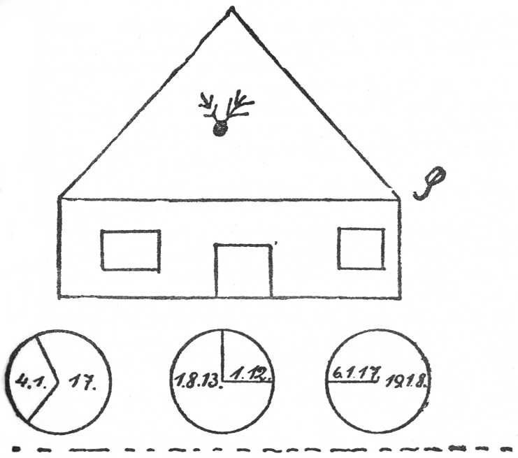

<@pagebreak 33/>

<h1>Das Geheimnis der Oase Fartah.</h1>

<h2>1. Kapitel.</h2>

Im Speisesaale des Schlosses Medsur (fünf Tage hatten
genügt, sämtliche Spuren der Plünderung zu beseitigen) saßen
wir zu sechs an der Tafel: Lady Lydia Pimberton als Hausfrau
an der einen Schmalseite; links von ihr Harald Harst;
neben diesem Frau Hauptmann Mac Lean, deren Gatte, ihnen
gegenüber Leutnant Sidney Jones und ich.

Das Gespräch drehte sich um die letzten, leider so blutigen
Ereignisse. Lady Lydia war ernst und beteiligte sich wenig an
der Unterhaltung. Einmal ging ihr die Ermordung ihrer
Dienerschaft sehr nahe; dann aber wußte sie, daß Harald heute
den letzten Tag unter ihrem Dache weilte. Wir wollten morgen
früh Leutnant Jones vom Kamelreiterkorps ins Innere
der Halbinsel Sinai begleiten, wo er mit zehn Leuten zwei
aus dem Gefängnis in Suez entsprungene internationale Hochstapler
und Hoteldiebe suchen sollte, die offenbar zu einem der
Beduinenstämme geflüchtet waren.

Durch eine Bemerkung Hauptmann Mac Leans über die
Oasen der Sinai-Wüsten wurde ich an das zerfetzte Buch erinnert,
in dem ich auch einen Hinweis auf eine Oase namens
Fartah gefunden hatte, die nach alten, unter den Wüstenstämmen
fortlebenden Überlieferungen die Ruinen einer Stadt
aus der ältesten ägyptischen Kulturepoche enthalten sollte.

Da die Mahlzeit bereits vorüber war und wir Herren den
üblichen Nachtisch in Gestalt einer Zigarre oder Zigarette genossen,
erhob ich mich und stieg in die Kellerräume hinab, fand
auch den schon etwas antiken Schmöker und las dann an der
Tafel den Abschnitt über die Oase vor.

Hauptmann Mac Lean erklärte, als ich damit fertig war:

»Es ist das nichts als eine Sage. Ich habe die Sandebenen
der Sinai-Halbinsel doch bereits nach allen Richtungen
durchkreuzt. Diese Oase existiert nicht.«

Leutnant Sidney Jones, ein junger, sehr sympathischer
Engländer, räusperte sich und meinte bescheiden.

»Doch — es gibt eine solche Örtlichkeit.«

<@pagebreak/>
»Na nu, Jones,« rief Mac Lean. »Das wollen Sie behaupten,
der erst ein halbes Jahr hier beim Korps Dienst
tut?!«

Der blonde Leutnant winkte einen der Soldaten heran,
die bei Tisch bedient hatten. Es war sein Bursche, ein Araber
aus der Gegend von Damaskus.

»Hafid, was weißt Du über die Oase?« fragte er ihn.

»Mein Vater,« erklärte der stattliche Reiter mit fester
Stimme, »war Händler. Er hat mir erzählt, daß er einst mit
seinen beiden Maultieren die Beduinen hier auf der Halbinsel
besuchte. Er verirrte sich und kam schließlich durch ein Gebiet
von wandernden Sandbergen. Plötzlich gewahrte er eine Oase
in der Ferne, daneben eine Reihe von eingestürzten Häusern.
Ein Sandsturm, der sich dann erhob, zwang ihn, eine andere
Richtung zu nehmen. So kam es, daß er jene Oase nur gesehen,
aber nicht besucht hat.«

»Eine Fata Morgana, eine Luftspiegelung,« sagte Mac
Lean lächelnd. »Das ist kein Beweis für die Existenz der
Oase Fartah und der Ruinenstadt. — Übrigens fällt mir da
etwas ein —«

Er griff in die Tasche und entnahm seiner Brieftasche ein
zerknittertes Blatt Papier.

»Dieses Blatt hat einer der beiden Hochstapler bei seiner
Verhaftung in Suez fortzuwerfen versucht. Detektivinspektor
Greaper gab es mir mit der Bitte, es Ihnen, Mr. Harst, doch
einmal vorzulegen. Er hält es für —«

Harald sagte schon: »Bitte — was Mr. Greaper darüber
denkt, möchte ich zunächst nicht wissen.«

Er betrachtete das Blatt. Aller Augen hingen an seinem
Gesicht. Man erwartete, daß er nun seinerseits eine Ansicht
über dieses Stück Papier äußern würde.

Er zuckte nach einer Weile die Achseln und reichte es mir
mit den Worten:

»Das kann alles Mögliche sein.«

Ich legte das Papier, nachdem ich es auf Art und Güte
geprüft hatte, auf den Tisch, damit auch Lady Lydia es sich
ansehen konnte.

»Ach — ein Haus!« rief sie.

»Schraut — Vortrag!« lächelte Harald. »Mache den
Herrschaften klar, wie wir so etwas besichtigen.«

»Nun,« begann ich mit meiner Weisheit, »das Papier
<@pagebreak/>
ist die Hälfte eines Bogens besten Leinenschreibpapiers und
stammt dem Wasserzeichen nach aus einer deutschen Fabrik.
Die Zeichnung auf der einen Seite des Blattes stellt ein mit
lila Tinte flüchtig durch Striche hingeworfenes Haus dar und
macht den Eindruck, daß eine Kinderhand es hergestellt hat.
Unter dem Hause stehen noch drei Kreise mit Zahlen und
Strichen darin. Die Bedeutung des Ganzen ist so ohne weiteres
nicht zu erklären.« —

Ich will hier die Zeichnung so wiedergeben, wie ich sie auf
dem Blatte fand, nur mit geraden Strichen — bis auf die
Kreise.

So also sah das Ganze aus. — Nun mag der Leser versuchen,
sich zunächst mal selbst eine Ansicht darüber zu bilden. —

Harald schwieg und blickte starr vor sich hin auf seine linke
Hand, an deren kleinem Finger ein Ring mit einem bohnengroßen
Diamant funkelte und sprühte.

Auch Frau Mac Lean ließ sich nun das Blatt reichen.
 
<@pagebreak/>
»Natürlich ein Haus!« meinte sie. »Mitten im Giebel
sieht man ja auch so etwas wie ein Hirschgeweih.«

Dann wieder Stille. Harst saß völlig regungslos. Seine
Augen hatten sich langsam bis auf einen schmalen Spalt geschlossen.
Auf seiner Stirn vertieften sich die drei charakteristischen
Falten. In seiner gleichfalls auf dem Tische ruhenden
Rechten schwelte zwischen Zeige- und Mittelfinger die
Mirakulum-Zigarette unbeachtet weiter und sandte einen feinen
Rauchfaden in die Höhe.

Wieder hingen aller Augen an Haralds gebräuntem bartlosen
Gesicht. Das Schweigen bekam sehr bald etwas Bedrückendes,
Lähmendes. Und doch sagte niemand ein Wort.

Dann — ganz unvermittelt hob er den Kopf, schaute zu
Mac Lean hinüber und bat:

»Erzählen Sie alles, was Sie über die beiden Hochstapler
wissen.«

Ah — der Bann war gewichen. Und die temperamentvolle
Frau Mac Lean rief:

»Wo waren Sie eigentlich mit Ihren Gedanken, Mr.
Harst?«

»In Suez. Ich stellte mir vor, wie der eine Gauner das
Blatt zusammenknüllte und heimlich fortzuwerfen suchte. —
Wer dies versucht, will sich einer Sache entledigen, die entweder
für ihn belastend sein kann oder die er den Augen anderer aus
sonstigen Gründen entziehen will. Es wäre also zu prüfen,
ob das Blatt als Belastungsmaterial in Frage kommt oder
ob die »sonstigen Gründe« vorliegen. — Das alles überlegte
ich mir soeben.«

»Inspektor Greaper hält das Blatt für eine Skizze mit
verborgener Bedeutung,« meldete sich der Hauptmann nun.
»Er meint, es könne ein Haus sein, wo die Gauner vielleicht
wertvolle Beute verborgen haben.«

»So so,« sagte Harald nur. »Also bitte, was wissen Sie
über die beiden.«

»Nicht viel,« erklärte Mac Lean. »Sie waren vor etwa
14 Tagen im Hotel Atlantic in Suez abgestiegen, und hatten sich
als Kaufleute namens Schwertner und Salbing, aus Hamburg,
in das Fremdenbuch eingetragen. Sie trieben sich viel
in der Umgegend von Suez herum. Dann wurde einem anderen
Gast des Atlantic eines Nachts eine Brieftasche mit 2000
Pfund Sterling gestohlen. Die Polizei beobachtete nun auch
<@pagebreak/>
Schwertner und Salbing und stellte fest, daß sie am Vormittag
nach dem Diebstahl zwei gute Reitpferde und ein Packpferd
nebst voller Ausrüstung sowie zwei Gewehre nebst Munition
von einem Händler gekauft und mit einer 100-Pfundnote
bezahlt hatten, die der Bestohlene aus alter Gewohnheit mit
besonderen Zeichen versehen hatte, um zu prüfen, ob
dieselbe Banknote, nachdem er sie ausgegeben, nochmals in
seine Hände gelangen würde. Man verhaftete daraufhin die
beiden in ihrem Hotelzimmer. Hierbei warf Schwertner sehr
geschickt die Papierkugel zum offenen Fenster hinaus. Bei
der ersten Vernehmung verweigerten sie jede Aussage. Aber
ein Gast aus einem anderen Hotel erkannte in ihnen — er
hatte gerade auf der Polizei zu tun — zwei Hoteldiebe, die
kürzlich in Konstantinopel verhaftet worden waren und von
dort entwichen sein mußten. Als die beiden dann nach dem
Verhör in das Polizeigefängnis zurückgeführt werden sollten,
schlugen sie den Aufseher in einem dunklen Gange nieder, gingen
frech durch das Hauptportal auf die Straße und direkt zu
dem Händler, der ihnen gutgläubig die Pferde und Wasser
übergab. Sie flohen dann nach Süden, ließen sich von einem
Araber über den Golf von Suez setzen und entkamen in die
Wüsten der Sinai-Halbinsel.«

»Und das gestohlene Geld?« fragte Harst.

»Wurde bei ihnen gefunden und dem Eigentümer wiedergegeben.«

»Waren sie sonst noch im Besitz von Geldmitteln?«

»Nein. Auch ihre Koffer enthielten nur sandgefüllte
Schachteln und wertlosen Kram.«

»Sprechen die beiden das Englische mit fremdem Akzent?«

»Ja. Ganz wie Deutsche.«

»Darf ich die Zeichnung an mich nehmen, Mr. Mac Lean?«

»Aber bitte — gewiß! — Was halten Sie denn davon?«

»Sehr viel — auch ohne Ihre Schilderung der Vorgänge
in Suez.«

»Was heißt das?«

»Nichts anderes, als daß ich sofort erkannte, daß dies da
kein Haus ist, sondern —«

»Nun, sondern?«

»Eine — Landkarte.«

Frau Mac Lean lachte. »Aber Mr. Harst! Eine Landkarte?!
Wem wollen Sie das einreden?!«

<@pagebreak/>
»Niemandem. — Ich kann mich ja auch irren. Vielleicht
ist es wirklich ein Haus.«

Jetzt log Harald. Ich merkte: er wollte nur nicht mit der
Wahrheit herausrücken!

Er schob das Blatt in seine Brieftasche und fügte hinzu:

»Wenn wir Schwertner und Salbing erst haben, werden
sie uns sagen müssen, ob Sie, Mistreß Mac Lean, oder ich im
Rechte war. Jetzt hat eine Erörterung dieser Frage keinen
Zweck.« —

Gegen elf Uhr abends trennten wir uns von den anderen
Gästen und gingen in unsere Zimmer hinauf. Wir wollten
ja recht früh zusammen mit Leutnant Jones aufbrechen. Harst
hatte zuletzt den Müden und Abgespannten gespielt und doch
nur eins damit bezweckt: er wollte den traurigen Augen Lady
Lydias entgehen! — Sie liebte ihn — liebte ganz aussichtslos.

Wir waren jetzt allein. »Setzen wir uns noch im Dunkeln
ans Fenster,« meinte Harald. »Die Nacht ist so wunderbar schön.
Ich möchte diesen Anblick der mondbeschienenen Berge noch
einmal auskosten. Wir werden ja nie mehr hierher zurückkehren.
Lady Lydia wird Schloß Medsur verkaufen. Wenn ich
nicht Detektiv und ein so unruhiger Geist wäre, würde ich es
vielleicht erwerben — als Ruhesitz für die alten Tage.«

Ich nahm ihm gegenüber in einem Korbsessel Platz. Der
Mond bestrahlte die andere Seite des Schlosses und warf so
einen riesigen, schwarzen, verzerrten Schatten des burgähnlichen
Bauwerks gerade auf einen Teil des Parkes.

Ȇbrigens haben wir heute wieder den Beweis erhalten,
wie seltsam zuweilen Ereignisse mit demselben »Kern« ineinander
greifen,« sagte Harst nun.

»Ich verstehe Dich nicht —«

»So?! Und bist doch daran beteiligt. — Aber, lassen wir
das jetzt —«

Eine kurze Pause. Dann: »Das »Haus« auf der Zeichnung
ist nichts anderes als der 59 000 Quadratkilometer
große, durch den Golf von Suez und den Golf von Akaba umschlossene
viereckige Länderteil, Halbinsel Sinai genannt —«

»Ah — wirklich?« — Ich war in der Tat sehr überrascht.

»Das heißt: nicht das ganze Haus. Nur der Giebel. Den
Unterteil mit den Fenstern und der Tür hat man nur hinzugefügt,
um das Ganze eben als harmloses Häuschen erscheinen
zu lassen. Hättest Du die Zeichnung umgedreht, mein Alter,
<@pagebreak/>
und dann den Buchstaben S an der rechten Giebelecke beachtet,
so wäre Dir dieser Gedanke, es könnte sich um die dreieckige
Halbinsel Sinai handeln, wohl auch gekommen. Denn
dieses S kann ja Suez sein.«

»Hm — dann sind das Wichtigste dabei also wohl die drei
Kreise?«

»Das will ich nicht sagen. Kreise und Dreieck ergänzen sich.«

»Du weißt also bereits ganz genau, worum es sich handelt?«

»Erspare mir jetzt die Antwort, ohne gleich wieder einzuschnappen
und mir Geheimniskrämerei vorzuwerfen. Deine
Freude wird größer sein, wenn Du nachher alles erfährst.«

Ich schwieg und begann zu grübeln. Sollte es mir nicht
gelingen, selbst herauszufinden, worauf Haralds Andeutungen
abzielten?

Zu langem Nachdenken kam ich jedoch nicht. Es klopfte.
Und dann rief Hauptmann Mac Lean durch die Tür hindurch:

»Mr. Harst — noch zu sprechen?«

Ich ging, riegelte die Tür auf und ließ ihn ein.

»Ah — Sie halten noch nächtliche Dämmerstunde,« meinte
Mac Lean mit etwas gezwungenem Lachen. — Ich schob ihn
einen Sessel ans Fenster. Harst reichte ihm das Zigarettenetui,
sagte dazu:

»Ihnen ist noch etwas der beiden Hoteldiebe wegen eingefallen
— stimmt’s?«

»Ehrlich, Mr. Harst, — nicht eingefallen. Ich wollte das
nur vor Leutnant Jones nicht erwähnen. Ich habe nämlich
so etwas mit Ihrer Bekanntschaft renommiert. Ich war dabei,
als Greaper die beiden vernahm. Als sie so verstockt schwiegen,
auch über die Zeichnung, da rief ich ihnen zu: »Das hilft
Ihnen nichts — gar nichts! — Haben Sie schon mal von Harald
Harst etwas gehört? Der befindet sich hier in der Nähe
in Schloß Medsur. Ich werde ihm das Blatt vorlegen, und
dann brauchen wir Ihre Aussage nicht mehr!« — Ich wollte
Ihnen dies nicht verschweigen, Mr. Harst. Es war wirklich
von mir so etwas Renommiersucht. Ein so berühmter Mann
wie Sie, — den Namen nennt man gern!«

»Was sagten denn die beiden hierauf?«

»Nichts. Sie schauten sich nur an. Aber diese Blicke, die
sie austauschten — Hallo — was war denn das eben? Ein
Schuß —? — Da — noch einer — ein dritter —?«

Wir drei beugten uns zum Fenster hinaus.

<@pagebreak/>
»Die Richtung, aus der die Detonationen herüberschallten
läßt sich hier in den Bergen nicht feststellen,« meinte Harald.
»Die Schallwellen werden zu oft zurückgeworfen. Ich denke,
wir gehen trotzdem mal hinaus und befragen die Wachen.«

<h2>2. Kapitel.</h2>

Mac Lean hatte auf den nächsten Anhöhen, weniger aus
Furcht vor einem neuen Überfall, als vielmehr zur Beruhigung
Lady Lydias und seiner Gattin, vier Posten aufgestellt
und zwar gerade an den vier einzigen Pässen, die in das Tal
hinabführten, in dem Schloß Medsur lag.

Wir stiegen dann gerade die Haupttreppe hinab, als Lady
Lydia uns entgegenkam.

»Meine Herren, — die Schüsse?« fragte sie leicht erregt.
»Hoffentlich nicht abermals ein Unheil! Dieses Schloß ist
wirklich wie mit einem Fluche belastet —«

»Wir gehen schon, um uns zu überzeugen, was los ist,
Mylady,« erklärte Mac Lean. »Angst brauchen Sie nicht zu
haben. Mit meinen dreißig Leuten halte ich allen Beduinen
der Halbinsel stand.«

Wir eilten weiter. Am Parktor teilte uns der dort
stehende Posten mit, daß Leutnant Jones mit seinem Burschen
Hafid vor einer Viertelstunde das Schloß verlassen habe, um
die Wachen zu revidieren.

»Verdammt!« rief der etwas polterige Mac Lean. »Wenn
dem Kleinen was zugestoßen sein sollte?! Weiter, meine
Herren, weiter!« Der »Kleine« war Leutnant Sidney Jones.
Er war erst 23 Jahre alt, und Frau Mac Lean »bemutterte«
ihn so etwas.

Der nächste Posten war der am östlichen Paß. Wir hielten
also auf ihn zu. Zum Teil legten wir den Weg im Trab zurück.
Nun ging es eine Schlucht hinauf, hinweg über ein Geröllfeld,
dann ein Anruf durch den Posten.

Mac Lean meldete sich. — Der Kamelreiter, ein schlanker
Araber, trat aus dem Schatten der Felswand hervor. Der
Mann war so aufgeregt, daß er kaum sprechen konnte.

»Dort — dort ist geschossen worden —« stotterte er.

»Waren der Leutnant und Hafid hier?«

»Ja, — sie verfolgten den Beduinen.«
 
<@pagebreak/>
Da mischte sich Harald ein. Mac Leans Art zu fragen
war auch nicht gerade sehr geschickt. — So wurde denn in kurzem
folgendes festgestellt. Der Posten hatte in den höheren
Teilen der Schlucht, die hier den Paß bildete, ein paar Gestalten
bemerkt und auch angerufen. Wie viel Leute es waren,
konnte er nicht sagen. Auf den Anruf hin regte sich nichts
mehr. Dann erschien Leutnant Jones mit Hafid. Gerade als
der Posten von dem Beobachteten dem Leutnant Meldung erstattete,
tauchte ein Beduine etwa fünfzig Meter weiter aufwärts
für wenige Sekunden, vom Monde hell beschienen, auf
und war dann ebenso plötzlich wie in den Erdboden hinein verschwunden.
Der Leutnant und sein Bursche waren sofort auf
den Mann zugerannt. Jones hatte dem Posten noch im Laufen
befohlen, seinen Platz nicht zu verlassen. Die beiden hatten
dann offenbar nach dem Beduinen gesucht, waren immer höher
gestiegen und hatten den im Schatten liegenden Teil der
Schlucht betreten. Der Posten hatte daher von ihnen nichts
weiter gesehen. Gleich darauf fielen die drei Schüsse, offenbar
sämtlich Revolverschüsse dem Knalle nach. Der Posten war
nach oben gelaufen, konnte jedoch nichts Auffälliges bemerken,
fürchtete auch, aus dem Hinterhalt niedergeknallt zu werden.

Wir drei stürmten nun den Paß aufwärts. Im schwarzen
Schatten einiger Felsblöcke fanden wir zuerst Hafid. Er war
tot. Eine Kugel war ihm gerade ins Herz gedrungen. Acht
Meter oberhalb dieser Stelle lag Jones, ebenfalls tot, wie
es zunächst schien. Er hatte eine Schußwunde in der linken
Stirn.

Mac Lean schickte nun den Posten auf Haralds Rat nach
dem Schlosse. Vier Kamelreiter bewachten dann die Stelle,
wo wir die beiden gefunden hatten. Vier weitere trugen die
Toten ins Schloß hinab. Harald wollte erst mit Tagesanbruch
den Paß auf Spuren durchsuchen. Er machte dem Hauptmann
klar, daß eine Verfolgung jetzt in der Nacht zwecklos sei und
daß man nur wichtige Fährten verwischen würde.

Wir kehrten ebenfalls ins Schloß zurück. Hier stellte Harst
fest, daß Jones doch noch lebte. Aber ihn auch am Leben zu
erhalten, war wenig Hoffnung.

Die beiden Damen waren zunächst ganz fassungslos. Lady
Lydia erklärte, sie würde keine Stunde länger als nötig in
diesen fluchbeladenen Mauern bleiben.

<@pagebreak/>
Der arme Jones erlangte nur noch einmal das Bewußtsein
wieder. Harald beugte sich über ihn.

»Können Sie uns irgend etwas über die Leute angeben,
die Sie niederschossen?« fragte er.

Der Leutnant versuchte zu sprechen. Er murmelte auch
ein paar Worte, die jedoch unverständlich blieben.

»Ich verstehe nichts,« sagte Harst. »Mr. Jones — ob Sie
die Kraft zum Schreiben haben?«

Jones hob den rechten Arm, öffnete den Mund und führte
den Zeigefinger mit großer Anstrengung an den rechten Mundwinkel.
Dann sank der Arm herab. Der Körper zuckte; die
Augen verloren den Glanz. — Er war tot. —

Um 1 Uhr legten Harald und ich uns noch für ein paar
Stunden in Kleidern aufs Bett. Ich hatte Harst gefragt,
wie er die merkwürdige Handbewegung des Sterbenden deute.
Und da hatte er erwidert:

»Was fiel Dir auf, als der arme Kleine den Mund so weit
öffnete?«

»Hm — eigentlich waren’s seine Goldplomben,« erwiderte
ich.

»Nun also —«

»Was hat das aber mit seiner Handbewegung zu tun?«

»Gute Nacht, mein Alter. Ich möchte morgen ganz frisch
sein, wenn wir nach Spuren in der Schlucht suchen. Fängt
Du erst mal zu fragen an, dann findest Du kein Ende.« —

Um 4 Uhr war es hell genug, um den Schauplatz der beiden
Morde in Augenschein nehmen zu können.

Harald tat dies allein. Mac Lean und ich hielten uns
stets hinter ihm. Viel zu sehen gab es hier jedoch nicht. Der
nackte Felsboden verriet nichts. Nur etwas hob Harald dort
auf, wo etwa Jones gelegen hatte: ein etwa ½ Zentimeter
langes, zersplittertes Knochenstückchen, in dem ein dünnes
Büschelchen kurzer, heller Borsten steckte.

»Ah — ein Stück einer Taschenbürste,« meinte Mac Lean.

»Vielleicht. — Wenn wir nun noch einen Kugeleinschlag
finden, dann behaupte ich folgendes: Jones hat die Beduinen
an dieser Stelle angerufen und auf sie geschossen, als sie
nicht stehen blieben. Seine Kugel traf jedoch nur die Tasche
des einen, in der — sagen wir — ein Bürstchen steckte. Die
Kugel riß dieses Stückchen der Bürste mit heraus. Dann
knallten die Beduinen Jones und Hafid nieder. Der Kugeleinschlag
<@pagebreak/>
des Schusses des Leutnants muß sich also weiter
oberhalb befinden. Suchen wir danach.«

Mac Lean war’s, der das blaugraue, mit Bleisplitterchen
durchsetzte Fleckchen an einem Steine etwa ein Meter über dem
Boden entdeckte.

»Die Richtung stimmt,« sagte Harald. »Es wird schon
so gewesen sein, wie ich denke.«

Jenseits der Paßhöhe in einem Tale fanden wir eine
Stunde später auch Spuren der Anwesenheit von Pferden.
Wie viele Pferde hier gestanden hatten, war nicht recht zu bestimmen.
Mac Lean meinte, es seien 4—5 gewesen, Harst
schätzte auf 2—3. Jedenfalls hatte man aber den Tieren die
Hufe umwickelt gehabt. Das bewiesen die Stoffäserchen, die
hie und da an rissigen Stellen des Gesteins haften geblieben
waren.

Mac Lean hatte schon in der Nacht zwei Reiter nach Suez
geschickt, um Inspektor Greaper mit seinem Polizeihund herbitten
zu lassen.

Greaper traf erst am anderen Morgen ein. Der Hund
bewährte sich vorzüglich. Wir vereinbarten dann, daß Harald
und ich sofort in Begleitung Greapers und mit fünf Kamelreitern
den Beduinen nachsetzen sollten. — Der Abschied von
Lady Lydia war kurz und von ihrer Seite weniger schmerzlich,
als ich gefürchtet hatte. Sie rechnete eben bestimmt damit, daß
wir sie bald wiedersehen würden. Hätte sie geahnt, daß es ein
Abschied für immer war, wäre sie wohl nicht so gefaßt gewesen.
Nur um eins bat sie Harald: er solle doch ja vorsichtig sein und
sein Leben schonen. — Er versprach es. — Was verspricht
man nicht alles einer Frau, der man den Abschied erleichtern
will! —

Wir beide benutzten wieder unsere früheren Reitkamele.
Der einzige, der ein Pferd ritt, war Tom Greaper. Der Inspektor,
erst unlängst nach Suez versetzt, hatte bisher dienstlich
viel Pech gehabt. Er wollte jetzt die in Suez erlebten Fehlschläge
durch die Ergreifung der Mörder wettmachen und war
deshalb allzu eifrig, auch allzu hoffnungsfroh. Im übrigen
zeigte er sich als liebenswürdiger Gefährte. Nur eine Eigenart
hatte er: allzu großen Rassenstolz! Er behandelte Harald
mit einer gewissen heiteren Überlegenheit, als ob er ihn als
»nur« Liebhaberdetektiv nicht recht ernst nahm.

Wir waren um 10 Uhr von Schloß Medsur aufgebrochen.
<@pagebreak/>
Greaper ritt dann mit dem an einer Leine befestigten Hunde
voran. Der Polizeihund, eine Kreuzung von Bulldogge und
Terrier, führte uns bis zum Spätnachmittag völlig sicher. Dann
stutzte er auf einem langgestreckten Plateau vor einer
terrassenartigen Erhebung. Er begann hin- und herzulaufen. Er
hatte die Fähre verloren. Wir mühten uns bis Dunkelwerden
ab, sie wiederzufinden. Die Kamelreiter, alles langgediente,
erfahrene Leute, versagten genau so. Auch Harald war
ratlos. Es blieb nichts anderes übrig, als zu lagern und bei
Tagesanbruch die Suche aufs neue zu beginnen. Doch auch der
folgende Tag brachte nur Fehlschläge. Greaper behauptete
schließlich, die Flüchtlinge könnten sich von hier aus nur nach
Osten in die Wüste gewandt haben, die wir als helles Sandmeer
von diesen Vorbergen aus in der Ferne schimmern sahen.

Harald widersprach. Ein solcher Ritt ins Ungewisse
hinein sei zwecklos; Greaper solle sich jetzt nur seiner Führung
anvertrauen. — Der Inspektor beharrte bei seinem Entschluß.
So trennten wir uns denn am Morgen.

Als die sechs Reiter und der Hund verschwunden waren,
sagte Harald zu mir: »So, nun haben wir volle Bewegungsfreiheit.
Dieses unbelehrbare polizeiliche Anhängsel störte
mich. Leute, die von sich derart eingenommen sind wie dieser
Greaper, bleiben stets Stümper. Wäre er bei uns geblieben,
hätte er die Mörder bekommen. So wird er sie uns überlassen
müssen.«

»Wie meinst Du das: uns überlassen müssen? — Das
klingt ja genau so, als wüßtest Du, wo die Beduinen jetzt
stecken?«

»Beduinen — hm?! Also auch Du, mein Sohn Brutus?!
Auch Du traust einem Beduinen einen Nagelreiniger zu und
verwechselst ein Stückchen eines solchen mit dem einer Taschenbürste?«

Haralds letzte Sätze, besonders der Nagelreiniger, hätten
jeden stutzig gemacht.

Er hatte das Stückchen polierte Knochenmasse mit dem
Borstenbüschelchen schon hervorgeholt und hielt es mir hin.

»Lieber Alter, das ist ein Teil eines jener Nagelreiniger
aus Knochen, die an den Schmalseiten je eine Reihe Borstenbüschel
und an den Breitseiten eingelassene Feilen, vorn aber
eine Spitze haben. Ein Stück einer Taschenbürste sieht ganz
anders aus. Meinst Du nun, daß ein Beduine sich mit einem
<@pagebreak/>
Nagelreiniger herumschleppen wird? Meinst Du, daß ein
solcher Kulturapparat, falls ihn ein Beduine zufällig findet,
von diesem beachtet werden wird?! — Nein, — behaupte ich.
Der braune Kerl wüßte ja gar nicht, was er damit anfangen
soll.«

»Mag sein,« sagte ich nur.

»Der Nagelreiniger allein besagt nichts — gar nichts!«
fügte Harald hinzu. »Da gebe ich Dir vorkommen recht.« Er
entnahm seiner Brieftasche nun ein Büschel schwarze Haare.
»Da — besieh Dir dies mal. Leutnant Jones hielt es in der
zusammengekrampften Hand, als wir ihn bewußtlos auffanden.«

»Meiner Ansicht nach braune Schafwolle,« erklärte ich.

»Ganz recht. An diesem Wollbüschel klebt aber noch etwas.«

Ja — da war etwas Klebriges, etwas, das ich nun dem
Geruch nach für Harz hielt.

»Es scheint Harz zu sein —«

»Es ist Harz. Man hat es offenbar dazu benutzt, die
Wolle festzukleben. Natürlich als Bart. Daß Jones dieses
Stückchen falschen Bartes in der Hand hatte, läßt sich nur auf
eine Weise deuten. Er wird bei der Suche nach den sogenannten
Beduinen einen der Burschen schon gepackt gehabt haben.
Vielleicht mit der Linken am Burnus, während er ihm mit
der Rechten in der Überzeugung, keinen echten Beduinen vor
sich zu haben, den als falsch erkannten Bart abzureißen suchte.
In demselben Moment schoß ihn ein anderer der Schufte nieder.
— Weißt Du eine bessere Erklärung?«

»Nein. Allerdings nicht.«

»Nun Beweispunkt Nummer drei. — Der sterbende Jones
deutete mit dem Finger, da er nicht mehr sprechen konnte, auf
seine — Goldplomben, behaupte ich. Er tat dies deshalb,
um mir anzudeuten, einer der Mörder habe gleichfalls Plomben
gehabt und fraglos recht auffallende. Dieser »Beduine«
mit den Goldplomben kann nur der gewesen sein, dem Jones
die Wolle wegriß. — So, nun hören die Beweise auf, mein
Alter, und die Kombinationen beginnen. Du siehst jedenfalls,
daß man in unserem Beruf auch außerhalb der kultivierten
Welt Kleinigkeiten beachten muß und »Feinarbeit« liefern
kann. — Also die sogenannten logischen Schlüsse nun, mit denen
Du vielleicht beginnst. Bitte —«

»Es mögen Europäer gewesen sein,« begann ich vorsichtig,
<@pagebreak/>
denn bei Harst weiß man nie, ob man sich nicht gehörig blamiert.

»Etwas wenig, mein Alter. Wir wollen aber zu Ende
kommen. Es waren, glaube ich, — Schwertner und Salbing.
Ich habe Greaper nicht widersprochen, als er behauptete, es
handele sich hier um etwa fünf Pferde, also auch fünf Reiter.
Ich erkläre noch jetzt: es sind höchstens drei Pferde gewesen.
Eins davon kann ein Packpferd sein. Also können die Reiter
sehr wohl die beiden Gauner gewesen sein, die ja mit einem
Packpferd geflüchtet sind.«

Ich gebe zu: dieser Vortrag wurde mir immer interessanter.
Wenn Harald so eine seiner recht verzwickten Theorien
entwickelte, bedeutete das für mich stets einen geistigen Genuß.

»Es entsteht nun die Frage: Was wollten sie verkleidet in
der Nähe von Schloß Medsur?« fuhr er fort und nahm eine
frische Zigarette. »Die Antwort liegt in dem, was Mac Lean
uns über seine »Renommiersucht« erzählte. Er hat den beiden
Hochstaplern gedroht, Harald Harst würde die Zeichnung
schon enträtseln. — Nimm nun mal an, diese Zeichnung hätte
für die Gauner einen großen Wert. Dann werden sie gern
haben feststellen wollen, ob ich, nachdem mir das Blatt vorgelegt
worden war, etwas tun würde, das für sie nachteilig oder
gefährlich werden könnte. Nimm weiter an, sie haben irgendwie
erfahren, daß Mac Lean die Zeichnung mit nach Schloß
Medsur brachte und daß ich dort weilte. Sie wollten nun versuchen,
bis an das Schloß heranzugelangen. Daß Wachen
ausgestellt waren, wußten sie nicht. So laufen sie dem Posten
beinahe in die Arme, und daraus entwickelt sich die Tragödie,
der Jones und sein Bursche zum Opfer fielen. — So kann die
Geschichte gewesen sein. Nein — so wird sie gewesen sein.«

Ich nickte, fragte: »Und weiter?«

»Weiter?! — Nun, aus dem soeben Gesagten kann man
unschwer sich ein Bild von den Charaktereigenschaften dieser
beiden Verbrecher machen. Mein lieber Alter, das sind
Leute, die sich den Wind der Wüste schon gehörig haben um
die Nase wehen lassen. Das sind erfahrene Buschklepper, mit
der Wildnis, mit Pferden, Waffen und allen Schlichen geriebener
Banditen vertraut! Sie sind an dieser Stelle samt ihren
Pferden geradezu spurlos verschwunden. Auch ich habe nicht
das geringste von einer Fährte entdecken können.«

»Ja, — es müssen Leute sein, die ihre Wildwest-Erfahrungen
<@pagebreak/>
hinter sich haben,« erklärte ich eifrig. »Und aus dem,
was ich nun weiß, Harald, läßt sich als wichtigstes folgendes
herausschälen: sind es Schwertner und Salbing, so werden sie
uns auch jetzt nicht aus den Augen lassen!«

»Bravo! Bravo, mein Alter! Siehst Du, genau derselben
Ansicht bin ich auch! Sie werden uns aber nicht nur nicht
aus den Augen lassen, sondern sogar, falls sie merken, daß ich
das Geheimnis ihrer Landkarte entdeckt habe, uns — auszulöschen
versuchen. Wir wollen daher den besseren Teil der
Tapferkeit wählen und — vorsichtig sein, die Berge meiden,
Greaper in die Wüste folgen, dann aber nach Norden abschwenken,
da ich diese Oase« — er holte eine Spezialkarte
der Halbinsel Sinai hervor, die ihm Lady Lydia mitgegeben
hatte — »zunächst erreichen will.« Er tippte mit dem Finger
auf einen Punkt der Karte. »Sie heißt Dar Dschumieh und
liegt, wie Du siehst, etwa 30 Meilen südöstlich von Suez. Haben
wir erst Dar Dschumieh, dann finden wir nach dem Kompaß
und nach den geheimen Angaben des Blattes auch den
Weg nach —« — eine Pause — »nach der sagenhaften Oase
Fartah —!«

<h2>3. Kapitel.</h2>

Er stand auf, ging schnell zu unseren Tieren und legte ihnen
die Sättel auf.

Ich saß eine Weile regungslos da.

Fartah — Fartah! — Ich glaubte erst, falsch gehört zu
haben. Aber er hatte Fartah gesagt, wirklich Fartah!

Ich eilte zu ihm hin.

»Hilf mir! Wir müssen bis Mittag recht weit gekommen
sein,« rief er sofort. Ich merkte, er wollte nicht, daß ich weitere
Fragen an ihn richtete.

Gegen elf Uhr stießen wir auf ein Nomadenlager. Der
Beduinenscheich war höflich und erklärte bereitwilligst, daß wir
bis zur Oase Dar Dschumieh noch anderthalb Reitstunden hätten.
Nach kurzer Rast ritten wir weiter. Als wir in welliges
Gelände kamen, suchte Harald mit seinem Fernglas hinter
uns den Horizont ab. Er spähte nach Schwertner und Salbing
aus — aber umsonst.
 
<@pagebreak/>
Die Spuren im Sande mehrten sich jetzt. Förmliche
Wege waren hier in der Nähe der Oase ausgestampft.

Gegen 1 Uhr mittags tauchte die in einer weiten Senke
liegende Oase auf. Diese zieht sich mit ihren Palmen und
Gebüschgruppen etwa eine Viertelmeile von Nord nach Süd entlang.
Im Norden befindet sich ein seeartiger Teich und ein
Beduinendorf mit etwa 500 Einwohnern, die seßhaft geworden
sind. Ein armenischer Händler sprach uns auf englisch an
und führte uns zu dem Dorfältesten. Wir kauften noch vier
Wasserschläuche, Hirsebrot und gedörrtes Hammelfleisch. Um
vier Uhr nachmittags verließen wir die Oase und ritten eine
Viertelstunde nach Osten zu. In einem Wadi, einem tiefen,
steinigen Flußbett, machte Harald halt, nahm seinen Kompaß
vor und orientierte sich, nachdem er noch einen Blick auf die
»Haus-Karte« geworfen hatte.

»Wir werden nun nach Süden abbiegen,« sagte er. »Die
nächste — »Kreisstation« ist für uns der Dschebel (Gebirgs\-
oder Höhenzug) Ahmal, der auf der Spezialkarte Lady Lydias
gleichfalls verzeichnet ist.«

»Kreisstation« hatte er gesagt. Sofort dachte ich an die
drei Kreise unter dem »Hause«. — »Gib mir mal das Blatt,«
bat ich.

»Ist Dir endlich ein Licht aufgegangen, mein Alter? —
Da, nimm. Ja — die drei Kreise! Das ist ja die Hauptsache.
Man kann sagen, es sind drei Kompasse mit je zwei verschiedenen
Nadelstellungen. Beim ersten »Kompaß« läuft der obere
Strich, die Nadel, von der Peripherie nach Südost. Die Zahlen
in der Mitte aber sind für die gleichen Buchstaben des
deutschen Alphabets gesetzt. 4 ist D, 1 ist a, 17 ist r. Das
ergibt Dar, also Oase Dschumieh. Die zweite Nadel des ersten
Kompasses zeigt nach Süden, und die obere des zweiten gleichfalls
nach Süden. Die Zahlen 1, 8, 13, 1, 12 bilden das Wort
»Ahmal«, also Dschebel Ahmal. Dieser Dschebel ist mithin
die zweite Station. Von hier aus soll man, wie die zweite Nadel
angibt, nach Osten reiten. Der dritte Kompaß zeigt mit
seiner einzigen Nadel ebenfalls nach Osten. Die Zahlen 6, 1,
17, 19, 1, 8 sind der Name Fartah. — Als ich damals im
Speisesaale auf Schloß Medsur die Geheimkarte mir ansah,
stieß mir zuerst der Buchstabe S an der rechten Seite des
Giebeldreiecks auf. Dann probierte ich auf gut Glück die Zahlen
4, 1, 17 durch die entsprechenden Buchstaben des deutschen Alphabets
<@pagebreak/>
zu ersetzen, erhielt so »Dar«. Daß es auf der Sinai-Halbinsel
eine Oase Dar Dschumieh gab, wußte ich. Bei diesem
»Dar« mußte mir also bereits die Erleuchtung kommen.
Ich erkannte, was der Giebel des Hauses vorstellen sollte und
was das S bedeutete. Als ich dann so geistesabwesend vor mich
hinstarrte, rechnete ich mir die beiden anderen Zahlenreihen
aus, das heißt, ich vertauschte die Zahlen gegen die Buchstaben.
Du kannst Dir denken, wie »platt« ich war, als ich im
dritten Kreise »Fartah« zusammenstellte. Gerade Fartah —
die sagenhafte Oase! — Nachher in unserem Zimmer sprach ich
davon, wie seltsam häufig »Ereignisse mit demselben Kern«
ineinander greifen. Du verstandest mich damals nicht, obwohl
ich hinzufügte, daß Du daran beteiligt bist. Ich meinte eben
das halb zerfetzte Buch, aus dem Du den Abschnitt über die
Oase Fartah vorlasest, und das Blatt, das die Gauner weggeworfen
hatten. Der »Kern« beider Vorgänge war eben »Fartah«.
— Die Zeichnung ist also ein Wegweiser nach der geheimnisvollen
Oase und in ihrer Art ein kleines Meisterstück.
Kein Uneingeweihter wird so leicht darauf kommen, was sie
vorstellt. Das »Haus« erschwert die Lösung. Jeder denkt
notwendig zuerst an ein Gebäude, verrennt sich in diese Idee
und kommt nicht mehr los davon. — Wir haben jetzt also bis
zum Dschebel Ahmal nach Süden zu reiten und dann von diesem
immer genau nach Osten, denn die zweiten Nadeln der
beiden ersten Kompasse muß man als mit einer Spitze nach
der Kreisperipherie hin versehen sich ergänzen, während die
oberen Nadeln diese Pfeilspitzen gerade umgekehrt erhalten
müssen. Du kannst Dir dies alles am nächsten Lagerplatz genauer
ansehen. Jetzt wollen wir weiter!«

Drei Tage später, gegen Mittag, mußten wir den Dschebel
Ahmal dicht vor uns haben. Wenigstens hatte Harald dies
aus der zurückgelegten Strecke und der auf der Spezialkarte
ersichtlichen Entfernung zwischen der Oase Dar Dschumieh und
dem Dschebel errechnet.

Wir waren inzwischen keiner Menschenseele begegnet. Nur
Wüstenfüchse hatten nachts unsere Lagerplätze umkläfft. Harald
hatte von jeder Bodenerhebung aus auch regelmäßig mit
dem Fernglase nach rückwärts gespäht. Er wunderte sich,
daß von den Gaunern nichts zu spüren war. — »Ich kann mir
nicht denken, daß sie uns nicht folgen,« betonte er des öfteren.

Unser Proviant war nun schon recht knapp. Noch schlechter
<@pagebreak/>
stand es mit dem Trinkwasser. Es war höchste Zeit, daß
wir den Dschebel Ahmal erreichten, wo wir Wasser und auch
wilde Schafe als jagdbares Wild zu finden hofften. — Harst
hatte soeben wieder von einer Kuppe nach dem Dschebel ausgeschaut.

»Nichts,« meinte er. »Nichts! Nur Sandhügel — Sandhügel!
Wir durchqueren hier fraglos die ödesten Teile der
Halbinsel. — Suchen wir einen Platz zum Lagern. Wir müssen
die Mittagshitze meiden. Die Tiere sind schon recht schlapp.
Da vor uns scheint ein Wadi zu sein. Also vorwärts. Dort
gibt’s wenigstens Schatten.«

Harst hatte richtig vermutet. Es gab hier ein felsiges,
ausgetrocknetes Flußbett mit steilen Rändern. Aber — es gab
hier noch mehr.

Gleichzeitig brachten wir unsere Tiere zum Stehen, dicht
am Rande des Abhangs.

Da unten erblickten wir ein Reitkamel, gesattelt, ausgestreckt
wie tot zwischen dem Steingeröll liegen. Und etwa
fünfzehn Meter weiter lag ein Beduine, das Gesicht zum Himmel
gekehrt — regungslos. —

Harald nahm das Fernglas zur Hand.

»Ah — dem Menschen steckt eine abgebrochene Lanze in
der Brust! Sein Gesicht ist scheinbar von einer angetrockneten
Blutkruste völlig bedeckt —«

Wir führten unsere Reitkamele am Zügel in das schluchtartige
Flußbett, näherten uns vorsichtig dem Beduinen. Haralds
Augen waren überall. Dann standen wir vor dem Toten.
Gesicht und Bart waren durch getrocknetes Blut ganz
verklebt.

Harst bückte sich, wollte nach der rechten Hand des Mannes
greifen, um zu fühlen, ob der Puls noch schlug.

Da — wie ein Blitz fuhren die Arme des Beduinen hoch,
umkrallten Haralds Hals. Im gleichen Moment bekam ich
einen Hieb gegen den Hinterkopf, flog vornüber und verlor das
Bewußtsein.

Und ich kam wieder zu mir. Nacht war’s. Die Sterne
funkelten. Ich lag auf dem Rücken, an Händen und Füßen
gefesselt.

Eine neue Ohnmacht. Und wieder erwachte ich. Nacht
wie vorher; wie vorher die Sterne über mir. — Ich richtete
mich mit dem Oberkörper mühsam auf. Die Schmerzen im
<@pagebreak/>
Kopf waren unerträglich. Immer wieder kämpfte ich gegen
eine Ohnmachtanwandlung mit aller Energie an.

Ich sah Tierschatten umherhuschen — dutzendweise. Wüstenfüchse,
die eine Mahlzeit witterten. Ich sah die Ränder
des Wadis. Ich befand mich dort, wo ich von hinten offenbar
mit einem Büchsenkolben niedergeschlagen worden war.

Von Harald keine Spur.

Die Riemen schnitten in die Haut der Handgelenke ein
bei der geringsten Bewegung. Ich war mehr tot als lebendig.
Und — wollte doch leben — wollte frei sein, Harald suchen, —
Harald, der mich so oft schon gerettet hatte, uns beide, wenn
der Sensenmann schon mit der Sense ausholte.

Ich *mußte* frei sein, bevor der Tag anbrach, bevor die
Sonne kam und dieses Tal in einen Backofen verwandelte.

Und ich rollte mich zu einem großen Steine hin, prüfte
seine Kanten mit den Augen, suchte die schärfste aus, rutschte
näher, setzte mich mit dem Rücken vor diese Kante und versuchte
die Riemen durchzuscheuern. Hautfetzen gingen dabei mit; ich
fühlte, wie das Blut mir über die Finger lief. Aber — die
Todesangst steigert die Energie ins Ungemessene.

Endlich hatte ich die Hände frei. Und als es so weit war,
als ich sie nach vorne nahm, sank ich um und wurde abermals
ohnmächtig.

Der Morgen graute. Ich war wieder bei Besinnung,
fühlte mich auch kräftiger. Ich knotete die Riemen an den
Fußgelenken auf, tat taumelnd ein paar Schritte, setzte mich
auf einen Stein, schaute mich um.

Wo war Harald — wo?! — Und dieser Gedanke gab mir
neue Kraft. Ich suchte; ich kletterte den Abhang in die Höhe,
überschaute das Wadi und das Sandmeer.

Nichts — nichts. Nur ein paar Aasgeier hockten dort im
Südteile der Schlucht auf ein paar hohen Felsblöcken. — Aasgeier!
Gab es dort etwas für ihre Freßgier? Vielleicht eine
Leiche — vielleicht Harald? — Ich schritt auf sie zu. Noch
fünfzig Meter. Da stiegen sie krächzend auf.

Und hier fand ich ihn.

Ungefesselt lag er mit ausgebreiteten Armen auf dem
Rücken, die Augen geschlossen.

Ich näherte mich zaudernd. — Mein Gott — tot, tot?
fragte ich mich immer wieder.

<@pagebreak/>
All das, was ich empfand, drängte sich in einem halblauten
Rufe zusammen:

»Tot — er ist tot!«

Ein Wunder geschah: der Tote schnellte empor, hatte die
Augen weit offen, lächelte schwach.

»Schade, mein Alter, Du hast mir die Geierjagd verdorben.
Ich wollte einen der Vögel auf diese Weise fangen, damit
wir — so ekelhaft die Mahlzeit auch ist — etwas Genießbares
hätten. Nun — es wird anderswie Rat werden!«

Er drückte mir die Hand. »So komm’ doch zu Dir. Ich
lebe ja!« meinte er herzlich.

Er lebte! Nun war alles gut. —

Wir setzten uns. Er erzählte. Er hatte gefesselt im südlichsten
Teile des Wadi gelegen, war aufgewacht, hatte ebenfalls
seine Riemen durchgescheuert und sich dann nach mir umschauen
wollen. Hier an dieser Stelle war er jedoch ohnmächtig
wieder umgesunken. Als er abermals zu sich kam, als er wütenden
Hunger und Durst verspürte, als er die Aasgeier auf
den Steinblöcken hocken sah, da hatte er sich tot stellen und einen
greifen wollen.

»Und wer waren die, die uns überfielen?« fragte ich.

»Du denkst natürlich an die richtigen, lieber Alter. Es
werden Schwertner und Salbing gewesen sein. Wer sonst?
Obwohl ich ja nur den »Toten« gesehen habe. — Oh — es war
das ein so raffinierter Streich, wie ihn nur Verbrecher mit
viel Phantasie ersinnen können. Die Komödie war glänzend
inszeniert. — Aber, all das ist jetzt gleichgültig gegenüber der
Tatsache, daß man uns vollständig ausgeplündert hat und
daß wir hier in einer Sandwüste hunderte von Kilometern
von jeder menschlichen Behausung entfernt notwendig — verhungern
und verdursten müssen, wenn wir nicht Wasser und
etwas Eßbares finden.« Seine matte Stimme klang so ernst
und traurig, daß ich sofort merkte: er hielt unsere Lage für
verzweifelt! —

Nein — wir hatten nichts mehr, — nur unsere Kleider!
Und wir saßen hier in einem steinigen, ehemaligen Flußbett
von etwa einer halben Meile Länge. — Harald fragte dann,
ob ich ebenfalls die Wüstenfüchse bemerkt hätte. Ich bejahte.

»Sieh mal, wo diese kleinen Räuber in solcher Menge auftreten,
da muß es in der Nähe Wasser geben. Suchen wir.«
— Nach zwei Stunden befanden wir uns am nördlichsten Ende
<@pagebreak/>
des Wadi. Hier gab es die höchsten Steine, die größten Felsblöcke,
und das Flußbett war kahler, nackter Fels. Überall
hatten wir Wüstenfüchse aufgescheucht. Dann deutete Harald
auf eine Art Fährte, die wie ein blanker Strich in ein Gewirr
von Felsen hineinlief. — »Den Strich haben die Pfoten
der kleinen Bestien gezogen,« sagte er. »Hinein in die Felsen!
Ich wittere Wasser!«

Und wir fanden es, fanden ein Felsloch, eine natürliche
Zisterne, die jeder Regen von frischem füllte und die von Felsen
überdacht war. —

Man denke: zwei volle Wochen blieben wir hier! Wasser
hatten wir. Fleisch lieferten die Füchse, denen wir an der
Zisterne nachts auflauerten und die wir durch Steinwürfe töteten.
Roh verschlangen wir das Fleisch. Als Messer dienten
uns lange Steinsplitter. Es war ein Robinson-Dasein, wie
es kläglicher nicht sein konnte. Wir magerten ab. Selbst ich
wurde schlank. Unsere sonst glatt rasierten Gesichter trugen
Stoppelbärte. Es gab für uns nur eine Hoffnung: daß Beduinen
das Wadi mal besuchen würden! Denn — zu Fuß
durften wir uns ja nicht in die Wüste hineinwagen, um etwa
bewohnte Gegenden zu erreichen. Das wäre sicherer Tod gewesen.

<h2>4. Kapitel.</h2>

Vierzehn Tage! Und nichts als rohes, geklopftes Fleisch
und Wasser! — Alles, was wir bisher erlebt hatten, war ein
nichts gegen dieses Gefängnis dort in der Sinai-Wüste, — ein
Gefängnis ohne Mauern, und doch ein Gefängnis, — eine Insel
ohne Wasserfläche ringsum, und doch eine Insel.

Vierzehn Tage! — Am Morgen des fünfzehnten machten
wir unseren gewohnten Spaziergang um das Wadi herum —
oben am Schluchtrande entlang. Ich döste neben Harald her.
Er erzählte alles Mögliche, nur um mich anzuregen.

Dann — schwieg er, brüllte nun: »Reiter — Reiter, —
zwei Kamelreiter mit drei Packpferden!«

Ich schnellte hoch. Mein Blick überflog die Wüste.

Ja — es waren Reiter! Sie hatten soeben eine Kette
Sandhügel passiert und waren kaum fünfhundert Meter entfernt.

<@pagebreak/>
Harst begann zu laufen, winkte dabei, brüllte wieder, um
die Leute aufmerksam zu machen.

Die Reiter trugen Beduinenmäntel. Sie hielten jetzt,
beobachteten uns. Und Harald rannte ihnen im Galopp entgegen.

Da — mir stockte der Herzschlag! — sie machten kehrt,
ritten zurück, — verschwanden!

Harald stand lange und starrte ihnen nach. Dann kam
er müde durch den Sand gewatet mit hängendem Kopf.

»Sie waren es — sie!« sagte er nur.

»Schwertner und Salbing!« murmelte ich trostlos.

Nach dem frohen Hoffnungsschimmer war die Enttäuschung
desto furchtbarer.

Wir setzten uns auf einen nahen Sandhügel, spähten
dorthin, wo die beiden hinter den Sandkämmen verschwunden
waren. — Vielleicht, dachte ich, vielleicht regt sich in ihnen doch
das Mitleid. Vielleicht kehren sie zurück.

»Sie kommen von der Oase Fartah,« sagte Harald da.

»Sie benutzen denselben Weg. Sie mußten also hier vorüber.
Sie mögen geglaubt haben, wir wären längst tot.« —

Und abermals vergingen vier Tage. Ich konnte das rohe
Fleisch nicht mehr genießen. Es wirkte bei mir wie ein Brechmittel.
Ich fühlte deutlich: es ging zu Ende! Aber — selbst
das war mir gleichgültig. —

Am Spätnachmittag war’s. Ich lag in der Nähe der Zisterne
auf dem kahlen Gestein. Harald schritt auf und ab.
Hin und wieder öffnete ich die Augen. Er ging gebückt wie ein
Greis.

In das gleichmäßige Geräusch seiner schlurfenden Schritte
mischte sich jetzt ein anderes, stärkeres Klappern. Ein jäher
Gedanke. Ich richtete mich auf.

Ein Reiter — ein Mann, der ein Reit- und ein Lastkamel
an das Wadi hinabführte!

Harst eilte zu ihm, sprach mit ihm. Der Mann trug einen
Beduinenmantel, dazu eine Art Turban, hatte einen krausen,
schwarzen Bart und eine fleischige Hakennase. Er ließ jetzt die
Kamele niederknien, entnahm dem einen Korbe des Lastkamels
einen Beutel Datteln, Brot und in große Blätter gewickeltes,
gebratenes Fleisch, näherte sich mir, grüßte in kaum verständlichem
Englisch:

»Guten Abend, Effendi, Du hungerst. Ali Scharka wird
<@pagebreak/>
Dich sättigen. Allah will, daß man den Kranken helfe.«

Harst lächelte mich an. »Siehst Du, mein Alter, — nun
ist doch noch der rettende Engel gekommen.«

Ali Scharka war ein kurdischer Händler, der alle zwei
Jahre hier die Beduinenstämme besuchte und Türkise aufkaufte,
die die Nomaden in den Wadis fanden. Er wollte jetzt
zu einem Stamme, der am Dschebel Ahmal seine Weideplätze
hatte. Er kannte die Zisterne hier, und er hatte seine Wasserschläuche
aufs neue füllen wollen.

Er war ein wortkarger, aber gutherziger Mann. Abends
kochte er über einem Feuer von getrocknetem Kameldünger
Tee. Ich erholte mich schnell. Die Gewißheit, gerettet zu sein,
war der beste Arzt. — Als Waffen führte Ali Scharka eine
doppelläufige Büchse und einen Revolver bei sich. Die beiden
Tragkörbe seines Lastkamels waren bis obenan gefüllt.

Harald war jetzt genau so glänzender Laune wie ich. Ali
Scharka führte sogar Zigarettentabak und -papier bei sich. Harst
rollte sich Zigaretten und rauchte mit geradezu verzücktem Gesicht.
— Dann holte der Kurde ein paar Decken, und wir
streckten uns zum Schlafe aus. Mitten in der Nacht wachte
ich auf. Es hatte jemand mich leicht angestoßen.

»Rühre Dich nicht,« flüsterte Harald da. »Er ist soeben
leise aufgestanden und davongeschlichen. Ich habe bisher kein
Auge zugetan. Ich begreife nicht, was die Schurken jetzt beabsichtigen.«

Mir blieb beinahe das Herz vor Schreck stehen. — Die
Schurken! Das konnte nur —

Harald flüsterte schon weiter:

»Muß der Mensch uns für dumm halten! Ein Kurde will
er sein! Ausgerechnet ein Kurde! Aber er wählte dieses Land
als Heimat, weil er annahm, ich verstände die kurdische Sprache
nicht. Damit hat er ja auch recht —«

»Also Schwertner oder Salbing?« warf ich ein.

»Ja. — Der Kerl öffnet beim Sprechen kaum die Lippen,
weil er — Goldplomben hat. Einmal vergaß er sich trotzdem,
als er rauchte. — Was soll dies nun aber? Weshalb haben
sie uns nicht einfach niedergeschossen, die wir doch wehrlos
sind?! — Oder — weshalb ließen sie uns hier nicht umkommen?!
Weshalb erscheint nur der eine von ihnen als Retter
hier?! — Nein, ich begreife diese Handlungsweise nicht! Man
könnte ja denken, sie wollen uns im Schlaf ermorden. Doch
<@pagebreak/>
— wozu die Umstände, da sie dasselbe mit ein paar Büchsenkugeln
hätten aus der Entfernung besorgen können! Wozu
spielt der Kerl den rettenden Engel?! Ich werde daraus
nicht klug!« Er schwieg. »Die Sache wird immer rätselhafter.
Da, der Kerl hat wahrhaftig sein Gewehr liegen lassen! Das
kann Absicht sein, um uns sicher zu machen. Anderseits ist
es eine Unvorsichtigkeit. Wenn wir nun Verdacht geschöpft
hätten und die Waffe uns aneigneten? Der Beutel mit den
Patronen liegt dicht daneben. — Still — er kehrt zurück!«

Ich lauschte mit geschlossenen Augen. Der Mann bemühte
sich nur wenig, Geräusche zu vermeiden. Er streckte sich
wieder zum Schlafen aus. Bald schnarchte er, atmete ganz tief.

Ich konnte kein Auge mehr zutun. Ich grübelte und
grübelte. Der Gefahr des Verhungerns waren wir entronnen.
Dafür hatten wir nun Menschen zu fürchten, denen
ein Leben nichts galt. — Ich sehnte den Morgen herbei. Die
Sonne kam. Wir erhoben uns. Unser »Retter« bereitete den
Aufbruch vor. Ich mußte das Lastkamel besteigen; Harst das
andere Tier. Ali Scharka ging zu Fuß. — »Wir wechseln uns
beim Reiten ab,« erklärte er. —

Der Tag verging. Abends näherten wir uns dem Dschebel
Ahmal. Der »Kurde« blieb in seinem Verhalten unverändert.
Harst und ich hatten keine Gelegenheit, allein uns auszusprechen.
Wir lagerten in einen Felsentale, in dem es einen
kleinen Tümpel gab. Harst schoß ein Bergschaf, das sich in
das Tal verirrt hatte. Die eine Keule briet über dem Feuer.
Wir saßen und rauchten, wechselten zuweilen ein paar Sätze.
Dann geschah das Merkwürdige. Harst hatte unserem Retter
erzählt, wir seien deutsche Gelehrte, Altertumsforscher,
und Beduinen hätten uns ausgeplündert.

Nun sagte er plötzlich: »Ali Scharka, Du kennst die Halbinsel
Sinai doch recht genau. Ich möchte Dich etwas fragen.
— Bist Du auf dem Ritt nach dem Wadi, wo Du uns fandest,
zwei Leuten begegnet, die Reitdromedare und drei Packpferde
hatten?«

»Ja, Effendi. Ich sprach mit ihnen. Es waren Händler.
Sie sagten es wenigstens. Aber ich glaube es nicht. Es waren
Europäer, Effendi. Sie trugen aber Beduinentracht.«

Wie frech und schlau der Kerl log.

»Ali Scharka,« erklärte Harald nun, »wir sind Dir zu
<@pagebreak/>
großem Dank verpflichtet. Ich bin reich und werde Dich belohnen,
wie Du es verdienst —«

Hm — das war etwas doppelsinnig.

»Mehr noch, — ich werde Dir ein Geheimnis anvertrauen,«
fuhr Harald fort. »Wir suchen eine Oase, in der sich die Ruinen
einer uralten Stadt befinden sollen —«

Der »Kurde« lächelte ein wenig. »Effendi, Du brauchst
nichts mehr zu sagen. Du meinst die Oase Fartah. Die Beduinen
erzählen viel von ihr. Aber der Weg dorthin ist durch
Täler versperrt, in denen der feuchte Sand Mensch und Tier
verschlingt.« Er lächelte wieder. »Es gibt nur einen Zugang
dorthin, Effendi. Ich fand ihn vor sechs Jahren durch einen
Zufall.«

»Ah — Du kennst die sagenhafte Oase,« rief Harst mit
glänzend gespieltem Erstaunen.

Der »Händler« nickte nur.

»Willst Du uns hinführen, Ali Scharka? Wir wollen uns
die Ruinenstadt ansehen. Ich werde Dich gut bezahlen —«

Der »Kurde« schien zu überlegen —

Was sollte dies nun wieder? fragte ich mich. Was hatte
Harald vor? Weshalb begann er von der Oase Fartah zu
sprechen? —

»Gut, Effendi,« erklärte unser Retter. »Wenn Du mir
100 englische Pfund später zahlst, bringe ich Euch hin.«

Der Handel wurde durch Handschlag besiegelt. Am nächsten
Morgen ritt »Ali Scharka« allein davon, um zu versuchen,
irgendwo ein Beduinenlager zu entdeckten und Reittiere für
uns einzuhandeln. Als Waffe ließ er uns für alle Fälle einen
Revolver und ein Messer zurück. Das Lastkamel nahm
er mit. Er wollte zugleich auch Türkise eintauschen.

Kaum war er verschwunden, als ich Harald auch schon
fragte:

»Was bedeutet das alles? — Der Mensch kann es gar
nicht auf unser Leben abgesehen haben! Vielleicht tun wir ihm
Unrecht, vielleicht —«

Harald blickte mich seltsam ernst an. »Sie werden uns
töten. Verlaß Dich darauf. Nur jetzt noch nicht —«

»Sie — sie?! Aber der Mann ist doch allein —!«

»Ja — und der andere reitet beständig hinter uns her. —
Paß auf, Scharka kommt mit zwei Pferden zurück. Die holt er
<@pagebreak/>
eben von dem anderen, indem er auf unserer Spur zurückreitet.«

»Dann — dann werden wir jetzt fliehen, nicht wahr?«

»Im Gegenteil, mein Alter. Wir werden mit Ali Scharka
sehr vergnügt nach der Oase Fartah reiten. Dort findet dann
der letzte Akt der Komödie statt, die — für die beiden ein Drama
wird! Dafür sorge ich schon!« —

Abends kehrte Ali Scharka mit seinen Kamelen und —
zwei Pferden zurück. Harald hatte also das Richtige vermutet.

Kurz nach Mitternacht brachen wir auf. Der fünftägige
Ritt bis zu den Sanddünen, zwischen denen sich überall weite
Triebsandflächen hinzogen, war eintönig und ohne jede Abwechslung.
Als unsere Wasservorräte bis auf den letzten
Tropfen verbraucht waren, hatten wir den Triebsandgürtel erreicht.
Es war dies um die Mittagstunde. — Ali Scharka
führte uns dann über die einzige feste Stelle, die es hier zu geben
schien. Wir hatten die Sanddünen hinter uns. Gegen
Abend erreichten wir felsige Berge, durchquerten sie, hielten
nun auf einem Plateau, das sich allmählich in die Ebene hinabsenkte.

Und dort — dort unter uns, kaum eine Meile noch entfernt,
das liebliche Bild weiter Palmenhaine, davor grüne
Weideflächen, Büsche. Und rechts davon, gleichfalls übergossen
vom rötlichen Lichte der scheidenden Sonne, die Reste der alten
Stadt: Mauern, halbe Türme, eingestürzte Gebäude, — alles
überwuchert von Unkraut.

»Fartah!« sagte unser Retter gleichmütig und deutete dorthin.
»Diese Nacht werden wir in einem Hause aus Felsstücken
lagern —«

<h2>5. Kapitel.</h2>

Der Kurde hatte uns mitten in die Trümmerstätte auf einen
freien Platz geführt, offenbar den Markt der toten Stadt.
Dann waren wir durch ein Hoftor in einen ehemaligen Garten
eingebogen, in dem ein noch beinahe völlig unversehrtes, einstöckiges
Haus stand. Es hatte nur noch leere Tür- und Fensteröffnungen
und vier Räume, in denen sich gleichfalls Unkraut
aller Art eingenistet hatte, dazu Eidechsen, Riesenspinnen
und ein paar kleine Schlangen. Wir säuberten zwei
<@pagebreak/>
Räume ganz gründlich, brachten in dem einen die Tiere unter
und richteten den anderen für uns her.

Bald war aus Steinen ein primitiver Herd aufgebaut.
Harst und der »Kurde« gingen Brennmaterial sammeln, und
ich rupfte ein halbes Dutzend Wildtauben, die Harald in der
Oase vorhin geschossen hatte.

Als die beiden Holzsammler dann zurückkehrten, rief Harald
sogleich (wir sprachen aus Rücksicht auf den »Kurden«
nur englisch):

»Denk’ Dir, ich habe soeben ein zerrissenes Blatt Papier
gefunden mit einer Zeichnung darauf. Da — schau’ es Dir
an —«

Es war — dasselbe Blatt, das Mac Lean Harst gegeben
und das man uns in dem Wadi Fennek gleichfalls abgenommen
hatte. — Ich durchschaute die Sache sofort: natürlich hatte
Ali Scharka es so weggeworfen, daß Harald es finden mußte!
— Was sollte dieser Trick nun wieder? Was beabsichtigte der
»Kurde« damit?

»Ich werde mir die Zeichnung nachher mal ansehen,«
meinte Harald.

»Effendi,« fragte der Scharka-Schurke da, »ich bin nicht
neugierig. Aber — weshalb erkundigtest Du Dich damals
nach zwei Beduinen mit drei Packpferden? — Ich habe heute
hier noch ziemlich frische Spuren von Pferden und Kamelen
bemerkt. Dir werden die halb verwischten Fährten entgangen
sein. Effendi, es sind vor kurzem Leute hier gewesen. Vielleicht
waren es die, nach denen Du damals mich befragtest.«

»Es ist so, Ali Scharka. Außer uns wollten noch andere
Leute hierher und zwar Europäer. Es sind die, denen Du
begegnetest.«

Ali Scharka nickte. »Ich dachte es mir, Effendi. Sie haben
hier das Papier weggeworfen. Wie sollte es sonst hergekommen
sein.«

Der Kerl war wirklich ein raffinierter Komödiant. Seine
biedere Miene machte ihm so leicht niemand nach. —

Die Tauben brieten am Spieß. Wir drei hatten uns aus
Steinen Sitzgelegenheiten aufgetürmt, saßen darauf und schauten
in das Herdfeuer. Harald drehte Zigaretten, rauchte und
gähnte. Unser Scharka-Schurke war noch schweigsamer als
sonst. Die Dunkelheit nahm schnell zu. An den Wänden
huschten Eidechsen hin und her. — Dann war die Mahlzeit
<@pagebreak/>
fertig. Nachher wurde frisches Holz in die Glut geworfen,
und Harst begann nun die in drei Stücke zerrissene Zeichnung
zu prüfen. Es war ein Genuß, ihn dabei zu beobachten. Niemand
hätte ihm angemerkt, daß er längst wußte, was die
Skizze bedeutete. Ganz allmählich entwickelte sich aus seinem
Wortschwall dann der Gedanke, es könnte ich um gar kein
Haus, sondern um die Halbinsel Sinai handeln. Und so
kam er schließlich auch auf die Zahlen und deren Übertragung
in Buchstaben, also auch auf das Wort Fartah und die Bedeutung
der Kompaßnadeln.

Scharka-Schurke hatte sich weit vorgebeugt und blickte starr
auf das Blatt, das Harald auf den Knien hielt.

»Effendi, Du bist klüger als alle, die ich kenne,« sagte
er nun in gut geheuchelter Ehrfurcht. »Alles hast Du an der
Zeichnung erklärt. Nur eins nicht. Da in der Mitte des Dreiecks
steht noch eine seltsame Figur: ein Punkt mit zwei nach
oben gehenden Strichen, an denen wieder kleinere Striche sich
befinden. — Was mag diese Figur vorstellen, Effendi?«

Harald rauchte ein paar Züge. »Ja, das ist schwer zu sagen,
Ali Scharka,« meinte er dann. »Es hat auch kaum Zweck,
sich darüber den Kopf zu zerbrechen.«

»Aber Effendi, — man kann doch nicht wissen, ob diese
Figur nicht sehr wichtig ist. Vielleicht —« Er stockte, räusperte
sich und fuhr fort: »Vielleicht sind dort aus alter Zeit
her —« Er schwieg schon wieder.

»Ich verstehe,« nickte Harald gleichmütig. »Du glaubst,
die Figur könnte der Hinweis auf eine Stelle sein, wo die
Bewohner der Stadt einst ihre wertvollste Habe verbargen —«

»Ja, ja, Effendi, das meine ich. Ich bin gewiß nicht
habgierig, aber — mein ganzes Leben hindurch möchte ich doch
nicht Händler spielen, und —«

»Schon gut, Ali Scharka. Ich werde versuchen, ob ich herausbringe,
was die Figur bedeuten soll.«

»Oh, tu’ es, Effendi, — tu’ es recht bald! Versuche nur.
Dir gelingt ja alles.«

»Da hast Du recht, Ali Scharka. Mir gelingt alles, was
mit den Kräften des Verstandes irgend zu bewältigen ist. Ich
sehe mehr als andere, höre mehr als andere. — Doch, jetzt bin
ich todmüde und will schlafen.« —

Diese Unterhaltung hatte auf mich einen ganz besonderen
Eindruck gemacht. Aus zweierlei Gründen: erstens wußte ich
<@pagebreak/>
ja selbst noch nicht, ob die geweihähnliche Figur im Giebel
wirklich auch noch eine geheime Nebenbedeutung hatte oder ob
es nur ein bloßer Ausputz der Zeichnung war, um der Skizze
mehr das Aussehen eines Hauses zu geben. Zweitens aber
hatte ich das bestimmte Gefühl, daß »Ali Scharka« über diesen
Punkt selbst nicht Bescheid wußte und nun Harald um jeden
Preis veranlassen wollte, diese Frage endgültig zu lösen.

Wir streckten uns nun zum Schlafe aus. Ich war tatsächlich
sehr müde und schlief bald ein. Plötzlich rüttelte jemand
mich. Ringsum war es stockfinster.

»Folge mir,« flüsterte Harald. »Werde munter! Hier
meine Hand. Ich führe Dich. Der Himmel ist dick bewölkt.«

Wir hasteten durch den hinteren Teil des Gartens. Ich
merkte: Harald war diesen Weg schon einmal gegangen. Er
fand sich tadellos zurecht. — Wir kamen über ein paar Höfe
eingestürzter Gebäude.

»Nun ganz leise!« raunte Harst mir zu. »Du wirst durch
eine Fensteröffnung die beiden am Feuer sitzen sehen. Sobald
Du erkennst, daß »unser Ali« Miene macht, aufzubrechen, ahmst
Du das helle Quäken einer Mauereidechse nach. Es schadet
nichts, wenn es Dir nicht recht gelingt. Dann eilst Du an diese
Stelle zurück. Ich finde mich auf das Zeichen hin sofort ein.«

Wir schlichen weiter, bogen um die Ecke eines noch leidlich
erhaltenen Gebäudes. Da — rechter Hand eine Fensteröffnung.
Und dort in dem durch ein großes Feuer erleuchteten
Raume saßen unser Ali und ein Beduine. — Laute Worte
schlugen an mein Ohr, — deutsche Worte!

»Du bist ein Narr, Karl!« sagte der »Beduine« ironisch
auflachend. »Ich wette, der Harst hat Dich längst durchschaut!
Die ganze Geschichte war Blödsinn —!«

»Na, erlaube mal! Ich bin doch auch nicht gerade aus
Dummsdorf, Du! Der Harst hat nichts — nichts gemerkt.
So kann sich kein Mensch verstellen. Er ist völlig harmlos.
Und der Schraut erst recht. Der spricht ja überhaupt nicht
mit. — Wenn Harst das Hirschgeweih mir erklärt hat,
dann —« — Er sprach leiser. Ich konnte leider nicht mehr
verstehen, was er sagte.

»Wenn’s nur glückt,« meinte der Beduine nun. »Weiß
der Teufel — ich werde das Gefühl nicht los, daß uns der Tod
im Nacken sitzt. Seit wir den alten Derwisch in Konstantinopel
<@pagebreak/>
so bis aufs Blut gemartert haben, bis er uns verriet, was
es mit —«

»Hör’ auf davon, Salbing! Du bist der reine Waschlappen
geworden! Gewiß, wir haben seitdem Pech gehabt, sind
beinahe ins Gefängnis gewandert, als wir uns das Reisegeld
besorgen wollten und — Na — Schwamm drüber! Harst
wird der Sache schon ein freundlicheres Aussehen geben —«

»Karl, bedenke, — noch zwei Morde! Das — das ist mehr,
als —«

»Verdammt, mit Dir ist überhaupt nichts mehr los! Meinetwegen
brauchst Du nicht dabei zu sein. Ich besorg’s schon
allein. Auf Dein Konto kommen ja schon die beiden Kamelreiter
im Passe vor Schloß Medsur. Gut — da will ich denn
also —« Abermals dämpfte er die Stimme.

Gleich darauf stand er auf. — Ich machte mich schleunigst
davon, stieß zweimal das helle Quäken der großen Eidechse aus
und traf dann auch richtig mit Harald zusammen. Wir eilten
in unser Quartier zurück legten uns nieder, begannen sofort
tief zu atmen und gelegentlich auch zu Schnarchen.

Unser Scharka-Schurke erschien, tastete sich ziemlich leise
zu seiner Decke hin, räusperte sich, gähnte und fragte dann leise:

»Effendi, bist Du wach?« — Das galt dem neben ihm liegenden
Harst. — Keine Antwort. — Da war er beruhigt und
schlief ein.

Harald war es, der uns beim ersten Morgengrauen weckte,
— Harald, der noch glänzendere Komödiant!

»Auf — auf! Erhebt Euch! Ich habe die Lösung gefunden!«
rief er.

Wir erhoben uns. Ali Scharka fragte sofort: »Effendi,
ist es wahr — ist es wahr?« — Harald lächelte und nickte.

Ich dachte jetzt an die verflossene Nacht. Harst hatte mir
nicht gesagt, weshalb er sich von mir getrennt hatte. — »Das
wirst Du morgen erfahren,« war seine Antwort gewesen. —
Nun wußte ich es: er hatte irgendwie dort in der Nähe des
Quartiers des anderen Schurken nach der Erklärung für das
»Hirschgeweih« gesucht! — Mir wurde etwas bänglich zumute.
Die Entscheidung nahte. Harald hatte mich zwar beruhigt und
gesagt: »Uns wird nichts passieren!« Aber — wir waren
ohne jede Waffe! Was sollten wir gegen die zwei bewaffneten
Verbrecher ausrichten?!

Harald drängte zum Aufbruch. »Kommt — kommt! —
<@pagebreak/>
Ich habe da gestern in den halb verschütteten Straßen des
Marktplatzes Brennmaterial gesucht. Dabei fiel mir auf, daß
von zwei in den Marktplatz mündenden Hauptstraßen
mehrere Nebengassen nicht rechtwinklig, sondern spitzwinklig
abbogen. Ich nehme an, daß die Figur im Giebel der Zeichnung
also das Bild zweier Straßen und ihrer Nebengassen ist,
und daß der Punkt, der Kopf des Geweihs also, vielleicht ein
altes Denkmal andeuten soll, das dort steht, wo die Straßen
in den Markt münden.«

»Effendi — Effendi!« brüllte Scharka-Schurke förmlich.
»So wird es sein! Du bist der weiseste aller Weisen! Laß uns
alles schnell nachprüfen.« —

Nun, diese Prüfung ergab, daß nur zwei Straßen strahlenförmig
den freien Platz schnitten und daß zwischen ihren Endpunkten
einst eine Säule gestanden hatte, die nun in großen
zylindrischen Stücken am Boden lag. Nur der Sockel dieses
Denkmals war noch gut erhalten. Harald fand auch bald an
einer Seite des mit Stufen versehenen Sockels eine Steinplatte,
die ihrer dunkleren Färbung wegen von den anderen
abstach. Sie war etwa ein Meter im Quadrat groß und
nur lose zwischen die übrigen eingefügt. Wir wuchteten sie
hoch. Darunter zeigte sich ein weiter Schacht mit einer Steintreppe.

»Warte, Effendi,« sagte Ali Scharka jetzt sehr aufgeregt.
»Ich hole erst meine Waffen. Man kann nie wissen, was
da unten steckt.«

»Ganz recht. Hole sie nur!« nickte Harald und setzte sich
auf die Stufen des Deckels. Kaum war der Verbrecher verschwunden,
als Harst aus seiner Tasche — eine Clementpistole
hervorzog. »Da, nimm! Das habe ich gestern nacht aus dem
Tragkorbe des Packpferdes Salbings herausgesucht, als Du
Wache standest. Auch meine Pistole habe ich. Und nun —
Achtung!«

Wir warteten. Zehn Minuten vergingen. Da — ein
dumpfer Knall.

Harsts Kopf schnellte hoch. »Schraut, Schraut, — der
Schuft hat seinen Genossen ermordet! Nun — kommen wir
an die Reihe!«

Wieder verstrichen Minuten. Dann hinkte der »Kurde«
über den Markt, rief schon von weitem: »Ich bin gefallen.
Mein Gewehr entlud sich. Ich habe mir das Knie verletzt.«

<@pagebreak/>
Er trug die Doppelbüchse im Arm. Nun war er noch zehn
Schritt entfernt, blieb stehen, lachte plötzlich höhnisch auf:

»Ihr Dummköpfe, Ihr habt’s nicht besser verdient!« Und
— jetzt sprach er deutsch.

Er hob die Büchse, hatte sie schon halb im Anschlag.

Haralds rechter Arm fuhr hoch.

Ein Knall — noch einer.

Der Verbrecher hatte sich zur Seite geschnellt. Nur so
kam’s, daß Harsts zweite Pistolenkugel nicht den rechten Arm,
sondern die Brust traf — das Herz.

Der Mann taumelte, schlug zu Boden. Als wir uns über
ihn beugten, war sein Blick bereits umflort. Gleich darauf
hatte er den letzten Atemzug getan. — Wir eilten sofort nach
dem Versteck Salbings. Er lag vor dem Hause mit einer
Schußwunde quer durch die Brust, röchelte schwer und erlangte
nur noch für Sekunden das Bewußtsein wieder, konnte jedoch
auf keine Frage Haralds mehr antworten. Er starb eine
Stunde drauf. — Die Frage, wie die Verbrecher in den Besitz
der Zeichnung gelangt waren, ist daher auch nie restlos gelöst
worden. —

Wir haben dann die unterirdischen Räume, deren Zugang
die Steinplatte am Sockel der Säule bildete, genau durchforscht.
Diese Räume waren nichts als Katakomben, Leichenkammern,
vollgestopft mit Mumien jeden Alters. Sonst fanden
wir hier nichts. Und dieser Mumien wegen waren die beiden
Verbrecher zu Mördern geworden!

Wir blieben noch acht Tage in der sagenhaften Oase. Dann
machten wir uns auf den Rückweg nach Suez.

In der berühmten Kanalstadt begann für uns dann ein
neues, mehr seltsames als abenteuerliches Problem, für das
einzig und allein als Titel paßt:

*Der Afghan-Teppich.*

