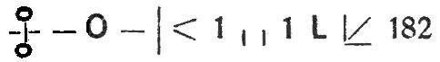

<@pagebreak/>

<h1>Der Acht-Grad-Kanal.</h1>

<h2>1. Kapitel.</h2>

»Die Depesche ist vor einer Stunde eingetroffen,« sagte
Harald Harsts Mutter zu uns, als wir im Flur des Harstschen
Hauses die Mäntel ablegten.

Wir waren soeben aus Birkenwalde heimgekehrt.
Harald hatte mir die Depesche gereicht.

»Da — lies! Das klingt ja unglaublich,« meinte er.
Ich hatte schnell das Telegramm überflogen. Es lautete:

> »Dampfer Mangrovia unserer Reederei mit 122 Singhalesen
an Bord unbekannt wohin zu fraglos verbrecherischen
Zwecken verschleppt. 5000 Pfund Unkostenvorschuß
angewiesen an Deutsche Bank. Bitten Sie höflichst, sofort
zu kommen. — Reederei Maxwell u. Plomp, Liverpool,
Nr. 18.«

»Die Sache dürfte sich in indischen Gewässern abgespielt
haben. Ich denke, wir reisen nach Liverpool,« sagte Harst.

Ich war von dieser Aussicht sehr wenig entzückt und nickte
nur leicht mit dem Kopfe. In diesem Augenblick öffnete sich
wieder die Tür und die Köchin brachte eine neue Depesche.

»Etwas viel!« meinte Harald und öffnete das Telegramm.

Ich beobachtete ihn. Sein schmales, frisches, bartloses
Gesicht veränderte sich für einen Moment. Dann ließ er ein
»So — so!« hören, warf mir die Depesche geschickt in den
Schoß und sagte zu der Köchin:

»Gute Malwine, bring’ mir doch mal das Kursbuch von
meinem Schreibtisch.«

»Was steht denn drin?« fragte mich Frau Harst neugierig.

Ich laß laut vor:

> »Angelegenheit Mangrovia erledigt. Verbindlichst
Maxwell u. Plomp, Liverpool,«

»Na — ein wahres Glück!« seufzte Frau Harst erleichtert.

»Das Glück ist oft trügerisch, Mutter,« meinte Harald und
nickte ihr zu.

<@pagebreak/>
»Was heißt das, Junge?«

»Es ist nicht ausgeschlossen, daß wir uns doch noch mit
dieser Sache beschäftigen müssen. Der Dampfer ist doch sicherlich
schon längere Zeit gesucht worden. Dann hat die Filiale
von Maxwell u. Plomp irgendwo aus Indien an die Liverpooler
Hauptfirma telegraphiert, daß die Geschichte ganz aussichtslos
sei; der Dampfer sei eben nicht zu finden. Maxwell
und Plomp aber mögen in englischen Zeitungen gelesen haben,
daß ich wieder in Berlin bin. Da kabelten sie an mich Depesche
Nr. 1. Es ist nun sehr unwahrscheinlich, daß sie nach
Absendung dieser Depesche günstige Nachrichten aus Indien
über die Mangrovia erhalten haben. Es wäre das doch ein zu
merkwürdiger Zufall. Weit wahrscheinlicher ist, daß der Absender
der zweiten Depesche ein Interesse daran hat, uns
von der Reise nach Liverpool zurückzuhalten. Es kann dies
also ein Mensch sein, der meine Einmischung fürchtet.«

Frau Auguste seufzte.

»Wie wirst Du Dir darüber Sicherheit verschaffen, ob die
Depesche von der Reederei herrührt? Am besten ist
doch, Du telegraphierst.«

»Nein, Mutter. Die Depesche könnte abgefangen werden.
Es gibt einen besseren Weg. Ich fahre morgen früh zur Deutschen
Bank und frage nach, ob die telegraphische Anweisung
von 5000 Pfund von Maxwell und Plomp rückgängig gemacht
ist. Dies hätte die Reederei sicherlich gleichzeitig mit der zweiten
Depesche an mich getan. Geschäftsleute sind in Geldsachen
sehr sorgfältig. Ist bis morgen früh bei der Deutschen Bank
keine Gegenordre eingetroffen, dann ist Telegramm Nr. 2
Schwindel.«

Morgens um 10 waren wir im Gebäude der Deutschen
Bank. Die Anweisung der 5000 Pfund war gestern nachmittag
6 Uhr durch Depesche erfolgt und nicht zurückgezogen
worden.

Um 12 Uhr mittags lösten wir auf dem Potsdamer
Bahnhof unsere Fahrkarten nach Rotterdam, — daß heißt,
es waren äußerlich nicht Harst und Schraut, die Fahrkarten
1\. Klasse forderten, sondern zwei Herren, denen man schon von
weitem die waschechten Engländer ansah und die das Deutsche
echt englisch »kauten«.

Bis Rotterdam, wo wir nachts 1 Uhr eintrafen, passierte
nichts Erwähnenswertes. Wir hatten hier um drei Uhr morgens
<@pagebreak/>
Anschluß an einen Dampfer, der nach Hull an der Ostküste
Englands ging. Von da brauchten wir nur die direkte
Bahnstrecke nach Liverpool zu benutzen.

Das Wetter war scheußlich. Die Nordsee zeigte ihre gröbsten
Tücken. Unsere Antje rollte und stampfte und bekam alle
Augenblicke Sturzseen über Bord. Ich hatte mich sehr bald
hingelegt. Mein Magen war nicht ganz in Ordnung, und ich
fürchtete, seekrank zu werden.

Harald saß in dem kleinen Wohnsalon und studierte englische
Zeitungen, die er in Rotterdam noch schnell gekauft hatte.

Dann kam Harald mit der Zigarette im Munde zu mir
herein, schwenkte in der Rechten ein Blatt von wahrem Riesenformat.

»Hier steht’s mein Alter,« meinte er und setzte sich zu mir
auf dem Bettrand. »Nummer vom 21. August. — Hör’ zu.

> Das Verschwinden eines Frachtdampfers erregt in den
beteiligten Kreisen der Hafenstadt Kolombo auf der Insel Zeylon
großes Aufsehen. Am 5. August hatte die Reederei Maxwell
u. Plomp, Kolombo, auf ihrem Dampfer Mangrovia, einem
Raddampfer ältesten Typs, 122 Singhalesen eingeschifft,
die sie nach einer Plantage in der Nähe von Quilon an der
Westküste Vorderindiens bringen sollte, wohin die Singhalesen
sich auf 2 Jahre als Arbeiter für Zuckerfelder vermietet hatten.
Der Dampfer verließ Kolombo am 5. August morgens mit
neun Mann Besatzung. Der Kapitän, ein langjähriger Angestellter
der Reederei namens Walker, hat diese Gewässer seit
zehn Jahren befahren und gilt als nüchtern und zuverlässig.
Die Mangrovia hätte spätestens am 12. August in Quilon eintreffen
müssen. Am 10. August begegnete sie östlich der Insel
Minikoi der Tourdampfer Kolombo-Bombay. Sie lief also
an diesem Tage einen Kurs, der für einen nach Quilon bestimmten
Dampfer unverständlich ist. Am 13. Aug. fischte der
Dreimaster »Sumatra« etwa an derselben Stelle einen Matrosen
aus der See, der sich in zwei Rettungsringe eingebunden
hatte, die die Aufschrift »Mangrovia« trugen. Der Mann
war bis auf den Tod erschöpft und konnte keinerlei Angaben
mehr machen. Er hatte in der linken Schulter eine Revolverkugel
stecken und einen Dolchstich im linken Ober arm. Er starb
an Entkräftung schon am folgenden Tage. Das einzige, was
er noch kurz vor seinem Tode hervorstammeln konnte, waren
<@pagebreak/>
die Worte: »Gelb — alle tot — entführt —« — Seitdem hat
man von dem Frachtdampfer nichts mehr gehört, obwohl die
indischen Behörden nichts unversucht gelassen haben, die Angelegenheit
aufzuklären. In Kolombo herrscht allgemein die
Ansicht, daß der Frachtdampfer samt den 122 Singhalesen von
Gelegenheitspiraten gekapert worden ist. Er hatte eine wenig
wertvolle Ladung an Bord und war nur mit 20 000 Pfund
versichert.

»Der Bericht genügt,« meinte Harald. »Wir brauchten
eigentlich gar nicht mehr nach Liverpool zu fahren. Maxwell
und Plomp werden uns wohl kaum noch Neues mitteilen können.
Trotzdem müssen wir hin und die Geschichte mit dem
zweiten Telegramm in aller Stille untersuchen.«

Mir war inzwischen so übel geworden, daß ich für nichts
mehr Interesse hatte.

Harald schaute mich an. »Donner noch eins, siehst Du
blaß aus, mein Alter! Kognak gefällig?«

Ich schüttelte den Kopf. »Klingele nach dem Steward.
Ganz starker Kaffee hilft mir am besten.«

Der holländische Steward kam und versprach, im Moment
wieder da zu sein. Harald hatte auch für sich Kaffee bestellt,
nur etwas weniger kräftigen.

Bereits nach fünf Minuten klopfte es. Ein anderer Steward
erschien mit den beiden Tabletts und verschwand dann
wieder.

Wir waren jetzt in ruhigeres Wasser gekommen. Der
Sturm schien auch nachzulassen.

Ich trank voller Gier das Pechschwarze, bittere Zeug. Harald
begann sich zu entkleiden und trank gleichfalls, rauchte
dabei seine geliebte Mirakulum-Zigarette.

Er gähnte mehrmals. Nun saß er auf dem Bettrand
und schnürte die Schuhe auf.

Mit einem Male taumelte er nach vorwärts über und fiel
der Länge nach auf den Teppich, vermochte sich nur noch halb
auf den Händen aufzurichten und lallte.

»Die — zweite — Depesche. Der Absender — hier —«

Das weitere hörte ich nicht mehr.

Ein Schwindel hatte mich gepackt. Dann wußte ich nichts
mehr.

<@pagebreak/>

<h2>2. Kapitel.</h2>

Als ich aus der tiefen Ohnmacht erwachte, fand ich mich
in einem fensterlosen Raume auf einem hölzernen Rahmenbett
liegend wieder. Auf einer Kiste in der Mitte dieses
schmutzigen, niedrigen Loches brannte eine kleine Petroleumlampe
mit Zinnfuß, ohne Glocke und mit nur noch halbem
Zylinder.

Aufrichten konnte ich mich nicht, nur den Kopf drehen.
Die Lampe beleuchtete mir gegenüber an der anderen Längs wand
ein zweites Rahmenbett. Dort — lag Harst, — nur mit
Oberhemd, Unterhosen und Strümpfen bekleidet — wie ich.

Er rührte sich nicht. Er hatte das Gesicht mir zugekehrt
und atmete mit geschlossenen Augen stoßweise und röchelnd.

Ich den Kopf ganz wenig. Dieses Loch enthielt
nichts außer den Betten, der Kiste und der Lampe. Links befand
sich in der Wand eine kaum 1 ¼ Meter hohe Tür aus verrostetem
Eisen, die mit den Rändern weit übergriff.

Allmählich sammelte ich meine Gedanken. Es war ganz
klar: man hatte uns auf der Antje betäubt und dann irgendwie
hierher geschleppt.

Daß dies Abenteuer mit der Mangrovia-Sache zusammenhing,
unterlag für mich keinem Zweifel. Harst hatte ganz
recht gehabt: man wollte verhindern, daß wir uns dieses Falles
annahmen!

Man?! — Wer mochte das sein?! Jedenfalls war sicher,
daß dieser »Man« mit den Leuten die die Mangrovia im Indischen
Ozean hatten verschwinden lassen, in engster Verbindung
stand.

Ich schaute wieder zu Harald hinüber. Ich sorgte mich um
ihn, weil er so stark röchelte.

Ah — was war das?! Er hatte ja die Augen halb offen!
Und — er hielt nun den Zeigefinger auf die Lippen — nur einen
Moment.

Dann lag er wieder da wie zuvor.

Ich atmete auf. Er war bei Bewußtsein! Und — sein
Röcheln war fraglos nur Komödie.

Ich beobachtete ihn. Ich merkte, daß er wie im Schlaf
die Finger der rechten Hand bewegte.

Ich gab genau acht. Wir hatten seit langem eine besondere
Fingersprache für besondere Fälle vereinbart.

<@pagebreak/>
Ich erkannte: er telegraphierte mir etwas zu! Und nach
fünf Minuten wußte ich auch, was:

»Unterstütze Anschein schwerer Erkrankung —«

Ich telegraphierte zurück: »Wird geschehen. Wo sind wir?«

Antwort: »Weiß es nicht.«

Frage: Wer hält uns gefangen?«

Antwort: »Eine Frau. — Jetzt Ruhe.«

Das hieß: ich sollte das Telegraphieren einstellen.

Ich lag still und überlegte. — Eine Frau? Das war
merkwürdig genug.

Da — wieder etwas Neues: ich vernahm an der Wand
etwa in Höhe meines Bettes ein kratzendes Geräusch. Ich
lauschte minutenlang. Dann war ich überzeugt, daß jemand
an der anderen Seite der Mauer den Mörtel aus den Fugen
herauskratzte.

Ich war jedoch noch so erschöpft, daß ich ein schlief, obwohl
ich mich mit aller Gewalt wach zu halten suchte.

Wie lange ich geschlafen hatte, ließ sich nachher schwer
feststellen. Jedenfalls erwachte ich durch einen leichten, sich
häufiger wiederholenden Stoß gegen den rechten Oberschenkel.

Unwillkürlich fuhr meine rechte Hand dorthin. Und —
ich bekam einen dünnen Stock zu packen.

Trotzdem war ich vorsichtig genug, mich jetzt nicht aufzurichten.
Ich behielt dieselbe Lage eine Weile bei, wälzte mich
dann mit dem Gesicht der Wand zu und konnte so erkennen,
was hier eigentlich vorging.

Ich sah in der Mauer ein kleines Loch. Aus diesem Loche
ragte der dünne Stock heraus.

Ich schob den Stock hin und her und ließ ihn dann los.
Er wurde zurückgezogen. Nach einigen Minuten ein leises
Kratzen. Aus dem Loche fielen Mörtelteilchen heraus. Dann
folgte eine mit einem Wollfaden zusammengebundene kleine
Papierrolle.

Ich nahm sie und schob sie unter mein Hemd.

Vergebens wartete ich, daß sich noch etwas ereignen sollte.
Es geschah nichts.

Ich überlegte abermals. Ich mußte das Loch in der Mauer
oberflächlich verstopfen, damit es nicht bemerkt würde. Ich
tastete auf meinem Strohsack umher, fand auch einige Mörtelstückchen
und drückte sie in das Loch.

<@pagebreak/>
Kaum war ich damit fertig, da kreischten auch schon die
Angeln der eisernen Tür.

Ich richtete mich auf, drehte mich halb um. Tief gebückt
trat ein großes, breitschultriges Weib ein, das sich um den
Kopf einen weißen Schleier gewickelt hatte, der auch ihr Gesicht
völlig verhüllte. Das Weib trug einen langen, gelblichen
Gummimantel. In der Rechten hatte es einen Henkelkorb, in der
Linken einen sogenannten Bulldogg-Revolver.

»Ah — munter geworden, Mr. Schraut.« sagte sie auf englisch.
Die Stimme war tief, aber nicht unangenehm. »Ich
bringe ihnen und Mr. Harst hier etwas Eßbares. Mr. Harst
scheint leider krank zu sein. Er hat wohl auf dem Dampfer
etwas viel Kaffee getrunken.«

Sie stellte den Korb neben die Kiste.

»Ich habe hier auch Zitronen und Wasser mit eingepackt.
Flößen Sie ihm doch mal etwas Zitronensaft ein.«

Ich hatte mich auf den Bettrand gesetzt.

»Wollen Sie mir nicht erklären, was all dies bedeutet?«
fragte ich.

»Sie meinen Ihre Gefangenschaft hier? — Das dürften
Sie doch wohl selbst wissen, Mr. Schraut.«

»Mangrovia?«

»Ja — Mangrovia! Wenn Sie nicht Ihr Ehrenwort
geben, Maxwell u. Plomp nie aufzusuchen und Liverpool sofort
wieder zu verlassen, sobald Mr. Harst reisefähig ist, müssen
Sie mindestens ein Jahr hier zubringen. Sie dürfen sich
auch vor Ablauf eines Jahres nicht wieder in Liverpool blicken
lassen und sich auch nicht früher mit der Reederei in Verbindung
setzen.«

Harald stöhnte jetzt so kläglich, daß ich scheinbar erschrocken
aufsprang und rief:

»Her mit den Zitronen und dem Wasser!«

Ich wollte nach dem Korbe greifen. Aber das Weib zielte
auf mich.

»Nähern Sie sich mir nicht! Ich kenne Ihre Gefährlichkeit!
Legen Sie sich wieder auf Ihr Bett. Erst wenn ich draußen
bin, dürfen Sie an den Korb heran.«

Ich flößte Harald ein Glas Zitronenwasser ein. Nach
einer guten Stunde etwa atmete er ruhiger. Dann markierte
er die Wiederkehr des Bewußtseins so vortrefflich, daß jeder
dadurch getäuscht worden wäre.

<@pagebreak/>
Ich stützte ihn und gab ihm wieder zu trinken. Dabei
raunte er mir in Zwischenräumen zu:

»Wir müssen — das Weib — überwältigen. Also —
Achtung, was — ich tue —« —

Es kam anders. Denn nach mehreren Stunden, als die
kreischenden Türangeln Besuch ankündeten, erschien ein —
langer, dürrer Chinese, der in einem blauleinenen Heizeranzug
steckte und in der Linken eine große Laterne und in der
Rechten den Bulldogg-Revolver hielt.

Harald saß jetzt auf jenem Bett und ich neben ihm.

Der Chinese blieb dicht an der Tür stehen.

»Mr. Harst,« quäkte er mit heiserer Stimme, »ob Sie
wollen geben Ihre Ehrenwort, läßt die Miß fragen.

Die Miß läßt noch bestellen an Mr. Harst, daß es gibt
keine Möglichkeit, von hier zu entfliehen. Es ist hier eine
Geheimkeller in eine Haus wo Polizei nie kommt hin.
Mr. Schraut haben gehört die Bedingungen schon —«

Harald starrte vor sich hin.

»Und wenn wir unser Wort geben?« meinte er dann.

»Sie werden alles zurückerhalten, Mr. Harst, alles. Auch
die Koffer. Aber Sie müssen abreisen sofort.«

»Ich will erst mit Schraut beraten,« erklärte Harst da.
»Warte! Es wird nicht lange dauern.«

Dann flüsterte er:

»Ich habe alles beobachtet — den Stock und die Papierrolle.
Ich würde das Versprechen leisten, wenn ich eben nicht
wüßte, daß nebenan ein anderer Gefangener steckt. Sollen wir
den im Stiche lassen?! Das Papier dürfen wir anderseits hier
nicht prüfen. Wir werden ja fraglos beständig beobachtet, und
um das Papier uns anzusehen, müßten wir dicht an die Lampe
heran. — Was also tun?!«

Ich schwieg und sann nach.

»Wenn man herausbekommen könnte, wer dort gefangen
gehalten wird,« meinte ich. »Vielleicht ist es ein ganz gleichgültiger
Mensch —«

»Vielleicht. Aber — vielleicht auch nicht. — Na — versuchen
kann ich’s ja —«

Harald sagte nun zu dem Chinesen:

»Der Steward auf der Antje, der uns den Kaffee brachte,
war einer Eurer Leute, nicht wahr?«

»Ja, Mr. Harst. Alles ganz genau war vorbereitet.
<@pagebreak/>
Unsere Steward, dem Ihr gabt Bestellung auf, wurde von der
Miß gesagt, Ihr nicht wolltet mehr haben den Kaffee. Miß
war schon in Berlin hinter Euch. Hat nachher Kapitän von
Antje gesagt, daß sie ist Freundin von Euch. Hat Euch in Hull
in ihre Wohnung bringen wollen. Alles Lüge — alles vorbereitet.
Ihr in Kisten kamt hier nach Liverpool wie Tote —«

»Ein nettes Bubenstück. Aber es verdient Anerkennung,«
nickte Harald. »Ihr scheint ja hier eine ganze Verbrecherbande
zu sein. Wir hörten dort an jener Mauer vorhin ein
lautes Klopfen. Da habt Ihr wohl noch jemand eingesperrt.«

Der Chinese grinste plötzlich. Es war ein geradezu satanisches
Feixen.

»War jemand eingesperrt, Mr. Harst, war! Ist — gestorben
— soeben! Wollte Mauersteine rausnehmen. Wir nicht
verstehen Spaß —«

Der Kerl warf und jetzt Blicke zu, die deutlicher als lange
Warnungen waren.

Harst murmelte ein: »Mördergesindel!« sagte dann laut:

»Gut — wir geben das verlangte Versprechen.«

Der Chinese nickte eifrig.

»Mr. Harst, sehr klug das von Ihnen. Miß sonst vielleicht
anderes planen —«

Er schlüpfte hinaus, kam sofort mit unseren Kleidern
zurück.

Wir zogen uns an. Harst spielte noch immer den Halbkranken.
Dann sagte der Chinamann:

»Nun Ihr müßt Euch lassen die Augen verbinden, Mr.
Harst. Und erst abnehmen Binde, wenn wird gepfiffen fünfmal.«

Harald nickte nur.

Man führte uns dann über viele Treppen und durch lange
Gänge ins Freie und in einen geschlossenen Wagen, der offenbar
nur mit einem Pferde bespannt war. Nach zweistündiger
Fahrt befahl der Chinese uns, einzeln auszusteigen. Der Wagen
jagte davon. Aus der Ferne nun fünf gellende Pfiffe.

Wir rissen die Lappen vom Gesicht.

Um uns her dunkle Nacht, Bäume, — über uns ein klarer
Sternhimmel,

Neben uns standen unsere Handtaschen. Auf der einen
lag ein Zettel — ein Gepäckaufbewahrungsschein über drei
Koffer — unsere Koffer.

<@pagebreak/>
Nachher stellten wir fest, daß man uns im Seston-Park
im Süden Liverpools abgesetzt hatte.

Wir fanden bald ein Auto, fuhren zum Hauptbahnhof,
lösten unsere Koffer aus und nahmen Fahrkarten nach London.
Hier wandten wir alle möglichen Schliche an, um jeden
Verfolger abzuschütteln, maskierten uns mit Hilfe unseres
reichhaltigen Requisitenkoffers aufs neue und waren drei Tage
drauf in Genua, von wo wir mit einem englischen Passagierdampfer
nach Kolombo reisten — als Mr. Reginald Hopking
nebst Diener Tom Broug. Der Diener war Harald; der reiche
Mr. Hopking war ich. So hatte Harst es gewollt. —

Und — jetzt soll auch das Papierröllchen an die Reihe
kommen.

<h2>3. Kapitel.</h2>

Das Papierröllchen! Es hat uns viel Kopfzerbrechen
gemacht. Es ist ein sehr unscheinbares Blättchen; der Vorderteil
eines Briefumschlages. Die Klappen sind von dem Vorderteil
abgerissen. So ist denn nur das viereckige, auf der
Rückseite hellblau gefärbte Papierstück übriggeblieben.

Auf der Vorderseite ist folgendes zu lesen:

    Miß
            Anna Wilson
                    <em>London</em>
                Postlagernd, Postamt Chelsea.

Als wir auf der Fahrt von Liverpool nach London in unserem
Abteil 1. Klasse dieses Blatt uns ansahen, meinte
Harald:

»Mit dieser Adresse ist gar nichts anzufangen, Wilsons
gibt es in England und Amerika genau so zahlreich wie Müllers
in Deutschland. Und Postamt Chelsea hilft uns erst recht
nichts.«

Um diese Aufschrift brauchten wir uns also nicht weiter
zu kümmern.

Dann aber die blaue Rückseite des 8 mal 12 Zentimeter
großen Blättchens.

Auf diese Rückseite war mit roter Tinte etwas gezeichnet
— etwas, das durchaus einem Bilderrätsel glich. Die Zeichnung
<@pagebreak/>
war sehr sauber ausgeführt und daher sehr deutlich.

Hier ist sie:

Ich will hier wiederholen, was Harald zu dieser Zeichnung
bemerkte.

»Das Ding beginnt mit zwei übereinanderstehenden kleinen
Ellipsen, also Nullen, die durch ein Kreuz, ein Pluszeichen
getrennt sind,« sagte er damals. »Dann kommt ein kleiner,
wagerechter Strich, dann eine größere »Null«. Es folgt
wieder ein kleiner wagerechter Strich, sodann ein senkrechter
von der Größe der »großen Null«. Weiter schließen sich zwei
kleine schräge Striche in Größe der wagerechten an. Dann
folgt eine 1, zwei kleine senkrechte Striche, wieder eine 1, dann
etwas, das ein lateinisches L sein kann, sodann ein nach Südwest
zeigender Pfeil, endlich drei Zahlen, 1, 8, 2, und ein lateinisches
in.«

Hieran knüpfte er folgende Ausführungen:

»Es handelt sich für uns nun um die Frage, ob die Zeichnung
für uns und für das, was wir vorhaben, wichtig ist.
Wenn dies nicht der Fall wäre, brauchten wir uns über das
Rebus nicht weiter den Kopf zu zerbrechen. Aber — es ist
wichtig für uns. Der Mensch, der da neben uns gefangen saß
und den diese Verbrecherbande doch offenbar für alle Zeiten
stumm gemacht hat, muß meines Erachtens gewußt haben, daß
gerade Harst und Schraut seine Nachbarn waren. Denn: weshalb
gab er sich die Mühe, uns lediglich diese Zeichnung zuzustellen?!
Es hat ihm doch fraglos viel Arbeit gemacht, das
Loch in der Mauer herzustellen. Weshalb, muß man sich weiter
fragen, schob er gerade *diese* Zeichnung durch das Loch?
— Nur eine Erklärung ist da möglich: er wußte, wer wir waren;
gerade uns wollte er das Blatt in die Hände spielen, uns,
den Detektiven, denen er sehr wohl zutraute, einem Geheimnis
oder Verbrechen auf die Spur zu kommen. — Die Zeichnung
aber hat er nicht etwa erst in seiner Zelle neben uns hergestellt.
Nein, die hat er bei sich getragen, — heimlich! Die besaß er
schon, bevor er eingekerkert wurde. — Kurz: der Gefangene
war jemand, der irgendwie mit der Mangrovia-Geschichte etwas
zu tun gehabt hat, und dieses Rebus, behaupte ich, ist der Hinweis
<@pagebreak/>
auf den Ort, wohin der Frachtdampfer entführt wurde.
Ueberlege Dir alle Umstände genau, mein Alter, und Du
wirst schwerlich eine einleuchtendere Erklärung finden. Jedenfalls:
wir müssen dieses Rebus unbedingt lösen! Der Erfolg
unserer Fahrt nach Kolombo hängt davon ab.« —

Am 2. November trafen Mr. Reginald Hopking und sein
Diener Tom Broug in Kolombo ein.

Wir mieteten uns in der Nähe des Hafens in der Privatpension
der Madame Trouviere ein. Natürlich nahmen
wir Erdgeschoßzimmer nach dem Garten hinaus. Man kann so
die Fenster nachts als Tür benutzen. Für Leute, wie wir es
sind, ist das wertvoll. Wir hatten zwei nebeneinanderliegende
Zimmer nebst Bad und dunklem Kabinett. Hier schlief mein
»Diener« Tom.

Wir hatten bisher unsere in Liverpool abgegebene ehrenwörtliche
Zusage getreulich gehalten. Jene »Miß«, jenes grobknochige
Weib, hatte nur eins bei der Formulierung jener Bedingungen
vergessen: daß wir auch nicht nach Zeylon gehen und
uns überhaupt nicht mehr um das Schicksal der Mangrovia
kümmern sollten! Das hatten wir nicht versprochen! Hier
hatten wir also völlige Bewegungsfreiheit.

Wir waren nachmittags angelangt. Um 7 Uhr abends
ließ sich Mr. Hopking sich bei dem Polizeidirektor von Kolombo
in dessen Bungalow außerhalb der Stadt melden.

Mr. Jones Barkley war uns fremd. Ich spielte zunächst
den Kaufmann Hopking aus London weiter. Als ich Harald
als meinen Diener vorstellte, machte der Polizeidirektor ein
sehr erstauntes Gesicht.

Wir beide nahmen Platz. Tom mußte stehen. Barkley
war sehr zugeknöpft. Mein Englisch kam ihm wohl etwas
stümperhaft vor — mit Recht!

Was ich hier reden sollte, hatte Harald mir genau vorgeschrieben.

»Mr. Barkley, ich wollte Sie bitten, mir einen Unternehmer
zu empfehlen, der mir 100 singhalesische Arbeiter in
meine Zuckerplantage bei Bangalore besorgt,« begann ich.

Barkleys Augen weiteten sich. Ich merkte: sein Mißtrauen
war erwacht. — Aber er spielte den Harmlosen.

»Sie scheinen hier fremd zu sein, Dr. Hopking.«

»Ja. Und ich möchte einen Unternehmer kennen lernen,
der zuverlässig ist.«

<@pagebreak/>
»Oh — es gibt hier mehrere Leute, die ich Ihnen empfehlen
könnte. Zum Beispiel den Chinesen Tschidlo San.

»Hat dieser auch die durch Maxwell und Plomp beförderten
Singhalesen besorgt? Ach meine die, die nun mit der
Mangrovia verschwunden sind?«

Barkley war ein schlechter Schauspieler. Daß er mich für
ein sehr fragwürdiges Subjekt hielt, merkte ich immer deutlicher.

»Allerdings, Mr. Hopking.«

»Wo wohnt dieser Tschidlo San?«

»Eigentlich ist er Schiffsmakler. Sein Kontor hat er am
Hafen in der Longward-Street 15. Er besitzt aber auch selbst
eine große Plantage zwei Meilen südöstlich von Kolombo. Dort
ist er zumeist anzutreffen.«

Jetzt trat Harald-Tom einen Schritt vor und flüsterte:

»Mr. Barkley, es ist wohl besser, wir lassen die Masken
fallen. Ich muß Sie nur bitten, niemandem, wer es auch sei,
mitzuteilen, wer wir in Wahrheit sind. Ich bin der deutsche
Detektiv Harst, und das da ist mein Freund Schraut. Wir
möchten den Mangrovia-Fall aufklären.«

Barkley erhob sich, und verbeugte sich sehr steif.

»Es ist mir ein Vergnügen, Ihre Bekanntschaft zu machen.
Bitte — setzen Sie sich, Mr. Harst.«

»Ist in der Mangrovia-Angelegenheit etwas Neues an
den Tag gekommen, Mr. Barkley?« fragte Harald.

»Nichts. Sie werden in dieser Sache auch kaum etwas
ausrichten. Der Dampfer ist, wie wir jetzt bestimmt annehmen,
von Gelegenheitspiraten gekapert und ausgeplündert
worden. Die Besatzung und die Singhalesen wird man sämtlich
ermordet haben. Die Mangrovia selbst liegt wohl irgendwo
auf den Meeresgrunde.«

»Die 122 Leute waren wohl für eine Plantage in der
Nähe von Quilon angeworben. Wem gehört diese Plantage?«

»Lord James Drisbane.«

»Hat der Lord auf der Plantage seinen ständigen
Wohnsitz?«

»Nein. Er wohnt hier in Kolombo. — Ich kann nur
wiederholen, daß Ihre Bemühungen zwecklos sind,
Mr. Harst.«

Harald erhob sich schon.

»Wir wollen nicht weiter stören. Ich kann mich wohl
<@pagebreak/>
darauf verlassen, Mr. Barkley, daß Sie unsere Anwesenheit
hier verschweigen.«

Eine knappe Verbeugung als Antwort, dann standen
wir wieder auf dem vom Lichte der sich neigenden Sonne
bestrahlten Villenwege.

»Ein Mann, der England schlecht vertritt,« meinte Harald
in Bezug auf den Polizeidirektor. »Die Briten verstehen
sonst ihre Kolonialbeamten besser wählen.«

Er winkte einen leeren Ponywagen herbei.

»Weißt Du, wo Lord Drisbane wohnt?« fragte er den
braunen Kutscher.

Der Singhalese grinste.

»Jawohl, Master —«

Die Fahrt dauerte keine vier Minuten. Dann hielten wir
vor einer schmiedeeisernen Mauerpforte. Der Kutscher mußte
warten. Ein Diener öffnete und erklärte, Mylord sei zu
Hause.

So lernten wir Lord James Drisbane kennen, anscheinend
einen jener vornehmen, liebenswürdigen Engländer, die nur
einen Hochmut kennen: den Nationalstolz.

Der Lord war Junggeselle. Wir hatten uns bei ihm wieder
als Hopking und Tom eingeführt. Tom war jetzt aber
mein Sekretär. Einen Diener hätte ich doch besser draußen
lassen müssen.

Ich begann die Unterhaltung in derselben Weise wie bei
Barkley. Dann kamen wir auf den Mangrovia-Fall zu
sprechen. Das machte sich so ganz von selbst. Der Lord erzählte,
daß die Geschichte ihm ein gehöriges Stück Geld gekostet
habe. »Kosten und Gefahr des Transportes mußte ich
tragen,« meinte er. »Wenn Sie mit Tschidlo San abschließen,
Mr. Hopking, dann sehen Sie zu, daß diese Punkte geändert
werden.«

»Was halten Sie von dem Makler, Mylord?«

»Ein Ehrenmann, soweit ein Chinese diese Bezeichnung
verdient, reich, gebildet, angesehen.« —

Lord Drisbane schätzte ich auf etwa vierzig Jahre. Er
war hellblond, trug Spitzbart und hatte nur eine unangenehme
Angewohnheit: er blickte beim Sprechen stets an einem vorüber.
Schaute er Harald oder mich an, dann kniff er die Augen
wie kurzsichtig zusammen.

Nachher zeigte er uns noch seinen Bungalow, der sehr
<@pagebreak/>
geräumig war. Der Garten erstreckte sich endlos weit. Ich
habe nie wieder etwas Aehnliches gesehen wie diese Parkanlagen.
Plötzlich standen wir am Anfang einer ja Fächerpalmen-Allee,
die bis zu einer Meeresbucht hinlief. Den Abschluß dieser
Allee bildeten jenseits der Bucht fünf seltsam geformte
Felsen. Auf dem Wasser aber schaukelte eine schneeweiße Schonerjacht.

Dieses Bild, diese Fernsicht die Palmenallee hinunter,
entlockte selbst Harald einen Ruf des Entzückens.

Der Lord lächelte ein wenig. »Sie bewundern diese
Allee,« meinte er. »Und doch ist sie ein Ort des Schreckens,
verknüpft mit blutigen Erinnerungen aus der früheren Geschichte
Zeylons. Dieser Park ist fünfhundert Jahre alt und
gehörte zum Schlosse eines eingeborenen Fürsten. Die Ruinen
des Schlosses liegen dort hinter jenem Wäldchen. Diese
Allee aber —« er machte eine kurze Pause — »diese Allee
nannte man den »Weg der Prüfungen«.« Er deutete nach
rechts und links. Jetzt erst sahen wir, daß sich zwischen den
einzelnen Palmen, versteckt durch tropische Büsche, hohe Eisengitter
befanden, die offenbar vergoldet waren. »Von hier
aus,« fuhr er fort, »wurden die Kriegsgefangenen des Fürsten,
dessen mißliebig gewordene Diener und Frauen durch Panther
mit geringem Vorsprung die Allee entlang gehetzt und — von
den Bestien dann größtenteils zerrissen. So berichtet die
Ueberlieferung. Es wird schon wahr sein. Die Gitter sind ja
derart mit Widerhaken und Spitzen »verziert«, daß niemand
sie erklettern und sich so retten kann.«

Ein unbehagliches Gefühl beschlich mich plötzlich. Mir war
es so vorgekommen, als hätte der Lord die letzten Sätze leicht
ironisch und — drohend gefärbt.

Wir schritten die Allee hinab. Sie war gut 600 Meter
lang. Nirgends zweigte ein Weg ab; überall gab es dieselben
Gitter.

Der Lord erzählte jetzt, daß er morgen für längere Zeit
verreise. »Zunächst will ich nach Quilon. Ich benutze natürlich
meine Jacht Südstern, die Sie dort ankern sehen. Wollen
wir einmal an Bord gehen? Wollen Sie das Schiff
besichtigen?«

»Verzeihung, Mylord, wir haben jetzt wenig Zeit,« sagte
ich schnell. »Wir wollen Ihre Zeit auch nicht länger in Anspruch
nehmen.«
  
<@pagebreak/>
»Mr. Hopking,« fügte Harald hinzu. »Ich erinnere an
die Verabredung mit Mr. Taylor. Es ist bereits nach 8 Uhr.«

Taylor war eine Phantasiefigur. Harst wollte von hier
also ebenfalls schleunigst weg.

Wir kehrten um. Der Lord war jetzt schweigsamer. Dann
meinte er so nebenbei: »Ich werde meine Reise doch wohl noch
um einen Tag verschieben müssen. Wenn die Herren also morgen
mir nochmals die Ehre geben wollen —«

»Gern, Mylord. Verbindlichsten Dank. Wenn es Ihnen
recht ist, kommen wir vormittags gegen zehn Uhr. Dann ist
es noch nicht allzu heiß.«

Gleich darauf bestiegen wir unseren Wagen und fuhren der
Stadt zu.

<h2>4. Kapitel.</h2>

»Nun?« fragte Harald und rückte näher an mich heran.

»Lord Drisbane verdient ein Fragezeichen, schätze ich.«

»Sogar sehr, mein Alter. Es dürfte sich empfehlen, ihn in
dieser Nacht etwas zu beobachten. Er hat uns erkannt, wette
ich. Er weiß, wer wir sind. Und — er spielt auf der Gegenseite.
Wären wir an Bord der Jacht gegangen, dann hätten
wir wohl so einiges erlebt. Der Mensch ist überaus gefährlich.
Eine Weile täuschte er sogar mich durch seine zwanglose
Liebenswürdigkeit. Aber dann kam die Geschichte mit dem
»Wege der Prüfungen«. Da verriet er sich durch —«

»den veränderten Ton,« vollendete ich. »Wenn er uns
erkannt hat, muß er auf unser Erscheinen vorbereitet gewesen
sein.«

»War er auch, lieber Alter. Von Liverpool aus. Wir haben
es hier mit einem netten Wespennest zu tun. Wenn ich nur erst
wüßte, wie das alles zusammenhängt. Der Lord läßt sich durch
den Chinesen 122 Arbeiter besorgen, und dann verschwindet
der Dampfer, der die Leute nach des Lords Plantage bringen
soll, wobei der Lord Geld einbüßt. — Wie stimmt das alles?
Wo sind die 122 Singhalesen geblieben? Wirklich alle tot?!
— Daraus ist schwer ein Reim zu machen. Ja, wenn wir die
Zeichnung entziffern könnten! Ich bin schon ganz nervös von
all dem Grübeln geworden; ich finde die Lösung nicht.«

Wir waren in der Nähe unserer Pension angelangt, stiegen
<@pagebreak/>
aus, und Harald entlohnte den Kutscher. Das dauerte
eine ganze Weile, weil er sich, sehr gegen seine sonstige Art,
dem braunen Singhalesen des Preises wegen herumstritt.

Dann gingen wir die letzten hundert Schritt zu Fuß.

»Richtiges Wespennest,« meinte Harald, »Als ich mich
mit dem Kutscher absichtlich auf die langen Erörterungen einließ,
beobachteten uns zwei Kerle, ein Chinese und ein anderer
Farbiger, den ich für einen Malaien halte. Ich rechnete mit
dieser Ueberwachung. Nur Lord Drisbane steckt dahinter. Daß
Daß wir ihn aufsuchen würden, konnte er ohne weiteres annehmen.
Er ist ja der Arbeitgeber der verschwundenen 122 Leute. Mithin
konnte er auch jemand bereithalten, der uns, wenn wir bei
ihm erschienen, folgte.«

Wir betraten das Fremdenheim und gingen auf unsere
Zimmer, aßen dort zu Abend und schlossen uns nachher ein,
— dies aus dem einfachen Grunde, weil wir uns aus Hopking
und Tom in zwei Eingeborene verwandeln wollten. Unser
Requisitenkoffer enthielt alles, was wir brauchten.

Gegen ½ 11 war es dunkel genug, um ein Fenster als Tür
benutzen zu können. Der Pensionsgarten war leer. Er grenzte
mit seinem hinteren Ende an einen Hafenarm, in dem nur
kleinere Boote und Segeljachten lagen. Zu dem Pensionat
gehörte ein Bootssteg, an dem unter anderem ein kleines offenes
Motorboot befestigt war. Harald stellte fest, daß noch
im vorderen Verschlage eine volle Kanne Benzin sich befand.
Mit einem Motor wußte er gut Bescheid. Nachdem wir uns
noch überzeugt hatten, daß keiner der Spione hinter uns her
war, machten wir von dem Stege los und fuhren langsam auf
die Reede von Kolombo hinaus.

Ich steuerte. Harald gab mir die allgemeine Richtung an.
Wir fanden auch die Bucht der Küste, an deren Westufer die
eigentümlich geformten Felsen standen, die man von der Palmenallee
aus in der Ferne sah. An einer einsamen Uferstelle
unweit der bis ans Wasser hinabreichenden Mauer des Drisbaneschen
Parkes legten wir an. Es war jetzt ½ 12 nachts.
Wir machten das Boot sorgfältig fest, kletterten über die Mauer
und schlichen durch unkrautüberwucherte Wege dem Bungalow
des Lords zu.

Das weißgestrichene Gebäude zeigte nirgends einen Lichtschimmer.
Nur in den Dienerhäusern auf dem Wirtschaftshof
hörten wir noch sprechen. Als wir dann ganz nahe herankamen,
<@pagebreak/>
bemerkten wir links von der Haupttreppe einen kleinen
Kraftwagen. Der Chauffeur, ein Chinese, schlief auf dem Führersitz.

Harald kroch auf die um das Haus herumlaufende Veranda,
kehrte nach zehn Minuten zurück und meldete, daß der
Lord nicht hier sei.

»Und doch hat er Besuch und muß anwesend sein,« fügte
er flüsternd hinzu. »Vielleicht ist Tschidlo San bei ihm. Das
Auto könnte ganz gut dem reichen Chinesen gehören. Hm —
vielleicht sind die beiden auf der Jacht. Dort fühlen sie sich vielleicht
sicherer. — Wollen mal zum Wasser hinab —«

Wir huschten davon. Wir brauchten uns hier nicht allzu
sehr in Acht nehmen. Wie wir den Eingang der Palmenallee
erreicht hatten, zögerte ich etwas. Mir fielen die kurzen Andeutungen
Drisbanes ein über die blutige Vergangenheit dieses
Weges der Prüfungen.

»Du, Harald, — gehen wir lieber außerhalb der Allee entlang,«
raunte ich ihm zu.

Die Allee wurde hier durch eine Säulenhalle begrenzt, die
nur noch zum Teil erhalten war. Wir standen im Schatten
einer der dicken Säulen. Der Mond war gerade hinter den
Wolkenfetzen aufgetaucht.

Das Mondlicht beschien nur die linke Seite der Allee; die
rechte lag im schwarzen Schatten da.

»Gehen wir!« flüsterte Harald, der vorhin auf meine Warnung
nicht geantwortet hatte. »Nimm aber für alle Fälle die
Clementpistole in die Hand. Wir — müssen diesen Weg der
Prüfungen probieren. Es ist ein Wespennest, und ich will
wissen, ob die Viecher wirklich stechen —«

Ich packte seinen Arm.

»Du — Du glaubst, daß — daß man auch hier wieder hinter
uns her ist?« fragte ich schnell.

»Komm’!« sagte er nur. »Wir beide werden auch hier bestehen,
mein Alter —«

Vor uns die lange Allee der Fächerpalmen. Silbern
glänzten die Riesenblätter im Mondschein; silbern schillerte in
der Ferne das Wasser der Bucht. Dort lag auch des Lords
elegante Schonerjacht.

Wir gingen sehr schnell. Harald drehte sich des öfteren
um. Aus ich tat es. Ich hatte das ganz bestimmte Gefühl:
es muß irgend etwas passieren!

<@pagebreak/>
Aber — was wohl, was?! — Der Schweiß lief mir in
Strömen über das braungefärbte Gericht, meine Finger umklammerten
eng den Kolben der Repetierpistole.

Wieder warf ich einen Blick nach rückwärts.

Ich taumelte halb zur Seite.

»Harald!« keuchte ich. »Harald — dort — dort —«

Fünf — sechs — noch mehr schlanke, dunkle Tierkörper
schnellten sich soeben von den Stufen der Säulenhalle in die
Allee hinab, kamen in langen Sätzen näher. Wie Schatten
glitten sie dahin, einige im Mondlicht, andere nur wie schwärzere
Flecken auf der Schattenseite.

Aber! — wir hatten bereits weit über die Hälfte der Allee
hinter uns! — Harald riß mich mit sich fort. Wir rannten.
Wir mußten fliehen. Zwei — drei der Bestien — es waren
zweifellos Panther — hätten wir wohl niedergeknallt. Aber
mit sieben, acht es aufnehmen? — unmöglich.

Harald blickte zurück.

»Schneller, mein Alter, — schneller!«

Ich konnte nicht mehr.

Und dann — die neue, die eigentliche Teufelei.

Die Allee war mit Steinplatten belegt. Diese hatte das
Unkraut hier und da aus der Lage gedrängt; einige standen
halb hoch, andere waren geborsten.

Wir liefen nebeneinander. Harald hätte mir längst voraus
sein können.

Da — der Boden schwand unter unseren Füßen; die
Steinplatten fehlten hier. Wir stürzten in ein Loch hinab —
nicht tief. Und doch schlug ich mit dem Hinterkopf so hart auf,
daß ich für Sekunden die Besinnung verlor. —

Ich saß, fühlte wieder, konnte wieder denken. Ich merkte,
daß Harald mich auf die Schultern geladen hatte, daß er mit
mir, in der Linken die eingeschaltete Taschenlampe, einen gemauerten
Gang entlang entlanglief.

Ich meldete mich:

»Setz mich ab. Ich bin wieder bei Besinnung —«

»Später —«

Er rannte weiter. Der Lichtkegel traf eine abwärtsführende
Treppe. Harst stolperte die Steinstufen hinab.

Die Treppe war zu Ende; wieder ein gemauerten Gang.

Harald hielt mich mit der Rechten fest, schlug abermals
denselben Laufschritt an. Ich fühlte mich jetzt kräftig genug,
<@pagebreak/>
mich freizumachen. Harst ließ mich denn auch hinabgleiten.
Der Lichtkegel schwenkte um, schoß nach rückwärts. Aber wir
sahen nur die letzten Stufen der Steintreppe, nichts weiter.

Wir standen, lauschten und warteten. Nichts geschah:
Totenstille ringsum.

Dann ging es weiter; bis zu einer Stelle, wo der Gang
bis obenan mit Mauertrümmern ausgefüllt war.

»Machen wir kehrt,« sagte Harst, »Ich ahne schon, was
das zu bedeuten hat. Wir werden das Loch, in das wir
stürzten nicht mehr offen finden. Es gibt eben da in der Allee
eine Reihe beweglicher Steinplatten quer über den Weg. Und
diese wird man jetzt wieder geschlossen haben. Wir sind also
aufs neue eingesperrt —«

Wir wanderten zurück. Auch ich hatte meine Lampe eingeschaltet.
Harst beleuchtete die Decke des Ganges. Aber —
diese hatte überall dasselbe Aussehen, bestand aus Steinplatten,
die einen flachen Bogen bildeten. Wir mußten längst die
Stelle erreicht haben, wo wir abgestürzt waren. Der Gang
hatte eine gleichmäßige Breite von 3 Metern und war etwa
4 Meter hoch.

Dann: — eine zweite Schutthalde versperrte uns den
Weg auch nur dieser Seite hin.

»Dacht’ ich’s mir doch!« nickte Harald. »Die Wespen
stechen nicht selbst, sondern wollen dem Hunger und dem Durst
das Henkeramt überlassen. — Kehrt, mein Alter! Die Halunken
sollen sich verrechnet haben.«

Jetzt leuchtete er die Decke ab. Schritt für Schritt ging es
weiter. Dann zeigte Harald auf ein noch grünes Zweiglein
irgend eines Unkrauts, das am Boden vor uns lag.

»Hier ist die Stelle, wo die Platten der Decke beweglich sein
müssen,« flüsterte er. »Aus mit dem Licht!« Er schaltete
seine Lampe aus; ich tat dasselbe. »Setzen wir uns und
warten wir zwei Stunden. Dann erst wollen wir an die
Arbeit gehen.«

Wir saßen im Dunkeln dicht nebeneinander, mit dem
Rücken gegen die Wand gelehnt. Wir unterhielten uns flüsternd
über den Mangrovia-Fall.

»Glaube mir: es handelt sich hier um eine ganz große
Sache,« erklärte Harald unter anderem. »Wenn ein Lord und
ein Chinese sich zusammentun, dann geht’s nicht um Groschen,
sondern um Millionen. Jedenfalls dürfte der Lord mit seinen
<@pagebreak/>
Finanzen nicht ganz in Ordnung sein, und der gelbe Schuft,
der Makler, wird es daher leicht gehabt haben, ihm zu einer
Gaunerei größten Stils zu verführen. Aber — worin besteht
diese Gaunerei?! Ich gebe zu, ich tappe hier völlig im Dunkeln.
Die Zeichnung — die Zeichnung! Wenn wir die erst
entziffert hätten!«

»Und nach einer Weile meinte er: »Wenn man erst den
Anfang so eines Bilderrätsels gelöst hat, kommt das andere
von selbst. — Was soll das: Null plus Null übereinanderstehend?!
— So fängt unser Rebus an. — Sind es wirklich
»Nullen«? Ist das Kreuz wirklich ein Pluszeichen?!«

So versuchte er abermals, der Lösung auf die Spur zu
kommen.

Die Zeit verstrich. Ueber uns, um uns Totenstille und
finstere Nacht. Inzwischen hatte Harald mir auch seinen
Befreiungsplan auseinandergesetzt. Der war so sehr einfach, so
selbstverständlich, — wenn man ihn erst wußte!

»Ich denke, zwei Stunden werden nun verstrichen sein,«
sagte er jetzt. »Fangen wir an —«

Noch im Sitzen schalteten wir gleichzeitig unsere Taschenlampen
ein.

Ein Zufall wollte es, daß die Lichtkegel auf der gegenüberliegenden
Wand zwei weiße Kreise bildeten, die dicht
übereinander lagen und, sich berührend, etwas ineinander
übergingen.

So entstanden an der Wand die Umrisse einer leuchtenden
Acht, — eben zwei sich berührende Kreise.

Nur einen Moment geschah das. Dann bewegten wir die
Hände, und das Bild zerrann, die Lichtkegel glitten anderswohin.

»Halt!« rief Harald jetzt. »Halt! Bleib’ sitzen! Hast Du
soeben die Acht gesehen?«

»Ja —«

Er drückte meinen Arm.

»Du — eine Acht! — Begreifst Du nicht?! Begreifst Du
nicht?!« Er war ganz aufgeregt. »Null ohne Null, — daß
kann heißen: setze die beiden Nullen aufeinander! Und dann
— dann gibt es eben eine Acht! — Daß ich auch nicht früher
an diese Möglichkeit dachte! — Warte mal —«

Er zog die Batterie aus seiner Taschenlampe. Um die
Batterie hatte er das Blatt Papier mit der Zeichnung herumgelegt.
<@pagebreak/>
Er faltete es auseinander. Ich leuchtete. Er starrte
auf das Rebus, rührte sich nicht.

»Ich hab’s — ich hab’s!« rief er dann. »Ich hab’s wirklich!
Oh ich Esel! Die Geschichte ist ja so albern-einfach!
Aber gerade deshalb kam ich nicht darauf!« — Er verbarg die
Zeichnung wieder. »Frage seht nichts. Du sollst den Triumph
des Sieges als Ueberraschung auskosten. Vorwärts! Schleppen
wir Mauertrümmer zusammen, bauen wir einen Berg,
daß wir hier bis an die Deckenplatten heranreichen —«

Das nahm eine halbe Stunde in Anspruch. Dann kletterte
Harald nach oben. Ich beobachtete, wie er sich unter die
Platten stemmte, die er mit dem Nacken drückte.

Sie hoben sich wirklich, und zwar so, daß die Mittellinie
der Gangwölbung breiter und breiter wurde, bis die Platten
senkrecht stehen blieben. — Harald prüfte mit der Lampe in
der Hand, was sich darüber befände. Ich erkannte von unten
dunkle Striche, dazwischen die rauhe Unterseite ähnlicher
Steinplatten.

Die dunklen Striche waren eiserne Stäbe; das Ganze
aber ein Teil des Bodenbelags der Palmenallee. — Es würde
zu weit führen, wollte ich diese Falle hier bis in einzelne beschreiben
und auch schildern, wie Harald den Mechanismus in
Bewegung zu setzen wußte, der die Alleeplatten herunterkippen
ließ. Jedenfalls: wir waren frei, standen nun oben in der
Allee, und Harald ließ die Deckenöffnung sich wieder schließen.

Zehn Minuten drauf lagen wir dicht vor dem Bungalow
des Lords in den Büschen — trotz meiner Warnung vor den
Panthern. Harald hatte dazu nur gelächelt.

Das Auto war nicht mehr da; im Bungalow aber brannte
rechter Hand von der Haupttreppe hinter drei Fenstern Licht.

Wir krochen auf die Treppe zu, die Veranda entlang. Nun
befanden wir uns unter dem ersten erleuchteten Fenster, richteten
uns auf. Die Vorhänge standen drei Handbreit auseinander.
Wir konnten bequem in das große Gemach hineinschauen,
das wir ja bereits kannten. Es war des Lords
Arbeitszimmer.

Lord Drisbane ging in der Mitte vor einem großen Tische,
die Hände auf dem Rücken, langsam auf und ab. Er hielt
den Kopf tief gesenkt.

Hinter dem Tische stand ein Ledersofa. In einer Ecke
saß eine Dame in buntem seidenen Kimono, mit schwarzem,
<@pagebreak/>
hochfrisiertem Haar und einem gelblichen Teint, der auf eine
Eurasierin (Mischling zwischen Europäer und Inderin) hindeutete.
Es war eine sehr stattliche Frau, breitschultrig, —
fast zu kolossal für ein Weib.

»Liverpool!« flüsterte Harald.

Ich verstand: er meinte, es sei das Weib aus dem Keller
in Liverpool.

Die Frau rauchte nachlässig eine Zigarette. An ihrer
Hand blitzten Edelsteine. Das Weib war schön trotz ihrer
Massigkeit.

Der Lord blieb plötzlich vor dem Tische stehen. Die Oberscheiben
der Fenster bestanden nur aus Drahtgaze. So konnten
wir genau hören, was er sagte.

»Anna, zum Schluß werden wir doch die Hereingefallenen
sein, und Tschidlo San wird über die dummen Europäer
triumphieren, die er für seine Zwecke ausgenutzt hat. Auf
keinen Fall lasse ich die beiden da unten verhungern. Sobald
sie genügend mürbe sind, machen wir es wie in Liverpool: Sie
müssen ihr Wort geben, daß sie die Mangrovia-Affäre aus
ihrem Gedächtnis streichen. — Wenn Du nur vorsichtiger beim
Abfassen der Bedingungen gewesen wärest, Anna! Dann hätten
wir diesen Harst hier nicht auf dem Halse. — Ach — hätte
ich mich nie auf den ganzen Schwindel eingelassen! Die verdammten
Börsenspekulationen! Ich —«

Jetzt erst gewahrten wir im Zimmer noch ein paar lebende
Wesen: schwarze Windhunde aus Nepal von jener niedrig
gebauten Art, die so sehr an das Katzengeschlecht erinnert.

Zwei der Hunde, die im Schatten eines Sessels gelegen
hatten, mußten wohl unsere Witterung bekommen haben, erhoben
sich und sogen die Luft prüfend ein.

»Fort!« raunte Harald.

Wir krochen zurück, rannten dann durch den Park der
Mauerstelle zu, wo wir sie vorhin überklettert hatten, waren
sehr bald bei unserem Motorboot, machten es los und kamen
ungesehen in das Pensionat hinein, da wir das eine Fenster
nur angelehnt hatten.

<@pagebreak/>

<h2>5. Kapitel.</h2>

Wir blieben jedoch nicht lange in unseren Zimmern.
Nachdem wir uns in die »normalen« Harst und Schraut zurückverwandelt
und in unsere Handtaschen verschiedenes eingepackt
hatten, schrieb Harald für die Pensionsinhaberin einen
Zettel des Inhalts, daß sie unsere Koffer bis auf weiteres
für uns aufheben möchte. Harst legte in diesen an Frau
Trouviere adressierten Brief ein paar Pfundnoten hinein.
Dann begaben wir uns auf demselben Wege wieder mit unseren
Handtaschen nach dem Bootssteg, machten ein Ruderboot
los und landeten am Kai vor einer Hafenschenke, die wir von
früher her kannten und die die ganze Nacht geöffnet war.

In einem so verkehrsreichen, von Touristen vielbesuchten
Hafen wie Kolombo ist es leicht, ein schnelles Fahrzeug für
einige Zeit zu mieten. — Der Wirt der Schenke wies uns an
einen Seemann, der mit drei anderen in einer Ecke noch beim
Knobelbecher saß.

Dieser Holländer namens Druyter, Klaas mit Vornamen,
war ein Original, wie man es nicht alle Tage trifft. Er hatte
ein braunrotes Gesicht, kleine helle Schweinsäuglein, eine in
allen Farben schillernde Kartoffelnase und einen Riesenbauch,
dem zwei kurze O-Beine als Stützen dienten. Der Schädel
Druyters war ratzekahl. Sein Schifferbart war an den Ohren
grauweiß, unter dem Kinn von Kaffeeresten, Alkohol und Tabaksaft
fuchsig-rot.

Wir nahmen diesen Klaas Druyter beiseite. Harst spendierte
eine Flasche Malaga und Zigarren, und so kam das Geschäft
rasch zustande. Druyter war Besitzer einer Motorjacht,
mit der er reiche Yankees hier spazieren fuhr. Zur Zeit war
er frei. Die Jacht hatte stets Singhalesen als Besatzung und
war als Bark getakelt. Harald mietete die »Padnunna«
(singhalesisch, Seemöwe) auf 14 Tage von sofort und zahlte.
auch gleich 300 Pfund an.

Um 5 Uhr morgens gingen wir an Bord. Wir hatten
Druyter klar gemacht, daß der Vertrag geheim bleiben müsse.
Er benahm sich denn auch sehr klug, so daß wir hoffen konnten,
daß weder der Lord noch der gelbe Makler allzu früh etwas
von dieser Vermietung der Padnunna an zwei Europäer etwas
erfahren würden.

Die Jacht war sehr behaglich eingerichtet. Wir hatten jeder
<@pagebreak/>
eine Schlafkabine, wie wir sie besser nicht wünschen konnten.
Es stand uns ja das ganze Schiff zur Verfügung.

Druyter merkte wohl, daß es sich hier nicht lediglich um
eine Vergnügungsreise handele. Er fragte aber nichts. Unsere
richtigen Namen nannten wir ihm erst, als wir gegen ½ 7 morgens
weit südwestlich von Kolombo im indischen Ozean
schwammen.

Wir standen in dem kleinen Steuerhäuschen der Jacht.
Der dicke Holländer schnellte ordentlich herum, als Harald
sagte: »Käp’ten, — ich bin Harald Harst — dort mein Freund
Schraut.«

Er stierte uns an. Seine Schweinsäuglein weiteten sich.
Dann zog sein Mund sich in die Breite.

»Verdammt!« sagte er auf deutsch, »verdammt — das ist
mal ’ne Freude! — Oh — nun weiß ich auch Bescheid, meine
Herren! Sie jagen irgend ein Wild —«

»Stimmt — die Mangrovia!« nickte Harald.

»Dat ’s ’n rarer Fisch geworden,« meinte Druyter kopfschlackernd.
»Sehr rar! Na — Sie werden ihn ja wohl an ’n
Angelhaken kriegen, Herr Harst! — Verdammt — wie freu’
ich mich! Mit Ihnen so mal durch diesen Tümpel zu gondeln,
— dat ’s doch ’n feinen Spaß!«

Er drückte unsere Hände mit seinen braunen Pranken,
daß ich beinahe Au! geschrien hätte. — Ja, der alte, brave
Klaas Druyter! Wir drei haben dann noch so manches zusammen
erlebt, — mehr, als wir damals ahnen konnten. —

»So, Käp’ten, nun wenden Sie mal,« sagte Harst jetzt.
»Nehmen Sie Kurs hierauf —« Und er hielt ihm lächelnd
»das Rebus« hin.

»He — was soll der Wisch?! Soll das ’ne Karte sein?«

»Was Aehnliches, Käp’ten, was Aehnliches. Ich habe
lange herumtüfteln müssen, ehe ich das Bild da enträtseln
konnte. Schaun Sie mal her. — Diese Nullen und das Kreuz
stellen eine 8 vor. Das fand ich zuerst heraus. Dann mutmaßte
ich, daß der lange, senkrechte Strich und die schrägen Striche
ein K sein sollten, weiter, daß die 1 den ersten Buchstaben des
Alphabets, daß die nächsten kleinen Striche ein
n waren, an das sich wieder eine 1, also a, anschloß —«

»Aha!« brüllte Druyter jetzt, »hab’s schon kapiert! Das
Wort heißt Kanal, und die 8 am Anfang zeigt, daß nur der
Acht-Grad-Kanal gemeint ist, zumal ja die große Null ohne
<@pagebreak/>
Zwang als Gradzeichen, eben als Kreis, angesprochen werden
kann. Der Pfeil hinter »Kanal« zeigt nach Südwest;
die Zahlen werden zusammen mit dem M sehr wahrscheinlich
182 Seemeilen bedeuten, — also 182 Seemeilen südwestlich
dem Acht-Grad-Kanal!«

»Bravo, Käp’ten, bravo! Genau dasselbe habe ich mir
gedacht!« meinte Harald eifrig. »Gibt es nun 182 Seemeilen
nach Südwest Inseln oder dergleichen?«

»Ja — Koralleninseln in Menge, alle unbewohnt. Dazu
Riffe und Untiefen — eine gottverlassene Gegend!«

Ich stand mit einem wenig schlauen Gesicht dabei. Ich
hatte in meinem ganzen Leben nichts von einem Acht-Grad-Kanal
gehört. Druyter sah mir das wohl an, nahm eine Seekarte
vor und tippte mit dem Finger auf die Durchfahrt
zwischen den Inselgruppen der Malediven und Lakkediven an
der Westküste Vorderindiens, sagte dazu: »bitte — das ist der
Acht-Grad-Kanal!«

Dieser liegt nun in einer Höhe mit Kap Komorin, der
Südspitze von Vorderindien. Wir mußten also jetzt beinahe
westlichen Kurs steuern. Der Leser mag auf einer Karte
Asiens das nachprüfen.

Harald weihte den Kapitän in alles ein. Druyter schlackerte
wieder mit dem Kopf. »Herr Harst, glauben Sie wirklich die
Mangrovia dort zu finden?« sagte er.

»Wenn nicht das, dann doch aufzuklären, was mit den
Singhalesen geschehen ist,« erwiderte Harald sehr zuversichtlich.

Drei Tage später tauchten abends am Horizont eine Reihe
Koralleninseln auf.

Es wurde schnell dunkel. Harald befahl, daß die Padnunna
ohne Laternen die Eilande umrundete. Druyter fuhr
der Riffe wegen nur mit halber Geschwindigkeit. Harst und ich
standen mit Ferngläsern auf dem Dache des Steuerhäuschens.
Die Inseln waren teilweise ganz kahl, andere wieder dicht
mit Palmen bestanden. An den Ufern leuchtete überall eine
weiße Brandung.

Wir umrundeten diese Seitengruppe der Malediven erst
nach Norden zu, bogen dann nach Süden um. Eine Stunde
verrann. Wir waren nun in Höhe der südlichsten Eilande,
schwenkten nach Ost um und — gewahrten gleichzeitig die Laternen
eines Fahrzeugs, das nordöstlich von uns auf diese
südlichsten Inselchen zusteuerte.
 
<@pagebreak/>
Der Wind kam von Nordost und trug uns daher deutlich
Motorengeräusche zu. Von dem Schiffe selbst war bei dieser
Dunkelheit nichts als ein schwacher Schatten zu sehen.

»Der Südstern Lord Drisbanes!« flüsterte Harald erregt.
Es kann nur die Jacht sein —«

Wir kletterten an Deck und sprachen mit Druyter darüber.
Der gab Harald recht.

Während wir noch erörterten, was Drisbane hier vorhaben
könnte, kam von Nordost der Knall von mehreren Schüssen zu
und herüber.

»Ran an den Südstern!« rief Harald. »Da ist was im
Gange. Vielleicht geht es jetzt gar dem Lord ans Leben,
vielleicht ist der gelbe Schuft von Tschidlo San mit an Bord.«

Unsere sechs Singhalesen waren sämtlich mit Revolvern
bewaffnet. Aber nur vier waren abkömmlich. Die beiden
Maschinisten mußten bei den Motoren bleiben.

Druyter kannte seine Padnunna. Sie lief fünf Knoten
mehr als der Südstern. So schlichen wir uns denn im Bogen
von hinten an des Lords Jacht heran. Jetzt sahen wir, daß
sie einen Segelkutter im Schlepptau hatte. Wir blieben etwa
2000 Meter hinter ihr. Man bemerkte uns nicht. Der Südstern
mußte mit dem Fahrwasser hier vortrefflich Bescheid wissen.
Er steuerte mitten zwischen die südlichsten Eilande hinein.
Diese, dicht mit Palmenwäldern bedeckt, bildeten in der Mitte
ein seeartiges Becken. Als wir, jetzt näher uns heranpirschend,
in dieses Becken einbogen, gewahrten wir linker Hand, also
nach Süden zu, einige zwanzig Boote, in denen viele Leute sich
bewegten. Fackeln und Laternen beleuchteten dieses eigenartige
nächtliche Bild.

Neben mir ein Ausruf:

»Perlfischer!« — Harst hatte es gerufen. Und er fügte
hinzu:

»Ah — also das ist’s! Man hat die Mangrovia entführt,
um die Singhalesen als Perlfischer zu verwenden — heimlich
nur nachts, damit die Sache geheim bliebe!«

Die Padnunna war jetzt keine fünfzig Meter mehr von
dem Südstern entfernt. Man hatte uns entdeckt. Auf der Jacht
des Lords rannten Leute kopflos hin und her. Wir kamen
Bord an Bord.

Da — ein Schuß vom Südstern her — noch einer.

Harald hatte mich schnell hinter das Steuerhäuschen gerissen,
<@pagebreak/>
schoß jetzt selbst. Von drüben ein gellender Schrei, ein
Angstgeheul.

Und dann war’s, als ob auf den Booten der Perlfischer
plötzlich Furien losgelassen wären. Ein wahnwitziges Brüllen
scholl zu uns herüber.

»Die Singhalesen morden ihre Aufseher, ihre Peiniger,«
sagte Harald ernst. »Da — man erkennt durch das Glas genug,
— es sind alles Chinesen.«

Der Lärm erstarb. Der Südstern trieb steuerlos auf dem
Wasser. Was an Leuten an Bord gewesen, war schwimmend
vor uns geflüchtet. Man hatte uns für ein Polizeifahrzeug
gehalten.

Wir gingen an Bord der Jacht des Lords. Auf dem Achterdeck
lag mit Kopfschuß ein Chinese: der Master Tschidlo
San. Drisbane war nirgends zu finden. —

Am Vormittag wurden dann auf den Inseln noch sechs
lebende Chinesen aufgegriffen. Es mögen mehr gewesen sein.
Aber die zu Perlenfischern gewaltsam gepreßten Singhalesen
werden wohl beim Suchen so manchen heimlich abgetan haben.

Diese Gefangenen waren Kreaturen Tschidlo Sans. Sie
gestanden alles. — Die Mangrovia war von dem Südstern auf
der Reise nach Quilon überfallen und die Besatzung niedergemacht
worden. Die Jacht hatte 32 Chinesen an Bord gehabt,
die als Aufseher für die Singhalesen dienen sollten. Nachdem
man den Dampfer hier zwischen die Inseln geführt und die
Singhalesen ausgebootet hatte, wurde er versenkt. Die Perlenbänke
hatte Tschidlo San schon vor längerer Zeit entdeckt.
Nun ließ er auf die primitivste Art, durch Taucher, sie ausbeuten.
Die Singhalesen mußten allnächtlich ins Wasser hinab
und die Perlenmuscheln abreißen und in Körbe füllen. Diese
Arbeit ist bei größerer Wassertiefe sehr gefährlich. Das Herz
wird überanstrengt, und sehr oft sterben Taucher an Herzschlag.
Von den Singhalesen lebten denn auch nur noch 91. —

Und Lord James Drisbane? Und die Eurasierin Anna
— Anna Wilson? — Auch sie waren tot, ebenso die Bemannung
des Südstern. Die Schüsse, die wir zuerst gehört hatten,
waren von Tschidlo San und seinen sechs chinesischen Verbündeten
abgefeuert worden. Die Leichen hatte man ins Meer geworfen.

Weshalb diese neue Untat? — Sehr einfach? Tschidlo San
fühlte sich seit Harsts Auftauchen in Kolombo nicht mehr sicher.
<@pagebreak/>
Er hatte dort schnell alles zu Geld gemacht, ohne Drisbane
einzuweihen, und wollte nun hier auf den Koralleninseln bleiben,
bis die Perlenbänke ausgebeutet seien, deren Schätze er
nicht mehr mit dem Lord teilen mochte.

Habgier also auch hier wieder die Triebfeder so unerhörter
Verbrechen! Aber auch hier wieder ein versöhnendes Moment:
Die Errettung der 91 Singhalesen aus den Händen ihrer gut
bewaffneten Aufseher, an die sie sich erst herangewagt hatten,
als wir mit der Padnunna auftauchten. —

Etwas an dem Problem »Der Acht-Grad-Kanal« ist nie
völlig aufgeklärt worden: ob Lord Drisbane seine Geliebte, die
Eurasierin, zu dem Zwecke nach England und nach Liverpool
geschickt hatte, um alle Schritte der Reederei Maxwell u. Plomp
zu überwachen, die diese zur Aufklärung des Verschwindens der
Mangrovia unternehmen würde, und wer der Gefangene gewesen,
der uns die Zeichnung durch die Mauer zuschob. — Was
den letzteren Punkt betrifft, so neigt Harst der Ansicht zu, daß
der Gefangene nur ein Diener der Eurasierin gewesen sein
könne, der in alles eingeweiht war und der vielleicht für sein
Schweigen von ihr hatte Geld erpressen wollen. Die Zeichnung
aber, meint Harald, wird er ihr gestohlen haben.

