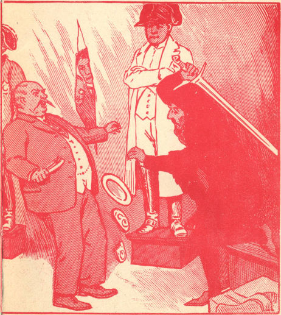

<@pagebreak 33/>

<h1>Die Drehorgel des Bettlers.</h1>

<h2>1. Kapitel.</h2>
<h3>Der Bettler mit der Drehorgel.</h3>

Es war das erbärmlichste Instrument dieser Art, das
Menschenohren beleidigt und daher reichlichere Gaben, als
ein Drehorgelspieler sie sonst einzusammeln pflegt, erpreßt
hat. Und der Mann, der die Kurbel des beschabten, quietschenden
Kastens drehte, paßte genau zu diesem wie von einem
Müllplatz aufgelesenen Martergehäuse: bucklig,
abgerissen, Fragmente von Schuhen, mit Bindfaden umwickelt,
an den Füßen, ein altes, faltenzerrissenes Greisengesicht, ein
Auge durch ein Pflaster verklebt, — wirklich ein Anblick, der
das Mitgefühl wachrief.

So stand der Alte am 16. Juli nachmittags vier Uhr
dicht vor der Tür des Vorgartens des Harstschen Hauses.

Harst und ich, soeben erst munter geworden nach einem
längeren Verdauungsschlaf, waren ans Fenster getreten,
schauten durch die Tüllvorhänge nach dem Drehorgelspieler
aus, dessen Wimmerkasten ein Dutzend Kinder aus der Nachbarschaft
versammelt hatte.

Mit einem Male langte Harald nach dem Schreibtisch
hinüber und nahm das für alle Fälle stets bereitstehende
Fernglas zur Hand, stellte es auf den Bettler ein und sagte
sehr bald:

<@pagebreak/>
»Vielseitig, der Mann! Mit der Rechten dreht er die
Kurbel, mit der Linken, die er so merkwürdig ans Herz gedrückt
hält, macht er Fingerbewegungen wie ein Klavierspieler.
Bitte — sieh Dir dies an, mein Alter.«

Allerdings: das war seltsam, war auffallend.

»Vielleicht leidet der Alte an nervösen Handzuckungen,«
meinte ich und setzte das Fernglas ab.

Harald gab mir eine Banknote. »Da, prüfe, ob der
Mann verkleidet ist.«

Ich ging hinaus — durch den Vorgarten, über den
Bürgersteig, reichte dem Bettler den Geldschein...

Und sah sofort, daß hier ein echter Greis, kein zurechtgeschminkter
Spion oder dergleichen seiner Not zerschlissene
Lumpen zur Schau stellte. Sah auch, daß das gesunde Auge
des Bettlers einen seltsam ans Herz greifenden Ausdruck
tiefsten Leides zeigte, — nicht jenen Ausdruck komödienhafter
Wehleidigkeit der professionellen Schnorrer, nein, etwas
wahrhaft Erschütterndes, das Mitgefühl Packendes.

Der Alte stammelte einen Dank...

Und — dabei veränderte sich sein Gesicht so plötzlich,
daß ich einen Moment in sprachlosem Schreck den Mann
anstarrte.

Was so jäh als völlige Verwandlung des Ausdruckes
der verwilderten Züge kenntlich geworden, war das Stärkste,
was ein Menschenantlitz durch das Mienenspiel verraten
kann: eine Angst wie vor dem gewissen Tode — eine
Angst wie die eines Delinquenten, der zum Schafott geführt
wird. Ich konnte nicht anders — ich mußte den Mann fragen,
was in aller Welt mit einem Male eine so plötzliche
Todesangst in ihm geweckt haben könnte.

Während ich noch die Worte dieser in teilnahmvollstem
Tone vorgebrachten Frage aneinanderreihte, überlief die
Gestalt des Greises ein Zittern — so stark, daß er die
Kurbel nicht mehr weiterdrehen konnte.

Und — unerklärlich! — Das gesunde Auge bohrte sich
in die meinen ein in stummer Bitte — halber Verzweiflung.

<@pagebreak/>
Fürchtete der Mann etwa mich?! Und — wenn ja —
weshalb fürchtete er mich — — weshalb?!

Ich vergaß den begonnenen Satz zu beenden. Ich war
mit einem Male nur Harald Harsts gelehriger Schüler...

Und deshalb warf ich das Mitleid ab wie eine hier
ungeeignete Maske, nickte dem Bettler zu und machte kehrt,
schritt in den Vorgarten zurück, pfiff ein paar Gassenhauertakte
und schnitt drei — vier Rosen von einem Strauche, verhüllte
durch solches Tun meine innersten Gedanken...

Stand dann vor Harald...

Berichtete alles...

»Wir gehen spazieren,« bestimmte er. »Der Alte ist
nach links weitergegangen. Wir schlendern nach rechts. Aber
— wir bleiben hinter ihm drein. Ich weiß mehr als Du.«

»Mehr?«

»Ja. Davon später, Freund Schraut.« —

Wir fanden in einer Seitenstraße ein Auto, ließen das
Verdeck hochklappen, fuhren dem Bettler nach, an unserem
Hause vorüber...

Nichts mehr von dem Greise — nichts.

Aber die Kinder jagten Kreisel auf dem Asphalt. Die
Kinder, die dem Gequietsch des Leierkastens so andächtig
gelauscht hatten.

Harst rief einen älteren Knaben ans Autofenster.

»Junge, wo blieb der Leierkastenmann?«

Der Knabe kannte uns von Ansehen. Sein Gesicht
strahlte auf. Mit Harald Harst sprechen — das war ein Ereignis
für seine neun Jahre!

»Er stieg in eine Taxameterdroschke, Herr Harst.«

»Allein?«

»Nö — noch ein Fräulein und ein alter Herr kamen
aus Ihrem Hause und fuhren mit davon, Herr Harst.«

»Wohin? Nach welcher Richtung?«

»Dort — die Glebitzer runter...«

Unser Auto sauste weiter. Die Droschke konnte kaum
zwei Minuten Vorsprung haben.

<@pagebreak/>
Und doch — wir fanden sie nicht. Sie war unsichtbar
geworden, mußte nach rechts oder links abgebogen sein.

Also wieder heim — und nach oben in die beiden
Fremdenzimmer, die Harald dem Grafen und seiner Tochter
in der verflossenen Nacht zur Verfügung gestellt hatte.

Und oben Frau Auguste Harst.

»Harald — sie sind ausgerückt! Kaum wart Ihr beide
zum Hause hinaus, als der Graf und die junge Gräfin mit
ihrem Koffer die Treppe herabkamen und mir nur zuriefen:
»Vielen Dank — vielen Dank!« Und — weg waren sie!«

»Ich hatte damit halb und halb gerechnet, Mutter.«
Er lächelte etwas. »Da war nämlich ein Leierkastenmann,
der ihnen von der Straße aus Zeichen machte, nachdem er
seinem Instrument das russische Volkslied »Der rote Sarafan«
entlockt hatte. Ausgerechnet das Lied, wo unsere Gäste
doch Deutschrussen sind. Und der rote Sarafan stachelte
mein Mißtrauen auf. Schraut aber stellte fest, daß der
Drehorgelmann vor ihm eine scheußliche Angst hatte. Weshalb
wohl? Weshalb? Und — weshalb entwichen Vater
und Tochter von hier, wo sie doch ganz sicher waren — sicherer
als anderswo?! Weshalb?!«

Der Köchin Mathilde liebliche Stimme aus den unteren
Regionen: »Das Telefong — — das Telefong!«

Was uns wieder in Haralds Arbeitszimmer hetzte...

Wo sich nun Bechert meldete, Freund Fritz Bechert,
Kriminalkommissar...

Harst rief: »Wieder in Berlin?«

Und horchte dann gespannt...

Sagte in die Hörmuschel hinein: »Uns hat der Graf
allerdings etwas ganz anderes erzählt. — Ja — wir erwarten
Sie, Bechert. Wiedersehen.« —

Zwanzig Minuten drauf saß Bechert bei uns im Klubsessel.
— —

Und nun will ich zunächst nachholen, was noch in der
vergangenen Nacht geschehen war.

Harst und ich hatten die vier Strolche mit den Clementpistolen
<@pagebreak/>
in Schach gehalten, die Gräfin hatte die Kerle gefesselt.
Dann war Harald mit Ronnow und dessen Tochter
in den Garten des Laubengrundstücks hinausgetreten, war
nach einer Weile zu mir, der ich die vier bewachte, zurückgekehrt
und flüsterte mir zu: »Du bringst den Grafen und die
Gräfin zu uns in die Fremdenzimmer. Wecke meine Mutter,
damit sie Bettwäsche herausgibt. Dann läute die nächste
Polizeiwache an und melde das hier Vorgefallene, verschweige
aber Einzelheiten, insbesondere den Namen des
Grafen.«

Ich tat, wie Harald es wünschte.

Gegen zwei Uhr morgens erschien er dann bei mir in
meinem Wohnzimmer, das dem seinen im Hochparterre gegenüberliegt.

»Die vier sind weggeschafft,« erklärte er. »In den Nickelspritzen
war Blausäure, woran ich bis zuletzt gezweifelt
hatte. Die Kerle trugen unter den Stromerlumpen sehr
elegante Smokinganzüge, hatten Geld in Hülle und Fülle,
aber nicht einen einzigen Wisch Papier bei sich, der über sie
hätte Aufschluß geben können. Und Antwort war von ihnen
nicht zu bekommen.«

»Was hast Du der Polizei über den Grafen mitgeteilt?«

»Daß ich die Sache mit Kommissar Bechert regeln
würde. Um die Nennung des Namens Ronnow kam ich
nicht herum.«

Dann waren wir schlafen gegangen.

Um zehn Uhr vormittags tranken wir mit unseren Gästen
zusammen auf der Veranda Kaffee. Nachher erzählte
Graf Alexander noch folgendes über die Ereignisse in Riga:

Das Familiengut der Ronnows lag zwei Meilen von
Riga entfernt. Schloß Ronnow war in allen politischen
Stürmen bisher unbeschädigt geblieben, weil der Graf sich
von Politik fern hielt und für seine Leute stets so gut gesorgt
hatte, daß man ihn bis zum letzten Knecht herab
geradezu verehrte. Dann erhielt er plötzlich aus Riga einen
Warnungsbrief: er solle fliehen, sein Leben stehe auf dem
<@pagebreak/>
Spiel. Er sei denunziert worden, gegen die Regierung gewühlt
zu haben. Er schlug die Warnung nicht in den Wind,
verbarg die Ronnowschen Familienjuwelen im Parke in
einer hohlen Buche und schickte sein einziges Kind schleunigst
verkleidet nach Deutschland. — Das war im April 1922. —
Am folgenden Abend wurde er wirklich verhaftet. Der
Hochverratsprozeß gegen ihn zog sich in die Länge. Immer
neues Material gegen ihn wurde beigebracht. Schließlich
sollte er auch zwei Regierungsspitzel beseitigt haben.
Der Gang der Untersuchung ließ erkennen, daß er zum Tode
verurteilt werden würde. Seine Sache stand wirklich schlecht.
Die Beweise gegen ihn waren erdrückend. Er behauptete
Harald und mir gegenüber wiederholt, daß ein Riesenkomplott
gegen ihn geschmiedet worden sei und daß seine
unbekannten Feinde mit teuflischer Schlauheit alles eingefädelt
gehabt hätten. — Dann befreite ihn die Gräfin Johanna
mit Robert Robbas Hilfe. — Ich will Einzelheiten
dieser Befreiung übergehen. Sie sind hier nicht von Belang.
Robba präparierte ihn, den Betäubten, als Wachsfigur und
schiffte sich mit der Kiste auf der Schonerbark ein, die nachher
bei der Oie strandete. In der Kiste befand sich auch der
größere Teil der Juwelen, die die Gräfin aus dem Baume
geholt hatte. Die Kiste war so eingerichtet, daß sie wie ein
Boot im Notfalle schwimmen konnte, hatte im Deckel gut
versteckte Luftlöcher und ließ sich auch von innen öffnen. —
Während der Fahrt von Riga bis zur Oie war der Graf
aus der Betäubung erwacht. Als der Orkan begann, verlangte
die Gräfin Hanna, daß Robba ihren Vater zur rechten
Zeit dem Mitleid der finnländischen Besatzung empfehle,
falls dem Segler etwas zustoßen sollte. Da hatte Robba
ihr erklärt, der Graf sei tot, sei gestorben. — Sie glaubte es,
da ihr Vater schon im Gefängnis sich sehr schlecht gefühlt
hatte. — Die Schonerbark strandete. Gräfin Hanna, wie
betäubt durch die Unglücksnachricht, dachte an nichts — nicht
an die Juwelen — nicht an die Kiste, ließ sich ins Rettungsboot
heben und war an Land nur darauf bedacht, selbst keinerlei
<@pagebreak/>
Argwohn zu erregen. Sie bemerkte auch bereits, daß
sie Fieber hatte. Sie wußte kaum recht, was sie tat und
sprach. — Ich will mich noch kürzer fassen. Robert Robba
holte dann die kaum genesene Gräfin von der Oie ab und
brachte sie nach dem Angriff auf unseren Kutter in ein einsames
Haus am Stettiner Haff, wo sie ihren Vater lebend
vorfand. Hier enthüllte Robba seinen wahren Charakter,
verlangte von der Gräfin die Angabe des Ortes, wo der
Rest der Ronnow-Kleinodien verborgen sei, und bedrohte
beide Ronnows mit dem Tode. Nachts entflohen sie dann
in einem Nachen auf das Haff hinaus, flüchteten bis Berlin.
— Alles weitere kennt der Leser.

Diese Schilderung hatte in all ihren Teilen durchaus
glaubwürdig geklungen.

Und doch...

Nun lasse ich Fritz Bechert sprechen, der von Harald mit
diesem Tatbestand vertraut gemacht worden war.

<h2>2. Kapitel.</h2>

<h3>Auf dem Tourdampfer nach Pillau.</h3>

»Lieber Harst,« erklärte Freund Bechert, »der Graf hat
Sie grob belogen. Von einem Komplott gegen ihn kann
keine Rede sein. Auf Ihre Depesche aus Swinemünde
fuhr ich nach Riga, da mein Sommerurlaub gerade begann.
Ich forschte in Riga als Privatmann nach und hörte so, daß
die Flucht des Grafen Alexander Ronnow das einzige
bemerkenswerte Ereignis der letzten Zeit gewesen. Der Graf
hat tatsächlich zwei Spitzel beiseite geschafft und sich politisch
schwer kompromittiert — sagen wir’s deutsch: sich bloßgestellt.
Bei seinen Leuten ist er allerdings sehr beliebt, im
übrigen ist er ein Mann, der über Leichen geht. Ich hatte
<@pagebreak/>
vorhin im Präsidium schon die Haftbefehle gegen ihn und
die Gräfin ausfertigen lassen, da ein Ersuchen der Regierung...«

Hier wurde Bechert unterbrochen.

Es hatte im Flur geläutet, und die Köchin meldete uns
jetzt denselben Knaben, der uns vorhin im Auto mitgeteilt,
daß der Leiermann in einem Taxameter mit einer Dame
und einem Herrn davongefahren sei.

»Was bringst Du, mein Junge?« fragte Harald das
kecke Bürschchen freundlich. »Hast Du etwa den Bettler mit
der Drehorgel wieder gesehen?«

»Nö, Herr Harst, das nich. Aber — aber gefunden hat
mein Freund Julius etwas, das der Leiermann verlor, als
er in den Taxameter kletterte. Hier — dies.«

Er hielt Harald eine Stiefelsohle hin, eine durchlöcherte
Ledersohle, in der noch sechs kleine *blanke* Nägel
steckten — *blanke* Nägel...

Die Innenseite der Sohle zeigte an einer Stelle in roter
Tinte klare Buchstaben, die wie folgt angeordnet waren:

   H     K    St     D     R
           B
                    R. R.
           Dr

Der freundliche Leser sieht: in der oberen Reihe standen
mit Zwischenräumen H, K, St, D, R.

In der mittleren B und R R.

Unten stand Dr — —

Das war alles. — Nein, doch nicht alles: die punktierten
Linien waren noch da, die zwischen der Mehrzahl der
Buchstaben eine Verbindung herstellten. —

Der Knabe erhielt ein Geldgeschenk und zog strahlend ab.

Harald bot mir und Bechert Zigaretten an.

Nach den ersten Zügen fragte Freund Fritz:

<@pagebreak/>
»Die Nägel in der Sohle sind noch ganz blank, noch
neu: der Orgelmann hat die Sohle also erst vor kurzem
befestigt...«

»...und sehr lose,« nickte Harald. »So lose, daß er
sie hätte vor unserem Hause liegen lassen, abstreifen können,
— was er auch tun wollte, mein Alter,« wandte er sich an
mich. »Als Du ihm das Geld brachtest, suchte er gerade die
Sohle mit dem anderen Schuh abzustreifen, der so jämmerlich
mit Bindfaden umwickelt war. Er wollte die Sohle liegen
lassen — für die beiden Ronnows, die er durch die Fingersignale
auf die Sohle aufmerksam gemacht hatte. Seine
Angst vor Dir war eben nichts als die Angst, daß Du seine
Absicht durchschaut hättest, oder vollendetes Komödienspiel.«

Das hatte Hand und Fuß! Die Erklärung leuchtete mir
ein.

»Und — die Sohle war eine Nachricht für die
Ronnows,« fügte Bechert hinzu.

»Allerdings!« bestätigte Harst. »Eine wichtige Nachricht
— eine Buchstabennachricht...!«

Ein Lächeln huschte um seine Lippen.

Bechert hatte die elende Ledersohle wieder zur Hand
genommen.

»Hm — jedenfalls eine sehr kurze Nachricht,« meinte
er. »Das R. R. kann heißen Robert Robba...«

»Oder Ronnow, Vater und Tochter, — zwei R’s!«

»Ja — und Dr ganz unten kann die Abkürzung für
Doktor sein.«

»Fällt ihm nicht ein! Das heißt Dresden.«

Bechert blickte Harst an. »Machen Sie Spaß?«

»Spaß?! Bei einem solchen Anlaß?! Niemals!«

»Dann — reden Sie! Was bedeuten die Buchstaben?«

»Sieben Städte und ein Verbrecher.«

Wieder starrte Bechert auf die roten Buchstaben.

»So... so... sieben Städte...! — Schraut, raten Sie
die Sache?«

»Mit nichten, lieber Bechert.«

<@pagebreak/>
Harald nahm eine neue Zigarette, sagte:

»Hamburg, Kiel, Stettin, Danzig, Riga — fünf Hafenstädte.
Das B ist Berlin, das R. R. Robert Robba, das
Dr Dresden. — Dresden ist nur mit genannt, damit der
Graf die Lösung leichter fände. — Von Riga floh Ronnow
nach Stettin an Danzig vorüber, von Stettin nach Berlin,
und von Berlin soll er nach Danzig fahren, vergleiche die
punktierten Linien, wo er Robert Robba und die Juwelen
finden wird. — Ich denke, das ist eine Lösung, die stimmen
kann.«

»Wahrscheinlich,« brummte Bechert. »Sie wollen jetzt
nach Danzig, Harst. Ich habe Urlaub. Ich komme mit.«

»Bitte. Wir benutzen den Dampfer von Swinemünde
aus. Um sieben Uhr fährt das Luxusauto des Atlantik-Hotels,
Heringsdorf, von Berlin ab und ist um ein Uhr in
Swinemünde. Um zwei geht der Dampfer. Also — beeilen
wir uns…!« — —

Nachts waren wir in Swinemünde — gingen an Bord
des Pillau-Dampfers, eines schwarzen Kastens, der einst
den Bäderdienst nach Helgoland besorgt hatte.

Waren natürlich nicht Bechert, Harst, Schraut.

Bewahre!

Waren drei Herren, die sich scheinbar nicht kannten, jeder
mit einem Köfferchen...

Drückten dem Steward die Hand, drückten etwas in
diese Hand, bekamen eine Kabine mit drei Betten, waren
vereint.

Um zwei Uhr in See... — am Leuchtturm vorüber,
zwischen den Molen hindurch...

Das Meer in Laune — spiegelglatt, Mondschein…

Getrennt standen wir an der Reling des Promenadendecks...

Und — fuhren mit den Köpfen herum: vom Vorschiff
ein Leierkasten, der… den roten Sarafan winselte!

Nicht *ein* Leierkasten. *Der* Leierkasten. Eben der
des Bettlers. Aus Hunderten hätte ich *die* Töne des
<@pagebreak/>
Quietschkastens herausgefunden. Ein so erbärmlich verstimmtes
Ding gab es eben nur in einem Exemplar.

Harst, Bechert, ich tauschten Blicke...

Dann verschwand Harst nach dem Vorschiff zu. Bechert
und ich suchten die Kabine auf.

»Sie werden alle drei am Bord sein,« flüsterte Freund
Fritz. »Sowohl der Bettler als auch Ronnow und Tochter.
Ich glaube, der Alte...«

Harst trat ein, drückt die Tür zu, schaute mich an.

»Na — auf Deine Augen kann man sich nur sehr mäßig
verlassen,« meinte er leise. »Der Alte ist verkleidet! Er
saß vor dem Niedergang der Kombüse im Laternenlicht, hat
Perücke auf, falschen Bart, falschen Buckel, der sich verschoben
hatte.« Er zuckte die Achseln.

»Der Mann ist *nicht* verkleidet,« erklärte ich sehr bestimmt.
»Dabei bleibe ich! Ich habe ihn bei Tage gesehen.
Nachts täuscht man sich leichter, Harald.«

Er setzte sich auf seinen Bettrand. Viel Platz war ja
überhaupt nicht in dieser Kabine.

Bechert und ich zogen uns Klappstühle herbei.

»Die Sache wird wieder dunkler,« meinte Harst und
ließ sein Zigarettenetui aufspringen: »Ich hielt den Bettler
für einen Vertrauten des Grafen, für einen Diener oder dergleichen.
Das muß wohl so sein. Nun behauptet Schraut,
der Orgelspieler vor unserem Hause, der die Sohle verlor,
sei nicht verkleidet gewesen, während ich — — genau weiß,
daß der Mann maskiert ist. — Wir müssen zunächst diese
Frage klären. Ich möchte vorschlagen, Du gehst aufs
Vorschiff und siehst Dir den Mann einmal an.«

Dazu war ich gern bereit. —

Der Greis saß noch vor dem Kombüsenniedergang. Um
ihn herum hatten sich eine Anzahl Passagiere auf ihre Koffer
und Kisten niedergelassen, bescheidene Leute, die dem
Arbeiter- oder Kleinhandwerkerstande angehören mochten.
Die Drehorgel stand vor ihm. Er spielte jetzt nicht, sondern
kaute an einer dicken Brotschnitte.

<@pagebreak/>
Ich schlenderte vorüber, blieb in der Nähe, zog einen
Matrosen ins Gespräch. Meine Augen prüften indes fortgesetzt
die Erscheinung des Alten, der sich mit den Armen
auf den Leierkasten gestützt hatte.

Ich blieb nicht lange im unklaren darüber, daß es sich
hier tatsächlich nicht um denselben Mann handelte, so gut
die Maske dieses Pseudo-Bettlers auch war, der die Lumpen
des anderen trug und auch dessen Drehorgel jetzt besaß,
denn — die Drehorgel war bestimmt dieselbe. Ich hatte
mir deren Aussehen bestimmt gemerkt. Sie hatte vorn drei
bunte Bilder unter Glas, die Musen darstellend, die des
Tanzes, der Musik und der Dichtkunst.

Der Matrose, mit dem ich mich unterhalten hatte, ging
weiter. Ich blieb. Der Jagdeifer war erwacht. — Wer
war dieser maskierte Mensch? Vielleicht gar die Gräfin Hanna,
die ja bereits bewiesen, daß sie ungeheuer vielseitig war
und vor nichts zurückschreckte. Die abenteuerliche Befreiung
Ihres Vaters hatte bereits an ihre Geistesgegenwart, ihre
Kühnheit und an ihre schauspielerischen Fähigkeiten Anforderungen
gestellt, die geradezu als außergewöhnlich für
ein junges Weib von vierundzwanzig Jahren bezeichnet werden
mußten.

Man beachtete mich nicht. Es strichen hier so viele Fahrgäste
herum, die diese Mondnacht genießen wollten.

Gräfin Hanna?! — Nein — ich sah die Hände des
Verkleideten. Das waren derbe, schmutzige Hände, das waren
niemals die der jungen Aristokratin.

Wer war’s sonst? — Der Graf?! Auch das nicht! Graf
Alexander Ronnow hatte eine messerscharfe, etwas große
Nase. Und die des Bettlers, des echten wie des falschen,
war kurz und dick, stark gerötet...

Wer war’s?! Vielleicht Robert Robba, der Artist, der
Besitzer des Napoleon aus Wachs, mit dem er tatsächlich
in Riga aufgetreten war, wie Bechert festgestellt hatte.

Robert Robba?! — Und — wenn er’s war, dann —
dann mußte der echte Bettler beseitigt worden sein. Wie
<@pagebreak/>
hätte dieser Maskierte sonst die Lumpen des anderen auf
dem Leibe haben können?! Wie sollte er sonst in Besitz der
Drehorgel gelangt sein?!

Über diesen und noch weitergehenden Fragen, die den
Verbleib des Grafen Alexander und seiner Tochter betrafen,
packte mich plötzlich eine Unruhe, die mich vom Vorschiff
wieder in die Kabine trieb.

Die helle Sommernacht war langsam in das Morgenzwielicht
übergegangen. Bevor ich die Treppe zu den unteren
Räumen hinabstieg, warf ich noch einen Blick nach der
Küste hinüber, deren heller Strand in der Ferne wie ein
weißer Strich schimmerte, die Küste Pommerns...

Und sah dort ein Fahrzeug — eine Motorjacht offenbar,
die nun auf den Dampfer zuzuhalten schien.

Es war bei mir jenes durch den Anblick des Verkleideten
stark gesteigerte Gefühl allgemeinen Mißtrauens, das mir
den Gedanken jäh durch das Hirn jagte: die Jacht kommt
des Maskierten wegen!

Ich hastete schneller die Treppe hinab, betrat die Kabine.

»Es ist nicht der echte Bettler,« flüsterte ich atemlos.

»Na also!« nickte Harst.

»Eine Jacht nähert sich vom Lande her,« fügte ich
hinzu.

Harst erhob sich rasch.

»Nach oben — getrennt!« sagte er lebhaft.

Dann standen wir wieder in Zwischenräumen an der
Reling.

Das Deck war leer geworden. Nur der Drehorgelspieler
saß noch an der Kombüsentreppe und rauchte jetzt eine
Zigarre...

<@pagebreak/>

<h2>3. Kapitel.</h2>

<h3>Herrn Retters »Astarte«.</h3>

Die kleine Jacht schoß heran.

Im Osten wurde der Himmel blank wie eine leuchtende
Glocke. Die Sonne wollte emporsteigen — kämpfte noch mit
den grauen Dunstmassen am Horizont.

Der Steuermann des Dampfers trat zu mir, stellte das
Glas ein und sagte dann:

»Das ist vielleicht eine ausländische Jacht. Ich kann
die Flagge noch nicht unterscheiden...«

Harald kam herbei, grüßte...

»Ein schnelles Fahrzeug,« meinte er und wies auf die
Jacht.

»Mindestens fünfzehn Knoten,« nickte der Steuermann.

Nun konnte man bereits drei Herren drüben erkennen.

Dann ein gellendes Sirenengeheul von der Jacht, —
lang, kurz, kurz, lang, lang — so folgten einander die Töne.

Und nach kurzer Pause abermals: kurz, lang, kurz, lang,
kurz, kurz...

»Teufel, was wollen die?!« brummte der Steuermann.

Ich hatte nach rechts geschielt — nach dem Leiermann
hin. Der saß und tat, als gingen diese Signale ihn nichts
an — gar nichts...

Die Jacht beschrieb einen Bogen, hatte den Dampfer
bald erreicht, hielt sich dicht neben ihm.

Jetzt sahen wir, daß die Herren drüben sehr unwahrscheinlich
dichte Vollbärte hatten — Bärte, die so gewiß
angeklebt waren, wie auch der meine Kunst war.

Und nun — um Sekunden kam Harald zu spät...

Schnellte vorwärts — dem Vorschiff zu, wo der Bettler
soeben hochgefahren und mit der Drehorgel an die Backbordreling
gelaufen war...

Wo er sie rasch ins Wasser hinabgeworfen hatte und
hinterdrein gesprungen war...

<@pagebreak/>
Harald schwang sich auf die Reling, schleuderte die Jacke
von sich...

Von drüben ein Schuß — von der Jacht...

Harst sank nach hinten über auf das Deck zurück.

Da hatte auch Bechert schon die Dienstpistole herausgerissen...

»Im Namen des Gesetzes!« brüllte er...

Wollte noch mehr hinzufügen...

Mußte sich ducken — hinter die eiserne Reling...

Kugeln pfiffen — klatschten gegen das Metall mit blechernem
Klang...

Der Steuermann kniete neben mir im Schutze der Eisenplatten.

»Herr, was bedeutet das alles?!« keuchte er.

Harst kam herbeigekrochen, blickte durch ein Loch in der
Reling...

»Sie haben die Drehorgel und den Mann aufgefischt,
jagen davon...!« rief er...

Der Kapitän erschien — mit nackten Füßen, in einen
Mantel gehüllt — aus dem Bett...

»Klausen, was geht hier vor?« verlangte er von dem
Steuermann Auskunft.

Wir standen schon wieder aufrecht da.

Bechert gab sich dem Kapitän zu erkennen.

»Kriminalkommissar Bechert. Hier mein Ausweis. —
Ist es möglich, die Jacht dort einzuholen?«

Harst schüttelte den Kopf. »Die Frage kann auch ich
Ihnen beantworten, lieber Bechert. Sie sehen ja, wie die
Jacht die See durchpflügt. Dagegen sind wir hier elende
Krebse.«

Fahrgäste, durch die Schüsse aus dem Schlaf gescheucht,
stürzten herbei.

Wir gingen auf Harsts Wink schnell in die Kapitänskajüte.

Steuermann Klausen beruhigte die Passagiere, folgte
uns dann und meldete, daß die Jacht jetzt nach Norden steuere,
<@pagebreak/>
der schwedischen Küste zu.

Harst hatte sich an Kapitän gewandt. »Gibt es ein
Mittel, die Jacht irgendwie festhalten zu lassen?« fragte er.
»Sie haben doch Funksprucheinrichtung an Bord, Herr Kapitän.
Können wir nicht eine Runddepesche ausgeben für
alle Ostseehäfen, daß die Jacht, so und so aussehend, polizeilich
beschlagnahmt und die Insassen verhaftet werden
sollen?«

»Natürlich geht das, Herr Harst. — Wenn der Herr
Kriminalkommissar es wünscht, wird der Telegraph sofort...«

Bechert nickte. »Ich wünsche es. Harst mag den Wortlaut
des Telegramms aufsetzen.«

Harald lehnte an der Außenwand der Kajüte neben
neben dem einen Bullei (rundes Außenbordfenster). Das Fenster
ging nach Süden hinaus. Der Dampfer befand sich etwa
auf der Höhe von Kolberg.

Harst schrieb im Stehen mit Bleistift ein paar Zeilen
auf ein Blatt Papier, reichte es dem Kapitän. »Bitte —
sofort, Herr Kapitän!« Und zu Bechert sagte er: »Da hinten
am Horizont, nach Kolberg zu — da ist eine Flottille
Minensuchboote. Die Depesche ist für den Flottillenchef bestimmt
und mit ihrem Namen und Amtstitel unterzeichnet.«

Bechert ruckte hoch. »Ah — Jagd auf die Burschen!!
Verstehe!! — Gehen Sie, Herr Kapitän!« —

Zehn Minuten drauf jagten sechs schwarze flinke
Fahrzeuge herbei.

Wieder fünf Minuten drauf waren wir an Bord des
Minensuchbootes auf dem die Flagge des Flottillenchefs
wehte.

Der Korvettenkapitän signalisierte den übrigen Booten
ein paar Befehle. Und diese Windhunde des Meeres wendeten
ihre scharfen Vordersteven nach Norden, jagten davon,
breiteten sich fächerartig aus.

Die Jacht hatte etwa vierzig Minuten Vorsprung. Nach
einer halben Stunde kam von dem am weitesten nach Westen
<@pagebreak/>
zu hinausgeschobenen Boot die Funkspruchmeldung, daß
die Jacht, westlichen Kurs laufend, gesichtet sei.

Harst ließ zurückfunken: »Unauffällig beobachten. Abwarten.«

Und abermals eine halbe Stunde später war der Flüchtling
völlig eingekreist.

Der Kreis verengerte sich. — Dann das Flaggensignal
»Stoppen Sie sofort!«

Die Jacht gehorchte — wir gingen an Bord. Wir fanden
einen Bootsmann und ein Ehepaar vor, Leute, die sehr
erstaunt taten, daß sie aufgehalten wurden.

Der Ehemann wies sich als Juwelier Retter aus Berlin
aus. Er blieb hartnäckig dabei, daß seine Jacht Astarte
den Tourdampfer nach Pillau nicht einmal gesichtet, geschweige
denn den Bettler und die Drehorgel an Bord genommen
hätte.

Julius Retter war ein jüngerer Mann von einer überlegenen
Ruhe. Seine Frau hatte für uns nur ein ironisch-hochmütiges
Lächeln. Der Bootsmann, gleichfalls Berliner,
bestätigte, daß Retter seit zehn Tagen mit der Astarte
von Swinemünde aus unterwegs sei und jetzt von Kolberg
käme.

Und trotz dieser kaltblütigen Ableugnungsversuche: es
war dieselbe Jacht — ohne Zweifel! Der Name am Bug
war freilich vorhin durch ein Stück Segel verdeckt gewesen.

Wir durchsuchten die Jacht — ohne Erfolg.

Retter wurde ungemütlich, drohte mit Beschwerde.

»Jachten vom Aussehen meiner Astarte gibt es zu Dutzenden,«
meinte er. »Suchen Sie nur die andere, meine
Herren! Ich bin auch kein Bandit!«

Wir waren ziemlich ratlos. Der Fregattenkapitän, der
mit uns an Bord gekommen, machte ein langes Gesicht.

Harst blieb Retters immer selbstsicherem Auftreten und
Redensarten gegenüber kühl-höflich.

»Sie können sich ja beschweren, Herr Retter,« sagte er
achselzuckend. »Wir werden die andere Jacht schon finden.«

<@pagebreak/>
Recht verärgert stiegen wir ins Boot und kehrten nach
dem schwarzen Windhund mit den beiden schrägen Schornsteinen
zurück.

Harst sagte erst, als die Flottille nach Nordwest, Kurs
Saßnitz auf Rügen, weiterdampfte:

»Herr Retter wird bald mit einer Zelle des Berliner
Polizeipräsidiums Bekanntschaft machen — sehr bald! —
Ich bitte Sie, Herr Korvettenkapitän, uns nach Kolberg zu
bringen, sobald die Jacht Astarte außer Sicht ist.«

Weiter äußerte er sich nicht. —

Um sieben Uhr morgens etwa wurden wir drei, Bechert,
Harst und ich, mit unseren Koffern westlich von Kolberg an
einsamer Strandstelle ausgebootet. Um elf Uhr vormittags
hatte Harald ermittelt, daß Herr Julius Retter in Kolberg
vier Tage im Hotel Strandschloß gewohnt und in der vergangenen
Nacht gegen zwölf Uhr eine dringende Depesche
aus Swinemünde mit folgendem Wortlaut erhalten hatte:
Julius Retter, Kolberg, Hotel Strandschloß, Zimmer 18 u. 19
Sendung unterwegs von hier zwei Uhr morgens. Wie vereinbart
in Empfang nehmen. Vorsichtige Behandlung der
Glasflaschen dringend nötig, da Beipackung drei sehr
ungünstig. — Schulze.

Harald lächelte zu diesem Telegramm, dessen wahrer
Inhalt uns sofort klar wurde: die »Sendung« war der Maskierte
mit dem Leierkasten. Beide sollte Retter, wie geschehen,
vom Tourdampfer nach Pillau auf See an Bord der
Astarte nehmen. »Vorsichtige Behandlung« und so weiter
war eine Warnung vor uns dreien.

Bechert meinte kopfschüttelnd: »Unglaubliche Geschichte!
Was soll das alles?«

»Retter ist der Hehler, lieber Bechert,« erwiderte Harald
kurz.

»Hm — der Hehler der Diamanten und sonstigen
Kleinodien des Grafen! Gut, mag stimmen. Aber — wo
blieb der Drehorgelspieler. Es waren doch nur drei Leute
an Bord der Astarte.«

<@pagebreak/>
»Sie vergessen, daß wir so und so vielen Fischerbooten
begegneten. Retter hat einen Fischer bestochen. Der
Leierkastenmann ist unterwegs nach einem der deutschen
Küstenorte zwischen Kolberg und Swinemünde oder er ist
bereits dort eingetroffen. Retter hat eben mit einer Verfolgung
gerechnet.«

»Schön. Und nun?«

»Werden wir Mittag essen und irgendwo in den Dünen
schlafen. Dann suchen wir weiter.«

Bechert und ich waren sehr einverstanden.

Beim Mittagessen meinte Freund Fritz plötzlich:

»Und Danzig? Scheidet das ganz aus?«

»Ja. Darüber sprechen wir später.«

»Weshalb? Weshalb nicht gleich?«

»Weil ich etwas abgespannt bin.«

Und dabei blieb’s. —

Mit unseren kleinen Handkoffern verloren wir uns in
den Dünen, suchten ein schattiges Plätzchen hinter
Weidengebüsch und streckten uns in den warmen Sand.

Es war eine ganz einsame Stelle, weit ab von den
letzten Strandkörben der Badegäste. Kolberg als Seebad
war auch in diesem Jahre wieder sehr besucht.

Die nahe See brandete ganz leise und sang uns ein
Schlummerlied.

Ich erwachte gegen halb sechs, richtete mich auf, rieb
mir die Augen, hörte Becherts wenig melodisches Schnarchkonzert
neben mir und sah mit einem Blick, daß Harst fehlte.

Sein Koffer war noch da. Damit uns die Koffer
während des Nachmittagsschläfchens nicht gestohlen würden,
hatten wir sie als Kopfpolster benutzt.

Wo war Harst?! — Da bemerkte ich halb unter seinen
Koffer geschoben einen Zettel.

Flüchtige Bleistiftzeichen: »Konnte nicht einschlafen,
legte mich auf die Dünenkuppe, sah die Astarte in den Hafen
einlaufen und will jetzt R. beobachten. Hinterlasse Euch
Nachricht auf der Polizeiwache des Strandviertels. Bechert
<@pagebreak/>
soll dort nachfragen. H.«

Ich weckte Bechert schleunigst. Wir waren beide mehr
als erstaunt über die Rückkehr der verdächtigen Jacht. Wir
hatten hiermit nie gerechnet. Retter hatte erklärt, er wolle
mit der Astarte nach Swinemünde und über Stettin die Oder
abwärts nach Berlin.

Fritz Bechert machte jetzt ein sehr unzufriedenes Gesicht.
»Es ist ein scheußliches Gefühl, so im Dunkeln herumzutappen,«
meinte er. »Harst hüllt sich wieder nach altem
Rezept in Schweigen. Und doch behaupte ich, daß er genau
weiß, was es mit dem falschen Bettler, der Drehorgel und
all dem anderen auf sich hat.«

Ich nickte. Er hatte da soeben ausgesprochen, was
ich bereits mir selbst gesagt hatte: weshalb ließ der Verkleidete
die Drehorgel nicht im Stich — weshalb warf er sie
in die See und sprang dann erst hinterdrein?! Weshalb?!
Was lag an dem elenden Instrument?! Welchen Wert
mochte es haben, welchen verborgenen Wert?!

Bechert hatte sich erhoben und streckte sich.

»Gehen wir,« meinte er dann.

<h2>4. Kapitel.</h2>

<h3>Der Kollege Allan Marx.</h3>

Wir trugen noch immer unsere Verkleidung, obwohl
sie uns jetzt Julius Retter gegenüber nichts nützte. Als wir
den Stadtwald von Kolberg, die bekannte historische Maikuhle
durchschritten, schlug ich Bechert daher vor, unsere Gesichter
ein wenig zu verändern. In einem Gebüsch verwandelten
wir uns sogar sehr gründlich. Unsere Koffer enthielten
alles Nötige, sogar blaue Leinenanzüge, wie die
Schiffsheizer sie tragen. — Nach sehr kritischer gegenseitiger
Musterung, die aber zur vollen Zufriedenheit ausfiel, begaben
<@pagebreak/>
wir uns zur Polizeiwache des Strandviertels. Bechert
legitimierte sich den Beamten gegenüber, erhielt einen versiegelten
Brief, den Harald hier zurückgelassen, und bat, man
möchte unsere Koffer einstweilen in Verwahrung nehmen.
Harst war vor etwa einer Stunde auf der Wache gewesen,
ohne seinen Namen zu nennen.

Wir beide setzten uns in den nahen Anlagen auf eine
Bank und lasen den Brief. — Harald schrieb:

»Astarte liegt im Innenhafen am Bollwerk. Retter
ging zur Stadt. Ihr trefft mich in der Kneipe zum goldenen
Anker in der Persante-Gasse. Seid vorsichtig. Wir fassen
die Bande heute bestimmt ab, falls nicht gerade eine Störung
eintritt. H.«

— Dann — der goldene Anker, eine jener Schifferkneipen,
die eine Sehenswürdigkeit sind. Ein Häuschen, so
niedrig, daß man mit der hochgereckten Hand das Ziegeldach
berühren konnte. Blitzblanke Fenster, eine Haustür aus
Eichenholz, darüber an einer verrosteten eisernen Stange
ein goldener Anker. Und neben diesem dicht unterm Dach
eine Erinnerung an die Belagerung durch die Franzosen im
Jahre 1807: eine Kanonenkugel, die in die Mauer halb eingedrungen
war.

Die Kneipe selbst: drei Stuben, weiß gescheuerte Tische,
weißer Sand auf den Dielen, an den Deckenbalken Schiffsmodelle,
Waffen von Naturvölkern, allerhand andere Dinge,
die bewiesen, daß die Besitzer des goldenen Ankers wohl
stets früher Seeleute gewesen.

Wir fanden Harst, gleichfalls im Heizerkostüm, im eigentlichen
Schankraum an einem Tische sitzen. Wir hätten
ihn kaum erkannt. Er, der beste Verwandlungskünstler, den
ich kenne, hatte sich diesmal noch mehr Mühe als sonst gegeben,
um möglichst echt zu wirken.

Der Raum war bis auf zwei andere Gäste und den
Wirt hinter dem Schenktisch leer.

Harald tat so, als hätte er uns erwartet. In schönstem
Hamburger Platt begrüßte er uns mit Vorwürfen, weil
<@pagebreak/>
wir so spät kämen. Wir nahmen gleichfalls Platz, bestellten
ein warmes Gericht und dämpften allmählich unsere
Stimmen.

Die beiden anderen Gäste, gleichfalls Seeleute, beachteten
uns nicht weiter. Neue Gäste kamen hinzu.

Harst war merkwürdig einsilbig. Wir, Bechert und
ich, warteten umsonst darauf, daß er uns Näheres über die
Jacht und Julius Retter mitteilen sollte. Schließlich konnte
Freund Fritz doch nicht länger an sich halten.

»Harst, so reden Sie doch endlich!« meinte er leise, aber
recht unwillig. »Es ist das wieder das reinste Versteckspielen
zwischen Ihnen und uns. — Was treibt dieser Retter
hier?«

»Er besichtigt zur Zeit ein Wachsfigurenkabinett,« erklärte
Harst völlig ernst.

Wachsfiguren — — Wachsfigurenkabinett!! Sofort
dachte ich an den Napoleon aus Wachs. Sollte etwa Robert
Robba wirklich hier in Kolberg sein?!

Auch Bechert war auf diesen Gedanken gekommen und
fragte: »Das heißt also, Robba ist hier, nicht wahr?«

»Ja. Er war der verkleidete falsche Bettler, den die
Astarte samt der famosen Drehorgel auffischte.«

»Weshalb — famose Drehorgel?«

»Weil sie bei diesen Diamantenschiebern und Dieben
eine große Rolle spielt,« erklärte Harst seufzend. »Ihr beide
quetscht mich ja doch aus wie eine Zitrone. Da will ich lieber
von selbst meine Theorie über Robba und Konsorten
entwickeln. Robba als internationaler Artist hat die beste
Gelegenheit zum Verschieben und Stehlen von Kleinodien.
Er ist bald hier, bald da engagiert. In den letzten vier Monaten
war er in London, Paris, Rouen, Brüssel, Kopenhagen,
Hamburg, Berlin und Riga. Und in all diesen
Städten sind zur selben Zelt größere Juwelendiebstähle vorgekommen.
Ich habe daheim die ausländischen Zeitungen
durchgesehen, ebenso das Verbandsorgan der internationalen
Artistenloge. Daher kenne ich auch Robbas Engagements.
<@pagebreak/>
— Ganz besonders erfolgreich hatten die Diebe in London
gearbeitet, wo sie dem Herzog von Wirghton Edelsteine im
Werte von 120 000 Pfund Sterling abgaunerten. Londoner
Detektive verfolgten die Spur der Diebe bis Berlin,
hatten aber die Fährte dann verloren.«

Harst machte eine kurze Pause. — Wir merkten, jetzt
kam das Wichtigste seiner Mitteilungen.

»In der Artistenloge,« fuhr er fort, »fand ich auch einen
recht interessanten Artikel über Robert Robbas Varietee-Nummer
»Napoleon — Mensch oder Automat?« Darin
war betont, daß Robbas Automat so glänzend gearbeitet sei,
daß man bis zum letzten Augenblick im Zweifel bliebe, ob
es sich um einen Automaten oder doch nur um einen lebenden
Menschen handele, der den Napoleon mimte. Ferner
war da erwähnt, daß der Automat unter anderem eine...
Drehorgel in Bewegung setze, welche die Nationalhymne
des Landes spiele, in dem Robba sich gerade mit seinem Napoleon
aus Wachs befände.«

»Ah!« machte Bechert. »Mir geht ein Licht auf!«

»Bitte — inwiefern?« fragte Harald gespannt.

»Nun, in dieser Drehorgel wird Robba die gestohlenen
Steine versteckt haben.«

»Ja — das nehme auch ich an, lieber Bechert. Die
Drehorgel war ein Schmugglertrick. Sie diente dazu, die
Juwelen über die Grenze zu schaffen — nach Berlin, zu dem
Großhehler Julius Retter. Das Gepäck eines Artisten wird
kaum so sorgfältig durchsucht werden.«

Bechert schnitt einer Zigarre bedächtig die Spitze ab.

»Alles sehr schön, bester Harst... Nur — ganz klar ist
mir die Sache doch noch nicht. Robba war zuletzt also in
Riga im Auftrage der jungen Gräfin. In der Kiste für den
Automaten wurde Graf Ronnow aus Riga weggeschafft —
als Automat, übrigens an sich ein glänzender Gedanke. Wo
blieb der echte Automat, der Napoleon aus Wachs?«

»Der wurde irgendwie heimlich nach Tilsit gebracht
und dort als Eilfracht aufgegeben. — Als ich Retter in dem
<@pagebreak/>
drüben auf dem Schaubudenplatz stehenden Zelt des
Wachsfigurenkabinetts, das einer Frau Amalie Robba gehört,
verschwinden sah, habe ich mich bei dem Bahnspediteur erkundigt,
ob in den letzten Tagen hier für Frau Robba eine
Kiste mit einer Wachsfigur eingetroffen sei. So erfuhr ich,
daß dies der Fall gewesen und daß die Kiste aus Tilsit gekommen.«

Bechert drückte Harst verstohlen die Hand. »Sie sind
doch ein Genie, Harst!«

»Genie?! Ich meine, diese Nachfrage bei dem Spediteur
lag doch sehr nahe.«

»Und weiter?«

»Ja — dann besuchte ich das Wachsfigurenkabinett,
das seit vier Uhr nachmittags geöffnet war, sah mir die
Wachsfiguren an und fand den berühmten Automaten auf
einem Sockel stehen — in der bekannten Haltung mit über
der Brust gekreuzten Armen. Napoleons Nachbarn waren
rechts der alte Fritz und links der Scharfrichter von Nürnberg,
Johann Saltsieder, neben dem auch der »echte« Richtblock
stand. Als ich mir die wirklich tadellos gearbeiteten
Wachsfiguren betrachtet hatte, verließ ich die Bude und
schaute mir dabei den an der Kasse sitzenden Mann, einen
blondbärtigen Menschen, genauer an — unauffällig selbstredend.
Es war Freund Robba, der sich hier nun offenbar
ganz sicher fühlt. Retter mag ihm gesagt haben, daß wir
irgendwo in der Ostsee herumkreuzen und die andere Jacht
suchen.«

»Hm — und Danzig?« warf Bechert ein. »Was ist’s
mit Danzig und den beiden Ronnows und dem echten Bettler?«

»Ronnows sind ebenfalls hier, und in ihrer Begleitung
ein Mann, den ich von Hörensagen längst kenne...«

Wieder eine Kunstpause. — Bechert machte eine
ungeduldige Handbewegung.

Und Harald flüsterte: »Allan Marx aus London,
bester Bechert, der alte Marx, Mitinhaber des Detektivinstituts
<@pagebreak/>
Marx, Robbin und Kompagnie, London, Abbeystreet.«

»Donnerwetter — — Marx!!«

»Ja. Marx, der hinter den Juwelen des Herzogs von
Wirghton her ist, denke ich, der Robba und Konsorten beobachtete
und irgendwie ermittelt hatte, daß Robba den Pillau-Dampfer
benutzen würde, und glaubte, Robba würde in
Danzig an Land gehen, und dies den beiden Ronnows zur
Kenntnis bringen wollte — durch die Schuhsohle! Also der
alte Allan Marx und kein Diener des Grafen, wie ich anfänglich
annahm.«

»Und wo stecken die drei?«

»In einem bescheidenen Pensionat am Schaubudenplatz
— natürlich verkleidet wie wir. Ich wäre kaum auf sie
aufmerksam geworden, wenn Marx nicht von seinem Fenster
aus die Wachsfigurenbude mit einem Fernglas beobachtet
hätte. Als ich merkte, daß der Mann dort am Fenster
ein so merkwürdiges Interesse für die Bude der Frau Robba
hatte, riskierte ich’s, mich der Pensionsmutter zu erkennen
zu geben, und erfuhr so, daß sie heute vormittag drei neue
Gäste erhalten hätte. Ich riskierte noch mehr und klopfte
bei Herrn Kaufmann A. Praw aus Berlin, so hatte Marx
sich eingetragen, kräftig an, wurde eingelassen und erkannte
Marx nun an seinem starken grauweißen Scheitel und der
hohen intelligenten Stirn. Er war keineswegs entzückt, als
ich ihm erklärte, wer er sei und wer ich sei. Ich blieb nur
drei Minuten bei ihm. Er meinte, ich solle ihm hier nicht
seine Maßnahmen stören. Den Fall Robba erledige er allein.
— Ich spürte: es war ihm lediglich um das fette Geschäft
zu tun! Er wollte nicht mit mir das Honorar und so weiter
teilen. Ich spürte aber noch mehr: daß er weit weniger
wüßte als wir! — Jedenfalls schieden wir sehr förmlich —
ohne »Auf Wiedersehen« — als Konkurrenten eben.« Harald
schmunzelte etwas. »Das wäre nun alles, Bechert.
Es bleibt noch aufzuklären: hat der Graf wirklich zwei Menschen
umgebracht? Wie hat Marx die Ronnows kennengelernt?
Wie gelangte er in Besitz der Drehorgel? Wie wurde
<@pagebreak/>
sie ihm wieder abgenommen? Wie fand er heraus, daß es
eine Frau Amalie Robba gäbe, die jetzt hier in Kolberg ihre
Wachsfiguren zeigt? Und schließlich: was wird hier weiter
noch geschehen?«

Nach diesen Eröffnungen stärkten wir uns zunächst
durch ein neues Glas Bier und berieten dann den Feldzugsplan,
der darauf hinauslief, Robba nebst Anhang heute
lediglich zu beobachten und dann am Morgen die ganze
Bande verhaften zu lassen, falls in der Nacht sich nichts
mehr ereignete, was uns ratsam erscheinen ließ, mit dem
Zupacken noch etwas zu warten. —

Alles — alles kam anders, als wir gedacht hatten.

Die Drehorgel bereitete uns noch weitere Überraschungen
und der Nürnberger Scharfrichter tat’s noch mehr.

<h2>5. Kapitel.</h2>
<h3>Im Wachsfigurenkabinett.</h3>

Halb elf Uhr abends...

Auf dem Rummelplatz war großer Betrieb. Ein halbes
Dutzend Riesenorchestrions heulten ihre Walzer und
Lieder durcheinander. Karussells drehten sich im flimmernden
Lichtschein ihrer Glasgehänge, Budenbesitzer luden das
verehrliche Publikum von Stadt und Land mit längst heiser
gebrüllten Stimmen zur Besichtigung der Weltattraktionen
ein.

Im Wachsfigurenkabinett hatte soeben Napoleon seine
Künste gezeigt. Bechert und ich befanden uns unter der staunenden
Menge. Zum Schluß hatte der Automat auch die
alte verstimmte Drehorgel bedient, und dann war der
berühmte Napoleon von der korpulenten Madame Robba auf
der Rückseite geöffnet worden, so daß jeder das komplizierte
Räderwerk sehen konnte.

<@pagebreak/>
Wir verließen die große Schaubude und gesellten uns
zu Harald, der draußen am Wohnwagen der Frau Amalie
Robba hinter dem Zelt Wache hielt.

Der Bretterzaun einer Holzhandlung grenzte hier den
Platz ab. Den Wächter hatten wir bestochen. Er hatte für
uns eine Pforte offen gelassen. Harald stand hinter dem
Zaun und beobachtete durch eine breite Spalte den Wagen
und den hinteren Eingang des Zeltes.

Ich löste ihn ab. Er und Bechert setzten sich auf einen
nahen Holzstapel. Um elf Uhr hörte das Gedudel der Orchestrions
auf, die Karussells wurden dunkel, die Buden
schlossen ihre Kassen und das Publikum verlief sich...

Harst und Bechert beobachteten nun gleichfalls das Zelt
und den Wagen. Die mondhelle Sommernacht erleichterte
uns unsere Aufgabe.

Frau Robba kam und betrat den Wohnwagen. Dann
erschien Robert Robba, der an der Kasse gesessen hatte —
blondbärtig, hager, ganz anders aussehend als auf der Oie
in der Orkannacht. Auch er verschwand im Wohnwagen.

Das Zelt war nun leer.

Etwa um halb zwölf bemerkten wir einen schlanken
Mann mit tief ins Gesicht gezogener Mütze, der rasch auf
das Zelt zuhuschte, ebenso rasch an der linken Zeltseite das
Zeltleinen unten aufschnitt und sich durch das Loch
hindurchzwängte.

»Wer war das?« flüsterte Bechert.

»Keine Ahnung!« erwiderte Harald sehr gedehnt.

Zehn Minuten drauf tauchte von rechts her ein anderer
Mann auf, der es genau so machte: er kroch an der rechten
Seite in das Zelt hinein.

»Das war Retter, der Hehler,« erklärte Harald leise.

Hinter den zugezogenen Fenstervorhängen des Wohnwagens
brannte noch Licht.

Aber — im Zelt blieb alles dunkel...

Es wurde zwölf Uhr.

<@pagebreak/>
Turmuhren schlugen die Mitternachtstunde mit hallenden
Klängen.

Dann kreischte die Tür des Wohnwagens...

Jemand stieg die angelegte Treppe hinab — ein dicker
Mensch mit blondem Schnurrbart: Robba — der Robba
von der Oie!

Er trug in der Linken einen Teller mit ein Paar belegten
Broten sowie Messer und Gabel.

»Der Napoleon bekommt sein Abendessen,« flüsterte Harald
ironisch.

Robba schloß die Holztür des Zeltes auf und schloß
hinter sich wieder ab...

Im Zelte flammte ein schwacher Lichtschein auf.

Wir drei eilten rasch durch die Zaunpforte hinaus und
schlichen an die linke Seitenwand der Bude. Hier trennte
Harst sehr vorsichtig das Leinen eine Spanne lang auf.
Bechert tat dasselbe drei Meter weiter.

Harald und ich sahen, daß Robba eine der großen
Karbidlampen angezündet hatte, deren Gasaustritt er nun
so einstellte, daß die weiße Flamme nur wenig leuchtete.

Robba ließ die Trittleiter, die er hierzu gebraucht
hatte, an derselben Stelle stehen und kam mit dem Teller
auf den Napoleon zu. Zwischen diesem und dem alten
Fritz befand sich unser Guckloch. Es herrschte in dieser Zeltecke
ein Halbdunkel, das uns vor dem Bemerktwerden schützte.

Jetzt wollte Robba den Teller auf den Holzsockel der
Figur des Scharfrichters von Nürnberg stellen...

Wollte...

Wollte wohl die Hände frei haben, um... — Das,
was er beabsichtigte, erfährt der Leser sehr bald...

Und da — da ereignete sich etwas, das selbst unsere
Augen vor jähem Staunen weitete...

Die in ein mittelalterliches Gewand gekleidete Haut
des Scharfrichters, der auf sein Richtschwert gelehnt dastand,
bewegte sich plötzlich...

Das Schwert zuckte hoch...

<@pagebreak/>
Robba stieß einen gurgelnden Laut aus.

Der Teller, Messer, Gabel entfielen ihm. Er taumelte
zurück, schlug rückwärts zu Boden...

Und noch während er so hintenübersank, rief der Scharfrichter
mit einer vor Erregung schrillen Stimme:

»Heraus mit den Ronnow-Juwelen, Schurke! Heraus
damit!«

Robba klatschte mit dumpfem Krach zu Boden, regte
sich nicht...

Da hatte Harst schon mit einem Messerschnitt das Guckloch
vergrößert, hatte sich ins Zelt gedrängt.

»Gräfin, das dürfte für Robbas Nerven zu viel gewesen
sein,« sagte er sehr ernst zu dem so unversehens
lebendig gewordenen Scharfrichter. »Falls Allan Marx dieses
Schreckmittel ersonnen hat, trägt er die Verantwortung.«

Und Harald beugte sich zu Robba hinab, leuchtete ihm
mit der Taschenlampe ins Gesicht. — Robba war tot.

Die Gräfin ahnte, was sie angerichtet hatte. Sie starrte
uns angstvoll an und meinte bedrückt: »Ist — — ist er wirklich
tot?«

Harst nickte nur. — Auch Bechert war jetzt neben uns
erschienen. Harald trat auf den Napoleon zu, hob ihn vom
Sockel herab und legte ihn auf den Boden, öffnete die Uniform
im Rücken und enthüllte die Rückseite des Pappleibes
des großen Korsen.

Gleich darauf hatte er aus dem Innern der Figur einen
Knaben von vielleicht neun Jahren hervorgeholt — Robbas
Sohn, wie sich später herausstellte. Der Automat war also
doch Schwindel gewesen. Der Junge hatte die Figur bewegt,
in die er so hineinpaßte, daß auch noch für den
Bluff-Mechanismus Platz blieb...

Dann schritt Harst rasch einer anderen Ecke des Zeltes
zu, wo die Kisten der Wachsfiguren aufgestapelt waren und
wo auch die Drehorgel ihren Platz hatte.

Nun kam die Überraschung Nr. drei: Herr Julius
Retter hatte sich in einer der Kisten verborgen, als er bemerkt
<@pagebreak/>
hatte, daß er wider Erwarten in dem Zelte nicht allein sei!
Er hatte die Gräfin nur undeutlich bemerkt, die gerade das
Scharfrichtergewand übergestreift hatte. So kroch er in die
eine Kiste hinein — so stand er jetzt mit fahlem Gesicht vor
uns, wagte nicht, irgend eine Ausrede zu ersinnen...

»Sie wollten, glaube ich, hier stehlen,« sagte Harst verächtlich
zu ihm. »Vielleicht die ganze Drehorgel...!«

Retter versuchte ein Lächeln. Er hatte seine Frechheit
wiedergefunden. »Was sollte ich mit dem Ding?!« meinte
er achselzuckend.

Harst klappte den Deckel auf, klappte den Vorderteil herab.
Nun lagen die Holzpfeifen des Orgelgehäuses frei.

»Hm — es sind acht Pfeifen zu viel, Herr Retter,« erklärte
Harald gleichmütig. »Acht Orgelpfeifen, in die man
allerhand hineintun kann — zum Beispiel Edelsteine...!«

Retter zitterte mit einem Male... Seine Zähne schlugen
klappernd zusammen. Er sah ein, daß er verloren war.

»Ein tadelloses Versteck, diese Röhren!« meinte Harst
noch. »Bechert, verhaften Sie Retter...! Robbas Frau, Retters
Frau und der Bootsmann der Astarte sollen dann
gleichfalls das Kolberger Polizeigefängnis kennen lernen!«

In den Pfeifen der alten Drehorgel fanden wir 208
Diamanten verschiedenster Größe — alle ohne Fassung.
Graf Ronnow erhielt zurück, was ihm davon gehörte. Er
konnte auch beweisen, daß er die beiden Polizeispitzel in
Riga aus Notwehr erschossen hatte. — Der Londoner Detektiv
Marx war auf die Gräfin in Riga aufmerksam geworden,
bis wohin er Robbas Spur nach vieler Mühe weiterverfolgt
hatte. Er war es gewesen, der durch den Transport
der Kiste von Riga nach Tilsit und durch die Versendung
der Kiste als Eilgut nach Kolberg ermittelt hatte, daß
es noch eine Frau Robba gäbe. Er war auch auf denselben
Gedanken gekommen wie Harst: daß die Drehorgel, die
in Robbas Berliner Wohnung vor dessen Reise nach Riga
zurückgeblieben, ein Versteck enthalten müßte. Er stahl die
Orgel, fand jedoch nichts, da er nicht an die überflüssigen
<@pagebreak/>
Orgelpfeifen dachte. Und ihm wieder entwendete Robba
das erbärmliche und doch so kostbare Instrument, um mit
Retter, dem Hehler, in Kolberg ein Riesengeschäft abzuschließen,
aus dem dann jedoch nichts werden sollte —
nichts als die endliche Verhaftung dieser Juwelendiebe, deren
Helfershelfer in Berlin und anderen Städten gleichfalls
festgenommen werden konnten, da Retter rücksichtslos nunmehr
den Angeber spielte. — Der Leser wird sich noch aus
dem Herbst 1922 auf die Schwurgerichtsverhandlung gegen
»Retter und Genossen« besinnen — auch darauf, daß wegen
der vier Morde auf See ein paar Mitglieder der Bande zu
lebenslänglichem Zuchthaus verurteilt wurden. — Den
Napoleon aus Wachs hatte Harald für seine Raritätensammlung
angekauft. Leider!!

Weshalb *leider*, will ich im folgenden Bande berichten.

Nächster Band:

__Der dritte Schuß.__

<@pagebreak/>

<#import "*/harst.ftl" as harst>

<@harst.kkb band="5" titel="Die Schildkröte"/>

<@harst.kkb band="6" titel="Die grüne Schlange"/>

<@harst.kkb band="7" titel="Das Teekästchen"/>

<@harst.kkb band="8" titel="Die Todgeweihten"/>

<@pagebreak/>

