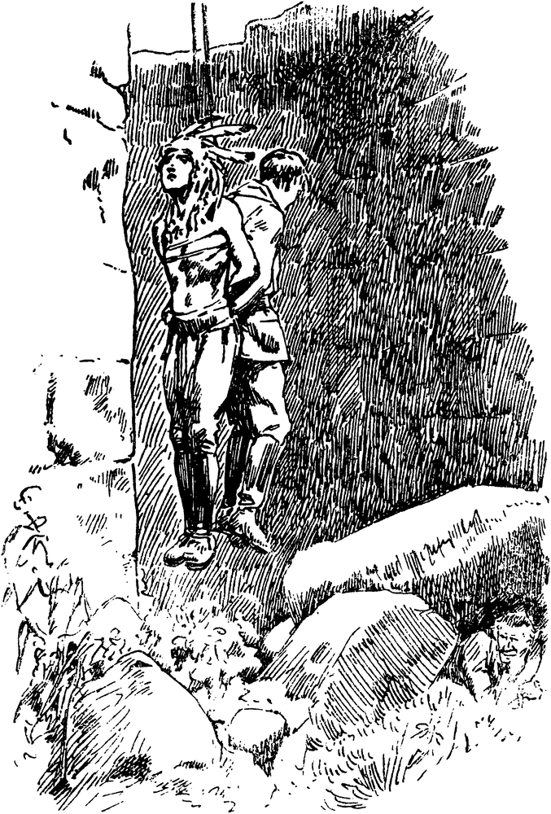

Der große Adler der Arowaken.
=============================

Das Testament.
--------------

Bevor ich hier einen Teil der tagebuchartigen Aufzeichnungen Karl Webers mit
geringen Abänderungen zur Unterhaltung und Belehrung der deutschen Jugend
veröffentliche, sei mir eine kurze Vorbemerkung gestattet, die zum besseren
Verständnis des ebenso spannenden wie überaus abenteuerlichen Inhaltes der
Niederschrift meines Freundes nötig erscheint.

Als ich in einer großen Mietskaserne des Westens der Reichshauptstadt im
Gartenhaus eine sehr bescheidene Gelegenheit von zwei Zimmern bewohnte,
begegnete ich gleich nach dem Einzuge dort recht häufig einem breitschultrigen,
stattlichen Manne, dessen Gesicht mir deswegen auffiel, weil darin der Ausdruck
schwerer körperlicher und seelischer Leiden sich selbst für den außerordentlich
scharf ausprägte, der in menschlichen Gesichtszügen zu lesen weniger gut
versteht als ein Berufsschriftsteller, dessen Tätigkeit eine erhöhte Beachtung
allen Erscheinungen des Lebens gegenüber verlangt.

Bald hatte ich dann festgestellt, daß dieser Mann, der meine Aufmerksamkeit und
bald auch meine Neugier erweckt hatte, mein Flurnachbar war. Da wir beide
Junggesellen waren und in demselben Speisehaus unsere Mahlzeiten einnahmen,
konnte es nicht ausbleiben, daß wir bereits vier Wochen nach unserer ersten
Begegnung miteinander bekannt wurden, obwohl Weber recht menschenscheu und sehr
ablehnend in seinem Wesen war.

Allmählich wurde er mir gegenüber zutraulicher, vielleicht gerade deshalb, weil
ich alle Fragen nach seiner Vergangenheit vermied, die — das hatte ich aus
gelegentlichen Bemerkungen seinerseits längst herausgefunden — recht bewegt und
ungewöhnlich sein mußte.

Zwei Monate vergingen jedoch, ohne daß er trotz unseres nunmehr täglichen
Beisammenseins mir auch nur mit einem Worte genauer darüber Aufschluß gab,
woher die in seinen zwei Zimmern aufgehäuften fremdländischen Waffen und
Reiseandenken aller Art, ferner verschiedene merkwürdige Gewehre und Pistolen
stammten und weshalb er ganz offenbar unter einem beständigen Seelendruck und
auch körperlichen Schmerzen litt.

Dann ging es mit seiner Gesundheit plötzlich erschreckend schnell bergab. Er
wurde bettlägerig. Einen Arzt wollte er nicht befragen. Als ich schließlich
energisch darauf drang, sagte er mir eines Abends: »Gib Dir keine Mühe. Mir
kann kein Arzt helfen. Gegen die Giftstoffe, die meinen Körper langsam zerstört
haben, kennt die Wissenschaft keine Hilfe, zumal ich auch nicht mehr den Wunsch
habe, diese Daseinslast weiterzutragen. Mir fehlt der Wille, gesund zu werden,
der Wille zum Leben.«

Und wieder drei Tage später, als ich auf eigene Verantwortung einen mir
befreundeten Professor an sein Krankenbett geführt und dieser offen erklärt
hatte, er käme hier zu spät, sprach Karl Weber etwa folgendermaßen zu mir:

»Ich besitze keinerlei Angehörige. Daher habe ich gestern ein Testament
verfaßt, das Dich zu meinem Erben macht. Alles soll Dein sein, was Du in diesen
meinen Räumen siehst. Dort in meinem Schreibtisch wirst Du auch ein Tagebuch
finden, besser eine Aufzeichnung meiner Erlebnisse in Südamerika. Ich stelle
Dir frei, nach meinem Tode diese meine Erinnerungen beliebig zu verwerten.
Vielleicht kannst gerade Du als Schriftsteller davon Gebrauch machen.«

Als er merkte, daß es mit ihm zu Ende ging, mußte ich ein Geheimfach seines
altertümlichen Schreibtisches öffnen.

Darin lagen außer einem versiegelten Bündel Papiere ein etwa 15 Zentimeter
großes, quadratisches Stück Leder, auf dem in blauer und roter Farbe eine Menge
offenbar indianischer Zeichnungen eingekerbt war, ferner eine schlechte
Photographie, die meinen Freund zusammen mit einem stattlichen Indianer, beide
in ledernen, reichverzierten Jagdanzügen und bewaffnet, darstellte, schließlich
noch sein Testament.

Die Photographie ließ er sich reichen, behielt sie dann bis zu seinem letzten
Atemzuge in den Händen, nahm sie auch mit ins Grab, wie er dies in seinem
Testament bestimmt hatte.

Nach seinem Tode fand ich dann auch in einem eisenbeschlagenen Holzkoffer außer
anderen merkwürdigen Kleinigkeiten in einem Lederbeutel eine Menge Goldkörner
der verschiedensten Größe, darunter viele vom Umfange einer Haselnuß. Die
Erbschaft, die ich antrat, hatte mithin für mich nicht nur ideellen Wert als
die letzte Freundschaftsbezeigung eines seltenen und seltsamen Mannes, sondern
überhob mich auch für lange Zeit aller Nahrungssorgen und gestattete mir längst
ersehnte Reisen ins Ausland zu unternehmen, die meinen Blick für Menschen und
Dinge weiteten und mir in meinem Berufe sehr nützlich waren.

Das versiegelte Bündel Papiere aus dem Geheimfach stellte Karl Webers
Erinnerungen an den Abschnitt seines Lebens dar, den er selbst als den
Höhepunkt seines Daseins infolge der innigen Freundschaft mit Madua, dem
Häuptling der Arowaken, bezeichnet hat.

Nach dieser Einleitung soll Karl Weber selbst das Wort haben.

<h2>1. Kapitel.</h2>

<h3>Die Indianertruppe des Zirkus Pelvoux.</h3>

Um das Jahr 1890 herum war man, was die Darbietungen einer Zirkusschau
anbetrifft, noch nicht so verwöhnt wie heutzutage, wo nach dem Beispiel des
großen Hamburger Tierzüchters Hagenbeck jeder bessere Zirkus zum mindesten eine
Truppe Botokuden, Patagonier, Indier, Chinesen oder andere Farbige sowie eine
Anzahl wilder Tiere mitsichführt.

Für Berlin galt es daher als ein besonderes Ereignis, als 1891 der französische
Riesenzirkus Pelvoux in seiner Zeltstadt auf dem Tempelhofer Feld auch etwa
sechzehn südamerikanische Indianer in allerlei Künsten zeigte, die, wie auf dem
Programm zu lesen war, die letzten Überlebenden des Stammes der Abipones sein
sollten, der ja tatsächlich schon damals infolge langjähriger Kämpfe mit den
Nachbarstämmen und Krankheitsepidemien als ausgestorben galt.

Als das französische Zirkusunternehmen schon Wochen vorher sein Erscheinen in
Berlin durch eine gewaltige Reklame bekanntgegeben und gleichzeitig eine Anzahl
Leute für allerlei nebensächliche Verrichtungen gesucht hatte, befand ich mich
gerade wieder einmal vollständig auf dem Trockenen, wie man zu sagen pflegt,
das heißt, in meiner Börse war gähnende Leere.

Ich, der infolge falscher Erziehung nichts Rechtes gelernt hatte, der als Kind
und Jüngling im Reichtum groß geworden und dann nach dem plötzlichen
Zusammenbruch des Geschäftes meines Vaters und dem kurz darauf erfolgten Tode
meiner verbitterten Eltern ganz auf sich allein angewiesen war, der nunmehr den
Kampf ums tägliche Brot in allen seinen kläglichen Formen ausgekostet, bald als
Zeitungsverkäufer, bald als Kellner, Reporter, Landarbeiter und so weiter und
so weiter fast alle einfacheren Berufe kennen gelernt hatte, — ich besann mich
damals keinen Augenblick, als Statist in der großen Pantomime »Die Goldgräber
des San Juan-Flusses« mitzuwirken, meldete mich auf dem Bureau des Zirkus,
wurde, zumal ich von guter Figur war und auch reiten konnte, sofort angenommen
und bis zum Eintreffen der Pelvoux’schen Wagenburg als Reklamemacher verwendet,
das heißt, ich mußte den ganzen Tag über in der Friedrichstraße und Unter den
Linden ein Riesenschild mit den verlockendsten Schilderungen der
Sehenswürdigkeiten der Zirkusschau umhertragen.

Als die Proben dann begannen — inzwischen war der Zirkus angelangt — lernte ich
auch die angeblich »letzten« Abipones kennen. Nun — es waren natürlich keine
Abipones, vielmehr eine zusammengewürfelte Gesellschaft aus allerlei Stämmen
Südamerikas: Mochos, Kariben, Mundurukus, vier Chiquitos aus dem Nordteile des
berüchtigten Gran Chako, wo sich rote und weiße Buschklepper ein Stelldichein
geben, ferner Penchuelchen aus den argentinischen Steppen, zwei Feuerländer und
schließlich ein einzelner Angehöriger des großen Volkes der Arowaken.

Dieser, Madua mit Namen, fiel mir sofort auf. Einmal seines kräftigen Wuchses
und seiner edlen Haltung wegen, dann aber besonders infolge seiner
Zurückhaltung den anderen Roten gegenüber und — einer gewissen Ähnlichkeit mit
mir selbst.

Es ist gewiß ein merkwürdiger Zufall, wenn ein Indianer und ein Weißer fast
genau denselben Gesichtsschnitt, dieselben dunkelbraunen, fast schwarzen Augen
und dieselbe gerade, wenn auch etwas starke Nase haben. Man darf ja nicht
vergessen, daß die meisten Indianer Südamerikas im Gegensatz zu den
nordamerikanischen Indsmen durch ihre Augenpartie und die platte, breite
Kopfform mehr den asiatischen Völkern, abgesehen von der Hautfarbe, gleichen.

Kurz — Madua und ich besaßen wirklich eine ganz auffallende Ähnlichkeit. Ich
trug das Gesicht auch genau so glatt rasiert, wie er völlig bartlos war, und
unsere Körper entsprachen einander, zumal wir etwa gleich alt, Ende der
Zwanzig, waren, genau so wie unsere Gesichtszüge.

Sehr bald fühlte ich mich zu dem ernsten, schweigsamen Arowaken, der ein
glänzender Reiter, Messerwerfer und Schütze, sowohl mit Gewehr, als auch mit
Lanze, Bogen und Pfeil war, stark hingezogen. Mein Interesse für Südamerika,
das darauf zurückzuführen war, weil ein Bruder meines Vaters dort jahrelang als
Farmer gelebt und in häufigen Briefen über Land und Leute berichtet hatte,
vereinigte sich jetzt gleichsam in diesem einen Vertreter der Ureinwohner
dieses Erdteils.

Madua blieb jedoch mir gegenüber zunächst genau so abweisend wie zu allen
anderen Leuten, die sich an den stolzen Arowaken mit dem energischen,
braunroten Charakterkopf aus müßiger Neugier herandrängten, weil einer der
anderen Indianer, ein Munduruku, längst erzählt hatte, Madua sei ein
Häuptlingssohn, dessen Vater der frühere Kaiser Dom Pedro von Brasilien wegen
Anzettelung eines Aufruhrs habe erschießen lassen.

Dieser Munduruku namens Ikorri machte übrigens kein Hehl daraus, daß sein Stamm
und die Arowaken seit langem in Todfeindschaft miteinander gelebt und daß die
gegenseitigen Überfälle erst aufgehört hätten, nachdem die Unterabteilung des
großen Arowaken-Volkes, zu der Madua eigentlich gehörte, die Ipurinen, in die
Nordwestecke Brasiliens als neues ständiges Jagdgebiet abgewandert wären.

Zu Reibereien zwischen den beiden Roten als den Vertretern feindlicher Stämme
war es bisher nur deswegen nicht gekommen, weil Madua dem Munduruku stets
auswich und auf keine der zahlreichen Anrempeleien je etwas erwiderte.

Gerade Ikorri sollte uns dann zu Freunden machen. Und dies geschah
folgendermaßen.

Eines Abends nach der Vorstellung hatte ich Stallwache in dem großen,
langgestreckten Zelt, an dessen einem Ende in einem abgeteilten Raume die
Indianer hausten. Die Pferde waren sehr unruhig, da draußen ein Gewittersturm
tobte und der Wind die Zeltleinwand knallend auf und ab drückte. Madua ritt nun
in der Pantomime einen sehr feurigen Fuchs, der heute sein ungestümes
Temperament durch häufiges Auskeilen und Umsichbeißen wieder einmal bewies. Ich
hatte alle Mühe, den Fuchs zu beruhigen, da ich fürchtete, er würde sich
losreißen.

Als ich gerade dem Pferde abermals begütigend den schlanken Hals klopfte,
tauchte lautlos wie ein Schatten Ikorri neben mir auf, riß mich mit einem Ruck
zur Seite und sagte in seinem miserablen Englisch:

»He — Starkhand nichts verstehen von Pferden. Ikorri mit Fuchs schon werden
fertig.«

Der Munduruku wollte sich um Maduas Tier kümmern?! Das kam mir sofort
verdächtig vor.

Ich schob ihn sehr energisch zurück.

»Geh’, Ikorri, Du hast hier nichts zu suchen. Ich habe die Wache. Wenn Du nicht
gehorchst, melde ich Dich dem Direktor. Dann zieht er Dir von Deinem Lohn ab.
Das weißt Du. Außerdem — gerade Dich würde ich nie an Maduas Fuchs heranlassen.
Du bist Maduas Freund nicht.«

Der Munduruku, gut einen halben Kopf länger und bedeutend breiter als ich,
zischte mich sofort wie eine giftige Schlange an:

»Starkhand wird bereuen sehr, mich zu fassen an! Ikorri nicht vergessen, daß Du
auch halten zu elendem Madua.«

Ich muß hier bemerken, wie ich unter den Zirkusleuten sehr schnell zu dem Namen
Starkhand gekommen war. Einer der Klowns namens Tom Brestol hatte nebenbei noch
eine zweite Nummer, das heißt er produzierte sich auch, als Japaner verkleidet,
als Degenschlucker und Zauberkünstler. Einer seiner Haupttricks war nun,
Ziegelsteine mit der bloßen Faust zu zerschlagen. Dies ist durchaus nicht
schwierig, wenn man es nur versteht, den auf die andere Hand hohl hingelegten
Stein richtig zu treffen. Ich kannte den Trick, machte ihn einmal Brestol im
Zirkusrestaurant nach und zwar in Gegenwart Maduas, dem dabei die Worte
entschlüpften: »Oh — ein Starkhand!« Seitdem war mein ehrlicher Name Weber im
Zirkus ausgeschaltet. Alles nannte mich nur noch Starkhand, sehr zum Ärger des
Klowns, der mir von Stund an gern etwas am Zeuge flicken wollte. —

Nun zurück zu Ikorri und mir. Als dieser so verächtlich von Madua sprach, der
sich doch bei allen trotz seines scheinbaren Hochmuts großer Achtung erfreute,
wallte in mir plötzlich das von meiner Mutter, einer Portugiesin, ererbte
leidenschaftliche Blut auf.

»Sofort scherst Du Dich aus dem Stalle heraus, sofort!« brüllte ich den Roten
an und hob drohend den Arm. »Vielleicht ist Dein Schädel auch nicht härter als
ein Ziegelstein. Wollen wir’s mal probieren?!«

Da hatte Ikorri schon in den ledernen Gürtel gegriffen. Sein langes, leicht
gekrümmtes Jagdmesser blitzte auf. Ich fühlte bereits geradezu den tödlichen
Stich, als des Mundurukus rechtes Handgelenk ebenso plötzlich, von einem
eisernen Griff umspannt, machtlos herabsank und hinter meinem Gegner nun auch
Maduas Gestalt sichtbar wurde.

»Ikorri mag sich zum Schlafe niederlegen,« sagte der Arowake ohne jede
Erregung. »Maduas Arm wird stets bereit sein, Starkhand zu schützen.« Er sprach
das Englische ziemlich fehlerfrei, war auch nicht ganz unbewandert im
Französischen und Deutschen, wie ich bereits wußte.

Ikorri zog wutschnaubend und unter allerlei Drohungen ab. Madua aber reichte
mir die Hand, führte die meine an sein Herz, dann an seine Stirn und erklärte
feierlich:

»Starkhand ist Maduas Freund. Madua wird glücklich sein, wenn Starkhand nicht
zurückweist die Freundschaft des roten Mannes.«

»Oh — keineswegs!« rief ich warm und ehrlich. »Längst hätten wir vertrauter
sein können, wenn Du nicht so scheu und zurückhaltend gewesen wärest.« Ich
drückte seine Hand fest und nickte ihm herzlich zu.

Da, zum ersten Male seit ich ihn kannte, glomm in seinen Augen ein frohes
Leuchten auf, strahlte sein Gesicht vor Freude.

»Madua ist jetzt glücklich. Starkhand ist sein Bruder.«

Ah — ich horchte auf. Bruder hatte er gesagt! Das war mehr als Freund!

Er hatte sich vorsichtig umgeschaut. »Madua trägt ein Geheimnis in seiner
Brust. Er muß vorsichtig sein,« flüsterte er. »Der Sohn des Oberhäuptlings der
Arowaken ist nicht nach Europa gekommen, um bedrucktes Papier (er meinte
Banknoten) zu sammeln und dann heimzukehren, wie die anderen es wollen.«

Er hätte wohl noch mehr hinzugefügt, wenn jetzt nicht einer der Stallmeister
des Zirkus, auf einem Revisionsgang begriffen, sich genähert hätte. Er fand
alles in Ordnung und entfernte sich bald wieder.

Inzwischen schien Madua jedoch zu dem Entschluß gelangt zu sein, vorläufig über
Einzelheiten seines bisher nur angedeuteten Geheimnisses zu schweigen.

Unser Gespräch wandte sich anderen Dingen zu. Ich war natürlich taktvoll genug,
das vorherige Thema nicht wieder anzuschneiden.

Um ein Uhr nachts wurde ich abgelöst. Madua hatte mir bis dahin Gesellschaft
geleistet, da die Pferde nochi immer sehr unruhig waren. Dann forderte ich ihn
auf, mich in meine Dachstube zu begleiten, die ich mir in einer der Straßen
unweit des Tempelhofer Feldes gemietet hatte. Mein Wirt, ein Flickschuster,
würde sicher nichts dagegen haben, wenn der Indianer mit mir den kleinen Raum
weiterhin teilte.

»Es muß für Dich jetzt unerträglich sein, mein Bruder,« fügte ich zur
Begründung meines Ansinnens hinzu, »mit Ikorri in demselben Zeltverschlag zu
wohnen und zu schlafen. Ikorri ist hinterlistig und gewalttätig. Du müßtest
ständig auf Deiner Hut sein. Bei mir bist Du sicher vor jeder Heimtücke.«

Madua lächelte ein wenig. »Ich fürchte den Munduruku nicht, mein Bruder. Aber
ich gebe zu, daß er mich vielleicht zwingen könnte, von einer Waffe gegen ihn
Gebrauch zu machen. Und da wir hier nicht in den Urwäldern und Savannen
Innerbrasiliens uns befinden, würden die Männer mit den blauen Röcken und den
Töpfen auf dem Kopf (er meinte unsere Schutzleute) mich holen kommen. Mein
Bruder ist auf mein Wohlergehen sehr bedacht. Ich danke ihm und werde bei ihm
bleiben.«

So wurde der Arowake mein Gast. Der Flickschuster fühlte sich geehrt, einen der
berühmten Roten des Zirkus Pelvoux bei sich beherbergen zu dürfen, war dann
aber offenbar etwas enttäuscht, als er Madua genauer kennenlernte und sah, daß
der Indianer sich nicht anders benahm als ich und keineswegs den Eindruck eines
Wilden machte trotz seines heimatlichen Jagdanzuges aus feinstem gegerbten
Leder und trotz des Kopfschutzes aus Affenfell mit Adlerfedern und des Messers
und der Wurfkeule, die an seinem Gürtel befestigt waren und die er nie ablegte.

Eine Woche darauf — inzwischen hatte Madua auch seine geringen Habseligkeiten
in meine Dachstube geschafft — sprachen wir bei unserem bescheidenen Abendbrot
kurz vor der Vorstellung wieder einmal über seine Heimat, die mir ja durch die
Briefe des Bruders meines Vaters nicht mehr ganz unbekannt war.

Mein Onkel Herbert, dies muß ich hier noch einfügen, hatte jedoch bereits ein
Jahr vor dem Tode meiner Eltern nichts mehr von sich hören lassen. An ihn
gerichtete Briefe waren nach einem halben Jahre stets mit dem Vermerk
zurückgekommen: »Adressat auf einem Jagdzuge verschollen.«

An jenem Abend nun, als wir wieder einmal über Brasilien sprachen, von dessen
Ausdehnung ich bis dahin nur eine recht schwache Vorstellung gehabt hatte
(nimmt es doch etwa die Hälfte von ganz Südamerika ein und ist es doch ungefähr
viermal so groß als Deutschland), erinnerte ich mich plötzlich, daß mein Oheim
meinem Vater einst mit einer Sendung wertvoller Schmuckfedern eine indianische
Zeichnung, die auf einem Stück Leder eingeritzt war, mitgeschickt hatte. Mein
Vater hatte in ihr stets nur eine Kuriosität gesehen. Auch ich als sein Erbe
hatte sie lediglich als Andenken an den Verschollenen betrachtet.

Ich holte sie aus einem alten, eisenbeschlagenen Holzkoffer hervor, reichte sie
Madua mit einigen erklärenden Worten und fragte ihn nach der Bedeutung des
Lederstücks, das etwa fünfzehn Zentimeter im Quadrat groß war und acht Reihen
kunstloser Zeichnungen enthielt.

Der Arowake trat damit an das kleine Fenster, sagte dann nach einer Weile:

»Mein Bruder möge mir mitteilen, ob sein Verwandter, als er diese Bilderschrift
sandte, etwas über deren Bedeutung hinzugefügt hat.«

»Nichts. Oder doch jedenfalls nur, daß es sich um eine wertvolle Rarität
handele, die mein Vater gut aufbewahren solle.«

Madua gab mir das Lederstück zurück. »Jetzt ist nicht Zeit genug, darüber
genauer zu sprechen, mein Bruder. Wir müssen in den Zirkus,« meinte er mit
seiner gewohnten, unerschütterlichen Ruhe. »Nach der Vorstellung will ich die
Bilderschrift zu deuten versuchen. Verwahre sie gut. Sie ist vielleicht
wertvoller, als Du glaubst.«

<h2>2. Kapitel.</h2>

<h3>Unter Flußpiraten des Amazonas.<@refnote/></h3>

Zwei Monate später langte die in Bremen beheimatete Brigg Marie mit ihrer
Ladung landwirtschaftlicher Maschinen und ihren beiden einzigen Fahrgästen in
Para, dem Hauptausfuhrhafen für das Stromgebiet des Amazonas, nach etwas durch
Stürme verzögerte Reise an.

Diese beiden Fahrgäste waren Madua und ich. Weshalb wir Deutschland fluchtartig
verlassen hatten, will ich an anderer Stelle berichten.

Unser ferneres Reiseziel war die Stadt Fonteboa am Oberlauf des größten aller
Ströme der Erde, des rund 5400 Kilometer langen Rio de las Amazonas. Bisher
hatte ich stets geglaubt, der Name Amazonenstrom hinge mit Amazonen, jenem
kriegerischen Weibervolke des Altertums, irgendwie zusammen. Madua belehrte
mich eines besseren. Die Indianer nannten den Riesenfluß, als die ersten
Europäer um das Jahr 1500 den Boden des heutigen Brasiliens betraten, Amassona,
Bootzerstörer, da er seine großen Tücken hat, insbesondere in Gestalt der
berüchtigten Pororoca, einer Flutwelle, die während der Zeit des Neu- und
Vollmondes ganz plötzlich entsteht und mit furchtbarem Getöse bei einer Höhe
bis zu acht Meter reißend schnell dahinschießt, alles mit sich fortführend, was
ihr auf ihrem Laufe begegnet. Mit Amazonen hat der gewaltige Strom also gar
nichts zu tun.

Para liegt am Ufer des gleichnamigen Flusses weit ab vom Ozean der Insel Marajo
gegenüber. Es war die erste brasilianische Stadt, die ich in Augenschein nehmen
konnte. Ich war überrascht über die teilweise an europäische Großstädte
erinnernden breiten, wohlgepflegten Straßen, besonders aber über den Hafen mit
seinen großartigen Kaianlagen, an denen Schiffe bis zu sieben Meter Tiefgang
festlegen können.

Unsere Ankunft dort fiel gerade in eine sehr unruhige Zeit. Zwei Jahre vorher
war das Kaisertum in Brasilien gestürzt und die Republik ausgerufen worden. Im
Herbst 1891 hatten dann die Putschversuche gegen den damaligen Präsidenten
Fonseca begonnen, und die Stadt Para war in ein kleines Heerlager verwandelt,
wo der General Osorio, das Haupt der gegen Fonseca gerichteten Bewegung,
Truppen anwerben, ausrüsten und einexerzieren ließ.

Madua und ich stiegen in einem kleinen deutschen Gasthofe an der westlichen
Stadtgrenze ab.

Der Besitzer, August Grunert mit Namen, war ein Ostpreuße, einer jener zähen,
fleißigen deutschen Einwanderer, denen Brasilien so unendlich viel zu verdanken
hat.

Grunert betrieb nebenbei noch einen Kramladen, in dem es einfach alles gab.
Sogar eine Lokomobileiii hatte er zum Verkauf auf dem Hofe stehen.

Bei dem dicken, behäbigen Ostpreußen wurde ich eingekleidet. Meinen bisherigen
städtischen Anzug nahm er für den wildledernen Jagdanzug, das rote Flanellhemd,
den breitkrempigen, hellgrauen Filzhut, einen Ledergürtel und hohe Stiefel mit
Riesensporen in Zahlung.

Auch Madua verwandelte sich hier wieder in den freien Sohn der Wildnis, das
heißt, er legte sein heimatliches Gewand wieder an, das er während unserer
Flucht, um nicht aufzufallen, gegen einen meiner Anzüge vertauscht hatte.

Die Frage der Bewaffnung, für uns mit das wichtigste, war bei mir bereits
gelöst. Ich hatte mir nämlich von Berlin sowohl zwei Revolver, die früher
meinem Vater gehörten, als auch eine kurze Büchse mitgebracht, so daß mir nur
noch ein Jagdmesser und ein Handbeil mit Lederschutzkappe fehlten.

Mit dieser Büchse hatte es nun eine besondere Bewandtnis. Ich muß notwendig
hierauf näher eingehen, da diese Waffe es schnell unter den wilden Indianern
des Amazonengebiets zu einer gewissen Berühmtheit brachte.

Ein jeder Mensch hat sein Steckenpferd. Der eine ist Sammler, der andere
züchtet Vögel, ein dritter wieder ist auf Rosenkultur versessen und so fort.
Ich litt bereits als Junge an der sogenannten Erfinderkrankheit, wollte
durchaus etwas ersinnen, das noch nie dagewesen war. Als meine chemischen
Studien auf der Berliner Universität durch den Tod meiner Eltern für immer
unterbrochen wurden und der traurige Kampf ums Dasein für mich begann, hatte
ich gerade an einer Gewehrkonstruktion gearbeitet, die alle bis dahin
erfundenen Mehrlader in den Schatten stellen sollte. Auch während der folgenden
Jahre gab ich diese Idee nicht auf. Mir schwebte so etwas wie eine Gasbüchse
vor, bei der nicht Pulver das Geschoß antreiben sollte, sondern eben ein
Gasgemenge, das in einem besonderen Stahlzylinder hinter dem Schloß hergestellt
und für etwa hundert Schuß ohne Erneuerung ausreichen müßte. Als ich Madua
kennen lernte, war meine Erfindung so ziemlich fertig und auch für Schüsse bis
200 Meter durchaus gebrauchsfähig. Das Modell der Büchse hatte ich dann während
der Seereise auf der Brigg vervollständigt und auch ausprobiert. Der Kapitän
und die Besatzung der Maria waren begeistert. Der Stutzen, kaum 140 Zentimeter
lang, schoß tadellos. Patronen waren dazu nicht nötig. In eine Kammer im Schaft
kamen lediglich zwanzig längliche, stark eingefettete Bleigeschosse hinein. Der
Stutzen war recht schwer und sah sehr plump aus, da er keinen Hahn, vielmehr
gleich hinter dem Lauf einen viereckigen Stahlkasten hatte, der in den Kolben
überging. Unter dem Stahlkasten lag der stark geschweifte Abzugsbügel, darüber
der Drücker. Schob man den Abzugsbügel nach vorn, so öffnete sich auf der
Oberseite des Stahlkastens eine längliche Klappe, unter der zwei Öffnungen sich
befanden, eine zum Einführen der Geschosse in die Kammer, die zweite für einen
angefeuchteten Wattebausch, der seine Nässe tropfenweise bei jedesmaligem
Laden, das durch Zurückziehen des Abzugsbügels geschah, in den Stahlkasten
weitergab, wo der Tropfen auf ein besonderes, in fester Form von mir
hergestelltes chemisches Gemenge fiel. Dadurch entwickelten sich große Mengen
Gas, die in dem Stahlkasten so lange unter ungeheurem Druck aufgespeichert
blieben, bis der Drücker abgezogen wurde, der dann nur gerade die zum Abfeuern
einer Kugel nötige Gasmenge freigab. Meine Konstruktion hatte also entfernte
Ähnlichkeit mit einer Windbüchse, nur daß ich imstande war, zwanzig Schuß ohne
abzusetzen abzugeben, und auch dann nur die Kammer wieder zu füllen brauchte,
denn die chemischen Würfel für den Stahlkasten und die Feuchtigkeit des
Wattebausches reichten für weit über hundert Schuß und ließen sich außerdem
sehr leicht erneuern.

Wie gesagt — mir fehlte nur noch Jagdmesser und Beil. Schwieriger war es, für
Madua Waffen einzukaufen, da unsere Reisekasse bei der Ankunft in Para so
ziemlich leer war. Meinem roten Freunde fehlten Gewehr und Revolver, leider
damals schwer zu haben, da die Revolutionäre alles längst beschlagnahmt hatten.

Da half der gutmütige August Grunert ans, dem wir unsere Erlebnisse in Berlin
ruhig anvertraut hatten. Gegen einen Spottpreis überließ er Madua einen
tadellosen Mauserkarabiner nebst zweihundert Patronen sowie zwei Revolver
amerikanischen Fabrikats nebst ebenso viel Munition.

Drei Tage blieben wir in dem sauberen Gasthofe. Madua durfte sich in der Stadt
nicht zeigen, da er als Sohn seines der Regierung einst so verhaßt gewesenen
Vaters vielleicht dessen Schicksal geteilt hätte, wenn man seiner habhaft
geworden wäre. So war es denn meine Aufgabe, einen Dampfer ausfindig zu machen,
auf dem wir als Heizer oder dergleichen ohne Bezahlung bis Fonteboa gelangen
könnten.

Durch die politischen Unruhen war jedoch auch der Schiffsverkehr auf dem
Amazonas sehr in Mitleidenschaft gezogen worden. Endlich hatte ich Glück. Ich
entdeckte am Kai einen eben eingetroffenen Dampfer, dessen Kapitän sich bereit
erklärte, uns mitzunehmen, wenn wir Heizer spielen wollten. Der Mann war ein
Irländer mit einem wahren Bulldoggengesicht, einem knallroten Schifferbart und
einer Grobheit, die ihresgleichen suchte. Der Dampfer hieß Folkestone und hatte
angeblich Metallwaren geladen. Es war nur ein kleines, altes, verwahrlostes
Schiff. Der rothaarige Kapitän hatte — was mir erst später wieder einfiel —
mich gefragt, nachdem ich mit meinem Anliegen herausgerückt war: »Habt Ihr auch
Waffen, Ihr verkappten Bravos (Banditen)? Und — versteht Ihr damit umzugehen? —
Wenn nicht, fahrt mit des Teufels Großmutter stromaufwärts!« — Ich bejahte sehr
eifrig, und dann erst war er zufriedengestellt.

Am nächsten Morgen begaben wir uns nach herzlichem Abschied von Grunert an Bord
der Folkestone, die gleich darauf vom Kai losmachte.

Madua hatte sich sofort in unsere uns zugewiesene Kammer zurückgezogen, da am
Kai eine Menge Menschen der Abfahrt des Dampfers zuschaute und daher zu
befürchten stand, er könnte zufällig erkannt werden.

Ich war oben auf Deck geblieben. Als die Bugtrosse eingeholt wurde und die
Schraube zu arbeiten begann, blickte ich mir die Leute an, die vom Kai aus
unser Schiff beobachteten.

Plötzlich zuckte ich zusammen. Das — das war doch ohne Zweifel unser Klown Tom
Brestol vom Zirkus Pelvoux, der dort halb verborgen hinter einem Stapel Fässer
hervorlugte?! — Ja — er war’s! Denn jetzt zog er den Kopf zurück, verschwand.
Er hatte gemerkt, daß ich auf ihn aufmerksam geworden war.

Als ich nachher Madua berichtete, ich hätte Brestol hier in Para soeben
wiedergesehen, erwiderte er gleichmütig:

»Auch der Hund von Munduruku ist in Para, mein Bruder. Madua bemerkte ihn
wieder vor dem Hause des dicken Mannes, der so viel Wasser und Rum trank.«
(Damit war der grogbegeisterte Grunert gemeint.)

Ich war natürlich sprachlos. »Weshalb hast Du mir erst jetzt hiervon erzählt?«
meinte ich kopfschüttelnd. »Es ist doch jedenfalls sehr auffällig, daß gerade
Ikorri und Tom Brestol ausgerechnet in Para auftauchen, der einzigen
Hafenstadt, von der aus man stromaufwärts gehen kann!«

»Mein Bruder Starkhand mag abwarten,« erwiderte er gelassen. »Wir werden bald
erfahren, ob meine Vermutung zutrifft. — Gehen wir jetzt in den Maschinenraum
an die Arbeit.«

Ich forschte nicht weiter. Madua haßte alle langen Erörterungen. Ich wußte, er
würde schon zur rechten Zeit mir erklären, was er über unsere beiden früheren
Kollegen vermutete.

Die Folkestone gelangte von Para auf dem gewöhnlichen Wege, durch den
natürlichen Kanal Tajipuru, in den Amazonas. Wie erstaunt war ich dann über
dessen Größe! Nie hatte ich geglaubt, daß dieser Strom stellenweise über zehn
deutsche Meilen breit war. Man fuhr wie auf einem riesigen Landsee dahin,
dessen Ufer man von der Mitte aus nur noch als schwache grüne Streifen
erkannte.

Der Dampfer, dessen achtzehn Mann starke Besatzung aus recht üblem Gesindel
bestand, legte während der ersten drei Tage nirgends an. Dann, kurz vor der
Stadt Santarem, kamen spät abends in einem Boot vierzehn Mestizen an Bord,
alles die richtigen Galgenvögel, mit denen der Kapitän aber eng befreundet
schien.

Eine Stunde etwa nach Übernahme dieser Gäste, die sämtlich bewaffnet waren,
ließ mich der rote Irländer rufen und fragte mich, ob wir, Madua und ich,
gewillt seien, ein schönes Stück Geld zu verdienen. Aus seinen weiteren
vorsichtigen Andeutungen, durch die er meine Gesinnung festzustellen suchte,
entnahm ich, daß die Folkestone nichts anderes beabsichtigte als einen der
großen Dampfer der englischen Dampferkompagnie, die hier neben anderen
Gesellschaften den Fracht- und Personenverkehr betreibt, zu kapern und
auszuplündern.

Ich sagte mir sofort, daß es in unserer Lage einfach unmöglich war, eine
Beteiligung abzulehnen. Die Flußpiraten, die dieses lichtscheue Handwerk
fraglos seit langem ausübten, hätten uns wahrscheinlich als unliebsame Zeugen
einfach kalt gemacht.

Daher tat ich so, als käme es uns lediglich aufs Geldverdienen an. Alles andere
wäre uns gleichgültig.

Der Kapitän nickte grinsend. »Hab’ mich in Euch beiden nicht getäuscht! Wo rot
und weiß sich zusammentun, sind’s allemal Burschen, die man brauchen kann.«

Er hielt uns also für seinesgleichen, der Rotfuchs. Nun — daß er sich gewaltig
getäuscht hatte, sollte er bald erfahren.

Ich kam in den Maschinenraum zurück und erstattete Madua leise Bericht. Außer
uns waren noch zwei Heizer vorhanden. Er erwiderte kurz — und das war ja sein
Hauptgrundsatz: »Abwarten!«

Gleich darauf ging die Folkestone dicht an einer der zahlreichen Inseln im
Strome vor Anker. Wir wurden an Deck geholt, mußten uns mit unseren Revolvern
bewaffnen und dann in das Boot der Mestizen steigen, das der Dampfer im
Schlepptau gehabt hatte.

Die Nacht war schwül und dunkel. Unserem Boot folgte ein zweites, in dem sich
der Kapitän mit elf Mann befand. Sie hatten eiserne Ketten mit, die dann zum
Verkoppeln mehrerer treibender Urwaldriesen benutzt wurden. Dieses Hindernis
mußte einen Dampfer notwendig aufhalten.

Ich war gespannt, wie sich die Dinge weiter entwickeln würden. Madua saß still
und stumm neben mir vorn im Boot, das von vier Mestizen gerudert wurde und ein
Ende der aus fünf entwurzelten Stämmen bestehenden Kette schleppte, während das
andere Ende mit dem Boote des Kapitäns verbunden war.

Jetzt tauchten in weiter Ferne die Lichter eines großen Schiffes auf. Es kam
stromabwärts, und ich zweifelte nicht, daß es die Beute war, der wir hier in
der Fahrrinne des Stromes auflauerten. Bemerken muß ich, daß der Amazonas bei
der Stadt Santarem durchschnittlich zwei Meilen breit ist, daß die Dampfer und
Segler aber stets die Fahrrinne benutzen, die die stärkste Strömung und die
größte Tiefe hat.

Unsere beiden Boote trennten sich jetzt und zogen die Baumkette quer über der
Fahrrinne straff. Die Absicht der Piraten war klar: Wenn der Dampfer dort vor
uns auf die Stämme stieß und dann das Hindernis mitfortschleppte, würde er bald
stoppen und versuchen, das Anhängsel loszuwerden. Das nur mit dem Strom
vorwärtstreibende Schiff zu entern, war weiter nicht schwierig.

Mir wollte es durchaus nicht gefallen, daß Madua und ich ruhig zusehen sollten,
wie diese Flußpiraten hier den ahnungslosen Dampfer kaperten, und daß wir auch
noch an diesem Schurkenstreich teilnehmen müßten, wenn auch nur als Zuschauer.
Ich stieß meinen Freund daher jetzt leise an und flüsterte ihm zu:

»Noch immer abwarten, Madua?«

Da erhob er sich, schien nach dem näherkommenden Dampfer auszuspähen, rief dem
Anführer der Mestizen zu, als habe er das Schiff erst jetzt bemerkt: »He — ein
Steamer!« — taumelte dann plötzlich, verlor das Gleichgewicht und stürzte über
Bord, ohne wieder aufzutauchen. Sein Hilferuf und seine angstvollen Bewegungen
machten es selbst mir schwer, sofort zu entscheiden, ob hier Absicht oder ein
Unfall vorläge. Jedenfalls schien die reißende Strömung ihn verschlungen zu
haben.

Die Gelbgesichter fluchten erst, lachten dann höhnisch.

»Was liegt an dem roten Hund,« meinte der Anführer, den die anderen sehr
ehrerbietig mit Sennor Tarbatoiv anredeten, zu mir. »Willst Du nicht
nachspringen, Dutschman<@refnote/>?! Ein Greenhorn<@refnote/> wie Dich können wir ja bei dem
Geschäft, das wir vorhaben, doch nicht recht brauchen.«

Ich blieb still, nahm mir aber vor, diesem Sennor Tarbato, falls sich
Gelegenheit dazu bot, sowohl das Dutschman als auch das Greenhorn, besonders
aber den roten Hund heimzuzahlen. Die Gelegenheit kam auch.

Zehn Minuten später lag der Dampfer in unserem Anhängsel tatsächlich fest.
Inzwischen war ich doch zu der Überzeugung gelangt, daß mein Freund Madua hier
vorhin eine glänzend durchgeführte Spiegelfechterei den Mestizen vorgemacht
hatte.

Der Beweis für die Richtigkeit dieser Annahme sollte für die Stromfreibeuter
etwas blutig werden.

Die beiden Boote schlichen von hinten an den Dampfer heran, der sein Fallreep
niedergelassen und die Jolle ausgesetzt hatte, die vorn am Bug die Stämme zu
trennen suchte.

Man mußte es den Piraten zugestehen: sie verstanden ihr Handwerk! Mit einer
Schnelligkeit und Gewandtheit stürmten sie jetzt das Fallreep empor, daß das
Schicksal des Dampfers besiegelt gewesen wäre, wenn eben nicht Madua, ihm
entgegenschwimmend, die Besatzung gewarnt haben würde.

Ich hatte unten im Boot als einziger zurückbleiben und es am Fallreep
festhalten müssen. Das zweite Boot, auch nur mit einem Mann darin, lag dicht
daneben.

Jetzt knatterten oben auf Deck des großen Steamers Schüsse. Wüstes Geschrei
folgte. Und dann huschte plötzlich wie ein Schatten eine Gestalt das Fallreep
hinab: Madua!

Ich erkannte ihn erst, als er dem Piraten in dem Boote neben mir einen Hieb mit
dem Revolverkolben versetzte, den Kerl dann packte und auf das Fallreep warf.

Das ging so blitzschnell, daß ich erst richtig zur Besinnung kam, als unser
Boot mit uns beiden von der Strömung davongeführt wurde und mein roter Freund
mir zurief, zu den Riemen zu greifen.

Ich wußte nicht recht, weshalb wir jetzt mit aller Kraft dem Versteck der
Folkestone hinter der Insel zuruderten. Zum Fragen fand ich keine Zeit.

Dann war unser Dampfer erreicht. Dort hatte der Kapitän sieben Mann
zurückgelassen. Sie bestürmten uns mit Fragen. Madua erklärte, der Überfall sei
mißglückt, und der Kapitän schicke uns mit dem Befehl, die Folkestone solle
sofort am Südufer an verborgener Stelle anlegen und dort warten.

Die Piraten ließen sich auch wirklich nasführen, zumal Madua weiter hinzugefügt
hatte, das andere Boot mit dem Kapitän steuere direkt auf das Ufer zu.

Der Dampfer hob die Anker und glitt langsam über den Strom, fand hier eine der
im Amazonas so überaus zahlreichen tiefen Buchten und stoppte dicht an einer
natürlichen, durch zwei entwurzelte Bäume entstandenen Landungsbrücke.

Inzwischen hatten wir unsere Bündel schon geschnürt und schwangen uns an einem
Tau ganz vorn am Bugspriet über Bord, während die Piraten noch mit dem
Straffziehen der Heckankerketten beschäftigt waren.

Die Baumstämme als Steg zum Ufer hinüber konnten wir nicht benutzen. Wir hätten
dort, falls wir bemerkt worden wären, ein zu gutes Ziel geboten. Madua hatte
hier jedoch bereits vorgesorgt und das noch am Fallreep mitgeschleppte Boot
nach vorn geholt. So kam ich trocken an Land, denn mein roter Freund war noch
von der Schwimmtour tüchtig naß. Sein Lederwams zog er denn auch eine halbe
Stunde später an unserem Lagerfeuer in einer Urwaldlichtung aus, breitete es
über einen Strauch und hüllte sich in seine Decke.

Jetzt erst erstattete er Bericht. Der Dampfer, auf den die Piraten es abgesehen
gehabt hatten, war unerwartet von General Osorio für einen Truppentransport
gemietet worden. An Bord hatten sich dreihundert Neuangeworbene befunden, deren
Führer, ein Oberst Kohimba, gerade derjenige war, der seiner Zeit auf Befehl
des Kaisers Dom Pedro den Oberhäuptling der Arowaken gefangen genommen hatte.
Kohimbas Charakter wußte nichts von Dankbarkeit gegen den Indianer, der den
Dampfer hatte retten wollen. Kaum erkannte er Madua, als er ihn auch schon
festnehmen ließ. Trotzdem war es meinem roten Freunde geglückt, im rechten
Moment zu entwischen, wobei er allerdings die beiden ihn auf dem Achterdeck
vorläufig bewachenden Soldaten hatte niederschlagen müssen.

Dieses erzählte er mir in so knapper Form, daß ich mir die Hälfte selbst
zusammenreimen mußte. Er wollte offenbar den Eindruck vermeiden, als habe er
hier Besonderes geleistet

Unser Abenteuer auf der Folkestone sollte später mancherlei Folgen für uns
haben. Mir hatte es aber zunächst den Beweis erbracht, daß Madua an Schlauheit,
schneller Entschlossenheit und — Bescheidenheit seinesgleichen suchte.

<h2>3. Kapitel.</h2>

<h3>Watzefleck, der Reiherjäger.</h3>

Das ganze ungeheure Becken des Unterlaufs des Amazonas, der bekanntlich aus der
Vereinigung der Flüsse Ucayali und Maranon entsteht (beide auf den Kordilleren
entspringend), gehört zumeist zu Brasilien, und wird zum überwiegenden Teil von
Urwäldern bedeckt, den sog. Hyläa, die an Ausdehnung jede andere Waldregion der
Erde übertreffen.

Nach unserer Flucht von dem Dampfer der Piraten lernte ich jetzt zum ersten
Male diese Urwälder, die ich bis dahin von der Folkestone aus nur in der Ferne
gesehen, aus nächster Nähe durch unser Lager in jener Lichtung kennen, wo Madua
seine gesamte Kleidung zum Trocknen aufhängen mußte.

Hier so dicht am Amazonas, der alljährlich, von Mai bis Juli hauptsächlich,
ähnlich wie der Nil die Ufer weithin überflutet, da er bis zu 17 Meter über den
Durchschnittswasserstand dann steigt, war der Boden unserer Lichtung mit einem
so hohen Pflanzenteppich bedeckt, daß wir ihn erst niedertreten mußten, um für
unser Lager Platz zu schaffen. Hierbei ging Madua mit großer Vorsicht zu Werke,
warnte mich auch vor den giftigen Bewohnern dieser in wahren Farbenorgien
schwelgenden Lichtungen, vor Schlangen und nicht minder gefährlichen Spinnen.
Erst nachdem er das Gebüsch ringsum abgesucht hatte, war er beruhigt und winkte
mir, meine Decke auszubreiten.

Dann begann er, recht malerisch in seine Decke gehüllt, im übrigen nur mit
seinen ledernen, bis zum halben Knie reichenden, sandalenähnlichen Schuhen und
dem Kopfputz bekleidet, nach etwas Eßbarem für uns zu suchen, grub bald eine
Menge Knollen aus der Erde, die, in der Asche geröstet, wie Kastanien
schmeckten, und brachte auch nachher einen Braten herbei, ein Löwenäffchen, das
er mit der Wurfkeule erlegt hatte. Als der Braten fertig war, ging ich zunächst
mit einigem Vorurteil an die Mahlzeit heran, denn der abgehäutete Affenkörper
sah mir doch einem menschlichen Säugling zu ähnlich. Doch — nach den ersten
Bissen war diese Ähnlichkeit vergessen.

Madua aß wie immer sehr langsam und sehr wenig. Ich leitete unsere Unterhaltung
bei Tisch mit der naheliegenden Frage ein, was nun werden sollte, nachdem wir
den Dampfer als Verkehrsmittel hatten aufgeben müssen.

»Pferde,« meinte der Arowake lakonisch.

»Stehlen?« ahmte ich seine Kürze nach.

»Ja — wenn nötig, mein Bruder. Besser freilich welche fangen!«

»Fangen? Wilde?«

»Es gibt hier nur verwilderte Pferde, freilich in großen Herden. Sie gehören
niemand. Pferde sind hier billiger, mein Bruder Starkhand, als bei Dir daheim
die schleichenden kleinen Pumas.«

»Du meinst Katzen. Stimmt, die kosten nicht viel. — Also einfangen. — Und
Sättel, Zaumzeug?«

»Selbst anfertigen.«

»Sehr schön.« Ich hatte schon vorhin ein schauerliches Geheul gehört, das an-
und abschwellend, für Minuten auch ganz verstummend, selbst meinen guten Nerven
zu viel war. Von dem Getier, das den nächtlichen Urwald belebte, wußte ich ja
bisher nichts, oder doch nur so viel, als ich mal in Büchern gelesen, aber
längst halb wieder vergessen, oder was mein Onkel in seinen Briefen so nebenbei
erwähnt hatte.

Madua merkte, daß mir die gräßlichen so unheimlichen Töne aufgefallen waren,
klärte mich nun unaufgefordert darüber auf.

»Es sind Brüllaffen, Guaribas, rötlich-braune, sehr flinke und herdenweis
lebende Gesellen, mein Bruder,« sagte er. »Nachts schlafen sie gewöhnlich. Wenn
sie unruhig werden, hat das stets einten besonderen Grund. Meist haben sie dann
einen Jaguar oder einen Puma entdeckt. Ersterer ist ihr geschworener Feind.
Wenn dieses Brüllen in Deiner Nähe laut wird, tust Du stets gut, wachsamer als
sonst zu sein!«

Es schien, als wollte der düstere, nächtliche Urwald diese letzten Worte meines
roten Freundes bestätigen.

Offenbar von weither kam der Knall eines Schusses zu uns herüber. Dann noch
zwei Schüsse, fast zusammenklingend. Nun wieder Stille. Selbst die Affen waren
verstummt.

Der Arowake lauschte regungslos. Ich glaubte meine Weisheit zum besten geben zu
müssen, meinte:

»Die Schießerei hat sicherlich gegen tausend Meter entfernt dort im Norden
stattgefunden. Hat sie meinen Bruder Madua argwöhnisch gemacht?«

»Jeder Schuß in der Wildnis ist eine Warnung, zumal wenn die Büchse, wie hier,
kaum vierhundert Schritt von uns ab sich entlud,« entgegnete er und stand auf.
»Mein Bruder hat noch viel zu lernen. Es ist gut, wenn er Madua begleitet.«

Er schlüpfte in seine erst halb trockenen Kleidungsstücke, griff nach seinem
Karabiner, löschte das Feuer aus und schritt den schmalen Urwaldpfad entlang,
auf dem wir bis zu unserer Lichtung vorgedrungen waren.

Diese engen Wege sind die einzige Möglichkeit, die Wälder im
Überschwemmungsgebiet des Amazonas passieren zu können. Mögen sie auch noch so
selten benutzt werden, sie bleiben doch stets erhalten, da jeder, der den Pfad
entlangkommt, die inzwischen wieder zugewachsenen Stellen wieder freimacht. Ein
Eindringen in das von Schlinggewächsen und Dornen dicht durchzogene Unterholz
ist nur selten ausführbar und auch nur mit Nachhilfe von Beil und Messer.

Der Pfad lief auf die Bucht zu, in der wir den Piratendampfer heimlich
verlassen hatten. Unter den Laubkronen der Urwaldriesen herrschte eine
Dunkelheit, die mich zwang, Maduas Karabinerkolben als Leitseil zu benutzen. So
führte er mich, wie die Mutter ein kleines Kind am Schürzenzipfel, vorwärts.
Daß er sich in dieser Finsternis mit solcher Sicherheit zurechtfand, machte mir
wieder einmal klar, wie unendlich überlegen die Sinnesorgane der Naturvölker
denen der kultivierten Menschheit sind.

Ich hatte unwillkürlich die Schritte mitgezählt. Zweihundert waren’s, da machte
Madua halt und flüsterte mir zu:

»Ich rieche ein Lagerfeuer, an dem ein Vogel gebraten wird. Hier muß ein
anderer Pfad abzweigen, durch dessen lichte Windungen der Rauch weitergezogen
ist.«

Dann hörte ich ein leises Rauschen von Zweigen und dumpfe Schläge. Der Arowake
schien uns den Weg frei zu hauen.

Nun ging es wieder vorwärts. Ich merkte, daß der Boden anstieg, spürte auch
einen frischeren Luftzug. Nur von einem Feuer wollte meine Nase noch immer
nichts wissen.

Abermals blieb mein roter Freund stehen, raunte mir zu:

»Mein Bruder mag hier warten. Madua hört vor uns Stimmen.«

Nun ließ ich den Karabinerkolben los. Ich war allein. Und jetzt erkannte ich
auch vor mir Bäume in weiten Abständen, zwischen deren Laub hier und da ein
Stern aufblinkte. Der Himmel mußte sich inzwischen aufgeklärt haben oder eine
Wolke gab gerade jetzt das nächtliche Firmament frei.

Eine geraume Weile hielt ich es untätig aus. Dann glaubte auch ich abgerissene
Laute menschlicher Stimmen zu hören. Mich überkam die Lust, auf eigene Faust
Madua zu folgen. Ich wollte beweisen, daß ich, obzwar hier noch ein Greenhorn,
doch genügend Umsicht und Geschicklichkeit besaß, etwas derartiges wagen zu
können.

Ich tappte also weiter. Sehr bald machte der Pfad eine scharfe Biegung nach
links. Es war jetzt hier leidlich hell, da der Wald in eine größere,
hochgelegene Lichtung überzugehen schien.

Dann erblickte ich auch zwischen Büschen ein Feuer, hörte lautes Sprechen,
kurzes Gelächter, Beilhiebe und das Splittern von Holz.

Die Leute da vorn fühlten sich offenbar ganz sicher. Auf allen Vieren begann
ich nun vorwärts zu kriechen, suchte mir freie Stellen im Gestrüpp aus und
erreichte schließlich einen einzeln stehenden Baum, hinter dem ich mich
aufrichtete.

Vierzig Schritt vor mir auf einem kleinen flachen Hügel, der seine Entstehung
wohl der letzten Überschwemmung verdankte, saßen fünf Mestizen und zehn Leute
des Piratendampfers um ein großes Feuer herum. Ein sechster Mestize
zerkleinerte daneben einen trockenen, dicken Ast. Der Anführer der
Gelbgesichter aber, der Sennor Tarbato, stand weiter abseits an einer schlanken
Palme vor einem an diese aufrecht festgebundenen Manne, von dem ich nur die
Seitenansicht vor mir hatte.

Dieser Mann schien schon recht bejahrt zu sein, hatte einen kurzen Vollbart und
sehr wirres, tief in die Stirn hängendes Haar, das an den Schläfen ganz weiß
schimmerte. Sein unbedeckter Kopf hing matt auf die Brust herab. Gekleidet war
er in einen Anzug, dessen einzelne Teile ich bei dieser schwachen Beleuchtung
nicht genügend zu erkennenvii vermochte.

Tarbato fuhr den Alten soeben in jenem Mischmasch von Portugiesisch, Englisch
und Französisch, das für Brasilien eine Art Verkehrssprache bildet, grob an:

»Du lügst, alter Gauner! Wer auf zwei Packpferden beinahe zwölf Alqueires (etwa
4 Zentner) beste Reiherfedern mit sich schleppt, muß vorzügliche Niststellen
von Silber- und Seidenreihern kennen. Wir werden Dich schon zwingen, sie uns zu
verraten.«

Jetzt erst wurde ich drei Pferde gewahr, die eine Strecke weiter angepflockt
waren und neben denen mehrere Ballen lagen.

Der Alte antwortete nicht. Da lachte der Mestize höhnisch auf. »Der Kerl ist
ohnmächtig geworden. Dein Kolbenhieb, Juan, war doch wohl etwas zu kräftig.
Wollen ihn losbinden. Und Wasser her, damit er wieder zu sich kommt. Er muß uns
die Niststellen näher bezeichnen. Wie wär’s, wenn wir für ein paar Monate mal
ganz verschwänden? Der Boden hier im Stromgebiet ist uns jetzt doch zu heiß
geworden, zumal die verdammten Soldaten nun auch die Folkestone mitgenommen
haben. Auch als Reiherjäger läßt sich ein schönes Stück Geld verdienen.«

Die Leute am Feuer riefen durcheinander:

»Ganz gut das, Sennor! — Wir sind einverstanden.«

Sie schleppten den Bewußtlosen zu ihrem Lagerplatz und bemühten sich um ihn.
Nur einer blieb sitzen. Ich sah, daß er die kurze Leinenjacke abgelegt hatte
und um den linken Arm einen Verband trug.

Plötzlich spürte ich einen leisen Druck auf meiner Schulter. Ich fuhr herum.
Madua stand hinter mir.

»Mein Bruder Starkhand wird mir helfen, den Freund meines Vaters zu befreien.
El Sekreto, der Reiherjäger, tut nur so, als sei er ohne Besinnung. Ich war
hinter seiner Palme und habe ihm zugeflüstert, wie ich ihn retten will. Wenn
ich bemerkt werde, mag mein Bruder seine Büchse sprechen lassen.«

Dann huschte er wieder tief zusammengeduckt davon.

Unser erstes Abenteuer in dieser Nacht, die Warnung des großen Dampfers auf dem
Amazonas vor den Piraten, hatte ja auch aufregende Momente gehabt. Aber, was
bedeuteten diese gegenüber dem, was ich nun erleben durfte. Ich hatte mir schon
immer beim Lesen von Reiseerlebnissen ausgemalt, wie romantisch solche Szenen
voller heimlicher, drohender Gefahren gerade inmitten einer tropischen, unsere
Phantasie ohnehin schon anregenden Landschaft sein müßten. Nun kostete ich all
dies wirklich zum ersten Male selbst durch. Nun stand ich eng an meinen mich
deckenden Baum gedrückt da, meinen Stutzen halb erhoben, den ich vielleicht im
nächsten Augenblick schon auf Menschen richten mußte! Auf Menschen! — Ja — es
würde mich doch Überwindung kosten, meinesgleichen, und wenn’s auch wie hier
gewissenloses Gesindel war, als Ziel für die schnellen Schüsse meiner Waffe zu
erwählen. Aber: hatte ich nicht soeben selbst gehört, was diesen Männern dort
am Feuer als oberstes, rücksichtslosestes Gesetz galt?! Hatten sie dies nicht
schon bei dem Versuch gezeigt, den Dampfer zu kapern?! Und schließlich: würden
sie sich wohl auch nur eine Sekunde besinnen, uns, Madua und mich,
niederzuschießen, wenn wir ihnen im Wege waren?! Nein! Ihr eigener Vorteil war
ihres Lebens Richtlinie, die nötigenfalls durch Blut und über Leichen lief. Sie
verdienten keine Schonung.

Mein Gewissen war beruhigt. Hier in der Wildnis galten eben andere Grundsätze
als in Kulturländern. Hier hieß es mehr als anderswo: Auge um Auge, Zahn um
Zahn!

Ich gab mir jetzt die größte Mühe, irgendwie herauszufinden, was mein roter
Freund plante, suchte mit den Augen jedes Gebüsch, jeden Grasstreifen ab.
Zunächst entdeckte ich nichts. Dann kam es mir vor, als ob die angepflockten
Pferde beim Weiden durch irgend etwas gestört würden. Sie hoben die Köpfe,
wichen jetzt auch zur Seite. Nach einer Weile waren sie jedoch nieder ruhiger
und grasten weiter.

Inzwischen hatten die Piraten ihre Bemühungen um den Alten aufgegeben. Sennor
Tarbato hatte gerufen: »Werft ihn abseits und schnürt ihm die Arme zusammen!
Mag er von selbst zu sich kommen! Wenn nicht — um ihn ist’s nicht schade! Nur
um seine Geheimnisse! Ich weiß, daß man ihn droben am Jurua-Flusse, wo er sich
zumeist herumtreibt, el Sekreto, den Geheimnisvollen, nennt. Vielleicht ist
auch dieser Name eine Anspielung auf seine Kenntnis guter Reihernistplätze, die
er vor jedem geheimhält.«

Roh wurde der Alte fortgeschleift. Dann kehrten die beiden Mestizen, die dies
besorgt hatten, wieder zum Feuer zurück. Die ganze Bande fing nun zu essen und
sich zu unterhalten an.

Auch Madua und ich wurden erwähnt. Sennor Tarbato schwor uns blutige Rache,
besonders Madua. Ich hörte nun ebenfalls, daß diese Leute hier die einzigen
Überlebenden der Piraten waren. Alle Übrigen hatten den Überfall mit dem Leben
bezahlt. Dann sprachen sie über ihre ferneren Pläne. Da sie nicht hoffen
konnten, von el Sekreto lohnende Nistplätze zu erfahren, rückte der mit dem
verwundeten Arm, den Tarbato mit Juan angerufen hatte, mit einem anderen Plane
heraus.

Das, was er vorschlug, entsprach ganz dem bisherigen Handwerk dieser Banditen.
Sie wollten eine Ansiedlung am Jurua-Flusse ausplündern, die weit ab von jedem
Orte lag und deren männliche Bewohner um diese Zeit für mehrere Wochen fern zu
sein pflegten, um in den Wäldern Kautschuk zu sammeln. Die Ansiedlung nannte
Juan mit einem portugiesischen Namen, den ich nicht verstand.

Ich hatte in den letzten zehn Minuten nach Madua nicht mehr ausgespäht. Die vom
Lagerfeuer herüberklingenden Gespräche, von denen mir doch manche Sätze und
Worte infolge der Entfernung verloren gingen, hatten meine ganze Aufmerksamkeit
gefesselt.

Jetzt sagte Sennor Tarbato nach einer längeren Pause recht laut: »Karamba
(verdammt), wir haben Alvarez ganz vergessen abzulösen. Wer übernimmt
freiwillig für ihn die Wache auf dem nach dem Strome führenden Pfad? —Eine
Wache muß dort stehen. Es hilft nichts. Nur von dort haben wir eine
Überraschung zu fürchten und auch nur durch die Soldaten des Dampfers, obwohl
ich nicht recht glaube, daß sie uns verfolgen werden.«

Da sich keiner meldete, erhob Tarbato sich und rief: »Faules Gesindel seid Ihr!
Nie auf Eure Sicherheit bedacht.«

»Pah!« lachte Juan, ein junger, sehr großer Bursche in einem gelblichen
Leinenanzug und einem Panamahut mit darumgeschlungener, herabhängender
Seidenschärpe. »Pah, Kapitano, Ihr seid stets zu ängstlich! Wo werden sich
diese Greenhorns von Soldaten in den Urwald wagen!«

Tarbato brummte etwas Unverständliches, nahm seine langrohrige Doppelbüchse und
schritt davon, an den Pferden vorbei und dem Nordrande der Lichtung zu.

Ich erschrak, dachte sofort an Madua. Vielleicht überraschte der Kapitano, der
Führer der Bande, meinen Freund bei irgend welchen Vorbereitungen! Und dann
noch die Wache, von der Madua doch bisher auch nichts wußte, dieser Alvarez,
den Tarbato ablösen ging.

Die Lage erschien mir plötzlich recht bedrohlich! Schärfer als bisher gab ich
auf alles acht, faßte meinen Stutzen fester.

Die Piraten lagen und saßen faul um das Feuer herum, hatten ihre Tabakpfeifen
hervorgeholt und morsches, feuchtes Holz in die Glut geworfen, das starken
Qualm erzeugte. Es gab hier sehr viel kleine fliegende Plagegeister,
Stechmücken in allen Größen, sicher auch Moskitos darunter, die als Verbreiter
der Malaria-Krankheitserreger recht gefährlich sind.

Ich bin zum Glück stets von diesen kleinen Blutsaugern verschont geblieben. Es
ist ja wissenschaftlich festgestellt, daß manche Menschen eine Hautausdünstung
haben, die all dieses stechende, geflügelte Ungeziefer vertreibt. Zu diesen
Menschen gehöre auch ich. In der deutschen Heimat hatte sich bisher auch nicht
eine Mücke, Wespe oder Biene an mich herangewagt.

Der dicke Rauch zog schwer und eng zusammengeballt gerade dorthin, wo der alte
Reiherjäger etwa zwölf Schritt vom Feuer entfernt im hohen Grase lag. Ich
konnte deshalb nur hin und wieder Teile seines Körpers, dunkler gegen die
Gräser sich abhebend, bemerken.

Wieder etwa acht Schritt von dem Platze el Sekretos nach Norden zu reckte ein
Teak-Baum seinen riesigen Stamm in die Luft und bildete mit seinen Ästen, die
kaum vier Meter über dem Boden bereits begannen, ein ungeheures Laubdach, das
noch über das Feuer hinausreichte. Auch dieser kolossale Baum wurde häufig
meinen Blicken durch den Qualm entzogen, der in dem Blättermeer zäh
zusammengeballt, wie ein darüber ausgespannter, in ständiger Bewegung
befindlicher Schleier hing.

Meine Sorge um Madua wuchs mit jeder Minute. Sennor Tarbato war nun bereits
eine geraume Weile abwesend, und meiner Schätzung nach hätte der abgelöste
Alvarez längst am Feuer erschienen sein müssen.

Da — meine Augen waren gerade wieder über den Grasfleck hingeglitten, der den
Körper des alten Reiherjägers barg — da nahm ich gleichzeitig zweierlei wahr.
Und diese beiden Vorgänge führten auch sofort zu einem Entschluß, der wie eine
halbe Eingebung urplötzlich in meinem Hirn aufblitzte.

Zweierlei sah ich: Erstens den Körper el Sekretos, der jetzt, nur verschwommen
in den Rauchwolken sichtbar in der Luft schwebte und ein wenig hin und her
pendelte. Und zweitens den Kapitano, der soeben bei den drei Pferden
aufgetaucht war, dort jetzt still stand und sich offenbar mißtrauisch
umschaute.

Ganz tief zusammengeduckt huschte ich davon, im Bogen dem Feuer mit den laut
sich unterhaltenden Piraten ausweichend, richtete mich hinter ein paar
Sträuchern auf, sprang von hinten den noch immer argwöhnisch nach Norden
spähenden Tarbato an und — schlug ihn mit dem Kolben meiner Büchse nieder. Den
Hieb auf den Hinterkopf hatte ich schlecht berechnet, traf zu tief, halb noch
das Genick. Jedenfalls knickte der Mestize wie vom Blitz erschlagen nach vorn
über. Ich zerrte ihn sofort an den Pferden vorüber in eine freie Stelle eines
Dornendickichts, ließ ihn dort liegen und wollte nun schleunigst zurück hinter
meinen Baum.

Wollte! — Aus dem hohen Grase vor mir reckte sich ein Kopf hoch mit einer
merkwürdigen Mütze von Affenfell mit Adlerfedern verziert — Madua!

Und Madua lächelte ein wenig, nickte mir zu, flüsterte:

»Hier neben mir ist el Sekreto, der Reiherjäger. Mein Bruder Starkhand möge bei
ihm bleiben.«

Dann glitt er wie eine Schlange von dannen.

Ich aber schob mich durch die Gräser auf den Alten zu, der nur die Hand ein
wenig erhoben hatte, um mir zu zeigen, wo er sich befand. Er begrüßte mich mit
einem kurzen, meckernden Lachen, raunte mir dann auf Deutsch zu — und mein
Erstaunen über diese Laute meiner Muttersprache war so groß, daß ich den Mund
aufriß und förmlich nach Luft schnappte:

»Freut mir außergewöhnlich, Ihnen hier bejrießen zu dürfen, allerwertester
Landsmann unserer engeren Heimat Berlin, dem sojenannten Spreeatem — oder
Spreejarten — oder Spreeathen — was richtij is, weeß ick nich. Jestatten mir
vorzustellen: Obadja Watzefleck, früher merschtendeels Wanzenfleck jenannt. —
For den scheenen Vornamen Obadja kann ick nischt, bin dran unschuldig. Meine
längst unselig entschlummerte Frau Mama war sehr fromm, und deshalb hat se mir
den Prophetennamen erkieset. — Se wissen doch: Hosea, Joel, Amos, Obadja, Jona,
Micha, Habakuk, etzittera, etzittera. — Nu tun Se mir aber den Jefallen,
Allerwertester, und schließen Se wieder Ihre Futterluke, die Ihnen vor Vajnijen
iber diese Bejejnung hier mang Urwald und Mestizos klafterweit offen zu stehen
beliebt. Es zieht sonst zu sehr — jlauben Se mir! — So, ick dank’ och scheen.
Die Zuchluft hat ufjehört. — Wer und wat Se sind, weeß ick bereits schon soeben
von vorhin von Madua, was ne Rothaut mit ’n Herz besser als det von ’n
Halleluja-Mächen von de Heulsarmee is. Also wie jesagt: ick freue mir bis zu ’n
veritables Leibgrimmen! Und nu reden Se och ’n Ton, allerwertester
Volksgenosse, sonst muß ick in Bangnis sind, det Ihnen der Anblick von Obadja
Wanzenfleck de Stimmbänder jeknickt hat.«

Inzwischen hatte ich mich von der ersten freudigen Überraschung wirklich erholt
und erwiderte nun, ihm die Hand hinstreckend:

»Das nenne ich mal einen glücklichen Zufall! Hier ein Berliner, ein Landsmann,
den man begrüßen darf. Und sogar noch einen Freund des Vaters meines Freundes.
Wirklich ein seltsames Zusammentreffen!«

»Det nennen Se seltsam — seltsam?! Na — ick jebe Ihnen die jrößte
Feuervasicherung — ne, die bestimmteste Verfücherung ab — gebüldet jesprochen!
— det es mir überaus anjenehmst und nich seltsam war, als der Madua den Plan
ausjeknobelt hatte, mir mit Hilfe von die Lassos, mit die meine Ballen uf die
Packsättel meiner Pferdeviecher jeschnürt waren, so ’n bißken ne kleene
Himmelfahrt antreten zu lassen, indem, daß er mir nämlich mit die Lederriemen
so pöh a pöh nach den Ast, uf den er saß, hochtreckte, denn mit so ne Banditen
wie diese Eijelbjesichter is schlecht als jebüldeter Baliner zu verkehren. Die
Strolche haben die Neigung, aus reiner Nächstenliebe mit ’n Messer nach ’n Floh
zu stechen, der einem uf der Brust sitzt. Daß se dabei och den werten inneren
Korpus mit ’n Loch bereichern, schert se den Deubel nischt. — Doch nu Schluß
mit ’n Stuß! Ick sehe, det der Madua die Jäule schon bereits sofort längst in
Sicherheit jebracht hat. Und nu haben wir beede, allerwertester Herr Starkhand,
die nächste Projrammnummer, und die heeßt: ’s wird uf de Beene von die Kerls
jeschossen, falls se och nur muckschen! — Schleichen Se sich man wieder hinter
Ihr Bäumchen, un dann — immer raus mit de Kugeln an de Frühjahrsluft, wenn och
nur eener von die Schufte nach ’n Jewehr jreift!«

Ich verschwand schleunigst wieder. Ich freute mich auf die bevorstehende
Überrumpelung der Piraten. Und daß ich auch vergnügt in mich hineinlachte, als
ich meinen Beobachtungsstand wieder aufsuchte, wird mir jeder glauben, der hier
soeben mit der geradezu zwerchfellerschütternden Ausdrucksweise Obadja
Watzeflecks bekannt geworden ist.

So lernte ich el Sekreto, den Reiherjäger kennen.

<h2>4. Kapitel.</h2>

<h3>Das Geheimnis meines Onkels Herbert.</h3>

Ich stand jetzt kaum zwei Minuten hinter meinem Baum und hatte gerade noch Zeit
gehabt, mich etwas zu verschnaufen und meinen Stutzen schußfertig zu machen,
als auch schon mir gegenüber jenseits des Lagerfeuers eine laute Stimme aus
einem Gebüsch hervordrang, die den Banditen zurief:

»Aufstehn! Hände hoch! Ihr seid umzingelt! Eure Wache und den Kapitano haben
wir abgetan! Hier sind achtzig Soldaten der Revolutionsarmee unter Oberst
Kohimba, und Ihr werdet zu Hackfleisch zusammengeknallt, wenn Ihr nicht
augenblicklich in einer Reihe links neben das Feuer tretet und die Hände
hochhebt! — Legt an, meine braven Soldaten! Und auf meinen Pfiff schießt Ihr
die Halunken zu Brei.«

Daß die Mestizen und auch der Rest der Besatzung der Folkestone feiges Pack
waren, zeigte sich jetzt so recht.

Die glänzend erfundene Drohung Watzeflecks, die ihm natürlich Madua
vorgeschlagen hatte, genügte vollständig, die sechzehn Kerle wehrlos zu machen.
Denn das waren sie, als sie nun abseits von ihren Büchsen mit emporgestreckten
Armen dastanden wie die besten Zielscheiben.

Nun tauchte Madua plötzlich neben dem Feuer auf, warf die Gewehre der Piraten
schnell ins Gebüsch und richtete dann seinen Karabiner auf die noch völlig
Verblüfften, sagte dazu drohend:

»Wer auch nur die Arme etwas sinken läßt, bekommt eine Kugel.«

Dann erschien auch Watzefleck am Feuer, stellte sich vor die Reihe der Strolche
hin und meckerte vergnügt:

»He he he — ja, ja, verehrteste Allerwerteste, nun seht Ihr, wie verkehrt es
ist, mit dem alten el Sekreto anzubinden! Ihr gestattet, daß ich Euch die Last
Eurer Revolver und Messer abnehme!« Er bediente sich jetzt jenes
Sprachmischmaschs, den die Piraten als Einheimische verstehen mußten.

Ich trat gleichfalls hinter meinem Baume hervor und pflanzte mich hinter
unseren Gefangenen auf, denen ich meine Anwesenheit durch die englischen Worte
kundzutun für richtig hielt:

»Keiner rührt sich! Meine Büchse schießt zwanzig Kugeln ab, ohne daß ich zu
laden brauche!«

Die Fesselung der Banditen besorgte dann Madua. Als sie auf der Erde lagen und
nur noch der lange Juan wegen seines zerschossenen Armes die Hände frei hatte
und aufrecht dasaß, begann dieser als erster den Mund aufzutun und überhäufte
uns mit einer Auswahl von Flüchen, an denen das Portugiesische ja recht reich
ist, fügte auch ebenso lächerlich wirkende Drohungen hinzu, bis Watzefleck,
ohne ein Wort zu sagen, ihm mit einem Knüttel einen gehörigen Hieb versetzte.
Da schwieg auch dieses Eigelbgesicht ganz artig. —

Madua brachte auf dem Rücken erst den Kapitano und dann den Posten
herbeigeschleppt. Diesen hatte er, wie er mir wortkarg auf meine Frage hin
erklärte, zu allererst unschädlich gemacht, da er überzeugt gewesen, die
Piraten würden eine Wache nach dem Flusse hin aufgestellt haben.

Meine Angst um ihn war also sehr überflüssig gewesen.

Watzefleck fügte dann meines roten Freundes Worten noch hinzu:

»Allerwertester Sennor Master Herr Starkhand, der brave Madua is mit seine
Lobsprüche sparsamer als ’n Jeizhals mit de Moneten! Da muß ick also injreifen
um Ihnen vakünden, det Se vorhin det Ding mit den Kapitano jlänzend un jrade
zum jeeignetsten Momang jedreht haben. Der Kerl tauchte mit seine ruppije
Jestalt sehr zu unpaß uff, und erst Ihr Hieb belehrte ihm, det ’s hier nischt
mehr zu kieken for ihm jab! Sie haben janz fraglos ’n jewisses Talent for die
Fähigkeit, die Greenhorn-Hosen recht sehr bald schleunigst demnächst
auszuziehen und in den Ruf eines tücht’gen Savannenläufers rinnzuschlüpfen. Nur
weiter so, Allerwertester! Wat ’n Häckchen werden soll, muß aus Eisen sind!«

Madua hatte inzwischen die drei Pferde geholt. Nachdem die Ballen den beiden
Packpferden aufgeladen waren, mußte der dritte Gaul, eigentlich Watzeflecks
Reittier, die Gewehre und sonstigen Waffen der Piraten tragen. Mittlerweile
hatte die Morgendämmerung begonnen. Jetzt wurde auch der rechte unverwundete
Arm des langen Juans mit seinen Fußfesseln durch einen Strick lose verbunden.
Madua erledigte dies und sagte dabei zu dem Mestizen:

»Wir lassen Euch hier allein. Du kannst Deine Genossen nachher, wenn die Sonne
aufgefangen ist, losbinden. Trotz der Wunde im Oberarm wirst Du dazu imstande
sein, wenn auch nur langsam. Wagt einer von Euch uns zu folgen, erhält er eine
Kugel.«

Dann setzte er sich an die Spitze unseres kleinen Zuges.

Zwei Stunden später erreichten wir eine jener verwahrlosten Landstraßen, die
für die Kulturzustände Innerbrasiliens so kennzeichnend sind. Die
Riesenrepublik besitzt moderne Wegebauten nur in den Küstengebieten am
Atlantischen Ozean. Was sonst von Straßen vorhanden, sind nichts als breite,
ausgefahrene Landwegeviii, auf denen die Ochsenkarren und Maultierkarawanen
dahinziehen. Solche Zufallstraßen gibt es jedoch nur in der Nähe größerer
Ortschaften oder wichtigerer Flußhäfen des Amazonas und seiner Nebenströme. Man
muß hierbei nie vergessen, daß dieser enorme Staat nur rund 16 Millionen
Einwohner, darunter noch etwa ¾ Million wilde Indianer, hat, das heißt auf den
Quadratkilometer kommt ungefähr (Brasilien ist rund 8½ Millionen
Quadratkilometer groß) ein halber Mensch, wenn man so sagen darf. Dabei ist die
Bevölkerungsdichtigkeit sehr ungleich, so in den Küstengegenden am stärksten,
während im Innern oft endlose Strecken Urwald und Savanne nur von kleinen,
umherziehenden Indianerabteilungen belebt sind. —

Das helle Tageslicht gestattete mir nun auch, den alten Reiherjäger näher in
Augenschein zu nehmen.

Und — es gab an ihm recht vieles anzustaunen! — Daß er trotz seiner Jahre
überaus kräftig und gelenkig war, hatte ich schon gemerkt. Sein pockennarbiges
Gesicht fiel besonders durch eine blaurot schimmernde Knollennase und einen
riesigen Mund mit dünnen Lippen auf, die beim Sprechen die nur noch vorhandenen
vier Schneidezähne, groß wie Hauer, freigaben. Der graue Schifferbart war links
bedeutend länger. Diesen Zipfel benutzte Watzefleck stets als Mundtuch. — Sein
Anzug bestand aus folgenden Stücken: Auf dem struppigen, dunkelbraunen
Haarwust, der an den Schläfen und im Genick ganz unvermittelt weiß wurde und
sofort in mir den Verdacht erregte, es handele sich hier um eine schlecht
gekämmte Perücke, die eben nicht weit genug herabreichte, thronte ein
breitkrempiger Panamahut, den der Besitzer offenbar eigenhändig durch
Pflanzensaft hellgrün gefärbt und in den er noch dazu zu beiden Seiten je ein
faustgroßes Loch geschnitten hatte, offenbar zur besseren Lüftung des werten
Schädeldaches. Um den langen, mageren Hals war ein wollener, langer, sehr
zerrissener und einst grellbunt gemustert gewesener Schal geknotet, der über
ein knallrotes, auf der Brust offenes Flanellhemd fiel. Darüber wieder schützte
den Oberkörper noch der Rest eines jetzt bereits grünlich schillernden Fracks,
denn die Schöße bis auf eine Handbreit abgeschnitten waren. So konnte man
bequem den gut zwanzig Zentimeter breiten Ledergurt bewundern, offenbar eine
indianische Arbeit, an dem in Futteralen zwei Revolver, ein Messer und zwei
Ledertäschchen baumelten. Derbe Lederhosen, die über indianische Schuhe ähnlich
denen Maduas fielen, vervollständigten dieses Jägerkostüm. — Zweierlei muß ich
noch besonders erwähnen: Watzeflecks Augen und — sein sogenanntes Gewehr.

Diesen Augen fehlten die Brauen und Wimpern vollständig. Sie waren winzig klein
und stets halb zugekniffen. Ihr Blick war listig, vergnügt, übermütig und doch
scharf wie der eines Adlers. Hierfür sollte ich noch genügend Beweise erhalten.
— Und nun el Sekretos sogenannte Büchse! — Ich weiß nicht, wo ich mal eine
Beschreibung eines ähnlichen Schießprügels eines Trappers gelesen habe.
Jedenfalls fiel mir diese Beschreibung sofort ein, als ich Watzeflecks Gewehr
sah.

Es war eine doppelläufige Vorderladerflinte ehrwürdigsten Alters, deren
ursprünglichen Kolben der jetzige Eigentümer durch einen harzigen Ast ersetzt
hatte, in den auch noch die Läufe zu zwei Drittel ihrer Länge eingelassen
waren, während unten am Kolben in einer langen Kerbe ein kleines
Messingfernrohr lag, festgehalten durch ein paar Eisenbänder. Diese
Donnerbüchse machte einen ebenso plumpen wie harmlosen Eindruck, zumal der Alte
noch beiderseits des Kolbens als Verzierung je ein rundes, schlechtes
Emaillebildchen ebenfalls eingelassen hatte, wie man sie auf der Rückseite
billiger Taschenspiegel findet, und zwar prangte rechts ein Engelskopf, links
aber der Oberkörper irgend eines berühmten Schauspielers im Mephistokostüm. Da
dieser Kolben und Schaft nie Politur oder Farbe gesehen hatten, waren sie im
Laufe der Zeit wie alle vielgebrauchten und nie mit einer Scheuerbürste in
Berührung gekommenen Holzgegenstände mit einer Schmutzpatina überzogen worden,
die eine Politur durchaus ersetzte.

Daß diese merkwürdige Schußwaffe, die infolge der Schwere des Kolbens meiner
Schätzung nach etwa 45 Pfund wog und die Obadja Watzefleck des öfteren zärtlich
»mein Engelchen« — wahrscheinlich in Bezug auf das eine Emaillebildchen —
nannte, alles andere als harmlos war, erkannte ich sehr bald.

Über des Reiherjägers Pferde ist nicht viel zu sagen. Die Packpferde waren
jedoch ebenso wie sein Reittier recht hochbeinige Füchse von einem Gliederbau,
der sowohl auf große Ausdauer als auch Schnelligkeit schließen ließ. —

Während wir auf Schusters Rappen nebeneinanderix die breite, staubige,
geleiszerschnittene Landstraße in Richtung auf die Amazonas-Hafenstadt Santarem
entlangschritten, begannen wir nun auch eine Unterhaltung, die bisher auf den
schmalen Urwaldpfaden nicht gut möglich gewesen war.

Die drei Pferde liefen von selbst sehr brav hinter ihrem Herrn drein;
Watzeflecks Leibroß »Kätzchen« stets voran. Diesen Namen trug es mit Recht.
Wenn es auch nicht kratzte, so war es derart dressiert, daß es jeden Feind mit
den Hufen niederzuschlagen verstand.

Unser Gespräch wurde durch eine Frage des Alten eingeleitet, weshalb wir,
besonders ich, so plötzlich nach Brasilien gekommen seien.

Madua sagte darauf, obwohl Watzefleck das Wort eigentlich an mich gerichtet
hatte:

»Mein Bruder Starkhand möge mir erlauben, den Freund meines Vaters über unsere
Erlebnisse aufzuklären. Ich habe auch meinem Bruder Karlos bisher einiges in
Bezug auf die letzten Vorfälle in Berlin verschwiegen. Dies soll nun
gleichzeitig miterwähnt werden.«

Er berichtete nun, wie wir uns im Zirkus Pelvoux kennen gelernt hätten und auf
welche Weise wir auch Freunde geworden wären. Nun hätte er notwendig von der
indianischen Bilderschrift sprechen müssen, sagte aber vorher noch zu mir:

»Mein Bruder kann el Sekreto alles anvertrauen. Darf ich auch das Lederstück
mitanführen?«

»Gewiß, Madua, gewiß,« beeilte ich mich zu entgegnen. »Zu wem Du Vertrauen
hast, der verdient es auch.«

»Gut. So mag denn el Sekreto vernehmen, was es mit dieser Bilderschrift auf
sich hat.«

Er nannte nun auch den Namen meines Onkels als den eines Mannes, der das
merkwürdige Schriftstück meinem Vater zugesandt habe.

Da blieb der alte Reiherjäger plötzlich stehen, schlug mir derb auf die
Schulter und rief:

»Allerwertester, erst in diesem Momang höre ick nu Ihren jroßartijen, berihmten
Namen bürjerlicher Herkunft! Bisher is ja nur von Starkhand die Rede jewest.
Volksgenosse, Balina Bruder meiniges: ick kenne nich nur den jroßen Karl Maria
von Weber mit die mächtige Fingerfixigkeit uf die Klaviaturtasten, — ne,
sondern bedeutend besser noch Ihren allerwertesten Oheim! Ja — staunen Se nur!
Det is keen fauler Schwindel, sondern de nackijste Wahrheit, wo’s nur jeben
kann! Fünfmal war ick uf die kleine Hazienda bei Herbert Webern zu Jaste, und
wir waren Freinde ieworden, bis er dann eben verschwand. — Madua, nu weiter im
Text! Ick vabrenne for Neijier — also los mit den Sprechmechanismus!«

Watzefleck und ich hatten einen festen Händedruck ausgetauscht. Dann fuhr Madua
fort:

»Die Schriftzeichen zu deuten, fiel mir nicht schwer. Sie besagten etwa
folgendes:

> »Auf der Suche nach Reiherhorsten habe ich in der Nähe eines Urwaldes, der sich
nördlich von meiner Farm bis an die Quellen des Jutahy in dreißig Meilen
breitem Streifen erstreckt, ein ausgedehntes, zum Teil felsiges Tal gefunden.
Wenn man drei dort wachsende sehr alte und sehr hohe Palmen durch eine Linie
verbindet und diese Strecke über die westlichste Palme hinaus um die Hälfte der
Entfernung zwischen der östlichsten und der mittleren verlängert, gelangt man
an einen starken Bach, der aus dem Erdinnern aus einem Felsenloche heranstritt.
— Sollte mir bei dem neuen Jagdzuge in die Wildnis, den ich jetzt vorbereite,
etwas zustoßen, so rate ich Dir, mein Bruder, mit Hilfe einiger Indianer des
Ipurinen-Stammes, die mir stets Freunde waren, jenes Tal aufzusuchen und die
Schätze des unterirdischen Flusses zu heben.«

So ließ sich die Bilderschrift deuten. — Diese Übersetzung hat mein Bruder
Karlos dann auf ein Papier geschrieben, das er stets auf der Brust in einem
Lederbeutel trug, während er das Lederstück selbst in seinem kleinen Zimmer in
eine Kiste eingeschlossen hatte. Eines Abends nach der Vorstellung merkte er,
daß man ihm das Papier gestohlen hatte. Dies konnte nur geschehen sein, als er
sich in dem dazu bestimmten Raume zusammen mit den anderen Angestellten für die
Pantomime umgekleidet und dabei auch das Ledertäschchen abgelegt hatte. Als
mein Bruder Karlos mir von diesem Verlust erzählte, erinnerte ich mich sofort
daran, daß der Klown Brestol uns am Abend vorher im Stalle belauscht hatte, als
wir bei meinem Pferde standen und über die Bilderschrift sprachen. Brestol war
in der Nebenbox halb unter die Krippe und die Streu gekrochen und hatte so
getan, als sei er dort eingeschlafen. Ich mißtraute ihm gleich und dachte, daß
er nur unser Gespräch habe mit anhören wollen, denn er war ja mit Ikorri
befreundet, der vielleicht herausbringen wollte, ob wir ihn nach dem kurz
vorher erfolgten Messerangriff auf Karlos bei dem Direktor noch anzeigen
würden.«

Hiervon, eben von Maduas Verdacht, der Klown könnte absichtlich den Horcher
gespielt haben, wußte ich bisher nichts. Madua hatte damals so getan, als messe
er dem Vorfall keinerlei Bedeutung bei.

Der Arowake hatte inzwischen weiter berichtet, daß dann am folgenden Abend nach
der Entwendung meiner Niederschrift ein Einbrecher in meine Dachstube
eingedrungen wäre und verschiedene Kleinigkeiten gestohlen hätte.

»Ich argwöhnte sogleich,« fuhr Madua nun fort, »daß Brestol sowohl das Papier
an sich gebracht als auch den Einbruch verübt hätte, um das Lederstück
vielleicht Ikorri zu zeigen, der es ja ebenso gut wie ich entziffern können
mußte. Wahrscheinlich ist Ikorri sogar dabei gewesen, als der Einbruch geschah,
hat die Bilderschrift geprüft, sie dann aber wieder in den gewaltsam geöffneten
Kasten zurückgelegt, um nicht etwa irgendwie gerade gegen sich als Indianer,
der die Zeichen deuten konnte, Verdacht aufkommen zu lassen.«

Jetzt konnte ich doch nicht länger an mich halten und meinte kopfschüttelnd:

»Mein Bruder Madua tut nichts ohne Grund. Weshalb er aber von alledem mir
bisher nichts gesagt hat, ist mir unklar und unverständlich.«

»Madua hatte nur Verdacht gegen die beiden,« erwiderte er gelassen. »Karlos,
mein Bruder, sollte nicht unnötig mit Gedanken sich abgeben, die ihn nur
beunruhigt hätten. Wir waren bereits vorher entschlossen,« richtete er das Wort
an Watzefleck, »nach Brasilien zu gehen und nachzuprüfen, ob die Angaben der
Bilderschrift Wahres besagten. Meine Verpflichtung für den Zirkus lief nun
jedoch noch bis zum Beginn des neuen Jahres. Ich hätte auch deshalb nicht
früher, etwa heimlich, abreisen können, da der Direktor uns stets nur einen
Teil unseres Lohnes auszahlte und da wir den Rest erst nach Beendigung unserer
Verpflichtung erhalten sollten. Wir, Karlos und ich, besaßen nicht genug von
den runden Goldplättchen und den bunten, bedruckten Papieren, um die Überfahrt
nach Para zu bezahlen. Wir hatten daher auch bis zum neuen Jahre unsere
weiteren Pläne verschieben wollen. — Zwei Tage nach dem Einbruch jedoch geschah
dann etwas, das unseren Entschluß änderte. Ich ging nach der Vorstellung allein
nach dem Hause, in dem wir wohnten. Ich mußte eine weite Strecke über kahles
Feld. Es war sehr dunkel. Es regnete auch. Da fiel mich Ikorri hinterrücks an.
Er wollte mich mit dem Messer erstechen. Er stieß jedoch gegen einen Stein, ich
drehte mich um und — meine Wurfkeule entschied den Kampf. Er blieb bewußtlos
liegen. Da kam der Brestol wie zufällig herbei, sagte, er habe gesehen, daß ich
Ikorri aufgelauert hätte. Er würde mich von den Männern mit den blauen Röcken
einsperren lassen. Dann lief er davon. Ich aber kehrte zu meinem Bruder Karlos
zurück, der wieder Stallwache hatte. Karlos erklärte, man würde Brestol als
einem Europäer mehr glauben als mir; er halte es für am besten, sofort zu
fliehen. — Dies taten wir denn auch. Der arme Flickschuster gab uns, da er uns
sehr in sein Herz geschlossen hatte, so viel Geld, daß wir die Brigg Marie zur
Überfahrt benutzen konnten. Daß mein Verdacht gegen Ikorri und den Klown
begründet gewesen, habe ich dann erst in Para feststellen können. Dort waren
nämlich die beiden schon vor uns mit einem Dampfer eingetroffen. Zu welchem
Zweck, wird el Sekreto sich selbst sagen können, da er nun alles weiß.«

»Janz richtig, Madua, det is jetzt keen jroßes Kunststück mehr, sich die
Absichten der beeden Halunken plastisch vorzustellen, was so viel bedeiten soll
als: zusammenreimen, wie’s auf »gebüldet« ausgequetscht wird. Natierlich wollen
die edlen Brieder an det Jeheimnis von Master Sennor Herrn Herbert Weber, was
mein Freind war, ran! Na — se sollen sich verkalkuliert haben, so wahr ick
Obadja Wanzenfleck oder auch el Sekreto heiße, wie mir die verehrte
Jesellschaft hier mang die Wildnis jetauft hat. Ick werde Ihnen,
Allerwertester, und Madua helfen, det Tal und det Gold — natierlich handelt es
sich um ne Bonanza<@refnote/> oder ne Goldader! — zu finden. Und wenn dieser Ikorri und
der Faxenmacher sich uns irgendwie und -wo hindernd uff die Chaussee stellen
sollten, dann Jnade ihnen der Heiland!«

Gerade jetzt näherten wir uns Santaremxi. Der Verkehr auf der Straße wurde
lebhafter. Von einem Hügel ans erblickten wir dann auch den Amazonas, glitzernd
im Sonnenlicht des wolkenlosen Spätherbsttages.

Santarem liegt in bergigem Gelände. Der Riesenstrom verschont die nähere
Umgegend daher mit seinen Überschwemmungen, denen man es größtenteils
zuzuschreiben hat, daß das Gebiet des Amazonas so sehr ungesund ist und so
häufig auch vom gelben Fieber heimgesucht wird.

Neben der Straße reihte sich hier zu beiden Seiten Hazienda an Hazienda; auch
viele Unterkunftshäuser für Reisende und Maultierkarawanen gab es hier, manche
davon mit deutschen Firmenschildern.

Ich hatte geglaubt, wir würden in einen dieser Gasthöfe einkehren. Madua jedoch
erklärte, es sei für ihn zu unsicher; er habe trotz seiner zweijährigen
Abwesenheit in Santarem viele Bekannte, auf deren Gesinnung kein Verlaß sei;
sie könnten ihn den Behörden anzeigen, und dann würde man ihn einzufangen
suchen. Deshalb müßten wir weiter außerhalb der Stadt lagern.

Wir hielten jetzt unter ein paar Bäumen abseits der Straße.

El Sekreto mußte nach Santarem hinein, um seine Reiherfedern zu verkaufen und
um den Erlös, wie er wörtlich sagte, bei seiner Bank einzuzahlen.

Als er »seine Bank« erwähnte, mag ich wohl ein erstauntes Gesicht gemacht
haben. Da meckerte er vergnügt in sich hinein.

»Meinen Sie denn, Allerwertester, det der künstlerische Beruf det Reiherjägers
so jar nischt einbringt?« schmunzelte er. »Haben Sie ne Ahnung! Ick loofe doch
nich for nischt schon über achtzehn Jahre durch die Wildnis! Ne, Sennor Karlos,
— nich in die Hand. Det Jeschäft ernährt seinen Mann recht jut!«

Gleich darauf trennten wir uns von Watzefleck, der mit seinen drei Pferden nach
der Stadt zu verschwand. Auch die erbeuteten Waffen sollte er dort gegen
allerlei Dinge eintauschen, die wir für unsere weitere Reise noch notwendig
brauchten.

Madua und ich machten kehrt und schritten den Weg wieder zurück, den wir
gekommen. Wir hatten mit el Sekreto ein Stelldichein für den nächsten Morgen am
Ufer des Tapajoz, eines rechten Nebenflusses des Amazonas, bei den Ruinen eines
einst von den Indianern zerstörten Jesuitenklosters verabredet, konnten also
bis dahin über unsere Zeit frei verfügen. Wir schlenderten sehr gemächlich
dahin, und Madua erzählte mir nun, was ihm über die Vergangenheit Watzeflecks
bekannt war.

Dieser hatte vor zwanzig Jahren etwa als Besitzer eines kleinen Kramladens in
der Nähe der brasilianischen Grenzstadt Tabatinga<@refnote/> gelebt. Dann waren von
Peru her Indianer sengend und brennend über die damals noch winzige Stadt und
die nahen Hazienden hergefallen. Watzefleck, der gerade zwecks Ergänzung seiner
Vorräte stromabwärts nach Manaos gefahren war, fand bei seiner Rückkehr sein
Haus völlig ausgeplündert vor. Seine junge Frau lag ermordet in einem
Maisfelde, seine drei Kinder, ein Mädchen und zwei Knaben, waren verschwunden.
Umsonst hatte er sie dann jahrelang gesucht und sich dabei tief nach Peru
hineingewagt und sich ständig mit den übelberüchtigten Tikunas-Indianern
herumgeschlagen. Schließlich gab er alle Nachforschungen auf und wurde
Reiherjäger, lebte lange Zeit unter den Ipurinen, jenem Unterstamme der
Arowaken, zu den auch Maduas Familie gehörte, wurde mit dem großen Jaguar, dem
Vater Maduas, befreundet und bald in ganz Westbrasilien einer der berühmtesten
Waldläufer. Sein Unglück, den Verlust von Frau und Kindern, hätte Watzefleck
jedoch nur scheinbar völlig verschmerzt, behauptete mein roter Freund. In
Wahrheit habe el Sekreto die Hoffnung noch immer nicht aufgegeben, seine drei
Kinder eines Tages trotz der inzwischen verflossenen Jahre wiederzufinden.

So erzählte Madua, während häufig endlose Ketten von zweirädrigen Ochsenkarren
an uns vorüberschlichen und Maultierkarawanen, hoch bepackt mit Landesprodukten
aus dem Innern kommend, vorbeitrabten unter Schellengeklingel und wüstem
Geschrei der Treiber.

Reitern begegneten wir seltener. Fußgängern überhaupt nicht. Pferde oder
Maultiere sind eben so billig, daß selbst der Ärmste sich ein Reittier halten
kann.

Dann stutzte Madua plötzlich, schaute scharf nach vorwärts und zog mich nun
eilig hinter ein paar Büsche am Straßenrande.

Gleich darauf kamen etwa zwölf Indianer, überaus kräftige Gestalten und
sämtlich tadellos beritten, an unserem Versteck im Galopp vorüber.

»Mundurukus!« sagte Madua kurz. »Sie bewohnen die Wälder und Savannen südlich
von hier am Tapajoz.«

Ich schaute ihn fragend an. In seinem Tone, mit dem er dies »Mundurukus!«
ausgesprochen, hatte etwas Besonderes gelegen.

Da erklärte er: »Mein Bruder mag wissen, daß der Vorderste der Reiter Ikorris
Vater, der Unterhäuptling des Stammes war. Nambiga, der weiße Puma, war meines
Vaters Todfeind.«

Nun verstand ich ihn. Unter diesen Umständen war es nur richtig gewesen, daß
wir uns schleunigst unsichtbar machten.

Daß Madua auch jetzt wieder beim Anblick der Mundurukus und besonders des
weißen Pumas einen ganz bestimmten Verdacht gefaßt hatte, erfuhr ich erst
später.

Wir setzten unsern Weg fort. Eine Frage, die ich nicht an Watzefleck hatte
richten wollen, beschäftigte mich schon den ganzen Morgen über. Nun war die
Gelegenheit günstig, Madua zu bitten, mir zu erklären, weshalb man den alten
Reiherjäger denn el Sekreto, den Geheimnisvollen, nenne.

Mein roter Freund erwiderte: »Vom Javary<@refnote/> bis zum Xingu<@refnote/> kennt man ihn nur
unter diesem Namen. An den Lagerfeuern der Pelzjäger, der Reiherjäger, der
Kautschuksucher und der Maultiertreiber erzählt man immer wieder, Watzefleck
besitze die Fähigkeit, wie ein Geist durch die Luft zu reiten. — Mehr vermag
ich meinem Bruder hierüber nicht anzugeben. Mein Vater selbst hat mir gesagt,
el Sekreto sei imstande, endlose Entfernungen schneller als mit dem Dampfschiff
oder dem Dampfwagen zurückzulegen. Einmal sei er in einem Tage von Fonteboa
nach Egas geritten. Das sind nach deutschem Längenmaß 45 Meilen.« —

Eine Stunde später bog Madua dann von der Straße nach rechts ab und führte mich
durch hügeliges, mit lichten Waldungen bestandenes Gelände nach den Ruinen des
Klosters hin, die unweit des Tapajoz auf einer flachen, mit Palmen bedeckten
Anhöhe lagen.

<h2>5. Kapitel.</h2>

<h3>Der Juwelenraub auf der Hazienda Kastellmato.</h3>

Um die Mittagszeit langten wir dort an, verbargen unsere Ledersäcke, die wir
bisher auf den Rücken geschnallt getragen hatten, nahmen unsere Gewehre und
suchten den Wald nach eßbarem Wild ab.

Die Tierwelt Brasiliens ist äußerst mannigfach. Außer Affen, Fledermäusen,
Vögeln — alle in den verschiedenartigsten Gattungen vertreten — beleben den
Urwald noch Käfer und Schmetterlinge von einer Farbenpracht und Größe, wie dies
nur noch auf den Sundainseln zu finden ist. Raubtiere größerer Art sind der
Jaguar, der Puma oder Silberlöwe und einzelne Vertreter der großen
Bärenfamilie; kleinere gibt es in Menge und zwar Zugehörige des Katzen-, des
Wolfs- und des Fuchsgeschlechtes. Besonders zahlreich ist auch die Familie der
Borstentiere, darunter besonders Wasserschweine, Agutis, Nabelschweine und
einige ganz winzige Spielarten. In den Savannen lebt der über ganz Südamerika
verbreitete Pampashirsch<@refnote/>, ferner rudelweise das brasilianische Reh, dies auch
in den Urwäldern außerhalb der Überschwemmungsgebiete der Flüsse.
Charakteristisch für Brasilien ist das Kragenfaultier, das dreizehige Faultier
und der große, zahnlose Ameisenbär neben einigen Arten der sonst auf Australien
beschränkten Beuteltiere (Känguruh). Die Reptilien sind genau so mannigfach:
Neben harmlosen Schlangen gibt es sehr giftige, so die Schararaka, den
Buschmeister und die Labaria, ferner auch giftige Wasserschlangen und
schließlich die riesigen Arten der Abgottschlange (Boa konstriktor) und der im
Wasser lebenden Anakonda.

Wenn ich hier all diese Tiere aufzähle, geschieht es lediglich deshalb, weil
ich den meisten davon während meines Aufenthaltes in der brasilianischen
Wildnis begegnet bin, mit manchen recht unangenehme Erlebnisse hatte und mich
später bei deren Schilderung nicht mit längeren Betrachtungen über das
Tierleben der Riesenrepublik aufhalten will. —

Nach einstündigem Durchwandern der Hügel überraschten wir dann einen Rüsselbär,
den ich durch eine gutgezielte Kugel erlegte, bevor er in ein Dornendickicht
flüchten konnte. Madua hatte schon bei dieser Streife durch den Wald jede
Gelegenheit benutzt, mich mit den Geheimnissen der vielfachen Weisheit eines in
der Wildnis großgewordenen Indianers vertraut zu machen, hatte mir Tierfährten
erklärt, mich auf dies und jenes aufmerksam gemacht, — kurz, meine eigentliche
Erziehung zum Savannenläufer begann an diesem Tage und wurde weiterhin noch
wochenlang fortgesetzt, bis — es für mich nichts mehr zu lernen gab und an den
Lagerfeuern viel von Starkhand, dem Freunde des großen Adlers der Arowaken,
gesprochen wurde, das heißt, bis ich in der westbrasilianischen Wildnis genau
so bekannt, fast berühmt geworden wie etwa el Sekreto.

Mein roter Freund zerlegte den Rüsselbär kunstgerecht. Die besten Stücke und
das Fett nahmen wir mit und machten uns dann auf den Rückweg nach der
Klosterruine, die recht weitläufig war und in der wir auch einen Mauerwinkel
fanden, der Schatten genug zum Lagern spendete.

Während Madua einen Schinken über dem Feuer briet, ging ich zum Tapajoz hinab
und holte in meiner Blechflasche Wasser zum Teeaufbrühen. Ein paar auf einer
nahen Sandbank kämpfende Kaimans (eine Krokodilart) fesselten mich derart, daß
ich auf meine Umgebung wenig achtgab. Erst als mich plötzlich jemand ansprach,
fuhr ich herum und sah mich nun vier Männern gegenüber, von denen der eine
fraglos ein reicher Haziendabesitzer war; die drei übrigen konnten nur
Angestellte sein, waren Mestizen und trugen die üblichen Leinenanzüge und
breite Strohhüte.

Der, den ich für einen Haziendabesitzer hielt, hatte mich mit: »He, — eine
Frage!« angerufen und zwar in der sogenannten Lingoa geral brasilikaxvi, das
heißt in jenem bereits erwähnten Mischmasch.

Er war reichlich stutzerhaft gekleidet, schneeweiß von oben bis unten, trug ein
ebensolches Leinenhemd mit weichem Stehkragen und Krawatte, hatte in den
Ohrläppchen kleine Brillanten und recht große als Ringe an den Fingern. Sein
gelbliches Gesicht verriet den Kreolen; seine Gestalt war schlank und sehr
schlaff in der Haltung; um den Mund lag ein stark hervortretender hochmütiger
Zug.

Während seine Leute mit Gewehren und Messern bewaffnet waren, hielt er in der
herabhängenden Rechten nur einen Revolver.

Er musterte mich jetzt von Kopf bis Fuß, sagte dann ziemlich verächtlich:

»Was Du bist, brauche ich nicht zu fragen. Natürlich einer, der die Wälder
unsicher macht, bald den Wegelagerer, bald den Pelz- oder Reiherjäger spielend.
— Was treibst Du hier, he?!«

Mir war das Blut zu Kopf gestiegen. Diese Sprache mochte der geschniegelte
Herr, den ich auf etwa dreißig Jahre schätzte, anderen bieten!

»Was berechtigt Dich zu dieser Frage?« entgegnete ich in tadellosem
Portugiesisch, indem ich gleichzeitig meinen Stutzen in den Arm hängte.

Sein Blick fiel jetzt auf meine Waffe. Dann schaute er mich drohend an, rief:
»Wie darfst Du es wagen so zu mir zu reden, hergelaufener Bursche! Ich bin Don
Alvaro de Kastellmato! Du stehst hier auf dem Boden meiner Hazienda. Und ich
wette, Du bist es gewesen, der in der vergangenen Nacht in das Zimmer meiner
Schwester eingestiegen ist und ihr sämtliche Juwelen gestohlen hat.«

Ich — ein Dieb! — Das mütterliche, leicht erregbare Blut schäumte über. Mit
einem Satz stand ich neben dem edlen Don, packte ihn ins Genick, schleppte ihn
ein paar Schritt zurück auf die hohe Uferböschung und — warf ihn in den
sumpfigen Tapajoz.

Dann legte ich blitzschnell auf die drei Mestizen an, von deren Seite ich einen
Angriff befürchtete.

»Weg mit den Gewehren!« befahl ich sehr bestimmt. »Meine Büchse hier ist eine
Mehrladeflinte. Und ehe einer von Euch noch abdrückt, seid Ihr alle drei Futter
für die Kaimans!«

Mit überraschender Bereitwilligkeit ließen sie ihre Schießprügel — es waren
Vorderlader! — fallen und hoben sogar die Arme hoch. Dabei blickten sie mit
offensichtlicher Schadenfreude nach dem Morast am Ufer, aus dem ihr Herr eben
mühsam und all seiner weißen Reinlichkeit beraubt hervorkrabbelte.

Schadenfreude! Da wußte ich: diese Burschen würden mir nichts anhaben!

Ich konnte also in aller Ruhe den triefenden, mit Schlamm überzogenen Don
Alvaro erwarten.

Der hatte den Revolver noch in der Hand, kam nun wutschnaubend auf mich zu.

»Halunke, Schuft, Bandit — ich schieße Dich nieder!« brüllte er mit
überschnappender Stimme. »Ich übergebe Dich dem Richter in Santarem. Er ist
mein amigo (Freund). Er läßt Dich hängen. Und ausgepeitscht wirst Du, daß —«

Er war jetzt zwei Schritt vor mir, hob den Revolver.

»Warte,« dachte ich, »Du sollst den Halunken kennen lernen!« tat plötzlich sehr
ängstlich, legte den Stutzen auf die Erde, richtete mich auf, schnellte
gleichzeitig vorwärts und schlug ihm die Faust mitten vor die Stirn.

Und diese Stirn vertrug weniger als die Ziegelsteine Tom Brestols im Zirkus
Pelvoux! Nicht daß der Schädel in Stücke ging, nein, der jetzt nur noch als
Mistfink zu bezeichnende geschniegelte Don knickte wie von einem elektrischen
Schlage getroffen um und blieb regungslos liegen.

Hinter mir hörte ich die erstaunten Ausrufe der drei Mestizen. Ich ging nun auf
sie zu, sagte gelassen:

»Nehmt Euren Herrn mit. Ich heiße Starkhand. Er mag den Dieb wo anders suchen.«

Da meinte der eine der Leute sehr bescheiden:

»Sennor, wir sind Euch dankbar. Don Alvaro hat längst eine solche Lehre
verdient. Wir alle auf der Hazienda Kastellmato glauben, daß er selbst die
Juwelen stahl. Er ist ein Spieler, ein Wüstling. Die Hazienda gehört ihm gar
nicht, vielmehr seiner Schwester Donna Klara. Er selbst ist von seinem Vater
enterbt worden. Wir verachten ihn alle. Er hat nur zum Schein jetzt nach dem
angeblichen Diebe gesucht.«

Da sah ich Madua langsam von der etwa dreihundert Meter entfernten Ruine auf
uns zukommen.

Auch die Mestizen sahen ihn, baten sofort:

»Sennor, tut uns nichts zuleide. Wir —«

»Laßt nur,« beruhigte ich sie. »Mein roter Freund dort wird Euch ebensowenig
belästigen wie ich.«

Madua fragte nichts, sagte nur mit seiner geradezu unnachahmlichen Würde und
Ruhe:

»Mein Bruder Starkhand tat recht, jenen Mann dort niederzuschlagen. Madua kennt
ihn von früher her von Ansehen.«

Ich berichtete ihm alles, was der eine Mestize über den Diebstahl erwähnt
hatte.

»Wir werden Don Alvaro nach der Hazienda begleiten,« erklärte Madua darauf.
»Gießt ihm Wasser über den Kopf, damit er seine Sinne wiederfindet,« befahl er
den Mestizen.

Sie gehorchten. Es dauerte aber doch noch gut zehn Minuten, ehe der edle Herr
sich regte.

Als er dann fähig war aufzustehen, warnte ich ihn:

»Wagt nicht nochmals mich zu beschimpfen! Ihr wißt jetzt, wen Ihr vor Euch
habt!«

Seine vor Wut blutunterlaufenen Augen hätten mich vergiftet, wenn dies möglich
gewesen wäre. Nie wieder habe ich im Blick eines Menschen so viel wilden Haß
gesehen.

Dann mischte sich Madua ein.

»Dort liegt noch Euer Revolver,« sagte er gleichmütig. »Geht nun uns voran nach
der Hazienda! Dort werde ich den Dieb suchen.«

Don Alvaro bückte sich schnell. Ich ahnte, daß er eine Schurkerei vorhatte.

Und — wirklich! Blitzartig fuhr sein rechter Arm hoch, suchte die Richtung nach
mir. Ich sprang zur Seite.

Einen Knall und das Pfeifen einer Kugel dicht an meinem linken Ohr vernahm ich
gleichzeitig. Dann — ein Schrei, halberstickt, ein neuer Schuß, der unschädlich
in die Erde ging.

Madua hatte sein langes Jagdmesser dem Revolverschützen mitten durch die Hand
geschleudert und mit solcher Kraft, daß die Messerspitze diese Hand fest an den
Kolben der Waffe geheftet hatte. So war, da der Messerwurf die Hand gerade beim
Abdrücken traf, der zweite Schuß gänzlich vorbeigegangen.

Der Don schlenkerte jetzt den rechten Arm verzweifelt hin und her, brüllte
dazu, während Blutstropfen weit umherflogen:

»Roter Hund, ich werde Dich hängen lassen! Ich werde Euch beide meinen Doggen
vorwerfen, daß sie Euch zerfleischen, ich —«

Madua hatte seine Wurfkeule aus dem Gürtel gerissen, holte aus.

Don Alvaro kannte wohl die Gefährlichkeit dieser Schleuderwaffe, schwieg
plötzlich, duckte sich ängstlich und rief:

»Packt den Roten, Peons (Knechte), — packt ihn, — sofort!«

Die Mestizen dachten nicht daran. Und Madua ließ nun die Keule sinken, ging auf
den scheu Zurückweichenden zu, bekam dessen verwundete Hand zu packen, riß das
Messer heraus und sagte: »Vorwärts nun — nach der Hazienda!«

Als Don Alvaro merkte, daß die Peons ihm in keiner Weise beistanden, gehorchte
er. Wir blieben dicht hinter ihm. Die Mestizen kamen hinterdrein.

So ging’s etwa zwanzig Minuten lang nach Norden zu. Dann langten wir an der
Pforte eines hohen, engmaschigen Stacheldrahtzaunes an, kamen in einen
gutgepflegten Park mit kiesbestreuten Wegen und erblickten bald auch vor uns
ein weißgestrichenes, niedriges Wohngebäude mit langen, schattigen Veranden und
einem Vorplatz mit Marmorbassin und Springbrunnen.

Hier nun suchte Don Alvaro uns zu entschlüpfen. Doch Madua sprang zu, hielt ihn
fest und schickte einen der Peons nach Donna Klara.

Die junge, ebenfalls ganz weiß gekleidete und sehr hübsche Dame rief uns dann
von der Mittelveranda aus zu, wir sollten dorthin kommen.

Als sie ihres Bruders blutende Hand bemerkte, sagte sie unwillig:

»Du hast Dich in Händel eingelassen, Alvaro. Ich bat Dich doch, Du solltest —«

»Händel!« brauste er sofort auf. »Schweig! Was weißt Du von diesen Banditen,
die mich hinterrücks überfallen haben und die ich jetzt sofort nach Santarem
zum Oberrichter schicken werde. Ihr Halunken —«

Madua war schon neben ihm, holte mit dem Messer zum Stoße aus.

»Kein Wort weiter!« befahl er dem Unverschämten. »So, Donna Klara, nun laßt
Euch von den Peons erzählen, was geschehen ist.«

Einer der Mestizen berichtete die Vorgänge am Flusse ganz der Wahrheit gemäß,
während Madua dicht vor dem vor Wut geifernden Kreolen stand und das Messer ihm
auf die Kehle gesetzt hatte.

Es war dies ein Bild, das ich nie vergessen werde, vielleicht gerade deshalb,
weil es in die erste Zeit meiner abenteuerlichen Fahrten durch Westbrasilien
fiel.

Donna Klara, die trotz ihrer Jugend ein sehr bestimmtes Auftreten hatte, wandte
sich nun an den Arowaken.

»Wenn ich den Peon richtig verstanden habe,« sagte sie, »so wolltet Ihr uns
helfen, nach dem Diebe zu suchen.«

»Ja, es ist so, Donna Klara. Ich werde, falls das, was ich über den Raub der
Juwelen gehört habe, zutrifft, das Gestohlene sehr bald herbeischaffen. Nur muß
Don Alvaro, nachdem wir seine Hand gewaschen und verbunden haben, mir dann
seine gesunde Linke reichen und mich durch das ganze Haus und auch durch den
Park führen. Ihm wird selbst daran liegen, daß Ihr, Donna Klara, Euer Eigentum
zurückerhaltet. Es ist dock so, Don Alvaro?«

Der murmelte nur ein »Natürlich!« vor sich hin, fügte dann lauter hinzu: »Ich
begreife nicht, Klara, daß Du auf diese lächerliche Komödie des Indianers
eingehst! Ich werde inzwischen nach Santarem meinen Diener Benito schicken und
die Polizei holen lassen, die —«

»Das wirst Du nicht tun!« unterbrach die junge Dame ihn schroff. »Heute morgen,
als ich den Diebstahl bemerkte, warst Du es, der die Polizei nicht in Anspruch
nehmen wollte und der behauptete, er würde den Dieb allein ermitteln. Es würde
mich doch sehr verwundern, wenn Du Dich jetzt etwa weigern würdest, das zu tun,
was der Indianer hier vorschlägt.«

»Weigern, — wer weigert sich?! Nur zu! Aber erst muß meine Hand verbunden
werden. Ich habe starke Schmerzen.«

Madua spielte den Wundarzt, und Don Alvaro hielt ganz still. Er kannte wohl die
Geschicklichkeit der wilden Indianer für solche Verrichtungen.

Ich begriff nicht, was mein roter Freund eigentlich vorhatte. Sehr bald sollte
ich dann aber einsehen, wie überlegt sein ganzes Vorgehen hier gewesen war.

Madua erklärte jetzt, bei dem Rundgang durch Haus und Park dürften nur Donna
Klara, ich und zwei Leute der Hazienda mitkommen, und alle müßten ganz lautlos
sich verhalten.

Donna Klara bestimmte den Majordomo<@refnote/> und den Rechnungsführer als die, die
uns begleiten sollten. Es waren beides gleichfalls Kreolen von sehr heller
Hautfarbe.

Dann begann der seltsame Rundgang. Zu meinem Erstaunen sah ich bald, daß Madua,
dessen Rechte das linke Handgelenk Don Alvaros fest umspannt hatte, mit
geschlossenen Augen sich von diesem halb ziehen ließ.

Zuerst suchten wir das Zimmer auf, in dem die Juwelen gestohlen worden waren.
Dann ging es weiter von Raum zu Raum, von der Küche in den Keller, von der
Treppe auf den Boden. Nun führte Alvaro den schweigsamen Zug in den Park. Die
beiden Kreolen hinter mir flüsterten und lachten spöttisch. Auch Donna Klara
schien ungeduldig zu werden.

Da, auf dem Hauptwege nach einem Pavillon, machte Madua plötzlich ein Zeichen
mit der Hand, sagte leise:

»Nicht links abbiegen! Geradeaus jetzt!«

In der Tat hatte Don Alvaro hier in einen Nebenweg einlenken wollen. Es blieb
nun bei der bisherigen Richtung. Dicht vor dem Pavillon schwenkte Alvaro nach
rechts ab, wo ein künstlicher Weiher angelegt war.

Aber wiederum befahl Madua jetzt: »Zurück, woher wir kamen!«

Dann, als der Pavillon wieder erreicht war, sagte er leise: »Geradeaus nun!«

Da erklärte Alvaro höhnisch, das ginge leider nichts sonst würde er gegen den
Pavillon anrennen.

»In den Pavillon!« rief Madua etwas erregt, wie ich merkte.

Zu unserer aller Erstaunen meinte Don Alvaro nun unvermittelt unter neuem
höhnischen Auflachen:

»Jetzt habe ich von dem Unsinn genug! Ich —«

Er hatte seine Linke aus der Rechten meines roten Freundes freimachen wollen.
Doch Madua hielt fest, öffnete nun erst die Augen und sagte:

»In den Pavillon, Don Alvaro, oder!« Er hatte schon wieder sein Messer in der
Hand.

Ich fürchtete, Donna Klara würde sich einmischen. Doch sie erklärte nur:

»Merkwürdig, daß Du Dich mit einem Male weigerst, die Sache bis zu Ende
durchzuführen Ich bin fast —«

Da zerrte Alvaro schon den Arowaken um den Pavillon herum auf die Treppe zu,
die mit zwölf Stufen zu dem zierlichen Holzhäuschen emporführte, das im Innern
jedoch bereits sehr baufällig war. Der Fußboden war stellenweise verfault, und
viele Dielenstücke standen halb senkrecht, andere lagen übereinander.
Dazwischen wucherte allerhand Unkraut.

Auch die Flügeltür hing nur halb in den Angeln. Wir standen davor und schauten
in das völlig leere Innere hinein.

Don Alvaro fragte ironisch, ob dieser alberne Rundgang nicht bald beendet sein
würde.

Mir kam es vor, als klänge seine Stimme seltsam gepreßt. Ich sah ihn an. Er war
sehr bleich. Schweißperlen standen auf seiner Stirn.

Madua erwiderte: »Es ist gut, Don Alvaro. Die Juwelen sind hier verborgen — in
diesem kleinen Hause.«

Dann ließ er des Kreolen Hand fahren, trat ein, schaute sich suchend um, griff
schließlich in ein Loch hinein, das in dem Fußboden klaffte, griff in ein
zweites, in ein drittes.

Und nun — zog er einen flachen Gegenstand heraus, der in eine bunte Seidendecke
gehüllt war, wickelte die Decke ab, und — ein flacher Lederkasten, mit Silber
reich verziert, kam zum Vorschein.

»Mein Juwelenkasten!« rief Donna Klara mehr erstaunt als freudig.

»Natürlich — Dein Juwelenkasten!« sagte Alvaro spöttisch. »Merkst Du noch
nicht, daß die beiden Banditen hier ihn höchst eigenhändig hier versteckt
haben?! Jetzt, wo ich sie aufgegriffen habe, wollen sie —«

»Schweig!« fuhr seine Schwester auf. »Schweig! Es ist ja Deine Decke, in die
der Kasten gehüllt ist. Heute, als wir im Hause nachsahen, ob noch etwas
gestohlen sei, behauptetest Du, Dir fehle nichts. Zwar sei Dir vor längerer
Zeit die Decke Deines runden Ziertischchens abhanden gekommen, doch Du könntest
sie vielleicht auch verlegt haben. Und jetzt — jetzt ist es gerade diese Deine
Decke, in die die Schatulle eingewickelt war. Und — Dein bleiches Gesicht redet
gleichfalls eine recht klare Sprache. Hier ganz öffentlich sei’s jetzt gesagt:
Ich habe Dich von vornherein für den Dieb gehalten. Jetzt weiß ich, daß ich
richtig vermutet habe! — Hätten die, die Du verdächtigen wolltest, den Raub
ausgeführt, würden sie wohl mit ihrer Beute längst in die Savanne entflohen und
nicht hier in der Nähe geblieben sein! — Noch heute verläßt Du die Hazienda für
immer! Jedes Band zwischen uns ist zerschnitten. Mein Vater hat Dich verstoßen,
enterbt. Mir Recht! Geh’, geh’ mir aus den Augen!«

Bevor Don Alvaro noch den Mund zu einer Erwiderung öffnen konnte, sagte Madua
feierlich:

»Donna Klara, er ist der Dieb! Nur er! Nur des Diebes Hand beginnt zu zittern,
wenn man sich dem Versteck der Beute nähert! Ich habe diese Kunst, die feine,
kaum spürbare Unruhe in den Muskeln und im Blute eines Schuldigen
herauszumerken, von meinem Vater gelernt, der nicht nur Oberhäuptling der
Arowaken, sondern auch ihr Oberpriester war! Je mehr wir uns diesem Häuschen
vorhin näherten, desto stärker empfand ich das Beben in Eures Bruders Linker.
Dann wollte er an dem Häuschen schnell vorüber. So verriet er sich immer mehr.
— Er ist der Dieb!«

Dann wandte er sich mir zu.

»Mein Bruder Starkhand möge mir folgen. Wir haben unser Versprechen eingelöst.
Die Schmucksachen sind gefunden.«

Donna Klara wollte uns zurückhalten. Doch der Arowake lehnte ab, sagte nur noch
zu dem mit wutverzerrtem Antlitz dastehenden Diebe:

»Kreuze nie wieder meinen Weg. Du hast mich beleidigt! Madua, der große Adler
der Arowaken, vergißt das nie!«

Dann schritten wir die Treppe hinab. Hinter uns her klang Don Alvaros heiseres
Lachen.

<h2>6. Kapitel.</h2>

<h3>In der Gewalt der Mundurukus.</h3>

Als wir in dem Mauerwinkel der Klosterruine wieder anlangten, fanden wir zu
unserer Verwunderung el Sekreto dort vor, der zu Pferde schleunigst Madua die
Nachricht hatte überbringen wollen, daß der Führer der Truppe auf dem von uns
gewarnten Dampfer, der Oberst Kohimba, einen Boten nach der Stadt geschickt
hätte mit dem Befehl, alles verfügbare Militär solle sogleich die weitere
Umgebung abstreifen, um Madua, den Sohn des großen Jaguars, womöglich noch
abzufassen.

Mein roter Freund nahm diese Botschaft sehr kühl auf.

»El Sekreto mag sich nicht weiter beunruhigen,« sagte er. »Wir wären ohnedies
hier nicht geblieben, da Don Alvaro sicherlich gleichfalls die Soldaten auf uns
gehetzt haben würde. Er hat mich sofort erkannt. Ich merkte es. Deshalb gab ich
auch zu, wer ich sei, nannte freiwillig meinen Namen. — Hat el Sekreto uns
Pferde mitgebracht?«

»Jewiß, Madua, natierlich, selbstredend! Die beeden Packpferde. Det sind famose
Schinder, hab’n dieselbe Dressur wie mein Leibroß, nur müßt Ihr, allerwerteste
Jenossen, die Dressur son bißken uffrischen. Die Jäule stehen drieben im Walde.
Sättel etzittera etzittera — alles da! ’s kann also jleich losjehn! — Wo aber
treffen wir uns denn nu an ein neuet Randstehwuh?«

Madua überlegte, sagte dann:

»Mein weiser Bruder kennt den heiligen Berg der Mundurukus westlich des
Tapajoz. Dort auf der Westseite liegen die Überreste einer uralten Stadt der
Inkas.<@refnote/> Heute über zwei Wochen werden wir el Sekreto dort erwarten.«

Gleich darauf brachen wir auf. In den Packtaschen der Sättel unserer Pferde
fanden wir alles, was wir in der Wildnis brauchten. Watzefleck hatte jedoch bei
der Auswahl auf Grund jahrzehntelanger Erfahrungen nur wirklich Notwendiges
besorgt.

Wir mieden die nach Süden führende Straße, ließen uns am Spätnachmittag von
einem indianischen Fischer, der zum Uuruna-Stamm gehörte, über den Tapajoz
setzen und schlugen eine südwestliche Richtung ein.

Zunächst ging es noch durch Urwald auf engen Pfaden. Dann wurde, je mehr das
Gelände anstieg, das bisher undurchdringliche Unterholz lichter und lichter.
Der Wald nahm jenen Charakter an, den der Mangel an Bodenfeuchtigkeit jenseits
des Überschwemmungsgebietes hervorruft. Die dichten Baumkronen lassen weder
Sonnenschein noch Regen durch. Deshalb ist die Vegetation hier an Sträuchern
und Büschen sehr arm. Nur Riesenfarne treten in weiten Feldern an tieferen
Stellen auf, dazu hin und wieder stachlige Gewächse, die nicht viel Nässe
brauchen. Auch die Baumarten wechselten schnell. Anstatt der in der Nähe der
Flüsse überwiegenden Palmen herrschte nun die Lorbeerform vor. Nur noch die 15
Meter hohe Urukuripalme bleibt auch hier dem Urwald treu. Der Boden ist bedeckt
mit hartem kurzen Gras und dicken Moospolstern. Lautlos traben die Pferde
darüber hin. Schweigen und geheimnisvolles Halbdunkel umgibt die Reiter. Nur
selten wird ein Tier zwischen den mächtigen Stämmen sichtbar. Nur Vögel und
Affen sind häufiger. Selbst die bunten Schmetterlinge ziehen die Flußgegenden
mit ihrem Blumenteppich vor.

Durch diese bedrückende Stille endloser Wälder ritten wir fünf Tage dahin.
Nicht etwa untätig. Nein — Madua spielte auch hier wieder den Lehrer. Alles
mußte ich gründlich mir zu eigen machen, was er für nötig hielt. Ganze
Wild-West-Szenen führte er mit mir auf. Von der theoretischen Belehrung wollte
er nichts wissen. Nur die Praxis könnte mich zum leidlichen Waldläufer machen.

Abends am Lagerfeuer sprachen wir dann über andere Dinge. Daß mein roter Freund
mehrere Sprachen einigermaßen beherrschte, habe ich bereits erwähnt. Er war
aber auch für einen Indianer überaus belesen. Wie er mir erzählte, hatte er
Lesen und Schreiben durch Selbstunterricht mit Hilfe Watzeflecks gelernt. Er
mußte seine in Europa zugebrachte Zeit sehr fleißig ausgenutzt haben. Mitunter
war ich geradezu erstaunt, welch abgelegenen Gebieten er Interesse geschenkt
hatte, so zum Beispiel auch der modernen Waffentechnik und Kriegsführung.

Daß diese einsamen Tage im Urwald uns immer vertrauter machten, lag auf der
Hand. Sehr bald war mir Madua in Wahrheit ein Bruder, mehr noch, ich wußte
niemanden, der mir jetzt näher stand als er. Er war ein seltener Mensch, sowohl
was seine geistigen als auch seine Charaktereigenschaften anbetraf. Die wilden
Instinkte seiner Vorfahren kamen nur selten noch bei ihm zum Durchbruch. Nur in
der höchsten Erregung, die er äußerlich jedoch nie zeigte, besonders im Kampf
und im Zorn, wurde er ein anderer. Dann streifte er so ziemlich alles ab, was
europäische Gesittung bei ihm gemildert oder verwischt hatte an brutalen
Trieben. Nur eins war er nie: grausam! Und auch sein Blutrausch im Kamps und
die vorschnelle Art, von seinen Waffen Gebrauch zu machen, schwanden im Verkehr
mit mir, nachdem ich ihn gleich beim ersten Mal, als er wie ein Trunkener mit
Wurfkeule und Messer gewütet hatte, auf das seiner ganzen sonstigen
Charakterveranlagung Unwürdige vielleicht etwas scharfen Tones aufmerksam
gemacht hatte. —

Wir befanden uns jetzt bereits im Gebiete der Mundurukus und ließen es daher
nicht an allen erdenklichen Vorsichtsmaßregeln fehlen. Als ich Madua fragte,
weshalb er denn gerade diesen Weg gewählt habe und nicht nördlicher in den mehr
besiedelten Strichen am Amazonas entlanggeritten sei, erwiderte er:

»Es gab zweierlei Gründe für mich, Karlos. Erstens: das gelbe Fieber, das dort
in den Niederungen nie erlischt und dem Du nur zu leicht hättest zum Opfer
fallen können. Gegen menschliche Feinde kann man sich schützen; gegen den
schleichenden gelben Tod nicht. — Und zweitens: ich möchte gern feststellen,
inwieweit den Vater Ikorris eine Mitschuld an dem Tode meines Vaters trifft.«

Diese zweite Begründung konnte mich in ihrer knappen Form nicht recht
befriedigen. Ich wußte ja bisher so gut wie nichts über das gewaltsame Ende des
früheren Oberhäuptlings der Arowaken. Schon wollte ich jetzt Madua bitten, mir
darüber Einzelheiten mitzuteilen, als er ganz von selbst begann:

»Mein Bruder Karlos soll erfahren, wie man meinen Vater in eine Falle gelockt
hat, denn anders hätten ihn die Soldaten des Kaisers Dom Pedro nie ergriffen! —
Seit vielen Jahren war mein Vater eifrig bemüht gewesen, die wilden, nicht
ansässig gewordenen Stämme Brasiliens und der Nachbarländer Kolumbien, Peru und
Bolivia zu einem großen Bunde zu vereinen, der dann gut über 400 000 wehrhafte
Krieger verfügt hätte. Von diesen Bestrebungen erhielt die Regierung Brasiliens
Kunde, und die Angst vor einer großen Indianererhebung, wie sie Südamerika
schon verschiedentlich durchgemacht hat, ließ es den Ratgebern Dom Pedros
angebracht erscheinen, der sich regenden Riesenschlange den Kopf abzuschlagen.
Dieser Kopf war mein Vater. — Eines Tages erschienen in unserem damaligen
Jagdlager am Jurua-Flusse mehrere Mundurukus, darunter auch Nambiga, der
jetzige Unterhäuptling dieses Stammes. Sie kamen angeblich, um den Anschluß der
ihrigen an den großen Bund feierlich zu erklären. Bevor dies geschah,
veranstaltete mein Vater zu Ehren der Gäste eine Hetze auf einen Puma, den wir
in einem steinigen Tale östlich des Jurua festgestellt hatten. Ich war damals
23 Jahre. Und sechs Jahre liegen diese Ereignisse nun zurück. Bei dieser Jagd
ritten mein Vater und Nambiga weitaus die besten Pferde, trennten sich schnell
bei der Verfolgung des Pumas von uns übrigen und konnten, da der Abend
inzwischen anbrach, von uns auch nicht eingeholt werden. In der Nacht kehrte
dann ganz unerwartet Nambiga allein zurück und berichtete, mein Vater und er
seien in einen Hinterhalt geraten, und nach kurzem Kampf mit den berittenen
Regierungstruppen habe er, zumal mein Vater inzwischen schon überwältigt
gewesen, eine gute Gelegenheit benutzt und sich in ein Dickicht gerettet. — Mir
erschien diese Schilderung damals sofort recht sonderbar, denn noch niemals
hatte sich Militär so weit ins Innere gewagt. Dann auch konnte man doch aus
allem nur den Schluß ziehen, daß die Truppen lediglich zu dem Zweck bis an die
Quellflüsse des Jurua vorgedrungen waren, um sich meines Vaters zu bemächtigen.
Wer aber hatte ihnen Kunde von der Puma-Hetze und deren voraussichtlicher
Richtung gegeben?! Ohne diese Kenntnis wäre der Hinterhalt ja nicht möglich
gewesen. — Kurz: mein Argwohn gegen Nambiga war erwacht, obwohl er sich am
eifrigsten an der Verfolgung des Militärs beteiligte. Wir hatten in der Eile
nur etwa hundert Mann zusammen bekommen und holten uns bei dem zwei Tage später
stattfindenden nächtlichen Angriff auf das Lager der Truppen eine blutige
Niederlage. Merkwürdig war’s nun, daß alle sieben Mundurukus seit diesem
Überfall verschwunden waren. Es war nicht recht anzunehmen, daß sie sämtlich
verwundet oder gefallen sein sollten. — Mein Vater blieb Gefangener und
wurde vier Wochen später nach seiner Verurteilung durch ein Gericht als
staatsgefährlicher Aufwiegler in Para erschossen. Inzwischen hatten die
Häuptlinge der Unterstämme des großen Volkes der Arowaken die Vorgänge bei
jener Puma-Hetze im Rate besprochen und dahin entschieden, daß nur die
Mundurukus, insbesondere Nambiga, hier zu Verrätern geworden sein könnten. Denn
jene sieben Leute der Mundurukus, die unsere Gäste gewesen, waren ja
mittlerweile, wie wir durch Kundschafter herausgebracht hatten, vollzählig in
ihre Dörfer am Tapajoz zurückgekehrt. Obwohl ich mich dagegen aussprach und
darauf hinwies, daß wir noch keine sicheren Beweise für die Schuld Nambigas und
der übrigen hätten, wurde ein Rachezug gegen die Mundurukus beschlossen und
auch ausgeführt. Er hatte nur den Erfolg, daß die Feinde, die uns erwartet
hatten, uns mit einem Verlust von vierzig unserer besten Krieger zurücktrieben.
Seitdem herrscht zwischen den Arowaken und den Mundurukus, die auch von den
anderen Stämmen als Verräter gemieden werden, Todfeindschaft. — Nach diesem
Kriegszuge zog ich mich in die Einsamkeit zurück, um all das zu überdenken,
was mir mein Vater an guten Ratschlägen und großen Plänen hinterlassen hatte.
Fast zwei Jahre blieb ich in der Wildnis. Dann ging ich nach dem Seehafen
Pernambuco, traf dort einen französischen Agenten, der Indianer für
Schaustellungen anwarb, verpflichtete mich auf zwei Jahre und gelangte so nach
Europa, wo ich die Kulturerrungenschaften der Europäer studieren wollte. —
Jetzt weiß mein Bruder Karlos, weshalb er mich damals im Zirkus Pelvoux traf.
Ob Nambiga und die Mundurukus tatsächlich damals meinen Vater in jenen
Hinterhalt gelockt haben, vermag ich noch heute nicht mit Bestimmtheit zu
sagen. Ich will jetzt aber in dieser Beziehung Klarheit schaffen. — Noch eins,
Karlos. Während ich in Berlin weilte, starb der Nachfolger meines Vaters, der
Oberhäuptling Matto Schi. Das Volk der Arowaken wählte mich trotz meiner Jugend
zu seinem obersten Anführer und bestimmte, daß ich den Namen der große Adler
tragen sollte. — Hiervon erhielt ich durch ein Schreiben el Sekretos Nachricht,
als ich Dich gerade kennen gelernt hatte.«

Also deshalb sein zweiter Name großer Adler, denn Madua bedeutet ja nur ganz
allgemein: Gebieter der Luft (Ma Dua). — Ich reichte meinem roten Freunde jetzt
die Hand, beglückwünschte ihn zu seiner Würde und fügte hinzu, daß das Volk der
Arowaken meiner Überzeugung nach eine bessere Wahl nicht hätte treffen können.
Zu meinem Erstaunen verdüsterte sich sein Gesicht da, und seine Entgegnung gab
mir viel zu denken, denn er sagte langsam und in Gedanken verloren:

»Mein Bruder Karlos sollte mir nicht Glück wünschen. Ich habe einen schweren
Lebensweg vor mir. Das, was mein Vater mir hinterlassen, kann mir und vielen
anderen verderblich werden.« Dann begann er sofort von anderen Dingen zu
sprechen.

Während der fünf Tage unseres Rittes durch den stillen Urwald erlebten wir im
übrigen nichts Aufregendes. Nur in der dritten Nacht überfiel eine Anakonda,
die aus einem nahen Sumpf auf Raub ausgegangen war, Maduas Fuchs, den er
inzwischen sehr gut für sich zugeritten und auch in Dressur genommen hatte. Das
wilde Schnauben der Pferde hatte uns zum Glück rechtzeitig auf die
Riesenschlange aufmerksam gemacht. Als wir mit Feuerbränden in das Gebüsch
eindrangen, wo wir die Tiere zum Weiden angepflockt hatten, schnellte die
Anakonda gerade von einem niedrigen Ast die Hälfte ihres Leibes wie einen
überlangen Speer auf den Hals des Pferdes zu, den sie auch sofort zweimal
umringelte. Madua sprang zu und schleuderte sein Beil nach dem durch den
Lichtschein geblendeten Reptil, trennte ihm auch den Kopf halb ab, packte dann
einen der um den Pferdehals liegenden Leibesringe, zerrte ihn etwas lockerer
und schnitt ihn mit dem Messer durch. All das ging so blitzschnell, daß ich
erst richtig zur Erkenntnis der Vorgänge kam, als der Arowake bereits die
beiden Hälften der über neun Meter langen Anakonda auf den Boden zog und dabei
erklärte: »Madua sieht hier zum ersten Mal, daß eine dieser großen
Wasserschlangen sich an ein Pferd heranwagt. Vielleicht hat sie sich in der
Dunkelheit in der Größe ihrer Beute geirrt und ein Reh vor sich zu haben
geglaubt.« —

Der Urwaldgürtel hörte nun auf. Gerade gegen Mittag betraten wir die Savanne,
die von den Einheimischen Kampos genannt wird und streng von den Sertaos, den
unfruchtbaren, wasserarmen Landstrichen, zu unterscheiden ist. Der fruchtbare
Boden der Savanne, die man mit den nordamerikanischen Prärien etwa vergleichen
kann, trägt außer hohen Gräsern mannigfache Blumen, ist von Gebüsch- und
Waldstreifen durchzogen und wird von zahlreichen Bächen und kleineren Flüssen
bewässert, die sämtlich in die Nebenströme des Amazonas münden. Hier und da
treten nackte Gesteinmassen zu Tage und geben dem Steppenbilde ebenso wie
zumeist recht bescheidene Seen einige Abwechselung. Gerade diese Kampos im
Westen Brasiliens sind der Haupttummelplatz der wilden Indianer, die je nach
der Jahreszeit ein Nomadenleben führen oder aber in ihren Dörfern von den
Strapazen der Jagd und des Fischfanges ausruhen. Diese Monate der
Seßhaftigkeit, etwa von Dezember bis Mai, fallen mit der Regenzeit und auch mit
den Tagen der größten Hitze zusammen. Im Juni dagegen sinkt das Quecksilber
nicht selten nachts unter Null, und 2 bis 3 Grad Kälte sind keine Seltenheit. —

Wir hatten also zunächst noch auf leidlich günstiges, trockenes Wetter zu
rechnen. Der Temperaturunterschied zwischen Savanne und der Kühle der trockenen
Urwälder machte sich recht stark bemerkbar. Die Sonne, die wir tagelang so gut
wie ganz hatten entbehren müssen, meinte es allzu gütig mit uns. Madua schlug
daher auch vor, die Mittagstunden in einem am Horizont sichtbaren Walde zu
verbringen, wo er auch auf einen Bach mit klarem Wasser zu stoßen hoffte.

Unsere ausgeruhten Pferde schienen sich zu freuen, dem Halbdunkel der endlosen
Laubkronen entronnen zu sein und gingen von selbst in Galopp über. Der glatte
Grasboden und das nur schwach wellenförmige Gelände gestatteten uns, die
Schnelligkeit unserer Tiere voll auszunutzen. Wir mochten dann etwa die Hälfte
Wegs nach jenem fernen Waldstück hinter uns haben, als Madua plötzlich seinen
Fuchs in Schritt fallen ließ und mir zurief:

»Mein Bruder Karlos sollte die letzten dreihundert Meter nochmals zurückreiten.
Vielleicht bemerkt er dann etwas, das man in der Savanne nie übersehen darf.«

Ich tat ihm den Willen, und — jetzt gewahrte ich einen breiten Strich, der sich
schräg über unsere Spuren hinweg nach demselben Walde hinzuziehen schien, der
auch unser Ziel war.

Es war eine Fährte, und zwar konnten hier nur mehrere Menschen im Gänsemarsch
dahingeschritten sein.

Madua, der dicht hinter mir geblieben war, fing nun wieder an, den Lehrmeister
zu spielen, machte mir klar, weshalb er die Spuren für etwa sechs Stunden alt
halte und woraus zu ersehen sei, daß es sich um vielleicht fünfzehn Männer mit
zumeist derben Stiefeln handele, die nach Südwest, also ungefähr in unserer
Richtung, weitermarschiert wären.

War ich bereits über die bisherigen scharfsinnigen Schlüsse, die er aus
Kleinigkeiten zog, überrascht, so schüttelte ich nun doch etwas ungläubig den
Kopf, als er behauptete, wir hätten hier niemand anders als die Piraten vor
uns, die wir dort oben am Amazonas gebunden auf der Lichtung zurückgelassen
hatten. Er überzeugte mich dann aber sehr bald von der Richtigkeit seiner
Annahme, indem er auf einen einzelnen Stiefelabdruck in dem frischen Hügelbau
einer Erdratte deutete. Die Sohle dieses Stiefels war am Rande mit Nägeln
beschlagen. Das prägte sich in der lehmigen Erde ganz scharf aus. Und nun
besann ich mich, daß Watzefleck damals auf die Fußbekleidung des gefesselt
daliegenden Kapitano Sennor Tarbato hingewiesen und mir zugeflüstert hatte:
»Der Kerl is vor kurzem in den berjijen Goldminendistrikten jewesen, sonst
hätt’ er sich nich die Näjel unter die Beene jekloppt!« —

Wir stiegen jetzt wieder zu Pferde, mußten aber bald wieder anhalten, da die
Spur eines einzelnen Reiters von Norden her in die Gänsemarschfährte einbog,
neben der wir hergeritten waren. Madua erklärte, es handele sich hier um ein
vorzügliches Pferd und einen sehr guten Reiter. Dann gab er seinem Fuchs einen
leichten Schlag mit der Hand auf den Hals und jagte wieder vorwärts.

Der Wald vor uns kam schnell näher. Ich sah, daß es nur ein schmaler Streifen
war mit vielen ganz lichten Stellen. Madua bog nun von der Fährte nach rechts
ab und näherte sich den Bäumen gerade dort, wo sie ganz weit auseinander
standen und auch kein Unterholz vorhanden war. Hier hieß er mich warten,
empfahl mir noch größte Achtsamkeit und sprengte am jenseitigen Rande des
Waldstreifens nach links weiter.

Ich hatte absteigen wollen, lenkte meinen braven Fuchs, den ich inzwischen
Knusper getauft hatte, weil er ein großer Freund süßer Früchte war, nach rechts
und trabte außerhalb des Gehölzes nach Norden zu, während Madua nach Süden zu
die Umgegend absuchte, — denn daß er sich nur zu diesem Zweck von mir getrennt
hatte, bezweifelte ich keinen Augenblick.

Der Wald hatte bald ein Ende, ging hier in ein weites hohes Gebüsch von
Araukarien über, die in Brasilien oft sogar baumähnlichen Charakter annehmen.
Ich wollte nun das Gehölz auf der Ostseite genau so umreiten, hielt den Fuchs
jedoch plötzlich an, da mir der frische Nordost den Schall von Stimmen
zugetragen hatte. Ich sprang aus dem Sattel, schlang die Zügel um einen dünnen
Stamm und schlich durch die Büsche zu Fuß weiter. Schon nach fünfzig Schritt
etwa kam ich an eine Blöße im Gesträuch, die sich schmal und lang in Windungen
weiter nach Norden zog. Dann noch dreißig Schritt, und ich hatte — unsere
Freunde vom Amazonas vor mir, das heißt, das ganze Piratengesindel, das sich
inzwischen jedoch schon wieder mit allerlei Waffen ausgerüstet hatte. Sie lagen
und standen um zwei Feuer herum, über denen kleine Kessel hingen. Etwas abseits
graste ein Pferd, ein prächtig gebauter Rappe. Dann — und man wird mein
Erstaunen begreifen! — dann erblickte ich noch eine Person, die uns, Madua und
mir, auch nicht gerade wohlgesinnt war: den edlen Don Alvaro de Kastellmato.

Ein seltsames Wiederfinden hier so viele Tagesreisen südlich von Santarem! Noch
dazu der Kreole in dieser Gesellschaft anerkannter Verbrecher! — Freilich — er
selbst war ja auch nichts Besseres.

Ich lag jetzt im dichten Gras unter den tiefsten Ästen einer Araukaria und
beobachtete das Tun und Treiben der Banditen mit dem Interesse des Neulings an
solchen Szenen.

Don Alvaro trug hier einen Jagdanzug, bestehend aus grüner Leinenjoppe mit
aufgenähten, zahlreichen Taschen, gelbledernen Hosen, braunen Kniegamaschen und
Schnürschuhen. Den landesüblichen Strohhut hielt er in der Hand und fächelte
sich damit Luft zu. In einem Ledergurt steckte ein Messer mit Scheide, daneben
hing ein Revolver im Futteral. Er sprach sehr lebhaft mit dem Kapitano und dem
langen Juan, dessen Arm bereits wieder gebrauchsfähig zu sein schien.

Dann schrak ich zusammen. Und — ebenso ging’s den Piraten an den Feuern. Aus
der Ferne war der Knall eines Schusses herübergedrungen, dem sofort ein
vielfaches Geknatter weiterer Schüsse folgte.

Ich dachte sofort an Madua und verwünschte meine hier sehr unangebracht
gewesene Selbständigkeit, mit der ich mich von jenem Platze entfernt hatte, wo
ich eigentlich doch auf den Arowaken hatte warten sollen. So schnell als
möglich kroch ich nun rückwärts. Dabei hakte der Lauf meines Stutzens hinter
einen Zweig, zog ihn mit. Der Zweig federte in die alte Lage zurück, und das
Rascheln war laut genug, die regungslos lauschenden Banditen aufmerksam zu
machen. Ich hörte ein paar Leute durch die Büsche brechen, sprang hinter einen
mannshohen Termitenhügel, machte mich schußfertig und spähte argwöhnisch umher.
Dann — ein Ruck! — Jemand hatte mir von hinten die Beine unter dem Leibe
fortgezogen, ich flog lang hin, fühlte sofort zwei Kerle auf mir knien, hörte
auch flüstern, bis man mir eine nach Pferdeschweiß riechende Decke über den
Kopf streifte und um den Hals so fest zusammenband, daß ich beinahe erstickte.

Gebunden, blind und taub gemacht, vorher noch durch Fußtritte brutal
mißhandelt, lag ich nun irgendwo im Grase und hatte die beste Zeit, mich selbst
mit allerhand Schmeichelnamen meiner Voreiligkeit wegen zu bedenken. Ja — das
kam dabei heraus, wenn man als Greenhorn auf eigene Faust den Kundschafter
spielen wollte!

Nun — ganz taub war ich doch nicht. Durch die Pferdedecke drang hin und wieder
ein Geräusch an mein Ohr. So glaubte ich sehr bald lautes Rufen und
Pferdegetrappel zu vernehmen. Nun war alles wieder still. Wie lange ich so
gelegen, weiß ich nicht. Jedenfalls wurde ich dann nach einer Zeitspanne, die
ich auf gut fünf Stunden schätzte (in Wirklichkeit waren es kaum anderthalb
gewesen) auf ein Pferde gelegt, mußte die Füße in plumpe Steigbügel stecken und
merkte dann auch an dem stoßenden Trab des Gaules, daß es leider nicht mein
Knusper war.

Ich hatte wütenden Hunger und brennenden Durst.

Das Atmen wurde mir immer schwerer. Mein Hals schwoll von der Bewegung im
Sattel und der Anstrengung, mich auf dem Pferde ohne Zügelführung im
Gleichgewicht zu halten, immer mehr auf. Funken begannen mir vor den Augen zu
sprühen. Etwas wie ein halbwacher Ohnmachtszustand war’s, der diese Qualen dann
linderte. Wann ich völlig das Bewußtsein verloren habe und dann natürlich auch
vom Pferde gefallen bin, weiß ich nicht, ebensowenig, wie man mich nachher
weiter mitfortgeschafft hat. Jedenfalls kam ich mitten in einem Indianerlager
zu mir, als gerade die Sonne aufging.

Ich war gefesselt, lag, jetzt ohne die stinkende Decke überm Kopf, zwischen
zwei Bäumen auf dem Boden und war durch Lassos noch an diese so festgebunden,
daß ich mich zwar zu sitzender Haltung aufrichten, aber sonst nicht vom Flecke
rühren konnte.

An einem nur noch schwach glimmenden Feuer saß neben mir ein sehr
breitschultriger Roter und rauchte aus einer Tonpfeife, dem Geruch nach zu
urteilen, eine Mischung von Schwefelpulver, Lederabfällen und Gummistückchen.
Dies war offenbar mein Wächter.

Rund um unseren Platz herum standen gegen vierzig Lederzelte. Vor diesen
hockten fast überall Weiber und Kinder und schienen mit der Bereitung des
ersten Frühstücks für die noch schlafenden Männer beschäftigt zu sein.

Das Lager befand sich auf einer sehr großen Waldblöße. Links von mir bemerkte
ich nun auch, bereits halb von Bäumen verdeckt, eine Menge von Steinblöcken,
Haufen von Mauertrümmern, einzelne Säulen und Reste einer reichverzierten
Giebelwand. Unwillkürlich dachte ich sofort an die Ruinen der alten Inka-Stadt,
bei denen wir uns mit el Sekreto hatten treffen wollen. — Unweit der Ruinen da
drüben grasten, bewacht von zwei indianischen Knaben, einige siebzig Pferde,
darunter auch, sich abseits haltend, — zwei hochbeinige Füchse.

Zwei — zwei Füchse! Also war auch Madua gefangen! — Ein besonderer Gedanke ließ
mich jetzt schnell Oberkörper und Kopf herumdrehen. Und wirklich: gerade hinter
mir an einem dritten Baume stand Madua, aufrecht an den Stamm gefesselt.

Unsere Blicke trafen sich. Er nickte mir zu, und ich glaubte ein Lächeln über
sein Gesicht huschen zu sehen.

Da — stieß der Wächter mich mit dem Gewehrkolben in die Seite, rief ärgerlich:
»Kouch’ te subito!« (Leg’ Dich sofort nieder!)

Diese nachdrückliche, schmerzhafte Aufforderung, in dem schrecklichen
Sprachmischmasch vorgebrackt, genügte. Ich tat wie befohlen.

Gleich darauf tauchte neben dem Wächter — ich traute meinen Augen nicht! —
Ikorri auf!

Er stellte sich dicht vor mich hin, grinste höhnisch, sagte dann,
wahrscheinlich um seine deutschen Sprachkenntnisse an den Mann zu bringen:

»Du sein begrüße in Lager der Mundurukus, Herr Starkhand! Schöne Wiedersehen,
nicht so sein?!«

»Gewiß, Ikorri! Einen, der mich bestohlen hat, sehe ich immer gern wieder!«
Weiß der Himmel, wo ich in meiner Lage die Frechheit zu dieser Antwort hernahm!

Er gab mir einen Fußtritt. »Hund — Du wirst sein balde viel zahm! Sehr viel
Angst Du haben — dort, in die Stadt von Inka-Stamm.« Er zeigte auf die Ruinen.

Dann rief ihn jemand nach den Zelten zurück.

Ich aber dachte, wie plötzlich doch die Lebensschaukel uns bald nach oben hebt,
bald tief hernieder führt. Am Amazonas waren wir die Sieger gewesen; jetzt
waren wir die Besiegten, hatten uns die Mundurukus in ihrer Gewalt.

<h2>7. Kapitel.</h2>

<h3>In Abrahams Schoß.</h3>

Nach einer Weile brachte mir eine ältere Indianerin gekochten Reis und ein paar
Stücke Dörrfleisch. Während des Essens wurde mir die rechte Hand losgebunden.
Obwohl es mir im Kopfe noch recht wüst zumute war, schlang ich alles bis auf
den letzten Rest hinunter. Auch Madua schien die gleiche Mahlzeit erhalten zu
haben. Wenigstens war die Indianerin mit einer zweiten Holzschüssel hinter mich
getreten. Und dort war ja Madua angebunden.

Dann wurde es im Lager immer lebendiger. Die Krieger verließen die Zelte,
gingen hin und her, kamen auch und stierten mich an. Wieder nach einer Weile —
und dieses Wiedersehen war wirklich unangenehm, erschienen der — Kapitano
Sennor Tarbato und Don Alvaro! Sie waren also offenbar mit den Roten gut
Freund.

Nachdem sie mit Ikorri gesprochen hatten, näherten sie sich mir und setzten
sich vor mich ins Gras.

Tarbato begann dann die Unterhaltung:

»He, amigo (Freundchen etwa), Du hast da unten am Amazonas, als Ihr drei
Schufte uns so ins Bockshorn jagtet, behauptet, Deine Büchse könnte zwanzig
Schuß hintereinander abgeben. Wir, Don Alvaro und ich, haben nun versucht, aus
dem Mechanismus klug zu werden. Doch es will uns nicht gelingen, das Schloß
auch nur zu öffnen. Du könntest es uns mal zeigen. Es scheint so’n ganz
modernes Ding von Schießeisen zu sein. Wenn ’s mit den zwanzig Schuß seine
Richtigkeit hat, wollen wir dafür sorgen, daß Nambiga, der Unterhäuptling der
Mundurukus, Dich laufen läßt und Dich nicht in den tiefen Schacht in der
Ruinenstadt dort drüben hinabwirft, in dem erwiesenermaßen zahlreiche
Schararakas hausen; das sind sehr gefährliche Giftschlangen nämlich.«

Jetzt kam Ikorri mit meinem Stutzen herbei, reichte ihn Don Alvaro und
verschwand wieder.

Der edle Kreole und Juwelendieb erklärte nun in übermäßig freundlichem Tone,
der mich sofort mißtrauisch machte, er gebe sein Ehrenwort, daß ich
freigelassen würde, wenn ich ihm die Büchsenkonstruktion klarmachen wollte.
»Ich glaube Dir, daß dies kurze Gewehr zwanzig Kugeln ohne zu laden abschießt,«
fügte er hinzu. »Du trägst ja nur Revolverpatronen, keine Gewehrpatronen, statt
dieser aber längliche Bleigeschosse vom Kaliber dieser Büchse bei Dir. Also —
entscheide Dich: Freiheit oder — Tod durch Schlangenbiß!«

Plötzlich hinter uns eine Stimme, die Maduas:

»Karlos, glaube den Schurken nicht! Verrate ihnen das Geheimnis Deines Stutzens
nicht!«

Der Kreole fuhr hoch, riß den Revolver heraus, brüllte:

»Verfluchter Roter — stirb — stirb sofort!«

Der Wächter jedoch schlug ihm den Arm hoch. Der Schuß ging in die Luft. Und
Ikorri und sein Vater waren’s, die jetzt Don Alvaro und den Kapitano barsch
fortwiesen.

Nachher schickten sie auch den Wächter unter einem Vorwand zu den grasenden
Pferden.

Ich war begierig, was nun folgen würde.

Nambiga, der weiße Puma, ein geradezu athletisch gebauter Mann in den besten
Jahren, trug um die Schultern das Fell eines tatsächlich fast weißen
Silberlöwen. Auf dem Kopf hatte er eine ähnliche Fellmütze wie die Maduas, nur
daß sie mit dem aus dem Schädel herausgesägten Kinnbackenknochen eines größeren
Raubtieres verziert war, dessen Zähne durchlocht und mit bunten Federn
geschmückt waren, die etwa wie ein doppelter, wagerechter Fächer aussahen.

Der Unterhäuptling der Mundurukus stellte sich so, daß Madua und ich ihn gut
verstehen konnten, begann nun:

»Dein Vater, elender Ipurine, ist durch mich gestorben. Jetzt, wo Du nur noch
bis zum Abend zu leben hast, erfahre die Wahrheit: ich führte die berittenen
Soldaten Dom Pedros dorthin, wo sie Deinen Vater fangen konnten! Er war mein
Feind seit langem; er hat mich belogen und betrogen, als wir noch nicht Krieger
waren und droben am Jutahy jagten. Ich weiß, daß er damals eine Bonanza
entdeckt haben muß. Er zeigte mir zwei Goldkiesel, behauptete, sie in einem
Bache gefunden zu haben. Dir, seinem Sohne, wird er dies Geheimnis vermacht
haben. Nenne mir den Ort, wo die Bonanza zu suchen ist, und Ihr beide, Du und
der Deutsche, seid frei!«

Madua erwiderte nichts.

»Überleg’ es Dir,« sagte der weiße Puma eindringlich. »Es geht um Euer Leben.«

Da hörte ich Madua kurz auflachen.

»Dein Hirn ist kleiner als das der Oro-Spinne, die den Affen in die Ohren
kriecht, so daß sie toll werden, Nambiga! Erst sagst Du, ich hätte nur noch bis
zum Abend zu leben, und gleich darauf versprichst Du mir die Freiheit. Du bist
ein Lügner! Geh’ — Madua spricht nicht mit einem Verräter.«

Der Unterhäuptling spie nach Madua hin. »Elender Ipurine, Du wirst heute, wenn
die Schatten der Nacht herankriechen, um Dein Leben winseln. Dort in den Ruinen
gibt es einen tiefen Schacht. Mögen Euch darin die Ratten verspeisen, nachdem
die Giftzähne der Schararakas ihre Arbeit getan haben.«

Dann spie er auch mich an, wandte sich um und schritt mit seinem Sohne davon.

So blieben wir, bis ein anderer Wächter erschien, etwa eine Minute allein, die
Madua dazu benutzte, mir halblaut zuzurufen:

»Karlos, sei unbesorgt. Nambiga hat uns absichtlich gerade hierher gebracht, um
mich durch die Drohung mit dem Schlangenloch einzuschüchtern. Dieses ist weit
und breit bekannt. Früher sollen die Inkas es zur Aburteilung ihrer Gefangenen
benutzt haben. Doch — der weiße Puma ahnt nicht, daß oben in der Krone meines
Baumes el Sekreto hockt, der mitten in der Nacht mich leise berührte und dann
von meinen Schultern sich auf die untersten Äste schwang. — Schau’ nicht hin,
Karlos! Tu, als wüßtest Du gar nicht, daß dort oben jemand steckt. Die
Mundurukus sind schlau, und jede Unvorsichtigkeit kann uns schaden. Ich werde
nachmittags Nambiga rufen lassen und mit ihm zum Schein verhandeln. Ich will
zusehen, daß wir erst morgen abend in den Schacht hinabgelassen werden sollen.
Bis dahin wird el Sekreto uns vielleicht befreit haben. — Still — ein Wächter
kommt!« —

Es wurde Abend, ehe Madua dann den Wächter anrief und erklärte, er möchte mit
dem weißen Puma sprechen.

Nambiga kam sehr eilig herbei. Madua hatte sich jedoch insofern verrechnet, als
der Unterhäuptling ihm schon von weitem höhnisch zurief:

»Ah — Du winselst schon aus Angst um Dein Leben, Hund von einem Ipurinen! Ich
brauche Dein Geheimnis nicht mehr. Dein Freund Starkhand hat Ikorri, meinem
Sohne jenen Zettel überlassen müssen, den Tom Brestol recht gut zu lesen
verstand. Ich werde also Gold haben, so viel ich brauche! Ihr aber sterbt noch
heute!«

Dann trat er nacheinander erst an mich, hierauf an Madua heran, untersuchte
unsere Fesseln und ging beruhigt davon. Da er den Wächter auch jetzt wieder
fortgeschickt hatte, hoffte ich abermals auf ein paar Worte Maduas, hörte ihn
jedoch nur leise flüstern und dann eine andere Stimme, ein meckerndes leises
Lachen — Watzefleck!

Die Lagerfeuer waren noch nicht angezündet, obwohl es bereits ganz dunkel
inzwischen geworden. Ich fragte mich, ob el Sekreto etwa jetzt den Baum
verlassen hätte. Ich hielt dies für sehr gewagt. Im Lager ging es noch sehr
lebhaft zu, und unsere drei einzeln stehenden Bäume waren ja rings von Zelten
umgeben. — Nein, Watzefleck hätte dabei zu leicht bemerkt werden können. Er
wird noch oben in der Baumkrone sitzen, sagte ich mir.

Dann erschien der Wächter wieder mit einem brennenden Scheit. Ein großes
Reisigfeuer lohte auf, dessen Schein meines Erachtens Watzefleck in seinem
Versteck zu bleiben zwang.

Unsere Aussichten standen mithin sehr, sehr schlecht. Bisher hatte ich um mein
Leben nicht eine Sekunde gebangt. Das hatte die Nähe Maduas bewirkt. Jetzt aber
kam doch die Furcht leise auf mich zugeschlichen, hockte sich auf meine
Schulter als unsichtbares Gespenst und raunte mir zu: »Das ist die Strafe für
den Ungehorsam. Du hattest dort in jenem Waldstreifen auf den roten Freund
warten und nicht auf Abenteuer ausgehen sollen! Du wirst hier enden, und
niemand wird wissen, wo Deine Gebeine modern —«

Kalter Schweiß trat mir auf die Stirn. Lebensgefahr hatte ich bisher nie kennen
gelernt. Nur Sorgen um das tägliche Brot! Und was bedeuteten die gegen diese
Angst vor den Drohungen des weißen Pumas, der ohne Zweifel sich kein Gewissen
daraus machen würde, uns für immer in dem Schacht verschwinden zu lassen! —

Die Zeit verging, Hoffnung war wieder in mir erwacht. Im Lager war’s jetzt
ruhig geworden.

Dann löste Ikorri den Wächter ab — gerade Ikorri! — Abermals quälte mich die
Furcht vor den Schrecken eines so jammervollen Todes, wie er uns hier drohte.

Ikorri schritt langsam auf und ab. Der Mond kam hinter den Ruinen hoch. Sein
friedliches Licht ließ mich vier Männer erkennen, die nun unseren Bäumen sich
näherten: Nambiga, Don Alvaro, der Kapitano und Tom Brestol!

Jetzt wußte ich, daß wir verloren waren.

Der weiße Puma schob mir einen Knebel zwischen die Zähne, — so roh, daß meine
Unterlippe aufsprang und zu bluten begann.

Dann schnürten sie mir die Beine los. Und nun mußte ich zwischen ihnen dicht
hinter Madua schnellen Schrittes vorwärts — der toten Inka-Stadt zu.

Ich schloß mit dem Dasein ab. Jetzt noch Hoffnungen hegen, auf irgend ein
Wunder zu warten, wäre eine Torheit gewesen.

Über Mauertrümmer, halb verfallene Treppen, durch grasüberwucherte Höfe und
einstige Tempelräume ging’s im Mondenschein weiter.

Unsere fünf Henker sprachen kein Wort.

Dann machten sie halt. Ich blickte um mich. Wir standen auf einem breiten
Mauerkranz dicht vor einem gähnenden Schlund. Ein oben eingestürzter Turm
war’s, wohl der Eckturm eines riesigen Tempelgebäudes von einst, als noch die
hochentwickelte Kultur des Inka-Reiches vor den goldgierigen Spaniern sicher
war.

Nun riß mir Ikorri den Knebel aus dem Munde. Und Don Alvaro tat bei Madua ein
gleiches.

Wir standen dicht nebeneinander, wir beiden Opfer menschlicher Bestialität; wir
schauten uns an. Ich sah in Maduas Augen nichts als vollständige
Gleichgültigkeit.

Dann schnürten sie uns mit einem Lasso Rücken an Rücken aneinander, zogen einen
zweiten Lasso zwischen uns durch, nachdem sie uns auch die Füße wieder gebunden
hatten.

Alvaro, Ikorri und der Kapitano erfaßten die Enden dieses zweiten Lassos, und
Nambiga und Brestol wieder stießen uns nun auf den Schlund zu. Infolge unserer
engen Fußfesselung verloren wir das Gleichgewicht, fielen wie ein Klotz um, —
fielen über den Rand des Turmes in die dunkle Tiefe.

Ein Ruck — der Lasso hielt. — Wir schwebten langsam abwärts.

Jetzt fühlten wir Boden unter den Füßen, — Mauerreste; wir, ein wehrloses
Bündel, kollerten zur Seite, blieben liegen, während der Lasso wieder
hochgezogen wurde.

Von oben jetzt Don Alvaros Stimme:

»Du bist ja ein großer Zauberer, Madua, findest Juwelen zwischen beschädigten
Dielen! Nun finde ein Loch, durch das Du entschlüpfen kannst!«

Und Nambigas letzter Gruß:

»Denk’ an Deinen Vater, elender Ipurine!«

Dann wurde es still.

Mir sträubten sich die Haare. Kalte Schweißperlen rannen mir die Stirn, die
Wangen entlang.

Dann regte sich Madua.

»Karlos, es gibt nur eine Möglichkeit der Rettung,« sagte er leise. »Wir müssen
uns vollständig regungslos wie tote Körper verhalten. Die Schararakas beißen
nur, wenn sie gereizt werden. — Findest Du nicht auch, daß es hier sehr stark
nach Rauch riecht?« fügte er, die Luft hörbar durch die Nase einziehend, hinzu.

Ich wollte ein Ja hauchen.

Wollte! — Mein halb geöffneter Mund blieb wie im Starrkrampf unbeweglich. Nur
mein Ohr arbeitete noch, lauschte — lauschte.

Ja — das war ein ganz leises meckerndes Lachen — es kam aus nächster Nähe.

Da — dasselbe Meckern — abermals. Und nun Obadja Watzeflecks Stimme, mehr wie
ein Hauch als sprechend:

»Natierlich stinkt’s hier nach Qualm! Selbstmurmelnd — mit ’n Parföngzerstäuber
vertreibt man keene Jiftschlangen, nur mit dücht’jem Jestänker. Allerwertester
Jenosse — nu man bloß noch ’n Momang Jeduld, bis meen Brotknief Eure Riemen
durchjefiddelt hat. Aber — bitte keen Hurrajebrille nich! Det wollen wer uns
for später ufheben! Denn valeicht amende steht noch eener von die Mordbrieder
da uff unseres Daches Zinnen und lauert druff, daß eener von Eich Auweih!
schreit. — Nu — ihm werd’n de Fieß kalt werden!«

Gleich darauf hatten wir unsere volle Bewegungsfreiheit wieder, drückten
unserem Retter stumm die Hand. Ich hätte auch nicht sprechen können. Mir war
die Kehle vor innerem Jubel wie zugepreßt.

Wir saßen nun zu dreien nebeneinander auf ein paar Steinblöcken. Wenn wir
emporschauten, sahen wir über uns ein rundes Stück des ausgestirnten
Firmaments.

Wir saßen und lauschten, blickten hin und wieder nach oben. Doch — unsere
Henker schienen wirklich nach dem Lager zurückgekehrt zu sein.

Dann flüsterte Madua leise:

»Mein weiser Bruder, es ist Zeit, daß wir diesen Ort verlassen. Wo hängt der
Lasso, den el Sekreto unter dem Rande des Turmes befestigt hat?«

»He he — jroßartig — janz der Madua! Natierlich hat er sich jleich
zusammenjereimt, det ick och for ’n Retourbilljett jesorgt habe! — Also er
hängt dort an die Innenwand der Außenseite.«

Madua erhob sich, tastete sich lautlos weiter. Nur ganz schwache Geräusche
vernahm ich, dann Watzeflecks Kichern:

»Siehst de woll — da is er schon oben und bekiekt sich die Umjejend. — Ja — ’n
fixen Kerl is ’s, der Madua!«

Tatsächlich — der Arowake hatte sich soeben oben auf den Rand der Mauer
geschwungen, glitt nun weiter, verschwand, kehrte aber sehr bald zurück, rief
uns zu:

»Meine Brüder mögen mir folgen!«

Watzefleck half mir, an dem dünnen Lasso hochzuklimmen, den er etwa ein halbes
Meter unter dem Mauerkranz des Turmes an einem dort in den Fugen festgekeilten
Pflock befestigt hatte, nun aber, als wir glücklich oben waren, wieder losband.
Auch den Pflock beseitigte er mit seinem Beile.

Er führte uns nun durch die Trümmerstadt hindurch bis an eine Wand, an deren
Fuß eine Unmenge der langstachligen Kasura-Dornen wuchs, deren Spitzen im
Fleische die bösesten Geschwüre hervorrufen.

Mit einem langen, zu einem Haken zurechtgehauenen Ast zog er die Dornen in der
Mitte auseinander. Dahinter zeigte sich eine niedrige Türöffnung. Wir traten
ein. Madua wartete nur so lange, bis Watzeflecks Feuerzeug aufflammte und einen
harzigen Ast in Brand gesetzt hatte. Dann sagte er kurz:

»Mein weiser Bruder lasse die Dornen noch offen. Ich werde unsere Gewehre
holen.« Er huschte wieder hinaus.

»Na — der hätt’ doch for alle Fälle wenijstens meen Knief mitnehm’n kennen,«
brummte der Alte.

Ich schaute mich um. Wir befanden uns hier in einem ziemlich hohen Gemach,
dessen Fenster durch Schuttmassen von außen völlig verdeckt wurden. Der Raum
enthielt verschiedene primitive Einrichtungsgegenstände, so einen Herd, eine
Lagerstatt, eine Art Tisch, einen Schemel und ein paar Blechgefäße. In einer
Ecke lag auf weicher Moosstreu Watzeflecks treuer Fuchs, sein Leibroß Kätzchen.

»Ja, ja, Master Sennor Herr Starkhand, — det hier is eine von meine
Winterresidenzen! Fein, wat? Ick sage Ihnen: hier sein mersch’s sicher wie in
Abrahams Schloß, — ja, Schloß, denn die Redensart von Abrahams Schoß is doch
man ’n veralteter Druckfehler!«

<h2>8. Kapitel.</h2>

<h3>Die Beute des großen Adlers.</h3>

Zwei Stunden vergingen. Dann erschien Madua. Er hatte unsere Gewehre umgehängt,
hatte auch jedes einzelne Stück mitgebracht, das zu unserer Ausrüstung gehört
hatte. Nur meine Nickeluhr fehlte. Er gab mir meine Sachen zurück, sagte dabei:

»Alles lag in Ikorris Zelt. Ich hätte ihn töten können. Es wird später
geschehen.«

Dann beratschlagte er mit el Sekreto. Es handelte sich darum, auch unsere
Pferde heimlich fortzuschaffen. Die Sättel und die Zaumzeuge hatte Madua
bereits vom Lager in einem Gebüsch versteckt.

Der Alte hielt es für das beste, wenn wir alle drei sogleich aufbrachen. Es
mußte bald hell werden. Dann bot die Entführung der Pferde weit größere
Schwierigkeiten.

In wenigen Minuten hatte Watzefleck seinen Fuchs gesattelt und sich
marschfertig gemacht. Wir konnten uns nun selbst davon überzeugen, wie glänzend
die Dressur Kätzchens war. Der kluge Gaul kroch ganz von selbst seinem Herrn
durch den niedrigen Eingang ins Freie nach.

Ich wurde dann in demselben Gebüsch mit Kätzchen zurückgelassen, wo unser
Reitzeug verborgen lag. Bevor Madua und der Alte dann wieder verschwanden,
sagte der Arowake noch zu mir:

»Karlos wird von diesem Orte nicht fortgehen. Er möge an den Waldstreifen dort
im Norden denken. Sein Stutzen hätte die Mundurukus verscheucht.«

Das war der einzige Vorwurf, den ich meiner damaligen »Selbständigkeit« wegen
von ihm hörte.

Ich legte mich vor dem Gebüsch in das Gras und nahm den Stutzen in den Arm.
Dort drüben hinter den Bäumen standen die Zelte der Mundurukus. Dort rechts lag
die Ruinenstadt. Ich würde sie nie vergessen! Wäre el Sekreto nicht zur rechten
Zeit hier erschienen und hätte er nicht ebenso rechtzeitig von dem Baume wieder
herabklettern können und das von dort oben aus Erlauschte nicht so schnell und
schlau zu unserer Rettung verwertet, — wer weiß, ob wir jetzt noch lebten. Denn
der Biß der Schararaka tötet oft schon in zwei Stunden.

Ich wartete also jetzt sehr geduldig. Meine Lust, allein auf Abenteuer
auszugehen, war verflogen. Allmählich wurde ich auch müde. Die geistige und
körperliche Abspannung nach diesen letzten Aufregungen und Anstrengungen machte
sich immer stärker bemerkbar.

Dann aber kam mir plötzlich zum Bewußtsein, daß die Wegschaffung unserer Pferde
doch fraglos auf ernste Hindernisse gestoßen sei. El Sekreto und Madua hätten
sonst längst wieder erschienen sein müssen. Dieser Gedanke regte mich auf. Ich
wurde schnell völlig munter.

Abermals schlichen die Minuten hin. Meine Unruhe steigerte sich. Es zuckte mir
geradezu in allen Gliedern, einmal näher an den etwa achthundert Meter
entfernten Weideplatz heranzuschleichen, um nachzusehen, wie die Dinge
eigentlich standen.

Ich erhob mich. Vor mir hatte ich einen vielleicht dreihundert Meter breiten
Savannenstreifen. Dann kam der Wald, der die tote Stadt umgab. Der Mond warf
noch immer sein mildes Licht auf silbern schimmernde Gräser, Bäume und
Sträucher. In der Ferne brüllte ein Ochsenfrosch. Ich dachte daran, wie
merkwürdig die Natur doch zuweilen ihre Geschöpfe gestaltet und wie
ungeheuerlich die Stimmittel dieses Frosches im Verhältnis zu seiner Größe
waren. Das Brüllen klang genau wie das eines gereizten oder hungernden Rindes.

Ich schlich tief gebückt auf den Wald zu. Noch fünfzig Meter trennten mich von
den ersten Bäumen, als ich von dem Weideplatze wüstes Geschrei herüberschallen
hörte. Dann zwei — drei Schüsse. Die beiden ersten ganz kurz hintereinander.
Das konnte Watzeflecks Doppelbüchse gewesen sein! Abermals mehrere schwächere
Knalle.

Das Gebrüll verstärkte sich. Das ganze Lager war offenbar lebendig geworden.
Dann — rechts von mir brachen in vollem Galopp die sämtlichen Indianergäule aus
dem Walde hervor, zerstreuten sich jetzt fächerartig und rasten in die Savanne
hinaus.

Ich hielt es nun doch für angebracht, zu Kätzchen und den Sätteln
zurückzukehren. Sehr bald hinter mir dumpfer Hufschlag. Ich drehte mich um: es
waren die Erwarteten auf unseren Füchsen! Und — jeder hatte vor sich über dem
Hals des Pferdes einen schlaffen, menschlichen Körper liegen.

Madua zügelte seinen Fuchs, rief mir zu:

»Schnell, Karlos, schnell! Die Mundurukus müssen jeden Augenblick erscheinen.
Einige Pferde haben sie noch abfangen können.«

Sie galoppierten dem Gebüsch zu. Ich nahm die Beine gehörig in die Hand. Noch
hundert Meter waren’s dann bis zu dem Gebüsch, wo Madua und el Sekreto eben den
Pferden die Sättel aufwarfen.

Da — abermals das dumpfe Dröhnen dahinjagender Rossehufe auf weichem
Savannenboden. Im Laufen wandte ich den Kopf.

Eine ganze Linie von Reitern war hinter mir! Weit voraus einer, dessen Hosen
hell leuchteten. Das war sicher der geschniegelte Don Alvaro.

Ein Gedanke! Ich wollte die Scharte von damals auswetzen! Auf meinen Stutzen
konnte ich mich verlassen. Kampfesfreude packte mich. Ich blieb stehen, holte
einige Male tief Atem, um Herz und Lunge zu beruhigen, legte an. Das bewegliche
Ziel, das Pferd des Kreolen bei dieser Beleuchtung zu treffen, so zu treffen,
daß es zusammenbrach, war nicht leicht. Aber — der Gaul hatte gerade auf der
Stirn einen schneeweißen, großen Fleck. Und der Kopf eines Pferdes hebt und
senkt sich auch beim Galopp ganz regelmäßig.

Ich drückte ab — nochmals! Zwei Sprünge tat das Tier noch, überschlug sich
dann. Don Alvaro flog im Bogen ins Gras, blieb liegen.

Die nächsten drei Reiter langte ich mir auf weitere Entfernung. Jeder Gaul
erhielt zwei Kugeln vorn in die Brust.

Da mein Stutzen nur ganz schwach knallt, so etwa, als ob man mit einem Stock
auf den Boden einer leeren Konservenbüchse schlägt, kam dem Rest der Verfolger
dieses plötzliche Niederstürzen von vier Pferden wohl unheimlich vor. Sie
hielten an, vereinigten sich, schienen zu beraten. Es waren noch sieben Reiter,
alles Indianer. Der kaum siebzig Meter entfernte Haufen von Tierkörpern war mir
gerade recht. Achtmal drückte ich ab. Vier Schüsse wollte ich mir doch für alle
Fälle aufsparen.

Die acht Kugeln genügten auch. Der Trupp stob auseinander. Drei Pferde lagen
umsichschlagend im Grase.

Dann waren auch schon Madua und Watzefleck neben mir. Ich stieg in den Sattel,
während vom Walde her die Roten auf uns zu feuern begannen. Madua stieß einen
schrillen Jagdruf aus. Wir trabten davon. Die beiden menschlichen Körper lagen
noch genau so wie vorhin vor meinen Gefährten über den Hälsen ihrer Pferde.

Nach zehn Minuten stießen wir auf etwa zwölf Indianergäule, die hier halt
gemacht hatten und grasten. Madua fing zwei von ihnen ein. Unsere noch immer
bewußtlosen Gefangenen — es waren Ikorri und einer der Wächter, die nachts
anstelle der Knaben bei den Pferden geblieben waren — wurden mit Lassos den
Gäulen auf den Rücken gebunden. Sie hatten das Bewußtsein noch nicht
wiedererlangt. Madua hatte sie mit der Keule wohl etwas zu kräftig
niedergeschlagen.

Wir behielten den flotten Trab mit kurzen Unterbrechungen bis zum Morgengrauen
bei. Ich hatte el Sekreto gebeten, mir zu erzählen, wie sie die Pferde der
Indianer fortgescheucht und unsere eigenen glücklich mitgebracht hätten. Er
erwiderte nur:

»Allerwertester — später, wenn wir son bißken mehr Ruhe haben. Jetzt muß ick
mir erst erholen. Det Jeschäft mit die Jäule war nähmlichst oberfaul.«

Madua, der hier offenbar sehr gut Bescheid wußte, führte uns dann in eine
Hügelkette hinein, zwischen deren Gestrüpp häufig nackter felsiger Boden zu
Tage trat, der keine oder doch nur wenig Spuren annahm. Zu allem Überfluß
wurden die Hufe unserer fünf Pferde noch mit dem filzartigen, sehr festen
Gewebe jener Moosart umwickelt, die man in Brasilien Kasa-Strupps nennt,
vielleicht deshalb, weil dieser Naturfilz vielfach zum Eindecken der Dächer von
Hütten benutzt wird. Kasa heißt Hütte oder Haus.

Drei Stunden blieben wir in den Hügeln. Inzwischen waren die beiden Mundurukus
zu sich gekommen und hatten leicht gefesselt werden müssen. Ikorris
blutunterlaufene Augen sprühten Haß und wildeste, ohnmächtige Wut. Aber er
blieb stumm.

Dort, wo die ebene Savanne wieder begann und ein Bach aus den Hügeln hervorkam,
lagerten wir. Madua schoß ein Reh, das schnell über dem Feuer geröstet wurde.
Nun fand Obadja Watzefleck Zeit, mir die Vorgänge am Pferdeweideplatz zu
berichten.

»Ja, Master Sennor Herr Starkhand, det war janz ne faule Kiste, dieweil
nähmlichst der Ikorri, der nu dort so scheen langliejt, jrade die Wachen
revendieren tat und ja nich wejjehn wollte. Det war ’ne ible Jeduldsprobierung
for uns beede, den Madua und mich. Schließlich wurd’ uns det Lauern auf seinen
verwünschten Abtritt denn doch ’n bißken zu dämlich, und Madua schlich an die
drei Kerle ran, die dastanden und quatschten. Zween kloppte er mit seine Kelle
uff die Schädel, der dritte Jüngling riß aber wie Schafleder aus und brillte
dazu ’n janzes Lied nach de Melodie: »Brieder, ick hab’ die Hosen voll —« —
Wissen Sie, Allerwertester, wat ’n Ochsenfrosch is? — Se nicken — jut! Wissen
Se och, wat ’n Pulverfrosch is? — Se nicken wieder — noch besser. Also ick
führe stets son paar Pulverfröschekens bei mich, da ick die Dingersch bei die
Jagd uff Reiher brauche. Na — und nu schmiß ick so Stücker sechs zwischen de
Indianerjäule, nachdem Madua schnell unsere Pferde jeholt hatte. Als die
Knallerei von die Fröschekens anhubte, war ’s ’ne Wirkung wie ’n starket
Abführmittel. Se vastehn mir: Die Jäule mußten immerzu laufen! Leiderscht aber
waren jrade der Kapitano, der edle Don Alvaro und noch son paar feine Brieder
noch nich schlafen jejangen, wollten uns nu den Weg abschneiden. Na — hier mein
geliebtes Engelchen sprach da ’n Wort mit, und auch Madua sorchte for ’n bißken
reine Luft. Ick fürchte, unsere drei Kugeln werd’n den Kerls sehr ibel bekommen
sind! Na — und nu verabschiederten wir uns denn, und det weitere wissen Se ja
woll.«

Madua, der soeben den Gefangenen ein paar Stücke Fleisch gebracht hatte, setzte
sich wieder zu uns. Er war jetzt sehr schweigsam geworden. Ich nahm an, daß er
sich viel in Gedanken mit seinem Vater beschäftigte, der, wie er ja nun
bestimmt wußte, lediglich durch eine Verräterei Nambigas, des Unterhäuptlings
der Mundurukus, den Tod gefunden hatte. Zuweilen, wenn er sich wie jetzt
unbeobachtet glaubte, glühten seine Augen vor innerer Erregung in wildem Feuer
auf, während die Muskeln seines Gesichts sich derart spannten, daß es einen
ganz anderen Ausdruck, den ich an ihm bisher nicht bemerkt hatte, bekam.

Ganz unvermittelt fragte er nun: »Glaubt mein weiser Bruder, daß Nambiga uns
verfolgen wird?«

Watzefleck blickte ihn kopfschüttelnd an. »Madua, det is so ’ne Fraje, die man
fast beinahe vor ’ne Veräppelung ansehn kann, wie der Balina sajt. Janz
abjesehn von den Ikorri, seinen hoffnungslosen Sprößling, den wir da mit uns
jenommen hab’n und den er doch vamutlich wiederhab’n mechte, weeß er doch nu
janz jenau, det Du ihn dodsicher auf die Pelle rickst von wejen seine
Schurkerei, sobald Du von Deine Kriejers jeniejend zusammenhast. Deshalbewejen
denk’ ick mir in mein olles Untertanenhirn, det er sojar mit Volldampf die
Verfoljung betreiben wird, um uns abzufassen, bevor wir nach Eire Jagdgründe
kommen.«

Madua starrte geistesabwesend ins Feuer. Erst nach einer Weile sagte er dann
leise: »Es ist gut!«

»Wat is jut?« meinte el Sekreto.

Madua schwieg. Er schien diese Frage gar nicht gehört zu haben.

Da drehte sich Watzefleck nach mir um, warf mir einen vielsagenden Blick zu und
winkte, daß ich nach den Pferden hinübergehen solle. Ich tat’s, machte mir am
Halfter meines Knuspers etwas zu schaffen und sah dann auch den Alten
heranschlendern, der nun leise erklärte:

»Allerwertester, der Madua, der jefällt mir nich. Der brütet schlechte Eier
aus, mit die er den Nambiga und die Mundurukus beschmeißen will!«

»Möglich, bester Watzefleck! Aber — mit dem Beschmeißen hat’s ja noch Zeit.
Erst müssen wir doch Zuzug erhalten. Wir drei können doch gegen einige achtzig
Feinde nichts ausrichten. — Übrigens — wie kam’s eigentlich, daß der Kapitano
mit seinem Gelichter Sie damals überwältigen konnte, Sie als erfahrenen
Savannenläufer? Bisher haben Sie sich über diesen Punkt total gänzlich
vollständig ganz ausgeschwiegen.«

Er zog das Gesicht sehr lang, schob den Ventilations-Strohhut mehr ins Genick,
kratzte sich die strubbelige Perücke und brummte:

»Sie, Master Sennor Herr Starkhand, würden Sie denn valeicht amende über ’ne
Riesendämlichkeit jern reden, he? — Na — det kam damalicht eben so. Ick hatte
dort jelagert. Da schnaubte mein Kätzchen, det Zeichen for mir: »Dicke Luft,
Achtung!« Ick also nahm mein jeliebtes Engelchen zur Hand und rinn in die
Büsche, um mir nich am Feuer runterknallen zu lassen. Ja — da hatt’ ick’s in
den Busch, wo ick rinnschlipfte, jrade fein jetroffen, von wejen weil ick eenem
dort vasteckten Kerl jrade uff ’n Kopp sprang. Aus diesem Koppsprung
entwickelte sich nu ne kleene Unterhaltung mit Kujeln und Gewehrkolben, wobei
mir eener von die Banditen schließlich durch ’n Klapps uff meinen Haarwald
vorleifig mundtot machte. Det war allens.«

Als wir zum Feuer zurückkehrten, lag Madua abseits unter einem Strauch in
tiefem Schlaf. Watzefleck meinte, ich solle »dasselbichte tun«, er würde die
Wache übernehmen. Ich schlief bis zum Abend. Dann brachen wir auf. Vorher hatte
el Sekreto noch eine kleine harmlose Auseinandersetzung mit Madua der
Gefangenen wegen. Der Alte schlug vor, sie laufen zu lassen. Sie seien uns zu
hinderlich. Und er hatte hinzugefügt:

»Den Ikorri kriechst de ja doch wieder in de Finger, Madua, falls de amende
valeicht ihm so ’n kleenen Denkzettel jeben willst.«

Doch der Arowake erwiderte kurz: »Sie bleiben bei uns!« Worauf Watzefleck
knurrte: »Meinetwejen. Aber ’n Vajnijen is ’s nich, sich mit die Burschen in
die Savanne rumzuschleppen.«

Wir ritten die ganze Nacht durch, zumeist im Trab und fast direkt südlich. Mir
fiel auf, daß Madua sich jetzt keine Mühe mehr gab, unsere Fährte zu verbergen.
Das Landschaftsbild blieb das gleiche. Morgens tauchten in der Ferne teils
kahle, teils mit dichten Lorbeerwäldern bedeckte Höhenrücken auf. Madua, der
stets den Führer spielte, erklärte uns jetzt, wir würden erst dort vorn in
einem ihm von früher her bekannten Tale rasten.

Als wir dann gerade um eine Waldecke bogen, sahen wir vor uns einen etwa
fünfzig Mann starken Trupp Indianer, die nach Südost zu ritten. Watzefleck nahm
sein Fernrohr aus dem Kolben seines Engelchens und sagte dann nach kurzer
Beobachtung der Roten:

»Na siehst de, Madua, da hast de ja schon jute Freinde jefunden! Det da vorn
sind Parintintin, und an de Spitze reitet Hula Ma uff seinem Schecken.« Dann
wandte er sich an mich: »Die Parintintin sind nähmlichst die dicksten
Vabindeten von die Ipurinen, und wat ihre Jajdjrinde sind, die fangen hier so
unjefähr an.«

Madua drückte seinen Fuchs noch weiter unter die Bäume zurück, und eine
Handbewegung bedeutete uns, ihm zu folgen. Er wollte offenbar nicht bemerkt
werden, sagte jetzt auch:

»Ich freue mich, Hula Ma wiederzusehen, den roten Jaguar der Parintintin. Ich
werde ihn später einmal begrüßen.«

Er dachte also nicht daran, den befreundeten Roten sich anzuschließen. Wir
setzten unseren Weg auch erst fort, als der Reitertrupp verschwunden war. Wir
selbst hielten uns mehr nach Westen und erreichten gegen Mittag die steinigen
Berge, durchschritten verschiedene dichtbewaldete Täler und durchquerten dann
einen kleinen Fluß, der eine starke Strömung hatte. Madua nannte ihn Manikore.
Es sollte ein rechter Zufluß des Madeira, eines der größten rechten Nebenströme
des Amazonas, sein.

Dann ging es durch eine steinige Schlucht, in deren Mitte ein Bächlein mit
sandigen Ufern entlangrieselte, ziemlich steil abwärts. Die Schlucht wurde
immer enger, ihre Wände höher und höher, und schließlich befanden wir uns in
einem halbdunklen Kanon, der oben nur einen schmalen Strich des Himmels sehen
ließ. Zu meiner großen Überraschung mündete er in ein nach Westen zu sacht
abfallendes Tal, dessen Länge ich auf etwa 300, die Breite aber auf 80 bis 90
Meter schätzte. Es war mit Büschen, einigen Bäumen und frischgrünem Grase
bestanden. Die Wände stiegen glatt wie Mauern hoch und waren, was mir auch
Madua bestätigte, nirgends zu erklimmen. Nur in dem westlichsten Winkel, wo wir
dann unser Lager aufschlugen, führte eine Art Engpaß durch die Felsen steil
aufwärts. Dieser zweite Ausgang des Felsenkessels mündete wieder auf ein großes
Plateau, das in Terrassen nach der Savanne zu abfiel.

Ein Zwergschwein ließ gleich nach unserem Eintreffen hier unter meiner Kugel
sein Leben. Nachdem wir die Pferde versorgt und die Gefangenen gefüttert
hatten, wollte Watzefleck den seit Tagen versäumten Schlaf nachholen. Er mußte
in Wahrheit eine Bärennatur besitzen. Trotz seines Alters überstand er alle
Anstrengungen weit besser als ich.

Da Madua eine Wache bei unserem Lager zur Zeit für überflüssig hielt und da wir
die beiden Gefangenen auch zur Sicherheit an Bäume festgebunden hatten,
forderte er mich auf, ihn nach dem Ufer des Manikore zu begleiten. Er nahm el
Sekretos Fernrohr mit, was mir sofort auffiel.

Unterhalb der Stelle, wo die Schlucht vom Ufer des Flusses abzweigte, die
nachher in den Talkessel als Kanon mündete, lagerte auf einer über den Manikore
hinausragenden Felsenkanzel ein sogenannter Wackelstein, ein geradezu
ungeheurer Block.

Erst als wir aus ihn herauf geklettert waren und der riesige Stein sich etwas
unter unserem Gewicht zu bewegen begann, klärte mich Madua über dessen
Eigentümlichkeit auf.

Solche Wackelsteine findet man in allen Gegenden der Welt. Es sind Blöcke, die
nach Verwitterung ihrer äußeren Schichten nur noch auf einer kleinen
Grundfläche ruhen und sich durch Stöße oder das Gewicht von Menschen, die ihn
betreten, in schaukelnde Bewegung setzen lassen; daher auch Schaukelsteine
genannt. In Deutschland dürfte am bekanntesten der Mädelstein im Riesengebirge
sein.

Da der Block, auf dem wir jetzt standen, recht stark sich bewegte, wenn man an
seinen Rand trat, fragte ich Madua, ob es nicht geschehen könne, daß die ganze
ungeheure Masse einmal überkippe und dann unten in den Fluß stürze.

»Ja, Karlos, — ich hoffe es!« erwiderte er.

Ich verstand nicht, was er mit diesem »Ich hoffe es« meinen könnte. Er hatte
aber bereits das Fernrohr an den Augen und spähte von dieser hohen Warte aus
über die Berge hinweg nach der Savanne hin, gerade dorthin, woher wir gekommen
waren, so daß ich ihn nicht stören mochte. Sonst hätte ich um Aufklärung über
diese merkwürdigen Worte gebeten.

Wir kehrten dann in unser Tal zurück. Inzwischen hatte ich das seltsame »Ich
hoffe es« vergessen.

Am Spätnachmittag verließ uns Madua für eine Stunde. Dann erschien er sehr
eilig, meldete uns, daß er die Mundurukus soeben draußen in der Savanne mit
Hilfe des Fernrohres bemerkt habe. »Sie ritten zweifellos auf unserer Fährte
entlang,« meinte er. »Wir werden ihr Auftauchen hier also in etwa zwei Stunden
zu erwarten haben.«

Er bat uns nun, ihm behilflich zu sein, den Engpaß durch Festkeilen starker
Aststücke am Boden für die Pferde passierbar zu machen, die sonst kaum auf das
Plateau hätten hinaufgelangen können. Auch sonst ordnete er mancherlei an, so
daß Watzefleck schließlich guten Grund zu der Frage hatte, was Madua eigentlich
mit alledem bezwecke.

Der Arowake antwortete. »Mein weiser Bruder möge noch warten. Er wird sehen,
was sich ereignet.«

Damit mußte der Alte sich zufrieden geben, der nachher leise zu mir sagte:
»Allerwertester, passen Se uff: der Madua hat irgend wat von Teufelei in ’n
Sinn!«

Mittlerweile war es dunkel geworden. Madua zündete ein Feuer an und begann den
Rest des Zwergschweines zu braten. Watzefleck konnte nun doch nicht länger
ansichhalten und meinte: »Aus die Jeschichte hier werd’ ick nich schlau! Madua,
Sohn meines alten Freundes, Deines Vaters, wat heeßt denn dies nu wieder, daß
de hier unser Lager illuminierest, wenn doch die Bande von Mundurukus
anrickt?!«

»Sie werden Kundschafter vorausschicken, mein weiser Bruder, die dann Nambiga
melden sollen, daß wir ganz ahnungslos hier lagern.«

»Aha! Ick bejinne de Bejriffsstutzigkeet abzulejen,« meckerte el Sekreto. »Du
willst den Haupttrupp anlocken, und dann werd’n wir feste zwischenpfeffern!«

»So ähnlich,« sagte Madua wortkarg.

Nach einer Stunde, als wir lang am Feuer lagen, flüsterte mir Madua zu, die
Späher seien jetzt im Tale. Dann erhob er sich nach etwa zehn Minuten, hieß uns
die Pferde durch den Engpaß auf das Plateau führen und oben irgendwo verbergen.

Der Mond war inzwischen erschienen und spendete genügend Licht für unsere
Arbeit. Als Watzefleck und ich dann zum Feuer zurückkehrten, hatte Madua unsere
beiden Gefangenen ihrer ganzen Kleidungsstücke beraubt und daraus drei Puppen
hergestellt, die ein Stück vom Feuer ab lagen und auf einige Entfernung ganz
wie schlafende Männer aussahen. Die Gefangenen wieder waren von ihm in einem
dichten Busche festgebunden worden, so daß die Mundurukus sie nicht bemerken
konnten, wenn sie von dem Kanon her zum Angriff heranschlichen.

Erwähnen muß ich noch, daß zu beiden Seiten unseres Lagerplatzes an den
Talwänden dichte Büschel trockenes Gras und kleine, dürre Sträucher in Ritzen
und Spalten wucherten.

Madua erklärte nun, er würde oben am Rande des Tales entlang den Mundurukus
entgegengehen und auskundschaften, was sie jetzt trieben, nachdem ihre Späher
unsere Anwesenheit hier ihnen inzwischen doch gemeldet haben mußten. Wir,
Watzefleck und ich, sollten den Engpaß von der Höhe des Plateaus aus gegen
jeden Durchbruchsversuch der Roten verteidigen.

Als er verschwunden war und wir uns oben an der höchsten Stelle des Engpasses
hinter ein paar großen Steinen mit den Gewehren in der Hand, die Revolver neben
uns, hingestreckt hatten, meinte Watzefleck ärgerlich:

»Die Jeschichte behagt mich jar nicht! Ne, janz ins Jejenteil! Der Madua is
nich offen zu uns, Master Sennor Herr Starkhand. Er hat jewisse unerjrindliche
Nebenabsichten.«

Inzwischen war der Mond so hoch geklettert, daß sein Licht in den Engpaß
schien, der ganz gerade hinab ins Tal führte, so daß wir auch unser Lagerfeuer
durch die Büsche schimmern sehen konnten.

Eine gute halbe Stunde verstrich. El Sekreto hatte mittlerweile noch wiederholt
über Maduas Heimlichtuerei geschimpft und besonders hervorgehoben, daß unsere
beiden Gefangenen jetzt doch fraglos von den ihrigen befreit wenden würden.

Plötzlich tauchte Madua neben uns auf.

Watzefleck nahm ihn sich sogleich vor und machte ihm allerlei Vorhaltungen über
sein geringes Vertrauen zu uns; wir hätten dieses doch wohl verdient; er solle
doch nicht glauben, daß ein so alter Savannenläufer wie el Sekreto sich
einreden lasse, daß es sich hier nur darum handele, die Mundurukus
zusammenzuschießen; dies sei ja von dieser Stelle aus gar nicht möglich.

Er wurde jäh unterbrochen durch ein schrilles Angriffsgebrüll unten im Tale,
das jedoch sehr bald verstummte. Offenbar hatten die Roten jetzt die
ausgestopften Puppen entdeckt. Ich sah auch eine Menge Gestalten sich um unser
Lagerfeuer bewegen, vernahm nun einzelne Rufe, dann ein neues Gebrüll und
verschiedene laute Stimmen.

Madua hatte sich zwischen uns aufrecht in den Engpaß gestellt, nachdem er neben
sich große Steine aufgehäuft hatte, die er wohl als Wurfgeschosse benutzen
wollte.

Jetzt bemerkte ich etwa ein Dutzend Rote, die aus dem Gebüsch hervorbrachen und
der engen Schlucht zustürmten.

Madua feuerte, lud, feuerte abermals. Der Haufen stob auseinander, verschwand.
Zwei Mundurukus blieben liegen.

Nach einer Weile folgte ein neuer Ansturm. Jetzt schoß auch Watzefleck. Ich
zögerte. Es waren ja Menschen wie ich, wenn auch von anderer Hautfarbe, auf die
ich feuern sollte.

Auch dieser Angriff mißlang unter einem Verlust von vier Roten, von denen einer
sich mühsam beiseite schleppte.

Dann abermals im Tale ein fürchterliches Gebrüll, das gar kein Ende nehmen
wollte. Gleich darauf kam der dritte Sturm auf den Engpaß. Jetzt schienen’s
sämtliche Mundurukus zu sein, die um jeden Preis den Durchgang erkämpfen
wollten.

Madua schoß, griff dann zu den Steinen, schleuderte sie auf die lebende Wand,
die sich da unten zwischen den Felsen zusammendrängte und hochschob.

Die vordersten Roten stürzten. Über sie hinweg quoll die Masse der anderen. Die
Lage wurde für uns gefährlich. Ich legte an, zielte tief, auf die Beine, gab
Schuß auf Schuß ab. Eine wilde Erregung hatte mich gepackt.

Da — der Feind flutete heulend zurück.

Madua stieß jetzt einen gellenden Jagdruf aus, rief uns dann zu, oben von der
Talwand aus jeden zurückzutreiben, der sich dem Engpaß näherte. Er deutete mit
dem Arm dorthin, wo wir uns aufstellen sollten.

Wir eilten an den bezeichneten Platz, hatten nun den Talkessel etwa acht Meter
unter uns, sahen unser Lagernfeuer, sahen die Mundurukus dicht davor eng
beisammen stehen. Sie schienen zu beraten.

Dann packte Watzefleck meinen Arm, zeigte mit der linken Hand nach Osten, nach
dem Kanon hin.

Ich glaubte erst an eine Sinnestäuschung.

Aber es war Wirklichkeit! Dort aus dem schwarzen Schlund des Kanons schoß eine
riesige Woge Wasser wie aus einem Brunnenloche hervor, überschwemmte das Tal,
das, wie ich nun erst gewahr wurde, bereits stellenweise mit schillernden
Lachen bedeckt war, in denen sich der Mond widerspiegelte.

Unaufhörlich drang aus dem Kanon eine breite meterhohe Welle heraus, wuchs
zusehends, kroch höher und höher, spie ihre Fluten in den Kessel hinein, der
sich immer mehr füllte.

Nun begriffen wir, weshalb die Roten so verzweifelt gegen den Engpaß angerannt
waren. Nun erinnerte ich mich auch plötzlich an den ungeheuren wackelnden
Felsblock, der durch einen Sturz in den Fluß diesen so hoch aufstauen mußte,
daß er sich einen anderen Weg suchte — in die Schlucht und weiter in den Kanon
hinein! Nun wurde mir klar, was Maduas Worte bedeutet hatten, als wir oben auf
dem Schaukelstein standen: er hatte die Mundurukus absichtlich in dieses Tal
gelockt, hatte ihnen dann den Rückweg durch die Wassermassen des Manikore
versperrt und — wollte sie nun hier ersäufen wie die Ratten in einem Fasse.

Mir lief es vor Entsetzen eiskalt über den Rücken. Ich drehte mich um, wollte
zu Madua hin, wollte.

Watzefleck rüttelte mich. »Da — da — er is jetzt unten im Tale — da — seh’n Sie
nur — er steckt die Gräser an —«

Madua warf sich, als die Sträucher und Grasbüschel aufflammten, auf die
Mundurukus, in der Linken den Revolver, in der Rechten seine Keule, — er gegen
einige fünfzig.

Das, was sich nun dort zu unseren Füßen abspielte, war ein Bild, wie es sich
niemand ausmalen kann! Mond und brennende Gräser und Sträucher beleuchteten die
Szene so hell, daß wir jede Einzelheit verfolgen konnten.

Madua war auf Nambiga eingedrungen, indem er die anderen Roten beiseite stieß.
Der Unterhäuptling brach mit zerschmettertem Schädel zusammen. Dann schnellte
der Arowake auf Ikorri zu, der sich, inzwischen von den Riemen befreit, in eine
Decke gehüllt hatte, jetzt ängstlich zurückwich und trotzdem mit einer Kugel im
Hirn sofort zusammenbrach.

Madua wütete weiter. Die Mundurukus, erst wie gelähmt, drängten jetzt auf ihn
zu. Noch ein halbes Dutzend schlug er zu Boden, dann — dann sah ich, daß einer
sich von hinten mit geschwungenem Beil auf ihn stürzen wollte.

Da riß ich den Stutzen hoch, schoß. Der Rote knickte um.

Inzwischen hatten die Wassermassen längst unseren Lagerplatz unten erreicht,
stiegen jetzt so schnell, daß die Menschen dort bis zu den Knien darin
umherwateten.

Madua war jetzt fast umzingelt. Zwei Schüsse knallten. Die Kugeln verfehlten
ihn. Dann brach er sich Bahn durch den Feind, feuerte den Revolver bis zur
letzten Patrone ab, schlug mit der Keule um sich, sprang dem Engpaß zu —
entkam!

Ich hatte sein Gesicht deutlich gesehen während dieser Mordarbeit. Mich widerte
dieser Ausdruck furchtbarer Wildheit an, ebenso das grimme Lächeln seines
Mundes.

Dann tauchte er neben mir auf, keuchend, das Gesicht mit Hirnteilen bespritzt.

Ich schaute an ihm vorbei, wandte mich ab. In diesem Augenblick war er mir
fremd. Etwas wie Abscheu vor ihm empfand ich.

Da sagte er leise:

»Mein Bruder Karlos mag bedenken, daß die Mundurukus es waren, die meinen Vater
den Soldaten Dom Pedros in die Hände spielten.«

Er hatte mir die Hand leicht auf die Schulter gelegt. Ich drehte mich um,
erwiderte:

»Es ist genug des Mordens! Dein Vater ist gerächt. Lasse die anderen
entfliehen. Du willst sie ersäufen, ich weiß es jetzt. Ich rühre keine Hand
mehr, Dir beizustehen.«

Er ließ den Blick in das Tal hinabgleiten. Dort standen die Mundurukus wieder
eng beisammen — bis zu den Hüften bereits im Wasser.

»Es sei!« sagte Madua dann. »Mein Bruder Karlos soll mein Freund bleiben. Ich
liebe ihn!«

Watzefleck, der alles mitangehört hatte, deutete jetzt in die Ferne nach dem
Plateau hin. Dort nahte eine lange Reihe Indianer, voran ein wahrer Riese mit
einem Jaguarfell um die Schultern und einem Kopfputz von Adlerfedern, die zu
beiden Seiten bis auf die nackte Brust herabhingen.

Es waren dieselben Parintintin, die wir heute mittag beobachtet hatten.

Madua eilte ihnen entgegen, sprach mit Hula Ma, ihrem Häuptling, der sofort den
Engpaß besetzen ließ. Dann rief Madua die dem Tode verfallenen Mundurukus an,
forderte sie auf, einzeln das Plateau durch den Engpaß zu ersteigen.

Sie gehorchten sofort, wurden entwaffnet und gebunden. Es waren noch
achtunddreißig Krieger.

Am folgenden Morgen durften sie nach Verlust ihrer Pferde, die sie in einem
anderen Tale zurückgelassen hatten, und ihrer sämtlichen Waffen zu Fuß
heimziehen.

Der Talkessel war jetzt bis oben gefüllt und hatte in Gestalt des Engpasses als
neu entstandener See einen Abfluß erhalten, der in vielen Stromschnellen über
die Terrassen des Plateaus seinen Weg in die Savanne hinab nahm und hier sich
als neuer Bach weiterschlängelte.

Das ehemalige Flußbett des Manikore war nur mehr ein Rinnsal, gespeist durch
einen zweiten Stausee, der jenseits des einstigen Wackelsteines sich ausdehnte.

Zwei Tage blieben wir mit den Parintintin zusammen. Dann trennten wir uns. Sie
wollten nach ihrem Dorfe am Giparana-Fluß zurück. Unser nächstes Ziel war die
deutsche Ansiedlung Waldesruh am Jurua.

<h2>9. Kapitel.</h2>

<h3>Die Goldsucher.</h3>

Ich habe diese Siedelung hier bereits bei Gelegenheit der Schilderung meines
ersten etwas aufregenden Abenteuers auf der Urwaldlichtung am Amazonas erwähnt.

Dort hatte ich jedoch nur ihren portugiesischen Namen gehört, als der lange
Juan, einer der Piraten, vorgeschlagen hatte, diese Niederlassung zu
überfallen.

Aber erst während unseres Rittes durch die Savanne nach unserem glücklichen
Entweichen aus dem Schlangenturme der toten Stadt war mir die Äußerung des
Mestizen Juan wieder eingefallen. Ich hatte Watzefleck erklärt, es könne sich
dabei nur um die deutsche Ansiedlung Waldesruh handeln, die einer der
vorgeschobensten Posten in Westbrasilien sei und anfänglich viel durch die
Überfälle von Indianern aus dem nahen Bolivia her zu leiden gehabt habe, bis
dann die Zahl der Männer so groß geworden, daß die Roten sich nicht mehr über
die Grenze gewagt hätten.

Er hatte mir weiter berichtet, er habe in Waldesruh, wo auch mehrere Berliner
sich niedergelassen hätten, viele Bekannte, und schon deshalb sei er
entschlossen, die fleißigen Leute rechtzeitig zu warnen.

Auch Madua hatte sich hiermit ganz einverstanden erklärt und hinzugefügt, daß
die Kolonie am Südrande des Gebietes der Ipurinen liege und daß auch er des
öfteren dort geweilt habe, ebenso sein Vater, der mit den deutschen Kolonisten
gern Handel getrieben habe.

Als dann die Mundurukus in die ihnen von Madua gestellte Falle zu ihrem Unheil
blindlings hineingetappt und die Wasser des Manikore mitgeholfen hatten, die
einstige Verräterei Nambigas zu rächen, waren wir in gewissem Sinne recht
enttäuscht gewesen, daß weder Don Alvaro noch einer der Piraten, die wir doch
im Lager der Mundurukus während unserer Gefangenschaft dort bemerkt hatten,
sich unter den mit Hilfe der Parintintin überwältigten Feinden befunden hatten.

Madua war es dann, der von einem älteren Munduruku durch Drohungen nähere
Angaben über den Verbleib Alvaros und der anderen Banditen erpreßt und so
erfahren hatte, daß unsere alten Widersacher vom Amazonas her zusammen mit
Alvaro und Brestol, unserem einstigen Zirkuskollegen, geradeswegs zunächst nach
der Stadt San Antonio am Madeira-Flusse und von da weiter nach dem Jurua hatten
gehen wollen. Ikorri wieder hatte mit ihnen verabredet, ihnen zu folgen, sobald
wir auf immer unschädlich gemacht seien. — Nun, die Sache war ja nun etwas
anders abgelaufen, als Ikorri es sich gedacht hatte. Er und sein Vater waren
tot, lagen auf dem Grunde des neu entstandenen Sees.

Auch über Tom Brestol hatte der Munduruku uns insofern unsere bisherigen
Beobachtungen ergänzen können, als er erzählte, dieser und Ikorri seien zu
Schiff bis Santarem von Para aus gelangt und dort von Nambiga abgeholt worden,
dem sein Sohn einen in Santarem anwesenden Munduruku als Boten gesandt hatte.
Nambiga war gerade unterwegs nach Santarem gewesen, so daß der Bote kaum eine
Tagesreise hatte zurücklegen brauchen. Wir waren dem Reitertrupp Nambigas ja
auch damals dicht vor Santarem begegnet.

Das, was wir gleich vermutet hatten, wurde uns hier bestätigt: Ikorri und
Brestol mußten einen weit schnelleren Dampfer, als unsere Folkestone es
gewesen, zur Fahrt nach Santarem benutzt haben. So nur war ja auch unser
Zusammentreffen im Lager der Mundurukus zu erklären.

Jedenfalls aber wußten wir jetzt, daß die Buschklepper, nämlich die Piraten,
Alvaro und Brestol, die sich unter den Befehl des edlen Don gestellt hatten,
einen Vorsprung von etwa drei Tagen hatten. Diesen mußten wir einzuholen
suchen. Lag es doch in Maduas Absicht, die Banditen womöglich in San Antonio
durch die dortige Polizeitruppe festnehmen zu lassen. Er selbst konnte sich
freilich nicht in die Stadt hineinwagen, da auch dort die Gefahr bestand, daß
er verhaftet werden würde. Aber el Sekreto hatte sich bereit erklärt, allein in
San Antonio das Nötige zu veranlassen, worauf er wieder zu uns stoßen wollte.

Unser Ritt durch die Savanne und die Wälder wurde recht anstrengend.
Verschiedentlich kehrten wir auf Plantagen ein, mit deren Besitzern der
Reiherjäger gut bekannt war. Diese etwas bewohntere Gegend am Unterlaufe des
Giparana-Flusses — die Plantagen lagen stets wenigstens zehn Meilen
auseinander! — hörte bald wieder auf. Am neunten Tage unseres Eilrittes
erreichten wir den breiten Strich unfruchtbarer Wüste, der sich über zwanzig
Meilen weit bis zum Ufer des südlicheren Nebenflusses des Madeira, des
Javary, hinzieht.

Ich lernte jetzt also auch die sogenannten Sertaos kennen, die nur während der
Regenzeit eine farbenreiche Vegetation hervorbringen, den Rest des Jahres über
aber trostlos kahl, sandig und voller kahler, kleinerer Felsanhäufungen sind.
Sie zeigen dann dasselbe Bild wie die endlosen Wüsteneien Afrikas, die Sahara,
die Libysche Wüste und ähnliche armselige Länderstrecken.

Weder Madua noch Watzefleck hatten diese Sertaos nördlich des Javary bisher
durchquert. Der Reiherjäger erzählte uns jetzt, während unsere Pferde im
Schritt durch den feinen Sand wateten — sie waren bereits recht abgehetzt, die
armen Gäule, — daß im vergangenen Jahre sich eine Bande von gefährlichen
Wegelagerern hier eingenistet gehabt und den Maultierkarawanen aufgelauert
hätte, die von San Antonio aus mit der Eisenbahn Villa Bella—San Antonio
dorthin gelangten Waren nach dem Amazonas hinaufschafften. Erst Militär hätte
diese Buschklepper, die einen Mulatten als Anführer hatten und gegen dreißig
Mann stark waren, zersprengt, ohne die Bande jedoch ganz unschädlich machen zu
können.

Nachmittags wurde es so heiß, daß wir unsere Tiere schonen und irgendwo im
Schutze schattenspendender Felsen rasten wollten.

Wir bogen mehr nach Westen ab, da wir dort einige höhere Felspartien bemerkten,
und hatten uns diesen dann bis auf hundert Meter etwa genähert, als wir in
einer Mulde eine Schar krähenähnlicher Vögel aufscheuchten, die einen dort
liegenden Pferdekadaver teilweise bereits bis auf die Knochen verspeist hatten.

Madua trieb seinen Fuchs ganz dicht an den Kadaver heran, rief uns dann
plötzlich zu:

»Hierher — ein menschlicher Leichnam ist hier verscharrt.«

Dies war nun insofern nicht ganz zutreffend, als der nur mit Leinenhosen und
derben Schnürschuhen bekleidete Tote halb mit einer zerrissenen Decke zugedeckt
war, über die der Wind den Sand geweht und zu einer niedrigen Welle aufgehäuft
hatte.

Wir stiegen ab, und Watzefleck und Madua legten die Leiche frei.

Die Leiche? — Nein! Der Mann, ein jüngerer Weißer mit blondem Vollbart, lebte
noch, wie der Arowake schnell feststellte. Er hatte einen Stich in der Brust
und eine Verletzung an der linken Schläfe.

Wären wir nicht hinzugekommen, hätte der Verwundete hier elend verenden müssen.
Wir mühten uns eine volle Stunde mit ihm ab, ehe er die Augen aufschlug und
krampfhaft zu atmen begann, wobei ihm helles Blut aus dem Munde lief.

Dann legten wir ihn auf die zerlöcherte Decke und trugen ihn in den Schatten
der nahen Felsen. Für uns bedeutete dieser Samariterdienst einen kaum wieder
gut zu machenden Zeitverlust. Wir konnten den Ärmsten jedoch unmöglich hier
sich selbst überlassen, der sich nur durch schwache Handbewegungen bei uns
bedankte und erst am nächsten Morgen einige Sätze flüstern konnte.

Wir erfuhren so von ihm, daß er Goldsucher und zusammen mit seinen beiden
Brüdern nach San Antonio unterwegs gewesen sei. Dann hätten Buschklepper
sie überfallen, und bei dem Kampfe mit diesen wäre er von einem ihm an
Körperkraft weit überlegenen Mulatten erst durch einen Kolbenhieb halb betäubt
und dann niedergestochen worden. Was mit seinen Brüdern geschehen, wüßte er
nicht. Er fürchte aber, sie seien von den Buschkleppern gefangen genommen
worden.

Madua fragte den Goldsucher dann auch nach dem Namen, worauf er die etwas
seltsame Antwort erhielt:

»Gottfried Hoffnung.«

Unser Kranker hatte nämlich bisher sich der Lingoa geral brasilika bedient,
dieses »Gottfried Hoffnung« aber mit vollständig richtiger deutscher Betonung
gesprochen.

Watzefleck fragte daher mit Recht jetzt ebenfalls aus Deutsch, indem er sich
über den Verwundeten beugte:

»Mann, ick jloobe jar, Sie sind ’n Landsmann von mir. Stimmt det etwa?«

Der Goldsucher nickte nur schwach. Das Sprechen schien ihn sehr angestrengt zu
haben, und Madua meinte deshalb, wir sollten ihn jetzt nicht weiter mit Fragen
behelligen.

Der Arowake und ich gingen dann zu Fuß nach der Mulde hin, wo wir Gottfried
Hoffnung gefunden hatten. Madua wollte versuchen, ob er noch irgendwelche
Spuren im Sande finden könne, aus denen die Richtung zu ersehen wäre, die die
Buschklepper eingeschlagen hätten. Aber selbst seine geübten Augen konnten hier
nichts ausrichten, wo der lockere Sand bei stärkerem Winde schon in einer
Stunde jede Fährte verweht.

Als wir wieder zu unserem Lager zwischen den Felsen zurückkehrten, kam uns
Watzefleck ein Stück entgegen und erzählte, der Verwundete hätte jetzt starkes
Fieber und rede im Fieberdelirium allerhand von einer Maria, um deren
Sicherheit er sehr besorgt zu sein scheine.

Der Goldsucher fand zu seinem Glück in Madua einen Naturarzt, wie er ihn sich
nicht besser wünschen konnte. Freilich, die Wundbehandlung, die mein roter
Freund mit dem Landsmann begann, war nur für sehr kräftige Naturen geeignet. Es
handelte sich dabei in der Hauptsache um das Einführen eines mit dem Safte
eines Knollengewächses, das Madua unweit unseres Lagers ausgegraben hatte,
getränkten Leinenpfropfens in die Stichwunde. Jedenfalls war der Erfolg
überraschend. Schon am Abend ließ das Fieber nach, und am anderen Morgen
erwachte der Kranke mit völlig klaren Augen und so frisch, daß er sehr bald um
etwas Eßbares bat. Nachmittags schlief er wieder stundenlang, erhielt dann
wieder Dörrfleisch und Wasser mit etwas Rum vermischt und erklärte, er fühle
sich jetzt stark genug, zu Pferde zu sitzen, nur einen Galopp würde er noch
nicht recht wagen.

Wir brachen daher sehr bald auf. Hoffnung ritt Maduas Fuchs, der den ruhigsten
Gang hatte. Der Arowake schritt zu Fuß neben uns.

Jetzt wurde der Goldsucher auch mitteilsamer, erzählte, daß er und seine Brüder
drüben in Peru groß geworden seien und daß sie, als sie jetzt von den
Buschkleppern überfallen worden waren, für einige tausend Mark Goldkörner bei
sich gehabt hätten.

Aus all seinen Reden klang aber immer wieder die größte Sorge um seine Brüder,
besonders um den jüngsten namens Martin, hervor, und er bat uns wiederholt
flehentlich, ihm zu helfen, die vielleicht von den Banditen gefangen Genommenen
zu befreien.

Leider konnten wir ihn hierbei kaum unterstützen, da sich diese Suche nach den
Wegelagerern wochenlang hätte hinziehen können. Wir wußten ja nicht einmal,
wohin die Banditen sich gewandt hatten.

Bis nach Mitternacht setzten wir so den Marsch nach San Antonio fort. Dann
erklärte Hoffnung jedoch, er fühle sich zu matt, um sich weiter im Sattel zu
halten. Da wir uns gerade in einem ausgetrockneten Flußbett befanden, wo es
gutgeschützte Plätze zum Lagern gab, machten wir sofort halt.

Es war eine helle, sternenklare Nacht. Ich wollte, etwas steif nach dem
ermüdenden Ritt im langsamen Schritt, mir ein wenig Bewegung machen, nahm den
Stutzen und wanderte in dem steinigen Flußbett weiter nach Süden zu. Madua
warnte mich noch, ich solle mich nicht zu weit entfernen.

Nach einer Viertelstunde ging dann vor mir ein Rudel Pampashirsche flüchtig
auf. Ich schoß hinterdrein, opferte vier Kugeln scheinbar ohne Erfolg. In der
Hoffnung, vielleicht doch einen der Hirsche getroffen zu haben, lief ich nun
eine Strecke im Trab weiter. Die Tiere waren offenbar im Flußbett geblieben, da
dessen hochansteigende Ränder schwer zu erklimmen.xxiii Jetzt machte dieser
tiefe Bodeneinschnitt eine scharfe Biegung nach links. Gerade hier gab es viele
hohe Felsstücke, die ich umgehen mußte. Ich hatte den Stutzen noch im Arm.

Plötzlich hinter mir eine auffallend helle Stimme, deren drohender Klang
trotzdem unverkennbar war:

»Weg mit der Büchse! Nicht umdrehen! Hände hoch — sofort, oder ich schieße!«

Ich war vor Überraschung wie gelähmt. Die Worte, in dem bekannten Mischmasch
ausgestoßen, erschreckten mich weniger als die Tatsache, hier überfallen zu
werden.

Dann schon wieder die Stimme:

»Ich zähle bis drei, — dann haben Sie eine Kugel im Schädel!«

Die Lage für mich war denkbar ungünstig. Ich merkte, daß mein Gegner sich kaum
fünf Schritt hinter mir befand. Wahrscheinlich hatte er mich kommen gesehen und
sich hinter einen Felsen geduckt, an dem ich dann ahnungslos vorüberschritt.

»Eins — zwei —«, hörte ich abermals.

Das »drei« wartete ich nicht ab, ließ den Stutzen zu Boden gleiten und hob die
Arme hoch.

Gleich darauf merkte ich, daß der Stutzen weggenommen wurde. Dann tastete eine
Hand von hinten nach meinem Gürtel, — natürlich um mir die dort untergebrachten
Waffen ebenfalls abzuknöpfen.

In diesem Augenblick kam mir ein guter Gedanke.

Blitzschnell warf ich mich nach hinten mit aller Kraft über und riß auch
wirklich meinen Feind zu Boden, packte ihn bei der Kehle und schmetterte ihm
die geballte Faust gegen die linke Schläfe, — gerade als er mit dem Messer nach
mir stach. Der Stich traf nur meinen linken Oberarm, ritzte auch nur leicht die
Haut.

Dafür lag der Angreifer jetzt regungslos da. Auch sein Kopf war für die Faust,
die zu Brestols heimlicher Wut Ziegelsteine zerschlagen hatte, nicht
widerstandsfähig genug gewesen.

Ich beugte mich über den Bewußtlosen. Es war ein ganz junger Bursche mit
bartlosem Gesicht. Die Kleidung war die landesübliche, ein Anzug von derbem,
dunkelgrauem Leinen, dazu ein gestreiftes Hemd, buntes seidenes Halstuch, aber
indianische Schuhe. Eine Kopfbedeckung fehlte. Aber — es fehlte noch mehr. Zu
meinem Ärger stellte ich nämlich fest, daß der Bursche nichts an Waffen besaß —
nichts! Er hatte mich also nur ins Bockshorn gejagt, als er mir mit einer Kugel
drohte. Den Messerstich hatte er mir mit meinem eigenen Messer beigebracht, das
er noch schnell aus der Scheide gerissen hatte, als mein Rückwärtssprung ihn zu
Boden warf.

Zunächst nahm ich ihm nun sein Halstuch ab und band ihm die Hände recht fest
zusammen. Dann richtete ich ihn auf und lehnte ihn gegen einen Stein, wartete
jetzt auf das Schwinden der Betäubung.

Doch — mein Hieb schien recht kräftig ausgefallen zu sein. Der Bursche wollte
und wollte nicht wieder zu sich kommen.

Ich fühlte nach dem Puls. Er ging schwach, aber regelmäßig. Das beruhigte mich.
Ich hätte es sehr bedauert, wenn ich meinen Gegner, der recht angenehme
Gesichtszüge hatte, ernstlich verletzt haben würde.

Ich richtete mich auf und wollte mich nun neben meinen Gefangenen setzen. Mit
einem Male stand Madua vor mir.

»Mein Bruder Karlos hat sich soeben wie ein alter Savannenläufer bewährt,«
sagte er einfach und streckte mir die Hand hin. »Madua fürchtete für Deine
Sicherheit, schlich Dir nach und hat alles beobachtet. Der Pampashirsch, den Du
angeschossen hast, liegt dort vorn verendet. Er hat drei Kugeln erhalten.«

Mich freute diese knappe Anerkennung von Seiten meines roten Freundes mehr als
eine wortreiche Lobrede.

Madua hatte den Betäubten untersucht, schaute mich jetzt mit kaum merklichem
Lächeln an und meinte:

»Mein Bruder Starkhand hatte den Fausthieb für den Schädel eines Mannes
berechnet. Er wird nicht oft in die Lage kommen, mit einem solchen Feinde wie
diesem hier zu kämpfen, denn — es ist ein Weib!«

Er hatte recht. — Jetzt war ja die Erklärung für die weichen, zarten
Gesichtszüge gegeben; jetzt erst fiel mir auch das halblang geschnittene,
dunkelblonde Haar auf, das am Hinterkopf durch einen Lederriemen abgebunden
war, ebenso auch die zierliche Gestalt und die kleinen Hände und Füße.

Eigentlich schämte ich mich etwas. Es war gewiß kein Ruhm, dieses vielleicht
zwanzigjährige, junge Weib überlistet und überwältigt zu haben.

Madua mochte diese Empfindungen aus meinem Gesichtsausdruck herausgelesen
haben. Unvermittelt sagte er jetzt nämlich:

»Karlos, wenn es auch nur ein Weib ist, so ist es doch als Mann zu bewerten.
Dieses Mädchen muß in der Wildnis unter Abenteuern und Gefahren groß geworden
sein, sonst hätte es nicht die Kühnheit gehabt, Dich, unbewaffnet wie es war,
anzurufen.«

Er knüpfte nun das Tuch von den Handgelenken unserer Gefangenen wieder los. In
demselben Moment schlug sie die Augen auf, holte tief Atem. Ihr Blick wurde
langsam klarer, ruhte nun auf uns mit scheuem Forschen.

»Das weiße Mädchen braucht sich vor uns nicht zu fürchten,« erklärte Madua
jetzt sanft und freundlich. »Ich bin Madua, der große Adler der Arowaken. Dies
ist mein Bruder Starkhand, ein Deutscher aus dem Lande jenseits des Ozeans.«

Er half ihr dann beim Aufstehen. Nochmals musterte sie uns prüfend, sagte nun
zu mir — in deutscher Sprache:

»Entschuldigen Sie, daß ich Sie für einen der Buschklepper hielt, die vor vier
Tagen uns, meine beiden Brüder und mich, überfallen haben und die mich und
Theodor mit sich schleppten, während Gottfried tot liegen blieb.«

Ich unterbrach sie hier freudig: »Sie irren sich. Ihr Bruder Gottfried lebt,
befindet sich in unserer Obhut. Und — Sie heißen Maria Hoffnung, nicht wahr?«

»Ja — ja, so ist’s! — Und wirklich — ich kann’s gar nicht glauben! — wirklich —
Gottfried am Leben? — Oh, dann kann ja alles noch viel besser enden, als ich’s
noch heute abend zu hoffen wagte. Sie, Sennores, werden mir ja helfen, Theodor
aus den Händen der Wegelagerer zu befreien, denen ich heute nach
Sonnenuntergang glücklich entfliehen konnte, nachdem unter den neu zu ihnen
gestoßenen Leuten ein Mestize sich befunden hatte, der uns zu Dank verpflichtet
war und der meine Fesseln heimlich lockerte, ohne meinem Bruder jedoch
denselben Dankesdienst erweisen zu können.«

Mestize?! — Sofort dachte ich an den Kapitano, an Don Alvaro und die anderen
Banditen. Ob es diese etwa waren, die sich mit den Buschkleppern hier vereinigt
hatten?

Ein paar Fragen, die Maria Hoffnung ganz nach meinem Erwarten beantwortete,
bewiesen, daß meine Vermutung richtig gewesen war.

Wir schlugen jetzt den Rückweg nach unserem Lagerplatz ein. Als wir dort
anlangten, lag der verwundete Goldsucher in tiefem Schlafe da. Watzefleck aber
saß vor dem Feuer auf einem Stein, sein Engelchen im Arm, und bewachte unsere
das armselige Gras abnagenden Pferde.

Jetzt warf er frisches Dornengestrüpp auf die Glut; die lederartigen Blätter
flammten denn auch sofort auf. Ich stellte ihm Maria Hoffnung vor, — was man so
bei Savannenbekanntschaften vorstellen nennt. Aber es war doch immer ein
weibliches Wesen, und deshalb erledigte ich diese Anstandspflicht etwas
förmlicher.

Der Feuerschein lag hell auf Marias zarten, fast schön zu nennenden Zügen.

Obadja Watzefleck benahm sich für meinen Geschmack sehr wenig kavaliermäßig,
stierte das Mädchen wie eine Erscheinung an, trat noch näher auf sie zu und
rief dann plötzlich:

»Herr Gott im Himmel, — es — es muß eine Täuschung sind — det wär’ ja ein
Wunder, und so wat jibt’s uff diese schäbije Erdkugel nich!«

Dann griff er nach des Mädchens Hand, fragte leiser und mit bebenden Lippen:

»Maria Hoffnung heißt Du, mein Kind? Weeßt de det ooch jenau?«

Sie wich etwas zurück, schüttelte dann den Kopf.

»Nein, — wir Geschwister führen den Namen Hoffnung nur deshalb, weil wir
unseren eigentlichen nicht kennen.«

Der Alte zitterte jetzt am ganzen Körper, würgte nur noch in heftigster
Erregung die Worte mühsam hervor:

»Kind, ich alter Mann möchte Dich bitten, Deinen linken Oberarm zu entbleeßen.
Tu’s — tu’s — ich beschwöre Dich, — een Wunder jibt’s doch amende valeicht —«

Ohne Ziererei schab sie den Ärmel ihrer Jacke hoch. Dicht über dem
Ellenbogengelenk wurde eine rote Narbe in Gestalt eines stehenden Kreuzes
sichtbar.

Watzefleck stieß einen Schrei aus — einen Ruf unendlicher Glückseligkeit.

»Maria — endlich — endlich! Achtzehn Jahre lang habe ick meine Kinder suchend,
die Savanne durchstreift. Endlich habe ick Euch jefunden, — Ihr seid die, die
mir von Indianern geraubt wurden!«

Er breitete die Arme aus. Tränen rannen über sein faltiges Gesicht.

Maria stand verwirrt und verlegen da. Wer wollte es ihr verargen, daß sie nicht
sofort den als Vater anerkannte, der ihr ein Wildfremder war.

Da — eine andere Stimme. Gottfried Hoffnung mußte inzwischen erwacht sein, war
zu uns getreten, sagte jetzt mit tiefer Rührung:

»Maria — es ist unser Vater! — Nun weiß ich auch, weshalb mir der Name
Watzefleck gleich so bekannt klang! Und — schau’ Dir unsere Gesichter an! Habe
ich nicht genau die Nase wie er, nicht genau denselben breiten Mund?!«

Dann schloß er den Alten in seine Arme, selbst jetzt von Rührung und Freude
völlig übermannt.

Wir beide Unbeteiligten schlichen uns abseits. Was sollten wir auch jetzt am
Lagerfeuer, wo ein Vater mit seinen Kindern Wiedersehen feierte?!

Madua schritt schweigend neben mir her. Erst nach einer geraumen Weile sagte er
leise, indem er zum ausgestirnten Himmel empordeutete:

»Ihr glaubt an einen Gott, der da hoch oben zwischen ben Sternen wohnt; wir an
böse und gute Geister. Hier haben soeben Euer Gott oder unsere guten Geister
geholfen, einem Vater seinen innigsten Wunsch zu erfüllen.«

Als wir dann nach einer halben Stunde zum Feuer zurückkehrten, saß Watzefleck
zwischen seinen Kindern, hatte ihre Hände in den seinen und rief uns entgegen:

»Freunde, Kampfjenossen, — ick bedaure nur, det es hier in diese Jejend nich so
wat wie ne Weinhandlung jibt! Ick würde heute in Körben Wein einkoofen, und wir
mißten vajniecht sind, wie noch nie im Leben!«

Nun — Wein gab es nicht! Aber Madua und ich holten die besten Stücke des von
mir erlegten Pampashirsches herbei, und so hatten wir immerhin einen
Festbraten!

<h2>10. Kapitel.</h2>

<h3>Gegen die Desperados.</h3>

Die Lebensgeschichte der drei Geschwister Watzefleck, die Gottfried nachher
erzählte, war seltsam genug.

Die Indianer, die das Haus des damaligen Händlers geplündert, seine Frau
ermordet und die drei Kinder entführt hatten, wurden auf dem Rückmarsch durch
eine Schar von Ansiedlern zersprengt. Zehn Rote, die die Kinder bei sich
hatten, gerieten dann zwischen den Flüssen Javary und Jutahy dicht an der
Grenze eines Sumpfgebietes in einen Hinterhalt, den ihnen einige vierzig Mibas,
ein scheues, in den dortigen Sümpfen hausendes Zwergenvolk gestellt hatten,
unter deren vergifteten Blasrohrpfeilen sämtliche Indianer das Leben ließen.
Die Mibas nahmen die Kinder mit nach ihrem unzugänglichen Dorfe, das sich auf
einer Insel mitten in den Sümpfen befand. Hier wuchsen die Kinder getrennt von
einander auf, vergaßen bald sowohl ihre Vornamen als ihren Vatersnamen, hatten
aber doch später Gelegenheit, sich öfters zu sehen und zu sprechen und so ihre
deutschen Sprachkenntnisse stets aufzufrischen. Sie waren völlig zu Wilden
geworden, nahmen aber mit den Jahren unter den Mibas eine recht angesehene
Stellung ein, ließen es auch nicht an Versuchen fehlen, dem Zwergvolke zu
entrinnen, das sie mehr aus Aberglauben als aus anderen Gründen jetzt noch bei
sich zurückhielt. Hatte doch der oberste Medizinmann der Mibas, bei dem Maria
groß geworden, den feierlichen Ausspruch getan, die Mibas würden vom Unglück
verfolgt werden, sobald die drei Weißen nicht mehr bei ihnen weilten.

Jahr auf Jahr verging, und mit dem reiferen Alter wuchs bei den Geschwistern
die Sehnsucht nach Freiheit immer mehr, wuchs auch die Abneigung gegen die
hinterlistigen, grausamen und dabei feigen Mibas, die nur nachts ihre Sümpfe zu
Plünderungszügen verließen. Dann, als aus den Jünglingen bereits Männer
geworden, als Maria erwachsen war, brachten die häßlichen Zwerge eines Morgens
einen neuen Europäer angeschleppt, einen älteren Mann, den sie im Schlafe
überrumpelt hatten. Da sie mit dessen Revolvern als ihnen unbekannten
Schußwaffen nicht umzugehen wußten, sollte der ältere der Brüder, der sich
inzwischen selbst den Namen Theodor gegeben hatte, ebenso wie auch Maria und
Gottfried dasselbe getan, den Mibas die Konstruktion der »kurzen Büchsen«
erklären. Dunkel besann er sich noch auf ähnliche Waffen, die er einst irgendwo
gesehen haben mußte. Je mehr er sie betrachtete, desto deutlicher traten
allerlei Erinnerungsbilder vor seine Seele. Und schließlich war er wirklich mit
den Revolvern ganz vertraut, weihte seinen Bruder in die Art des Ladens und
Abfeuerns ein und verabredete gleichzeitig mit ihm, mit Hilfe der Revolver, die
die Mibas ihrem neuen Gefangenen nicht hatten in die Hand geben wollen, die
Flucht zu erzwingen. Sie gelang, nachdem ein halbes Dutzend Mibas ihr Leben
gelassen hatten. Leider aber war es den Geschwistern unmöglich gewesen, ihren
Mitgefangenen gleichzeitig zu befreien, den sie stets nur aus der Ferne gesehen
hatten, ohne sich mit ihm verständigen zu können.

Sie erreichten dann eine kleine Ansiedlung am Jurua, arbeiteten hier ein halbes
Jahr als Knechte, während Maria der Hausfrau helfen mußte, und verdienten so
viel, um sich Büchsen und Pferde kaufen zu können. Der Ansiedler hatte ihnen
nämlich viel von den neuentdeckten Goldminen an den Quellflüssen des Tapajoz
erzählt, und dies hatte die Brüder veranlaßt, nunmehr als Goldsucher nach dem
Süden zu ziehen. Maria blieb bei ihnen und trug stets Männerkleidung, nannte
sich jetzt Martin und galt auch stets für den jüngsten der Brüder Hoffnung, die
diesen Vatersnamen absichtlich gewählt hatten, weil sie eben die Hoffnung nicht
aufgaben, doch noch etwas über ihre Herkunft, Eltern und Heimat zu erfahren.
Gewiß — sie hatten sich auch lange mit dem Gedanken getragen, einen Versuch zur
Befreiung jenes Weißen zu unternehmen, dessen beide Revolver sie noch besaßen.
Sie mußten jedoch davon absehen, weil sie allein gegen die Mibas nichts
ausgerichtet hätten und weil niemand sich fand, der den abenteuerlichen Zug in
die Wildnis mitmachen wollte.

Etwa drei Jahre hatten sie bald in den Minendistrikten, bald als Jäger gelebt.
Als wir Gottfried dann halbtot neben seinem Pferde entdeckten, waren sie mit
jüngst gefundenem Schwemmgold, das sie aus dem Sande eines Flusses ausgewaschen
hatten, auf dem Wege zum Amazonas hinauf gewesen. —

Dies war in Kürze der Inhalt der Lebensgeschichte der drei Geschwister
Watzefleck, die ja eigentlich Karl, Ernst und Elise mit Vornamen hießen, jetzt
aber von ihrem überglücklichen Vater stets nur so angeredet wurden, wie sie
sich selbst in den Tagen ihrer Gefangenschaft unter den Mibas willkürlich in
Erinnerung an irgend welche Namen getauft hatten.

Maria berichtete dann noch Einzelheiten über ihre Flucht und beschrieb uns
ebenso die Lage des Schlupfwinkels der Buschklepper, der weiter östlich in
einer Schlucht sich befand.

Madua schlug jetzt vor, sofort auch den ältesten der Brüder zu befreien. Maria
sollte als Führer dienen, während Gottfried bis zu unserer Rückkehr allein
bleiben mußte.

Watzefleck drängte natürlich am meisten zur Eile. Er wurde die Angst nicht los,
daß seinem Ältesten vielleicht von den Buschkleppern ein Leid angetan werden
könnte.

Kurz nach Mitternacht brachen wir auf. Maria wurde von ihrem Vater mit in den
Sattel genommen, so daß wir ziemlich schnell vorwärtskamen. Da wir damit
rechnen mußten, daß die Wegelagerer die Flucht des Gefangenen inzwischen
bemerkt hatten, war größte Vorsicht nötig, denn zweifellos würden die
Desperados ja alles daran setzen, den jüngsten der Goldsucher nicht entkommen
zu lassen und in diesem Bestreben nach allen Richtungen hin umherstreifen.

Die Führung durch das Mädchen half uns leider nicht viel. Nachdem wir zwei
Stunden lang nach Osten zu durch den Sand und ein paar felsige Hügelketten
geritten waren, mußte Maria selbst einsehen, daß sie die Dichtung verfehlt
habe. Nun war guter Rat teuer. Wenn wir den ältesten Sohn Watzeflecks nicht
noch in dieser Nacht befreiten, war fraglos die beste Gelegenheit dazu verpaßt,
da wir bei der Übermacht und der guten Bewaffnung der Desperados<@refnote/> nicht
hoffen durften, gegen sie am Tage etwas auszurichten.

Wir hielten jetzt an der Spitze einer schmalen Waldzunge und berieten. Madua
erklärte, es sei am besten, wenn wir drei Männer getrennt auf die Suche nach
dem Schlupfwinkel der Banditen gingen, während Maria uns hier erwarten sollte.
Sie hatte die Schlucht, in der die Bande offenbar seit langem hauste, insofern
doch näher zu beschreiben vermocht, als sie auf der Höhe eines die Schlucht
überragenden flachen Berges drei einzelne, abgestorbene Bäume bemerkt hatte,
die ihrer Meinung nach weithin sichtbar sein müßten. Außerdem sollte jener enge
Felsenkessel auch seinen Zugang direkt von der Steppe durch einigexxv riesige,
wild übereinander liegende Felsstücke haben, die aus einiger Entfernung wie ein
schief stehender, enormer Lehnsessel aussehen sollten. Dies war das zweite
Merkmal, das das Mädchen uns nennen konnte.

Wir drei ritten nun also jeder für sich in die Savanne mit der allgemeinen
Richtung nach Süden hinaus, da Madua überzeugt war, daß wir nicht weiter
östlich uns wenden dürften, da wir die Schlucht inzwischen hätten erreicht
haben müssen, von der doch Maria in etwa zweiundeinhalb Stunden nach unserem
ausgetrockneten Flußbett gelangt war.

Ich sollte mich am weitesten nach Westen zu halten. Madua hatte die Mitte, und
Watzefleck sozusagen den linken Flügel.

Wir kamen uns sehr bald aus den Augen. Über der weiten Sandwüste lagerte ein
Halbdunkel, hervorgerufen durch Mondlicht und Sternenschein, das den Dingen
ringsum reckt spukhafte Formen verlieh, Steine zu Reitern und menschlichen
Gestalten machte und dunkle Grasflecken zu kriechenden Geschöpfen.

Mein erster Ritt allein durch die nächtlichen Sertaos. Hätte ich eine Aufgabe
wie die heutige vor vier Wochen lösen sollen, wäre mir als totalem Greenhorn
angst und bange geworden. Inzwischen war aber nicht nur Madua mein Lehrmeister
geworden, sondern ich hatte auch selbst bei all unseren Abenteuern stets ein
wenig zugelernt, hatte mehr Selbstvertrauen gewonnen und wußte auch, wie weit
ich mich auf meine Körperkräfte und meine Waffen verlassen konnte.

Daß auch mein Fuchs, obwohl er doch Watzefleck nur als Packpferd gedient hatte,
eine recht gute Dressur besaß, habe ich bereits erwähnt. Wir beide waren jetzt
längst gut Freund miteinander, mehr noch, ich wußte, daß mein Knusper geradezu
an mir hing. Ich hatte die Angewohnheit, ihm häufig den Hals liebevoll zu
klopfen und dann auch leise mit ihm zu sprechen. Er dankte es mir stets durch
lebhafte Bewegungen seiner langen Ohren, die verrieten, daß es in seiner
Ahnenreihe doch wohl einige Maultiere gegeben haben müßte.

Als ich jetzt nach etwa einer halben Stunde scharfen Trabes ihn in Schritt
fallen ließ und ihn freundlich streichelte, schnaubte er plötzlich in einer
Weise, die darauf hindeutete, daß irgend etwas Verdächtiges in der Nähe sein
müsse.

Ich hielt an und schaute mich um. Dann merkte ich, daß mein braver Fuchs sich
gedreht hatte und mit langgerecktem Halse hörbar schnupperte. Ich trieb ihn
sanft vorwärts, genau nach dort, wohin sein Kopf zeigte. Er schritt zögernd aus
und blieb nach etwa achtzig Schritt neben einem vereinzelten Busche stehen, war
auch selbst durch leisen Sporendruck nicht weiter zu bringen.

Dies sagte mir genug. Ich stieg ab, schlang die Zügel um einen stärkeren Ast
des Strauches, nahm den Stutzen in den Arm und schlich in derselben Richtung
mit aller Vorsicht, öfters auch haltmachend, auf eine dunklere Linie zu, die da
vor mir sich von dem helleren Boden wie ein Nebelstreifen abhob.

Sehr bald sah ich, daß es eine Hügelkette war, die ohne Übergang aus der
flachen Ebene sich zu ziemlicher Höhe auftürmte.

Dann wieder war es mir, als ob ich den beizenden Rauch eines Holzfeuers in die
Nase bekam. Ich hielt es nun für ratsam, auf allen Vieren meinen Weg
fortzusetzen. Gerade hier gab es Gras, das stellenweise sehr hoch stand. Dann
wieder auch fast kahle Flecken, so daß man wie in den Gängen eines Irrgartens
sich bewegte. Mitunter richtete ich mich auf, sog die Luft prüfend ein und
stellte bald fest, daß der Qualmgeruch stärker wurde.

Ich gebe zu: mir begann nun doch das Herz schneller zu schlagen. Ich ahnte, daß
gerade ich das Glück gehabt hatte, den Schlupfwinkel der Desperados zu finden.

Noch vierzig Schritt, — ein nochmaliges Umherspähen — und ich hatte die
Gewißheit, vor dem Eingang zu dem Talkessel zu stehen, denn dort vor mir
erkannte ich jetzt den schiefen Lehnsessel, gebildet durch eine Laune der Natur
beim Verteilen der riesigen Felstrümmer, und dort rechts wieder hoben sich ganz
klar gegen den Nachthimmel die drei entlaubten Bäume wie drei Riesenhände mit
gespreizten Fingern ab.

Was nun tun? — Wir hatten vereinbart, daß der, der zuerst den Schlupfwinkel
entdeckte, schleunigst nach der Waldzunge zu Maria zurückkehren und dort auf
die anderen warten, während keiner von uns länger als eine Stunde die Suche
fortsetzen sollte.

Meine Stunde konnte noch nicht um sein. Ich wollte daher ein übriges tun und
zusehen, ob ich nicht auskundschaften könnte, was die Desperados trieben. Daß
diese Wachen aufgestellt haben würden, war selbstverständlich, und zwar mußte
ich annehmen, eine davon dicht vor mir zu haben.

Ich kroch jetzt noch behutsamer weiter. Der leichte Nachtwind, der säuselnd
durch die Halme fuhr, erschwerte das Horchen sehr. Trotzdem glaubte ich soeben
etwas wie ein recht zwangloses Gähnen gehört zu haben.

Da — abermals diese Reihenfolge merkwürdiger Töne! Ja — da vor mir hatte jemand
soeben den Mund sogar recht weit aufgerissen und »gehuchappt«, wie man zu sagen
pflegt.

Ah — jetzt auch ein paar Worte:

»Karamba — ein langweiliges Geschäft!«

Ganz, ganz sacht hob ich den Kopf, bog ein starkes Büschel Gras auseinander.

Sechs Schritt vor mir saß auf einem niedrigen Stein am Fuße des Felsensessels
ein Kerl, dem der Mond gerade ins Gesicht schien.

Es war kein anderer als der lange Juan, der Mestize, dem el Sekreto damals
durch den Oberarm geschossen hatte.

Er sollte hier Wächter spielen, war aber offenbar zum Umsinken müde. Jetzt
holte er eine Flasche hervor, trank. Ich hörte sogar das Gluckern in seiner
Kehle.

Aha — die Müdigkeit hatte wohl ihre Ursache in dem Inhalt der dickbauchigen
Flasche! Besseres konnte ich mir kaum wünschen.

Da — schon wieder brummte er ärgerlich vor sich hin:

»Noch eine Stunde soll ich hier sitzen und den Mond anstieren! Verfluchter
Blödsinn, dies Wachehalten! Wär’ lieber mit den andern hinter dem jungen
Burschen drein geritten!«

Noch eine Stunde! — »Vielen Dank, Sennor Juan,« dachte ich. »Ich werde Dir die
Zeit etwas abkürzen.«

Von links schlich ich an ihn heran. Er hockte im Halbschlaf zusammengesunken
da. Ich schlug mit der Faust zu, fing ihn auf, schleifte ihn etwas abseits,
fesselte ihn mit Stücken seiner Jacke, steckte ihm einen Knebel zwischen die
Zähne und — hatte nun den Weg in die Schlucht frei.

Den Eingang durch die Felsblöcke fand ich leicht. Ich brauchte nur dem
Rauchgeruch nachzugehen. Der Wind stieß von Osten in den Kessel und drückte den
Qualm auf die schmale Öffnung zwischen den steilen Wänden zu.

Nun noch um eine Biegung, dann lag die Schlucht mit ihren vereinzelten Bäumen
und Sträuchern, mit dem kleinen Tümpel in der Mitte und den vier an der rechten
Talwand stehenden Zelten vor mir. Diese, im Halbkreis errichtet, wurden von
einem stark qualmenden Feuer ebenso deutlich beleuchtet wie zwei Männer, die
vor dem Zelte am weitesten links saßen und sehr lebhaft miteinander flüsterten.
Sonst war außer einer ganzen Menge von Pferden, die im Hintergrunde der
Schlucht mit hängenden Köpfen dastanden, kein lebendes Wesen zu bemerken.

Die Männer vor dem Zelte aber — und man wird meine Wiedersehensfreude begreifen
— waren der edle Don Alvaro de Kastellmato und der Klown Tom Brestol, der sich
hier aber ganz als Savannenläufer herausgeputzt hatte.

Selbst dem unbegabtesten Greenhorn hätte es gelingen müssen, unbemerkt hinter
dieses Zelt zu kommen. — Ich hörte die beiden nun deutlicher, hörte aber auch
aus den anderen Zelten ein Schnarchen und Pusten hervordringen, das auf eine
ganze Anzahl Schläfer hindeutete.

Jetzt rückte Tom Brestol dicht an den Kreolen heran, zog eine Brieftasche
hervor und entnahm ihr ein Blatt Papier. Da sie nun vorläufig kaum Interesse
für die Gegend hinter ihnen haben würden, konnte ich es wagen, mich ihnen bis
auf einen Schritt zu nähern, lag nun so, daß ich mit ausgestreckten Händen sie
gerade am Rockschoß packen konnte.

Ich lauschte angestrengt. Was ich hörte, ging mich sehr viel an. Sie sprachen
nämlich von der Bonanza, die mein Onkel entdeckt hatte. Sie wollten, nachdem
sie mit den übrigen bis nach der deutschen Ansiedlung Waldesruh am Jurua
geritten waren, sich hier heimlich von ihren Gefährten trennen und allein das
Gold der Bonanza sich aneignen, waren sich nur etwas uneinig, ob sie nicht
besser täten, noch den Kapitano mitzunehmen, da sie zu ihren Fähigkeiten als
Savannenläufer kein rechtes Zutrauen hatten.

Ich hätte sehr gern dieser Unterhaltung der beiden einander ebenbürtigen
Schurken noch weiter gelauscht, zog es aber doch vor, ihrem Gespräch von mir
aus dadurch ein etwas plötzliches Ende zu bereiten, daß ich mich hinter ihnen
aufrichtete und zuerst dem Don Alvaro als dem gefährlicheren meine
Ziegelstein-Faust zu kosten gab. Brestol war so entsetzt, als Alvaro neben ihm
umknickte, daß er wie hypnotisiert sich die gleiche unsanfte Behandlung
gefallen ließ, ohne auch nur einen Finger zur Gegenwehr zu rühren.

Nachdem ich die beiden dann in ein Gestrüpp hinter das Zelt geschleppt und auch
gebunden und geknebelt hatte, fühlte ich mich bereits als Sieger. Die Freude
war jedoch verfrüht, wie sich bald zeigte.

Zunächst wollte ich nun Theodor Watzefleck suchen. Ich kroch also in das Zelt,
vor dem Alvaro und Brestol gesessen hatten, und tastete mit den Händen darin
umher. Ich hatte nämlich schwache Atemzüge gehört, und hoffte, daß der
Gefangene sich hier befinden würde.

Plötzlich fuhr ich einem Menschen über das Gesicht. Sofort folgte ein leiser
Fluch.

»Karamba — was ist denn los?!«

Es war der Kapitano Sennor Tarbato! Ich bekam einen Schreck wie noch nie in
meinem Leben. Blitzschnell überlegte ich. — Dann murmelte ich undeutlich:

»Schlaft weiter. Ich bin’s, Alvaro.«

»Na — haben die anderen den jungen Burschen wieder eingefangen?« fragte er,
immer munterer werdend.

»Nein — bis jetzt nicht. — Ich bin müde. Schlaft.«

»He, habt Ihr noch etwas Rum, Don Alvaro? Mir ist die Kehle trocken wie
Sertaos-Sandxxvi.«

»Ja — hier — nehmt —«

Ah — meine Linke berührte seine Schulter, den Hals. Ungefähr wußte ich also,
wohin ich meine Faust zu lenken hatte.

Ich schlug zu — traf — ja — es war die Backe statt der Schläfe!

Nie mehr habe ich ein so tierisches Gebrüll gehört wie das des Sennors Tarbato,
dem ich, wie sich später zeigte, so ziemlich sämtliche Backzähne links halb
herausgeschlagen hatte.

Einen Moment war ich wie gelähmt. Dann — ein zweiter, dritter Hieb!

Ganz plötzlich erstarb das Gebrüll. Doch — was nutzte dies jetzt, wo ich in den
anderen Zelten bereits laute Stimmen hörte.

Dann wieder dicht vor mir ein Rascheln von Kleidern — nun ein Flüstern:

»Maria — bist Du’s?«

Ah — also war Theodor doch hier!

Ich betastete ihn, zog das Messer, schnitt seine Fesseln durch, drückte ihm
einen meiner Revolver in die Hand, raunte ihm zu: »Hinten heraus. Ich trenne
die Leinwand auf!«

Wir kamen auch glücklich ins Freie. Vor den Zelten am Feuer tummelten sich die
Mestizen und die Überlebenden des Piratendampfers, sprachen erregt
durcheinander. Sie waren jedoch so schlaftrunken, daß sie nicht recht wußten,
woher das Gebrüll gekommen war.

Wir mußten zunächst einmal aus der Nähe des Feuers und der Zelte weg, krochen
ganz eng an den Boden geschmiegt an der Wand der Schlucht entlang dem Ausgange
zu, so gewagt dies auch war. Schon hatten wir ein Dornendickicht erreicht, das
neben der Öffnung nach draußen wucherte, als ich gerade noch zur rechten Zeit
einen Mann gewahrte, der, ein Pferd am Zügel führend, die Schlucht durch den
schmalen Durchlaß betrat. Ich drückte Theodor Watzefleck in die Dornen,
schmiegte mich an ihn.

Fünf Reiter waren’s, die so mit ihren Tieren keine drei Schritt von uns
entfernt auf die Zelte zugingen. Dann erschien noch ein sechster — ein wahrhaft
riesengroßer Mulatte, der eine Art Turban um den Kopf trug. Er jagte sein Pferd
vor sich her; er selbst aber schleppte hinter sich wie einen dicken Schlauch,
den — langen Juan!

Jetzt blieb er stehen, rief nach dem Feuer hin:

»Hierher zwei Mann als Wache — etwas eilig!«

Gleich drei Mestizen kamen herbei, denen er den Befehl gab, dicht vor den
Eingang sich aufzustellen.

Er wollte weiter. Da erzählte ihm noch schnell einer der Mestizen, daß man
soeben den Kapitano bewußtlos aufgefunden habe und daß der zweite Gefangene nun
auch verschwunden sei.

Der Mulatte fluchte wie ein irländischer Kohlentrimmen

Da gerade kam der lange Juan zu sich. Er war nicht mehr gefesselt, richtete
sich nun taumelnd auf, stierte wild um sich.

»Hund!« brüllte der Mulatte ihn an. »Hund, Du hast geschlafen, hast den
Gefangenen entwischen lassen! Da — so strafe ich, den man die schwarze
Schararaka nennt!«

Er hatte sein Messer aus dem Gürtel gerissen, stieß es Juan bis ans Heft ins
Herz, zog es ebenso blitzschnell wieder heraus und versetzte dem Wankenden
einen Fußtritt vor den Unterleib, daß Juan im Bogen in ein Gebüsch flog, wo er
regungslos liegen blieb.

Hätte sich diese Szene nicht so dicht vor mir abgespielt, würde ich mich
vielleicht besonnen haben, uns gewaltsam einen Ausweg ins Freie zu bahnen.

So aber, wieder einmal belehrt, daß man in der Wildnis mit Menschenleben umging
wie mit höchst gleichgültigen Dingen und daß gegen menschliche Bestien weichere
Regungen geradezu eine Dummheit wären, hob ich den Stutzen, zielte auf den
Mulatten.

Der blecherne Ton des Gasstutzens, den drei Mestizen unbekannt, die noch wie
gelähmt dem langen Juan nachschauten, warnte sie nicht rechtzeitig genug.

Der Mulatte, mitten durch den Kopf getroffen, schnellte hoch, klatschte
dröhnend zu Boden. Die drei Gelben folgten. Nur der letzte wurde noch gewahr,
woher das Unheil kam, wollte nach den Zelten zu entfliehen. Ich hätte ihn daher
laufen lassen können. Aber die Aufregung umnebelte mein Hirn. Auch er
überkugelte sich, schlug noch mit den Armen um sich. Nachher zeigte sich, daß
dies leider gerade der war, der Maria zur Flucht verholfen hatte.

Da waren wir schon im Freien, bogen sofort nach links ab, rannten, was unsere
Beine und Lungen aushielten, fanden auch den Strauch und meinen Fuchs, trabten
dann zu zweien nach Nordost zu davon.

Plötzlich sank der vor mir sitzende Gerettete nach der Seite. Ich fing ihn auf.
Er war ohnmächtig geworden.

Es half nichts. Ich mußte weiter. Wie ein Kind hielt ich ihn an mich gedrückt.
Aber — er war keine leichte Last, und mein Knusper hatte in den letzten Tagen
zu viel an Kraft hergeben müssen. Nur im Schritt schlichen wir noch vorwärts.

Dann, als ich eben einen Gebüschstreifen umritt, prallte ich fast mit vier
Reitern zusammen, die in schlankem Trab daherkamen. Ich sagte mir sofort, daß
es wahrscheinlich Mitglieder der Desperado-Bande des Mulatten seien, von der
uns ja schon der alte Reiherjäger erzählt hatte und die, wie sich jetzt ja
herausgestellt hatte, keineswegs aus dieser Gegend vertrieben worden war.

Die Reiter waren erst an mir vorbeigeprescht, rissen dann aber ihre Maultiere
herum.

Inzwischen hatte ich den Ohnmächtigen schon ins Gras fallen lassen, hatte
meinen Fuchs gedreht, den Stutzen vom Sattel losgehakt und rief die Kerle nun
an:

»Halt — oder ich schieße! Hände hoch!«

Die Antwort war ein Blitz, ein Knall. Ich hörte die Kugel über mir pfeifen.

Nun wußte ich, woran ich war, drückte Knusper die Sporen ein, jagte im Kreise
um die vier Banditen herum. Im Galopp vom Sattel aus zu treffen will gelernt
sein. Ich hatte es bei meinem roten Lehrer genügend geübt, zielte so, daß ich
die Beine der Banditen und gleichzeitig bei der starken Durchschlagskraft der
Kugeln auch die Reittiere verwunden mußte.

Die Desperados feuerten noch drei Schüsse ab, dann bildeten sie und ihre
langohrigen Maultiere nur noch einen Haufen von herumfuchtelnden Gliedmaßen und
sich umherwälzenden Körpern.

Ich hatte an dieser Szene weiter kein Interesse, nahm Theodor Watzefleck wieder
quer über den Sattel und verließ den Schauplatz dieser Begegnung, die sehr
leicht ein böses Ende hätte nehmen können, wenn die Wegelagerer so schlau
gewesen wären, sich zu trennen, anstatt auf einem Klumpen stehen zu bleiben und
sich einzeln abschießen zu lassen.

<h2>11. Kapitel.</h2>

<h3>Ein vereitelter Überfall.</h3>

Von all den Nächten, die ich in den Kampos und Wäldern Brasiliens zugebracht
habe, war auch nicht eine so ereignisreich und so aufregend, als die, in der
ich den ältesten Sohn el Sekretos aus dem Schlupfwinkel der Desperados
herausholte.

Nein — nicht eine! Und dabei habe ich doch in diesem meinem Tagebuch bereits
recht nervenaufpeitschende nächtliche Stunden erwähnt und muß später noch
weitere ähnliche schildern, — später, als wir es mit den hinterlistigen
Miba-Zwergen zu tun hatten. —

Der Gerettete kam sehr bald wieder zu sich, erzählte mir nun, daß er einen
leichten Schuß in der Schulter habe und daß die Wunde nur sehr nachlässig von
den Banditen verbunden worden sei. — Nun, für einen Verwundeten hatte er sich
wirklich sehr wacker gehalten.

Als wir nach einigem Umherirren die Waldzunge entdeckt hatten, gewahrte ich
dort bei Näherkommen einen sehr großen Reitertrupp, wollte vorsichtigerweise
auch schon umkehren, als ein einzelner Mann auf uns zugesprengt kam und uns
anrief.

»He — Sennor Starkhand, — hierher! Ick bin’s, el Sekreto!«

Der Alte berichtete dann schnell, daß er auf eine Abteilung Kavallerie gestoßen
sei, die aus San Antonio hier in die Sertaos geschickt war, um dem in letzter
Zeit wieder überhand nehmenden Treiben der Buschklepper ein Ende zu bereiten.

Die Soldaten standen unter Führung eines Majors, eines Franzosen, der als
Instrukteur in brasilianische Dienste getreten war. Er hieß Graf von
Larignac-Estromelle. Ich habe keinen Grund, seinen Namen zu verschweigen. Er
war ein höflicher Mann von großem persönlichen Mut. Nachdem ich ihm die
Vorgänge in der Schlucht kurz geschildert hatte, bat er mich, seine Truppen
nach dem Schlupfwinkel der Buschklepper zu führen, wozu ich mich gern bereit
erklärte. Ich sagte dann Obadja Watzefleck und seinen beiden Kindern lebewohl,
da der Alte nun schleunigst zu seinem in dem ausgetrockneten Flußbett
zurückgelassenen Sohne zurückkehren wollte. Wir verabredeten noch, uns in San
Antonio wieder zu treffen, falls die Umstände ein früheres Wiedersehen
verhindern sollten. — Madua war noch nicht wieder aufgetaucht. Watzefleck hatte
dem Major von der Anwesenheit des Arowaken hier in der Gegend aus Vorsicht
nichts gesagt, und auch ich hütete mich, etwas hierüber verlauten zu lassen.
Ich konnte ja nicht wissen, ob die Kavalleristen nicht die Gelegenheit benutzen
würden, den Sohn des Oberhäuptlings großer Jaguar ebenfalls gefangen zu nehmen.
Daß ich Madua später wieder finden würde, davon war ich überzeugt. Ich brauchte
ja nur diese Waldzunge hier aufzusuchen, wo er doch sicher auf mich warten
würde.

Der Major hatte sechzig Reiter zur Verfügung. Als wir in der Nähe der Schlucht
angelangt waren, ließ er einen weiten Halbkreis um den Zugang zu dem Talkessel
bilden, nachdem er vorher noch fünfzehn besonders erfahrene Leute auf die
Anhöhe hinter der Schlucht geschickt hatte.

Es gelang denn auch wirklich, die Desperado-Bande völlig einzukreisen. Sie
ergaben sich jedoch trotz mehrfacher Aufforderung nicht, sondern verteidigten
den einzigen Zugang zu ihrem Schlupfwinkel mit einer Hartnäckigkeit, die den
Major schließlich zwang, den Morgen abzuwarten, um dann die Eingeschlossenen
von den Rändern der Schlucht aus unter Feuer zu nehmen. Ich mochte mir das Ende
dieser Belagerung nicht gern entgehen lassen, und blieb daher bei dem
französischen Offizier, der das ganze Unternehmen recht geschickt leitete,
begleitete ihn auch bei Tagesanbruch auf jene Bergkuppe mit den drei dürren
Bäumen, von wo aus wir den Talkessel etwa 120 Meter unter uns bequem
überblicken konnten. Jedenfalls waren wir hier oben aber recht gute
Zielscheiben für die Buschklepper, wie sich sehr bald zeigte. Der Major und ich
bekamen fast gleichzeitig jeder einen Denkzettel ab, — er eine Kugel in die
Hüfte, ich eine in den linken Oberschenkel. Meine Wunde, obwohl nur ein
Fleischschuß, machte mich doch zunächst so gut wie bewegungsunfähig. Ich
spielte daher auch den Zuschauer bei dem Blutbad, das die Kavalleristen unter
den noch etwa dreißig Mann starken Banditen anrichteten. Der Rest — nur noch
elf Leute, darunter auch Don Alvaro, Tom Brestol und Sennor Tarbato, die
schlauerweise in eine Felsspalte gekrochen waren und am Kampfe nicht
teilgenommen hatten, ergaben sich und wurden, wie Schwerverbrecher gefesselt,
mit nach San Antonio genommen.

Bei der Durchsuchung der Schlucht fand man außer einem reichhaltigen Lager von
geraubten Waren auch die Waffen, das Geld und die sonstigen Sachen, die den
Geschwistern Watzefleck abgenommen worden waren. Theodor Watzefleck hatte mich
gebeten, dies alles für ihn aufzuheben und auch um ihre Pferde und Sättel mich
zu bekümmern. Der Major befahl sofort auf meine Bitte hin, das ganze Eigentum
der Geschwister auf ihre beiden Pferde zu packen. Bevor dies geschah, humpelte
ich mühsam nach der Stelle hin, wo all diese Sachen aufgehäuft lagen. Ich
wollte mir gern die Revolver ansehen, denen die Brüder ihre Befreiung aus der
langjährigen Gefangenschaft bei den Mibas verdankt hatten.

Als Gottfried Watzefleck uns seine und seiner Geschwister seltsame
Lebensgeschichte erzählt und dabei zum Schluß auch den neuen Gefangenen des
Zwergenvolkes erwähnt hatte, war mir nämlich ein seltsamer Gedanke gekommen,
der, so wenig begründet er schien, mich doch nicht wieder verlassen wollte, —
der Gedanke, mein Onkel Herbert könnte vielleicht jener ältere Europäer sein,
den die Mibas überfallen und weggeschleppt hatten.

Jetzt hatte ich einen der Revolver in der Hand. Beide waren amerikanisches
Fabrikat. Ich schaute mir die Waffe sehr genau an. Hoffte ich doch, der
eigentliche Besitzer könnte seinen Namen oder wenigstens dessen
Anfangsbuchstaben irgendwo eingeritzt haben.

Wenn ich vorhin sagte: diese Nacht war die aufregendste meines Aufenthalts in
Brasilien, so habe ich mich ein wenig ungenau ausgedrückt, denn mit das
Aufregendste dieser Kette von Erlebnissen geschah ja beim Glanze der ersten
Sonnenstrahlen.

Ich fand in den Lauf des Revolvers vor dem Firmennamen der Waffenfabrik sauber
eingraviert »Herbert Weber«. Genau dasselbe bei dem anderen Revolver.

Mein Onkel war also tatsächlich jener weiße Gefangene der Miba-Zwerge! — Wie
sehr mich diese Feststellung erschütterte, brauche ich nicht hervorzuheben. —

Leider konnte ich jetzt als Blessierter, der sich schonen mußte, unmöglich nach
jener Waldzunge zurückreiten. Ich wurde vielmehr genau so wie der Major und die
anderen Verwundeten auf schnell zurechtgezimmerten Tragbahren nach San Antonio
geschafft. Erst nach zwei Wochen erklärte der Arzt mich für reitfähig.
Inzwischen hatte ich von den Watzeflecks nur Vater und Tochter wiedergesehen,
da die beiden Brüder noch in einem deutschen Gasthof infolge ihrer Wunden fest
zu Bett liegen mußten. Als ich genesen, suchte ich die Familie bei Vater
Burmeister, dem Besitzer des Goldenen Schwanes, auf, fand die Kranken noch
recht schwach vor, da sich bei ihnen leichte Malariaanfälle eingestellt hatten.
Von Madua hatten weder Watzeflecks noch ich etwas gesehen oder gehört. Er
schien spurlos verschwunden zu sein, und ich fürchtete allen Ernstes, ihm sei
irgend ein Unglück zugestoßen.

Eine weitere Woche verstrich. Von Madua noch immer kein Lebenszeichen. Obadja
teilte meine Sorge um den Arowaken. Dann erfuhr ich zufällig, daß Don Alvaro,
Brestol und der Kapitano bereits vor neun Tagen durch Bestechung eines
Aufsehers aus dem Gefängnis in San Antonio entwichen seien. Als ich dem alten
Reiherjäger dies mitteilte, der ja in unseren Plan, die Bonanza meines Onkels
aufzusuchen, längst eingeweiht war, erklärte er sofort, daß die drei Schurken
ohne Zweifel hinauf nach den Jutahy-Flusse unterwegs seien, wo ja die
Goldfundstelle irgendwo in der Nähe liegen mußte. Da keine Zeit zu verlieren
war, wenn man die drei noch einholen wollte, bot er mir seine Begleitung an und
vereinbarte mit seinen Kindern, diese sollten uns schleunigst folgen, sobald es
den beiden Kranken besser ginge. Bei dieser Gelegenheit offenbarte er uns auch,
weshalb er halb und halb mit Recht zu dem Beinamen el Sekreto gekommen sei.

Um die ungeheuren Wegstrecken in Westbrasilien schneller zurücklegen zu können,
hatte er sich an geeigneten Orten heimliche Pferdedepots angelegt, die es ihm
erlaubten, die Reittiere schnell zu wechseln und stets mit ausgeruhten Pferden
die Reise fortzusetzen, falls er es einmal besonders eilig hatte. Diese
Pferdedepots befanden sich zumeist in Tälern, deren einziger Ausgang sich
leicht versperren ließ und die den Tieren auch genügend Futter boten. Im Laufe
seines fast zwanzigjährigen ruhelosen Daseins hatte der Alte verschiedene
solcher Etappenlinien geschaffen. Eine hiervon hätten wir jetzt benutzen
können, um recht schnell vorwärts zu kommen, verzichteten aber darauf, weil wir
uns nicht von unseren Füchsen trennen mochten. —

Zwei Tagereisen westlich von San Antonio stießen wir auf einen Trupp Ipurinen,
deren Jagdgründe hier etwa beginnen und sich bis zum Jutahy, dem Ziele, dem wir
beide jetzt zustrebten, hinaufziehen. Watzefleck als alter Freund des Stammes
wurde mit Jubel begrüßt. Sofort fragte er den Führer der Abteilung, die
Pampashirsche gejagt hatte, nach Madua. Der Rote erklärte zu unserer frohen
Überraschung, der große Adler sei, wie er von anderen Stammesangehörigen gehört
habe, vor kurzem in dem Hauptdorfe jenseits der Stromschnellen des
Purus-Flusses plötzlich ausgetaucht, sofort aber wieder mit zehn der besten
Krieger nach Nordwesten zu weitergeritten und habe befohlen, el Sekreto und
seinem Bruder Starkhand mitzuteilen, daß er nach dem Jutahy unterwegs sei.

Hieraus ging hervor, daß Madua bestimmt damit gerechnet hatte, wir würden uns
bei den Ipurinen nach ihm erkundigen. Gehobener Stimmung setzten wir nun
unseren Weg fort. Die Gegend war hier sehr bewaldet, streckenweise sumpfig und
von vielen kleineren Flüssen und Bächen durchschnitten. Wir kamen auch an drei
kleineren Farmen vorüber, auf denen hauptsächlich Viehzucht getrieben wurde.
Sehr bald hörte jedoch jedes Anzeichen von Kultur und schwacher Besiedlung auf.
Am Morgen des fünften Tages passierten wir den Purus mit Hilfe einer Furt und
kamen nun wieder in die mit Busch- und Bauminseln bestandene Savanne. Als
gerade eine wahre Sintflut herniederging — inzwischen war hier die recht heiße
Regenzeit eingetreten, — begegneten wir einer Maultierkarawane, die von einer
großen Plantage nördlich der Stromschnellen des Purus allerhand
Landeserzeugnisse nach San Antonio brachte. Die Treiber, alles Mestizen und
Mulatten, mit Büchsen und Revolvern bewaffnet, erzählten uns, daß sie mit
knapper Not unbemerkt an einer großen Indianerhorde vorübergekommen seien, die
offenbar Böses im Schilde führte und weder zu den Ipurinen noch den
benachbarten Stämmen gehört hätte. Da es noch halb dunkel war, wäre es
unmöglich gewesen, die Roten ihrer Stammeszugehörigkeit nach zu erkennen. Sie
schätzten die Zahl der Reiter auf etwa hundert.

Watzefleck sah mich an und meinte kurz: »Wie denken Sie darüber, Master Sennor
Herr Starkhand? Ob det nich so ’n janz kleener Rachezug der Mundurukus sein
dirfte?!«

Er hatte die Lingoa brasilika benutzt. Die Maultiertreiber verstanden daher
jedes Wort, umdrängten mich nun plötzlich, streckten mir ihre Hände hin, riefen
wild durcheinander: »Oh — Sennor Starkhand — Sennor Starkhand!« betasteten
meinen Stutzen, machten sich gegenseitig auf dessen merkwürdiges Schloß
aufmerksam und brachten mir eine Ovation nach Savannenbrauch dar, das heißt,
sie knallten mit den Revolvern in die Luft und reichten mir ihre
branntweingefüllten Flaschen.

Ich machte hier dieselbe Beobachtung wie bereits in San Antonio, auf den Farmen
hinter uns und bei der Ipurinen-Abteilung: Mein Name war hier schneller bekannt
geworden, als dies hätte in Deutschland durch Zeitungsartikel geschehen können!
— Die Treiber waren überraschend genau über alles unterrichtet, was ich bisher
in Brasilien erlebt hatte. Natürlich hatten meine Abenteuer bereits allerhand
Ausschmückungen erfahren; so fragten die Farbigen zum Beispiel jetzt allen
Ernstes, ob es wahr sei, daß meine kurze Büchse wirklich gleichzeitig immer
zehn Kugeln abschösse und ob man mit ihr gar nicht zu zielen brauche.

Da wir keine Minute verlieren durften, trennten wir uns schnell wieder von der
Karawane und ritten jetzt stets nur auf offenen Stellen mit guter Fernsicht
dahin, weil wir mit einem Hinterhalt der Mundurukus rechneten. Daß es sich nur
um Leute dieses Stammes handeln könne, davon waren wir überzeugt, zumal die
Treiber erwähnt hatten, die Reiter seien sehr kräftige Gestalten gewesen. Wir
strengten unsere Pferde über Gebühr an. Watzefleck fürchtete nämlich, die
Mundurukus hätten es auf das Hauptdorf der Ipurinen abgesehen und wollte vor
ihnen dort eintreffen.

Mittags kamen wir in hügeliges, teilweise felsiges Gelände. Dann lag die
Hauptniederlassung der Ipurinen in einem breiten, von einem Flüßchen
durchströmten Tale vor uns. Etwa zweihundert Zelte und rohe Baumhütten säumten
das Ufer eines runden Sees ein, den das Flüßchen speiste und in dem eine kahle,
zerklüftete Felseninsel sich befand. Eine Menge Kinder sprang uns entgegen;
Weiber und ältere Knaben tauchten auf.

[Sie]xxvii begrüßten el Sekreto freudig und warfen mir heimlich bewundernde
Blicke zu. Auch hier hörte ich immer wieder den Namen Starkhand flüstern.

Zu unserem Schreck erfuhren wir dann, daß sämtliche Männer des Dorfes zwei
Tagemärsche nordwärts im Urwalde sich befanden, um einige Jaguare einzukreisen
und zu erlegen, die den Viehbestand der Ipurinen schwer geschädigt hatten.
Watzefleck machte ein recht verzweifeltes Gesicht und war ziemlich ratlos. Er
rechnete mit einem Überfall des Dorfes durch die Mundurukus, die den Tod ihres
Unterhäuptlings und der anderen Opfer der Wasserkatastrophe am Manikore rächen
wollten, bereits für die kommende Nacht. Die Krieger noch rechtzeitig
herbeizuholen, war unmöglich. Bis dahin wären vier Tage vergangen. Als
Verteidiger des Dorfes kamen lediglich etwa zwanzig ältere Knaben und fünfzehn
Frauen in Betracht, die mit der Büchse umgehen konnten. Gewehre waren zum Glück
genügend vorhanden.

Watzefleck sah in mir seit der Befreiung seines ältesten Sohnes einen
vollwertigen Savannenläufer, mehr noch, er machte kein Hehl daraus, daß er zu
meinen geistigen Fähigkeiten mehr Vertrauen als zu seinen eigenen habe. Er
fragte mich jetzt geradezu um Rat, was wir tun sollten, um das Unheil von dem
Dorfe abzuwenden. Ich hatte mir inzwischen die Örtlichkeit genau angesehen und
schlug vor, die wertvollste Habe nach der kleinen Felseninsel
hinüberzuschaffen, die leicht selbst gegen eine Übermacht zu verteidigen war.
Flöße ließen sich ja schnell bauen, und wenn die Überführung des beweglichen
Gutes der Ipurinen erst nach Dunkelwerden erfolgte, war zu hoffen, daß die
Späher der Mundurukus nicht merken würden, wie leer von Kriegern das Dorf war.
Um diese Späher, die ja fraglos vorausgeschickt wurden, nicht allzunahe an das
Tal heranzulassen, wollten el Sekreto und ich zu Pferde ständig den Rand der
Hügelkette ringsum umkreisen und zwar jeder nach entgegengesetzter Richtung
hin.

Es war dies ein Weg von immerhin einer halben deutschen Meile. Wir durften aber
hoffen, hierdurch unseren Zweck auch völlig zu erreichen. Watzefleck, der seit
der Wiederauffindung seiner Kinder stets ebenso gutgelaunt wie
unternehmungslustig war, sagte zu mir, als wir uns dann nachmittags auf den
bewaldeten Höhen zu unserer ersten Rundtour trennten:

»Starkhändchen, wie wär ’s denn, wenn Se alleene so die janze Bande mit Ihrem
Stutzen zu Appelmus schössen, he?! Se sind ja nu son berihmter Savannenleifer
jeworden, det bei Ihnen jedet Dings möglich erscheint!«

Er sprach halb im Scherz. Wir beide ahnten nicht, daß die Geschehnisse sich
ganz, ganz anders abwickeln sollten, als wir nach der allgemeinen Lage auch nur
im entferntesten vermuten konnten.

Ich lenkte im Schritt tiefer in den Wald hinein. Der weiche Boden machte die
Hufschläge meines Knuspers völlig unhörbar. Ein Vorhaben wie dieses verlangte
die größte Anspannung aller Sinne. Jedes Geräusch konnte nur stören. Ich hatte
den Stutzen schußfertig überm Sattel, überließ es eigentlich ganz meinem klugen
Fuchs, sich selbst den besten Weg zu suchen. Die Sonne sank tiefer und tiefer.
Die Bäume standen hier in weiten Zwischenräumen, und ihre Schatten lagen wie
schwarze Striche auf dem vielfach gesprenkelten Waldboden.

Plötzlich blieb Knusper stehen, legte die langen Ohren nach vorn und reckte den
Hals lang. — Also: Vorsicht!

Ich stieg ab. Der Fuchs rührte sich nicht, schlug nicht einmal mehr mit dem
Schweif die Fliegen und Mücken weg. Ohne Zweifel: er witterte etwas
Bedrohliches und zwar in nächster Nähe.

Auf allen Vieren schob ich mich von Baum zu Baum. Das Gelände stieg hier etwas
an. Nun hatte ich die Spitze eines kleinen Hügels erreicht, prallte aber sofort
wieder zurück.

Der Hügel fiel nach vorn ganz steil ab in eine sandige Schlucht, die in das Tal
mündete. Und in dieser Schlucht — das hatte mir ein Blick gezeigt! — steckten
die Mundurukus mit ihren Pferden. Ich hatte diese zusammengekoppelt links von
mir stehen sehen, während die Roten in verschiedenen Gruppen am Boden hockten.

Es gibt Augenblicke, wo man in Sekunden unendlich viel überlegt. So ging es mir
jetzt. Ich sagte mir, daß die Mundurukus sich niemals noch bei Tageslicht so
nahe an das Dorf herangewagt hätten, wenn sie nicht von der Abwesenheit der
Krieger der Ipurinen unterrichtet gewesen wären. Weiter sagte ich mir, daß sie
doch ganz ohne Zweifel das Tal und das Dorf jetzt schon ständig beobachten
ließen und daß wir, Watzefleck und ich, gesehen worden sein müßten, als wir
nach den Randhügeln ritten. Wir schwebten mithin in nicht geringer Gefahr.
Vielleicht waren mir sogar bereits einige Feinde dicht auf den Fersen.

Unwillkürlich warf ich einen Blick nach rückwärts. Ich sah nichts — aber ich
hörte in der Ferne ein wütendes Schnauben. Das konnte nur von Knusper
herrühren, der von irgend jemandem bedrängt wurde. Wahrscheinlich wollte man
ihn wegführen.

Plötzlich verstummte das Schnauben. Dafür wurde es bei den Roten unten in der
Schlucht recht lebendig. Ich vernahm halb unterdrückte Rufe, dann — dann eine
gellende Stimme:

»Hunde — Ihr erwircht mir ja! Ick mechte wenijstens een Mal ’n bißken Luft
schnappen!«

Das war el Sekreto! Das von mir befürchtete Unheil war also schon eingetreten.
Man hatte den Alten sicherlich von rückwärts überrumpelt und vom Pferde
gerissen.

Was tun?! — Es war eine Lage, die allerschnellste Entschlüsse verlangte, zumal
ich ja selbst jeden Moment damit rechnen mußte, angegriffen zu werden. —
Zunächst mein Knusper! Ich mußte nachsehen, was dort geschehen war, mußte ihn
in Sicherheit bringen! Also kehrt und mit aller Vorsicht zurückgeschlichen.
Jetzt schimmerte sein etwas ins Bräunliche spielendes Fell durch die Stämme. Ah
— er knabberte seelenruhig an einem Strauche. Doch — dort — ja, das war ein
Roter, der dort am Boden lag, und — dort — dicht daneben — noch einer!

Die beiden regten kein Glied. Ich huschte näher. — War das ein trügerisches
Spiel meiner Sehnerven?! Es konnte ja nicht Ikorri sein — ausgeschlossen, —
denn der war ja tot, den hatte ja Maduas Revolverkugel niedergestreckt! — Und
trotz allem: es blieb Ikorris jetzt schmerzverzerrtes Gesicht, das dort
zwischen den Gräsern ruhte. Und jetzt bemerkte ich auch eine lange, noch
blutigrote Wunde an der linken Stirnseite — das Zeichen eines Streifschusses! —
Also hatte Madua damals gerade Ikorri gegen seinen Willen am Leben gelassen,
gerade seinen Todfeind Ikorri, der hier jetzt einen ähnlichen Haarschmuck trug
wie früher sein Vater, — auch Adlerfedern darin. Mithin war er Nambiga in der
Häuptlingswürde gefolgt.

Die Sachlage hier war mir sofort klar geworden. Die beiden Roten waren mir
nachgeschlichen und dabei auf meinen Fuchs gestoßen, den sie dann hatten
wegführen wollen. Nun verstand es Knusper aber ausgezeichnet, sich derartige
unerwünschte Gesellschaft vom Halse zu halten, indem er sich herumwarf und mit
den Hinterbeinen auskeilte. Und — hier hatte er auch getroffen! Sogar zu gut!
Denn der andere Rote lag mit zertrümmertem Schädel da, während Ikorri einen
Schlag gegen die Herzgrube erhalten zu haben schien und nur ohnmächtig war.

Im Nu hatte ich ihn gebunden und geknebelt. Doch wohin mit ihm und der Leiche,
wohin auch mit Knusper, der mir jetzt nur im Wege war, wo ich doch zu allererst
daran denken mußte, Watzefleck zu befreien, dem ich es nie vergessen würde, daß
er uns damals aus dem Schlangenturm der Inka-Stadt herausgeholfen hatte — wohin
nur?!

Kaum drei Minuten später hing ein Toter oben im Laubdach eines riesigen
Lorbeerbaumes, während derselbe Lasso neben der Leiche einen Bewußtlosen an den
Stamm fesselte. — Nun mein Fuchs! Ich nahm ihn am Zügel und suchte nach einem
Gebüsch, fand es auch, drückte die Zweige auseinander, lockte mein bravem Tier
hinein, klopfte ihm den Hals und sprach leise ein paar zärtliche Worte, worauf
er seine Schnauze an meiner Schulter rieb und ein kaum vernehmbares Wiehern
ausstieß.

Ich eilte jetzt zurück nach der Schlucht. Der Wald war wie in Feuer getaucht
vom Widerschein der untergehenden Sonne Jedes Künstlerauge wäre entzückt
gewesen über das Bild dieses tropischen Waldes bei dieser Beleuchtung. Ich
durfte solchen Gedanken nicht nachhängen. Meiner harrte anderes, das mit
Schönheit und Farbensinn nichts zu tun hatte.

Bald lag ich in einem abgestorbenen Dornengestrüpp hoch über den Roten am Rande
des jähen, sandigen Abfalls. Jetzt schob ich den Kopf weiter vor, sah — sah! —
Mir schwindelte. Das Entsetzen war zu groß. Ein Würgen stieg mir in der Kehle
hoch.

Wir hatten vorhin im Dorfe bereits gehört, daß fünf ältere Knaben vermißt
wurden, die morgens zum Fischfang ausgezogen waren. Und diese, halbe Kinder
noch, hatten die Mundurukus gefangen, mit in die Schlucht geschleppt und —
schlachteten sie jetzt gerade ab, jetzt, wo ich soeben wieder den ersten Blick
in ihr Versteck hinabwarf.

Es waren etwa fünfzehnjährige, kräftige Jungen, nur mit Leinenhosen bekleidet,
die dort in einer Reihe an Händen und Füßen gefesselt mitten im Kreise dieser
vor Rachgier entmenschten Bestien standen.

Vor ihnen, mit dem Rücken nach mir hin, verrichtete ein riesiger Roter mit
überlangem Adlerfederputz auf dem Kopfe sein Henkerwerk, stieß den Knaben
langsam sein langes Jagdmesser ins Herz.

Drei lagen bereits in den letzten Zuckungen am Boden.

Und diese furchtbare Szene war übergossen von demselben rötlichen Schimmer des
scheidenden Tagesgestirns wie der ganze Wald. Die letzten Strahlen der Sonne
schienen den armen Opfern tierischen Rachedurstes die todgeweihte Stirn zu
küssen.

Da — der Riese unten senkte plötzlich das Messer, das er soeben dem vierten
jungen Ipurinen hatte in die Brust bohren wollen.

Auch ich fuhr erschrocken zusammen. Ein Ton war von fernher durch die Luft zu
uns gedrungen wie der Klang einer ungeheuren Trompete. Noch nie hatte ich bis
dahin etwas Ähnliches gehört. Nur einmal war in jenen Tagen, als wir am Tapajoz
durch die Savanne nach dem Giparana ritten, weit ab von uns einer jener
furchtbaren Wirbelstürme dahingezogen, die der Schrecken tropischer Gegenden
sind. Da hatte Madua mich belehrt, daß diese berüchtigten Tornados sich stets
durch ein überlautes Geräusch ankünden, das die größte Ähnlichkeit mit einem
Trompetenton hat.

Kaum war dieser erste Ton verklungen, als über die Baumwipfel ein Windstoß
hinfegte, unter dessen Kraft die Urwaldriesen sich tief verneigten und kleinere
Äste und Zweige wie ein Hagelschauer herabflogen. — Die Windstöße folgten
einander immer schneller. Gleichzeitig erfüllte ein Brausen die Luft, das jedes
andere Geräusch verschlang. Selbst ein Büchsenschuß wäre in diesem Aufruhr der
Elemente erstickt wie ein armseliges Zirpen einer Grille. Dabei blieb es hell
wie zuvor. Nein — es gab sogar eine ganz besondere, stärkere Beleuchtung, die
schon häufig während eines Tornados beobachtet worden ist. Der nördliche Himmel
— dorther kam der Wirbelsturm — erstrahlte in einem Glanze, den man vielleicht
am besten mit dem Nordlicht vergleicht. Beide Erscheinungen sind ja auf die
Einflüsse der Luftelektrizität zurückzuführen.

Sekundenlang hatte ich jetzt mehr dem Toben des Tornados gelauscht als auf die
Vorgänge unter mir achtgegeben.

Die Roten hatten den ersten Schreck jetzt überwunden, hatten erkannt, daß das
Sturmzentrum anderswo lag und der Wald nur von den Nebenwirkungen des Tornados
betroffen wurde. Der Goliath mit den Adlerfedern hatte sein Messer wieder
erhoben. Ich sah die breite Klinge matt blinken. Da erst wurde ich mir bewußt,
was sich in der Tiefe vor meinen Augen weiter abspielen sollte. — Furchtlos,
trotzig standen die beiden noch lebenden Ipurinenknaben da.

Der riesige Henker senkte den Arm, senkte ihn auf die Brust des nächsten Opfers
zu, — breitete aber plötzlich die Arme in jähem Ruck aus und stürzte vornüber.

Mein Stutzen hatte gesprochen. Ich brauchte bei diesem Lärm ringsum, diesem
Heulen in den Lüften, diesem Krachen abbrechender Äste und umsinkender,
entwurzelter Stämme nicht zu fürchten, daß sein schwacher, blecherner Knall
gehört würde.

Der brutale Mord an den Kindern hatte in mir eine so wilde Empörung
hervorgerufen, wie ich sie nur damals bisher empfunden, als Madua in dem
Talkessel seinen Blutdurst an den Mundurukus stillte.

Der Stutzen sprach weiter. Heute zielte ich nicht auf die Beine der Roten,
heute fraß jede Kugel einen Munduruku für immer. Es war ein leichtes, die kaum
sechzig Schritt unter mir Befindlichen in die Stirn zu treffen. Als die ersten
acht Leute regungslos dalagen, als der neunte lautlos umknickte, wich das
lähmende Entsetzen von der Horde. Einige knieten nieder, untersuchten die
Gefallenen. Gerade auf diese zielte ich jetzt. Sie sanken ebenso lautlos über
die Toten. Da wichen die anderen zurück. Ich sah, wie abergläubisches Entsetzen
ihre Züge verzerrte, sah ihre Lippen sich bewegen. Noch drei — vier fanden
sich, die sich an die Leichen heranwagten. Meine letzten Kugeln reichten gerade
noch für sie. Weiter und weiter wurde der Kreis um die starren Körper. Dann
jagten die ersten in panikartiger Flucht den Pferden zu. Immer mehr folgten.

Ich lud in Eile, stopfte die Kugeln ins Magazin, spannte das Schloß, legte an.
Ein paar Beherzte schauten jetzt suchend umher. Sie mußten verschwinden,
ausgelöscht werden. Drei Krieger waren’s, gut gebaute hohe Gestalten wie alle
Mundurukus, die mit die kräftigsten aller brasilianischen Indianer sind. Auch
sie fraß der Stutzen.

Da gab’s für die übrigen kein Halten mehr. Doch die durch den Lärm des Tornados
längst scheu gewordenen Gäule keilten nach allen Seiten aus. Erst ein Dutzend
Rote saß im Sattel. Da — zwei am Steilrande der Schlucht mit bereits halb
bloßgelegtem Wurzelwerk stehende Riesenkoniferen neigten plötzlich die stolzen
Häupter, sanken um, fielen immer schneller, immer schneller, prasselten mit
ihrem schweren Astwerk mitten in die Indianergäule hinein, begruben Roß und
Mann unter sich. Das, was noch lebte, war in wenigen Sekunden verschwunden,
entflohen. Die Schlucht war leer — bis auf die Toten, die beiden gefesselten
Knaben und — Watzefleck, der ebenfalls gebunden im Grase lag. — Gleich darauf
waren diese drei ihrer Fesseln ledig. El Sekreto, dessen Gesicht völlig
verstört aussah, reichte mir die Hand, sagte etwas, — ich verstand ihn nicht.
Der Tornado war zwar schwächer geworden, aber der Lärm ringsum doch noch zu
groß für die Schallwellen der menschlichen Stimme. — Watzefleck stierte jetzt
auf die Leichen, deutete auf die erstochenen Knaben! — Wo waren die beiden
Überlebenden geblieben? — Ich sah mich um, sah sie dort zwischen dem Astgewirr
der gestürzten Koniferen, — wandte mich ab. Sie hatten Messer in den Händen,
und die verwundeten, zwischen den Zweigen festgeklemmten Mundurukus erlitten
nun dasselbe Schicksal, das sie auch diesen beiden Knaben zugedacht hatten:

Auge um Auge, Zahn um Zahn! —

Der Alte und ich holten Ikorri von dem Lorbeerbaume herab, holten auch unsere
Pferde. Der Tornado war vorüber. Ikorri, wieder bei Bewußtsein, mußte mit
gefesselten Händen vor uns her nach dem Dorfe gehen. Dort hatte man den
Wirbelsturm nur ganz schwach gespürt.

Obwohl es bereits dunkelte, zog eine Schar Weiber und Kinder sofort nach der
Schlucht. Wir aber blieben vor einer Hütte am Feuer sitzen. Wir schwiegen und
starrten in die Flammen. Das, was wir vor kaum einer halben Stunde miterlebt,
machte uns stumm. Dann sagte Watzefleck mit einem Male:

»Ick hatte den Kinderjlauben an eine jerecht waltende Vorsehung längst verloren
jehabt — längst! Nu is das alles wieder in mir janz wach jeworden, wat man so
mal als kleener Junge als scheene, wahre Märchens mitanherte. Ick jloobe, ick
werd’ uff meene ollen Taje in diese Beziehung wieder Kind werd’n« —

Da wir es für ganz zweifellos hielten, daß die überlebenden Mundurukus —
vierundfünfzig lagen tot in der Schlucht — es nicht wagen würden, wieder
umzukehren, um etwa das Dorf anzugreifen, brachen wir am nächsten Morgen in
aller Frühe auf. Den Gefangenen, unseren alten Feind Ikorri, ließen wir bei den
Ipurinen zurück. Über sein Schicksal sollte später Madua entscheiden.

<h2>12. Kapitel.</h2>

<h3>Die Bonanza.</h3>

Acht Tage eines überaus anstrengenden Eilrittes lagen hinter uns. Sie waren
nicht ohne mancherlei Zwischenfälle abgegangen, die ich hier jedoch nicht näher
schildern will. Wir hatten das Quellgebiet des Tapauaflusses passiert, den
Jurua durchschwommen und näherten uns nun jener Gegend, in der — vermutlich —
die Bonanza lag.

Am Morgen hatten wir eine jener unfruchtbaren Einöden erreicht, die ich bereits
unten zwischen Giparana und Javary kennen gelernt hatte, nur daß diese Wüstenei
hier in der westlichem Ecke Brasiliens jetzt infolge der Regenzeit mit einem
stete Fruchtbarkeit des Bodens vortäuschenden Pflanzenteppich bedeckt war, der
leider in Wahrheit nach zwei Monaten wieder nichts weiter sein würde als ein
Gewirr vertrockneter, häßlicher gelbgrauer Blumenleichen. Nur an den steinigen
Stellen wucherten lediglich Flechten, Moose und dünne Grasbüschel. Alles andere
ringsum war eine Blütenpracht und ein Farben- und Duftreichtum, wie ihn sich
daheim in Deutschland niemand vorstellen kann.

Unseren Pferden sah man die Strapazen der letzten Woche an. Einen kurzen Trab
holten wir wohl noch aus ihnen heraus. Aber zu einem frischen Galopp wollten
sie sich nicht mehr verstehen.

Gewiß — wir hätten uns bei unserem Ritt vielleicht nicht so übermäßig zu
beeilen brauchen, da wir ja wußten, daß Madua mit zehn Ipurinen hinter den drei
Banditen her war, die die Bonanza plündern wollten. Aber eine Unruhe trieb uns
vorwärts, die wir beide gleichmäßig fühlten und die wir uns gegenseitig auch
ohne Scheu eingestanden. Wir hatten das unklare Empfinden, daß dort am Jutahy
irgend etwas uns Ungünstiges geschehen war. Besonders Watzefleck gab viel auf
solche Vorahnungen, wie er ehrlich mir gegenüber äußerte.

Bisher waren wir nirgends auf Fährten gestoßen, die wir mit den Personen in
Beziehung bringen konnten, die vor uns demselben Ziele zustrebten. Erst hier in
der Blütenpracht dieser Sertaos trafen wir gegen Mittag auf eine bereits
ziemlich verwischte Fährte von drei Reitern, die von Südosten gekommen und dann
etwa unsere Richtung weiter verfolgt hatten. Watzefleck war abgestiegen und
hatte die Spuren sehr genau untersucht. »Hm — valeicht amende sind ’s die drei
Desperados,« meinte er nun, wieder auf sein Kätzchen kletternd. Ich hielt dies
für ausgeschlossen, wollte ihm aber nicht widersprechen. Meines Erachtens
mußten Don Alvaro, Brestol und der Kapitano einen solchen Vorsprung haben, daß
bei den jetzt so häufigen Regenfällen ihre Spuren längst verschwunden sein
mußten.

Da es kurz darauf sehr heiß wurden nachdem die Wolkenschleier die Sonne
freigegeben hatten, beschlossen wir ein paar Stunden zu rasten. In dem nächsten
Tale des hier sehr welligen Geländes fanden wir denn auch einen geschützten
Platz hinter einem steinigen Hügel und wollten schon unsere Füchse absatteln,
als ein Schwarm Geier weit vor uns krächzend aufstieg und langsam einem fernen
Walde zustrich. El Sekreto kletterte wortlos wieder in den Sattel und ritt auf
der Fährte der drei Reiter weiter, der wir bis hierhin gefolgt waren. Ich
wußte, daß er feststellen wollte, was die Vögel gleich in solcher Zahl hier in
die Einöde gelockt hatte.

Zehn Minuten später hielten wir vor zwei bereits bis auf die Knochen reinlich
benagten Pferdekadavern, hatten inzwischen aber auch gesehen, daß die Spuren
eines stärkeren Reitertrupps sich hier mit der Fährte der drei anderen Reiter
vereinigten und dann in eins zerflossen, das heißt, gleichfalls nach Nordwest
zu sich in der Ferne verloren. Watzefleck blieb im Sattel und überließ mir
diesmal die Arbeit, aus den Fährten auf etwaige besondere Vorgänge einige
Schlüsse zu ziehen. Ich behauptete nach kurzer Untersuchung der Spuren, daß die
beiden Pferdekadaver hier bereits gelegen hätten, als beide Reitertrupps diesen
Platz passierten, und daß die drei Reiter vor der größeren Schar einen nicht
unbedeutenden Vorsprung haben müßten.

Watzefleck nickte zustimmend. »Janz recht, Allerwertester, janz recht. Der
Madua hat jezeigt, det er reif für’s Oberlehrerexamen for Savannenkunde is,
denn er hat Ihnen ne janze Menge von seine eijene Weisheit abzujeben vastanden!
— Also die Hauptsache von Ihren jeschätzten Vortrag bleibt, det die zwee
Pferdejerippe zu ’n Trupp jehert haben, der als dritter janz vorne is, während
wir hier als vierter, nur zweispänn’jer, janz hinten sind. Jestatten Sie, det
ick noch hinzufüje, det die beeden Pferdeviecher een jewaltsamet Ende mit Hilfe
eener Kujel jefunden hab’n, wat die beeden Schußlöcher in die Schädel
beweisen.«

Ja — der Alte hatte jetzt doch mehr gesehen als ich. Es stimmte. Die Einschüsse
waren deutlich als runde Löcher zu erkennen.

Ich machte mir nun die Arbeit, die Kadaver etwas zur Seite zu ziehen.
Vielleicht lag darunter irgend ein Gegenstand, der uns näheren Aufschluß über
das Drama gab, das sich hier abgespielt haben mußte. Mit dem Laufe meines
Stutzens bog ich dann auch die Gräser und die niedergedrückten Blumen
auseinander. Gleich darauf zeigte ich Watzefleck ahnungslos einen Schopf
halblange, dunkelblonde Haare, an denen noch ein Stückchen Kopfhaut in Größe
eines Pfennigs etwa hing.

Ahnungslos tat ich’s! Erst als der Alte nun einen gurgelnden Schrei ausstieß
und ich auch sein farblos gewordenes Gesicht sah, ahnte ich so ungefähr die
Wahrheit.

Watzefleck hielt jetzt die Haarsträhne in der Hand und flüsterte mit bebenden
Lippen:

»Sennor — Herr, — es sind die Haare meines Kindes, meiner Maria!«

Gegen meine bessere Überzeugung suchte ich ihm dies auszureden, meinte, es wäre
ja ganz ausgeschlossen, daß seine drei Kinder uns überholt haben könnten, da
wir doch unsere Pferde wahrlich nicht geschont hätten. Er aber schüttelte den
Kopf, erinnerte mich daran, daß er ihnen ja die Orte genau beschrieben hätte,
wo er seine Reservepferde untergebracht hatte, und daß diese seine Etappenlinie
tatsächlich etwas nördlicher liege als der Weg, den wir gekommen. — »Nein,
nein, — Sie mechten mir nur tresten, lieber Starkhand,« fügte er hinzu. »Ick
aber weeß nur zu jut, daß meene drei Kinder mit Hilfe meiner Pferdedepots jut
viermal so schnell vorwärts jekommen sein kennen als wir!«

Von Ausruhen war jetzt natürlich keine Rede mehr. Wir mußten weiter. Im Trab
folgten wir der breiten Fährte, deren zerstampfter Boden uns so manchen
Aufschluß hätte geben können über das, was wir nur vermuteten und was
Watzefleck nach einer Weile drückenden Schweigens in die Worte zusammenfaßte:

»Et jibt hier nur eine Lösung, fürchte ick. Meene Kinder sind dort an jene
Stelle mit die Desperados zusammenjetroffen und haben bei ’n Kampf mit diesen
schlecht abjeschnitten. Wenn se nur noch am Leben wär’n! — Wenn nich — dann
Jnade Jott den Banditen.«

Wir blieben bis Dunkelwerden auf der Fährte. Dann mußten wir notgedrungen ein
paar Stunden rasten, bis der Mond erschien, der uns genügend Licht spenden
würde, auf der sehr deutlichen Spur des Reitertrupps unseren Weg fortzusetzen.
Wir hatten noch etwas Rum in den Feldflaschen, und Watzefleck gab diesen
vermischt mit Wasser aus einer nahen Quelle unseren Pferden zu saufen, denen
wir auch eigenhändig das fetteste Gras abschnitten und zutrugen, das wir in der
Umgebung unseres Lagerplatzes fanden. Watzefleck war ganz gebrochen. Ich
tröstete ihn, so gut ich konnte. Aber, was konnten hier selbst die
bestgemeinten Worte helfen. Der Haarschopf bewies ja, wie erbittert der Kampf
gewesen sein mußte, den die drei Geschwister mit den Angreifern ausgefochten
hatten. — Kaum war dann der Mond erschienen, als wir auch schon weitertrabten.
Der Rum hatte etwas geholfen. Drei Stunden ging es abwechselnd in flottem
Schritt oder Trab vorwärts. Die Fährte zeichnete sich als breiter Strich in dem
Blumenteppich ab. Zweimal gab es deinen kurzen Aufenthalt, da wir die Spur auf
steinigem Boden verloren und die Fortsetzung jenseits dieses erst suchen
mußten.

Watzefleck achtete wenig auf den Weg, war in trübes Sinnen versunken. Ich hatte
deshalb die Pflicht, recht scharf achtzugeben, daß wir nicht etwa unversehens
mit dem Reitertrupp zusammenstießen, von dem wir bisher nicht wußten, was wir
van ihm zu halten hatten. Umsonst hatte ich mir den Kopf zerbrochen, wer diese
Leute sein könnten, die hier in dieser Einöde auffallenderweise genau die
Richtung einhielten, die auch wir einschlagen mußten.

Ich sah jetzt nach der billigen Nickeluhr, die ich mir in San Antonio gekauft
hatte — als Ersatz für die, die ich bei den Mundurukus damals eingebüßt hatte.
Es war zwei Uhr morgens. Wir waren also drei Stunden unterwegs. Vor uns tauchte
nun ein dunkler Wald auf, der für uns insofern sehr unangenehm war, als wir
unter den Bäumen die Fährte nur zu leicht verlieren konnten.

Das Gelände hatte sich seit einer Weile recht stark gesenkt, fiel nach dem
Walde zu sogar ziemlich steil ab und schien in eine weite Talmulde überzugehen.
Als wir die ersten Bäume etwa achtzig Meter vor uns hatten, knallten links von
uns mehrere Schüsse, die ein Echo vielfach wiedergab.

Wir hielten an, horchten. Abermals zwei Schüsse, dann ein schrilles Geschrei,
das mit einem langgezogenen Hu—i—hu endete. Gerade dieser Ausklang lag mir noch
deutlich im Ohr, ließ ein Bild in meinem Gedächtnis auftauchen — eine Szene bei
Mondenschein: die Verteidigung des Engpasses gegen die anstürmenden Mundurukus
damals in dem Talkessel, der nachher ein See wurde und das Grab vieler, die
Maduas Blutrausch zum Opfer gefallen waren. — Auch Watzefleck hatte das
Kriegsgeheul erkannt, flüsterte mir zu: »Wat — hier wieder Mundurukus?! Wie
kommt denn die Jesellschaft hierher?!«

Ich sprang aus dem Sattel, reichte dem Alten die Zügel und schlich in weitem
Bogen der Stelle zu, wo sich links von uns dicht am Waldrande soeben ein nur
kurzer Kampf abgespielt haben mußte, drang nun ziemlich tief in den Wald ein
und nahm dann erst die Richtung auf, die mir die Schüsse und das Geheul
vorgezeichnet hatten. Plötzlich sah ich zwei Feuer durch die Stämme schimmern,
hörte auch einige Rufe. Da die Mundurukus da vor mir sich offenbar sehr sicher
wähnten — sonst hätten sie nicht diese Riesenfeuer angefacht und sich auch
ruhiger verhalten, — wagte ich mich bis an den Rand der Lichtung heran, in der
sie soeben Anstalten zum Lagern trafen. Die beiden Feuer brannten vor einem
einzeln stehenden Baume. An dem linken saßen — Don Alvaro und seine beiden
weißen Gefährten, außerdem noch — Ikorri! Er war also den Ipurinen entwischt
und dann fraglos auf einen Teil jener Mundurukus gestoßen, die meinen Kugeln
und den stürzenden Koniferen entgangen waren.

Meine zuerst von der Helle geblendeten Augen unterschieden jetzt aber noch
mehr, — erkannten in dem an den Baum aufrecht gefesselten Indianer — meinen
roten Bruder Madua! Ein Stück weiter zurück wieder lagen übereinander mehrere
Leichen, — zehn zählte ich, zehn Rote, zehn Ipurinen! Es waren also die
Krieger, die der große Adler der Arowaken mit nach der Bonanza genommen hatte.
Daß sie aus dem Hinterhalt niedergeschossen worden waren, bewies schon der
Umstand, daß nicht einer der achtzehn Mundurukus auch nur verwundet war! Später
bestätigte mir Madua diese Vermutung auch. Er und die Seinen hatten hier
belagert und waren von den Feinden dann vollständig umzingelt worden. Ihn hatte
man absichtlich geschont. Ikorri hatte ihn eines anderen Todes sterben lassen
wollen; er sollte von seinem eigenen Pferde in den Sertaos totgeschleift
werden.

Vergeblich sah ich mich jetzt nach den Geschwistern Watzefleck um. Sie waren
nirgends zu bemerken. Dies verstärkte nur meine geheime Angst, sie könnten
wirklich von den drei Banditen ermordet worden sein.

Ich kehrte nach einer Weile zu Watzefleck zurück. Er fragte natürlich sofort
nach seinen Kindern. Ich berichtete, was ich gesehen, wollte ihm dann Trost
zusprechen, als er mit einem mir tief ins Herz schneidenden Aufstöhnen
flüsterte: »Ich werde sie wieder verloren haben, — jetzt für immer!« — Sehr
bald vollzog sich bei ihm eine durch die Lage der Dinge leicht verständliche
Verwandlung. Mit einer Energie und zielbewußten Ruhe, die ihm nur der Wunsch
nach Rache verlieh, entwarf er einen Plan, wie wir die ganze Bande dort in der
Lichtung in unsere Gewalt bekommen könnten. Wir brachten die Pferde weitab in
den Wald, schlichen dann bis an den Rand der Waldblöße und warteten, bis die
Weißen und die Mundurukus mit Ausnahme von zwei Wachen sich in ihre Decken
gehüllt und zum Schlafe hingestreckt hatten. Eine der Wachen saß dicht vor
Madua, diesen unausgesetzt beobachtend. Der zweite Rote ging auf und ab und
trat zuweilen auch ins Freie hinaus, um die Steppe zu überblicken. Diesen Roten
erledigte Watzefleck, als jener wieder die Lichtung verließ und ein Stück in
die offene Ebene hinausgegangen war. Als der Alte zu mir zurückkehrte, murmelte
er ingrimmig: »Der Kerl wird diese Jejend nie mehr unsicher machen, sag’ ick
Ihnen!«

Der dicht vor Madua hockende Rote stand bisweilen auf und warf neues Holz auf
die Feuer. Dies benutzte ich dazu, hinter den Baum zu kriechen und meines
Freundes Fesseln zu durchschneiden, daß die Riemen nur gerade noch
zusammenhielten. Gleichzeitig hatte ich Maduas Fuß leise berührt und ihn so auf
mein Messer aufmerksam gemacht, das ich absichtlich vorxxviii ihn in das Gras
legte.

Der Munduruku schlenderte wieder herbei, setzte sich, sah das Messer, stutzte,
beugte sich vor und griff danach. In demselben Moment hatte auch schon Madua
seine Arme frei gemacht, packte zu; seine Hände umklammerten den Hals des
wütend sich wehrenden Roten, bis Watzeflecks Messer diesem von der Seite in die
Rippen führ. Die Leiche wurde schnell ins Gebüsch getragen. Dann kamen die drei
nebeneinander ein wenig abseits schlafenden Desperados heran. Jeder von uns
nahm sich einen von ihnen vor. Sie sollten leben bleiben, und daher schlug ich
erst denn Kapitano die Faust gegen die Schläfe, dann den beiden anderen, die
unter den würgenden Griffen Maduas und des Alten gleichfalls keinen Laut
ausstoßen konnten.

Das, was dann geschah, will ich hier nicht mit all seinen grausigen
Einzelheiten wiedergeben. Madua hatte den Mundurukus die Gewehre heimlich
weggeholt, schreckte sie dann durch seinen Kriegsruf auf. Zwischen ihm und
Ikorri kam es zum Kampf Mann gegen Mann. Er dauerte nicht lange. Madua
schlenderte den Munduruku seine Keule mit solcher Wucht gegen die Brust, daß
dieser hintenüber stürzte, stieß ihm dann das Messer ins Herz, schnellte empor
und überrannte einen anderen Roten, der eben seinen Revolver auf mich anschlug.
Nicht einer entkam. Der neue Tag mit seinen ersten Sonnenstrahlen beleuchtete
dann einen qualmenden Scheiterhaufen, auf dem die gefallenen Indianer, Freund
und Feind, verbrannt wurden. Inzwischen hatte Watzefleck die gefesselten und
bereits wieder zu sich gekommenen Desperados nach seinen Kindern ausgeforscht.
Der Kapitano und Brestol schwiegen. Don Alvaro aber hatte höhnisch gemeint:
»Such’ sie doch, alter Landstreicher! Wenn Du sie findest, zahle ich Dir noch
eine Prämie!«

Madua führte mich jetzt, während der Reiherjäger unsere Gefangenen bewachte,
durch den nur schmalen Wald hindurch und dann weiter an einem Bache entlang bis
zu einem Felsloch, aus dem dieser Bach wie aus einem natürlichen Durchlaß
hervorkam. Jetzt erst wurde mir klar, daß ich — vor dem Eingang zu der Bonanza
meines Onkels stand! Ich blickte mich um, sah das weite, felsige Tal, sah die
drei einzelnen, mächtigen Urukuripalmen, wandte mich dann an Madua, fragte:

»Gibt es hier nun wirklich eine Bonanza?«

»Ja, Karlos. Es gibt hier sogar eine Bonanza, wie keine zweite zu finden sein
dürfte, nur — Dein Onkel hat sie nicht als erster entdeckt, und deshalb ist sie
Eigentum eines anderen!«

In diesem Moment erinnerte ich mich — und leicht erklärlicherweise! — an das,
was Nambiga, der Vater Ikorris, damals über den Grund der Feindschaft zwischen
ihm und dem Vater Maduas geäußert hatte, als wir uns in der Gewalt der
Mundurukus droben am Tapajoz befunden hatten. Da war auch von einer Bonanza die
Rede gewesen! Und ich zweifelte nicht, daß meines Onkels Goldfundstelle mit
jener übereinstimmte.

Madua bejahte, als ich ihn nun hiernach fragte. Dann fuhr er fort: »Mein Vater
hat mir dieses Geheimnis hinterlassen, hat mir aber gleichzeitig das
Versprechen abgenommen, es nie und unter keinen Umständen weiterzuverraten oder
aber das Gold anders als zu einem Zwecke zu verwenden, den ich Dir, mein
Bruder, leider nicht nennen darf. Du hast kein Anrecht auf die Bonanza, auch
Dein Onkel nicht. Und ich müßte sie, getreu dem meinem Vater gegebenen
Versprechen, gegen jeden verteidigen, der ihre Schätze heben wollte.«

Bei den letzten Worten schaute er mich forschend an. Er wollte sehen, welchen
Eindruck seine Worte auf mich machten.

Ich reichte ihm die Hand. »Mein Bruder Madua wird weder von mir noch von meinem
Onkel, falls wir diesen befreien sollten, in seinen Anrechten auf die
Reichtümer geschmälert werden. — Gehen wir!«

Ich empfand auch nicht die geringste Enttäuschung darüber, daß ich nun arm
bleiben würde wie zuvor. Maduas Freundschaft war mir mehr wert als die
blinkenden Goldkiesel, von denen so viel Unheil ausstrahlt, die Begierden
wecken und die Seele blenden. Nur eins begriff ich nicht: Weshalb hatte Madua
nicht schon damals in Berlin gesagt, daß die Bonanza bereits vor meinem Onkel
von einem anderen gefunden war, weshalb hatte er stets so getan, als wolle er
mir helfen, das Gold für mich zu gewinnen?! Er hatte doch aus den Angaben der
Bilderschrift zweifellos sofort erkannt, daß es sich um dieselbe Fundstelle
handelte.

Schweigend schritten wir nun wieder am Bachufer von dannen. Mit einem Male
blieb Madua stehen, legte mir die Hand auf die Schulter und sagte mit einem
feinen, frohen Lächeln:

»Karlos, Du hast die Probe bestanden! Ich wußte, daß die Bonanza meines Vaters
und die Deines Oheims dieselbe war. Trotzdem nahm ich Dich mit nach meiner
Heimat. Ich wollte prüfen, ob Dein Herz fest blieb auch gegenüber dem Schwinden
jeder Hoffnung auf diese Schätze. Es ist fest geblieben! Und deshalb erfahre
nun, daß Du nicht umsonst mich begleitest hast. Ich habe unweit von hier selbst
eine Fundstelle des edlen Metalles entdeckt. Das, was sie birgt an gelben
Goldkörnern, wird für Dich genügen.«

Ich wehrte ab, wollte ein solches Geschenk nicht annehmen. Trotzdem geleitete
er mich an eine Biegung des Baches, wo dieser zwischen zahlreichen Steinen sich
hindurchschlängelte. Einen ganz flachen Stein, gut ein Meter im Geviert groß,
hob er auf, griff in eine darunter befindliche flache, wassergefüllte Mulde und
holte eine Anzahl Goldkörner verschiedener Größe heraus, reichte sie mir, griff
noch zweimal hinein, zwang mich, mir die Tasche halb mit den gelben Klümpchen
zu füllen. — »Fürs erste behalte dies!« sagte er. »Wer weiß, ob nicht Umstände
eintreten, die es Dir unmöglich machen, je wieder hierher zurückzukehren.«

Als er diese Worte sprach, ahnte er nicht, daß diese Möglichkeit zur Tatsache
werden sollte und daß er selbst für mich die Veranlassung war, diesen Ort wie
einen fluchbehafteten Platz zu meiden.

Auf dem Rückwege nach der Lichtung erfuhr ich dann auch von ihm seine
Erlebnisse seit unserer Trennung damals an jener Waldzunge, als wir in die
Nacht hinausgeritten waren, um den Schlupfwinkel der Buschklepper zu suchen. —
Er hatte sich ständig in der Nähe von San Antonio aufgehalten, aber die Stadt
selbst nichts zu betreten gewagt, da er von einigen Ipurinen gehört hatte, daß
seine Anwesenheit hier bekannt geworden sei. Von denselben Ipurinen, die er als
Spione benutzte und die ihm auch über mein Befinden auf dem Laufenden halten
mußten, hörte er rechtzeitig genug von der Flucht der drei Desperados, um deren
Verfolgung alsbald beginnen zu können. Hier in der Nähe der Bonanza war er dann
nur deshalb später als die Mundurukus eingetroffen, weil er einen Umweg über
die deutsche Ansiedlung Waldesruh gemacht hatte, wo er die Kolonisten für alle
Fälle warnte, da er mit der Möglichkeit rechnete, daß noch andere der
Buschklepper aus San Antonio entweichen und dann vielleicht mit Hilfe ähnlichen
Gelichters einen Angriff auf die Niederlassung unternehmen könnten.

<h2>13. Kapitel.</h2>

<h3>Wie Madua starb.</h3>

Als wir auf der Waldblöße wiederanlangten, kam uns der alte Reiherjäger sehr
aufgeregt entgegen und erzählte uns, daß Don Alvaro ihm soeben auf seine
erneuten Fragen nach dem Verbleib seiner Kinder erklärt habe, diese lägen
gefesselt in einem sicheren Versteck, wo niemand sie auffinden könne, und er
und seine Gefährten würden die drei dort unbarmherzig umkommen lassen, wenn wir
nicht auf folgende Bedingungen eingingen: Freier Abzug mit Waffen für die
Banditen und Teilung der Bonanza-Schätze zwischen uns und ihnen.

Madua beruhigte Watzefleck, trat auf Don Alvaro zu und sagte ohne besondere
Betonung:

»Du bist ein Dieb, wahrscheinlich auch ein Mörder. Wenn Du mir nicht sofort den
Ort nennst, wo die Kinder meines Bruders el Sekreto verborgen sind, wirst Du
sterben.«

Alvaro lachte ihm ins Gesicht. »Ich werde schweigen, ebenso der Kapitano und
Brestol! Wir sind doch nicht so dumm, die einzige Waffe aus der Hand zu geben,
durch die wir einen Zwang auf Euch ausüben können!«

»Du lügst!« sagte Madua verächtlich. »Die drei sind tot, von Euch ermordet! Du
willst nur Zeit gewinnen. Du hast Angst, wir könnten Euch sehr bald
erschießen.« Nachher erklärte er mir, er hätte dies zu Alvaro in der Absicht
gesprochen, damit jener sich eine Blöße geben solle.

Alvaro schwor jetzt alle möglichen Eide, die drei Gefangenen lebten noch, seien
wohlauf, jedoch ohne Kenntnis der Art des Versteckes nicht zu finden.

Madua blickte den Verbrecher durchdringend an.

»Ich glaube Dir jetzt!« meinte er langsam und feierlich. »Besinnst Du Dich, wie
ich damals auf der Hazienda Deiner Schwester die Juwelen im Pavillon entdeckte?
— Auf dieselbe Weise werde ich jetzt die Kinder Watzeflecks finden.«

Alvaro wollte etwas erwidern, aber Madua hatte ihm schon einen Knebel in den
Mund geschoben, damit jener den beiden anderen nicht verraten könne, was Madua
vorhatte.

Dann wurde der Kapitano losgebunden, an einen Lasso gefesselt, den ich in der
Hand hielt, und mußte nun, während der Arowake Tarbatos linkes Handgelenkxxix
fest umspannt hatte, auf diese Weise mit uns zunächst kreuz und quer den Wald
durchstreifen, dann das Tal. Hier nun an der rechten Seite in der Nähe einer
kleinen Gruppe von kahlen Felsen drängte der Kapitano plötzlich nach links,
wobei er dieses Abschwenken von der bisherigen Richtung recht unauffällig zu
machen suchte. Ich merkte es aber doch. Und auch Madua rief jetzt:

»Wir sind dem Versteck nahe! — Zeige es uns jetzt freiwillig, Kapitano, und Du
sollst geschont werden.«

Obgleich nun Tarbato eine gewisse Ängstlichkeit infolge der gänzlichen
Unkenntnis dessen, was Madua mit alledem eigentlich bezwecke, deutlich
anzusehen war, kam sofort seine alte Frechheit und seine rohe Gesinnung zum
Durchbruch. Er begann uns zu verhöhnen und gab sich den Anschein, als sei er
noch immer fest überzeugt, der Arowake werde selbst durch diesen »albernen
Hokuspokus« nichts ausrichten.

Als er dann aber gezwungen wurde, die alte Richtung wieder zu verfolgen, als
wir nun in eine Art Hohlweg zwischen den Felsen eindrangen, blieb er mit einem
Male stehen und weigerte sich, auch nur einen Schritt noch vorwärts zu tun.
Madua befahl mir da, den Revolver zu ziehen und Tarbato niederzuschießen, falls
er nicht sogleich gehorche. Das half. Zögernd setzte er sich wieder in
Bewegung. Dann rief der Arowake wieder, der des Kapitanos Handgelenk auch nicht
einen Moment freigegeben hatte: »Ich fühle es: Dein Herz rast jetzt in
schnellen Schlägen vor Angst! Wir sind jetzt dem Versteck ganz nahe!« Darauf
ließ er die Hand Tarbatos los und begann die Umgebung mit jener Sorgfalt
abzusuchen, als handele es sich darum, hier auf dem harten Steinboden Fährten
zu finden. Auf den Knien rutschte er hierhin, dorthin. Dann seine
triumphierende Stimme: »Ah — zwei kleine zerdrückte Steinchen! Hier wieder
einer — noch einer!« Er hockte jetzt dicht vor einem Steinhaufen, über dem ein
Dornengestrüpp wucherte. Als er in die Dornen vorsichtig hineinfaßte, konnte er
den ganzen Strauch beiseite ziehen Er war nur lose auf die Steine gelegt
worden! Und jetzt flogen diese Steine einer nach dem andern abseits.

Plötzlich brüllte Tarbato förmlich auf vor Angst, schrie: »Du — Du bist ein
Hexenmeister! Ich will alles gestehen. Das Versteck —«

»— habe ich bereits gefunden!« fiel Madua ihm ins Wort. — So war es auch! Die
Steine hatten ein breites, mit starken Ästen belegtes Loch verborgen, das in
eine geräumige, feuchtkalte Höhle führte. Hier lagen die drei Geschwister,
brutal eng mit Riemen gefesselt und mit Knebeln im Munde. Wir schnitten sie
los. Taumelnd vor Schwäche traten sie ins Freie. Seit drei Tagen hatten die
Unholde sie ohne jede Nahrung gelassen.

Dann vernahmen wir vom Tale her lautes Rufen. Es waren Watzefleck und Brestol,
die nun eilig auf uns zukamen. Das Wiedersehen zwischen dem Alten und seinen
Kindern hätte jeden gerührt. Abermals erkannte ich, welch weiches, zärtliches
Vaterherz in des wunderlichen Mannes Brust schlug.

Er berichtete, daß sich bei Brestol schließlich doch das Gewissen geregt und er
ihm versprochen habe, ihn zu dem Versteck hinzuführen. So hatte denn wenigstens
dieser eine der Desperados noch eine Spur menschlichen Gefühls gezeigt.

Es war für uns schwer, eine Entscheidung zu treffen, was mit den drei Banditen
nun geschehen sollte. Sie waren Mitwisser des Geheimnisses der Bonanza, und es
unterlag wohl keinem Zweifel, daß sie, sobald wir sie freiließen, die erste
Gelegenheit benutzen würden, die Grotte ihrer Schätze zu berauben, in die man
gelangte, wenn man dem Laufe des Baches in das dunkle Felsloch hinein folgte.

Madua löste diese Schwierigkeiten dann folgendermaßen: Watzefleck und seine
Kinder sollten mit den drei Gefangenen sofort den Rückweg nach dem Hauptdorfe
der Ipurinen antreten und uns dort erwarten. Ihnen würde eine Zeit des völligen
Ausruhens nur gut tun. Wir beide wieder wollten allein den Versuch wagen,
meinen Onkel zu befreien. In jedem Falle hofften wir spätestens in drei Wochen
uns dort dann wiederzusehen.

Am nächsten Morgen brach el Sekreto mit den Seinen auf. Er reichte uns die Hand
zum Abschied, sagte ganz gerührt:

»Een Jammer ist’s, det ick nu nich mehr mit zu det berühmte Kleeblatt jehere.
Ick werde mir vorkommen wie ’n oller morscher Stamm, den man aus die Nähe von
zwee frische jrüne Schößlinge entfernt hat, die uff ihn ooch son bißken wat von
ihre junge Kraft übertragen hab’n! Ihr beede wißt ja nicht, wie lieb ick Eich
jewonnen habe! — Na — Jlück auf, Allerwerteste, — und uff frohet Wiederschaun!«

Ja — ein Wiedersehen gab’s, aber kein frohes! —

Als Madua und ich in dem Tale nun allein waren, begannen wir sofort die
Goldhöhle auszuräumen. Vier volle Tage arbeiteten wir. Dann hatten wir den
Schatz anderswo verborgen. Wo — das wird als strenges Geheimnis in meiner Brust
für immer verschlossen bleiben.

Afrika wird oft der dunkle Erdteil genannt. Nicht etwa nach der Hautfarbe
seiner Urbevölkerung, nein, vielmehr wegen der weiten, unerforschten Gebiete in
seinem Innern, die freilich mit den Jahren immer mehr infolge des Vordringens
mutiger Kulturpioniere zusammenschrumpfen. Heutzutage könnte man den Namen
dunkler Erdteil eigentlich mit weit größerer Berechtigung Südamerika
zusprechen, da dessen endlose Urwälder und Steppengebiete in manchen Gegenden
bisher dem Forschungsdrange kühner Gelehrter ebenso wie den
Ansiedlungsbestrebungen der südamerikanischen Republiken kaum zu überwindende
Hindernisse in den Weg gestellt haben. So sind wir zum Beispiel über die
Zwergvölker Südamerikas weit weniger unterrichtet als über die Afrikas, von
denen ich hier nur die Wanyasaiko erwähnen will, da sie mit die meiste
Ähnlichkeit mit den brasilianischen Mibas haben, deren nur ganz wenige Reisende
bisher ansichtig geworden sind. Hervorheben will ich noch, daß es sich bei den
europäischen Zwergen, die oft in Schaustellungen in Deutschland gezeigt werden,
stets nur um einzelne Menschen handelt, die, von normalen Eltern abstammend, in
ihrer körperlichen Entwicklung durch diese oder jene Einflüsse stark
zurückgeblieben sind. Die Zwergvölker dagegen sind als ganz besondere
Menschenrassen anzusehen, die ihrer ganzen Körpergestaltung nach zumeist in
keine der Rassen von normaler Größe hineinpassen. — Diese kurze
wissenschaftliche Bemerkung fall mich von dem Verdacht befreien, in dieser
Niederschrift meiner Reiseerlebnisse etwa der Phantasie einen zu weiten
Spielraum gewährt zu haben. —

Nachdem mein roter Freund und ich das Gold der Bonanza so sicher verborgen
hatten, daß es jetzt für alle Zeiten der menschlichen Habgier entzogen sein
dürfte, eilten wir zwölf Tage lang immer nach Westen zu. Madua wußte hier sehr
gut Bescheid, erzählte mir, daß er gerade in diesen Savannen mit seinem Vater
zusammen häufig den Puma zu Pferde gehetzt habe und dem gefährlicheren Jaguar
bis in dessen Schlupfwinkel gefolgt sei, daß er hier auch seine ersten Kämpfe
mit den peruanischen Indianern mitgemacht und im Laufe der Jahre auch dreimal
Miba-Horden angetroffen habe, denen jede Rothaut jedoch scheu aus dem Wege
gehe, weil nach einer alten Sage diese winzigen Menschen nichts anderes als die
verkörperten Geister im Kampfe gefallener Krieger und Frauen sein sollten.

Ich kann hier nicht näher auf die Abenteuer eingehen, die wir in dieser Zeit
mit einer Bande weißer Desperados und einer Abteilung Militär erlebten, will
auch nur andeuten, daß wir am Morgen des dreizehnten Marschtages in einen
Hinterhalt fielen, den uns brasilianische Kavallerie aus der Grenzstadt
Tabatinga gelegt hatte und daß wir den Soldaten erst am sechsten Tage wieder
entfliehen konnten, so daß wir viel Zeit verloren und erst nach einem vollen
Monat die Anfänge des gewaltigen Urwaldgebietes erreichten, in dem die Mibas
hausen sollten.

Madua war in den letzten Tagen stets recht schweigsam gewesen. Irgend etwas
schien ihn zu bedrücken. Umsonst fragte ich ihn nach der Ursache seiner
seelischen Niedergeschlagenheit. Er wich mir aus, meinte, er sorge sich
lediglich um Watzefleck und dessen Kinder, die vielleicht beim Transport ihrer
drei Gefangenen nach dem Hauptdorfe der Ipurinen auf irgend welche Hindernisse
gestoßen wären und es vielleicht nicht erreichen würden.

Es war um die Mittagszeit, als wir dann auf einem kaum sichtbaren Pfade in den
Urwald eindrangen. Unsere Pferde hatten wir in einer grasreichen Schlucht
zurückgelassen, deren Zugänge wir versperrten. Sie wären uns hier in der
Wildnis nur hinderlich gewesen. Dieser Marsch durch das Schweigen des dichten,
von undurchdringlichem Unterholz und Schlinggewächsen durchzogenen Urwaldes
weckte notwendig allerlei Erinnerungen in mir an jene ersten Tage, in denen ich
als rechtschaffenes Greenhorn nach unserer Flucht von dem Piratendampfer die
Bekanntschaft Watzeflecks gemacht hatte. All das lag jetzt bereits wie ein
Traum hinter mir, — wie ein Traum, und war doch Wirklichkeit, denn mein Bruder
Madua ging ja da zehn Schritt vor mir den engen Pfad entlang, wie immer in
seiner Körperhaltung die gespannteste Aufmerksamkeit ausdrückend. — Mein Bruder
Madua! Nein — er war mir mehr geworden als nur ein Bruder, — ein Teil meines
Ichs, ohne den ich mir das Leben kaum mehr vorstellen konnte! Längst schon
hatte ich beschlossen, nie mehr nach Deutschland zurückzukehren. Ich hatte
dieses ungeheure Land mit seinen reichen Bodenschätzen und seiner teilweise so
berückenden Mannigfaltigkeit seiner Vegetation lieben gelernt.

An diese meine Absicht, Brasilien zu meiner neuen Heimat zu machen und mich nie
mehr von Madua zu trennen, dachte ich jetzt abermals. Da — blieb der Arowake
plötzlich stehen, riß den Karabiner hoch, feuerte nach oben zu in die
Baumkronen.

Der Knall des Schusses weckte urplötzlich die Stimmen des schweigenden Waldes.
Papageien, Affen kreischten auf. Ein Baummarder schnellte sich von Zweig zu
Zweig. Und — aus der Krone einer breiten Palme fiel nun schwer von Ast zu Ast
ein kleiner menschlicher Körper herab, blieb dann ziemlich tief unten auf einem
knorrigen Auswuchs des Stammes liegen.

Madua schob eine neue Patrone in seine Büchse, zog dann aus den Falten seines
Lederwamses an der Brust einen kurzen, gefiederten Pfeil heraus, zeigte ihn mir
und sagte gelassen:

»Ein Blasrohrgeschoß der Mibas! Sieh hier an der haarscharfen Spitze des zu dem
Pfeile benutzten Dornes den bräunlichen Überzug. Es ist ein Pflanzengift, das
nur die Mibas herzustellen wissen. Es soll kein Gegenmittel dagegen geben. Der
Zwerg hätte mir wohl noch einen zweiten Pfeil zugeschickt, wenn ich nicht
schneller als er gewesen wäre.«

»Du bist doch nicht etwa verletzt, Madua?« fragte ich ernstlich besorgt.

Er entblößte die Brust. Der Pfeil hatte die Haut nicht mehr ritzen können, da
seine Kraft durch das Leder des Jagdanzuges zu sehr abgeschwächt worden war.

Madua rollte seinen Lasso, den er wie ich um die Hüften geschlungen trug, zu
losen Windungen, warf ihn dann über den untersten Ast der Palme so geschickt,
daß das eine Ende bis zu uns herabfiel. Wir konnten nun ganz bequem bis zu der
Leiche des Mibas emporklettern. Der Zwerg lag mit dem Gesicht nach oben
zwischen den Schößlingen des Baumauswuchses da. Neugierig betrachtete ich ihn.
Er war etwa 110 Zentimeter groß, trug nur einen Hüftenschurz aus Baumrinde und
hatte einen sehr großen Kopf mit langem, schwarzem, dick verfilztem Haar. Sein
Körper zeigte überall einen dünnen weißgrauen Haarüberzug. Nur Hände, Füße,
Hals und Gesicht waren frei. Die Haut von schmutzig gelbbrauner Farbe lag in
vielen Fältchen. Das Alter der Mibas zu bestimmen, ist daher sehr schwer. Schon
die Kinder sehen wie Greise aus. Das flache, sehr breite Gesicht erinnerte mit
der dicken Nase und den Wulstlippen an den Negertyp, während die kleinen
Schlitzaugen und die weit vorspringenden Backenknochen wieder mehr an
mongolische Rassenkennzeichen gemahnten. Das etwa anderthalb Meter lange
Blasrohr hielt der Tote, dem die Kugel durch den Kopf gedrungen war, noch in
der Hand. An Waffen führte er nur noch ein plumpes Messer und ein kleines
Wurfbeil mit gekrümmtem Stiel bei sich. Die vergifteten Pfeile hingen ihm in
einem Säckchen aus starkem Leder um den Hals.

Madua hob den Leichnam jetzt auf und schleuderte ihn zur Seite in das
Unterholz. Ich dachte, wir würden nun wieder auf den Erdboden zurückkehren, war
deshalb auch recht überrascht, als mein roter Freund stumm nach oben in die
Baumkronen wies und dann voran von Ast zu Ast kletterte, was ihm sehr leicht
wurde, mir aber wieder einmal zeigte, wie unbeholfen ich doch eigentlich im
Vergleich zu ihm war.

Dann, als das Blätterdach uns längst die Aussicht nach dem Pfade hin versperrt
hatte, erblickte ich neben einem starken, wagerecht laufenden Ast zu meinem
maßlosen Erstaunen eine Art Geländer, das aus langen Holzstangen bestand, die
sehr fest mit Riemen in geeigneter Höhe miteinander verbunden waren.

Madua sagte jetzt leise: »Karlos, ich ahnte, daß es hier einen solchen Weg
geben würde. Die Mibas betreten in ihren Wäldern höchst ungern den Erdboden.
Ein Ipurine war einmal vier Tage ihr Gefangener. Er wußte viel zu erzählen,
aber man glaubte ihm nur die Hälfte. Wir werden sehen, ob er in allem die
Wahrheit sprach. Watzeflecks Kinder scheinen von den Zwergen nur in den
geringsten Teil ihrer Geheimnisse eingeweiht worden zu sein.«

Wir verfolgten den Baumweg unter den größten Vorsichtsmaßregeln zwei Stunden
lang. Dann führte eine lange Leiter auf einen gleichen, nur noch höher
gelegenen Pfad, der sich jedoch bald teilte. Nun war guter Rat teuer, wohin wir
uns wenden sollten — entweder nach Süden oder nach Westen. Madua wählte die
westliche Fortsetzung.

»Sie muß tiefer in den Urwald hineinlaufen als die andere, die vielleicht nur
einen Weg in die Savanne darstellt,« meinte er.

Dieser Marsch durch die Baumwipfel war zunächst recht interessant, dann aber
bald eintönig und sogar überaus anstrengend, da wir ja beständig auf dünneren
oder stärkeren Ästen entlangbalancieren mußten uno nur für die linke Hand das
Geländer als Stütze hatten. Nach vier Stunden taten mir die Fußgelenke bereits
so weh, daß ich Madua bitten wollte, wir möchten irgendwo rasten. Er als Führer
war stets etwa zehn Meter voraus. Als ich ihn jetzt leise anrief, antwortete er
mit einem noch leiseren:

»Ganz still, Karlos! Seit einer Stunde haben wir vier Mibas neben uns.«

Das war wieder einmal so recht seine Art, jede überflüssige Äußerung zu
vermeiden! — Er war stehen geblieben, hatte den Karabiner im Arm und fuhr nun
fort, als wir dicht beisammen waren: »Dort rechts in den Baumkronen stecken sie
jetzt. Gib Dir keine Mühe. Du findest sie doch nicht. Sie sind gewandt wie
Affen. Sie haben uns sicher kommen gehört und daher den Baumpfad verlassen. Wir
müssen sie auf irgend eine Weise in unsere Gewalt bekommen. Sonst eilen sie
voraus und schlagen in ihren Dörfern Lärm. Dann aber können wir unser ganzes
Vorhaben aufgeben. Wir würden ihren Giftpfeilen in irgend einem Hinterhalt
erliegen.«

Er überlegte und beobachtete dabei das Blättermeer vor uns mit scharfen Augen.
Ich erklärte, daß ich diese Art des Marsches nicht lange mehr aushalten könnte.

»Nur noch bis zur nächsten Lichtung, Karlos,« sagte er und setzte sich wieder
in Bewegung.

Gleich darauf trafen wir auf eine Art Hängebrücke, die eine weite freie Stelle
überspannte. Sie schwankte bedenklich unter unserer Last, hielt aber zum Glück.
Ich gebe zu, daß dieser Baumpfad jetzt von mir noch weniger als vorher
geschätzt wurde. Der Gedanke, in unmittelbarer Nähe vier dieser behaarten
Gnomen mit ihren Blasrohren zu haben, war für mich eine Quelle steter Angst.

Abermals standen wir vor einer Hängebrücke. Diese ging über eine gut
zweihundert Meter breite Lichtung hin, auf der nur vereinzelte Bäume standen,
die sozusagen als Brückenpfeiler dienten.

Madua ging wieder voran und war nun drüben auf dem ersten Pfeiler-Baume, von
dem aus ein zweiter dieser schwankenden, aus Lianen und Ästen hergestellten
Hängebögen weiterführte. Ich betrat jetzt die erste Brücke. Sie war vielleicht
zwanzig Meter lang. Als ich gerade in der Mitte angelangt war, merkte ich, daß
das schwankende Ding einen starken Ruck bekam, drehte mich sofort mißtrauisch
um und gewahrte einen Miba, der gerade dabei war die Lianen durchzuschneiden,
mit denen die Brücke an einem Urwaldstamm verankert war. Leider trug ich den
Stutzen gerade jetzt umgehängt. Ehe ich ihn richtig in Händen hatte, war das
Unglück schon geschehen. Ich sauste mit dem ganzen Brückenbau in die Tiefe,
schlug irgendwo hart auf und verlor für einen Moment die Besinnung. Als ich
wieder zu mir kam, mich aufrichten wollte, hielt eine Hand mich fest, und
Maduas Stimme war’s, die jetzt flüsterte:

»Rühre Dich nicht, Karlos. Tu, als seist Du tot. Aber gib trotzdem acht, was um
Dich herum vorgeht.«

Wie er so schnell zu mir herabgelangt war und was er eigentlich bezweckte,
wußte ich nicht. Jedenfalls gehorchte ich, denn mein roter Freund hatte noch
nie unüberlegt einen besonderen Plan gefaßt.

Eine geraume Weile verging. Ich lag zwischen hohem Grase und ein paar
starkduftenden blühenden Sträuchern. Mir pochte doch das Herz ein wenig
schneller. Inzwischen hatte ich mir nämlich gesagt, daß Madua jetzt vielleicht
versuchen wolle, die vier Mibas zu überwältigen. Immerhin: ein Vergnügen war’s
nicht, so regungslos sich zu verhalten und dabei jeden Moment fürchten zu
müssen, daß einem ein Giftpfeil ins Gesicht flog!

Dann hörte ich leises Rauschen von Blättern und heiseres Gekicher, das so recht
an tückische Kobolde gemahnte. Nun — eine Hand fuhr mir über das Gesicht. Ich
roch, daß sie scheußlich nach schlechtem Fett stank. Gleich darauf bekam ich
einen gelinden Fußtritt in die Seite. Dann wieder — und jetzt wäre ich am
liebsten aufgesprungen! — packte man meine Arme, brachte sie nach vorn zusammen
und umschlang mir die Handgelenke mit Riemen. Sie schnitten stark in die Haut
ein. Ich begriff immer weniger, daß Madua so gar nichts unternahm.

Da — ja, er stöhnte recht kläglich auf, sprach dann einige Worte. Ich öffnete
die Augen, setzte mich aufrecht. Um uns herum standen einige vierzig dieser
häßlichen Zwerge und begannen nun vor Freude über unsere Gefangennahme einen
Kriegstanz, der so komisch wirkte, daß ich in anderer Lage mich sicher vor
Lachen ausgeschüttet hätte. So aber verging mir jede Lust zur Heiterkeit, denn
ein Blick nach links hatte mir gezeigt, daß Madua gleichfalls gefesselt war.

Wir mußten nun aufstehen und wurden unter stetem Freudengekreisch über die
Lichtung und ein Stück durch den Urwald an das Ufer eines kleinen Flusses
geführt, der ganz versteckt zwischen dem Unterholz und den Riesenstämmen wie
zwischen grünen Mauern träge dahinfloß. Hier schafften die Mibas uns auf einem
breiten, runden Boot, das wie ein Riesenkorb aussah, immer tiefer in ihre von
Sumpfstrecken durchzogene Heimat hinein, bis wir nach zwei Tagen dann in einen
verkrauteten See gelangten, in dessen Mitte eine höher als das ganze Land
ringsum emporragende, recht große Insel lag. Daß dies dieselbe war, auf der die
Geschwister Watzefleck auferzogen worden waren, erschien nicht weiter
zweifelhaft.

Das Boot landete in einer Bucht dieser Insel. Wir mußten an Land steigen, wo
wir von etwa zweihundert dieser kleinen Geschöpfe mit einem das Trommelfell
gefährdenden Jubelgeheul begrüßt wurden. Auch Kinder waren zu sehen, und sie
erinnerten mit ihrer langen Behaarung tatsächlich vollkommen an die
menschenähnliche Affenart der Schimpansen. Hier flüsterte mir Madua nun hastig
zu: »Karlos, ich habe uns absichtlich gefangennehmen lassen, da ich zweifelte,
ob wir diese Insel sonst lebend erreichen würden. Als ich Dich mit der Brücke
abstürzen sah, ließ ich mich selbst in die Tiefe gleiten, spielte erst den
Schwerverletzten und lag dann still. In der folgenden Nacht entfliehen wir —
mit Deinem Onkel, falls er noch lebt.«

Man trennte uns jetzt. Ich wurde in eine größere Hütte gebracht, die offenbar
ein Tempel war. Darin standen allerhand geschnitzte Götzenbilder, um die herum
— Menschenschädel hingen. Man hatte mir jetzt auch die Füße gefesselt und mich
dann auch noch an in die Erde eingerammte Pflöcke gebunden. Mir war alles
andere als wohl zumute. Ich fürchtete jetzt allen Ernstes, daß Madua diesmal
mit unserer den Mibas leicht gemachten Gefangennahme einen recht schlecht
berechneten Plan ersonnen hatte.

In der runden Hütte, die oben im Dach ein großes Loch als Fenster hatte, war es
leidlich hell. Ich hob den Kopf und schaute mich genauer um. Mir gerade
gegenüber stand ein knallrot gefärbter Götze von abschreckender Häßlichkeit.
Plötzlich war’s mir, als ob man mir ein glühendes Eisen ins Hirn stieß. Und
doch war’s nur ein wilder Schreck und furchtbares Entsetzen, denn — über dem
Götzen hing an einem Riemen ein — menschliches Haupt herab, das noch recht gut
erhalten war, der Kopf eines älteren Mannes mit graublondem Vollbart und einer
sehr starken Nase. — Wie gebannt stierte ich auf diesen Kopf. Kalter Schweiß
lief mir über das Gesicht. Ich wehrte mich verzweifelt gegen Gedanken, die doch
immer wieder in mir auftauchten. — Die Ähnlichkeit des Gesichts dort drüben mit
— meinem Vater war ja unverkennbar! Es war — mein Onkel Herbert! Die Mibas
hatten ihn also getötet, vielleicht abgeschlachtet zu Ehren ihrer Götzen.

Da betraten ein halbes Dutzend dieser Scheusale die Hütte, kamen dicht an mich
heran, untersuchten meine Taschen, unterhielten sich dabei in einer Sprache,
die wie das Schnattern einer Affenherde klang. Sie gingen wieder. Dann brachte
eins ihrer Weiber mir geröstetes Fleisch und einige Früchte, fütterte mich,
ohne mir die Hände freizugeben. Gleich darauf wurde es draußen dunkel. Der
Abend kam. Wenn ich schräg nach oben blickte, sah ich zwischen den Bäumen durch
das Loch im Dach einen einzelnen Stern schimmern. Eigentlich hatte ich bereits
mit dem Leben abgeschlossen, denn diese Art der Fesselung war nicht durch
Muskelkraft zu sprengen. Und — fremde Hilfe hatten wir hier nicht zu erwarten.

Die Stunden schlichen hin. Ich konnte nicht einschlafen. Das Bewußtsein, daß
dort das Haupt meines Onkels als blutige Opfergabe für den roten Götzen hing,
regte mich stets von neuem auf, zeigte mir mein eigenes Schicksal als
vielleicht nächstes Schlachtopfer der Mibas. Lag ich doch bereits in ihrer
Tempelhütte, in der wahrscheinlich auch der Bruder meines Vaters seinen letzten
Seufzer ausgehaucht hatte.

Vor dem offenen Eingang schritt ununterbrochen einer der Zwerge auf und ab. Er
trug eine Wurfaxt und prüfte meine Fesseln. Ich tat dann stets, als ob ich
schliefe. Er war bei dem Betasten meiner Riemen sehr behutsam, wollte mich
offenbar nicht aufwecken.

Dann wurde er abgelöst. Der neue Wächter war weniger rücksichtsvoll und gab mir
sofort ein paar Fußtritte. Inzwischen hatte der Lärm in dem Dorfe, das rings um
die Tempelhütte mit seinen Bienenkörben von Wohnungen lag, aufgehört.
Sicherlich hatten die Mibas ein Siegesfest gefeiert, denn ich merkte dem
zweiten Wächter bald an, daß er — betrunken war. Die Herstellung berauschender
Getränke ist ja vielen Naturvölkern bekannt.

Abermals krochen die Minuten wie endlose Zeiträume dahin. Was denkt man nicht
alles in einer solchen Lage, die einem den nahen Tod als gewiß erscheinen läßt!
In Sekunden jagen dann ganze Abschnitte unseres Lebens durch unser Hirn in
mannigfachen Bildern. — Dann — war ich doch wohl in eine Art Halbschlaf
versunken, fuhr nun zusammen, riß die Augen auf und hob den Oberkörper. Da
erst, als ich merkte, daß ich mich zu sitzender Stellung hatte aufrichten
können, wurde ich völlig munter. Eine Hand legte sich auf meinen Mund. Madua —
Madua hauchte mir ins Ohr: »Folge mir, Karlos, — aber leise!«

Ich flüsterte zurück: »Unser ganzes Unternehmen hier ist zwecklos. Mein Onkel
ist tot. Dort hängt sein Kopf — dort drüben.«

Madua glitt nach dem Ausgang hin. Draußen schien der Mond jetzt. Ich sah den
Wächter am Boden liegen — mit durchschnittener Kehle.

Wir eilten zum Seeufer hinab. Dort hatte Madua bereits in einem der Rindenkähne
unsere Waffen niedergelegt. Wir sprachen kein Wort, verständigten uns nur durch
Zeichen, stiegen ein, trieben den runden Nachen mit Hilfe von Stoßstangen über
den See nach dem Urwaldflüßchen hin.

Als es hell wurde, hatten wir schon eine gehörige Strecke hinter uns, waren
aber jetzt auch beide zum Umsinken matt von der Arbeit, das Boot gegen die
Strömung vorwärtszuschieben. Wir landeten daher, trugen das leichte Fahrzeug in
das Dickicht und schliefen abwechselnd. Madua wachte als erster. Gegen Mittag
bemerkten wir zwei Boote mit je acht Mibas, — unsere Verfolger! — Eine Stunde
darauf fuhren wir weiter. Madua gebrauchte jetzt beide Stangen, während ich mit
dem Stutzen in der Hand nach allen Seiten hin beobachtete.

Der Fluß wurde seichter und schmaler. Dann sahen wir am linken Ufer die beiden
Nachen der Verfolger liegen. Wir glitten an dieser Stelle schnell vorüber,
trafen aber bald auf so wenig Wasser, daß unser Boot sich festlief. Wir stiegen
aus und wateten zu Fuß weiter. Das Flüßchen teilte sich häufig. Schließlich war
es nur noch ein Bach, über dem das Dickicht des Urwaldes sich zusammenschloß.
Ganz tief gebückt mußten wir diesen nassen Weg fortsetzen. Er war aber noch
immer sicherer als die Baumpfade oder die teuflischen Hängebrücken. Gerade als
die ersten Schatten der Nacht den Urwald noch düsterer machten, durchschnitt
der Bach eine Lichtung. Und hier war es, wo sich unser Geschick erfüllte.

Wir waren im Wasser des kleinen Baches geblieben, vermieden beim Weiterwaten
auch jedes Geräusch, kamen deshalb nur ganz langsam vorwärts.

Plötzlich hob Madua den Karabiner, feuerte nach rechts in das hohe Ufergras
hinein. Ein gellender Schrei folgte auf den Donner der Büchse; dann — ein Regen
von Giftpfeilen, die uns wie Bienen umsurrten.

Ich schoß auf gut Glück in die Gräser hinein, drückte ab, bis das Magazin leer
war. Daß ich traf, bewiesen mir die gräßlichen, hellen Aufschreie. Madua hatte
seine beiden Revolver ebenfalls abgefeuert.

Inzwischen schienen die Blasrohrschützen doch das Weite gesucht zu haben. Der
Pfeilregen hatte aufgehört.

Und wir?! — Madua zeigte mir jetzt stumm am Daumen seiner linken Hand einen
winzigen, blutigen Fleck.

»Gift!« sagte er, zog sein Messer und schnitt das Fleisch um die kleine Wunde
herum weg, saugte diese dann aus und meinte nachher: »Ich fürchte, es wird
nicht viel helfen. — Du bist doch hoffentlich nicht verletzt, Karlos?«

Nein — ich war glücklich weggekommen. So dachte ich damals! —

Einen Tag darauf hatten wir ohne jeden weiteren Zwischenfall die Savanne und
das Versteck unserer Pferde erreicht. Aber — Maduas linker Daumen begann sich
schwärzlich zu verfärben. Er — hackte ihn ab mit seinem Beil, legte sich einen
Verband aus zerquetschten Kräutern an. Vier Tage schien es, als ob diese
Gewaltkur geholfen hätte. Wir waren inzwischen bis an das Quellgebiet des
Jutahy mit unseren ausgeruhten Pferden gelangt. Da — zeigte mir Madua am
fünften Morgen seine linke Hand. Sie war geschwollen und blauschwarz. Jetzt
wußte er, daß er sterben mußte. Wir ritten weiter; er dem Tode entgegen. Dann —
sank er gegen Abend ohnmächtig aus dem Sattel.

Ich bereitete ihm ein Lager am Rande eines Waldes unweit einer Quelle. Er war
bald wieder zu sich gekommen. Mit der Fassung einer wahrhaft großen Seele
ertrug er sein Schicksal. Jetzt offenbarte er mir auch sein Geheimnis, weshalb
er nach Europa gegangen war. Sein Vater hatte tatsächlich die Absicht gehabt,
eine gleichzeitige Erhebung sämtlicher Indianer Südamerikas vorzubereiten.
Seinem Sohne hinterließ er diesen Plan als eine heilige Pflicht. Und Madua war
während seines Aufenthaltes in Frankreich und Deutschland eifrig bemüht
gewesen, die Art der Kriegführung moderner Heere zu studieren, hatte nachher
hier in seiner Heimat diese Kenntnisse entsprechend verwerten und aus den
Indianern der durch seinen Vater zu einem Bündnis vereinigten Stämme eine
wohldisziplinierte Armee schaffen wollen. — Noch mehr gestand er mir jetzt ein:
daß der Plan seines Vaters von ihm längst als undurchführbar erkannt worden sei
und daß er nur deswegen im Sinne des standrechtlich Erschossenen weiter gewirkt
habe, weil ein feierlich Versprechen ihn band.

»Der Gedanke, hier in Südamerika ein gewaltiges Indianerreich zu begründen,«
sagte er unter anderem, »ist von meinem Vater lediglich aus Unkenntnis der
Machtmittel der jetzigen Herren dieser Länder gefaßt worden. Nur ein
furchtbares Blutvergießen wäre entstanden. Und wir wären schließlich doch
unterlegen.«

Ich gab ihm recht. Ich merkte, daß er deshalb den Tod leichtnahm, weil dieser
ihn von seinem Versprechen befreite. —

Ich hatte ihn bisher nicht darüber befragt, wie er es möglich gemacht hatte, im
Dorfe der Mibas seine Bande abzustreifen und mich zu befreien. Ich wußte, daß
er sehr ungern über Geschehnisse sprach, die seine vielseitigen Fähigkeiten
besonders deutlich hervortreten ließen. Jetzt fragte ich trotzdem. Er erklärte
kurz, er sei genau wie ich gefesselt gewesen und habe in einer kleineren Hütte
gelegen. Als sein Wächter sich einmal über ihn gebeugt habe, hätte er sich
soweit es ging hochgeschnellt und zwar so, daß er mit seinem Kopf gegen die
linke Schläfe des Mibas mit aller Kraft gegenstieß. Der Erfolg sei auch nicht
ausgeblieben. Der Wächter sank betäubt um. Er zerrte den Körper dann allmählich
in eine solche Lage, daß er dessen Messer zwischen die Finger bekam und seine
Riemen langsam durchsägen konnte. Darauf hatte er nach unseren Waffen gesucht
und sie auch in der Hütte des Medizinmannes gefunden, der ebenso wie das ganze
Dorf halb trunken in festem Schlafe lag. —

Zwei Tage lebte Madua noch. Dann starb er in meinen Armen, als gerade die
ersten Strahlen der Sonne über die weite Savanne hinglitten. Seine letzten
Worte galten unserer Freundschaft:

»Leb’ wohl, mein lieber Bruder Karlos. Nie habe ich mich glücklicher gefühlt
als in diesen Monaten, seit wir Brüder geworden.«

<h2>14. Kapitel.</h2>

<h3>Schluß.</h3>

Ich begrub ihn vorläufig in einer Felsspalte, über die ich Steine wälzte. Dann
ritt ich einsam durch das endlose Blumenmeer der jetzt in all ihrer Pracht
schillernden Savanne nach dem Hauptdorfe der Ipurinen.

Ich ritt wie ein Träumender dahin. Mein Herz schien tot. Das Bewußtsein, jetzt
abermals ganz allein dazustehen, nachdem ich in Madua die Ergänzung meines Ichs
gefunden, lastete wie eine Lähmung auf mir.

Schon damals spürte ich aber auch die ersten Anzeichen dafür, daß ich mich
einer trügerischen Hoffnung hingegeben hatte, als ich glaubte, dem Pfeilregen
der Mibas unverletzt entgangen zu sein. Wütende Kopfschmerzen, die sich bis ins
Genick hinabzogen, peinigten mich immer häufiger. Und dann entdeckte ich auch
in den Haaren an der linken Schläfe einen feinen Hautriß, dessen Ränder
tiefschwarz waren. Da wußte ich, daß ein Streifschuß mich getroffen, daß meiner
dasselbe Schicksal harrte wie es dem zuteil geworden, der ein seltener Mensch
mit einem treuen Herzen und einer großen Seele gewesen war.

Zwei Tagereisen vor dem Dorfe stieß ich auf eine Abteilung der Ipurinen, die
von der Verfolgung der drei Desperados zurückkehrten, denen es geglückt war,
Watzefleck und seinen Kindern zu entfliehen, nachdem sie dessen ältesten Sohn
schwer verwundet hatten. Der Führer der Schar machte auf meine Fragen ob die
drei noch lebten, nur eine Handbewegung, als schlüge er mit einem Wurfbeile zu.
Ich verstand diese stumme Antwort.

Die Kunde von Maduas Tode rief nicht nur bei den Ipurinen, sondern bei allen
Stämmen, die zu der großen Nation der Arowaken gehörten, die tiefste Trauer
hervor. Das Wiedersehen mit Watzefleck und seinen Kindern, die ich noch im
Dorfe antraf, da der älteste Sohn erst in der Genesung begriffen war, bewies
mir, wie sehr auch der Alte Madua geliebt hatte. Seine Augen wurden feucht, als
ich ihm meines roten Freundes letzte Stunde schilderte und erwähnte, daß Madua
auch seiner noch mit Worten treuer Anhänglichkeit gedacht habe.

Maduas Leiche wurde dann neben der seines Vaters auf einem Hügel unweit des
Dorfes unter großen Feierlichkeiten bestattet. Wenige Tage später begleitete
ich die Watzeflecks nach San Antonio. Hier schlug auch für uns die
Abschiedsstunde. Vorher schon hatte ich el Sekreto trotz seines anfänglichen
Sträubens die Hälfte der Goldkörner übergeben, die mir Madua damals aus seiner
Fundstelle im Tale der drei Palmen aufgedrängt hatte.

Watzefleck umarmte und küßte mich, während die Tränen ihm über die runzligen
Backen rannen.

»Starkhand, weshalb wollen Se nich hier bei uns bleiben?« meinte er tief
bewegt. »Überlejen Sie sich’s noch, Allerwertester, — noch jeht’s! Wat kann
Ihnen die Heimat bieten, wo Sie doch so janz alleen dastehn!«

»Nichts — nichts mehr, Sie haben ganz recht, lieber Alter! Aber — sterben will
ich auf deutscher Erde, wie auch Madua in seiner freien Savanne, daheim,
gestorben ist.«

Er verstand mich nicht. Er wußte ja nicht, daß der Sensenmann bereits nach mir
ausgeholt hatte. —

Nun bin ich daheim. Auch die Ärzte hier haben mir keine Hoffnung auf Genesung
machen können. Ich sieche dahin. Diese Erinnerungen habe ich nur deshalb
niedergeschrieben, um mir nochmals all das recht genau ins Gedächtnis
zurückzurufen, was ich an der Seite meines einzigen Freundes erlebt habe, an
der Seite Maduas, des großen Adlers der Arowaken.

So schließen Karl Webers Aufzeichnungen. Vielleicht gebe ich später auch noch
die Teile seiner Reiseerlebnisse heraus, die ich hier nicht mitveröffentlicht
habe, da ich sonst keine in sich abgeschlossene Erzählung aus der Überfülle des
mir zur Verfügung stehenden Materials hätte gestalten können.

Ende.

