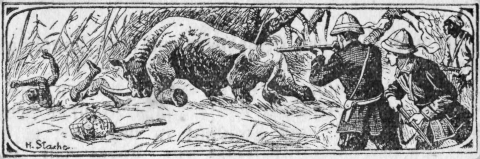
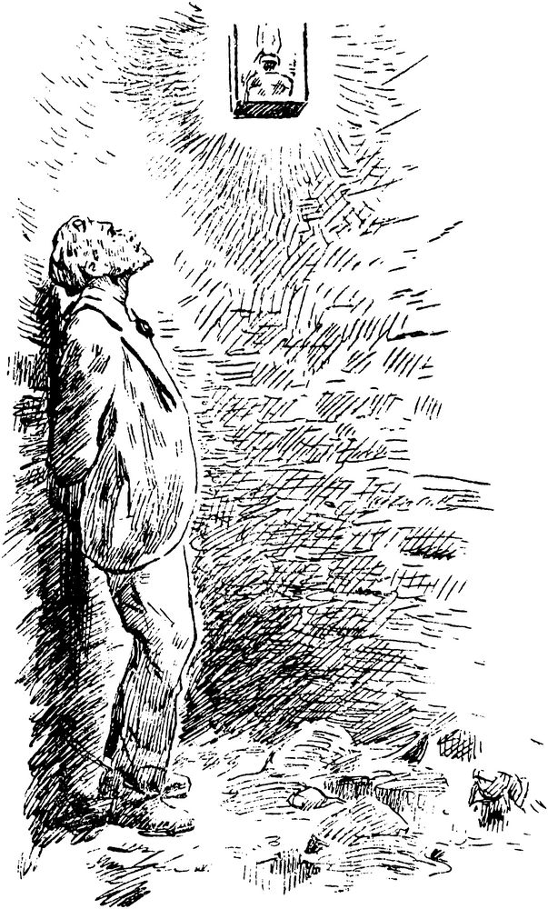
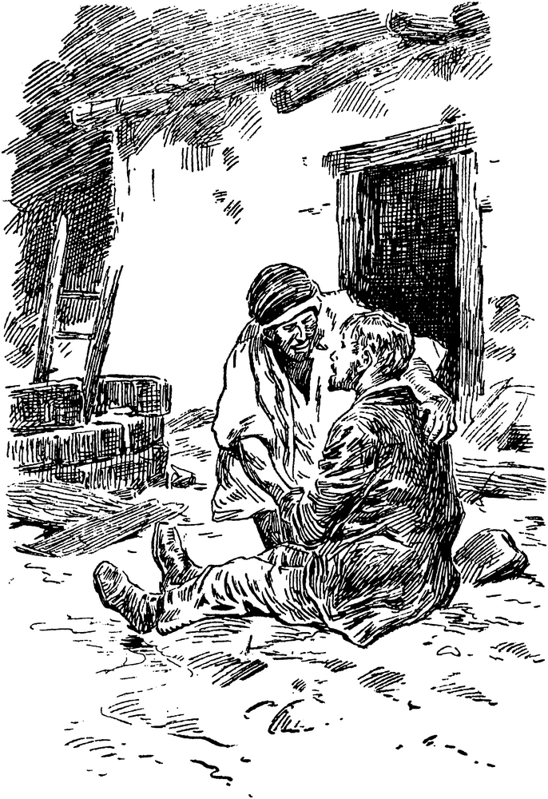
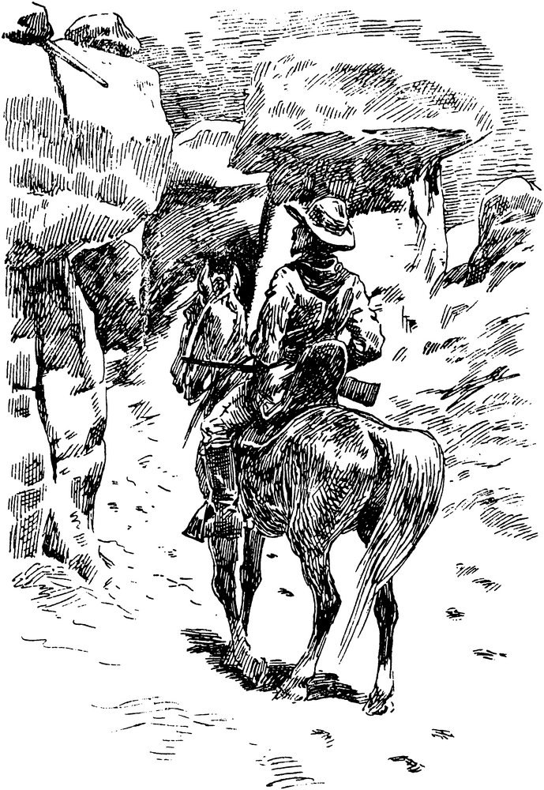
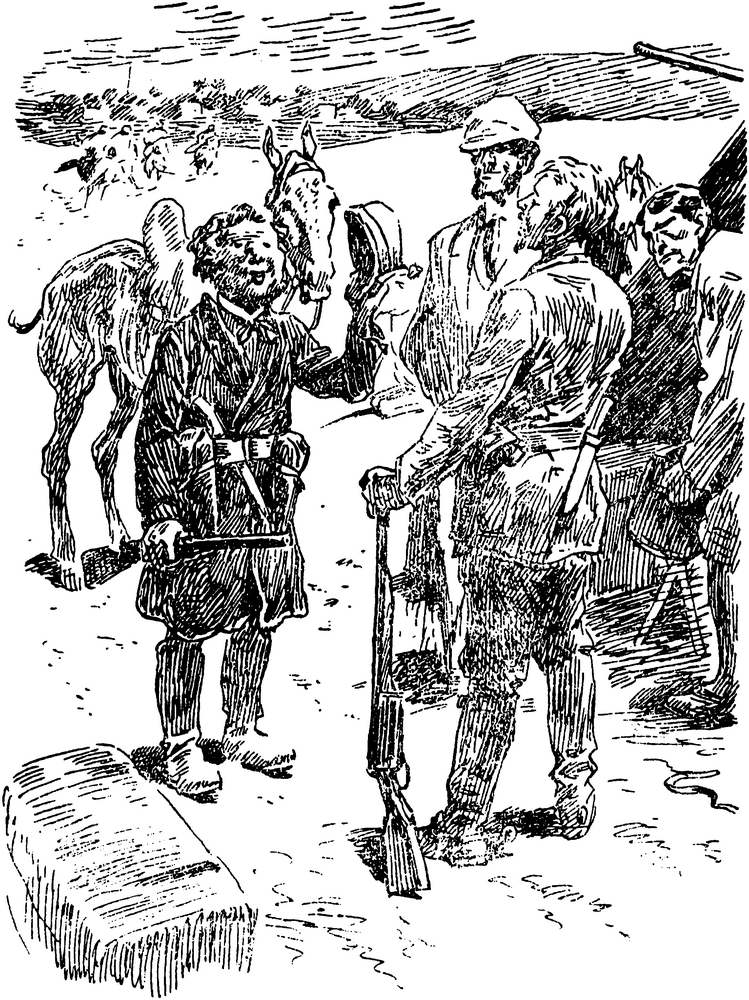
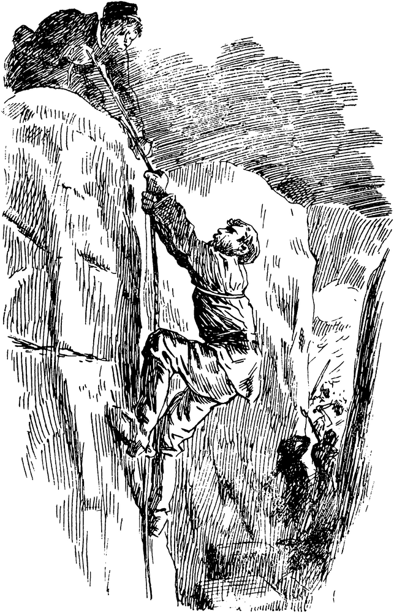
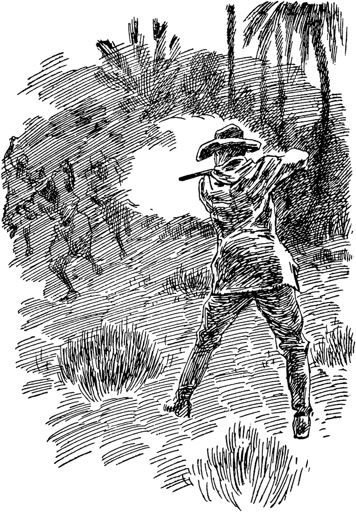
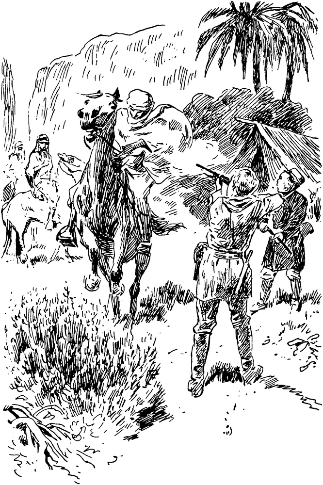
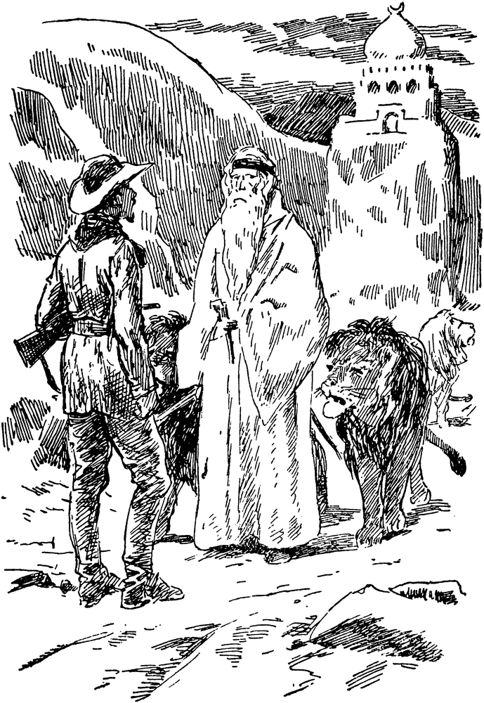
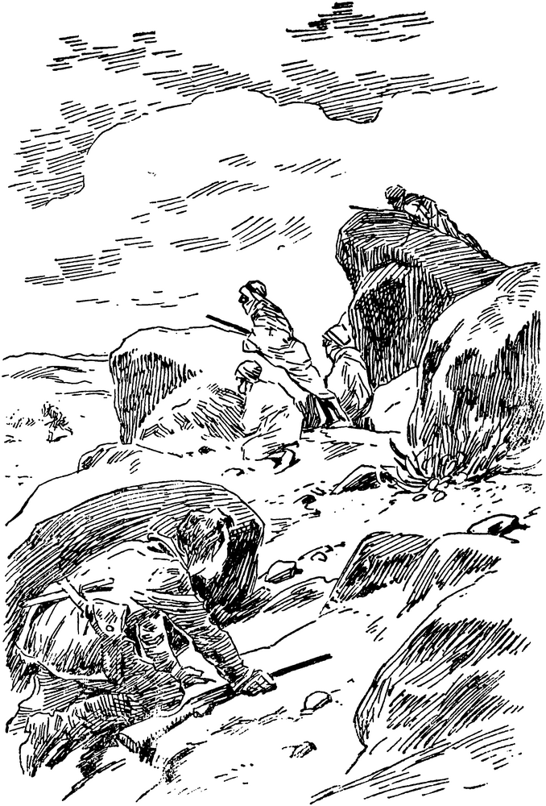

<h1>Die Goldkarawane.</h1>

<h2>1. Kapitel.</h2>

<h3>Eine neue Bekanntschaft auf der »Algier«.</h3>

Wem Gott will rechte Gunst erweisen, den schickt er in die weite Welt! —

Sehr schön! Zum Reisen, wenigstens heutzutage, gehört jedoch Geld, nochmals
Geld und wieder Geld. Früher war das ja wohl anders. Da schlugen sich
bescheidene Handwerksburschen mit ein paar Pfennigen durch, wanderten von Stadt
zu Stadt, arbeiteten hier und da, zogen weiter, lernten so Land und Leute
kennen. Das war auch ein Stück Romantik der guten alten Zeit.

Auch in mir hatte von Jugend an neben einer starken Neigung für alles
Außergewöhnliche und Abenteuerliche ein unruhiger Wandertrieb geschlummert.
Meine Sehnsucht waren die Länder des Orients, besonders jene Gebiete fremder
Erdteile, in denen die europäische Kultur noch nicht den Bewohnern und dem
Landschaftsbilde die Reize des Ursprünglichen geraubt hat.

Diese Sehnsucht sollte erst erfüllt werden, als ich der Erbe eines seltsamen
und seltenen Mannes geworden war, den mir das Schicksal in den Weg geführt
hatte und der dann für leider nur kurze Zeit mein Freund wurde. Er starb,
hinterließ mir sein ganzes Besitztum, wozu auch eine Anzahl Waffen, zwei fast
neue indianische Jagdanzüge aus feinstem Leder und — eine Menge Goldkörner in
allen Größen gehört.

Goldkörner! Sie stammten aus Westbrasilien, wo mein Freund Karl Weber sie von
einem Indianer, seinem roten Bruder, wie er ihn stets nannte, zum Geschenk
erhalten hatte. Von diesem Indianer und den Abenteuern, die Karl Weber mit ihm
zusammen in den Urwäldern und Savannen Brasiliens erlebt hat, habe ich in einem
Buche berichtet, das den Titel »Madua, der große Häuptling der Arowaken« trägt.

Goldkörner! — Einen Teil davon verkaufte ich und gewann so die Mittel zu meiner
ersten Reise in fremde Länder. Ich gab meine Wohnung auf, stellte meine geringe
Habe bei Bekannten unter, packte in einen bescheidenen Koffer nur das
Allernötigste, darunter auch Webers Waffen und einen seiner Jagdanzüge, der mir
sehr gut paßte, und fuhr zunächst bis Marseille, von wo ich einen Dampfer nach
der Stadt Algier, dem Haupthafen der französischen Kolonie Algerien in
Nordafrika, benutzte.

Mein Streben war von Beginn meiner Reisevorbereitungen an stets darauf
gerichtet gewesen, möglichst wenig Geld auszugeben. Daher hatte ich auch einen
Frachtdampfer gewählt, der nur nebenbei den Personenverkehr betrieb. Er hieß
Algier, ein Schiffsname, der im Mittelmeer ebenso häufig ist wie etwa in
unserer Handelsflotte Neptun oder Marie.

Außer mir befanden sich noch vier Fahrgäste an Bord, und zwar ein französischer
Elektromonteur mit Frau und Kind, die sich in Algerien niederlassen wollten,
und ein älterer Mann, der sich ganz für sich hielt, und der, wie ich vom
Kapitän erfuhr, ein Holländer aus Amsterdam sein sollte. Er nannte sich
Zuitenbrook.

Unsere Kabinen im Mittelaufbau lagen nebeneinander. Gleich am ersten Tage
bemerkte ich zufällig, daß sich in der unsere Kabinen trennenden, polierten
Holzwand ein Astloch etwa in Augenhöhe befand, aus dem der dunklere, genau
hineinpassende Astpflock bei der geringsten Berührung herausfiel. Deshalb wurde
ich auch nur darauf aufmerksam.

Ich sah, daß man das Aststück bereits nachträglich festzuleimen versucht hatte.
Es hatte aber trotzdem sich entweder von selbst wieder gelockert oder war von
neugierigen Inhabern meiner Kabine absichtlich nachträglich herausgezogen
worden. —

Winzige Kleinigkeiten sind’s oft, die unserem Lebensweg, unseren Plänen und
Gedanken eine ganz andere Richtung geben. Hier war’s der Astpflock, der
sozusagen den Anlaß zu alledem gab, was ich nachher in Algerien und in der
Sahara an abenteuerlichen Erlebnissen durchmachen sollte.

Als er — es war abends gegen neun Uhr — durch eine zufällige Berührung meiner
Hand sich löste und leise auf den dicken Bastteppich der Kabine aufschlug,
regte sich — und wem wäre es wohl nicht ebenso ergangen! — in mir zunächst nur
die Neugier festzustellen, ob ich durch das etwas schräg nach oben zu
verlaufende Loch einen Blick in Zuitenbrooks Kabine werfen könnte, der mir
bereits durch seine finstere, verschlossene Miene und sein offenbares
Bestreben, ganz für sich bleiben zu wollen, aufgefallen war.

Ich brachte also das rechte Auge an die kleine Öffnung heran und — prallte auch
schon erschrocken zurück, denn — in der Nebenkabine an dem kleinen
Klapptischchen, über dem die eingeschaltete elektrische Glühbirne hing, saß ein
Fremder und nicht der Holländer, — ein Fremder, der gerade dabei war, auf einer
großen Landkarte mit einem Zirkel irgendwelche Entfernungen abzumessen.

Seltsam! Ein Unbekannter dort drüben?! — Ich überlegte mir die Sache, kam dann
auf einen besonderen Gedanken, der in mir deshalb so schnell aufgestiegen war,
weil Zuitenbrooks blondes, starkes Kopfhaar und sein dichter, langer Vollbart
auf mich gleich einen merkwürdigen Eindruck gemacht hatten, nämlich den, als ob
sie falsch wären.

Wenn man Schriftsteller ist und hauptsächlich die dunklen Seiten des
menschlichen Seelenlebens in Kriminalromanen tiefer zu beleuchten pflegt,
gewöhnt man sich unwillkürlich so etwas wie Detektivaugen an.

Nun — mein erster Schreck beim Anblick des Fremden verwandelte sich plötzlich
in Argwohn. Ich sagte mir, daß ein Mensch, der sein Äußeres durch falschen Bart
und Perücke zu verändern sucht und der nur allein in seiner Kabine bei
(sicherlich!) verschlossener Tür zu später Abendstunde diese Verkleidung
ablegt, ein schlechtes Gewissen haben muß.

Gewiß: dieser Holländer konnte ja auch ein Polizeibeamter oder dergleichen
sein, der hinter einem Gesetzesverächter her war. Dagegen sprach nun jedoch die
Tatsache, daß es hier auf dem Frachtdampfer nur ganz harmlose Leute gab und daß
ein Kriminalbeamter, der etwa anderswo als hier an Bord der Algier jemand
beobachten wollte, nicht wie ich zum Beispiel aus Sparsamkeit gezwungen gewesen
wäre, gerade dieses doch recht langsame und nur geringe Bequemlichkeiten
bietende Schiff zu benutzen.

Nein — dieser Zuitenbrook (natürlich auch ein falscher Name!) wanderte sehr
wahrscheinlich auf faulen Pfaden, war vielleicht gar ein Kassenräuber,
Defraudant oder dergleichen.

Jetzt waren bei mir alle moralischen Bedenken gegen die Benutzung des Astloches
geschwunden. In meiner Phantasie tauchten schon verheißungsvolle Luftschlösser
von einer Riesenbelohnung auf, die ich mir durch Festnahme eines flüchtigen
Millionendiebes verdienen könnte. Jedenfalls war ich entschlossen, diesem
Holländer recht scharf auf die Finger zu sehen und zuzupacken, sobald ich
genügend Beweise dafür gesammelt hätte, daß er ein Verbrecher war, der Europa
vorläufig den Rücken zu kehren für angebracht hielt.

Ach: wie sehr hatte ich mich doch damals geirrt in all diesen Mutmaßungen!
Freilich, die Wahrheit sich zusammenzureimen, dazu hätte selbst die Phantasie
meines berühmten Berufskollegen Konan Doyle, des Erfinders der Figur des
Überdetektivs Sherlock Holmes, nicht ausgereicht.

Ich brachte mein Auge jetzt also abermals an das runde Guckloch heran und
beobachtete Zuitenbrook weiter.

Aha! Da lag ja auch links auf dem Bett die Perücke und der Bart! Schade, daß
ich sie nicht gleich gesehen hatte. Ich hätte mir dann die Gedankenarbeit
vorhin erspart und sofort gewußt, woran ich mit diesem Fremden war.

Der echte »Zuitenbrook« (wie mochte er wohl in Wirklichkeit heißen?) sah ganz,
ganz anders aus als der, den ich heute mittag beim Essen in dem kleinen
Speisesaal des Dampfers zum ersten Mal erblickt hatte. Zunächst war er
kahlköpfig. Nur vom Hinterkopf bis zu den Schläfen herauf lag noch ein Kranz
dunkler Haare. Sonst glich der Schädel einer Billardkugel. Dann sein Gesicht.
Dieses war durch den Urwald von Bart bisher so weit verhüllt gewesen, daß man
lediglich den finsteren Ausdruck der hinter einer Brille versteckten Augen und
eine große Hakennase, dazu ein Paar Riesenohren hatte wahrnehmen können.

Jetzt waren — das hätte mir doch gleich auffallen müssen! — auch die übergroßen
Ohrmuscheln verschwunden! Der Mann dort am Klapptisch hatte ja überhaupt keine
Ohren!

Das Gesicht selbst, von der Glühbirne hell bestrahlt, zeigte mir sowohl in
Stirnbildung als der breiten Kinnpartie und den Falten um den wohlgeformten
Mund alle Hinweise auf einen überaus energischen Charakter. Die Augen, jetzt
ohne Brille, waren groß und lebhaft und von starken, fast schwarzen Brauen
überwölbt, lagen tief in den Höhlen und gaben dem ganzen, bartlosen, schmalen
Antlitz im Verein mit der Hakennase das Gepräge eines wahren Charakterkopfes.

Dieser geheimnisvolle Mensch beschäftigte sich wie schon erwähnt mit einer
Landkarte. Den Zirkel hatte er jetzt beiseite gelegt, starrte nachdenklich mit
etwas zurückgelegtem Kopf aufwärts in das grelle Licht der elektrischen Birne.
So saß er, die Karte in den Händen glatt gespannt haltend, regungslos da.

Ich sah, wie seine Lippen sich bewegten. Er hatte offenbar die Angewohnheit
vieler Leute, einer stärkeren inneren Erregung durch halblaute Selbstgespräche
Luft zu machen.

Die Landkarte — sie war gut ein Meter im Quadrat groß — zeigte an den Rändern
blaues Meer und in der Mitte ein dunkles Dreieck: also Afrika! Es mußte eine
sehr genaue Spezialkarte sein. Wahrscheinlich stammte sie aus einem
geographischen Werke, denn unsere gewöhnlichen Atlanten enthalten Karten von
solchem Umfange kaum.

»Merkwürdig doch eigentlich!« dachte ich mir. »Wozu schleppt er sich nur mit
einer solchen Riesenkarte von Afrika herum?!«

Ich gebe zu: in diesem Augenblick bekam mein Verdacht, ich könnte hier einen
Millionenräuber vor mir haben, den ersten Stoß und geriet leicht ins Wanken.

Zuitenbrook saß noch immer ohne jede Bewegung, stierte vor sich hin und führte
leise Selbstgespräche.

Ich legte das Ohr an das Astloch. Vielleicht verstand ich wenigstens ein paar
Worte.

Eine Weile hörte ich nur etwas wie ein Gemurmel. Das bis in unsere Kabinen
heraufdringende Stampfen der Schiffsmaschinen war doch recht hinderlich bei
meinem Bemühen, mir hier eine Belohnung als Gelegenheitsdetektiv zu erringen.

Dann aber — ja, jetzt hatte ich ziemlich deutlich folgendes vernommen, das mein
Nachbar offenbar in größter Wut hervorgestoßen hatte:

»— Sie sollen sich mir nur nochmals in den Weg stellen! — Ich werde Euch
beweisen, daß Anton Rastra keine Rücksichten kennt, wenn es sich um —«

Der Schluß entging mir. Es schadete nichts. Denn wertvoll genug war ja die
auffallende Tatsache, daß diese Sätze nicht in holländischer, sondern in —
deutscher Sprache an mein Ohr gedrungen waren, — Beweis genug für die
Zugehörigkeit des angeblichen Zuitenbrook zu meinem eigenen Vaterlande! Denn —
gerade in der Erregung und mit sich allein hätte ein Holländer niemals eine
fremde Sprache gebraucht! Nein — in solchen Augenblicken bilden unsere
Sprachorgane ganz von selbst die ihnen geläufigsten Worte.

Also kein Holländer — ein Deutscher vielmehr! Und — den Namen wußte ich jetzt
ja auch bereits:

Anton Rastra!

Es gibt Namen, die häufig wiederkehren. Rastra war mir noch nie begegnet. Ich
fand, schon in diesem Namen stecke etwas wie Energie und schnelle
Entschlußfähigkeit. Heißt jemand zum Beispiel Weichbrod oder Lobesang, wird man
kaum damit sofort den Begriff von Tatkraft und rücksichtslosem Draufgängertum
verbinden.

Ich hatte also als Gelegenheitsdetektiv schon recht gute Erfolge in diesem
meinem »ersten Fall« errungen. — So — dachte ich damals!

Nach einer Weile hörte ich dann abermals ein paar deutsche Worte. Und ich gebe
zu, sie machten mich noch stutziger als die Karte von Afrika.

»— die Goldkarawane verschollen ist, unterliegt keinem Zweifel. Nur ob sie —«

Das hörte ich. Dann verschlang das Rumpeln der Maschinen das übrige.

Goldkarawane! Merkwürdig! Was sollte dies nun wieder?! Denn die Spezialkarte
des dunklen Erdteils und Karawane — das paßte ja zusammen! In Europa spricht
niemand von Karawanen! Da gibt es Lastfuhrwerke, Lastautos, Güterzüge.

Und noch gar *Gold*karawane! Klang das nicht romantisch, geheimnisvoll,
vielversprechend?! —

Nun vernahm ich von drüben ein anderes Geräusch: das Knacken eines Schlosses —
dann das Knarren der Scharniere eines Koffers.

Ich gab das Lauschen daher auf und benutzte das Astloch mit dem rechten Auge
wie zuerst schon. Ich sah, daß Zuitenbrook-Rastra mit einem Kasten an den Tisch
trat, daß er den beweglichen Boden dieses Holzkästchens herauszog und aus einem
— ja, es konnte ja nur ein Geheimfach sein! — also aus einem Geheimfach ein
vergilbtes, an den Rändern zerrissenes Papier herausnahm, dem die rechte untere
Ecke fehlte, wie ich nun weiter feststellte, als er die Schriftzüge darauf zu
lesen begann.

Ich habe sehr gute Augen. Ich erkannte, daß die Buchstaben mit roter Tinte
geschrieben und sehr groß und ungelenk waren, als hätte eine des Schreibens
ungewohnte Hand sie langsam und schwerfällig hingemalt.

Der angebliche Holländer starrte nun genau so nachdenklich und regungslos auf
das halb zerfetzte, vergilbte Blatt wie vorhin ins Leere. Seine Augen ruhten
besonders dort sehr lange, wo die rechte Ecke des Papiers fehlte und mit ihr
ein Teil der Schrift.

Gut eine Viertelstunde hielt er so das Blatt in Händen. Dann schloß er es
wieder weg und fing an sich zu entkleiden.

Da es nun nichts weiter zu beobachten geben würde, hob ich den Astpflock auf,
wollte ihn in das Loch ganz behutsam zurückdrücken. Aber — er glitt wieder
heraus. Ich suchte ihn aufzufangen, stieß dabei mit den Fingerknöcheln an die
Wand, bekam ihn aber noch zu packen und schob ihn schnell in die runde Öffnung
hinein, indem ich gleichzeitig die Schlipsnadel aus meiner Krawatte mit der
Spitze der Nadel mit festklemmte, so daß das Aststück nun genügend festgekeilt
war.

Auch ich ging nun zu Bett. Ich konnte nicht einschlafen. Ich hatte heute ja das
erste wirkliche Abenteuer meines bisher recht alltäglichen Daseins erlebt! Ein
Abenteuer war’s, sogar eines, das alle möglichen Mutmaßungen zuließ.

Wer war Anton Rastra? Weshalb trug er eine Verkleidung? Wie war er seiner Ohren
verlustig gegangen, falls deren Fehlen eben nicht eine harmlose Ursache hatte?
Was bedeuteten seine Worte: »Sie sollen sich mir nur nochmals in den Weg
stellen —« und so weiter? Und schließlich — was hatte es mit der Goldkarawane,
der Karte von Afrika und dem vergilbten Blatt auf sich?

Ich träumte dann wirres Zeug, durchlebte im Traum blutige Kämpfe mit
Kamelreitern, mit weißem Gesindel, wurde von Zuitenbrook-Rastra an einen Baum
gebunden, mit dem Revolver bedroht.

In Schweiß gebadet erwachte ich, als die Sonne bereits hell durch die kleinen
runden Fenster schien. Ich konnte mich auf meine Träume noch sehr gut besinnen,
lächelte jetzt darüber.

Ich ahnte nicht, daß sie, wenn auch etwas anders gestaltet, in Erfüllung gehen
sollten.

Dann betrat ich das Deck des Dampfers mit der festen Absicht, auf eine Weise,
die ich mir schon genau überlegt hatte, des geheimnisvollen Menschen
Bekanntschaft zu machen.

Ich hatte zu diesem Zweck aus meinem Koffer den Stutzen herausgenommen, der
nebst den Goldkörnern der wertvollste Teil der Erbschaft meines Freundes Weber
war.

Diese kurze Schußwaffe war nämlich Webers ureigenste Erfindung. Es gab nur
dieses eine Modell davon. Mein Freund hatte mir ans Herz gelegt, seine
Erfindung um keinen Preis bekannt zu geben oder gar zur Herstellung als
Massenartikel an eine Fabrik zu verkaufen.

Es war eine einläufige Gasbüchse, ähnlich konstruiert wie ein Luftgewehr, mit
einem Stahlkasten an Stelle des Schlosses, ohne Hahn, ohne jeden Ausputz. Sie
sah plump aus, und war doch das sinnreichste Modell einer Mehrladewaffe, konnte
zwanzig längliche Bleigeschosse nacheinander abschießen und traf noch auf 200
Meter tadellos.

Jetzt nahm ich sie mit nach oben, um — Rastras Neugier zu reizen, der sich
gestern bei Tisch mit dem Kapitän sehr eingehend über moderne Handfeuerwaffen
unterhalten hatte. Ich hoffte, auf diese Art mit ihm bekannt zu werden.

Und siehe — es gelang! Der Dampfer war von einem Schwarm Möwen begleitet.
Nachdem ich hintereinander vier der leichtbeschwingten Vögel herabgeholt hatte,
erhob sich Rastra aus seinem Liegestuhl, trat auf mich zu und sagte in jenem
schlechten Französisch, das er auch im Gespräch mit dem Kapitän benutzt hatte:

»Monsieur, entschuldigen Sie meine Neugier. Sie haben da eine sehr merkwürdige
Waffe.«

So kamen wir ins Gespräch. Er stellte sich mir dann als Kaufmann Zuitenbrook
aus Amsterdam nochmals persönlich vor (flüchtig hatte ja schon der Kapitän uns
miteinander bekannt gemacht), erklärte, er habe in Algier geschäftlich zu tun
und würde, wenn mir dies angenehmer sei, auch Deutsch sprechen, das er leidlich
beherrsche.

Unsere Unterhaltung wurde also in unserer Muttersprache fortgesetzt, die Rastra
jedoch getreu seiner Rolle als Holländer ebenso verhunzte wie er das
Französische fehlerhaft gebrauchte.

Sehr bald hatte ich dann, nachdem das Waffenthema erledigt war, die deutliche
Empfindung, daß er mich über meine Person und meine Reisepläne auszuforschen
suchte. Er schien an meinen Beruf als Schriftsteller nicht recht zu glauben,
ebensowenig an meine Absicht, allein nur von einem eingeborenen Führer
begleitet, von Algier aus mich bis zum Tsad-See durchzuschlagen und dann weiter
nach Aschantiland an der Goldküste zu gehen. Und doch war’s die volle Wahrheit.
Ich wollte dies tatsächlich. Daß es dann ein wenig anders kam, daran war — er
selbst schuld!

Kurz: Seine Bekanntschaft war gemacht! Das war die Hauptsache zunächst.

Wir blieben bis zum Mittagessen zusammen auf dem Achterdeck, ich merkte, daß er
bereits weite Reisen hinter sich hatte. Im übrigen spielte er ganz den
Kaufmann, der in Amsterdam mit Teppichen, Musselin- und Wollstoffen Handel
treibe, also gerade mit einigen der Hauptausfuhrartikel Algeriens.

Kurz vor Tisch ging ich in meine Kabine, um den Stutzen wieder in den Koffer
einzuschließen. Die Tür der Nebenkabine stand weit offen. Unser Steward
säuberte mit dem Besen den Fußboden. Als ich gleichzeitig sah, daß Zuitenbrooks
Gepäck aus der Kabine verschwunden war, fragte ich den Steward, ob Monsieur
Zuitenbrook etwa umgezogen sei: — »Ja — in die Kabine gegenüber. Diese war ihm
zu klein,« lautete die Antwort, die mir sofort zu denken gab.

Er zog um, wechselte die Kabine! Ob er vielleicht gestern abend gehört hatte,
wie ich mit der Hand gegen das polierte Holz der Wand schlug, ob er etwa sogar
das Astloch gesehen und sich das Weitere zusammengereimt hatte?!

Beinahe war ich geneigt, mir selbst mit Ja zu antworten, denn nun erst fiel mir
so recht auf, wie schnell Rastra auf meinen Köder — den Stutzen! — angebissen,
während er doch gestern noch mich völlig als Luft behandelt hatte.

Nachher bei Tisch kam er selbst auf den Kabinenwechsel zu sprechen, meinte, er
sei es nicht gewohnt, in einem so engen Raume zu schlafen.

Den Rest der Überfahrt bis Algier blieb er mir gegenüber jetzt unverändert
zuvorkommend und höflich. Wir waren viel zusammen, sprachen über mancherlei
Dinge. Aber stets hatte ich das Gefühl, daß seine gelegentlichen Fragen nach
meinen persönlichen Verhältnissen von einem bestimmten Mißtrauen hervorgerufen
waren, das er mir entgegenbrachte.

Inzwischen hatte ich mir vom Kapitän sämtliche Zeitungen geben lassen, die an
Bord nur aufzutreiben waren, und hatte sie daraufhin durchgesehen, ob nicht
irgendwo in letzter Zeit ein Verbrechen begangen sei, mit dem ich
Zuitenbrook-Rastra in Verbindung bringen könnte.

Ich fand nichts — nichts! Und mein Eifer als Gelegenheitsdetektiv war schon
recht abgekühlt, als ich nach kurzem Abschied von dem geheimnisvollen Menschen
algerischen Boden betrat — freilich mit der festen Absicht, Rastra heimlich auf
den Fersen zu bleiben, der mir in der Stadt Algier ein billiges deutsches
Gasthaus empfohlen hatte. Er selbst wollte in einem größeren französischen
Hotel absteigen.

<h2>2. Kapitel.</h2>

<h3>Der Brunnen der Aussätzigen.</h3>

Die Stadt Algier liegt an einem ins Meer abfallenden Nordhang eines
Gebirgszuges, bildet ein ziemlich gleichseitiges, vom Strande aufsteigendes
Dreieck, als dessen Spitze die bereits recht hoch gelegene Kasba, die alte
Festung der Deis<@refnote/> von Algerien, jetzt als Kaserne benutzt, anzusehen ist.

Von blühenden Ortschaften, Villen und gutgepflegten Gärten umgeben, bietet sie
vom Meer aus mit dem Hintergrunde der zum Teil grünen Berge ein sehr hübsches
Bild dar, ebenso wie sie durch prachtvolle Bauten ganz den Eindruck einer
europäischen größeren, wohlhabenden Stadt mit ihren etwa 100 000 Einwohnern
macht.

Jedenfalls war ich von meinem romantischen Standpunkt aus stark enttäuscht über
all das Moderne, das hier auf den ersten Blick wenigstens alle Merkmale eines
altafrikanischen Küstenortes verdrängt zu haben schienen. Nachher fand ich dann
doch noch genug Sehenswertes, das an jene Zeiten erinnerte, als hier noch die
Türken geherrscht und unzählige Christen in Al Dschesair (der arabische Name
Algiers) als Sklaven der Mohammedaner in trauriger Gefangenschaft geschmachtet
hatten.

Der Gasthof, auf den Zuitenbrook-Rastra mich als billig und gut hingewiesen
hatte, lag weit außerhalb in der nördlichen Vorstadt Bab el Ued. Der Besitzer
hieß Spameitat und war ein geborener Ostpreuße, einer jener Deutschen, — jener
leider so seltenen Deutschen, die in der Fremde nicht sofort sich bemühen,
alles abzustreifen und zu verleugnen, was an ihre ursprüngliche Heimat gemahnt.

Als ich ihm von meinen Absichten sprach, von hier aus nach dem Tsad-See zu
gehen, schüttelte er sehr bedenklich den Kopf, meinte, dies wäre denn doch ein
zu abenteuerliches Unterfangen, besonders noch, wenn ich wirklich nur mit einem
Führer reisen wollte. Ich blieb jedoch bei meinem Entschluß.

Wir waren mittags in Algier eingetroffen. Nachmittags suchte ich dann das Hotel
auf, in dem der angebliche Holländer hatte absteigen wollen. Ich hatte mir
schon einen Vorwand zurechtgelegt, der den wahren Zweck meines Besuchs
verdecken sollte.

In dem Hotel erfuhr ich, daß — Zuitenbrook es vorgezogen hatte, mich ein wenig
anzulügen und mir so ein Wiedersehen mit ihm zu erschweren. Er wohnte nicht in
dem Prachtbau.

Nun — vielleicht anderswo! Ich hatte ja Zeit, die Hotels und sonstige
Fremdenheime abzuklappern. Bis gegen Abend wanderte ich ohne Erfolg von Haus zu
Haus. Immer klarer wurde es mir da, daß der geriebene Mynheer Zuitenbrook
sicherlich allen Grund gehabt hatte, mir fernerhin auszuweichen, und daß diese
Abneigung gegen meine Person wahrscheinlich auf — das Astloch in der
Kabinenwand zurückzuführen sei.

Nach dieser Schlappe, die ich mir als Detektiv geholt, bummelte ich noch den
Boulevard de la Republique entlang, den eigentlichen Glanzpunkt der Stadt, eine
zwei Kilometer lange Terrasse, die auf einigen 350 Doppelbögen ruht, deren
Hallen als Verkaufsläden benutzt werden.

Hier nun fiel mir sehr unangenehm die Aufdringlichkeit der Bettler auf, zumeist
alte, weißbärtige Berber<@refnote/> oder mit Krankheiten behaftete Mauren jeder
Altersstufe. Die Bettler sind ja überall im Orient eine wahre Plage.

Besonders ein alter, buckliger Kerl in einem schmutzstarrenden Burnus und
langem gelblichen Zottelbart hatte es auf mich abgesehen und tauchte immer
wieder neben mir auf, indem er mir seine sicher seit Jahren nicht gewaschenen
Hände bittend hinstreckte und dazu irgend ein paar Worte kläglich winselte.

Gerade als die elektrischen Lampen auf der Prunkstraße dann aufflammten, sank
vor mir ein mit untergeschlagenen Beinen am Rande des Fußgängerweges hockender
Händler ohnmächtig um. Niemand war in der Nähe. Ich richtete den jungen
Menschen, dessen Augen geschlossen und mit Eiter verklebt waren, auf und lehnte
ihn gegen einen Kandelaberständer, gab ihm aus meinem Kognakfläschchen, das ich
mir vorhin gekauft hatte, zu trinken und brachte ihn schnell ins Bewußtsein
zurück.

Er radebrechte das Englische so weit, daß wir uns verständigen konnten, war
aber in seinen Äußerungen sehr zurückhaltend. Ein gewisser ablehnender Stolz
trat in seinem Verhalten zu Tage, das für einen blinden Bettler — denn die
Kleinigkeiten, die er feilbot, sollten ja nur den wahren Zweck seines
Aufenthaltes auf der Straße verheimlichen — seltsam genug war.

Meine Teilnahme für ihn war zunächst lediglich durch sein braunes,
edelgeschnittenes Gesicht und seine Jugend hervorgerufen worden. Vielleicht
hätte ich mich mit ihm auch nicht weiter beschäftigt, wenn er nicht eben so
merkwürdig schweigsam und bescheiden gewesen wäre. Ich vermutete hier ganz
besondere Lebensschicksale, und da ich ja nach Nordafrika gekommen war, um Land
und Leute zu studieren, führte ich ihn schließlich nach einer nahen Bank und
begann ihn auszufragen. Hierbei erwähnte ich beiläufig, daß ich Deutscher sei.
Kaum hatte ich diese Bemerkung fallen lassen, als ich gewahr wurde, wie in sein
melancholisches Gesicht ein froher, beinahe freudiger Ausdruck trat. Und zu
meinem größten Erstaunen sagte er nun sehr lebhaft — auf Deutsch:

»Sidi (Herr), Du bist wirklich aus Germanistan? — Dann brauche ich Dir
gegenüber mein Elend auch nicht zu verheimlichen. Ich habe drei Jahre einen
sehr reichen Sidi Deiner Heimat, der in der Sahara Löwen jagen wollte, als
Diener begleitet. Von ihm lernte ich Eure Sprache. Als er nach Germanistan von
hier aus heimkehrte, blieb ich noch in Algier, bekam dann aber die böse
Augenkrankheit und erblindete in kurzem, so daß ich nicht zu meinem Stamme
zurückkonnte, da man mir hier all mein Geld gestohlen hatte und niemand sich um
mich kümmerte. Ich habe schließlich aber doch ein Unterkommen bei einem
gutherzigen Manne draußen in der Vorstadt Bab el Ued gefunden. Er ist auch ein
Deutscher und besitzt eine kleine Karawanserei (Gasthof), heißt Spameitat.
Einer seiner Gehilfen geleitet mich morgens hier auf den Boulevard und holt
mich abends wieder ab. Er wollte erst nicht, daß ich als Händler hier bettele.
Aber ich bin zu stolz, mich bei ihm durchfüttern zu lassen.«

Der blinde Araber hatte mir all dies natürlich nicht in der Weise erzählt, wie
ich es hier wiedergebe. Seine Ausdrucksweise war vielmehr infolge seines
mangelhaften Wortschatzes der deutschen Sprache eine zum Teil recht komische.

Als er den Namen Spameitat erwähnte, unterbrach ich ihn und sagte ihm, daß auch
ich dort jetzt wohne. Nachher nahm ich ihn dann mit mir nach dem Gasthof, wo
mein ostpreußischer Landsmann gar nicht genug über den merkwürdigen Zufall den
Kopf schütteln konnte, der mich gerade mit seinem Schützling zusammengeführt
hatte.

Spameitat hielt große Stücke auf den Blinden, der zum Stamme der Mahmud im
Westen der Sahara gehörte, und erklärte mir, er hätte ihn längst in seine
Heimat zurückgeschickt, wenn er eben nicht gewußt hätte, daß Ibrabim ben Ikba,
so hieß der junge, etwa fünfundzwanzigjährige Beduine, bei seinem Stamme es
noch weit schlechter als hier haben würde.

Am nächsten Morgen wollte ich in einer Apotheke einige Medikamente einkaufen,
die mitzunehmen Spameitat mir empfohlen hatte. Dort traf ich mit einem
berühmten Berliner Augenarzt und Universitäts-Professor zusammen, den ich
persönlich kannte. Unwillkürlich dachte ich, als wir uns freudig hier in der
Fremde begrüßten und er mir erzählte, er sei zum Studium der hier leider stark
verbreiteten Augenkrankheiten nach Algier gekommen, an Ibrahim, fragte nach
einer Weile dann den Professor, ob ich ihn nicht einen Kranken zuführen dürfe,
der meine Teilnahme erweckt hätte. Er erwiderte sofort, er wäre gern bereit,
den jungen Araber zu untersuchen, fürchte aber, daß er ihm wohl kaum noch würde
helfen können.

Nachdem wir uns getrennt hatten, begegnete ich abermals dem alten Schmutzfink
von Bettler vom Tage vorher. Ich gab ihm eine Kleinigkeit, um ihn loszuwerden.

Nachmittags brachte ich Ibrahim zu meinem berühmten Landsmann, der zu meiner
freudigen Überraschung und zu des Arabers unaussprechlichem Jubel nach
eingehender Untersuchung uns die Versicherung gab, daß er Ibrahim bereits nach
kurzer Behandlung zu heilen hoffe, da das Augenlicht noch nicht völlig zerstört
sei. Er begann die Behandlung denn auch sofort und wies mich genau an, wie ich
dem Kranken beim Einträufeln der Tropfen in die Lidwinkel behilflich sein
könnte.

Als wir bei Spameitat wieder anlangten, entstand dort ebenfalls in dessen
Familie große, freudige Aufregung, weil alle den stillen, bescheidenen Ibrahim
gern mochten. Leider verwandelte sich dieser Jubel schnell in arge Bestürzung,
da sich herausstellte, daß während meiner Abwesenheit ein junger Maure, einer
der an allen Ecken herumstehenden Lastträger zu Spameitat gekommen war und
meinen Koffer abgeholt hatte, indem er angab, ich hätte ihn geschickt, da ich
in das Fremdenheim übersiedeln wolle, wo auch der Professor wohnte.

Spameitat hatte, da diese Mitteilung ja eine genaue Kenntnis meiner Beziehungen
zu dem Augenarzte verriet, der wirklich in dem Fremdenheim abgestiegen war,
kein Bedenken gehabt, dem Boten meine Sachen auszuhändigen.

So wurde ich mein ganzes Gepäck los. Obwohl ich sofort die Polizei
benachrichtigt und ihr auch den sogleich in mir aufgestiegenen Verdacht, daß
hinter diesem Diebstahl vielleicht Zuitenbrook stecken könnte, näher begründet
hatte, wobei ich notwendig auch meine heimlichen Beobachtungen auf dem Dampfer
preisgeben mußte (von der Landkarte, dem vergilbten Blatt und der Goldkarawane
schwieg ich jedoch!), und obwohl die Polizei eifrigst bemüht war, mir mein
Eigentum wieder zu verschaffen, vergingen fünf Tage, ohne daß die Bemühungen
der Behörden den geringsten Erfolg hatten. Nicht einmal den angeblichen
Holländer konnte man aufstöbern. Er war spurlos verschwunden.

Was dieser Verlust meiner Sachen für mich bedeutete, ist leicht zu begreifen!
Mein Geld hatte ich ja bei mir getragen, aber meine Waffen und so weiter, auch
der Stutzen, waren als zum Teil teure Andenken an Karl Weber unersetzlich.

Ich war deshalb auch so niedergeschlagen, daß Spameitats und seiner Familie
liebevolle Aufmerksamkeit ebensowenig wie der Umstand mich trösten konnten, daß
Ibrahim inzwischen bereits so weit wieder hergestellt war, um allein ausgehen
zu können.

An diesem fünften Tage nach dem raffinierten Diebstahl, dessen Art der
Ausführung doch deutlich verriet, daß ich von irgend jemandem hier ständig
beobachtet worden war, erlebte ich dann mein erstes lebensgefährliches
Abenteuer auf afrikanischem Boden.

Ich war abends nochmals auf dem Polizeiamt gewesen und hatte nachgefragt, wie
es um meine Sache stehe. Das bedauernde Achselzucken der im übrigen sehr
höflichen Beamten kannte ich schon. Enttäuscht schlenderte ich am Hafen
entlang, dann weiter nach der Kasba, der früheren Feste, hinauf. Am Hafen war
mir wieder jener alte Bettler begegnet, der jetzt schon glaubte, ein Anrecht
bei mir auf eine Spende zu haben. Ich hatte ihn jedoch grob angefahren. Der
Schmutzfink wurde mir zu aufdringlich und zu unverschämt.

Von der Kasba kann man eine durch die Berge nach der Vorstadt Bab el Ued
führende Straße benutzen. Ich hatte diesen Weg am Tage schon verschiedentlich
dem weniger reizvollen durch die Stadt vorgezogen, dachte daher auch an nichts
Schlimmes, als ich jetzt bei Dunkelheit gleichfalls einmal auf der einsamen,
zum Teil von Villen und Häusern von Eingeborenen umsäumten Straße zwischen den
Anhöhen heimkehren wollte. Freilich — Spameitat hatte mich davor gewarnt und
darauf hingewiesen, daß sich dort nachts allerlei Gesindel herumtreibe, dem man
besser ausweiche. Aber ich bin nie ein Angsthase gewesen und wußte auch, daß
ich mich nötigenfalls auf meine Fäuste, meine Gewandtheit und Körperkräfte
verlassen konnte.

Sehr bald bedauerte ich es dann doch, diesen Weg gewählt zu haben. Es war hier
sehr dunkel, und der wolkenbedeckte Himmel drohte dazu noch jeden Augenblick
mit Regen. Außerdem hatte ich auch das Gefühl, daß mir jemand nachschleiche.
Mir war’s, als ob ich beständig leise Schritte hinter mir hörte. Blieb ich
stehen, verstummten sie. Ob ich mich nur täuschte, und vielleicht meine leichte
Erregung mir nur die Geräusche vorgaukelte, konnte ich infolge der Finsternis
nicht feststellen. Es war so dunkel, daß man kaum die Hand vor Augen sehen
konnte.

Schließlich wurde mir das unerklärliche Tapp Tapp in meinem Rücken doch zu
lästig. Ich wollte der Sache ein Ende machen, drehte mich plötzlich um und
sprang mit langen Sätzen auf die Straße zu, wo ich noch soeben die Schritte
gehört zu haben glaubte.

Da — stolperte ich über einen Menschen, der sich mir lang in den Weg gelegt
hatte, schlug hart hin, fühlte sehr starke Schmerzen am linken Knie, richtete
mich deshalb nur langsam auf und — wurde mit einem Male von hinten aufs neue
niedergeworfen, spürte die Last eines schweren Körpers und sofort auch zwei
Hände an meinem Halse, wehrte mich verzweifelt, unterlag aber doch dem
würgenden Griff und verlor das Bewußtsein.

Als ich wieder zu mir kam, war ich irgendwo an eine kalte Steinmauer in einem
feuchten, modrig riechenden Raume gefesselt, in dem es stockfinster war. Ich
stand aufrecht. Die Arme waren mir auf den Rücken und dann an einen Haken
gebunden, ebenso die Füße.

Nachdem ich mir über meine Lage klar geworden und mich etwas mehr erholt hatte,
begann ich um Hilfe zu rufen. Jeder hätte das wohl getan.

Nach einer Weile tauchte über mir ein rötlicher Lichtschein auf. Ich blickte
empor.

Es war eine an einen Strick befestigte große Petroleumlaterne. Woher sie kam,
konnte ich nicht sehen. Sie schwebte lautlos tiefer und tiefer und machte dann
etwa ein Meter über meinem Kopfe halt.

Jetzt erkannte ich, wo ich mich befand, — in einem runden, ausgemauerten
Brunnen!

Jetzt hatte ich ja Romantik — mehr als genug! Sogar ein paar scheußliche Kröten
und große Salamander fehlten nicht, die vor mir in sumpfigen Lachen hockten und
geblendet in das Licht stierten.

Mir war alles andere als wohl zumute! Für einen Menschen, der bisher ähnliche
Situationen nur geschildert, nie in Wirklichkeit durchgemacht hatte, war dieser
Beginn eigenen Erlebens denn doch etwas zu außergewöhnlich und barg zu trübe
Aussichten auf noch schlimmere Ereignisse in sich. Jedenfalls war meine
anfängliche Hoffnung, die Laterne könnte von Leuten, die mich befreien wollten,
herabgelassen worden sein, sehr schnell wieder geschwunden, da man mich doch
sonst wohl auch von oben angerufen hätte.

Dies geschah, — aber erst geraume Zeit später und durchaus nicht in einer Art,
die meine Besorgnisse hätte zerstreuen können.

Eine Stimme, die ich sofort erkannte, fragte sehr barschen Tones in deutscher
Sprache:

»He, sind Sie bei Bewußtsein?«

Es war kein anderer als Zuitenbrook-Rastra, der sich in dieser Weise meldete.

Sollte ich antworten? — Einen Moment wußte ich nicht recht, ob ja, ob nein.
Dann hielt ich es aber doch für ratsamer, hinaufzurufen:

»Ja. — Weshalb haben Sie mich denn in dieses Loch gesperrt, Mynheer
Zuitenbrook?«

»Das werden Sie sogleich hören. Ich halte Sie für einen bezahlten Spion
gewisser Leute, die an mir ein recht reges Interesse nehmen. Ich habe damals
auf dem Dampfer gemerkt, daß Sie das Aststück entfernt und mich beobachtet
hatten. Sie haben dabei zu viel gesehen.«

Da er jetzt schwieg, erklärte ich schnell:

»Ich gebe Ihnen mein Wort, daß das Aststück zufällig herausfiel und daß ich nur
aus Neugier durch das Loch geschaut habe. Ich stehe zu keinem Menschen in
irgend welchen Beziehungen, die Sie kennen. Ich bin tatsächlich Schriftsteller
— nichts weiter.«

»Gut gelogen! Auf Ihr Wort geb’ ich einen Dreck! Verstehn Sie! Denken Sie denn,
ich bin so begriffsstutzig, daß ich nicht gemerkt haben sollte, weshalb Sie
Ihren Stutzen mit auf Deck brachten?! Doch nur, um mit mir bekannter zu werden,
Sie geriebener, harmloser Tintenkleckser! — Ne, mein Bester, so dämlich bin ich
nicht! Und wenn Sie hier siebzig schöne Eide schwören, Sie seien wirklich nur
ein unternehmungslustiger Tourist, — ich fall’ auf den Schwindel nicht hinein.«

Er sprach jetzt ganz anderes Deutsch als auf dem Dampfer als Holländer, —
fließend, mit ganz leichtem Berliner Dialekt.

Inzwischen war mir ein rettender Gedanke gekommen. Ich rief hinauf:

»Wenn Sie mir nicht glauben wollen, so fragen Sie doch den Professor, wer ich
bin, — denselben Professor, den Sie mit dazu benutzt haben, mir meine Sachen zu
stehlen. Er weiß, wer ich bin, wird Ihnen bestätigen, daß ich mit Recht meinen
Namen führe und daß mein Beruf —«

»Sehr schön!« unterbrach er mich. »Gewiß, der Professor kennt Sie. Das habe ich
selbst gemerkt. Aber, ob Sie nicht vielleicht halb aus Abenteuerlust, halb aus
Eigennutz den Auftrag übernommen haben, mir auf den Fersen zu bleiben, das kann
auch der berühmte Augenarzt nicht entscheiden. — Ne, mein Lieber, Sie mögen
noch so schlau sein, — ich bin schlauer!«

Da wollte ich’s mal mit der Ehrlichkeit versuchen, schilderte dem unsichtbaren
Zuitenbrook-Rastra mit allen Einzelheiten, weshalb ich ihn beobachtet, was ich
dabei erlauscht und gesehen und warum ich mich nachher an ihn herangemacht
hätte, — eben weil ich ihn für einen Verbrecher gehalten!

Er hörte geduldig zu. Dann lachte er ironisch, meinte:

»Aha — jetzt kriegen Sie’s mit der Angst, Herr Schnüffler, spielen den
Aufrichtigen! Auch das verfängt bei mir nicht. Aststücke fallen nicht
»zufällig« heraus! Das können Sie anderen weismachen! Im übrigen gebe ich zu:
Ich habe Ihre Sachen abholen lassen. Der Stutzen ist vorzüglich. Ich werde ihn
gut brauchen können. — Doch nun genug mit der zwecklosen Rederei! Wollen Sie
mir ehrlich eingestehen, wer Sie auf meine Spur gehetzt, welche speziellen
Verhaltungsmaßregeln man Ihnen gegeben hat und wo die Leute sich zur Zeit
befinden in deren Dienst Sie stehen? — Sollten Sie weiter zu lügen versuchen,
so will ich Ihnen nur gleich sagen, daß ich diesen Brunnen wieder voll laufen
lassen kann. Dann ersaufen Sie hier kläglich, und kein Huhn und kein Hahn kräht
mehr nach Ihnen! Ich drohe nie umsonst. Vielleicht haben Ihnen schon Ihre
Auftraggeber mitgeteilt, welch gefährlicher Mensch ich bin. Also — heraus mit
der Sprache. Ihr Leben hängt tatsächlich an einem seidenen Faden!«

Da packte mich die Wut über diese hirnverbrannten Anschuldigungen.

»Mann, Sie wollen ein Deutscher sein! Denn daß Sie’s sind, höre ich ja Ihrer
Sprache an! Und da besitzen Sie, mögen Sie sonst sein, wer Sie wollen, die
lächerliche Halsstarrigkeit, sich nicht von einem Verdacht gegen mich abbringen
zu lassen, der durch nichts begründet ist, da wollen Sie einen Unschuldigen
hinmorden, nur weil er das verfluchte Pech hatte, die Kabine neben der Ihrigen
zugewiesen zu erhalten!«

Was ich sonst noch in höchster Empörung ausstieß, weiß ich nicht mehr, nur das
eine, daß ich ihn sehr wohl in seiner Verkleidung als schmutziger Bettler
erkannt hätte. — Dies war nun freilich nicht ganz die Wahrheit, denn mir war
erst heute dieser Verdacht gekommen, weil es mir auffiel, daß der zottelbärtige
Kerl plötzlich neben mir am Hafen aufgetaucht war, während er bisher stets nur
den Boulevard de la Republique unsicher gemacht hatte.

Auf meine lange Rede hin, die meines Erachtens auf jeden nicht Voreingenommenen
ihre Wirkung nicht hätte verfehlen können, erwiderte er nur mit eisiger Ruhe:

»Gut, wie Sie wollen! Sie lügen weiter! Ich werde ehrlich sein: Ich war der
Bettler, trage noch jetzt diese Verkleidung, da ich mich als Zuitenbrook nicht
mehr sicher fühlte. — Ich gehe jetzt. Sie werden es bereuen, mich belogen zu
haben. Geben Sie sich auch keine Mühe, Hilfe herbeizurufen. Dieser Brunnen
gehört zu einem verlassenen, abseits liegenden Hause, dessen Bewohner
Aussätzige waren und das daher von der Polizei durch eine Tafel kenntlich
gemacht ist. Kein Mensch wagt sich aus Angst vor Ansteckung hierher.«

Dann nichts mehr. Ich rief ihm zu, daß er doch nicht einen Mord auf seine Seele
laden wolle, daß ich sofort auf seinen Wunsch nach Europa zurückkehren würde. —
Ja — was gab mir die plötzlich erwachte Todesangst nicht alles an Beteuerungen
und Überredungskünsten ein!

Nichts daraufhin — keine Antwort!

Mein erbarmungsloser Henker hatte sich offenbar entfernt.

<h2>3. Kapitel.</h2>

<h3>Im letzten Augenblick.</h3>

Völlige Mutlosigkeit bemächtigte sich meiner. Ich hatte alle Hoffnung
aufgegeben. Ich zweifelte nicht daran, daß der geheimnisvolle Mensch seine
Drohung wahrmachen würde.

Und — daß ich recht damit hatte, bewies mir jetzt ein feiner Wasserstrahl, der
mir gegenüber, zunächst nur wie ein Faden, von oben herabzurieseln begann, sich
aber zusehends verstärkte, bis er in etwa drei Finger Dicke mit lautem Geräusch
unaufhörlich unten plätschernd aufschlug, zersprühte, sich verteilte und
schnell den feuchten, lehmigen Boden bedeckte, langsam an den Mauern hochkroch
— ganz langsam und unmerklich.

Ich schaute nach oben. Schmale helle Striche erblickte ich dort, wo der
Brunnendeckel sich befinden mußte. Es war das Tageslicht, das durch die Spalten
der Bretter schimmerte. Tag war’s mittlerweile geworden, heller Tag! Vielleicht
wurde es der letzte meines Lebens!

Sollte ich wirklich hier jämmerlich ertrinken?! Gab es keine Möglichkeit, die
Fesseln abzustreifen?!

Ich versuchte es, zerrte, zog, ruckte die Arme hoch, fühlte, wie mir das warme
Blut der durch die Riemen durchschnittenen Haut über die Hände rann.

Bald gab ich dieses nutzlose Mühen auf. Mein Kopf sank matt herab. Eine Art
Betäubung überkam mich. Ich wollte nichts mehr denken — nichts! Wenn nur das
gierig hochkletternde Wasser sich beeilen wollte. Nur nicht etwa stundenlang so
den Tod vor Augen haben! Das würde mich dem Wahnsinn in die Arme treiben —
unfehlbar! Das hielten keine menschlichen Nerven aus!

Nichts denken! — Nur ein paar Minuten scheuchte ich den Mückenschwarm der auf
mich einstürmenden entsetzlichen, halb irren Gedanken von mir. Aber immer aufs
neue drangen sie auf mich ein, diese törichten Hoffnungen, diese Ausbrüche
wilder Verzweiflung, diese zwecklosen Selbstvorwürfe.

Dann — ein Schrei kam mir über die Lippen, ein wahnwitziger Schrei, in dem
alles lag, was meine Seele zerfleischte, mein Hirn wie in Feuer tauchte!

Ein zweiter, dritter folgte, wurde zum Brüllen, zu einem mir in die Ohren
gellenden, schrillen, überlauten: »Hilfe — Hilfe — Hilfe!«

Die Kehle schmerzte mir, die Halsmuskeln, die Kinnbacken! Meine Stimme wurde
heiser und heiserer, schnappte über, ward zum Krächzen.

Und wieder kam die halbe Ohnmacht infolge der seelischen Aufregungen, infolge
der zunehmenden körperlichen Ermattung. Ich hing nur noch in meinen Fesseln.
Meine Beine zitterten.

Dann — dann spürte ich die Feuchtigkeit an den Knien. Mein halb irrer Blick
stierte auf die steigende Flut, auf den rötlichen Schimmer, den die brennende
Laterne auf die Oberfläche des Wassers warf.

Ich drückte die Lider zu. Ich wollte nichts sehen! Was half es? Ich fühlte ja,
wie der nasse Tod höher und höher kletterte, wie seine feuchtkalten Würgerhände
an mir hoch tasteten, wie sie die Schenkel berührten, dem Oberkörper
zustrebten.

Jetzt, als das Wasser mir bis zum Herzen reichte, erwachte nochmals der Wunsch
zum Leben in mir. Die herabplätschernde Flut war ja so kühl, fast kalt. Sie
mußte aus einer Quelle kommen. Und jeder weiß, der in ein kaltes Bad steigt,
daß gerade unser Herz unter dem Einfluß der kühlen Nässe einen Moment still
zustehen scheint, um dann desto lebhafter seine Arbeit fortzusetzen.

Der Wunsch zum Leben war da, und mit ihm abermals der summende Schwarm der
Gedanken.

Leben — leben, — ja, ich wollte nicht sterben. Es mußte eine Rettung geben,
mußte! Mit achtundzwanzig Jahren Abschied von der Welt zu nehmen, von dieser
Welt, die gerade jetzt ihre vielfachen Schönheiten und Wunder mir hatte
offenbaren sollen, — das konnte nicht sein, durfte nicht sein!

Vielleicht kam gerade jetzt jemand in der Nähe vorüber, gerade jetzt! Ich
öffnete den Mund, wollte — wollte wiederum um Hilfe rufen.

Ein heiseres Röcheln erreichte mein Ohr — nichts weiter! Meine geschwollene
Kehle, die überanstrengten Stimmbänder versagten den Dienst.

Dann ein neuer Gedanke! Vielleicht hatte die Feuchtigkeit die Riemen jetzt so
weit erweicht, daß sie sich dehnten, daß ich die Hände aus den Schlingen bekam.

Ich versuchte es. Ich vermied dabei jede überflüssige Anstrengung. Ganz ruhig
und mit klarer Überlegung ging ich vor. Eine fast unnatürliche Kaltblütigkeit
hatte jetzt alles andere aus meinem Hirn verdrängt.

Ich drehte die Handgelenke, bis die Riemen nach unten glitten, wo die Haut noch
nicht zerfetzt war. Ich drehte weiter, ganz sacht, drückte die Hände ganz
schmal.

Ah — mein Herz raste plötzlich! — ich hatte die Linke frei, — gleich darauf
auch die andere Hand!

Aber — das Wasser stand mir bereits bis über die Schultern! Und vor mir schwamm
gerade jetzt eine Riesenkröte langsam auf meinen Kopf zu, den sie vielleicht
für einen leblosen Gegenstand hielt und als Ruheplatz benutzen wollte. Ich
schlug mit der Faust nach ihr. Nun erst sah ich beim trüben Schein der Laterne,
wie schrecklich die Haut meiner Gelenke zerschnitten war.

Doch — ich hatte ja noch die Füße loszubinden! Und das konnte ich nur durch
Tauchen tun! Also — hinab in das Wasser! Ich duckte mich zusammen, nachdem ich
tief Luft geholt hatte. Meine Finger betasteten die Fesseln, fanden den Knoten,
zerrten daran. Die Fingernägel brachen mir ab. Dann mußte ich wieder empor,
mußte erst wieder Luft schöpfen.

Das Wasser ging mir fast bis zum Kinn! Schnell wieder getaucht! Aber — nur
Ruhe, keine Hast! Knoten löst man nicht durch blindwütiges Ziehen! — Ich fand
das lose Ende, lockerte die Schlingen — ich war ganz frei — wieder Herr meiner
Gliedmaßen.

Wie nun aber heraus aus dem Brunnen? — Ob wohl der Strick mein Gewicht tragen
würde? — Ich schnellte mich hoch, packte ihn über der Laterne. Einen Moment
hielt er. Dann oben ein Krachen, Splittern. Holzstücke fielen mir auf den Kopf,
ich plumpste in das Wasser zurück. Das Brett des Brunnendeckels, um das der
Strick geschlungen gewesen, war zu morsch, war mitten durchgebrochen. Und von
droben her fiel nun durch die breite Lücke das Tageslicht verheißungsvoll in
meinen Kerker hinein, Tageslicht und ein Streifen Sonnenstrahlen, leuchtend
weiß in scharf abgegrenzter Bahn.

Es half nichts! Ich mußte mich jetzt durch Schwimmbewegungen über Wasser
halten. Ich stellte mir dies durchaus nicht schwierig vor. Aber — ich hatte mit
meiner Erschöpfung nicht gerechnet! Nur zu bald merkte ich, wie meine Arme und
Beine steif wurden, schwer wie Blei, wie leichte Krampfanfälle die Muskeln
spannten.

Neues Entsetzen packte mich! Wollte das Schicksal etwa hier einen grausamen
Scherz mit mir treiben?! Sollte ich nun nach dieser kurzen Zeitspanne sicheren
Hoffens elendiglich ertrinken angesichts der lockenden Sonnenstrahlen dort oben
drei Meter über mir?!

Die Mauer hatte tiefe Fugen. Ich suchte mich mit den Fingerspitzen und den
Spitzen meiner Stiefel daran festzuhalten. Eine Weile ging’s. Dann wieder die
Krämpfe infolge der Anspannung aller Muskeln. Und jetzt zogen sie sich bis in
die Oberschenkel hinauf. Jetzt war’s, als hingen an meinen Füßen Zentner!
Kalter Schweiß brach mir aus allen Poren, Sternchen sprühten vor meinem sich
verdunkelnden Blick — ein ganzes Feuerwerk.

Noch ein letzter Schrei; schrill erreichte er mein Ohr wie der Ton einer
reißenden Violinsaite. Ich versank, verlor die Besinnung.

Mir war’s, als ginge es endlos tief hinab mit unheimlicher Schnelligkeit. Dann
ward es hell um mich her. Irgend ein Fabelwesen, ein Wasserbewohner beugte sich
über mich, hob meine Arme, senkte sie taktmäßig, drückte sie gegen den
Brustkorb.

Und nun hörte ich auch eine Stimme. Der Traumzustand ging in die Wirklichkeit
über.

»Sidi, — ich bin’s, Ibrahim!« So rief die Stimme. Da wurde ich mir bewußt, daß
ich die Augen offen hatte, daß ich irgendwo auf weichem Boden lag, daß Ibrahim
mit mir Wiederbelebungsversuche anstellte.

Fünf Minuten später saß ich aufrecht auf dem kleinen Hofraum eines verfallenen
Gehöftes. Vor mir ragte der Brunnenrand empor. Der morsche Deckel lag daneben
und aus dem Loche schaute der obere Teil einer alten grünbemoosten Leiter
heraus.

Ibrahim ben Ikba! Wie nur, wie war er hierher gelangt — gerade noch im letzten
Augenblick?!

Er hielt meine Rechte in seinen Händen, kniete vor mir, stammelte Worte einer
unaussprechlichen Freude.

»Sidi — Du lebst, lebst! Sidi, mein Herz jubelt, meine Seele preist Allah, der
den Guten beisteht, die Schlechten straft!«

Er hielt meine Rechte in seinen Händen. »Sidi — Du lebst!«

Er wußte nicht, was er alles tun sollte, nur um mir zu zeigen, wie glücklich er
war, gerade mich gerettet zu haben, der ihm das Augenlicht zurückgegeben. Seine
Dankbarkeit hatte ja schon vordem sich in allerhand Beteuerungen über seine
Lippen gedrängt, — täglich, wenn wir gemeinsam durch die Straßen Algiers
schlenderten, er noch mit der grauen Brille vor den Augen, aber doch bereits
alles ringsum erkennend. Da war sein übervolles Herz so und so oft
übergeflossen, da hatte er so und so oft nach meiner Hand getastet und
geflüstert:

»Sidi, mein Leben gehört Dir!«

Und nun hatte er wirklich Gelegenheit gehabt, zu beweisen, daß es nicht bloße
Worte gewesen, dieses »Mein Leben gehört Dir!« Ich ahnte, daß er mit höchster
eigener Gefahr mich aus dem Brunnen herausgeholt haben mußte. Er konnte ja
nicht schwimmen. Kaum ein Araber aus der Wüste versteht diese Kunst. Wo sollte
er’s auch gelernt haben?!

Ich nickte ihm freundlich zu, sagte mühsam und vor Heiserkeit kaum
verständlich:

»Wie hast Du nur gewußt, daß ich gerade hier war — hier im Hause der
Aussätzigen?«

Da begann er zu erzählen.

»Sidi, als wir vorgestern von dem großen Arzte kamen, bemerkte ich den alten
Bettler in der Ferne, der sich schon wiederholt an uns herangedrängt hatte. Er
schlich uns nach. Ich sah es sehr wohl. Aber ich schwieg, wollte, wenn es mir
erst besser ginge, ihm einmal selbst auf den Fersen bleiben. Sidi, ich habe mir
in den drei Jahren, die ich meinen früheren Herrn begleitete, angewöhnt,
schärfer zu denken als meine Stammesbrüder. Und daher dachte ich, vielleicht
steht jener Alte im Bunde mit dem Manne, der Deine Sachen stehlen ließ. Als Du
nun gestern abend nicht heimkehrtest, als Du auch heute morgen ausbliebst, da
bin ich zu dem großen Arzte gelaufen. Er konnte mir nicht sagen, wo Du wärest.
Ich lief weiter zur Polizei. Auch dort wußten sie nichts von Dir, nur, daß Du
gestern spät abends noch nach Deiner Angelegenheit Dich erkundigt hättest. In
meiner Angst begann ich auf gut Glück in den Straßen nach Dir zu suchen, fragte
auch in den Kaffeehäusern nach, in denen Du mit mir gewesen. Da — sah ich mit
einem Male den Bettler vor mir, schlüpfte schnell in ein Haus und folgte ihm
dann. Er trug ein längliches Bündel unterm Arm.«

»Vielleicht war’s mein Stutzen, Ibrahim?« rief ich. »Wenn Du den Kerl doch nur
hättest festnehmen lassen!«

»Sidi, ich sagte mir auch, daß es Deine kurze Büchse sein könnte, die Du so
sehr vermißt. Aber ich sagte mir gleichzeitig, wenn ich einen Polizeibeamten
auf den Alten aufmerksam machen würde, wäre es unmöglich, durch den Bettler
etwa dorthin geführt zu werden, wo Du Dich, vielleicht gewaltsam weggeschleppt,
aufhieltest. Deshalb tat ich nichts weiter, als dem Alten nur vorsichtig nahe
zu bleiben. Er verschwand in einer verrufenen Schenke am Hafen, kehrte aber
bald, jetzt ohne das Bündel, auf die Straße zurück und ging sehr eilig den
Bergen zu. Auf dem Wege nach Bab el Ued bog er an einer unbebauten Stelle in
einen Fußpfad ein, der nach einem hinter ein paar Bäumen verborgenen Gehöft
hinlief. Als er darin verschwunden war, schlich ich nun gleichfalls an das
verfallene Tor der Gartenmauer heran und erblickte sofort die Holztafel mit
drei Totenköpfen und der Warnung darunter, daß dieses Haus wegen Aussatzgefahr
gesperrt sei.«

»Aha — und nun gewahrtest Du den Bettler, wie er vor dem Brunnen stand und —«
Ich stockte, denn ich hatte fortfahren wollen — »und in das Brunnenloch
hinabsprach«. Rechtzeitig fiel mir aber noch ein, daß es ja draußen noch dunkel
gewesen war, als mein mitleidsloser Henker mit mir verhandelt und schließlich
dann auch das Wasser in den Brunnenschacht geleitet hatte. Ich führte den
begonnenen Satz also nicht zu Ende.

Da sagte auch schon Ibrahim eifrig: »Sidi, ganz recht. Er beugte sich über den
Brunnen und schaute durch ein Loch im Deckel — es fehlte ein Mittelbrett — in
die Tiefe hinab. Ich war dicht hinter ihm, hockte hinter dem Steinhaufen dort.
So konnte ich hören, wie er erst auflachte und dann vor sich hin sprach: »Ah —
er hängt an der Wand wie eine matte Fliege. So hat er sich doch die Fesseln
abgestreift! Nun gut — gelingt es ihm, sich zu retten, so mag es sein. Der
Bursche hat mir gefallen. Schade, daß er ein Spion ist. Ich hätte ihn sonst
mitgenommen auf der Suche nach der Goldkarawane.« — Ja, Sidi, so etwa redete er
halblaut, wie dies manche Menschen zu tun pflegen. — Ich aber wußte nun
Bescheid, wußte, daß Du im Brunnen stecktest, daß es mit Deinen Kräften
abwärtsging. Am liebsten wäre ich dem Kerl an die Kehle gesprungen, Sidi! Aber
— zweierlei warnte mich. Einmal hatte ich nun gemerkt, daß es gar kein alter,
schmutziger Eingeborener, sondern ein Sidi aus Germanistan war, denn er hatte
ja Deine Sprache gebraucht, als er jene Sätze vor sich hin murmelte. Und
zweitens hielt er, seit er das leere Gehöft betreten hatte, einen gespannten
Revolver in der Hand. — Ich wagte daher nicht, mit diesem verkleideten Sidi
anzubinden, zumal meine Augen mir alles ringsum doch noch recht undeutlich
zeigen und häufig tränen. — Ich duckte mich also ganz tief in das Gestrüpp
hinter dem Steinhaufen, sah nun, wie er das verfallene Haus durch jene Tür dort
betrat. Denke Dir, Sidi, als er sehr bald wieder auf dem Hof erschien, da — war
er nicht mehr der Bettler, sondern ein feiner Sidi im Leinenanzug mit glattem
Gesicht. In der Hand hatte er einen kleinen Lederkoffer. Er schaute nochmals
lauschend nach dem Brunnen hin, dann ging er davon der Straße zu. Kaum hatte er
aber das Gehöft verlassen, als ich einen dumpfen Schrei vernahm, der aus dem
Brunnen hervordrang. Ich hatte schon vorher die alte Leiter erspäht, rannte
hin, holte sie und — brachte Dich glücklich vom Grunde des Wassers nach oben. —
Sidi, ich bin ja nun so überglücklich, daß ich richtig vermutet hatte, als ich
dem Bettler in der Hoffnung folgte, Dich vielleicht befreien zu können. Und,
Sidi, wenn ich den irgendwo antreffen sollte, der Dich hier ermorden wollte, so
wird er mein Messer zu schmecken bekommen. Ibrahim ben Ikba vom Stamme der
Mahmud schwört ihm Rache.«

Ich drückte ihm nochmals dankbar die Hand, sagte nun:

»Willst Du mein Diener sein, Ibrahim, willst Du mich begleiten durch die
Sahara? — Viel Lohn kann ich Dir nicht zahlen. Aber ein guter Herr will ich Dir
sein, mehr noch, Dein Freund!«

»Sidi,« entgegnete er feierlich, »mein Leben gehört Dir! Ich bleibe bei Dir!«
Das klang wie ein Schwur. Und er hat ihn auch gehalten, mein braver Ibrahim,
sogar bis zum Äußersten — fast bis zum Tode! — Doch davon später.

Ich hatte mich nun so weit erholt, daß wir zusammen die Baracke von Haus
untersuchen konnten. In einem Raume des Erdgeschosses nach der Straße zu lagen
auf dem gestampften Lehmboden umhergestreut die sämtlichen Stücke der
Bettlerverkleidung Zuitenbrook-Rastras. An der Wand hing ein billiger Spiegel;
daneben ein Handtuch mit allerlei Farbstreifen: Schminke! — In einer Ecke aber
unter Gerümpel versteckt stöberte Ibrahim — ich selbst hätte nie an dieser
Stelle etwas Besonderes zu finden vermutet! — meinen Koffer auf. Das Schloß war
erbrochen. Es fehlte von dem Inhalt jedoch nichts — abgesehen von meinem
Stutzen und den dazu passenden etwa vierhundert Bleigeschossen und dem
chemischen Präparat in Form kleiner Tafeln, die durch Beträufeln mit Wasser das
zum Antrieb der Kugeln nötige Gas liefern.

Immerhin konnte ich zufrieden sein, wenigstens diesen größten Teil meiner
Sachen wiedererhalten zu haben. Das Wertvollste fehlte zwar. Doch ich mußte
mich trösten — vorläufig! Im Stillen gab ich die Hoffnung nicht auf, dem
Mynheer Zuitenbrook nochmals zu begegnen und ihn dann zu zwingen, den Stutzen
mir wieder zu überlassen.

Als wir, meinen Koffer schleppend, bei Spameitat erschienen, entstand ein
förmlicher Aufruhr im Hause. Auch der wackere Ostpreuße hatte zwei seiner
Angestellten bereits nach der Stadt Ibrahim nachgeschickt, um ihm suchen zu
helfen.

Noch vor dem Mittagessen ließ ich mir dann von Ibrahim jene Kneipe zeigen, in
der Zuitenbrook heute früh mit dem länglichen Paket verschwunden war. Ich holte
einen Polizisten, und in dessen Begleitung betraten wir die Spelunke, die einem
älteren Kabylen gehörte, der natürlich zunächst Stein und Bein schwor, nichts
von einem alten Bettler mit großer Hakennase zu wissen. Allmählich wurde er
dann doch zahm, da der Beamte mit Schließung der Kneipe drohte. Nun gab er zu,
daß der Bettler bei ihm gewohnt und daß er auch gewußt habe, der Mann trüge
eine Verkleidung. Er hätte daran jedoch keinen Anstoß genommen, da jener
behauptete, er wäre ein Detektiv und hinter europäischen Verbrechern her. Heute
nun sei dieser Detektiv mittags mit dem Tourdampfer nach Frankreich abgereist;
wenigstens hätte er diese Absicht geäußert und auch seine Rechnung bezahlt.

Ich war sofort fest überzeugt, daß Zuitenbrook-Rastra allerdings Algier
verlassen habe, aber nicht mit einem Dampfer, sondern mit der ins Innere
führenden Bahn. Ich beschleunigte deshalb auch unseren Aufbruch nach
Möglichkeit. Am nächsten Abend bestiegen wir den bis Ain Sefra, die Endstation
der südalgerischen Linie, durchgehenden Zug nach herzlichem Abschied von
Spameitat und den Seinen. Die Augenbehandlung Ibrahims konnte ich, mit den
nötigen Medikamenten versehen, auch unterwegs fortsetzen.

<h2>4. Kapitel.</h2>

<h3>In einen Hinterhalt geraten.</h3>

Die Eisenbahnfahrt bis Ain Sefra bietet infolge der Durchquerung hoher Ketten
des Atlasgebirges und des oft ganz plötzlichen Überganges in blühende
Flußniederungen so viel Abwechslung, daß ich darüber gern all die
Unannehmlichkeiten, die mit der Benutzung der dritten Wagenklasse hier
verbunden sind, vergaß. Mein Geldbeutel gestattete mir die zweite oder erste
nicht, außerdem war ich ja auch nach Nordafrika gekommen, um die Bewohner
kennen zu lernen, und von diesen erhält man ein ziemlich richtiges Bild ihrer
Charaktereigenschaften und Eigentümlichkeiten am leichtesten, wenn man sie wie
ich fast zwölf Tage lang in einem Eisenbahnabteil als Nachbarn hat. Sehr
widerwärtig für eine europäische Nase ist sowohl die allen farbigen Rassen mehr
oder weniger anhaftende Körperausdünstung, sodann ihre Vorliebe für manche, auf
die Dauer doch zu stark riechende Lebensmittel. Hierzu rechne ich den
Schafkäse, der, sobald er etwas »reif« ist, es mit jedem Limburger an Duftkraft
aufnimmt.

Am sechsten Tage dieser teilweise sehr im Schneckentempo sich abwickelnden
Reise hatten wir kurz vor dem Orte Mescheria einen längeren Aufenthalt durch
den Brand eines Waldgebietes, das von dem Schienenstrange durchschnitten wird.
Die Bahnbeamten wußten mir zu erzählen, daß das Feuer von einem Beduinenstamm
angelegt sei, der sich durch derartige Riesenbrände schon häufiger neue
Weideplätze zu schaffen versucht habe.

Unser Zug mußte vier volle Tage auf offener Strecke halten, während vor uns der
durch eine lange Trockenheitsperiode ausgedörrte Wald in hellen Flammen stand.
Hätte uns die Feuersbrunst mitten in dem Waldgebiet überrascht, wären wir
verloren gewesen. So aber hatten wir noch mit Volldampf dem Unheil nach
rückwärts entrinnen können.

Während dieser vier Tage hatte ich nun eine Begegnung mit drei anderen
Fahrgästen, die ich notwendig etwas eingehender schildern muß.

Unweit der Haltestelle des Zuges lag ein von Berbern bewohntes Dorf, in dem
wir, Ibrahim und ich, uns in einer leeren Hütte ohne weiteres einquartiert
hatten. Es war ein Reisigbau, mit Halfa-Gras gedeckt, also derselben Grasart,
die aus Algerien in Unmenge nach Europa zur Papierfabrikation ausgeführt wird.
Ibrahim hatte diese Unterkunftsmöglichkeit für uns ausgekundschaftet, und ich
war froh, dem engen Abteil auf diese Weise kostenlos entgangen zu sein.

Die Berber waren mir wie allen den Muslims (Mohammedanern) verhaßten
Rumihs<@refnote/> gegenüber sehr zurückhaltend. Über den Waldbrand freuten sie
sich offenbar sehr — Schadenfreude! Ibrahim kam schneller mit ihnen in
freundschaftliche Beziehungen, kaufte Früchte und ein paar Hühner ein und hatte
gerade gegen Abend kurz nach unserem Einzuge ein Huhn am Bratspieß, als vor uns
drei Europäer erschienen, die ich bis dahin unter den Fahrgästen nicht bemerkt
hatte.

Sie trugen eine Art Jagdkostüm von grünem, derbem Leinen und zeigten trotz
ihrer vierschrötigen Gestalten und ziemlich rohen Gesichter eine gewisse
stutzerhafte Aufmachung.

Als sie mich dann ansprachen und fragten, ob wir ihnen nicht einen Teil der
Hütte — sie war tatsächlich durch eine Reisigwand in zwei gleiche Hälften
geschieden — abtreten wollten, tauchte sofort eine ganz bestimmte Erinnerung an
meine Heimatstadt Berlin in mir auf.

Dort hatte ich seit Jahren gewohnt, dort auch Karl Weber, den Vorbesitzer und
Erfinder des Stutzens, kennengelernt, und dort in dem Vorort Halensee war es
gewesen, wo ich in der sog. Versuchsanstalt für Handfeuerwaffen vor meiner
Abreise meine ersten Schießübungen mit dem Stutzen und den Revolvern meines
Freundes angestellt hatte. Die Versuchsanstalt besitzt auch Stände für
bewegliche Ziele. Damals hatten nun außer mir besonders drei Männer sehr viel
diese Schießstände benutzt, die offenbar vordem mit Gewehren nie umgegangen
waren. Obwohl ich diese drei nun persönlich nicht kennen lernte, hatten sich
ihre Gesichter mir doch so gut eingeprägt, daß ich sofort wußte, weshalb mir
diese geschniegelten Sonntagsjäger hier im Berberdorfe so sehr bekannt
vorkamen.

Sie selbst erinnerten sich an mich nicht mehr. Das mochte daran liegen, weil
ich mir seit kurzem einen Spitzbart wachsen ließ, in der sicheren Annahme, in
der Sahara mich mit einem Rasierzeug nur lächerlich zu machen.

Ich hatte keinen Grund, den dreien ihre Bitte abzuschlagen, zumal ich ja selbst
hier nur Mieter ohne Wohnerlaubnis war. Sie stellten sich mir dann als
Deutschrussen aus dem Baltikum vor, nannten sehr hochtönende Namen: Baron von
Wexel, Graf von Steltra und von Dunnleit. — Das Deutsche sprachen sie leicht
gebrochen.

Sie waren ziemlich aufdringlich, fragten mich nach Woher und Wohin eingehend
aus und schlugen mir sehr bald vor, mich ihnen anzuschließen, da sie in der
Sahara Löwen zu jagen beabsichtigten.

Ich lehnte höflich ab unter der Begründung, ich wolle in aller Ruhe Land und
Leute studieren und mich möglichst abseits der besiedelten Gebiete halten, um
recht viel Ursprüngliches zu sehen.

Dann machten sie sich an Ibrahim heran, der ihnen offenbar sehr gefiel. Sie
boten ihm, obwohl er doch als mein Diener galt, eine sehr hohe Bezahlung. Er
war ihnen seiner Sprachkenntnisse wegen sehr wertvoll, ging aber selbst auf die
verlockendsten Versprechungen nicht ein.

Das gab die erste Verstimmung zwischen mir und unseren Mitbewohnern ab, denn
ich hielt ihnen ziemlich ungeschminkt ihr wenig anständiges Verhalten vor.

In der dritten Nacht erwachte ich dann in unserem Raume durch die feuchtkalte
Berührung meines Gesichts durch eine große Eidechse, die sich zu uns
hereingeschlichen hatte. Ich schleuderte sie von mir. In demselben Augenblick
vernahm ich, noch etwas schlaftrunken, drüben bei den drei Balten ein einzelnes
Wort einer leisen Unterhaltung, das sofort in meinem Hirn haften blieb und mich
urplötzlich ganz munter werden ließ.

»Goldkarawane«! — so hatte der eine geflüstert.

Goldkarawane! Mit einem Schlage wurde alles das lebendig in meinem Gedächtnis,
was ich damals auf dem Dampfer Algier erlebt hatte. Damals hatte ja der
rätselhafte Mynheer Zuitenbrook im Selbstgespräch Sätze vor sich hingemurmelt,
die gewisse Drohungen gegen Leute enthielten, die sich ihm vielleicht hindernd
in den Weg stellen würden! Und weiter: Als ich im Brunnen der Aussätzigen den
Tod vor Augen hatte, da hatte ja Zuitenbrook-Rastra von mir Aufschluß darüber
verlangt, wo meine »Auftraggeber« sich jetzt befänden, — er meinte die Leute,
die mich als Spion zu seiner Beobachtung gedungen hätten.

Ich glaube, wohl jeder wäre in diesem Augenblick genau auf denselben Gedanken
wie ich gekommen: die drei Balten könnten die »Auftraggeber« sein!

Und jeder hätte jetzt auch wohl dasselbe getan wie ich, — nämlich weiter den
gelegentlich Schnarchenden gespielt und in Wahrheit — gehorcht!

Nun — dieses Horchen wurde mir leider durch die Vorsicht der drei Mitbewohner
sehr erschwert. Sie flüsterten nur. Ich hörte nur hin und wieder einen halben
Satz, ein paar Worte, konnte mir daraus aber immerhin zusammenreimen, daß sie
eine vor mehreren Jahren in der Sahara verschollene, Goldbarren in Kisten mit
sich führende Karawane suchen wollten, jedoch fürchteten, daß ihnen ein anderer
Mann, den sie stets nur mit »er« bezeichneten, dabei zuvorkommen könnte. Diesen
»er« — daß es sich hier um Zuitenbrook-Rastra handelte, dessen war ich sicher!
— haßten und fürchteten sie offenbar in gleichem Maße.

Nur ein paar Sätze vernahm ich ganz deutlich, weil der lange Dunnleit mit
seiner hellen Stimme sie aussprach. Sie lauteten ungefähr:

»— die beiden Juweliere in der Straßenbahn nannten ja den Ort, — Berg der
Quellen, Dschebel el Tit, sollte er heißen. Wir müssen herausbekommen, wo er zu
suchen ist.«

Jedenfalls ließ diese Nacht in mir den Entschluß reifen, mich mit den drei
»Balten«, die merkwürdigerweise bei ihrem Gespräch über die Goldkarawane recht
fließend Deutsch gesprochen hatten, also zweifellos recht dunkle Ehrenmänner
waren, doch auf besseren Fuß zu stellen und zunächst wenigstens mich ihnen
anzuschließen.

Ich tat dies so geschickt, daß sie nicht ahnten, weshalb ich mich jetzt eines
anderen besonnen hätte, und in kurzem waren wir denn auch handelseinig, das
heißt, sie hatten mich für ein Vierteljahr zusammen mit Ibrahim als
Reisemarschall »engagiert«. Ich erklärte jedoch gleich, daß ich mein Gehalt
postnumerando gezahlt haben wollte.

Nach unserem Eintreffen in Ain Sefra begann meine Tätigkeit als Reisemarschall.
Ich mußte für die Vervollständigung unserer Ausrüstung und für Pferde sorgen.
Wenn es nach den drei Balten gegangen wäre, hätten wir eine ganze Karawane
bilden müssen, um all das mitschleppen zu können, was ihnen zu ihrer
Bequemlichkeit nötig erschien.

Schließlich begnügten sie sich mit zwei Lastkamelen. Für uns hatte ich
reinblütige algerische Pferde ausgewählt. Das meine und das Ibrahims bezahlte
ich selbst, ebenso wie ich für uns beide alle Kosten selbst bestritt. Ich
wollte diesen fragwürdigen Ehrenmännern gegenüber freie Hand behalten.

An dieser Stelle möchte ich nun gleich eine jener Legenden zerstören, die man
in vielen »Räubergeschichten« vorfindet und die nur beweisen, daß die Verfasser
dieser Erzählungen keine Ahnung von den Verhältnissen in den Ländern haben, wo
sie ihre Helden die unglaublichsten Abenteuer bestehen lassen. Stets kann man
da lesen, daß die Pferde der Araber »edelste Rosse« usw. sind, die turmhoch
über allen anderen stehen. Gerade das Gegenteil ist der Fall! Das
Pferdematerial der die Hochebenen und Wüsten bewohnenden Araber ist recht
mäßig. Die besten Pferde in Nordafrika liefern die drei staatlichen Gestüte in
Algerien. Gewiß — einzelne Beduinenstämme legen Wert auf Pferdezucht und
besitzen gute Tiere. Diese sind jedoch vereinzelt. Anders steht es mit den
Reitkamelen. Hier findet man tatsächlich herrliche Exemplare, die an
Schnelligkeit und Ausdauer jedes Pferd in den Schatten stellen.

Absichtlich hatte ich für Ibrahim und mich Falben, das heißt Pferde von
gelbgrauer Farbe gewählt. Sie passen sich der Bodenfärbung am besten an. Die
drei »Edelleute« ritten einen Schimmel und zwei Rappen.

Ritten?! — Nun, man merkte, daß ihre Reitkünste aus einem Tattersall
herstammten. Gewiß, auch ich hatte noch kein algerisches Pferd unter mir
gehabt, aber ich war vor zwei Jahren Hauslehrer auf einem großen Gute in
Pommern gewesen, wo der Besitzer mir höchselbst die Geheimnisse der Reitkunst
beigebracht hatte, ohne meine werten Knochen dabei zu schonen. Dafür war ich
ihm jetzt dankbar.

Notwendig muß ich auch noch unsere Bewaffnung und Kleidung erwähnen. Die drei
»Balten« besaßen jeder einen sog. Drilling mit zwei Kugel- und einem
Schrotlauf, dazu je eine moderne Mauserpistole und ein Jagdmesser. Außerdem
trugen sie noch jeder am langen Riemen ein Fernglas umgehängt. Ihre sehr
schönen Jagdanzüge habe ich bereits gewürdigt, nur noch nicht die Tropenhelme
mit Sonnenschleier. Ich selbst hatte meinen Koffer mit allem Überflüssigen in
Ain Sefra gelassen, hatte Webers ledernes Jagdwams an und dazu einen leichten,
breitkrempigen Filzhut auf dem Kopf. Dieses halbe Indianerkostüm erregte in den
von Weißen besiedelten Orten überall Aufsehen. An Stelle des Stutzens benutzte
ich jetzt einen Remington-Karabiner. Auch für Ibrahim hatte ich einen solchen
gekauft. Dann steckten in unseren Gürteln weiter je zwei Revolver, je ein
Messer, und ich trug noch dazu meines Freundes Webers indianisches Wurfbeil mit
gebogenem kurzen Stiel und seinen Lederlasso. Ibrahim war seiner Beduinentracht
treu geblieben.

Unser aus fünf Reitern und zwei Lastkamelen bestehender Trupp verfolgte
zunächst die Straße bis zu dem südlich von Ain Sefra gelegenen Orte El Utidat
und weiter den gleichnamigen Flußlauf bis nach Mamura, wo dann die Kultur so
ziemlich aufhörte.

Hier in der Nähe von Mamura, einem großen, von einer Mischbevölkerung bewohnten
Dorfe gab es für mich das zweite etwas aufregende Abenteuer auf afrikanischem
Boden.

Bevor ich darüber berichte, sei noch gesagt, daß die Araberstämme, die zu
Algerien gehören, keineswegs die Franzosen als ihre Herren anerkennen. So lange
sie Vorteile von den verachteten »Rumihs« haben, ist alles friedlich und gut.
Der geringste Anlaß kann aber diese Nachkommen jener wilden Krieger, die einst
im Altertum bis nach Frankreich hinein über Spanien vorgedrungen waren, zu
blutigen Überfällen reizen. So hatte Algier noch 1898 einen großen
Araberaufstand über sich ergehen lassen müssen, und die dort stehenden
Regimenter der Fremdenlegion sind eigentlich ständig damit beschäftigt,
kleinere Unruhen zu unterdrücken. Man muß hierbei noch beachten, daß die
Steppen- und Wüstenstriche dieser Kolonie nur an den Rändern ganz schwach
besiedelt und ungeheure Gebiete lediglich von den Nomadenvölkern gelegentlich
durchzogen werden. Die Araber also im Zaum zu halten, ist alles andere als
leicht. Was sie alles wagen, nur um ihre Selbständigkeit zu beweisen, zeigte
uns ja der Waldbrand bei Mescheria. Übrigens sind gerade diese
Riesenfeuersbrünste bei den Beduinen sehr beliebt als einfachstes Mittel,
Baumbestände in Weideland zu verwandeln.

Nun also zurück nach Mamura, wo wir unser Wohnzelt, das mit zu unserer
Ausrüstung gehörte, absichtlich etwa eine Meile südlich des Ortes in einem
baumbestandenen Seitental des Flusses aufgestellt hatten, da Ibrahim mich vor
den Diebsgelüsten der Eingeborenen gewarnt hatte.

Wir waren mittags dort angelangt. Ibrahim ritt dann nach dem Orte hinüber, um
Lebensmittel einzukaufen. Meine drei edlen Gebieter aber nahmen ihre Büchsen
und wollten auf den Anhöhen westlich des Flusses auf wilde Mähnenschafe jagen.

Sehr bald fanden sich nun bei unserem Zelte und den dicht dabei angepflockten
Tieren eine Menge Neugieriger aus dem Dorfe ein, darunter auch ein paar
hochgewachsene Berber, die recht großes Interesse für unsere Pferde hatten und
viel miteinander flüsterten.

Ich hätte die Gesellschaft gern verscheucht. Aber wie?

Da fiel mir die Abneigung aller strenggläubigen Mohammedaner gegen das
Photographiertwerden ein. »Graf von Steltra« hatte nun eine Kamera mit. Ich
suchte sie aus dem Gepäck heraus, begann damit auf die uns umlagernden braunen
Gesellen zu zielen — und siehe da — es half! In wenigen Minuten war ich der
Mühe steten Aufpassens auf unser Eigentum überhoben.

Da ich recht müde war, legte ich mich vor das Zelt in den Schatten, schob mir
meinen Sattel unter den Kopf und wollte nur ein wenig ausruhen, schlief aber
leider fest ein.

Plötzlich fuhr ich zusammen, wollte mich aufrichten. Doch — ein Paar sehr
kräftige Hände lagen schon wie Eisenklammern um meinen Hals. Sehen konnte ich
nichts. Mir war eine dünne Decke über den Kopf geworfen worden, und auf dieser
Decke kniete der, der mich nun derart würgte, daß mir trotz meiner
verzweifelten Abwehr schnell die Sinne schwanden.

Ich kam jedoch sehr bald wieder zu mir. Ich war an Armen und Beinen gefesselt,
lag lang auf dem Erdboden und hatte die Decke noch immer überm Kopf.

Dann — aus ziemlicher Nähe ein Schuß. Gleich darauf Ibrahims Stimme:

»Sidi, Du hast geschlafen, nicht wahr?«

Das sollte kein Vorwurf sein, traf mich aber doch wie ein solcher.

Ibrahim befreite mich dann und erzählte, daß er gerade zurückgekehrt sei, als
er schon von ferne einen Beduinen bemerkt habe, der vor mir am Boden kniete. Er
feuerte nun sofort vom Sattel aus auf den Fremden, traf aber nicht, so daß
dieser auf sein bereitstehendes Pferd springen und davonjagen konnte —
flußabwärts nach Süden zu, denn der El Nonnas, wie dieser Fluß auch heißt,
gehört zu den zahlreichen Wasserläufen, die nach der Wüste zu von den
Südabhängen des Atlas herabkommen und später im Sande versiegen, auch nur
zeitweise stärkere Wassermengen, hauptsächlich im Frühjahr und Herbst mit sich
führen.

Mein Hals war geschwollen und schmerzte sehr. Vielleicht waren es gerade diese
Schmerzen, die mich veranlaßten, schleunigst meinen Falben zu satteln und die
Verfolgung des Beduinen aufzunehmen, der nicht Zeit gefunden hatte, uns zu
bestehlen.

Die Spur fand ich in dem frischen Grasboden sehr bald. Sie bog nach einer Weile
rechts in ein sandiges Tal ab. Ich ließ mein Pferd nun in Galopp dem Flüchtling
nachsetzen, hoffte bestimmt, ihn noch einzuholen. An Ibrahims Warnung, mich
nicht zu weit zu entfernen, dachte ich nicht mehr.

Die Fährte wandte sich plötzlich nach links, wo eine Reihe einzelner Felsen
stand, die riesigen Pilzen oder einbeinigen Tischen ähnlich sahen.

Später, als ich erst mehr Erfahrungen gesammelt und vorsichtiger geworden war,
wäre mir das kaum passiert, was nun geschah.

Ich wurde ganz unerwartet von der Höhe eines dieser Felsen aus angerufen — auf
englisch:

»Halt — Büchse fallen lassen — sofort — oder es gibt ein Loch in den Schädel!«

Ah — nun sah ich droben zwischen aufgehäuften Steinen einen Gewehrlauf. Sonst
nichts!

Eine nette Lage! — Was half’s — ich war blindlings in den Hinterhalt
hineingerannt und mußte gehorchen.

Also — weg mit dem Karabiner.

Da kam auch schon der zweite Befehl:

»Kehrt — und absteigen, dann Hände hoch!«

Ich tat’s, wartete nun auf das Weitere. Inzwischen hatte ich mir aber schon
vorgenommen, meinen Angreifer — es war sicher der Beduine von vorhin! — zu
überlisten. Er sollte sehen, daß er an den Unrechten gekommen war.

Ich stand nun also neben meinem Falben mit erhobenen Armen und harrte der
Fortsetzung dieses wenig angenehmen Zwischenfalles.

Doch — nichts geschah — nichts!

Ich begann zu zählen: — eins, zwei, drei … Als ich bis 180 war, riß mir beinahe
die Geduld. Aber — ein Loch im Schädel läßt sich schwer ausflicken! — Ich
zählte abermals. Wenn in weiteren drei Minuten nichts geschah, wollte ich mich
umdrehen und feststellen, wo der Beduine eigentlich geblieben sei.

Ah — Stimmen! Mehrere Stimmen hinter mir! Und nun:

»Na nu — was machen denn Sie da, Herr Reisemarschall?!«

Ich fuhr herum, wurde rot vor Verlegenheit! Welche Blamage, daß ausgerechnet
die drei edlen Gebieter mich aus dieser Lage befreien mußten, vor denen der
Araber natürlich ausgerissen war.

Der, der mich angerufen hatte, war der lange, dürre Herr von Dunnleit, dessen
Gaunervisage jedem Verbrecheralbum zur Zierde gereicht hätte, zumal er noch
schielte und auch hier das Monokel nicht abgelegt hatte.

Ich hatte mich schnell gefaßt. Diesen Leuten wollte ich denn doch nicht den
Triumph gönnen, daß ich mich von dem Beduinen hatte überlisten lassen.

»Was ich hier tue? — Oh, mir waren nur die Arme etwas steif geworden, und ich
wollte gerade mit Freiübungen beginnen,« erklärte ich frech und seelenruhig.

Sie schauten mich verdutzt an. Um dieses Thema nicht länger erörtern zu lassen,
fragte ich nun meinerseits mit ehrlichem Erstaunen:

»Wo haben Sie denn all die Straußenfedern her?«

Jeder von ihnen hatte nämlich gut ein Dutzend tadellose Federn in der Hand.

»Woher?!« meinte Baron von Wexel, ein kleiner, grobknochiger Mensch mit
schwarzem Spitzbart und einer Stupsnase, voller Stolz. »Natürlich von Straußen,
die wir erlegt haben.«

Ich war starr. »Hier — hier so nahe dem Dorfe so viel Strauße?! Unmöglich!«
sagte ich kopfschüttelnd.

»Blech!« schnauzte der Graf von Steltra mich an. Er war der ungeschliffenste
der drei, ein Kerl wie ein Ringkämpfer mit einem bartlosen Vollmondgesicht.
»Unmöglich?! Haben Sie ne Ahnung! Eine ganze Herde Strauße haben wir da drüben
hinter einer Steinmauer beschlichen und fünf davon runtergeknallt.«

Steinmauer! Mir ging ein Licht auf.

»Um Himmels willen — wie konnten Sie nur!« rief ich. »Sie mußten sich doch
selbst zusammenreimen, daß die Tiere zu einer Straußenfarm gehörten, von denen
es hier in Algerien eine ganze Menge gibt! Die Strauße werden dort in halber
Freiheit gezüchtet, um mühelos durch Ausrupfen ihre Federn gewinnen zu können.
Wenn der Farmbesitzer Wind von dieser Ihrer sogenannten Jagd bekommt, kostet
Ihnen die Geschichte ein Heidengeld!«

Da wurden meine drei Jäger doch sehr kleinlaut, legten die Federn schleunigst
auf einen großen Stein zusammen und folgten mir ebenso kleinlaut nach unserem
Lagerplatz, wo Ibrahim inzwischen das Essen zubereitet hatte.

Während wir dann bei der Mahlzeit vor dem Zelte saßen, näherten sich uns von
Südwest her plötzlich fünf Reiter; vier davon waren Berber, der fünfte ein
Europäer.

Und dies war mein späterer lieber Freund Augustus Wruke.

<h2>5. Kapitel.</h2>

<h3>Gefangen in der Hammada.</h3>

Was die fünf von uns wollten wußte ich sofort. Einmal kamen sie nämlich auf
unserer Fährte von vorhin entlang, als ich die tüchtigen Jäger zurückbegleitet
hatte, und dann trug einer von ihnen auch die Straußenfedern in der Hand.

Ich blieb jedoch genau so ruhig sitzen wie die anderen, die ganz ahnungslos
waren, daß das Ungewitter schon da war.

Die Reiter hielten dicht vor uns. Der eine Berber, dessen flatternder weißer
Burnus aus feinstem Stoff ebenso wie sein sonstiger, reich gestickter Anzug
gefertigt war, hatte über dem Sattel eine Doppelbüchse ohne Hähne, also ein
ganz modernes Gewehr liegen. Er war’s, der uns in französischer Sprache anrief:

»Ihr habt fünf meiner Strauße geschossen. Ich bin Ulmed Rischa, der
Farmbesitzer. Ihr seid Spitzbuben, Gauner, Diebe, Räuber, Plünderer, Schufte,
Schurken, Halunken! Ihr werdet mir für jeden Strauß fünfhundert Franc
bezahlen.« Es war bewundernswert, wie glatt ihm all diese Schimpfworte über die
Lippen kamen. Er mußte sie offenbar häufiger gebrauchen.

Meine drei Gebieter, die leidlich im Französischen Bescheid wußten, sprangen
jetzt auf. Selbst ihnen war diese Blütenlese von Schmeichelnamen zuviel. Und
der Ringkämpfer-Graf riß nun seinen Drilling hoch, schlug auf den stattlichen
Berber an und brüllte:

»Was — fünfhundert für so ein Vieh! Das ist Erpressung, eine Gemeinheit, — da
such’ Dir nur andere Dumme, die das bezahlen!«

Ah — ich hatte mich geirrt. Nur die geforderte Summe erregte den Unwillen der
drei Edlen, nicht die Beschimpfung.

Der Berber lächelte verächtlich. »Wenn Ihr nicht zahlt, nehme ich Euch alles
weg, was Ihr besitzt — alles,« erklärte er gelassen. Dabei winkte er seinen
Leuten, die sofort absprangen und ihre langen Flinten auf uns richteten. — Nein
— nicht alle sprangen ab. Einer blieb im Sattel — der Weiße.

Kaum bemerkte Ulmed Rischa dies, als er ihn auch schon anfuhr: »Warum gehorchst
Du nicht?! Du bist der Aufseher, Du hättest verhindern sollen, daß diese
Spitzbuben, Halunken, Gauner —« — es folgte wieder der obige Blütenkranz von
Kraftworten — »unsere Strauße abschossen. Du warst aber natürlich betrunken, Du
elender Giaur<@refnote/>, Du Schwein von einem Allemand (Deutschen)!«

Schade — er hatte nicht unrecht. Der Landsmann dort schwankte auch jetzt in
sehr verdächtiger Weise auf seiner Himmelsziege von Maultier hin und her und —
versuchte dann abzusteigen, kollerte aber in den Sand und blieb liegen.

Der Berber spuckte nach ihm aus, brüllte jetzt:

»Schwein — ich jage Dich fort — sogleich, Du bist nicht mehr Aufseher, Du
Säufer, Du Trunkenbold, Du Wüstling, Du Kanaille, Du deutscher Hund, von
räudigen Hunden abstammend.«

Da riß mir denn doch die Geduld. Daß dieser braune Kerl es wagte, einen
Europäer so zu behandeln, war schon eine unerhörte Frechheit und Anmaßung! Daß
er aber noch dazu die deutsche Abstammung seines Aufsehers in dieser Weise
hervorhob, ging mir über die sogenannte Hutschnur.

Mit einem Satz war ich neben seinem Gaul, riß ihm das Gewehr aus der Hand,
legte auf ihn an und rief:

»Sofort nimmst Du diese Beschimpfungen eines Deutschen zurück. Ich bin selbst
ein Deutscher!«

Nun — der Kerl hatte Mut, grinste frech und meinte:

»Ah — Ihr seid also wohl alles deutsche Banditen bis auf den —«

Weiter kam er nicht. Ich bin nicht umsonst von Jugend an leidenschaftlicher
Turner gewesen habe nicht umsonst später auch Boxstunden genommen.

Ich packte ihn bei der Hüfte — ein Ruck — er schwebte — dann warf ich ihn auf
die Erde, daß er einen Augenblick liegen blieb. Desto rascher fuhr er nun hoch,
faßte in den seidenen Gürtel, — ein Revolver blinkte in seiner Hand, — da
schlug ich mit dem Kolben seiner eigenen Büchse zu, von unten nach oben, — der
Schuß ging los, aber in die Luft, und der Revolver flog im Bogen davon.

Er war so starr über diesen unerwarteten Hieb, daß er den Mund weit aufriß.
Vielleicht wäre nun wieder dieselbe Sammlung schmückender Beinamen auf mein
Haupt herabgeprasselt, wenn sich nicht der Ringkämpfer-Graf eingemischt hätte,
der den Berber beim Genick bekam und nach unserem Zelt hinzerrte.

Dort setzte er ihn recht unsanft auf den Boden und — verabreichte ihm zu meinem
Entsetzen ein paar Ohrfeigen, meinte dazu:

»So, brauner Halunke, nun werd’ ich mal Deutsch mit Dir reden! Also — was
kosten die fünf Strauße?«

Der Berber saß wie erstarrt da. Nur seine Augen schienen sich zu weiten. Und
die Blicke, die jetzt Steltra trafen, sagten mir deutlich genug, daß hier
soeben eine Todfeindschaft entstanden, deren Folgen für uns gar nicht abzusehen
waren.

Dann erwiderte der Berber mit unnatürlicher Ruhe: »Sie kosten nichts. Ihr könnt
auch die Federn behalten!«

Er stand auf. Seine drei Leute waren inzwischen von Wexel, Dunnleit und Ibrahim
in Schach gehalten worden. Er ging auf sein Pferd zu, stieg in den Sattel. Ich
zog die Patronen aus den Läufen seiner Büchse, reichte ihm diese dann und sagte
absichtlich recht höflich:

»Ulmed Rischa, der Mann dort kennt die Sitten dieses Landes nicht, sonst hätte
er Dich nicht geschlagen. Bestimme eine Summe, damit —«

Da wandte er wortlos sein Pferd, sprengte davon. Die drei Berber folgten ihm.

Ich aber rief meinen Begleitern zu:

»Schnell — Zelt abbrechen, satteln, dann fort von hier! Wir sind unseres Lebens
keine Minute mehr sicher. Ohrfeigen wäscht ein Berber mit Blut ab. — Eilt Euch,
fragt nichts! Nachher können wir reden!«

Ich ging dann zu dem Landsmann hin, der noch neben seinem jämmerlichen Klepper
im Grase lag.

Zu meinem Erstaunen sah ich, daß er die Augen offen hatte und mich listig
anblinzelte.

»Wie, sind Sie etwa gar nicht —«

»— betrunken?« lachte er, sich aufrichtend. »Der Suff ist ein Pflaster, ein
schönes! Heute bin ich unbepflastert!«

Er erhob sich, zog sehr tief sein französisches Soldatenkäppi, das ihm viel zu
klein war und das er mit einem Riemen unterm Kinn befestigt hatte, machte einen
noch tieferen Bückling und stellte sich vor:

»Sie gestatten: Hofschauspieler a. D. Augustus Wruke!«

Weiß Gott, mir war gerade damals recht wenig nach Lachen zumute! Aber — ich
konnte nicht anders, ich prustete los! Denn dieser Hofschauspieler Augustus
Wruke war denn doch zu kostbar mit seinem würdevollen Pathos und mit dem — dem
Äußeren!

Man bedenke: das rote Käppi thronte auf einem absolut kahlen Kürbisschädel und
bildete das zwecklose Sonnenschutzdach für ein Gesicht, in dem neben einer
winzigen Mopsnase ein paar richtige Schweinsäuglein funkelten, deren fehlende
Brauen durch schwarze Striche — wahrscheinlich unter Benutzung von Holzkohle —
ersetzt waren. Unter der Mopsnase wucherte ebenso wie um die dicken Pausbacken
ein gut acht Tage alter rötlicher Stoppelbart. Über dem weit vorspringenden
Kinn aber lag ein winzig kleiner Mund mit dicken Lippen, der deshalb auch wie
ein roter, runter Klecks wirkte. — Und die Gestalt? Klein, spindeldürr,
furchtbare X-Beine und überlange Arme mit Händen von Handschuhweite 18 etwa!

Das war nur Augustus Wruke selbst! Nun aber noch sein Kostüm! Das Käppi habe
ich bereits erwähnt. Dann kam ein niedriger sehr schadhafter Gummikragen, an
den ein roter Schlips mit — Bindfaden festgebunden war. Diese Hals- und
Brustzierde war nicht etwa an ein Hemd angeknöpft — o nein! Ein solches besaß
Augustus gar nicht. Er trug den doppelreihigen, tief ausgeschnittenen, einst
schwarz gewesenen, jetzt so ziemlich in allen Farben schillernden langen
Gehrock auf dem bloßen Leibe und fest zugeknöpft. Um die Hüften hatte er einen
Riemen geschnallt, an dem ein Messer mit Scheide und zwei Revolver außer
anderen Kleinigkeiten hingen. Die Hosen waren wieder echt französisch, nämlich
rote Militärhosen. Die Fußbekleidung bestand aus ein Paar langschäftigen
Stiefeln ohne Absätze mit angeschnallten Sporen.

Das war er! — Halt — noch eins! Ich darf sein sogenanntes Gewehr nicht
vergessen. — Gewehr? Nein! Ein Tesching war’s von 9 Millimeter Kaliber, ein
Spielzeug mehr als eine Waffe! So glaubte ich wenigstens damals. Dieser
Tesching war schon recht ramponiert, besonders der Kolben war durch sechs
dicke, vernietete Eisenbänder vor dem gänzlichen Ausdemleimgehen gesichert.

Und sein Maultier? — Nie wieder habe ich ein Vieh mit so langen Beinen, so
langen Ohren und so kurzem Rumpf gesehen! Dazu ein kurzer Hals, dicker Kopf,
eine abschreckende Magerkeit, — und das mag genügen für Augustus Wrukes Flora.
So hatte er sie getauft. Denn es war eine Dame. Wenn er sich mal über seine
Flora ärgerte — es kam selten vor! — wurde aus Flora eine — Flohbestie!

Ich habe mich lange bei Augustus und seinem Zubehör aufgehalten. Aber er ist
von meinen Sahara-Erlebnissen ebenso unzertrennlich wie Ibrahim ben Ikba. —

Mein Gelächter hatte ihn keineswegs verletzt. Im Gegenteil! Mit größter Würde
meinte er jetzt:

»Ich sehe, ich habe gefallen. Sie müssen nämlich wissen, daß ich an den
vereinigten Hoftheatern von Plinz, Perunz, Glinzelstein vor zehn Jahren noch
jugendlicher Komiker war. Jetzt hatte ich mich zuletzt einem anderen
künstlerischen Berufe zugewandt: ich half unsere edle Frauen mit wallenden
Straußenfedern schmücken, besser ihre Hüte! Von heute ab werde ich wieder was
ich bereits einmal gewesen: Abenteurer! Nur der Beruf befriedigt voll und ganz,
ist bei der Polizei überall angesehen und bringt was ein, wenn man Glück hat! —
Gestatten Sie, daß ich mich Ihnen zunächst mal anschließe? Denn von hier wollte
ich schon längst fort, da Ulmed Rischas Umgangsformen mir nicht mehr genügen,
obwohl er doch mein Lebensretter ist. Vor etwa drei Jahren fand er mich leblos
unten im Süden in der Sahara neben meiner ebenfalls halbtoten Flora auf und
nahm mich mit nach seiner damals eben erst begründeten Straußenfarm.
Mittlerweile bin ich von ihm nun gerade genug gegen die schäbigste Bezahlung
ausgenutzt worden, um behaupten zu können, daß meine Dankesschuld an ihn
überreichlich abgezahlt ist. — Was aber Ihren Befehl an Ihre Gefährten zu
beschleunigtem Aufbruch angeht, so kann ich Ihnen da nur voll und ganz
beipflichten. Eine Ohrfeige vergißt ein Muslim, wenn’s nicht gerade ein ganz
verkommener Kerl ist, nie! Und dieser Ulmed Rischa ist hier weit und breit der
angesehenste Mann, hält sich eine große Dienerschaft und ist mit Hilfe dieser
durchaus in der Lage, uns alle — spurlos verschwinden zu lassen. Hier kümmert
sich kein Mensch darum, wenn ein paar Reisende irgendwo ermordet aufgefunden
werden: Menschenleben sind billig wie Hammel!«

Ich erklärte ihm nun, daß er uns als Gefährte willkommen sei, reichte ihm die
Hand, nannte ihm nun ebenfalls endlich meinen Namen und führte ihn zu den drei
»Edelleuten«, die mittlerweile beim Packen unserer Sachen von Ibrahim so viel
über den Rachedurst der Berber gehört hatten, daß sie nur einen Wunsch hatten:
fort von hier! — Deshalb entging Wruke auch zunächst ihrer herzlosen
Spottsucht. Nur der »Baron«, konnte sich nicht enthalten zu rufen: »Herr Gott,
— wer hat denn den Kerl losgelassen!« erfuhr aber sofort, daß mit Wruke nicht
zu spaßen war, da dieser schlagfertig und drohend entgegnete: »Ich heiße nicht
Kerl auch nicht Karl, falls Sie sich nur versprochen haben sollten, sondern
Augustus, und wer zu mir frech wird, bei dem spiele ich Zahnarzt auf eine sehr
einfache Weise, nämlich mit dieser Faust, die für Backzähne lockern längst eine
Medaille verdient hat.«

So komisch nun der kleine Mensch auch aussah, — er konnte doch imponieren! Das
lag in dem Ausdruck seiner listigen Äuglein, die in solchen Momenten noch
einmal so groß wurden, und in seiner Stimme, die dann hart und schneidend wie
eine Metallsaite klang.

In einer Viertelstunde etwa waren wir abmarschbereit. Ich bat Wruke, den Führer
zu spielen. Er wußte hier in dieser Gegend ja am besten Bescheid.

Er setzte sich bereitwilligst an die Spitze unseres Zuges. Nach etwa zwei
Stunden durchschritten wir nach Südost zu den Fluß und gelangten nach
Überwindung der felsigen Uferhöhen in die berüchtigte, etwa 250 Kilometer
breite el Hammada, eine der mit scharfkantigen Steinen anstatt mit Sand
bedeckten Wüsten.

Ich wußte nun, daß kein Pferde- oder Kamelhuf, ebensowenig die Gehwerkzeuge
anderer größerer Tiere diesem Boden längere Zeit Widerstand leisten können. Die
scharfen Kanten der in allen Größen hier lagernden Steine zerfetzen das Horn
der Hufe und die harte Haut der Sohlen, rufen Entzündungen und Vereiterungen
hervor und haben den Tod aller jener vierfüßigen Geschöpfe zur Folge, die sich
in dieses Steinmeer verirren, aus dem nur hier und dort vereinzelte Felsgruppen
herausragen.

Weshalb Augustus uns gerade in diese Einöde »der tausend Messer« wie die
Beduinen sie nennen, führte, war mir sofort klar, — natürlich um eine
Verfolgung zu erschweren! — Unverständlich jedoch blieb mir, ob er hierbei denn
gar nicht daran gedacht hätte, daß unsere Reit- und Lasttiere in dieser
Steinwildnis zu Grunde gehen müßten!

Fragen mochte ich ihn nicht. Ich wollte mir keine Blöße geben. Und — es war
gut, daß ich’s nicht tat. Nachdem wir nämlich im Schritt in eine weite
Talmulde, die uns den Blicken vom Flusse her entzog, eingelenkt und sie etwa
zwei Kilometer weit nach Osten zu durchquert hatten, schwenkte Augustus scharf
nach Süden ein und hielt auf eine Reihe Felsen zu, die wie von Menschenhand
hergestellte Säulen aussahen und doch nur eine der zahlreichen Felsformen
waren, die die vom Winde hochgerissenen Sandmassen, hier kleinere Steinchen, in
Jahrtausende langer Arbeit aus größeren Felspartien überall in der Wüste
herausgeschliffen haben.

Die Säulen standen in einer Reihe. Hinter ihnen, nach Osten zu, fiel das
Gelände jäh ab und bildete eine schmale Furche, in der wir schon von weitem
hellen Sand schimmern sahen.

Auf diesem Wege ging’s nun im Galopp weiter. Meinen drei Gebietern war diese
Gangart sehr unangenehm, da ihre Schenkel und sonstigen, beim Reiten in
Anspruch genommenen Körperteile infolge der ungewohnten Anstrengung etwas wund
geworden waren.

Augustus blieb uns stets einige zwanzig Meter voraus. Nach einer Stunde rief
mir der Herr Graf Steltra zu, ich solle dem verdammten Komiker da vorn
befehlen, in Schritt überzugehen.

Ich tat’s. Augustus hielt seine Flora an, kniff die Äuglein zusammen und fragte
leise

»Sonntagsreiter?«

»Ja!«

»So, dann sind sie entschuldigt! Ich habe volles Verständnis für eine
menschliche Sitzgelegenheit, die zum Reibeisen geworden. Also Schritt! Wir
müssen ohnehin bald lagern. Die Sonne geht unter! Die Nacht schleicht herbei.
Sie ist bekanntlich keines Menschen Freund, besonders hier in der Hammada
nicht, wo noch unlängst eine Gesellschaft Touristen, die die Steinwüste kennen
lernen wollten, überfallen worden ist. Maskierte Briganten sollen’s gewesen
sein. Sie haben von den Gefangenen, besonders einem schwedischen Grafen, ein
hohes Lösegeld erpreßt. Eine Abteilung Fremdenlegionäre, die die Briganten
aufstöbern sollte, kehrte nach Verlust von zehn Pferden infolge Hufentzündung
unverrichteter Sache zurück.«

Das klang ja recht vielversprechend.

»Sie meinen also, daß diese Kerle noch hier in der Hammada stecken?«

»Gibt es eine Gegend, die mehr Schlupfwinkel für kühne Banditen bietet?! — Wir
müssen Augen und Ohren gut offenhalten, sonst geraten wir aus der Scylla in die
Charybdis, das heißt, wir entgehen den racheschnaubenden Berbern und sinken
den Briganten in die erpresserischen Greifwerkzeuge alias Arme.«

Inzwischen waren auch die drei Edlen und Ibrahim herangekommen, hatten das
Letzte mitangehört, was dem langen Dunnleit Gelegenheit gab zu versichern, er
fürchte sich vor Tod und Teufel nicht.

Augustus Wruke hüstelte laut, meinte dann: »Na, na, — vorhin befolgten Sie den
Grundsatz »der Klügere gibt nach!« und hatten’s verflucht eilig, das Zelt
abzubrechen!«

Ohne eine Antwort abzuwarten, die übrigens auch ausblieb, ritt er neben mir
weiter — immer nach Süden zu, immer in derselben Mulde und auf dem Sandstreifen
entlang, der nur hier und da durch Steingeröll unterbrochen wurde. Ganz
unvermittelt sagte er dann: »Ich bin bereits dreimal auf diesem Sandstreifen in
aller Heimlichkeit etwa bis an diese Stelle vorgedrungen. Die Beduinen ringsum
erzählten häufig von einer uralten Niederlassung, die mitten in der Hammada
liegen solle, jetzt eine tote Stadt mit wunderlichen Bauten aus Marmor und
anderem kostbaren Material. Ich wollte diese halbe Sage auf ihre —«

Er schwieg, deutete geradeaus in die Ferne, rief: »Bei Gott — dort — dort —
sehen Sie, Landsmann, — eine Stadt!«

Wir hatten gerade eine besonders hohe Welle des hügeligen Geländes erreicht,
von wo sich uns eine weite Aussicht nach Süden zu bot.

Unwillkürlich hatten wir unsere Reittiere zum Stehen gebracht. Ich starrte voll
ungläubigen Staunens dorthin, wo tatsächlich die Zinnen von Türmen, die
Zwiebelkuppeln von Moscheen und schlanke Minaretts über ein Meer von Dächern
hinausragten. Die Umgebung der fernen Stadt war wie in Nebel gehüllt. Ich
schätzte die Entfernung auf etwa eine deutsche Meile.

Hinter uns nun ebenfalls laute Ausrufe. Die drei Löwenjäger konnten sich gar
nicht genug tun mit Worten des Entzückens.

Die rauhe Wirklichkeit sorgte jedoch dafür, daß wir das wunderbare Bild da vor
uns schnell vergaßen, das — nur eine Fata Morgana war.

Der Knall von drei — vier — Schüssen ließ uns alle zusammenfahren.

»Zurück!« rief Augustus leise. »Zurück dort in die Senkung!« Und schon trabte
seine Flora auf unserer Fährte rückwärts.

Dann hielten wir dicht beieinander.

»Die Schüsse sind hinter jenem Felsenhügel abgefeuert worden der etwa
zweihundert Meter links von unserem letzten Standort dort oben sich erhebt,«
meinte der kleine Mann nachdenklich. »Wir müssen uns vergewissern, was dort
vorgefallen ist. Ich werde versuchen, unbemerkt an den Hügel heranzukommen.
Warten Sie hier auf mich. Aber — Vorsicht!«

»Ich komme mit!« erklärte ich kurz. Und ich blieb dabei trotz des Widerspruches
meiner Gebieter.

Augustus nahm sein Kindergewehr in die Hand und ging voraus. Wir machten einen
sehr bedeutenden Umweg und krochen weite Strecken auf allen Vieren. Meine Hände
bluteten, und meine Knie schmerzten mir, als hätte ich stundenlang auf Erbsen
knien müssen.

»Bleiben Sie hier,« entschied mein Gefährte. »Sie sind mir noch zu sehr Neuling
in solchen Dingen.«

Er verschwand zwischen den grauen Steinblöcken, die aussahen, als sei hier das
Fundament eines Riesenbauwerks gesprengt worden.

Ich dachte nicht daran, hier untätig zu liegen und mir vielleicht etwas
Interessantes entgehen zu lassen. Augustus war geradeaus gegangen, ich wandte
mich nach rechts, schlängelte mich an der Außenreihe der wirr übereinander
gehäuften Felskolosse entlang und fand dann eine Stelle, wo es eine Art Engpaß
gab, der erst ein Stück aufwärts, sehr bald aber steil abwärts verlief.

Es war dies hier in der freien Wüste sozusagen mein erster selbständiger
Schritt, denn die Geschichte dort drüben unweit Mamura mit dem Diebe, den
Ibrahim verscheucht und der mich dann in den Hinterhalt gelockt hatte, rechnete
ich als zu nahe an menschlichen Siedlungen geschehen nicht mit.

So lernte ich denn zum ersten Mal in aller Ruhe das kennen, was mein
abenteuerlustiges Herz sich so und so oft daheim in meiner kleinen Berliner
Wohnung phantastisch ausgemalt hatte: einen regelrechten Kundschaftergang unter
Umständen, die allerlei Gefahren in sich schlossen!

Ich traute mir schon zu, hierbei keine allzu großen Dummheiten zu machen, denn
theoretisch hatte ich mir ja schon zu Hause am Schreibtisch alle Künste eines
guten Jägers und Wüstenläufers angeeignet. Ehrlich gestanden: ich hatte damals
von meiner Tüchtigkeit eine sehr hohe Meinung, obwohl mich doch schon mein
Erlebnis mit jenem Beduinen, von dem ich nur den Büchsenlauf zu sehen bekommen
hatte, nachdrücklich vor jeder Selbstüberschätzung hätte warnen müssen.

Ich befand mich nun am tiefsten Punkte des Engpasses, wo dieser in eine
Schlucht einmündete, von der ich nur ein Stück kahlen Sandboden und die
gegenüberliegende Steilwand sah.

Nein — bei dem rötlichen Licht des scheidenden Tagesgestirns bemerkte ich noch
etwas: ein paar Häuflein frischen Pferdedüngers!

Das war wichtig! Der Dünger bewies, daß sehr wahrscheinlich in der Schlucht
berittene Leute steckten oder aber gesteckt hatten!

Ich kroch jetzt so weit vor, daß ich den kaum siebzig Meter breiten Talkessel
überblicken konnte, stellte fest, daß er sich nach rechts, nach Süden, stark
senkte und gut viermal so lang als breit war. Die längere Seite lag nach rechts
zu. Dort wucherte auch einiges Gestrüpp. Die Hauptsache: weit und breit war
nichts Lebendes zu sehen — nichts!

Augustus Wruke befand sich sehr wahrscheinlich noch links von mir. Er mußte an
mir vorüber, wenn er die Schlucht genau durchsuchen wollte. Ich würde also am
besten hier auf sein Erscheinen warten, dachte ich mir, und mich ihm als
angenehme Überraschung präsentieren.

Es wurde auch eine Überraschung — nur etwas anderer Art.

Plötzlich warf sich von hinten jemand mit dem vollen Körpergewicht auf mich
herauf, und fast gleichzeitig bekam ich einen Schlag gegen den Hinterkopf, daß
ich augenblicklich das Bewußtsein verlor.

Ein solcher Schlag gegen diese Stelle unseres Schädels ist nun mit am
allergefährlichsten. Man kann dadurch leicht die Sprache verlieren, falls die
Gehirnerschütterung nicht sogar zum Tode führt.

Meine Betäubung ging nach Stunden in eine Art von Dämmerzustand über, der mich
zwar mit halb offenen Augen die Vorgänge ringsum unterscheiden, mich aber sonst
noch völlig bewegungsunfähig bleiben ließ.

Das erste, was ich wahrnahm, war der helle Glanz eines Feuers. Dann hörte ich
das Knistern verbrennender Äste, roch auch beizenden Rauch. Nun drängte sich
mein eigener Körper als Beobachtungsobjekt in den Vordergrund. Ich fühlte ein
Bohren und Brennen im Kopf, als rührte man mit glühenden Eisen in meinem Hirn
herum. Weiter war mir’s, als hätte mein Kopf etwa Tonnengröße angenommen und
sich von dem Rumpf getrennt. Ich spürte lediglich die ungeheure Schwere dieses
Riesenschädels, mein ganzer übriger Leib war nur wie ein drunter hängender
Zwirnfaden.

Nach diesen seltsamen Feststellungen über mein eigenes Ich wanderte mein
bewußtes Denken wieder zum Feuer hin. Immer mehr klärten sich die Eindrücke,
die auf meine Sinnesorgane wirkten. — Ich stand aufrecht da und war an eine
Steinsäule gefesselt. Fünf Schritt vor mir saßen und lagen um das Feuer acht —
zehn — zwölf Kerle, die sämtlich aus allerhand Stoffen zurechtgeschnittene
Masken trugen, so daß man von den Gesichtern nur die Augen sah. — Dieser Platz
hier, wo ich mich in so wenig angenehmem Zustande wiederfand, war offenbar eine
kleine Ausbuchtung der Schlucht. Im Hintergrunde stand eine Anzahl Pferde.
Daneben lagerten einige Ballen und Kisten.

Eine geraume Weile verging noch, ehe ich es fertigbrachte, den Kopf ein wenig
zu drehen. So bekam ich denn auch — meinen Nachbar zu Gesicht, von dessen
Anwesenheit ich bisher nichts geahnt hatte. An einer vielleicht zwei Schritt
entfernten zweiten Säule war ein zweiter Gefangener aufrecht angebunden. Ich
bemerkte zunächst nur die helle Beduinentracht mit zurückgeschlagener Kapuze,
dann — dann — ging mir ein förmlicher Ruck durch den Körper, denn — das Gesicht
dieses meines Leidensgefährten glich auf ein Haar dem des Mynheer Zuitenbrook,
wie ich diesen damals ohne Verkleidung in der Nebenkabine auf dem Dampfer
belauscht hatte! Nur — er hatte hier die Perücke auf und besaß auch Ohren —
natürlich künstliche! Der Bart fehlte aber.

Ja — es war Zuitenbrook-Rastra! Und jetzt — jetzt erst fiel’s mir plötzlich wie
Schuppen von den Augen, jetzt wußte ich, wer mir dort bei Mamura gedroht hatte,
mir ein Loch in den Schädel zu schießen, wer dann so unerwartet bei dem Nahen
der drei Straußenjäger verschwunden gewesen war — Zuitenbrook! — derselbe
Zuitenbrook, der mich im Brunnen der Aussätzigen hatte ersäufen wollen und der
meinen Stutzen gestohlen hatte.

Und wie ich ihn jetzt noch so ganz entgeistert anstarrte, mußte er wohl meinen
Blick gefühlt haben, drehte langsam den Kopf und sah mich eine Weile
durchdringend an. In seinen Augen las ich deutlich nichts als Feindseligkeit
und ohnmächtige Wut. Dann schaute er wieder weg.

Mein Stutzen! Alles andere war mir jetzt Nebensache. Ich blickte nach dem Feuer
hin. Dort rechts lehnten an der Felswand ein paar kurze Karabiner, — und mitten
unter ihnen war — mein Stutzen, — noch kürzer wie sie, noch plumper das Schloß!
Und doch war er ja unendlich mehr wert als alle diese wahrscheinlich
gestohlenen Militärkarabiner zusammengenommen.

<h2>6. Kapitel.</h2>

<h3>Augustus bewährt sich.</h3>

Die Kerle am Feuer hatten inzwischen gemerkt, daß ich wieder zu mir gekommen
war. Einer von ihnen erhob sich — er hatte ein Stück gemusterte Seide vor dem
Gesicht und sah damit recht komisch aus! — und trat auf mich zu.

»Wie heißen Sie? Was tun Sie hier so tief im Süden der Kolonie?« fragte er
barsch in französischer Sprache. Er beherrschte sie nur schlecht. Es konnte
kein Franzose sein.

Ich antwortete der Wahrheit gemäß.

»So, — gut, dasselbe besagen Ihre Ausweispapiere,« meinte er. »Reich sind Sie
wohl nicht?« fügte er hinzu, und ich merkte, wie gespannt auch seine Genossen
auf meine Erklärung gerade hierüber waren.

»Reich? Ganz im Gegenteil! Vielleicht werde ich’s aber mal,« erwiderte ich mit
einem Versuch zu scherzen.

»Hm — wer waren Ihre vier Begleiter die vor uns ausgerissen und uns leider
entkommen sind?« forschte er weiter.

Ich horchte auf. Mein Gehirn funktionierte schon wieder tadellos. Ich reimte
mir sofort zusammen, daß wenn der Bandit nur nach vieren sich erkundigte, der
fünfte, und das war Augustus Wruke, den Briganten entgangen war, mehr noch, daß
sie von dessen Vorhandensein gar nichts wußten.

Auch diese Frage beantwortete ich nun ohne Zögern.

Ibrahim war dem »gemusterten« Banditen sehr gleichgültig. Nur über die
Vermögensverhältnisse der drei edlen Gebieter wollte er Aufschluß haben.

Ich erklärte, ich hätte den Eindruck gewonnen, daß sie wohlhabend sein müßten.
Wer zum Zeitvertreib nach Afrika käme, um Löwen zu schießen, sei doch fraglos
vermögend.

Der Brigant nickte, meinte: »Schade, daß gerade die drei »Lohnendsten« uns
entwischt sind. Von ihnen hätte man wahrscheinlich Lösegeld erhalten. — Haben
Sie daheim oder hier in Algerien Bekannte, die für Sie zahlen könnten?« setzte
er hinzu.

Nun — jetzt war es ja klar, daß dies fraglos dieselben Banditen waren, von
denen Augustus uns berichtet hatte. Sie machten ja gar kein Hehl daraus, daß es
ihnen aufs Gelderpressen ankam.

Ich schüttelte den Kopf. »Bedauere — niemand würde für mich einen Sou opfern!«

Da — da meldete sich Zuitenbrook-Rastra, lachte ironisch auf, rief dann:

»Er lügt! Er hat in Algier einen Freund, einen berühmten deutschen Professor,
der sicherlich für ihn ein paar Tausend Franc hergibt.«

Ich will hier nicht im einzelnen schildern, wie sich die etwas erregte
Unterhaltung zwischen dem Gemusterten, Zuitenbrook und mir weiter abspielte,
will nur erwähnen, daß ich sehr bald merkte, meinem alten Widersacher und
Kabinennachbar käme es lediglich darauf an zu erreichen, daß die Briganten mich
nicht laufen ließen, was sie sonst getan hätten, wie der Gemusterte hervorhob,
da ich ihnen eben kein »lohnender« Fang war.

Kurz: der hinterlistige, brutale Mensch trug allein die Schuld, daß ich die
Freiheit nicht wiedererlangte und daß die Banditen jetzt auch meinen anderen
Angaben mißtrauten. Sie glaubten, ich hätte noch mehr zahlungsfähige Bekannte,
und berieten nun leise am Feuer, wie sie mich zur Preisgabe von deren Namen und
Adressen zwingen könnten.

Ich hielt die Briganten keineswegs für bösartig. Sie hatten es lediglich auf
Bargeld abgesehen. Ihre ganze Art, wie sie mit mir umgingen, war bisher
keineswegs roh oder brutal gewesen, abgesehen von der Art meiner Überwältigung
und der unbequemen Fesselung an die Steinsäule.

Während sie nun die Köpfe zusammensteckten und leise miteinander sprachen, war
ich schon nahe daran, dem Mynheer Zuitenbrook ebenfalls einen Streich zu
spielen und den Briganten meine Beobachtungen vom Dampfer her mitzuteilen, das
heißt auch alles über die Goldkarawane, nach deren Verbleib mein Feind doch
zweifellos Nachforschungen anstellen wollte. Ich unterließ es dann aber doch.
Diese Art Rache kam mir allzu gemein vor; weiter überlegte ich mir auch, daß
ich von der Preisgabe des Geheimnisses keinerlei Vorteil haben würde. Immerhin
war jetzt die Frage in mir aufgetaucht, ob die Banditen denn Zuitenbrook-Rastra
als »lohnendes« Objekt betrachteten und was er wohl über seine eigene
Zahlungsfähigkeit und die seiner Bekannten angegeben hätte.

Nun schienen die zwölf am Feuer sich einig geworden zu sein. Sie trugen, um
dies nicht zu vergessen, recht verschiedenartige Anzüge, größtenteils aber
Sachen, die sie sich selbst aus geraubten Stoffen hergestellt hatten, was dem
Sitz und Schnitt dieser Kostüme deutlich anzusehen war. Ihre Bewaffnung war gut
und fast überreichlich.

Der Gemusterte pflanzte sich mir gegenüber auf und begann nun: »Monsieur, wir
haben beschlossen, daß Sie sofort einen Brief an Ihren Freund schreiben sollen.
Bezahlt der Professor nicht 5000 Franc Lösegeld binnen sechs Wochen, so werden
Sie kalt gemacht. Außerdem werden Sie uns auch sonstige Leute nennen, die ein
Interesse daran haben, daß Sie hier nicht spurlos verschwinden — Sie verstehen
mich!«

Sechs Wochen! Oh — das war eine lange Zeit. Bis dahin konnte sich vieles
ereignen! — Um die Kerle also nicht unnötig zu reizen, tat ich ihnen den
Willen. Papier und Bleistift hatte ich in der Tasche. Und ich erfand auch vier
Personen in Berlin nebst Adressen, die — Millionäre sein sollten.

Natürlich mußte ich auch an diese sofort nach Diktat des Gemusterten klägliche
Bittbriefe schreiben, mich doch ja aus höchster Lebensgefahr durch das
geforderte Geldopfer zu befreien.

Zu diesem Zweck hatte man mich losgebunden und an das Feuer gesetzt, mir auch
beide Arme freigegeben. Ich habe nie wieder in meinem Leben unter so
merkwürdigen Umständen Briefe verfaßt, besser: nach Diktat etwas schreiben
müssen.

Diese Arbeit nahm gut eine Stunde in Anspruch.

Dann — hoffte ich fertig zu sein — hoffte! Es war nichts damit! Der Gemusterte
diktierte mir nun auch drei weitere Briefe, die ebenso an Leute in Berlin
gerichtet waren, — für Zuitenbrook-Rastra!

»Der Herr ist uns zu gefährlich, um ihm beide Arme wie Ihnen frei zu machen,«
erklärte der Gemusterte. »Als wir ihn — er hatte uns zu beschleichen versucht!
— fangen wollten, hätte er mit seinem Revolver beinahe zwei von uns
erschossen.«

Ah — also das waren die Schüsse gewesen, die wir gehört hatten.

Auch diese drei Briefe, die der »Mynheer« dann unterzeichnete, während die
Banditen um ihn herum an der Steinsäule standen und ihm mit Bränden aus dem
Feuer leuchteten, waren erledigt.

Inzwischen hatte ich längst herausgemerkt, daß die Briganten mich für ziemlich
harmlos hielten. Ich bat sie also, mich nicht wieder an die Säule zu fesseln.
Ich hätte starke Schmerzen im Hinterkopf und fühlte mich sehr schwach, erklärte
ich recht bescheiden.

Sie berieten erst und trugen mich dann in den Hintergrund dieser recht hohen
Seitenschlucht, legten mich zwischen ein paar Kisten auf eine Decke, schoben
mir einen Sattel unter den Kopf und banden mich in dieser verhältnismäßig
bequemen Lage so an die Kisten fest, daß eine Flucht ganz ausgeschlossen war.

Ich bedankte mich für diese Rücksichtnahme bei dem Gemusterten, der daraufhin
meinte, unnötige Grausamkeiten wollten sie nicht begehen; sie wären durch
besondere Verhältnisse zu ihrem jetzigen Handwerk gezwungen worden und würden
es aufgeben, sobald sie genug Geld beisammen hätten.

Auch diese Worte bestätigten nur meine Vermutung, es hier keineswegs mit
Banditen schlimmster Sorte zu tun zu haben. Jedenfalls war Zuitenbrook-Rastra
ein weit brutalerer Charakter.

Ich lag nun also auf meiner Pferdedecke und konnte mir sowohl in Ruhe den
ausgestirnten Nachthimmel ansehen als auch allerlei Mutmaßungen darüber
anstellen, ob Augustus Wruke wohl der Mann sei, mir aus dieser Patsche
herauszuhelfen.

Was links und rechts von mir, ebenso in meinem Rücken vorging, vermochte ich
nicht zu sehen. Nur nach vorwärts und nach oben hatte ich freies Gesichtsfeld.
Ich begann bald müde zu werden. Gerade als sich Wirklichkeit und Traumbilder in
meinem Bewußtsein zu vermischen begannen, glitt mir irgend etwas schnell über
das Gesicht hin. Ich fuhr zusammen, war sofort munter. Mein erster Gedanke war:
eine Schlange! — daher rührte ich kein Glied! Nur so durfte ich hoffen, das
Reptil nicht zum Beißen zu reizen. — Daß es hier in der Hammada Giftschlangen
gab, wußte ich. Sogar die berüchtigte Natter der Kleopatra sollte hier
vorkommen.

Nur die Augen hatte ich offen behalten, stierte nun geradeaus, sah den
jenseitigen Rand der Steilwand der Schlucht und darüber den flimmernden
Sternenhimmel.

Da — abermals glitt etwas über meine Brust, über mein Gesicht hinweg. Jetzt
hatte ich aber achtgegeben: es war das Ende eines Strickes, der scharf nach
Pferden roch, also wohl eine Leine zum Anpflocken beim Weiden.

Sofort erkannte ich auch, daß diese Leine mich nur auf irgend jemand hatte
aufmerksam machen sollen, der ohne Zweifel hinter mir oben auf der Höhe der
Schluchtwand sich aufhielt, — und dies konnte nur Augustus Wruke sein!

Ich bog den Kopf so weit wie möglich nach hinten. Die Felswand war kaum ein
Meter entfernt. Und jetzt — ja, das war ein Käppi, das sich da oben scharf
gegen das Firmament abzeichnete, — darunter ein runder Kürbiskopf und noch
tiefer ein weißer Strich — der Gummikragen!

Also wirklich Augustus!

Jetzt wieder kam das Käppi in Bewegung. Aha — dessen Besitzer nickte mir zu!

Länger vermochte ich nun aber mein eigenes, hinten stark geschwollenes Haupt in
dieser Lage nicht zu halten. Ich mußte mich wieder bequemer hinstrecken, sonst
wäre ich ohnmächtig geworden.

Ich wartete. Mein Herzschlag beschleunigte sich. All meine Sinne waren
gespannt. Was würde Augustus jetzt tun — was wohl? — Ich nahm an, er würde sich
an der Leine hinablassen, mich losschneiden und mit mir nach oben zu wieder
verschwinden.

Die Minuten schlichen. Nichts geschah. Es war eine ähnliche Situation wie
gestern am Tage, als Zuitenbrook-Rastra mich zwang, meinen Karabiner
hinzuwerfen. Auch da hatte ich nachher mit dem Rücken nach ihm hin gestanden
und — gewartet.

Nun hörte ich rechts von mir Stimmen. Dort brannte noch das Feuer. Ich bemerkte
nur den rötlichen Schein über den Kistenrändern. Die Briganten tauschten einige
Worte aus. Dann abermals Stille. Das Feuer wurde schwächer und schwächer. Der
rötliche Schein verschwand bald vollständig.

Es waren dies qualvolle Augenblicke für mich. Die Ungewißheit, ob es Augustus
gelingen würde, mich zu befreien, peinigte mich mehr als der Schmerz im
Hinterkopf.

Dann — endlich! — eine Hand fuhr mir über die Stirn, eine Stimme hauchte mir
ins Ohr: »Größte Vorsicht — ganz still — keine hastige Bewegung!«

Der kleine Mann kroch über mich hinweg, schnitt meine Füße los, nun meine
Hände.

»Können Sie an der Leine hochklettern?« flüsterte er jetzt.

Das war schwer zu beantworten.

»Ich hoffe!«

»Das ist gar nichts! Was heißt hoffen?! Hoffen und harren und so weiter! Und
zum Narren dürfen Sie sich hier nicht machen lassen! Dazu steht zu viel auf dem
Spiel! Ich werde Ihnen also die Leine um die Brust binden, voraus klettern und
eine zweite hinabwerfen, an der Sie hochklimmen, während ich von oben durch
Ziehen nachhelfe.«

Nach ein paar Minuten hatte ich diese zweite Leine in der Hand, richtete mich
nun ganz langsam auf, blickte zuerst nach dem Feuer hin. Es schwelte nur noch,
und in der kleinen Nebenschlucht war’s so dunkel, daß ich die Banditen im
Schlafe nur pusten und röcheln hörte, sie aber nicht sehen konnte.

Ich begann zu klettern. Hätte Augustus nicht durch Ziehen nachgeholfen, wäre
ich nicht weit gekommen. Aber er mußte Kraft haben, der kleine, putzige Kerl.

Bald hing ich drei Meter über dem Boden. Langsam ging’s höher. Ich hatte gerade
die Arme ausgestreckt, um mit den Füßen wieder Kletterschluß zu nehmen, als —
ein wildes Gebrüll von dort her erklang, wo diese Seitenschlucht in den
größeren Felskessel einmündete. Gleichzeitig knallten mindestens ein Dutzend
Schüsse — gleichzeitig aber auch ließ Augustus oben die Leine fahren, meine
Hände öffneten sich vor Schreck und — ich sauste mit lautem Krach auf eine der
Kisten hinab, fühlte aber sofort wieder einen Ruck an der Brust, das heißt,
Augustus suchte seinen Fehler wieder gutzumachen und mich hochzuhissen.

Was doch die Angst alles vermag! Vorhin hatte es mit dem Klettern nicht recht
gehen wollen. Jetzt, wo ich merkte, daß die Banditen von irgend welchen Leuten
angegriffen wurden, die blindlings in die Seitenschlucht hineinfeuerten, jetzt,
wo ich eine laute, herrische Stimme hörte, die nur die des Berbers Ulmed Rischa
sein konnte, war ich im Nu oben bei meinem Retter, der dann schleunigst die
Leinen losmachte, die eine von meiner Brust, die andere von einer Felsnase, und
mich nun im Galopp mit sich fort zog. Bald ging es ziemlich steil abwärts. Ich
stolperte, schlug hin. Augustus fluchte, brachte mich auf die Beine. Dann waren
wir in der Ebene. Steine knirschten unter meinen Schuhen; vor uns tauchten
einzelne Felsen auf. Aus dem Galopp war längst ein Trab geworden. Jetzt ging
Augustus in einen ganz behaglichen Schritt über, holte schnaufend Atem, meinte:

»Wenn Sie nicht sofort eine Hungerkur beginnen, damit Sie leichter werden,
rette ich Sie nicht zum zweiten Male, darauf können Sie Gift nehmen! Im
übrigen: Den Dank, Dame, begehre ich nicht. Schenken Sie sich jeden Applaus,
jeden! Denn diese ganze Sache war bei der verblüffenden Unerfahrenheit dieser
Rinaldo Rinaldinis so lächerlich einfach wie die Rolle des Appels, der dem
Knaben Tell vom Kopfe geschossen wird.«

Ich drückte ihm auch nur schweigend die Hand, zumal er sofort, hinter dem
ersten Felsbrocken stehen bleibend, das Wort an eine dort lang am Boden
ausgestreckte Gestalt richtete:

»Flora, bitte erhebe Dich von Deinem Pfühl! Wir müssen diesen unfreundlichen
Gefilden zunächst mal den Rücken kehren.«

Die magere Himmelsziege sprang auf, schüttelte sich — ich hörte beinahe die
Knochen klappern! — und folgte dann ihrem Herrn, der ohne Zögern den Weg
fortgesetzt hatte.

Ich bildete also den Nachtrab, hatte als Vordermann Floras Rückansicht mit dem
hin und her pendelnden Stummelschwanz, der höchstens noch zwanzig Zentimeter
lang war und durchaus einer zusammengetrockneten Mohrrübe mit ein paar
Wurzelfasern glich.

Meine Augen, jetzt an die schwache nächtliche Beleuchtung gewöhnt, waren
gezwungen, auf diesen Vordermann recht genau achtzugeben, da wir auf einem
schmalen Sandstrich in einem ausgetrockneten Flußbett dahinwanderten. Nur
deshalb gewahrte ich auch sehr bald einen Büchsenlauf, der über den Sattel ein
Stück hinausragte. Mir fiel dies deshalb auf, weil Augustus sein Tesching
umgehängt trug. — Wo hatte er diese zweite Waffe her? Unwillkürlich suchte ich
nun auch ihre unteren Teile zu erkennen. Dann — wie ein Schlag ging’s mir durch
den Körper! Und sofort rief ich halblaut:

»Das — das ist doch mein Stutzen, Augustus Wruke! Wie haben Sie denn —«

»Können Sie nicht noch mehr brüllen!« unterbrach er mich. »Sie denken wohl, wir
gehen hier Unter den Linden in Berlin spazieren. Ne, ahnungslose Seele, — hier
ist’s nicht so friedlich — sicher, noch lange nicht! Was aber Ihren Stutzen
angeht, über dessen Verlust Sie mir ja so lange Töne vorgejammert haben, — den
hab’ ich geangelt, richtiggehend geangelt! Er lehnte an der Wand der Schlucht,
und es war ein Kinderspiel, an die eine Leine einen der Haken der Kinnkette des
Zaumzeugs meiner Flora festzubinden und dann von oben her den Haken mit etwas
Geduld in den Abzugsbügel Ihrer Wunderkanone hineinzudirigieren, worauf ich
diese wahrhaftig müheloser hochzog als nachher Ihren werten überfütterten
Kadaver!«

Da konnte ich nicht anders, — ich lief nach vorn, wollte nun meiner ehrlichen
Freude und Dankbarkeit Ausdruck geben, als er mir zuvorkam:

»He — wissen Sie auch, in wessen Gewalt sich Ihr Ibrahim und die drei
Patent-Löwenjäger jetzt befinden? — Ich denke, das ist wichtiger als das
überflüssige Zeug, mit dem Sie soeben Ihren Gefühlen Luft machen wollten! —
Hören Sie, staunen Sie:«

Da vergalt ich ihm diese Vereitelung meiner Dankesworte, sprach das selbst aus,
was er mir als böse Botschaft mitteilen wollte:

»In der Gewalt Ihres bisherigen Brotherrn, des Straußenfarmbesitzers Ulmed
Rischa!«

»Richtig geraten. Also desselben Mannes, der vorhin mit fünfzehn seiner Leute
die Banditen überrumpelt hat, denen er wegen der Diebstähle auf seiner Farm
schon lange eins hat auswischen wollen! — Doch, hier können wir halt machen und
lagern. Es wird gleich hell werden. Dort im Osten verschwindet das Dunkel
schon. Ich hoffe hier auch etwas Eßbares zu finden.«

Wir befanden uns an einer Stelle des Flußbettes, die glatt wie eine Tenne war.
Augustus erklärte, es sei Lehmboden; in tiefen Tälern käme der Lehm selbst in
Steinwüsten vor.

Unweit dieser Tenne gab es einen Winkel zwischen Felsbrocken, der dann unser
Lagerplatz wurde. Das Tageslicht nahm schnell zu. Unverständlich war mir, wo
Augustus hier etwas Eßbares auftreiben wollte. Weithin gab es nur Felsen und
ein paar armselige, gelbe Sträucher.

»Im Frühjahr und Herbst ist dieses Flußbett für kurze Zeit bis oben angefüllt
und hinterläßt dann Schlammpfützen, die langsam austrocknen,« belehrte mich
Augustus. »Eine solche Pfütze war auch mal die Lehmtenne da drüben, aus der wir
uns sofort ein Gericht Fische holen werden, — Schlammfische, die, sobald die
Verdunstung des Wassers ihnen nicht mehr zu schwimmen gestattet, sich in den
Lehm einwühlen und so eine Art Winterschlaf bis zur nächsten Regenperiode
halten.«

Augustus hatte nicht zu viel versprochen. Wir gruben mit den Messern aus dem
steinharten Lehm in einer Viertelstunde gegen zwanzig Fische verschiedener
Länge heraus, die ähnlich unseren Schleien schmeckten, nachdem wir sie in der
heißen Asche unseres Lagerfeuers gar gebraten hatten.

Während der Mahlzeit beratschlagten wir, was nun geschehen sollte, um in erster
Linie Ibrahim zu befreien. Aber auch die drei Löwenjäger wollten wir Ulmed
Rischas Rache entziehen, der sie sicherlich nicht schonen würde. Dies betonte
Augustus des öfteren, wobei er auch seiner Besorgnis Ausdruck gab, der
rachgierige, freilich auch durch die Ohrfeigen schwer beleidigte Berber könnte
sich vielleicht bereits an seinen Gefangenen vergriffen haben.

Bisher hatte ich keine Gelegenheit gehabt, Augustus nach seinen Erlebnissen
nach unserer Trennung an der Westseite jener Felsenhügel zu befragen. Als ich
ihn jetzt bat, mir möglichst genau alles zu berichten, wurde er sofort wieder
etwas ungemütlich und meinte:

»Genau — genau?! Wollen Sie darüber einen Roman schreiben, etwa: Augustus
Wruke, der Held der Hammada. — Ne — in der Kürze liegt die Suppenwürze! — Also:
Als Sie von dem Kerl mit dem gemusterten Seidenlappen einen Klaps mit dem
Pistolenkolben bekamen, lag ich gerade gegenüber zwischen den Steinen, verzog
mich nun jedoch schleunigst und wollte zu Ibrahim nebst Begleitung zurück,
bemerkte dann aber gerade noch rechtzeitig meinen ehemaligen Chef Ulmed Rischa
nebst Leibgarde und konnte von weitem zuschaun, wie unsere vier Gefährten sich
bildschön einkreisen ließen. Nur einer gewissen Persönlichkeit gelang es, der
Umzingelung zu entgehen: meiner Flora, die plötzlich wie eine losgelassene
Lokomotive davonraste. Na — sie einzufangen war nicht schwer. Alles weitere
wissen Sie.«

»Dann hat Ulmed Rischa unsere Fährte also selbst in der Steinwüste gefunden,«
meinte ich. »Und Sie hatten doch gehofft, daß —«

»Natürlich hatte ich gehofft! — Eine blinde Henne findet auch mal ein Korn,
damit hätte ich rechnen sollen, obwohl die ganzen Berber, Beduinen und so
weiter zumeist vom Spurensuchen nicht den leisesten Schimmer haben. Sie sind
überhaupt — jetzt denke ich nur an Ulmed Rischa nebst Leibgarde — im
allgemeinen keine ernstzunehmenden Gegner für erfahrene und mutige Leute. Nur
als Massenaufgebot wie hier sind sie gefährlich. Und deshalb werden wir auch
erst gegen Abend wieder mal nachschaun, wie’s drüben in der Schlucht aussieht.
Am Tage dürfen wir nicht hinüber. Wir können zu leicht bemerkt werden. Legen
wir uns also hin und schlafen wir Vorrat. Das ist am klügsten.«

<h2>7. Kapitel.</h2>

<h3>Am Rande der Sahara.</h3>

Mir gefiel dieser Vorschlag keineswegs. Aber ich schwieg. Wenn ich Augustus
erklärt hätte, daß ich es für unsere Pflicht hielte, sofort einen Versuch zur
Befreiung Ibrahims und der drei Edlen zu unternehmen, wäre er fraglos mit neuen
Bedenken gekommen, die wohl ihre Berechtigung haben mochten, die anderseits
aber niemals genügt hätten, mich dazu bestimmen zu lassen, den ganzen Tag über
hier untätig liegen zu bleiben.

Als Augustus zu schnarchen begann, machte ich mich leise davon. Ich ging sehr
vorsichtig zu Werke und gelangte auch meiner Überzeugung nach unbemerkt bis an
die Hauptschlucht.

Klug geworden durch die böse Erfahrung vom Tage vorher — mein Hinterkopf hatte
eine faustgroße Anschwellung! — ließ ich es jetzt auch nicht an der geringsten
Vorsichtsmaßregel fehlen. Ich brauchte eine Stunde, bevor ich festgestellt
hatte, daß die Hauptschlucht leer war, eine weitere halbe Stunde, bis ich oben
auf der Höhe der Seitenwand der Nebenschlucht etwa dort lag, wo Augustus mich
in der verflossenen Nacht hochgehißt hatte.

Nun schaute ich in den kleinen Felsenkessel hinab.

Ich hatte bisher noch nie mehrere Leichen auf einem engen Platze zusammen
gesehen, noch weniger Leichen von im Kampf Gefallenen, auf denen bereits ein
gutes Dutzend Aasgeier hockte.

Ich weiß, damals bin ich sehr bleich geworden. Der Anblick da unten auf dem
Grunde der Seitenschlucht war auch schrecklich genug. Sieben Tote zählte ich —
alles Banditen! Und — dazu noch die Aasgeier, die ihr ekles Mahl schon begonnen
hatten!

Von Ulmed Rischa und seinen Leuten war nichts mehr zu bemerken. Ich suchte die
Hauptschlucht nochmals ab, kletterte dann auf den höchsten Hügel in der
Umgebung, spähte nach allen Seiten hin — wieder nichts.

Da beschloß ich, schleunigst zu Augustus zurückzukehren, ihn zu wecken und die
Verfolgung der Berber unverzüglich aufzunehmen.

Jetzt war ich schon weniger vorsichtig. Ich glaubte eben, ich hätte nichts mehr
zu befürchten. Der Hügel, den ich erklommen hatte, lag westlich der Schlucht.
Ich mußte diese also nochmals passieren. Hierzu benutzte ich denselben Engpaß,
in dem mich gestern das Verhängnis ereilt hatte. Und — es war wirklich ein
eigenartiger Zufall — fast genau an derselben Stelle ertönte urplötzlich in
meinem Rücken eine Stimme, die mir drohend gebot: »Stillstehn — Hände hoch!«

Und ich — ich grasgrüner Neuling hatte kurz vorher den Stutzen umgehängt, den
ich bis dahin schußbereit im Arm getragen!

Nun — wenigstens war diese Überraschung und dieser Befehl »Hände hoch!« mir
nichts Neues mehr. Zuitenbrook-Rastra hatte ja damit bei mir schon einmal Glück
gehabt. Erst glaubte ich nämlich, er sei abermals der Angreifer. Dann aber, als
der hinter mir Befindliche nun erklärte: »Rühren Sie sich nicht, oder ich
schieße Sie mit Ihrem eigenen Revolver über den Haufen!« — da erkannte ich die
Stimme des »Gemusterten«, da fiel mir auch ein, daß der falsche Mynheer mich
damals auf Englisch und nicht auf Französisch angerufen hatte.

Also einer der Briganten, sogar ihr Anführer, wie ich glaubte, da er ja gestern
nacht die Unterhandlungen mit mir geführt hatte!

Ich stand wie eine Bildsäule.

»Reichen Sie mir mit der linken Ihre Büchse nach hinten,« befahl er jetzt.

Mir fiel ein, daß er mich für ziemlich ungefährlich hielt. Er würde also kaum
von meiner Seite den Versuch einer Überrumpelung erwarten! Darauf rechnend,
nahm ich den Stutzen so von der Schulter, daß ich, als ich ihm denselben
zureichte, den Lauf ganz oben gefaßt hatte.

Ich tat auch nur so, als wollte ich ihn nach rückwärts ihm in die Hand geben,
stieß nun vielmehr mit aller Kraft zu und sprang gleichzeitig zur Seite, drehte
mich um und warf mich über dem Banditen, den mein Stoß tatsächlich etwas aus
dem Gleichgewicht gebracht hatte, so daß er nicht mehr auf mich anschlagen
konnte.

Der Kerl war mir an Körperkraft weit unterlegen. Es dauerte nicht lange, und er
verlor unter meinem würgenden Griff die Besinnung. Ich schnürte ihm Arme und
Beine fest zusammen und begann seine Taschen zu entleeren, fand so alles
wieder, was die Briganten mir abgenommen hatten, denn der Gemusterte hatte sich
nicht nur meine Revolver angeeignet.

Er kam bald wieder zur Besinnung, bat kläglich um Schonung, erklärte, er und
seine Genossen wären Deserteure der Fremdenlegion und hätten sich nur auf das
Räuberhandwerk verlegt, um sich das Geld zur Rückkehr in die Heimat zu
verschaffen. Sie hätten bisher noch keinem Menschen etwas zuleide getan und
stets nur gedroht, um ihren Erpressungen Nachdruck zu verleihen.

Der Mann, ein Norweger, sprach die Wahrheit. Das merkte ich sofort. Er erzählte
mir, wie er den Leuten Ulmed Rischas glücklich entronnen sei und wie er dann
von seinem Versteck aus gerade die Begegnung Ulmed Rischas mit einem der drei
Wächter, die der Berber bei den drei Edlen und bei Ibrahim zurückgelassen
hatte, beobachtet und belauscht habe. Dieser Wächter hatte seinem Herrn zu
dessen unaussprechlicher Wut melden müssen, daß die vier Gefangenen durch die
Schlauheit Ibrahims ihre Fesseln abgestreift, die beiden anderen Wächter
getötet hätten und dann mit ihren Tieren entflohen wären.

Diese Kunde war mir gewiß höchst wertvoll. Ich band den Deserteur los und nahm
ihn mit nach unserem Lagerplatz. Er mußte hier Augustus, den wir noch fest
schlafend angetroffen hatten, nochmals alles berichten und fügte ergänzend
dabei hinzu, die Berber wären sofort aufgebrochen, um die Entflohenen wieder
einzufangen, und hätten seine fünf unverwundet gefangen genommenen Genossen und
auch Zuitenbrook-Rastra mit sich genommen.

Wir, Augustus und ich, beschlossen dann, den Deserteur hier seinem Schicksal zu
überlassen, womit er auch ganz einverstanden war. Er hoffte, sich allein zur
marokkanischen Grenze durchzuschlagen und dann auch einen Hafenplatz am
Mittelmeer zu erreichen. Er hieß Henderson und war alles in allem kein übler
Bursche. Was aus ihm geworden, weiß ich nicht.

Kurz vor Sonnenuntergang langten wir an derselben Furt des Namas-Flusses an,
die wir schon einmal benutzt hatten, und ritten dann auf dem westlichen Ufer
zunächst nach Norden, um in einem der kleineren Dörfer in der Nähe für mich ein
Pferd zu kaufen. Am Flusse hatten wir auch die noch frischen Spuren der Berber
gefunden. Die breite Fährte bog nach Süden ab, ein Beweis, daß auch Ibrahim und
die drei Löwenjäger sich südwärts gewandt hatten. Wir wunderten uns sehr, daß
Ulmed Rischa nicht sofort hier vom Flusse aus die gefangenen Banditen unter
Bedeckung nach seiner im Nordwesten gelegenen Farm geschickt hatte. Es war uns
ganz unverständlich, weshalb er sie bei der Verfolgung unserer vier Gefährten
mit sich schleppte, da sie ihm hierbei doch nur lästig sein konnten.

Nach einer Viertelstunde kamen wir durch ein breites Tal. Hier machte Augustus
plötzlich halt, sprang zurück und riß mich hinter sein Maultier, das uns stets
von selbst nachgetrottet war.

»Was gibts denn?« fragte ich erstaunt.

»Bitte — lernen Sie sehen!« meinte er hastig und spannte den Hahn seiner
Kinderflinte.

Ich spähte hinter Floras Elefantenschwänzchen vorbei nach dem Buschstreifen
aus, der sich etwa sechzig Meter entfernt über das flache Tal hinzog. Es war
bereits so dunkel geworden, daß die blühenden und stark duftenden
Astralapus-Sträucher da vorn nur eine verschwommene Masse bildeten. Jedenfalls
bemerkte ich nichts Verdächtiges, teilte dies nun auch Augustus etwas zögernd
mit.

»So — nichts Verdächtiges?!« lachte er ironisch. »Schaun Sie doch mal auf den
Boden. Sehen Sie die einzelne Fährte, den Strich, der sich durch das Gras
hinzieht? Wenn Sie der Richtung dieses Striches folgend den Punkt des
Buschstreifens ins Auge fassen, an dem die Spur in den Sträuchern verschwindet,
dann —«

»Ah — ganz recht, ganz recht!« unterbrach ich ihn eifrig. »Dort scheint ein
Feuer zu brennen, besser zu glühen.«

»Na also! — Warten Sie hier. Oder nein, begleiten Sie mich. Es ist gut, daß Sie
jede Gelegenheit benutzen, etwas zu lernen. Sie sind nicht gerade unbegabt für
praktische Wüstenkunde. Also bitte — Sie haben den Vortritt auf allen Vieren! —
Florachen, mein Liebling, leg’ Dich gefälligst nieder, damit Dein Gerippe nicht
zu sehr auffällt.«

Ich kroch auf eine lichte Stelle links des ganz schwachen Feuerscheins zu und
durch die Büsche hindurch, dann weiter am jenseitigen Rande nach rechts.
Augustus war etwa sechs Meter hinter mir. Nun hatte ich den einzelnen Mann, der
dort neben den glühenden Holzkohlen hockte, die er gelegentlich dichter
übereinander häufte, keine drei Schritt vor mir, nun sah ich auch zwei Pferde,
die mit hängenden Köpfen grasten.

Ich stand auf. Da packte mich auch schon Augustus beim Ärmel, zerrte energisch
daran. Ich riß mich los, ging auf den Mann am Feuer zu. Der schnellte jetzt
hoch, schlug auf mich mit dem Karabiner an, warf ihn aber ebenso schnell wieder
weg, eilte auf mich zu.

»Sidi, so habe ich doch alles richtig berechnet, als ich gerade hier zu lagern
beschloß,« rief er freudig.

Ich streckte ihm beide Hände hin. Ich reimte mir alles zusammen, — wie dieses
Wiedersehen zustande gekommen, wie recht ich mithin gehabt hatte, als ich im
stillen hoffte, mein wackerer, treuer Ibrahim würde mich nicht im Stiche
lassen.

Augustus Wruke stand neben uns, knurrte ärgerlich: »Ich hätte Ihnen beinahe den
Ärmel ausrissen! Sie hätten mir auch ruhig wenigstens das Stichwort Ibrahim
zurufen können! Dann hätte ich gewußt, daß es einer unserer Mitspieler war.«

Ibrahim hatte sich, wie wir jetzt von ihm erfuhren, von den drei Edlen erst
südlich der Furt getrennt, war dann in weitem Bogen nach Westen zu bis hierher
geritten, wo wir seiner Berechnung nach vorüber mußten. Er hatte sich gesagt,
daß wir versuchen würden, ein Reittier für mich zu beschaffen, hatte uns aber
nicht in der Nähe der Furt erwarten wollen, da er dort zu leicht Ulmed Rischa
und seinen Leuten in die Hände zu fallen fürchtete. — Dieser Lagerplatz war von
ihm recht geschickt ausgesucht worden. Das gab auch Augustus zu. Das weite Tal
bildete den bequemsten und übersichtlichsten Weg nach Norden, verengerte sich
aber gerade hier so sehr, daß Ibrahim uns sicher bemerkt hätte, der freilich
erst mit unserem späteren Erscheinen gerechnet hatte. Er erzählte nun auch, daß
es der angebliche Graf Steltra, der »Ringkämpfer«, gewesen, der die beiden
Wächter niedergeschossen hatte, nachdem sie von ihm — Ibrahim — nach
Abstreifung seiner Fesseln bereits entwaffnet worden waren und auch ganz
gefügig gezeigt hatten. Nachher hatten die drei Edlen ihn natürlich nicht
fortlassen wollen, da sie ohne Führer sich nicht recht weiter getrauten. Er war
ihnen dann aber bei einer guten Gelegenheit einfach entflohen, nachdem er sich
meines Pferdes bemächtigt hatte, das als letztes Tier des Zuges an eines der
Lastkamele angebunden gewesen war.

Bei der jetzigen Sachlage hätten wir uns um die drei Flüchtlinge und ihre
Verfolger nicht weiter zu kümmern brauchen und ganz nach unserem Belieben einen
Weg nach Süden wählen können, denn ich hatte ja nun meinen Stutzen, mein Pferd
und auch alles Sonstige wiedererlangt, was sich in meines Falben Satteltaschen
befand. Trotzdem äußerte ich mich dahin, wir müßten schnellstens hinter Ulmed
Rischa drein, da ich mich als Reisemarschall der drei Löwenjäger für
verpflichtet hielte, sie nicht so ohne weiteres ihrem Schicksal zu überlassen.
Dies war jedoch nur der Grund, den ich Augustus und Ibrahim angab. In Wahrheit
lag mir daran, hinter das Geheimnis zu kommen, das mit der Goldkarawane
verknüpft war, und auch die Beziehungen völlig zu klären, in denen
Zuitenbrook-Rastra einerseits und meine drei edlen Gebieter anderseits zu
diesem Geheimnis standen. All das waren ja Fragen, die gerade mich als
Kriminalschriftsteller lebhaft interessieren mußten. Ich witterte geradezu hier
recht dunkle, verbrecherische Zusammenhänge. Schließlich aber wollte ich den
brutalen Mynheer Zuitenbrook für die von mir im Brunnen der Aussätzigen
durchlebten furchtbaren Stunden nicht so ganz ungestraft davonkommen lassen —
falls nicht etwa, wie Augustus befürchtete, Ulmed Rischa mir hier vorgriff und
diesen Gefangenen genau so wie die Banditen behandelte, das heißt für immer
verschwinden ließ. Alles in allem waren also für mich genug Gründe vorhanden,
vor Augustus Wruke und Ibrahim den um seine drei Gebieter besorgten
Reisemarschall zu spielen. Weder der kleine Hofschauspieler a. D., noch mein
braver Ibrahim hatten jedoch für diese Fürsorge das geringste Verständnis,
meinten vielmehr, die drei Sonntagsjäger wären es kaum wert, uns vielleicht
allerlei Gefahren auszusetzen. Freilich fügte Augustus dann doch hinzu: »Ich
weigere mich natürlich keineswegs, bei diesem Ausstattungsstück »Ulmed Rischa,
der Berber, oder eine Menschenjagd am Rande der Sahara« mitzuwirken, — ganz im
Gegenteil! Ich habe dann nämlich vielleicht Gelegenheit, da unten tief im Süden
noch einen Ort zu besuchen, mit dem die traurigsten Erinnerungen meines
reichbewegten Lebens verknüpft sind.« Dies letzte sprach er mit so leiser,
geradezu schmerzerfüllter Stimme aus, daß ich jetzt abermals den Eindruck
gewann, der größte Teil seines scheinbar so sorglosen Frohsinns sei eine Art
Galgenhumor, durch den er nur seine wahre Stimmung verdecken wolle.

Ich beachtete den Inhalt dieser Sätze jedoch nicht weiter, ahnte jedenfalls
damals nicht im entferntesten, wie seltsam auch hier das Schicksal die Karten
des Lebensspiels gemischt hatte und wie gerade die Straußenjagd der drei Edlen
die Enträtselung des Geheimnisses der Goldkarawane dadurch erleichterte, daß
wir mit Augustus Wruke bekannt und vertraut wurden. —

Zwei Wochen später.

In ununterbrochenem Marsche hatten wir in dieser Zeit, stets auf der Fährte der
vor uns befindlichen beiden Reitertrupps bleibend, die Sandwüste El Erg
passiert, hatten uns in der am Wadi Saura gelegenen, als
Karawanen-Durchgangsort bekannten Stadt Kersas mit Erfolg unauffällig nach den
Leuten erkundigt, hinter denen wir her waren, und so festgestellt, daß wir
nicht etwa auf einer falschen Spur uns befanden, hatten weiter, stets die
südliche Richtung beibehaltend, die Wüste Igidi halb durchquert und waren somit
bereits in das Randgebiet der eigentlichen Sahara gelangt.

Ich übergehe hier absichtlich die wenig wichtigen und noch weniger aufregenden
Ereignisse dieser vierzehn Tage, will nur erwähnen, daß wir verschiedentlich
die Fährte der beiden Trupps verloren, aber dank der außerordentlichen
Gewandtheit unseres Augustus im Spurenlesen stets wiedergefunden hatten, daß
wir ferner in Kersas erfahren hatten, die drei Löwenjäger hätten sich in
Begleitung einer Schar von etwa zwanzig Beduinen vom Stamme der Channek
befunden, während Ulmed Rischa und seine Berber von einem Weißen mit großer
Hakennase begleitet gewesen wären. Dies konnte nur Zuitenbrook-Rastra sein! Er
schien sich also mit dem Berber angefreundet zu haben. Unerklärlich war uns, wo
nur die fünf gefangenen Briganten geblieben sein könnten. Wir hatten ja so
scharf auf die Fährten achtgegeben, daß wir es für ausgeschlossen hielten, die
Banditen seien vielleicht erschossen und irgendwo verscharrt worden. Bemerken
muß ich auch noch, daß der erste Trupp, der der drei Sonntagsjäger, der ja den
Weg für Ulmed Rischa und auch für uns bestimmte, sich stets abseits der
Karawanenstraßen und der Beduinendörfer gehalten hatte und daß Ibrahim die
Channeks uns als berüchtigtes Diebesgesindel geschildert hatte, was auch
Augustus nicht unbekannt war. Wenn wir bisher die als nächste vor uns
befindlichen Berber noch nicht eingeholt hatten, so lag dies daran, weil wir
viel Zeit einbüßten durch einen bösen Rückfall des Augenleidens Ibrahims, das
wir zuletzt wohl etwas zu leicht genommen hatten. Erst in Kersas hatte ich das
Augenwasser erneuern und mir auch eine Salbe besorgen können, die dann
vorzüglich halfen. —

Die Sonne war im Untergehen begriffen. Der westliche Horizont erstrahlte in
jenem wunderbar klaren Farbenspiel, das nur die reine Wüstenluft zur Entstehung
gelangen läßt. Ein so zartes Rot, so eigenartige Farbenübergänge zu dem
intensiven Gelb der höheren Schichten gibt es nur in den ungeheuren, öden
Länderstrecken, die uns unter dem Namen Sahara, Libysche und Arabische Wüste
bekannt sind.

Wir hatten soeben die Vorbereitungen zu einer kurzen Rast getroffen. Ibrahim
als strenggläubiger Muslim kniete auf seinem kleinen Gebetteppich und
verrichtete die vorgeschriebenen Abendgebete und Waschungen — hier mit Sand in
Ermanglung einer genügenden Menge Wasser. Augustus war mit seiner Kinderbüchse,
vor der ich inzwischen jedoch einen gehörigen Respekt bekommen hatte, in dem
Tale, wo wir uns hinter Tamarisken-Sträuchern gelagert hatten, zu Fuß weiter
nach Westen gegangen, um vielleicht etwas Jagdbares aufzustöbern, denn wir
waren mit unseren Vorräten so ziemlich zu Ende. Unsere Pferde rupften das
spärliche Gras ab, das immerhin zeigte, daß der Boden hier einige Feuchtigkeit
enthalten mußte.

Ich hatte soeben Barbier gespielt, das heißt mir mit einer kleinen Klappschere
Bart und Kopfhaar gestutzt, und wollte nun an meinem Lederanzug eine
Kleinigkeit flicken, als ich einen schwachen Knall von dort etwa herüberklingen
hörte, wo Augustus sich befinden mußte.

Die Schüsse aus seinem Tesching klangen so dünn und hell, daß sie unverkennbar
waren. Augustus schien also als Jäger Glück gehabt zu haben. Bemerkt sei hier,
daß er die Patronen seiner Kinderflinte mit einem Gemenge von Pulver und einem
Sprengstoff nachgeladen hatte, den auch die Bahnarbeiter in Algerien beim
Sprengen von Felsen benutzen. So harmlos die kleine Waffe also aussah, — ihre
Kugeln trafen stets und hatten eine Durchschlagskraft, die den Geschossen
meines Stutzens gleichkam.

Da — abermals derselbe dünne Knall! Und gleich darauf zwei — drei
Revolverschüsse, ganz schwach nur zu hören.

Ich sprang auf. Ein Griff nach dem Stutzen, ein paar schnelle Schritte zu
meinem Pferde, und ich ritt im Galopp davon, nachdem ich Ibrahim noch zugerufen
hatte: »Vorsicht — Augustus scheint in Bedrängnis zu sein!«

Die Fußtapfen unseres kleinen Gefährten, der während dieser zwei Wochen unser
gewissenhafter Lehrer auf allen Gebieten »praktischer Wüstenkunde« gewesen,
waren in dem feinen Sande als flache Vertiefungen deutlich zu sehen. Das von
sehr hohen Dünen umgebene Tal machte sehr bald eine Krümmung nach Norden, lag
nun wenigstens 500 Meter weit, übergossen von der feurigen Röte des
Sonnenuntergangs, bequem zu übersehen da.

Von Augustus nirgends etwas zu bemerken — nirgends! Und dabei konnten die
Schüsse nur hier gefallen sein, niemals in noch größerer Entfernung! Ich jagte
weiter. Hinter einer niedrigen Sandaufhäufung gewahrte ich dann — ein rotes
Käppi mit Sturmriemen! Es lag auf der Erde, die von mehreren Kamelhufen
zerstampft war.

Im Augenblick wußte ich, was geschehen. Ich gab meinem Falben — es geschah so
selten! — ein wenig die Sporen zu fühlen, raste nun auf den bald sich zu einer
geschlossenen Fährte vereinigenden Spuren der fremden Reiter, die unseren
Kleinen offenbar entführt hatten, dahin, kam so in ein Seitental, bald auf eine
Dünenkuppe und — erblickte nun, bereits einen guten Kilometer entfernt, vier
Kamelreiter, die nach Westen zu flüchteten. Sie mußten außerordentlich schnelle
Tiere besitzen, denn nur so war es zu erklären, daß sie bereits einen solchen
Vorsprung gewonnen hatten. Obwohl ich mir nun sagte, daß mein Pferd sie kaum
einholen könnte, wollte ich doch wenigstens den Versuch machen, Augustus aus
dieser Patsche sofort zu befreien. Ich merkte mir genau die Richtung, in der
die Beduinen entflohen waren, kehrte eiligst zu Ibrahim zurück und berichtete
ihm das soeben Erlebte. Dann fügte ich hinzu:

»Ohne Zweifel gehören die vier Leute, die unseren Augustus fortgeschleppt
haben, zu einer größeren Abteilung, die irgendwo dort im Westen lagert. Wir
werden uns nun trennen, nachdem wir für Dich einen anderen geeigneten Rastort
weiter nach Süden zu ausgesucht haben, wo Du auf mich wartest. Richte ich jetzt
nichts aus, so wollen wir nachher gemeinsam nochmals zusehen, ob wir Augustus
helfen können. Werde ich aber etwa abgefaßt, so bist Du noch immer da, der die
Scharte auswetzen kann. Es ist also besser, ich reite zunächst den Beduinen
allein nach.«

Ibrahim machte gegen diesen Vorschlag allerlei Einwendungen. Ich blieb jedoch
fest. Ich wollte ihm nicht sagen, daß ich ihn bei einem Unternehmen wie diesem,
wo alles auf größte Vorsicht und klügste Ausnutzung der jeweiligen Umstände
ankam, nicht brauchen könnte. Er war gewiß ein sehr mutiger und in seiner Art
auch schlauer Mensch, aber doch nicht so weit selbständig, um mir nicht gerade
heute vielleicht lästig zu werden.

Wir brachen sofort auf und verlegten unser Lager etwa eine Meile weiter
südlich, wo wir einen ähnlichen Platz wie den fanden, den wir soeben verlassen
hatten.

Unseres kleinen Gefährten geliebte Flora, die Fremden gegenüber sehr
widerspenstig war, folgte mir ganz von selbst. Sie war gewiß nicht schön, aber
dafür klug wie ein treuer Pudel. Dann verabschiedete ich mich von Ibrahim,
empfahl ihm noch äußerste Wachsamkeit, damit er nicht etwa auch hier überrascht
würde, und ritt nach der Stelle zurück, an der Augustus Wrukes Käppi mir den
ersten Hinweis auf sein unangenehmes Abenteuer gegeben hatte.

<h2>8. Kapitel.</h2>

<h3>In der Gewalt von Sklavenhändlern.</h3>

Das, was ich vorhatte, war im vollsten Sinne des Wortes wenn auch kein Sprung,
so doch ein Ritt ins Dunkle. Mittlerweile war es ja völlig finster geworden,
und es mußte noch gut eine Stunde dauern, bevor die Sterne am Firmament und
auch der später noch zu erwartende Mond jene halbe Dämmerung hervorriefen, die
für die Sandwüsten genau so kennzeichnend ist, wie der ziemlich plötzliche
Übergang der verglühenden Abendröte in völlige Dunkelheit.

Und weiter war’s auch deswegen ein Ritt ins Dunkle, weil ich lediglich
vermutete, daß die vier Beduinen zu einem stärkeren Trupp gehörten und daß die
allgemeine Richtung, die sie eingeschlagen hatten, mich zu einem Lagerplatz
führen müßte.

Ich besaß einen kleinen Taschenkompaß, den ich hin und wieder, mein chemisches
Feuerzeug als Leuchtquelle benutzend, zu Rate zog, um nicht von der einmal
eingeschlagenen Richtung abzuweichen.

Zwei Stunden ritt ich so einsam durch das Sandmeer dahin, bald in Tälern
entlang, bald über Dünenketten hinweg, immer nach Westen zu. Inzwischen waren
die Gestirne eins nach dem andern am nächtlichen Firmament aufgetaucht. Und mit
ihrem Erscheinen hatte sich auch die beklemmende Stille ringsum ein wenig
belebt. Tierstimmen wurden laut, bald näher, bald ferner. Das große und kleine
Raubzeug der Wüste hatte seine Schlupfwinkel verlassen und strich beute- und
nahrungsuchend umher. Hyänen heulten. Ich kannte diese häßlichen Töne schon,
die mitunter wie ein wahnwitziges Gelächter klangen. Die kleinen Wüstenfüchse,
oft rudelweise auftretend, ließen ihr kurzes, helles Bellen hören. Löwen schien
es hier nicht zu geben, obwohl gerade das Randgebiet der Sahara von ihnen als
Standort bevorzugt wird.

Einmal scheuchte ich ein paar Strauße auf. Sie waren im Augenblick
verschwunden. Es waren die ersten, die ich in der Freiheit sah. Sie sind selten
geworden. Die Gewinnsucht des Menschen wird auch sie vielleicht bald ganz
ausgerottet haben.

Ständig aber begleitete mich auf meinem einsamen Wege das zarte Pfeifen und
Trillern eines lerchenähnlichen Vogels, den die Beduinen Kilhü nennen und der,
ähnlich wie die Nachtschwalben Arabiens, erst nach Eintritt der Dunkelheit in
kleinen Schwärmen scheinbar planlos hierhin und dorthin zieht. Diese
Vogelstimmen, die aus der Höhe zu einem herabdringen, ohne daß man etwas von
den kleinen Sängern selbst zu erblicken vermag, sind von eigenem Reiz. Sie
waren mir nichts Neues, und doch lauschte ich gern den verklingenden Tönen, die
wie das Wispern ziehender Geisterscharen sich anhörten.

Daß ich stets mit größter Wachsamkeit in die Ferne spähte und besonders hohe
Dünen immer wieder als Beobachtungspunkte benutzte, machte mir mein Vorhaben
zur Pflicht. Bisher hatte ich jedoch nirgends das geringste Anzeichen für die
Nähe eines Beduinenlagers bemerkt. Dann aber trug der sanfte, kühle Nachtwind
mir von rechts her das Blöken von Schafen, ebenso vereinzeltes Gebrüll von
Rindern zu. Sofort schwenkte ich nach Norden ab, ließ mein Pferd in Schritt
fallen und nahm auch den Stutzen in den Arm. Ich befand mich jetzt in einer
langen Bodenwelle, die nach Südost zu sich ziemlich steil abwärts senkte. Dann
gewahrte ich vor mir auf dem hellen Sande eine dunkle Masse. Die Tierlaute
wurden deutlicher. Ich hatte eine weidende Herde erreicht.

Nachdem ich dies festgestellt, kehrte ich um, ließ meinen Falben in einer mit
Salzsträuchern bestandenen Mulde zurück und pirschte mich zu Fuß an die Herde
heran, umging sie und gelangte auf eine Anhöhe, von der aus ich in ein rundes
Tal hinabblicken konnte, dessen schlanke Palmen und Gebüschstreifen eine Oase
verrieten.

Ich zweifelte nicht, daß ich hier das Lager der gesuchten Beduinen gefunden
hatte. Auf allen Vieren weiterkriechend, kam ich bald hinter eine jener
natürlichen Hecken, die man unweit von Oasen häufig findet und die von den
Beduinen gern zur Einhegung der jungen Lämmer benutzt werden. Schafe und Ziegen
machen ja den Hauptreichtum der Nomaden aus. Rinder sind seltener, da sie
bessere Weide verlangen.

Ich schob mich an dieser Hecke entlang, gewahrte auch bereits zwischen den
Bäumen und Sträuchern den rötlichen Schein mehrerer Feuer, als ich jenseits der
Hecke Stimmen vornahm, die sich langsam näherten.

Es waren drei Leute. Sie sprachen arabisch. Verstehen konnte ich zunächst nur
einzelne Worte, da sie doch zu weit ab von der Hecke dahinschritten. Sie gingen
nebeneinander. Ich hatte mich halb aufgerichtet, erkannte nun, daß es Beduinen
waren. Zwei von ihnen trugen an den Kapuzen vorn Geierflügel als Verzierung.
Also waren es Channeks, denn Augustus hatte mir damals in Kersas mitgeteilt,
daß diese einer der wenigen Stämme seien, die wahrscheinlich infolge der
Vermischung mit Negervölkern auch deren Vorliebe für auffallenden Putz
mitübernommen hätten.

Channeks — und zwanzig dieser übelberüchtigten Gesellen hatten sich ja unsere
drei Edlen scheinbar als Schutzwache mitgenommen.

Jetzt blieben die drei stehen. Der, der keine Geierflügel trug, zündete sich
mit Hilfe eines Feuerzeugs eine — Zigarette an.

Oft sind es winzige Kleinigkeiten, die, wenn man sie nur zu beachten weiß, die
größte Bedeutung annehmen können. So auch hier. Ich wäre den dreien sicherlich
nicht gefolgt, eben weil ich mir davon nichts Besonderes versprochen hätte,
wenn ich mich nicht in diesem Augenblick darauf besonnen haben würde, daß
Augustus, als er mir seinen früheren Brotherrn Ulmed Rischa genauer schilderte,
auch dessen Leidenschaft für Zigarettenrauchen erwähnt hatte.

Ein Zigarettenraucher so weit ab von größeren Niederlassungen ist nun immerhin
eine Seltenheit. Dieser Gedanke war’s, der in mir die Vermutung anregte, jener
Mann dort, der jetzt mit den beiden Channeks dicht an der Hecke in lebhaftem
Gespräch stand, könnte vielleicht gar der Berber sein.

Gewiß — es war nur eine Vermutung, geweckt durch eine nichtssagende glimmende
Zigarette. Und doch genügte sie mir, jetzt mit allergrößter Behutsamkeit auf
die drei, gedeckt durch den Buschstreifen, zuzuschleichen.

Sie fühlten sich hier völlig sicher und sprachen ganz laut. Schließlich war ich
kaum vier Schritt von ihnen entfernt. Obgleich sie, besonders die Channeks, das
Arabische mit zahlreichen mir unbekannten Ausdrücken vermischt gebrauchten,
verstand ich alles. Was ich erlauschte, war für mich äußerst wertvoll.

»Wir werden auch ihn und seinen Diener fangen,« meinte der eine Channek jetzt.
Es war das erste, was ich nun deutlich vernahm. »Wenn der ungläubige Hund, der
sich in Deiner Begleitung befindet, die Büchse des Mannes aus Germanistan haben
will, soll er sie erhalten.«

Ah — hier war zweifellos von Ibrahim und mir die Rede! Und der ungläubige Hund
— das konnte nur der Mynheer sein.

»Ja — er wird sie erhalten!« hörte ich nun eine Stimme sagen, die ich sofort
wiedererkannte. Ich hatte richtig vermutet: der Zigarettenraucher war Ulmed
Rischa, so unwahrscheinlich es mir auch geschienen hatte, ihm hier zu begegnen.
»Und wenn ich weiß, wie man sie gebrauchen muß, damit sie ihre zwanzig Schüsse
hintereinander abgibt,« fuhr er nun fort, »dann wird sie mein werden. Der
Ungläubige aber geht denselben Weg, der auch den übrigen Rumihs bestimmt ist.
Nur einen von ihnen nehmen wir mit nach dem Dschebel el Tit<@refnote/>, wo er
mir verraten wird, was ich über die Goldkarawane von dem Abu ben
Harha<@refnote/> bisher nicht herauslocken konnte und das er auch niemals
freiwillig preisgeben wird, denn er ist ein tapferer Mann und kein keifendes
Weib wie der, der mich schlug.«

Es war nicht schwer, zu erraten, auf wen sich diese Bemerkungen bezogen, aus
denen deutlich hervorging, daß Zuitenbrook-Rastra sich offenbar dadurch von
Ulmed Rischa die Freiheit erkauft hatte, daß er ihm anvertraute, weshalb er
nach der Sahara gekommen sei, eben um nach der verschollenen Goldkarawane zu
suchen. Er war aber so einem Manne in die Hände geraten, der mit ihm ein
falsches Spiel trieb und der irgend eine Schurkerei plante, ihn zu beseitigen,
genau so wie jener dies auch mit all den anderen Europäern und natürlich auch
mit Ibrahim als meinem Diener im Sinne hatte. Nur einer sollte fraglos ein
ärgeres Schicksal erleiden, nämlich der angebliche Graf von Steltra. Nur diesen
konnte der Berber mit dem keifenden Weibe meinen.

Kein Wunder, daß ich mit geradezu fieberhafter Spannung auf die Fortsetzung der
Unterhaltung der drei Leute wartete.

»Ulmed Rischa, unser alter Verbündeter, mag uns jetzt einen Rat geben, wie wir
die drei Ungläubigen am gefahrlosesten überwältigen,« meinte jetzt einer der
Channeks. »Sie sind sehr mißtrauisch, obwohl wir doch alles getan haben, sie in
Sicherheit zu wiegen. Sie geben ihre Waffen nie aus der Hand, und ich will
nicht, daß vielleicht ein paar unserer Leute verwundet werden, bevor wir sie
wehrlos gemacht haben.«

Der Berber schien zu überlegen.

»Ah — so wird es gehen,« sagte er dann. »Ihr müßt Ihnen vorschlagen, sich an
der Einkreisung eines Löwen zu beteiligen, den angeblich Eure vier Brüder, die
den kleinen Kahlkopf glücklich erwischt haben, bei ihrer Rückkehr hierher in
einem Dornendickicht feststellten. Der Jagdeifer wird sie unvorsichtig machen.
Ihr weist ihnen bei der angeblichen Umzingelung der Löwen Plätze an, die weit
auseinander liegen, fallt dann über jeden einzelnen her. Auf diese Weise muß es
ohne Blutvergießen gelingen.«

»Sehr gut, Ulmed Rischa. Wir werden gleich nachher diese Treibjagd auf den
Herrn mit dem dicken Kopf<@refnote/> beginnen, die nur eine List sein wird. Es
hat sich stets gezeigt, daß Deine Gedanken uns vorteilhaft sind. Hoffentlich
werden unsere zehn Leute, die bereits unterwegs sind, um den Besitzer der
wertvollen Büchse und seinen Diener zu überrumpeln, ebenfalls ihre Aufgabe ohne
Verluste für uns erledigen. Ich habe ihnen meinen Sohn mitgegeben, der lange
droben in Algerien geweilt und viel von den Franken gelernt hat.«

Also wirklich! Wir sollten überfallen werden! Wie gut, daß ich unseren
Lagerplatz verlegt hatte. Jetzt in der Nacht würden die ausgeschickten zehn
Channeks Ibrahim nicht finden! Außerdem würde ich unter diesen Umständen
natürlich auch für alle Fälle schleunigst umkehren, da ich nun ja die Lage der
Oase kannte und in Ruhe zusammen mit Ibrahim Augustus Wrukes Befreiung
vorbereiten konnte.

Der Berber verabschiedete sich jetzt von den beiden Channeks, sagte dabei noch:

»Ihr wißt also Bescheid. Meine Leute dürfen nicht ahnen, daß wir seit langem
gemeinsam mit Menschenfleisch<@refnote/> handeln und daß wir dieses
Zusammentreffen hier schon vor zwei Monaten verabredet hatten. Ich gehe jetzt
mein Pferd holen und reite nach unserem Lagerplatz zurück, werde dort erzählen,
daß ich als Kundschafter Erfolg gehabt, Euch hier in der Oase zufällig
angetroffen und dazu bestimmt hätte, die drei Männer, die Euch als Führer
angeworben haben, gefangen zu nehmen. Jedenfalls werden wir nachher ein gutes
Geschäft mit den Tuareg machen.«

Ulmed Rischa heimlich ein Sklavenhändler. Mithin hatte Augustus wirklich recht
gehabt, der diesen Verdacht mir gegenüber mit ziemlicher Bestimmtheit
ausgesprochen hatte, da sein früherer Herr sehr oft wochenlang von der
Straußenfarm sich entfernt und für diese Reisen stets einen wenig glaubwürdigen
Vorwand angegeben hatte.

Gleich darauf schritten die Channeks dem Lager wieder zu, während Ulmed Rischa
die Richtung nach Osten einschlug. Ich wäre ihm gern noch ein Stück gefolgt, um
zu sehen, wohin er ritt, aber eine gewisse Unruhe und leise Sorge um Ibrahim
trieb mich doch sofort zu meinem Falben hin.

In vollem Galopp sprengte ich denselben Weg entlang, den ich schon einmal
zurückgelegt hatte. Ich dachte nochmals über das soeben Erlauschte nach. Ulmed
Rischa war fraglos ein ebenso gefährlicher Schurke als seine Verbündeten, die
Channeks. Zuitenbrook-Rastra hätte nur ahnen sollen, wem er sich anvertraut
hatte und was dieser hinterlistige Berber plante! Meinen Stutzen wollte dieser
sich aneignen und dann auch das Gold jener Karawane, die bei meinen bisherigen
Erlebnissen hier in Afrika bereits eine so große Rolle gespielt hatte und von
der ich bisher doch so gut wie nichts wußte. Nun — vorläufig besaß ich den
Stutzen noch! Und so einfach, wie der Berber und die Channeks es sich
vorstellten, Ibrahim und mich in ihre Gewalt zu bekommen, war die Sache dann
doch nicht.

Ich war etwa zehn Minuten in flottestem Tempo geritten, als ich eine enge
Schlucht zwischen zwei Wanderdünen passieren mußte. Man erkennt diese
allmählich vorrückten Sandberge leicht daran, daß ihre dem Winde abgekehrte
Seite infolge der Bewegung zunächst der obersten Schichten stets ziemlich steil
ist.

Gerade an dieser Stelle vernahm ich nun plötzlich einen ganz schwachen Schrei,
nein, besser einen kurzen, in der Erregung ausgestoßenen Ruf. Ich hielt sofort
an, schaute mich mißtrauisch um, konnte aber nichts Verdächtiges entdecken.
Trotzdem war ich vorsichtig und lenkte meinen Falben im Schritt am Fuße der
beiden Dünen entlang, deren steilere Seiten vom Monde hell beschienen wurden.
Auch so fand ich nichts Auffälliges, glaubte nun bestimmt, daß ich den Schrei
des kleinen Wüstenkäuzchens für menschliche Laute gehalten hätte. Ich gab daher
meinem Pferde einen aufmunternden Schlag auf den Hals und trabte weiter. Doch —
seltsam genug! — es war mir nun, als raune eine innere Stimme mir zu, nochmals
umzukehren und die Dünen genauer abzusuchen. Ich habe die Erfahrung gemacht,
daß man solchen Eingebungen des Augenblicks besser Folge leisten soll. Daher
befand ich mich auch gleich darauf wieder am Fuße des östlicheren der beiden
Sandberge an dessen Steilseite, wo stellenweise jene überhängenden Anhäufungen
der Sandmassen sich gebildet hatten, die der Beduine mit Dschebel el Mirk,
Felsen der Täuschung, wohl deswegen bezeichnet, weil diese weit nach außen
gebogenen, riesigen Sandbuckel von weitem wie Felsen wirken, da ja der lose
Wüstensand gewöhnlich derartige Formen nicht annimmt, eben nur dort, wo die
Wanderdünen auf ihrem Wege auf ein Hindernis in Gestalt eines mit Gestrüpp
bewachsenen Hügels treffen und die Büsche und Sträucher den herabrieselnden
Sand auffangen und wie ein natürliches Dach über sich anhäufen. Diese Dschebel
el Mirk können unter besonders günstigen örtlichen Verhältnissen ganz gewaltige
Abmessungen annehmen, bis dann eines Tages die sie tragende Strauchdecke
nachgibt und der ganze Buckel herabstürzt, was auch infolge Belastung der
oberen Teile durch ein Tier, oder einen Menschen, aber auch schon durch
stärkere Windstöße geschehen kann.

Ich ritt nun ganz langsam an mehreren solcher Felsen der Täuschung vorüber, die
rechts von mir oben am Steilhang wie erstarrte Wogenkämme hingen. Ich glaube,
dieser Vergleich paßt am besten für sie innerhalb des Sandmeeres der Sahara.

Plötzlich tat mein Falber einen kleinen Satz nach rückwärts. Ich hatte nicht
aufgepaßt und wäre beinahe aus dem Sattel geflogen. Als ich nun nach der
Ursache dieser an meinen braven Tiere ganz ungewohnten Unart suchte, zuckte ich
selbst erschrocken zusammen, denn dort drei Schritt vor mir ragte aus einem
Sandhügel dicht am Fuße der Düne — eine menschliche Hand heraus, deren Finger
sich krampfhaft öffneten und schlossen, als griffen sie nach irgend etwas
Unsichtbarem.

Ich gebe zu, daß diese Hand gerade bei dieser magischen Nachtbeleuchtung und
inmitten dieser weltabgeschiedenen Einsamkeit seltsam gespenstisch wirkte,
obwohl ich mir doch sofort sagte, es könne sich hier nur um einen durch den
jähen Absturz deines Dschebel el Mirk Verschütteten handeln, dessen halb
unterdrückten Schreckensruf ich vorhin noch vernommen hatte.

Ich sprang aus dem Sattel und begann in wilder Hast die Sandmassen mit den
flachen Händen beiseite zu schieben. Das ging schneller als Graben. Bald hatte
ich auch den Arm, die Schulter und einen Teil des Kopfes frei. Daß ein Beduine
hier verunglückt war, hatte ich schon an dem Ärmel des Burnus erkannt.
Wahrscheinlich ein Channek, dachte ich nun, als der Mensch jetzt mit eigener
Kraft die Sandschleier von seinem Gesicht schüttelte und den Kopf hochreckte.

Da — ein beiderseitiger Ausruf der Überraschung!

Es war — Zuitenbrook-Rastra!

Noch steckte er mit dem ganzen Leibe in den weichen, feinen Sandhüllen, die
sein Todesbett geworden wären, wenn ich auch nur fünf Minuten später ihn
freigelegt und ihm nicht jetzt schon die Möglichkeit zum Atmen gegeben hätte.

Wir starrten uns wie gebannt an. Dann rief er voller Haß und ohnmächtiger Wut:

»Ah — das Schicksal hat mich Dir ausgeliefert, elender Spion! Wenn nicht dieser
verdammte Abhang nachgeben und mich dann unter sich begraben hätte, würde die
Sache jetzt umgekehrt sein, denn ich sah Dich kommen und erkannte Dich sofort
an Deinem breitkrempigen Hut! Schade — auch Ulmed Rischa hätte sich gefreut,
wenn ich gerade Dich mit zurück ins Lager als Ergebnis dieses Spazierritts
gebracht hätte! — Was wirst Du nun mit mir beginnen?«

Es war ganz fraglos nicht Unüberlegtheit von ihm, daß er so ohne weiteres
zugab, er hätte mich anhalten und überraschenderweise gefangen nehmen wollen.
Nein — dieser Mann besaß jene Aufrichtigkeit, die mit zum wahren Mute gehört.
Schade, daß er mein Feind war! Obgleich mir von ihm bisher doch wirklich nur
Böses widerfahren war, hatte ich nie an ihn wie an einen mir verhaßten Gegner
denken können. So merkwürdig dies auch klingen mag, — in meinem Herzen fühlte
ich sogar eine gewisse Zuneigung zu ihm als zu einer jener Vollnaturen, die ich
stets geschätzt hatte. Ich sagte mir ja auch mit Recht, daß er mich lediglich
deswegen schon in Algier hatte aus dem Wege räumen wollen, weil er in mir eben
den bezahlten Spion jener drei falschen Edelleute sah, die doch ganz offenbar
seine erbittertsten Feinde sein mußten und die ich längst selbst für
gefährliche Verbrecher hielt.

Sollte es denn nicht möglich sein, ihn endlich über meine Person und über den
harmlosen Zweck meiner Afrikareise aufzuklären?! Gab es eine bessere
Gelegenheit hierzu als jetzt, wo er gezwungen war, mir ruhig zuzuhören? — Gut,
ich wollte es wenigstens versuchen. Aber — viel Worte durfte ich nicht machen.
Ich hatte es eilig. Die Sorge um Ibrahim war ja in mir nur noch gestiegen.

So teilte ich ihm denn in aller Kürze mit, daß ich sehr wohl wüßte, was er hier
in der Sahara suche: die Goldkarawane, schilderte ihm mein Erlebnis von vorhin
nahe der Oase, wie ich Ulmed Rischa und die beiden Beduinen belauscht und was
ich dabei alles, auch über ihn selbst, vernommen hatte, warnte ihn nun vor dem
hinterlistigen Berber und bot ihm an, sich Ibrahim und mir anzuschließen, was
er ja sofort tun könne, da er doch sicherlich sein Pferd in der Nähe stehen
habe.

Und der Erfolg dieser gut gemeinten Worte? — Der Mensch war so voreingenommen
gegen mich, war so verrannt in die Idee, ich sei ein Spion der drei Löwenjäger,
daß er jetzt eine höhnische Lache ausstieß und rief:

»Ulmed Rischa soll das geäußert haben?! Kerl — Du mußt ein Spatzenhirn
besitzen, mir eine solche Beschränktheit zuzutraun, den Unsinn zu glauben! Du
hast Dir eben zusammengereimt, daß der Berber mich nur deshalb jetzt als guten
Freund behandeln könne, weil ich ihm Aussicht auf die Schätze der Karawane
gemacht haben müßte! Nun — Du magst in dieser Hinsicht das richtige mutmaßen!
Nur dazu reicht Dein Verstand nicht aus, Dir klar zu machen, daß ich nie und
nimmer auf diese plumpe Falle hineintappen werde, die Dein
»menschenfreundliches« Angebot, mit Euch gemeinsame Sache zu machen, enthält!
Es könnte Dir so passen, daß ich hübsch artig mit Dir reite und daß Ihr mich
dann in aller Gemütlichkeit entwaffnet, festnehmt und weiß Gott was mit mir
anstellt! Nein, Du überschlauer Halunke, so dumm ist Anton Rastra noch lange
nicht!«

Hier war mit Vernunftsgründen nichts auszurichten. Das sah ich jetzt ein. Ich
trat zu meinem Falben, schwang mich in den Sattel, sagte dann noch zu dem jetzt
mit wütender Hast sich selbst weiter Freischaufelnden:

»Ich könnte Sie als Gefangenen mit mir nehmen. Ich verzichte darauf. Wir werden
uns wiedersehen. Vielleicht sind Sie dann zu besserer Einsicht gelangt. Ich
rate Ihnen nur noch eins: Verschweigen Sie Ulmed Rischa diese Begegnung
zwischen uns! Passen Sie scharf auf ihn auf! Vielleicht merken Sie dann, daß
ich ein ehrlicher Warner war!«

Ich trabte davon. Rastra blieb still. Ich hatte angenommen, er würde mir noch
irgend eine Schmähung nachrufen. — Ob er jetzt vielleicht doch stutzig geworden
war, weil ich seine wehrlose Lage in keiner Weise zu seinem Nachteil ausgenutzt
hatte? — Vielleicht! Ich wollte hierüber nicht weiter nachdenken, kitzelte mein
Pferd ein wenig mit den Sporen und sauste davon, um die bei Rastra verlorene
Zeit wiedereinzuholen.

Als ich mich unserem Lagerplatz dann näherte, tat ich’s mit aller Vorsicht.
Jetzt bog ich in das kleine Tal ein, jetzt sah ich den Buschstreifen vor mir,
sah Ibrahims Falben friedlich mit Augustus Wrukes Maultier zusammen abseits
grasen, erblickte nun auch meinen wackeren Diener und Freund, der mit dem
Rücken nach mir hin an einem kleinen Feuer saß, das er inzwischen —
leichtsinnigerweise — wie konnte er nur! — angezündet hatte.

Ich sprang ab, trat näher und sagte etwas ärgerlichen Tones:

»Weshalb nur das Feuer, Ibrahim?! Sofort Sand auf die Brände — sofort!«

Mit dem Fuße schleuderte ich selbst die brennenden Aststücke auseinander. Ich
wunderte mich, daß er so teilnahmlos sitzen blieb und nichts erwiderte. Er
hatte den Kopf nur tiefer gebeugt und scharrte mit den Händen Sand auf die
glimmenden Zweige.

Da — von hinten packten kräftige Fäuste meine beiden Arme, drückten sie mir
blitzschnell auf dem Rücken zusammen, zogen sofort auch um die Handgelenke eine
bereitgehaltene Schlinge zu.

Gleichzeitig war der falsche Ibrabim vor mir hochgeschnellt, hielt mir eine
gespannte Pistole vor das Gesicht. Es war ein schlanker Bursche, —
wahrscheinlich der Sohn jenes Channeks, der diese zehn Beduinen zu unserer
Überrumpelung ausgeschickt hatte, wie er dies Ulmed Rischa gegenüber erwähnt
hatte. Der junge Channek hatte sich Ibrahims Burnus übergezogen und seine Rolle
recht gut gespielt, wie ich sehr zu meinem Schaden nun erfahren hatte.

An Widerstand war hier nicht mehr zu denken. Sehr bald lag ich neben dem wieder
frisch angefachten Feuer als wehrloses Bündel. Dann brachten die Beduinen, die
hinter den Büschen gesteckt hatten, auch Ibrahim angeschleppt. Er warf mir
einen scheuen Blick zu. Er schämte sich, weil er sich hier so ohne weiteres
hatte überrumpeln lassen. Ich nickte ihm jedoch schnell noch freundlich zu.
Dann wurde ich schon auf mein Pferd gesetzt und von unseren Feinden in die
Mitte genommen. Auch Ibrahim mußte mit. Und im Trab ging’s nun nach Osten zu.

Nach einer Stunde erreichten wir felsige Anhöhen, bogen in eine Schlucht ein,
die in ein breites Tal mündete und befanden uns gleich darauf in der kleinen
Oase, unter deren schlanken Dattelpalmen im Halbkreis einige zwanzig
Beduinenzelte standen, während drei große Feuer dieses phantastische Bild mit
flackerndem Schein beleuchteten. Nachher erkannte ich dann auch mehr außerhalb
der Oase eine Reihe von Reisighütten, die darauf hindeuteten, daß es sich um
ein für längere Zeit bestimmtes Lager handelte.

Wir wurden hinter den Zelten an die Bäume gebunden und feierten hier ein recht
trübes Wiedersehen mit Augustus Wruke und — den drei edlen Löwenjägern! Auch
diese vier standen aufrecht gefesselt an den hohen Dattelpalmen, aber zu
zweien an einem Baum, während Ibrahim und ich den Vorzug hatten, jeder für sich
einen Palmenstamm schmücken zu dürfen. Die Channeks hatten also inzwischen
wirklich die drei Edlen überwältigt und sicherlich auf dieselbe Art, wie Ulmed
Rischa es ihnen geraten hatte.

Augustus hatte mich nur mit sehr langem Gesicht angeschaut und dann wieder die
Augen geradeaus gerichtet. Ich wollte ihn nun anreden, erhielt jedoch sofort
von unserem Wärter — es war einer der Berber — einen Kolbenhieb in die Seite,
der mir alle Lust zu einer Unterhaltung benahm.

Etwa eine halbe Stunde später erschienen Ulmed Rischa und zwei schlanke,
dunkelhäutige Tuareg<@refnote/> bei uns, befühlten unsere Muskeln, schauten uns
in den Mund und tauschten Bemerkungen aus, die ich nicht verstand. Der Berber
erklärte nun, indem er das Wort an mich richtete, in seinem miserablen
Französisch: »Ihr werdet als Sklaven nach Kiborri verkauft! Die fünf Banditen
sind schon unterwegs dorthin. — Nur Du —« und jetzt hatte er sich dem
angeblichen Grafen Steltra zugewandt, und seine Stimme war schneidend und
unheilverkündend — »Du bleibst hier, während die anderen morgens weggeschleppt
werden.«

Dann waren wir wieder allein.

Nun wußten wir ja, wo die gefangenen Briganten hingeraten waren! Als Sklaven
verkauft! Und dasselbe Schicksal stand uns bevor! Wo und was Kiborri war, das
Ulmed Rischa soeben erwähnt hatte, wußte ich nicht. Ich wußte nur, daß der von
den Kulturmächten angeblich längst unterdrückte Sklavenhandel in den entlegenen
Gebieten Afrikas ruhig fortbestand und daß besonders die Tuareg in ihren
versteckten Dörfern sich auch weiße Sklaven hielten, die sie teuer bezahlen und
deren Intelligenz sie nach Kräften ausnutzen sollten, so besonders um
technische und andere Künste des Abendlandes bei sich einzuführen. Augustus
hatte mir hierüber so manches erzählt.

Also Sklaven der Tuareg. Und schon am Morgen sollten wir fortgebracht werden!
Das waren schlechte Aussichten.

<h2>9. Kapitel.</h2>

<h3>In der Fanggrube.</h3>

Wir erhielten gleich darauf jeder ein Stück am Spieß gebratenes Hammelfleisch
und ein paar Hände voll Datteln. Die Tuareg versorgten uns mit diesen Speisen —
im ganzen schienen acht sich im Lager zu befinden, — gaben uns aber nur die
rechte Hand zum Essen frei. Nur der arme Graf mußte hungern. Er schien zu
ahnen, daß er nicht mehr lange zu leben hätte und hing bereits halb bewußtlos
in seinen Fesseln. Nachher übernahm dann auch ein Tuareg die Wache. Er hatte
ein modernes — natürlich geraubtes — Militärgewehr im Arm und im Gürtel zwei
lange Vorderladerpistolen und einen gekrümmten Dolch mit kostbarem Griff.
Später erfuhr ich, daß er der Sohn eines Häuptlings war.

Ich erwog allerlei Fluchtpläne, mußte sie aber stets wieder als undurchführbar
verwerfen. Auf fremde Hilfe hatten wir nicht zu rechnen. Mithin war unsere Lage
wirklich verzweifelt.

Der Mond stand jetzt senkrecht über der Oase. Im Lager war es still geworden.
Nur bei den Reisighütten kläfften ein paar der struppigen Beduinenhunde, und
aus der Ferne trug der leichte Nachtwind das Blöken von Schafherden und
Rindern, das schaurige Heulen der Hyänen und das meckernde Kläffen der Fenneks
(Wüstenfüchse) herüber.

Ein seltsamer Zufall: gerade in dieser Nacht hörte ich auch zum ersten Male
Löwengebrüll. Gewiß, ich hatte in zoologischen Gärten daheim auch schon jene
dumpfen, seltsamen Laute kennengelernt, die wie das Gähnen eines
Riesengeschöpfes klingen. Doch — in freier Natur vernahm ich sie nun hier in
einer Stärke, die es begreiflich machte, daß der Beduine eine heilige Scheu vor
diesen Tönen hat, die ihm die Nähe des »Herrn mit dem dicken Kopf« anmelden.

Auch unser Wächter, der bisher auf und ab gegangen war, blieb stehen und
lauschte. Die Hunde waren verstummt. Nur die Herden schienen immer unruhiger zu
werden. Dann schritt der Tuareg um die Zelte herum den Reisighütten zu. Ich
hatte ihm nachgeschaut und gedacht: »Welch gute Gelegenheit zum Entwischen!«
Aber — leider gehörte dazu freie Bewegungsfähigkeit! Wie sollte ich meine
Fesseln loswerden! Es waren schmale Riemen aus Rindsleder, fester wie
Stahldraht! Hier gab es kein Wasser wie damals im Brunnen der Aussätzigen, das
die Riemen weich und dehnbar gemacht hätte!

Ein leises Geräusch neben mir ließ mich den Kopf nach links drehen. Ich glaube,
ich habe damals den Mund vor Staunen ganz weit aufgerissen. Etwas mit Recht —
denn Augustus Wruke stand jetzt halb hinter mir, flüsterte mir zu: »Ich
schneide Sie los, aber nicht rühren. Der Wächter kommt sofort zurück!«

So war es auch. Der Tuareg tauchte auf, schlenderte herbei. Augustus war längst
wieder an seiner Palme. Er hatte als Nebenmann den langen Dunnleit, während der
»Baron« von Wexel mit dem »Grafen« Steltra an der letzten Palme links stand.

Inzwischen hatte ich mir schon überlegt, wie ich nun auch mein Teil zu unserer
Befreiung beitragen könnte.

Der Tuareg begann wieder dicht vor uns hin und her zu schlendern. Seine Büchse
hielt er lässig im Arm. In seiner ganzen Haltung drückte sich das Gefühl der
Sicherheit und Gleichgültigkeit uns gegenüber aus. Er hielt uns für
ungefährlich. Nur als er den Berber vor etwa einer Stunde abgelöst hatte, war
er so gewissenhaft gewesen, unsere Fesselung zu untersuchen.

Nun schritt er wieder an mir vorüber, nun sprang ich ihn an, bekam auch sofort
richtig seinen Hals zu packen, würgte ihn, riß ihn zu Boden und erhielt dann
Unterstützung durch Augustus und Ibrahim. Wir banden ihn, steckten ihm einen
Knebel in den Mund und trugen ihn tiefer in die Oase hinein, ließen ihn dort
liegen.

Der kleine Hofschauspieler a. D., jetzt ohne sein geliebtes Käppi, das ich aber
dort im Tale aufgehoben und an meinen Sattel geschnallt hatte, erklärte nun,
ohne Waffen dürften wir auf keinen Fall entfliehen. Ich solle versuchen, aus
dem dritten Zelt von rechts unsere Gewehre zu holen, während er auskundschaften
wolle, wo sich unsere Reittiere befänden.

Das genannte Zelt — auch ich hatte dies vorhin beobachtet — schien nur von
Zuitenbrook-Rastra und Ulmed Rischa benutzt zu werden. Augustus vermutete
gerade dort unsere Waffen.

Eile tat hier dringend not. Jede Sekunde konnte die Entdeckung unserer
Selbstbefreiung bringen. Ich überlegte nicht lange, huschte auf das Zelt zu,
zog den hinteren Zeltpflock aus der Erde und schob den Kopf ins Innere, hörte
lautes Pusten und einzelne Schnarchtöne, wagte mich weiter, tastete mit den
Händen umher, bekam an der linken Zeltwand einen Büchsenlauf zwischen die
Finger, — einen zweiten, dickeren, fühlte an diesem ein flaches, sehr langes
Korn — und erkannte hieran meinen Stutzen.

Da — in nächster Nähe jetzt das Gebrüll des Königs der Tiere, — so nahe, daß es
im Augenblick in den Zelten lebendig wurde. Rufen, Geschrei, Hundegeheul, —
jetzt sogar zwei Schüsse, — all das drang in wenigen Sekunden an mein
entsetztes Ohr. Zurück also — schleunigst, — aber den Stutzen nahm ich mit, —
zurück unter die Bäume, hin zu den Palmen.

Kein Ibrahim, kein Augustus! Nur die drei Edlen standen noch gefesselt da. Ich
hatte kein Messer, versuchte zuerst den langen Dunnleit loszuknüpfen. Da packte
mich jemand bei der Schulter. Es war Augustus.

»Fort von hier! Mann — sind Sie nicht ganz bei Trost, daß Sie sich noch um die
Kerle kümmern!«

Da begann der angebliche Graf Steltra zu brüllen — deutsch natürlich:

»Hierher — hierher — sie reißen aus, die Schufte, — hierher!«

Wir rannten nach Westen zu, wo die Oase sich als dichter Buschstreifen weiter
fortsetzte. Wir rannten, während hinter uns ein Geknatter sich erhob wie von
einem Infanteriegefecht.

Trotz seiner kurzen X-Beine war Augustus ein Stück voraus. Die Büsche standen
sehr dünn, in weiten Zwischenräumen. Ibrahim überholte mich, rief mir zu:

»Sidi, halte sie uns vom Leibe mit dem Stutzen! Dort sind sie schon — die
Tuareg.«

Ich schaute mich um. Die hellen Mäntel, das Mondlicht, — das gab gute Ziele ab.
Es ging nicht anders. Ich mußte schießen. Ich hatte ja da links vor uns
weidende Pferde bemerkt. Also war sichere Aussicht auf Rettung vorhanden, wenn
ich die langen Kerle verscheuchte. Ich legte an — zum ersten Mal in meinem
Leben auf einen Menschen!

Der vordere Tuareg stürze. Ich hatte auf das linke Bein gezielt.

Der nächste flog kopfüber hin. Auch mit Beinschuß. Da stutzten die anderen.
Aber — hier zeigte sich, daß es keine feigen Gegner waren, mit denen ich’s zu
tun hatte. Einer warf sich lang hin, die anderen verschwanden nach rechts in
den Sträuchern.

Der liegende Kerl feuerte jetzt. Haarscharf ging mir die Kugel am linken Ohr
vorbei, so daß ich unwillkürlich zur Seite fuhr. Dann — wieder die Beine in die
Hand — weiter Ibrahim nach, dessen hellen Burnus ich gerade zwischen den
Pferden verschwinden sah.

Zu spät — man hatte mir schon den Weg abgeschnitten. Ich mußte nach links
ausweichen, hinaus aus dem Gebüsch. Schüsse knallten hinter mir drein. Die
Verfolger riefen einander verschiedenes zu. Es mußten noch ein paar mehr
geworden sein. Ich blickte nicht zurück, rannte über mageren Grasboden dahin,
jetzt immer geradeaus, um den kleinen Vorsprung nicht einzubüßen.

Es war ein Wettlauf ums Leben! Nun ging’s eine Düne empor, hinab in eine Mulde,
wieder aufwärts durch losen Sand. Da wagte ich zurückzuschaun — und neu belebt
lief ich weiter, denn ich hatte ja gesehen, daß die Entfernung sich
vergrößerte, daß ich schneller als die Tuareg war.

Noch eine Düne; dahinter ein Streifen Gestrüpp. Ich duckte mich, rannte nach
rechts an der natürlichen Hecke entlang, kam in eine tiefe Mulde zwischen kahle
Dünen, spürte plötzlich festeren Boden, fraglos getrockneten Schlamm, befand
mich also in einem Flußbett, jagte nun nicht mehr wie gehetzt weiter, sondern
schonte meine Kräfte, frohlockte bereits über die gelungene Flucht, als — unter
mir die Erde nachgab und ich in die Tiefe stürzte — in eine Grube — ein Loch.

Ich prallte auf irgend etwas auf — ja, es war ein Tier, spürte sofort den
scharfen Raubtiergeruch, fühlte ein Gebiß sich in meinen linken Arm eingraben,
sah zwei bläulich funkelnde Augen, schlug in meinem Entsetzen blindlings zu,
traf eine kalte, feuchte Schnauze, schlug wie ein Irrsinniger, ohne Gedanken, —
da ließen die Zähne los und ich sank vollends zu Boden.

Eine Weile lag ich regungslos, versuchte mir klar darüber zu werden, wo ich
mich befand.

Es konnte nur eine Fanggrube sein! Eine Fanggrube, in die schon vor mir ein
Tier hineingestürzt war. — Was für ein Tier? — Löwe? — nein! Der hätte nicht
losgelassen — dann wäre ich nicht mehr am Leben! Nur eine Hyäne kam hier in
Frage.

Diese Überzeugung beruhigte mich. Ich tastete nach dem Stutzen umher, schaute
gleichzeitig nach dem funkelnden Augenpaar aus. Dort links von mir glühten zwei
runde Lichter. Sie bewegten sich kaum. Die Bestie stand oder saß ganz still da.

Endlich hatte ich den Stutzen gefunden. Und jetzt hatten sich auch meine Augen
an das Halbdunkel hier unten gewöhnt. Wenn ich nach oben blickte, sah ich ein
zackiges, großes Loch, darüber den Sternenhimmel und ein winziges Stück der
Mondscheibe.

Die Grube war mit ein paar schwachen Stangen, Reisigflechtwerk und
Lehmschlammstücken bedeckt gewesen. Den größeren Teil dieses dünnen Daches
hatte ich mit in die Tiefe gerissen. Das dünne Flechtwerk hing nun vor dem
einen Winkel des viereckigen, gut sechs Meter tiefen Loches wie ein Vorhang.
Gegenüber hockte die Hyäne, die jetzt sicher mehr Angst vor mir als ich vor ihr
hatte. Ich kroch hinter diesen Vorhang, duckte mich ganz eng zusammen. Ich
mußte ja damit rechnen, daß die Tuareg selbst hier unten nach mir suchen
würden.

Ich brauchte auch nicht lange zu warten. Oben jetzt Stimmen, Pferdegetrappel.
Sehen konnte ich nichts. Dazu war das Flechtwerk nicht weitmaschig genug. Ich
hörte nur …

Ah — das war ja Zuitenbrook.

»Zündet ein paar Grasbüschel an — schnell! Vielleicht hat er sich hier
gefangen!«

Gleich darauf flog ein Feuerball der Hyäne dicht vor die Füße. Sie heulte
jämmerlich auf.

Wieder meines alten Feindes Stimme:

»Nur eine Hyäne steckt drin! — Weiter — halten wir uns hier nicht auf!«

Wieder Pferdegetrappel; dann Stille.

Das Gras brannte schnell herunter. Ich sah immerhin kurze Zeit den häßlichen
Kopf der Bestie ganz deutlich.

Vorläufig war ich geborgen — vorläufig! Ja — wenn es eine Möglichkeit gegeben
hätte, jetzt dieses Loch zu verlassen! Aber — dazu hätte ich erst in die harten
Lehmwände Stufen einkratzen müssen — mit dem Lauf des Stutzens. Ein Messer
hatte ich ja nicht. Das wäre vielleicht gegangen, — aber es hätte zu lange
gedauert. Erst mußte ich abwarten, ob meine Verfolger die Grube nicht nochmals
untersuchen würden, wenn sie mich anderswo nicht fanden.

Die Zeit schlich. Ich dachte an Algier, an den Brunnen, an das steigende
Wasser. Damals harrte ich auf den Tod durch die gierig hochkletternde Flut.
Jetzt auf ein ebenso jämmerliches Ende als Zielscheibe für Büchsenkugeln —
falls man mich entdeckte! Aber — ich wollte mich nicht einfach hier unten
zusammenschießen lassen — ich hatte den Stutzen und ich würde mich wehren!

Manches andere überlegte ich mir noch. Wenn die Verfolger die Grube unbeachtet
ließen, wenn ich dann glücklich hinaus nach oben gelangen sollte, hatte ich’s
nur der Hyäne zu danken. Wäre ich hier der einzige Gefangene gewesen, wäre
nicht die gefleckte Bestie vor mir hier hinabgestürzt, so hätte
Zuitenbrook-Rastra niemals gerufen: »Nur eine Hyäne steckt drin!«

Die Minuten verrannen, reihten sich zu Stunden auf. Die Sterne erblaßten
allmählich. Die Nacht wich, das Morgengrauen kam, bald die Tageshelle, bald die
ersten Sonnenstrahlen.

Ich fühlte mich wie gerädert. Ich war jetzt seit 36 Stunden ohne Schlaf. Bisher
hatte mich die Aufregung wach gehalten. Jetzt konnte es selbst nicht mehr der
Gedanke daran, daß ich doch bereits neun tiefe Löcher in die Lehmwand gebohrt
hatte und daß nur höchstens noch drei fehlten, bis ich nach oben gelangen
könnte. Nur noch drei! Und trotzdem reichte meine Energie dazu nicht mehr aus.
Erst wollte ich mich nur eine Weile niedersetzen und ausruhen, wollte um keinen
Preis die Augen schließen, um nicht einzuschlafen. Ich — schlief aber dennoch
ein, schlief, träumte das tollste Zeug zusammen und erwachte, als bereits die
Abendröte den Himmel über mir bestrahlte.

Die Hyäne hatte sich jetzt niedergetan. Als ich mich bewegte, sprang sie
ängstlich auf.

Ich wunderte mich, daß die Beduinen auch jetzt noch nicht hierher gekommen
waren, da sie doch wußten, daß in der Grube ein Tier gefangen saß. Ich hatte
großes Glück gehabt. Wie leicht hätte man mich, den fest Schlafenden,
überwältigen können! Dann hätte man mich wieder den Tuaregs übergeben, und was
diese mit mir gemacht hätten, war ja nicht weiter zweifelhaft, nachdem ich
zweien die Knie zerschossen hatte.

Jedenfalls wollte ich nun das Versäumte nachholen und schleunigst die noch
fehlenden Löcher aushöhlen!

Dies war mühsam genug. Ich mußte mich dabei ja an der Wand mit den Fußspitzen
und der linken Hand in den bereits gebohrten Stufen festhalten, hatte nur die
Rechte frei zur Handhabung des schweren Stutzens.

So wurde es dunkel, bevor ich mich dann endlich ganz herausarbeiten konnte —
ins Freie! Ob auch in die Freiheit? — Das mußte die nächste Zukunft lehren.

Ich stand nun oben in dem ausgetrockneten Flußbett und schaute mich vorsichtig
um. Nichts Verdächtiges! Also dort hinüber zu den Büschen. Ich fand darin eine
freie Stelle setzte mich und begann zunächst mal den Lauf meines Stutzens zu
reinigen, der mit Lehmteilchen halb vollgepfropft war. Aus Zweigen mußte ich
mir Reinigungsstöcke herstellen. Sie brachen oft genug ab. Dann war auch der
Stutzen wieder gebrauchsfähig — meine einzige Waffe! Nur mein Taschentuch hatte
man mir belassen. Und das war jetzt auch hin. Ich hatte es zerrissen und an
Stelle von Werg zum Auswischen des Laufes benutzt.

Inzwischen war das anfänglich nur bescheidene Mahnen meines Magens zu sehr
eindringlichen Aufforderungen geworden, für Eßbares zu sorgen. Gewiß — dort
drüben auf der halb eingestürzten Eindeckung der Fanggrube hing noch der Köder,
ein Viertel eines Hammels. Aber — es duftete denn doch zu stark.

Bald hatte ich geradezu Magenschmerzen vor Hunger. — Ob ich’s nicht wagen
sollte, mich an die Oase heranzuschleichen? Dort gab’s ja Datteln in Menge.

Ich zauderte eine Weile. Dann schlich ich mit größter Vorsicht denselben Weg
zurück, auf dem ich gestern schließlich — zu meinem Glück — auf der Hyäne
gelandet war, deren Zähne meinem Arm dank dem Leder meines Rockes nichts
geschadet hatten.

Unangefochten kam ich bis an die Stelle, wo die Pferde geweidet hatten und wo
ich Augustus und Ibrahim hatte im Stiche lassen müssen.

Nichts mehr von Pferden — nichts! Nur Dünger überall, längst von der Tageshitze
ausgedorrt.

Also weiter! Jetzt auf allen Vieren. Da links tauchten die Reisighütten auf. In
weitem Bogen wich ich ihnen aus, erreichte die ersten Dattelpalmen, schob mich
in das Gebüsch.

Fünf Minuten später wußte ich, daß sich hier außer mir kein Mensch mehr befand.
Die Beduinen, die Tuareg — alles war abgezogen, samt den Schaf- und
Rinderherden.

Ich durchsuchte dann nochmals auch die weitere Umgebung. Ich war jetzt
gewitzigt durch meine unangenehmen Erfahrungen. Dann erst stillte ich meinen
Hunger. Die Oase besaß auch einen Tümpel mit lehmigen Rändern und recht gutem
Wasser. Der kleine Teich wurde durch einen jener für die Sandwüsten der Sahara
so charakteristischen Flüsse gespeist, die zumeist unterirdisch ihren Lauf
nehmen und nur hier und dort an die Oberfläche treten und dann solche winzigen
Weiher bilden, um die in kurzem eine üppige Vegetation hochsprießt: die Oasen.

Ich sagte soeben: die Sandwüsten der Sahara! Nichts ist nämlich falscher, als
sich unter dem Namen Sahara ein ungeheures Sandmeer vorzustellen. Man hat
vielmehr je nach der Bodenbeschaffenheit vier verschiedene Arten von Wüsten zu
unterscheiden, die gesondert in der Sahara vertreten sind. — Erstens
Sandwüsten. Ihre Ausdehnung ist weit bedeutender als die der (2.) Felswüsten
(Dschebel), die aus zum größten Teil völlig kahlem Gestein bestehen, das sich
häufig zu ganzen Gebirgsketten auftürmt, an anderen Stellen wieder vereinzelt
innerhalb der Sandwüsten als Felspartien und sogenannte Inselberge mit platter
Spitze vorkommt. Drittens: Kieswüsten. Hier unterscheidet man wieder solche,
die mit scharfkantigen Steinen (Hammada) bedeckt sind, und die mit
abgeschliffenen Kieseln (Seri) angefüllten. Schließlich noch (4.) die
Lehmwüsten mit harter, lehmiger, oft mit Gips und Salz durchsetzter Oberfläche,
deren tiefere Stellen die sogenannten Schotts bilden, das sind
Wasseransammlungen mit einer teils nur schlammigen, teils zu Kristallen
erstarrten Salzkruste. — Die beinahe vollständige Unfruchtbarkeit der Fels- und
Kieswüsten liegt auf der Hand. Aber auch hier finden sich fruchtbare Stellen,
wie ich dies ja bereits bei der Schilderung der Abenteuer in der Hammada
südöstlich von Mamura erwähnt habe. Die Vegetation der Sandwüsten wieder ist
weit mannigfacher, als man es sich gemeinhin vorstellt. Nur dort, wo
ausgesprochene Wanderdünen innerhalb des Sandmeeres vorkommen, das heißt Dünen,
die infolge besonderer örtlicher, stets gleichmäßiger Luftbewegung, etwa von
Nord nach Süd, und infolge besonders feinen Sandes ihre Form ständig wechseln,
entbehrt der Boden selbst des geringsten Halmes. Alle Wüstengewächse besitzen
Einrichtungen, die ihnen ein Gedeihen auch ohne Bodenfeuchtigkeit gestatten.
Trotzdem sind sie äußerst spärlich im Vergleich zu den weiten Strecken völlig
kahlen Bodens, genau so wie das Auftreten trinkbaren Wassers als eine
Seltenheit gegenüber der Ausdehnung der wasserlosen Sanddünengebiete angesehen
werden muß. Ein Verlassen der Karawanenstraßen ist daher nur möglich, wenn man
einen einheimischen Führer hat, der auch die entlegenen Wasserstellen kennt. In
dieser Beziehung waren wir nun bisher sehr gut daran gewesen, weil sowohl
Ibrahim als auch Augustus Wruke gerade die bisher von uns durchquerten Gebiete
bereits verschiedentlich bereist hatten.

Nun aber hatte ein mißgünstiges Geschick mich der Gefährten und auch meines
Pferdes beraubt. Was sollte also aus mir werden? Hier in der Oase konnte ich
nicht bleiben, um etwa zu warten, bis sich wieder einmal eine Abteilung Nomaden
einfand. Das hätte erst nach Monaten geschehen können. Anderseits durfte ich
mich doch auch nicht zu Fuß in das unbekannte Sandmeer hinauswagen und
vielleicht die Richtung nach Kersas einschlagen, das ungefähr acht Tagereisen
entfernt im Nordosten lag.

Dies überlegte ich mir, nachdem ich auch meinen Durst gelöscht hatte und mich
nun wieder ganz frisch fühlte. Ich kam mir vor wie ein Robinson auf einer
einsamen Insel.

Lediglich um mir Bewegung zu machen, durchstöberte ich nun erst die
Reisighütten und ging, als ich darin nichts für mich Brauchbares gefunden, zu
den Palmen hin, an die wir noch gestern gefesselt gewesen waren. Ich wollte
einmal nachsehen, ob nicht noch die durchschnittenen Riemen dort liegen würden,
deren Stücke ich dann zusammenbinden wollte, um mir eine Art Lasso
herzustellen, mit dem ich dann die Hyäne zu befreien gedachte. Sie sollte mich
in gutem Andenken behalten, denn ich betrachtete sie mit vollem Recht als meine
Lebensretterin.

Ich hatte richtig vermutet: die Riemenstücke waren noch da.

Wie ich nun von der Palme, an die ich selbst festgebunden gewesen war, ein
längeres Stück losknüpfte, bemerkte ich etwa in Augenhöhe an dem Stamm einen in
diesen eingedrückten Zweig, an dem ein Fetzen Zeug hing.

Daß diese seltsame Fahne ihre Entstehung einem Zufall verdankte, war
ausgeschlossen. Sie war hier vielmehr fraglos in ganz bestimmter Absicht
angebracht worden.

Ich untersuchte sie genauer. Der Zeugfetzen war die Hälfte eines weißen
Taschentuches mit buntem Rand. Ich besann mich, daß der »Baron« solche Tücher
besaß und daß er eins davon beim Ritt durch die Kieswüste unserem Augustus
geschenkt hatte, damit dieser nicht weiter die Finger mangels eines Besseren
zum Schneuzen benutzen sollte. Da der Mond das halbe Sacktüchlein beschien, sah
ich sofort, daß auf der einen Seite eine grobe Zeichnung mit dicken schwarzen
Strichen (Holzkohle und Fett stellte ich als »Tusche« fest!) stand. So kunstlos
die Skizze nun auch war, ebenso übersichtlich hatte der »Künstler« sie
angelegt. Links unten war die Oase mit den Bäumen, den Reisighütten und dem
Buschstreifen angedeutet. Von hier lief eine punktierte Linie etwa genau so,
wie ich damals auf der Flucht vor den Tuaregs weitergeeilt war. Selbst das
ausgetrocknete Flußbett war zu erkennen, und — da — wahrhaftig, das sollte die
Fanggrube sein mit einem darin hockenden Ungeheuer von Hyäne! Die Punktlinie
folgte den schraffierten Schlangenwindungen des Flußtales weiter bis zu einer
Menge kleiner Vierecke und Dreiecke, die fraglos Felsen vorstellen sollten.
Über diesen Felsen schwebte etwas wie die Figur eines Klowns mit spitzer hoher
Mütze. Und hier hörte auch die punktierte Linie auf.

Der Klown — das war natürlich der Komiker, Hofschauspieler a. D. Augustus
Wruke! Und die Skizze war eine Nachricht für mich, die mir angeben sollte, wo
ich ihn finden könnte. Die Fahne hatte ja an meinem Baume gesteckt. Augustus
war auf die Idee wohl deshalb gekommen, weil er in der Oase zu bleiben und auf
mein Erscheinen zu warten nicht gewagt hatte. — Jedenfalls war’s ein sehr
glücklicher Gedanke von ihm gewesen. Freilich, ob ich die Fahne hier finden
würde, konnte er nicht voraussehen. Und ich hätte sie auch nicht entdeckt, wenn
nicht die Dankbarkeit gegen die Hyäne als meine Lebensretterin mich hierher
geführt hätte, um die Stricke zu suchen. Man sieht, eine gute Absicht hat
zuweilen die besten Folgen.

Nachdem ich sämtliche Riemenenden gesammelt hatte, machte ich mich schleunigst
auf den vorgezeichneten Weg. Die Hyäne wollte ich nachher zusammen mit Augustus
und Ibrahim aus der Grube herausholen, denn daß auch mein braver Diener und
Freund entkommen sei, bezweifelte ich nicht weiter.

<h2>10. Kapitel.</h2>

<h3>Die Geschichte der Goldkarawane.</h3>

Nach einer Viertelstunde tauchte links auf der Höhe des Ufers des Flußbettes
eine Gruppe hoher Felsen auf. Es konnten nur die auf der Skizze vermerkten
sein. Sie standen weit auseinander und ließen zwischen sich schmale Wege frei.
Es war der reine Irrgarten, und ich hätte darin wohl lange nach den Gefährten
suchen können, wenn nicht plötzlich gerade von dem höchsten Felsen herab
Augustus Wruke sich gemeldet hätte.

»Bitte eine Etage höher — hier links geht’s nach oben. Ich helfe Ihnen.«

Ich schaute empor. Zuerst sah ich das rote Käppi auf dem kahlen Kürbis
leuchten, dann die Schweinsäuglein blinken und nun auch einen Arm, der sich mir
entgegenstreckte. — Das Käppi! Es bewies mir, daß die Freunde auch mein Pferd
gerettet hatten, denn Augustus Wrukes seltsame Kopfbedeckung hatte ja am Sattel
meines Falben gehangen.

Als ich nun bei Augustus auf der Plattform des mächtigen Felsens anlangte, die
sich nach der Mitte zu kraterartig vertiefte, war Ibrahim nirgends zu
erblicken. Kaum hatte ich dem wackeren Kerlchen daher kräftig die Hände
geschüttelt, als ich auch schon nach Ibrahims Verbleib fragte.

Da veränderte sich Augustus Wrukes Gesicht von Kugel- zur Eiform, ward lang und
länger. Kleinlaut berichtete er, Ibrahim sei gefangen genommen, und es sei ganz
unmöglich gewesen, ihm zu helfen.

Ich mußte mich mit dieser Enttäuschung abfinden. Darauf ließ ich mir von ihm
erzählen, was er seit dem Augenblick erlebt hatte, wo ich bei unserer
gemeinsamen Flucht gezwungen wurde, nach links abzubiegen und wir uns aus dem
Gesicht verloren hatten.

Er war mit meinem Falben und seiner Flora vor den nachsetzenden Feinden das
Flußbett entlang geflüchtet, wo der harte Lehmboden keinerlei Spuren annehmen
konnte. Hier in den Felsen fand er sowohl für sich als auch für die Tiere ein
gutes Versteck, pirschte sich dann aber doch wieder an die Oase heran, um zu
versuchen, unser Sattelzeug und auch seine Kinderflinte zu holen, denn Flora
und mein Falber hatten natürlich ungesattelt auf dem Weideplatze gegrast. So
wurde er Zeuge, wie meine Verfolger die brennenden Grasbüschel in die Fanggrube
hinabwarfen, ahnte nicht im entferntesten, daß ich gleichfalls in dem Loche
steckte, und wollte mir dies jetzt zuerst gar nicht glauben. Es war ihm dann
geglückt, nicht nur unsere Sättel und Zaumzeuge, sondern auch seine geliebte
kleine Büchse und zwei Revolver aus demselben Zelte mitzunehmen, dem ich
gleichfalls einen Besuch meines Stutzens wegen abgestattet hatte. — Mir
erschien dies als eine so glänzende Leistung im Anschleichen, daß ich ihn nach
den näheren Umständen befragte. Er zuckte die Achseln, sagte nur: »Was reden
Sie da von großartiger Leistung?! Ich habe mir eben den Burnus des Tuareg
übergezogen, den wir gefesselt ins Gestrüpp geschleift hatten. Und da bin ich
frech und gottesfürchtig hochaufgerichtet nach dem Zelte gegangen. Gerade die
allgemeine Unruhe im Lager und die Aufregung wegen unserer Flucht erleichterte
mir die Geschichte ganz ungemein.« — Nun, so ganz einfach, wie er es in seiner
Bescheidenheit hinstellte, konnte »die Geschichte« doch wohl nicht gewesen
sein. Ich hatte bei ihm schon häufiger die Beobachtung gemacht, daß er alles
als Kinderspiel schilderte, was an besonderen Unternehmungen auf sein Konto
kam. — Nun berichtete er weiter, daß die ganze Gesellschaft der Channeks,
Berber und Tuaregs mittags dann nach Südwest zu abgezogen sei und daß er bei
dieser Gelegenheit auch unseren armen Ibrahim und die drei Edlen, als Gefangene
auf ihre Pferde gefesselt, von weitem gesehen hätte. Aber erst nach zwei
Stunden hatte er sich in die Oase hineingewagt und hier die inzwischen für mich
angefertigte Taschentuchfahne an der Palme befestigt.

Damit war sein Bericht erschöpft.

Nun kam die Reihe an mich, und das, was ich ihm an Neuigkeiten erzählen konnte,
war doch etwas vielseitiger als seine zwar ganz interessanten, aber doch nicht
gerade außergewöhnlichen Erlebnisse.

Ich hielt mich lange bei dem Inhalt der Unterredung auf, die ich dort außerhalb
der Oase hinter der Hecke liegend belauscht hatte. Ich tat es absichtlich, denn
ich hatte mir vorgenommen, dem wackeren Augustus heute einen besonderen Beweis
meines Vertrauens dadurch zu geben, daß ich ihm auch all das mitteilte, was ich
von der Goldkarawane wußte. Bisher hatte ich diese ihm gegenüber nie erwähnt.

Bevor ich jedoch hiervon anfing, wollte ich feststellen, ob ihm vielleicht der
von Ulmed Rischa bei jenem Gespräch mit genannte Dschebel el Tit bekannt sei.
Augustus hatte sich ja nach seinen eigenen Angaben viele Jahre in den
Randgebieten der Sahara und in dieser selbst in allen möglichen Stellungen,
bald als Kameltreiber, bald als Begleiter einer Maultierkarawane, dann wieder
als Jäger oder als Führer von Touristen umhergetrieben. Vielleicht war ihm also
dieser Berg der Quellen nichts Neues mehr, dessen Name doch auf einen für die
Sahara ganz ungewöhnlichen Wasserreichtum schließen ließ.

Ich muß noch nachholen, daß Augustus inzwischen ein Feuer angezündet und eine
Lammkeule darüber am Spieße befestigt hatte, deren appetitlicher Duft meiner
Nase sehr wohltat und in meinem Magen schon wieder ein sanftes Knurren
hervorrief.

Ganz ahnungslos sagte ich nun zu dem kleinen Käppiträger:

»Lieber Augustus, ich will Ihnen gleich nachher ein großes Geheimnis verraten.
Zunächst aber noch eine Frage. Der Straußenfarmbesitzer, Sklavenhändler und
Oberhalunke Ulmed Rischa gab als sein nächstes Ziel einen Ort an, den er
Dschebel el Tit nannte. Wissen Sie als alter Saharaläufer —«

Da stockte ich. Augustus hatte nämlich die schöne Lammkeule in die Glut fallen
lassen, hatte die Hände wie abwehrend gegen mich erhoben und stierte mich nun
wie versteinert aus leichenblassem Gesicht mit so wilden Augen an, daß ich im
ersten Moment annahm, er sei plötzlich — wahnsinnig geworden.

Dann aber erkannte ich, daß der Ausdruck in seinen Augen eine bis zum äußersten
gesteigerte Mischung von Schreck, Entsetzen, Erstaunen und Angst war. Zunächst
rettete ich die Keule, fragte dann kopfschüttelnd:

»Aber Augustus, — weshalb nur dieses Gesicht? Sie sehen ja aus, als sei Ihnen
der leibhaftige Gottseibeiuns erschienen. Was gibt’s denn? Ich kann nur
vermuten, daß vielleicht jener Dschebel für Sie mit wenig angenehmen
Erinnerungen verknüpft ist oder —«

Da kam Leben in seine Gestalt. Sein Gesicht färbte sich schnell wieder
rotbraun, und er unterbrach mich wenig höflich, indem er seltsam heiser rief:

»Sie — Sie, — haben Sie etwa nur auf den Busch schlagen wollen? Ist Ihnen etwa
bekannt, daß ich damals mit dabei war, als am Dschebel el Tit … — Doch nein!
Was rede ich! Sie können ja nichts davon wissen — ausgeschlossen! Wir waren ja
nur unserer zwei, die mit dem Leben davonkamen, und der andere — der andere
wird wohl sehr bald auch elend irgendwo verröchelt sein! Nein, Sie haben —«

Jetzt war’s an mir, ihm ins Wort zu fallen, da ich diese merkwürdigen
Andeutungen schleunigst aufgeklärt haben wollte.

»Worum handelte es sich denn damals, Augustus, damals am Dschebel el Tit? Es
muß doch ein Ereignis gewesen sein, das Ihre Nerven hart mitgenommen hat, sonst
würden Sie nicht noch heute nach Jahren diese fast krankhafte Erregung
lediglich bei Erwähnung des Namens des Berges der Quellen zeigen?!«

Ein schwerer Seufzer kam über seine Lippen. Geistesabwesend starrte er in die
Flammen, drehte mechanisch die Keule über der Glut, seufzte abermals und sagte
leise:

»Seitdem habe ich mir das Saufen angewöhnt, seit dem Tage, als ringsum nur
Leichen und Sterbende lagen und ich — ich mit meinem Revolver den Anführer
niederstreckte, der denen, die noch atmeten, die Kehlen durchschnitt, als
schlachte er Hammel —«

Die Stimme des kleinen Komikers a. D. hatte bei diesen Worten einen so
unheimlich düsteren Klang, daß es mich eiskalt überlief. Dann raffte ich mich
schnell zu einer weiteren Frage auf, um nun endlich zu erfahren, was Augustus
damals eigentlich miterlebt hatte, denn aus seinen bisherigen dunklen
Andeutungen konnte ich mir ja nur sehr wenig zusammenreimen.

»War’s etwa aus Anlaß einer Sklavenjagd, daß ein solches Blutbad angerichtet
wurde?« meinte ich mit größter Spannung.

Er blickte mich an, schien zu überlegen, erwiderte dann lauter und energischer:

»Gut — es sei! Sie sollen Mitwisser eines Geheimnisses werden, das ich für
immer in meiner Brust hatte verschließen wollen. Sie sind ein Mensch, dem ich
gern beichte. Sie werden mich nicht verdammen, sich nicht voller Abscheu von
mir abwenden. — Hören Sie also. — Ich habe bereits früher erzählt, daß mich das
Schicksal als Fußball seiner Launen benutzt hat. Meine schauspielerische
Begabung war gleich Null, und ich mußte Gott danken, daß ich nach der
Riesenpleite des Hoftheaters in Plinz, Perunz, Glinzelstein ein Engagement
bei einer Varieteetruppe fand, die die Hafenstädte Westafrikas abklappern
wollte. So bin ich in den dunklen Erdteil gelangt und hier auch kleben
geblieben. Zumeist ging es mir herzlich schlecht. Eines Tages vor nunmehr
dreieinhalb Jahren lernte ich in Timbuktu, der großen Handelsstadt weit
nördlich der Goldküste, einen Spanier kennen, der mich dann als Jäger für eine
Maultierkarawane anstellte, die angeblich die Beduinenstämme am Rande der
Sahara mit allerlei Handelsartikeln versehen und dafür Elfenbein eintauschen
wollte. Sehr bald nach unserem Aufbruch von Timbuktu merkte ich, daß es mit
dieser Karawane etwas Besonderes auf sich haben müsse. Es stießen nämlich auf
dem Wege nordwärts fortwährend allerhand Leute zu uns, denen man die Abenteurer
auf den ersten Blick ansah. Schließlich zählten wir nicht weniger als fünfzig
gutbewaffnete Kerle aller Farben, Weiße, Mulatten, Araber, Neger — alles die
reinsten Galgenvögel! Fünfzig Begleitmannschaften für eine harmlose
Handelskarawane sind nun reichlich viel. Ich begann einzusehen, daß ich hier in
eine Gesellschaft geraten war, die ohne Frage unter Anführung des Spaniers
irgend einen ganz großen Fischzug gegen fremdes Eigentum vorhatte. Von
Handelsgeschäften mit Beduinen war denn auch keine Rede. Im Gegenteil, wir
wichen jeder Berührung mit Menschen ängstlich aus und hatten dauernd einen
Schwarm von Kundschaftern um uns, die wohl weniger für unsere Sicherheit als
vielmehr für ein unbemerktes Vordringen nach Norden sorgen sollten. Bald
stellte ich dann auch fest, daß die Lasten unserer Maultiere aus — Sandsäcken
bestanden, weiter noch, daß ganz ohne Zweifel meilenweit rechts von uns in der
gleichen Richtung eine zweite Karawane marschierte, der die Hauptaufmerksamkeit
unserer Späher galt. Eines Tages meldete ich mich freiwillig als Kundschafter.
Der Spanier — er nannte sich Juan Parajo — schätzte mich als erfahrenen
Wüstenläufer, schien mir aber nicht ganz zu trauen, nahm mich jetzt bei dieser
Gelegenheit beiseite und fragte mich, ob ich auch bei einem »Geschäft«
mithalten würde, das mir ein kleines Vermögen einbringen könnte, wenn ich nur
ein etwas weites Gewissen hätte.

Nun — ich hatte das Zigeunerleben in Afrika längst satt und sehnte mich nach
der Heimat zurück. Ich erklärte daher, wenn’s nicht gerade ein Mord sei, den er
von mir verlange, würde ich mitmachen und nötigenfalls gegen des Teufels
Großmutter kämpfen. Ein Handschlag besiegelte meine erneute Verpflichtung zu
Gehorsam und treuem Zusammenhalten.

Nun erst durfte auch ich den Kundschafter spielen, nachdem Parajo mir noch sehr
genaue Verhaltungsmaßregeln gegeben hatte, die hauptsächlich darauf
hinausliefen, daß die zweite Karawane um keinen Preis von unserer Anwesenheit
in ihrer Nähe etwas erfahren dürfe.

Ich beobachtete sie dann aus der Ferne mit einem vortrefflichen Glase, das
unserem Anführer gehörte, zählte dreißig Kamele und vierzig berittene Begleiter
außer den Treibern. Es mußte also eine sehr wertvolle Ladung sein, die unsere
Nachbarin mit sich führte.«

Als Augustus so weit gekommen war, blitzte in meinem Hirn eine seltsame
Vermutung auf. Ich konnte nicht anders — ich mußte feststellen, ob sie richtig
wäre, fragte voller Spannung:

»Es war eine Goldkarawane, — habe ich recht?«

Er blickte mich überrascht an. »Sie haben damals wohl in den Zeitungen davon
gelesen?« meinte er. »Die verschollene Goldkarawane ging ja durch die Presse
aller Länder. — Es stimmt — es war diese berühmte Karawane, die für eine Anzahl
französischer Juweliere Goldbarren im Werte von rund neunzig Millionen Mark
durch die Sahara nach Algier schaffen sollte, da den Juwelieren der Seeweg für
so wertvolles Gut zu gefährlich schien. Sie war in aller Heimlichkeit, um nicht
etwa räuberisches Gesindel aufmerksam zu machen, in Timbuktu zusammengestellt
worden, wurde von vierzig bis an die Zähne bewaffneten Weißen begleitet und
stand unter der Führung des als Löwenjäger berühmten französischen Majors
Gervard.

Er war ein tüchtiger Offizier. Aber unser Spanier war ihm doch an Schlauheit
überlegen. Die Goldkarawane sollte nämlich, dahin ging Parajos Plan — von der
gewöhnlichen Karawanenstraße weggelockt oder abgedrängt und zum Betreten eines
Gebietes gezwungen werden, wo Überraschungen durch Beduinen, andere Karawanen
und französische Militärpatrouillen unmöglich waren. Bekanntlich gehört ja die
gesamte Sahara zum Kolonialbesitz Frankreichs, das schon damals die
Karawanenwege durch berittene Abteilungen gegen räuberische Nomaden zu sichern
bemüht war.

Wie unser Spanier es fertigbrachte, die Goldkarawane immer tiefer in die Sahara
hineinzulocken, ist ein Kapitel für sich. Verschüttete und vergiftete
Oasenbrunnen, falsche Führer und allerhand andere verwerfliche Mittel spielten
dabei die Hauptrolle.

Nachdem wir drei Wochen unterwegs waren, lagerten wir eines Abends inmitten
einer felsigen, wildzerklüfteten Hügelkette, aus der hier und da einzelne
steile Berge kahl und düster sich erhoben. Hier nun sollte der entscheidende
Angriff auf die nur eine halbe Meile von uns entfernte Goldkarawane
stattfinden, die gleichfalls ein Lager und zwar aus Vorsicht auf einem leicht
zu verteidigenden ringsum abschüssigen kleinen Plateau bezogen hatte.

Vorher erklärte ich jedoch unserem Anführer, ich würde mich auf keinen Fall bei
dem Angriff beteiligen, da ich des Goldes wegen kein Blut vergießen wolle. Er
lachte mich aus, meinte, ich könnte dann ja bei unseren Pferden wachen, die uns
bis in die Nähe des Lagers der Goldkarawane tragen sollten.

So geschah es auch. Ich spielte den Pferdwächter ganz allein in einer Schlucht
unterhalb des Plateaus. Parajo hatte den Angriff für die Stunde des
Morgengrauens befohlen. Es war schon ziemlich hell, als der Lärm des Kampfes zu
mir herüberzuschallen begann. Da trieb mich die Neugier nach oben auf das
Plateau — wirklich nur die Neugier, nachdem das Schlechte in mir die plötzlich
in mir aufgetauchten Gedanken, die Leute der Goldkarawane noch rechtzeitig zu
warnen, sehr bald verscheucht hatte.

Ich erlebte so, hinter ein paar Steinen liegend, den erbittertsten Kampf mit,
der vielleicht je zwischen Räubern und einer Karawanenschutzwache ausgefochten
wurde. Er währte nur eine Viertelstunde etwa. Dann — lebten von den Angreifern
nur noch zehn Mann außer mir. Die Verteidiger des Goldes waren sämtlich tot
oder doch so schwer verwundet, daß sie Toten glichen.

Das Plateau, das vorher wohl kaum der Fuß eines Menschen betreten hatte, war zu
einem Leichenfeld geworden. Doch — noch waren die Schrecken dieses Morgens
nicht zu Ende, die bereits mein Herz durch schwere Selbstvorwürfe zerfleischt
und mich einer Ohnmacht ob all diesen Greuelszenen nahegebracht hatten.
Plötzlich tauchten acht berittene französische Soldaten, eine der erwähnten
Patrouillen zur Sicherung der Karawanenwege, hier auf, wo die überlebenden
Banditen bereits im Triumph des geglückten Überfalles die Goldkisten der Kamele
aufzubrechen begonnen hatten, um sich an dem Anblick der rotgelben Barren
vollends berauschen zu können.

Wieder ein Kampf Mann gegen Mann! Fünf Minuten später stand nur noch der
Spanier als einziger aufrecht da, Hände, Gesicht — alles mit Blut besudelt.

Plötzlich riß er sich die Kleider auf, beschaute seinen Leib, merkte und sah
erst jetzt, daß eine Revolverkugel ihm in den Bauch gedrungen war. Er wußte
wohl, daß diese Verwundung tödlich war, stieß jetzt einen furchtbaren Fluch
aus, ging dann auf die zu einem Stapel aufgehäuften Goldkisten los, schleppte
sie die wenigen Meter bis zum Nordrande des Plateaus und — stürzte sie in den
durch heiße Quellen gespeisten See hinab, der einige zehn Meter unterhalb still
und geheimnisvoll zwischen kahlen Felsen schlummerte.

Ich in meinem Versteck hatte die Erstarrung über all das Entsetzliche noch
immer nicht abgeschüttelt. Erst als die letzte Kiste nach unten verschwand, als
nun der Spanier mit wahnwitzigem Gelächter die Verwundeten abzuschlachten
begann, wohl damit kein einziger je ausplaudern könnte, wo die Goldkarawane
geblieben, da sprang ich auf ihn zu, bedrohte ihn mit dem Revolver, verlangte
Einstellung dieser bestialischen Schlächterarbeit.

Wo dieser auf den Tod verwundete Mann auch jetzt noch die Kräfte hernahm, mir
mit dem Rufe: »Ah — Dich habe ich ganz vergessen!« an den Hals zu springen, um
mich niederzustechen, begreife ich noch heute nicht. Ich war auf meiner Hut, —
schoß ihn durch den Kopf, sank dann aber bewußtlos zu Boden.

Selbst meinen abgehärteten Nerven waren diese Schreckensbilder zu viel gewesen.

Als ich wieder zu mir kam, stand die Sonne über mir. Es war Mittag geworden.

Ich fand noch drei Lebende unter all den Toten — nur drei! Zwei davon starben
wenige Stunden später. Der dritte, ein Holländer namens Koorb ten Iuz —«

Da fiel ich Augustus ins Wort.

»Nochmals — wie hieß er? — Schnell!«

»Nun ja, es ist ein merkwürdiger Name: Koorb ten Iuz —«

»Sehr merkwürdig, zumal er nur eine Verdrehung des weit mehr holländisch
klingenden — Zuitenbrook ist.«

Augustus begriff sofort, daß ich an Zuitenbrook-Rastra dachte.

»Stimmt — nur eine Verdrehung! Nun — jedenfalls ist Ihr alter Feind aber der
Koorb ten Iuz nicht, den ich damals auf dem Plateau leidlich gesund gepflegt
habe. — Ich will zu Ende kommen mit meinem Bericht, mit dieser Beichte. — Die
Toten trug ich in eine große Felsspalte, deckte das Massengrab dann mit Steinen
zu. Die Pferde und Kamele trieb ich bis auf drei in die Wüste. Den verwundeten
Koorb ten Iuz hatte ich nach der anderen Seite des kleinen Sees geschafft. Nach
zwei Wochen war er einigermaßen wiederhergestellt. An seinem ganzen Verhalten
mir gegenüber merkte ich, daß ihn mit zunehmender Genesung die Goldgier immer
mehr packte und er sich mit finsteren Gedanken trug, mich zu beseitigen, um als
einziger übrigzubleiben, der wußte, wo das Gold der Karawane jetzt lag. Um
nicht etwa im Schlafe ermordet zu werden, verließ ich ihn heimlich und
versuchte die nächst Karawanenstraße zu erreichen. Aus Mangel an Wasser wäre
ich mitsamt meiner Flora, die schon damals meine treue Gefährtin war, zu Grunde
gegangen, wenn mich nicht Ulmed Rischa aufgefunden hätte. Das, was ich ihm an
Dankbarkeit schuldete, habe ich reichlich durch angestrengte Arbeit auf seiner
Straußenfarm abgetragen. Gewiß — ich wurde ein Trunkenbold, nahm jede
Gelegenheit wahr, mich bis zur Bewußtlosigkeit mit Alkohol zu — betäuben — mein
Gewissen zu betäuben, das mir nie mehr Ruhe ließ! Deshalb also wurde ich —
Säufer — nur deshalb. — So, nun kennen Sie meine Geschichte, nun wissen Sie,
daß ich einst — Karawanenräuber gewesen!«

Seine Stimme erstickte in einem Schluchzen. Ich sah Tränen in seinen Augen
blinken.

Da streckte ich ihm die Hand hin, sagte leise:

»Richtet nicht, auf daß ihr nicht gerichtet werdet.«

<h2>11. Kapitel.</h2>

<h3>Auf falscher Fährte.</h3>

Um ihm seinem trüben Sinnen zu entreißen, fragte ich nun:

»Was aus Koorb ten Iuz geworden, können Sie nicht angeben?«

»Nein. Ich vermute nur, daß er umgekommen ist. Er war ein völliger Neuling in
der Wüste.«

Mir war das vergilbte Blatt eingefallen, das Rastra besaß. Vielleicht hatte
jener Holländer darauf niedergeschrieben, wo das Gold der Karawane jetzt
lagerte. Dies suchte ich nun aufzuklären.

»Besinnen Sie sich vielleicht, Augustus, ob Ihr Gefährte von damals
schriftliche Aufzeichnungen gemacht hat, als Sie noch bei ihm waren?« forschte
ich voller Eifer.

»Ja. Er hat sogar in meiner Gegenwart auf der Rückseite einer halben Landkarte
des nordwestlichen Afrikas mit dem Safte der roten Wüstenlaus als Tinte eine
Art kurzer Schilderung unseres Anschlages auf die Goldkarawane verfaßt und ganz
unten auch den Namen der felsigen Höhenzüge angegeben, die den kleinen, fast
kochend heißen See einschließen und die von den Beduinen —«

»— Dschebel el Tit genannt werden,« ergänzte ich schnell.

»Ja, so ist’s, Dschebel el Tit! Nun werden Sie auch verstehen, weshalb ich so
entsetzt war, als Sie gerade diesen Namen erwähnten.«

»Gewiß. Augustus, — ich verstehe jetzt alles, auch die Zusammenhänge zwischen
dieser Niederschrift des Holländers und dem angeblichen Zuitenbrook, in dessen
Besitz sie sich zur Zeit befindet. — Rastra — dies wird sein richtiger Name
sein! — ist hier in Afrika nicht fremd. Das hat er durch mancherlei bewiesen,
besonders durch seine auf lange Erfahrung gegründete Geschicklichkeit, mit
einem Feinde umzuspringen, ihn zu überraschen und zu entwaffnen. Ich nehme an,
er wird irgendwo in der Sahara zufällig die Leiche des vielleicht
verschmachteten Holländers, Ihres goldgierigen Kameraden, gefunden und in
dessen Kleidern dann die Niederschrift entdeckt haben. Nur so kann es meines
Erachtens sein.«

Und nun erfuhr er von mir mit allen Einzelheiten meine damaligen Erlebnisse auf
dem Dampfer, hörte er auch von all den anderen Dingen, die die Goldkarawane und
jene drei Leute betrafen, deren Absichten jetzt auf die verschollenen Schätze
gerichtet waren.

Noch lange saßen wir in lebhaftem Gespräch auf der flachen Kuppe unseres
Felsens. Die Lammkeule war längst verzehrt. Dann schliefen wir ein paar
Stunden. Beim ersten Schimmer des neuen Tages holten wir die Hyäne aus der
Fanggrube heraus. Sie war schon so matt vor Hunger, daß sie sich kaum
fortschleppen konnte. Aber drüben, wo die Schafe und Rinder der Channeks
geweidet hatten, lag noch der tote Bulle, dem der Löwe in der vergangenen Nacht
das Genick zerbissen hatte, ohne zu einer Mahlzeit zu gelangen, da er sofort
wieder durch Schüsse verjagt worden war. Wir zerrten die noch in den Riemen
steckende Hyäne zu dem aufgedunsenen Kadaver hin, gaben sie frei und
beobachteten von fern, wie sie heißhungrig sich sofort über den Riesenbraten
hermachte. Ich gönnte ihr den Leckerbissen von Herzen. Sie hatte mir ja ohne
Zweifel, wenn nicht das Leben, so doch die Freiheit gerettet.

Dann brachen wir auf. Die Fährte der Channeks und ihrer Verbündeten war im
Wüstensande nur noch hier und da zu erkennen. Wir brauchten sie kaum. Wir
wußten, wo wir Ibrahim, Rastra, die drei Edlen und Ulmed Rischa wiederfinden
würden: am Dschebel el Tit.

Unser Weg führte uns jetzt durch die ödesten Teile der Sahara. Hier paßte die
Bezeichnung Sandmeer vortrefflich. Bis zum Abend des ersten Tages ritten wir
stets in den Tälern zwischen Wanderdünen dahin. Kein Halm, kein Strauch bot
auch nur einige Abwechselung. Nach Eintritt der Dunkelheit rasteten wir bis
gegen elf Uhr abends. Dann erschien der Mond. Die Beleuchtung genügte jetzt,
die breite, stellenweise allerdings schon völlig verwehte Fährte des großen
Menschen- und Viehtrosses weiter zu verfolgen. Gerade darauf, daß die Channeks
ja eine Herde von etwa zweihundert Schafen, Ziegen und Rindern bei sich hatten,
bauten wir unsere Hoffnung auf, den Trupp bald einzuholen. Wir beide wunderten
uns, weshalb die Nomaden die Herde nur mitgenommen haben könnten, die ihnen
doch jetzt nur hinderlich war, wo sie nach dem nach Augustus Ansicht etwa acht
Tagereisen entfernten Dschebel el Tit wollten. Sie hätten sie doch auch
zurücklassen oder langsamer nachfolgen lassen können. Gewiß — die Möglichkeit
lag ja vor, daß der größere Teil der Reiter sich bald von der Herde getrennt
habe und vorausgeritten sei. An der Fährte ließ sich dies nicht erkennen. Als
ich Augustus gegenüber mich in dieser Weise äußerte, deutete er auf den Dung
der Tiere und belehrte mich, daß dieser, sowohl der Pferde, Kamele als der des
Viehs, gleich frisch war. Die Reiter waren mithin bei der Herde geblieben.

Wir legten dann also gegen elf Uhr unseren Tieren die Sättel wieder auf und
trabten weiter. Hier gab es jedoch keine Tierstimmen, die die Nacht belebten.
Es war dies die schaurigste Einöde, die ich je durchritten habe. Gerade gegen
Morgen trafen wir wieder einmal auf steiniges Gelände, das in Form einer weiten
Senkung sich quer über unseren Weg von Ost nach West zu erstreckte. Es gab hier
zumeist runde Kiesel in allen Größen, dann eine Menge jener platten
pyramidenförmigen Felshügel, die der Beduine »Zeugen« nennt. Hier boten uns nur
die auf dem Boden liegenden Verdauungsstoffe der Tiere einen Anhalt für die
Richtung der Fährte. Die Channeks und ihre Begleiter hatten die steinige
Senkung nicht überquert, sondern waren ihr nach Westen zu gefolgt. Nach einer
Stunde verengerte sich die breite Mulde, die Ränder wurden felsig und steiler,
bis sie so dicht zusammentraten, daß zwischen ihnen kaum drei Meter freier Raum
blieb. Es war der reine Kanon, wenn auch nur etwa zehn Meter hoch. Die Herde
war hier ohne Zweifel entlanggekommen.

Ich gebe zu, daß wir beide in einem mir nachher geradezu unbegreiflichen
Sicherheitsgefühl — es war schon mehr Leichtsinn! — in diesen vielfach
gekrümmten Engpaß uns hineingewagt hatten. Wir hätten uns doch unbedingt sagen
müssen, daß unsere Gegner damit rechnen würden, von uns beiden verfolgt zu
werden, allein schon Ibrahims wegen.

Die Strafe für unsere Gedankenlosigkeit blieb dann auch nicht aus. Kaum
befanden wir uns etwa drei Minuten in dem engen Kanon, als wir von vorn von der
Höhe aus angerufen wurden.

»Halt — keine Bewegung! Auch hinter Euch sind Männer mit Büchsen!«

Oben auf dem linken Rande des Engpasses erhob sich hinter einem Felsstück jetzt
derselbe lange Channek, der damals so vortrefflich meinen Ibrahim am Lagerfeuer
dargestellt hatte. Und neben ihm ragten aus einem Steinhaufen vier Gewehrläufe
hervor, die auf so kurze Entfernung sehr unangenehm werden konnten.

Augustus fluchte leise.

»Ich verdammter alter Esel! So blindlings in diese wunderschöne Falle zu
rennen!«

Der junge Channek fühlte sich so sehr Herr der Lage, daß er ruhig aufrecht
stehen blieb und uns jetzt befahl, abzusteigen und vor unsere Tiere zu treten.

Inzwischen hatte ich mir schon überlegt, daß wir auf keinen Fall uns so ohne
weiteres ergeben dürften. Jetzt, wo ich damals doch zwei Tuareg vielleicht für
immer durch die Beinschüsse zu halben Krüppeln gemacht hatte, mußten wir auf
das Schlimmste gefaßt sein, jedenfalls damit rechnen, so sicher gefesselt zu
werden, daß ein Entweichen unmöglich war.

Ich tat daher, als ob ich absteigen wollte, flüsterte aber Augustus zu: »Im
Galopp geradeaus! Vorwärts!«

Ebenso hastig die Antwort: »Auf keinen Fall! Keine neue Dummheit. Ein Kugelloch
im Leibe ist kein Mückenstich!«

Ich begriff den Kleinen nicht. Aber ich fügte mich.

Kaum standen wir vor unseren Tieren, als wir von rückwärts gepackt wurden. Die
ersten Strahlen der Sonne fanden uns als Gefangene in einer großen Schlucht
wieder, in die jener uns so unheilvoll gewordene Engpaß mündete.

Sechs Zelte standen hier neben acht verkümmerten Dattelpalmen, denen die kleine
Wasserlache in der Mitte der Schlucht nicht genügend Feuchtigkeit zu besserem
Gedeihen spendete. Dafür wucherten Salzsträucher und andere Wüstenpflanzen
desto üppiger, so daß dieses tiefe Tal mit seinen steilen Ufern einen nach all
den kahlen Sandmassen recht freundlichen Anblick gewährte.

Wir waren wieder nebeneinander an zwei Palmen gefesselt worden. Vor uns hockte
ein Channek, ein alter Kerl mit fettigem, langem Bart, der seine Kapuze noch
mit Raubtierzähnen benäht hatte. Er war ein Wächter, der sein Amt sehr ernst
nahm und kein Auge von uns ließ.

Im Hintergrunde der Schlucht weideten außer dem Vieh noch zehn Pferde, fünf
Kamele, mein Falber und die magere Flora. Jetzt sahen wir, daß wir es hier nur
mit zwölf Channeks zu tun hatten. Die übrigen Reiter hatten sich also
wahrscheinlich von der Herde in der steinigen Senkung getrennt, wo dies nicht
so leicht zu bemerken war, da ja der Boden keinerlei Spuren annahm.

Unsere Fesselung beschränkte sich jetzt nicht nur auf Arme und Beine. Man hatte
uns vielmehr auch Leib und Brust mit Riemen umwunden.

Zu meinem Erstaunen schaute Augustus selbst dann sehr zuversichtlich drein, als
der junge Channek zu uns herantrat und uns drohte, wir würden auch nur bei dem
geringsten Fluchtversuch erschossen werden.

Mittags brannte mir die Sonne derart ins Gesicht und auf den Nacken, daß große
Blasen aufliefen und ich wahre Höllenqualen ausstand. Wir erhielten weder etwas
zu essen noch zu trinken. Ich wurde matter und matter. Zeitweise überkam mich
eine halbe Ohnmacht. Als Augustus mir einmal leise auf deutsch zurief: »Nur
Mut, wir werden bald frei sein,« schlug ihn der graubärtige Channek mit dem
Gewehrkolben vor den Leib und brüllte in einem wunderlichen Gemisch von
Französisch und Arabisch:

»Schweig’, Hund, oder ich schneide Dir die Ohren ab! Du wärest nicht der erste,
den ich so für immer gezeichnet habe!«

Ohren ab! Unwillkürlich dachte ich da an meine Kabine auf dem Dampfer, an das
Astloch und an Rastra, der ja auch keine Ohren mehr hatte, denn die, mit denen
er auch jetzt stets diese Verstümmelung verdeckte, waren nur sehr gut
gearbeitete künstliche und wurden wahrscheinlich durch Pflaster festgehalten.
Und dieser graubärtige Channek hatte sich jetzt soeben gerühmt, die Prozedur
des Ohrabschneidens schon häufiger vorgenommen zu haben. Ob es etwa ein
seltsamer Zufall gefügt haben sollte, daß Rastra hier wieder dem Manne begegnet
war, der ihn einst der Ohrmuscheln beraubt hatte? — Das waren so die Gedanken,
die mir bei dieser Gelegenheit zuflogen.

Augustus hatte auf den Stoß gegen den Unterleib hin eine Weile leise gestöhnt
und dann offenbar das Bewußtsein verloren. Als nach einer halben Stunde etwa
der Alte von einem jüngeren Beduinen abgelöst werden sollte, wurde dieser beim
Anblick des kraftlos in seinen Riemen hängenden Gefangenen sehr erregt und rief
den Anführer herbei, jenen Channek, der sich damals Ibrahims Burnus übergezogen
hatte. Wenn meine arabischen Sprachkenntnisse auch nicht dazu ausreichten,
alles zu verstehen, was die drei nun sehr lebhaft besprachen, so konnte ich
doch immerhin heraushören, daß wir nicht unnötig gequält werden dürften, da wir
an die Tuareg bereits als Sklaven verkauft waren. Der Graubart wurde sogar von
dem Anführer recht grob angefahren, weil er in so sinnloser Weise den Rumih
mißhandelt hatte. Schließlich band man uns beide dann los und trug uns an eine
schattige Stelle, wo wir mit den Füßen aneinander zwischen zwei Palmen gelegt
wurden, an die man uns festband, während auch unsere Füße mit Riemen aneinander
geschnürt wurden. Nach einer Weile begann sich Augustus zu regen und bekam
außer einem Trunk Wasser einige Datteln gereicht. Ich mußte weiter schmachten.
Der Anführer war offen genug, diese Härte mir gegenüber damit zu begründen, daß
man mich für den gefährlicheren und auch für den hielt, der vor kurzem in der
nördlicheren Oase unsere Flucht ermöglicht hatte. Ich sollte daher absichtlich
etwas Kraft und Unternehmungslust einbüßen.

Ich lag so, daß ich das Lager und auch die Einmündungsstelle des Engpasses in
die Schlucht übersehen konnte, sobald ich den Kopf ein wenig hob. Dann
vermochte ich auch Augustus ins Gesicht zu schauen, der jetzt, als ich es
versuchsweise tat, mir mit einem Lächeln zunickte, das meine Vermutung nur
bestätigte, er hätte die Ohnmacht vorhin lediglich deshalb vorgetäuscht, um uns
eine günstige Möglichkeit zur Flucht zu verschaffen.

Abermals etwa eine Stunde später sah ich zwei Channeks, die sich auf ihren
Reitkamelen bereits aus der Schlucht entfernt hatten, als wir noch aufrecht an
die Palmen gebunden waren, sehr eilig zurückkehren und mit dem Anführer eine
Weile sprechen. Dieser erteilte jetzt verschiedene Befehle. Dann wurden in
großer Hast die Zelte bis auf eins abgebrochen und das Zeltmaterial in den
Sträuchern versteckt. Die Channeks selbst verließen darauf zu Fuß die Schlucht
nach dem Kanon zu. Nur vier blieben bei uns, banden uns los und schleppten uns
gleichfalls ins Gesträuch, wo sie uns Rücken an Rücken aneinanderbanden und auf
die Erde legten. Nur einer setzte sich zu uns. Die anderen drei eilten wieder
von dannen. Wir befanden uns jetzt also mit dem Wächter allein auf einer
kleinen Lichtung in einem ziemlich dichten Gebüsch, das die Aussicht nach allen
Seiten hin versperrte. Die Gelegenheit uns zu befreien, war also sehr günstig.
Leider hatte man unsere Handgelenke jedoch so eng umschnürt, daß es unmöglich
war, die Fesseln abzustreifen. Ich versuchte es eine Weile, bis Augustus — wir
lagen ja Rücken an Rücken eng beieinander da! — mir zuraunte: »Keine unnötigen
Anstrengungen! Warten Sie ab!«

Worauf sollte ich warten?! — Gewiß — daß sich hier etwas Besonderes
vorbereitete, daß die Channeks ganz offenbar durch das Entfernen der Zelte bis
auf eins den Eindruck hervorrufen wollten, als ob sich in der Schlucht zur
Bewachung der Herde nur ganz wenige Leute befänden, — dies hatte ich mir schon
selbst zusammengereimt; weiter auch, daß hierdurch natürlich irgend welche
Leute getäuscht werden sollten, die wahrscheinlich sehr bald in der Schlucht
oder doch oben an deren Rändern erscheinen würden. Rechnete Augustus nun etwa
auf Hilfe von Seiten dieser Unbekannten?! Es mußte wohl so sein. Sonst wären
diese Worte »Warten Sie ab« ja ganz sinnlos gewesen.

Plötzlich merkte ich, daß mein kleiner Hintermann seine Hände sehr eifrig zu
bewegen begann. Ich als der größere von uns hatte die meinen etwa in seinem
Kreuz. Was er beabsichtigte, wußte ich nicht. Ich spürte nur, daß er nach einer
Weile die eine Hand ganz regelmäßig hob und senkte.

Dann — ich bekam geradezu einen Schreck! — fühlte ich, wie eine Hand meine
Riemen an den Handgelenken betastete, fühlte ein Zerren an den Fesseln, dann
ein Schwinden des Druckes der Riemen auf meiner Haut, das nur eine Ursache
haben konnte: Zerschneiden der Lederstricke!

Ganz vorsichtig versuchte ich nun, ob meine Handgelenke sich voneinander
entfernen ließen: Wirklich — es ging! Meine Hände waren also frei.

Der Channek, der uns hier bewachte, war ein sehr großer, starker Bursche mit
finsteren, drohenden Augen. Er hockte vor unseren Köpfen am Boden und hatte
seine Büchse — es war eine doppelläufige Vorderladerflinte — im Schoße liegen.
Als Augustus nun abermals zu stöhnen und allerlei Klagelaute auszustoßen
begann, beugte er sich über ihn und fragte sichtlich besorgt, ob der Ferengi
(Fremde, Europäer) große Schmerzen hätte.

Ich ahnte jetzt bereits, was der Kleine vorhatte, gab sehr genau auf alles acht
und hielt mich bereit, jeden Moment miteingreifen zu können.

Augustus antwortete nicht, stöhnte nur noch stärker. Da rutschte der Channek
etwas zur Seite, um dem doch offenbar leidenden Gefangenen ins Gesicht sehen zu
können. Hierauf hatte Augustus offenbar nur gewartet. Blitzschnell hatte er mit
sicherem Griff den Hals des völlig Ahnungslosen umklammert, riß ihn so über uns
weg, daß auch ich jetzt zupacken und dem verzweifelt sich Wehrenden eine seiner
großen Pistolen aus dem Gürtel ziehen und ihm mit dem messingbeschlagen Kolben
ein paar Hiebe gegen die Schläfe versetzen konnte, die den ungleichen Kampf
schnell zu unseren Gunsten entschieden.

Der bewußtlose Beduine hatte auch ein Messer, mit dem ich nun auch unsere
anderen Riemen zerschnitt. Dann zuerst konnten wir uns völlig frei bewegen.

<h2>12. Kapitel.</h2>

<h3>Ein mißglückter Angriff.</h3>

Meine erste, schnelle Frage an den Kleinen war sehr berechtigt.

»Wo in aller Welt haben Sie nur ein Messer herbekommen, um uns die Hand- und
die Armfesseln durchschneiden zu können, Augustus?«

Er hielt mir jetzt den rechten Arm dicht vor die Augen, deutete mit dem
Zeigefinger der Linken auf ein Loch an der unteren Ärmelkante des rechten
Armes, meinte:

»Da steckt das Geheimnis! Es ist meine ureigenste Erfindung. Sie hat sich hier
in Afrika schon verschiedentlich bewährt, als ich noch Saharaläufer war. Da —
schaun Sie her!« Er faßte in das kleine Ärmelloch hinein und holte eine an ein
dünnes Riemchen angebundene, etwa sechs Zentimeter lange Messerklinge hervor,
deren Schneide leicht nach innen gebogen war. Das Riemchen ging durch ein Loch
in der Mitte der Klinge hindurch.

»Ein feiner Helfer in der Not, nicht wahr?« lachte er in seiner lautlosen Art.
»Ja, ja, — der Augustus Wruke ist mit allen Salben gesalbt. Ich empfehle Ihnen
die Anschaffung eines ähnlichen Apparates. Mag man Sie dann auch völlig
ausplündern, so ein Stück Messerklinge vermutet niemand im Jackenärmel. Damit
es nicht etwa mal herausfällt und verloren geht, trage ich’s, wie Sie sehen,
angeseilt bei mir. — Doch jetzt wollen wir dem Herrn dort ein wenig die Lust zu
unerlaubten Bewegungen benehmen. Helfen Sie mir, ihn zu binden und zu knebeln.«

Das war bald getan. Dann schickte Augustus mich tiefer in die Büsche, wo ich
ihn erwarten sollte. Den Channek nahm ich ebenso wie seine Waffen mit mir. Nur
das Messer hatte der Kleine zu sich gesteckt, der »einmal Umschau nach den
Wetteraussichten halten wollte,« wie er sich ausgedrückt hatte.

Er kehrte sehr bald zurück.

»Drei Channeks sitzen vor dem Zelt an einem Feuer und schmoren ein
Hammelviertel,« meldete er gutgelaunt. »Von den anderen ist nichts zu bemerken.
Ich wette, die Bande will hier irgend jemand in eine Falle locken. Deshalb auch
der schleunige Abbruch der übrigen Zelte und das Verschwinden der anderen
Geierflügel-Kerle. Na — wir werden jetzt ein Wort mitreden bei dieser
Geschichte, — passen Sie nur auf!« Er erteilte mir dann genaue
Verhaltungsmaßregeln, die sich nachher als sehr klug durchdacht herausstellten.

Wir schlichen nun in den Sträuchern entlang und im Bogen, uns stets gut gedeckt
haltend, hinter das Zelt, schnitten dessen dicken Stoff an der Rückwand ein
Stück auf und krochen hinein.

Augustus hatte richtig vermutet: hier lagen unsere Waffen, unsere Sättel und
das, was uns sonst noch gehörte.

Als ich meinen Stutzen erst wieder in der Hand hatte, fühlte ich mich so
sicher, als ob da draußen vor dem Zelt nicht drei Feinde, sondern gute Bekannte
säßen. Der Kleine hatte seine Kinderflinte geradezu liebevoll gestreichelt,
meinte nun flüsternd: »Bleiben wir vorläufig hier. Ich bin neugierig, was die
Channeks eigentlich vorhaben und für wen diese Falle hier vorbereitet worden
ist.«

Die drei Leute draußen am Feuer tauschten hin und wieder eine Bemerkung aus.
Augustus übersetzte mir die Worte, fügte noch Ergänzungen hinzu. Ich will hier
nur zwei dieser Bemerkungen anführen, da sie uns einigen Aufschluß über die
Absichten der Channeks gaben:

»Sie werden bald kommen. Hoffentlich auch durch die engen Felsen, wo wir die
beiden Ferengi-Hunde so gut überrumpelt haben.« — Hier ergänzte Augustus: »Aha
— also ein Hinterhalt in dem Engpaß! Dann haben die Channeks die Zelte für die
Späher irgend eines Trupps abgebrochen, damit diese melden sollten, hier in der
Schlucht befänden sich nur drei Leute.«

Die zweite Bemerkung:

»Die Tireks sind dumm wie immer! Wer sein Vieh zurückhaben will, schickt doch
nicht nur zehn Leute aus! Sie werden ihre Zelte nicht wiedersehen!« Der Kleine
erklärte hierzu: »Also so steht die Sache! Die Channeks haben den Tireks — das
ist ein Stamm, der östlich der Karawanenstraße Kasba-Sneissa zumeist seine
Weidegründe hat — das Vieh gestohlen, das jetzt hier in der Schlucht sich
befindet. Nun verstehe ich auch, weshalb die Channeks so unverwandt die
nördlichere Oase verlassen haben. Sie haben sicher diese zehn Verfolger
bemerkt, die nach ihnen suchten und die sie wahrscheinlich zuerst nur für die
Kundschafter einer stärkeren Abteilung Tireks gehalten haben.«

Wenige Minuten später hörten wir in der Ferne eine Menge Schüsse fallen.

»Donnerwetter — die Channeks scheinen die zehn Gegner im Engpaß
zusammengeschossen zu haben,« meinte Augustus hastig. »Damit hatte ich nicht
gerechnet. Ich glaubte, sie würden sie nur gefangen nehmen, sonst hätte ich die
Tireks natürlich zu warnen versucht. Nein — eine solche Mordgier konnte ich
nicht voraussehen! Ich fühle mich jetzt beinahe als Mitschuldiger dieser
Banditen! — Los denn — erledigen wir jetzt zuerst die drei vor dem Zelt, ehe
die anderen auftauchen.«

Die Channeks am Feuer wurden in ihrer vielverheißenden Brattätigkeit sehr
unangenehm gestört. Einen schlug ich mit dem Gewehrkolben nieder, dem zweiten
war Augustus an den Hals gesprungen und der dritte kam kaum vier Schritt weit,
als ihm die Kugel meines Stutzens schon ins linke Knie fuhr, so daß er sich
überschlug und nun ganz jämmerlich um Schonung winselte.

Kaum hatten wir sie dann gefesselt und in das Zelt gebracht, als vom Engpaß her
sich schon die anderen Channeks mit zehn erbeuteten, sehr guten Pferden und
drei unverwundeten Tireks näherten, denen die Arme auf dem Rücken
zusammengebunden waren.

Die Channeks vermuteten nichts Arges und kamen johlend und schreiend herbei,
hatten zum Teil ihre Flinten umgehängt und waren nun geradezu versteinert, als
wir plötzlich aus dem Zelt ins Freie sprangen und Augustus ihnen zurief:

»Keiner rührt sich! Wir schießen sofort! Einzeln dort an die Palme treten und
die Waffen wegwerfen!«

Dieser Befehl hätte vielleicht bei Beduinen gewirkt, die weniger kriegerisch
als gerade diese unsere Gegner waren. Jetzt zeigte sich, daß der junge Anführer
wirklich ein ebenso schlauer als auch mutiger Bursche war. Er saß auf einem der
erbeuteten Pferde, spornte dieses nun plötzlich zu einem langen Satz an, jagte
auf mich zu und wollte mich offenbar niederreiten.

Es blieb mir keine Zeit zum Überlegen. Ich riß den Stutzen hoch — und durch den
Kopf geschossen sank der Channek seitwärts aus dem Sattel, blieb im linken
Steigbügel hängen und wurde so von dem Pferde mitgeschleift, das mir jetzt ohne
Zügelführung von selbst auswich.

Die übrigen hätten vielleicht gleichfalls eine Attacke auf uns gewagt, wenn
nicht ihr Anführer so blitzschnell für seinen Ungehorsam bestraft worden wäre.
Nur deshalb hatte ich ihn ja auch geopfert — als abschreckendes Beispiel!

Sie befolgten nun genau, was von ihnen verlangt wurde. Einer von ihnen mußte
auch die Armfesseln der drei Tireks lösen, die nun sofort jeder eine der
Büchsen der Channeks aufhoben und uns halfen, die Feinde völlig zu entwaffnen
und sie dann einzeln an Bäume zu binden.

Einer der Tireks, eine schlanke, sehnige Erscheinung, war mir sowohl durch
seine helle Hautfarbe als auch durch seine reichere Kleidung aufgefallen.
Bisher hatten wir noch nicht Zeit gefunden, auch nur ein paar Worte zu
wechseln. Jetzt sprach er mich in fast fehlerfreiem Französisch an, erklärte,
er sei Gura ben Gohri, der Scheich der Tireks, und bedankte sich dann bei uns
in so höflicher Weise für seine Befreiung, daß ich sofort vermutete, er müsse
längere Zeit unter Europäern gelebt und dort diese fast weltmännischen
Umgangsformen angenommen haben. Später erfuhr ich denn auch, daß er zwei Jahre
in Paris gelebt und hier auf Wunsch seines vor kurzem verstorbenen Vaters
abendländische Bildung und mancherlei praktische Kenntnisse sich erworben habe.

Sieben seiner Leute waren von den Channeks aus dem Hinterhalt von den Pferden
geknallt und, da sie sämtlich nicht sofort tot gewesen, nachher durch
Pistolenschüsse vollends abgetan worden. Ihn hatte man wohl absichtlich
geschont, um von dem Stamme für die Person seines Scheichs ein recht hohes
Lösegeld in Gestalt von Vieh erpressen zu können.

Daß er unter diesen Umständen uns bat, die Channeks ganz als seine Gefangenen
betrachten zu dürfen, wunderte uns nicht weiter. Wir überließen sie ihm denn
auch, und er schickte sofort seine beiden außer ihm noch dem Blutbade
entronnenen Leute nach jener größeren, nördlicheren Oase zurück, wo wir uns zum
ersten Mal in der Gewalt der Channeks befunden hatten und wo jetzt weitere
dreißig Tireks lagerten, denen die zehn hier in den Hinterhalt geratenen als
Kundschafter vorausgeeilt waren.

Die dreißig Tireks trafen bereits am folgenden Nachmittag ein. Wir hatten
unseren Aufbruch bis dahin verschoben, da Scheich Gura ben Gohri uns mit
fünfzehn der Seinen zu begleiten versprochen hatte, ein Vorschlag, auf den wir
gern eingingen, da Augustus gerade von dem jungen Scheich nur Gutes und
Rühmliches gehört hatte und da uns diese Verstärkung auch nur lieb sein konnte.

Das geraubte Vieh und die Gefangenen wurden nach den Weidegründen der Tireks
zurückgeschickt. Wir aber, nunmehr ein Trupp von achtzehn Mann, schlugen wieder
südliche Richtung ein. Die Mühe, den Spuren der Channeks und ihrer übrigen
Verbündeten zu folgen, konnten wir uns jetzt sparen, da wir von einem der
Gefangenen über die Absichten der von uns Verfolgten genau unterrichtet worden
waren, wofür der junge Scheich dem Manne Schonung zugesichert hatte. Augustus
war nämlich zuerst der Ansicht gewesen, wir dürften die Fährte der Channeks
deshalb nicht verlassen, weil wir damit rechnen mußten, daß die Tuareg
vielleicht mit ihren neugekauften Sklaven einen anderen Weg nach ihren Dörfern
einschlagen könnten, und wir in diesem Falle gerade Ibrahim, der doch fraglos
gleichfalls an sie verschachert worden war, seinem traurigen Schicksal
überlassen würden. Daß eine solche Trennung von den anderen jedoch nicht zu
fürchten war, hörten wir eben von jenem Channek, der uns verriet, daß der ganze
Trupp unserer Gegner auf dem kürzesten Wege nach dem Dschebel el Tit eilen
wollte, wo der angebliche Graf von Ulmed Rischa auf besonders grausame Weise
hingemordet werden sollte, ein Schauspiel, das die Tuareg sich nicht hatten
entgehen lassen wollen.

Leider waren sich der Scheich und Augustus Wruke über die einzuschlagende
Richtung und den kürzesten Weg nach dem Berge der Quellen uneinig, die auch
Gura ben Gohri schon einige Male aufgesucht hatte, da sich dort in der Nähe ein
altes Heiligtum der Muslims befand, in dem ein angeblich mehrere hundert Jahre
alter Marabut<@refnote/> hauste, der von den Pilgern stets reiche Geschenke
erhielt.

Augustus glaubte den Dschebel el Tit mehr nach Westen zu gelegen, während der
Scheich ihn direkt südlich vermutete. Sie einigten sich dann auf die
Mittellinie zwischen beiden Richtungen. Von Gura ben Gohri, mit dem ich mich
schnell anfreundete, hörte ich auch Näheres über den uralten Tempel, der schon
aus den Zeiten der ersten Eroberungszüge der Araber stammen sollte und dessen
Vorhandensein von den Nomadenvölkern der Sahara durch stillschweigende
Abmachung streng verheimlicht wurde, um nicht die Neugier der Ferengi zu reizen
und den heiligen Ort durch sie entweihen zu lassen. Er beschrieb mir die Bauart
des Tempels und auch dessen Lage in einem von hohen Felswänden eingeschlossenen
Kessel, der etwa einen halben Tagemarsch westlich des Berges der Quellen zu
finden sei.

Am meisten an diesem Heiligtum interessierte mich der dort hausende Marabut,
der für die Beduinen seit einigen Jahren eine Art Orakel, gleichzeitig aber
auch Wunderdoktor war und schon unzähligen Kranken Hilfe gebracht haben sollte.
Die Nomaden nannten ihn allgemein den »Vater der Löwen«, weil er mehrere zahme
Löwen stets bei sich hatte.

All diese Angaben über den Heiligen waren ganz dazu angetan, mich recht
neugierig auf den seltsamen Alten zu machen, und ich nahm mir auch vor, in
jedem Falle dem Tempel einen Besuch abzustatten.

Unser Ritt durch die Wüste gestaltete sich für mich durch die Begleitung der
Tireks und ihres jungen Scheichs sehr angenehm und auch recht interessant. Die
Tireks sind zwar nur ein kleiner, aber ein sehr wohlhabender Stamm und gehören
mit zu den saubersten und intelligentesten Bewohnern des Nordrandes der Sahara.
Sie sind fanatische Mohammedaner, tadellos bewaffnet und als Züchter guter
Pferde bekannt. Mit den Channeks leben sie wie auch viele andere Nomadenstämme
in steter Feindschaft, da dieses räuberische, längst nicht mehr reinblütige
Volk zumeist durch Diebstähle und Plünderungen von Handelskarawanen sich
bereichert.

Am Abend des sechsten Marschtages trafen wir auf eine größere Oase, die auch
auf den Karten besserer Atlanten zu finden ist, Indenan heißt und auf der nach
dem mittleren, recht stark besiedelten Teile der Sahara führenden
Karawanenstraße liegt. Hier fanden wir eine Abteilung eines Beduinenstammes
vor, von der wir erfuhren, daß die Channeks und ihre Verbündeten am Tage vorher
sich der Oase genähert, ihr dann aber sehr eilig in großem Bogen ausgewichen
wären, als sie sie besetzt fanden. Wir hatten die von uns Verfolgten mithin bis
auf einen Tagemarsch etwa eingeholt, suchten nach ihrer Fährte, die noch
ziemlich deutlich sich abzeichnen mußte, entdeckten sie auch und blieben nun
auf dieser breiten Spur, die plötzlich scharf nach Osten abbog und uns leider
sehr bald wieder in dem steinigen Flußbett des Wadi Gedem verloren ging. Ohne
Zweifel hatten die Channeks und ihr Anhang absichtlich das Flußbett aufgesucht,
um ihre Fährte leichter verwischen zu können. Es blieb uns also nichts anderes
übrig, als abermals halb auf gut Glück weiter südwestlich zu reiten. In den
folgenden Tagen beschleunigten wir unseren Marsch so sehr, daß wir am Abend des
vierten uns den Ausläufern einer von Osten nach Westen zu sich erstreckenden,
teilweise sehr hohen felsigen Hügelkette uns näherten, in der, wie Augustus
behauptete, der Berg der Quellen weiter östlich liegen müsse. Der Scheich
bestritt dies und meinte, wir hätten bis zum Dschebel el Tit mindestens noch
zwei Tagereisen zurückzulegen.

Wir bogen sehr bald in ein sandiges, von kahlen Gesteinmassen eingerahmtes,
steil aufwärts führendes Tal ein, schlugen in dessen südlichster Ecke unser
Lager auf und schickten mehrere Tireks auf die Suche nach Wasseransammlungen,
deren Vorhandensein nach einem kurz vorher niedergegangenen wolkenbruchartigen
Regen, so ziemlich dem einzigen, den ich in dieser Stärke in der regenarmen
Sahara beobachtet habe, sehr wahrscheinlich war. Die Leute kehrten denn auch
mit gefüllten Schläuchen zurück und brachten die Nachricht mit, daß sie in
einem Seitentale nach Osten zu eine Herde Giraffen beobachtet hätten, die dort
in aller Ruhe das spärliche Grün einiger verkümmerter Sträucher abrupften.

Ich nahm meinen Stutzen, ließ mir das Tal nochmals genauer beschreiben und
wollte mich auf die Giraffen anpirschen, die ich bisher noch nicht in Freiheit
gesehen hatte. Der Scheich bot mir seine Begleitung an, blieb dann aber doch im
Lager, weil er seine Büchse gründlich reinigen mußte, deren Lauf verschiedene
Rostflecken infolge Eindringens von Regenwasser erhalten hatte. Augustus war zu
müde, um mitzukommen. Er war überhaupt recht schweigsam und in sich gekehrt,
seit wir in diese Hügelkette eingedrungen waren, von der er nach wie vor
behauptete, sie sei das Ziel unseres Marsches und der Dschebel el Tit könne
nicht mehr fern sein. Ich vermutete wohl mit Recht, daß gerade die Nähe des
Berges der Quellen in ihm allerhand trübe Erinnerungen an jenes furchtbare
Gemetzel erweckt habe, dem er als Zuschauer beigewohnt hatte und das von ihm,
was er wohl nie verwinden würde, nicht verhindert worden war.

Obwohl ich zwei Stunden in den Bergen umherkletterte, entdeckte ich die
Giraffen nicht. Ich hatte doch wohl die Richtung verfehlt und war zu weit nach
Süden geraten, bereits mitten hinein in die Felswildnis dieser riesigen
Steinblöcke, die hier stellenweise zu geradezu phantastischen Gebilden durch
eine Laune der Natur aufgehäuft waren.

Die Mondsichel, die bis dahin meinen streckenweise recht gefährlichen Weg
beleuchtet hatte, verschwand nun zu meinem Pech hinter Wolkenschleier, so daß
ich in der Dunkelheit mich vollends verirrte und nach zwei weiteren Stunden
ziemlich erschöpft in einer Schlucht den Morgen abzuwarten beschloß. Es war
recht kalt in dieser Nacht. Ich schätzte auf höchstens drei Grad Wärme. Ohne
Decke und durchhitzt wie ich war, wagte ich jedoch zunächst nicht, mich in
irgend einem geschützten Winkel niederzusetzen, ging vielmehr langsam in der
Schlucht auf und ab, um mich abzukühlen. Ich spürte sehr bald eine bleierne
Müdigkeit, die hier oben durch die an sich schon dünne Wüstenluft noch
verstärkt wurde. Jeder dürfte diesen Zustand des Halbschlafs kennen, in den uns
gegenüber einer nicht mehr zu überwindenden Müdigkeit unsere bis aufs äußerste
gesteigerte Energie, die Augen offen zu behalten und munter zu bleiben, bringt.
In diesem gedankenlosen Hindämmern zwischen Wirklichkeit und schnell
auftauchenden und ebenso schnell wieder verschwindenden Traumszenen drängte
sich mir plötzlich die Vorstellung auf, ich hätte fest geschlafen und wäre nun
von einem Löwen mit dumpfen Gebrüll angefallen worden. Dann stolperten meine
schleppenden Füße über einen Stein. Ich fiel beinahe der Länge nach hin, raffte
mich auf, kam wieder ins Gleichgewicht und war so völlig munter geworden.

Löwengebrüll? — Träumte ich noch? Das war doch fraglos die Stimme des Königs
der Tiere, — das war keine Traumtäuschung, sondern jene charakteristische Reihe
von grollenden Lauten, die niemand vergißt, der sie einmal in voller Stärke
gehört hat.

Eine Weile Schweigen. Hier in dieser Felsenwildnis wirkte diese Stille nach der
eben erfolgten Erschütterung der Luft durch die mächtige Stimme des Herrn der
Wüste doppelt beklemmend.

Dann — abermals das zornige Murren in der Ferne, nur noch stärker, noch
anhaltender.

Und nun — Schüsse — ein lebhaftes Geknatter.

Ich fuhr zusammen. Eine seltsame Ideenverbindung zuckte in meinem Hirn auf: Der
alte Tempel, der Heilige mit seinen zahmen Löwen und seinen von den Pilgern ihm
gespendeten Weihgeschenken, dazu die räuberischen Channeks, lüstern auf diese
Geschenke.

Da eilte ich schon vorwärts, erklomm den Ostabhang der Schlucht, tastete mich
auf einem schmalen Felsgrat zwischen zwei Abhängen weiter. Die Schüsse waren ja
unzweifelhaft in östlicher Richtung gefallen. Ich hatte Glück. Die Wolkenfetzen
gaben den Mond wieder frei. Nun hatte ich auch ebeneres Gelände vor mir, einen
sanft ansteigenden Bergrücken. Ich rannte weiter, denn noch immer knallten vor
mir, jetzt schon bedeutend näher, einzelne Schüsse, in die sich gelegentlich
ein kurzes wütendes Brüllen mischte.

Der Schweiß drang mir aus allen Poren, lief mir in die Augen. Nur weiter! Jetzt
war ich fest davon überzeugt, daß wir uns in der richtigen Hügelkette befanden
und daß der Heilige von irgend welchen Banditen angegriffen worden war.

Nun befand ich mich endlich oben auf der Höhe — nun lag vor mir ein kahler,
glatter Abhang wie eine Riesenmauer. Und unter mir ein ovaler Talkessel; mitten
darin ein einzelner turmartiger Felsen, auf dem ein schlanker, kleiner
Säulenbau mit zwiebelförmigem Dach sich erhob! Der Tempel — er war’s ohne
Zweifel! Und dort an der einen Seite des Turmfelsens auf dem Grunde des Tales
bewegten sich Gestalten, blitzten Schüsse auf, während von dem Heiligtume das
rollende Dröhnen der Löwenstimmen herabtönte.

Ich hastete weiter. Hier gab es keine Möglichkeit, in den Felsenkessel
hinabzugelangen. Die Wände waren zu hoch, zu steil. Ich lief nach rechts herum,
wo ich einige der Angreifer in ihren hellen Mänteln und den Geierflügeln an den
Kapuzen deutlich als Channeks erkannte. Sie duckten sich hinter Steinen
zusammen, suchten weiter auf den Felsen vorzudringen, der an der Südseite, wie
ich nun erst bemerkte, eine Treppe besaß, die in das Gestein im Zickzack
eingehauen war. Noch mehr gewahrte ich: daß von oben vom Tempel her gleichfalls
gefeuert wurde, daß bereits drei Gestalten regungslos dicht vor dem Anfang der
Treppe lagen, drei andere wieder sich mühsam wegzuschleppen suchten.

All das gab ein so unwirkliches, ein scheinbar von einer überhitzten
Fieberphantasie geschaffenes Nachtbild ab, daß mein hastender Fuß unwillkürlich
stockte.

Dann — wieder ein Neues!

Das Mondlicht bestrahlte gerade die Zickzacklinie der geländerlosen Treppe.
Gelbrote Tierkörper — zwei — drei huschten die Stufen abwärts.

Unten im Tal ein vielfaches Geschrei, ein Geheul der Angst — fliehende Menschen
mit flatternden Mänteln, einzelne Schüsse noch, — ein Haufen Gestalten
aufwärtsstrebend in einem schmalen Engpaß.

Dann — vom Tempel her ein gellender Pfiff, nochmals — nochmals.

Die drei Löwen, in langen Sätzen hinter den flüchtenden Angreifern
dreinstürmend, kehrten nur widerwillig um. Aber — sie gehorchten immerhin! Nun
— nun hatte der eine, der vorderste, einen der nur verwundeten Leute erreicht.
Es war kein Channek. Es war ein Tuareg. Ich erkannte dies an dem das Gesicht
verhüllenden Tuche.

Der Mann brüllte in seiner Todesangst wie ein Wahnsinniger. Der Löwe sprang zu,
— Mann und Bestie bildeten für Sekunden eine dunkle Masse. Dann schnellte der
Löwe auf den nächsten Verwundeten los. Ich glaubte das Krachen zerbissener
Genickwirbel zu hören. Es war wohl nur Einbildung.

So fanden auch die drei noch lebend hier zurückgebliebenen Angreifer ihr Ende.

Ich stand noch immer wie erstarrt da. Die Löwen waren längst wieder oben im
Tempel verschwunden. Auch von den Channeks und ihren Verbündeten nirgends mehr
eine Spur. Sie hatten es aufgegeben, den Turmfelsen zu stürmen.

Ich erwachte langsam wie aus wüstem Traum. Was ich soeben hier geschaut, war
schwer als Wahrheit, als tatsächliches Geschehen hinzunehmen. Und doch: dort
lagen ja die Toten, dort ragte geheimnisvoll die Kuppel des alten Heiligtumes
in die Luft, reckte sich empor zum nächtlichen Firmament.

Stille nun ringsum, Totenstille, die ich wie eine Zentnerlast auf meiner von
Entsetzen durchschauerten Seele empfand.

Was nun? Sollte ich umkehren? — Ich würde ja den Weg zu unserem Lager niemals
finden! Ich würde diese neuen Strapazen niemals aushalten! Und dabei klebten
mir die Kleider feucht vor Schweiß am Körper, dabei lief mir jetzt schon wieder
ein Frösteln über den Leib hin. — Die Nachtkälte der Sahara ist gefährlich. Das
wußte ich. Gerade der plötzliche Wechsel von erschlaffender Hitze zu einer
Temperatur nahe dem Gefrierpunkt greift die Lungen stark an. Ich mußte
vorsichtig sein.

Daß meine am Rande der Talwand aufrecht dastehende Gestalt sich klar gegen die
Umgebung abhob, daran dachte ich nicht. Ich war noch nicht völlig Herr meiner
Gedanken nach all den wildbewegten Szenen, die ich als Unbeteiligter hier
miterlebt hatte.

Da — ich prallte zurück wie unter einem jähen Schlage — vom Tempel her eine
volle, tiefe Stimme, — jedes Wort verständlich trotz der vielleicht hundert
Meter betragenden Entfernung:

»Wer bist Du? Was suchst Du hier? Du bist ein Giaur (Ungläubiger), ein Ferengi!
Ich sehe es an Deiner Kleidung!«

Der erste Schreck war schnell überwunden. — Mit der Wahrheit kommt man am
weitesten. Ich nahm alle meine arabischen Sprachkenntnisse zusammen, rief als
Antwort hinüber:

»Ich bin ein Reisender aus Germanistan, der hier Land und Leute kennen lernen
will. Räuberische Channeks, vielleicht dieselben, die soeben den Tempel
angegriffen haben, entführten meinen Diener Ibrahim. Ich habe sie verfolgt.
Zufällig geriet ich dann in dieser Nacht in die Nähe dieses Talkessels. Das
Gebrüll der Löwen und die Schüsse lockten mich her. Ich wollte Dir helfen.«

Ein paar Minuten nichts. Der Marabut schien zu überlegen. Dann seine
Erwiderung:

»Steige getrost dort drüben durch den Engpaß in das Tal hinab. Ich komme Dir
entgegen!«

Ah — mein Wunsch sollte mir also wirklich erfüllt werden! Ich würde den
Heiligen kennen lernen!

Gleich darauf hatte ich den Zugang zum Tale erreicht, stieg durch die schmale
Felsengasse abwärts, trat nun aus dem Dunkel wieder in das Mondlicht hinaus.

<h2>13. Kapitel.</h2>

<h3>Der Heilige.</h3>

Ich blieb stehen. Ich wagte mich nicht weiter, nahm den Stutzen unter den Arm,
spannte ihn.

Denn dort näherte sich mir der Marabut. Seine drei Löwen waren dicht hinter
ihm. Und nun sagte er mit einer Stimme, die seltsam ernst und traurig klang:

»Fürchte Dich nicht! Meine Löwen sind folgsam wie treue Hunde. Sie werden Dich
beschnüffeln. Sprich zu ihnen, streichle sie. Sie sind sehr empfänglich für
Liebkosungen.«

Und — jetzt war er ganz dicht vor mir — eine hohe, magere Gestalt, gehüllt in
ein braunes, langes Gewand, ähnlich einer Mönchskutte, in der Mitte
zusammengehalten durch einen Riemen, in dem — zwei Revolver steckten. In der
Linken hielt er ein modernes Militärgewehr. Sein Kopf war unbedeckt; sein von
einem langen, schneeweißen Bart umrahmtes, faltiges und tiefdunkles Gesicht mit
den starken, weißen Brauen und den großen Augen glich den Bildern altbiblischer
Patriarchen, wie sie uns die Kirchenmaler der holländischen Schule in
charakteristischer Ehrwürdigkeit dargestellt haben. Um die Stirn und den von
langherabhängenden weißem Haar bedeckten Kopf trug er einen breiten Streifen
schwarzen Stoffes, auf den vorn ein Totenkopf aus hellerem Stoff aufgenäht war.

Die Löwen beschnupperten mich nach Hundeart. Ich fuhr ihnen furchtlos über die
Mähnen hin, kraute ihnen die Köpfe.

Dann nahm der Heilige mich mit nach dem Tempel hinauf. Dieser besaß zwei Räume:
einen vorderen, in dem eine Art Altar, Weihrauchbecken und ein paar Steinbänke
standen; der dahinter befindliche, in den man durch eine niedrige Tür gelangte,
war durch mehrere Öllampen erhellt. Staunend glitten meine Augen über die
dürftige Einrichtung hin, — staunend, da all diese Gegenstände hier, fraglos
von dem Marabut selbst angefertigt, europäischer Art waren: ein Tisch, zwei
Schemel, ein niedriges Bett, ein Schrank, ein paar Wandbretter und — ein großer
Vogelkäfig mit zahlreichen gefiederten Bewohnern.

Der Heilige hieß mich Platz nehmen, holte von einem Herd aus der einen Ecke
eine Schale mit dampfendem Inhalt, reichte sie mir, sagte:

»Sie sind erhitzt und ermattet. Trinken Sie! Es ist gekochter Wein mit Zucker!«

Er nannte mich plötzlich Sie, — sprach plötzlich Deutsch. — Ich war so
überrascht, daß ich ihm die Schale abzunehmen vergaß.

»Trinken Sie!« meinte er mild und setzte sich. »Ich verstehe in Gesichtern zu
lesen. In Ihrem ist kein Falsch. Deshalb die andere Anrede, die — zwischen
Europäern üblich ist.«

Ich begriff zunächst nicht, was diese Worte alles enthielten: das Geständnis,
daß er kein Araber war!

Der Wein erfrischte mich. Ich bat um etwas Eßbares, bekam ein Stück kalten
Braten — Hammelfleisch war’s, dazu Datteln, so viel ich mochte.

Freiwillig begann ich dem rätselhaften Alten alles zu erzählen, was ich bisher
hier in Afrika erlebt hatte. Ich wollte ihm zeigen, daß ich vor ihm, der mir
Vertrauen geschenkt, keine Geheimnisse hätte. Ich begann mit dem Abenteuer auf
dem Dampfer. Als ich den Namen Zuitenbrook-Rastra erwähnte, entfuhr seinen
Lippen ein einzelnes Wort:

»Anton!«

Und — das war ja Rastras Vorname! Und den hatte ich soeben nicht genannt.
Mithin mußte der Heilige meinen Widersacher kennen! — Immer ungewöhnlicher,
immer rätselhafter erschien mir all das, was diese Nacht mir gebracht hatte.

Ich berichtete weiter. Das Wort »Goldkarawane« fiel zum ersten Mal. Und der
Heilige flüsterte wie selbstvergessen:

»Die Karawane des ewigen Fluches!«

Weiter erzählte ich, — nun von meinem Zusammentreffen mit Augustus Wruke. Und
wieder sagte der Alte leise:

»Ah — er lebt also noch!«

Nun war ich zu Ende, nun gab’s nichts mehr, was er nicht wußte.

Er reichte mir die Hand, drückte die meine kräftig und fing nun mit versonnener
Stimme, den Blick zu Boden gerichtet, von sich selbst zu sprechen an.

»Vertrauen gegen Vertrauen! Auch Sie sollen erfahren, wer ich bin — ein
geborener Holländer, ein Abenteurer, der alle Berufszweige kennen gelernt hat,
der einst auch — Löwenbändiger war. Hier in Afrika nannte ich mich Koorb ten
Iuz —«

Koorb ten Iuz! Ich hatte es bereits geahnt! Er war der zweite Überlebende jenes
furchtbaren Blutbades.

»An meinen Händen klebt Blut — ich bin ein vielfacher Mörder!« fuhr er fort.
»Die Goldgier hat mich dazu gemacht — die Karawane des ewigen Fluches, wie ich
sie nur noch nenne! — Als Augustus sich heimlich von mir getrennt hatte,
versuchte auch ich bewohnte Gegenden zu erreichen. Doch bereits in der Nähe des
Dschebel el Tit stürzte ich, von plötzlichem Schwindel gepackt, einen steilen
Abhang hinab. Als ich zu mir kam nach schwerer Betäubung, befand ich mich in
diesem Raume, der damals nur ein Lager aus Fellen enthielt. Der Marabut, ein
uralter Araber, hatte mich gerettet. Die überstandenen Schrecknisse hatten mein
Haar gebleicht. Wir waren gleich groß, und so konnte ich es nach seinem
plötzlichen, sehr bald erfolgten Tode wagen, seine Rolle hier weiter zu
spielen. Über drei Jahre hause ich nun in der weltabgeschiedenen Einsamkeit.
Ich habe ein Gelübde getan, dieses Tal nie mehr zu verlassen. In jedem Frühjahr
kommen die Pilger — oft zu fünfzig auf einmal. Ich erteilte ihnen von der Höhe
des Felsens aus Rat, auch in Krankheitsfällen. Sie verehren mich als Heiligen,
bringen mir Lebensmittel, Geschenke. Ich habe trotz der kurzen Zeit, die ich
hier den angeblich sogar mehrere hundert Jahre alten Marabut vorstelle, bereits
mancherlei Schätze gesammelt, — wertvolle Stoffe, Goldstaub, goldene Zierate
und manches andere. Als ich ein Jahr diesen Tempel bewohnte, kam mir der
Gedanke, meinem Halbbruder Anton Rastra — meine Mutter hatte zum zweiten Male
sich mit einem deutschen Kaufmann namens Rastra verheiratet — eine Mitteilung
zugehen zu lassen über meine letzten Erlebnisse, soweit sie mit der
Goldkarawane zusammenhängen. Ich schickte ihm durch einen mir treu ergebenen
Beduinen dann lediglich von Algier aus jene Niederschrift zu, von der Ihnen
Augustus Wruke bereits erzählt hat. Ich tat’s in der Erwartung, daß er den
damals durch den Verlust des Goldes so schwer geschädigten Pariser Juwelieren
diese meine Aufzeichnungen zur Verfügung stellen würde, damit sie Schritte
unternehmen könnten, das Gold zu bergen. Ich scheine mich jedoch in ihm
getäuscht zu haben. Er ist doch offenbar mit der Absicht nach Afrika gekommen,
sich das anzueignen, was nicht ihm gehört und woran so viel Blut klebt, daß nur
ein besonders verhärteter Charakter den Mut haben kann, danach die Hände
auszustrecken. Nun — das Gold wird nie sein werden — niemals! Schade um Anton!
Ich habe ihn stets lieb gehabt. Er war, bevor ich selbst auf die abschüssige
Bahn des Abenteurertums geriet, ein braver, fleißiger, hochbegabter Mensch, der
ehrlich sein Brot als Ingenieur in einer Maschinenfabrik in Berlin verdiente.
Er weiß nicht, wo ich mich jetzt befinde, was aus mir geworden, und er soll es
auch nie erfahren! Versprechen Sie mir, daß Sie gegen jeden über diesen Besuch
hier in dem Tempel schweigen werden!«

Ich gelobte es. Er bereitete mir dann ein Lager, und sehr bald war ich auch
fest eingeschlafen. Die Sonne stand schon recht hoch, als ich erwachte. Ich
fand Zuitenbrook draußen auf dem Vorplatz des Heiligtumes auf einer Steinbank
sitzen. Seine drei Löwen lagen neben ihm. Ich bedankte mich, nachdem ich noch
schnell einen Imbiß eingenommen hatte, für seine Gastfreundlichkeit. Ich war
dabei fest überzeugt, daß ich ihn nicht wiedersehen würde. Es war ja sein
Wille, hier seine Tage zu beschließen. Daß es anders kam, ganz anders, ahnte
auch er ebensowenig.

Zum Abschied sagte er noch zu mir: »Ich habe mich gefreut, Sie kennen gelernt
zu haben. Ich wünsche Ihnen alles Gute für Ihre Zukunft; besonders aber mag es
Ihnen gelingen, die Männer zu befreien, denen die Channeks und ihre Begleiter
ein so trauriges Los bestimmt haben. Ich selbst habe ja mit der Welt
abgeschlossen. Was außerhalb dieses Talkessels vorgeht, berührt mich nicht
weiter. Sonst würde ich vielleicht daran denken, mich Ihnen anzuschließen und
Ihnen zu helfen.« — Noch ein Händedruck. Dann verließ ich das Tal. Von der
westlichen Seite des Höhenrandes schaute ich nochmals zurück, gewahrte den
Einsiedler zwischen den Säulen des Tempeleingangs, seine Löwen wieder neben
sich. Er winkte mir zu, und ich schwenkte den Hut grüßend hinüber.

Während ich mich nun auf die Suche nach unserem Lagerplatz machte, dachte ich
immer wieder über die seltsamen Lebensschicksale dieses Mannes nach, dessen
Gast ich für eine Nacht gewesen. Noch über anderes dachte ich gleichzeitig
nach: wie wunderbar doch das Schicksal uns Menschen an unsichtbaren Fäden
leitet, wie merkwürdig all das, was ich bisher hier im dunklen Erdteil
durchgemacht, mehr oder weniger mit der Goldkarawane zusammenhing! Und ich
fragte mich in Verfolg dieser Gedanken — wohl mit Recht: Was wird nun weiter
geschehen? Wird es Dir glücken, Ibrahim den Händen der Channeks zu entreißen
und das zu verhüten, was diese grausamen Nomaden, dieser haßerfüllte Berber mit
den anderen Gefangenen vorhaben? Und schließlich — was wird aus dem
verblendeten Rastra werden, der von Verrätern umgeben ist?

Je weiter ich mich von dem alten Tempel entfernte, desto unwirklicher
erschienen mir die Vorgänge der verflossenen Nacht. Wiederholt drängte sich mir
die scheue Frage auf: Hast Du all das auch nicht lediglich geträumt? — Doch
ebenso schnell verscheuchte ich dieses zwecklose Grübeln: es waren tatsächliche
Erlebnisse gewesen — alles — alles! Ich brauchte ja nur auf den Ringfinger
meiner linken Hand zu sehen, denn dort — blinkte ein glatter Goldreif mit einer
kleinen, geschnittenen Gemme, dem Kopf eines römischen Kriegers, als Platte. Es
war das Andenken, das der weißhaarige Einsiedler mir wortlos beim Abschied in
die Hand gedrückt hatte.

Eine Stunde lang war ich jetzt durch die Felsenwildnis geirrt. Das Tal, in dem
wir gelagert hatten, mußte noch weit entfernt nach Osten zu liegen. So nahm ich
an, ahnungslos, daß ich mich in der vergangenen Nacht teilweise im Kreise
bewegt hatte. Dies wurde mir erst zur Gewißheit, als ich von einem Hügel aus
unter mir jenes nach der Wüste zu in sanftem Abfall sich öffnende breite Tal
vor mir sah, in dessen südlichster Ecke wir gerastet hatten. Es war ohne
Zweifel das gesuchte. Aber — von meinen Gefährten war nirgends etwas zu
bemerken. Da wurde ich wieder unsicher. Irrte ich mich doch vielleicht? Konnte
es hier nicht mehrere solcher Täler geben, die sich von der Ebene in die
Hügelkette mit ungefähr gleicher Gestalt hineinzogen?

Ich wollte der Sache sofort auf den Grund gehen, stieg die Talwand hinab, fand
sofort die beiden erloschenen Feuer, fand genügend Anzeichen, daß hier Leute
gelagert hatten. Aber — ich entdeckte noch mehr: zwei Blutlachen; eine dritte
dann einige Meter entfernt; und im Sande erkannte ich nun auch die Eindrücke
von Kamelhufen! — Bei unserem Trupp hatten sich nur Pferde befunden! Mithin
waren Fremde hier gewesen. Wer — die Frage war leicht zu beantworten: natürlich
ein Teil der Channeks und ihrer Begleiter! — Vielleicht hatten sie zwei
Abteilungen gebildet gehabt. Die eine hatte den Tempel auszurauben versucht,
die andere unser Lager hier überfallen.

Und ich hatte doch, als ich mich auf die Giraffen anpirschen wollte, sowohl
Augustus als auch den Scheich der Tireks so eindringlich ermahnt, äußerst
vorsichtig zu sein! Hatte ihnen erklärt, daß wir nicht wissen könnten, ob wir
nicht von Spähern der Channeks in den letzten Tagen bemerkt worden wären, als
wir dieser Höhenkette mehr und mehr uns näherten, wo die Feinde unser
Eintreffen mit Sicherheit erwarten mußten.

Ich war tief niedergeschlagen. Als einzelner war ich machtlos gegenüber der
Menge unserer Gegner, zumal hier in dieser Steinwildnis, die ich nicht kannte!
Außerdem würden die Feinde ja auch voraussehen, daß ich sie würde beschleichen
wollen, konnten also leicht sich vor mir schützen, und alles vereiteln, was ich
unternehmen würde. Ich durfte hier auch nicht bleiben. Konnten nicht vielleicht
irgendwo Leute verborgen sein, die mir auflauern sollten? — Mißtrauisch schaute
ich mich nach allen Seiten um, duckte mich hinter ein paar Sträucher, um nicht
meine aufrechte Gestalt als Zielscheibe für Kugeln zu bieten. Dann kroch ich
auf allen Vieren, stets argwöhnisch um mich spähend, am linken Talrande abwärts
der Wüste zu, wo ich Fährten zu finden hoffte, die mir vielleicht genaueren
Aufschluß über die Vorfälle während meiner Abwesenheit, insbesondere darüber
geben könnten, wohin man Augustus und die Tireks verschleppt hatte.

Ich fand denn auch eine breite Spur, die von dem Tale aus nach Osten zu am
Rande der Hügelkette weiterlief. Da ich auch jetzt befürchten mußte, daß man
alles daran setzen würde, sich meiner zu bemächtigen, und da dies am
leichtesten geschehen konnte, wenn einige der Feinde in den Ausläufern der
Felsenhöhen sich verborgen hielten, an denen die Fährte des großen Trupps dicht
vorüberführte, bog ich nun sofort rechts ab und nahm meinen Weg trotz dessen
Beschwerlichkeit innerhalb der Hügelreihe, indem ich sehr oft halt machte und
gerade die zerklüfteten Felsenzungen, die in die Wüste hinausliefen, mit aller
Sorgfalt mit den Augen absuchte.

Gut eine halbe Stunde war ich so in der Steinwildnis wieder herumgeklettert,
stets die Sandebene und die Fährte zur Linken, als ich hinter einem Felsblock
vor mir die Oberkörper dreier Tuareg gewahrte, daneben aber noch drei
Flintenläufe, die über einen anderen Felsen hinwegragten. Also — sechs Leute
lagen hier im Hinterhalt. Ein wahres Glück, daß ich vorsichtig gewesen! Sie
hätten mich bequem abschießen oder gefangen nehmen können.

Ich überlegte. Am besten, ich umging sie in großem Bogen. Ich durfte mich hier
nicht damit aufhalten, diese sechs auf diese oder jene Weise unschädlich zu
machen. Augustus, Ibrahim und die anderen brauchten mich nötiger.

Schon wollte ich tiefer in die Berge eindringen, als ich drüben in der Wüste
die Gestalt eines einzelnen Mannes erblickte, der von Osten kommend, offenbar
der breiten, für mich von hier aus nicht erkennbaren Fährte folgte. Der Mann
war noch weit entfernt, näherte sich aber verhältnismäßig schnell, mußte also
wohl laufen. Dann konnte ich Einzelheiten seiner Kleidung unterscheiden, dann —
sah ich ein rotes Käppi, — die ganze X-beinige Figur des wackeren Kleinen!

Also Augustus Wruke — wirklich Augustus! Sofort fiel mir sein »Apparat« ein,
den er mir zur Anschaffung so dringend empfohlen hatte, — die durchlochte
Messerklinge! Fraglos war er mit ihrer Hilfe den Channeks wieder entschlüpft.

Er trabte durch den Sand dahin wie ein Dauerläufer. Ich wunderte mich: über der
Schulter hatte er nicht weniger als vier Gewehre hängen, zwei auf jeder Seite.
Sie mußten ihn sehr behindern. Und — wo hatte er sie nur her? Etwa bei seiner
Flucht gleich mitgenommen?! — Er war doch wirklich ein tüchtiges Kerlchen!

Die sechs Tuareg hatten ihn nun gleichfalls erspäht, wurden lebendig. Wenn
Augustus die jetzige Richtung beibehielt, mußte er keine hundert Meter an ihnen
vorüber. Die Tuareg schoben jetzt ihre Flinten vor, duckten sich aber
vorsichtig hinter ihre Felsen, um sich nicht zu früh sehen zu lassen.

Ich schlich von hinten an sie heran, erst durch ein kleines Tal, dann hinter
Steinblöcken entlang, wählte nun einen Platz, von dem aus ich sie alle sechs in
voller Gestalt auf Schußweite vor mir hatte. Augustus war meinen Blicken jetzt
durch eine dazwischenliegende Bodenwelle entzogen. Fünf Minuten vergingen.
Nichts geschah. Dann machten die Tuareg lange Hälse, spähten über den Rand
ihrer Felsblöcke hinweg, besprachen sich eifrig, schauten wieder nach der Wüste
hinaus, legten ein paar Mal ihre Flinten an, setzten wieder ab. Ich wußte
nicht, was ich davon halten sollte. Wieder verstrichen einige Minuten. Zufällig
blickte ich jetzt nach rechts.

Ah — ich traute meinen Augen nicht! — Dort hinter ein paar armseligen
Distelsträuchern blinkte ein heller runder Fleck: es war Augustus Wrukes kahler
Schädel! — Augustus ohne sein Käppi?! Ich war sprachlos! Wo hatte er denn nur
die geliebte Zierde seines Hauptes gelassen?!

Doch der kleine, wackere Kerl ließ mir keine Zeit, solchen jetzt
nebensächlichen Gedanken nachzuhängen. Daß ich in der Nähe war und ihn
beobachtete, ahnte er nicht. Er hatte sich jetzt lang auf den Boden gelegt, hob
eines der Gewehre, zielte, schoß.

Drüben machte einer der Tuaregs einen Luftsprung, sank zu Boden.

Und Schuß auf Schuß folgte. Ehe die braunen Banditen recht zur Besinnung kamen,
waren sie ausgelöscht.

Augustus war seiner Sache sicher, daß keiner mehr lebte, ging jetzt mit seinen
vier Gewehren ganz offen nach den Felsblöcken hinüber und beugte sich über die
regungslosen Gestalten.

Jetzt hielt ich es für an der Zeit, mich zu melden, wollte ihm aber doch einen
kleinen Schreck einjagen, sprang leise auf und kam ihm auch bis auf zehn
Schritt unbemerkt nahe, rief nun:

»Hände hoch! Nicht gerührt!«

Da drehte er sich sehr gemächlich um, nickte mir zu und sagte:

»Ihr Arabisch verrät Sie, Verehrtester!« Gleich fügte er auch hinzu:
»Ihretwegen bin ich gelaufen, daß meine Lunge fast streikte. Ich wußte nämlich,
daß die Tuareg hier steckten. Ich hatte, als wir in der verflossenen Nacht als
Gefangene hier mit unseren Begleitern vorüberkamen, beobachtet, wie sechs Mann
zurückblieben. Da reimte ich mir diesen Hinterhalt zusammen, der doch lediglich
für Sie bestimmt war.«

Wir hatten uns als gute Kameraden mit kräftigem Händedruck begrüßt. Ich wollte
von Augustus nun hören, wie es möglich gewesen, daß er und die Tireks vom
Feinde sich hatten überrumpeln lassen.

»Erst mein Käppi,« meinte er. »Die Sonne brennt mir denn doch zu arg auf den
Schädel.« Er schritt voran. So kamen wir an einen einzelnen Felsen dicht am
Rande der Wüste, über den — ein Stück des Käppis hinausragte.

Augustus deutete mit dem Finger hin.

»Gute Idee, nicht wahr? — Die Tuareg haben ihre werten Augen nur auf mein
schönes Käppi gerichtet gehabt, derweil ich mich aber von der Seite an sie
heranschlängelte.«

Das Käppi bewegte sich mitunter hin und her. Wie ich dann sah, hatte der Kleine
es auf einem Dornenzweig befestigt, der im Winde zuweilen auf und ab nickte
unter der ungewohnten Last.

Dann erstattete Augustus Bericht. Die Schuld, daß den Channeks und den Tuaregs
der Überfall geglückt war, traf die beiden Wachen des Lagers, die um
Mitternacht wohl eingenickt waren. Augustus hatte drei Channeks dann noch mit
dem Revolver niedergeschossen, war aber bald von hinten zu Boden gerissen
worden.

»Wo haben Sie denn die Gewehre her?« fragte ich nun, als er mir ganz kurz auch
erzählt hatte, er sei natürlich sofort wieder »ausgerissen«.

»Die Gewehre? — Aus der Felsspalte habe ich sie geholt, aus dem Massengrab,«
erklärte er leise und plötzlich wieder sehr ernst. »Wir, Zuitenbrook und ich,
hatten damals auch die sämtlichen Waffen der Gefallenen hineingelegt. Es — es
hat mich große Überwindung gekostet, in die Spalte hinabzuklettern. Die Leichen
sind in der trockenen Luft zu Mumien geworden. Es war ein entsetzlicher
Anblick, diese übereinander geschichteten Körper. Aber — ich mußte mir Waffen
verschaffen. Und deshalb — biß ich die Zähne zusammen. Nochmals bringt mich
kein Mensch dort hinab!«

<h2>14. Kapitel.</h2>

<h3>Der Berg der Quellen.</h3>

Es war am Nachmittag desselben Tages. Wir hatten es unter allen nur
erdenklichen Vorsichtsmaßregeln fertiggebracht, uns dem Dschebel el Tit in
großem Bogen von Osten zu nähern und uns zwischen ein paar Felsen einzunisten,
die dicht am Steilrande des runden Tales standen, das fast ganz durch die
Wassermengen der heißen Quellen überflutet wurde und so in einen kleinen See
mit nur schmalem Strande verwandelt worden war. An der Westseite erhoben sich
die Steilufer zu einem die ganze Umgebung überragenden Berge mit hornförmiger
Spitze.

Ich zählte im ganzen vierzehn Quellen, die in verschiedener Höhe und Stärke aus
den Talwänden hervorsprudelten. Daß sie sehr salzhaltig waren, bewies der weiße
Uferstreifen des Sees, der wie frisch gefallener Schnee aussah. Es war eine
dicke Schicht feiner Salzkristalle. Auf eine Siedetemperatur des Quellwassers
konnte man wieder aus den schwachen Dampfwölkchen schließen, die nicht nur über
den Austrittsstellen des heißen Salzwassers lagerten, sondern in dünnen
Schwaden auch über die Oberfläche des kleinen Sees hinwogten.

Dies also war der Dschebel el Tit!

Und dort links von unserem Versteck etwa hundertfünfzig Meter entfernt lagerten
die Channeks und ihr Anhang auf demselben abschüssigen Plateau, das vor
dreiundeinhalb Jahren der Schauplatz jenes fürchterlichen Mordens gewesen, dem
nur zwei Mann entronnen waren: Der jetzige Heilige des alten Tempels und
Augustus Wruke.

Unser Schlupfwinkel lag höher als das Plateau. Wir konnten mithin alle Vorgänge
im feindlichen Lager deutlich beobachten. Wir zählten acht Zelte, die im
Halbkreis nach Süden zu aufgestellt waren. Davor brannten mehrere Feuer, an
denen die Bande soeben ihre Mahlzeit zubereitet hatte. Die gefangenen Tireks
waren mit Ausnahme ihres Scheichs weiter nach Süden in einem Tale untergebracht
worden, wo sich auch sämtliche Reittiere — auch unsere Falben und Augustus
Wrukes Flora — befanden. Scheich Gura ben Gohri, Ibrahim und die drei
Löwenjäger lagen gefesselt neben dem Zelt am weitesten links.

Das war das Bild, das sich uns von unserem Versteck aus darbot. Es änderte sich
sehr bald insofern, als Ulmed Rischa, der mit Rastra, einem älteren Channek und
zwei Tuareg an einem der Feuer gesessen hatte, sich jetzt erhob, Rastra
zuwinkte und mit ihm dann langsam dem runden Tale zuschritt, über dem das
Plateau als dünne Felsenkanzel sich noch gut acht Meter weit fortsetzte. Von
dieser Felsenkanzel hatte damals der schwerverwundete Spanier die
Goldkisten in den See hinabgestürzt. Und hier blieben nun auch der Berber und
Rastra dicht am Rande in lebhafter Unterhaltung stehen, die jedoch sehr schnell
in einen heftigen Wortwechsel ausartete, wie wir besonders an Rastras erregten
Armbewegungen sahen. Was sie sprachen, verstanden wir nicht. Nur einmal war es
mir, als ob mein alter Gegner dem Berber das Wort »Schurke« ins Gesicht schrie.

Jetzt drehte Ulmed Rischa sich kurz um, wollte zum Lagerplatz zurückkehren. Da
riß der andere den Revolver aus dem Gürtel, und nun hörten wir ziemlich
deutlich:

»Halt, Du bleibst, Halunke! Ich bin nicht der Mann, der sich von Dir überlisten
läßt!« Er mußte dies mit voller Stimmkraft gebrüllt haben.

Der Berber wandte nur den Kopf, sprach ein paar Worte und deutete auf den See
hinab.

Dann kamen auch schon ein paar Tuareg herbeigeeilt, schlugen auf Rastra an, der
nun langsam die Hand mit dem Revolver sinken ließ.

Das folgende spielte sich so ab, wie ich es vermutet hatte: Rastra wurde von
den Tuaregs gepackt, nach dem Lagerplatz geführt und hier gebunden neben die
anderen Gefangenen gelegt. In dichtem Haufen standen dann all die Channeks,
Berber und Tuareg um ihn herum. Plötzlich drang ein wieherndes Gelächter an
unser Ohr. Der ganzen braunen Gesellschaft hatte sich eine ungeheure Lustigkeit
bemächtigt. Gleich darauf bildete sich eine Art Zug unter Vorantritt eines
Tuareg, der auf der Spitze seiner Lanze — Rastras Perücke mit den daran
baumelnden Ohren aufgespießt hatte. Der Zug bewegte sich unter Johlen und
Pfeifen einmal um das Plateau herum und wurde erst durch einen Befehl Ulmed
Rischas auseinander getrieben.

Wir beobachteten nun weiter, wie die braunen Gesellen mehrere lange Riemen
zusammenknüpften, dann den angeblichen Grafen bis an den Rand der Felsenkanzel
schleppten, wo sich nun abermals sämtliche Insassen des Lagers zu einem engen
Kreis zusammenschlossen. Wir konnten deshalb auch nicht sehen, was vorging und
was die Bande beabsichtige. Erst als jetzt der Kreis sich öffnete und der
seiner sämtlichen Kleidungsstücke beraubte, also völlig nackte Steltra roh über
den Rand der Festplatte ein paar Meter abwärts sauste, dann aber an dem ihm
unter den Armen durchgezogenen Riemen hängen blieb, ahnte ich, welche Art von
Rache der geohrfeigte Berber ersonnen hatte, — eine Rache, wie sie
bestialischer kaum sein konnte.

Augustus hatte mir schon vorher erzählt, daß das Wasser des Sees gleichfalls
beinahe kochend heiß war. Und nun wollte Ulmed Rischa ohne Zweifel Steltra dort
hineintauchen, also ihn dem qualvollsten Tode überantworten, den man sich nur
ausdenken kann.

Der falsche Graf, dem man Arme und Beine freigegeben hatte, schien zu wissen,
was ihm bevorstand. Sein wahnwitziges Angstgebrüll verstummte nicht einen
Augenblick, und seine krampfhaften Versuche, an den beiden Riemenenden
hochzuklettern, erweckten immer wieder die unmenschliche Heiterkeit seiner
Peiniger.

Kaum war ich mir darüber klar geworden, auf welche Weise Steltra sterben
sollte, als ich auch schon Augustus zuraunte, wir dürften dieser Bestialität
auf keinen Fall untätig zuschaun. In wenigen Sekunden entwickelte ich ihm
sozusagen im Depeschenstil meinen Plan, ließ ihm meinen Stutzen da, mit dem er
jetzt ebenso gut wie ich umzugehen wußte, und nahm nur eins seiner Gewehre mit.
Unbemerkt kam ich aus unserem Versteck in eine enge Schlucht, die in jenes Tal
abwärtsführte, wo die Reittiere und auch die gefangenen Tireks sich befanden.
Schnell hatte ich festgestellt, daß nur drei Wächter hier zurückgelassen waren.
Sie standen gerade beieinander und unterhielten sich. Die Tireks lagen abseits
an einer Naturhecke stachliger Mimosensträucher. Da die Pferde beim Grasen sich
zwischen die Wächter und die Gefangenen geschoben hatten, durfte ich es getrost
wagen, die Tireks loszuschneiden. Im Augenblick hatte ich ihnen die nötigen
Anweisungen gegeben, und wie eine Horde Teufel stürzten sie sich nun auf die
drei Channeks. Nur der eine fand noch Zeit zurückzuspringen und die Büchse zu
heben. Zum Abfeuern kam er nicht mehr. Einer der Tireks hatte ihm ein Felsstück
gegen den Kopf geschleudert, und bewußtlos sank auch dieser Wächter zu Boden.

Die Felsspalte, in der die Opfer des damaligen Gemetzels und auch deren Waffen
verborgen worden waren, lag weiter nach dem See zu am Südrande des Plateaus.
Ich führte die Tireks dorthin, ermahnte sie nochmals, nicht voreilig zu
handeln, sondern meine Befehle genau zu befolgen, und kehrte dann schleunigst
zu Augustus zurück.

Ich war kaum fünf Minuten abwesend. Als ich mich nun wieder neben meinen
kleinen Gefährten schob, als ich nach dort hinüberblickte, wo vorher der
falsche Graf über den dampfenden Wassern des kleinen Sees geschwebt hatte, war
von Steltra nichts mehr zu sehen. Und Augustus flüsterte mir nun zu:

»Es war grauenhaft. Sie haben den Riemen schließlich so weit losgelassen, daß
der Ärmste ins Wasser fiel. Krampfhaft suchte er sich durch Schwimmen zu
retten. Aber das salzige Wasser blendete ihn. Er schwamm eine Weile im Kreise
umher. Sein nackter Körper wurde schnell tiefrot — die Haut war verbrüht! Das
Angstgeschrei verstummte bald — seine Bewegungen wurden schwächer und
schwächer, bis er — versank. — Ja, und denken Sie: Diesem gräßlichen Schauspiel
hat Rastra zuschaun müssen. Da — er steht noch am Rande der Felsenkanzel —!«

Es war so. Er stand mit dem Gesicht nach mir hin. Trotz der Entfernung konnte
man erkennen, daß er leichenblaß mit gesenktem Kopf vor sich hin stierte.

Ulmed Rischa dicht vor ihm, sprach auf ihn ein. Ich wußte, was er verlangte:
Rastra sollte angeben, wo das Gold der Karawane verborgen lag!

Dann trat der Berber zur Seite. Ein Wink — und die braunen Bestien rissen dem
Gefesselten die Kleider buchstäblich vom Leibe, bis er nichts weiter anhatte
als nur noch die Stiefel. Dann kam ein Tuareg und stülpte ihm die Perücke mit
den künstlichen Ohren über. Wieherndes Gelächter.

Es wurde Zeit, daß wir eingriffen — höchste Zeit! Ich spähte nach links, nach
dem Lager hin. Keiner dieser vertierten Kerle hatte jetzt auf die dort
liegenden Gefangenen geachtet. Sie — lagen nicht mehr vor dem linken Zelt! Die
Tireks hatten also ihre Sache gut gemacht.

Jetzt schnürte man Rastra den langen Riemen um die Brust. Man hatte ihm die
Fesseln nicht abgenommen. Nochmals redete Ulmed Rischa auf ihn ein. Doch — ich
sah es genau — Rastra schüttelte den Kopf! Wahrhaftig — der Mann besaß Mut! Wer
hätte wohl in solcher Lage geschwiegen, wer nicht alles getan, dieser
entsetzlichen Marter zu entgehen, — denn es war ja klar, daß der Berber ihn
zunächst nur ein wenig in den See eintauchen würde, um so das aus Rastra
herauszupressen, was dieser auf andere Weise vielleicht nie verraten hätte.

»Schießen Sie!« raunte ich Augustus zu. »Zuerst soll Ulmed Rischa heran!
Schnell! Das ist dann gleich für die Tireks das Signal zum Angriff!«

Ja — es war höchste Zeit. Schon hatte der Berber Rastra gepackt und drängte ihn
näher an den Rand des Felsens heran.

Da — er schnellte plötzlich in die Luft, überschlug sich, rollte — in den See
hinab. Augustus hatte gut gezielt: Kopfschuß!

Die braunen Bestien standen auf den unerwarteten Schuß hin einen Moment wie
erstarrt da. Dann löste sich der Haufen auf, wollte nach den Zelten stürmen, wo
sie ihre Büchsen hatten liegen lassen.

Wollte! Die vordersten prallten zurück. Wildes Geschrei ertönte. In langer
Linie waren plötzlich die Tireks auf dem Plateau erschienen, mitten unter ihnen
auch Ibrahim, Wexel und Dunnleit.

Ibrahim gab den Befehl zum Feuern. Die Salve riß die Hälfte der Anstürmenden zu
Boden.

Ich gab genau auf Rastra acht. Er hatte sich klugerweise lang hingeworfen, als
er merkte, was vorging. Seine Peiniger schienen ihn vergessen zu haben.

Doch nein — da sprangen gerade zwei Berber zurück auf ihn zu, hoben ihn auf,
wollten ihn in den See hinabwerfen.

Ich zielte — schoß zweimal. Die Berber knickten um, und Rastra fiel dicht am
Rande des Abgrundes auf den harten Fels, rollte sich aber sofort weiter nach
dem Plateau zu, wo jetzt ein Handgemenge begonnen hatte, bei dem sehr bald die
kampfgeübteren Channeks und Tuareg so große Vorteile errangen, daß Augustus und
ich schleunigst hinzueilten, um nicht den Ausfall des ganzen Angriffs länger zu
gefährden.

Ich will Einzelheiten hier übergehen. Ich hatte bis dahin nicht gewußt, daß es
eine Art Rausch des Kampfes gibt, ein sinnloses Hindrängen all unserer Energie
auf die Vernichtung des Gegners, ein Erwachen all jener wilden Instinkte, die
bei dem kultivierten Europäer nur abgeschwächt, nicht völlig beseitigt sind.

Diesen Blutrausch fühlte ich jetzt selbst. Vielleicht packte er mich, weil ich
sah, daß zwei Tuareg den beiden solcher Mordarbeit gegenüber nur ungeschickt
sich verteidigenden letzten der drei Löwenjäger mit ihren kurzen Hauschwertern
die Köpfe halb vom Rumpf trennten, vielleicht auch deshalb, weil mich sofort
ein riesiger Channek angefallen hatte, der mir seine Pistole so dicht an der
Stirn abschoß, daß ich noch heute die schwarzen Pulverkörnchen in der
Schläfenhaut stecken habe. Meine Revolverkugel traf besser.

Dann — dann suchte mir ein Tuareg seine Lanze in den Leib zu rennen. Es war
derselbe Kerl, der vorhin Rastras Perücke dem Zuge vorangetragen hatte,
eine kleine, sehnige Figur, dem die Augen vor Mordgier funkelten.

Mein Revolver war abgefeuert, den Stutzen hätte ich nicht mehr anlegen können.
Der Tuareg stieß zu. Ich hatte mich zur Seite geworfen, hatte die Lanze
gepackt, suchte sie ihm zu entreißen. Da ließ er sie plötzlich los, und ich —
stürzte hintenüber. Ehe ich noch auf die Beine kam, hatte er sie schon wieder
in Händen. Ich glaubte bereits die Spitze in meiner Brust zu fühlen.

Ibrahim opferte sich. Sein Körper schnellte sich als Schild vor den meinen,
erhielt den Stich — durch die linke Brustseite.

Dann fuhr ich dem Tuareg an die Kehle. Er war der erste Mensch, den ich mit dem
Messer niederstach. —

Genug der blutigen Einzelheiten!

Karawane des ewigen Fluches hatte der weißhaarige Einsiedler auf dem
Tempelfelsen die Goldkarawane genannt! Mit Recht! Wie viele Menschen hatten
nicht schon auf diesem Plateau ihr Leben eingebüßt — nur des schnöden Goldes
wegen! Und heute waren nun abermals fast ein halbes Hundert dazugekommen.

Karawane des ewigen Fluches! Es stimmte nur zu sehr! —

Der Kampf war vorüber; in den Vertiefungen des kleinen Plateaus standen
Blutlachen; auf dem harten Gestein stierten verglaste Totenaugen aus verzerrten
Gesichtern gen Himmel; Verwundete stöhnten, flehten um Wasser.

Und über all diese Bilder des Schreckens goß die sinkende Sonne ihre rötlichen
Lichtfluten aus, als wollte sie mit mildem rosigen Glanz das Furchtbare mildern
und etwas verschönen durch ihr weiches Farbenspiel.

Völlig unversehrt waren dem Wüten von Messern, Pistolen und Büchsen nur fünf
Tireks, Augustus, Rastra und ich entgangen. Wir hatten alle Hände voll zu tun,
zunächst die am schwersten Verwundeten zu verbinden, Wasser herbeizuschaffen
und darauf achtzugeben, daß die noch lebenden und bewegungsfähigen Feinde — es
waren nur zwei Channeks, ein Berber und drei Tuareg — nicht abermals, nachdem
sie etwas zu Kräften gekommen, zu den Waffen griffen. Auch die Toten hatten wir
nun in dieselbe Felsspalte geschafft, in der bereits die ausgetrockneten, zu
Mumien gewordenen Leichen der vor drei Jahren hier Gefallenen ruhten.

Endlich konnten wir an uns selbst denken. Bisher hatte Rastra keine Zeit
gehabt, mit mir zu sprechen. Er hatte schweigend mitgeholfen bei all unserer
traurigen Arbeit, sich auch hierbei geschickt, energisch und umsichtig gezeigt.
Jetzt, als Augustus die Vorbereitungen für unser Nachtmahl zu treffen begann
(wir hatten unseren Lagerplatz nach dem Tale verlegt, wo die Pferde und Kamele
weideten), trat Rastra auf mich zu, streckte mir die Hand hin und sagte leise:

»Verzeihen Sie mir! Ich hatte mich in den Gedanken verrannt, Sie wären ein
Helfershelfer jener drei Männer, die nun hier den Tod gefunden haben. Bereits
in jener Nacht, als Sie mich aus dem Sande herausgruben, mich vor Ulmed Rischa
warnten und mich nicht weiter belästigten, obwohl ich doch wehrlos war,
dämmerte mir die Erkenntnis der Wahrheit auf. — Nochmals — verzeihen Sie mir!«

Ich hatte seine Hand absichtlich übersehen, die er mir reichen wollte,
erwiderte nun, ihn ernst und forschend anschauend:

»Ich verzeihe Ihnen! — Trotzdem bleibe ich aber insofern Ihr Feind, als ich
nicht dulden werde, daß Sie sich an den Schätzen der Goldkarawane unrechtmäßig
bereichern, die nach wie vor Eigentum jener Pariser Juweliere sind, die die
Karawane damals ausgerüstet haben.«

Da lächelte Rastra traurig.

»Sie haben allen Grund, anzunehmen,« meinte er, »daß ich verblendet von der
Gier nach dem verruchten Golde, mit brutalster Rücksichtslosigkeit für mich
allein diese Schätze heben wollte. Sie befinden sich jedoch in einem Irrtum,
tun mir unrecht.« Er trennte die Naht des Futters seines Rockes auf, holte ein
paar in Glanzleinwand gewickelte Papiere heraus und reichte mir eines davon.

Ich las. Es war eine Urkunde des Inhaltes, daß die unterzeichneten Juweliere
den Ingenieur Anton Rastra beauftragt hätten, für sie hier am Dschebel el Tit
festzustellen, ob und auf welche Weise sich die Goldkisten wieder aus dem
kleinen See heraufschaffen ließen.

Bevor ich mich nun meinerseits bei ihm entschuldigen konnte, weil ich ihn doch
in so falschem Verdacht gehabt hatte, sagte er:

»Sie sollen jetzt alles wissen. Sie haben mir das Leben gerettet, mehr noch,
mich vor einem qualvollen Ende in den heißen Wassern des Sees bewahrt, und das
bedeutet mehr als eine einfache Lebensrettung! — Ich will mich ganz kurz
fassen. Viele Worte liebe ich nicht. — Ich hatte einen Halbbruder, Thomas
Zuitenbrook mit Namen, ein etwas leichtsinniger Charakter. Er ging nach Afrika.
Die letzte Nachricht von ihm erhielt ich vor etwa viereinhalb Jahren. Damals
lebte er als Händler in der Landschaft Tuat<@refnote/> östlich der Wüste Igidi
in einem größeren Orte am Wadi Saura. Meine Firma — ich bin Ingenieur, hatte
für Algerien Maschinenlieferungen angenommen. Ich mußte mit nach Algier zur
Montage. So fand ich Gelegenheit, nach meinem Bruder zu suchen, den ich mit
nach Europa nehmen wollte. Ich kam auch bis an den Wadi Saura, wo wir, meine
beiden arabischen Führer und ich, jedoch von Channeks überfallen wurden. Einer
der Channeks, ein alter, schmieriger Kerl, den ich jetzt hier wiedergesehen
habe, schnitt mir die Ohren ab, weil ich ihn mit dem Gewehrkolben etwas übel
zugerichtet hatte. Mir gelang es dann zu entfliehen. Was aus meinen Begleitern
geworden, weiß ich nicht. Tagelang irrte ich ohne Waffen durch die Wüste, bis
ich auf eine nach Norden gehende Karawane stieß. So gelangte ich nach vier
Monaten wieder nach Algier. Etwa anderthalb Jahre darauf erhielt ich ganz
unerwartet von meinem Bruder, den ich längst tot wähnte, wieder eine Nachricht.
Es war jenes merkwürdige Schreiben, das ich damals in meiner Kabine in der Hand
hielt, als Sie mich beobachteten, und es war nichts anderes als eine
Aufzeichnung der Schicksale der Goldkarawane, die —«

»— mir bekannt sind,« unterbrach ich ihn.

»Ja — ich weiß jetzt, durch Augustus Wruke! Mein Bruder hat auch ihn in jener
Niederschrift erwähnt, von der ich später absichtlich die rechte Ecke
abgerissen habe, wo sich die Angaben darüber befanden, in welcher Gegend der
Sahara der Dschebel el Tit zu suchen sei. — Ich ging dann nach Paris und setzte
mich mit den Juwelieren in Verbindung. Diese meine Besprechungen mit den
reichen Geschäftsleuten müssen die Aufmerksamkeit dreier internationaler
Verbrecher erregt haben, die auf irgend eine Weise auch herausbrachten, weshalb
ich dann in Berlin Vorbereitungen für meine Abfahrt nach Algier traf. Was sie
alles getan haben, um mich in ihre Gewalt zu bekommen, kann ich hier nicht im
einzelnen aufzählen. Einmal gelang es ihnen auch. Es war in Marseille, kurz
bevor ich an Bord des Dampfers Algier gehen wollte. Sie haben mich auf geradezu
mittelalterliche Weise gefoltert, um aus mir das Geständnis herauszupressen,
was auf dem von mir vorher abgerissenen Stück der Aufzeichnungen meines Bruders
gestanden hätte. Ich blieb fest, entwich ihnen, suchte meine Spur zu
verwischen, traf dann mit Ihnen auf dem Dampfer zusammen, hielt Sie für einen
Spion. Jene Folterung war noch so frisch in meinem Gedächtnis, daß ich keine
Schonung Ihnen gegenüber kannte. Deshalb auch nur Ihr Erlebnis im Brunnen der
Aussätzigen. — Aber jene drei waren trotz all meiner Vorsicht auf meiner Fährte
geblieben. Als Sie mit ihnen zusammen in der Nähe der Straußenfarm lagerten,
als ich Sie dort zweimal überfiel, geschah es nur in der Absicht, mir darüber
Aufschluß zu verschaffen, ob die drei Verbrecher etwa bereits Genaueres über
den Verbleib der Goldkarawane irgendwie festgestellt hätten.«

»Gestatten Sie eine Zwischenbemerkung. — Die drei angeblichen Edelleute kannten
nur den Namen Dschebel el Tit als den Ort, wo das Blutbad zwischen den
Begleitern der Karawane und der Räuberbande des Spaniers stattgefunden hatte.
Dies hatten sie aus einem zwischen zweien der Pariser Juweliere in der
Straßenbahn geführten Gespräch erfahren, das sie belauschten.«

»Ah — also auf diese Weise erhielten sie wohl überhaupt erst Kenntnis von den
verschollenen Schätzen! Nun — dies ist ja jetzt auch nebensächlich. — Die
Umstände zwangen mich dann, mir Ulmed Rischa und seine Berber als Verbündete zu
sichern. Ich war jedoch so vorsichtig, Ulmed Rischa zu verschweigen, daß die
Goldkisten unten in den kleinen See gestürzt worden waren. Ich tat so, als
müßte auch ich den Ort erst suchen, wo sie versteckt lagen. Der Berber hat mich
aber von Anfang an durchschaut, wie er mir heute auf dem Plateau erklärte, wo
er mich schließlich durch die heißen Wasser des Sees zur Preisgabe meines
Geheimnisses bringen wollte. — So — das ist alles, was ich zu erwähnen hätte.
Nur eins noch: seltsamerweise hatte mein Bruder seinem damaligen Briefe, der
nur jene Aufzeichnungen enthielt, weder einen Gruß noch sonst eine Angabe
hinzugefügt, wo er sich befindet. Ich bin also ganz im ungewissen darüber, ob
er noch lebt oder —«

Er schwieg plötzlich. — Unbeabsichtigt hatte ich mir soeben mit der Linken den
Hut mehr aus der Stirn geschoben. Dabei mußte er den Ring erblickt haben, das
Andenken, das ich von dem Einsiedler des Tempelfelsens erhalten hatte.

»Woher — woher dieser Ring?« fragte er nun verwirrt. »Es ist ein altes Stück —
Thomas trug einen solchen!« Er nahm meine linke Hand, betrachtete den Ring aus
nächster Nähe. Dann rief er:

»Da — neben der Platte mit dem Gemmenkopf stehen ja auch die Anfangsbuchstaben
des Namens meines Bruders und das Datum 17. 3. 1872. Es ist sein Geburtstag. —
Woher der Ring — sein Ring?!«

Es war eine peinliche Lage für mich. Ich durfte ihm ja die Wahrheit nicht
sagen; ich hatte Stillschweigen gelobt.

Dann — ein Gedanke!

»Warten Sie bis morgen mittag, Rastra,« meinte ich ernst. »Vielleicht kann ich
Ihnen dann Mitteilungen machen, die mir heute noch verboten sind.«

Er schüttelte erstaunt den Kopf, wollte noch etwas fragen. Ich erklärte jedoch,
ich müßte jetzt sofort den Verband der Stichwunde meines braven Ibrahim
erneuern, schritt langsam davon.

Ibrahim ging es zum Glück den Umständen nach recht gut. Ich setzte mich neben
sein Lager. Er lächelte mir matt zu. Sprechen konnte er nicht.

»Rastra ist doch ein Ehrenmann, Ibrahim,« sagte ich. »Ich habe ihm alles
verziehen.«

<h2>15. Kapitel.</h2>

<h3>Schluß.</h3>

Am nächsten Morgen kurz nach Sonnenaufgang entfernte ich mich heimlich aus dem
Lager und wandte mich zu Fuß, zunächst einem Längstale folgend, nach Westen.
Mein Ziel war der alte Tempel.

Der Marsch war recht anstrengend. Nach drei Stunden glaubte ich mich in der
Gegend zu befinden, wo das kleine Heiligtum in dem ovalen Talkessel liegen
mußte. Ich irrte nun kreuz und quer über steile Kämme, durch tiefe Schluchten,
erklomm auch einige Anhöhen, um einen besseren Rundblick zu gewinnen. Es half
alles nichts: ich fand das Tal nicht!

Müde setzte ich mich schließlich in den Schatten eines Felsens nieder, um ein
wenig auszuruhen.

Da — ich war sehr schnell wieder völlig frisch! — da gewahrte ich hinter einem
Gestrüpp jenseits eines tiefen Abgrundes für einen Augenblick die helle Kapuze
eines Beduinen. Mein Argwohn wurde sofort rege. Mein Ruheplatz hier bot nicht
die geringste Deckung gegen eine Kugel. Ich warf mich daher lang hin und kroch
auf einige Felstrümmer zu, zwischen denen ich mich dann auch völlig sicher
fühlte. Ich spähte jetzt vorsichtig nach allen Seiten umher, konnte jedoch
nichts Verdächtiges mehr erblicken. Trotzdem hatte ich allen Grund, mich recht
wenig behaglich zu fühlen. Ich wußte nicht, ob ich es mit einem einzelnen oder
mit mehreren Beduinen zu tun hatte, ob es harmlose Leute oder räuberisches
Gesindel waren. Gerade in diesem unübersichtlichen Gelände konnte ich ebenso
gut aus dem Hinterhalt erschossen wie hinterrücks überfallen werden.

Nach einer halben Stunde erst wagte ich mich weiter, den Stutzen schußfertig im
Arm. Ich lief so schnell ich konnte einem nahen Tale zu, dann weiter auf dessen
Grunde und durch eine enge Schlucht bis zu einer Felskuppe, die ich schon
vorhin hatte ersteigen wollen. Jetzt erst warf ich einen Blick zurück.

Ah — das war abermals ein Zipfel eines Beduinenmantels dort hinten in der
Schlucht, die ich soeben passiert hatte.

Ich wollte weiter, um aus dem Bereich des oder der Nomaden zu kommen, die mich
doch offenbar verfolgten. Nun ein Blick nach der anderen Seite — nach vorwärts
— und ein erleichtertes Aufatmen, — denn da ragte ja über eine Reihe von
Felsblöcken die Zwiebelkuppel des alten Tempels hinweg.

Ich hastete dem nahen Ziele zu, fand den Engpaß, der in das Tal hinabführte, —
blieb jedoch plötzlich stehen.

Die Löwen! Wie durfte ich es wagen, hier einzudringen, wenn der Einsiedler
nicht vorher auf mich aufmerksam geworden war und seine gefährlichen Beschützer
nicht zurückhielt.

Kaum gedacht, hörte ich aber auch bereits Zuitenbrooks Stimme, die mir von dem
Vorplatz des Tempels aus zurief:

»Bitte kommen Sie nur herauf! Ich habe Sie bereits eine Weile beobachtet! Ihre
Verfolger sind ein Stück zurückgeblieben.«

Der Einsiedler stand oben an der Brüstung des Vorplatzes. Neben ihm hatten sich
seine drei Löwen mit den Vorderpranken auf die Steinmauer aufgestützt und
schauten regungslos wie naturgetreue Tierfiguren ebenfalls zu mir hinab.

Gleich darauf hatte ich die Zickzacktreppe erklommen; Zuitenbrook reichte mir
die Hand; die Löwen beschnupperten mich; ich kraute ihnen die Köpfe. — Ich
fühlte mich bereits ganz heimisch hier.

Der Einsiedler fragte nicht, weshalb ich nochmals zu ihm gekommen sei, obwohl
er sich doch denken konnte, daß ich einen ganz wichtigen Anlaß dazu gehabt
haben müsse. Er begann das Gespräch vielmehr mit folgenden Worten:

»Hin und wieder sah ich einen Beduinen hinter Ihnen auftauchen. Ob es stets
derselbe Mann oder ob es mehrere Leute waren, vermag ich nicht zu entscheiden.«

Ich berichtete ihm alles, was am Tage vorher in der Nähe des Plateaus und auf
diesem sich abgespielt hatte. Als ich die Unterredung mit seinem Bruder
erwähnte, fragte er schnell: »Haben Sie die Urkunde gelesen, in der die
Bedingungen festgelegt waren, unter denen Anton für die Juweliere den Dschebel
el Tit aufsuchen sollte?« — Ich bejahte, worauf es wie ein frohes Leuchten über
sein faltiges Gesicht ging. — »So ist Anton doch ehrlich geblieben!« meinte er
glücklich.

Vorher schon hatte er die Löwen als Wächter in das Tal hinabgeschickt, wo sie
sich auch zumeist aufhielten.

Plötzlich hörten wir sie nun dumpf, aber nicht so wie damals zornig überlaut
brüllen. Wir hatten auf der Steinbank vor dem Tempel gesessen, traten jetzt
schnell an die Brüstung.

Und ich sah, wie durch den Engpaß sechs Nomaden sich näherten, die Mäntel mit
breiten grünen Streifen als Einfassung trugen und die einen anderen Beduinen
mit gebundenen Händen vorwärtsstießen.

»Es sind Leute vom Stamme der Gatara, die dort im Süden die Oase Gorschan
bewohnen,« erklärte der Einsiedler. »Sie bringen jede Woche sechs Hammel für
meine Löwen. Sie scheinen den Mann ergriffen zu haben, der Sie verfolgte. Meine
gelben Katzen kennen sie und sind gut Freund mit ihnen.«

Die sechs Gatara kamen die Treppe empor. Jetzt hatten wir sie dicht vor uns.
Ihr Gefangener aber war — Rastra.

Der Einsiedler erkannte seinen Halbbruder sofort. Ich sah, wie er zurückfuhr,
sich zu fassen suchte. Rastra vermutete in diesem weißhaarigen Greise seinen
Bruder nicht, was schon aus seinen Worten hervorging, die er mir entgegenrief,
bevor noch einer der Gatara zum Sprechen kam.

»Denken Sie nicht schlecht von mir, bitte! Ich bin Ihnen vom Lager aus
nachgeschlichen, da ich hoffte, Sie würden sich zu meinem Bruder begeben, den
ich Ihrer gestrigen Äußerung nach hier in der Umgegend des Dschebel el Tit
vermutete. Sie sagten ja ungefähr: »Morgen mittag kann ich Ihnen vielleicht
mitteilen, was mir heute noch verboten ist.« — Da lag die Vermutung nahe, daß
es sich um meinen Bruder handeln könnte und daß Sie ihn heimlich aufsuchen
würden. Ich habe Thomas stets innig geliebt. Ich sehne mich nach ihm und würde
glücklich sein, wenn ich ihn fände.«

Der Heilige des Tempelberges schickte jetzt die Gatara weg. Sie hatten die
mitgebrachten Hammel wie immer in eine enge Abzweigung des Engpasses
eingesperrt, kehrten nun in ihre Dörfer zurück.

Wir drei waren allein.

Da sagte der weißhaarige Einsiedler leise zu Rastra:

»Sie lieben Ihren Bruder noch, obwohl Sie wissen, daß er — ein Mörder ist, daß
er mit zu der Bande gehörte, die —«

»Er wird längst bitter bereut haben, was er verbrochen!« unterbrach Rastra ihn.
»Ja — ich liebe ihn! Wir waren, obwohl nur Halbbrüder, schon als Kinder
unzertrennlich.«

Der Einsiedler sprach plötzlich deutsch, rief tiefbewegt die Arme nach Rastra
ausbreitend:

»Ich bin’s, ich — Thomas Zuitenbrook, — jetzt der Heilige dieses Tempels hier!«

Ich fühlte mich bei dieser Wiedersehensszene überflüssig, betrat schnell das
Heiligtum, setzte mich auf eine der Altarstufen und dachte über das seltsame
Walten der Vorsehung nach, die hier nach vielen Jahren unter so merkwürdigen
Umständen zwei Brüder wieder vereint hatte.

Dann rief mich Rastra ins Freie hinaus.

»Helfen Sie mir doch, Thomas umzustimmen,« meinte er. »Er will durchaus hier
bis zu seinem Tode bleiben. Ich möchte ihn doch so gern mit mir nach Berlin
nehmen.«

Der Einsiedler blieb bei seinem Entschluß. Bevor wir dann von ihm Abschied
nahmen, sagte er noch:

»Die Goldkisten aus dem See heraufzuschaffen, ist unmöglich, wie ich selbst
damals festgestellt habe, nachdem Augustus Wruke mich verlassen hatte, weil er
fürchtete, ich würde ihn ermorden. Das habe ich nie geplant gehabt — nie! Er
war wohl zu mißtrauisch mir gegenüber, legte sich mein Benehmen anders aus. —
Also — die Schätze aus den fast kochenden Wassern des über zwanzig Meter tiefen
Sees herauszuholen, dessen Boden mit Felsblöcken bedeckt ist, würde nicht
einmal durch Taucher sich ausführen lassen der Hitze des Wassers wegen. Nur ein
Mittel gibt es, — wenn man den See ablassen würde. Dazu wären jedoch
Sprengungen der Felswände des Seeufers und der ringsum liegenden Höhen nötig,
die tausende von Zentnern Dynamit und vielleicht zehnjährige Arbeit mit
hunderten von Menschen erfordern würden. Mithin ist ein künstlicher Abfluß des
Sees nicht zu schaffen. Aber — es gibt einen natürlichen, eine Höhle, die mit
ihrer tiefsten Stelle bis dicht unter den Boden des Sees reicht. Ich habe sie
damals durch einen Zufall entdeckt. Sie wird es schon wenigen Menschen leicht
machen, den See zu entleeren!« Er erklärte uns nun genau, wo der Eingang zu
dieser Höhle zu finden sei. Wir mußten ihm geloben, dies wertvolle Geheimnis
nur den Eigentümern des Goldes mitzuteilen, die dann die nötigen Schritte tun
könnten, es sich wieder zu verschaffen.

Als ich ihm dann zum Abschied die Hand drückte, glaubte ich, ich würde ihn
nicht mehr wiedersehen. Und doch führte uns das Schicksal nochmals zusammen.

Für Rastra war es insofern kein Abschied für immer von seinem Bruder, als er ja
wußte, daß die Juweliere ihn damit betrauen würden, die Goldkisten zu bergen.
Er mußte also, wenn vielleicht auch erst nach Monaten, nochmals hierher
zurückkehren. —

Rastra brach bereits am nächsten Morgen von unserem Lager mit den Tireks und
deren auf Kamele geladenen Verwundeten nach Norden auf.

Wir, Augustus, Ibrahim und ich blieben noch fünf Tage am Berge der Quellen, bis
einige der verletzten Feinde so weit wiederhergestellt waren, daß sie für die
anderen sorgen konnten.

Dann verließen auch wir diesen Ort des ewigen Fluches, über dem der Brodem
überreichlich vergossenen Blutes stets schweben wird. Wir wandten uns nach
Südost, dem Tsad-See zu. —

Die Geschichte der Goldkarawane ist damit zu Ende. Vielleicht werde ich später
einmal berichten, wie ich nochmals mit dem Einsiedler des Tempelfelsens und
seinem Bruder zusammentraf und wie es mir vergönnt war, selbst tätig dabei
mitzuwirken, das Gold der Karawane für die rechtmäßigen Besitzer zu retten.

Ende.

