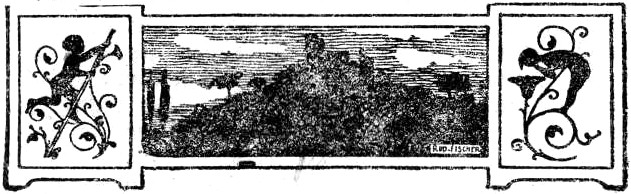

Nachdruck verboten. — Alle Rechte vorbehalten.

Copyright by Verlag mod. Lektüre G.&nbsp;m.&nbsp;b.&nbsp;H., Berlin.

<h2>1. Kapitel.</h2>

<h3>Der Bund der Dreißig.</h3>

Ein Trupp trunkener Kanalarbeiter zog vorüber; jeder mit einem buntherausgeputzten Negermädel im Arm. Sie gröhlten und lachten. Es war heute Löhnungstag gewesen, und da waren diese Bilder für Panama das übliche.

Der ärmlich gekleidete Chinese mit dem halbzerrissenen Strohhut auf dem Kopf war vor der lustigen Gesellschaft schleunigst hinter den Bretterzaun eines Hauses geflüchtet. Nun setzte er vorsichtig seinen Weg fort. Oft blieb er stehen und schaute sich schnell um.

Es war eine der erst durch den Kanalbau neu entstandenen Straßen, in der er sich befand. Sie mündete auf die Felder. Die Holzhäuser mit ihren gazebespannten Fenstern und Veranden standen schon wieder zum größten Teil leer. Die goldene Zeit für Panama näherte sich ihrem Ende. Der Kanal, der die beiden Weltmeere verbinden sollte, war ja so gut wie fertig. — Ganz fertig wird es ja nie werden, dieses ungeheure Werk, das Menschengeist erdacht hat und Menschenhände ausführten. Die Erdrutsche, besonders an dem berüchtigten Kulebra-Durchstich, werden nie aufhören. So wird der Panama-Kanal stets ein Sorgenkind für die Amerikaner und sein strategischer Wert zur schnellen Beförderung der Vereinigten Staaten-Flotte vom Atlantik zum Stillen Meer und umgekehrt höchst zweifelhaft bleiben — eben der vielen komplizierten Schleusenanlagen wegen, die zur Ausgleichung der Terrainschwierigkeiten nötig waren.

Der Abend war selbst für Panama selten schwül, und der Chinese hatte längst keinen trockenen Faden am Leibe.

Echte Chinesen schwitzen nicht so, daß ihnen das Wasser ständig von der Stirn über das Gesicht rinnt. Selbst in Panama nicht. Und echte Chinesen fluchen auch nicht leise auf deutsch vor sich hin, wenn sie der ungenügenden Nachtbeleuchtung durch Mond- und Sternenlicht in ein Loch der Straße geraten und stolpern.

Jetzt schlüpfte der Mann mit dem zerrissenen Strohhut und dem mageren Gesicht, das eine Farbe wie hellgelber Senf hatte, zwischen zwei Häusern hindurch auf einen einsam stehenden, langgestreckten Holzschuppen zu, der früher als Kantine für die Arbeiter gedient hatte, jetzt aber leerstand.

Hier außerhalb der Häuserreihen roch es recht kräftig nach Petroleum. Und dieser Geruch war typisch für den Kanalbau. Hatten doch die Amerikaner mit dem ersten Spatenstich zugleich auch hier überall den Kampf gegen die Moskitos, die Verbreiter der Malaria, mit aller Energie aufgenommen und weit und breit alle Gewässer mit einer Schicht Petroleum bedeckt, sehr zum Entsetzen der Eingeborenen, die aber umsonst gegen diese Radikalkur Protest erhoben. Die Malaria wurde ausgerottet. Der Petroleumgeruch blieb noch lange Zeit bestehen.

Der Chinese wurde gleich darauf angerufen.

»Halt — wer da?«

Die Stimme kam aus der nur angelehnten Tür des Schuppens.

»Borussia und Austria«, gab der Chinese ebenfalls auf Deutsch zurück. Dann verschwand er in dem Schuppen. Hinter ihm zog der Mann an der Tür diese ins Schloß.

»Der dreißigste«, sagte er kurz zu dem Chinesen, von dem er jetzt in der rabenschwarzen Finsternis auch nicht einmal mehr die Umrisse sehen konnte.

»So — also bin ich der letzte«, meinte der mit Senfgesicht. »Ich wurde aufgehalten. — Aber vorwärts. Ich bringe wichtige und gute Nachrichten.«

Gleich darauf zuckte der schmale Lichtkegel einer elektrischen Taschenlampe durch die Finsternis. Die beiden Männer wandten sich nach links, wo eine Tür in einen zweiten Raum führte, in dem an der Decke eine schmierige, stinkende Petroleumlampe brannte, die jedoch mit Hilfe von Zeitungen so stark abgeblendet war, daß sie nur einen rötlichen Lichtkreis auf den schmutzigen Bretterboden warf.

Fünfundzwanzig Deutsche waren hier jetzt versammelt. Eine recht buntzusammengewürfelte Gesellschaft: Schiffsoffiziere des Norddeutschen Lloyds und der Hamburg-Amerika-Linie, Steuerleute, Matrosen und Heizer von Dampfern und Seglern, ferner ein Schiffsarzt, zwei Ingenieure, ein Chemiker, drei Kellner und — noch jemand, der all diese zusammengeströmten Deutschen ausgesucht und zwischen ihnen den Vermittler gespielt hatten bis hier auf diesem gefährlichen Boden, wo überall englische und französische Agenten herumspionierten, so etwas wie ein Geheimbund sich bildete, dessen Zweck einzig und allein darauf gerichtet war, den Mitgliedern die Rückkehr die Heimat und die Teilnahme am Kampfe gegen England und seine Verbündeten zu ermöglichen.

Der Chinese trat jetzt in die Mitte des Raumes, verbeugte sich leicht und fragte mit halblauter Stimme:

»Die fünf Posten haben draußen wie immer ihre Plätze inne?«

Der, der mit ihm eingetreten war, bejahte kurz und lehnte sich dann ebenso wie die übrigen abwartend gegen die Bretterwand.

Der Chinese zog ein großes Stück Kreide aus dem Kittel, kniete sich hin und begann auf dem Fußboden, und zwar genau auf dem Lichtkreis der Lampe mit sicheren Strichen eine Skizze der Kanalmündung zu entwerfen: die Strandlinie, die vorgelagerten, von den Amerikanern zu Befestigungen ausgebauten Inseln, die Blinkbojen, die die Kanaleinfahrt kennzeichneten, und eine Anzahl Schiffe, die draußen auf der Reede ankerten.

Die vierundzwanzig anderen waren näher herangetreten und hatten neugierig dem Beginnen ihres Anführers zugeschaut. An Überraschungen von seiner Seite waren sie ja schon gewöhnt. Was aber sollte diese Skizze? Das, was da mit Kreidestrichen angedeutet war, kannte ja jeder von ihnen zur Genüge. Die meisten hielten sich schon wochenlang in Panama auf, hatten stets aufs neue versucht, irgendwie von hier fortzukommen, und waren ebenso stets gewahr geworden, daß der englische Einfluß auch hier genug Geltung hatte, um jedem Deutschen die Weiterreise unmöglich zu machen. Von allen Mitteln entblößt, von den amerikanischen Behörden schikaniert, von den ententefreundlichen Bewohnern der Stadt mit Haß und Hohn verfolgt, hatte ein Teil von ihnen bereits allerlei Arbeit angenommen, nur um das Leben fristen zu können. Dann war vor drei Wochen, Mitte Oktober, ein neuer Landsmann in Panama aufgetaucht. Und mit ihm kam neue Hoffnung in die Verzagten. Ganz heimlich hatte er sich, stets in Verkleidung, an einen nach dem anderen herangemacht, hatte manchen als ungeeignet wieder fallen lassen, schließlich aber doch, sich selbst eingerechnet, dreißig Leute zusammengebracht, alles junges, kräftiges Volk, auf das er in jedem Falle bauen konnte.

Als diese dreißig zum erstenmal vor acht Tagen hier sich trafen, und viele mußten auf des Anführers Geheiß sich vorher in Neger oder Chinesen verwandeln, da hatte der Mann, dem sie schnell blindlings vertrauen lernten, ihnen seinen Plan entwickelt, wie man einzig und allein nach Europa gelangen könnte.

»Not kennt kein Gebot, Kameraden! Das, was ich plane, ist ungesetzlich, kann uns an den Galgen bringen. Und wer nicht mithalten will, kann ruhig aus unserem Bunde ausscheiden. Ich habe die Überzeugung, daß mein Gedanke durchführbar ist. Das Wie müssen die Umstände ergeben, ebenso das Wann.«

So hatte er gesprochen und weiter noch seinen Plan ganz eingehend auseinandergesetzt, soweit sich das damals schon tun ließ. Und nicht einer von den neunundzwanzig zögerte nachher auch nur einen Augenblick, sein deutsches Manneswort darauf zu verpfänden, nach besten Kräften zum Gelingen des Vorhabens beizutragen.

Das war der Gründungstag des Bundes gewesen. Und von da an lebten die Eingeweihten nur noch dem einen Gedanken: alles vorzubereiten, damit der große Schlag auch gelinge, wenn sich die ersehnte Gelegenheit biete. — Und jeder wußte, was er zu tun hatte. Je nach den Fähigkeiten des einzelnen waren die Aufgaben verteilt worden. Und schon hierbei zeigte sich, mit welch’ weitschauendem Blick, kühler Überlegung und schlauer Berechnung ihr Anführer ausgerüstet war. — —

Der Chinese mit dem zerrissenen Strohhut erhob sich jetzt aus seiner knienden Stellung, deutete mit dem Finger auf eines der in die Skizze eingezeichneten Schiffe und begann mit seinen Erklärungen.

Wohl zehn Minuten sprach er.

Dann meinte er zum Schluß:

»Weiß jemand einen Plan, der ein noch sichereres Gelingen verspricht? — So, dann wollen wir gleich die Stellen besetzen.« Er zog ein Blatt Papier aus der Tasche, auf dem er sich eine lange Reihe Namen, dreißig an der Zahl, notiert hatte.

»Kapitän — ich selbst. — Erster Offizier — Lüder, zweiter — Meirat, dritter Henke …« Und so ging es fort, bis jeder seinen Posten hatte. Daß hierbei ein Schiffsoffizier des Lloyds, weil er eben an Dienstjahren jünger war, sich mit der Stellung eines einfachen Matrosen begnügen mußte, konnte nicht ausbleiben. Aber diese Degradation nahm jeder freudig hin.

Dann hatte dieser und jener noch etwas zu fragen. Kleine Unklarheiten der Aufgaben, die den in fünf Gruppen geteilten Mitgliedern dieses seltsamen Bundes zufielen, wurden noch schnell beseitigt.

Hierauf ging man mit einem ernsten Auf Wiedersehen auseinander. Und dies geschah mit derselben Vorsicht, mit der man sich hier auch zusammengefunden hatte.

Der Chinese mit der ramponierten Kopfbedeckung verschwand als erster. Er hatte es eilig. Seiner warteten noch gesellschaftliche Pflichten, die doch wieder so eng mit dem großen Zweck verknüpft waren.

Auf demselben Wege wie vorhin begab er sich in das Innere der Stadt. Er kam an einer ganzen Reihe von Kirchhöfen vorbei. Dort ruhten alle die Tausende von Arbeitern, die hier während des Kanalbaus zumeist der Malaria und dem gelben Fieber zum Opfer gefallen waren.

Alte Kirchen, noch aus der Zeit der Spanier stammend, schöne Plätze mit hohen Palmen und gärtnerischen Anlagen, elegante Häuser und zahllose Kaffees, Singspielhallen, Lichtbildtheater und Geschäftshäuser mit blendenden Lichtreklamen gaben dem reicheren Viertel Panamas ein besonderes, fast großstädtisches Gepräge. In den Straßen bewegte sich hier ein wahres Völkergemenge, um nach des Tages Arbeit Zerstreuung zu suchen: Neger, die die Hauptmasse ausmachten, Chinesen, Japaner, Inder und die Vertreter wohl sämtlicher weißen Rassen. —

An einem der Schmuckplätze liegt das Zentral-Hotel<@refnote/>, das beste Panamas, ein Bau, der mit allen Errungenschaften der Neuzeit ausgestattet ist. Ihm gegenüber wieder erhebt sich in einem parkähnlichen Garten ein altertümliches, verwittertes Haus aus Backsteinen. Das spanische Konsulat war früher einmal darin untergebracht. Jetzt wurden die wenigen, noch bewohnbaren Räume an Privatleute vermietet.

Der Chinese bog vor diesem Schmuckplatz in ein enges Gäßchen ein und gelangte so an die Rückfront des Gartens des ehemaligen Konsulats. Geschickt schwang er sich über die halb zerstörte Steinmauer und schlich nun sehr behutsam nach dem Stallanbau hin, wo er in der einstigen Wagenremise verschwand. Sie war halb mit zerbrochenen, übereinangergehäuften Kisten und allerlei Gerümpel angefüllt. Eine dieser Kisten rückte der Chinese, sich dabei wieder seiner Taschenlampe bedienend, beiseit, schlüpfte in die so entstandene Öffnung hinein und zog die Kiste wieder an die alte Stelle, indem er gleichzeitig einen löcherigen Teppich wie einen Vorhang über diesen Eingang fallen ließ.

Gleich darauf begann er im Innern des Haufens von Gerümpel beim Schein einer Kerze seinen äußeren Menschen in sein wahres Selbst zu verändern. Ein gefüllter Wassereimer, Seife, Bürste, Handtücher und ein Spiegel standen zu diesem Zweck zur Verfügung.

Es war genau ¾11 Uhr, als er die Wagenremise wieder verließ.

<h2>2. Kapitel.</h2>

<h3>Das Tanzfest im Zentral-Hotel.</h3>

»Sie erwähnen jetzt schon zum drittenmal diesen Namen Marschner. Wer ist der Herr eigentlich, was ist er, und weshalb sind Sie so begierig, Master Shouftkraat, ihn wiederzusehen?«

Der lange dürre Marineoffizier, der hier in Panama für England den Schiffsverkehr nach auswärts daraufhin überwachte, daß ja kein mit falschen Ausweispapieren versehener oder gar verleideter Deutscher — und sogar als Neger hatten diese Hunnen es ja versucht! — durchschlüpfe und nach Europa in See gehe, zuckte verächtlich die Achseln.

»Miß Ribot«, erwiderte er dann, »wir hier an unserem Tische sind alles begeisterte Patrioten. Desto weniger Verständnis haben wir daher für einen Mann, der sein Vaterland gerade jetzt verleugnet und verrät, selbst wenn dieses Vaterland das verd… Deutschland ist. Marschner ist Deutscher, aber er will es nicht mehr sein. In der Stunde der Not wurde er ein Abtrünniger. Aber ich brauche ihn, und daher lasse ich ihn nicht merken, wie ich über ihn denke. Er hilft mir dabei, den Passagierverkehr zu überwachen, und er hat schon ein gutes Dutzend Deutscher entlarvt, die mir und meinen Agenten entgangen wären.«

In demselben Augenblick setzte die Musik oben auf der Galerie des feenhaft erleuchteten Saales mit einem Walzer ein, dem weltberühmten Werke des Franzosen Cremieux<@refnote/> »Quand l’amour meurt« — »Wenn die Liebe stirbt …«

Die sieben Personen an dem auf der Bühne des Saales stehenden Tische lauschten einen Augenblick den weichen, wiegenden Klängen, die jetzt endlich das Surren der vielen Ventilatoren unter der Saaldecke übertönten, ein Surren, das wie das ferne Brausen der See geklungen hatte, von deren Brandung hier in Wahrheit doch nichts mehr zu hören war, wenn sie auch gar nicht so sehr weit entfernt lag.

Dann sagte Miß Walport, die Tochter des englischen Börsenkönigs, mit leisem Spott:

»Von diesem Dutzend Vögel, die dieser Marschner für Sie fing, Shouftkraat, hatten aber die meisten, wie sich nachher herausstellte, echtes Gefieder, und für Sie ergaben sich daraus nur Unannehmlichkeiten.«

Der Marineoffizier machte eine gleichgültige Geste mit der Hand.

»Im ersten Übereifer mag er sich geirrt haben. Er ist ja kaum acht Tage für uns tätig.«

Da mischte der dicke Walport sich ein, der auch seiner Kleidung ebenso wie in seinem groben Bulldoggengesicht den Emporkömmling verriet. Er war stets wie ein Geck trotz seiner fünfzig Jahre herausgeputzt und mit Brillanten überladen, ganz im Gegensatz zu seinem einzigen Kinde, die in allem weit mehr Geschmack verriet.

»Ich wünschte, der Mann wäre Vollblutengländer, wahrhaftig! In dem Burschen steckt etwas. Ich liebe solche Leute, die sich wie ich durch das harte Leben durchgebissen haben. Und das hat er getan. Er gibt ja ruhig zu, mit achtzehn Jahren von Hause entlaufen zu sein, um nicht ein frommer Prediger werden zu müssen, wie es sein Vater war, der den Sohn für denselben Beruf bestimmt hatte. Fragen Sie Marschner nachher doch mal, denn er wird sich bestimmt noch einfinden, Miß Ribot, was er in seinem Leben nicht gewesen ist. Alles, sage ich Ihnen, alles — vom Hoteldiener bis zum Krankenwärter in einem Seuchenlazarett, vom Matrosen bis zum Minenarbeiter. Und als letzterer hat er dann sein Glück gemacht, hat gerade vor Ausbruch des Krieges silberhaltige Erzgänge oben in Mexiko entdeckt, die er glänzend von einer Gesellschaft bezahlt erhielt. Und jetzt schnüffelt er hier in Panama nach einem noch fetteren Bissen herum. Ich glaube, er will ein Unternehmer größten Stils grünen, um den Touristen, die sich den Kanal ansehen wollen, diese Besichtigung in jeder Beziehung zu erleichtern und dabei natürlich auch ihre Taschen zu plündern, was die Hauptsache ist. Der Gedanke ist nicht schlecht, und vielleicht gebe auch ich dazu Geld her.«

Dasy Walport lächelte geringschätzig. Ihr hübsches, rassiges Gesicht, das so wenig dem ihres Vaters glich, drückte in jeder Miene tiefste Verachtung aus.

»Ein Mann, der sein Vaterland verrät, bleibt für mich ein Schuft, und wenn er ein noch so smarter Kopf ist.«

Madame Ribot, die Gattin eines französischen Obersten, der für seine Regierung in Mexiko Pferde und Maultiere angekauft hatte und nun mit den Seinen nach Paris zurückkehren wollte, fächelte sich eifrig mit dem Seidentüchlein Luft zu. Ihren in ein enges Mieder eingepreßten 200 Pfund bekam die Saal herrschende Hitze sehr schlecht. Auf ihrer Stirn standen trotz der Puderschicht feine Schweißperlen, und sie atmete keuchend, als solle sie jeden Augenblick einen Schlaganfall erleiden. Sie wandte sich jetzt an den Londoner Börsenkönig und fragte fast weinerlich:

»Sie hoffen also bestimmt, in drei Tagen hier mit Ihren Geschäften fertig zu sein, Master Walport? — Wenn dem doch nur so wäre! Ich sterbe sonst hier noch in diesem furchtbaren Panama. Es ist ein Backofen, keine Stadt. Und dazu noch überall das Negergesindel — entsetzlich!«

»Dafür genießen Sie nachher aber auch den Vorteil, mit einem der schnellsten Schiffe der Welt — und das ist meine »India«! — in weit kürzerer Zeit nach Europa und weit bequemer und behaglicher zurückzugelangen, als wenn Sie erst von New Orleans einen der gewöhnlichen Passagierdampfer benutzt hätten.«

»Gewiß — gewiß, ich bin Ihnen ja auch sehr dankbar, daß Sie uns, obwohl wir uns hier im Zentral-Hotel erst vorgestern kennen lernten, freundlichst eingeladen haben, als Ihre Gäste auf Ihrer Jacht die Rückreise mitzumachen, Master Walport.«

Der Mann mit dem Bulldoggengesicht lächelte.

»Wir sind uns gegenseitig verpflichtet, Mistreß Ribot. Also danken Sie nicht zu viel. Ich habe mit Ihrem Gatten ja ein leidlich gutes Heereslieferungsgeschäft abgeschlossen.«

Unten im Saal, wo sich eine Menge Herren und Damen noch eben im Tanze gedreht hatten, trat jetzt plötzlich eine Stockung ein. Kleine Hotelboys, alles Neger in grellbunten Uniformen, verteilten Abzüge der neuesten drahtlosen Depeschen vom Kriegsschauplatz, die das englische Konsulat herstellen ließ, vorher aber noch nach seinem Geschmack etwas zurechtstutzte.

Verschiedene Hochrufe auf England und Frankreich wurden laut. Der Kriegstaumel hatte wieder einmal die Menge gepackt.

Der in einen tadellosen schwarzen Jackenanzug mit Seidenaufschlägen gekleidete Shouftkraat verzog sein langes, braunes, ganz bartloses Gesicht zu einem Grinsen. — Ja, England verstand es, für die Sache der Entente Reklame zu machen …! Im August hatte hier noch für die Zentralmächte Stimmung geherrscht. Aber der Verleumdungsfeldzug, den man dann sehr geschickt gegen Deutschland und seine Verbündeten eingeleitet hatte und der von der amerikanischen Presse so liebevoll unterstützt wurde, hatte sehr bald gewirkt. Jetzt waren die Deutschen auch hier nur noch Hunnen und Barbaren, und jeder verkommene Neger kam sich weit mehr als »Gentleman« vor als die verd… Germans, glaubte sich den Panama heimtückisch festgehaltenen Vertretern dieser Nation gegenüber jede Frechheit herausnehmen zu dürfen und wurde in diesem Beginnen auch stets von den amerikanischen Behörden offenkundig in Schutz genommen, so daß der Deutsche so gut wie rechtlos war und nur heimlich die Faust in der Tasche zu ballen wagen durfte.

Shouftkraats grinsendes Gesicht wurde plötzlich ernst.

»Marschner kommt«, sagte er zu Klaire Ribot. »Wie ungebildet …! Er erscheint im blauen, doppelreihigen Anzug, als habe er eine Segelpartie vor.«

Die Familie des französischen Obersten — am Tische saß auch noch die jüngere Tochter Etienne — schaute dem Deutschen mit einiger Spannung entgegen.

Marschner schlenderte, die Fäuste in den Jackentaschen vergraben und eine weiße Leinenmütze unter dem linken Arm festklemmend, gemächlich durch das Gewoge, nickte hin und wieder einem Bekannten zu, und steuerte geradewegs auf die Bühne zu, die für die vornehmsten Gäste des Hotels bereitgehalten worden war. Und vornehm bedeutete hier ebensoviel wie reich.

Die Musik spielte jetzt die Marseillaise, da nach den neuen Depeschen die Franzosen wieder 80 000 Deutsche gefangengenommen hatten. Die meisten Anwesenden wußten zwar, daß spätestens übermorgen diese Meldung widerrufen werden würde, aber — wozu sollte man nicht so tun, als ob man an die von englischer Seite zurechtgemachten Telegramme wirklich glaubte?! So sang man denn die Nationalhymne des alten Frankreichs mit und bildete sich ein, auf diese Weise mindestens ein gut Teil zum endgültigen Siege der »gerechten Sache« mit beizutragen.

Marschner hatte den Tisch seiner Bekannten erreicht, verbeugte sich sehr tief, fast unterwürfig, und erhielt nur von Walport einen einigermaßen höflichen Gegengruß. Der Börsenkönig war es auch, der ihn Ribots vorstellte, wobei der Oberst geflissentlich über den Deutschen hinwegsah.

Dieser, schlank und etwas über Mittelgröße, hatte eine schlaffe, vornübergebeugte Körperhaltung und träge, lässige Bewegungen, dazu aber ein Gesicht, das, gerade weil es bartlos war, alle Einzelheiten eines Charakterkopfes von jener Häßlichkeit deutlich hervortreten ließ, die oft anziehender und eindringlicher wirkt als nüchterne, regelmäßige Schönheit.

Jeder Maler, jeder Bildhauer hätte von diesem Gesicht mit Recht gesagt: alles darin ist Energie — die etwas große, aber schmale Nase, der Bau der Kinnbacken, der breite Mund mit den dünnen Lippen, das große, graublaue, von den Lidern meist halbverdeckte Auge und die leicht vorspringende, eckige Stirn.

Und doch hatte von den Menschen hier am Tisch nur ein einziger Verständnis auch für diese äußeren Anzeichen eines willensstarken, wohl auch rücksichtslosen Charakters. Das war Master Emmery Walport, dessen Bulldoggenvisage alle die Kennzeichen ebenfalls, nur ins Grob-Gemeine übertragen, aufwies. Walport hatte sehr bald dieser nach außen hin so stark zur Schau getragenen trägen Lässigkeit Marschners mißtraut. Ihm kam es so vor, als ob der Deutsche absichtlich sich anders gab, als er in Wirklichkeit war.

Auch jetzt glaubte er wieder blitzschnell um Marschners Mund ein leises, ironisches Zucken gleiten zu sehen, als der englische Marineoffizier mit fast befehlender Handbewegung jenem den Stuhl neben sich anwies, so daß der Deutsche zwischen ihm und Shouftkraat zu sitzen kam.

»Was Neues?« fragte dieser kurz.

»Ich glaube«, erwiderte Marschner ebenfalls in tadellosem Englisch. »Wir werden nächstens vielleicht einen guten Fang machen. Ich bin da so einigen Leuten auf der Spur, die irgend etwas planen. Was, weiß ich noch nicht. Ich hoffe aber noch dahinter zu kommen.«

Die ganze Art, wie er sprach, war so recht das Seitenstück zu seinem schleppenden Gange und den faulen Bewegungen.

Shouftkraat zuckte die Achseln.

»Was nützt mir das: — vielleicht — ich hoffe … — Das ist alles so unbestimmt. Legen Sie sich nur für die Sache mal etwas lebhafter ins Zeug! Sonst kann ich es Ihnen nicht versprechen, Sie mit dem nächsten Dampfer nach Habana mitzunehmen, wohin Sie so gern in Geschäften möchten.«

Marschner schaute den Engländer bittend an.

»Ich muß hin, ich muß! Große Sache dort, viel zu verdienen. Ich werde mir alle Mühe geben, Master Shouftkraat, wirklich! Aber das Klima hier saugt einem ja alle Energie aus den Knochen — alle! Ich könnte immer nur in der Hängematte liegen.«

Emmery Walport wurde jetzt doch wieder irre an diesem Menschen. Na — ihm konnte es gleichgültig sein, ob Marschner sich verstellte, was sein ganzes sich Geben anbetraf. Jedenfalls jagte der Mann dem Gelde nach, das war sicher. Früher mochte er anders gewesen sein. Aber er hatte bei der Silbermine sozusagen Blut geleckt und jetzt nur noch den einen Gedanken, möglichst noch mehr Geld auf leichte Weise zusammenzuscharren.

Walport trank seinen Whisky mit Eis und Fruchtsaft langsam aus und dachte, daß dieser Marschner daheim in London als Angestellter vielleicht sehr gut zu gebrauchen wäre. Lange konnte er diesen Gedanken jedoch nicht ausspinnen, da einer der Hotelboys ihm eine Depesche brachte, die er sofort eifrig studierte.

Dann wandte er sich lebhaft an seine Tochter.

»Dasy, ich muß sofort nach Punta Arenas (Haupthafen der Republik Nicaragua). Watson meldet mir daß der Mexikaner nun doch seine Bergwerke verkaufen will.«

Er erhob sich »Natürlich fahre ich mit der Jacht. Das geht am schnellsten.« Dann schien ihm ein besonderer Gedanke zu kommen. Er wandte sich an den Oberst Ribot und fuhr fort: »Begleiten Sie mich doch mit den Ihrigen. So eine Seefahrt hat mehr Reiz, als hier die Stickluft in Panama zu atmen. Aber Sie müssen sich schnell entscheiden. Auch nur das Nötigste mitnehmen. In drei Tagen sind wir wieder zurück.«

Frau Ribot merkte, daß ihr Gatte offenbar Lust hatte, der Einladung Folge zu leisten. Sie stöhnte daher kläglich auf.

»Wie, Master Walport, gedenken Sie etwa jetzt mitten in der Nacht abzureisen?« fragte sie.

Walport hatte schon einen Kellner herangewinkt.

»Schicken Sie jemand nach dem Hafen, der mir ein gutes Ruderboot besorgt, das in einer Stunde an der Ostmole bereitliegen muß und mich nach meiner Jacht hinüberbringen soll.« Dann antwortete er der Französin: »Selbstredend — noch in dieser Nacht! Sie haben ja gehört: in einer Stunde gehe ich an Bord.«

Marschner hatte den Kellner, der schon davoneilen wollte, zurückgerufen.

»Erlauben Sie, Master Walport«, klärte er diesen auf, »daß ich selbst für Sie das Boot besorge. Ich habe ja nichts Besseres vor.«

Der Börsenkönig nickte.

»Sehr liebenswürdig. Wenn Sie so freundlich sein wollten … Dann habe ich wenigsten die Gewißheit, daß die Geschichte klappt. — Hm — wollen nicht auch mit? Was meinen Sie dazu? — Und wie steht’s mit Ihnen, Shouftkraat?«

Der dürre Engländer sagte nur maulfaul: »Ich mache mit« und wandte sich dann an Marschner: »Sie dürften hier doch jetzt anscheinend nötiger sein.«

Der Deutsche überlegte.

»Mag sein. Jedenfalls muß ich mir noch klar darüber werden, ob ich die drei Tage opfern kann.«

Dann verbeugte er sich und schritt quer durch den Saal dem Ausgang zu.

Vor dem Hotel stand aus Anlaß des Tanzfestes eine lange Reihe leichter Maultierwagen.

Marschner bestieg eins der schnellen Gefährte und ließ sich nach dem Hafen fahren — nach der Westmole. Hier mußte der Wagen warten.

Der Deutsche eilte zu Fuß auf eine hölzerne Landungsbrücke zu. Dort lag ein großes Boot, in dem vorn ein Haufen Netze aufgestapelt war. Im Stern auf der Steuerbank saß ein Neger in einem einmal weiß gewesenen Leinenanzug und rauchte eine kurze Pfeife.

»Borussia und Austria«, rief Marschner den Schwarzen leise an.

Dann flüsterten die beiden eifrig miteinander.

Wenige Minuten später brachte der Maultierwagen den Deutschen vor das ehemalige spanische Konsulat gegenüber dem Zentral-Hotel.

<h2>3. Kapitel.</h2>

<h3>Überraschungen.</h3>

»Alles in Ordnung, Master Walport. Das Boot wartet. Mein Gepäck habe ich bereits im Boote verstaut.«

»Dank’ Ihnen, Master Marschner. Die Damen erscheinen sofort.«

Shouftkraat machte ein sehr erstauntes Gesicht.

»Sie wollen also an der Fahrt wirklich teilnehmen?« fragte er in einem Tone, als ob er über den Deutschen zu bestimmen hätte. »Ich begreife das nicht recht. Ich denke, Sie haben hier zu tun, sprachen doch von einigen Leuten, denen Sie auf der Spur wären?!«

»Gewiß nehme ich teil«, erwiderte Marschner gelassen. »Und was jene dreißig Leute anbetrifft, — die Sache ist schon in Ordnung. Das Nähere erfahren Sie<@refnote/> an Bord der Jacht.«

»Dreißig?« meinte der Marineoffizier erstaunt. »Ja, das wäre ja schon die reine Verschwörung.«

Der Deutsche antwortete nichts weiter, sondern zündete sich sehr umständlich eine Zigarre an.

Die Herren standen in der Marmorvorhalle des Hotels neben dem großen Springbrunnen, in dessen Bassin zwei ziemlich ausgewachsene Alligatoren, die an Ketten gelegt waren, gehalten wurden.

Dann kamen auch schon die Damen die breite Treppe hinunter. Dasy Walport wie immer sehr gesetzt und ruhig, die beiden Töchter des französischen Obersten aber ausgelassen wie die Kinder in Vorfreude auf die Seefahrt mit der eleganten, schnellen Jacht.

Vier Maultierwagen brachten Emmery Walports Gäste nach der Ostmole. — Das von Marschner bestellte Boot lag weit draußen am Ende des mächtigen Steinquaderdammes an einem etwas wackligen Holzstege.

Drei Neger und ein Chinese saßen als Ruderer darin, die sich nun über das Gepäck hermachten und zuerst die Damen hineinhoben. Ein riesiger Neger hob selbst die schwere Frau Ribot wie ein Püppchen hoch und landete sie glücklich auf der Vorderbank neben dem Haufen von Netzen.

Gerade wollte man dann abstoßen, als über die Mole zwei Hafenwächter eilig dahergelaufen kamen von denen der vorderste befehlend rief:

»Halt — halt! Ihr bleibt vorläufig …!«

Walport lachte.

»Der Kerl ist verrückt. — Macht frei von dem Stege!«

Der Chinese schob das Boot mit der Stange ins offene Wasser. Da — wieder einer der Hafenwächter:

»Halt — im Namen des Gesetzes! Oder wir alarmieren die Polizeiboote.«

Von diesen flinken, kleinen Motorbarkassen waren Tag und Nacht ein Dutzend auf Patrouille, hauptsächlich, um ein Ausspionieren der die Kanalmündung schützenden, neu angelegten Befestigungswerke zu verhindern, eine Sicherheitsmaßregel, die sich lediglich gegen die gelben Japs drüben in Ostasien richtete, die schon längst begehrlich nach Kalifornien hinüberschielten.

Marschner stand neben Shouftkraat aufrecht im Boot, das leise schaukelnd auf dem Wasser lag.

Abermals die Stimme des Beamten:

»Heran mit Euch an den Steg, Ihr da! Es sind in dieser Nacht vier Boote gestohlen worden, und wir …«

Marschner hatte dem Marineoffizier schon zugeraunt:

»Geben Sie sich doch zu erkennen, Master! Die Leute halten uns ja nur unnötig auf.«

Shouftkraat fiel wirklich darauf herein. Nachher hätte er sich ohrfeigen können deswegen. Aber da war es eben leider zu spät.

»He, Leute, — hier Fregattenkapitän Shouftkraat von der englischen Marine. — Daß wir kein Boot gestohlen haben, werdet Ihr mir wohl glauben.«

Marschner hatte einem der Neger leise Befehl gegeben, das Fahrzeug näher mit den Riemen (Rudern) an den Steg heranzurücken. So kam es, daß der eine Hafenwächter den dürren Engländer, der sich ständig an den Dampferanlegeplätzen herumtrieb, erkannte und zurückrief:

»Schon gut, Master, schon gut. Fahrt nur zu!« —

Die »India« lag weit draußen hinter der kleinen Insel Farkalane außerhalb der Quarantänezone. Emmery Walport wollte die Scherereien mit der Hafenpolizei vermeiden, die es mit den Untersuchungen der Schiffe auf gelbes Fieber sehr genau nahm.

In einer halben Stunde war man der Jacht bis auf achthundert Meter etwa nahe gekommen Die Neger und der Chinese hatten wie die Teufel gerudert. Unterwegs war man noch einmal von einem Polizeiboot angerufen worden, das aber sofort wieder davonjagte, als Walport hinüberrief, er wolle nach seiner Jacht.

Marschner saß am Steuer, Shouftkraat vorn neben Frau Ribot. Diese stocherte mit dem Sonnenschirm, den sie höchst überflüssigerweise mitgeschleppt hatte, in den Netzen umher.

»Es steht nur so aus, als ob es alles Netze sind«, sagte sie plötzlich zu dem langen Marineoffizier. »Darunter liegen anscheinend Kisten. Hören Sie — es klingt ganz hohl, wenn ich mit der Schirmspitze gegenstoße.«

In derselben Minute besichtigte Klaire Ribot den linken Ärmel ihrer weißen Sportjacke mit entsetzten Blicken.

»Wo habe ich mir den Ärmel nur so angewischt!« rief sie ärgerlich. »Am Ellenbogen ist er ganz schwarz.«

Sie saß neben Marschner, und ihr gegenüber wieder Dasy Walport.

Der Deutsche lachte fast übermütig auf. Das war man an ihm so wenig gewohnt, daß Dasy ihn überrascht anblickte.

»Vielleicht haben Sie das Gesicht des schwarzen Riesen gestreift, als er Sie in das Boot hob«, meinte Marschner mit kaum merklicher Ironie.

Aber es war noch ein Etwas in dem Ton seiner Stimme, das Dasy stutzig machte. Diese Stimme klang so ganz anders mit einem Male, durchaus nicht mehr so bescheiden wie bisher.

»Es soll nämlich auch Neger geben, die abfärben, Miß Ribot«, fuhr er fort. »Man begegnet ihnen auf der Bühne, auf Maskenbällen und … vielleicht auch anderswo, wo man es sich am wenigsten träumen läßt.«

Aber Klaire Ribot war nicht zum Scherzen aufgelegt. Dieser abtrünnige Deutsche durfte es nun schon gar nicht wagen, über ihr Mißgeschick auch noch Witze zu machen. Sie hatte schon eine scharfe Zurechtweisung auf der Zunge, als man vorn Shouftkraat rufen hörte:

»He, Boys, was habt Ihr denn hier in den Kisten drin? Wohl Schmuggelgut?«

Die Frage war an die Gesamtheit der vier farbigen Ruderer gerichtet. Zu aller Erstaunen übernahm Marschner die Antwort. Er konnte sich diesen Spaß schon leisten. Hatte er doch an Bord der Jacht, die keine dreihundert Meter mehr entfernt war, vor einigen Minuten am Bug zwei grüne Laternen dicht nebeneinander brennen sehen. Und die bewiesen ihm, daß dort alles nach Wunsch gegangen war.

»Schmuggelgut nicht gerade, Master Shouftkraat«, rief er diesem zu. »Aber was Ähnliches, nämlich Gewehre und sonstige Waffen, die ich heimlich in Panama aufkaufen ließ und mit denen ich ein gutes Geschäft zu machen hoffe.«

Wieder schaute Dasy Walport — der Mond stand noch voll am Himmel — den Deutschen prüfend an. Sie wurde heute nicht recht klug aus ihm. Und wirklich — um seinen Mund, der grausam — brutal aussah, spielte ein deutliches Lächeln des Triumphes.

Dasy wurde es mit einemmal ganz bänglich zu Mute. Weshalb, wußte sie nicht. Aber es lastete auf ihr wie die dunkle Vorahnung von etwas sehr Unangenehmem, Schrecklichem.

Und ihre Abneigung gegen diesen Mann, der bisher lediglich des Geldes wegen den anmaßenden Fregattenkapitän umschmeichelt hatte, wuchs noch mehr. Unsympathisch war ihr Marschner vom ersten Augenblick an gewesen. Sie verachtete ihn aus tiefstem Herzen, weil er so leicht sein Vaterland aufgegeben und nur Spott für alles in der alten Heimat gefunden hatte, woran jeder andere Mensch mit ganzer Seele festhielt. Wenn sie ihn trotzdem stets mit einem gewissen Interesse heimlich beobachtet hatte, so war nur sein Gesicht daran schuld, das für sie etwas seltsam Anziehendes besaß und das sie stets in seinem geringen Mienenspiel studiert hatte, um herauszubekommen, ob dieser habgierige Abtrünnige wirklich keiner einzigen edleren Regung fähig sei, die sich vielleicht nur auf seinem Antlitz widerspiegelte.

Marschner hatte jetzt eine längliche Zündholzschachtel aus der Tasche gezogen. Hölzchen mit sehr langen dicken Köpfen waren darin. Und um eins der obersten Schicht war ein weißes Fädchen gewickelt, damit man es auch bei schwachem Licht herausfand.

Die Schachtel enthielt bengalische Zündhölzer in den Farben rot, gelb, grün und blau. Das Hölzchen, das jetzt aufflammte, gab ein grünes Licht … Auch ihm war plötzlich so eignen zu Mute. Ähnlich wie Dasy Walport. Die Geschichte mit den Gewehrkisten gefiel ihm nicht. Und jetzt hatte er sich auch wieder an die beiden Hafenwächter erinnert und an die gestohlenen Boote. Ob nicht doch etwa …

Da warf Marschner das Hölzchen schon wieder ins Wasser.

»Ich wollte nur Miß Ribots Jackenärmel beleuchten«, sagte er laut. »Er ist wirklich schwarz wie von Ruß, der mit Öl angerührt war …«

In elegantem Bogen lenkte er das Boot an das Fallreep der Jacht.

Walport brüllte jetzt nach oben, wo über der Reling ein paar Köpfe sichtbar waren:

»He — wollt Ihr nicht helfen, das Boot festmachen?! Ich bin’s, Walport! Und einer von Euch weckt sofort den Kapitän und den ersten Maschinisten.«

Zwei Leute kamen daraufhin die Schiffstreppe herab. Walport kannte sie nicht. Es waren fremde Gesichter.

»Wer seid Ihr denn, Ihr beiden?« fragte er barsch. »Was habt Ihr hier an Bord zu tun?«

»Heute angeheuert, Master«, meinte der eine. »Unsere Vorgänger sind ausgekniffen.«

Walport war beruhigt.

Die »India«, als Schonerjacht gebaut, aber dazu mit starken Motoren und zwei Schrauben ausgerüstet, die ihr eine sehr beträchtliche Geschwindigkeit verliehen, hatte mittschiffs einen niedrigen Aufbau, über dem die Kommandobrücke lag. In der Mitte des Aufbaus ging von achtern (dem Heck zugekehrte Seite) eine breite Mahagonitreppe, belegt mit kostbaren Läufern, in die für den Jachtbesitzer und seine Gäste bestimmten Räume hinab.

Emmery Walport führte den Oberst und dessen Damen — die anderen, Shouftkraat und Marschner, waren bereits mehrmals an Bord gewesen, stolz in den Salon, wo sämtliche Flammen der elektrischen Deckenbeleuchtung brannten. Er wunderte sich hierüber. Das sah ja gerade so aus, als ob man ihn erwartet hatte …!

»Bitte, machen Sie es sich hier bequem, meine Herrschaften«, wandte er sich nun an seine Gäste. »Ich werde sofort Befehl geben, daß Ihre Kabinen in Ordnung gebracht werden, damit Sie baldigst zur Ruhe gehen können.«

Mit einemmal fragte Dasy, die eben Frau Ribot in einen der bequemen Polstersessel genötigt hatte:

»Wo ist denn Master Marschner? Ist er an Deck geblieben?«

»Wahrscheinlich«, meinte Emmery Walport, und gähnte hinter der vorgehaltenen Hand. »Er wird wohl dafür sorgen, daß Kapitän Winsterley schneller den süßen Schlummer abschüttelt.«

Kaum hatte er das letzte Wort ausgesprochen, als der Marineoffizier wie Ruhe gebietend die Hand erhob.

»Da — hören Sie, — was ist das …?! Die Motoren gehen …!! — Begreifen Sie das, Walport?! Oder — war man auf unsere Ankunft vorbereitet? — Wahrhaftig, die Jacht liegt nicht mehr vor Anker. Wir … wir fahren! Die gleichmäßigen Schwankungen … — Kein Zweifel! Die »India« geht mit voller Geschwindigkeit in See!«

Walports Bulldoggengesicht zeigte einen leicht beunruhigten Ausdruck.

»Verdammt — was bedeutet das alles?!« brummte er und schritt zu der hellen, mit eingelegter Arbeit kunstvoll verzierten Tür, die auf die Haupttreppe führte. »Erst zwei fremde Gesichter, dann hier bereits das Licht eingeschaltet und die Türen unverschlossen, obwohl das während meiner Abwesenheit verboten ist, und nun noch die Abfahrt, ohne das Winsterley weiß, wo ich hin will …!! Muß doch mal selbst …«

Er brachte den Satz nicht zu Ende, rüttelte an dem Elfenbeindrücker der Tür, fluchte, rüttelte wieder, stieß sogar mit Fuß und Knie dagegen. Es half nichts.

Da wandte er sein plötzlich ganz bleich gewordenes, breites, grobes Gesicht seinen Gästen wieder zu.

»Die Tür ist von außen verschlossen. Wir sind hier eingesperrt«, sagte er tonlos.

Mit Ausnahme von Shouftkraat begriff sonst niemand, weshalb Walport so verstört aussah.

Der Fregattenkapitän sprang nach der zweiten Tür in der Rückwand des Salons. Auch sie war versperrt.

Da kam er langsam mit gerunzelter Stirn wieder an den Tisch zurück, um den die Damen sich niedergelassen hatten, und stieß heiser zwischen den zusammengepreßten Zähnen hervor:

»Wir sind in eine Falle geraten. Mir ist jetzt alles klar. Marschner sprach doch von dreißig Leuten, die etwas im Schilde führten, und sagte, die Sache sei schon in Ordnung. Die Dreißig sind Landsleute von ihm, und sie haben jetzt die »India« in ihrer Gewalt. Marschner hat uns alle hinters Licht geführt. Er spielte nur den Verräter!«

Walport schüttelte ganz geistesabwesend den Kopf.

»Unmöglich!« murmelte er.

Der Marineoffizier lachte kurz auf.

»So, unmöglich?! Und die gestohlenen Boote, die Kisten mit Waffen unter den Netzen, Miß Klaires beschmutzter Ärmel — die Ruderer waren natürlich nur angestrichen! — und schließlich das bengalische Streichholz als Zeichen für seine Gefährten, daß er, Marschner, sich in dem näherkommenden Boot befinde, — he, — paßt das nicht alles sehr gut zusammen?!«

Emmery Walport sank ächzend in den nächsten Sessel.

»Das — das wäre der frechste Streich, von dem ich je gehört hätte«, stotterte er.

»Und Marschner ein Mann von einer Verschlagenheit, Kühnheit und Energie, wie man ihn selten findet«, fügte seine Tochter hinzu.

<h2>4. Kapitel.</h2>

<h3>Gefangen!</h3>

Shouftkraat setzte sich gleichfalls.

»Warten wir ab, was geschieht«, meinte er, und legte dabei die Browningpistole vor sich auf den Tisch, die er stets bei sich führte. »Jedenfalls sind oben auf Deck eine ganze Menge Leute tätig. Hören Sie nur, wie eilig dort hin und her gelaufen wird.«

Jetzt erst wurde den Ribotschen Damen und auch dem Oberst klar, was sich hier eigentlich abspielte.

Frau Ribot begann zu weinen.

»Sie werden uns morden, diese Barbaren …!« jammerte sie. »Oh, meine armen Kinder, — daß Ihr in die Hände dieser Leute fallen mußtet …!!«

»Unsinn!« sagte Dasy Walport fast ärgerlich »Glauben Sie wirklich daran, daß alle Deutschen Mörder und Hunnen sind …?! Ich bin sechsmal in Deutschland wochenlang gewesen. Ich weiß, was ich von den Deutschen zu halten habe …! Unsere Presse stempelt sie zu einem Volk von Vandalen und grausamen Wüterichen, denen nichts heilig ist. Nur die Dummen glauben das …! — Verzeihung, Mistreß Ribot«, unterbrach sie sich, »— ich wollte sagen, — die, die Deutschland eben nicht näher kennen.«

Klaire Ribot, die gerade ihre Sportjacke auf dem Schoße hatte und besichtigte, erklärte jetzt eifrig, sie habe gar keine Angst. Eigentlich sei dies doch ein ganz wundervolles Abenteuer.

»Danke für wundervoll!« knurrte Emmery Walport. »Ich würde es weit wundervoller finden, wenn …«

Er sprach nicht weiter, schaute erst auf die eine, dann auf die andere Tür und erhob sich mit einem Ruck.

Die beiden Türen hatten sich lautlos geöffnet. In jeder waren zwei Leute sichtbar geworden, während ein fünfter Mann, kein anderer als Marschner, jetzt schnell auf Shouftkraat zuschritt und die Pistole vom Tische nahm, bevor dieser noch danach greifen konnte.

Dann verbeugte er sich leicht und wandte sich an Walport:

»Es tut mir leid, daß die Umstände mich zwangen, mir von Ihnen für einige Zeit ohne Ihre Erlaubnis Ihre Jacht zu leihen, Master Walport. Wir sind jetzt hier zusammen dreißig Deutsche an Bord, die seit langem darauf ausgingen, nach Deutschland trotz Ihrer Machenschaften, Master Shouftkraat, zurückzukehren. Jedenfalls sind Sie alle jetzt meine Gefangenen, von denen ich die genaueste Befolgung meiner Anordnungen verlange. So lange dies geschieht, soll es Ihnen hier an nichts fehlen. Jede Widersetzlichkeit zieht Einzelhaft nach sich. — Die vier Damen nehmen die beiden Kabinen dort hinter dem Salon, die drei Herren die größte jenseits der Treppe. Es ist alles bereit, daß Sie sich sofort dorthin zurückziehen können. Vorläufig darf niemand von Ihnen an Deck. — Ich warne Sie nochmals vor irgend welchen Torheiten, — besonders Sie, Master Shouftkraat …! — Gute Nacht, meine Herrschaften.«

Der, der jetzt den Salon verließ, war niemals derselbe Marschner, den Walport und seine Gäste in Panama kennen gelernt hatten. Es war eben der wirkliche Marschner, dessen Bewegungen und Sprache nun dieselbe zielbewußte, rücksichtslose Energie verrieten, die auch in seinem Gesichtsschnitt zum Ausdruck kam.

Dasy nickte jetzt dem Vater mit einem halben Lächeln zu.

»Mein Kompliment, Pa! Du besitzest wirklich Menschenkenntnis! — Dies alles beweist zur Genüge, daß Du Marschner gleich richtig eingeschätzt hast!« —

Man war jetzt wieder allein und konnte ungestört die Lage erörtern.

Shouftkraat meinte, hier bliebe zunächst nichts anderes zu tun als zu gehorchen. »Aber es ist ja noch nicht aller Tage Abend!« fügte er mit einem rachsüchtigen Grinsen hinzu.

Da öffnete sich abermals die eine Tür und ein Mann, der sich inzwischen den blauen Matrosenanzug eines der Leute der Jacht angezogen hatte, brachte ein großes Teebrett mit allerlei Erfrischungen herein stellte es schweigend auf einen Tisch und wollte wieder verschwinden.

»He, Ihr da«, rief Walport ihn aber an, »was ist eigentlich mit meinem Kapitän und der sonstigen Besatzung der »India« geschehen?«

In schauderhaftem Englisch erwiderte der junge, stämmige, hellblonde Bursche:

»Alle im Schlaf überrumpelt, Master, — alle, ohne einen Tropfen Blut ging die Sache ab. Kein Wunder!! War ja alles so sein vorbereitet von unserem Kapitän. Auch das Telegramm aus Punta Arenas war gefälscht.«

»Und wer ist der Kapitän?« fragte Dasy schnell.

»Ich denke, er war doch eben hier und hat den Herrschaften die Kabinen angewiesen. — Sonst noch Wünsche?«

Walport winkte ab.

»Dieser Marschner — dieser Marschner!!« stöhnte er Kopfschüttelnd.

Oberst Ribot, ein kleiner Herr mit gefärbtem Spitzbart, wollte sich jetzt die Kabinen der Damen ansehen. Er war doch so etwas in Sorge wegen seiner Töchter.

Diese Kabinen lagen, getrennt durch einen schmalen Gang, hinter dem Salon, dessen zweite Tür die Verbindung der beiden Räume nach diesem hin bildete.

Als Ribot sie öffnete, prallte er zurück. In dem Gange standen noch die beiden Deutschen, die vorhin zugleich mit Marschner sichtbar geworden waren.

Ihre Aufgabe schien jetzt erledigt zu sein. Sie durchschritten den Salon und verschwanden nach der Haupttreppe zu.

»Die beiden Kabinen kann man nur von hier aus betreten«, klärte Dasy den Oberst auf.

Gleich darauf verabschiedeten die Herren sich sehr ernst, fast feierlich, und gingen über den Treppenvorraum, in dem bereits ein Posten mit Gewehr im Arm aufgestellt war, den nach dem Hinterschiff zu führenden Gang entlang, auf den im ganzen sechs Kabinentüren mündeten. Eine davon stand offen. Und Emmery Walport schwenkte hier hinein und sagte zu dem Oberst und Shouftkraat:

»So, da wären wir, meine Herren.« Der Raum enthielt außer drei Kojenbetten eine praktische Wohneinrichtung, bei der nichts fehlte.

Jetzt erst bemerkte der abgesetzte Jachtbesitzer, daß der Fregattenkapitän das Teebrett mit den Erfrischungen aus dem Salon mitgebracht hatte. Und so kam es denn, daß die drei Herren, die sich gewiß in einer eigenartigen Lage befanden, sich an dem Mitteltische niederließen und mit steigendem Appetit zu essen und zu trinken begannen, wobei sich leise unterhielte.

Walport und Shouftkraat hatten sich mit der unangenehmen Tatsache, Gefangene der Deutschen zu sein, bereits leidlich abgefunden, allerdings nicht etwa aus reiner Gleichgültigkeit gegen ihr Schicksal, sondern weil sie vielmehr bestimmt hofften, die »India« würde sehr bald von einem englischen Kreuzer angehalten werden. Sie waren eben beide Vollblutengländer und von der Macht ihres Vaterlandes so überzeugt, daß sie es für ausgeschlossen hielten, die Jacht könnte sich ihren Verfolgern lange entziehen. Und daß sie verfolgt werden würde, war ja sicher. Ihr längeres Ausbleiben mußte in kurzem auffallen, da Shouftkraat dem englischen Konsul in Panama Bescheid gegeben hatte, daß er mit Walport nach Punta Arenas fahre und in drei Tagen bestimmt wieder zurück sein würde. Wenn dann noch der Diebstahl der Ruderboote aus dem Hafen an jenem Abend und das gleichzeitige Verschwinden von einigen Dutzend Deutschen aus Panama in eine für einen hellen Kopf nicht gerade allzu schwer herzustellende Beziehung mit der »India« gebracht wurde, würde das Konsulat, da es sich ja um ein englisches Schiff handelte, sofort auf drahtlosem Wege alle Kreuzerstationen im Stillen Ozean alarmieren und es würde eine Treibjagd auf die »India« beginnen, deren Ausgang kaum zweifelhaft sein konnte, da das elegante Fahrzeug mit seinem schneeweißen Anstrich und der Art seiner Takelung unter hunderten sofort herauszufinden war.

Oberst Ribot setzte in die Hilfsaktion der englischen Kreuzer nicht dasselbe Vertrauen wie seine beiden Geführten. Als Shouftkraat ihm mit überlegenem Lächeln alle die Gründe angeführt hatte, die dafür sprachen, daß diese Gefangenschaft allerhöchsten vierzehn Tage dauern könnte, meinte er zweifelnd:

»Gewiß — gewiß, — hoffen wir, daß Sie recht behalten. Nur dürfen Sie nicht vergessen, daß die »India« jetzt einen Kapitän hat, der bereits zahlreiche Beweise seltener Schlauheit und Kühnheit gegeben hat und dem es daher vielleicht auch gelingen dürfte, auf irgend eine Weise sich allen Nachstellungen zu entziehen.«

Da wurde Emmery Walport plötzlich sehr kleinlaut.

»Hm — ja — wenn dieser verd… Marschner nicht wäre!!« brummte er.

Aber Shouftkraat zuckte die Achseln.

»Hundert Dollar wette ich, daß wir in drei Wochen von heute ab frei sind«, sagte er, indem er vorsichtigerweise schon eine Woche zulegte.

Worauf der Oberst und Walport in einem Atem erwiderten: »Gut — halte ich!« —

Oben<@refnote/> auf Deck ging es immer noch sehr lebhaft zu. Man hörte ständig eiliges Hin- und Herlaufen, jetzt auch Klopfen und Hämmern und laute Zurufe.

»Weiß der Kuckuck, was sie treiben …!« meinte Walport, der sich zu entkleiden begann, nachdem er aus seinem Koffer — das mitgebrachte Gepäck der jetzigen Gefangenen war ihnen inzwischen in ihre Kabinen gebracht worden — sein Nachtzeug hervorgesucht hatte.

Der Fregattenkapitän hatte eins der vier Bullaugen (runde, kleine und wasserdicht verschließbare Fenster in der Bordwand) der Kabine geöffnet und nur den Kopf hinausgestreckt. Der Oberkörper war für die Weite des Fensters zu breit. — Nach einer Weile zog er ihn wieder zurück.

»Der Morgen beginnt zu grauen«, meldete er. »Anscheinend fahren wir nordwestlichen Kurs. Behalten wir ihn fünf Tage bei dieser Geschwindigkeit bei, so sind wir im Eismeer.« — —

Die sieben Gefangenen der Deutschen schliefen nicht gerade viel in den wenigen Stunden, die ihnen noch von dieser Nacht verblieben.

Dasy Walport, die mit Klaire Ribot eine Kabine teilte, fand überhaupt keinen Schlaf. Aber nicht deswegen, weil die Ereignisse der letzten Stunden als Ganzes genommen sie beunruhigten. Nein, ihre Gedanken galten lediglich dem einen Manne, dem sie, seit sie ihn kannte — und das waren nun genau zwei Wochen her, stets mit deutlich zur Schau getragener Verachtung begegnet war, weil sie eben angenommen hatte, einen kalt berechnenden, selbstsüchtigen Verräter vor sich zu haben.

Wie gründlich hatte sie sich nur in Marschner getäuscht, und wie mochte er sie innerlich oft belächelt haben, wenn sie seinen Gruß kaum erwiderte und ihn bei jeder Gelegenheit fühlen ließ, daß ihr seine Gesellschaft höchst unangenehm war. Ja — kalt berechnend war er, doch in anderer Weise, als sie gedacht hatte …! Er hatte mit den Leuten, die er jetzt auf der Jacht gefangenhielt, ein verwegenes Spiel getrieben, bei dem jedes Wort, jede Miene, jede Bewegung schlau dem großen Endzwecke dienten.

Dasy Walport gehörte nun zwar nicht zu den Vollblutengländern, die kritiklos in das Wutgeheul und die lächerlichen Verunglimpfungen Deutschlands miteinstimmten. Dennoch war sie bis in die tiefsten Tiefen ihres Herzens eine Britin, die England in jeder Beziehung für die erste Nation der Erde ansah und in der sich daher jetzt auch der ganze Stolz der Engländerin gegen die nicht wegzuleugnende Tatsache aufbäumte, daß ein Deutscher drüben auf dem fieberheißen Boden Panamas das ganze Heer englischer Spione und besonders den gerissenen Shouftkraat als den Vertreter der Kriegsflotte Albinos und ihren Vater als einen der geriebensten Londoner Geschäftsleute so vollständig hinters Licht geführt hatte. War es vordem Verachtung gewesen, die sie ausschließlich für Marschner empfand, so glaubte sie diesen Menschen mit seiner kaltblütigen Überlegenheit jetzt zu hassen. Und ihr Herz schlug höher in dem Gedanken, daß er über kurz oder lang in die Gewalt ihrer Landsleute geraten könnte und daß dann wohl seine ironische Sicherheit kläglich zusammenbrechen würde, wenn ihm für den Raub der »India« vielleicht … der Strick drohte.

Sie hörte auf Deck die Schritte der Feinde, das Klopfen und Hämmern, und malte sich aus, wie er, dieser jetzt über England triumphierende Marschner, auf der Kommandobrücke stand und seine Befehle kurz und doch erschöpfend genau erteilte.

Und in ihr lebte nur noch die Spannung, wie dieses Abenteuer ausgehen und wann es ein Ende haben würde.

<h2>5. Kapitel.</h2>

<h3>Der erste Fang.</h3>

Drei Tage waren vergangen.

Die sieben Gefangenen saßen im Salon beim ersten Frühstück, das sie wie alle Mahlzeiten hier gemeinsam einnahmen, wobei ein schweigsamer Kellner in Matrosentracht sie bediente.

Dasy Walport hatte eben an den Fregattenkapitän in französischer Sprache eine Frage gerichtet, auf die hin er jetzt erwiderte:

»Meiner Ansicht nach fahren wir seit gestern früh nach Süden. Aber ich kann mich auch irren. Mir ist ja jede Möglichkeit genommen, mich nachts nach den Sternen zu orientieren, seit die Kabinenfenster von außen mit Brettern vernagelt sind. Und an Deck bin ich ebenso wenig gekommen wie Sie, Miß Walport.«

»Also Marschner und die anderen Offiziere der Jacht benutzen wirklich die Kabinen neben der Ihrigen?« fragte Klaire Ribot eifrig. »Und Sie haben Marschner heute morgen gesprochen? — Wie sehen denn die anderen Leute aus, die jetzt hier zu befehlen haben, — ich meine die deutschen Schiffsoffiziere, die Marschner mit diesen Posten betraut hat?«

Shouftkraat runzelte etwas die Stirn. Diese Französin zeigte für seinen Geschmack viel zu reges Interesse für jeden einzelnen der deutschen Piraten. Und deshalb entgegnete er kurz, fast unfreundlich:

»Mehr, als ich soeben erzählte, kann ich nicht sagen. — Da kommt auch der Kellner zurück, vor dem wir uns ja in acht nehmen wollen. Der Kerl versteht sicher auch Französisch.«

Der Kellner brachte noch einige geröstete Brotschnitten, die Walport bestellt hatte. Hinter ihm erschien der andere Deutsche, dem es oblag, die Kabinen aufzuräumen. Er war ein kleiner, dicker Mensch mit dem Sammelnamen Müller, wie die Gefangenen schon herausbekommen hatten, und früher einmal Friseur, dann herrschaftlicher Diener und zuletzt Steward auf einem Lloyddampfer gewesen.

Müller war gesprächiger als der Kellner, der Wend hieß und das Bedienen der Gefangenen stets mit einer Miene verrichtete, wie sie verschlossener und ablehnender kaum sein konnte.

Der wohlbeleibte Kabinenwärter wünschte den Herrschaften auf Deutsch guten Morgen, wie denn überhaupt über die Lippen der neuen Herren der »India« jetzt kein fremdes Wort mehr kam, was für die drei Ribotschen Damen insofern recht störend war, als sie das Deutsche nur sehr mangelhaft beherrschte. Shouftkraat hatte ja auch am ersten Tage alles mögliche versucht, um gegen den Gebrauch der verhaßten Sprache durch die beiden bedienenden Geister Widerspruch zu erheben. Doch ohne Erfolg. Wünsche auf Englisch oder Französisch blieben einfach unberücksichtigt.

Jetzt wandte sich der Kellner mit knapper Verbeugung an Walport als den Ältesten und sagte:

»Herr Kapitän Marschner läßt bestellen, daß die Herrschaften das Achterdeck betreten dürfen — nur das Achterdeck.«

Dann verschwand er wieder.

Emmery Walport legte sich eine Ölsardine auf ein Brotschnittchen und erklärte:

»Aha! Wir werden an die Luft geführt! — Na, wenn ich den Marschner zu fassen kriege, bekommt er was zu hören, weil er uns drei volle Tage hier unten eingesperrt hat.«

Dasy und die beiden Töchter des Obersten eilten schon nach ihren Kabinen, um sich eine Kopfbedeckung zu holen und noch schnell einen Blick in den Spiegel zu werfen. Als sie wieder im Salon erschienen, warteten die Herren bereits auf sie. Frau Ribot wollte nicht mit an Deck. Sie fühlte sich elend. Der Stille Ozean bewies heute nämlich seit der Abfahrt von Panama zum erstenmal, daß er diesem Namen auch Unehre machen konnte. Die »India« tanzte ganz gehörig auf den schaumgekrönten Wogen.

Die sechs stiegen nun also die Treppe hinauf. Walport war ein paar Stufen voraus. Er hatte es sehr eilig festzustellen, weshalb die Deutschen die beiden ersten Tage ständig mit Hammer und Säge oben herumhantiert hatten.

Nun konnte er das Hinterschiff übersehen. Wie angewurzelt blieb er stehen, fuhr sich dann mit der Hand über die Augen und schaute wieder hin. Aber das Bild blieb das gleiche.

»Dacht’ ich’s doch!« flüsterte er dem neben ihm auftauchenden Fregattenkapitän erregt zu. »Die Kerle haben die »India« vollständig umgemodelt! Da — sehen Sie, Shouftkraat —, ein Heckaufbau ist entstanden, die Reling ist erhöht, die Masten sind gekürzt und anders getakelt.«

Dann schritt er, gefolgt von Shouftkraat, auf den schmalen Gang zu, der dicht auf Backbordseite den Mittelaufbau durchschnitt und die Verbindung mit dem Vorderdeck herstellte. Jetzt konnte er auch dieses überblicken. Dort dasselbe Bild. Ganz vorn war ebenfalls ein neuer Aufbau errichtet, so daß die Jacht nunmehr aufs Haar einem kleinen, harmlosen Frachtdampfer glich. Die Aufbauten waren dunkelgrün gestrichen und mit weißen Zierleisten versehen. Nachher konnte Walport noch seine Freude daran haben, daß auch der blendend weiße Außenanstrich der »India« sich in dasselbe dunkle Grün verwandelt hatte.

Das waren aber nicht die einzigen Veränderungen, die mit der Jacht in diesen drei Tagen vorgenommen worden waren. Nein — sie hatte jetzt zum Beispiel auch einen sehr dicken, knallgelben Schornstein mit zwei roten und einem schwarzen Streifen erhalten. Die Streifen waren eigentlich die Kennzeichen der einzigen, in Punta Arenas bestehenden selbständigen Reederei, die sechs Küstendampfer nach Panama und anderen Häfen der Westseite Mittelamerikas laufen ließ. Der Schornstein sah vollkommen echt aus und hatte sogar auf der Rückseite ein Sirenendampfrohr. Nicht minder echt wirkten die zwei daneben aufgestellten Ventilatoren und andere für eine Motorjacht sehr überflüssige, aber bei einem Dampfer notwendige Scheinbauten. — Kurz: die »India« hatte sich vollständig gemausert. Und wäre Walport seiner Jacht in diesem Aufzuge begegnet, hätte selbst er sie nie und nimmer wiedererkannt.

Oben auf der Brücke über dem Mittelaufbau erhob sich jetzt auch ein Steuerhäuschen, und darin stand mit der Pfeife im Munde einer von diesen verd… Deutschen und schmierte gerade die Fenster mit Kitt aus, während ein zweiter das Steuerrad bediente. Marschner und sein erster Offizier Lüder aber lehnten an das Brückengeländer und beobachteten mit Ferngläsern einen Dampfer, der kaum zwei Seemeilen von der Jacht entfernt leewärts (Lee ist die dem Winde abgekehrte Schiffsseite) langsam mit ungefähr gleichem<@refnote/> Kurse die Wogen wie die »India« durchpflügte.

»Hallo, Master Marschner, guten Morgen, Sie moderner Pirat!« rief Walport halb im Scherz, halb ingrimmig auf Englisch.

Aber Marschner tat, als höre er nichts.

Walport fluchte. Da zog ihn Dasy mit sich fort unter das Sonnensegel, das vor dem neuen Heckaufbau ausgespannt war und unter dem ein langer Tisch und sieben Schiffsliegestühle standen.

Shouftkraat warf sich in einen der Stühle.

»Unglaublich — unglaublich!« sagte er kopfschüttelnd. »Ist das Ihre Jacht oder ist sie’s nicht? Walport?«

Dann sprang er wieder auf die Füße und trat an die Reling.

»Sie wechseln Flaggensignale mit dem großen Frachtdampfer drüben«, meinte er zu dem Oberst, der neben ihn getreten war. »Es ist ein Japaner, ein 8000-Tonnen-Schiff der Blufferton-Reederei, die ihre Dampfer nach San Franzisko über Honolulu laufen läßt.«

Die »India« hielt jetzt auf den Japaner zu.

Walport schlug plötzlich dem<@refnote/> Fregattenkapitän derb auf die Schulter, so daß dieser ordentlich vor Schreck herumfuhr.

»Da Shouftkraat, — da, sehen Sie«, rief der Börsenkönig, »der falsche Schornstein qualmt, daß nur so eine Art hat. Oh — diese abgefeimten Halunken von Deutschen!! Eine Motorjacht mit rauchendem Schlot!! Auch noch nicht dagewesen!!«

»Sehr einfach!« meinte der Marineoffizier achselzuckend. »Sie werden unten im Schornstein nasses Holz verbrennen. Nichts leichter als das!«

Der große Dampfer verlangsamte seine Fahrt, und auf der »India« wurde das Großboot ausgeschwungen, in dem dann sofort acht Mann nach dem Japaner hinüberruderten.

Shouftkraat beobachtete die Vorgänge an Bord der Jacht sehr genau. Eine dunkle Ahnung war mit einemmal in ihm aufgestiegen, daß Marschner irgend etwas gegen den Frachtdampfer plane.

Und er täuschte sich nicht. Sehr geschickt schlängelte die »India« sich jetzt bis auf knappe achtzig Meter an den Japaner heran. Dann knallten plötzlich ein Dutzend Gewehrschüsse, gerade als sieben Leute aus dem Großboot das Deck drüben betreten hatten. Die Kugeln pfiffen den Japs auf der Kommandobrücke des fremden Dampfers unheimlich dicht um die Ohren und bewiesen ihnen, daß Widerstand hier recht lebensgefährlich war. Die Schützen waren hinter der Vorschiffreling der Jacht postiert und unterstützten auf diese Weise sehr wirksam die freundliche Aufforderung an den Kapitän des »Moraku Maru« — so hieß der japanische Steamer —, sein Fahrzeug den Deutschen auszuliefern. — —

Zwei Stunden später war von dem »Moraku Maru« alles an Bord der »India« geschafft, was man brauchen konnte. Der Dampfer hatte Ladung für Yokohama und kam von San Franzisko; — unter anderem mit hundert Feldgeschützen verschiedenen Kalibers im Raum, reichlich Munition, vierundzwanzig Flugzeugen, nagelneuen Doppeldeckern, natürlich in abmontiertem Zustande, ein paar Tausend schweren Kavallerierevolvern und anderen Handwaffen. Kurz, er war mit Kriegsmaterial vollgepfropft.

Seine Besatzung war auf dem Vorderdeck der »India«, bewacht von vier Deutschen, versammelt und dufte zusehen, wie er jetzt langsam wegsank. —

Shouftkraat hatte ebenso wie Walport schweigend den Zuschauer gespielt. Der Oberst dagegen wollte durchaus zu Marschner hin und gegen diese Vergewaltigung einer Frankreich verbündeten Nation energisch protestieren.

Da hatte der Fregattenkapitän aber kühl lächelnd ihn zurückgehalten und gesagt:

»Gönnen wir doch den Japs diesen Aderlaß! Die Gelben sind ohnedies in letzter Zeit schon zu groß geworden.«

Auch Dasy Walport machte aus ihrer Empörung kein Hehl.

»Ich wünschte, jetzt erschiene einer unserer Kreutzer«, meinte sie rachsüchtig, als der »Moraku Maru« sich immer mehr auf die Seite legte.

Marschner hatten es bisher offenbar absichtlich vermieden, das Achterdeck zu betreten. Trotzdem hörte man oft genug seine harte energische Stimme von der Brücke herabschallen und konnte ihn dort genau beobachten.

Nachdem der Japaner, sich nochmals hochaufbäumend wie ein todwundes Tier, in die Tiefe des Stillen Ozeans hinabgeschossen war, setzte die »India« sich wieder in Bewegung.

Mittlerweile war es zwölf Uhr mittags geworden.

Jetzt kam Marschner langsam mit seinen drei Offizieren, dem Schiffsarzt und dem ersten Ingenieur auf die Gefangenen zu, die wieder um den Tisch unter dem Sonnensegel Platz genommen hatten.

Die weiße Schirmmütze ziehend und sich leicht verbeugend, sagte er mit kühler Höflichkeit:

»Ich möchte nicht verabsäumen, den Herrschaften als meinen jetzigen Gästen an Bord des deutschen Kapers »Tannenberg « meine Offiziere und einige der anderen Herren der Besatzung vorzustellen. Eigentlich müßte ich diesen Höflichkeitsakt ja auf dreiviertel meiner Leute ausdehnen, da diese sich eben zumeist aus Herren in den entsprechenden gesellschaftlichen Stellungen zusammensetzen. Die »Tannenberg« ist also in jeder Beziehung ein außergewöhnliches Schiff, — sehr vornehme Innenausstattung und dazu eine mehr als erlesene Besatzung. — — Hier mein erster Offizier, Herr Karl Lüder, um der Dienststellung nach den Anfang zu machen.«

Lüder, ein schlanker Hüne mit blondem Spitzbart, machte seinen Bückling und wandte sich dann mit ironischem Lächeln an den dürren Kameraden von der englischen Kriegsmarine:

»Wir beide kennen uns ja bereits, Herr Fregattenkapitän. Sie hatten die Liebenswürdigkeit, mich vor drei Wochen von Bord des italienischen Dampfers »Marzello« herunterzuholen, auf dem ich, als kranker Peruaner verkleidet, mich nach Deutschland durchmogeln wollte.«

Nach dieser für Shouftkraat nicht gerade angenehmen Zwischenszene kam Erwin Meirat, der zweite Offizier, heran. Er verbeugte sich nur kurz und trat bei Seite. Ebenso glatt erledigte sich die Vorstellung des dritten Offiziers und des Ingenieurs, während der Arzt Doktor Volker, ein mittelgroßer Herr mit dunkelblondem Schnurrbärtchen und ein paar Durchziehern in dem gebräunten Gesicht, hier gleichfalls nur die Bekanntschaft mit dem englischen Marineoffizier erneuerte und dies auch mit den Worten zum Aus druck brachte:

»Ich freue mich außerordentlich, Herr Fregattenkapitän, Sie hier in etwas veränderter Stellung wiederzusehen. Ich wollte ja eigentlich schon vor einem Monat als Steward mit dem holländischen Schnelldampfer »Wilhelminje« nach Rotterdam mich aus dem Staube machen, hatte es aber Ihren Bemühungen zu danken, daß ich als Deutscher noch rechtzeitig entlarvt wurde und so nunmehr die prächtige Gelegenheit fand, meine ärztlichen Kenntnisse hier an Bord dieses deutschen Kaperschiffes nötigenfalls verwerten zu können.«

Shouftkraat stieg das Blut in die Galle. Den offenbaren Hohn des ersten Offiziers Lüder hatte er noch schweigend mit einem halb verächtlichen Lächeln hingenommen. Jetzt konnte er nicht länger an sich halten.

»Deutsches Kaperschiff …?!« sagte er mit spöttischer Überlegenheit, indem er sich der englischen Sprache bediente. »Den Seegesetzen nach sind Sie nichts als Piraten, gemeine Freibeuter, denen eine Hanfschlinge um den Hals gebührt. Und den Lohn für Ihre Schandtaten werden Sie schon noch erhalten!«

Da mischte sich Marschner ein.

»Ich weiß, daß Sie sämtlich, meine Herrschaften, das Deutsche leidlich beherrschen. Ich habe schon einmal Ihnen bestellen lassen, welche Sprache hier an Bord jetzt im Verkehr mit der deutschen Besatzung ausschließlich zu benutzen ist: nämlich die deutsche! Verstöße gegen diesen Befehl« — dabei wandte er sich an den englischen Marineoffizier — »ziehen den Verlust der Bewegungsfreiheit auf Deck und Kabinenarrest nach sich. Bitte sich also danach zu richten.«

Shouftkraat erhob sich mit einem Ruck aus dem Liegestuhl:

»Denken Sie, ich nehme von Ihnen Befehle an?!« rief er höhnisch auflachend, sich dabei wieder seiner Muttersprache bedienend. »Niemals — niemals! Und Sie werden …«

Emmery Walport war aufgestanden und hatte den wütenden Landsmann am Arm gepackt.

»Schweigen Sie!« raunte er ihm zu. »Schweigen Sie …! Seien Sie doch gerecht! Würden wir vielleicht mit gefangenen Deutschen, die Englisch verstehen, in deutscher Sprache verkehren?! Verschlimmern Sie unsere Lage nicht unnötig.«

Aber diese Zurechtweisung kam zu spät.

Marschner hatte schon dem dritten Offizier der »Tannenberg« befohlen, Shouftkraat nach unten in die kleine Kabine im Achterschiff zu bringen, die der Funkentelegraphist der »India« bewohnt hatte und die sehr bescheiden eingerichtet war.

»Mit Ihnen hier besonders rücksichtsvoll zu verfahren, liegt nicht die geringste Veranlassung vor«, erklärte er Shouftkraat dann. »Gehen Sie, — und wagen Sie keinen Widerstand! Ich lasse nie mit mir spaßen.«

Auf Marschners wie aus Erz gemeißeltem Gesicht lag ein so drohender Ausdruck, daß der Fregattenkapitän tatsächlich ohne jeden weiteren Widerspruch dritten Offizier des Kaperschiffes folgte, nachdem er seinen sechs Leidensgefährten kurz zugenickt hatte.

Marschner richtete jetzt das Wort an Walport.

»Es tut mir leid, daß Ihr Landsmann so wenig Verständnis für die eigentümliche Lage zeigt, in der Sie sich nun einmal befinden. Ich hoffe, die übrigen Herrschaften werden einsehen, wie gerecht meine Forderung ist. Oder meinen Sie etwa, Herr Walport, man würde es mit Deutschen auf einem englischen Schiffe anders halten?«

»Im Gegenteil!« sagte der Börsenkönig ehrlich.

»Nun also! — Jedenfalls sollen die Herrschaften im übrigen über die Behandlung nicht zu klagen haben.« —

Hierauf verließen die deutschen Herren wieder das Achterdeck.

<h2>6. Kapitel.</h2>

<h3>Dasys Bedrängnis.</h3>

»Welch’ ein Mann!« sagte Klaire Ribot schwärmerisch. »Und so viel Poesie dabei! Ein Pirat — ein moderner Pirat …!«

Dasy Walport schaute Marschner gedankenverloren nach.

»Und doch wird er eines Tages entweder erschossen oder gehängt werden«, meinte sie dann mit stillem Ingrimm, indem sie aufstand und langsam nach der Reling ging.

»Mag sein«, nickte ihr Vater und zog sein rotes Bulldoggengesicht in grinsende Falten. »Aber es muß auch ein Genuß sein, diesen Mann sterben zu sehen.«

Nun, vorläufig lebte Marschner noch. Und zwar sehr zum Schaden der Schiffsroute Honolulu—San Franzisko, auf der die »Tannenberg« jetzt mit Südwestkurs ihre Fahrt fortsetze, um den Kaperkrieg gegen feindliche oder neutrale, mit Bannware beladene Fahrzeuge weiter zu führen.

[Der Kellner bat zu Tisch. Als die Gefangenen nachmit]tags<@refnote/> nach dem Mittagessen<@refnote/> wieder an Deck erschienen, hatte die »Tannenberg« einen englischen 6000-Tonnen-Dampfer eben angehalten, dessen Besatzung nunmehr den Japanern Gesellschaft leisten konnte.

Während aber der »Moraku Maru« durch Öffnen der Bodenventile versenkt worden war, wurde der Engländer von der Besatzung des Kapers als Scheibe für die sechs 8,5-Zentimeter-Geschütze benutzt, die inzwischen auf Deck aufgestellt worden waren, nachdem man für sie schnell aus Holz praktische Gestelle anstatt der Räder — es waren ja eigentlich Feldgeschütze — zurechtgezimmert hatte.

Sechs Granaten genügten vollauf, um die »Hesperia« auf den Meeresgrund zu schicken.

Marschner war mit seinen Artilleristen — der weitaus größte Teil der neuen Besatzung der Jacht hatte ja bei der Kaiserlich deutschen Marine gedient — sehr zufrieden. Die Geschütze wurden dann unter Masken, die aus leeren Tonnen und Kisten hergestellt waren, sehr geschickt versteckt.

Von der »Hesperia« hatte man eine Menge Lebensmittel, ferner Getreide, Benzin und anderes auf die »Tannenberg« hinübergeholt, alles Sachen, die auf dem Japaner nicht vorgefunden worden waren.

Jedenfalls gab bereits dieser zweite Fang Marschner die Möglichkeit, sich für einige Zeit in ganz entlegenen Meeresgegenden aufzuhalten. Wenn er trotzdem noch auf der vielbefahrenen Dampferroute blieb, auf der er sich jetzt befand, so tat er es nur, um den Feind noch recht stark durch Schiffsversenkungen zu schädigen. Hierbei kam ihm die funkentelegraphische Einrichtung der Jacht sehr zu statten, die es ihm leicht machte, durch Anruf außer Sicht bleibender Dampfer, die gleichfalls Funkerapparate besaßen, deren Kurs unter dem Vorwand festzustellen, daß die Jacht sich in Seenot befinde, eine List, die im Laufe des folgenden Tages dreimal glückte und zwei Japanern und einem dreckigen Kasten von französischem Viehtransportdampfer die Fortsetzung der Reise ersparte.

Nunmehr hielt es die »Tannenberg« aber doch für ratsam, aus diesem Teile des Großen Ozeans zu verschwinden, zumal es dem Telegraphisten des letzten versenkten Dampfers geglückt war, vor der Zerstörung des Apparates noch eine Warnung in die Welt hinaus zu funken. Hohngrinsend hatte dieser englische Telegraphist zugegeben, in dem Funkspruch die »Tannenberg« als grün gestrichenes Kaperschiff näher bezeichnet zu haben. Und eine halbe Stunde nachher fing der Apparat der Jacht eine Anfrage des Kreuzers »Mary« auf, der wissen wollte, ob noch mehr Fahrzeuge einem dunkelgrün gestrichenen, kleinen Dampfer mit gelbem Schornstein begegnet seien.

Unter diesen Umständen war es wirklich für die Tannenberg höchste Zeit sich dünne zu machen.

Sie hatte jetzt 110 fremde Seeleute, die Besatzung der »India« mit eingerechnet, an Bord, und Marschner wollte diese unangenehmen Gäste, deren Überwachung die Gemütlichkeit nur störte, schleunigst loswerden.

Nachdem er sich mit seinen Offizieren beraten hatte, nahm die »Tannenberg« einen mehr südlichen Kurs und erreichte zwei Tage später ein paar auf den Seekarten zwar verzeichnete, sonst aber namenlose Koralleneilande südöstlich der Hawaii-Inseln, die unbewohnt waren und wohl höchst selten nur und mehr durch einen Zufall vielleicht von einem Walfischfänger angelaufen wurden. Die Absicht, daß es die riesigen Meeressäugetiere, die ihres Speckes wegen so hart verfolgt werden, nur in nördlichsten Breiten gibt, ist sehr irrig, Der Walfisch ist im Stillen Ozean bis hinunter nach Australien überall anzutreffen.

Eine der Koralleninseln — sie besaßen sämtlich einen ziemlich üppigen Baum- und Pflanzenwuchs und waren von zahllosen Seevögeln bewohnt — hatte auch eine Süßwasserquelle, so daß Marschner ohne Gewissensbedenken die fremden Seeleute hier an Land bringen ließ und bis auf weiteres zu einem unfreiwilligen Robinsondasein verurteilte. Früher oder später würde ja wohl ein Schiff hier auftauchen und die ganze Gesellschaft mitnehmen.

Diese Maßregel war für die Sicherheit des Kapers unbedingt nötig. Hätte man die Leute auf einem Eiland in nächster Nähe anderer bewohnter Inseln ausgesetzt, so würde in kurzem jeder feindliche Kreuzer über die Bauart und die sonstigen Eigentümlichkeiten der ehemaligen Privatjacht genau unterrichtet gewesen sein.

Den 110 Männern wurde natürlich einiges Handwerkszeug und anderes mitgegeben, um ihnen ihr einsames Dasein etwas zu erleichtern. Daß die Ausschiffung nach der Insel nicht ohne mächtiges Geschimpfe von Seiten der recht gemischten Gesellschaft von statten ging, war selbstverständlich. Aber einige Schreckschüsse brachten die Bande schnell zum Schweigen und zu der Erkenntnis, daß die Deutschen sich durch Drohungen und freche Reden nicht einschüchtern ließen.

Dieser Aufenthalt bei der entlegenen Inselgruppe brachte auch die sechs Gefangenen der ehemaligen »India« — Shouftkraat saß noch immer in Kabinenarrest mit einem Posten vor der Tür — wieder mit Marschner in nähere Berührung, der ebenso wie seine Offiziere jeden Verkehr mit den Bewohnern der besten Kabinen an Bord bisher vermieden und sich nur auf einen höflichen Gruß beschränkt hatte.

Nachdem die Leute ausgebootet waren, trat Marschner an Walport heran, der wie seine übrigen fünf Gefährten vom Achterdeck aus dieses Schauspiel beobachtet hatte.

»Herr Walport«, begann der Kapitän des grünen Kapers ernst, »ich möchte Sie fragen, ob Sie und die anderen Herrschaften es vorziehen, hier an Bord der »Tannenberg« zu bleiben oder gleichfalls auf unbestimmte Zeit mit auf jene Insel übersiedeln wollen. Ich stelle Ihnen dies völlig anheim. In fünf Minuten werde ich mir Ihren Bescheid holen kommen.«

Walport fiel es nicht schwer, auch die Familie Ribot davon zu überzeugen, daß man — besonders die jüngere Damenwelt, auf der »Tannenberg« ohne Frage bedeutend besser und sicherer aufgehoben sei als drüben auf der Koralleninsel unter Japanern, Negern und ähnlichem unzuverlässigem Gesindel.

Als Marschner sich daher wieder auf dem Achterdeck einfand, erklärte ihm Walport gelassen, man wolle die Gastfreundschaft der Deutschen weiter genießen. Und er fügte mit einer gewissen Bewunderung hinzu: »Verdammt noch eins, Marschner, — Sie sind wirklich ein Teufelskerl! Gedenken Sie denn wirklich Ihre Tätigkeit als Kaperschiff fortzusetzen?«

»Selbstredend, Herr Walport. Der Weg, den die »Tannenberg« nach der deutschen Heimat hin macht, soll durch versenkte Fahrzeuge auf dem Meeresgrund gekennzeichnet werden.«

Walport seufzte in komischer Verzweiflung.

»Und dazu muß nun meine ehrliche »India« herhalten! Unglaublich …! Wer mir das in Panama vor acht Tagen vorausgesagt hätte, den würde ich für verrückt erklärt haben!«

Marschner lächelte ein wenig und sah dabei Dasy an.

»Ja ja — es gibt Vaterlandsverräter, die es ganz gut verstehen sich von diesem Makel reinzuwaschen.«

Dasy errötete. Ihre Augen ruhten einen Moment auf dem so häßlichen und doch so männlichen Gesicht des Kaperkapitäns. Und wieder durchzuckte sie der Gedanke: Er ist ein Mann — ein ganzer Mann, und er wiegt ein Dutzend der besten Engländer auf.

Dann wandte sie den Kopf mit einem Ruck zur Seite. — —

Dies geschah am Morgen.

Zwei Stunden später lag die »Tannenberg« gut versteckt in einer engen Wasserstraße zwischen den beiden südlichsten Inseln der kleinen Gruppe. Und hier, wo die unfreiwilligen Robinsons auf dem größten, mehr nördlich gelegenen Eiland nicht beobachten konnten, was an Bord der Jacht vorging, wurde diese innerhalb von fünf Tagen abermals völlig umgebaut, was ihr äußeres Aussehen anbetraf.

Der jetzt wieder freigelassene Shouftkraat, Walport und der Oberst konnten sich als halbe Sachverständige nicht genug über den Erfindungsgeist Marschners wundern, der den grünen Kaper durch Veränderung der Deckaufbauten und andere Hilfsmittel nicht nur zum zweitenmal vollständig verwandelte, sondern ihn auch durch Aufstellung von zwei 10,5-Zentimeter-Geschützen und durch Einbau von sechs Flugzeugmotoren, die gleichmäßig außenbords an Deck verteilt wurden, zu einem Fahrzeug von bedeutender Gefechtskraft und besonders von einer Geschwindigkeit umgestaltete, die, wie eine nächtliche Probefahrt bewies, bei gleichzeitiger Arbeit der sechs Propeller und der Schiffsschrauben gut 35 Knoten betrug. Die Propeller konnten jeder Zeit leicht abmontiert werden, und die Motoren waren wieder unter Kisten und Fässern so gut versteckt, daß die »Tannenberg« ganz nach Wunsch ihres Kapitäns völlig das Aussehen eines unschuldigen, sogar auf Deck mit Frachtgut vollgepackten Dampfers annehmen konnte.

Als der Fregattenkapitän erst von dem Werk der sechs von dem »Moraku Maru« stammenden Flugzeugmotoren für die Geschwindigkeit der »Tannenberg« sich mit eigenen Augen überzeugt hatte, meinte er zu Walport und dem Oberst:

»Ich habe diesen Marschner doch unterschätzt! Der Kerl ist geradezu ein Genie! Alles, was er anpackt, verrät einen überlegenen Verstand. Man müßte den Mann tatsächlich im Interesse Englands und seiner Verbündeten kaltblütig auf irgend eine Weise beseitigen, bevor er noch mehr Unheil anstiftet.«

Dasy Walport, die in ihrem Liegestuhl einen Roman gelesen hatte, ließ plötzlich das Buch sinken und schaute den Fregattenkapitän prüfend an. Sie hatte jedes Wort gehört, und sie traute es Shouftkraat schon zu, eine derartige Bemerkung wie die letzte, nicht lediglich zum Scherz gesagt zu haben. Ehe sie sich noch darüber klar wurde, welche Gefühle sie dazu bewogen, fragte sie schnell:

»Und Sie würden es wirklich fertigbekommen, einen Menschen heimtückisch aus dem Wege zu räumen, der zwar unser Feind, aber sonst ein Gentleman vom Scheitel bis zur Sohle ist?«

Der englische Marineoffizier blickte Dasy seltsam prüfend an.

In diesen Tagen, wo die Jacht zwischen den Inseln lag, hatten sich zwischen den sieben Gefangenen und den Offizieren der Besatzung nämlich die ersten freundschaftlichen Beziehungen angebahnt. Man hatte gemeinsam die Eilande besucht, hatte Kokosnüsse gesammelt, die großen Schildkröten am Strande bewundert, hatte auch geangelt und manchen buntschillernden Fisch aus seinem Element herausgeholt und war sich so in diesen fünf Tagen näher gekommen als sonst vielleicht in vielen Wochen. Auch Marschner war gelegentlich auf dem Achterdeck erschienen und hatte sich dann stets mit Dasy hauptsächlich beschäftigt, die er auch in der winzigen Jolle der Jacht umherruderte, wobei er keinen Wert auf weitere Begleitung zu legen schien.

Shouftkraat hatte besonders dieses Paar — denn auch der erste Offizier Lüder und der Schiffsarzt Doktor Volker waren offenbar auf bestem Wege, mit Klaire und Etienne Ribot einen kleinen Flirt anzufangen — scharf beobachtet. Er hatte es ja selbst längst auf die millionenschwere einzige Tochter des Börsenkönigs abgesehen, ohne daß er freilich auch nur im geringsten behaupten konnte, Dasy mache ihm irgend welche Hoffnungen.

Jetzt, als sie ihn so starr anblickte, als wolle sie auf dem Grunde seiner Seele ablesen, ob er zu einem Morde im Interesse ihres gemeinsamen Vaterlandes wirklich fähig sei, verzog sich sein Mund ein wenig und er erwiderte mit einer vorwurfsvollen Schärfe:

»Diese Jacht hat eine Seele, eine treibende Kraft: Marschner! — Vernichtet man diesen Menschen, so erweist man England einen großen Dienst. — Diese Antwort muß Ihnen genügen, Miß Walport.«

Da ließ Dasy das Buch fallen und erhob sich schnell.

»Niemals werde ich es dulden, daß Sie etwas gegen Marschner unternehmen — niemals! Wir sind ihm zu Dank verpflichtet. Er und seine Landsleute sind die Rücksicht selbst. Wenn Sie mir nicht Ihr Ehrenwort sofort geben, Master Shouftkraat, daß Sie das nie ausführen werden, was Sie vorhin andeuteten, so werde ich Marschner auf der Stelle mitteilen, was er von Ihnen zu gewärtigen hat.«

Der Fregattenkapitän lächelte höhnisch.

»Nein — legen Sie sich aber für diesen Piraten ins Zeug …!! — Das alles ist jedoch höchst überflüssig. Ich werde mich hüten und mich der Gefahr aussetzen, sofort als Vergeltung erschossen zu werden, falls ich auf Marschner einen Anschlag verübt hätte …!«

»Ihr Wort darauf?« fragte Dasy kurz.

»Ja — ja —: mein Wort darauf!«

Und Oberst Ribot meinte nun besänftigen:

»Miß Walport — es war doch von Shouftkraat von vornherein nur Scherz! Ein Offizier ist kein feiger Mörder.«

Dasy ging schweigend nach der Reling und lehnte sich an die Maske eines jetzt auch hier aufgestellten Geschützes. Sie ärgerte sich über sich selbst. Sie hätte nicht so eifrig für Marschner eintreten sollen …! Das mußte ja geradezu den Eindruck machen, als ob sie sich für den Deutschen interessiere, als ob gar ihr Herz bei dieser Sache mitbeteiligt sei …

Sie schaute über den Rand der Reling hinweg auf die schlanken Palmen am nahen Inselstrande. Dort hatte sie gestern abend mit Marschner gesessen und den Sonnenuntergang bewundert. Dort hatte er ihr von seinem Leben, von seinen abenteuerlichen Irrfahrten erzählt. Und sie hatte atemlos gelauscht, als lese ihr jemand einen spannenden Roman vor …

Dasy Walport preßte jetzt plötzlich die Lippen ganz fest aufeinander. Sie war eine ehrliche Natur — auch gegen sich selbst! Nein — nein — das durfte nicht sein …! — »Halte Dein Herz fest, behüte es!« sagte sie zu sich selbst. »Du kannst es ja nicht mehr wegleugnen, daß dieser Mann, der der Feind Deines Vaterlandes ist, auch Dir schon gefährlich geworden ist.«

<h2>7. Kapitel.</h2>

<h3>Jede Minute des Glücks …</h3>

In der nächsten Nacht, als die sieben Gäste schliefen, lichtete der grüne Kaper die Anker und ging mit südwestlichem Kurse in See.

Er hatte jetzt einen schwarzen Anstrich und einen schwarzen Schornstein mit blauen und roten Ringen. Nur die veränderten Deckaufbauten hatten die alte dunkelgrüne Farbe behalten.

Marschner und der erste Offizier standen auf der Brücke.

»Die Schiffsroute Brisbane—Honolulu—San Franzisko wird in den nächsten Tagen nicht gerade sehr empfehlenswert sein«, sagte der Kapitän des Kapers mit feiner Ironie. »Hoffentlich haben wir Glück und fassen einen Kahn ab, der gutes Benzin geladen hat. Das letzte von dem Engländer, der unsere Kouleur noch schnell hinausfunkte, bevor wir ihm die drahtlose Bude zerschossen, verschmiert zu sehr die Motoren. — Gehen Sie jetzt aber schlafen, Lüder, verstanden? Sie haben es in den letzten Tagen schwer genug gehabt. Erst die anstrengende Arbeit und dann noch der Minnedienst …!! Na — schadet nichts! Abwechslung muß sein …«

»Gute Nacht, Kapitän!«

Lüder faßte an die Mütze und verschwand etwas eilig. Er hatte wegen des »Minnedienstes« doch so etwas einen roten Kopf bekommen. —

Auf der »Tannenberg« herrschte ein vollständig militärischer Ton. Und das nur zum Vorteil des Ganzen. Jeder fügte sich gern, jeder sah ein, daß, wenn Ordnung und strengste Pflichterfüllung irgendwo nötig war, dies an Bord eines Schiffes der Fall mußte, das stündlich von den schlimmsten Gefahren umdroht schien.

Marschner gab dem Manne, der das Steuerruder bediente, und der Wache auf der Brücke noch ein paar Anweisungen und ging dann ebenfalls auf Deck hinab. Aber nicht in seine Kabine. Nein, er setzte sich in einen der Liegestühle, die unter dem Sonnensegel für die fremde Gäste dastanden, und träumte bei einer Zigarre vor sich hin.

Eine leichte Brise trieb den Kaper unter vollen Segeln mit geringer Geschwindigkeit dahin. Die Motoren hatten Ruhe. Man mußte nach Möglichkeit Benzin sparen.

Die Tropennacht war wunderbar mild und hell. Am Himmel kein Wölkchen. Die Sterne funkelten wie frisch geputzt. Und die Jacht wiegte sich graziös auf den langen, friedlichen Wogen.

Marschner dachte an die Heimat, das Vaterhaus … Dort wußte niemand mehr etwas von dem verlorenen Sohne. Nie hatte er geschrieben, von sich hören lassen. Zumeist war es ihm ja so schlecht ergangen, daß er sich schämte, ein Lebenszeichen von sich zu geben. Und als der Reichtum ihm endlich mühelos in den Schoß fiel, da war gleich darauf der Krieg gekommen. Da gab für ihn wieder anderes zu tun. Manchem Landsmann hatte er mit Geld ausgeholfen, bevor er in Panama auftauchte und dort das Wundermittel Gold noch besser anwandte. Er konnte mit dem Erreichten zufrieden sein. Vielleicht kam er glücklich heim — vielleicht …! — Dann würden die Zeitungen ihn als Helden feiern, ihn, den Kapitän des grünen Kapers, dann würden die Eltern erfahren, daß der Totgeglaubte noch am Leben sei, dann würden sie ihn mit offenen Armen empfangen.

Wie schön mußte das sein, zurückzukehren in das freundliche, weinumrankte Pfarrhaus dort zwischen den Kiefernwäldern der Mark … Ob der Vater wohl noch immer sich als Holzbildhauer nebenbei künstlerisch betätigte und die fleißige Mutter für die Schwestern noch immer Kleider nähte und den alten Herrn die Anzüge wandte, wenn sie außen bescheuert waren …?! — Frieden und Behaglichkeit hatten unter jenem Dache ja stets neben Fleiß und Gottesfurcht gewohnt. Zu viel Frieden für Fritz Marschners, des Ältesten, unruhigen Sinn …

Der Kapitän der Jacht, die jetzt einen so berühmten Namen führte, richtete sich plötzlich auf und drehte den Kopf nach dem Mittelaufbau hin. Von dort kam es wie ein weißes Gespenst daher … Es war Dasy Walport in einem langen, weißen Sportmantel, ohne Hut, auf weichen Morgenschuhen.

Sie schaute zum Himmel empor, wo das Kreuz des Südens flimmernd leuchtete unter den Millionen anderer Sterne.

Sie stellte sich an die Reling, lehnte die Arme auf den Rand.

Und nach einer Weile war es Marschner, als ob er sie weinen hörte …

Da rief er sie leise an:

»Läßt auch Sie die Tropennacht nicht schlafen?«

Sie fuhr herum.

»Ah — Herr Marschner.«

Ein Tüchlein wischte verstohlen über ihre Augen hin.

»Wollen Sie mir etwas Gesellschaft leisten, Fräulein Dasy?«

Zum ersten Male nannte er sie beim Vornamen.

Und sie dachte: »Wie weich doch diese herrische Stimme klingen kann.«

Zögernd kam sie näher. Er war aufgestanden. Sie reichte ihm die Hand. Das geschah auch zum erstenmal. Ein ganz feiner Wohlgeruch umwehte ihn. Ihr Haar war in losem Knoten zur Nacht aufgesteckt. Ihre Finger, die in seiner lebenswarmen, an jede Arbeit gewöhnten Hand ruhten, waren kalt. Er behielt sie den seinen und fragte besorgt:

»Fühlen Sie sich krank, Fräulein Dasy?«

Sie schüttelte den Kopf. Ganz hilflos sah sie aus. Alles Herbe, Kühle hatte sie abgestreift. So hatte er sie noch nie gesehen, seit er sie kannte … —

Fritz Marschner galten die Frauen nichts, nichts. Er war bisher an ihnen vorübergegangen wie an lockenden Hindernissen, die man auf dem Wege zum Ziel besser meidet … —

Dasy Walport entzog ihm jetzt sacht ihre Hand und sagte einfach:

»Mir fehlt nichts. Ich konnte nur nicht wieder einschlafen, als ich an den Bewegungen der Jacht merkte, daß wir die Inseln verlassen hatten.«

Sie setzte sich in den Stuhl neben ihn, zog den Mantel über den Knien zusammen. Sie hatte sich nur notdürftig angekleidet.

Sie sprachen von diesem und jenem. Nicht wie Feinde mehr, wie Widersacher. Nein, zwischen ihnen war eine andere Melodie aufgekommen, etwas Zartes, Feines, Harmonisches, — — seit der Stunde gestern abend<@refnote/> unter den Palmen. Da hatte Dasy einen tiefen Blick in das Herz dieses Mannes tun dürfen, in ein Herz wie das eines Kindes voller Liebe für die Seinen, für stilles Glück und Frieden.

»Der Abenteurer ist müde geworden«, hatte er gesagt, »sehnt sich nach Ruhe … Es muß köstlich sein, sich von Mutterhänden streicheln zu lassen, köstlich …«

Daran dachte Dasy jetzt. Und an anderes, das ihr Herz vor Bangnis zusammenkrampfte …

Er merkte bald, daß sie zerstreut war, beunruhigt und nachdenklich.

»Sie bedrückt etwas, Fräulein Dasy«, sagte er einfach. »Wünschen Sie die Jacht zu verlassen?«

Sie schüttelte den Kopf.

»Ich bin hier nötig. Ich traue nicht jedem, der sein Wort gibt.«

Er verstand sie nicht ganz. Aber hörte doch aus ihren Worten heraus, daß besonderes drohte, was er nicht ahnte. Und er sagte sich: sie kann nur Shouftkraat meinen …

»Also nötig, um aufzupassen«, meinte er. »Auf wen?«

Sie schwieg. Und wieder war es ihm, als zucke ihr Körper in verhaltenem Schluchzen zusammen.

Da nahm er ihre Hand und deckte sie mit seinen beiden Händen fast zärtlich zu.

»Dasy — wer ist’s? Und — sorgen Sie sich meinetwegen.«

»Ich möchte sterben …«

Fast wimmernd kam es über ihre Lippen.

Er beugte sich ganz dicht zu ihr hinüber.

»Sterben? Weil Sie den Feind Ihres Vaterlandes schützen wollen? — So ist es doch, Dasy, nicht wahr?«

Sie nickte. Und ihre Tränen tropften auf seine Hand.

»Wir sterben noch früh genug, Dasy, — früh genug. Und in der Stunde des Abschiedes von dieser Welt werden wir jede Minute des Glücks zurücksehnen, bedauern, die wir versäumt haben — jede …! — Das Schicksal hat uns zusammengeführt … Unsere gemeinsamen Erinnerungen umgibt nicht das Grau des Alltags. Es sind viel krasse Farben darin, viel Poesie. — Ich habe schwerer unter Ihrer Verachtung dort in Panama gelitten, als Sie es ahnen, denn Sie waren vom ersten Augenblick an mehr für mich als nur die vielumworbene, verwöhnte Dasy Walport … Sie waren das Weib, das erste, das meinen Seelenfrieden beunruhigt hat …«

Dasys Tränen versiegten. Ein namenloses Glücksgefühl durchströmte sie …

»Jede Minute des Glücks, die wir versäumt haben …« Das klang in ihren Ohren nach. Und noch brausender wie jubelndes Glockengeläut: »… das erste Weib …!!«

Er schaute sie prüfend an. Ihre Gesichter waren so dicht beieinander, so dicht … Ihre Augen ruhten ineinander …, sogen sich fest mit heißen Blicken, die die Sehnsucht aufflammen ließ …

Da vergaß sie alles — alles …, umschlang ihn, küßte ihn …

Die Tropennacht war so mild, so erfüllt von dem geheimnisvollen Licht der Sterne …

Und auf Fritz Marschners Knien saß ein junges Weib, zitternd vor Seligkeit … Ein süßer Rausch war über beide gekommen. Ihre Herzen jagten … Er hielt sie fest umschlungen, preßte den warmen Körper an sich.

»Dasy — keine Minute versäumen, … keine …!« flüsterte er.

Wie stark er war, und wie wohlig es sich an seiner Brust ruhte, wie … wohlig, … wie schön …

Die Wogen glucksten und rauschten leise gegen die Bordwand der Jacht. Sie sangen ein so verträumtes Lied … — — —

Die Wache auf der Brücke, das Nachtglas an den Augen, suchte in kurzen Zwischenräumen den Horizont ab.

Dann …:

»Schiff ahoi …! Zwei Seemeilen in Lee …!«

Die beiden unter dem schützenden Sonnensegel fuhren auseinander. Noch ein langer, heißer Kuß, und eine weiße Gestalt schlüpfte davon.

Marschner stand schon auf der Brücke, nahm sein Glas von dem Haken im Steuerhäuschen und schaute nach dem fremden Dampfer hinüber.

Ein Riese …! — Zehntausend Tonnen schätzte er ihn. Und die Jacht würde neben dem Koloß wie ein Zwerg sich ausnehmen mit ihren sechzig Metern Länge

Die elektrischen Alarmglocken, die in den fünf Tagen zwischen den Inseln in den Schlafräumen angebracht worden waren und von der Brücke aus in Bewegung gesetzt werden konnten, schrillten …, — lang — lang — kurz — kurz, — lang — lang — kurz — kurz.

Das Signal »Alle Mann auf die Stationen!« wirkte Wunder.

Fünf Minuten später bereits sprangen die Motoren an. Die Segel wurden geborgen, und die »Tannenberg« wendete und lief hinter dem dunklen Riesen mit seinen blinkenden Bordlichtern her.

»Ein Australier, nach Frisko unterwegs«, entschied Lüder, der in diesen Dingen doch mehr Erfahrungen als der Kapitän besaß.

Marschner ließ die Geschütze laden. Diesem Riesen gegenüber mußte man vorsichtig sein.

Im Osten lichtete sich der Horizont. Der Tag begann zu grauen.

Die »Tannenberg« hatte jetzt einen Kurs, der sie fünfhundert Meter an Steuerbord an dem Australien vorbeiführte. Aber dieser war ein neues, schnelles Schiff. Es dauerte doch eine Viertelstunde, bevor der grüne Kaper auf einer Höhe mit dem großen Frachter lag. Marschner hatte die volle Kraft der beiden Motoren nicht ausnutzen dürfen, da eine zu hohe Geschwindigkeit drüben unfehlbar aufgefallen wäre.

Mittlerweile hatte sich bereits jene seltsame Beleuchtung über der See ausgebreitet, die dem Aufgang der Sonne vorauszugehen pflegt. Scharf und deutlich war jetzt durch das Glas jede Einzelheit des Ozeankolosses zu erkennen.

Auf den Decks war eine Menge Menschen zu sehen; jedenfalls viel zu zahlreich, als daß es sich nur um die Besatzung handeln konnte.

»Ein Truppentransporter«, sagte der erste Offizier zu Marschner. Beide standen nebeneinander auf der Brücke. Lüder hatte die letztens hergestellten kleinen farbigen Fähnchen in der Hand, — für jedes Geschütz eine. Hob er die betreffende, so bedeutete das den Befehl Feuern.

»Meinen Sie wirklich, Lüder?« wandte Marschner zweifelnd ein. »Ein australischer Truppentransport nach Frisko unterwegs? Sollten es nicht chinesische Kulis sein, die für amerikanische Munitionsfabriken verschrieben wurden? Dem Kurse nach kann der Dampfer auch von China kommen, denke ich.«

Diese Fragen konnten nicht weiter erörtert werden.

Auf dem Australier — das war er ohne jeden Zweifel! — gingen Signalfähnchen hoch.

»Welches Schiff?« fragte der Koloß an.

Die »Tannenberg« führte keine Flagge.

»Holländischer Frachtdampfer »Grooningen« nach Batavia unterwegs«, ließ Lüder zurücksignalisieren.

»Wir sind vor deutschem Kaperschiff gewarnt. Haben Sie etwas Verdächtiges bemerkt?« fragte der Australier weiter.

»Aha!« meinte Lüder. »Der Bursche kommt sicher aus Hongkong und hat nur aus Angst einen Umweg gemacht. Es sind chinesische Kulis. Sie haben recht, Kapitän.«

Auf der »Tannenberg« gingen andere Fähnchen hoch:

»Schickt ein Boot. Wichtige Nachrichten.«

»Ob sie darauf reinfallen werden?« brummte Marschner vor sich hin.

<h2>8. Kapitel.</h2>

<h3>Wie es so anders kam …</h3>

In demselben Augenblick tauchten unterhalb der Brücke Shouftkraat und dicht hinter ihm die beiden Walports auf.

»Gedenken Sie etwa den Dampfer drüben zu versenken?« brüllte der Fregattenkapitän zu Marschner nach oben.

Der drehte sich um, grüßte kurz und … begegnete Dasys flehenden Blicken.

»Herr Marschner, Tausende von Menschen sind an Bord jenes Schiffes «, rief Emmery Walports Tochter. »Die Rettungsboote reichen nicht für ein Viertel aus«, fügte sie hinzu.

Der Kapitän des grünen Kapers dachte an die beseligende Stunde, die er vorhin durchlebt hatte.

»Wir müssen erst feststellen, worin die menschliche Ladung des Australiers besteht«, erklärte er ausweichend, sich über das Geländer der Brücke beugend.

Von dem Ozeanriesen kam ein Boot herangeschossen, eine kleine Motorbarkasse.

»Gehen Sie in Ihre Kabinen, meine Herrschaften«, befahl Marschner den drei Engländern, die dicht beieinander an der Reling standen.

Shouftkraat zögerte, während Dasy, die eben ein beruhigendes Kopfnicken des Kaperkapitäns aufgefangen hatte, ihren Vater mit sich nach der Treppe zog.

»Ich bleibe, und wenn Sie mich niederschießen lassen!« brüllte der Fregattenkapitän wieder.

Gleich darauf packten ihn vier Mann und schleppten ihn unter Deck.

»Der Mensch wird unbequem«, meinte Lüder. »Wir hätten ihn ebenfalls auf der Koralleninsel zurücklassen sollen.«

Marschner fiel Dasys Warnung ein.

»Jedenfalls müssen wir auf ihn ein scharfes Auge haben. Loslassen möchte ich ihn nicht. Er hat es reichlich wegen seiner Tätigkeit in Panama verdient, bis zum Ende des Krieges Gast in einem deutschen Gefangenenlager zu spielen, — falls wir die Heimat erreichen.«

Die Barkasse war heran.

Marschner rief sie durch das Sprachrohr an.

»An Bord dürfen Sie nicht kommen. Wir haben vor drei Tagen einen Fall von gelbem Fieber gehabt.«

Dies genügte. Das Motorboot blieb in respektvoller Entfernung.

Bald erfuhr Marschner alles, was er wissen wollte! Australischer Dampfer »Sidney« mit 2500 Kulis für die amerikanischen Munitionsfabriken Brester, Syms u. Co. an Bord, ferner Gefrierfleisch, Häute und anderes als Ladung.

Nun stand es fest: Die Kulis durften Frisko nicht erreichen!! —

Die Barkasse kehrte wieder nach der »Sidney« zurück, nachdem Marschner ihr den angeblichen Befehl eines englischen Kreuzers übermittelt hatte, zunächst östlichen Kurs zu nehmen, um dem deutschen Kaper auszuweichen. Und er hatte noch hinzugefügt, die »Grooningen« würde aus demselben Grunde im Fahrwasser der »Sidney« bleiben. —

Marschners Plan war folgender: Im Osten lag die felsige, unbewohnte Inselgruppe der Mara-Tibu-Eilande. Gegen Mittag mußten sie am Horizont auftauchen. Dort sollte die »Sidney« ihr Schicksal ereilen. —

Der Australier nahm auch gehorsam den neuen Kurs. Alles ging leidlich programmäßig. — Als die Inseln sichtbar wurden, erlebte die »Sidney« dann eine böse Überraschung. Urplötzlich sausten von dem armseligen, kleinen holländischen Dampfer drei Granaten durch das Drähtegewirr der Funksprucheinrichtung zwischen den Masten. Eins der Geschosse nahm sogar die Spitze des Vordermastes mit.

Dann jagte die »Tannenberg«, die schwarz-weiß-rote Flagge zeigend, wieder neben den Koloß. Signalfähnchen flatterten.

»Haltet auf die Inseln zu, sonst bohren wir Euch hier in den Grund.«

Die Drohung wirkte. Die »Sidney« gehorchte prompt. Auf ihren Decks wimmelte es wie Ameisen hin und her. — —

Die Kanonenschüsse hatten Dasy Walport wieder an Deck gelockt. Marschner bemerkte sie, runzelte finster die Stirn.

»Fräulein Walport, Sie sollten im Salon bleiben!« rief er scharfen Tones.

»Bitte — nur einen Augenblick möchte ich Sie sprechen, Herr Marschner«, antwortete sie flehend.

Er stieg eilends zum Achterdeck hinab. Und Lüder lächelte still hinter ihm drein.

»Fritz, bei unserer großen Liebe, — Du wirst doch nicht alle die Menschen in den Tod schicken …?!« flüsterte Dasy ganz bleich.

Seine Lippen bildeten eine schmale, grausame Linie.

»Sie sollen in Amerika Munition herstellen, Dasy! Und jede Granate wird zum Schaden meiner eigenen Landsleute verwendet werden …! Amerika liefert nur an die Entente. — Aber beruhige Dich: ich lasse den Dampfer nur auf die Riffe laufen — dort, vor den Inseln! So gründe ich eine zweite Kolonie hier im Stillen Ozean. Alles, was sich auf der »Sidney« an Menschen befindet, kann sich leicht auf die Eilande retten.«

»Du — Du bist ein …« Sie sprach den Satz nicht vollends aus. Ihre Augen sprühten. Die Engländerin war wieder in ihr erwacht.

Da drehte er sich kurz um und kehrte auf die Brücke zurück.

Dasy Walports Kehle aber schnürte ein Schluchzen zu. Und sie hastete schnell nach der Treppe, verschwand in ihrer Kabine, war allein …

Weinend warf sie sich auf ihr Bett. Bittere Reue über das, was die zauberhaft schöne Tropennacht ihr vor wenigen Stunden beschert hatte, erfüllte sie. Sie sah ein: zwischen ihr und Marschner konnte es keine Gemeinschaft geben! — Auch dieses schöne Riesenschiff wollte er vernichten … Er war ein Barbar, ein grausamer … Pirat. Shouftkraat hatte recht … Sie kannten alle kein Erbarmen, diese Deutschen. Unter der Lackschicht der Kultur schlummerten die Instinkte der alten Germanen weiter, die ihren Göttern Kriegsgefangene geopfert hatten … — — —

Als dem Australier klargemacht worden war, wohin diese seine letzte Fahrt zu gehen habe — eben mitten in die Riffe hinein, da signalisierte sein Kapitän ein ganzes Register von Bitten, Drohungen und Verwünschungen zurück. Erst als eine Granate ein Stück des zweiten Schornsteines mit wegnahm, steuerte die »Sidney« sehr vorsichtig durch die Riffe in eine Bucht des größten der Eilande, als wolle sie hier gemütlich vor Anker gehen.

Das Ausbooten der Kulis fand dann in einem solchen Schneckentempo statt, daß es abermals einiger Granaten bedurfte, um den Herrschaften etwas Beine zu machen. Schließlich genügten zwei Volltreffer in der Wasserlinie und ein dritter in den Maschinenraum, um die »Sidney« in dem flachen Wasser der Bucht auf Grund zu setzen.

Dann schickte Marschner ein Boot unter dem Befehl des zweiten Offiziers nach dem Wrack hinüber und ließ die Funkspruchapparate aufs gründlichste zerstören und alles, was an Benzin auf dem Australier vorhanden war, nach dem Kaper hinüberschaffen, ebenso wie auch die Rettungsboote der »Sidney« bis auf eines der größeren unbrauchbar gemacht wurden.

Da auf den Inseln, die einen spärlichen Baumwuchs, dafür aber sehr bedeutende Seevögelkolonien besaßen, Trinkwasser reichlich vorhanden war, konnten die Besatzung und die Kulis recht gut ihr Leben so lange fristen, bis das ihnen noch überlassene Boot eine der nächsten bewohnten Gruppen erreicht und Hilfe herbeigeholt hatte. Jedenfalls mußten aber Wochen vergehen, bevor die Chinesen ihren Bestimmungsort in Nordamerika erreichten, während der Ozeankoloß für alle Zeit verloren war. — —

Immerhin hatte die »Tannenberg« sich bis in den Spätnachmittag hinein bei den Felseneilanden aufhalten müssen, und Marschner beeilte sich nun, aus dieser Meeresgegend zu verschwinden, da es nicht ausgeschlossen war, daß der Geschützdonner einen gefährlichen Gegner in Gestalt eines feindlichen Kreuzers herbeilockte.

Tatsächlich wurden keine halbe Stunde später vier Funksprüche aufgefangen, aus denen hervorging, daß zwei englische, ein französischer und ein japanischer Kreuzer sich untereinander über die Richtung zu verständigen suchten, aus der letzterer den Geschützdonner vernommen hatte.

Die vier Kriegsschiffe waren ohne Zweifel auf der Verfolgung des grünen Kapers begriffen, und dieser hatte daher alle Ursache, zunächst sehr vorsichtig zu Werke zu gehen, falls er hier noch weiter den Verkehr auf der Schiffsroute Brisbane—Honolulu—Frisko stören wollte.

Aber Marschner vertraute auf die überlegene Geschwindigkeit der »Tannenberg«, die diese zu entwickeln vermochte, wenn noch die sechs starken Flugzeugpropeller mit ihrer ungeheuren Zugkraft zu Hilfe genommen wurden.

Nachdem die Felseninseln außer Sicht waren, schickte Marschner den dicken Kabinenwärter Müller nach dem Salon hinab und ließ den sechs unfreiwilligen Gästen ausrichten, daß sie nun wieder an Deck kommen könnten.

Aber nur die vier Ribots machten sofort von dieser Erlaubnis Gebrauch. Walports, Vater und Tochter, blieben unsichtbar.

Und der siebente der Gesellschaft, der widerspenstige Shouftkraat, hatte wieder bis auf weiteres Kabinenarrest. —

Die Sonne ging heute nicht gerade vielversprechend unter. Dunstige Massen verhüllten den Horizont, der Wind sprang alle Augenblick um und über dem bleifarbenen Meere lastete eine mit Elektrizität gesättigte Schwüle. —

Der blonde Hüne Lüder saß neben Klaire Ribot in einem zweiten Liegestuhl.

»Ich fürchte, es wird ein Unwetter geben«, meinte der erste Offizier des deutschen Kaperschiffes zu der schlanken Französin. »Bisher haben wir noch keinen Sturm erlebt, seit wir von Panama unterwegs sind. Heute möchte ich wetten, daß es für uns eine bewegte Nacht wird.«

Klaire himmelte den blonden Deutschen, große Angst heuchelnd, verliebt an.

»Oh — ich werde vor Furcht sterben. Und — ich werde so leicht seekrank«, sagte sie in ihrem gebrochenen Deutsch, bei dem sie sich beinahe die Zunge verrenkte.

Lüder lächelte gutmütig.

»Die Seekrankheit ist nicht gerade angenehm«, meinte er und empfahl ihr, den Kopf möglichst flach zu betten, sobald die »Tannenberg« stärker zu schwanken beginnen sollte. —

Marschner stand mit dem Oberst und dessen korpulenter Gattin in der Nähe an der Reling.

Ribot hatte längst gezeigt, daß er, wenn auch begeisterter und sogar fanatischer Franzose<@refnote/>, doch ein einsichtsvoller Mensch war, der die Kapertätigkeit der »Tannenberg« so beurteilte, wie sie den ganzen Umständen nach beurteilt werden mußte. Aus seiner Bewunderung für den schneidigen Führer der ehemaligen Vergnügungsjacht machte er kein Hehl. Und Frau Ribot, der es an Bord an nichts fehlte und der jeder mit Höflichkeit und Achtung begegnete, vergaß zuweilen schon vollständig, daß sie in Marschner einen Vertreter jener Nation vor sich hatte, die jetzt im schönen Frankreich noch mehr als während des Krieges 70-71 gehaßt wurde.

»Walport hat mit seiner Tochter Ihretwegen eine böse Auseinandersetzung gehabt«, sagte der Oberst jetzt, da Marschner gefragt hatte, weshalb die beiden nicht gleichfalls an Deck gekommen seien. »Ja, Ihretwegen, Herr Marschner! Sie ist wegen der Zerstörung der »Sidney« ganz außer sich. So aufgeregt habe ich sie noch nicht gesehen. Und da Walport nun mit ihr nicht ebenso kräftig in dasselbe Horn blies, erklärte die junge Dame, wir alle — damit meinte sie uns Ausländer hier an Bord — hätten mit Ausnahme von Shouftkraat keinerlei Energie im Leibe. Kurz und gut: Sie haben sich durch die »Sidney«-Sache bei Fräulein Dasy nicht gerade beliebter gemacht, Herr Marschner.«

Marschner begriff Dasy Walport nicht. Er hätte ihr mehr Einsicht zugetraut, besonders nach der zärtlichen Stunde, in der sie ihm deutlich bewiesen hatte, daß sie ihn liebte, so liebte, wie nur ein Weib von ihren Eigenschaften zu lieben vermochte.

Er wurde an ihr irre. — War diese Stunde etwa nur ein Rausch gewesen, nur entstanden beim Zauberlicht der Sterne und in der Stille einer lauen Tropennacht …?! Fast schien es so …! Wie hätte sie sonst wohl so scharf gegen ihn Partei ergreifen können …?!

Ihn schmerzte diese Enttäuschung. Gerade weil er bisher den Frauen so ängstlich ausgewichen war, gerade weil sein Herz tot gewesen und jetzt erst wieder auflebte in Dasys ihn wahrhaft beglückender Nähe, glaubte er, daß ihr diese Liebe etwas ebenso Heiliges sei wie ihm, wenn es auch eine Liebe war, der nie die Erfüllung werden konnte.

Aber dieses Gefühl der Enttäuschung, eben diese Erkenntnis, daß für Dasy andere Dinge höher standen als ihre Liebe, ließ auch sofort eine stille Wut gegen sich selbst in ihm aufsteigen. — Warum war er sich auch in diesem einen Falle untreu geworden und hatte, wie die Motte das Licht umflattert, sich Dasy überhaupt genähert? Und — vertrug es sich denn mit seinem so stark ausgeprägten deutschen Sinne und mit seiner Stellung als Führer eines von Gefahren umlauerten Kaperschiffes, einer Engländerin seine Seele hinzugeben …?! — Das hatte er ja getan, als er Dasy einen Blick in sein Innerstes gestattete, als er ihr zeigte, daß hinter all seiner rücksichtslosen Tatkraft doch ein weiches, empfängliches Gemüt sich verbarg. —

All das überlegte er sich, während der Oberst ihm in langem Vortrage auseinandersetzte, daß Deutschland den Krieg verlieren würde.

Als er eine halbe Stunde später dann auf dem Vorderdeck allein nachdenklich auf und ab ging und seine Sehnsucht nach Dasy zu bekämpfen suchte, überbrachte ihm der dicke Müller einen Brief der Geliebten. Nur wenige Zeilen waren’s.

»Ich schäme mich jetzt vor mir selbst. Wie konnte ich mich je so weit vergessen!! Sie bleiben der Feind meines Vaterlandes! Die Liebe war bei Ihnen nicht einmal groß genug, ihr das Opfer zu bringen, die »Sidney« unbeschädigt vorüberzulassen. Aus meinem Gedächtnis ist die Erinnerung an die vergangene Nacht bereits völlig fortgewischt, völlig … — D. W.«

Fritz Marschner lachte bitter auf. — Also hineingreifen in seine Entschließungen wollte sie, indem sie sich auf diese Liebe berief …!!

Er zerriß den Brief in kleine Fetzen und warf sie über Bord.

Dann richtete er sich höher auf. — »Dasy Walport«, dachte er, »— ein Mann wie ich wird nie und nimmer Spielzeug in der Hand eines Weibes …«

In demselben Augenblick rief Lüder ihm von der Brücke zu:

»Gerade voraus ein Dampfer — ich schätzte auf 5000 Tonnen.«

»Kommt mir gerade recht!« war Marschners Antwort. »Ran an den Burschen, ehe es ganz dunkel wird.«

<h2>9. Kapitel.</h2>

<h3>Ein gefährliches Bündnis.</h3>

Es war ein Japaner. Er hatte 900 Maultiere und 500 Pferde als Ladung, kam von Südamerika und war nach Yokohama bestimmt.

Marschner war selbst an Bord gegangen. Der Kapitän, ein rotnasiger Schotte, zeterte wie ein altes Weib, als er den Befehl erhielt, sofort mit der Besatzung in die Boote zu gehen. Erst der vorgehaltene Revolver brachte ihn zur Vernunft.

Zehn Minuten später verschluckten die Wogen den »Tanga Maru«.

Und gleich darauf brach ein furchtbares Gewitter unter heftigem Regen, aber bei völliger Windstille los.

Die herabflutenden Wassermassen waren so dicht, daß der zweite Offizier, der auf der Brücke die Wache hatte, erst im letzten Augenblick ein schlankes Schiff mit drei schrägstehenden Schornsteinen gewahrte, das den Kurs der »Tannenberg« kreuzte.

Diese, die ohne Lichter fuhr, war von dem fremden Fahrzeuge, offenbar einem Kreuzer, überhaupt nicht bemerkt worden.

Marschner<@refnote/> saß gerade mit Lüder und Doktor Volker in der gemeinsamen Kabine beim Abendessen, als ein Mann hereingestürzt kam und die Meldung von dem Auftauchen des Kreuzers überbrachte.

Kapitän und erster Offizier des grünen Kapers eilten wie sie waren auf die Brücke.

Dort hatte der Wachthabende bereits aus sich selbst heraus Befehl gegeben, dem mit halber Fahrt dahinschleichenden Kriegsschiffe vorsichtig zu folgen.

Es regnete noch immer in Strömen. Und von dem Kreuzer war nur die Hecklaterne als einziges Lichtpünktchen zu erkennen.

Auf der »Tannenberg« schrillten die Alarmglocken. Alle Mann eilten auf die Posten. Die Masken der Geschütze verschwanden. Auch die sechs Motoren an Deck wurden klar gemacht.

Lüder hatte sich von dem zweiten Offizier die Bauart des Kreuzers genau beschreiben lassen und dann in der Tabelle der Kriegsflotten aller Länder festgestellt, daß es sich nur um einen Engländer der ungeschützten Triton-Klasse handeln könne.

Unter dem Schutze des Regenvorhanges rückte der Kaper dem Kreuzer aus Steuerbordseite näher und näher, lief schließlich in einer Höhe in kaum hundert Meter Abstand neben ihm her.

Gleich daraus hallte der Donner von vier Geschützen dumpf durch die stürzenden Wassermassen weiter. Es klang wie ein Donnerschlag … Aber drüben auf dem Engländer konnte man nicht im Zweifel sein, was vor sich ging … Der hintere Kessel, von einer Granate getroffen, explodierte, und auch sonst klafften in der Bordwand in Wasserhöhe sehr unangenehme Löcher.

Gleich nach der ersten Salve hatte der grüne Kaper gewendet. Die andere Breitseite wurde gelöst. Und erst als die dritte Salve den Überfallenen noch mehr zerfetzt hatte, erwiderte dieser das Feuer gegen den nur schwer zu erkennenden Gegner.

Da ließ Marschner auch die Propeller anspringen. Und im Augenblick hatten die Regenschleier den frechen Angreifer verschluckt.

Marschner hatte in der Aufregung dieser letzten Minuten, in denen jetzt die Geschosse des Engländers um die »Tannenberg« herumfauchten, nicht darauf geachtet, daß Dasy Walport, gehüllt in ihren langen Gummimantel und einen Glanzlederhut über den Kopf gezogen, die Brücke betreten hatte.

Der Regen ließ gerade etwas nach. Und jetzt zuckten dort hinten auch die verschwommenen Strahlenkegel zweier Scheinwerfer auf. Aber der Kaper war längst außerhalb Sichtweite der umhertastenden Lichtbündel.

Die Motoren an Deck vollführten einen Höllenlärm. Und deshalb schrie Marschner dem neben ihm stehenden Lüder mit voller Lungenkraft zu:

»Er wird sinken — ich gehe jede Wette darauf ein! Bei der kurzen Entfernung saß jeder Schuß dicht über der Wasserlinie — ganz dicht! — Unser erstes Kriegsschiff, Lüder!! Und gar ein Engländer!! Das verdient eine Flasche Sekt nachher …!«

In demselben Moment tauchte Dasy neben ihm auf. Ihr Gesicht war leichenblaß und fast bis zur Unkenntlichkeit verzerrt.

Aber als er sie nun erschreckt und unwillig zugleich ansah, lächelte sie nur traurig.

»Wirklich — war es ein englischer Kreuzer?« fragte sie mit zitternder Stimme.

Er nickte kurz, wandte sich dann an Lüder:

»Geleiten Sie Fräulein Walport in den Salon«, befahl er. »Die Brücke zu betreten ist bekanntlich verboten.« — —

— — — — — — — —

Dasy Walport saß in dem regenfeuchten Mantel und dem tropfenden Hut in einem Sessel des Salons. Die anderen waren bereits alle zur Ruhe gegangen. Schlafen würden sie wohl kaum. Erst der Geschützdonner, und jetzt das Knattern der Motoren an Deck: das war keine Musik, die einen in Schlummer wiegte!

Dasy saß regungslos, wie versteinert da und starrte mit gesenktem Kopf auf das Muster des kostbaren Teppichs.

Ein Haß war in ihr aufgeflammt, der nach Betätigung lechzte. — Wie hatte doch Shouftkraat damals gesagt …? — Ja, damals?! Es war ja erst gestern gewesen — gestern! Nur ihr schien es so, als lägen viele Tage dazwischen. — Wie hatte er doch gesagt …, — richtig …: »Diese Jacht hat eine Seele: Marschner! ...«

Shouftkraat — der würde wissen, was zu geschehen habe! Oh — sie wollte ihm jetzt eine gute Verbündete sein …

* * *

Am folgenden Tage liefen der »Tannenberg« noch drei recht fette Bissen in die Arme. Nachmittags gegen fünf wurde der dritte versenkt, abermals ein Australier mit Gefrierfleisch und Fellen an Bord. Außerdem führte er aber auch hundert Ballons mit gereinigtem Benzin mit sich, die für Honolulu bestimmt gewesen waren und die nun zum Teil auf den Kaper als hochwillkommene Beute hinüber wanderten.

Dasy erschien gerade auf Deck, als dieser Australier der »Tannenberg« mit dem bis zuletzt hoch emporragenden Heck scheinbar zum Abschied eine tiefe Verbeugung machte und dann unter der Oberfläche auf Nimmerwiedersehen verschwand.

Marschner unterhielt sich mit Ribot, dem er erklärte, weswegen Gefrierfleisch und Felle ebenfalls in weiterem Sinne dem Kriegsmaterial zuzurechnen und daher zum Schaden des Gegners zu vernichten seien.

Dasy nickte den Herren freundlich zu.

»Ich habe in der vergangenen Nacht recht böse Angst ausgestanden«, meinte sie. »Klaire hatte mir gesagt, man rechne mit einem schweren Sturm. Und es wurde doch nur ein Gewitter mit viel Regen zum Glück. All meine Aufregung war überflüssig.«

Ribot trat zu seiner Frau. So waren Marschner und Dasy allein. Und sie sagte daher schnell:

»Hoffentlich haben Sie aus meinen Zeilen von gestern das herausgelesen, was ich damit ausdrücken wollte. Möglich, daß ich mich in der Eile im Ausdruck vergriffen habe. — Sehen Sie, lieber Freund: England und Deutschland sind Todfeinde jetzt. Und da können zwei Menschen wie wir, die ihre Heimat so lieben, nicht gut über die politische Lage hinwegsehen, das heißt, sie bei persönlichen Beziehungen ganz ausschalten. Man wird daher, und wenn es noch so schwer fällt, diese Beziehungen auf ein für beide Teile zuträgliches Maß beschränken müssen.«

Sie sah ihn nicht an, als sie diese Sätze in überstürzter Hast vorbrachte.

Und Marschner quoll es in der Kehle hoch wie bitteres Weh. — Wie schön sie war, wie zart ihr Gesicht, wie rot die Lippen, die so weich aussahen wie schmiegsame frische Rosenblätter. — Diese Lippen …!! Er dachte an die Stunde, als sie an seiner Brust geruht hatte, als sie ganz Hingebung gewesen war — nur liebendes Weib, nur! Was galt ihr damals England …?! Nichts — nichts! Und nun war sie nur zu schnell wieder erwacht. Durfte er ihr zürnen, weil sie auch wieder Engländerin geworden? Vielleicht hatte sie hart mit sich gekämpft, ehe ihr Nationalitätsgefühl gesiegt hatte über das andere, das sie in seine Arme getrieben …

»Es ist unser Schicksal, Dasy«, erwiderte er nun fast zärtlich. »Wir sind beide zu wenig oberflächliche Naturen, um über die Tatsachen hinweggleiten zu können, die jetzt die Welt erschüttern.«

Er verbeugte sich, faßte militärisch grüßend an den Mützenrand und ging langsam auf die Brücke.

* * *

Die »Tannenberg « hatte jetzt ihren bisherigen Kurs geändert und strebte mit voller Geschwindigkeit Kap Hoorn, der Südspitze von Südamerika, zu.

Am nächsten Morgen traf man östlich der englischen Christmas-Inseln in kurzen Abständen zwei französische kleine Frachtdampfer, die von Tahiti kamen und Palmöl geladen hatten. Sie wurden versenkt, während man die Besatzung in den Booten wie die der anderen Opfer der letzten Tage sich selbst überließ. Man befand sich hier ja im Bereiche Polynesiens mit seinen zahllosen Gruppen von großen und kleinen Eilanden. Da konnte es den Leuten nicht schwerfallen, sich irgendwo vorläufig in Sicherheit zu bringen.

Der Kapitän des einen Palmöldampfers berichtete Marschner sehr offenherzig, daß gegen den Kaper jetzt eine schwimmende Meute aufgeboten sei, die vielleicht noch größer war als die, mit der man die berühmte »Emden« im Indischen Ozean gejagt hatte.

»Der grüne Kaper ist bereits ein Schreckgespenst für alle Kapitäne geworden«, fügte der Franzose hinzu.

Diese Äußerungen des schwatzhaften Franzosen bewiesen Marschner, daß es für die »Tannenberg« tatsächlich höchste Zeit war, dem mittleren Teile des Großen Ozeans den Rücken zu kehren.

Er gab daher auch, nachdem die Boote des zuletzt versenkten Dampfers verschwunden waren, den Befehl, daß auch die Deckmotoren die Arbeit der Schrauben unterstützen sollten und daß ein Mann vom Vordermaste aus stets scharfen Ausguck halten solle. — —

Shouftkraat, der mittags wieder freigelassen worden war, hatte sich sehr bald darüber vergewissert, welchen Kurs der Kaper jetzt einhielt. — Bisher war Dasy Walport noch nicht dazu gekommen, sich mit ihm ungestört aussprechen zu können.

Als jetzt auf der Brücke nur noch der zweite Offizier Meirat verblieben war, während Marschner und Lüder sich in ihre Kabine begeben hatten, setzte sich Dasy mit Shouftkraat abseits und flüsterte lange und heimlich mit ihm, wobei man es ihrem Gesicht ansah, wie sehr sie der Gegenstand der Unterhaltung erregte.

Der Fregattenkapitän lächelte des öfteren hochbefriedigt.

Dasy horchte hoch auf, als er ihr folgendes erklärte:

»Ich habe mir die Sache inzwischen sehr reiflich überlegt und hätte auch ohne Ihre Anregung bestimmt etwas unternommen. Ein Anschlag gegen den Kapitän dieses Kapers ist zwecklos. Beseitigt man ihn, so ersteht ihm in dem nicht viel weniger tatkräftigen ersten Offizier ein ebenso gefährlicher Nachfolger. Nein — diesen Gedanken muß man fallen lassen; darin gebe ich Ihnen recht! Sie wünschen nun von mir als Ihrem Verbündeten Vorschläge zu hören, wie man dem Treiben dieses Piratenschiffes ein Ziel setzen kann. Da gibt es nur ein Mittel, das mir erst heute morgen eingefallen ist: wir müssen versuchen, auf irgend eine Weise unsere Kriegsschiffe von den nächsten Absichten Marschners zu benachrichtigen, die »Tannenberg« in einen Hinterhalt locken und ihr dann das Entschlüpfen dadurch unmöglich machen, daß wir sie … in Brand stecken.«

Dasys Augen weiteten sich.

»Und Sie meinen, wir könnten das alles wirklich so vorbereiten, daß …«

»Ja, wir können!« unterbrach er sie. »Und Sie müssen mir dabei helfen.« — —

Als Marschner zwei Stunden später auf Deck wieder erschien, fand er Dasy allein unter dem Sonnensegel in ihrem Liegestuhle vor. Die anderen nahmen gerade die Abendmahlzeit ein. Sie dagegen hatte ihrer Migräne wegen oben bleiben wollen.

Der Abend war recht dunkel. Tiefziehende, schwere Wolken schlossen das Sternenlicht ab.

Dasy hatte wieder denselben weißen, flockigen Sportmantel an wie damals, — damals in jener Nacht.

Fritz Marschner fühlte, wie sein Herz schneller schlug. — Der weiße Mantel …! Und darunter trug sie damals nur das allernotwendigste an Kleidungsstücken. Seine Hand, die sie umschlang, hatte ja die Wärme ihres Körpers, beinahe jede Linie so deutlich hindurchgefühlt …

Der Kaperkapitän trat vor die Geliebte hin. Es war ja noch immer das Weib, das er liebte. Und das würde sie bleiben — trotz allem.

»Dasy«, sagte er leise, … »Dasy …«

Und sie schloß die Augen unwillkürlich, ließ sich von dieser Stimme umschmeicheln, von deren weichem, zärtlichem Klang nur sie etwas ahnte, … nur sie …

In ihren Fingern zuckte es. — Beide Hände, in denen das Blut plötzlich so stark pulsierte und die heiß waren vor Sehnsucht wie ihr ganzer junger Körper, hätte sie ihm hinstrecken mögen und flüstern:

»Du … Du …!!«

Da dachte sie an die Decks der »Sidney«, auf denen es von chinesischen Kulis wie in Ameisenhaufen gewimmelt hatte …

Sie biß die Zähne zusammen, öffnete die Augen und sagte freundlich, aber doch genügend kühl und förmlich, um ihm anzudeuten, daß sie jetzt »Fräulein Walport« nur noch für ihn war:

»Ich habe eine Bitte, Herr Marschner. Ich möchte mir hier gern durch Malen die Zeit vertreiben. Meine ganzen Malgerätschaften sind nun aber im Zentral-Hotel in Panama bei unserem großen Gepäck geblieben. Könnte ich vielleicht eine große Flasche Firnis und pulverisierte Farben zum Einrühren bekommen? Es muß auf der Jacht doch für Ölfarbenanstriche das nötige geben. Gewiß, die Farben, die ich mir so herstellen kann, sind nur ein schlechter Notbehelf. Aber jedenfalls besser als gar nichts.«

Er hatte sich in den nächsten Stuhl gesetzt.

»Sie sollen haben, was Sie wünschen, Fräulein Walport«, sagte er, und seine Stimme hatte schon wieder das Herrische, Kurze an sich wie eigentlich immer. Und nach kurzer Pause fügte er hinzu: »Ich werde bald Gelegenheit haben, Sie und Ihre Gefährten an Land setzen zu können, damit Sie nicht länger an den Gefahren teilzunehmen brauchen, die mich und meine Leute umdrohen.«

»An Land setzen? Wo denn?« fragte sie harmlos.

Warum sollte er ihr seine Pläne nicht mitteilen? Sie hätte ja doch keine Gelegenheit gehabt, irgend etwas vorher zu verraten. Und — war sie erst von Bord, so wußte sie nichts mehr von dem grünen Kaper, wo er blieb, welchen Kurs er nahm.

»Wir halten auf die chilenische Stadt Valdivia zu — ungefähr«, erwiderte er. »Eine ganze Strecke nach Süden liegt eine Insel, deren Namen so ähnlich wie Chile klingt: Chiloe. Dort soll es viele versteckte Buchten an der Ostseite nach dem Festlande hin geben. Lüder weiß dort gut Bescheid. Die Motoren der »Tannenberg« müssen einmal gründlich gereinigt werden. Wir werden also an der Küste Chiles Abschied voneinander nehmen, Fräulein Walport.«

Dasy erhob sich plötzlich.

»Ich finde, es ist kühl heute abend. Mich fröstelt«, sagte sie mit belegter Stimme. »Gute Nacht, Herr Marschner.«

Und als sie die Treppe nach dem Salon hinunterschritt, dachte sie, während ihr die Kehle wieder wie zugeschnürt war:

»So namenlos schwer habe ich es mir doch nicht vorgestellt, den Mann mit zu verderben, den ich hasse und doch so sehr liebe …«

* * *

Im Salon war ein großer Kühlschrank in die Wand eingelassen. Er enthielt die Weinvorräte der Jacht, und Emmery Walport hatte den Schlüssel dazu.

Als Dasy den Salon betrat, sage sie sofort zu ihrem Vater:

»Gib mir bitte den Schlüssel zum Kühlschrank. Ich erkläre Dir später, wozu ich ihn haben muß.« —

Shouftkraat hatte sich gleich nach der Abendmahlzeit in die Kabine zurückgezogen, deren Tür er hinter sich verschloß.

Hier saß er nun und schrieb eilig 24 Zettel mit demselben Wortlaut:

> »Der grüne Kaper, das heißt die von dreißig Deutschen aus Panama geraubte Motorjacht »India«, wird etwa am 30. Dezember d. J. in einer der Buchten an der Ostseite der Insel Chiloe sich befinden. — Sofort diese Nachricht drahtlos überallhin weitergeben. M. S. Shouftkraat, Fregattenkapitän der englischen Kriegsflotte, zur Zeit Gefangener an Bord des grünen Kapers.« — —

Diese Zettel erhielt noch an demselben Abend Dasy heimlich zugesteckt. Als alles an Bord dann bereits schlief und nur die Wachen noch langsam auf ihren Posten auf und ab gingen, verließ Emmery Walports Tochter ganz leise ihre Kabine. Klaire Ribot schlief fest und lächelte im Schlaf. Vielleicht träumte sie von dem blonden Hünen …

Dasy verriegelte die Salontür nach der Treppe hin, so daß sie vor dem die Treppe bewachenden Manne sicher war.

Sehr vorsichtig entkorkte sie 24 Rotweinflaschen und goß den Inhalt in das Waschbecken des Baderaumes. In die leeren Flaschen kamen die Zettel hinein; dann wurden wieder die Korken ganz fest in den Hals gepreßt, nachdem Dasy noch, damit diese Flaschenposten senkrecht schwammen, in jede eine Anzahl Bleikapseln von anderen Flaschen hineingetan hatte. Schließlich wurden noch alle diese unsicheren Nachrichtenübermittler mit dünnem Eisendraht so umwunden, daß dieser über den Hals wie ein Fahnenstöckchen hinausragte. Und oben an diese Drahtenden befestigte Dasy Streifen von ihren Batisttüchern. Diese Fähnchen sollten die Aufmerksamkeit vorüberfahrender Schiffe erregen.

Nun ließ sie durch eines der runden, kleinen, jetzt nicht mehr vernagelten Fenster des Salons eine dieser Flaschenposten nach der anderen in die See fallen. Als die letzte ihren Fingern entglitt, war es aber auch mit Dasys Kraft zu Ende.

Wie ein Dieb hatte sie beim Schein der elektrischen Taschenlampe mit zitternden Nerven gearbeitet, stets lauschend, stets in der Angst, sie könnte überrascht werden.

Nun hatte der Verrat gegen den Mann, den sie so heiß geküßt, mit Taten begonnen, — nun hatte sie Fritz Marschner ganz verloren.

Im Dunkeln saß sie noch lange zusammengekauert in einem Sessel … —

Auch den Firnis hatte ihr Marschner geschickt, — eine große Blechkanne voll. Sie solle sich davon abfüllen, so viel sie brauche.

Wie kaltblütig sie ihn belogen hatte …!! Malen …?! Als ob sie die Gedanken und die Ruhe dazu gehabt hätte …!

»Firnis brennt gut … Alte Zeitungen und Holzwolle damit übergossen flammen wie Pulver auf«, hatte Shouftkraat gesagt.

Dasy rannen zwei Tränen über die Wangen und fielen auf ihre im Schoß verschränkten Hande, die so kalt waren, so kalt und ohne Leben …

<h2>10. Kapitel.</h2>

<h3>Das Hochzeitsschiff …</h3>

Am folgenden Morgen setzte ein Sturm ein, der drei Tage anhielt. Es war gerade der Weihnachtstag, an dem der Orkan auskam. Und abends hörten die sieben Gäste des Kapers im Vorschiff die Deutschen<@refnote/> Weihnachtslieder singen, während ringsum die See brüllte und die Windstöße in der Takelage heulten.

Shouftkraat verwünschte den Aufruhr der Elemente.

»Die Fähnchen unserer Flaschenposten werden umgebogen werden, und niemand wird sie bemerken«, sagte er leise zu Dasy in einer Ecke des Salons.

Dasy war sehr blaß. Jetzt stieg eine feine Röte ihr in die Wangen.

»Sie meinen also, daß es doch sehr fraglich ist, ob eine der Flaschen noch rechtzeitig aufgefischt wird?« fragte sie lebhaft.

Er schaute sie prüfend an.

»Allerdings — sehr fraglich. Nun, uns bleibt ja noch immer die Brandstiftung. Bevor wir ausgebootet werden — Marschner will uns ja bei Chiloe freigeben — genügt ein Streichholz. Im Hinterschiff über den Schraubenwellen liegt eine kleine Kammer für die Reservesegel. Dort werde ich das Feuernestchen rechtzeitig herrichten. Nebenbei stehen in einem Verschlage vier Ballons Benzin. Die helfen gut mit, wenn man sie öffnet und umkippt.«

Dasy war wieder bleich geworden. Und Shouftkraat lächelte höhnisch. Er ahnte, wie es um ihr Herz stand. Für solche Gefühle besaß er kein Verständnis. Die Walportschen Millionen waren ihm die Hauptsache, Dasy nur eine immerhin annehmbare Zugabe gewesen. — —

Vier Tage sahen Marschner und Dasy sich nicht.

Am Morgen des fünften kam die Küste von Südamerika in Sicht. Aber der Kaper hielt sich vorsichtig vom Festlande fern. Der Funkspruchapparat der »Tannenberg« hatte in der vergangenen Nacht eine ganze Menge chiffrierter nicht zu entziffernder Depeschen ausgefangen, die nur zwischen Kriegsschiffen ausgetauscht worden sein konnten und die Marschner anzeigten, daß es auch in dieser Gegend nicht ganz geheuer war.

Außer einigen Küstenseglern war jedoch die See leer, so weit die Ferngläser reichten.

Die »Tannenberg« lief jetzt nach Süden, nur mit halber Kraft, denn Marschner wollte erst bei anbrechender Dunkelheit in die Nähe von Chiloe gelangen. Dann sollte der erste Offizier mit einem Boot ein Versteck für den Kaper in einer der Buchten aussuchen und ihn nachher dorthin lotsen.

Um zehn Uhr vormittags erschien Dasy mit Klaire Ribot auf Deck. Emmery Walport und Shouftkraat hatten sich eine Haifischangel zurechtgemacht und suchten vom Heck aus eine der gefräßigsten Meeresbestien, die schon vom Abend vorher der Jacht getreulich gefolgt waren, zu fangen. Der Oberst schaute ihnen zu und rauchte behaglich eine Zigarre.

Der blonde Riese Lüder belegte sofort seinen stillen Schwarm, die schwarzäugige Klaire, mit Beschlag. Und Marschner rief Dasy auf die Brücke, um ihr durch das Glas die Küste von Südamerika zu zeigen. Er hatte sich in diesen Tagen förmlich in Sehnsucht nach der Geliebten verzehrt, und seine Blicke umfingen ihre schlanke, volle Gestalt, ihr reizvolles Antlitz jetzt mit einem solchen Ausdruck tiefer Zärtlichkeit, daß es ihr wie ein Schauer über den Leib ging.

»Vier Tage habe ich nichts von Ihnen gesehen«, sagte er leise und wie mit stillem Vorwurf. »Vier endlose Tage …«

Sie entzog ihm schnell wieder ihre Hand, die er in der seinen schmerzhaft drückte. Ein Taumel erfaßte sie. Schwer stützte sie sich gegen das Geländer der Brücke.

Er hatte sich nach ihr gesehnt …!! Jubelnd sagte sie sich das. Seine Blicke redeten ja eine so deutliche Sprache.

Und sie selbst …? War es ihr nicht ebenso ergangen? War nicht ihr Kissen jede Nacht feucht gewesen von lautlosen Tränen, hatte ihr nicht Fieber in den Adern gerast, wenn sie an seine Küsse, seine starken Arme dachte …!

Er betrachtete sie fast ängstlich.

»Sie sehen leidend aus«, sagte er besorgt. »Fehlt Ihnen etwas, Dasy?«

Unwillkürlich war ihm wieder ihr Vorname über die Lippen geschlüpft. Er merkte es gar nicht.

Heiß stieg es ihr in die Augen. — Und den Mann hatte sie verraten, nur weil ihr anerzogener Stolz als Engländerin sich verletzt gefühlt hatte, nur weil ihr der Gedanke unerträglich war, daß ein Deutscher über ihr Vaterland und dessen Verbündete triumphierte …!

»Ja, ich leide«, erwiderte sie ganz geistesabwesend. »Aber — — es wird vorübergehen …«

Er schaute an ihr vorbei nach dem langen, verschwommenen Streifen am östlichen Horizont hin, hob die Hand und sagte:

»Das ist Südamerika … Nun werden wir uns bald trennen — für immer!«

Sie krampfte die Hände um das Geländer, so fest, daß es sie schmerzte. Und ihre Augen streiften zufällig Klaire Ribot und den blonden Hünen, die unten dicht nebeneinander an der Reling standen. Klaires Gesicht strahlte … Gestern abend war sie sehr spät in die gemeinsame Kabine gekommen. Und da hatte sie Dasy gebeichtet … »Ich liebe ihn. Jetzt weiß ich, wie die Deutschen wirklich sind. Er ist so gut, so zart und so … so wild in seinen Zärtlichkeiten. Was gilt mir Frankreich, was der Haß der Völker?! Ich bin ein Weib, und ich liebe und will geliebt sein. Ich bleibe bei ihm … Wir werden ein sehr glückliches Paar werden … — Verachten Sie mich jetzt, Dasy? — Oh, tun Sie es nicht! Auch meine Schwester ist dem Zauber des grünen Kapers zum Opfer gefallen. Sie will gern eine kleine Frau Doktor Volker werden …« — Und Dasys Antwort? — — Sie hatte Klaire die Arme genommen, geküßt und bewegt gesagt: »Werden Sie glücklich …!«

Das fiel ihr jetzt ein. Und sie glaubte wieder die halb trotzigen Worte der Französin zu hören: »Ich bin ein Weib, und ich liebe und will geliebt sein …«

Sie war mit ihrer Kraft zu Ende. Wie von Furien gejagt eilte sie plötzlich von der Brücke über die enge Treppe an Deck und weiter durch den Salon in ihre Kabine, warf sich hier auf das Bett und vergrub den Kopf in die Kissen.

Zu den Mahlzeiten erschien sie nicht. Der ängstlich besorgten Frau Ribot lächelte sie beruhigend zu:

»Nur die lächerliche Migräne wieder …«

* * *

Die Schatten der Abenddämmerung krochen über die See. Vom Lande her brachte der schwache Wind auch dünne Nebelstreifen mit.

Der grüne Kaper trieb mit abgestoppten Maschinen auf der langen, trägen Dünung. Auf der Brücke standen Marschner und seine drei Schiffsoffiziere.

Vor drei Minuten hatte der Ausguckmann auf dem Vordermast das Auftauchen von drei verdächtigen Fahrzeugen im Nordwesten, Westen und Südwesten gemeldet.

Jetzt spähte alles mit scharfen Gläsern nach den fremden Schiffen aus. Aber von der Brücke war bei der schnell abnehmenden Tageshelle kaum noch etwas zu erkennen. Die Sonne war in Dunstmassen gehüllt verschwunden. Und die Nacht kam mit Riesenschritten wie stets in den Tropen.

Wieder die Stimme des Ausguckmannes:

»Drei weitere Dampfer zwischen den vorhin gemeldeten. Niedrige Aufbauten, schlanke Schornsteine …«

»Eingekreist«, sagte Marschner ruhig. »Meine Herren, darüber besteht wohl kein Zweifel mehr. Es bleibt uns nichts …« Er unterbrach sich.

Abermals der Mann auf dem Mast, lauter wie zuvor, warnend, ängstlich …:

»Von der Küste her zwei — drei schlanke Dampfer — offenbar Torpedojäger …!!«

Marschner war schon mit einem Satz in dem Steuerhäuschen, drückte auf den Knopf des Alarmtelegraphen. Überall in den Räumen schrillten die Glocken.

»Meine Herren — auf Ihre Posten!« rief Marschner dann »Vorwärts! Heute gilt’s! Wir sind tatsächlich eingekreist. Und auch der Weg nach der Küste des neutralen Chile ist uns abgeschnitten. Sofort die Deckmotoren anlassen. Wir werden nach Süden durchzubrechen versuchen.« — —

Shouftkraat, der mit Walport und dem Oberst unter dem Sonnensegel eine Partie Whist gespielt hatte, warf die Karten hin.

»Die Sache scheint für den Piraten plötzlich sehr brenzlich geworden zu sein«, sagte er voller Hohn. »Da — wie sie rennen, die deutschen Freibeuter …!! — Im Vertrauen, verehrte Leidensgefährten: diese Überraschung habe ich im Verein mit Fräulein Dasy den Schuften eingebrockt. Eine der Flaschenposten hat offenbar ihre Schuldigkeit getan.«

Emmery Walport saß ganz starr da. Er wollte fragen, um Aufklärung bitten.

Da kam schon der erste Offizier herbeigeeilt.

»Der Herr Kapitän befiehlt, daß die Herrschaften im Salon bleiben und vorläufig auch nicht schlafen gehen. — Bitte — räumen Sie das Deck!« Shouftkraat stieg als letzter die Treppe hinab. Er sah noch, wie die Masken von den Geschützen genommen wurden und sah Leute mit Geschoßkörben auftauchen.

Und er lächelte abermals höhnisch … — —

Eine Stunde später.

Die Nacht war da. Der grüne Kaper raste mit knatternden Motoren durch die langen Wogen. Aber die Nacht meinte es schlecht mit dem flüchtenden Schiff. Wolken segelten langsam am Himmel. Doch nicht in genügender Zahl, um den Glanz der Sterne ganz zu verhüllen. Halbe Dunkelheit lagerte über der See. Und ebenso gut wie Marschner mit dem Glase die Verfolger als dunklere Flecken unterscheiden konnte, war auch der Kaper als dahinhuschender Schatten sichtbar.

»Kappt die Masten — aber vorsichtig«, befahl Marschner. »Und herunter mit den vorderen und hinteren Aufbauten! Das alles belastet das Schiff unnötig!«

Wieder verging eine Stunde. Die Verfolger waren verschwunden. Die überlegene Geschwindigkeit der »Tannenberg« schien gesiegt zu haben.

Da kam der dicke Müller, der Kabinenwärter, auf die Brücke gekeucht.

»Feuer im Hinterschiff, Herr Kapitän!« meldete er mit zitternden Kinnbacken.

Marschner und Lüder stürzten nach hinten. Dort drängten sich die Leute um die Luke vor der Ankerwinde. Und aus der Luke schoß jetzt gerade eine meterhohe Stichflamme hervor, begleitet von dem Knall einer dumpfen Explosion in den unteren Räumen. Es roch beißend scharf nach brennendem Benzin.

»Das Feuer ist angelegt, Leute, ohne Frage!« rief Marschner. »Nein — kein Wasser! Schließt die Luke. Vielleicht erstickt der Brand aus Mangel an frischer Luftzufuhr.«

Angelegt — angelegt!! Fäuste reckten sich empor, Flüche, Verwünschungen wurden laut. Und plötzlich löste der Menschenknäuel sich von der Luke los und raste nach der Brücke zu, die Treppe hinunter — in den Salon.

Ein riesiger, breitschultriger Friese machte den Anführer.

Die sechs Ausländer waren von ihren Plätzen hochgeschnellt, als der Haufe eindrang.

»Ihr habt das Schiff in Brand gesteckt, Ihr Halunken«, brüllte der Friese und fuchtelte mit seinem Revolver herum. »Ihr sollt’s büßen …! Los — greift die drei Kerle zunächst! Sie sollen bis an den Brandherd heran und nasse Segel über …«

Da packte den Friesen von hinten eine Faust, riß ihn zurück.

»Vorläufig bestimme ich hier noch, was geschieht«, sagte Marschner kalt. Und zu dem höhnisch grinsenden Shouftkraat gewandt:

»Waren Sie’s, der das Feuer anlegte?«

»Ich war’s, — ich, und Dasy Walport, die mir den Firnis lieferte, damit ein Streichholz genügte.«

Ein förmliches Wutgeheul folgte. Der Friese hatte auf den Engländer angelegt. Marschner schlug ihm die Waffe hoch. Die Kugel ging in die Decke.

»Kameraden«, rief der Führer des Kaperschiffes, »Kameraden — was hättet Ihr wohl getan, wenn Ihr in der gleichen Lage wie dieser englische Marineoffizier gewesen wäret? Hättet Ihr als furchtlose deutsche Burschen nicht auch versucht, ein englisches Schiff zu vernichten, aus dem Ihr festgehalten wurdet und das wie wir ein Schrecken der Meere geworden? Seid gerecht, Kameraden! Als Engländer tat er nur seine Schuldigkeit seinem Vaterlande gegenüber! — Geht auf Eure Posten! Ich werde Euch auch so retten …!«

Langsam drängten die Leute hinaus. Marschner hatte sie richtig zu nehmen gewußt.

Auch er wollte jetzt als letzter den Salon verlassen. Da sah er drüben in der Tür nach den Damenkabinen Dasy stehen, — Dasy im weißen Mantel mit einem Gesicht, das nicht weniger farblos war.

Und jetzt sagte sie laut, aber ohne jede Klangfarbe in der Stimme:

»Master Shouftkraat, meinen Sie noch immer, daß die Deutschen Piraten und Hunnen sind?«

Der Engländer machte eine wegwerfende Bewegung mit der Hand und schwieg.

»Dann bedauere ich es, mich mit einem urteilslosen Undankbaren gegen einen Gentleman verbündet zu haben«, klang’s wieder von der Tür her. —

Marschner eilte auf die Brücke.

»Wir haben beträchtlich an Schnelligkeit verloren«, meldete Lüder ihm ganz heiser. »Das Feuer wütet um das eine Lager der Schraubenwellen.

Diese sind offenbar erhitzt, und die Schrauben arbeiten langsamer.«

Der Mann im Ausguck kam mit einer neue Schreckensbotschaft.

»Schräg vorwärts auf Backbord zwei Dampfer.«

In demselben Augenblick kam’s auch schon heulend daher und schlug hundert Meter hinter dem grünen Kaper ins Wasser: die erste Granate!

Noch lief die »Tannenberg« schnell genug, um den beiden Torpedojägern, die jetzt auch ihre Scheinwerfer spielen ließen, nach See hin auszuweichen. Gleichzeitig befahl Marschner auch hier das Feuer zu eröffnen.

Aber das Schicksal des grünen Kapers war besiegelt. Das zeigten schon die nächsten zehn Minuten. Die Schrauben versagten. Und der Brand dehnte sich weiter und weiter aus. —

Marschner sprach auf Lüder ein.

»Dort vor uns liegt der Chonos-Archipel. Wir laufen mitten in die Inseln hinein. Sind wir den Verfolgern außer Sicht, gehen Sie mit den sieben Fremden und allen Leuten schnell in die Boote und an Land. Ich steuere dann wieder in die See hinaus und werde bei festgebundenem Steuerruder das Feuer erwidern, so lange es geht. Nur so rette ich unsere Leute vor der Gefangennahme. Die Verfolger werden nicht ahnen, daß hier nur noch ein einzelner die Geschütze bedient. — Keine Widerrede! Sie haben Ihre Befehle! Und dabei bleibt’s! Außerdem verbiete ich Ihnen, einem der Unsrigen etwas von meinem Vorhaben zu sagen!«

Lüder reichte seinem Kapitän stumm die Hand. Er sah ein: einer mußte sich opfern, um die Verfolger zu täuschen. — —

— — — — — — — —

Zehn Minuten darauf kam Klaire Ribot zu Dasy in die Kabine gestürzt.

»Wir gehen an Land … Schnell, nehmen Sie das Nötigste mit … Lüder hat mir anvertraut — ja, denken Sie! —, daß Marschner allein an Bord bleibt …«

Und fliegenden Atems erzählte sie, was sie wußte. —

Emmery Walport nahm seiner Tochter den kleinen Lederkoffer ab.

»Geh’ nur vor, Vater«, meinte sie ruhig. »Ich komme im letzten Boot nach. Ich muß noch mein Frisierzeug zusammenpacken.«

»Blödsinn! — Los — vorwärts …! — — Na — meinetwegen. Aber beeile Dich!«

Er stürmte davon. Der Salon war leer. Und Dasy ging langsam in ihre Kabine. Es roch jetzt auch hier schon nach Feuer; dünne Qualmschwaden kamen durch die Ritzen des Fußbodens hoch …

* * *

Marschner ließ von den letzten Leuten die Motoren wieder anwerfen.

»Ich schwimme nachher an Land«, rief er ihnen zu.

Dann griff er in die Speichen des Steuerrades. Der grüne Kaper schoß davon. — Es war die höchste Zeit. Einer der Torpedojäger war bis auf 800 Meter nahegekommen. Granaten fegten durch die Luft. Eine, die erste, traf, nahm den Vordersteven zur Hälfte mit.

Der einsame Mann oben im Steuerhäuschen auf der Brücke lenkte sein dem Untergang geweihtes Schiff hart um eine vorspringende Halbinsel herum. Vor ihm blinkte matt die offene See im Sternenschein.

Er band das Steuerrad fest, und gleich darauf blitzte es wieder an Deck des Kapers auf. Schuß folgte auf Schuß. Zum Zielen ließ Marschner sich nicht viel Zeit. Und doch hatte er zweimal Glück. Zwei Granaten hatten gesessen. Und der Feind blieb etwas zurück.

Die Chonos-Inseln verschwanden. Aber da hinten erschien nun auch der zweite Verfolger.

Marschner lehnte sich an die Reling, um etwas Atem zu schöpfen. Er hatte Durst — brennenden Durst. Da dachte er an den Weinschrank unten im Salon. Neben ihm lag ein Beil. Damit konnte er ja den Schrank aufschlagen. Eine halbe Flasche Sekt — das wäre das richtige Getränk jetzt …

Er hastete die Treppe hinunter, riß die Tür auf und … prallte zurück.

Die ganze Deckenbeleuchtung brannte. Der elegante Raum mit seinen kostbaren Möbeln war in eine Flut von Licht gehüllt …

Und in der Mitte in einem der tiefen Sessel saß Dasy Walport. Sie hatte ein langes, weißes, reich mit Spitzen besetztes Morgenkleid aus dünner, fließender Seide an.

»Dasy …!« Er brachte das Wort kaum über die Lippen. Er mußte sich am Türrahmen festhalten.

Sie erhob sich, kam auf ihn zu. Und ganz demütig blieb sie vor ihm stehen.

»Ich habe meine Liebe verraten, als ich Dich verriet«, sagte sie einfach. »Ich werde zusammen mit Dir sterben …«

Da breitete er die Arme aus, zog sie an seine Brust …

»Du — Du — also liebst Du mich doch«, flüsterte er.

Sie küßte ihn lange und heiß. Dann …:

»Versäumen wir keine Minute des Glückes, — keine …!« Leise klang’s an sein Ohr.

Einen Augenblick stand er wie erstarrt. Dann umschlang er sie, trug sie fort in die Damenkabine, die sie mit Klaire Ribot geteilt hatte …

Hier wurde das weiße Spitzenkleid ein Hochzeitskleid …

Und im Hinterschiff lohte jetzt der Brand durch die Planken des Decks — prasselnd, knisternd und fauchend. Die Motoren knatterten, Geschosse umheulten den grünen Kaper, der weiter und weiter in die Unendlichkeit des Ozeans hinausstürmte.

Näher kamen die Verfolger …

Dann — ein Treffer — genau in die Munitionskammer der ehemaligen Jacht …

Eine mächtige Feuersäule stieg empor, ein furchtbarer Knall erschütterte die Luft …

Der grüne Kaper war verschwunden. Und die Scheinwerfer des Feindes beleuchteten nur noch ein paar armselige Trümmer …

Ende.

Druck: P. Lehmann G.&nbsp;m.&nbsp;b.&nbsp;H., Berlin.

