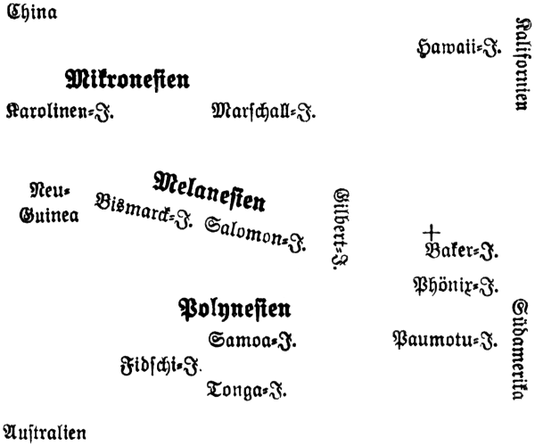

7\. Kapitel.
============
Eine Probe Taifun.
----------

Doktor Eversams Antwort auf diese meine Andeutungen ist in Worten schwer
wiederzugeben. Obwohl Eversam sonst untadeliger Gentleman ist, der von der
schmalen Linie zwanglos-vornehmen Kavaliertums selten abweicht, hat er doch
Momente, wo seine schottische Herkunft und die Derbheit heimischer Berge sich
irgendwie Luft macht.

Nachdem er mich also derart abgefertigt hatte, stürmte er in seinem ebenso
untadeligen Nachthabit in die Kammer und …

… ja, und blieb dicht hinter der Tür wie angewurzelt stehen und drehte sich
langsam nach mir um.

„Wo sind die beiden, Olaf?! Wolltest du einen dummen Witz machen?!“

Ich mache selten Witze. An Bord der Astarte schon gar nicht. Hier ist niemandem
nach Witzen zumute, es sei denn Hiruto, dem kleinen Japaner, dem Herrn des
Vierzylinders, eines altehrwürdigen Motors mit sämtlichen Heimtücken solch
einer alten Kaffeemühle.

Das Bett und die Kammer waren leer, wie ich nun ebenfalls mit eigenen Augen
sah. Da die Kammer nur ein Fenster und die eine Tür besitzt, da ferner
keinerlei raffinierte Doppelwände, klug verkleidete Falltüren oder Dachluken
vorhanden sind, sondern der ganze Heckaufbau harmlos und schlicht wie ein
Kaninchenstall wirkt, blieb des Rätsels Lösung ebenso schlicht und einfach:
Aristide und der Käpten waren aus unbekannten Gründen durch das offene Fenster
auf das Deck geschlüpft.

*So* hätte man urteilen können, wenn Aristide gesund gewesen und wenn beide sich
darüber einig gewesen, die Kammer lautlos zu verlassen …

Aus unbekannten Gründen – gut!

Aber Aristide war ein Genesender im allerersten Stadium, und Käpten Peter Bolk
wieder war ein schlichter, stiller Mann, dem derlei Kletterpartien durchaus
fernlagen.

Eversam trat an das offene Fenster. Dieses ging nach Backbord hinaus, und
zwischen Kajütaufbau und Reling war noch ein schmaler freier Durchgang – genau
wie auf Steuerbordseite.

Alfred Eversam faßte in die Tasche seiner hellen Pyjamajacke, klemmte das
Monokel ein und stieg auf den Bettrand. So konnte er den Oberkörper ohne Mühe
durch das Fenster schieben.

Ich selbst wartete seine weiteren etwas umständlichen Untersuchungsmethoden
nicht ab, sondern ging mit Fennek an Deck und sah hier sofort, daß die Dinge
doch weit ernster lägen, als es anfänglich geschienen hatte.

Steuermann Fu lag am Steuerrad zusammengekrümmt da und hielt zwar noch die
Radspeichen in ehernem Pflichtgefühl umklammert, aber – er war tot.

Mit einem Schlage erwachte ich. Ich war munter gewesen, aber mir hatte doch
noch jener letzte Anstoß gefehlt, der *all* unsere Kräfte urplötzlich
einschaltet, geistige wie körperliche.

Ein Blick über die See zeigte mir verschwommene Nebelfetzen – hier eine
Seltenheit. Der Himmel war bewölkt, die Dunkelheit lastete schwer über den
träge rauschenden Wogen und über unserem kleinen Schoner.

Ein merkwürdig ekler Geruch stieg mir in die Nase – nach brennenden Lappen –
dergleichen. Ich kannte ihn. Das war eine Lunte. Ich ahnte auch bereits die
Zusammenhänge.

Ich brüllte der Deckwache zu, die vorn hin und her schlenkerte: „Hallo – flink
zwei Laternen!!“

Dann schob ich Fu’s Körper etwas beiseite und brachte den Schoner wieder in den
Wind.

Eversam tauchte auf …

„Olaf, was ist geschehen?!“

„Die Jacht,“ sagte ich nur … „Hier, nehmen Sie meinen Posten ein … Fragen Sie
nicht.“

Die Deckwache kam angelaufen. Es war Matauo, der Kanake.

Wir leuchteten umher. Außenbords hing an einer Schnur eine große Blechbüchse.
Ihr entstieg der Qualm. Ich schnitt die Schnur durch und schleuderte die Bombe
nach hinten in den Gischt. Dicht über dem Wasser explodierte sie mit
fürchterlichem Getöse und verscheuchte drei Haifische, die uns seit gestern das
Ehrengeleit gaben. Weiteren Schaden richtete sie nicht an, und eine zweite
Bombe fanden wir nicht. –

Fu hatte einen Stich durch den Rücken ins Herz und eine Hanfschlinge um den
Hals. Nur die Dunkelheit und der Nebel hatten es ermöglicht, daß ein Boot sich
dem Schoner nähern konnte. Zuerst hatte man Fu beseitigt, und dann war Peter
Bolk in der Kammer ebenfalls irgendwie stumm gemacht worden.

Aristide und Bolk waren eben entführt worden.

Daß Eversam abermals seine Würde vergaß und anerkennenswert fluchte, änderte
nichts an der Tatsache, daß wir nunmehr hier bis auf vier Mann
zusammengeschmolzen waren: Eversam, Hiruto, Matauo und ich, – fünfter
vielleicht noch Mukki, aber er war nicht gut zur Besatzung zu rechnen.

Wir vier beratschlagten am Heck. Matauo redete nie viel. Er betonte nur, daß er
nichts Verdächtiges bemerkt habe, es seien allerdings gerade in der kritischen
Zeit sehr dichte Nebelmassen über den Schoner hinweggezogen.

Im Südteil des Meerbusens von Bengalen, möchte ich hier noch erwähnen, gehört
Nebelbildung zu den größten Seltenheiten.

*Dieser* Nebel war mir sofort aufgefallen.

„Es war kein echter Nebel,“ erklärte ich. „So weit ich mich erinnere, sollen
gerade hier, wo wir im Süden die uralten Erdbebengebiete der Sunda-Inseln
Sumatra und Java in der Nähe haben, sehr häufig unterseeische Beben und
Vulkanausbrüche flüchtige Dampfwolkenbildungen hervorrufen. – Prüfe mal mit der
Nase den Geruch, Eversam!“

Der Doktor schnupperte. „Ich möchte sagen: es riecht nach Schwefel.“

Es roch auch nach Schwefel. Und kaum zehn Minuten später war die See wieder
klar, auch das Gewölk verlor sich.

Als wir den braven Fu nach Seemannsart bestatteten, hielt ich diesmal die
Ansprache. Mir waren Peter Bolks Worte noch gut im Gedächtnis, die er vor fünf
Tagen den anderen drei Opfern Jane Bellcastles mit auf den nassen letzten Weg
gegeben hatte. Ich benutzte dieselben Worte, und meine Stimme war genau so
erbarmungslos wie die unseres Käpten:

> „Du warst treu, du sollst gerächt werden, – das Weib und der Schuft, der sich
Jan Terpe nannte, werden baumeln! Amen!“

Neben mir seufzte Eversam unterdrückt, Mukki winselte leise, Hiruto murmelte in
seiner Sprache noch ein Gebet, und der Körper klatschte in die See.

Nun war ich Kapitän der Astarte, Eversam übernahm die Kombüse, Matauo
avancierte zum Steuermann, und Hiruto erhielt andere Ämter: Steward, Matrose,
Maschinist, Segelmeister – alles in eins.

Wie es mit unserer Stimmung an dem Morgen bestellt war, – – leicht auszumalen!
Wenn wir die Jacht damals vor unser Geschützrohr bekommen hätten, würde der
Ozean ein Wrack mehr mit Mann und Maus verschlungen haben!! Aber der Star of
London blieb unsichtbar, die Sonne stieg über den dunstigen Horizont empor, das
Meer beglückte uns mit seiner einsamen Schönheit, und unsere Herzen wurden
wieder freier. – –

Es sind abermals Tage verflossen.

Wir fünf (Fennek eingerechnet) sind jetzt mißtrauisch wie Mantelpaviane.

Ja – Mantelpaviane. Denn diese Affenart hat das System des Selbstschutzes bis
zur höchsten Vollkommenheit ausgearbeitet. Das weiß ich am besten. Eine Herde
Paviane zu beschleichen, das glückt nicht einmal dem gerissensten Leopard.

Wir haben bereits Lehrgeld bezahlt, wir hätten diesen nächtlichen Zwischenfall
vermeiden können, – wer trägt die Verantwortung dafür?!

Ich!

Ich bin zwar kein Seemann, aber ich bin in meiner Vaterstadt und Hafenstadt
Göteborg doch so halb auf dem Wasser aufgewachsen, ich habe später die Erde so
ziemlich in allen Winkeln kennen gelernt, ich habe dort, wo die Stürme das Kap
Hoorn umbrausen (nicht Horn mit einem o, denn der Seefahrer, nach dem es
benannt ist, hieß nun einmal Hoorn), mit Coy und Chubur und Chico auf winzigem
Nachen die Kanäle durchkreuzt, habe mit einer Insel aus Stahl mich bis
Australien treiben lassen, – – das Meer ist meine Heimat geworden wie die ganze
Welt – wie jene Welt, die nicht „Welt“ ist, sondern Einsamkeit und
Urwüchsigkeit und Ehrlichkeit und Schlichtheit …

*Ich* hätte daran denken müssen, daß Käpten Bolk mit seinen melancholischen
Gedanken sich nicht recht dazu eignete, dieser Niedertracht und Hinterlist zu
begegnen! *Ich* hätte mich um unsere Sicherheit kümmern sollen – ich – nur ich.

Alfred Eversam ist gewiß ein ganzer Kerl, aber ihm haftet noch zu viel
Kulturlack an. Das macht die Sinne stumpf.

Und die anderen?! …

Sie waren „Besatzung“, – sie gehorchten, taten ihre Pflicht – nicht mehr als
das, denn dieses „Mehr“ lag ihnen nicht. Auch das will gelernt sein:
Selbständig zu handeln!! –

Die Jacht hat sich nicht wieder gemeldet. Wir schwimmen jetzt auf den blauen
Fluten des Stillen Ozeans … Nicht immer sind sie blau, blaugrün, grün oder fahl
wie graues Tuch … Wenn der Orkan sie hochpeitscht, sind sie hellgrünes Glas mit
weißen Spitzen, flüssiges Glas, das Abgründe und Berge gebiert und unsere
Nußschale tanzen läßt …

Stiller Ozean, Pazifik, Großer Ozean, Südsee – alles dasselbe!

Ein Ozean, der so gewaltige Ausdehnung hat, daß er größer an Flächenraum ist
als die fünf Kontinente, – inselreicher als jedes andere Meer.

… Es ist eine friedliche Abendstunde, in der ich diese Zeilen in der Kajüte
schreibe. Neben mir auf dem Tische liegt ein Buch aus Peter Bolks spärlicher
Bibliothek:

> __Die geschichtliche Bedeutung des Stillen Ozeans.__

> Von Graf Wilczek und Weule.
> (Leipzig 1899)

Was ich sonst hier an Wissenswertem festhalte, verdanke ich Matauo, dem
Kanaken.

Für den Europäer brachte als erster Vasco Nunez de Bilbao 1514 eingehendere
Kunde über das „Mar del Zur“, die Südsee. So nannte dieser Forscher den
Pazifik, – also „Südsee“. Die spätere Bezeichnung Stiller Ozean, Pazifik,
rührte von Magelhaes her, nach dem die stürmische Straße bei Kap Hoorn bekannt
ist. Er durchsegelte den Pazifik in drei Monaten von Osten nach Westen zu, und
da er dabei nicht einen einzigen Sturm erlebte, kam er zu dem trügerischen
Schluß, es mit einem sehr friedlichen Gewässer zu tun zu haben. Später, weit
später, als erst die gierige Hand der Europäer den Frieden der zahllosen
Inselgruppen zu stören begann, bezeichnete man mit „Südsee“ lediglich noch
einen Teil des Pazifik, und nur dieser Teil interessiert mich jetzt, da mitten
darin der Kern des Geheimnisses von Malmotta liegt.

Ich habe mir aus Peter Bolks Kartenmaterial eine kleine übersichtliche Skizze
zusammengestellt, die mir zur Orientierung dienen soll.

Mit den Bezeichnungen Mikronesien, Melanesien, Polynesien weiß der
Durchschnittsmensch nichts anzufangen. Und in dem Gewirr von Inselgruppen weiß
erst recht niemand Bescheid – die Fachleute ausgenommen. Und doch läßt sich
alles unschwer überblicken …
 

 
Bei der Baker-Insel (nördlich davon noch die Howland-Insel) habe ich ein Kreuz
eingezeichnet. Diese beiden Inseln, Baker und Howland, liegen so fern von jedem
Verkehr, so abseits der anderen Gruppen, daß niemand an ihnen ein rechtes
Interesse hat. Sie sind besiedelt gewesen, wurden wieder verlassen, Insulaner
von der südlichen Phönix-Gruppe wagten zuweilen die Überfahrt, immerhin an
hundert deutsche Meilen, flüchtige Verbrecher benutzten sie als Schlupfwinkel,
– man weiß nicht viel von ihnen … –

Und doch waren gerade sie unser Ziel. Gerade sie, denn im Norden klafft dort
ein riesiger leerer Fleck in der Südsee, unbekannter als die Eiswüsten an den
Polen, eine Wassereinöde, die nie ein Segel, nie den Rauch eines Dampfers sieht
… Selbst die längst veralteten Schriften bekanntester Reiseautoren haben dieses
Meeresteiles nie gedacht, – ein Stevenson, ein Jack London begnügten sich mit
der Schilderung von Menschen, Dingen, Verhältnissen, die neben der breiten
Heerstraße der Sportbummler lagen … Abseits vom Alltagswege sind auch sie nicht
gewandelt. Was sie vor dreißig, vierzig Jahren schrieben, ist längst Märchen
geworden. Die Insulaner haben vom Europäer viel gelernt, selten Gutes, – die
„Kultur“ brachte ihnen lediglich den schärferen Schnaps, die Feuerwaffen, die
moderne Kleidung, die Profitgier und … Krankheiten.

Das merkten wir, als wir – wieder nach Tagen – in eine der Laguneninseln des
Gilbert-Archipels einliefen, um Trinkwasser und Benzin einzuhandeln.

Der Name der Insel tut hier nichts zur Sache. Sie hat eine „Hauptstadt“ mit
drei Kneipen, in denen das staunende Auge alles fand, was auch in einer „Bar“
in Bombay, Kairo, Schanghai oder sonstwo zu sehen ist …

Neben der Einfahrt in die Lagune standen riesige Wellblechschuppen, sauber
gemauerte Kais, unsaubere freche Polizisten, faules Gesindel, Lärm, Gestank – –
nichts fehlte, jede Illusion zu zerstören.

Dreitausend Einwohner sollte die Ringinsel haben …

Mag sein.

Wir waren froh, als wir abends wieder mit der Ebbe die Lagune verlassen
konnten.

Was halfen da die wundervollen Palmen, die dichten Büsche, die Taubenschwärme,
der helle Korallenstrand?!

*Ich* hatte mir diese einst so seligen Inseln vorgestellt mit halbnackten,
frohen, harmlosen Menschen, mit graziösen Mädchen, Blumen im Haar, – – all das
war einmal!

Vielleicht wohnte die Romantik anderswo …

Eversam lachte mich gründlich aus. „Wenn du die Urwüchsigkeit derer
kennenlernen willst, wirst du wohl die entlegensten Inseln aufsuchen müssen.
Weiber und Mädchen, nur mit dem einst üblichen Ridi, dem Schürzchen aus
geräucherten Fasern der Kokospalmblätter bekleidet, – Männer wie köstliche
Bronzestatuen mit freiem Blick, ungezwungener Haltung, behängt mit
Muschelketten, Armspangen und billigem und doch dekorativem Tand, – – die
Kultur fraß das alles! Du sahst ja die Gilbert-Damen mit europäischen Hüten
vorvorletzter Mode, mit Seidenfähnchen, mit Talmischmuck aus Fabriken in
Birmingham, mit grellen Sonnenschirmen, – die natürliche Keuschheit dieser
Insulanerinnen kapitulierte vor dem allgewaltigen fremden Gelde, – das
Mannsvolk klettert nicht mehr in die Palmenbäume empor, um Palmensaft
abzuzapfen und Palmenwein daraus zu bereiten, Brandy und Gin und Teufelsgesöff
dunkelster Art versengt ihnen Hirn und Seele, – die meisten verdingen sich bei
den reichen Pflanzern, sind entnervte Kulis geworden, – – es war einmal ein
Paradies, heute ist’s trauriger Niedergang, denn zu einem geistigen Aufstieg
reicht’s bei diesen Südseekindern nicht, soll’s auch nicht reichen, – der
Europäer ist der Nutznießer, mild ausgedrückt …“

Wir standen am Heck, und die Abendsonne legte ihr Feuerkleid über die große,
palmenreiche Ringinsel …

In meinem Herzen war etwas erstorben: Ein Traum aus Jugendtagen …! Die Gefilde
der Seligen hatte ich hier erhofft, und ich hatte die traurige Fratze einer
europäisch übertünchten Unnatur gefunden! Das Gedudel der Bars, das anmaßende
Schachern mischblütiger Händler, die eindeutige Keckheit von Weiberaugen ließen
sich nicht vergessen.

Vergoldet im Abendglanz lag auch die Kirche der „Hauptstadt“ da, – einer Glocke
Gebimmel erreichte mein Ohr, vielleicht strömten jetzt die Bekehrten in das
Haus Gottes, vielleicht war es ihnen tief innere Sehnsucht nach etwas Besserem,
– – nur – ich glaubte nicht daran.

Langsam versank die Insel unter dem Horizont, – jäh kam die Nacht, die Sterne
erschienen, und um uns her war wieder die freie, große Weite des Ozeans …

Ich atmete auf. – –

… Und sitze nun wieder über meinen Blättern, lese hier und dort ein Stück,
grüble und prüfe, vergleiche und spüre dem Rätsel von Malmotta nach.

Wie immer.

Der Kanake Matauo, von dem ich Aufschluß über so manches zu erhalten hoffte,
war in dieser Hinsicht eine Niete. Sein lichtbraunes, ehrliches Gesicht von
fast europäischem Schnitt, seine dunklen klaren Augen hatten nur Staunen
ausgedrückt. – Malmotta?! – Er wußte nichts … Der Käpten hätte wohl hin und
wieder eigentümliche Reden geführt, aber im übrigen – –, – er machte eine
verneinende Handbewegung …

Auch auf dem Atoll bei den gerissenen Händlern hatte ich mich erkundigt – ganz
vorsichtig … Ob vielleicht dort im Norden von der Baker-Insel einmal eine Brigg
gesunken sei … vor langen Jahren … mit wertvoller Ladung.

„Eine Brigg, – was soll die dort?! Der Guano, den die Seevögel auf Baker- und
Howland-Insel angehäuft hatten, ist längst geplündert … Und um Palmholz zu
holen, – dazu fährt man nicht Hunderte von Meilen, das bekommt man anderswo
schneller …“

Wieder also nichts, wieder nur der Griff ins Dunkle …!

Und doch, niemand wird es mir ausreden, gibt es dort irgend etwas, dort
inmitten des leeren Ozeangebietes östlich des Gilbert-Archipels, das andauernd
Käpten Bolks greisen Kopf beschäftigt haben muß und das auch Jane Bellcastle,
dem jugendlichen Terpe und Aristide d’Oly das Hirn fast verwirrte … Jane
Bellcastle wurde zur Verbrecherin, Terpe war ein Spion, Aristide wurde Jane als
Mitwisser unbequem, – und Peter Bolk sollte sterben, damit er niemals jene
Stelle im Ozean erreichte, wo – – etwas zu finden war – – was?!

Ja – – was?!

Alfred Eversam hat das Rätselraten längst aufgegeben. Ich ahne, was ihn
lediglich noch an dieser Fahrt ins Ungewisse interessiert: Jane!! Wir werden
der Jacht begegnen, davon bin auch ich überzeugt, wir werden mit Jane
Bellcastle abrechnen, und Eversam wird dabei nicht müßig zusehen …

Nur: *Er* hält sie für schuldlos! *Er* nimmt an, sie habe ein Recht so zu handeln,
wie sie’s tat, – das Recht auf Vergeltung! Der Käpten, dabei bleibt er, ist
kein harmloser Phantast … – Und wenn Eversam mir dies vorhält, erinnert er
stets an die Ereignisse in Patumengis Reich, an die drei Erschossenen …

Wir streiten dieserhalb nicht miteinander, jeder bleibt bei seiner Meinung,
obwohl, um ehrlich zu sein, die Verteidigung meiner Ansicht ohne innere
Überzeugung geschieht. Ich spüre das, es ist das mehr Gefühlssache, aber nicht
wegzuleugnen. Jane Bellcastles Persönlichkeit hat auf mich doch wohl einen
nachhaltigeren Eindruck gemacht, als die Umstände dies bedingten, und die
Zweifel, die sich in mir regen, melden sich immer stärker und bestätigen
beinahe Alfred Eversams anderen Motiven entspringendes Eintreten für eine Frau,
die es dort an der Küste des Roten Meeres wohl lediglich auf Petersens Papiere
abgesehen hatte. Was später geschah: Der Angriff durch die Jacht, Aristides und
Bolks Entführung, – das sind Punkte, für die es vielleicht auch eine bessere,
Jane nicht belastende Deutung gäbe. –

Wir vier hier an Bord, nein fünf, halten tadellose Kameradschaft. Hiruto und
Matauo sind Gefährten, wie man sie sich nicht besser wünschen kann. Der Japaner
ist lebhaft, energisch, schlau, dennoch nie voreilig. In seiner kleinen Gestalt
steckt jener ungeheure Lebensimpuls, der sein Volk zur Großmacht erhob. Matauo,
der Kanake, ist echter Polynesier, seine Heimat ist eine der Tonga-Inseln, von
Kindesbeinen an lebte er auf dem Meere, war Schiffsjunge, Matrose, Steward,
Händler, Aufkäufer von Kopra für eine amerikanische Firma, wurde wieder
Seemann, kam vor vier Jahren bis Bombay, traf dort Käpten Bolk und blieb bei
ihm. Er ist mit dem Schoner so eng verwachsen, daß er ihn geradezu wie eine
Gottheit liebt, – er betreut unser Schiff, er ist nie untätig, flickt das
Tauwerk, teert es, pinselt, putzt, wäscht und hat trotzdem jenen
melancholischen Einschlag, der mich immer wieder vermuten läßt, er müßte mehr
wissen – mehr als er zugibt … Aber über Malmotta, nein, – da lügt er nicht … Er
weiß nichts. –

Kanaken …! – Man liest die Bezeichnung so oft. Kanaken bedeutet lediglich
„Menschen“ und bezieht sich in engerem Sinne auf die Bevölkerung der
Hawai-Insel, bedeutet jedoch auch soviel wie Polynesier überhaupt. – Und noch
etwas: Kopra! – Eversam schnitt einmal dieses Thema an, als wir dicht vor der
Laguneninsel einem mit Kopra beladenen Segler begegneten und dies schon von
weitem rochen. Kopra ist nichts anderes als die in der Sonne oder in
Dörrapparaten getrockneten Kerne der Kokosnüsse, die bis zu 80 Prozent Fett
enthalten und in Europa zu Kunstfett, *Kognak* und … Viehfutter verarbeitet
werden. Dieser Kognak ist natürlich nur Kognakersatz, aber die Tatsache bleibt
bestehen: Kognak!! – Das Kokosnußfleisch (von reifen Früchten) dient den
Konditoreien als Mandelersatz – wie bekannt. Die Gesamtausfuhr an Kopra aus der
Südsee (deren Hauptexportartikel) wird auf 40 000 Tonnen jährlich geschätzt. –
Das so nebenbei … Auch wieder nicht so nebenbei, denn es kam eine Zeit, in der
ich ohne die Kokosnüsse verhungert wäre …

– – Die Sonne ist längst verschwunden, in klarer Sternennacht bei günstigem
Winde segeln wir ostwärts.

Wir segeln auf einem Strich, den ein jeder kennt: auf dem Äquator entlang, der
mitten durch die Gilbert-Inseln läuft, der südlich der Baker-Insel weiter durch
die Gruppe der Sporaden den Globus umkreist.

Aber wir denken nicht an Äquatortaufe und ähnliche Scherze, – wir denken nur an
unsere eigene Sicherheit, wir haben das Geschütz wieder an Deck gebracht, das
wir in der Laguneninsel verstecken mußten vor den Schnüfflerblicken der
Zollbeamten und Polizisten, die uns ohnedies nicht recht zu trauen schienen.
Ein Schoner ohne Fracht, nur bemannt mit vier Leuten, – ein Kapitän, der sich
Peter Bolk nannte (und Abelsen hieß), – – es gab da kitzliche Minuten, und
lediglich Eversams vollwertige Pfundnoten beschwichtigten die Neugier der hohen
Behörden … Geld wirkt überall bestechend. – Sogar die Sandsackbarrikaden haben
wir wieder aufgetürmt. Eversam hat recht: Vorsicht ist besser als Nachsicht,
und wenn es nötig wird, werden wir drauflosknallen, daß die Planken fliegen,
aber nicht unsere eigenen.

Eversam und Hiruto schlafen schon. Der Kanake lehnt am Steuer, – ich schreibe …
Der Fennek streicht ruhelos in der Kajüte umher … Was hat er nur?! – – „Mukki,
hinlegen!!“ – Mukki denkt nicht daran. Er kommt zu mir, reibt sich an meinen
Schenkeln … läuft zur Tür, läuft an Deck … kehrt zurück. – Auch Eversam wälzt
sich auf seinem Bett, stöhnt, erwacht …

„Die Hitze!!“

Es stimmt schon. Es ist heiß …

„Geh schlafen, Olaf!“ fügt er hinzu.

Ich sage nichts, ich blicke nur auf das plumpe Holztintenfaß … Die Ränder
erscheinen mir seltsam hell … – als ob sie leuchteten … Und mein Auge hebt sich
… An der Wand hängt das Barometer, – der lange schwarze Zeiger steht ganz tief
… Vorhin, das weiß ich, stand er zwei Daumenbreit höher …

Also das ist’s!

Sturm droht …

Im Nu habe ich meine Blätter weggepackt … Eversam schlüpft schon in die
Kleider.

„Runter mit den Sandsäcken!“ rufe ich dem Doktor zu und laufe zu Matauo.

Ich überschaue den Horizont … Der Wind ist flauer geworden, – hinter uns im
Westen liegt ein schwarzer Strich über dem Ozean. – Der Kanake, der zumeist
Pfeife raucht, sagt gleichgültig:

„Ein Taifun, Herr …“

Urplötzlich sehe ich, wie übermäßig die Luft mit Elektrizität geladen ist: Die
Reling, die Taue, die Mastspitzen – – alles leuchtet in gelblichem Feuer, St.
Elms-Feuer nennt’s der Seemann … Auch das Tintenfaß hatte dieselbe
Lichterscheinung gezeigt.

Noch ist der Himmel über uns sternenklar. Aber dort hinten der pechschwarze
Strich, ganz deutlich erkennbar, wölbt sich an den Enden mit einemmale nach
oben, und diese Enden schillern immer intensiver in einem unnatürlich
wirkenden, gelbroten Feuer – wie Riesenfackeln, die ruhig brennen – oder wie
Wolkenfetzen, hinter denen die Abendsonne die ganze Pracht ihres Farbenspieles
entfaltet.

Sind’s nur Minuten – wirklich nur Minuten, – – die beiden Fackeln haben sich
vereint, spitzen sich zu, ragen immer höher in den Himmel hinein, erlöschen, –
– was nun dort hinten lauert, ist ein schwarzer Keil, die gelbliche Spitze nach
oben, und von dieser Spitze ziehen sich gelbliche Streifen langsam abwärts,
etwa wie breite Seidenbänder einer phantastischen Dekoration eines
Riesenschaufensters …

Und das sind die Luftwirbel, das sind die Unheilstifter, die ungeheuren
Saugpumpen, die den Ozean aufwühlen, kochen lassen, Wellenberge zu Schaum
zerwühlen …

Ich starrte wie gebannt auf das unheimliche Phänomen. Ich kenne Wirbelstürme,
ich kenne die Tornados der Pampas, ich kenne die kleinen, bescheidenen Cyklone,
die vielleicht mal eine Wasserhose gebären und doch nur Kinderspiel sind
gegenüber dem Sturmgiganten, der dort anmarschiert kommt – lautlos, immer mehr
anwachsend, immer mehr in den Konturen verschwimmend, immer rasender in seiner
Schnelligkeit …

Mit einem Schlage ist das ganze Firmament pechschwarz …

Kein Luftzug …

Meer und Äther erwarten den Angreifer …

Er kommt …

Eversam brüllt mir etwas zu.

Ich erwache …

Wir werfen die Sandsäcke über Bord, wir bergen die Segel, lassen nur den Motor
laufen …

Wir schnüren uns die Korkwesten um, Fennek bekommt ebenfalls solch ein plumpes
Ding, – wir zurren Taue über Deck …

Der Schweiß rinnt mir aus allen Poren … Ich spüre in allen Nerven das Gespenst,
das herbeischleicht, geboren aus dem Nichts …

Und noch immer kein Laut … Nur Finsternis.

Trübe glotzen die Laternen durch das Dunkel.

An den Masten, Tauen, allen Vorsprüngen glüht das warnende Feuer von St. Elms.
Unser Schoner ist ein Gespensterschiff geworden …

Dann hoch aus den Lüften hinter uns – nicht von einer Stelle, von links und
rechts, während die Mitte schweigt, ein tiefes Orgeln, Heulen, Brausen, – jäh
ansteigend zu schrillem Kreischen einer ganzen Höllenbrut von Teufeln …

Irgend etwas packt mich … schlägt mich – wie ein Brett, das man mir gegen den
Leib haut … Ich falle …

Ich greife noch nach Mukki, kralle die Finger in sein Nackenhaar …

Irgend etwas saust über das Deck hin …

Der geflickte Treiber knickt um, – im Nu ist er verschwunden …

Ein Wasserberg folgt …

Ein Berg stürzt auf die Deckplanken, quetscht mich zusammen … Wasser … Wasser …

Ich ringe nach Atem …

Schlucke Wasser …

Und der Berg entflieht … ein zweiter folgt.

Dann wird unser Schifflein vorwärtsgerissen.

Es schwebt fast, es gleitet, fliegt …

Neue Wassermauern folgen …

Wir stürmen durch Nacht und infernalisches Getöse, durch Wogen und saugende
Wirbel, durch Wände von weißem Gischt …

Die Gedanken stocken, das Hirn streikt, – die Kläglichkeit dessen, was
Menschenhand schuf, diesen Schoner, – die Kläglichkeit dessen, was wir
Menschlein selbst darstellen, hämmert uns der Taifun ein …

Wir fliegen … mit dem Sturm …

Vielleicht ist es unsere Rettung, daß der Schoner so wenig Ballast führt …

Wir sind wie ein Strohhalm, mit dem der Herbstwind über staubige, düstere
Felder rast …

Man liegt da … klammert sich fest …

Alles ist tot in uns …

Man hat lediglich das Empfinden einer ungeheuren Spannung, als ob man unter
einem Dynamitfaß läge, das jeden Moment explodieren muß.

Jedes Schätzungsvermögen für Zeit und Entfernung hört auf … In den Ohren
rauschen die sprudelnden Wasser, rauscht das Blut noch stärker, das Herz
hämmert, die Lunge keucht, – – Augenblicke halber Ohnmacht folgen, Augenblicke,
in denen man fürchtet, der eigene Leib würde in Atome zerstieben …

Dann – – ein Stoß – – kein Stoß, – ein Hieb von der Faust eines nie gekannten
Titanen.

Holz splittert, Taue spannen sich, klingen hell wie Bogensaiten – – reißen …

Irgend etwas schlägt mir über den Hinterkopf – – unter mir öffnet sich das
berstende Deck, – der Schoner sinkt, – ich sacke mit, die Sinne schwinden mir …

Totenstille.

Nichts mehr.

Der Tod!? – –

– *Das* war mein Taifun …

