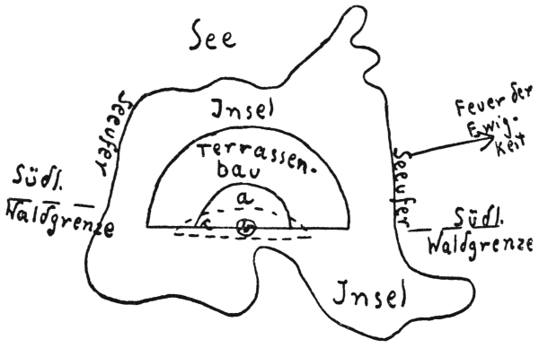

9\. Kapitel.
============
Um das goldene Bett.
------------

Margot wird ungeduldig.

„Olaf, aufhören!!“

Das Mittagmahl wartet. Und Damen soll man erst recht nicht warten lassen.

Ich packe die Blätter zusammen … Wir nehmen hier im weitläufigen Erdgeschoß des
uralten Terrassenbaues getrennt das Essen ein. Umberto und die Seinen bilden
die eine Tischrunde (ohne Tisch, natürlich), wir die andere. Wir sind
bewaffnet, die anderen nicht. Wir sind die Herren, die anderen sind … gehorsam.
Das Blättchen hat sich eben gewendet. Taskamore, Allison und Eta sind heute
unterwegs. Deshalb zählt unsere Partei nur zehn Köpfe.

Die Speisenkarte ist außerordentlich reichhaltig. Es gibt Büchsenfleischsuppe
mit Moosgemüse, Maulwurfschinken und hinterher pro Kopf einen halben Biskuit.
Hondu verzichtet auf diese Nachspeise.

Bei Tisch meint Ret Hil, wir könnten jetzt Sennor Umberto (den wir nur noch
Hummer nennen), eigentlich mit seinem Anhang heimschicken.

„Die letzten Krokodilkadaver sind vergraben, und – was soll die Gesellschaft
noch hier?!“

Ich kann ihm nur beipflichten. Je eher wir die acht Leute, Ethel eingerechnet,
loswerden, desto angenehmer für uns. Richtige Bewegungsfreiheit werden wir erst
haben, wenn die Kerle abmarschiert sind.

Auf Taskamore und seiner Begleiter Rückkehr können wir nicht warten. Allison
will erkunden, wie weit man sich den drei ewigen Feuern ungefährdet nähern
darf, und die kleine Expedition unserer Freunde kann kaum vor übermorgen zurück
sein.

„Übernehmen Sie die Aussprache mit Ethel“, bittet Ret Hil mit harter Miene.
„Sie kennen meine Abneigung gegen diese … diese junge Dame.“

Ich erhebe mich von meinem Steinsitz, greife nach der Büchse, wünsche allseits
gesegnete Mahlzeit, pfeife Hondu und schlendere durch drei Türöffnungen in den
dritten nördlichen Raum, wo die Gegenpartei haust.

Die Herrschaften dinieren noch. Über Mangel an haßerfüllten Blicken kann ich
mich nicht beklagen.

Ich bleibe stehen, lehne mich an die dicke Mauer und zähle die brennenden
Fackeln.

Acht …

„Miß Ethel, bitte …“

Ethel Sheridan, die mit keinem von uns bisher ein Wort gewechselt hat, obwohl
der große Waldbrand acht Tage zurückliegt, ist schwerhörig.

Es fällt mir nicht im Traum ein, etwa dem Hummer oder dem gelben Juarez die
Ehre anzutun, mit ihnen das Nötige zu besprechen. Ethel ist immerhin Lord
James’ Schwester.

„Ethel – – bitte!!“

Sie sitzt neben ihrem Mischling-Galan, wirft den Kopf frech zurück, und … das
ist alles.

Wir haben mit diesen Herrschaften nicht mehr viel Umstände gemacht und alle
Höflichkeit ausgeschaltet.

Ich trete vor, reiße Ethel am Arme hoch und stoße sie durch die Türöffnung ins
Freie.

„Bravo!“, ruft einer von der Hummer-Garde.

Die Kerle bereuen es längst, sich damals nicht für Ret Hil entschieden zu
haben. Nun ist es zu spät, und alle Schmeicheleien und Anbiederungsversuche
stoßen auf taube Ohren.

Ethel steht da, schüttelt die Fäuste, schäumt vor Grimm.

„Sie … Flegel!! Sie … Bestie!!“

Ich blicke sie an, und wenn ich jetzt dieses Gesicht zergliedere, begreife ich
nicht, weshalb ich es jemals einigermaßen reizvoll fand. Ethels Züge haben in
dieser häßlichen Verzerrung unbedingt etwas … etwas Negerhaftes, ein negroiden
Einschlag. Die Lippen sind dick, die Unterlippe hängt herab, die Backenknochen
sind zu stark entwickelt, die Augenpartie verrät vielleicht am
allerdeutlichsten, daß einer der Sheridans einmal irgendwo in der Wahl der
Gattin einen Fehlgriff tat. Auch Ethels Temperament spricht dafür. Sie ist
unbeherrscht, haltlos, sie hat sich dem Mestizen an den Hals geworfen, – – die
näheren Umstände kenne ich nicht. Bisher nicht. Ethel ist eben ein Rückschlag,
– – Kuckucksei wäre zu wenig gesagt.

„Schämen Sie sich!“

Der Speichel rinnt ihr vor Wut aus den Mundwinkeln, und in den wilden Augen
flammt eine fast bedrohliche Tücke.

Ret Hil hat mir eine üble Aufgabe zugeschoben.

Mein Blick schweift über den See, den stellenweise noch rauchenden Wald …

In der Ferne leuchten wie reine, farbenfrohe Wunder die Feuer der Ewigkeit.

„Ethel, – nur weil Ihr Bruder James mein Freund war, – – wie konnten Sie sich
mit diesem Auswurf einlassen?“

Die reinen, farbenfrohen Flammenzungen stimmen mich milder.

„Sie sind doch eine Sheridan, eine Engländerin, Ethel …! – Was wurde aus der
Jacht Hamilton? Dieses Gewürm von Umberto behauptet, die Jacht sei
untergegangen, und seine Leute hätten Sie herausgefischt … Ist das richtig?“

Hondu sitzt neben mir. Und Hondu hat ein sehr feines Gefühl dafür, wer
Sympathie verdient.

Ethels Fäuste sinken, da der Puma böse knurrt.

„Ja, die Jacht ging verloren …“, erklärt sie heiser, aber absichtlich ohne
jedes Bedauern. „Mir gehört also La Terrosa, und mithin auch diese Höhle. Ich
werde vor Gericht meine Ansprüche geltend machen. Margot kommt als Erbin nicht
in Frage, da Reginald eine unebenbürtige Ehe schloß – – mit einer
Krämertochter. Margot ist für mich Margot Brunce, – – ein Etwas, keine Dame!“

„Da haben Sie mithin seinerzeit also eine recht widerliche Komödie gespielt,
als Sie so taten, als hätten Sie Ihren Haß gegen Margot begraben … Welche
Verstellungskunst!!“ – Ich bringe es nicht fertig, einen scharfen Ton
anzuschlagen. Dieses Mädchen ist mir nur – – ein Etwas.

„James ist tot?“, frage ich nach einer kurzen Pause, die Ethel durch ein
freches Gelächter ausfüllt.

„Ja … tot!“

„Armer James, arme Besatzung! – Machen wir es kurz … Sie und die Bande da
verlassen in einer Stunde die Insel. Sie bekommen eine Büchse und eine Pistole
mit je zwanzig Patronen und sonst noch das Nötigste mit, damit Sie den
Rückmarsch ungefährdet überstehen. Teilen Sie dies Ihren Freunden mit. Weiter
hätte ich Ihnen nichts zu sagen, höchstens das eine: Wer von Ihnen morgen noch
in der Nähe des Sees angetroffen wird, erhält eine Kugel, und wer je wieder
wagt, diese Unterwelt zu betreten, mag vorher sein Testament machen. La Terrosa
ist Margots Eigentum.“

Ich bemerke das vielsagende höhnische Zucken um ihre Mundwinkel.

Sie glaubt zweifellos, daß wir außerordentlich töricht handeln.

Der offene Hohn in den haßerfüllten Augen reizt mich doch.

„Ich weiß, woran Sie denken, Ethel … aber – – die Pläne schlagen Sie sich nur
aus dem Kopf. Selbst wenn Sie den Ausgang etwa durch Sprengung der
Pandanus-Höhle verrammeln oder ähnliche Scherze beabsichtigen, uns hier
einzusperren, und dann vielleicht mit einer kleinen Armee farbiger Strolche
zurückkehren: Zwecklos!! Absolut zwecklos, da wir bereits einen anderen
bequemeren Ausgang entdeckt haben. Von dem Golde werden Sie also nichts mehr
vorfinden, Ethel … Sie haben verspielt, Leib und Seele. Ich bedauere Sie.“

Damit wende ich mich ab …

Hinter mir ein zischendes Keuchen, – – dann Hondus Knurren, – – dann ein
ohnmächtiges wildes Schluchzen und …

„Schuft, mit dir rechne ich ab!!“

Ret Hil tat wirklich klug, als er mich bat, mit diesem Weibe zu reden. – –

Der Abtransport der Herrschaften verläuft etwas lebhaft, und ich glaube, der
Hummer wird die Kolbenstöße noch tagelang gefühlt haben. Juarez und Ethel haben
sich auf eine Schimpfkanonade beschränkt.

Dann macht sich Ret Hil mit dreien von uns auf und bleibt dem abziehenden Trupp
auf den Fersen.

Sicher ist sicher.

Sennor Hummer muß sofort zwölf Stunden ununterbrochen marschieren, dann erst
dürfen sie lagern … – Er wird Fett dabei einbüßen. – –

Jetzt endlich ist die Insel ganz gesäubert.

Ich will nachholen, was über den großen Brand zu sagen ist. Es wäre
effektvoller gewesen, die Schilderung der Ereignisse nicht an dem Punkte zu
unterbrechen, wo Allisons Geste während der qualvollen Hitze, die auch uns mit
dem Tode bedrohte, auf den gewaltigen, steinernen Götzen wies. Der Professor,
der jahrelang die Wildnisse der Erdbeben-Republiken durchquert hatte, war ein
besserer Kenner der Eigentümlichkeiten solch uralter Bauwerke.

„Abelsen, zumeist sind die Steinfiguren auf diesen Terrassenbauten drehbar und
verbergen nur den Eingang in irgend ein sicheres Versteck“, hatte er mir
zugeraunt. „Wollen Sie es wagen, emporzuklettern? Es geht um unser aller Leben.
Diese Tollhäusler, die da den Wald anzündeten, wußten nicht, daß sie sich
selbst mordeten! Schauen Sie hinab, – da klettern sie zu uns empor, ohne
Waffen, die Todesfurcht sitzt ihnen im Nacken, und der andere Tod ebenso:
Taskamore kommt dicht hinter ihnen her!“

Hier handelte es sich um Sekunden. Der von Krokodilen wimmelnde See war
unpassierbar. Falls Allisons Vermutung nicht zutraf, konnten wir bestimmt damit
rechnen, – in kürzester Zeit jämmerlich zu ersticken. Ein Besinnen oder Zögern
gab es hier nicht. Übrigens teilte ich des Professors Hoffnung, denn die an
einer Stelle in die Mauerblöcke eingemeißelten Löcher konnten nur Stufen sein,
– waren Stufen, und mit wenigen Griffen erreichte ich das Postament.

Die Hitze hier unter der Höhlendecke – das Steinbild mochte acht Meter hoch
sein – war qualvoll. Der Anblick des Waldbrandes hätte mich begeistert, wenn
die Umstände weniger gefährlich gewesen wären.

Eine rasche Prüfung des Sockels ergab, daß die Figur des Atlas auf einer
quadratischen, glatt geschliffenen Platte stand, die auf der Oberfläche des
ebenso polierten Sockels auflag. Schon dies und einige tiefe Schrammen in dem
Sockel feuerten meine letzten Kräfte an. Ich bezwang das aufsteigende
Schwindelgefühl, ich drückte mit aller Kraft gegen die eine Ecke der Platte,
die mir die richtige zu sein schien, wie die Schrammen andeuteten. Es war die
richtige, und zu meinem Erstaunen, das sich in einem halb unbewußten
Triumphschrei äußerte, schwenkte die Statue zur Seite und gab ein rundes Loch
frei, das gut ein Meter Durchmesser hatte.

Ein rascher Blick in die unbekannte Tiefe: Eine steile, schmale Treppe mit
Steingeländer lief in völlige Finsternis hinab. Muffiger, fauliger Gestank
quoll mir in die Nase.

Ich rief, winkte …

Ich half Magneta empor, dann Margot …

Alles ging in fliegender Eile.

Laternen brannten. –

Einzeln klommen wir abwärts …

Wohin? Niemand wußte es …

Niemand kümmerte sich um die verstörten Feinde, Freund und Feind brachte sich
in Sicherheit, als letzter Taskamore, der das Steinbild wieder über die Öffnung
rückte.

Ich hatte längst die Tiefe erreicht. Die gewundene Treppe war in die Mauern
eingebettet, der Schacht erweiterte sich, ganz unten hatte er Sichelform, eine
breite Steinplattform bot genügend Raum, Wasser sprudelte aus einer
Bodenspalte, staute sich zum kleinen Tümpel auf und floß irgendwohin langsam
ab.

Die Luft hier war kühl, fast kalt. Wenigstens für uns, die wir an die dreißig
Grad beständige Wärme gewöhnt gewesen und zuletzt vielleicht mit achtunddreißig
gerungen hatten.

Still, erschöpft sanken die meisten zu Boden. Ret Hil hatte die Bündel mit den
Konserven geborgen, Juan hatte meinen Hondu getragen, – die geglückte Flucht
vor dem Feuer machte uns stumm. In einem Winkel hockten die acht zahmen Gegner,
– abseits, schuldbewußt, nur Ethel schon da mit den frechen, herausfordernden
Augen.

Professor Allison blieb selbst hier strenger Wissenschaftler. Er untersuchte
die Steinmauer, er maß die Wassertiefe, stellte noch andere Messungen an, – es
wirkte fast komisch, wie er trotz seiner sichtlichen Ermattung ruhelos hin und
her schritt, unfehlbar ein großer Geist.

Aber – – ein getrübter Geist?!

Niemals!

Ein Mann, der genau wußte, was er wollte, der vorsichtig das Wasser der Quelle
schmeckte und dann den gefüllten Becher weiterreichte.

Schließlich wandte er sich an Eta.

„Kind, genau wie der Terrassenbau im Urwalde von Quextaro in Südmexiko! Genau!
Eine höchst eigenartige Übereinstimmung, wie du zugeben mußt.“

Eta nickte nur, aber Juan erklärte heiser:

„Nur, daß dort vierzehn Stockwerke waren, hier zwölf, und daß dort die Rückwand
des Baues sich an eine Felswand lehnte, während sie hier frei liegt und auf
einer Insel.“

Allison lächelte nachsichtig. „Mein guter Juan, der See ist erst nach der
großen Erdbebenkatastrophe entstanden, und die Felswand mag auch vorhanden
gewesen sein.“

Er setzte sich und begann zu zeichnen.

Das Bild der Insel im Magneta-Wald und den Terrassenbau möchte ich wenigstens
in flüchtigen Strichen zu meiner eigenen Erinnerung wiedergeben. Langatmige
Erklärungen erübrigen sich. Eine Skizze genügt. – Allison hat mir nachher
bestätigt, daß sie leicht verständlich sei.

`a` ist die oberste, kleinste Terrasse mit ihren Räumen, `b` ist die Götzenstatue,
`c` (die punktierten Linien) der Schacht mit der Quelle, der nur bei genauesten
Messungen der Mauerstärken und der Breite der einzelnen Terrassenwohnungen zu
finden gewesen wäre.

Die Länge von `c`, von West nach Ost, betrug 23 Meter, die Breite etwa zehn,
wovon noch drei Meter von der Wasseransammlung eingenommen wurden.

Mithin war der für so viele Personen verfügbare Raum sehr gering, woraus sich
schon aus Schicklichkeitsgründen allerlei Unzuträglichkeiten ergaben. Es blieb
nichts übrig, als für die Frauen durch Decken und den Stoff der Rucksäcke eine
Ecke abzuteilen. Ethel weigerte sich zunächst, mit Margot und Eta diesen
Verschlag zu teilen, aber sie besaß trotz ihres bissigen, hartnäckigen
Schweigens und anderer Unliebenswürdigkeiten immer noch so viel Anstandsgefühl,
die Notwendigkeit einer zeitweiligen Trennung der Geschlechter einzusehen.

Sennor Umberto, Juarez und Anhang waren äußerst zahm und fielen uns nicht zur
Last. –

Die drei Tage, die wir hier in dieser Kellerluft zubringen mußten, waren eine
Qual für alle. Am zweiten Tage abends hatten Taskamore und ich die Treppe
erstiegen und den fast glühend heißen Götzen zur Seite gedrückt. Der Wald
brannte noch, die Hitzewellen, die uns entgegenschlugen, zwangen uns, die
Öffnung schleunigst wieder zu verschließen.

Am folgenden Abend versuchten wir es ein zweites Mal, ob wir das schauerliche
Loch mit seinem üblen Gestank verlassen konnten.

Diesmal war die einströmende Hitze erträglich.

Der Götze hatte sich abgekühlt, und als wir zur Terrasse hinabkletterten,
hatten wir ein unvergeßliches Bild vor uns.

Teile des Waldes brannten noch. Aber die bereits verkohlten Teile glichen
Brandstätten, die von weißen Schneeflächen durchzogen waren: Weiße Asche! Weiß
wie Schnee oder Salz! – Allison erklärte uns später, die Farbe der Asche sei
auf die chemischen Beimengungen der Baum- und Gestrüpprinden zurückzuführen.

Brennende, schwelende Wälder kannte ich. Aber was das Grausige des Bildes
ausmachte, waren die Tierleichen.

Auf dem See trieben Riesenkrokodile mit dick geschwollenen Bäuchen, – tote
Riesenmaulwürfe umkränzten das Seeufer, auf der Waldblöße lag ein Tierkadaver
neben dem anderen.

Die ungeheure Hitze hatte hier ungezählte Opfer gefordert.

„Scheußlich!“, sagte Kamo. „Wir werden sie eingraben müssen. Sie stinken
schon.“

Und wie sie stanken!

„Wie unser Walfisch bei der Springflut!“, nickte ich.

Dann schoben wir den Titanen Atlas über die Öffnung und wollten zur Terrasse
hinab.

„Warte!“, bat ich.

Meine Blicke verfolgten die dünnen Rauchschwaden, die wie graue Gespenster
emporschwebten aus dem trostlosen, vernichteten Walde.

Taskamore beobachtete gleichfalls.

Die Rauchwolken zogen alle in einer Richtung, verdichteten sich gerade über
uns, wo die Höhlendecke die Arme des Götzen berührte, und … verschwanden dort.

Kamo befühlte das Steinbild. Es war aus einem einzigen Block porösen Gesteins
hergestellt. – Wir beide hatten den gleichen Gedanken. Taskamore kletterte
bedächtig an den Beinen des „Atlas“ hoch, erreichte den Kopf, stellte sich auf
die Schultern der Statue, und die Rauchschwaden verschluckten ihn halb.

Aber die gelbgrauen Gespenster waren im Absterben begriffen.

Kamo rief, – plötzlich verschwanden seine Beine, und als ich ihm folgte, fand
ich zwei Hände, die mich kraftvoll emporrissen. Ich lag in einer fast
wagerechten Kluft der Höhlendecke, die von unten als solche nicht sichtbar war.

Der Rauch behinderte uns nicht weiter, mit atemloser Spannung folgten wir dem
Stollen, der teilweise steil anstieg, viele Windungen hatte und mit erkalteter
Lava vollständig ausgegossen war.

Die Luft wurde immer reiner.

Dann kam eine enge Stelle, wo der Qualm sich gesammelt hatte, wo wir aus
Vorsicht umkehrten. Trotzdem wußten wir: Dieser Weg führte ins Freie, an die
Oberwelt.

– – Und dann folgten jene Tage, in denen Sennor Hummer und Konsorten und wir
mit ihnen verzweifelt schufteten, die Tierkadaver zu beseitigen.

Als wir Allison, Juan und Eta und Margot heimlich unsere Entdeckung des
aufwärts führenden Stollens mitteilten, war der Professor nicht im geringsten
überrascht.

„… Es wird noch mehr derartige Luftlöcher geben … Allerdings, sie zu finden,
dürfte recht schwer fallen.“

Am sechsten Tage nach dem Brande, gerade um die Mittagszeit, ereignete sich
etwas, das uns recht bedenklich stimmte.

Die enorme Hitze mußte in den Felsschichten der Höhlendecke gewisse Lockerungen
hervorgerufen haben, und eine ungeheure Masse Gestein prasselte urplötzlich
ohne vorhergehende warnende Geräusche auf die Waldblöße herab und erschlug und
begrub einige der Leute des eitlen, krummbeinigen Hummer-Mulatten.

Fortan lebten wir noch einige Tage in ständiger Sorge, daß sich zum zweiten Mal
Ähnliches ereignen könnte.

Es geschah nichts, – und der Tag nahte, den ich bereits erwähnte: Meine
Unterredung mit Ethel und der Abzug der um das goldene Bett betrogenen acht
Herrschaften. –

Es mochte nachmittags vier Uhr sein, als Margot und ich mit dem überaus fett
gewordenen Hondu das Boot bestiegen und zur Waldblöße hinüberruderten. Wir
brauchten Fleisch, ich wollte ein paar Riesenmaulwürfe schießen.

Gemächlich wanderten wir gen Norden. Hondu tobte sich in endlosen
Galoppsprüngen aus, Margot war still wie immer, und auch ich fühlte mich
irgendwie bedrückt.

Die herbe, schöne Frau an meiner Seite, die noch immer verschwieg, weshalb sie
diese Unterwelt aufgesucht hatte, begann krampfhaft über Dinge zu plaudern, die
zwischen uns nur Abwehr anderer Gedanken waren.

„… Der Professor wird innerlich wohl gelächelt haben, Olaf, als ihr ihm durch
Blicke verrietet, daß ihr für seinen Verstand fürchtetet! Und er – fürchtete
für euren Verstand, als er als erster heimlich die Insel betreten und die
Goldkluft gefunden hatte …“

„Mag sein … – Mehr, wie ich um Sie mich sorgte, Margot, kann er kaum für uns
gefürchtet haben. Goldrausch?! Lieber Himmel, – – Kamo und ich, – – Goldgier?!
Allison kennt uns zu wenig, genau so wenig, wie ich Sie kenne, Sie blonde
Sphinx …“

Wir hatten die verkohlten Stangen der Bäume und den fußtiefen Schnee der Asche
hinter uns.

Vor uns lag die dämmernde Ferne des sechsten Erdteils, – Büsche, Felsen,
Tümpel, Sandstrecken.

Wieder wollte die Frau mir ausweichen.

„Ich denke, wir sind Freunde, Olaf … – Achten Sie besser auf Hondu … da, er
jault vor einem Erdloch …“

„Diesmal entgehen Sie mir nicht, Margot … Ich will die Wahrheit wissen: Weshalb
diese unsinnige, unnötige Flucht hierher in die Tiefen der Erde?“

Das feierliche Schweigen dieser durch Steinmauern abgeschlossenen Welt war um
uns.

Kein Lärm in Flammen aufgehender Stämme störte mehr.

Sie stand vor mir, den Kopf gesenkt. Unter dem dünnen Stoff des losen Gewandes
hob sich die Brust in hastigen Atemzügen. Dann blickte sie mich an, mit jener
kühlen Ablehnung, die verletzen könnte …

Könnte …!

Ihre Stimme strafte ihre Augen und die frostige Miene Lügen.

„Ich habe Reginalds Skelett in einem Winkel der Pandanushöhle eingescharrt“,
sagte sie, jedes Wort abwägend. „Ich stieg hinab in die Tiefe und verwischte
meine Spur, weil ich jede Versuchung ausschließen wollte. Mein Leben ist
zerbrochen … Ich bin … zu müde, um nochmals hoffen zu wollen. Und jetzt – –
fragen Sie nichts mehr!“

Sie hatte sich schnell abgewandt und eilte weiter. Ihre Schultern zuckten …

Tränen?!

Und … Versuchung ausschließen?! – Ich begriff mit einem Male.

Das, was man Schicksalsfügung nennt, meldete sich, und mit einem Schlage war
ich der, der die Wege abseits vom Alltag wandert und liebt und die Dornen am
Wege genau so freudig begrüßt wie blumige Matten.

Ich sah Margot taumeln … fallen …

Hondu war in einem der Löcher der großen Erdwühler verschwunden.

Und ein Etwas fuhr auf mich zu, prallte gegen mein Kinn …

Warf mich zurück …

Ich riß den langen Pfeil heraus und schnellte hinter einen der kümmernden
Büsche. Das Blut lief mir über die Brust … Die Augen suchten …

Zwei Zentimeter tiefer, und der Pfeil hätte mir die Kehle durchbohrt.

Dann der kurze Knall der Büchse …

Hinter einem Stein warf ein Mann die Arme empor, schlug wie ein Klotz
hintenüber.

Es war einer von denen, die wir unter dem fallenden Steinschutt begraben
glaubten.

– Die Jagd war aus …

Margot lag wie tot in meinen Armen. Der Pfeil steckte noch in ihrer linken
Schulter als kurzer Stumpf. So trug ich sie zurück zur Insel …

Es war der schwärzeste Tag meiner vielen Tage hier in den Tiefen der Erde.

Die Frau, die in ihrem Herzen die Liebe nicht wieder hatte aufblühen lassen
wollen, rang mit dem Tode.

Was Allison an Medikamenten und Verbandzeug hierher mitgenommen, hatte die
Hitze vernichtet.

Bedrückt, verzweifelt stand ich vor dem Terrassenbau … Mein Blick schweifte
hinüber zu den ewigen Feuern, deren Farbenpracht heute herrlicher war denn je.
Grüne Flammenzungen lohten gleich wallenden Schleiern im grellen
Scheinwerferlicht, sanken zurück, und rosige Glut folgte, wandelte sich in
fahles Gelb, abermals in zartes Grün …

Wie frische, saftige Wiesen, auf die der Landmann seine Hoffnungen setzt.

Die Feuer der Ewigkeit sprachen zu mir mit ihren flammenden Zungen:

„Hoffe …!!“

… Und ich hoffte …

