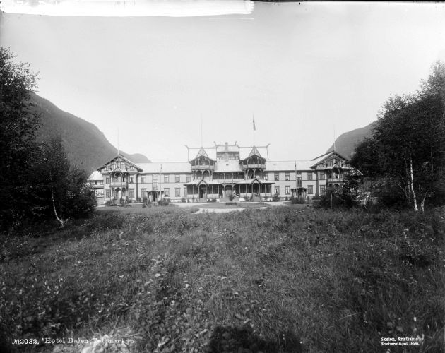

Anmerkungen:

<@footnote 1 "01_Lord Plemborns Verbrechen.md">Hier wurde in den ersten Auflagen die zweite Geschichte als Hefttitel angegeben, in späteren Auflagen dagegen die Erste. Siehe dazu auch unter »Zusätzliche Informationen«.</@footnote>
<@footnote 2 "01_Lord Plemborns Verbrechen.md">In der Vorlage steht: »soben«.</@footnote>
<@footnote 3 "01_Lord Plemborns Verbrechen.md">In der Vorlage steht: »leget«.</@footnote>
<@footnote 4 "01_Lord Plemborns Verbrechen.md">In der Vorlage steht: »Sönnquist«.</@footnote>

<@footnote 5 "02_Die Schreckensnacht im Hotel Dahlen.md">Eigentlich wäre die richtige Schreibweise für diesen Ort »Dalen«, aber Kabel schreibt durchgängig »Dahlen« (auch in anderen Heften), so daß hier diese Schreibweise beibehalten wird.</@footnote>
<@footnote 6 "02_Die Schreckensnacht im Hotel Dahlen.md">In der Vorlage steht: »Ostra«.</@footnote>
<@footnote 7 "02_Die Schreckensnacht im Hotel Dahlen.md">In der Vorlage steht: »Dorden«.</@footnote>
<@footnote 8 "02_Die Schreckensnacht im Hotel Dahlen.md">Zwei Zeilen sind in der Vorlage vertauscht.</@footnote>
<@footnote 9 "02_Die Schreckensnacht im Hotel Dahlen.md">In der Vorlage steht: »Flüchtlinge«.</@footnote>
<@footnote 10 "02_Die Schreckensnacht im Hotel Dahlen.md">Den Trick hatte Walther Kabel schon früher beschrieben. Siehe hierzu seinen Artikel Schmuggelsport, der in mehreren Fassungen in verschiedenen Zeitschriften erschienen ist.</@footnote>
<@footnote 11 "02_Die Schreckensnacht im Hotel Dahlen.md">In der Vorlage steht: »Hauttreppe«.</@footnote>
<@footnote 12 "02_Die Schreckensnacht im Hotel Dahlen.md">Fehlendes Wort »eine« ergänzt.</@footnote>

Hotel Dalen, Telemarken, aufgenommen zwischen 1894 und 1898 von Marthinius Skøien (1849–1916).

