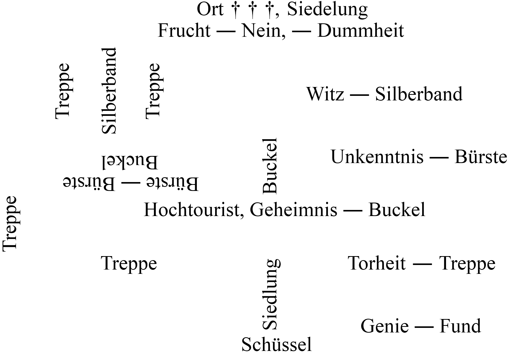

<h1>Die unerforschte Stadt</h1>

<h2>1. Kapitel.</h2>

<h3>Unseres Hauses Geheimnis.</h3>

Wenn das Harstsche Familienhaus in der Blücherstraße einmal wie ich zur Feder greifen und seine eigene Chronik schreiben könnte, — ich glaube, sie würde keineswegs langweilig werden.

Über dem Eingang dieses behaglichen alten Steinkastens ist in die dicke Mauer ein zierlich behauener Sandstein in Form einer Maurerkelle eingefügt, deren breite Fläche in längst vom Zahn der Zeit arg verwaschenen Zeichen außer der Zahl 1803 noch die Buchstaben H. H., Hermann Harst, zeigt.

Dieser Maurermeister Hermann Harst, der Urgroßvater meines Freundes, muß nach allem, was sich über ihn in der Familie von Mund zu Mund weitervererbt hat, ein ebenso tüchtiger Handwerker und Geschäftsmann wie origineller Kauz gewesen sein. Damals, als er auf dem Gebiete des heutigen Vorortes Schmargendorf das große Gebäude errichten ließ, durchlebte Deutschland genau so unruhige Zeiten wie heute, wo wir unter den Folgen des unseligen Krieges schwer zu tragen haben. Napoleon war Kaiser der Franzosen geworden. Sein staatsmännischer und militärischer Ehrgeiz bedrohte die Ruhe Mitteleuropas. Weitsichtige Männer ahnten damals schon auch für Berlin die kommende Schreckenszeit, den Zusammenbruch des friederizianischen Preußens, das auf den Lorbeeren des großen Königs sanft eingeschlummert war. —

Nach dieser kurzen Vorbemerkung führe ich den Leser an einem klaren, kalten und stürmischen Dezemberabend in Harald Harsts Arbeitszimmer, das in besagtem Hause gleich rechts vom Vorderflur lag und mit seinen drei Fenstern, seiner Länge von sieben Meter und seiner Tiefe von fünf Metern mehr einem kleinen Saale glich — nein — gleicht.

Es war gegen halb zehn. Der altertümliche Kamin sandte seine Wärmestrahlen bis hinein in die linke Hinterecke dieses eleganten und doch so nachdrücklich persönliche Eigenart betonenden Raumes. In dieser Ecke stehen das Klubsofa, der viereckige Eichentisch und die drei Klubsessel.

Auf diesem mit einer kostbaren echten Kaschmirdecke belegten Tische brannte die elektrische Stehlampe mit bronzefarbenem Seidenschirm und zwei Birnen. Harst saß in der einen Sofaecke und kramte in alten Familienurkunden, während ich im Klubsessel lag und die Beine auf einen zweiten Sessel gestützt hatte. Ich war müde und schläfrig.

Aus meinem gedankenlosen Hindösen wurde ich durch einen leisen Ausruf Harsts aufgeschreckt.

»Sollte es möglich sein!!« — Und nochmals wiederholte er, nur leiser, denselben Satz …

Ich wandte faul mein haararmes Haupt. »Was gibt’s?!« »Ich habe hier den vergilbten Bauentwurf meines Urahns soeben wieder studiert, den Grundriß, lieber Alter. Und als ich ihn — heute zum ersten Male — umdrehte und mir die fleckige Rückseite des mürben, starken Papiers beschaue, entdecke ich zwischen den Stockflecken und der anderen Alterspatina Reste von Buchstaben. Die Tinte ist natürlich vollkommen vergilbt, und wenn ich nicht die unleserlichen Wortteile ergänzt hätte, würde ich auch heute noch nicht wissen, daß unser Heim … ein Geheimnis enthält. — Ob wohl — ein anderes Thema — bei der Wortbildung »Geheimnis« der Ausdruck »Heim« mit von …«

»Bleiben wir beim Thema,« unterbrach ich ihn. Ich war durchaus nicht mehr schläfrig. »Lies mal vor … Ich bin gespannt …«

»Darfst du auch sein … — Mein Urgroßvater hat hier ein Jahr nach der Fertigstellung des Gebäudes folgendes vermerkt:

18. Juni 1804.

> Dieweil zu erwarten steht, daß der glorreiche Kaiser Napoleon, der in Punkto Klugheit die Herren Staatsmänner unserer Zeit bedeutend übertrifft, auch unsere Land sich untertan zu machen versuchen wird, habe ich für unruhige Tage zum Schutz des Wertvollen und zur Erhaltung des Lebens der Meinen in aller Diskretion mit eigener Hand in langen Nächten an diesem meinem Hause eine bauliche Wariatio vorgenommen, indem ich den westlichen Kellergang um ein beträchtliches erweiterte und so ein Gelaß schuf, dessen Ausdehnung, Einrichtung und Zugang uns, so Gott will, genügend schützen wird. — Meinem getreuen Eheweibe Anna habe ich dringend befohlen, diese Zeichnung vor jedermann verborgen zu halten, so daß, zumal mein Freund, der Apotheker Gimmel vom Gendarmenmarkt, Berlin, mir eine schnell wieder verschwindende Dintenmixtur gebraut hat, mit diesem Geheimnis meines Hauses keinerlei Mißbrauch getrieben werden kann.

Ich hatte mit gespitzten Ohren zugehört …

Harst reichte mir nun den zerknitterten, am Rande vielfach zerfetzten Grundriß, und mit steigendem Interesse überlas ich nun persönlich die Wortfragmente, aus denen <em>ich</em> freilich niemals den vollen Sinn herausgetüftelt hätte, obwohl Apotheker Gimmels »Dintenmixtur« immerhin leidlich erkennbare Schriftzeichen zurückgelassen hatte.

»Und dies Geheimnis ist nun hundertzweiundzwanzig Jahre selig entschlummert gewesen, bis du es …« — hier brach ich ab, denn Harald hatte sich erhoben und ging zum Schreibtisch, nahm die Karbidlaterne aus dem Seitenfach und wandte sich der Tür zu.

Ich kenne ihn seit Jahren. Überflüssige Worte macht er nie. Im Flur setzten wir die Wintersportmützen auf und schritten durch die Pendeltür in den Hinterflur, wo sich unter der in das erste Stockwerk hinaufführenden Treppe der Eingang zu den ausgedehnten Kellerräumen befindet.

Der altehrwürdige plumpe Schlüssel steckte im Schloß der Kellertür.

»Mathilde ist wieder einmal nachlässig gewesen,« meinte Harald. »Der Schlüssel soll abgezogen werden …«

Er öffnete die Tür. Ich rieb ein Zündholz an. Die Laterne puffte auf.

In demselben Moment drang aus dem Treppenschacht aus fernen Tiefen des Kellers ein unbestimmtes Geräusch an unser Ohr …

Harst, der die Hand nach der Laterne ausgestreckt hatte, ließ den Arm langsam sinken, beugte den Oberkörper lauschend vor und flüsterte: »Es kann eine Katze sein … Die kaputte Scheibe des einen Fensters des Kohlenkellers hätte längst erneuert werden müssen …«

Wir lauschten. Aus den Kellerräumen wehte uns die muffige Luft lagernder Kartoffeln entgegen. Jeder kennt diesen Geruch. Aber meine Nase — und mein Geruchssinn ist (als einziger!) wohl infolge meiner Nervosität besser entwickelt als der Haralds — unterschied noch etwas anderes: eine ganz geringe Beimengung von … Parfüm!

Nun gibt es im ganzen Harstschen Hause außer Kölnisch Wasser keine Wohlgerüche. Weder Harst noch ich benutzen jemals ein Parfüm. Für Leute unseres Liebhaberberufs könnte die geringste Menge Derby, Safranor, Peau d’Espagne oder eines sonstigen Herrenparfüms verhängnisvoll werden. Und Haralds Mutter schwärmte lediglich für Kölnisch Wasser, ebenso unsere brave dicke Köchin Mathilde, letztere »anleihenweise« — als Mitbenutzerin der schlichten Flaschen von Johanna Maria Karina ihrer gütigen, weißhaarigen Herrin. —

Wie der nachts auf Beute ausziehende lichtscheue Panther außer dem ausgelegten Köder auch den gut verborgenen Jäger wittert, — ein Vergleich, der hier vielleicht etwas hinkt, denn <em>ich</em> habe wahrhaftig nichts pantherartiges an mir, — ebenso windete nun ich mit meiner niemals prämierten Stupsnase mißtrauisch in das Dunkel vor uns hinein … Harst hatte die Laterne längst an sich genommen und unter der Schnürjacke verborgen.

Kein Zweifel: es war nicht nur der fade Geruch der eingekellerten Kartoffeln, es war auch Parfüm und zwar fraglos Derby! Auf meine Nase ist unbedingt Verlaß.

»Derby!« hauchte ich Harald ins Ohr …

Er — ebenso leise: »Ganz recht … Es ist ein Fremder vor uns in den Keller hinabgegangen!«

Da — — abermals das ferne unklare Geräusch …

Jetzt hielt es längere Zeit an, dieses merkwürdige Scharren.

»Es klingt wie das Arbeiten einer gut geölten Stahlsäge,« raunte mir Harald zu …

Dann schlich er die Treppe hinab, indem er die Jacke etwas lüftete …

Ich folgte …

Wir standen nun im Kreuzgange des Kellers. Das Geräusch war verstummt. Plötzlich vor uns ein deutliches Knacken und das Poltern herabfallender Steine …

Harst stürmt vorwärts … an drei Türen vorüber. Rechts die vierte halb offen … Ein leerer Raum mit einem vergitterten Fenster nach dem Hofe zu … Aber das Gitter fehlt. Der Fensterflügel ist zurückgedreht … Das Gitter lehnt unten an der Mauer.

»Um ein paar Sekunden zu spät,« sagt Harst achselzuckend, beleuchtet das Fenster, schnuppert …

Ja — der Derby-Geruch ist hier noch intensiver … Und wie ich die Nase dicht an das Fensterloch bringe, rieche ich’s fast aufdringlich, dieses von der Lebewelt vielfach so sehr bevorzugte Parfüm …

Harst hebt das herausgesägte Gitter empor …

»Hm — saubere, schnelle Arbeit …,« meint er. »Das war kein Neuling … Was wollte der Mensch hier?!«

Er beugte sich ganz tief und beleuchtet den Boden. Aber die schmutzigen, trockenen Ziegelsteine haben keinerlei Spuren angenommen. —

Was wollte der Mensch hier?! Ein Dieb?! — Ausgeschlossen! Blücherstraße 10 besuchen nur Bestohlene, keine Gauner, es sei denn, daß diese Herren von der Verbrecherzunft vielleicht dem starken Triebe finsterer Rachegelüste folgen … Wir sind bei den Herren nicht beliebt, und ihresgleichen handelt noch nach dem primitiven Grundsatz aus Raubritterzeiten: Auge um Auge, Zahn um Zahn!

Harst stellt das Gitter wieder an die Mauer und meint gleichgültig:

»Vielleicht vermute ich das Richtige, mein Alter … Komm nur …«

Er geht voraus, den Kellergang hinab, bis dorthin, wo der Gang endet. Wir befinden uns jetzt bereits unterhalb des Hofraumes, der das Haus vom Gemüsegarten trennt, stehen hier vor einer unverputzten Ziegelmauer aus jenen gebrannten Steinen großen Formats, wie sie vor hundert Jahren hergestellt wurden, — stehen also nun an jener Stelle, wo sich der Zugang zu dem von Hermann Harst, dem Urahn, eigenhändig hergestellten Geheimgelaß befinden müßte.

Harst läßt den grellen Lichtschein der Laterne über diese Mauer, den Abschluß des Ganges, hingleiten.

Nichts zu sehen, was irgendwie auf eine verborgene Tür hingedeutet hätte — nichts …

Dann beginnt er mit der großen Klinge seines Taschenmessers in den Mauerfugen umherzustochern …

Nichts …

Aber er ist hartnäckig, geduldig. Und auch ich bin überzeugt, das hier etwas zu entdecken ist. Die Niederschrift des Erbauers dieses Hauses kann nicht trügen.

Harald bückt sich schließlich, tritt einen Schritt zurück, beleuchtet die Ziegelsteine, mit denen hier wie überall in den Kellern der Boden belegt ist. Mit einer ihm sonst fremden Hast deutet er plötzlich auf eine große, halb verfaulte, breitgedrückte Kartoffel rechts an der Seitenwand. Ich sehe, daß in dem schmierigen, stinkenden Fäulnisbrei sich die Sohle eines schmalen, kleinen Stiefels deutlich abzeichnet. Jemand hat die Kartoffel zertreten — jemand: die Person, die das Gitter heraussägte — ohne Zweifel, denn diese Spur ist ganz frisch.

»Ein Weib,« sagt Harald nur …

Und wie er es sagt, hat er mit der rechten Hand, mit dem Zeigefinger aus einer breiten Fuge des Ziegelbodens einen verrosteten eisernen Ring, der mit einer ebenso verrosteten eisernen Kette verbunden ist, herausgeholt …

Zieht … hebt eine viereckige Falltür auf … —

So fand er das bescheidene Geheimnis seines eigenen Hauses.

<h2>2. Kapitel.</h2>

<h3>Mein Fellboot.</h3>

Unter der Falltür gähnt uns ein enger Schacht mit einer eisernen Leiter darin entgegen. Aus diesem Schacht weht uns verdorbene Luft an, vermischt mit … Derby!! Wieder Derby!!

Harst atmet tief, nickt … »Ich dachte es mir ja … Sie war hier unten …«

Er beginnt die Leiter hinabzuklettern.

Ich folge neugierig. Aus dem gemauerten, feuchten Schacht führt eine dicke Tür aus Eichenbohlen in einen quadratischen Raum, etwa fünf Meter im Geviert, der vollkommen leer ist. Die Tür hat außen ein plumpes Schloß und einen Riegel, innen zwei stärkere Riegel. Der Boden ist auch hier mit Ziegeln belegt, aber naß und mit weißlichem Schimmel bedeckt, desgleichen die Wände. In einer Ecke steht ein plumper Ofen, dessen eisernes Rauchfangrohr oben in der Decke verschwindet …

Harst sagt nur: »Das Rohr mündet sicherlich im Wurzelwerk der hohen uralten Buche auf unserem Hofe …«

Dann — er schien noch mehr hinzufügen zu wollen — streckt er die Hand aus und greift nach einem Briefe, der auf dem kleinen Ofen liegt und dessen graublauer Umschlag uns bisher entgangen ist.

Ich lese die Anschrift mit:

Mr. Harald Harst.

Eilt!!

»Also deshalb!!« meint Harald kopfschüttelnd. »Etwas umständlich …!«

Schneidet den Umschlag sauber auf und zieht den Briefbogen heraus …

Ebenfalls mit Tintenstift geschrieben — eine Handschrift, die mancherlei verrät, eine grob hingehauene, steile, schmucklose Schrift, nirgends ein Schnörkel, unverkennbar von einer Frau von sehr eigenwilligem, rücksichtslosem Charakter …

Harald wirft nur einen flüchtigen Blick auf die erste Seite, springt plötzlich zur Balkentür …

Und da sehe auch ich auf der Eisenleiter blitzschnell zwei Beine in Sporthosen nach oben zu verschwinden …

Höre die Ziegelsteintür herabpoltern …

»Wir sind eingesperrt,« lacht Harst ironisch. »Freilich hat die Person sich die Sache anders gedacht, hoffte auch die Eichentür noch schließen zu können, und dann wären wir allerdings böse in der Patsche gewesen, mein Alter …«

Er schiebt Brief und Umschlag in die Jackentasche, steigt die Leiter empor und versucht, die Falltür emporzudrücken. Es gelingt.

Wir verlassen den Keller und sitzen nun wieder in Haralds Arbeitszimmer. Die Gleichgültigkeit und Gelassenheit meines Freundes gegenüber dem soeben Erlebten setzt selbst mich in Erstaunen. Er langt nach dem silbernen Zigarettenkasten und raucht sich umständlich eine seiner Mirakulum an.

»Und der Brief?« frage ich ungeduldig.

Harst formt drei Rauchringe … »Wir begehen immer wieder dieselben Fehler, mein Alter,« sagt er dann, — — ohne den Brief aus der Tasche hervorzuholen. »Wir sind Luftfanatiker, und die bis zum Schlafengehen offenen Fenster meines nach dem Hofe hinausliegenden Schlafzimmers haben uns schon so manchen bösen Streich gespielt …«

Ich verstand ihn sofort. »Du glaubst, daß die Frau uns von deinem Schlafzimmer aus belauscht hat?«

»Ja. Und dann, als sie unser Kellergeheimnis mit angehört hatte, schlich sie vom Schlafzimmer aus in den hinteren Flur und in den Keller, fand die Falltür, legte den Brief auf den Ofen und … sägte das Gitter durch, um einen zweiten Ausgang zur Verfügung zu haben. Nachher wollte sie uns einsperren, was ihr nicht gelang. Und weil sie uns einsperren wollte, weil sie hoffte, daß unsere Hilferufe dort unten nicht gehört werden würden, und daß wir vielleicht elend umkommen könnten, weiß ich auch, was in dem Briefe steht. Es ist ein Drohbrief …«

Jetzt griff er in die Tasche, strich den zerknitterten Briefbogen glatt und las vor (englischer Text):

> »Wir haben noch miteinander abzurechnen, Mr. Harst. Ich rate Ihnen dringend, Ihre Angelegenheiten in Ordnung zu bringen. Vierundzwanzig Stunden, und die Rechnung ist glatt.«

»Ganz nett — kurz und bündig, mein Alter … Dem Weibe ist so allerhand zuzutrauen … Wir werden gut tun, uns ein wenig in acht zu nehmen …«

»Wer ist’s? Hast du eine Ahnung?«

»Vielleicht …«

»Kennst du denn die Handschrift?«

»Nein. Und wenn du wissen willst, ob mir die Fußspur in dem Brei der zertretenen Kartoffel bekannt ist, muß ich genau so mit Nein antworten. Ich vermute, daß die Frau mit zu James Barnes famosem Detektivinstitut gehört, das ja in Wahrheit nur eine Verbrecherbande großzügigster Art gewesen ist. Soweit mir im Augenblick gegenwärtig, war Barne verheiratet oder besser — ist verheiratet. Vielleicht hat seine Frau, fraglos ähnlichen Schlages wie er, mir nun den Krieg erklärt, da sie sich hinsichtlich des Schicksals ihres Mannes kaum einer Täuschung hingeben dürfte. Er wird aufgeknüpft werden.«

»Hm — so hältst du diesen Besuch der Donna Unbekannt also für eine Fortsetzung des Gralsburg-Abenteuers?! Ist diese Annahme nicht etwas kühn?! Wir haben doch schließlich weit mehr Feinde als nur die vielleicht noch auf freiem Fuße befindlichen »Kollegen« der glorreichen Detektei Barne …!«

Harst nahm mit einem Male die Zigarette aus dem Mundwinkel und lauschte …

Auch ich hörte trotz des nicht geringen Lärms, den der Wintersturm an den Giebeln, Erkern und Schornsteinen unseres freistehenden Hauses vollführte, ganz deutlich, daß draußen ein Kraftwagen vor unserer Gitterpforte vorgefahren war. Die Pforte wurde regelmäßig um neun Uhr abends von der dicken Mathilde verschlossen. Für einen leidlich gewandten Menschen war es jedoch ein leichtes, sie zu überklettern, was schon so mancher späte Ratsuchende getan hatte. Es befand sich jedoch links an der Pforte unter dem Briefkasten auch der deutlich sichtbare Knopf einer elektrischen Zugglocke, so daß niemand, den nicht gerade Erregung, Angst und Eile vollends blind machten, turnerische Übungen zu vollbringen brauchte, um bis zur Haustür zu gelangen.

Wir warteten nun, ob die Flurglocke anschlagen würde.

Nichts geschah …

Dann — es mochten drei Minuten verstrichen sein — rollte das Auto wieder von dannen.

»Merkwürdig!« sagte Harald mit leichtem Kopfschütteln … »Selbst wenn es eine Autotaxe war und der Fahrgast erst noch bezahlte, müßte er …«

Er beendete den Satz mit einer kurzen, energischen Handbewegung, erhob sich und betrat rasch sein Schlafzimmer, ließ die Tür weit offen, schaltete das Licht ein und verschloß die Innenladen der Fenster, legte die eiserne Stange vor und kehrte zu mir zurück.

»So,« meinte Harald, »nun tu bitte bei dir drüben dasselbe, mein Alter. Ich will einmal bis zur Gitterpforte gehen und dort nach dem Rechten schauen.«

Meine Zimmer liegen auf der anderen Seite des Flurs. Ich war vorsichtiger als Harald und untersuchte noch rasch meine beiden Räume, da ich nach Haralds warnenden Bemerkungen vorhin doch damit rechnete, daß »Frau Barne« (ob sie’s gewesen, verdiente ein Fragezeichen) sich vielleicht bei mir eingeschlichen hätte. In meiner nur einfenstrigen Schlafstube spürte ich nun unverkennbar den in diesem Falle sehr vielsagenden Derby-Geruch. Das machte mich noch vorsichtiger. Ich ließ mir Zeit. Ich habe da genau wie Harst in meinem Wohn- und Arbeitszimmer eine Unmenge Erinnerungsstücke an unsere Auslandsreisen aufgestapelt und so das reine Völkermuseum geschaffen, in dem nicht einmal ein echter Eskimokajak, ein kleines Fellboot, fehlt. Dieses schmale Fahrzeug hängt an zwei Riemen an der Decke genau über meinem Schreibtisch. Daß indische Andenken in diesem Museum am zahlreichsten vertreten sind, wird niemand weiter wundern, der unsere Vorliebe für das Land wundervoller Baudenkmäler und weniger wundervoller Tiger und Giftschlangen kennt. —

Mein Verdacht, die Fremde könnte meine Räume für längere Zeit als Versteck erwählt haben, erwies sich als gegenstandslos. In der Schlafstube war die Frau zweifellos gewesen, dann wohl aber wieder zum Fenster hinausgestiegen und bei Harald eingedrungen.

Ich hatte den Drücker der Flurtür schon in der Hand, wollte gerade auch das Licht in meinem Wohnzimmer ausschalten, als mein Blick nochmals prüfend das Gemach überflog.

Ich stutzte …

Was ich sah, war so wenig auffällig, daß ich zunächst an eine Täuschung glaubte …

Der Kajak schaukelte an den Lederriemen droben unter der Zimmerdecke ganz leicht hin und her, kaum merklich. Und mir wäre dies wohl auch sicherlich entgangen, wenn nicht der Schatten, den das Fellboot warf, gleichfalls und infolge seines größeren Umfangs sich stärker bewegt hätte.

Jetzt sog ich prüfend die Luft ein …

Jetzt spürte ich auch hier den Derby-Geruch, der freilich durch das scharf duftende Sandelholz, aus dem verschiedene meiner Andenken hergestellt waren, fast bis zur äußersten Grenze der Wahrnehmfähigkeit für ein menschliches Geruchsorgan übertönt wurde.

Ich wußte genug. Das Weib war noch hier im Hause, steckte oben in dem Kajak.

Ich überlegte nicht lange. Meine Rechte glitt nach der Schlüsseltasche. Die Sicherung der kleinen treuen neunschüssigen Clement schnellte mit leisem metallischem Knacken zurück.

»Bitte — verlassen Sie Ihr Versteck sofort!« rief ich laut.

»Sie haben sich in dem Fellboot verborgen. Wenn Sie irgendwie zögern, schieße ich …«

Ich hätte natürlich nicht geschossen.

Diese energische Aufforderung (in englischer Sprache) brauchte ich nicht zu wiederholen.

Aus dem Schlupfloch des Kajak kam ein Kopf mit einer braunen wolligen Sportmütze zum Vorschein — ein altes, faltiges, bartloses Gesicht …

Dann der übrige Mensch: ein Zwerg mit Kürbisschädel, vielleicht ein Meter zehn Zentimeter groß, aber breit in den Schultern und gelenkig wie ein Pavian.

Ich war reichlich baff über diesen Liliputaner, zumal er nun, nachdem er von dem Kajak sehr geschickt auf den Teppich gesprungen war, nicht nur einen intensiven Derby-Geruch um sich verbreitete, sondern auch sehr zierliche, dunkelbraune hohe Schnürstiefel, grünbraune Stutzen und dunkelgraue Sporthosen trug — eine Beinpartie, die mir ja bereits von der Eisenleiter des Geheimgemachs her bekannt waren.

Meine Verblüffung war begreiflich. Nicht eine Frau, sondern dieser Zwerg mit dem Greisengesicht war der Eindringling, der Überbringer des Briefes, der Zerstörer des Kellergitters und … Harsts Feind, unser Feind.

»Hände hoch!« befahl ich …

Er lachte mir krähend ins Gesicht …

»Herr Schraut, Sie schießen ja doch nicht …! — Lassen Sie mich laufen … Die ganze Geschichte war ein Scherz — eine Wette …«

»Nehmen Sie die Hände aus den Taschen — — sofort!« Ich war wütend. Der Bursche glaubte mit mir leichtes Spiel zu haben. Irrtum …

Er sah’s mir wohl an, daß mein Geduldsfaden dicht am Reißen war …

Langsam zog er die Hände heraus …

Und — — urplötzlich fühlte ich da, wie mir etwas Kaltes über das Gesicht strich …

Meine Augen brannten jäh wie Feuer …

Gleichzeitig mit diesem Säurestrahl, den der kleine Schuft mir vermittels eines in der linken Hand verborgenen Balles von unten her unter die Brille gespritzt hatte, schlug er mir mit der anderen Hand die Pistole zur Seite …

Ich war geblendet, aber auch für Minuten von so scheußlichen Schmerzen in den Augen gepeinigt, daß ich sogar um Hilfe zu rufen vergaß …

Außerdem hatte auch nur der eine entsetzliche Gedanke in meinem überhitzten Hirn Raum: du wirst das Augenlicht verlieren, wirst blind werden.

Als ich dann überlaut Haralds Namen brüllte, als Harst von drüben herbeigeeilt kam, war der Zwerg längst entwischt — durch den Keller, wie Harald nachher feststellte.

<h2>3. Kapitel.</h2>

<h3>Das Pergament.</h3>

Zum Glück erwies sich die Flüssigkeit, die ich für Säure gehalten hatte, lediglich als sehr scharfes Salzwasser, und Harst gelang es denn auch, durch mehrmaligem Auswaschen meiner Augen mich in kurzem wieder aktionsfähig zu machen, wie er sich ausdrückte.

»Wir haben nämlich drüben bei mir Besuch, mein Alter,« erklärte er in meiner Schlafstube und legte den Schwamm weg, mit dem er mir seine Samariterdienste geleistet hatte. »Eine Dame — keinen Zwerg … Frau Doktor Loncire, die Witwe des in Neuguinea heimtückisch von Barnes Gesellen niedergeknallten Forschungsreisenden. Sie hat gestern abend durch den Londoner Rundfunk von den Vorgängen in der Gralsburg Kenntnis erhalten und ist daraufhin sofort abgereist, um sich mit uns in Verbindung zu setzen. Weshalb — das wird sie dir persönlich mitteilen …«

Ich fühlte mich durch mein ungeschicktes Verhalten dem Zwerge gegenüber recht gedemütigt. Daß auch ausgerechnet mir dies hatte passieren müssen — eine Schande! Ich hatte mich von dem kleinen Burschen vollkommen überlisten lassen. Ich war kaum in der Stimmung, Frau Loncire jetzt sofort unter die Augen zu treten.

»Frau Loncire weiß doch nichts von dieser kleinen Blamage. Folge mir nur. Ihr Anliegen ist nicht uninteressant. Sie ist bereits bei dem Herzog Daugberry im Bristolhotel gewesen und hat mir von ihm ein paar Zeilen mitgebracht. Kurz — es handelt sich um die von Doktor Loncire 1921 in Neuguinea entdeckte Goldmine.« —

Frau Doktor Adelaide Loncire (sie war in Australien geboren) reichte mir ihre schmale, tadellos gepflegte und doch kräftige Hand …

Wir nahmen Platz …

Harald sagte leichthin … »Mein Freund ist in seinem Zimmer mit einer die Augen reizenden Flüssigkeit etwas leichtsinnig umgegangen, Frau Loncire. Nun — die Sache ist wieder in Ordnung … Wenn Sie vielleicht nochmals beginnen wollten, Frau Loncire. Schraut wird es interessieren, aus Ihrem eigenen Munde Ihr Anliegen zu hören.«

»Gern, meine Herren …« Sie sprach recht fließend deutsch. »Wie Sie wissen, Herr Schraut, war mein Mann mit dem Herzog Daugberry eng befreundet. Im Januar 1921 begab Ralph sich zum ersten Male nach Neuguinea und blieb dort bis Februar 1922. Nach seiner Rückkehr nach London teilte er mir in Gegenwart des Herzogs mit, daß er in dem bisher unerforschten Südostteile der großen Insel eine überreiche Goldader entdeckt habe. Daraufhin rüstete dann der Herzog jene Expedition aus, von deren Mitglieder dieses Scheusal von Barne nur den Herzog am Leben ließ. Ich habe nie mehr geglaubt, daß Ralph noch nach all den Jahren wieder lebend auftauchen könnte. Frauen haben für Ereignisse, die sich auf ihr Liebstes beziehen, ein weit feiner entwickeltes Ahnungsvermögen als Männer. — Was Ihnen und Ihrem Freunde Harst bisher nicht bekannt war, Herr Schraut, ist folgendes: Ralph hatte 1921 in Neuguinea zwei Geländeskizzen über die Lage der Goldader angefertigt. Die eine ließ er mir zurück, als er März 1922 mit der Expedition England wieder verließ, um die Ader auszubeuten. Die zweite Zeichnung nahm er mit. Da nun James Barnes Mörderbande die Expedition überfallen hat, bevor diese ihr Ziel erreicht hatte, dürfte diese zweite Skizze verlorengegangen sein. Sie war übrigens für jeden Uneingeweihten wertlos, da Ralph vorsichtig genug gewesen war, beiden Zeichnungen eine Form zu geben, die einem Bilderrätsel gleicht. — Ralph hat nun niemals damit gerechnet, daß ihm etwas zustoßen könnte, und deshalb weder dem Herzog noch mir die Skizze genau erklärt, wie mir Daugberry vorhin im Hotel Bristol bestätigte. Weil ich nun diese Goldader — ich bin in sehr bescheidenen Verhältnissen zurückgeblieben — unbedingt als Ralphs Erbschaft für meine beiden Kinder und mich ausbeuten möchte, handelt es sich zunächst darum, ob Sie, meine Herren, mir behilflich sein wollen, natürlich gegen einen entsprechenden Anteil an dem Gewinn, diese Erbschaft zu realisieren. Herzog Daugberry hat mir eine Karte an Herrn Harst mitgegeben, und unterstützt meine Bitte. Das Herzogspaar läßt Sie beide herzlichst grüßen. Es reist heute nacht nach London zurück.«

Frau Adelaide Loncire öffnete jetzt ihr Handtäschchen und nahm ein zweimal gefaltetes Stück Pergamentpapier heraus.

»Hier ist die Skizze, meine Herren … Wie Sie sehen, besteht sie lediglich aus einer Menge kreuz und quer niedergeschriebener Wörter, die scheinbar keinerlei Bezug auf die Goldader oder das Gelände haben … Weder der Herzog noch ich konnten vorhin im Hotel Bristol auch nur im geringsten aus dieser Zeichnung irgendwie klug werden, und es war ein grober Mißgriff meines Mannes, seine Geheimniskrämerei so weit zu treiben, daß er weder seinem Freunde noch mir die Skizze erklärte. Wenn Sie, Herr Harst, dieses Worträtsel nicht deuten können, ist die Goldader für alle Zeit für mich verloren, denn in jene Wildnis, die Ralph 1921 nur in Begleitung von drei farbigen Trägern, die nachher an Malaria starben, durchquert hat, wird wohl so bald kein anderer sich hineinwagen, — noch weniger aber nach einer Goldader suchen, von der man nichts weiß, als daß sie vorhanden ist.«

Sie reichte Harald das Pergamentblatt, und wir beide beugten uns neugierig darüber.

Ich gebe das Bild der Zeichnung hier mit denselben deutschen Wörtern wieder.

Ehrlich gesagt: meine bebrillten Augen hatten noch nie etwas so fein Ausgeklügeltes zu Gesicht bekommen. Ich für meine Person gab es von vornherein auf, dieses Worträtsel zu lösen, und Haralds Gesichtsausdruck machte ebenfalls ganz den Eindruck, als ob er nicht viel Hoffnung hätte, nach dieser Skizze, die keine Skizze war, die Goldader zu finden.

Harald drehte das Pergamentblatt hin und her, schüttelte zuweilen den Kopf, rauchte ein paar Züge aus seiner Mirakulum, legte die Zigarette wieder weg und meinte schließlich:

»Ihr Gatte muß ein sehr kluger Mann gewesen sein, Frau Loncire …«

»Gewiß … Sonst hätte die englische Regierung wohl kaum seine erste Expedition nach Neuguinea pekuniär unterstützt …«

»Ein sehr kluger Mann,« murmelte Harst darauf nochmals … Und lauter: »Wie ich sehe, haben Sie dieses Pergament bereits mit Säuren behandelt, da Sie wohl annahmen, daß vielleicht Eintragungen mit unsichtbarer Tinte vorhanden sein könnten.«

»Ja, Herr Harst. Ich fand jedoch nichts.«

»Haben Sie diese Arbeit allein vorgenommen, Frau Loncire? Ich meine den Versuch, Schriftzeichen hervorzurufen.«

Er hob den Blick und schaute sie scheinbar zerstreut an.

Adelaide Loncire erwiderte etwas zu hastig: »Natürlich allein, Herr Harst … Ich konnte doch eine derart wertvolle Urkunde keinem Chemiker vorlegen. — Überhaupt möchte ich an Sie und Ihren Freund genau dieselbe Bitte richten wie vorhin an das Herzogspaar: meine Absicht, die Mine auszubeuten, muß unbedingt geheim bleiben, da sonst fraglos Abenteurer sich finden würden, die mir dasselbe Schicksal bereiten könnten wie der Expedition des Herzogs und meines armen Gatten.«

Harst nickte … »Selbstverständlich müßte alles in größter Stille vorbereitet werden, Frau Loncire. Nur — — zunächst müßte ich dieses außerordentlich schwierige Bilderrätsel gelöst haben, was immerhin ein paar Tage dauern dürfte. Gewiß, eine glückliche Eingebung des Augenblicks könnte mir den Sinn dieser Zeichnung vielleicht auch sehr bald verraten — vielleicht. — Was sagt denn der Herzog dazu?!«

»Er zuckte die Achseln, erklärte, daß die Expedition ja bereits am dritten Tage nach dem Abmarsch von der Hafenstadt Granville überfallen und bis auf ihn auf einer Bergterrasse niedergemacht wurde …«

»Hm — Bergterrasse …,« murmelte Harald sinnend und starrte auf das Blatt.

Frau Loncire fügte lebhafter hinzu: »Gewiß, der Herzog meint, die Zeichnung bedeute nichts anderes als die einzuschlagende Marschroute, und die Wörter müßten wohl durch Striche erst und richtig miteinander verbunden werden — müßten. — Ralph hat wirklich sehr unbedacht gehandelt, als er mir diese für jeden Unkundigen geradezu sinnlose Skizze zurückließ …«

Ihre Stimme war scharf und gereizt geworden.

Kein Wunder. Die Frau war arm, hatte zwei Kinder, und … hätte vielleicht Millionärin werden können!

Harald hob abermals den Kopf …

»Lassen Sie mir das Pergament bis morgen abend hier, es ist bei mir vollkommen sicher …« Er deutete aus den Panzerschrank. »Wo sind Sie abgestiegen, Frau Loncire? Sollten wir Glück haben und sollte ich die Lösung schon früher finden, möchte ich Ihnen doch Nachricht geben. Finden werde ich die Lösung. Wann — das steht dahin. Unser Hirn ist nicht jederzeit gleich leistungsfähig. Es gibt glückliche und minder glückliche Tage. Ich bin auch sehr vom Wetter abhängig. Bei Sonnenschein steigert sich der ganze Lebensimpuls des Menschen.«

Frau Adelaide erwiderte, daß sie im Pensionat Gerrmar in der Kaiserallee 83 abgestiegen sei … »Ein sehr bescheidenes Flurzimmer, Herr Harst … — Und wenn Sie nun die Skizze gedeutet haben, was dann?!« Sie war wieder recht nervös … Ihre Finger kamen nicht zur Ruhe …

»Darüber sprechen wir später,« meint Harald liebenswürdig und mit einem aufmunternden Lächeln. »Wollen Sie Schraut und mich nach Neuguinea begleiten?«

»Ja — gern — — sehr gern … Meine Kinder sind bei meiner Schwester gut aufgehoben …«

Dann verabschiedete sie sich. Harst begleitete sie bis zur nächsten Autohaltestelle. Ich bewachte derweil das kostbare Pergament und überlas immer von neuem diese Wörter, die den Weg zu einem Goldschatz weisen sollten und doch nichts anderes waren als das Produkt eines überklugen Kopfes — ein Produkt, das in der Luft wie eine schillernde, unerreichbare Seifenblase schwebte.

<h2>4. Kapitel.</h2>

<h3>Die Tote im Auto.</h3>

Harst kehrte zurück, verschloß die Haustür, legte Pelz und Hut im Flur ab, öffnete die Zimmertür und winkte mir … »Wir wollen nun erst einmal sehen, wo dein Zwerg geblieben ist …«

Es war jetzt kurz vor Mitternacht.

Im Keller fanden wir an dem herausgesägten Gitter einen neuen Zettel befestigt — wieder dieselbe energische Schrift, die zuerst von Harst für die einer Frauenhand gehalten worden war.

»Noch vierundzwanzig Stunden. Sie entgehen mir nicht!«

»Theater!« sagte Harst geringschätzig.

Wir durchsuchten den Keller nur flüchtig, stiegen auch nochmals in das Geheimgemach hinab.

»Dein kleiner Gegner wird es nicht zum zweiten Male wagen, sich hier in unserem Hause zu verstecken,« meinte Harald. »Schließen wir den Keller ab …«

Dann saßen wir wieder in seinem Zimmer …

Harald ließ sich von mir die Skizze geben, die ich vorhin in die Tasche gesteckt hatte.

Er warf mir einen eigentümlichen Blick zu …

»Du bist doch immer so stolz auf deine feine Nase, mein Alter … — Welches Parfüm benutzt Frau Loncire?«

»Ylan-Ylan …«

»Stimmt … — Und nun beschnuppere mal freundlichst diese lächerliche Skizze …!«

»Lächerlich?!«

»Bitte …«

Ich beroch das Blatt …

Es roch nach Ylan-Ylan, aber auch nach — Derby!!

Das Blut schoß mir ins Gesicht …

»Derby!! — Was bedeutet das?! — Harald, rede endlich! Ich merke, daß …«

»… bei alledem etwas nicht stimmt!« Sein hageres durchgeistigtes Gesicht strahlte. »O, es ist ein Vergnügen, gegen Leute zu kämpfen, die nicht die ausgetretenen Bahnen sogenannter routinierter Verbrecher wandeln! Routine ist immer Schablone. Dies hier ist eigener Entwurf … — Also höre. Wir vernahmen draußen das Auto. Es hielt, fuhr wieder davon. Du gingst in deine Zimmer hinüber. Ich wollte draußen mich umschaun, blickte aber zunächst mal durch den Türspion der Haustür … Ich sah Frau Loncire vor der Gitterpforte stehen und … mit einer winzigen Taschenlampe spielen … hm … spielen … Sie schaltete sie dreimal ein und aus und starrte dann angestrengt nach links, wo deine Wohnzimmerfenster liegen … Du hattest die Vorhänge nicht vorgezogen, und wenn dein Freund Zwerg im Kajak oben gleichfalls … mit einer Taschenlampe gespielt hat, kann Frau Adelaide dies vielleicht beobachtet haben …«

»Signale!« rief ich ganz atemlos. »Die beiden stecken unter einer Decke …! Daher riecht das Pergament auch nach Derby!«

»Aha — nun kommst du schon auf den richtigen Dreh, mein Alter! Ich denke, die Sache ist so … Die Frau und der Zwerg vereinbaren, daß der Gnom uns belauschen soll, nachdem die Frau uns das Pergament hiergelassen hat. Der Zwerg horcht im Schlafzimmer, spielt sich nachher als blutrünstiger Rächer auf, kneift scheinbar aus, trifft mit der Frau zusammen, teilt ihr mit, daß er bei dir als bestes Versteck den Kajak bemerkt hat, schleicht sich abermals ins Haus und signalisiert der Frau, daß er bereits im Kajak in Sicherheit sei. Alles andere war eben Spiegelfechterei: der Brief, der Versuch, uns einzusperren, und jetzt der Zettel! Der Gnom wollte eben um jeden Preis bei uns den Eindruck hervorrufen, er sei eine völlig selbständig handelnde Persönlichkeit und habe mit der späten Klientin nichts gemein …«

Ich nickte eifrig … Ich war völlig im Bilde. Sagte: »Der Zwerg wollte nachher den Kajak verlassen und hier den Lauscher …«

»… ja — des Pergaments wegen … Er sollte zu erfahren suchen, ob ich die Lösung schon in dieser Nacht fände und wie sie laute. Die Frau kennt mich, wußte, daß ich nicht eher ruhen würde, bis das Worträtsel erledigt war … Nun — —« er zeigte auf das Pergament — »die Geschichte ist verblüffend einfach … Ich kann dir die einzuschlagende Marschroute schon jetzt genau beschreiben …«

»Witz?!« meinte ich mißtrauisch …

»Durchaus nicht. — Fangen wir unten an. Da steht »Schüssel«. Darüber Siedlung. Schüssel bedeutet das Meer, Siedlung den Hafen Granville, der ja tatsächlich auf der Südostseite von Neuguinea liegt.«

»Hm — aber neben Siedlung liest man noch Genie und Fund?!«

»Ganz recht. Aber all diese Wörter, die nichts Gegenständliches bezeichnen und die rechte Seite der Skizze füllen, sind nur Blendwerk: Dummheit, Witz — Silberband, Unkenntnis — Bürste, Geheimnis — Buckel, Torheit — Treppe, Genie — Fund, — — all dies hat Doktor Loncire nur hineingeschrieben, um die Zeichnung zu verwirren. — Du kannst mir schon glauben, — es ist so! Erinnere dich, daß die Frau erwähnte, die Expedition sei schon am dritten Marschtage auf einer <em>Bergterrasse</em> niedergemacht worden. Ein terrassenförmiger Berg ist nun gleichsam eine Riesentreppe.«

»O — — links von »Siedlung« steht »Treppe« …«

»Ja — und — — da hatte ich den ersten Anhaltspunkt. Das andere war kinderleicht … — Von Granville aus soll man sich westwärts wenden bis zu einem fraglos sehr auffälligen terrassenförmigen Berge, von der Westseite dieses Berges nach Norden zu einem ebenfalls terrassenförmigen Berge … Bitte, betrachte die Zeichnung …«

»Ja, gewiß … — Und dann?«

»Von diesem zweiten Berge oder Höhenzuge, dessen Terrassen nach Norden abfallen, denn das zweite »Treppe« ist von links nach rechts geschrieben, geht es ostwärts — »Hochtourist« —, das heißt beschwerliche Kletterpartie, vielleicht über einen Gebirgspaß bis zu einem neuen Berge, der in seinen Umrissen vielleicht einem buckligen Menschen gleicht …«

»Famos! — Und an der Nordseite dieses Berges schließt sich nach Westen zu »Bürste — Bürste« an … Was bedeutet das?!«

»Wald natürlich … Eine Bürste ist ein Wald von Borsten … Haaren …«

»Glänzend …! — Aber was soll das zweimalige »Bürste« mit Verbindungsstrich und darunter wieder Buckel?!«

»Nun — zwei Urwälder, durch ein Tal oder Plateau getrennt, und nördlich davon wieder ein »buckliger« Berg. Nach Norden zu folgen von diesem Berge zwei terrassenförmige Höhenzüge — Treppen —, zwischen denen ein Fluß — Silberband — dahinströmt!«

»Natürlich — — verblüffend einfach!!«

»Und diesem Flusse muß man nach Norden folgen, dann gelangt man zu »Frucht — Stein«, was nur bedeuten kann einen besonders alten riesigen Brotfruchtbaum und einen auffallenden Felsblock. Nördlich von diesen beiden Kennzeichen liegt »Ort † † †«, das dürfte die Goldader sein, und östlich von dieser ein Dorf der Eingeborenen — »Siedlung« … — Ohne Zweifel sind nun all diese von Doktor Loncire angegebenen Wegmarken so ins Auge springend, daß ein Abirren von der richtigen Marschroute unmöglich ist. Uns jedenfalls, mein Alter, wäre es eine Kleinigkeit, die Goldader zu finden, die meines Erachtens gar nicht so weit von der Küste entfernt liegen kann und die Loncire entdeckt hat, als er aus dem Innern nach Granville zurückmarschierte.«

Als Harald jetzt das Pergament in den Tresor einschloß, fragte ich: »Frau Adelaide hatte den Zwerg also nur ausgeschickt, um später nicht auf uns beide als Reisebegleiter angewiesen zu sein, um also die Beute nicht mit uns teilen zu müssen …?«

»Du triffst das Richtige … Diese Geschäftsschlauheit entspricht ganz ihrer kühlen, berechnenden Natur. Der Tod ihres Mannes, der doch erst vor zwei Tagen zur Gewißheit wurde, scheint ihr sehr wenig nahegegangen zu sein. Ihr liegt lediglich etwas an der Goldader. Nun — wenn wir ein Honorar von dieser Dame auch unschwer entbehren können, mein Alter, so gibt es in Berlin jetzt vor Weihnachten doch übergenug Wohltätigkeitsanstalten, die für ihre Kinderbescherungen eine größere Spende sehr gut brauchen können. An Frau Loncires Armut glaube ich nicht. Ihre Kleidung war raffiniert einfach, dabei aber aus einem ersten Atelier, ihr Pelzmantel ganz neu und ihre Ringe ein kleines Vermögen wert. Sie wird die Lösung des Rätsels mit zehntausend Mark bezahlen müssen. Dann mag sie mit ihrem Zwerge und ihrem sonstigen Anhang getrost ohne uns gen Neuguinea ziehen. Ich reiße mich wahrhaftig nicht danach, wieder monatelang im Ausland mich umherzutreiben. Ich möchte einmal wieder deutsche Weihnacht feiern und Mutters strahlende Augen sehen, wenn sie uns ihre Geschenke im Kerzenglanz überreicht … Neuguinea lockt mich gar nicht. Diese Frau Adelaide ist mir reichlich unsympathisch, wenn auch ganz interessant, denn sie ist gerieben, steckt ein Dutzend Hochstapler in die Tasche und besitzt die kalte Entschlossenheit eines erprobten Geldschrankknackers, ist mithin gefährlich. Ich bin nur neugierig, was sie morgen mittag sagen wird, wenn ich sie höflichst ersuche, zehntausend Mark auf den Tisch des Hauses zu zählen …«

Er steckte den Geldschrankschlüssel in die Hosentasche, gähnte zwanglos, schaute auf die Standuhr und sagte mir Gute Nacht.

Es war drei Viertel eins geworden.

Ich hatte bereits die Tür nach dem Flur geöffnet, als das Telephon auf Haralds Schreibtisch Sturm läutete …

»Nanu — jetzt noch?!« meinte Harst und nahm den Hörer von der Gabel … »Hier Harald Harst … Ah — ’n Abend, Bechert … Was gibt’s denn …? — — Wie — — hier in unserer Nähe …?! Ermordet? … Im Laubengelände hinter unserem Gemüsegarten …? … Auto?! — Im Auto?! — — Etwas übersichtlicher, lieber Bechert … — Gut, wenn die Mordkommission erst unterwegs ist, bin ich ja noch rechtzeitig an Ort und Stelle … — Regierungsrat Queißner hat also ausdrücklich gebeten, daß Schraut und ich mitmachen … Sie wissen ja, Bechert, ich dränge mich niemandem auf, und wenn ich auch mit Ihnen, Ihren Kollegen und Vorgesetzten sehr gut stehe, so …, — schön, schön, lieber Bechert … Genügt mir … Wiedersehen …«

Ich hatte die Tür wieder leise zugedrückt … Hatte gespannt auf jedes Wort gelauscht.

Harst legte den Hörer langsam auf die Stützen zurück und sagte achselzuckend: »Vorläufig wird’s mit dem Schlafengehen nichts … Auf dem Feldwege draußen am Laubengelände hat ein Chauffeur einer Autotaxe seinen weiblichen Fahrgast mit einer Schußwunde im Kopf im Innern des Wagens tot aufgefunden — vor einer halben Stunde. Es muß Mord vorliegen, erklärte Freund Bechert. Im Wagen ist keine Waffe gefunden worden, außerdem sitzt der Einschuß im Hinterkopf. — Ziehen wir uns an … Regierungsrat Queißner vom Polizeipräsidium hat uns durch Bechert ausdrücklich bitten lassen, uns am Tatort einzufinden, da wir ja kaum zweihundert Schritt zu gehen haben … — Hilft also nichts, mein Alter … Die Herren vom Präsidium sind uns so oft gefällig gewesen, daß ich gern eine Stunde opfere, wenn auch der Fall als solcher kaum interessant sein dürfte. Morde sind in den seltensten Fällen für unser Spezialgebiet geeignet. Solche Dinge erledigt die Polizei weit besser als wir. Unsere Berliner Kriminalpolizei hat jetzt selbst die englische überflügelt. Hut ab vor diesen Herren!« —

Fünf Minuten später arbeiteten wir uns mit hochgeklappten Pelzkragen gegen den eisigen Sturm auf dem Feldwege vorwärts. Schon von weitem glotzten uns die Scheinwerfer eines Autos wie die Augen eines vorsintflutlichen Ungeheuers grell strahlend entgegen. Neben dem Wagen standen der Chauffeur, zwei Schupobeamte und ein Zivilist, der uns bereits bekannt war: ein Kriminalassistent von der nächsten Revierwache.

Er grüßte … »Man hat mich bereits davon verständigt, Herr Harst, daß Sie und Herr Schraut sich hier einfinden würden … — Bitte — wenn die Herren die Tote sich von außen ansehen wollen …« Er brachte unter dem Mantel eine große flache elektrische Laterne zum Vorschein. Wir traten näher an das Auto heran. Auf dem Polstersitz lag eine Dame im schwarzen Sealpelz, halb gegen die Rückwand gelehnt. Der Kopf hing kraftlos zur Seite. Der schwarze elegante Hut mit Seidenbandgarnierung war tief ins Genick gerutscht und gab auch die Stirn und das aschblonde Haar frei. Von einer Wunde oder von Blutspuren war so, wie die Tote lag, nichts zu bemerken.

Das linke Türfenster, durch das wir hineinschauten, war herabgelassen.

Harst wandte sich an den Chauffeur. »Berichten Sie kurz … Wo stieg die Dame ein, wohin wollte sie, und die Hauptsache: war dieses Fenster offen, als Sie Ihren Fahrgast tot vorfanden?«

Der Chauffeur kam nicht dazu sofort zu antworten. Vor uns tauchten sechs Gestalten auf, die sich eiligst näherten … Es war die Mordkommission.

<h2>5. Kapitel.</h2>

<h3>Die Unbekannte.</h3>

Über die Arbeitsmethode der Mordkommission der Kriminalpolizei einer Weltstadt ist bereits in so zahlreichen Zeitungsberichten oder in frei erfundenen Kriminalromanen gesagt worden, daß ich nur das hervorheben will, was Harsts Anteil an den Nachforschungen am Tatorte betrifft. — Der Chauffeur erzählte, daß die Dame auf dem Potsdamer Platz seinen Wagen an die Bordschwelle gewinkt habe. Die Dame habe außer dem ledernen Handtäschchen, das noch jetzt unten im Auto läge, nichts weiter bei sich gehabt, weder Schirm noch Koffer, obwohl sie zweifellos aus dem Hauptgebäude des Potsdamer Bahnhofs gekommen sei. Sie habe ihm in etwas gebrochenem Deutsch befohlen, nach der Blücherstraße in Schmargendorf zu fahren und dann links in den Feldweg einzubiegen, der sich an der Rückseite der Blücherstraße zwischen deren Häusern und dem Laubengelände hinziehe. Die Dame wußte sehr gut Bescheid und gab dem Chauffeur so genaue Anweisungen, daß er auch unschwer die Zufahrt zu dem Feldwege fand, wo er nach fünfzig Schritt halten sollte. Das linke Türfenster ließ die Dame vor Antritt der Fahrt herab. Sie machte einen sehr erhitzten, erregten Eindruck und blickte sich, bevor sie einstieg, mehrmals um, als ob sie in dem vorüberflutenden Menschengewühl irgend jemand suchte. — Als der Chauffeur das Auto dann stoppte, regte sich im Innern des Wagens nichts. Er kletterte vom Fahrersitz herab und sah zu seinem Schreck in dem erleuchteten Wagen (das Auto hatte Deckenlicht) die Dame halb in einer Ecke liegen — wie jetzt noch. Er suchte sie aufzurichten, dabei glitt der Kopf zur Seite, und er bemerkte Blut in den Haaren des Hinterkopfes, das bis ins Genick hinabgerieselt war und auch die Polsterung beschmutzt hatte. Da er an einen Selbstmord glaubte, sich aber anderseits auch sagte, man könnte womöglich ihn selbst für den Täter halten, lief er die kurze Strecke bis zur Blücherstraße zurück und bat hier einen gerade vorüberkommenden Herrn, die nächste Revierwache zu verständigen. — — Der Chauffeur war ein älterer Mann, und seine Aussage machte in allem einen durchaus glaubwürdigen Eindruck.

Den ganzen Umständen nach konnte die Frau nur während der Fahrt von einem Unbekannten, der sich irgendwie unbemerkt in den Wagen geschwungen hatte, (die Kraftwagen müssen ja an Straßenkreuzungen häufig längere Zeit halten) erschossen worden sein. Selbstmord war unmöglich, wie der Polizeiarzt schon nach flüchtiger Besichtigung der Wunde betonte. Außerdem, hob er hervor, hätte die Frau nach dieser Gehirnverletzung auch niemals mehr die Kraft gehabt, die Waffe etwa zum offenen Fenster hinauszuschleudern.

Wie der Arzt die Tote nun in eine andere Lage brachte, stutzte er mit einem Male …

»Sie lebt noch … Merkwürdig, der Puls geht ganz kräftig …«

Es stellte sich heraus, daß die Kugel dicht unter der Hirnschale saß und daß sie das Gehirn kaum allzusehr verletzt haben konnte.

Bevor die Bewußtlose dann in ein Krankenhaus geschafft wurde, durchsuchte man noch ihr Handtäschchen und die Taschen ihres Pelzes. Nichts war darin — gar nichts. Sie trug auch nicht ein einziges Schmuckstück, keinen Ring — nichts.

Hier nun machte Harst die Herren darauf aufmerksam, daß der Stoff der schwarzen Seidenbluse vorn an der Brust leicht zerrissen war, und daß die Finger der Unbekannten sowie die Ohrläppchen deutlich bewiesen, daß die Dame sowohl Ringe als auch Ohrringe besessen habe.

»Ihr Schmuck — Brosche, Ringe und so weiter — sind ihr geraubt worden, als der Chauffeur das Auto hier für Minuten allein gelassen hatte,« erklärte Harald. »Hier am linken kleinen Finger ist eine leichte Kratzwunde. Der Dieb hat Mühe gehabt, die Ringe abzustreifen, und dabei die Fingerhaut mit seinen Nägeln abgeschürft. Dieser Dieb ist mit dem Mordbuben fraglos identisch. Er hat die Fremde schon verfolgt, bevor diese noch das Auto heranwinkte. Die Frau schaute sich nicht »suchend«, sondern »ängstlich« nach den Vorübergehenden um. Der Attentäter hat trotzdem, wahrscheinlich gut maskiert und daher für die Dame unkenntlich, mit angehört, wohin die Frau fahren wollte, ist ihr in einem anderen Auto vorausgeeilt und hat den Schuß auf sie erst hier abgegeben, als der Kraftwagen schon hielt — aus einer Luftpistole oder einem Luftgewehr. Der Lärm des auslaufenden Motors übertönte das geringe Geräusch des Schusses. Nachdem der Chauffeur, womit der Verbrecher rechnete, sich entfernt hatte, um Hilfe herbeizuholen, plünderte dieser die scheinbar Tote aus und nahm auch den ganzen Inhalt des Handtäschchens mit, wahrscheinlich, um die Identifizierung der Fremden zu erschweren. Der Mann dürfte auch nicht auf den Hinterkopf, sondern auf die Schläfe gezielt haben, und nur dem glücklichen Umstande, daß das Bleigeschoß hier am Rande der Fensteröffnung entlangschrammte — bitte, der Wagen ist neu lackiert und hier ist die frische Schramme, die noch leichten Bleiglanz zeigt —, hat die Frau ihr Leben zu verdanken, da die Kugel eben abwich. Es dürfte nach alledem ein sorgfältig vorbereiteter Anschlag vorliegen, nicht Raubmordversuch, sondern Mordversuch aus anderen Motiven. — Die Spuren des Täters werden dort in jenem Garten dicht hinter dem niederen Staketenzaun in der Nähe jener Haselnußsträucher zu finden sein.«

Es war so. Wenn der gefrorene Boden auch nur geringe Spuren angenommen hatte, so ließ sich doch auch an dem alten bemoosten Holzzaun erkennen, wo der Verbrecher diesen zweimal überklettert hatte. Die Haselnußbüsche, die ihn gedeckt hatten, standen gerade so, daß der Schule von dort aus bequem in das Innere des Autos zielen konnte. Die Entfernung betrug sechs Meter, und Harald betonte, daß somit nur eine Luftbüchse, keine Luftpistole als Waffe in Frage käme.

Nachdem die Verletzte fortgeschafft war, wurden die Spuren genau aufgezeichnet und hierbei stellte sich bis zur völligen Gewißheit heraus, daß Haralds Kombinationen stimmten.

Um drei Uhr morgens waren wir wieder daheim. Ich mußte das Krankenhaus anrufen, und der Oberarzt gab mir bereitwilligst Auskunft. Die Fremde würde mit dem Leben davonkommen. Offenbar sei es eine Französin, da der Pelz, der Hut und die Bluse Firmenschildchen Pariser Geschäfte trügen. Freilich würde die Dame die Sprache und die Möglichkeit, sich mit anderen zu verständigen, erst nach Wochen wiedererlangen, da immerhin wichtige Teile des Gehirns verletzt seien.

Ich wiederholte Harald diese Auskunft, über die er sich, in der Sofaecke Zigaretten qualmend, nicht weiter äußerte.

Um halb vier gingen wir zu Bett.

Morgens halb zehn war ich mit dem Anziehen fertig. Als ich zu Harald hinüberging und an seine Schlafzimmertür pochte, erhielt ich keine Antwort.

So fand ich ihn denn … bewußtlos im Bett liegen. Im Zimmer roch es stark nach Chloroform.

Eine Stunde drauf war Harst wieder bei Besinnung, aber noch sehr matt. Seine ersten Worte waren:

»Ich habe nichts gehört … Man hat mich betäubt, ohne daß ich munter wurde … Sieh im Tresor nach, ob die Zeichnung noch vorhanden ist.«

Das Pergament fehlte, war gestohlen worden. Der Eindringling, der Harald das Chloroform hatte einatmen lassen, hatte den Tresorschlüssel aus Harsts Hosentasche genommen, den Geldschrank geöffnet, nachher wieder verschlossen und den Schlüssel auf den Nachttisch gelegt.

Dieser geriebene Gauner konnte nur wieder der Zwerg gewesen sein. Harst behauptete, der Bursche habe doch noch im Hause gesteckt, als wir über die Skizze sprachen und Harald sie mir erläuterte, habe uns eben belauscht — — abermals belauscht!

Als ich dann in dem Fremdenheim in der Kaiserallee, wo Frau Adelaide Loncire abgestiegen sein wollte, telephonisch nachfragte, wurde mir der Bescheid, die Dame sei morgens sechs Uhr nach Hamburg abgereist. —

Diese Ereignisse bildeten das Vorspiel zum zweiten Teil unseres Abenteuers in der … unerforschten Stadt. — Der Leser mag sich noch auf weitere Überraschungen seltsamster Art gefaßt machen …

