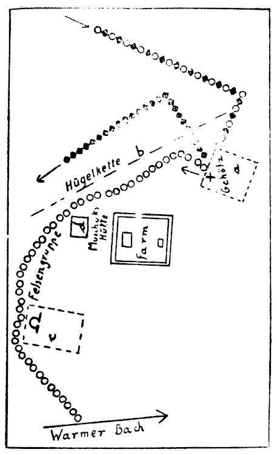

<@pagebreak 3/>

<h1>Old Cracks Geheimnis.</h1>

<h2>1. Kapitel.</h2>

Der einzige Gedanke, der meine Freude an dem Winterbilde
beeinträchtigte, war der, daß in dieser Eis- und Schneewüste,
in diesen ungeheuren Wäldern, Gebirgen und Schluchten
ungezählte Menschen der Gier nach Gold zum Opfer gefallen
sind.

Im übrigen fand ich es neben der schlanken hellbraunen
Tuanatu äußerst behaglich in dem engen Renntierschlitten,
und was diese wilde Rose von Halbindianerin mir in ihrem
unglaublichen Kauderwelsch an indianische Sagen und Märchen
während dieser Spazierfahrt erzählte, hätte ein wundervolles
Buch abgegeben.

Wir waren mittags von der Tanana-Farm aufgebrochen,
wo Harst und ich nun als Gäste Ellen Barkams, der
Pflegetochter des echten Old Crack, weilten, nachdem der
unechte Crack alias Karsten uns so keck entwischt war.
Ich hatte mit Tuanatu gerade diese Mittagszeit gewählt,
weil es bis gegen drei wenigstens leidlich hell war. Freilich,
die Sonne mußte man sich zu diesem Winterbilde hinzudenken.
Im nördlichen Alaska scheint sie im Winter nur
sehr spärlich, und der kurze Bogen, den sie, falls kein
Gewölk vorhanden, über dem Horizont beschreibt, ist zu
gering, um den Sonnenball als Wärmespenderin begrüßen
zu können.

Tuanatu und ihr Großvater Muschuk waren Tlinkit-Indianer.
<@pagebreak/>
Das Mädchen hatte jedoch einen weißen Vater
gehabt, dessen Gebeine dort im Osten irgendwo in den
einstigen Goldminen von Klondyke bleichten. Sie hatte ihn
nie gekannt, und nur Muschuk hatte sie aufgezogen. Vor
zwei Jahren waren die beiden dann nach der Tanana-Farm
gekommen, als der echte Old Crack längst tot war und
sein diabolischer Stellvertreter mit so viel Geschick und
Verschlagenheit hier und in Dawson-City die Rollen als Multimillionär
Samuel Warger und Crack gleichzeitig gespielt
hatte. Aber das wissen meine Leser alles bereits aus den
vorhergehenden beiden Crack-Bänden, ebenso, daß die Renntierfarm
auf einer sehr ausgedehnten Hochebene der Tanana-Berge
lag und fünf sogenannte »Stationen« hatte. Station
bedeutet etwa das gleiche wie Vorwerk.

Tuanatu, mit der ich mich in den letzten wenig ereignisreichen
Tagen stark angefreundet hatte, war ein hübsches
Mädel mit blanken schwarzen Augen und jener natürlichen
Grazie, wie sie vielen Naturkindern eigen ist. Unser Ziel
war die nördlichste Station, mitten im Gebirge gelegen, die
von einem Freunde des alten Muschuk geleitet wurde. Zu
ihr gehörten rund zehntausend Renntiere, die in nahen geschützten
Tälern gehalten und von Eskimohirten bewacht
wurden. Auf unserem Schlitten führten wir auch Gewehrpatronen
und Raubtiergift für diese Hirten mit, denn die
Wölfe waren in der letzten Zeit infolge der starken Kälte
und des reichlichen Schneefalles aus Hunger sehr zudringlich
geworden.

Wir hatten unsere Geschäfte auf der Station dann rasch
erledigt und machten uns gegen zwei Uhr auf den Rückweg.

Einen mit drei Renntieren in Reihe bespannten Schlitten
zu lenken, ist gar nicht so einfach. Wenn das Leittier nicht
tadellos eingefahren ist, gibt es dauernd unliebsamen Aufenthalt.
Tuanatu war nun eine glänzende Fahrerin, und
wir sausten mit einer Geschwindigkeit dahin, die kein Hundeschlitten
<@pagebreak/>
erreicht. Ich war wieder in glänzender Laune, und
die junge Indianerin hatte gleichfalls einige Gläschen Whisky
vertilgt — nebst ungeheuren Mengen Renntierschinken und
Hartzwieback und Butter, die uns der Stationsleiter freundlichst
vorgesetzt hatte.

Freundlich war ja diese ganze Bande von Verwalter
und Hirten und Angestellten. Was aber in Wirklichkeit
von ihnen zu halten, das hatte die Belagerung der Farmgebäude
gezeigt. Harald hatte mich denn auch vor Antritt der
Fahrt ernstlich gewarnt. Gewiß, unser Todfeind Warger-Crack-Karsten
sollte nach Süden, nach Kalifornien, entwichen sein,
aber Harst glaubte nicht daran, und der Detektiv aus dem
großen Alaskahafen Sitka, den die Polizei nach der Farm
geschickt hatte, schien auch anderer Meinung zu sein. Ein
wenig angenehmer Mensch überhaupt, verschlossen und mürrisch
und mit seinem knallroten Vollbart und seiner Schnapsnase
auch äußerlich ein unsympathischer Patron, ganz im
Gegenteil zu Ellen Barkams anderem neuen Gast, einem
Händler aus San Franzisko, der gefrorenes Renntierfleisch
in größeren Mengen einkaufen wollte.

Die Hufe der Renns klapperten lustig, und neben mir
kicherte Tuanatu übermütig und trieb die Tiere durch
Zurufe zu immer größerer Geschwindigkeit an. Wir waren
vielleicht eine Stunde unterwegs und hatten gerade ein
Wäldchen von Balsamkiefern passiert, als wir inmitten
einer Gruppe weit zerstreuter Felsstücke jählings aus unserer
völligen Sorglosigkeit aufgeschreckt wurden. Ein Schuß knallte,
und die Kugel riß mir die Pelzmütze vom Kopf und klatschte
gegen einen nahen Stein.

Im Nu hatte ich nach der Remingtonbüchse gegriffen
und mich seitwärts aus dem Schlitten in den Schnee rollen
lassen. Zu meinem Glück. Denn es folgten noch zwei weitere
Schüsse, die ebenso tadellos gezielt waren. Daß die Kugeln
fehlgingen, lag lediglich an dem allzu schlechten Licht und
<@pagebreak/>
an einem Schneeloch, in das ich wie ein Hase, der sich
überschlägt, hinabpurzelte. Immerhin hatte der zweite Schuß
die linke Schulter gestreift.

Ich kroch in der Vertiefung eilends zum nächsten Felsen,
benutzte diesen als Deckung und spähte nach dem meuchlerischen
Schützen aus. Schließlich erkletterte ich den Steinblock
und sah so in weiter Entfernung nach Westen zu einen
Hundeschlitten mit einer einzigen Person darin entfliehen.
Den Mann zu erkennen war unmöglich.

Tuanatu hatte unseren Schlitten sehr bald zum
Stehen gebracht. Ganz aufgeregt kam sie nun angelaufen und
wollte mir durchaus die Schramme, die reichlich blutete,
verbinden. Ich dankte, und nach zwanzig Minuten sahen wir
die Hütten der Hirten und die beiden hohen quadratischen
Felsen vor uns, auf denen sich die eigentlichen Farmgebäude
erhoben.

Tuanatu hielt am Fuße der Treppe, die zu dem großen
Felsen emporführte. Hier stand Mr. Blox, der Detektiv
aus Sitka, und nickte nur, als ich ihm mein Abenteuer
erzählte …

»Da sind sie noch gut weggekommen,« sagte er grinsend.
»Ihr Freund hat eine Pille in den Oberschenkel erhalten,
als er vor einer Stunde drüben im Walde die Wolfsfallen
nachsah. Ich habe ja immer schon angedeutet, daß
die Schufte hier den Verbrecher Warger irgendwo verbergen
…«

Nichts hatte er angedeutet.

Ich rannte die Treppe empor, zwischen den Blockhäusern
hindurch und über die Brücke zum Südfelsen, zu Old Cracks
Wohnhaus. Wir logierten in dem Zimmer gleich rechts
vom Flur. Als ich eintrat, hatte Tom Warger gerade
Haralds Verband erneuert.

»Keine Sorge,« meinte Harst von seinem Bett her und
drückte mir die Hand. »Ein glatter Fleischschuß, nichts weiter.«

<@pagebreak/>
Tom bestätigte dies.

Tom Warger war Ellen Barkams Verlobter und Samuel
Wargers alias Cracks alias Karstens Stiefsohn und ein
netter Junge. Für die Morde und die sonstigen, Scheußlichkeiten
seines Stiefvaters war er nicht verantwortlich. Die
Aufdeckung der Wahrheit hatte ihn zunächst völlig niedergeschmettert.
Daher hatte auch Ellen darauf bestanden, daß
er uns zur Tanana-Farm zurückbegleite. Sie fürchtete wohl
für seinen Gemütszustand, und dies mit Recht. Auch jetzt war
Tom nachts nicht über die traurigen Aufregungen hinweggekommen,
obwohl er sich auch innerlich von seinem Stiefvater
vollständig losgesagt hatte.

Was Harald erzählte, war nur in einem Punkte wichtig:
Auch sein heimtückischer Gegner war mit einem Hundeschlitten
entflohen.

Der Zeit nach war es sehr gut möglich, daß derselbe
Mann uns zu beseitigen versucht hatte. Wir beschlossen,
sofort die Spur aufzunehmen, bevor noch Schneefall eintrat.
Harald drang darauf, daß wir ihn in einen Renntierschlitten
brachten. Er wollte unbedingt dabei sein. So fuhren
denn gegen fünf Uhr, als es bereits dunkel war, vier
Schlitten vor der Treppe des großen Felsens vor. Teilnehmer
waren Mr. Ephraim Blox, der »rote« Detektiv aus Sitka,
Mr. Edward Pelterson, der Händler aus Frisko, wir beide
und der alte Tlinkit Muschuk als geübter Fährtensucher.

Pelterson war ein Mann in den besten Jahren mit
einem blonden Spitzbart, einem gemütlichen Vollmondgesicht
mit Hängebacken und einem ganz unmodernen, stets
schief sitzenden Kneifer mit Seidenschnur. Er war witzig,
vergnügt, ein harmloser Genießer, dabei sicherlich ein geriebener
Geschäftsmann. Mit Blox hatte er nur eins gemeinsam:
Eine merkwürdig piepsende Stimme, eine Folge schwerer
Erkältungen genau wie bei Blox, denn beide hatten eben
ihr Arbeitsfeld in den unwirtlichen Gebieten Alaskas.

<@pagebreak/>
Muschuk, der Tlinkit, stank.

Stinken tun ja alle diese Nordländer, denen das Baden
als Unfug gilt und die den Körper zum Schutz gegen
Kälte und Ungeziefer ausgerechnet mit dem Darmfett der
berüchtigten Skunks einreiben. Muschuk roch man schon
auf zehn Schritt. In seiner Nähe es auszuhalten, kostete
Überwindung.

Er war dazu bucklig, unglaublich schmutzig im Gesicht,
das graue Haar hing ihm bis auf die Schultern und
ersetzte einen Pelzkragen. Seit seiner Jugend Pelzjäger, waren
ihm Wald und Tundra und Berge Heimat. Sie hatten keine
Geheimnisse für ihn. Jede Spur schätzte er nach Art und
Alter richtig ein. Er benutzte einen alten doppelläufigen
Vorderlader. Von modernen Gewehren hielt er nichts. Er
hatte ein tiefes sonores Organ. Viele Worte waren nicht
seine Sache. Obwohl über siebzig, funkelten ihm unter grauen
borstigen Brauen ein Paar unruhige, halb zugekniffene
Adleraugen.

Wir hatten vier große Karbidlaternen mitgenommen,
die vollauf genügten. Zunächst ging’s nach dem Gehölz, in
dem die Wolfsfallen standen. Harald zeigte die Stelle, wo
er angeschossen worden war und wo der Schütze gestanden
hatte, dessen Hundeschlittenspur auch ein Ungeübter bequem
hätte verfolgen können.

Diese Spur führte tatsächlich nach Norden. Der Schlitten
war mit fünf Hunden bespannt gewesen und hatte erst
wieder dort halt gemacht, wo ich den Kugeln durch einen
glücklicher Zufall entgangen war. Es stimmte also: Es
war derselbe Mann gewesen. — Nun nach Westen weiter auf
klarer Fährte, eine volle Stunde, bis in die Berge hinein,
bis zur Quelle des Turma-Flusses, des berühmten warmen
Flusses mit seinen nie zufrierenden Wassern und rauschenden
Katarakten. Hier mußten wir umkehren. Der Mann hatte
ein Fellboot zur Verfügung gehabt und war damit samt
<@pagebreak/>
Schlitten und Hunden entwichen. Jede weitere Verfolgung war
zwecklos.

Um acht Uhr abends waren wir wieder »daheim«.
Harald lag in seinem Bett, und Stuart Pelterson und ich
leisteten ihm Gesellschaft. Wir besprachen das Geschehene, und
der smarte Yankee mit den Pausbacken erklärte ehrlich,
er würde seine Geschäfte hier nun nach Möglichkeit beschleunigen,
denn so gern er auch Austern äße — gegen bleierne
Austern habe er ein Vorurteil. »Mit Miß Barkam ist nur,
schlecht verhandeln … Man sollte nicht glauben, wie hartnäckig
sie auf ihrem ersten Preise besteht, dabei ist doch
mein Angebot von acht Dollar für das ausgeschlachtete
Renn sehr anständig. Sie verlangt neun, das sind bei fünftausend
Stück eine nette Differenz …«

Der gute Pelterson lebte nur von Zahlen.

Harst hatte sich etwas aufgerichtet und fragte unvermittelt:

»Wo waren Sie um zwei Uhr nachmittags? Sie hatten
es abgelehnt mich zu begleiten, weil es Ihnen draußen
zu kalt wäre. Und doch sah ich Sie gleich darauf nach
Muschuks Blockhütte wandern, wo Sie mehrmals an die
Tür pochten und dann im Stalle verschwanden.«

Pelterson lächelte verlegen wie ein ertappter Sünder.
»Mr. Harst, die schlanke Tuanatu hat es mir angetan …!
Schraut wollte doch erst mit Muschuk fahren. Ich hoffte die
Kleine allein zu treffen.«

»Sie Schürzenjäger!« drohte ich ihm. »Schämen sollten
Sie sich!! Sie sind verheiratet und …«

»… Vater dreier Rangen,« ergänzte er kläglich. »Der
Geist ist willig zur Treue, aber vor Tuanatus dunklen
Augen wird das Fleisch schwach. — Haben Sie mich denn
beobachtet, Mr. Harst?«

»Zufällig … Vom Rande des Gehölzes aus kann
man Muschuks ferne Hütte mit dem Fernglas recht gut
<@pagebreak/>
erkennen. — Nehmen Sie sich übrigens vor dem Alten
in acht. Der hütet seine Enkelin wie seinen Augapfel. Ellen
erzählte mir, daß er schon ein paar Verehrer windelweich
geprügelt hat.«

Pelterson kratzte sich wie ein Affe den Rücken. »Mich
juckt schon der Buckel … — Übrigens — es stimmt, vor
Muschuk muß man sich hüten. Er hat wirklich den braunen
Bär heute mittag erlegt, hinter dem er seit Tagen her
war. Sein Hundeschlitten schaffte die Last kaum, als er so
gegen drei mit der Beute heimkehrte.«

»Sie haben wohl in Muschuks Stall nach Tuanatu
gesucht?!« scherzte Harald gutgelaunt. »Ja ja — Alter schützt
vor Torheit nicht, und Muschuk haut eine kräftige Handschrift!!«

Pelterson winkte ab. »Lassen wir die Sache ruhen …!
Ich werde Tuanatu streichen … — Gute Nacht …«

<h2>2. Kapitel.</h2>

Er war ein Humorist. So wie er mit den Äuglein
zwinkern konnte, unter denen freilich schon die dicken Hautwülste
als Mahnzeichen des nahenden Alters lagerten, versteht’s
nur einer, ein ganz Großer der Bühne, »unser Guido«,
wie die Berliner sagen: Guido Thielscher, der Unverwüstliche,
der Ewig-Junge! — Als ich diesen Vergleich Harald
gegenüber äußerte, meinte er nach längerer Pause: »Thielscher
würde sich bedanken, denn du unterschätzt den Mann — nach
der negativen Seite hin!«

Wir konnten hier in unserem Zimmer getrost frei und
offen miteinander reden, denn einen Horcher brauchten wir
<@pagebreak/>
nicht zu fürchten. Der Leser wird hoffentlich noch aus dem
vorigen Band die Skizze der Farmgebäude zur Hand haben.
Wir bewohnten, wie schon erwähnt, in Old Cracks Haus
auf dem südlichen kleineren, schroffen Felswürfel das Zimmer
gleich rechts vom Flur. Das Fenster lag nach Norden zu,
also nach dem Nordfelsen und der Brücke hin. Außerdem
stand uns Cracks benachbartes Arbeitszimmer zur Verfügung.
Jenseits des Flurs wohnte Ellen Barkam. Das Haus hatte
nur einen Eingang von der Seite der Verbindungsbrücke
her, und die Haustür war auf Harsts Rat vorgestern mit
einer Glocke versehen worden, die beim Öffnen der Tür
sehr laut anschlug und die sich von draußen nicht ausschalten
ließ. All dies ist wichtig. Noch wichtiger, daß sich in unserem
Schlafzimmer in den Dielen die Falltür befand, durch die
man über zwei Treppen in die große, meilenweite Höhle
hinabgelangte, deren anderer Ausgang in das sogenannte
warme Tal mündete. In dieser Höhle war der echte Old
Crack vor fünf Jahren in aller Stille begraben worden,
als Karsten-Warger mit Wissen des alten Dieners Charlie
Maxson »Old Crack« zu spielen begann, eine Rolle, die er
sicherlich noch weiterhin so glänzend durchgeführt hätte,
wenn er nicht durch Harst entlarvt worden wäre.

Harsts Bemerkung über Pelterson machte mich stutzig.
— Nach der negativen Seite hin?! Das konnte doch nur
heißen, daß er dem Händler mißtraute. Ich überlegte mir
die Ereignisse nochmals und fragte dann: »Was tat Stuart
Pelterson im Stall des alten Muschuk?«

Harald hatte sich inzwischen eine Zigarette angeraucht.
»Er holte fünf Hunde heraus, spannte sie vor einen Schlitten
und fuhr davon.«

»Wohin?«

»Nach Südost, wo die Hochebene durch die Hügelkette
gleichsam zerschnitten wird.«

Ich beugte mich vor. »Diese Hügel reichen ja bis zu
<@pagebreak/>
dem Wäldchen, in dem die Wolfs- und Fuchsfallen stehen.«

»Allerdings. Und da Stuart Pelterson bisher noch nie
mit der Tanana-Farm Geschäfte gemacht hat und niemand
ihn hier kannte, als er plötzlich mit einem gemieteten Eskimoschlitten
von Dawson-City hier erschien und den Schlitten
sofort zurückschickte, wird man ihm einige Aufmerksamkeit
widmen müssen. Ich habe dies bereits getan. Pelterson war
jedenfalls in der Nähe, als der Mann auf mich schoß, und
auch Ephraim Blox weiß dies, denn auch er war mit
einem Hundeschlitten in der kritischen Zeit unterwegs. Ich
wette, Blox hat an der Stelle, wo ich angeschweißt wurde,
genau dasselbe gesehen wie ich. Gib mir mal ein Stück
Papier, ich will dir eine Zeichnung entwerfen, du wirst
so leichter eingehen, wie verfänglich die Dinge sind, die
sich heute hier abspielten.«

Diese Skizze sah folgendermaßen aus:

<@pagebreak/>

<@pagebreak/>
Zur Erklärung:

a ist das Gehölz, in dem Harald hinterrücks den Oberschenkelschuß
erhielt.

＋ ist die Stelle, wo er die Kugel empfing und sich
sofort niederwarf.

b ist die oben erwähnte Hügelkette.

c ist die Felsgruppe, in der ich an der Stelle Ω
den drei Kugeln entging.

d ist Muschuks und Tuanatus einsame Hütte.

○○○○○○○○ bezeichnet die Schlittenspur des Schützen, die
vom Gehölz a bis zum Warmen Bach verfolgt wurde.

◆◆◆◆◆◆◆◆ ist eine zweite Schlittenspur (auch fünf
Hunde).

◆○◆○◆○◆○ ist eine dritte Schlittenspur, ebenfalls fünf
Hunde, genau wie die Spur des meuchlerischen Schützen.

— Ich rückte meinen Stuhl dicht an Haralds Bett heran
und hörte aufmerksam zu.

»Mein lieber Alter, als ich urplötzlich die Kugel erhielt
und den Schlag gegen den Oberschenkel, also den Treffer,
verspürte, warf ich mich lang in den Schnee und zwar
hinter einen Baum. Ich richtete mich sofort wieder auf, da
der dicke Stamm mir genügend Deckung bot. Ich wagte
dies auch deshalb, weil es mir so vorgekommen war, als
ob nicht ein Schuß gefallen wäre, sondern zwei fast gleichzeitig.
Nachdem ich dann meine Büchse entsichert hatte
und nichts Verdächtiges mehr entdeckte, begab ich mich trotz
der Schmerzen im Schenkel auf meinen Schneeschuhen zum
Nordrande des Gehölzes und sah hier die Fährte des
Mannes, der mit seinem Schlitten die Spur ○○○○○○○○ 
hervorgerufen hatte. Bitte gib sehr genau auf das, was
ich sage, acht. Diese Spur ○○○○○○○○ hatte eine Eigentümlichkeit,
die dir hoffentlich nicht entgangen ist.«

Ich war ehrlich und erwiderte: »Ich bedauere, ich habe
nichts besonderes gemerkt.«

<@pagebreak/>
»Nun denn, das schadet nichts, ist vielleicht sogar sehr
gut, denn dadurch erhältst du dir dein unbefangenes Urteil.
— Weiter also … Ich sah genau, daß der Mann seinen
Schlitten verlassen hatte und bis unter die Bäume geschlichen
war. Von dort aus feuerte er. Er muß jedoch im Moment,
als er abdrückte, durch irgend etwas in seiner Nähe erschreckt
worden sein. Deshalb traf er auch so schlecht. Und die Ursache
des Schreie kann nur der Anblick oder ein Zeichen
der Nähe des anderen Mannes gewesen sein, der den zweiten
Schuß abfeuerte, jedoch nicht auf mich, sondern wahrscheinlich
auf die Büchse des Mordbuben, der dann in weiten
Sprüngen entwich. Er erreichte seinen Schlitten am Rande
des Gehölzes, jagte davon und lauerte dir in der Felsengruppe
auf. Ich selbst hatte gerade noch Kraft genug, mich
bis dorthin zu schleppen, wo ich den anderen Mann, meinen
Retter, vermutete. So fand ich die ◆◆◆◆◆◆◆◆-Fährte.
Dies war eine Doppelspur, und nur Stuart Pelterson
kann sie mit seinem Schlitten, den er gar nicht verlassen
hatte, hervorgerufen haben. Er hat also aus dem Schlitten
auf meinen Feind geschossen und zwar auf erhebliche Entfernung.
Doppelspur nenne ich eine Hin- und Rückfährte.«

»Stimmt, das sah ich, der ◆◆◆◆◆◆◆◆-Schlitten hatte
dicht vor dem Gehölz gewendet.«

»Ich konnte nicht annehmen,« fuhr Harald fort, »daß
von ein dritter Mann Zeuge des Attentats gewesen. Erst
als wir vorhin mit den Laternen den Schauplatz besuchten,
bemerkte ich noch etwas sehr Wichtiges, eigentlich zweierlei.
Ihr hattet mich in einen Schlitten verladen, und ich fuhr
allein noch weiter nach Südost bis zur Ecke des Gehölzes.
Dort fand ihr die dritte ◆○◆○◆○◆○-Schlittenfährte.«

»Das ist ja gerade so, als ob sich dort in dem Waldstück
gleichzeitig vier Personen ein Stelldichein gegeben
hätten: du und die drei Schlittenlenker!«

<@pagebreak/>
Harald blickte mich an, und in seinen Augen lag es wie
ein Vorwurf, weil ich die Sache so leicht nahm.

»Lieber Alter, die Geschichte ist bitterernst, denn von dem
◆○◆○◆○◆○-Schlitten lief eine merkwürdige Spur die dorthin,
wo der Schlitten des Attentäters gehalten und nachher
gewendet hatte. Diese Spur bestand lediglich aus runden
Löchern im Schnee, die etwa anderthalb Meter auseinanderlagen.
Wenn ich dir nun noch sage, daß Pelterson
diese Löcher mit dem Stiefel verwischte, als wir fünf vorhin
dort im Gehölz waren, so wirst du mein Mißtrauen gegen
ihn begreifen.«

»Allerdings,« nickte ich zerstreut, obwohl im noch nicht
klar die Sachlage überschaute. Ich fragte also:

»Weshalb nimmst du an, daß gerade die ◆◆◆◆◆◆◆◆-Spur
von Pelterson herrührt?«

»Das ist eine der Fragen, die aufs engste mit verschiedenen
anderen zusammenhängt, die ich noch nicht beantworten
möchte. Bilde dir selbst ein Urteil über die Dinge.«

»Sehr schön. Ich will es versuchen. Nur eins: du
mißtraust Pelterson, anderseits meinst du, er habe den
zweiten, dich rettenden Schuß abgefeuert, und die »Lochspuren«
verwischt. Daraus kann ich mir beim besten Willen keinen
Vers machen.«

»Glaube ich gern …«

»Und wer war der Mann in dem ◆○◆○◆○◆○-Schlitten?«

»Ein Verbündeten des Attentäters natürlich, ein Mensch,
mit dem er ganz eng befreundet ist, — noch mehr als das:
Es sind Brüder zumindest, einer ist die Ergänzung des
anderen, es sind völlig gleichwertige Schurken.«

»Also Abgesandte Wargers oder Karstens, was ja dasselbe
ist.«

»Ganz recht, es ist ja ein und dieselbe Person …« —
dazu lächelte Harald sehr eigentümlich.

»Und die »Lochspur«?«

<@pagebreak/>
»Die gibt am meisten zu raten auf. Weshalb verwischte
Peltersons diese Löcher, die doch weder von einem Menschen
noch von einem Tier herrühren können?!«

»Allerdings unverständlich …« — Mein Interesse an
diesen seltsamen Begebenheiten wuchs, zumal ich ja schon
daraus, daß Harald mir die einfache Skizze angefertigt
hatte, erkennen mußte, daß hier recht verzwickte Rätsel zu
lösen waren.

Ich hatte aber noch anderes auf dem Herzen.

»Du sagtest vorhin, Blox sei gleichfalls mit einem Hundeschlitten
unterwegs gewesen und wüßte, daß Pelterson in
der Nähe des Mordbuben weilte. — Woher hast du hiervon
Kenntnis erhalten?«

»Nun, daß der rote Blox gleich nachts dir und Tuanatu
wegfuhr, sah ich. Er lenkte genau nach Süden. Er hat
einem der Hirten erklärt, er wolle mal versuchen den Bär
zu erlegen, auf den der alte Muschuk so wild war. Und
daß Blox von Peltersons Anwesenheit im Gehölz wußte,
merkte ich an seinem Verhalten, als wir mit den Laternen
dort waren. Blox beobachtete den Händler unausgesetzt und
sah auch, daß dieser mit der Stiefelspitze die Lochspur heimlich
tilgte. Es sollte mich wundern, wenn Blox nicht noch
zu uns käme, obwohl er ja bisher aus seiner Abneigung
gegen uns beide als seinen Konkurrenten kein Hehl gemacht
hat — im Gegenteil. Dennoch dürfte er nun …«

Draußen war irgendwo in der Nähe ein Schuß gefallen.

»Geh’ mal nachschauen, mein Alter,« sagte Harst merklich
beunruhigt. »Ich möchte wetten, daß Stuart Pelterson
zumindest verwundet wurde.«

»Durch diesen Schuß?!«

»Ja. Die hübsche Tuanatu hat zahlreiche Verehrer, und
der Aufseher Gollerston, der wie sie ein Halbblut ist, scheint
bei ihr Aussichten zu haben, — also kann ein Eifersuchtsdrama
vorliegen. Beeile dich, sei jedoch vorsichtig.«

<@pagebreak/>

<h2>3. Kapitel.</h2>

Ich trat in den Flur hinaus. Im gleichen Augenblick
ging drüben Ellen Barkams Salontür auf, und im Lichte der
großen Petroleumlampe standen mir Ellen und Tom gegenüber.

»Hörten Sie den Schuß?« fragte Tom erregt. »Es muß
in nächster Nähe gewesen sein. Uns war’s so, als ob wir
einen Schrei vernahmen.«

Tom kam mit. Wir liefen über die Verbindungsbrücke.
Zwischen den drei Gebäuden des Großen Felsens trafen wir
mit Blox zusammen. Er, Tom und Pelterson wohnten im
Verwaltungsgebäude, jeder in einer besonderen Stube. Raum
war übergenug vorhanden.

Blox sagte, Pelterson sei allerdings vor zehn Minuten
ins Freie gegangen. Er wollte sich die Nordlichter ansehen.

Als wir die Treppe hinabeilten, begegneten wir dem
Aufseher Mac Gollerston, der uns zurief, drüben neben
der einen Hürde der Jungtiere liege ein Mensch. Er sei
gerade auf dem Wege dorthin.

Nun, — wir fanden Pelterson in recht übler Verfassung
vor. Die Kugel hatte ihm das linke Auge ausgeschossen, und
die Schläfenwunde blutete derart, daß wir den Bewußtlosen
gar nicht schnell genug in sein Zimmer bringen konnten,
wo Blox ihn kunstgerecht verband. Ihn am Leben zu erhalten,
erschien unmöglich. Der nächste Arzt hätte fünf Tage gebraucht,
um hierher zu gelangen, und die Schwere der
Verletzung machte Laienhilfe vollkommen zwecklos.

In Erinnerung an Haralds Verdacht gegen Mac Gollerston,
den Aufseher, begab ich mich sehr bald wieder mit
<@pagebreak/>
einer Laterne nach draußen zur Hürde und nahm Mac,
völlig harmlos tuend, mit mir.

Er war sichtlich verstört und erregt, und als ich, sehr
schnell einsehend, daß infolge des ringsum stark zertrampelten
Schnees keinerlei einzelne Fährte zu erkennen war, ihn
fragte, wo er sich aufgehalten habe, als der Schuß fiel,
erklärte er stotternd, er sei gerade im Begriff gewesen,
die Abendrunde um die Hürden zu machen.

Jetzt kam auch Blox herbei. Er hatte Macs letzte
Worte noch gehört und fragte streng:

»Mr. Schraut, — ehrlich Spiel, — mißtrauen Sie
diesem Mann?«

Mac Gollerston war ein hübscher Bursche, immer sehr
sauber, immer nett angezogen und einer der wenigen, die
damals, als die Farm von den Hirten und Angestellten
belagert worden war, mit diesen nicht gemeinsame Sache
gemacht hatte.

Ich hielt mit der Wahrheit nicht hinterm Berge. »Harst
meinte gleich, es könnte Pelterson gegolten haben — — der
Schuß! Und dann sei’s vielleicht Mac aus Eifersucht gewesen.«

Mac hatte seine Büchse über der Schulter zu hängen.

Ich nahm sie und roch an der Mündung und prüfte
den Patronenvorrat.

»Nein, aus dieser Waffe ist nicht geschossen worden …
Besitzen Sie noch eine Büchse?«

»Ja …« Mac war derart verwirrt, daß Blox ihn
beim Arm packte. »Los, führen Sie uns in Ihre Stube!«

Mac wohnte mit einem anderen Aufseher zusammen in
einer der Blockhütten neben den Hürden.

In seiner Stube brannte die Petroleumlampe, und in
einer Ecke lehnte eine ganz moderne Repetierbüchse, System
Browning. In Deutschland kennt man nur die Browningpistolen.

<@pagebreak/>
Blox untersuchte die Waffe und brüllte Mac an: »Da
— *der* Geruch sagt genug! Und hier — — frischer Pulverschleim!!
— Ich verhafte Sie!«

Der arme Mac mochte sich in Gedanken schon baumeln
sehen.

»Ich bin unschuldig …« stammelte er …

»So?! Und Sie wollen hinausgegangen sein, um lediglich
den üblichen Rundgang zu machen?!« sagte Blox häßlich.
»Und dann lassen Sie hier die Lampe brennen und
— hier diese Zigarre auf dem Aschbecher ist noch warm!!
Mensch, Sie haben Pelterson draußen zufällig erkannt und
sind schleunigst mit der Browningbüchse hinaus, knallten
ihn nieder und eilten wieder hierher zurück und holten
die andere Waffe und … wollten uns begegnen!! Sehr
schlau!«

Mac Gollerston blieb bei seinen Unschuldsbeteuerungen
und ließ sich ruhig droben im Verwaltungsgebäude in eine
Kammer einsperren und die Hände fesseln. —

Hiermit habe ich sozusagen die groben Züge der Vorgeschichte
erledigt. Ich habe absichtlich ohne jedes schmückende
Beiwerk Tatsachen berichtet. Mein Bestreben ist es auch
diesmal gewesen, den Leser zu eigenem Nachdenken anzuregen.
Ich rate jedem, das zweite Kapitel nochmals zu
lesen und immer wieder die Skizze zu betrachten, auf der
lediglich die Lochspur fehlt. Ich habe im ersten Band der
Old Crack-Abenteuer versprochen, meinen Freunden besondere
Kost zu bieten. Es handelt sich um Kriminalfälle, die sich
niemals in einem kultivierten Lande hätten abspielen können.
Für diese Ereignisse war der große, erhabene Rahmen
der Schneegefilde des winterlichen Alaska nötig. Nur in
dieser Einsamkeit und Weite der Landschaft konnte Harsts
Genie sich betätigen. Der Schnee, der wie ein weißes Blatt
jede Spur wiedergab, bildete einzig und allein das Hilfsmittel,
Mac Gollerston zu überführen. Man klammere sich
<@pagebreak/>
jedoch nicht an den engeren Sinn des Wortes »überführen«.
Das wäre falsch.

Und nun darf ich mit ein wenig mehr dichterischer
Breite das Folgende schildern. Ich weise nur nochmals
darauf hin: In Macs Stube brannte die Lampe, und die
halb aufgerauchte Zigarre war an der Spitze noch warm
und die Stube voller Zigarrenrauch, die Browningbüchse aber
fraglos soeben benutzt worden. Das sind wichtige Einzelheiten.

Nachdem Blox den verhafteten Mac sicher untergebracht
hatte, begaben wir beide uns wieder zu Macs Hütte, wo
wir den Kollegen Macs weckten. Der Mann, ein reinblütiger
Tlinkit-Indianer, schlief wie ein Murmeltier. Der
Fuselduft seines Mundes sagte genug. *Das* Schlafmittel
war probat. Er hatte nichts gehört, nichts, also auch nicht,
ob Mac erst die Hütte verlassen hatte und dann wieder
zurückgekehrt und sofort wieder weggegangen war.

Andere Zeugen konnten wir auch nicht auftreiben. Es
waren draußen achtzehn Grad Kälte, und nur die Wächter
bei den Hürden hatten in ihren Erdlöchern gesteckt und
auf Wölfe aufgepaßt. Keiner der Fährten war jedoch so nahe
der Farm postiert, daß sie etwas hatten sehen können. Im
übrigen sind diese Erdlöcher mit einem Dach versehen und
innen dick mit Moos gepolstert und haben kleine Öfen
für Torffeuerung.

Blox gehörte zu jenen Leuten, die absolut keinen Sinn
für Naturschönheiten haben. Er war ein nüchtern denkender
Beamter, nichts weiter. Daß in dieser Nacht die Nordlichter
besonders farbenprächtig, war ihm völlig gleichgültig.

»Gehen wir zu Muschuks Hütte,« sagte er zu mir,
nachdem wir die Wächter ausgefragt hatten.

»Bei der Kälte!« lehnte ich ab. »Es ist eine gute
halbe Stunde bis dorthin, und was sollen wir dort?«

<@pagebreak/>
Wir standen an der blutgeröteten Stelle, wo Pelterson
das Auge eingebüßt hatte. Ich trat plötzlich auf etwas
Hartes und … hob eine Patronenhülse auf.

»Von einer Browningbüchse, Mr. Blox.«

»Ja,« nickte er gedehnt. »Das ist merkwürdig. Hier kann
Mac den Schuß doch nicht abgefeuert haben?! Wie kommt
die Hülse hierher?« Er roch daran. »Stinkt noch, Mr. Schraut.
Es ist *die* Patrone!«

Er steckte sie ein. »Wenn Sie nicht wollen, gehe ich
allein. Tuanatu muß uns erklären, ob Mac Grund und
Recht zur Eifersucht hatte. Ich zweifele daran zwar nicht,
aber ich brauche noch mehr Beweise.«

»Gut denn, gehen wir.« Ich nahm meine Remingtonbüchse
von der Schulter und hängte sie mir in den Arm.
Blox grinste.

»Sie fürchten sich.«

Ich schwieg.

Wir schritten rasch dahin, und um jeden Umweg zu
sparen, nahmen wir die Richtung über den kleinen See,
der zwischen der Farm und Muschuks Gehöft liegt. Der
Wind hatte das Eis hier stellenweise blank gefegt, und der
schweigsame Blox war halt ein Pechvogel, glitt aus und
schlug hin, wobei ihm zu meinem Erstaunen die Pelzmütze
und sein roter Haarwald vom Schädel flogen — und dieser
Schädel war nicht kahl, sondern mit dunklen Haaren bedeckt.
Zuweilen handelt man halt automatisch. So ich in dem Moment,
als ich diese Entblößung Blox’ bemerkte: Ich markierte
gleichfalls einen Sturz, schrie zur Bekräftigung der
Täuschung sehr laut »Verdammt — — mein Achterteil«
und tat so, als ob ich … nichts gesehen hätte, zumal Blox
mit affenartiger Fixigkeit den roten Skalp und die Mütze
wieder aufgestülpt hatte …

Wir lachten über den Zwischenfall, und die Sache schien
erledigt. Nicht bei mir. Blox’ Person verdiente unbedingt
<@pagebreak/>
ein Fragezeichen. Ich wollte nachher mal mit Harst darüber
reden. Wozu eine Perücke, wenn man eigene Haare hat?! —
Gewiß, Blox hatte bei seinem Eintreffen auf der Farm
seinen Ausweis nebst gestempelter Photographie vorgezeigt.
Aber diese Photographie konnte trotzdem gefälscht sein.

In Muschuks Stallhütte brannte noch Licht. Wir klopften,
und der alte stinkende Indianer öffnete. Er war gerade
dabei, das Bärenfett einzuschmelzen, und die Hütte duftete
wie eine Schmalzsiederei.

»Tuanatu schläft,« brummte der Alte in seinem Kauderwelsch.

»Wecke sie,« befahl Blox. »Halt — — wie denkst du
über Mac, den Aufseher?«

Muschuk rührte im Kessel und knurrte:

»Er ist hinter den Weibern her! Von mir hat er schon
mal Prügel bekommen.«

»Ah so! — Und deine Enkelin?«

»Will nichts von ihm wissen …«

Blox setzte sich auf einen Küchenschemel.

»Wo warst du eigentlich heute mittag, Muschuk? Der
Bär wurde doch zuletzt im Süden in der buschreichen Schlucht
gesehen. Und dort war ich heute. Ich fand auch Fährten
und Blut und eine Stelle, die absichtlich mit Schnee bestreut
war. Aber die Fährten waren mindestens von gestern.«

Der alte Indianer nickte. »Blut von Wolf … Dort
hängt das Fell. Ich fand den Braunen weiter westlich
im Walde in einer Höhle, Mr. Blox.«

Aber Blox gab ich damit nicht zufrieden. Er ärgerte
sich offenbar, weil ihm der Bär entgangen.

»Sage mal, Muschuk,« und er stopfte sich seine Pfeife,
»ich beobachte dich nun des Bären wegen drei Tage. Du
Hast eine eigentümliche Art, deine Jagdfahrten zu maskieren,
anders kann ich das nicht nennen. Wenn du mit deinem
<@pagebreak/>
Hundeschlitten davonfegst, nimmst du stets einen großen dichten
Kiefernast mit.«

»Als Windschutz, Mr. Blox.«

»Du lügst, Muschuk. Du nimmst ihn mit und dazu
noch einen großen Stein, den du oben an den Ast bindest,
den du nachher hinter dem Schlitten schleppen läßt. So
verwischst du deine Fährte, und der lockere Pulverschnee
bedeckt die feinen Kratzer deiner Baumharke sehr bald vollständig,
wenn auch nur ein leises Lüftchen weht.«

Muschuk lächelte unmerklich. »Ich bin Jäger, Mr. Blox.
Meine Fallen würden geplündert werden, falls ich nicht
meine Fährte austilgte. Es gibt hier genug Diebe.«

Blox schaute in den Kessel, in dem das Bärenfett siedete.
Das offene Feuer des Herdes warf zuckende Lichter auf sein
rotbärtiges Gesicht.

»Ich traue dir nicht,« meinte er langsam. »Du hast
Geheimnisse und du bist schlau.«

Muschuk warf neue Fettstücke in den Kessel. Das Fett
zischte, und er erwiderte:

»Jeder hat Geheimnisse. Sie auch, Mr. Blox. Reden
wir nicht davon.« Er blickte Blox scharf aus seinen Adleraugen
an und rührte wieder in dem Kessel herum.

Ephraim Blox hatte den Kopf gesenkt. Es entstand eine
peinliche Pause.

»Jeder Detektiv hat Geheimnisse,« meinte er dann. »Das
liegt in unserem Beruf. — Du warst heute bei dem Wäldchen,
wo Mr. Harst angeschossen wurde.«

Muschuk wandte sich halb um und starrte Blox an. Sein
schmutziges, fetttriefendes Gesicht glänzte auf der einen Seite
rötlich vom Spiel der Herdflammen.

»Ich war nicht dort, oder besser, ich war erst dort,
als die Herren hinfuhren und ich mit.« Er sprach ganz
ruhig. »Soll ich etwa den Schuß abgegeben haben?!«

Blox wußte noch nicht, daß zwei Schüsse gefallen waren.

<@pagebreak/>
»Es war da eine dritte Schlittenspur an der Nordostecke
des Gehölzes, also im ganzen waren außer Harst
drei Leute dort, von denen wir noch keinen kennen.« Blox
sann nach und sog an seiner Pfeife. »Ich kann Fährten
lesen, Muschuk. Von der Farm waren zu der fraglichen
Zeit folgende Personen abwesend: Schraut und deine Enkelin,
dann Harst auf Schneeschuhen, ferner Stuart Pelterson und
du und ich. Harst, Schraut und Tuanatu scheiden aus. Der
Verdacht, am Rande des Wäldchens gewesen zu sein, bleibt
auf Pelterson, dir und mir haften. Harst weiß das alles
vielleicht besser als ich. Gesetzt den Fall, der Verbrecher
Warger-Karsten hätte Harst aufgelauert: Wer waren die
beiden anderen? — *Ich* war nicht dort, leider. Also: du
und Pelterson. Das ist alles sehr einfach. Fremde Schlitten
kommen nicht in Frage. Hier wohnt im Umkreis von zwei
Tagereisen keine Seele.«

Muschuk parierte den eindeutigen Angriff durch die
Antwort: »Ich bin in Sitka gut bekannt, Mr. Blox. Die
Fellhandlung Amiter ist meine Abnehmerin. Es ist seltsam,
daß ich Ihnen nie in Sitka begegnete, obwohl ich dort
auch die Polizei kenne. Ich trinke gern, und ich hatte vor
einem halben Jahr deswegen Ungelegenheiten. Sie sind kein
Detektiv.«

Er hatte plötzlich in die Tasche seiner schmierigen Pelzhosen
gegriffen und hielt Blox eine Coldpistole vor die
Stirn.

»Mr. Schraut, er hat Perücke und falschen Bart, der
Schurke. Nehmen Sie ihm beides ab, damit das gerupfte
Huhn sein wahres Gesicht zeigt. Wenn er sich wehrt, schieße
ich. Auch ich kann Fährten lesen. Er war im Gehölz.
Er ist ein Verbündeter Wargers. Ich mag alt sein, aber
meine Augen sind scharf und mein Geist klar. Er hat auch
Pelterson angeschossen. Es ist Zeit, daß wir ihn unschädlich
machen.«

<@pagebreak/>
Ich brauchte nicht lange zu überlegen. Ich nahm Blox,
der merkwürdig bleich geworden, Mütze, Perücke und Bart
ab, und was so zum Vorschein kam, war ein Mensch
von höchstens dreißig Jahren.

»Fesseln Sie ihn, Mr. Schraut, und dann durchsuchen
Sie ihn.«

Blox wollte aufspringen. Ich hatte schon zugepackt, und
des alten Indianers grimme Miene warnte dieses fragwürdige
Subjekt. Merkwürdigerweise blieb er bei alledem
recht bescheiden, wehrte sich gar nicht und meinte nur:
»Geben Sie sich keine Mühe zu erfahren, wer ich bin. Ich
heiße nicht Blox. Mein Ausweis ist gefälscht. Trotzdem bin
ich ein anständiger Kerl, das werden Sie schon einsehen,
Mr. Schraut. Was mich hierher geführt hat, ist meine
Sache. Mit Warger-Karsten habe ich nichts zu schaffen.«

Seine Taschen enthielten nichts, wodurch ich über seine
Persönlichkeit Aufschluß erhalten hätte. Auch sein Gepäck,
das nachher durchsucht wurde, verriet nichts.

Muschuk sagte mit seiner unvergleichlicher Ruhe: »Sie
könnten ein wenig auf den Kessel achtgeben, Mr. Schraut.
Ich spanne einen Schlitten an, und Sie fahren mit Blox
zur Farm zurück.«

Er ging hinaus. Blox mit seinen gefesselten Händen
horchte nach der Tür hin. Als die schwere Haustür ebenfalls
zufiel, meinte er leise:

»Hüten Sie sich, Mr. Schraut. Warger ist bestimmt
in der Nähe. Ich gebe Ihnen mein Wort, daß ich kein
Schurke bin. Die Dinge hier stehen ernster als Sie vielleicht
glauben.«

Seine Züge waren durchaus nicht unsympathisch. Als
Detektiv hatte er eine bestimmte Rolle gespielt. Jetzt gab
er sich anders.

»Steckt etwa Muschuk mit Warger zusammen?« fragte
ich und schob frisches Holz unter den Kessel.

<@pagebreak/>
»Das möchte ich nicht behaupten,« erwiderte er achselzuckend.
»Ich bin nicht geübt im Kombinieren, obwohl ich
übergenug Lebenserfahrungen besitze, auch genug juristische
Kenntnisse. Tragen Sie alles, was hier neu geschehen, Ihrem
Freunde Harst vor. Ich verehre ihn.« 

Wir hörten draußen im Stall die Hunde kläffen. Muschuk
hatte eine Meute von sechzehn Prachttieren und dazu eine
eigene Herde von etwa hundert Renns. Sein Grundstück
hatte er von Crack gepachtet, und es war so groß wie ein
deutsches mittleres Landgut und erstreckte sich nach Osten
zu bis an die Randberge der ungeheuren Hochebene.

Dann kam der Indianer zurück, und Blox marschierte
von selbst hinaus. Es war ein langer Schlitten mit acht
Hunden. Ich verstand immerhin schon so viel vom Lenken,
daß ich ohne Sorge die Fahrt antrat. Muschuk sagte mir
noch, ich solle nachher den Schlitten einfach den Hunden
überlassen, die würden ihn schon allein zurückbringen. Er
riet mir auch, links um den See zu biegen, da dieser
einige warme Quellen und daher ganz dünne Eisstellen habe.

Wir fuhren davon. Blox sagte nach einigen Minuten:
»Lenken Sie rechts um den See herum, Mr. Schraut.
Muschuk riet links, daher besser rechts.«

Ich befolgte den Wink, obwohl mir unklar war, was
mir zustoßen könnte. Es schneite leicht, und das trübe Halbdunkel
ließ einen sicheren Schuß gar nicht zu. Ich legte
die Büchse über die Knie und riß den Leithund kurz vor
dem See scharf nach rechts. Das Gespann gehorchte, und wir
sausten parallel zum Seeufer nach Westen.

Mit einem Male rief Blox:

»Ein Schlitten hinter uns!! Rasch, machen Sie mir die
Hände frei … Ich werde schießen, falls nötig.«

Ich drehte den Kopf. Auch ich erblickte den Schlitten.
Er kam näher. Es war ein kleiner schmaler Schlitten, und
ich zählte sechs Hunde. Der Mann darin war natürlich
<@pagebreak/>
nicht zu erkennen, schien aber einen dunklen Vollbart zu
haben.

Eine innere Stimme sagte mir, daß ich Blox trauen
dürfte. Ich nahm ihm die Fesseln ab, und er griff sofort
nach seiner Büchse und setzte sich rittlings hin, um den
Verfolger bequemer beobachten zu können.

Plötzlich knallte ein Schuß, und Blox schrie leise auf.

»Das war nur ein Büschel Haare,« sagte er und feuerte
nun seinerseits.

»Gut so,« lachte er. »Der eine Hund ist getroffen. Der
Kerl steigt aus. Wenden Sie … Wir fangen ihn …
Ehe er den Hund abschneidet, sind wir über ihm!«

<h2>4. Kapitel.</h2>

Im Bogen ging’s zurück. Blox wollte gerade von neuem
feuern, als links ein zweiter Schlitten erschien und eine
zweite Kugel uns warnte. Fast gleichzeitig drückte auch der
erste Gegner ab, und unser Leithund überkugelte sich mit
grellem Aufheulen, wurde noch ein Stück mitgeschleift, und
unser Schlitten stand.

»In den Schnee!« brüllte Blox.

Ich warf mich zur Seite, und die beiden nächsten
Kugeln fegten über uns hinweg.

Blox lag im Schnee und zielte bedächtig. Aber zum
Schuß kam er nicht mehr. Der Schnee fiel dichter, und die
beiden Gegner jagten davon. Ihren toten oder verwundeten
Hund nahmen sie mit. Blox schnitt unseren armen Köter, der
bereits verendet war, rasch vom Hauptseil ab und meinte:

»Zurück zu Muschuk!!«

<@pagebreak/>
In zehn Minuten hielten wir vor der Haustür. Der
alte Tlinkit stand in seiner Küche und goß gerade das Fett
in steinerne Töpfe. Er schaute uns überrascht an und sagte
ruhig:

»Ich riet Ihnen links zu fahren. Ich weiß seit drei
Tagen, daß sich hier zwei unbekannte Schlitten umhertreiben.
Mir haben die Kerle immer rechts vom See in den
Büschen aufgelauert. Ich rede nicht gern darüber. Es sind
sicherlich Kerle von der Farm, die es noch immer mit
Warger halten.«

Ich schaute auf seine Pelzstiefel. Sie waren trocken.
Er konnte keiner der beiden Schlittenfahrer gewesen sein.

Blox’ Benehmen setzte mich noch mehr als bisher in
Staunen. »Ich werde in den Stall gehen und die Schlitten
und die Hunde besichtigen. Ihr Blick auf die Stiefel des
Alten genügt mir nicht, Mr. Schraut.« Er sprach mit einem
Male perfekt französisch, und Muschuk hatte davon keine
Ahnung, schon sein Englisch war mehr ein Gemisch von
Eskimo-, Indianer- und vulgären englischen Worten.

Als Blox draußen war, gab der alte Tlinkit mir einen
Schnaps: Alkohol mit Wacholderbeeren und Honig, ein
Getränk, das in Alaska sehr beliebt ist und Schumk genannt
wird, was aus der Eskimosprache stammt und so viel
wie »Schlag« bedeutet. In der Tat ist ein Schumk ein
Schlag für jede Kehle. Man hustet und krächzt und im
Magen brennt’s wie Feuer.

»Mr. Schraut,« sagte der alte Mann und trug seine
Fettöpfe in eine Ecke, »nun haben Sie einem Menschen die
Freiheit zurückgegeben, der ihr Vertrauen täuschen wird.
Mir ist es ja gleichgültig, denn was gehen mich all diese
Geschichten an?! Nichts! Wenn man mich hier ärgert, wandere
ich nach Osten mitten in die Berge und baue mir ein anderes
Heim. Die Einsamkeit stört mich nicht. Ich kam nur meiner
Enkelin wegen her, damit sie Schreiben und Lesen lernte.
<@pagebreak/>
Sie ist heute siebzehn Jahre und sehr klug. Ich bin stolz
auf sie. Sie wäscht sich jeden dritten Tag und ist eine
Lady.«

Muschuk hatte sehr bescheidene Begriffe von einer Lady.
Wie mochte er dann erst Miß Ellen Barkam einschätzen,
die doch in Wahrheit junge Dame war. — Seine Äußerungen
über Blox klangen in keiner Weise feindselig. Er tat sie
überhaupt wohl nur, weil er eben Blox für einen Schurken
hielt. War er in dieser Beziehung hellsichtiger als ich?!
Im Grunde war’s ja von mir ein Leichtsinn, Blox sich
selbst zu überlassen. Was wußte ich von ihm?! Nichts!

Muschuk meinte, er wolle doch lieber auch in den Stall
gehen. Dabei zwinkerte er mir zu. Ich fühlte die Ironie,
und da erst fiel mir ein, daß Blox sehr leicht mit dem
Schlitten, den wir vor der Tür gelassen, hatte fliehen
können.

»Du meinst, er ist gar nicht mehr da, Muschuk?« rief
ich und griff nach meiner Büchse.

»Er wäre sonst ein Narr,« sagte der Alte nur.

Blox war kein Narr. Er war auf und davon.

Es schneite heftiger. In diesem Flockentanz war jede
Spur nach wenigen Minuten zugedeckt.

»Ich werde Sie nach der Farm bringen,« erklärte der
Indianer mit einem unmerklichen Kichern. »Aber den Schlitten
und die Hunde müssen Sie mir bezahlen, Mr. Schraut.
Sagen wir zwanzig Dollar.«

Wir kehrten in die Küche zurück. Ich war sehr niedergeschlagen,
denn ich hatte schwere Fehler gemacht, und was
Harst dazu sagen würde, wußte ich. Er würde mich schweigend
ansehen. Die Art Blicke kannte ich.

Als ich dem Alten das Geld gab, erschien meine kleine
Freundin Tuanatu völlig verschlafen in einer Art Morgenrock
aus echtem Silberfuchs, der hinten nachschleppte und
gut seine zweitausend Dollar wert war. Sie trug Pantöffelchen
<@pagebreak/>
und rauchte natürlich eine Zigarette. Ohne Zigarette
war sie undenkbar. Sie war sehr verwundert, mich hier
zu sehen, drückte mir lachend die Hand und meinte, sie
freue sich sehr, denn sie könne doch nicht schlafen. Es drohe
bestimmt ein Unheil, fügte sie ernster hinzu und setzte
sich auf einen Hauklotz und schielte zu Muschuk empor. »Du
weißt, Großvater, meine Ahnungen trügen niemals.«

Der Alte nickte. »In meiner Familie waren viele Männer
Owatnik, Mr. Schraut, — Zauberer nennen Sie das …«

Dann ging er und machte einen Schlitten fertig.

Tuanatu sagte ganz leise: »Was ist geschehen, Mister
Schraut …?«

Ich erzählte. Sie hatte den Kopf in die Hand gestützt
und wippte mit der Fußspitze gedankenverloren den
Takt zu meinen Worten. Als ich erwähnte, Blox hätte
so getan, als ob er Verdacht gegen ihren Großvater hegte,
verzog sich ihr Gesicht wie im Krampf und ein Haß loderte
in ihren Augen auf, der mich schier verwirrte. — »Was
hat Blox Ihnen getan, Tuanatu?« fragte ich bestürzt. »Ich
denke, nur Stuart Pelterson war zudringlich und vielleicht
unverschämt.«

Sie lachte hart. »Blox?!« Sie warf die Zigarette auf
den Lehmboden und meinte: »Seien Sie vorsichtig, Mister
Schraut. Meine Ahnungen trügen nie.« Muschuk trat ein.
»Und was der Großvater von den beiden fremden Schlitten
sprach,« fügte sie hinzu, »das stimmt schon. Er verbot mir
darüber zu reden. Er hat ja auch recht … Was geht
uns dies alles an?!« 

Ich hatte mir das Wichtigste aufgespart.

»Mac Gollerston hat auf Pelterson geschossen, Tuanatu,
und nun sitzt er gefesselt im Verwaltungsgebäude.«

Es machte auch dies keinerlei Eindruck auf sie. Sie
hob nur die Schultern.

»Mac ist ein Narr. Alle Männer sind Narren. Wenn
<@pagebreak/>
Weiber weiße Zähne, blanke Augen und ein junges Gesicht
haben, verlieren sie den Verstand.«

Muschuk zog seinen Pelzrock an und langte nach seiner
Flinte.

»Brechen wir auf …!«

Das Mädchen erhob sich. »Laß mich den Herrn zur
Farm zurückbringen, Großvater. Ich muß frische Luft schöpfen.
Du hast das ganze Haus mit dem Bärenfett verpestet.
Öffne meine Fenster und lege Kohlen in den Ofen.«

Muschuk sagte nur: »Du bleibst. Höre den Sturm …
Der Schnee fällt wie die Federn der Eidergänse im Frühjahr
…« — Er machte dazu eine Handbewegung, die
wie eine drohende Geiste war. Tuanatu gab mir die Hand.
»Gute Nacht also … Kommen Sie gut heim und lassen Sie
sich vom Sturm nicht aus dem Schlitten wehen, halten
Sie sich ordentlich fest, Mr. Schraut.«

Es war alles sehr eigentümlich hier, und ich setzte
mich ein wenig besorgt in den Schlitten hinter Muschuk.

<h2>5. Kapitel.</h2>

Es war ein tolles Wetter. Nicht die Hand vor den
Augen zu sehen. Der Wind trieb den lockeren Schnee
hoch, und wo sich Wirbel bildeten, glitt der Schlitten
geradezu wie durch eine feste, eisige Wand hindurch. Im
Nu war ich völlig weiß, meine Brille half mir nichts, ich
steckte sie in die Innentasche und schloß die Augen. Wir
fuhren mit dem Sturm im Rücken, und die Hunde rasten
wie toll. Zuweilen streiften Zweige mein Gesicht, dann wieder
<@pagebreak/>
gab es einen bösen Rumpler, und ich flog fast hinaus. —
»Festhalten!« brüllte Muschuk.

Welche Richtung er wählte, war nicht zu erkennen.
Mit Unbehagen dachte ich an die Wolfsgruben, die streckenweise
angelegt waren und jeden Tag nachgesehen wurden.
Diese Gedanken waren begründet, denn das schauerliche
langgezogene Heulen der hungrigen Bestien erklang von
allen Seiten.

Wir waren noch keine fünf Minuten unterwegs, als
der Schlitten gegen einen hohen Baumstumpf raste. Die
Hunde waren noch rechtzeitig ausgewichen, und der Schlitten
erhielt den Stoß von der Seite, ich selbst schlug mit dem
Kopf gegen den knorrigen Stamm, das Bewußtsein schwand
mir für Sekunden, und als ich wieder zu mir kam, lag ich
in einer der fünf Meter tiefen Gruben, — ein Wunder,
daß ich mich nicht auf den Eisenspitzen unten am Boden
aufgespießt hatte. Ich war weich gefallen, unter mir regte
sich etwas, ich vernahm ein Stöhnen und dann fragte eine
ersterbende Stimme:

»Wer sind Sie?«

Ich war so verblüfft, daß ich nur aufschrie:

»Blox — — Sie?!«

»Ah — — Schraut …! Der Zufall spielt seltsam …
Auch ich bin hier hineingeraten, und der Teufel mag wissen,
wo mein Schlitten geblieben ist.«

»Sind Sie verletzt?«

»Nein, nur halb erfroren. Ich hatte schon mein Testament
gemacht. Meine Versuche hinauszuklettern blieben
umsonst, die Wände sind glatt wie Holz, und Steigelöcher
auszukratzen war unmöglich.«

Wir sahen nichts voneinander. Vorsichtig setzte ich mich
neben Blox. »Weshalb flohen Sie?«

»Aus bestimmten Gründen wollte ich zuerst die Farm
<@pagebreak/>
erreichen. Wenn ich hätte fliehen wollen, wäre ich wohl
nicht nach Süden gefahren. Wir müssen hier ja ganz dicht
bei den ersten Hürden sein. Ich … — still, — — es sind
Wölfe oben am Rande der Grube … Haben Sie noch
Ihre Büchse?«

»Ich weiß nicht … Ich werde mal umhertasten …«

Ich rutschte vorwärts. »Ah, hier ist sie … Und Sie,
Blox?«

»Ich habe die meine ebenfalls.«

Das Röcheln und Knurren der Bestien droben wurde
noch lauter. Es mußte ein ganzes Rudel sein.

Blox sagte kaltblütig:

»Hier können wir nicht bleiben. Vielleicht findet Muschuk
uns nicht, bei dem Unwetter wär’s kein Wunder. Ich werde
aufstehen, Sie klettern mir auf die Schulter und knallen
erst mal zwischen die Bestien, es wird schon helfen.«

»Machen wir’s umgekehrt. Ohne Brille bin ich blind,
und der Schnee stiebt bis hier herein …«

Blox war im Nu auf meinen Schultern. Er schoß
fünfmal, und eins der Tiere polterte kopfüber zu uns
herab.

Dann geschah etwas sehr Merkwürdiges. Blox brüllte
auf, der Druck seiner Pelzstiefel auf meinen Schultern ließ
nach, und als ich nach oben fühlte, war Blox nicht mehr da.

Ich rief …

Nichts … Totenstille …

Rief nochmals …

Totenstille …

Da ging mir ein Licht auf: Der Schuft hatte mich abermals
betrogen, hatte sich emporgeschwungen, und ich war
verloren. Wie sollte ich wohl aus dieser Wolfsgrube heraus,
wenn es dem um einen Kopf größeren Blox nicht gelungen
war?!

Aber die Wut gegen den Schurken packte mich mit
<@pagebreak/>
solcher Macht, daß ich nach einer Weile, als ich oben am
Rande die Wölfe abermals knurren hörte, auf einen verzweifelten
Gedanken kam. Ich machte den Riemen der Büchse
unten los und befestigte das freie Riemenende an meinem
Pelzrock. Nach einigen Versuchen gelang es mir wirklich,
mit dem rechten Fuß auf der Mündung der an die Wandung
gelehnten Büchse Halt zu finden und oben eine Baumwurzel
zu packen. Gerade über mir leuchteten die Augen
eines Wolfes wie grüngelbe Funken. Ich gab mir einen
Schwung, bekam den Kopf der Bestie zu packen und hielt mich
krampfhaft fest. Der Wolf zerrte rückwärts, und ich rutschte
etwas über den Grubenrand hinweg, arbeitete mich noch
höher und kniete auf festem Boden, riß die Büchse hoch,
und … vor mir eine Stimme — — ein Schuß — —
noch einer … Schattenhaft huschten die Wölfe davon.
Der arme Kerl, der mich herausgezogen, heulte kläglich und
schleifte das Hinterteil nach und verschwand ebenfalls. In
den Schleiern der Flocken tauchte Muschuk auf.

»Mr. Schraut, — — endlich!! Endlich!! Die verdammten
Hunde sind mit dem Schlitten auf und davon. Auch ich
rollte in den Schnee, verlor die Richtung und irrte im
Kreise, ich glaubte schon, Sie hätten sich an dem Baum
den Schädel eingeschlagen.«

Er setzte mir seine Buddel an den Mund. Es war der
berüchtigte Wacholderschnaps, und ich fühlte Feuer im
Magen und lachte ganz vergnügt und klopfte dem Alten
auf die Schulter.

Muschuk war durchaus sachlich wie immer. »Ich werde
die Wölfe abhäuten, um die Felle ist es schade, nach ein
paar Minuten wären die Bestien eingeschneit. Helfen Sie
mir, Mr. Schraut.«

Eigentlich war das ja eine starke Zumutung. Aber
ein Pelzjäger kennt eben nur eins: Sein blutiges Geschäft!

Im ganzen waren vier Wölfe von Blox und Muschuk
<@pagebreak/>
erlegt worden. Der alte Indianer besaß eine fabelhafte
Fertigkeit darin, den Tieren den Rock abzustreifen. So lange
die Kadaver warm sind, geht es ja auch am schnellsten.

Muschuk fragte beiläufig auch nach Blox, über den ich
bisher nur ein paar scharfe Bemerkungen gemacht hatte.

»Schuft bleibt Schuft!« meinte er. »Doch er wird in
diesem Schneegestöber nicht weit kommen. Morgen liegt er
irgendwo erfroren … Mag er!«

Wir waren mit der eklen Arbeit fertig, und der Alte
marschierte als Führer voraus. Es dauerte eine halbe
Stunde, bis wir seine Blockhütte fanden. Vor dem Stall
lagen zwei Schlitten und ein Knäuel Hunde, die schon
völlig vom Schnee bedeckt waren. Es waren Blox’ Schlitten
und der, den wir benutzt hatten. Ich ging ins Haus,
während Muschuk Schlitten und Hunde in den Stall brachte.
In der Küche saß Tuanatu noch in derselben Haltung wie
vorhin auf dem Hauklotz, den Kopf in die Hand gestützt,
ins Herdfeuer starrend. Sie drehte sich nicht um, sondern
sagte nur mit einem tiefen Seufzer:

»Gib mich frei … Ich mache nicht mehr mit …
Ich ersticke hier … Ich hasse dich!!«

Ich stand wie angewurzelt.

Sie glaubte, Muschuk sei eingetreten. Ihm galten diese
rätselhaften Worte.

»Kind, ich bin’s!«

Sie fuhr hoch.

»Ah — — ich bin so froh …! — Sagen Sie selbst,
Mr. Schraut, kann man es in diesem Gestank aushalten?!
Es gibt Augenblicke, wo ich den Großvater wirklich zu
hassen glaube! Ist das ein Leben!! Er ist so schmutzig, und
ich sehne mich nach Sauberkeit …«

Plötzlich begann sie zu weinen und ging weinend
hinüber in ihre Stube. — 

