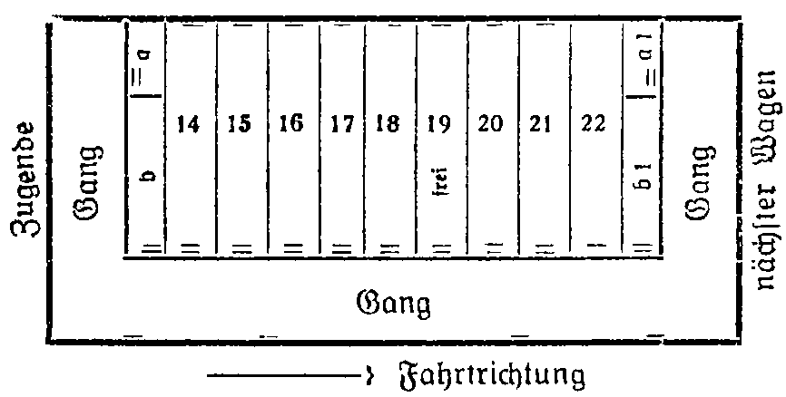

<@pagebreak 3/>

<h2>1. Kapitel.</h2>

<h3>Der letzte Wagen.</h3>

Die Bezeichnung Kapuziner ist bekannt und berühmt.
Die Kapuziner sind ein Zweig des großen Franziskanerordens
und haben unter allen Mönchsorden die strengsten
Vorschriften. Die Kapuzinerpredigt aus »Wallensteins Lager«
ist berühmt. Bekannt sind die Kapuzineräffchen, die zu der
Familie der Rollschwanzaffen gehören. Weniger angenehm
ist das Kapuzinerpulver, das aus Sabadill, weißem Nießwurz,
Petersiliensamen und Anis hergestellt wird und gegen
Kopfläuse (pardon) in die Haare gestreut wird. Ich hoffe,
keiner meiner Leser wird es benötigen.

Mr. Kapu Ziner hat mit alledem nichts zu tun. Leider.
Denn …

Aber das wird der Leser sehr bald merken.

Wir lebten als Gäste Oberinspektor Grablays in
Bombay wie Raffkes, wir drei. Unser Abenteuer mit Percy
Rutterfield war längst vergessen, wenigstens die peinlichen
Seiten. An die erfreulichen wurden wir jeden Tag erinnert,
denn die reizende Maitu San, Rutterfields Witwe, war
auf inständiges Bitten der Dame Grazia de la Rocka in
deren palastartige Villa übergesiedelt, und die beiden Frauen,
obwohl sie denselben Mann liebten, hatten sich bald sehr
<@pagebreak/>
eng einander angeschlossen und waren zusammen mit James
Berger, Maitu Sans nunmehr heimlich Verlobtem, häufige
Gäste in Grablays Bungalow auf den Osthängen der Malabar
Hills. Erstaunlich war, wie vornehm Grazia de la Rocka
sich mit der Tatsache, James Berger endgültig verloren zu
haben, abgefunden hatte.

Doch Lückes Urlaub nahte seinem Ende, und es war
verständlich, daß der patente Hans von Indien noch mehr
kennen lernen wollte als nur Baroda, ein paar Küstennester
am Golf von Cambay und die große, wundervolle
Inselstadt, die auch auf »bay« ausläuft, vorn aber mit
»Bom« beginnt.

Wir beschlossen also einen Abstecher nach Allahabad
zu machen, Benares und einige Nachbarstädte zu besuchen
und Anfang Dezember wieder in Bombay zu sein, dann
würde Lücke gerade noch zu Weihnachten daheim in Berlin
eintreffen — und wir auch. Harald wollte seine betagte
Mutter das Christfest nicht allein verleben lassen. Grablay
schnitt zu diesen Plänen freilich ein sehr langes Gesicht,
und nur Donna Grazia und Maitu San waren begeistert,
— weil sie uns nämlich begleiten wollten, da James Berger
ohnedies in Benares geschäftlich zu tun hatte.

Die Personen, die in der Geschichte des Kapu Ziner
eine Rolle spielen, habe ich jetzt bis auf drei bereits erwähnt.
Es fehlen der Hauptakteur, unser Boy Sifu und
der Miko. Der Leser soll das gesamte Ensemble im Laufe
meines Berichts über die eigenartigen Vorgänge, die sich um
Mr. Kapu Ziner wie Giftpflanzen rankten, noch kennen
lernen — mit allen Eigentümlichkeiten, Schwächen, Stärken
und … Gemeinheiten. —

Ein richtiggehender Kriminalroman beginnt auf etwa
Seite 6 bis 10 mit dem nachher aufzuklärenden »Problem«.
Der Held ist der Detektiv mit Sportmütze, Pfeife, Zigarette
… und so …

<@pagebreak/>
Mein Bericht beginnt auf Seite 3 mit dem großen Geheimnis.

Wir hatten im Kalkutta-Expreß drei Kabinen nebeneinander
belegt. Die Wagen mit ihren vorzüglichen Lüftungsanlagen
sind das bequemste, das man den Reisenden bieten
kann. Grablay war mit Konfekt, Blumen und allerhand sonstigen
Aufmerksamkeiten für die beiden Damen auf dem
Bahnhof erschienen, — wir traten die Fahrt in glänzender
Stimmung um 8 Uhr 10 abends an.

Die Kabinen lagen so, wie die Skizze es zeigt. Der
Wagen hatte, was ich schon auf dem Reisebureau gemerkt
hatte, die ominöse Zahl 131326: Zweimal dreizehn gleich 26!!

Die Doppelstriche bezeichnen die Türen, die einfachen
Striche die Fenster. Wir hatten Kabinen 20, 21, 22. In b&nbsp;1,
dem Schaffnerabteil, war Sifu untergebracht, in b die eingeborene
Zofe Donna Grazias.

Kabine 20 gehörte den Damen, in 21 hausten Harst und
ich, in 22 Lücke und James Berger. Nr. 19 war frei. 17 und
18 hatte ein alter kranker Herr belegt, der mit seiner Pflegerin
reiste, ein Kaufmann aus Benares, hörte ich von Sifu,
<@pagebreak/>
der überall schnell Bekanntschaften schloß. In 14, 15, 16
lärmte eine Gesellschaft amerikanischer Neureicher: Vater,
Mutter, Sohn, Schwiegertochter und zwei halbwüchsige
Töchter. Sie hatten einen Kofferempfänger mit und ließen
den Lautsprecher bis nach zehn bei geöffneten Türen spielen.

Als wir das Festland erreicht hatten, kam der Schaffner
und machte die Betten zurecht. Wir standen im Gange und
unterhielten uns in bester Stimmung über allerlei Nichtigkeiten.
Das Liebespaar Maitu San und Berger hielten
sich etwas abseits, und der hübschen Japanerin glückliche
Augen strahlten mit dem inzwischen erschienenen Vollmond
um die Wette.

Die Landschaft, die der Zug durcheilte, war hügelig und
zeigte weite Dschungelflächen. Erst in Manmad, wo die Südlinie
nach Haidarabad abzweigt, hält der Zug zum ersten
Male. — Gegen elf zogen die Damen sich in ihre Kabine
zurück, wir Herren machten es uns bequem, ließen die Verbindungstür
zwischen 21 und 22 offen (in der Skizze nicht
vermerkt), rauchten und tranken zwei Flaschen dunklen Kaschmir-Weines,
der ebenso blumig wie schwer war. Dann legten
wir uns nieder, ich mit einem Band Wallace, denn ohne
Lektüre kann ich nicht einschlafen. Aber die Geschichte von
der gefiederten Schlange enttäuschte mich arg, in der Sache
war kein rechter Schwung, ich drehte das Licht aus und
wälzte mich mit dem Gesicht nach der Wand hin. Ich hatte
das untere Bett und trotz meiner der freien Bettkante
abgekehrten Lage sah ich mit einem Male im Dämmerschein
des Nachttisches zwei Beine in weiten, violett-seidenen Pyjamahosen
herabtaumeln, und Harst stand mitten in der
schmalen Kabine.

Ich drehte den Kopf …

»Was gibt’s?!«

Er beugte sich über mich. »Ich hörte etwas, mein Alter.
Es klang wie ein Schrei …«

Er horchte.

<@pagebreak/>
»… Es kann der letzte Schmerzensschrei eines vom
Zuge überfahrenen Tieres gewesen sein, ich weiß es nicht.
Der Wagen rattert stark, und ich begreife auch nicht, woher
dieses dumpfe Dröhnen zuweilen kommt, es klingt …«

Er schwieg, jemand hatte nicht allzuleise an die Tür
gepocht. Als Harst öffnete, nicht ohne vorher die Pistole
aus dem Kleidernetz genommen zu haben, stand draußen
im halbdunklen Gang die Pflegerin des alten Herrn aus
Nr. 18.

Es war ein verblühtes Mädchen mit scharfen, harten
Zügen, und jenem eingefrorenen Dulderlächeln, das so vielen
gewerbsmäßigen Krankenschwestern eigen ist. Sie hatte einen
hellen Gummimantel übergeworfen, ihr leicht ergrautes Haar
steckte noch unter einer Netzhaube, und ihre bebenden Lippen
vermochten kaum das hervorzustammeln, was sie furchtbar
erschreckt hatte, als sie noch am Lager ihres halbgelähmten
Pfleglings saß. Auch sie hatte einen Schrei gehört, aber
ganz deutlich, und sie schwor darauf, daß er aus der Nebenkabine
gekommen sei.

»Die ist unbelegt,« sagte Harst und fügte einige beruhigende
Worte hinzu.

»Dann war’s die Kabine Ihrer Damen, Mr. Harst,«
beharrte sie verängstigt auf ihrer Behauptung. »Auch mein
Dienstherr vernahm den Schrei …«

»Woher kennen Sie meinen Namen, Miß?« wollte er,
erstaunt über ihre Anrede, weniger freundlichen Tones wissen.

»Ihr chinesischen Boy Sifu sprach mit mir … — Es
muß etwas geschehen sein, Mr. Harst, so schreit kein Mensch
im Traum, das war der Schrei einer Frau in höchster Todesangst
…«

Sie blickte nach links, nach Kabine 20 hin und gab uns
auf diese Weise nochmals zu verstehen, daß sie fürchte,
von dort sei der Schrei erklungen.

Harald trat in den Gang und klopfte bei unseren Damen
wiederholt an.

<@pagebreak/>
In demselben Moment hörten wir das Kreischen der
Notbremse, der Zug verlangsamte sein Tempo und stand
mit einem schrillen Aufkreischen der Bremsen still. Gleichzeitig
öffnete sich die Tür des Schlafwagenabteils Nr. 20
und Maitu San, die einen Kimono übergeworfen hatte,
fiel Harst halb bewußtlos in die Arme. Ihr Gesicht war
aschgrau und verzerrt, die Augen blickten wie die einer Irrsinnigen
stier ins Leere, und das Einzige, das sie mühsam
hervorbringen konnte, war ein kaum verständliches:
»Grazia — — tot …!!« — dann verlor sie vollends das
Bewußtsein.

Harst trug sie schnell in unsere Kabine, wo Berger sich
dann um sie bemühte, während Lücke, inzwischen gleichfalls
zur Stelle, zusammen mit dem Schaffner und dem Zugführer
die neugierigen Fahrgäste zurückhielt und den Wagen
— es war der letzte des Zuges, abschloß.

Kabine 20 war leer. Das Fenster war zwei Handbreit
offen, aber der Rollvorhang geschlossen. Grazia de la Rocka
war verschwunden.

In der Kabine bemerkten wir nichts Auffälliges. Die
beiden Betten der Damen — Maitu San hatte das obere
innegehabt — waren nicht einmal besonders zerwühlt. Nirgends
eine Spur von Blut, nirgends auch nur der geringste
Anhaltspunkt dafür, was sich hier abgespielt haben mußte.
Die Japanerin als Zeugin der Vorgänge war sehr bald
wieder zu sich gekommen, konnte jedoch keinerlei Angaben
machen, sondern weinte nur wimmernd vor sich hin und
achtete selbst auf Bergers eindringliche Fragen nicht. In
ihren Augen blieb dieser erschütternde Ausdruck wahnsinnigen
Entsetzens. Sie mußte Furchtbares gesehen haben, denn
wir kannten sie ja: Ihre Nerven besaßen eine außerordentliche
Widerstandsfähigkeit, und um sie in einen derartigen
Zustand zu versetzen, gehörten schon Ereignisse gräßlichster
Art.

Der ganze Zug wurde dann durchsucht, ebenso wurde
<@pagebreak/>
die Bahnstrecke zweitausend Meter zurück von hilfsbereiten
einwandfreien Fahrgästen unter Lückes Leitung abgeschritten.
Es war fast taghell, der Mond stand hoch, und — — man
fand nichts — nichts!

Harst bestand darauf, daß unser Wagen auf das Nebengeleise
einer Zuckerfabrik geschoben und abgehängt würde.
Bergers Einfluß war es zu danken — er war weit über
Bombay hinaus bekannt —, daß auch sämtliche Fahrgäste
sich legitimierten und persönlich in eine Liste eintragen mußten.
Die Insassen der Kabinen 17, 18 und 14, 15, 16 wurden
anderswo untergebracht. Die amerikanischen Neureichs
schimpften und benahmen sich geradezu pöbelhaft, und der
alte kranke Herr aus Benares war auch nicht gerade sehr
liebenswürdig, als er sein Bett verlassen und seine Beobachtungen
— ebenso seine Pflegerin — zu Protokoll
geben mußte.

Nach einem Aufenthalt von einer halben Stunde dampfte
der Zug ohne uns davon.

Während Lücke nun den Fabrikbesitzer heraustrommelte,
um nach Bombay an Grablay zu telephonieren (im Tale
hinter der Zuckerfabrik lag eine ausgedehnte Ortschaft, sie
hieß Jalnaroa), — während Berger bei der hilflosen Maitu
San blieb, gingen wir beide nochmals die Geleise entlang,
da Harald inzwischen berechnet hatte, daß der Schrei zumindest
dreitausend Meter vor der Fabrik ertönt sein müsse.

»Was hältst du von der Sache?« fragte ich nach einer
Weile, da Harald absolut stumm neben mir her schritt und die
Augen überall hatte.

Wir gaben sehr scharf auf die Umgebung acht. Wir
hatten eine Karbidlaterne mit, die wir im Schaffnerabteil
entdeckt hatten, und uns wäre kaum ein Blutfleck oder sonst
etwas entgangen.

Harst erwiderte, ohne die Zigarette aus dem Munde zu
nehmen: »Bevor wir nicht Maitu Sans Aussage haben,
läßt sich überhaupt keine Ansicht äußern. Maitu Sans Nerven
<@pagebreak/>
müssen in den letzten Tagen sehr gelitten haben, obwohl
dazu kein Grund vorlag. Den Tod ihres Mannes,
der sich auf der Jacht »Lady Hamilton« erschoß und ins
Meer stürzte, nahm sie mit echt japanischem Gleichmut
hin — mehr als das! Wenn er auch schändlich an ihr gehandelt
hatte, Sie war erstaunlich beherrscht damals. Und
heute?!«

»Du meinst doch nicht, daß sie …«

»… sie schauspielerte, — ja, das meine ich, lieber
Alter, und der Seidenschal, den sie um den Hals geschlungen
hatte, gefiel mir auch nicht. Ich fürchte, wenn
der Schal abgenommen wird, werden wir etwas Belastendes
zu sehen bekommen.«

»Was?!«

»Ich denke Würgemale …«

Ich blieb stehen. »Du glaubst, daß Maitu San selbst …«
— nein, der Gedanke war denn doch zu absurd.

»Ich glaube, daß das da vor uns unser Sifu ist. Der
Bengel muß natürlich wieder auf eigene Faust sich betätigen.«

Sifu saß am Abhang neben den Geleisen. Die Bahnstrecke
führte hier durch einen Einschnitt, und oben auf den Rändern
der Anhöhen waren Zäune zu erkennen, hinter denen
Kühe und Ziegen neugierig die Köpfe nach der grellen
Karbidlaterne ausreckten.

Sifu, in sauberem Khaki-Anzug mit versilberten Knöpfen,
auf die er besonders stolz war, erhob sich aus dem Grase,
und sagte mit pfiffigem Grinsen in seinem altklugen Jungengesicht:
»Ich habe nichts angerührt, Missu Harst … Dort
liegt Maitu Sans japanischer Dolch: in dem kleinen Gestrüpp,
und fünfzig Meter weiter zurück ist eine kleine langgezogene
Blutspur zwischen den Geleisen zu sehen.«

»Das freut mich aufrichtig,« nickte Harst plötzlich sehr
lebhaft. »Der Dolch genügt … Aber das Blut möchte
ich mir ansehen.«

<@pagebreak/>
Weshalb ihn etwas erfreuen konnte, das doch nur
einen Beweis gegen Maitu San darstellte, begriff ich nicht
recht.

<h2>2. Kapitel.</h2>
<h3>Der erste Verdacht.</h3>

Sifu, unser Chinesenboy, hatte früher vollkommen unter
Percy Rutterfields Einfluß gestanden. (Wenn ich hier immer
nur von Maitu San spreche, müßte ich genauer hinzufügen:
verwitwete Rutterfield.) Sifu war kein Unschuldsengel. Er
hatte eine etwas wilde Vergangenheit, deren Schleier man
besser nicht lüftete. Harald war in seiner Gutmütigkeit nach
den Vorfällen auf der Pestdschunke für meinen Geschmack
doch etwas zu weit gegangen, als er Sifu wieder in Gnaden
aufnahm. Ich traute dem Bengel nicht. Er hatte Gaunern,
Piraten und Mordgesellen gedient, er hatte in Baroda den
Spion gespielt (der Leser kennt das »Konsortium« noch),
— und nun hatte er eigenmächtig wie stets hier zuerst
eine Waffe gefunden, deren schwache Blutspuren das
Schlimmste für Donna Grazia fürchten ließen.

Harst wickelte den Dolch vorsichtig in eine Zeitung ein,
kennzeichnete die Stelle, wo er gelegen hatte, und schritt
weiter.

Die Blutflecken auf dem Sande zwischen den Schienen
waren bereits recht undeutlich geworden, nur auf einigen
Schottersteinen fanden wir frische Spritzer. Harst bedeckte diese
Steine mit einem weiteren Zeitungsblatt und befahl Sifu,
an dieser Stelle zu wachen.

Dann suchten wir nach Fährten neben den Geleisen.
In diesem Einschnitt stand das Gras an den flachen Abhängen
<@pagebreak/>
ziemlich hoch, und, falls jemand hier aus dem Zuge
gesprungen oder ein Körper hinausgeworfen worden wäre,
hätte man das unbedingt sehen müssen. Es waren keinerlei
Spuren vorhanden. Das Gras war nirgends niedergedrückt.

Wir schritten noch langsamer die Strecke zurück, indem
wir nun jeder an einer Seite des Bahnkörpers uns hielten.
Auch diese Nachsuche war umsonst. Als wir uns der Fabrik,
einem rohen unschönen Ziegelbau, neben dem das Haus
für die Angestellten und den Besitzer mitten im Busch lag,
näherten und den auf dem Fabrikgeleise stehenden Schlafwagen
erkennen konnten, wurde gerade Maitu San auf
einer als Krankenbahre hergerichteten Leiter in das Haus
getragen. Nebenher gingen Donna Grazias eingeborene Dienerin
und der völlig geknickte James Berger, der in seiner
heißen Liebe zu der Japanerin für uns als unparteiischer
Helfer ausschied. Neben dem Wagen saß Hans Lücke auf
einem Prellbock, schlenkerte, wie es seine Gewohnheit war,
mit den Beinen und putzte umständlich sein Monokel.
Er hatte bereits seinen Tropenanzug an und hatte, um den
Hosenboden zu schonen, auf den Prellbock sein seidenes
Taschentuch gelegt. Er steckte sein zweites Taschentuch in
die äußere Brusttasche, klemmte seinen unvermeidlichen Scherben
ein und meinte trocken: »Eure Gesichter besagen nichts.
Ihr habt Grazia nicht gefunden. Grablay ist bereits mit
dem Auto hierher unterwegs und läßt grüßen. — Im
Grunde war diese Katastrophe vorauszusehen. Es war Unnatur,
daß zwei Frauen, die denselben Mann lieben und von
denen die eine großmütig verzichtet, sich angefreundet haben
sollten. Das östliche Temperament, immer klug verhüllt,
hat sich, fürchte ich, entladen. — Was haben Sie da in
der Zeitung, Harst?«

»Maitu Sans blutigen Dolch … Sie kennen ja die
Waffe. Berger schenkte sie Maitu San, und ob die liebliche
Japanerin den Dolch unter dem Kopfkissen liegen hatte,
<@pagebreak/>
wird schwer festzustellen sein. Ihre Koffer waren jedenfalls
verschlossen.«

Lücke nickte. »Stimmt … Ich war in Nr. 20 … Eine
ganz eigentümliche Geschichte. Der Wagen ist übrigens ein
älteres Modell und nur umgebaut, sogar sehr.«

Harst blickte ihn forschend an. »Sie haben etwas gefunden?«

»Dafür bin ich Berliner Kriminalkommissar, und man
sagt, daß außer Alarich Gepp im Roten Alex nur noch
eine exzellente Kraft neben all den guten vorhanden ist …
Den Namen will ich aus angeborener Bescheidenheit nicht
nennen. — Ich sagte mir, daß der Täter oder die Täterin
die Kabine weder durch das Fenster noch die Tür samt dem
Opfer verlassen haben könnte. Die Tür war von innen verriegelt
…«

Harst fiel ihm ins Wort. »Und das ist mit am wichtigsten,
Lücke.«

»Hm — ein Fehler ist’s, nichts weiter. Auch das Fenster
hätte herabgelassen werden müssen … Ich habe bereits
nach Manmad, wo der Zug in einer Stunde eintreffen dürfte,
ebenfalls telephoniert und gebeten, *unter* den Wagen zu
suchen. Ich denke, man wird die arme Grazia im Gestänge
eines Waggonunterbaues finden. Maitu Sans Schlafanzug,
über den sie den Kimono geworfen hatte, ist zerrissen und
zeigt Ölflecke. Die Japanerin treibt Sport, hat Muskeln
zum Beneiden und …«

Harst unterbrach ihn wiederum. »Ich verstehe … Sie
meinen, sie hat den Körper unter das Gestänge des nächsten
Wagens getragen. — Mein lieber Lücke, *das* Kunststück
sollen Sie mir bei einem Zuge mit siebzig Kilometer Geschwindigkeit
vormachen. Ich brächte das nicht fertig. Im
Gange sind keine Blutspuren, und …«

»Kommt mit!«

Lücke ging voran. Wir betraten den Wagen, vor dem
jetzt ein Polizist aus Jalnaroa, dem nahen Städtchen, Wache
<@pagebreak/>
hielt. In respektvoller Entfernung standen eine Gruppe Inder
und starrten uns neugierig an.

Lücke hob in Kabine 20 den Plüschläuferbelag des Bodens
auf. »Da — die Nägel sind entfernt …!« sagte er nur.

Unter dem Läuferstoff lag noch ein Belag von Cota, ein
dem Linoleum ähnliches Fabrikat, nur weicher, dicker und
schalldämpfender. Die Streifen des Cota waren genau zu
erkennen. In dem mittleren Streifen vor den Betten sah
man zwei breitere Schnitte. — Lücke hob das Stück heraus
und legte den Holzboden frei. Auch dieser zeigte vier
Schnitte, noch ganz frisch. Es war mit einer Stichsäge eine
Art Falltür hergestellt worden. Als Lücke sie hochklappte,
sahen wir im Laternenschein einen Teil des Fahrgestells
und auf einer eisernen Stange vier Bluttropfen, die verwischt
waren. Außerdem fehlte auf dieser Stange sowie
benachbarten Eisenbalken zum Teil der Staub.

Harst kletterte durch das Loch und nahm die Laterne mit.
Er entschwand unseren Blicken, wir blieben im Halbdunkel
zurück, bis plötzlich in der Kabinentür Mr. Nat Jester mit
einer Petroleumleuchte auftauchte und sich uns würdevoll
vorstellte:

»Nathanael Jester, Polizeichef von Jalnaroa.«

Mr. Jester hatte zweifellos eine vorzügliche Köchin.
Er war klein und dick und rosig-braun und hatte vergnügte
Schweinsäuglein in dem zur Zeit bartstoppeligen Rundgesicht.
Daß er ein Eurasier, ein Mischling, war, sahen wir
zunächst nicht.

Jester hatte unter den linken Arm eine Aktenmappe geklemmt
und hielt in der Linken außerdem noch Tintenfaß
und Federhalter.

»Ich muß ein Protokoll aufnehmen,« erklärte er sehr höflich.
»Wo ist die Tote?«

Jesters Anzug und Frisur verrieten, daß er eiligst sein
Bett verlassen hatte. Er war ohne Hut. Sein Haar war schwarz
<@pagebreak/>
und leicht gelockt. Seine Nase schimmerte verdächtig nach
Reisschnaps.

»Die Tote ist zur Zeit noch abwesend,« erklärte Lücke
dem ländlichen Kollegen.

Jester bewunderte die Falltür im Boden. »Ist das in allen
Schlafwagenabteilungen so?« fragte er erstaunt.

»Für gewöhnlich nicht, Mr. Jester.«

Der Dicke lächelte unmerklich! Ich gewann den Eindruck,
daß er sich über Lückes offensichtlich recht geringfügige Bewertung
seiner Person insgeheim belustigte.

»Also ein vorbereiteter Mord, meine Herren,« sagte er
schlicht. »Man wird in Bombay nachforschen müssen, wer
an diesen Wagen herankonnte. Die Falltür kann doch erst
hergerichtet worden sein, nachdem Sie Ihre Kabinen zugewiesen
oder bestellt hatten. Die Sägeschnitte sind ganz frisch.«

Dumm war dieser Jester entschieden nicht.

»Da haben Sie recht …« — Harst stand im Gang und
streckte Jester die Hand hin. »Ich denke, wir werden gut mit
einander auskommen, Mr. Jester.«

Jester stellte das Tintenfaß auf das Fenstertischchen, legte
Mappe und Federhalter daneben und drückte Haralds Hand.
»Ich weiß, wer Sie sind, meine Herren, — Mr. Berger erzählte
es mir. Es wird mir eine Ehre sein, und wenn ich
mir gestatten darf, Sie zu mir einzuladen …«

»Sehr liebenswürdig …«

Lücke fragte ungeduldig: »Fanden Sie etwas, Harst?«

»Ja. Die Beweise, daß Donna Grazia nicht bis zum nächsten
Wagen geschleppt wurde. Der Staub liegt überall gleichmäßig
auf den Teilen des Unterbaus. Gewiß könnte ein
Mann von besonderer Kraft und Gewandtheit einen leblosen
Körper über die Eisenteile und Puffer bis zum folgenden
Wagen mit sich nehmen, aber niemals wäre das
der Person möglich gewesen, an die Sie denken, lieber Lücke.«

»Dann stehe ich vor einem Rätsel!«

Nathanael Jester blickte Lücke daraufhin verwundert an.

<@pagebreak/>
»Das Rätsel ist doch zur Hälfte gelöst, und die andere Hälfte
— nun, Frau Maitu San-Rutterfield hat sich bereits zu
einer Aussage bequemt. Ich habe protokolliert …«

Das schien ihm das Wichtigste zu sein: Schwarz auf
Weiß, Tinte, Feder, Papier.

Er langte nach seiner Aktentasche.

»Ich kenne meine Pflichten, meine Herren … Oberinspektor
Grablay hat mir schon lange einen Posten in
Bombay angeboten … — Darf ich vorlesen, — vielleicht
leuchten Sie mir, Mr. Harst … — So … — Frau Maitu
San, verwitwete Rutterfield, 23 Jahre alt, ansässig in Goa,
zur Zeit auf Reisen, sagt aus. — »Ich erwachte über einen
Hilferuf, den Frau Grazia de Rocka ausstieß. Ich sah einen
Mann mit einer Maske, in einem schwarzen Anzug, der
Frau Grazia mit der Linken am Halse würgte und sie mit
meinem Dolche erstach. Es war nur die Nachtbeleuchtung
eingeschaltet, und ich kann daher über den Täter nichts
weiter angeben, zumal ich vor Entsetzen die Augen schloß
und wieder in die Kissen zurücksank. Als Mr. Harst an der
Tür klopfte, mußte ich erst meine Kräfte sammeln, um mein
Bett verlassen zu können. — Weiter kann ich nichts angeben.«
— Folgt die Unterschrift, Ort, Datum und Zeit.
— Das ist sehr wenig, meine Herren, finde ich,« — und der
kleine Dicke schob den Bogen wieder in seine Mappe zurück.
»So wenig,« fügte ich seufzend hinzu, »daß ich ernsthafte
Zweifel an der Selbständigkeit der Aussage hege. Insbesondere
behauptete Frau Maitu San auf nochmaliges Befragen, daß
sie nicht wüßte, wie der Dolch, ihr Eigentum, aus dem
Koffer …« — er hüstelte — »hm, aus dem Koffer in die
Hände des Mörders gelangt sein kann … Hm — und
es war fast dunkel in der Kabine, meine Herren, und ausgerechnet
hat die Dame als einzige Zeugin den Dolch erkannt,
sonst nichts …«

Er schaute durch die Falltür auf den Sand und Schotter
zwischen den Geleisen. »Es ist vieles hier sehr merkwürdig,
<@pagebreak/>
vieles … Ich bin ja nur ein kleiner Polizeichef in einem
Nest von knapp dreitausend farbigen Seelen, und ich habe
mich zumeist nur mit Ziegenzucht und ein paar harmlosen
Diebereien beschäftigt, ausgenommen den einen Fall, der
mich mit Oberinspektor Grablay näher in Berührung brachte.
Trotzdem bin ich in der einschlägigen Literatur, Kriminalwissenschaften,
leidlich bewandert, ich habe alle bedeutenderen
Werke in meiner Bibliothek, und …«

»… haben Sie Erbarmen mit uns und schweifen Sie
nicht ab,« sagte Lücke etwas gereizt.

»Frau Maitu San trägt einen Schal,« fuhr Jester unbeirrt
fort. »Der englische Schriftsteller und Generalstaatsanwalt
Sir Humsty, erwähnt auf Seite 28 — es kann auch
58 sein — einen Fall, in dem die Täterin im Kampfe mit
ihrem Opfer Kratzwunden an der Hand erhielt und nur
Handschuhe trug …«

Harst meinte ernst: »Mr. Jester, reden wir nicht um den
Kernpunkt der Sache herum. Sie halten Maitu San für die
Mörderin, weil sie am Halse blaue Flecken hat …«

»Nein, nicht Flecken, Kratzer und Flecken. — Donna
Grazia soll sehr lange spitze lackierte Nägel geliebt haben,
obwohl Nagellack als unfeiner Ersatz für wahre Nagelpflege
gilt. — Ich werde warten, bis Mr. Grablay eintrifft.«

»Womit?« fragte Harst sehr gedehnt.

»Mit der Verhaftung, Mr. Harst. — Nun will auch ich
mir das Wagengestell ansehen, aber ich mache es mit bequemer,
diese Falltür ist etwas eng, es müßte ein sehr
schlanker Mörder gewesen sein, der hier hindurchkam. —
Ob Frau Maitu San Beziehungen zu Eisenbahnwagenwäschern
in Bombay hat?!«

Er verlangte keine Antwort, verließ den Wagen und
kroch unten überall mit seiner Petroleumlampe herum, was
ihm nicht ganz leicht wurde.

»Hier ist jemand entlang geschlüpft,« rief er uns keuchend
zu und zwängte sich über den ehemaligen Gasbehälter des
<@pagebreak/>
Wagens hinweg, den man noch nicht abmontiert hatte, obwohl
die Beleuchtung jetzt elektrisch war. »Nur hier die eine
Stange unter der Falltür, — das ist Blut, mithin ist die
Leiche doch hinabgeworfen worden.«

»Schwätzer!« murmelte Lücke …

Harst sagte leise: »Unterschätzen Sie ihn nicht … Theoretiker
wie er finden sich zuweilen überraschend schnell in die
Praxis hinein …«

Schnaufend stand Nat Jester vor uns.

»Sie haben doch die Geleise weit genug abgesucht, Mr.
Harst?«

»Ich habe den Dolch hier in der Tasche, und an der fraglichen
Stelle sitzt mein Boy bei den blutbespritzten Steinen
als Posten. Es sind von hier etwa zweitausenddreihundert
Meter, Mr. Jester.«

»Geben Sie mir den Dolch,« bat Jester höflich. »Ich
werde ihn in Verwahrung nehmen …«

»Gern, — bitte … — Und nun gehen wir am besten
zu Frau Maitu San, denke ich. Ich möchte ihr zwei Fragen
vorlegen.«

Der dicke Nat erklärte, er wolle besser noch hier bleiben.

»… Ich finde, man sieht immer am meisten, wenn man
allein ist, und den Schauplatz eines Verbrechens sollte man
studieren wie eine Chiffreschrift.« Er lächelte bescheiden und
kletterte in den Wagen hinein. Harst sagte, als wir davongingen:
»Chiffreschriften sind zuweilen auch unsichtbar oder
so schwach zu erkennen, daß schon Jesters Laterne dazu nötig
ist — oder nicht,« eine Bemerkung, die wenig Sinn zu haben
schien, genau wie die folgende, die Harst nach etwa hundert
Schritten tat, indem er sich umdrehte: »Die Ladebaracke der
Fabrik liegt dem Wagen am nächsten … Da, Mr. Jester
läßt die Neugierigen verjagen … — Ob dies sein Auto
ist?!« Auf dem Wege von dem Anschlußgeleise zum Wohnhause
der Fabrik stand ein uralter Klapperkasten, so ein hochräderiges
Ding, wie es vielleicht vor fünfzehn Jahren schon
<@pagebreak/>
als Alteisen für einen Spottpreis zu haben war. Es war
ein viersitziger offener Wagen mit einem Verdeck Patent
Jester, denn die dazu benutzte brüchige Segelleinwand trug
noch verwaschen die Inschrift in Riesenbuchstaben:

N. Jesters Ziegenzucht.

Vielleicht hatte die Leinwand einmal als Reklameplakat
gedient. Nat züchtete ja Ziegen, und man roch es, wenn
man ihm nahekam. Er roch bockig. Im übrigen war das Auto
giftgrün mit Ölfarbe gestrichen, nur die Kühlhaube war
knallrot. Mir taten die Augen weh.

<h2>3. Kapitel.</h2>
<h3>Die Pistole.</h3>

Im Erdgeschoß des auf der Waldlichtung erbauten Hauses
waren alle Fenster hell. Um das Haus zogen sich Beete,
die einen Garten vortäuschen sollten. Harst nannte dieses
Heim scherzend »Villa Zucker,« obwohl der Fabrikbesitzer,
ein wortkarger älterer Engländer, den berühmten Namen
Livingstone trug. Seine Frau und Tochter ersetzten durch
übertriebene Liebenswürdigkeit, was dem bitter-grämlichen
Mr. Zucker an angenehmen Eigenschaften abging.

Maitu San ruhte im Zimmer der Tochter auf einem
Diwan. James Berger saß neben ihr und hielt ihre kleine
Hand. Zwei elektrische Lampen, eine Deckenlampe und eine
Tischlampe, beleuchteten die Liebenden. Aber Maitu Sans
Gesicht lag mehr im Schatten.

Als wir eintraten, hatte die zierliche Japanerin den Kopf
noch weiter nach der Wand gedreht, und Bergers Benehmen
verriet ebenfalls wenig Freude über unser Erscheinen. Er,
der in Bombay eine Auskunftei und vielfache andere Geschäfte
<@pagebreak/>
betrieb, war, wie ich schon im vorigen Bande betont
habe, ein sehr kluger, energischer Mensch von sympathischem
Äußeren. In Bombay nannte man ihn zumeist den »kleinen
Joe«, weil er wie sein Doppelgänger Joe Chamberlain auch
ein Monokel trug.

Er sagte leise, indem er uns flüchtig zunickte: »Ich hoffe,
Sie werden Maitu San nicht auch noch so rücksichtslos
quälen, wie dies der kleine die Stöpsel Jester tat.«

»Durchaus nicht,« erwiderte Harald und machte den
Livingstone’schen Damen, die im Flur lauerten, die Tür
vor der Nase zu. »Durchaus nicht, lieber Berger, — ich
könnte behaupten, wir wollen das Gegenteil tun. — Wie
geht es Ihnen, Frau Maitu San?«

Sie regte sich nicht und flüsterte nur: »Sehr schlecht …
Ich möchte schlafen und alles vergessen.«

Wir standen vor dem Diwan, und ich fühlte, daß uns
allen nicht recht behaglich zumute war. — Das Zimmer
zeigte eine Ausstattung, die an die Garderobe einer Schauspielerin
erinnerte. Die Bilder an den Wänden, dazu Fächer,
verdorrte Kränze und anderer Flitterkram deuteten auf künstlerische
Neigungen der Zucker-Tochter hin.

Harald meinte in wärmstem Tone: »Es muß für Sie
allerdings entsetzlich gewesen sein, Frau Maitu San …
Es ist auch durchaus begreiflich, daß Sie von dem Täter so
wenig sahen. Den Dolch hat übrigens Sifu gefunden.«

Die Japanerin begann zu weinen. Sie mochte immerhin
von europäischen Damen die Tränen als beste Waffe bereits
übernommen haben.

»Wissen Sie genau, daß Sie Ihren Dolch nicht aus dem
Koffer genommen hatten?« lautete Harsts erste harmlose
Frage. — Harmlos?!

»Ja — genau,« erklärte sie schluchzend.

»In welchen Ihrer beiden Koffer hatten Sie ihn eingeschlossen?
In den neu gekauften?«

»Nein … In den, den ich schon längere Zeit besitze.«

<@pagebreak/>
»Also den mit dem Patentschloß. Ein sehr gutes Schloß,
ein sehr schöner Krokodillederkoffer … Merkwürdig, daß der
Täter *das* Schloß so leicht öffnen konnte. Die Schlüssel fand
ich doch unter Ihrer Bettmatratze, zwischen Kopfpolster und
Matratze, genauer gesagt. Mit einem Dietrich ist das Schloß
nicht zu öffnen, und Gewalt ist auch nicht angewandt worden.«

Berger sagte ärgerlich: »Das ist ja doch wieder ein förmliches
Verhör!! Jester war schon so taktlos, Maitu San nach
dem Dolche auszuforschen, und …«

Harst beschwichtigte ihn schnell. »Wir gehen ja schon
wieder, lieber Berger … Nichts liegt mir ferner, als
die angegriffenen Nerven Maitu Sans noch mehr zu schädigen.
Die beiden Fragen sind mir durchaus genügend, der
Koffer war mir mit die Hauptsache.«

»Das begreife ich nicht,« — und Berger starrte Harst
argwöhnisch an.

Maitu San flüsterte überstürzt:

»Ich … ich kann mich ja auch irren … Der Dolch
mag auch in dem anderen Koffer gelegen haben … Ich
weiß es doch nicht so bestimmt! — Hättest du mir nur nie
diesen Dolch in Bombay gekauft, James!«

»Oh, — das Geschenk soll Ihnen kein Unglück bringen,
Frau Maitu San,« erklärte Harald vielleicht noch freundlicher
und weicher als vorhin. »Schlafen Sie nun … Ich
möchte Ihnen am liebsten dieses harmlose Beruhigungsmittel
geben …«

Sie lehnte schroff ab. »Nein, ich nehme nie Medikamente
… Ich will allein sein, ganz allein,« — und
sie brach in ein hysterisches Schluchzen aus, das auf uns
sehr peinlich wirkte.

Berger trat mit uns vor das Haus. Der Mond war
verschwunden. Die Berge von Nasik hatten ihn verdeckt.
Es war dunkel und schwül. Ein heißer Glutwind kam von
<@pagebreak/>
Osten her und brachte die scharfen Gerüche der Fabrik mit
herüber. Eine Zuckerfabrik hat ihren besonderen Duft.

»Ist die Tote gefunden?« erkundigte sich Berger zögernd.

»Nein … — Leider ist auch die kurze Aussprache mit
Ihrer Braut nicht nach Wunsch verlaufen … Weshalb
verheimlicht sie uns die Kratz- und Würgespuren an ihrem
Halse?! Ich denke, ich sprach so gütig mit ihr, daß sie ganz
ehrlich hätte sein können. Sie ist mir unverständlich.«

Berger schwieg und senkte den Kopf.

Lücke, der stets für rasche Klärung der Sachlage ist,
meinte ziemlich scharf: »Rücksichten müssen hier ausgeschaltet
werden. Sie haben den mehrfach um den Hals geschlungenen
Schal gesehen, Berger, — Sie sahen auch zweifellos
die Flecken und Kratzstellen am Halse …«

Berger sagte dumpf: »Es wäre ein Wahnwitz, sie zu
verdächtigen, Lücke … Ich weiß, was Sie andeuten wollen.
Maitu San hätte keinen Grund gehabt, Grazia de la
Rocka zu … töten …«

»Oh — Eifersucht!« — und Lücke legte Berger die Hand
auf die Schulter. »Aus Eifersucht ist schon manch raffinierter
Mord geschehen. Und dieser hier war sorgfältig vorbereitet.
Das ist leider Tatsache. Im Boden von Abteil 20
ist eine Falltür hergestellt worden. Schraut besorgte die
Fahrscheine im Verkehrsbüro, und Sie und Maitu San
warteten draußen auf ihn. — Besinnen Sie sich, Schraut,
daß Sie mir erzählten, Maitu San habe sofort gewünscht,
Kabine 20 zu benutzen, das sei ihre Glückszahl, die Zwanzig.
An demselben Vormittag kauften Sie, Berger, Maitu San
den kostbaren, aber unauffälligen Dolch.«

Unser Gespräch fand durch Mr. Livingstones Erscheinen
ein vorzeitiges Ende. Er bat uns zu einem Morgenimbiß
ins Haus, obwohl die Dämmerung noch nicht einmal angebrochen
war.

Es war auf der Veranda gedeckt worden, aber Harald
wandte ein, er vertrüge die leichten Morgennebel nicht,
<@pagebreak/>
und so mußten die eingeborenen Diener im Salon den
Frühstückstisch neu herrichten. — Ich hatte allen Grund,
mich sehr über meinen Freund zu wundern. Er zog im
Salon, einem schrecklich geschmacklosen Raume, die Fenstervorhänge
dicht zu und bat auch, die äußeren Glasfenster
zu schließen. Die inneren hatten nur Gazebespannung. Mr.
Livingstone schüttelte den Kopf, und wir anderen, die beiden
Damen ausgenommen, ahnten dunkel, daß Harsts Nebel-Scheu
nur einen Grund haben könnte: Die Furcht vor
einer heimtückischen Kugel oder einem sonstigen Angriff.

Es war keine erfreuliche Kaffeestunde, da diese drei
Livingstones, die hier in der Einsamkeit als einzige Europäer
hausten, nur allzu gesprächig wurden, selbst der steife
Mr. Zucker taute auf und verlangte genaueste Angaben
über jede Einzelheit des rätselhaften Verbrechens. Ich selbst
hatte die Empfindung, als ob Harsts scheinbare Geistesabwesenheit
— er beteiligte sich kaum an der Unterhaltung
— lediglich gespannteste Aufmerksamkeit war. Er behielt die
drei Fenster dauernd im Auge, und die dünnen, halb durchsichtigen
Vorhänge genügten ihm als Schutz gegen den Einblick
in den Salon offenbar gar nicht. — Berger wieder saß
blaß und abgespannt da und schien sich mit allerlei berechtigten
Zweifeln über Maitu San zu quälen. Der einzige
Muntere war der unverwüstliche Lücke, der Miß Ethel Livingstone,
einem verschrobenen farblosen Mädel, allerlei Kriminalfälle
erzählte und dabei unglaublich log. Seemannslatein
war gar nichts dagegen.

In diese bis zur Hochspannung elektrisch geladene Atmosphäre
drang von draußen der Knall zweier Schüsse herein.
Knall und Splittern von Glas erfolgten fast gleichzeitig,
und über Harsts Stirn zog sich ein kaum merklicher
rötlicher Strich hin, während hinter ihm ein gerahmter
Öldruck für alle Zeit zwei Kugellöcher als Andenken behielt.

<@pagebreak/>
Das Aufkreischen der Damen, Lückes blitzschnelles Verschwinden
und die Töne einer Hupe zerflossen in eins.

Harst war sitzen geblieben. »Es ist Grablay,« sagte er nur.

»Und — der Schütze?!« fragte Mr. Zucker aschfahl.

Lückes Stimme erscholl im Garten. »Harst, hierher!!«

Wir eilten hinaus und fanden Lücke mit der ohnmächtigen
Maitu San im Arme unter dem einen Fenster des
Zimmers Miß Livingstones.

Berger taumelte gegen die Hauswand. Er ahnte, was
kommen würde …

Lücke sagte unnachsichtig: »Ich fing sie gerade ab, als sie
wieder in das Zimmer zurückklettern wollte … — Ihre
Geheimniskrämerei, Harst, wird nun wohl endgültig erledigt
sein. Sie sahen voraus, daß Maitu San etwas unternehmen
würde — gegen Sie!«

Berger ächzte verzweifelt.

Harst fragte kühl: »Wo mag Maitu San hier eine
Pistole herbekommen haben?!«

Livingstone, der scheu herbeigeschlichen war, bückte sich
und hob zwei Meter vom Fenster entfernt eine Pistole
von dem hellen Kieswege auf. »Es ist meine Waffe, und
sie lag zumeist in Ethels Nachtschränkchen, denn meine
Tochter ist sehr ängstlich.«

In diese trübe Szene trat John Grablay als neue Figur
hinein.

»Das scheint hier ja recht lebhaft herzugehen,« meinte
er unvergleichlich trocken. »Ich habe die Schüsse gehört …
Wer schoß auf wen?«

Niemand antwortete, da Maitu San mit tiefem Seufzer
wieder zu sich kam.

Berger in seiner Enttäuschung und Verzweiflung konnte
sich nicht länger beherrschen. »Weshalb suchtest du nun
auch noch Harst zu ermorden?!« schrie er ihr ins Gesicht.
»Zwischen uns ist alles aus — alles!! Da — — dein Schal
<@pagebreak/>
hat sich gelockert … Die arme Grazia hat sich verzweifelt
verteidigt, dein Hals beweist es!«

Grablay hatte seine große Taschenlampe eingeschaltet.
Alle sahen wir nun die verräterischen Flecken und Kratzer.

Maitu San blickte Berger traurig an. »Ich wünschte,
ich wäre tot …« flüsterte sie. »So wahr ich dich liebe,
James: Ich habe nicht geschossen, ich habe die Pistole weder
gesehen noch berührt.«

»Und was wolltest du hier im Garten?!« Bergers Stimme
klang unsäglich bitter.

Sie erwiderte nichts, sie sprach überhaupt nichts mehr.

Als jedoch nun auch der kleine Jester herbeikam und
nach kurzer leiser Beratung mit Grablay die einsam unter
dem Fenster stehende Maitu San verhaftete, trat Harst
an sie heran und raunte ihr ein paar Worte ins Ohr. Sie
fuhr leicht zusammen. Aber in ihren dunklen Augen erschien
dann ein besonderes Leuchten. Stolz und getrost bestieg
sie Nat Jesters giftgrünes Auto und fuhr nach dem
kleinen Gefängnis von Jalnaroa.

<h2>4. Kapitel.</h2>
<h3>Der Gasbehälter.</h3>

»Was sagten Sie ihr, Harst?« fragte der lange Grablay
mißmutig, als wir dann ganz unter uns in dem Salon
Livingstone saßen. Unsere Gastgeber hatte der Oberinspektor
sehr eindeutig hinauskomplimentiert.

»Ja, das möchte auch ich wissen,« meinte Berger seufzend.

»Ich erst recht,« pflichtete Lücke ihm energisch bei. »Harst
spielt mit uns hier wieder mal Versteck, lieber Grablay.«

»Ach nein,« erklärte der also Angegriffene ohne jede
<@pagebreak/>
Empfindlichkeit. »Ich verkaufe nur kein Ei, bevor es die
Henne nicht wirklich gelegt hat, denn es kann ja auch ein
Windei werden. Ich habe Maitu San lediglich versprochen,
mit allem Nachdruck diesen Geschehnissen schleunigst auf
den Grund zu gehen.«

Berger setzte sich kerzengerade aufrecht. »Mein Gott,
halten Sie Maitu San nicht für die Mörderin?!«

Harst trank einen Schluck Kaffee. »Sie reden immer
von einem Morde … Ist denn ein Mord bereits erwiesen?!
Wo ist die Tote?!«

Lücke murmelte etwas von »Effekthascherei« …

Harald hat gute Ohren. »Lieber Lücke, nichts liegt mir
ferner. Wenn ich nach etwas hasche, dann höchstens nach
der Wahrheit und Klarheit. Pflegen Sie als Beamter etwa
voreilig über einen Kriminalfall zu urteilen?! Wohl kaum.
Ich gebe zu, daß ich geringe Beweise habe, daß die Ereignisse
im Schlafwagen und hier eine ganz andere Deutung
finden können, — können, wohlgemerkt! Sie bauen Ihren
Verdacht gegen Maitu San auf recht fadenscheinigem Fundament
auf: Eifersucht als Motiv, die Würgemale und
die Kratzer als Belastungsmaterial, ebenso den Dolch, und
jetzt noch die Schüsse und Maitu Sans Schweigen auf
die Frage, was sie im Garten vorhatte. Ich lasse meine
vielangefeindete Phantasie spielen und suche nach mehreren
Lösungen, nicht nach einer allein. — Grablay hat sich auch
noch nicht geäußert und ist doch ein alter Praktiker — im
Gegensatz zu dem liebenswürdigen, bescheidenen Ziegenzüchter
Nathanael Jester, der alle Kriminalwerke studiert
hat und eifrigst jetzt auch seine zweifellos vorhandene praktische
Begabung erhärten möchte … Also Grablay, — Ihre
Ansicht?!«

Der Oberinspektor zog gelassen an einer seiner dicken,
braunschwarzen Zigarren und blickte flüchtig zu Lücke hinüber.

»Harst,« sagte er etwas widerwillig, »ich stehe ganz auf
<@pagebreak/>
Lückes Seite. Mir ist es zum Beispiel unverständlich, wie
Sie noch daran zweifeln können, daß Frau Grazia ermordet
wurde?! Sie haben den blutigen Dolch gesehen, Maitu San
hat zugegeben, daß Grazia erstochen wurde, freilich redete
sie von einem Maskierten als Täter, — Sie haben sich
überzeugt, daß die Falltür im Boden von Nr. 20 in allerjüngster
Zeit hergestellt wurde — — und so weiter …«
Er machte eine abschließende Handbewegung. »Und trotzdem
wollen Sie einen Mord in Frage stellen?! Mir unbegreiflich!«

Harst nickte. »Schon möglich … Aber es handelt sich
hier auch um einen Kriminalfall, der sicherlich in der
Chronik schlauer Verbrechen nicht seinesgleichen hat. Schon
allein die Falltür ist ein Begleitmoment, das ich wahrlich
nicht übersehe. — Lieber Berger, eine Frage … Als
Schraut die Fahrkarten besorgt hatte und Sie nachher
Maitu San den Dolch kauften, haben Sie sich da noch
von Maitu San getrennt?! So weit mir erinnerlich ist,
sind wir bis zum Abend zusammengeblieben, und die Damen
ließen ihre Sachen durch Donna Grazias Zofe packen. Abends
fuhren wir ab … Maitu San müßte also, um nur den
Punkt hervorzuheben, einen Vertrauten gehabt haben, dem
sie die Nachricht übermittelte, daß wir die Kabinen 20, 21,
22 erhalten hätten, und der dann die Falltür herrichtete,
wozu doch schließlich Zeit gehört …«

»Und weshalb glauben Sie an diesen Vertrauten nicht?«
warf Lücke hartnäckig ein.

Harst lächelte unmerklich. »Weil die Kabine 19 leer blieb,«
sagte er bedächtig. »Eine leere Kabine läßt tausend Möglichkeiten
zu …«

Er zog einen Bogen aus der Tasche. »Bitte, dies ließ
ich mir von unserem Zugführer geben … Es ist der sogenannte
Besetzungsplan des Zuges. Sie sehen hier die einzelnen
Wagen und Abteile und die Namen der Reisenden.
Leider habe ich erst zu spät etwas beachtet, das mir eigentlich
<@pagebreak/>
sofort hätte aufstoßen sollen. Der Zug war bereits
über Manmad hinaus, als ich den Plan genau betrachtete.
Ich betone: über Manmad hinaus!! Und dort hielt er, und
jemand konnte aussteigen …«

Lücke war hinter Harsts Sessel getreten und rief verblüfft:

»Da … steht ja in Nr. 19 doch ein Name!«

»Ja, Mr. K. Ziner, Benares. Und Mr. K. Ziner mit
seiner Pflegerin hatte auch die Kabinen 17 und 18 genommen,
also im ganzen drei.«

»Nun — und?!«

Wir starrten Harst gespannt an.

»Ich kann euch hier nur — mit Worten den Beweis
erbringen, daß Mr. Ziner wahrscheinlich mit beteiligt war.
Es wird schon hell … Gehen wir also zu dem Schlafwagen
hinüber. Wenn wir entweder in 17 oder 18 auch
eine Falltür finden wie die in zwanzig, habe ich wohl gewonnen,
lieber Lücke.«

Wir hatten es plötzlich sehr eilig. Lücke und Grablay
liefen fast. Berger rannte … Er war der erste am Ziel.
Kein Wunder, bei ihm sprach das Herz mit und nicht nur
die kühle Vernunft.

In Nr. 18 fanden wir einen noch engeren viereckigen
Ausschnitt im Boden, also tatsächlich wieder eine Art Falltür,
und auch sie war ganz neu hergestellt, nur die Schnittflächen
der Bretter waren geschwärzt worden.

Grablay stieß einen Pfiff aus.

»Harst, Harst, — sehr gut das, sehr gut, zugegeben.
Nur eine Einschränkung: Weshalb kann dieser Ziner nebst
Pflegerin nicht mit Maitu San verbündet gewesen sein?!
Gewiß, er konnte durch die Falltüren unter dem Wagen
nach Nr. 20 gelangen — ebenso zurück, ohne den Gang
zu benutzen, wo er immerhin hätte gesehen werden können.
Doch: Weshalb täuschte Maitu San — zweiter Punkt —
eine Ohnmacht vor, weshalb …«

<@pagebreak/>
Harst winkte ab. »Bemühen Sie sich nicht weiter, Grablay.
Das, meine Herren, was ich Ihnen jetzt mitteile, bleibt
unter uns — verstanden! Zu niemandem ein Wort davon.
Mr. Ziner kann mit Maitu San nicht gemeinsame Sache
gemacht haben, weil er die Notbremse gezogen hat und den
Zug zum Stehen brachte. In diesem Abteil — bitte, sehen
Sie — ist die plombierte Notbremse in Betrieb gesetzt
worden, die Plombe fehlt!«

Grablay rieb sich die Stirn. »Entweder bin ich plötzlich
begriffsstutzig geworden, oder …«

»Ich verstehe Harst auch nicht,« unterbrach Lücke ihn
kopfschüttelnd.

»Komisch,« sagte Berger verlegen, »ich auch nicht …«

»Und du, mein Alter?« wandte sich Harald an mich.

Ich erwiderte prompt, denn ich finde mich leichter in
Harsts Gedankengänge hinein:

»Mr. Ziner ließ den Zug halten, um, falls auf ihn
der Verdacht fiele, entfliehen zu können …«

Lücke lachte — und er kann infam ironisch lachen: »Spricht
das gegen ein Bündnis zwischen Maitu San und Ziner?!«

»Allerdings nicht!« bestätigte Grablay eifrig.

Harst drückte mir die Hand. »Du hast beinahe das
Richtige getroffen … Du hättest nur noch etwas hinzufügen
sollen, vielleicht zwei Sätze. Aber die spare ich mir
für später auf. Ich möchte jetzt etwas anderes euch zeigen.
Kommt mit unter den Wagen …«

Der große zylinderförmige Gasbehälter lag genau unter
Kabine 18, unter der zweiten Falltür.

Harst schaltete seine Taschenlampe ein.

»Schaut euch die Nieten an — hier an den Seiten …
bitte …«

»Ein Sägeschnitt!!« keuchte der lange Grablay, der seine
ausgedehnten Knochen hier schwer unterbringen konnte. Er
packte zu und schob den Oberteil zur Seite …

<@pagebreak/>
In dem engen Behälter lag zusammengekrümmt Donna
Grazia de la Rocka.

Aber — sie lebte … Sie war im Schlafanzug …
Sie stierte uns entgeistert an und flüsterte heiser:

»Was … ist … mit mir geschehen? Ich bin soeben
erst zum Bewußtsein gekommen … Ich war dem Ersticken
nahe …«

»Das ist nicht gut möglich,« sagte Harst tröstend. »In
den ehemaligen Gasbehälter sind unten eine Menge Luftlöcher
gebohrt worden.«

Wir halfen der Ärmsten aus dem kleinen Raume heraus.
Sie war totenbleich. Ihre Pyjamajacke zeigte Blutflecken.
In der frischen Luft fiel sie urplötzlich in Ohnmacht.
Ihre leichte Schnittwunde am Oberarm hatte stark
geblutet, war jedoch durchaus harmlos. Wir trugen sie in
den Schlafwagen, und Harst, Berger und ich machten uns
dann sofort auf den Weg zum Polizeigefängnis, um Maitu
Sans Freilassung zu beschleunigen. Grablay hatte uns für
Mr. Jester einen Zettel mitgegeben.

<h2>5. Kapitel.</h2>
<h3>Der zweibeinige Tiger.</h3>

Jalnaroa ist eine indische Kleinstadt wie tausend andere,
aber sie liegt sehr hübsch zwischen grünen Hügeln und darf
auf ihre neuen Bauten stolz sein. Vor der Stadt rechts erhebt
sich das Gemeindehaus, daneben das öffentliche Rasthaus,
noch weiter nach Osten das Polizeigebäude und das
Gefängnis.

Berger war überglücklich. »Sie haben doch längst gewußt,
daß Donna Grazia lebte,« meinte er etwas naiv zu
<@pagebreak/>
Harst, der in Gedanken versunken vor uns quer durch den
Busch schritt, um den Weg abzukürzen.

»Ich habe es vermutet,« erwiderte Harald zerstreut. »Ich
würde Frau Grazia wohl kaum all die Stunden in dem Gasbehälter
gelassen haben, wenn ich bestimmt gewußt hätte,
sie sei noch am Leben. Ich rechnete weit mehr mit einem tragischen
Ausgang, mit ihrem Tode. Der Gasbehälter war mir
freilich bereits aufgefallen. Ich mochte ihn jedoch aus bestimmten
Gründen nicht öffnen. Denken Sie ja nicht, lieber
Berger, daß der »Fall Ziner« so einfach liegt. Die Überraschungen
werden noch kommen. Gewiß, Donna Grazias
Koffer mag beraubt sein, sie schleppt ja stets pfundweise
Juwelen mit sich, aber diese Beraubung bliebe immer nur
ein … sagen wir … neuer Verdunkelungsversuch. Es handelt
sich hier um ganz andere Dinge. Zum Beispiel nur
ein einziger Griff in die noch bestehenden Unklarheiten:
Wer schoß auf mich? — Maitu San nicht, aber — sie war
heimlich im Garten — weshalb?! — Sie werden mir hierauf
keine Antwort geben können … Im Grunde kann auch
ich es nicht.«

Wir kamen gerade auf eine Waldwiese, wo eine Herde
Ziegen weidete. Es war inzwischen ganz hell geworden.
Vor einer Bretterhütte, einem Unterschlupf für die Tiere
bei Regen, saß der dicke Nat Jester und hatte ein Zicklein
im Schoße und säugte es aus einer Lutschflasche, lächelte
uns freundlich an und meinte achselzuckend: »Auch das
sind Pflichten, meine Herren …«

»Sind Sie schon lange hier?« fragte Harst und streichelte
das Tierchen.

»Eine ganze Weile … Da, wie gut es aus der Flasche
trinkt …!! — Wo wollten Sie hin?«

»Zu Ihnen … Frau Grazia ist gefunden.«

Jester lachte jetzt. »Wohl in dem Gasbehälter …!« —
und er blinzelte zu Harald empor. »Ja, ich Theoretiker bin
doch nicht so ganz unbeschlagen in derlei Dingen!«

<@pagebreak/>
»Das habe ich gemerkt,« — Harsts Ton klang merkwürdig.

»So, gemerkt?! Das schadet nichts … — Nun soll also
Maitu San frei gelassen werden …«

»Also wissen Sie, daß Sie lebend gefunden wurde …«

»Ich vermutete es … Gehen Sie nur voran, meine
Herren, der Pfad da führt direkt ans Ziel. Ich komme sofort
nach … Sagen Sie nur dem Aufseher, er möge
Frau Maitu San in mein Büro bringen … Das Tierchen
muß ich erst zu Ende tränken.«

Er war ein Ziegennarr. Andere sind Hunde- oder
Katzennarren, einen Spleen hat jeder.

Wir schritten hintereinander den Pfad entlang. An
einigen Stellen trat hier zwischen Bäumen und hohen
Büschen kahles Gestein zu Tage. Als wir eine Art Felsenengpaß
erreicht hinten, mußten wir eine Brücke aus rohen
Stämmen passieren. Anscheinend war hier ein Felsloch überbrückt
worden. Berger machte gerade über Nat Jesters
Ziegenkoller billige Witze, als unter uns die Stämme plötzlich
nachgaben und wir drei samt einem Teil der Balken
in die Tiefe sausten. Ich fiel so unglücklich, daß ich mit
dem Hinterkopf aufschlug und das Bewußtsein verlor. Harst
und Berger erging es nicht viel besser, und als wir wieder
zu uns kamen, war das Unheil fertig: Wir waren in der
Gewalt eines Menschen, der eine geradezu teuflische Freude
darüber empfand, uns peinigen zu können.

Es war der Mann mit der Maske, von dem Maitu San
gesprochen hatte, der gebrechliche Mr. K. Ziner, dessen schwieriges
Hineinheben in den Zug wir auf dem Bahnhof in
Bombay gesehen hatten, — jetzt kein gebrechlicher Greis
mehr, sondern ein heiserer, kichernder Satan, der uns in
dem Felsloch krumm gefesselt und geknebelt und seine Laterne
so gestellt hatte, daß er im Schatten hockte.

Höhnisch deutete er nach oben. »Die Baumstämme habe
ich rasch wieder in Ordnung gebracht … Nun mag Jester
<@pagebreak/>
Kollegen suchen … Auch Grablay und Lücke, die Superschlauen,
werden nichts ausrichten, gar nichts! Ich trage
euch nachher einzeln davon … Wohin, das werdet ihr
Schufte schon sehen … Der Dschungel nach Südost zu
beherbergt noch einige hungrige Tiger …«

Dann ließ er uns in Ruhe, rauchte und schien auf irgend
etwas zu warten.

Wer war der Mensch?! Sein Name Ziner besagte gar
nichts. Nur der glühende Haß, der uns aus seinen Worten
entgegenwehte, deutete auf ein früheres Zusammentreffen mit
ihm hin. Feinde hatten wir beide übergenug, auch in Indien.
Es konnte sich sehr wohl um ein Mitglied der Bande
Hinrich Schöttelkoffs handeln. Ob sie damals sämtlich in
Baroda unschädlich gemacht worden waren, hatte Harst stets
bezweifelt.

Von Ziners Gesicht waren nur die grauen Bartspitzen
und die Augen unter der schwarzen Maske und der tief
hinabgezogenen Reisemütze zu sehen. Er trug einen dunklen
Sportanzug, dazu schwarze Halbschuhe mit Gummisohlen
und Sportstrümpfe. Sein weiches Oberhemd war dunkellila,
die Schleife schwarz. Selbst über die Hände hatte er
schwarze Zwirnhandschuhe gestreift. Er verstellte seine Stimme
meisterhaft, sie klang wie ein heisere Zischen und gänzlich
unpersönlich.

Ich hatte starke Schmerzen im Hinterkopf und in der
linken Schulter. Sie wurden zeitweise so heftig, daß ich die
Zähne zusammenbeißen mußte, um nicht laut zu stöhnen.
Am schlimmsten aber war die unbequeme Stellung, in der
ich wie ein Bündel zusammengepreßt war. Die Stricke an
den Handgelenken, im Genick und in den Kniekehlen waren
eine Folter ohnegleichen.

Wie lange wir so auf dem harten Steinboden ausharren
mußten, konnte ich nur schätzen. Es mochte die Mittagsstunde
sein, als aus der Finsternis hinter unserem
<@pagebreak/>
Peiniger ein leiser Pfiff ertönte. Der Mann erhob sich und
verschwand, kehrte nach einer Weile zurück und hob Harst
wie einen Sack auf die Schulter und tappte von dannen.
Er mußte sehr stark sein. Meine 180 Pfund würden ihn
freilich nachher etwas mehr belästigen, dachte ich schadenfroh.

Es dauerte geraume Zeit, bevor er wieder erschien. Jetzt
kam ich an die Reihe. Die Laterne hatte er stehen lassen,
und nachdem er mich eine Strecke in eine natürliche Höhle
hineingetragen, sah ich vor mir einen matten Lichtschimmer:
Sonnenschein, Dornenbüsche, Bäume und — einen mit einem
Paar Zugochsen bespannten zweiräderigen Karren, auf dem
ein stumpfsinniger alter Inder saß. Hinten im Wagenkasten
war Mais aufgeschichtet, und unter dieser Lage Maisstroh
feierten wir drei ein stummes trübes Wiedersehen. Der
Karren rumpelte davon, und den Stößen nach zu urteilen
ging es quer durch den Busch auf ungebahnten Wegen.

Die Qualen der Stricke steigerten sich hier in der Sonnenglut
ins Unerträgliche. Damals schwor ich mir zu, den
Schuft niederzuknallen — bei der ersten Gelegenheit.

Ich wurde ohnmächtig. Als man mich heraushob und
roh ins Gras warf, glaubte ich, daß es mit mir zu Ende
ginge. Der durch die scharfe Fesselung verursachte Schmerz
war nicht mehr zu ertragen. Mit trüben matten Augen blinzelte
ich ins Helle. Drei Schritt vor mir zog sich eine Wildfährte
hin …

Die Sonne stand schon tief. Die Ränder der Lichtung
hatten dunkle Schatten, und ein Ochsenfrosch zeigte im nahem
Tümpel durch sein scheußliches Brüllen das Nahen der
Nacht an.

Neben mir lag Harst, Berger lag ganz dicht neben dem
Freunde. Der Karren und der Inder waren längst davongefahren.
—

Es wäre vielleicht sehr packend, wenn ich hier nun schildern
könnte, wie nach Einbruch der Dunkelheit ein Tiger
<@pagebreak/>
herbeischlich — — und so weiter.

Der Tiger hatte diesmal jedoch nur zwei Beine und hieß
Sifu.

Er war so lautlos herbeigekommen, daß wir nichts
gehört hatten. Plötzlich kniete er vor uns, sein Messer zersäbelte
die Stricke, und dann krochen wir taumelnd vor
Schwäche auf allen Vieren erst einmal zum Rande der
Lichtung hin.

Wir waren vorläufig fertig, abgetan, selbst der lederzähe
Harst. Wir lagen lang im Grase, sagten gar nichts
und ließen uns von Sifu die Gelenke massieren. Unsere
Hände waren nur noch blaurote Klumpen.

Der Junge war rührend in seiner stillen Fürsorge für
uns. Ich bat ihm alles ab, was ich je Schlechtes von
ihm gedacht hatte. Er war nur ein elternloser, heimatloser,
lasterhafter, verlogener, tückischer, heuchlerischer Chinesenjunge.
Harsts nimmermüde Güte hatte ihn völlig verwandelt,
und das, was gut in seiner Seele gewesen, sproßte
wieder empor zur freundlichen frischen Blume edleren
Menschentums.

Er holte Wasser in Harsts Mütze. Ein Gefäß hatten
wir nicht. Er riskierte dabei sein Leben, denn der ferne
Dschungelbach war die Tränke des Raubzeugs dieser einsamen
Wildnis. Wir hörten Tiger jaulen, aber sie mochten
uns gewittert haben und hielten sich fern. Mehrmals legte
Sifu den Weg zum Bache zurück. Die Pistole, die Harst
ihm auf der Pestdschunke geschenkt hatte, sein höchster Stolz,
hatte er uns übergeben. Er behielt nur sein Messer.

Es war kurz nach Mitternacht, als Harst ihn fragte,
wie er uns entdeckt habe.

»Missu,« erklärte er schlicht, »man hat euch gestern den
ganzen Tag über gesucht. Polizeichef Jester befahl alle
Männer der Stadt zu Helfern. Oberinspektor Grablay fand
schließlich das Felsloch unter der Balkenbrücke und die kleine
Höhle, die in ein Dickicht mündete. Ein Feldweg führte an
<@pagebreak/>
dem Dickicht vorüber, und er wird viel benutzt. Es waren
keine Spuren zu finden. Dann, das mag um vier Uhr nachmittags
gewesen sein, kam ein Inderjunge mit deinem Zettel
für den Oberinspektor.«

»Meinem Zettel?!«

»Ja … Es war deine Schrift, und du schriebst, ihr
drei verfolgtet eine besondere Spur, Grablay sollte sich
nicht weiter beunruhigen. Weil nun Maitu San dringend
bat, Jalnaroa verlassen zu dürfen, und weil Grablay meinte,
Frau Grazia sei nun wiedergefunden und von einem Verbrechen
könne fernerhin keine Rede sein, sind alle mit dem
Abendzuge nach Bombay zurückgereist. Ich sollte mit, aber
als der Zug anfuhr, sprang ich auf der anderen Seite
wieder hinaus, verbarg mich und schlich nachher zu dem
Dickicht. Der Mond schien hell, und ich sah die Räderspuren
eines Ochsenkarrens. Ich habe nie an den Zettel geglaubt,
Missu Harst. Ich dachte, du seist gezwungen worden, ihn
zu schreiben. Der Ochsenkarren war in den Busch abgebogen,
war dann in einem Bache entlanggefahren, und das
fiel mir auf. So fand ich euch.« — Seine Angaben waren
etwas sprunghaft, aber sie genügten.

Um fünf Uhr morgens pochten wir an die Haupttür
des Polizeigebäudes in Jalnaroa. Nat Jester fiel vor freudigem
Schreck beinahe um, als er uns sah. Er war nur
in Unterhosen und Bastschuhen und Leinenhemd, und er
roch stark nach Reisschnaps, als er mich in der Freude
seines Herzens an die Brust drückte. Immerhin war der
Schnapsgeruch angenehmer als der Ziegenbockduft, der seiner
Uniform anhaftete. Er wollte uns jedem ein Zimmer anweisen,
seine Dienstwohnung war sehr geräumig. Harst bat
um zwei durch eine Tür verbundene Schlafräume, damit
seien wir mehr als zufrieden. Als wir uns niederlegten,
gab Harald unserem Sifu noch seine eigene Pistole. »Mein
Junge, du mußt wachen,« sagte er leise. »Setze dich auf
einen Stuhl in die offene Tür und beobachte Fenster und
<@pagebreak/>
Türen. Auf meine Verantwortung hin schießt du sofort,
falls jemand einzudringen sucht.«

Berger und ich waren todmüde, um uns über diesen
klaren Befehl zu wundern. Ich schlief sofort ein. Harald lag
im Nebenzimmer auf einem Diwan, Berger und ich hatten
Metallbetten.

In diesen sieben Stunden bis zum Mittag, die wir in
bleiernem Schlummer verbrachten, geschah nichts.

Aber …

