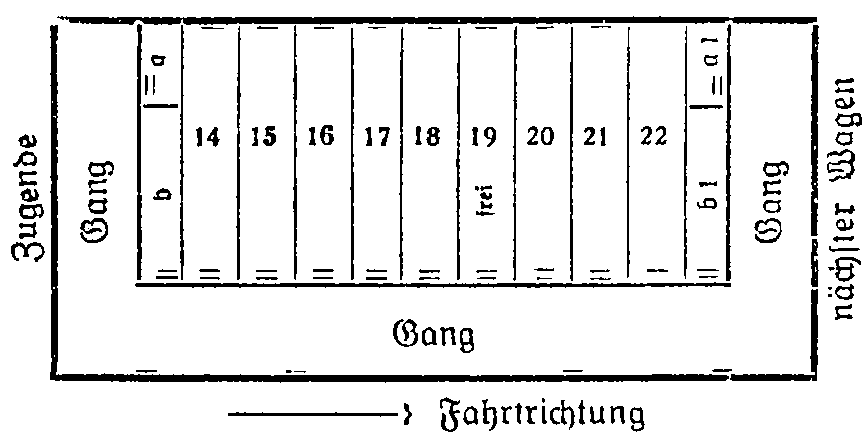

<@pagebreak/>

<h2>1. Kapitel.</h2>

<h3>Der letzte Wagen.</h3>

Die Bezeichnung Kapuziner ist bekannt und berühmt.
Die Kapuziner sind ein Zweig des großen Franziskanerordens
und haben unter allen Mönchsorden die strengsten
Vorschriften. Die Kapuzinerpredigt aus »Wallensteins Lager«
ist berühmt. Bekannt sind die Kapuzineräffchen, die zu der
Familie der Rollschwanzaffen gehören. Weniger angenehm
ist das Kapuzinerpulver, das aus Sabadill, weißem Nießwurz,
Petersiliensamen und Anis hergestellt wird und gegen
Kopfläuse (pardon) in die Haare gestreut wird. Ich hoffe,
keiner meiner Leser wird es benötigen.«

Mr. Kapu Ziner hat mit alledem nichts zu tun. Leider.
Denn …

Aber das wird der Leser sehr bald merken.

Wir lebten als Gäste Oberinspektor Grablays in
Bombay wie Raffkes, wir drei. Unser Abenteuer mit Percy
Rutterfield war längst vergessen, wenigstens die peinlichen
Seiten. An die erfreulichen wurden wir jeden Tag erinnert,
denn die reizende Maitu San, Rutterfields Witwe, war
auf inständiges Bitten der Dame Grazia de la Rocka in
deren palastartige Villa übergesiedelt, und die beiden Frauen,
obwohl sie denselben Mann liebten, hatten sich bald sehr
<@pagebreak/>
eng einander angeschlossen und waren zusammen mit James
Berger, Maitu Sans nunmehr heimlich Verlobtem, häufige
Gäste in Grablays Bungalow auf den Osthängen der Malabar
Hills. Erstaunlich war, wie vornehm Grazia de la Rocka
sich mit der Tatsache, James Berger endgültig verloren zu
Haben, abgefunden hatte.

Doch Lückes Urlaub nahte seinem Ende, und es war
verständlich, daß der patente Hans von Indien noch mehr
kennen lernen wollte als nur Baroda, ein paar Küstennester
am Golf von Cambay und die große, wundervolle
Inselstadt, die auch auf »bay« ausläuft, vorn aber mit
»Bom« beginnt.

Wir beschlossen also einen Abstecher nach Allahabad
zu machen, Benares und einige Nachbarstädte zu besuchen
und Anfang Dezember wieder in Bombay zu sein, dann
würde Lücke gerade noch zu Weihnachten daheim in Berlin
eintreffen — und wir auch. Harald wollte seine betagte
Mutter das Christfest nicht allein verleben lassen. Grablay
schnitt zu diesen Plänen freilich ein sehr langes Gesicht,
und nur Donna Grazia und Maitu San waren begeistert,
— weil sie uns nämlich begleiten wollten, da James Berger
ohnedies in Benares geschäftlich zu tun hatte,

Die Personen, die in der Geschichte des Kapu Ziner
eine Rolle spielen, habe ich jetzt bis auf drei bereits erwähnt.
Es fehlen der Hauptakteur, unser Boy Sifu und
der Miko. Der Leser soll das gesamte Ensemble im Laufe
meines Berichts über die eigenartigen Vorgänge, die sich um
Mr. Kapu Ziner wie Giftpflanzen rankten, noch kennen
lernen — mit allen Eigentümlichkeiten, Schwächen, Stärken
und … Gemeinheiten, —

Ein richtiggehender Kriminalroman beginnt auf etwa
Seite 6 bis 10 mit dem nachher aufzuklärenden »Problem«.
Der Held ist der Detektiv mit Sportmütze, Pfeife, Zigarette
… und so …

<@pagebreak/>
Mein Bericht beginnt auf Seite 3 mit dem großen Geheimnis,

Wir Hatten im Kalkutta-Expreß drei Kabinen nebeneinander
belegt. Die Wagen mit ihren vorzüglichen Lüftungsanlagen
sind das bequemste, das man den Reisenden bieten
kann. Grablay war mit Konfekt, Blumen und allerhand sonstigen
Aufmerksamkeiten für die beiden Damen auf dem
Bahnhof erschienen, — wir traten die Fahrt in glänzender
Stimmung um 8 Uhr 10 abends an.

Die Kabinen lagen so, wie die Skizze es zeigt. Der
Wagen hatte, was ich schon auf dem Reisebureau gemerkt
hatte, die ominöse Zahl 131326: Zweimal dreizehn gleich 26!!

Die Doppelstriche bezeichnen die Türen, die einfachen
Striche die Fenster. Wir hatten Kabinen 20, 21, 22. In b 1,
dem Schaffnerabteil, war Sifu untergebracht, in b die eingeborene
Zofe Donna Grazias.

Kabine 20 gehörte den Damen, in 21 hausten Harst und
ich, in 22 Lücke und James Berger. Nr. 19 war frei. 17 und
18 hatte ein alter kranker Herr belegt, der mit seiner Pflegerin
reiste, ein Kaufmann aus Benares, hörte ich von Sifu,
<@pagebreak/>
der überall schnell Bekanntschaften schloß. In 14, 15, 16
lärmte eine Gesellschaft amerikanischen Neureicher: Vater,
Mutter, Sohn, Schwiegertochter und zwei halbwüchsige
Töchter. Sie hatten einen Kofferempfänger mit und ließen
den Lautsprecher bis nach zehn bei geöffneten Türen spielen.

Als wir das Festland erreicht hatten, kam der Schaffner
und machte die Betten zurecht. Wir standen im Gange und
unterhielten uns in bester Stimmung über allerlei Nichtigkeiten,
Das Liebespaar Maitu San und Berger hielten
sich etwas abseits, und der hübschen Japanerin glückliche
Augen strahlten mit dem inzwischen erschienenen Vollmond
um die Wette,

Die Landschaft, die der Zug durcheilte, war hügelig und
zeigte weite Dschungelflächen. Erst in Manwad, wo die Südlinie
nach Haidarabad abzweigt, hält der Zug zum ersten
Male. — Gegen elf zogen die Damen sich in ihre Kabine
zurück, wir Herren machten es uns bequem, ließen die Verbindungstür
zwischen 21 und 22 offen (in der Skizze nicht
vermerkt), rauchten und tranken zwei Flaschen dunklen Kaschmir-Weines,
der ebenso blumig wie schwer war. Dann legten
wir uns nieder, ich mit einem Band Wallace, denn ohne
Lektüre kann ich nicht einschlafen. Aber die Geschichte von
der gefiederten Schlange enttäuschte mich arg, in der Sache
war kein rechter Schwung, ich drehte das Licht aus und
wälzte mich mit dem Gesicht nach der Wand hin. Ich hatte
das untere Bett und Trotz meiner der freien Bettkante
abgekehrten Lage sah ich mit einem Male im Dämmerschein
des Nachttisches zwei Beine in weiten, violett-seidenen Pyjamahosen
herabtaumeln, und Harst stand mitten in der
schmalen Kabine.

Ich drehte den Kopf …

»Was gibt’s?!«

Er beugte sich über mich. »ich hörte etwas, mein Alter.
Es klang wie ein Schrei …""

Er horchte,

<@pagebreak/>
»… Es kann der letzte Schmerzensschrei eines vom
Zuge überfahrenen Tieres gewesen sein, ich weiß es nicht.
Der Wagen rattert stark, und ich begreife auch nicht, woher
dieses dumpfe Dröhnen zuweilen kommt, es klingt …«

Er schwieg, jemand hatte nicht allzuleise an die Tür
gepocht. Als Harst öffnete, nicht ohne vorher die Pistole
aus dem Kleidernetz genommen zu haben, stand draußen
im halbdunklen Gang die Pflegerin des alten Herrn aus
Nr. 18.

Es war ein verblühtes Mädchen mit scharfen, harten
Zügen, und jenem eingefrorenen Dulderlächeln, das so vielen
gewerbsmäßigen Krankenschwestern eigen ist. Sie hatte einen
hellen Gummimantel übergeworfen, ihr leicht ergrautes Haar
steckte noch unter einer Netzhaube, und ihre bebenden Lippen
vermochten kaum das hervorzustammeln, was sie furchtbar
erschreckt hatte, als sie noch am Lager ihres halbgelähmten
Pfleglings saß. Auch sie hatte einen Schrei gehört, aber
ganz deutlich, und sie schwor darauf, daß er aus der Nebenkabine
gekommen sei,

»Die ist unbelegt,« sagte Harst und fügte einige beruhigende
Worte hinzu.

»Dann war’s die Kabine Ihrer Damen, Mr. Harst,«
beharrte sie verängstigt auf ihrer Behauptung. »Auch mein
Dienstherr vernahm den Schrei …«

»Woher kennen Sie meinen Namen, Miß?« wollte er,
erstaunt über ihre Anrede, weniger freundlichen Tones wissen.

»Ihr chinesischen Boy Sifu sprach mit mir … — Es
muß etwas gesehen sein, Mr. Harst, so schreit kein Mensch
im Traum, das war der Schrei einer Frau in höchster Todesangst
…«

Sie blickte nach links, nach Kabine 20 hin und gab uns
auf diese Weise nochmals zu verstehen, daß sie fürchte,
von dort sei der Schrei erklungen.

Harald trat in den Gang und klopfte bei unseren Damen
wiederholt an.

<@pagebreak/>
In demselben Moment hörten wir das Kreischen der
Notbremse, der Zug verlangsamte sein Tempo und stand
mit einem schrillen Aufkreischen der Bremsen still. Gleichzeitig
öffnete sich die Tür des Schlafwagenabteils Nr. 20
und Maitu San, die einen Kimono übergeworfen hatte,
fiel Harst halb bewußtlos in die Arme. Ihr Gesicht war
aschgrau und verzerrt, die Augen blickten wie die einer Irrsinnigen
stier ins Leere, und das Einzige, das sie mühsam
hervorbringen konnte, war ein kaum verständliches:
»Grazia — — tot …!!« — dann verlor sie vollends das
Bewußtsein,

Harst trug sie schnell in unsere Kabine, wo Berger sich
dann um sie bemühte, während Lücke, inzwischen gleichfalls
zur Stelle, zusammen mit dem Schaffner und dem Zug-
Führer die neugierigen Fahrgäste zurückhielt und den Wagen
— es war der letzte des Zuges, abschloß.

Kabine 20 war leer. Das Fenster war zwei Handbreit
offen, aber der Rollvorhang geschlossen. Grazia de la Rocka
war verschwunden,

In der Kabine bemerkten wir nichts Auffälliges. Die
beiden Betten der Damen — Maitu San hatte das obere
innegehabt — waren nicht einmal besonders zerwühlt. Nirgends
eine Spur von Blut, nirgends auch nur der geringste
Anhaltspunkt dafür, was sie hier abgespielt haben mußte.
Die Japanerin als Zeugin der Vorgänge war sehr bald
wieder zu sich gekommen, konnte jedoch keinerlei Angaben
machen, sondern weinte nur wimmernd vor sich hin und
achtete selbst auf Bergers eindringliche Fragen nicht. In
ihren Augen blieb dieser erschütternde Ausdruck wahnsinnigen
Entsetzens. Sie mußte Furchtbares gesehen haben, denn
wir kannten sie ja: Ihre Nerven besaßen eine außerordentliche
Widerstandsfähigkeit, und um sie in einen derartigen
Zustand zu versetzen, gehörten schon Ereignisse gräßlichster
Art.

Der ganze Zug wurde dann durchsucht, ebenso wurde
<@pagebreak/>
die Bahnstrecke zweitausend Meter zurück von hilfsbereiten
einwandfreien Fahrgästen unter Lückes Leitung abgeschritten.
Es war fast taghell, der Mond stand hoch, und — — man
fand nichts — nichts!

Harst bestand darauf, daß unser Wagen auf das Nebengeleise
einer Zuckerfabrik geschoben und abgehängt würde.
Bergers Einfluß war es zu danken — er war weit über
Bombay hinaus bekannt —, daß auch sämtliche Fahrgäste
sich legitimierten und persönlich in eine Liste eintragen mußten.
Die Insassen der Kabinen 17, 18 und 14, 15, 16 wurden
anderswo untergebracht. Die amerikanischen Neureichs
schimpften und benahmen sich geradezu pöbelhaft, und der
alte kranke Herr aus Benares war auch nicht gerade sehr
liebenswürdig, als er sein Bett verlassen und seine Beobachtungen
— ebenso seine Pflegerin — zu Protokoll
geben mußte.

Nach einem Aufenthalt von einer halben Stunde dampfte
der Zug ohne uns davon,

Während Lücke nun den Fabrikbesitzer heraustrommelte,
um nach Bombay an Grablay zu telephonieren (im Tale
hinter der Zuckerfabrik lag eine ausgedehnte Ortschaft, sie
hieß Jalnaroa), — während Berger bei der hilflosen Maitu
San blieb, gingen wir beide nochmals die Geleise entlang,
da Harald inzwischen berechnet hatte, daß der Schrei zumindest
dreitausend Meter vor der Fabrik ertönt sein müsse.

»Was hältst du von der Sache?« fragte ich nach einer
Weile, da Harald absolut stumm neben mir her schritt und die
Augen überall hatte.

Wir gaben sehr scharf auf die Umgebung acht. Wir
hatten eine Karbidlaterne mit, die wir im Schaffnerabteil
entdeckt hatten, und uns wäre kaum ein Blutfleck oder sonst
etwas entgangen,

Harst erwiderte, ohne die Zigarette aus dem Munde zu
nehmen: »Bevor wir nicht Maitu Sans Aussage haben,
läßt sich überhaupt keine Ansicht äußern. Maitu Sans Nerven
<@pagebreak/>
müssen in den letzten Tagen sehr gelitten haben, obwohl
dazu kein Grund vorlag. Den Tod ihres Mannes,
der sich auf der Jacht »Lady Hamilton« erschoß und ins
Meer stürzte, nahm sie mit echt japanischem Gleichmut
hin — mehr als das! Wenn er auch schändlich an ihr gehandelt
hatte, Sie war erstaunlich beherrscht damals. Und
heute?!«

»Du meinst doch nicht, daß sie …"

»... sie schauspielerte, — ja, das meine ich, lieber
Alter, und der Seidenschal, den sie um den Hals ge-
schlugen hatte, gefiel mir auch nicht. Ich fürchte, wenn
der Schal abgenommen wird, werden wir etwas Belastendes
zu sehen bekommen.«

»Was ?!«

»Ich denke Würgemale …«

Ich blieb stehen. »Du glaubst, daß Maitu San selbst …«
— nein, der Gedanke war denn doch zu absurd.

»Ich glaube, daß das da vor uns unser Sifu ist. Der
Bengel muß natürlich wieder auf eigene Faust sich betätigen.«

Sifu saß am Abhang neben den Geleisen. Die Bahnstrecke
Führte hier durch einen Einschnitt, und oben auf den Rändern
der Anhöhen waren Zäune zu erkennen, hinter denen
Kühe und Ziegen neugierig die Köpfe nach der grellen
Karbidlaterne ausreckten.

Sifu, in sauberem Khaki-Anzug mit versilberten Knöpfen,
auf die er besonders stolz war, erhob sich aus dem Grase,
und sagte mit pfiffigem Grinsen in seinem altklugen Jungengesicht:
»Ich habe nichts angerührt, Missu Harst … Dort
Liegt Maitu Sans japanischer Dolch: in dem kleinen Gestrüpp,
und fünfzig Meter weiter zurück ist eine kleine langgezogene
Blutspur zwischen den Geleisen zu sehen.«

»Das freut mich aufrichtig,« nickte Harst plötzlich sehr
Lebhaft. »Der Dolch genügt … Aber das Blut möchte
ich mir ansehen.«

<@pagebreak/>
Weshalb ihn etwas erfreuen konnte, das doch nur
einen Beweis gegen Maitu San darstellte, begriff ich nicht
recht.

<h2>2. Kapitel.</h2>
<h3>Der erste Verdacht.</h3>

Sifu, unser Chinesenboy, hatte früher vollkommen unter
Percy Rutterfields Einfluß gestanden. (Wenn ich hier immer
nur von Maitu Tau spreche, müßte ich genauer hinzufügen:
verwitwete Rutterfield.) Sifu war kein Unschuldsengel. Er
hatte eine etwas wilde Vergangenheit, deren Schleier man
besser nicht lüftete. Harald war in seiner Gutmütigkeit nach
den Vorfällen auf der Pestdschunke für meinen Geschmack
doch etwas zu weit gegangen, als er Sifu wieder in Hunden
aufnahm. Ich traute dem Bengel nicht. Er hatte Gaunern,
Piraten und Mordgesellen gedient, er hatte in Baroda den
Spion gespielt (der Leser kennt das »Konsortium« noch,
— und nun hatte er eigenmächtig wie stets hier zuerst
eine Waffe gefunden, deren schwache Blutspuren das
Schlimmste für Donna Grazia fürchten ließen.

Harst wickelte den Dolch vorsichtig in eine Zeitung ein,
Cennzeichnete die Stelle, wo er gelegen hatte, und schritt
weiter,

Die Blutflecken auf dem Sande zwischen den Schienen
waren bereits recht undeutlich geworden, nur auf einigen
Schottersteinen fanden wir frische Spritzer. Harst bedeckte »diese
Steine mit einem weiteren Zeitungsblatt und befahl Sifu,
an dieser Stelle zu wachen.«

Dann suchten wir nach Fährten neben den Gesellen.
In diesem Einschnitt stand das Gras an den flachen Abhängen
<@pagebreak/>
ziemlich so, und, falls jemand hier aus dem Zuge
gesprungen oder ein Körper hinausgeworfen worden wäre,
hätte man das unbedingt sehen müssen. Es waren keinerlei
Spuren vorhanden. Das Gras war nirgends niedergedrückt.

Wir schritten noch; langsamer die Strecke zurück, indem
wir nun jeder an einer Seite de3Z-Bahnkörpers uns hielten.
Auch diese Nachsuche war umsonst. Als wir uns der Fabrik,
einem rohen unschönen Ziegelbau, neben dem das »Haus
für die Angestellten und den. Besitzer mitten im Busch lag,
näherten und den auf dem Fabrifkgeleise stehendenSchlaswagen
erkennen konnten, wurde gerade Maitu San aus
einer als Krankenbahre hergerichteten Leiter in das Haus
getragen. Nebenher gingen Donna Grazias eingeborene Dienerin
und der völlig geknickte James Berger, der in seiner
beißen Liebe zu der Japanerin für uns als Unparteiischer
Helfer ausschied, Neben dem Wagen saß Hans Lücke auf
einem Prellbock, schlenkerte, wie es seine Gewohnheit war,
mit den Beinen und paßte umständlich sein Monokel.
Er Hatte bereits seinen Tropenanzug an und hatte, um den
Hosenboden zu schonen, auf den Prellbock sein seidenes
Taschentuch gelegt. Er steckte sein zweites Taschentuch; in
die äußere Brusttasche, flammte seinen unvermeidlichen Scherben
ein und meinte trocken: »Eure Gesichter besagen nicht.
Ihr habt Grazia nicht gefunden. Grablay ist bereits mit
dem Auto hierher unterwegs und läßt grüßen. — In
Grunde war diese Katastrophe vorauszusehen. Es war Annahme,
daß zwei Frauen, die denselben Mann lieben und von
denen die eine großmütig verzichtet, sich angefreundet Haben
sollten. Das östliche Temperament, immer klug verhüllt,
hat sich, fürchte ich, entladen. — Was haben Sie da in
der Zeitung, Harst?«

»Maitu Sans blutigen Dolch … Sie kennen ja die

Waffe. Berger schenkte sie Maitu San, und ob die liebliche
Japanerin den Dolch unter dem Kopfkissen liegen hatte,
<@pagebreak/>
wird schwer festzustellen sein. Ihre Koffer waren jedenfalls
verschlossen.«

Lücke nickte. »Stimmt … Ich war in Nr. 20 … Eine
ganz eigentümliche Geschichte. Der Wagen ist übrigens ein
älteres Modell und nur umgebaut, sogar sehr.«

Harst blickte ihn forschend an. »Sie haben etwas gefunden
2«

»Dafür bin ich Berliner Kriminalkommissar, und man
sagt, daß außer Alarich Gepp im Roten Alter nur noch
eine exzellente Kraft neben all den guten vorhanden ist …
Den Namen will ich aus angeborener Bescheidenheit nicht
nennen, — Ich sagte mir, daß der Täter oder die Täterin
die Kabine weder durch das Fenster noch die Tür samt dem
Opfer verlassen haben könnte. Die Tür war von innen verriegelt
, …«

Harst fiel ihm ins Wort, »Und das ist mit am wichtigsten,
Lücke.«

»Im — ein Fehler ist’s, nichts weiter. Auch das Fenster
hätte herabgelassen werden müssen … Ich habe bereits
nach) Kognak, wo. der Zug in einer Stunde eintreffen dürfte,
ebenfalls telephoniert und gebeten, unter den Wagen zu
suchen. Ich denke, man wird die arme Grazia im Gestänge
eines Waggonunterbaues finden. Maitu Sans Schlafanzug,
über den sie den Kimono geworfen hatte, ist zerrissen und
zeigt Ölflecke, Die Japanerin treibt Sport, hat Muskeln
zum Beneiden und …«

Harst unterbrach ihn wiederum, »Ich verstehe … Sie
meinen, sie hat den Körper unter das Gestänge des nächsten
Wagens getragen. — Mein lieber Lücke, das Kunjiytük
sollen Sie mir bei einem Zuge mit siebzig Kilometer Geschwindigkeit
vormachen. Ich brächte das nicht fertig. Im
Gange sind keine Blutspuren, und, …«

»Kommt mit!«

Lücke ging voran. Wir betraten den Wagen, vor dem
jetzt ein Polizist aus Jalnaroa, dem nahen Städtchen, Wache
<@pagebreak/>
hielt. In respektvoller Entfernung standen eine Gruppe Inder
und starrten uns neugierig an.

Lücke hob in Kabine 20 den Plüschläuferbelag des Bodens
auf. »Da — die Nägel sind entfernt …!« sagte er nur.

Unter dem Läuferstoff lag noch ein Belag von Tote, ein
dem Linoleum ähnlichen Fabrikat, nur weicher, der und
schalldämpfender. Die Streifen des Tote waren genau zu
erkennen. In dem mittleren Streifen vor den Betten sah
man zwei breitere Schnitte, — Lücke hob das Stück heraus
und letzte den Holzboden frei. Auch dieser zeigte vier
Schnitte, noch ganz frisch. Es war mit einer Stichsäge eine
Art Falltür hergestellt worden. Als Lücke sie h;ochklappte,
sahen wir im Laternenschein einen Teil des Festgestellt
und auf einer eisernen Stange vier Bluttropfen, die verwischt
waren. Außerdem fehlte auf dieser Stange sowie
benachbarten Eisenbalken zum Teil der Staub.

Harst kletterte durch das Loch und nahm die Laterne mit.
Er entschwand unseren Blicken, wir blieben im Halbdunkel
zurück, bis plötzlich in der Kabinentür Mr. Nat Erster mit
einer Petroleumleuchte auftauchte und sich uns würdevoll
vorstellte:

»Nathanael Fester, Polizeichef von Jalnaroa.«

Mr. Erster hatte zweifellos eine vorzügliche Köchin.
Er war klein und Ei und rosig braun und hatte vergnügte
Schweinsäuglein in dem zur Zeit bartstoppeligen Rundgesicht.
Daß er ein Eurasier, ein Mischling, war, sahen wir
zunächst nicht.

Fester hatte unter den linken Arm eine Aktenmappe geklemmt
und hielt in der Linken außerdem noch« Tintenfaß
und Federhalter,

»Ich muß ein Protokoll aufnehmen,« erklärte er sehr höflich.
»Wo ist die Tote?«

Jesters Anzug und Frisur verrieten, daß er eiligst sein
Bett verlassen hatte. Er war ohne Hut. Sein Lage war schwarz
<@pagebreak/>
und leicht gelockt. Seine Nase schimmerte verdächtig nach
Reisschnaps.

»Die Tote ist zur Zeit noch abwesend,« erklärte Lücke
dem ländlichen Kollegen.

Fester bewunderte die Falltür im Boden. »Ist das in aller
Schlafwagenabteilungen so?« fragte er erstaunt.

»Tür gewöhnlich nicht, Mr. Fester.«

Der Die lächelte unmerklich! Ich gewann den Eindruck,
daß er sich über Blies offensichtlich recht geringfügige Bewertung
seiner Person insgeheim belustigte.

»Also ein vorbereiteter Mord, meine Herren,« sagte er
schlich. »Man wird in Bombay nachforschen müssen, wer
an diesen Wagen herankonnte, Die Falltür kann doch erst
hergerichtet worden sein, nachdem Sie Ihre Kabinen zugewiesen
oder bestellt hatten. Die Sägeschnitte sind ganz frisch.«

Dumm war dieser Fester entschieden nicht.

»Da haben Sie recht …« — Harst stand im Gang und
streckte Fester die Hand hin. »Ich denke, wir werden gut mit
einander auskommen, Mr. Fester.«

Fester stellte das Tintenfaß aus das Fenstertischchen, legte
Mappe und Federhalter daneben und Frühe Haralds Hand.,
»I4 weiß, wer Sie sind, meine Herren, — Mr. Berger erzählte
es mir. Es wird mir eine Ehre sein, und wenn ich
mir gestatten darf, Sie zu mir einzuladen … ««

»Sehr liebenswürdig …

Lücke fragte ungeduldig: »Fanden Sie etwas, Harst?«

»Ja, Die Beweise, daß Donna Grazia nicht bis zum nächsten
Wagen geschleppt wurde, Der Staub liegt überall gleichmäßig
auf den Teilen des Unterbaus. Gewiß könnte ein
Mann von besonderer Kraft und Gewandtheit einen leblosen
Körper über die Eisenteile und Puffer bis zum folgenden
Wagen mit sich nehmen, aber niemals wäre das
der Person möglich gewesen, an die Sie denken, lieber Lücke.«

»Dann stehe ich vor einem Rätsel!«

Nathanael Fester blickte Lücke daraufhin verwundert an,

<@pagebreak/>
»Das Rätsel ist Docht zur Hälfte gelöst, und die andere Hälfte
-y» nun, Frau Maitu San-Rutterfield hat sich bereits zu
einer Aussage bequemt. I4 habe protokolliert …«

Das schien ihm das Wichtigste zu sein: Schwarz auf
Weiß, Tinte, Feder, Papier,

Er langte nach seiner Aktentasche.

»Ich kenne meine Pflichten, meine Herren … Oberinspektor
Grablay hat mir schon lange einen Posten in
Bombay angeboten … — Darf ich vorlesen, — vielleicht
leuchten Sie mir, Mr. Harst … — So … — Frau Maitu
San, verwitwete Rutterfield, 23 Jahre alt, ansässig in Goa,
zur Zeit auf Reisen, sagt aus. — »Ich erwachte über einen
Hilferuf, den Frau Grazia de Rocka ausstieß. Ich sah einen
Mann mit einer Maske, in einem schwarzen Anzug, der
Frau Grazia mit der Linken am Halse würgte und sie mit
meinem Dolche erstach. Es war nur die Nachtbeleuchtung
eingeschaltet, und ich kann daher über den Täter nichts
weiter angeben, zumal ich vor Entsetzen die Augen schloß
und wieder in die Kissen zurücksank. Als Mr. Harst an der
Tür klopfte, mußte ich erst meine Kräfte sammeln, um mein
Bett verlassen zu können. — Weiter kann ich nichts angeben.«
— Folgt die Unterschrift, Ort, Datum und Zeit.
— Das ist sehr wenig, meine Herren, finde ich,« — und der
kleine Dicke schob den Bogen wieder in seine Mappe zurück.
»So wenig,« fügte ich seufzend hinzu, daß ich ernsthafte
Zweifel an der Selbständigkeit der Aussage hege. Insbesondere
behauptete Frau Maitu San auf nochmaliges Befragen, daß
sie nicht wüßte, wie der Dolch, ihr Eigentum, aus dem
Koffer … « — er hüstelte — »hm, aus dem Koffer in die
Hände des Mörders gelangt sein kann … Hm — und
es war fast dunkel in der Kabine, meine Herren, und aUZsgerechnet
hat die Dame als einzige Zeugin den Dolch erkannt,
sonst: nichts …,«

Er schaute durch die Falltür auf den Sand und Schotter
zwischen den Geleisen. »Es ist vieles hier sehr merkwürdig,
<@pagebreak/>
vieles … Ich bin ja Kugeln kleiner Polizeichef in einem
Nest von knapp dreitausend farbigen Seelen, und ich habe
mich zumeist nur mit Ziegenzucht und ein paar harmlosen
Diebereien beschäftigt, ausgenommen den einen Fall, der
mich mit Oberinspektor Grablay näher in Berührung brachte.
Trotzdem bin ich in der einschlägigen Literatur, Kriminalwissenschaften,
leichtes bewandert, ich habe alle bedeutenderen
Werke in meiner Bibliothek, und …«

» … —. haben Sie Erbarmen mit uns und schweifen Sie
nicht ab,« sagte Lücke etwas gereizt.

Frau Maitu San trägt einen Schal,« fuhr Fester unbeirrt
fort. Der englische Schriftsteller und Generalstaatsanwalt
Sir Kuriert, erwähnt auf Seite 28 — es kann auch
»8 sein — einen Fall, in dem die Täterin im Kampfe mit
ihrem Opfer Kratzwunden an der Hand »erhielt und nur
Handschuhe trug …«

Harst meinte ernst: »Mr. Fester, reden wir nicht um den
»Kernpunkt der Sache herum, Sie halten Maitu San für die
Mörderin, weil sie am Halse blaue Flecken hat …«

»Nein, nicht Flecken, Araber und Flecken. — Donna
Grazia soll sehr lange spitze lackierte Nägel geliebt haben,
obwohl Nagellack als unfeiner Ersatz für wahre Nagelpflege
gilt. —« Ich werde warten, bis Mr. Grablay eintrifft.«

»Womit?« fragte Harst sehr gedehnt.

»Mit der Verhaftung, Mr. Harst. — Nun will auch ich
mir das Wagengestell ansehen, aber ich mache es mit bequemer,
diese Falltür ist etwas eng, es müßte ein sehr
schlanker Mörder gewesen sein, der hier hindurchkam. —
ob Frau Maitu San Beziehungen zu Eisenbahnwagen
Büscheln in Bombay hat?!« …

Er verlangte keine Antwort, verließ den Wagen und
hm) unten überall mit seiner Petroleumlampe herum, was
ihm nicht ganz leicht wurde.

»Zier ist jemand entlang geschlüpft,« rief er uns keuchend
zu und zwängte sich über den abermaligen Gasbehälter des
<@pagebreak/>
Wagens hinweg, kennen noch« nicht abmontiert hatte, obwohl
die Beleuchtung jetzt elektrisch war. »Nur hier die eine
Stange unter der Falltür, — das ist Blut, mithin ist die
Leiche doch hinabgeworfen worden.«

»Schwätzer!« murmelte Lücke …

Harst sagte leise: »Unterschätzen Sie ihn nicht … Theoretiker
wie er finden sich zuweilen überraschend schnell in die
Praxis hinein …«

Schnaufend stand Nat Fester vor uns,

»Sie haben doch die Geleise weit genug abgesucht, Mr.

erst 2«
»Ich habe den Dolch hier in der Tasche, und an der fraglichen
Stelle sitzt mein Boy) bei den blutbespritzten Steinen
als Posten. Es sind von hier etwa zweitausenddreihundert
Mieter, Mr. Erster.«

»Geben Sie mir den Dolch,« bat. Fester höflich. »Ich
werde ihn in Verwahrung nehmen …«

»Gern, — bitte … — Und nun gehen wir am besten
zu Frau Maitu San, denke ich. Ich möchte ihr zwei Fragen
vorlegen.«

Der dicke Nat erklärte, er wolle besser noch hier bleiben.
»… Ich finde, man sieht immer am meisten, wenn man
allein ist, und den Schauplatz eines Verbrechens sollte man
studieren wie eine Chiffreschrift.« Er lächelte bescheiden und
kletterte in den Wagen hinein. Harst sagte, als wir davongingen:
»Chiffreschriften sind zuweilen auch unsichtbar oder
so schwach zu erkennen, daß schon Jesters Laterne dazu nötig
ist — oder nicht,« eine Bemerkung, die wenig Sinn zu haben
schien, genau wie die folgende, die Harst nach etwa hundert
Splitter tat, indem er sich umdrehte: »Die Ladebaracke der
Fabrik liegt dem Wagen am nächsten … Da, Mr. Fester
läßt die Neugierigen verjagen … — Ob dies sein Auto
ist?!« Auf dem Wege von dem Anschlußgeleise zum Wohnhause
der Fabrik stand ein uralter Klapperkasten, so ein hochräderiges
Ding, wie es vielleicht vor fünfzehn Jahren schon
<@pagebreak/>
als Alteisen für einen Spottpreis zu haben war. Es war
ein viersitziger offener Wagen mit einem Verdeck Patent
Fester, denn die dazu benutzte brüchige Segelleinwand trug
noch verwaschen die Inschrift in Riesenbuchstaben;:
Nr. Jesters Ziegenzucht.«
Vielleicht hatte die Leinwand einmal als Reklameplakat
gedient, Nat züchtete ja Ziegen, und man roch es, wenn
man ihm nahekam. Er roch bockig. Im übrigen war das Auto
giftgrün mit Ölfarbe gestrichen, nur die Kühlhaube war
knallrot. Mir taten die Augen weh.

<h2>3. Kapitel.</h2>
<h3>… Die Pistole.</h3>

Im Erdgeschoß des auf der Waldlichtung erbauten Hauses
waren alle Fenster hell. Um das Haus zogen sich Beete,
die einen Garten vortäuschen sollten. Harst nannte dieses
Heim scherzend »Villa Inder,« obwohl der Fabrikbesitzer,
ein wortkarger älterer Engländer, den berühmten Namen
Livingstone trug. Seine Frau und Tochter erschien durch
übertriebene Liebenswürdigkeit, was dem bitter-grämlichen
Mr. Zucker an angenehmen Eigenschaften abging,

Maitu San ruhte im Zimmer der Tochter auf einem
Diwan, James Berger saß neben ihr und hielt Steine kleine
Hand, Zwei elektriscge Lampen, eine Deckenlampe und eine
Tischlampe, beleuchteten die Liebenden. Aber Maitu Sans
Gesicht lag mehr im Hatten.

Als wir eintraten, hatte die zierliche Japanerin den Kopf
noch weiter nach der Wand gedreht, und Bergers Benehmen
verriet ebenfalls wenig Freude über unser Erscheinen. Er,
der in Bombay eine Auskunftei und vielfache andere Geschäfte
<@pagebreak/>
betrieb, war, wie ich schon im vorigen Bande betont
be, ein sehr kluger, energischer Mensch von sympathischen
Ad Azoren. In Bombay nannte man ihn zumeist den »kleinen
See«, weil er wie sein Doppelgänger See Chamberlain auch
ein Manches trug.

Er sagte leise, irdenen uns flüchtig kniete: »Ich hoffe,
Sie werden Maitu San nicht auch noch so rücksichtslos
quälen, wie dies der kleine die Stöpsel Fester tat.«

»Durchaus nicht,« erwiderte Harald und machte den
Livingstone’schen Damen, die im Flur lauerten, die Tür
vor der Nase zu. »Durchaus nicht, lieber Berger, — ich
konnte betrunken, wir wollen das Gegenteil tun. — Wie
geht es Ihnen, Frau Maitu San?«

Sie regte sich nicht und flüsterte nur: »Sehr schlecht … «
Ich möchte östlichen und alles vergessen.«

Wir standen vor dem Diwan, und ich fühlte, daß uns
allen nicht rechts behaglich zumute war. — Das Zimmer
zeigte eine Ausstattung, die an die Garderobe einer Schlaue
Spielerin erinnert«. Die Bilder an den Wänden, dazu Fächer,
ertönte Kränze und anderer Flitterkram deuteten auf künstlerische
Neigungen der Kurzer-»-Höchster hin.

Harald meinte in. wärmstem Tone: »Es muß für Sie
allerdings ersichtlich gewesen sein, Frau Maitu San …

&8 ist auch durchaus begreiflich, daß Sie von dem Täter so
wenig sehen. Den Dolch hat übrigens Sifu gefunden.«

3’ie Japanerin begann zu weinen. Sie mochte immerhin
von europäischen Damen die Tränen als beste Waffe bereits
übernommen haben.

»Wissen Trockenen, daß Sie Ihren Dolch nicht aus dem
Koffer genommen hatten?« lautete Harsts erste harmlose
Frage. — Harmlos?!

»Ja — genau,« erklärte sie!chFluchzend.

»erweichen Ihrer beiden Koffer hatten Sie ihn eingeschlossen?
In den neu gekauften?«

»Nein … In den, den ich schon Tänzers Zeit besitze.«

<@pagebreak/>
»Also den mit dem Patentschloß. Ein sehr gutes Schloß,
ein sehr schöner Krokodillederkoffer … Merkwürdig, daß der
Täter da 8 Sdclloß!d leicht öffnen konnte. Die Schlüssel fand
ich doch; unter Ihrer Bettmatratze, zwischen Kopfpolster und
Matrose, genauer gesagt. Mit einem Dietrich ist das Schloß
nicht zu öffnen, und Gewalt ist auch nicht angewandt war

en.

Berger sagte ärgerlich: »Das ist ja doch wieder ein förmliches
Verhör!! Fester war schon so taktlos, Maitu San nach
dem Dolche auszuforschen, und …«

Harst beschwichtigte ihn schnell, »Wir gehen ja schon
wieder, lieber Berger … Nichts liegt mir ferner, als
die angegriffenen Nerven Maitu Sans noch mehr zu schlagen.
Die beiden Fragen sind mir durchaus genügend, der
Koffer war mir mit die Hauptsache.«

»Das begreife ich nicht, — und Berger starrte Harst
argwöhnisch; an,

Maitu San flüsterte Überstürzt:

»Ich … ich kann mich ja auch irren … Der Dolch
mag auch in dem anderen Koffer gelegen haben … Ich
weiß es doch nicht so bestimmt! — Hattest du mir nur nie
diesen Dolch in Bombay gekauft, James!«

»oh, — das Geschenk soll Ihnen kein Unglück bringen,
Frau Maitu San,« erklärte Harald vielleicht noch freundlichen
und weicher als vorhin. »Schlafen Sie nun … Ich
möchte Ihnen am liebsten dieses harmlose Beruhigungsmittel
geben …«

Sie lehnte schroff ab. »Nein, ich nehme nie Medikamente
… Ich will allein sein, ganz allein,« — und
sie brach in ein hysterisches Schluchzen aus, das auf uns
sehr peinlich wirkte,

Berger traf mit uns vor das Haus. Der Mond war
verschwunden. Die Berge von Notiz hatten ihn verdeckt.
Es war dunkel und schwül. Ein heißer Glutwind kam von
<@pagebreak/>
Osten her und brachte die scharfen Gerüche der Fabrik mit
herüber. Eine Zuckerfabrik hat ihren besonderen Duft.

»Ist die Tote gefunden?« erkundigte sich Berger zögernd.

»Nein … — Leider ist auch die kurze Aussprache mit
Ihrer Braut nicht nach Wunsch verlaufen … Weshalb
verheimlicht sie uns die Erz« und Würgespuren an ihrem
Halse?! Ich denke, ich sprach so gütig mit ihr, daß sie ganz
ehrlich hätte sein können. Sie ist mir unverständlich.«

Berger schwieg und senkte den Kopf.

Lücke, der stets für rasche Klärung der Sachlage ist,
meinte ziemlich. scharf: »Rücksichten müssen hier ausgeschaltet
werden. Sie haben den mehrfach um den Hals geschlungenen
Schal gesehen, Berger, — Sie sahen auch zweifellos
die Flecken und Klarstellen am Halse …«

Berger sagte dumpf: »Es wäre ein Wahnwitz, sie zu
verdächtigen, Lücke … Ich weiß, was Sie andeuten wollen.
Maitu San hätte keinen Grund gehabt, Grazia de la
Rocka zu … töten …«

»Oh — Eifersucht!« — und Lücke legte Berger die Hand
auf die Schulter. »Aus Eifersucht ist schon manch raffinierter
Mord geschehen. Und dieser hier war sorgfältig vorbereitet.
Das ist leider Tatsache. Im Boden von Abteil 20
ist eine Falltür hergestellt worden. Schraut besorgte die
Fahrscheine im Verkehrsbüro, und Sie und Maitu San
warteten draußen auf ihn. — Besinnen Sie sich, Schraut,
daß Sie mir erzählten, Maitu San habe sofort gewünscht,
Kabine 20 zu benutzen, das sei ihre Glückszahl, die Zwanzig.
An demselben Vormittag kauften Sie, Berger, Maitu San
den kostbaren, aber unauffälligen Dolch.«

Unser Gespräch fand durch Mr. Livingstones Erscheinen
ein vorzeitiges Ende, Er bat uns zu einem Morgenimbiß
ins Haus, obwohl die Dämmerung noch nicht einmal angebrochen
war.

Es war auf der Veranda gedeckt worden, aber Harald
wandte ein, er vertrüge die leichten Morgennebel nicht,
<@pagebreak/>
und so mußten die eingeborenen Diener im Salon den
Frühstücks1’schz neu herrichten. — Ich hatte allen Grund,
mich sehr über meinen Freund zu wundern. Er zog im
Salon, einem schrecklich ges(chqmacklosen Raume, die Fenstervorhänge
dicht zu und bat auch, die äußeren Glasfenster
zu schließen. Die inneren hatten nur Gazebespannung. Mr.
Livingstone schüttelte den Kopf, und wir anderen, die beiden
Damen ausgenommen, ahnten dunkel, daß Harsts Kabelschen
nur einen Grund haben könnte: Die Furcht vor
einer heimtückischen Kugel oder einem sonstigen Angriff.

Es war keine erfreuliche Kaffeestunde, da diese drei
Livingstones, die hier in der Einsamkeit als einzige Europäer
lauten, nur allzu gesprächig wurden, selbst der steife
Mr. Inder taute auf und verlangte genaueste Angaben
über jede Eingekittet des rätselhaften Verbrechens. Ich selbst
hatte die Empfindung, als ob Harsts scheinbare Geistesabwesenheit
— er beteiligte sich kaum an der Unterhaltung
— lediglich gespannteste Aufmerksamkeit war. Er behielt die
drei Fenster dauernd im Auge, und die dünnen, halb durchsichtigen
Vorhänge genügten ihm als Schutz gegen den Duells
in den Salon offenbar gar nicht. — Berger wieder saß
blaß und abgespannt da und schien sich mit allerlei berechtigten
Zweifeln über Maitu San zu quälen. Der einzige
Muntere war der unverwüstliche Lücke, der Miß Ethel Li«-
bugsiere, einem verschrobenen farblosen Mädel, allerlei Fritz
minalfälle erzählte und dabei unglaublich log. Seemannslatein
war gar nichts dagegen.

In diese bis zur Hochspannung elektrisQ geladene Atmosphäre
drang von draußen der Knall zweier Schüsse herein.
Knall und Splittern von Glas erfolgten fast gleichzeitig,
und über Harsts Stirn zog sich ein kaum merklicher
rötlicher Strich hin, während hinter ihm ein gerahmter
Sand für alle Zeit zwei Kugellöcher als Andenken be

<@pagebreak/>
Das Einkreisen der Damen, Bildet blitzschnelle Verschwinden
und die Tone einer Hupe zerflossen in eins.

Harst war sitzen geblieben. »Es ist Grablay,« sagte er nur,

»und — der Schüsse?!« fragte Mr. Zucker aschfahl.

Lückes Stimme erscholl im Garten. »Harst, hierher?!«

Wir eilten hinaus und fanden Lücke mit der ohnmächtigen
Maitu San im Arme unter dem einen Fenster des
Zimmers Miß Livingstones,

Berger taumelte gegen die Hauswand. Er ahnte, was
kommen würde …

Lücke sagte unnachsichtig: »Ich fing sie gerade ab, als sie
wieder in das Zimmer zurückfordern wollte … — Ihre
Geheimniskrämerei, Harst, wird nun wohl endgültig erledigt
sein. Sie sahen voraus, daß Maitu San etwas Unternehmer
würde — gegen Sie!«

Berger ächzte verzweifelt.

Harst fragte kühl: »Wo mag Maitu San hier eine
Pistole herbekommen haben?!«

Livingstone, der scheu herbeigeschlichen war, bückte sich
und hob zwei Meter vom Fenster entfernt eine Pistole
von dem hellen Kie8wege auf. »Es ist meine Waffe, und
sie lag zumeist in Ethels Nachtschränkchen, denn meines
Tochter ist sehr ängstlich.«

In diese trübe Szene trat John Grablay als neue Figur
hinein.

»Das scheint hier ja recht lebhaft herzugehen,« meinte
er unvergleigich traten. »Ich habe die Schüsse gehört …
Wer schoß auf wen?«

Niemand antwortete, da Maitu San mit tiefem Seufzer
wieder zu sich kam.

Berger in seiner Enttäuschung und Verzweiflung konnte
Eis nicht länger beherrschen. »Weshalb fürchtest du nun
aus noch Harst zu ermorden?! schrie er ihr ins Gesicht.
»wischen uns ist alles aus — alles!! Da — — dein Schal
<@pagebreak/>
hat sich gelockert … Die arme Grazia hat sich verzweifelt
verteidigt, dein Hals beweist es!«

Grablay hatte seine große Taschenlampe eingeschaltet.
Alle sahen wir nun die verräterischen Flecken und Drängten.

Maitu San blickte Berger traurig an. »Ich wünschte,
ich wäre tot …« flüsterte sie. »So wahr ich) die liebe,
James: Ich habe nicht geschossen, ich habe die Pistole weder
gesehen noch berührt.«

»und was wolltest du hier im Garten?!« Bergers Stimme
klang unsäglich bitter.

Sie erwiderte nichts, sie sprach überhaupt nichts mehr.

Als jedoch nun auch der kleine Fester herbeikam und
nach kurzer leiser Beratung mit Grablay die einsam unter
dem Fenster stehende Maitu San verhaftete, trat Harst
an sie heran und raunte ihr ein paar Worte ins Ohr. Sie
fuhr leicht zusammen. Über in ihren dunklen Augen erschien
dann ein besonderes Leuchten. Stolz und getrost bestieg
sie Nat Erstens giftgrünes Auto und fuhr nach dem
kleinen Gefängnis von Jalnaroa, —

da. Kapitel.
Der Gasbehälter.

»Was sagten Sie ihr, Harst?« fragte der lange Grablays
mißmutig, als wir dann ganz unter uns in dem Salon
Livingstone saßen. Unsere Gastgeber hatte der Oberinspektor
sehr eindeutig bhzinauskomplimentiert.

»Ja, das möchte auch ich wissen,« meinte Berger seufzend,

»Ich erst recht,« pflichtete Lücke ihm energisch bei. »Harst
spielt mit uns hier wieder mal Versteck, lieber Grablay.«

»Aß nein,« erklärte der also Angegriffene ohne jede
<@pagebreak/>
Empfindlichkeit. »Ich verkaufe nur kein Ei, bevor es die
Henne nicht wirklich Gesetz? hat, denn es kann ja auch ein
Windei werden. Reich habe Maitu San lediglich versprochen,
mit allem Nachdruck diesen Geschehnissen schleunigst auf
den Grund zu gehen.«

Berger setzte sich kerzengerade aufrecht. »Mein Gott,
Halten Sie Maitu San nicht für die Mörderin?!’

Harst trank einen Schluck Kaffee. »Sie reden immer
von einem Morde … Ist denn ein Mord bereits erwiesen?!
Wo ist die Tote?!«

Spräche murmelte etwas von »Effekthascherei« …

Harald hat gute Ohren. »Lieber Lücke, nichts liegt mir
ferner. Wenn ich nach etwas huschte, dann höchstens nach
der Wahrheit und Klarheit. Pflegen Sie als Beamter etwa
voreilig über einen Kriminalfall zu urteilen?! Wohl kaum.
Ich gebe zu, daß ich geringe Beweise habe, daß die Eireignisse
im Schlafwagen und hier eine ganz andere Deutung
finden können, — können, wohlgemerkt! Sie bauen Ihren
Verdacht gegen Maitu San auf recht fadenscheinigem Fundament
auf: Eifersucht als Motiv, die Würgemale und
die Kratzer als Belay)tungsmaterial, ebenso den Dolch, und
jetzt noch« die Schüsse und Maitu Sans Schweigen auf
die Frage, was sie im Garten vorhatte. Ich lasse meines
vielangefeindete Phantasie spielen und suche nach mehreren
Lösungen, nicht nach einer allein. — Grablay hat sie auch
noch nicht geäußert und ist doch ein alter Praktiker — in
Gegensatz zu dem liebenswürdigen, bescheidenen Ziegen
Züchter Nathanael Jester, der alle Kriminalwerke studiert
Hat und eifrigst jetzt auch seine zweifellos vorhandene praktische
Begabung erhärten möchte … Also Grablay, — Ihre
Ansicht?!«

Der Oberinspektor zog gelassen an einer seiner dicken,
Braunschwarzen Zigarren und blickte flüchtig zu Lücke hin

er. —

»Harst,« sagte er etwas widerwillig, »ich stehe ganz auf
<@pagebreak/>
Glückes Seite. Mir ist es zum Beispiel unverständlich, wie
Sie noch daran zweifeln können, daß Frau Grazia ermordet
wurde?! Sie haben den blutigen Dolch gesehen, Maitu San
hat zugegeben, daß Grazia erstochen wurde, freilich redete

sie von einem Maskierten als Täter, — Sie haben sich
überzeugt, daß die Falltür im Boden von Nr. 20 in allerjüngsten
Zeit hergestellt wurde — — und so weiter …«

gar machte eine abschließende Handbewegung. »Und trotzdem
wollen Sie einen Mord in Frage stellen?! Mir unbegreiflich«

Harst nickte. »Schon möglich … Aber es handelt sich
hier auch um einen Kriminalfall, der sicherlich in der
Chronik schlauer Verbrechen nicht seinesgleichen hat. Schon
allein die Falltür ist ein Begleitmoment, das ich wahrlich
nicht übersehe. — Lieber Berger, eine Frage … Als
Schraut die Fahrkarten besorgt hatte und Sie nachher
Maitu San den Dolch kauften, haben Sie sich ihn noch
von Maitu San getrennt?! So weit mir erinnerlich ist,
sind wir bis zum Abend zusammengeblieben, und die Damen
ließen ihre Sachen durch; Donna Grazias Zofe packen. Abends
fuhren wir ab … Maitu San müßte also, um nur den
Punkt hervorzuheben, einen Vertrauten gehabt haben, dem
sie die Nachricht übermittelte, daß wir die Kabinen 20, 21,
22 erhalten hätten, und der dann die Falltür herrichtete,
wozu doch schließlich Zeit gehört …«

»und weshalb glauben Sie an diesen Vertrauten nicht?«
warf Lücke hartnäckig ein.

Harst lächelte unmerklich. »Weil die Kabine 19 leer blieb,«
sagte er bedächtig. »Eine leere Kabine läßt tausend Uns;
fürchteten zu …«

Er zog einen Bogen … aus der Tasche. »Bitte, dies ließ
ich mir von unserem Zugführer geben … Es ist der sogenannte
Befreiungsplan des Zuges. Sie sehen hier die einzelnen
Wagen und Abteile und die Namen der Reisenden.
Leider habe ich erst zu spät etwas beachtet, das mir eigentlich
<@pagebreak/>
sofort hätte aufstoßen sollen. Der Zug war bereits
über Kognak hinaus, als ich den Plan genau betrachtete.
Ich betone: über Kognak hinaus!! Und dort hielt er, und
jemand konnte aussteigen …«

Lücke war hinter Harsts Sessel getreten und rief verhüllt

»Da … steht ja in Nr. 19 doch ein Name!«

»Ja, Mr. K. Ziner, Benares, Und Mr. As, Ziner mit
seiner Pflegerin hatte aus die Kabinen 17 und 18 genommen,
also im ganzen drei.«

»Tun — und?!«

Wir starrten Harst gespannt an.

»Ich kann euch stier nur — mit Worten den Beweis
erbringen, daß Mr. Ziner wahrscheinlicg mit beteiligt war.
Es wird schon hell … Gehen wir also zudem Schlafwagen
hinüber. Wenn wir entweder in 17 oder 18 auch
eine Falltür finden wie die in zwanzig, habe ich wohl gewonnen,
lieber Lücke.«

Wir hatten es plötzlich sehr eilig. Lücke und Grablay
liefen fast. Berger rannte … Er war der erste am Ziel,
Kein Wunder, bei ihm sprach das Herz mit und nicht nur
die kühle Vernunft.

In Nr. 18 fanden wir einen noch engeren viereckigen
Ausschnitt im Boden, also tatsächlich) wieder eine? Art Falltür,
und auch Sieg: war ganz neu hergestellt, nur die Schnittflädcven
der Bretter waren geschwärzt worden.

Grablay stieß einen Pfiff aus.

»Harst, Harst, — sehr gut das, sehr gut, zugegeben.
Nur eine Einschränkung: Weshalb kann dieser Ziner nebst
Pflegerin nicht mit Maitu San verbündet gewesen sein?!
Gewiß, er konnte Burg die Falltüren unter dem Wagen
nach Nr. 20 gelangen — ebenso zurück, ohne den Gang
zu benutzen, wo er immerhin hätte gesehen werden können.
Doch: WeHShalb täuschte Maitu San — zweiter Punkt —
eine Ohnmacht vor, weshalb …«

<@pagebreak/>
Harst winkte ab. »Bemühen Sie sich nicht weiter, Grablay.
Das, meine Herren, was ich Ihnen jetzt mitteile, bleibt
unter uns — verstanden! Zu niemandem ein Wort davon.
Mr. Ziner kann mit Maitu San nicht gemeinsame Sache
gemacht haben, weil er die Notbremse gezogen hat und den
Zug zum Stehen brachte. In diesem Abteil — bitte, sehen
Sie — ist die plombierte Notbremse in Betrieb gesetzt
worden, die Plombe fehlt!«

Grablay rieb sich die Stirn. »Entweder bin ich plötzlich
begriffsstutzig geworden, oder …«

»Ich verstehe Harst auch, nicht,« unterbrach Lücke ihn
Kopfschüttelnd,

»Komisch,« sagte Berger verlegen, »ich auch nicht …«

»und du, mein Alter?« wandte sich Harald an mich.

Ich erwiderte prompt, denn ich finde mich leichter in
Harsts Gedankengänge hinein:

»Mr. Ziner ließ den Zug halten, um, falls auf ihn
der Verdacht fiele, entfliehen zu können …«

Lücke lachte — und er kann infam ironisch lachen: »Spricht
das gegen ein Bündnis zwischen Maitu San und Ziner?!«

»Allerdings nicht!« bestätigte Grablay eifrig.

Harst drückte mir die Hand. »Du hast beinahe das
Richtige getroffen … Du hättest nur noch etwas hinzufügen
sollen, vielleicht zwei Sätze. Aber die spare ich mir
für später auf. Ich möchte jetzt etwas anderes euch zeigen.
Kommt mit unter den Wagen …«

Der große zylinderförmige Gasbehälter lag genau unter
Sohne 18, unter der zweiten Falltür.

Harst schaltete seine Taschenlampe ein.

» ut euch, die Nieten an — hier an den Seiten …
ihre …«

»Ein Sägeschnitt!!« heulte der lange Grablay, der seine
ausgedehnten Knochen hier schwer unterbringen konnte. Er
packte zu und schob den Oberteil zur Seite …

<@pagebreak/>
In dem engen Behälter lag zusammengekrümmt Donna
Grazia de la Yoga.

Aber — sie lebte … Sie war im Schlafanzug …
Sie stierte uns entgeistert an und flüsterte heiser:

»Was … ist … mit mir geschehen? Ich bin soeben
erst zum Bewußtsein gekommen … Ich war dem Ersticken
nahe …«

»Das ist nicht gut möglich,« sagte Harst tröstend. »In
den eh;zemaligen Gasbehälter sind unten eine Menge Luftlöcher
gebohrt worden.«

Wir halfen der Ärmsten aus dem kleinen Raume heraus.
Sie war totenbleich. Ihre Pyjamajacke zeigte Blutflecken.
In der frischen Luft fiel sie urplötzlich in Ohnmacht.
Ihre leichte Schnittwunde am Oberarm hatte stark
geblutet, war redete durchaus harmlos. Wir trugen sie in
den Schlafwagen, und Harst, Berger und ich machten uns
dann sofort auf den Weg zum Polizeigefängnis, um Maitu
Sans Freilassung zu beschleunigen. Grablay hatte uns für
Mr. Retter einen Zettel mitgegeben.

<h2>5. Kapitel.</h2>
<h3>Der zweibeinige Tiger.</h3>

Jalnaroa u. eine indische Kleinstadt wie tausend andere,
aber sie liegt sehr hübsch zwischen grünen Hügeln und darf
auf ihre neuen Bauten stolz sein. Vor der Stadt rechts erlebt
sich? das Gemeindehaus, daneben das öffentliche Rasthaus,
vor« weiter nach Osten das Polizeigebäude und das
Gefängnis.

Berger war überglückliche. »Sie begaben doch längst gewußt,
daß Donna Grazia lebte,« meinte er etwas naiv zu
<@pagebreak/>
Harst, der in Gedanken versunken vor uns quer durch den
Busch) schritt, um den Weg abzukürzen.

»Ich habe es vermutet,« erwiderte Harald zerstreut. »Ich
würde Frau Grazia wohl kaum all die Stunden in dem G.8-
Behälter gelassen haben, wenn ich bestimmt gewußt hätte,
sie sei noch am Leben. Ich rechnete weit mehr mit einem tragischen
Ausgang, mit ihrem Tode. Der Gasbehälter war mir
freilich bereits aufgefallen. Ich mochte ihn jedoch aus bestimmten
Gründen nicht öffnen. Denken Sie ja nicht, lieber
Berger, daß der »Fall Ziner« so einfach liegt. Die Überraschungen
werden noch« kommen. Gewiß, Donna Grazias
Koffer mag beraubt sein, sie schleppt ja stets pfundweise
Juwelen mit sich, aber diese Beraubung bliebe immer nur
ein … sagen wir … neuer Verdunkelungsversuch. Es handelt
sich hier um ganz andere Dinge. Zum Beispiel nur
ein einziger Griff in die noch bestehenden Unklarheuwen:
Wer schoß auf mich? — Maitu San nicht, aber — sie war
heimlich im Garten — weshalb?! — Sie werden mir hierauf
keine Antwort geben können … Im Grunde kann auch
ich es nicht.«

Wir kamen gerade auf eine Waldwiese, wo eine Herde
Ziegen weidete. Es war inzwischen ganz hell geworden.
Vor einer Bretterhjütte, einem Unterschlupf für die Tiere
bei Regen, saß der dicke Nat Jester und hatte ein Zicklein
im Schoße und säugte es aus einer Lutschflasche, lächelte
uns freundlich an und meinte achselzuckend: »Buch das
sind Pflichten, meine Herren …«

»Sind Sie schon lange hier?« fragte Harst und streichelte
das Tierchen.

»Eine ganze Weile … Da, wie gut es aus der Flasche
trinkt …!! — Wo wollten Sie hin?«

»Zu Ihnen … Frau Grazia ist gefunden.«

Fester lachte jetzt. »Wohl in dem Gallebitter … «!« —
und er blinzelte zu Harald empor. »Ja, ich Theoretiker bin
doch nicht so ganz unbeschlagen in derlei Dingen!«

<@pagebreak/>
»Das habe ich gemerkt,« — Dienste Ton klang merkwürdig.
»So, gemerkt?! Das schadet nichts … — Nun soll also
Maitu San frei gelassen werden …

»Also wissen Sie, daß Sie lebend »gefunden wurde …

»2ch vermutete es … Gehen Sie nur voran, meine
Herren, der Pfad da führt direkt ans Ziel. Ich komme sofort
nach … Sagen Sie nur dem Aufseher, er möge
Frau Maitu San in mein Büro- bringen … Das Tierchen
muß ich erst zu Ende tränken.«

Er war ein Ziegennarr. Andere sind Hunde« oder
Katzennarren, einen Spleen hat jeder.

Wir schritten hintereinander den Pfad entlang. An
einigen Stellen trat hier zwischen Bäumen und hohen
Büschen kahles Gestein zu Tage. Als wir eine Art Felsen«-
Engpaß erreicht hinten, mußten wir eine Brücke aus rohen
Stämmen passieren, Anscheinend war hier ein Felsloch überbrückt
worden. Berger machte gerade über Nat Erstens!
Ziegenkoller billige Witze, als unter uns die Stämme plötzlich
nachgaben und wir drei samt einem Teil der Balken
in die Diese sausten. Ich fiel so unglücklich, daß ich mit
dem Hinterkopf aufschlug und das Bewußtsein verlor, Harst
und Berger erging es nicht viel besser, und als wir wieder,
zu uns Namen, war das Unheil fertig: Wir waren in hol’
Gewalt eines Menschen, der eine geradezu teuflische Freude
darüber empfand, uns peinigen zu können.

Es war der Mann mit der Maske, von dem Maitu Sag’
gesprochen hatte, der gebrechliche Mr. K. Ziner, dessen schwieriges
Hineinheben in den Zug wir auf dem Bahnhof tu’
Bombay gesehen hatten, — jetzt kein gebrechlichen Greis
mehr, sondern ein heiserer, kichernder Satan, der uns in
dem Felsloch krumm gefesselt und geknebelt und seine La«.
ferne so gestellt hatte, daß er im Schatten tote.

Höhnisch deutete er nach oben. »Die Baumstämme habe
ich rasch; wieder in Ordnung gebracht … Nun mag Fester
<@pagebreak/>
Kollegen suchen … Auch Grablay und Lücke, die Superschlauen,
werden nichts ausrichten, gar nichts! Ich trage
aus nachher einzeln davon … Wohin, das werdet ihr
Schufte schon sehen … Der Dschungel nach Südost zu
beherbergt noch« einige hungrige Tiger …«

Dann ließ er uns in Ruhe, rauchte und schien auf irgend
etwas zu warten.

Wer war der Mensch?! Sein Name Ziner besagte gar
nichts. Nur der glühende Haß, der uns aus seinen Worten
entgegenwehte, deutete auf ein früheres Zusammentreffen mit
ihm hin. Feinde hatten wir beide übergenug, auch in Anschickten.
Es konnte sich sehr wohl um ein Mitglied der Bande
Hinrich Schöttelkoffs handeln. Ob sie damals sämtlich in
Baroda unschädlich gemacht worden waren, hatte Harrt stets
bezweifelt.

Von Ziners Gesicht waren nur die grauen Bartspitzen
nur nie Augen unter der schwarzen Maske und der tief hin abgezogenen
Reisemütze zu sehen. Er trug einen dunklen
Sportanzug, dazu schwarze Halbschuhe mit Gummisohlen
und Sportstrümpfe. Sein welches Oberhemd war dunkelste,
die Schleife!chwarz. Selbst über die Hände hatte er
schwarze Zwirnhandschuhe gestreift. Er verstellte seine Stimme
meisterhaft, sie klang wie ein heisere Zischen und gänzlich
unpersönlich.

Ich hatte starke Schmerzen im Hinterkopf und in der
linken Schulter. Sie wurden zeitweise so bestieg, daß ich die
Zähne zusammenbeißen mußte, um nicht laut zu stöhnen.
Am schlimmsten aber war die unbequeme Stellung, in der
ich wie ein Bündel zusammengepreßt war. Die Stricke an
den Handgelenken, im Genick und in den Kniekehlen waren
eine Folter ohnegleichen,

Wie lange wir so auf dem harten Steinboden ausharren
mußten, konnte ich nur schätzen. Es mochte die Mittagsstunde
sein, als aus der Finsternis hinter unserem.
<@pagebreak/>
Peiniger ein leiser Pfiff ertönte. Der Mann erhob sich und
verschwand, Weitere naß einer Weile zurück und hob Harst
wie einen Deck auf die Schulter und lange von dannen.

Er mußte sehr Star? sein. Meine 180 Pfund würden ihn
ne nachher etwas mehr belästigen, dachte ich schaden ob

Es dauerte geraume Zeit, bevor er wieder erschien. Jetzt
kam ich an die Reihe. Die Laterne hatte er stehen lassen,
und nachdem er mich eine Strecke in eine natürliche Höhle
hineingetragen, sah ich vor mir einen matten Lichtschimmer:
Sonnenschein, Dornenbüsche, Bäume und — einen mit einem
Paar Zugochsen bespannten zweiräderigen Karren, auf dem
ein stumpfsinniger alter Inder saß. Hinten im Wagenkasten
war Mais aufgeschichtet, und unter dieser Lag Maisstroh
feierten wir drei ein stummes trübes Wiedersehen. Der
Karren rumpelte davon, und den Stößen nach zu urteilen
ging es quer durch den Busch auf angelehnten Wegen.

Die Qualen der Strick? steigerten sich hier in der Sonnenglut
ins Unerträgliche, Damals schwor ihm mir zu, den
Schuft niederzuknallen — bei der ersten Gelegenheit.

Scheck wurde ohnmächtig. Als man mich heraushob und
roh ins Gras warf, glaubte ich, daß es mit mir zu Ende
ginge. Der durch die scharfe Fesselung verursachte Schmerz
war nicht mehr zu ertragen. Mit trüben matten Augen blinzelte
ich ins Helle, Drei Schritt vor mir 303 sich eine Wildfährte
hin …

Die Sonne stand schon tief. Die Ränder der Lichtung
hatten dunkle Schatten, und ein Ochsenfrosch zeigte im nahem
Tümpel durch sein scheußliches Brüllen das Nahen der
Nacht an.

Neben mir lag Harst, Berger lag ganz dicht neben dem
Freunde. Der Karren und der Inder waren längst davongefahren.
—

Es wäre vielleicht sehr packend, wenn ich hier nun schildern
könnte, wie nach Einbruch der Dunkelheit ein Tiger
<@pagebreak/>
herbeischlich — — und so weiter.

Der Tiger hatte diesmal jedoch nur zwei Beine und hieß
Sifu.

Er war so lautlos herbeigekommen, daß wir nichts
gehört hatten. Plötzlich kniete er vor uns, sein Messer her«
fabelte die Stricke, und dann krochen wir taumelnd vor
Shzwäczde auf allen Vieren erst einmal zum Rande der
Lichtung hin.

Wir waren vorläufig fertig, abgetan, selbst der Lederhüte
Harst. Wir lagen lang im Grase, sagten gar nichts
und ließen uns von Sifu die Gelenke massieren. Unsere
Hände waren nur noch blaurote Klumpen.

Der Junge war rührend in seiner stillen Fürsorge für
uns. Ich bat ihm alles ab, was ich je Schlechtes von
ihm gedacht hatte. Er war nur ein elternloser, heimatloser,
lasterhafter, verlogener, südlichen, heuchlerischen Chinchenjunge.
Harsts nimmermüde Güte hatte ihn völlig verwandelt,
und das, was gut in seiner Seele gewesen, horchte
wieder empor zur freundlichen frischen Blume edleren
Menschentums.

Er holte Wasser in Harsts Mütze. Ein Gefäß hatten
wir nicht. Er riskierte dabei sein Leben, denn der ferne
Dschhungelba&9g war die Tränke des Raubzeugs dieser einsamen
Wildnis. Wir hörten Tiger jaulen, aber sie mochten
uns gewittert haben und hielten sich fern. Mä&hrmals legte
Sifu den Weg zum Bache zurück. Die Pistole, die Harst
ihm auf der Pestdschunke geschen!t hatte, sein höchster Stolz,
hatte er uns übergeben. Er behielt nur sein Messer.

Es war kurz nach Mitternacht, als Harst ihn fragte,
wie er uns entdeckt habe,

»Missu,« erklärte er schlicht, »man bat euch gestern den
ganzen Tag über gesucht. Polizeichef Zettel besagt alle
Männer der Stadt zu Helfern. Oberinspektor Grablay fand
schließlich das Felsloch unter der Balkenbrücke und die kleine
Höhle, die in ein Dickicht mündete. Ein Feldweg führte an
<@pagebreak/>
dem Dickicht vorüber, und er wird viel benutzt. Es waren
keine Spuren zu finden. Dann, das mag um vier Uhr nachmittags
gewesen sein, kam ein Inderjunge mit deinem Zettel
für den Oberinspektor.«

»Meinem Zettel?!«

»3 … Es war deine Schrift, und du schriebst, ihr
drei verfolgtet eine besondere Spur, Grablay sollte sich
nicht weiter beunruhigen. Weil nun Maitu San dringend
bat, Jalnaroa verlassen zu dürfen, und weil Grablay meinte,
Frau Grazia sei nun wiedergefunden und von einem Verbrechen
könne fernerhin keine Rede sein, sind alle mit dem
Abendzuge nach Bombay zurückgereist. Ich sollte mit, aber
als der Zug anfuhr, sprang ich; auf der anderen Seite
wieder hinaus, verbarg mich und schlich nachher zu dem
Dickicht. Der Mond schien hell, und ich sah die Räderspuren
eines Ochsenkarrens. Ich habe nie an den Zettel geglaubt,
Missu Harst. Ich dachte, du seist gezwungen worden, ihn
zu schreiben. Der Ochsenkarren war in den Busch abgebogen,
war dann in einem Bache entlanggefahren, und das
fiel mir auf. So fand ich euch.« — Seine Angaben waren
etwas sprunghaft, aber sie genügten.

Um fünf Uhr morgens pochten wir an die Haupttür
des Polizeigebäudes in Jalnaroa. Nat Jester fiel vor freudigem
Schickt beinahe um, als er uns sah. Er war nur
in Unterhosen und Bastschuhen und Leinenhemd, und er
vorn; stark nach NRNeisschnaps, als er mich in der Freude
seines Herzens an die Brust drückte. Immerhin war der
Schnapsgeruch angenehmer als der Ziegenbockduft, der seiner
Uniform anhaftete. Er wollte uns jedem ein Zimmer anweisen,
seine Dienstwohnung war sehr geräumig. Harst bat
um zwei durch eine Tür verbundene Schlafräume, damit
seien wir mehr als zufrieden. Als wir uns niederlegten,
gab Harald unserem Sifu noch seine eigene Pistole. »Mein
Junge, du mußt wachen,« sagte er leise. Setze dich auf
einen Stuhl in die offene Tür und beobachte Fenster und
<@pagebreak/>
Türen. Auf meine Verantwortung hin schickt du sofort,
falls jemand einzudringen sucht.«

Berger und im waren todmüde, um uns über diesen
klaren Befehl zu wundern. Ich schlief sofort ein. Harald lag
im Nebenzimmer auf einem Diwan, Berger und ich hatten
Metallbetten.

In diesen sieben Stunden bis zum Mittag, die wir in
bleiernem Schlummer verbrachten, geschah nichts.

Aber …

<@pagebreak/>
Um die Notbremse

<h2>1. Kapitel.</h2>

<h3>Es beginnt …</h3>

Nat Jester hatte den Frühstü2ti?H auf der Veranda
decken lassen. Das Bad hatte uns schon erfrischt, der starke
Kaffee feuerte uns erst recht an. Der die kleine Polizeichef
konnte sich gar nicht genug tun mit erkennend zarten Aufmerksamkeiten,
er schleppte Liköre herbei, er stellte Zigarren
und Zigaretten kistenweise bereit, er lief wie ein trippelnder
borstiger Igel eilfertig hin und her, fauchte seine Diener
an, — e? war rührend. Nur sein Ziegenkäse fand nur einen
Liebhaber: Sifu! Der blaß mit am Tische.

Harst lächelte still. »Sie machen uns ja ganz nervöse
lieber Jester … Setzen Sie sich endlich mal auf Ihre
vier Buchstaben nieder und leisten Sie uns Gesellschaft,
anstatt dauernd neue Delikatesten hzeranzuschaffen. Der Tisch
ist ja über und über bestellt.«

Die Veranda ging auf einen großen, gut gepflegten Garten
hinaus, der von einer Ziegelmauer umgrenzt war. Dieselbe
umgab weiterhin das Gefängnis.

Jester setzte sich. »Sie sollen es hier bei mir doch gut
haben,« sagte er!chmunzelnd. »Sie sollen Jalnaroa in
<@pagebreak/>
Andenken behalten … Bombay ist nicht allzu weit entfernt,
und ein Abglanz seiner Kulturerrungenschaften …«

Harst fragte dazwischen: »Sie haben also Grobheit be
Reis telephonisch verständigt? Sprachen Sie ihn persönlich?«

»Nein, nur seinen Vertreter. Der Oberinspektor schlief
noch.«

Wir waren satt, wir fühlten uns wie »neugeboren, und
ich kamen die Zigarren und Zigaretten an die Reihe, nachdem
wir auch die Liköre versucht hatten.

Das Leinwanddach der Veranda hatte eine Bericsclungsanlage,
und es war leidlich kühl hier draußen, — was man
in Indien so »für« nennt. Das Wasser tropfte andauernd
in den Garten hinab und täuschte einen leichten Regenschauer
vor, dem freilich die sengende, grelle Sonne widersprach.

Harst rauchte seine eigene Mirakulum.

»Hat sie Frau Grazia bald erholt gehabt?« spann er die
Unterhaltung weiter.

»Nein …« Reiter machte dazu ein ganz eigentümliches
Gesicht. »Sie konnte erst nach Stunden i5dre Aussage zu Protokoll
geben … Darf ich das Protokoll holen? Eine Abschrift
hat Grablay mitgenommen,«

Er lief schon wieder ins Haus.

Harst lächelte still.

Jester las dann vor. Protokolle waren ihm nächst Ziegen
und seiner reichen Bibliothek die Hauptsache.

»Frau Grazia de la Yoga, 28 Jahre alt, Witwe des
auf Kuba ansässig gewesenen Plantagenbesitzers Ratlos
de la Rosa, wohnhaft in Bombay, Malabar Hills,
Gardenstreet 12, sagt aus: Meine Freundin Maitu
Ganz-Rutterfield und ich waren in unserem Abteil 20
bereits eingeschlafen, als ich plötzlich eine Hand an
meiner Kehle spürte, erwachte und im spärlichen Licht
der Deckenbeleuchtung einen maskierten Mann über
<@pagebreak/>
mich gebeugt sah, der mit einem Dolche nach mir stach.
Ich wich zur Seite und verlor das Bewußtsein. Ich
kam erst wieder zu mir, als der Oberteil des durchgelassen
Gasbehälters abgehoben wurde, — Mehr der
mag ich nicht anzugeben.«

Jester blickte Harst an. »Sehr mager, nicht wahr?«

»Inwiefern?! — War die Armwunde Donna Benares
eigentlich sehr tief?«

»ob — ein ganz netter Schnitt. — Mr. Harst, gestatten
Sie mir eine Bemerkung, eine Frage: Frauen Sie Frau
Grazia 2?!«

Harst zögerte, »Hm, darüber möchte ich erst entscheiden,
wenn die Frage geklärt ist, weshalb der Attentäter Mr.
Ziner die Notbremse gezogen hat.«

Jesters Gesicht zeigte starke Unruhe. »Notbremse?! Ich
verstehe nicht ganz …«

»Hat Grablay Ihnen nicht mitgeteilt, welchen Wert ich
auf die Notbremse lege? Ich hatte ihn allerdings gebeten,
darüber zu schweigen.«

»Er hat geschwiegen,« rief Jester unwillig.

»Seien Sie nicht gekränkt … Mr. Ziner 390g die Bremse,
damit er flüchten könnte, falls sein Raubüberfall ihm gefährlich
würde. Frau Grazia’s Juwelen sind da geraubt?«

»Alles, auch ihr Bargeld, ebenso Maitu Sans beschreidener
Schnur.«

»Also ein gewöhnlicher Bahnraublb, gut vorbereitet, —
Wie war’s denn in Kognak?«

»Der Aus wurde durchsucht. Mr. Ziner und seine
Pflegerin waren nicht mehr im Zugs, nur noch ihre drei
Leeren Koffer.«

»Also ist Ziner nachts hier in Jalnaroa nach der Umquartierung
in den anderen Wagen mit dem Weide heimlich
ausgestiegen und hat nachher sowohl auf mich geschossen
als auch die Brücke über der Felskluft zum Einsturz gebracht.
— Und doch …« Harst schaute seinen Rauchringen
<@pagebreak/>
nach … »… und da, lieber Jester, einzelne Punkte
bleiben unklar, und mit der Hauptpunkt ist die Notbremse.«

»Was wollen Sie nur immer mit der Notbremse?«
Jester wurde rot vor Ärger. »Sprechen Sie sich doch ehrlich
darüber aus …!« — Seine Gereiztheit blieb mir unverständlich.

»Ehrlichkeit ist die Tugend derer, die nichts zu verheimliegen
haben … Lieber Fester, ich bin selten ganz ehrlich,
zumeist erst am Schluß, wenn es für die Schuldigen kein
Entrinnen mehr gibt. Zum Beispiel, um etwas ehrlicher zu
sein: Die Notbremse hängt aufs engste mit den beiden auf
mich bei Mr. Livingstone abgegebenen Schüssen und mit
Maitu Sans Aufenthalt im dortigen Garten zusammen. Die
Schüsse sind aus Livingstones Pistole abgefeuert worden, das
Ne! fest. Was wollte Maitu San im Garten, — steht das
Zeit 21«

»Rein …« Fester hatte den Kopf in die Hand gestützt
und grübelte vor sich hin. »Nein, sie hat erklärt, sie habe
sich; nur ein wenig Bewegung machen wollen,«

»So so … — Sie war im Garten, als der Schutze
auf mich schoß, sie hätte den Mann sehen müssen, vielleicht
bat sie ihn gesehen …«

»Ausgeschlossen!!« Jester lachte. »Ich bin zwar nur ein

Theoretiker, aber — — wo ist hier ein Zusammenhang
zwischen der Notbremse und Maitu San und Mr. Ziners
Schüssen 21

»Oh — er ist da …! Überlegen Sie, Jester: Jemand
holt heimlich Livingstones Pistole aus dem Schlafzimmer
der Tochter, jemand schießt auf mich, während Maitu San
im Garten weilt, jemand wirst die Pistole in die Nahe des
Fensters, durch das Maitu San wieder ins Zimmer hineinklettern
will … Also sollte der Verdacht auf Maitu San
gelenkt werden,«

»Nun — und?!« Jester krauste scharf nachsinnend die
Stirn. »Und die Notbremse?«

<@pagebreak/>
Harst hob die Schultern. »Bedauere, meine Ehrlichkeit
Ist vorläufig erschöpft. — Hat sich Maitu San zu den
Würgemalen und Kratzwunden an ihrem Halse geäußert?«

Jester antwortete nicht. Er hatte die Augen halb zugekniffen
und trommelte mit den Fingerspitzen gegen den
Tellerrand. Er war völlig geistesabwesend, und seine Miene
verriet, daß es keine angenehmen Gedanken waren, die ihn
beschäftigten.

Berger und ich spielten hier nur die aufmerksamen Zuhörer.
Berger war an alledem weit interessierter als ich.
Er betete Maitu San, obwohl er ein reifer Mann war,
geradezu an, er hatte damals ihre Befreiung nach monatelangen
Nachforschungen erreicht. Sie liebte ihn genau so
glühend wieder, — Liebe ist Geschmackssache. Ob Maitu San
wirklich seelische Tiefe besaß, wagte ich nicht zu entscheiden.

Berger rief jetzt dem dicken Polizeichef zu: »So antworten
Sie Harst doch Jester! Worüber grübeln Sie noch?!«

Jester schrak zusammen und wurde verlegen. »Verzeihen
Sie … Also Frau Rutterfield hat …«

»Nennen Sie sie Maitu San, bitte?!« verlangte James
Berger ärgerlich.

»- — « Maitu San hat nach wie vor jede Erklärung über
die Verletzungen an ihrem Halse abgelehnt … Sie behauptet
… Sie behauptet, sie wüßte nichts über deren
Ursache. Außerdem …« — sein Blick ruhte mitleidig auf
Berger — »außerdem, ich möchte Sie vorbereiten, Mr. Berg
gar, hat sie mit aller Entschiedenheit vor uns betont, daß
sie von Ihnen nichts mehr wissen will … Sie wünscht Sie
nie mehr zu sehen, und sie wird nach Japan, ihrer Heimat
zurückkehren … Sie kann es Ihnen nicht vergessen, daß
Sie an Ihrer Schuldlosigkeit Zweifel hegten. Es wäre am
besten, Mr. Berger, Sie würden sie aus Ihrem Gedächtnis
Alterchen. Japanerinnen sind sehr nachtragend …«

Berger war bleich geworden und sprang auf. »Das ist
<@pagebreak/>
ja der hellt Wahnsinn!! Ich … ich fahre nach Bombay,

Harst Frühe ihn in den Rohrsessel zurück. »Ruhe, Berger
Ruhe!! Warten Sie nur ab, die Notbremse wird ausgeschaltet
— oder wieder eingeschaltet …

Jester lächelte traurig. »Ich habe einen Brief für Sie,
Mr. Berger, — von Maitu San … Entschuldigen Sie
mich ein paar Minuten. Ich habe ihn zur Sicherheit drüben
im Gefängnisbüro in den Stahlschrank eingeschlossen.«

Er trippelte eilfertig davon.

Harst sagte leise und legte seine Hand auf die Bergers:
»Lieber Freund, Maitu San wird Ihnen nicht verloren
gehen — mein Wort! — Und jetzt wollen wir an anderes
denken. Mr. Ziner ist sicherlich noch in der Nähe, ebenso seine
Begleiterin, die verstünde Grauhaarige. Ich gebe für unser

Leben nicht allzuviel … Stecken wir die Pistolen in die
Jackentaschen. — Sifu, mein Junge, wesSpalb grinst du so
frech?«

Unser Boy hob sein Geschenk, das er im Ärmel vorn
borgen geraubt haben mußte, zielte schnell und feuerte …
Er drückte dreimal ab, und jenseits der Mauer fiel ein
menschlicher Körper aus einer Baumkrone zur Erde nieder.

<@pagebreak/>

<h2>2. Kapitel.</h2>
<h3>Die stehende …</h3>

Wir rannten durch den Garten. An einem Gerätehäuschen
lehnte eine Leiter. Harst zog rasch seine Jacke aus, schlug
die Leiter zur Mauer hin, und Harald schob seine
Jacke über eine Riesenmelone, die er auf einen Stock Gespießt
hatte. Das ging alles viel schneller, als ich es hier
niederschreiben kann. Harst kletterte die Leiter empor und
hob Jacke und Melone langsam über den Rand der Mauer.
Ich begriff, — aber es fiel kein Schuß von drüben, und als
wir dann die Mauer überstiegen hatten, war in dem Wäldchen
keine Seele mehr zu entdecken. Selbst Fußspuren fehlten,
nur unter dem Baume lagen auf einem Gras&halm drei
frisM;Me Tropfen Blut.

»Der Mann hatte Schuhe mit Gummisohlen,« sagte
Harst. »Er hat immerhin eins ausgewischt bekommen …«

Erstens bleiches, verstörtes Gesicht erschien über der
Mauer. »Was ist denn geschehen?!« rief er völlig außer
Atem. »Wer bat geschossen?! Wer?! Ich begreife das nicht.«

Harst erwiderte gemütlich: »Mr. Ziner wollte schießen,
und Sifu schoß wirklich … Die Luft in Jalnaroa ist ziemlich
ungesund, finde ich. Und der Kerl ist natürlich weg.«

Nathanael Jester setzte sich auf die Mauerkrone und rieb
sich den Schweiß von der Stirn. »Ich bin geradezu niedergeschmettert,«
meinte er stöhnend. »Ich werde Posten aufstellen
… Der Schuft soll nicht nochmals uns belästigen.«

»Las wird er zweifellos tun, und wenn Sie »einen
ganzen Kordon um das Haus ziehen,« sagte Harst und
musterte den kleinen Wien mit seltsam vergnügten Augen,
»Sie müssen sich die Geschichte nicht so zu Herzen nähmen,
lieber Zettel … Sie sind ja schrecklich aufgeregt. Vielleicht
<@pagebreak/>
kam Ihnen Sifus Eingreifen überraschend, mir nicht. Den
Mann hier auf dem Baume hatte ich längst bemerkt und nie
aus dem Auge gelassen. Wirklich, Sie sind zu aufgeregt. Es
ist ja alles gut abgelaufen … Der Kerl war als Inder
verkleidet ein langer hagerer Bursche … Er fiel langsam
wie eine madige Pflaume herab, — eigentlich ließ er
sich herabfallen. — So, nun wollen wir wieder über die
Mauer.« Er klopfte Sifu auf die Schulter. »Ein Glück,
das du geschossen hast, denn Schießen und Treffen ist ein
kleiner Unterschied?«

… — — Ein Saß, den ich schon gar nicht verstand.

Berger und Sifu kletterten empor.

Harst raunte mir rasch zu:

»Es war Grablay, mein Alter, — und das war außerhalb
des Programms eine Überraschungsnummer.«

Ich hatte Mühe, meine Gesichtszüge zu beherrschen. Jester
beobachtete uns und jammerte nochmals:

»Ich werde doch Posten aufstellen …! Mir ist der Schreck
fürchterlich in die Knochen gefahren.«

»Das glaube Ah!« lachte Harst. »Aber es wird nicht
der einzige bleiben, mein lieber Nat!« —

Wir saßen wieder auf der Veranda, und Nat füllte uns
die Likörgläser. »Es kann uns nichts schaden, meine Herren,
Trinken wir auf Sifus Wohl!«

Berger las den Brief Maitu Sans, steckte ihn bekümmerten
Gesichts in die Tasche und meinte: »Im Grunde hat sie
nicht so ganz unrecht. ich habe an ihr gezweifät …«

Nat Jester hob sein Gläschen. »Auch die Enttäuschung
wird vergehen … Also — Sifus Wohl!!«

Harst streckte die Hand aus.

»Einen Augenblick … Vorhin standen hier auf dem
Tische sechs Likörflaschen, jetzt sind es sieben …«

»Ich hatte sie nicht gezählt,«. schmunzelte der kleine Die.
»Jedenfalls ist dieser Pflaumenlikör erstilassig …«

Harst nahm eine der Flaschen … »Dies ist die neue,
<@pagebreak/>
lieber Jester, die siebente … Auch Pflaumenlikör von der
Firma Bechert, Bombay, — nur das Papierschildchen ist
halb abgerissen, und die Flasche ist ganz voll …«

»Desto besser,« — und Nat trank und stellte seinGläshen
nieder. »Vorzüglich!! Probieren Sie nur …«

Harst trank auch. »Glänzend!! — Nun wollen wir aber
mal aus dieser siebenten, so plötzlich bervorgezauberten
Flasche kosten … Sie ist an dem halb abgerissenen Schildchen
leicht zu erkennen. Geben Sie Ihr Glas her, Jester …«

»Ich danke wirklich,« lehnte der Kleine entschieden ab.
»Am Vormittag trinke ich sehr mäßig …

Harst nickte. »Wie Sie wollen …, « Er füllte sein Glas.
»Fragen Sie doch mal Ihren Diener, der hier aufwartete,
wer diese siebente Flasche auf den Tisch gestellt hat.« Er
hielt das Glas unter die Nase … »Hm — es riecht gut, aber
ich wette, Mr. Ziner ist der Spender, und dessen Geschenke
haben es in sich.«

Der arme Theoretiker Jester starrte ihn entgeistert an.
»Wie, — — Sie meinen, daß …«

»- … daß, während wir drüben jenseits der Mauer
waren, Mr. Ziner seine Freunde blyergeschit hat …«

Er stellte das Gläschen hin und zog seine Brieftasche
hervor, entnahm ihr zwei Streifen Lackmuspapier und fügte
hinzu: »Hiermit prüfen Ärzte und Sichtbar den Horn«-
säauregehalt des Urins, Färbt sich das Papier intensiv rot,
ist viel Harnsäure vorhanden, färbt es sich blau, ist wenig
da. Man kann mit diesem Papier aber auch Gifte feststellen.
Gib doch mal dein Glas der, mein Alter … So … Ich
fülle es aus der harmlosen Flasche Pflaumenlikör, ich »tauche
diesen Streifen hinein, er verändert die Farbe nicht. Rum
tauche ich den zweiten Streifen in mein Gläschen, gefüllt aus
Flasche sieben, — fiele da, das Lackmuspapier wird giftgrün.
In diesem Likör ist Laudanum enthalten. Gießen Sie
das Zeug, weg, mein lieber Jester … — die ganze Flasche
auch

<@pagebreak/>
Der bedauernswerte Nathanael war in seinen Sessel gesunken
und wachsbleich geworden.

»Entsetzlich!! Wenn ich nun die Flasche genommen
hättet!«

»Sie hätten sie nicht genommen … Das Programm
klappte nicht, die Nummer Sifu kam dazwischen. Ich hatte
die Flaschen gezählt.«

Fester leckte sich die Lippen und stierte ins Leere.

»… gezählt, — und ich ahnte diesen Scherz voraus.
Er ist uralt. Vergifteter Kaffee und Schnaps sind die Waffen
Glücklicher Anfänger. Mr. Ziner wird unbedingt seine Phantasie
etwas mehr anstrengen müssen.«

Nat hatte sich erholt. »Weg mit dem Zeug!« rief er
wütend und goß Flasche und Glas in den Garten über die
Brüstung aus. »Ich werde sofort alle verfügbaren Beamten
um das Haus patrouillieren lassen und …«

»Nicht nötig, was uns betrifft. Wir reisen ab, lieber
Jester, Livingstone besitzt eine neue Motordraisine, die er
uns gern leihen wird.«

»Wie, — Sie wollen diesen Schurken Ziner nicht weiter
verfolgen?!« Nat war sehr enttäuscht.

»Nein, mein Leben ist mir denn doch zu lieb, — bis
Luft hier ungesund, wiederhole ich. — Wachen wir unsere
Koffer …

Jester »lächelte geringschätzig. »Gut, dann werde ich den
Schuft »fangen — ich, der doch …

ja, der zu wenig an die Notbremse denkt,« nachts
Harst gutmütig. »Eine Bremse tut jedem gut, Jester … Wir
alle überstürzen manches. — Schicken Sie zu Livingstone
und bestellen Sie die Draisine für zwei Uhr. Sie könnten
auch telephonieren, aber leider wird Ihr Telephon nicht
in Ordnung sein — nicht mehr. Sehen Sie, dort begangen
die Drähte von dem Mast herab: Au ehe Mr. Ziners Werk?«

<@pagebreak/>

<h2>3. Kapitel.</h2>
<h3>Die Eismaschine.</h3>

Beim Kofferpaen hatte ich Gelegenheit, mit Harst einige
Worte auszutauschen, die Berger und Sifu nicht hören
sollten.

»Es war doch selbstverständlich,« erklärte er mir auf meine
Frage hin, daß weder Grablay noch Lücke an den Zettel
geglaubt haben, der von mir herrühren sollte, Grablay
wandte eben die alte Taktik an: Er verließ offen den Tatort
und teilte heimlich zurück.«

»Wenn der Mann auf dem Baume Grablay war,« meinte
1ichm daraufhin, »dann müßten sie, Lücke hinzugerechnet, doch
auch das Versteck dieses Ziners und des Frauenzimmers
bereits entdeckt haben, da diese beiden da, während wir
den langen Erholungsschlaf taten, sich ganz sicher gefühlt
Haben werden.«

Er klappte seinen Koffer geräuschvoll zu.

»Sprich leiser, bitte … — Nein, das Versteck werden
sie nicht finden, mein Alter. Es ist so ungewöhnlich, daß
niemand darauf kommt, an einem solchen Orte könnten Verbrecher
getrost ein und aus gehen.«

Ich dachte nach, aber ein solcher Ort fiel mir nicht eine

»Wer ist dieser Ziner, wer ist seine Helfershelferin?«
fragte ich hastiger, da im Nebenzimmer Berger auch seinen
Koffer bereits schloß.

»Dja,« meinte Harald gedehnt, »das ist eine überaus
heikle Frage. Ich hege. in dieser Beziehung eine ganz bestimmte
Vermutung. Ob sie richtig ist, bleibt abzuwarten.«

Und dann kam ein Nachsatz, der einen Widerspruch
löste: »Natürlich werden wir nicht abreisen, mein Alter,
Denn, es hätte keinen Zweck mehr. Zweimal verfängt derselbe
<@pagebreak/>
Trick nicht. Grablay und Lücke konnten Ziner und
Konsorten wohl täuschen, da sie die ersten waren und noch
die Damen bei sich hatten. Bei uns würde die Sache nicht
klappen und auch überflüssig sein.« Er trat an das Fenster
und blickte auf die Straße hinaus. »Bitte — der brav«
Nat wollte uns einkreisen, aber die Ehrenwache ist bereits
da. Überzeuge dich.«

Ich trat neben ihn. Drüben an den Straßenhiumeny
lehnten drei stämmige Inder, die sehr sauber gekleidet waren
und in ihrer Haltung etwas Militärisches an sich hatten.
Nat links zu sah ich, als ich mich hinausbeugte, noch zwei.
ähnliche Leute vor dem Gefängnis postiert, und ich zweifelte
brennen nicht mehr, daß der ganze Gebäudekomplex des
Polizeiamts und des Gefängnisses, die durch Türen in
der Mauer miteinander in Verbindung standen, ebenfalls
umzingelt sei.

»Grablays Leute, Detektivbeamte,« flüsterte Harst schnell,
da hinter uns die Tür aufgestoßen wurde und der die Nat
mit allen Zeichen des Entsetzens hereinstürmte.

Er war unheimlich anzusehen mit seinem verzerrten,
kalkigen Gesicht und dem flatternden Unterkiefer und den
schweißglänzenden Wangen. Er japste nach Luft wie ein
abgetriebener Hetzhund, und seine kurzen Beinchen trugen
ihn nur gerade noch« bis zum nächsten Stuhl.

»Haben … haben Sie die Leute draußen gesehen 21
stotterte das setzte Häufchen Unglück in sonderbarer Angst.

»Soeben erst, lieber Zettel …

Berger und Sifu kamen herein und musterten den
Kleinen mitleidig.

»Was halten Sie davon, Mr. Harst?«

»Nichts Besonderes, — weshalb auch?! Ich denke, Grablay
wird ein paar Beamte hierher beordert haben zu unserem
Schutz … Es verkehren »ja außer den Personenzügen
genug Güterzüge, und …

Ein paar?!« kreischte Jester. »Es sind fünfzehn — —
<@pagebreak/>
fünfzehn, die ich soeben gezählt habe! Ich fragte einen, was
er hier herumlungere, Er erklärte frech, Hier könne doch
wohl jeder stellten, die Straße sei für alle da …

»Das war allerdings unverschämt. Sie Hätten sagen
sollen, wer Sie sind, eben Polizeichef von Jalnaroa. —
Haben Sie einen Boten wegen der Draisine zu Livingstone
geschickt?«

»Ja … einen meiner Diener auf einem Rade, aber

… aber — ich verstehe das nicht — die Leute hielten ihn
an und er kam sehr kleinlaut zurück und erklärte mir, er
dürfe das Haus nicht mehr verlassen …«

»Nun also,« rate Harst harmlos, »da haben Sie ja der
Beweis, daß die Sache in Ordnung ist. Es sind Grablays
Leute.«

Jester fuhr hoch.- »Das nennen Sie »in Ordnung«, Mr.
Harst 21«

»Natürlich, in allerbester Ordnung, mein lieber Fester.
Nun brauchen Sie Ihre eigenen Beamten nicht zu »bemühen
…«

Nat starrte vor sich hin. »Ich bin wirklich ganz wirr
im Kopf …« Er lächelte gequält. »Grablay hätte mir doch
davon Mitteilung machen sollen

»Ihr Telephon ist ja unbrauchbar.«

»Ich so, ganz recht …« Jester sann vor sie hin. »Nun
werden Sie nicht pünktlich abreisen können, meine Herren.
Meine Schuld ist es nicht … Ich bin nur neugierig, ob
Sie durchgelassen werden, wenn einer von Ihnen zu Livingstone
sich bemüht …«

Harst trat auf ihn zu. »Ich habe die Absicht aufgegeben.«

Jester blickte ihm lange an. »Und weshalb?« In seinen
Augen war wieder der Gesetze Ausdruck.

»Weil …« — Harald schien es Freude zu wachen,
den Dicken auf die Folter zu spannen, »weil ich …
hm ja — weil ich mir vielleicht, verstehen Sie, Ihre …
hm ja … Vorwürfe zu Herzen genommen habe.«

<@pagebreak/>
»Welche?!« kam’s wie aus der Pistole heraus.

»Sie hielten mich für feige, mein lieber Jester … Drinnen
Sie sich nur. Sie lächelten so geringschäötzig, als ich
die Absicht äußerte, Mr. Ziner nicht weiter zu heiligen.«

»Oh — da … da irren Sie sich … Ihre Anwesenbit
hier ist für mich nur eine steckte Quelle der Sorge.«

»Sehr schön gesagt, — und es stimmt: Der Sorge!«

»Ja — fahren Sie… fahren Sie, — ich kann Bar Ihr
Leben nicht mehr eintreten, wenn auch draußen Zuletzt
Beamte aufpassen. Denken Sie an den Likör!! Ich bin bereits
Halbtot, im werde erst aufatmen, wenn Sie mein Haus
verlassen haben …« Er zappelte vor Ungeduld … »Wenn
Sie nur durchschnitten werden!! Ich werde Sie begleiten …
Ich!

Harst schüttelte den Kopf.

»Es ist zu spät. Wir bleiben. Außerdem … ja, außerdem
…« — und abermals ließ er Jester vor Angesaust
sich winden … außerdem erwarte ich noch eine Kiste …«

»Was — — Kiste?!

Berger, Sifu, ich; — wir wußten genau so wenig von
einer Kiste.

Harst nahm sein Zigarettenetui und ließ es aufklappen.
»Bitte, bedienen Sie sich, Jester … Ihre Werden brauchen
ein Beruhigungsmittel …«

»Danke …! — Was für eine Kiste?«

»Dann geben Sie mir wenigstens Feuer …

Aber Jesters Hände flatterten derart, daß er nicht einmal
ein Zündholz anreiben konnte,

»Nein, sind Sie nur nervös überreizt, Sie Sechstens
Geben Sie nur her … Ziegen züchten und Zicklein tränken
ist weniger aufregend. Wären Sie nur bei dieser harmlosen
Beschäftigung geblieben! Nun haben Sie sich da
Gäste eingeladen, die Ihnen so viel Sorgen bereiten …
Ich bedauere Sie wirklich. Über die Suppe, die man lich
eingebrockt hat, muß man auch Insassen …«

<@pagebreak/>
»Die, Kiste, »1«, lachte Jester weinerlich.

»Dja — — die K Kiste …! Die hat eine längere Vorgeschichte.
— Weshalb stehen wir eigentlich hier herum?! In Ihrer
Bibliothek ist es so behaglich. Zwischen all der ’riminalisiischen
Theorie erörtert sich die Kiste auch weit besser … Gehen
wir …«

»Ja — meinetwegen,« seufzte Jester und schwankte hinter
uns drein,

Wir setzten uns um den mit Büchern und Zeitschriften
bedeckten Tisch. Sifu lehnte bescheiden am Fenster, und Nat
wollte uns noch schnell eine Eislimonade bestellen. »Ich bin
sofort wieder da, meine Herren …« Er war jetzt sichtlich
ruhiger und hatte einen heiraten Kopf. Die Veränderung
in seinen: Wesen war ziemlich plötzliHd eingetreten.

Harst packte ihn scherzen? beim Formel.

»Denken Sie an den Likör, Jester! Wer garantiert Ihnen
dafür, daß Mr. Ziner nicht auch Ihr Eis vergiftet hat?!
Sie lieben doch eine eigene Eismaschine im Keller …«

Jester lachte herzlich. »Bei d er Bewachung!! Der Schuft
und das Frauenzimmer sind längst über alle Berge, sie
wären ja Narren, wenn sie hier in der Nähe blieben! Bei
dem Polizeikordon11«

Er eilte hinaus.

Harst horchte angespannt. Wir hörten unter uns im
Keller eine Tür knarren…

»Die Eismaschine steht gerade unter diesem Zimmer,«
meinte Harald und winkte uns. »Eismaschinen sind schon
häufig in die Luft geflogen. Ohne Ammoniak gibt es bringe
CiSerzeugung, und Jesters Anlage mag veraltet sein. Kommt
leise in den Garten.«

Wir schauten ihn. verdutzt an.

Und in diesem Augenblick ward das mir zur Gewißheit,
was ich schon seit einer halben Stunde unklar vermutet
hatte.

Wir schlichen über die Veranda durch einen buschreichen
<@pagebreak/>
Gartenweg bis zu dem kleinen Geräteschuppen. Kaum
waren wir dort angelangt, als auch schon mit ohrbetäubendem
Krachen der ganze Nordflügel des Hauses in sich zusammenbrach.
Ziegel und Balkenstücke flogen durch die Luft,
das Jammern und Schreien der mitverschütteten Diener verstummte
sehr bald, — zum Glück stellte sich nachher heraus,
daß kein einziges Menschenleben zu beilagen war, da die
Küchenräume im Südteil lagen. Wir hatten uns geirrt, die
Leute hatten nur vor Schreck geschrien und waren rasch auf
die Straße geeilt.

Aus dem völlig zerstörten Gebäudeteil stieg Qualm
empor, Flammen lebten hoch, die Sirene der Fabrik begann
zu heulen: Feueralarm!

Perser )Pferde wortlos auf das Bild der Vernichtung,
Sifu grinste, Harst sog an seiner Zigarette, und über uns
von der Mauerkrone erklang Grablays knarrender Baß:

»Gott sei Dank, — — Ihr lebt!!

Er hatte nur den Kopf über die Mauer geschoben, neben
diesem gefärbten bärtigen Inderhaupt erschien ein zweiter:
Lücke!

Der patente Haus sagte — diesmal ohne Monokel: …

»Die Frechheit hätten wir dem kleinen Schuft doch nicht
zugetraut!«

Harst nickte, zuckte die Achseln … »Er war plötzlich
zu munter geworden, und als er noch von der Eislimonade
sprach, kam mir sofort der Gedanke an die Eismaschine,
die eine so schöne Ausrede abgibt … Natürlich hat er mit
Dynamit nachgeholfen, der Lump …« —

Berger fragte entsetzt:

»Jester selbst?!«

»Wer sonst,« erwiderte Harst nur. »Kommt nur herüber,«
rief er den beiden Mauergästen zu. »Der Schlußakt
der Tragödie beginnt …

James Berger holte die Leiter und lehnte sie an die
Mauer. »Grablay, wo ist Maitu San?« flüsterte er scheu.

<@pagebreak/>
Der lange Oberinspektor schlug ihm kräftig auf die
Schulter. »Sie verliebter Hat, Sie …!! Bei Mr. Livingstone
sind die Damen — in aller Heimlichkeit. Maitu Sans
wollte nicht recht mit … Ich zwang sie.«

Berger strahlte.

<h2>3. Kapitel.</h2>
<h3>Zelle 21 und 22.</h3>

Als wir durch eine Mauerpforte die Straße betraten,
stand inmitten seiner Diener, Schreiber und Beamten der
kleine dicke Jester und gestikulierte und redete und wirkte
sehr komisch, — denn zwei von Grablays eingeborenen
Detektiven hatten ihn beim Genick gepackt und waren gut
doppelt so groß wie dieser kleine, große Theoretiker und
Schuft.

Er sah uns nicht sofort. Er kreischte vor Wut, er rief
die herbeiströmenden Einwohner seiner Stadt zu Hilfe, —
und als er uns sah, knickte er in die Knie und hing wie ein
schlapper weißer Ballon in den Fäusten der beiden Niesen.

Harst sagte schnell zu John Grablay: »Bitte, wollen
sehen, wie weit er das Spiel noch treibt … Überlassen
Sie mir die Fortentwiklung der Dinge.«

Worauf der Oberinspektor nur knurrte:

»Vielleicht schießt Sifu mir dann noch eine Kugel durch
das dicke Fleisch; des Unterarms?! — Na — meinetwegen«

Fester schien seine allerletzten Kräfte zu sammeln. Er
brachte es wirklich fertig, sich nochmals aufzuraffen. Die Beamten
ließen ihn los, und mit ausgebreiteten Armen kam
er uns entgegen — ein elender Komödiant, der seine Rolle
<@pagebreak/>
geradezu kläglich spielte. Er übertrieb, er versuchte glücklich
zu lächeln, es wurde nur ein Zähnefletschen …

»Gott sei gelobt — Sie leben!« rief er in einem Tone,
in dem man sonst zu fluchen pflegt.

Seine Augen ruhten dabei angstvoll auf Grablay und
Lücke, deren Verkleidungen er wohl durchschaute.

»So; wollte Eis aus dem Keller holen,« fügte er ziemlich;
zusammenhßhanglos hinzu und ließ die Arme sinken.
»Mit einem Male fast aus der Eismaschine eine Stichflamme
heraus, im rannte wie gehetzt nach oben in die Witzbold.?k,
um Sie zu warnen … und dann auf die Straße, als auch
schon die Explosion erfolgte … Es ist entsetzlich …!«

»Vermissen Sie einen Ihrer Leute?« fragte Harst genau
so ohne Übergang.

»Rein … Alle sind gerettet … Ich konnte sie durch
meine Rufe noch warnen …«

»Das ist mir eine große Erleichterung,« meinte Harst,
und er lächelte ganz wenig. »Ich hätte mir immer Vorwürfe
gemacht, wenn jemand durch meine Schuld verletzt worden
wäre …«

Nat Jester blickte ihm forschend an.

»Sie … Sie waren wohl im Garten, Mr. Harst?«

»Ja … Dies hier ist nachhing Grablay, und dies Doktor
Lücke, — sie winkten uns von der Mauer her, und diesem
glücklicher Zufall verdanken wir unser Leben.«

Die Motorspritze ratterte vorbei, — Mr. Livingstone
stand auf dem Trittbrett … Die Löscharbeiten begannen.

Wir traten zur Seite.

»Mein lieber Jester,« sagte Harst, »wir sind hier überflüssig
… Grablay hat den Wunsch geäußert, einmal das
Gefängnis sich anzusehen … Wollen Sie uns also hinführen
… Sie sind ja als Polizeichef gleichzeitig Gefängnisdirektor,
und auch die Verbindungstüren in der
Mauer sind recht bequem, finde ich.«

Jester kniff die Augen klein. »Es sind nur vierzehn Gefangene
<@pagebreak/>
dort … Aber wenn der Oberinspektor es wünscht?«

»Sehr sogar,« brummte Grablay unfreundlich.

»Es sind Beschwerden eingelaufen,« ergänzte Harald leichthin.

»Worüber denn?« fragte Jester hastig.

»Über die mangelhafte Verpflegung,« log Harst kaltblütig.
»Kommen Sie nur mit, Berger. Ich weiß zwar, wohin Ihr
Herz Sie zieht, aber noch sind wir nicht so weit …«

Jester schritt gesenkten Kopfes voran. Wir folgten schweigend,
nur Lücke raunte mir zu: »Schränkchen, diesen Mr.
K. Ziner und das Weibsbild haben wir nirgends aufstöbern
können … Wißt ihr, wo sie stecken?«

Ich erwiderte wahrheitsgemäß: »Harst weiß es sicher, und
ich vermute etwas …«

Wir betraten zunächst das Büro.

Grablatyy ließ sich die Bücher vorlegen.

»Hier ist die Liste der Belegschaft,« erklärte Jester diensteifrig.
»Vierzehn Eingeborene, zehn Männer, vier Frauen.«

Harst nahm die Liste in die Hand und ging damit als
Fenster. Dann legte er sie wieder auf den Tisch.

»Nicht wahr, Grablay, wir besuchen die Zellen, — ich
habe ein modernes indisches Gefängnis noch nicht gesehen.«

John Grablay nickte. »Nur zu …! Dann werde ich die
Zelleninsassen gleich fragen, wie es mit der Verpflegung
bestellt ist. Ordnung muß sein …«

Eine Gittertür trennte die Büroräume von dem Kellereingang.
Im ganzen waren vierzig Zellen in zwei Stockwerken
vorhanden. Zelle 1 lag gleich rechts.

Der uns begleitende Schließer öffnete sie. Der Insasse
war ein älterer Inder, der mit Hutflechten besh&ästizt wurde,
Grablay richtete zum Schein an ihn einige Fragen.

Plötzlich rief Harst warnend:

»Fester ist verschwunden! Er kann nur die Treppe empor geflohen
sein!«

Mr« stürmten hinterdrein …

<@pagebreak/>
Aber auf der Treppe kam uns Jester ganz gemächlich
entgegen. »Ich wollte nur vom oberen Flurfenster mich
überzeugen, wie es mit dem Löschen des Brandes steht,«
sagte er fast freudig. »Die Spritze kriecht’s … Mir fällt
ein Stein vom Herzen …«

Harst blickte ihn scharf an. »Jester, Sie haben da die
beiden letzten Häftlinge auf der Liste oben in die Zellen 21
und 22 untergebracht … weshalb? Es waren doch unten
noch Zellen frei.«

»Gewiß, gewiß, aber gerade die beiden Inder, es handelt
sich um Landstreicher, benahmen sich so renitent und lärmend,
wußten sich außerdem immer wieder von außen her
durch Freunde Waffen zu besorgen, daß ich sie in Dunkelgelben
sperren mußte.«

»Waffen?« fragte Harst erstaunt. »Wie lange sitzen die
beiden denn schon, — nach der Liste sind es ein Mann und
ein Weib …«

»Ganz recht …« Jester dachte nach … »Ja, sie wurden
von mir persönlich bei einem Diebstahlsversuch vorgestern
nacht abgefaßt …«

»Also damals, als die Notbremse gezogen wurde …«

»Vorher, Mr. Harst, vorher, kurz vorher … «.« behauptete
der biedere Nat höchst eindringlich.

Grablay hustete stark. »So, — vorher, kurz vorher …
Na, dann — ich gratuliere, Harst! — dann zeigen Sie uns
mal die raren Vögel, die sogar Waffen einschmuggelten …«

Jester rief nach dem Schließer.

»Nur er hat die Schlüssel …« erklärte er so nebenbei.

»Hoffentlich!« und Harst drängte den Schließer die Stufen
empor. »Etwas schneller, mein Sohn …!«

In den Zellen 21 und 22 fanden wir die Häftlinge reglos
auf ihren Lagern. Neben ihnen lag je eine Repetierpistole,
und die Schläfenschüsse waren ganz frisch.

Die beiden waren tot.

Grablay schnitt Jester jede weitere Phrase mit einem.
<@pagebreak/>
harten: »Schweigen Sie!« in eindeutigster Art ab. »Berger,
bitte — leisten Sie Jester im Flur Gesellschaft, auch Sie,
Lücke … Ich möchte mir diese Selbstmörder dahin mal getreuer
betrachten.«

Die Toten waren ein verkleideter Europäer und eine
graubkaarige, ebenfalls gefärbte Europäerin.

Grablay und wir beide standen schweigend an Mr.
RK. Ziners Pritsche. Der Oberinspektor und ich waren so verblüfft
über diese unheimliche Persönlichkeit, die wir hier
endgültig erledigt vor uns sahen, daß wir kein Wort hervorbringen
konnten,

»las hätte ich nie geahnt,« sagte Grablay leise. »Nie
Maler Aber nun endlich begreife ich vieles …«

Harst meinte noch leiser: »Er konnte es nur sein …
Nur so war es zu erklären, daß Maitu San ’so hartnäckig
über die Ursache der Würgemale an ihrem Halse schwieg und!
in den Livingston’schen Garten ging … — Wann schöpften
Sie gegen Jester Verdacht?«

»Ins ich die Brücke über die Kluft öffnen ließ und unten
Anzeichen fand, daß Sie dort hinabgestürzt waren …
Jesters Ziegenwiese lag so nahe, daß ich glasig wurde. Und
dann benahm er sich auch recht sonderbar …

»Schon gut, — lassen wir ihn noch weiter im Ungewissen
darüber, ob er entlarvt ist. Es gilt ja noch mit einer Schuldigen
abzurechnen … Und dabei soll Jester helfen. —
Vorwärts — zu Livingstone! Draußen wir gleich den Waldweg
…

Im Flur standen nur noch Lücke und Jester.

»Berger war nicht mehr zu halten,« sagte Lücke in
deutscher Sprache zu uns, »Er ist zu Livingstones, besser zu
seiner kleinen Maitu San »geeilt.«

Nat Jester forschte scheu in unseren Zügen.

»Fanden Sie etwas Besonderes bei den Selbstmördern?«
fragte er unsicher. »Ich erwähnte ja schon, Oberinspektor, die
<@pagebreak/>
beiden haben gute Verbindungen nach außen bezahlt, aber
ihr Tod kam mir doch völlig überraschend.«

Grablay schüttelte den Kopf. »Was ist da viel zu finden.
Dachgarten Sie sie irgendwo ein, und die Sache ist für das
Pärchen erledigt … — Wir gehen jetzt zu Livingstones,
Jester, und e? wäre mir lieb, wenn Sie uns begleiten wollten.
Im Abschreiten: Ich habe dort Donna Grazia und Maitu
San untergebracht, und Sie wissen ja am besten, daß die
eine reichlich viel auf dem Krebsrote hat.«

Jester sagte stolz: »Ich habe nie bezweifelt, daß Maitu
San mit dem leider noch nicht verhafteten Schurken Ziner
gemeinsame …«

»Geben wir,« — und Grablay nahm den Schwätzer Nat
freundschaftlich unter den Arm.

<@pagebreak/>

<h2>5. Kapitel.</h2>
<h3>Mr. Kapu Ziner.</h3>

Wir schritten über die Straße in den Busch hinein. Die
Sonne leuchtete so strahlend über dem kleinen Städtchen,
daß die Bilder menschliczder Verruchtheit, die wir dort hinter
uns soeben in den düsteren Zellen geschaut hatten, wirr wie
etwas Unwirkliches, Abschreckend-»Traumhaftes vorkamen.

Fester wandte sich halb zurück. »Mr. Harst, Sie erwähnten
doch in der Bibliothek eine Kiste … Wie ist’s damit?«

»Richtig, die Kiste …! Ja, mein lieber Zettel, das bin
ich Ihnen noch schuldig geblieben, Sehen Sie, als Sie mich
fest schlafend glaubten, bin ich leise in Ihrem Arbeitszimmer
gewesen und habe mit Donna Grazias Hausmeister telephoniert,
er solle mir doch sofort als Eilgut oder durch eins
Vertrauensperson Maitu Sans kleinen Kilo schien.«

»Kilo?«

»Ja, ein Kilo ist eine Spielart der Kapuzineraffen;
wird auch Kanaille genannt, lebt in Brasilien, ist sehr klingt
wird leicht Turm und ist überaus zärtlich und stößt zwitschernde
Töne aus. Maitu Sans Kilo heißt sehr poetisch, Stellen,
Schwalbe, Schwalben, — die zwitschern ja auch. Dieser Kilo
nun hing mit großer Liebe an Percy Rutterfield, dem toten
Gatten Maitu Sans.«

»Nun — und was sollte der Affe hier?« meinte Festen
ahnungslos.

»Ich hätte ihn sehr gut brauchen können. Jetzt brauche
ich ihn nicht mehr. — Ist es nicht eigenartig, daß der flüchtige
Verbrecher Mr. K. Ziner in der Liste der Fahrgäste des
LuruSzuges sich als Mr. Kapu Ziner eingetragen hatte?!«

Jester nickte. »Sehr eigenartig, aber den Namen Kapu
finden Sie in Indien häufiger.«

<@pagebreak/>
»Mag sein …«

»Die Kiste ist da,« sagte Grablay kurz. »Nicht nur die
Kiste, der ganze Käfig sogar … Wenn nur erst Frau Grazias
Juwelen zur Stelle waren!«

Harst schwieg dazu. — Wir überschritten jetzt jene Balkenbrücke,
die uns so verhängnisvoll geworden, und Harald
!legte dem neben ihm dahinziehenden Sifu den Arm nun
die Schulter und Frühe den Jungen an sich. »Ich nenne,
dich mit heim, mein Boy … Mein Haus hat gut für dich
Platz, und du wirst, hoffe ich, dort nur Gutes lernen …«

Als wir uns dem Bahnlinie der Fabrik näherten,
kam uns Ethel Livingstone in heller Aufregung entgegengestürzt
…

»Maitu San hat sich erschießen wollen … Denken Sie
nur!! Mr. Berger erschien gerade noch zur rechten Zeit ur]-
hat ihr die Pistole weggenommen … Nun hat Maitu San
einen Weinkrampf und will nichts von Berger wissen und
beschimpft ihn fast … Sie ist wie von Sinnen, sie schreit
immer, sie müsse sterben, und …«

»Miß Ethel, es wird alles gut werden,« beruhigte Harst
das flachshaarige Mädel. »Maitu San hatte allen Grund,
sich; den Tod zu wünschen … Das werden Sie sehr bald
verstehen.«

Wir gingen in Maitu Sans Zimmer, — die Vorhänge
waren geschlossen, das elektrische Licht brannte, in einer Ecke
stand der Käfig des Schwälbhens, und auf dem Diwan lag
Maitu San in beklagenswertem Zustande, während Berger
und Donna Grazia hilflos auf die Schluchzende einredeten.

Harst zog einen Stuhl heran, setzte sich und nahm Maitu
Sans Hände in die seinen.

»Sind, es liegt kein Grund mehr vor, daß Stelle nun
Million sind,« meinte er sehr weich und zart. »Der Grund
— — ist tot, Maitu San, endgültig tot.«

Sie setzte sich aufrecht. Ihre Augen zeigten noch die
Qual der Zweifel.

<@pagebreak/>
»Kind, es ist so, wirklich … Percy Rutterfield, der als
Mr. Kapu Ziner abermals seine Schurkenstreichs begann,
nachdem er sich nur scheinbar auf der Bastschuhe erschossen
hatte und nachher aus dem Wasser wieder heimliches an
Bord geklettert sein muß. liegt im Gefängnis in Zelle 2J
mit einem Schläfenschuß, den er sich selbst — — nicht beigelegt;
t hat, Sondern den Nat Jester abfeuerte …

Der riesige Grablay rate zu, und Nat Jester lernte die
Unbequemlichkeit von Handschellen kennen.

»— Maitu San, ich möchte die Vorgänge im Schlafs
wagen und die späteren Ereignisse nur ganz kurz erörtern,
— Donna Grazia liebte Berger, der sie jedoch; verschmähte
und nur Augen für seine kleine Japanerin hatte …« Harst
vorhin keine Notiz davon, daß Grazia de la Rede mit einer
Ohnmacht kämpfte, »Diese Grazia verzichtete nur zum Schein
auf James Berger. Sie war es, die Rutterfield an Bord der
Pestdschunke verbergen half, und die nachher mit ihm, seiner
Schwester und mit seinem Freunde Zettel den schändlichen
Plan entwarf, Maitu San in den Verdacht des Mordes
zu bringen, womit ja auch der elenden Grazia sehr gedient
war, durfte sie dann doch hoffen, Berger für sich zu erringen.
— Ich hatte von alledem zunächst keine Ahnung. Sie,
Maitu San, kannten Rutterfields Schwester, die hier
in Kolombo gelebt hatte, persönlich gar nicht, und so wagte
er es getrost, als Mr. Ziner im Schlafwagen den Trunkene
nebst Pflegerin zu spielen. Er hat den Schlafwagen mit Peng
beiden Falltüren verfolgen, nachdem Grazia ihm unsere Kqabinennummern
mitgeteilt hatte. Doch — der seine Plan
hatte einige Löcher … Ich: wurde stutzig, als Zettel unter
dem Wagen unterbrach und dabei von dem Gasbehälter
Staub und Blut wegwischte … Als Sie, Maitu San,
über die Herkunft der Würgmale schwiegen, stieg mir ein
neuer Verdacht auf: Rutterfield könnte noch am Leben sein,
und sie hätten ihn vielleicht in der Kabine 20 bei dem vorgetäuschten
Mordanfall erkannt, Ihr Benehmen bestätigte
<@pagebreak/>
diese Vermutung immer mehr. Als Jester Livingstones Pistole
gestohlen hatte, mußte er Sie bei dem Verhör in den Garten
bestellt haben … « —

»Nein,« sagte Maitu San klar und hart, »Rutterfield
pochte an mein Fenster und winkte mir. deshalb ging ich
hinaus, und so lenkte sich. der Verdacht, auf Sie geschossen
zu haben, auf mich, Mr. Harst.«

Ihr Blick suchte James Berger …

»James, du wirst nun begreifen, wie entsetzlich unglücklich
ich war, als ich Rutterfield noch am Leben wußte …
Ja, ich erkannte ihn, ich schrie, da würgte er mich und be
fahl mir zu schweigen. Ich befand mich so in einer Schrecks
ließen Lage. Ich hatte dich, James, bereits als meinen Berg
lobten betrachtet, ich war so froh gewesen, frei zu sein, und
plötzlich brachen all meine Glüds8träume wieder zusammen.«

Berger trat rasch zu ihr, beugte sich über sie, und sie
schlang ihm die Arme um den Hals und küßte ihn.

Wir anderen gingen still hinaus. Donna Grazia lehnte
zwar Lückes Arm ab, aber der patente Haus sagte überhöflich:

»Nur bis zum Gefängnis, Frau de la Rede … Damit
Sie nicht noch Dummheiten machen!!

Nat Zettel, gefallene Größe von Jalnaroa, fand sich
überraschend schnell in sein Schlaf.

»Mr. Harst,/« fragte er, bevor er abgeführt wurde, »weshalb
ließen Sie also den Affen kommen?«

Harst erwiderte freundlich: »Sie werden nun ja doch
gehenkt, Jester, und daher darf ich Ihr theoretisches Wissen
durch einen praktischen Wink erweitern … Der Kapuziner,
Jester, sollte mir helfen, Rutterfield aus Ihren Häftlingen
überraschend herauszufinden, denn er hätte seinen Herrn
auch in einer noch so guten Verkleidung erkannt. Sie
kamen mir zuvor … Ihre beiden Schüsse auf Ihre Verbündeten
machten den Kilo überflüssig.«

Jester schaute zur Sonne empor.

<@pagebreak/>
»Ich war ein Stümper … Deshalb werde ich aufgeknüpft.
Ich hätte Sie, Harst, unbedingt schon bei Livingstones
beseitigen müssen. Dann wäre nichts an den Tag

gekommen.«
»Vielleicht … Sie haben eben Pech gehabt, Jester.«
Eine Tote, darauf traten wir mit Lücke und Sifu die

Heimreise an.

Nächster Band:
Das Erbe der Brantings.
