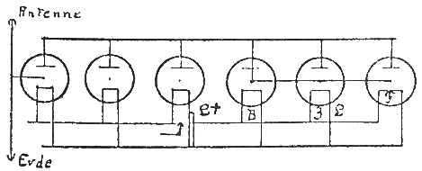
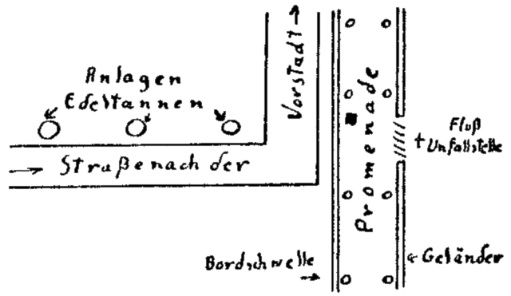

<@pagebreak 3/>

<h1>Das Schaltbild für sechs Röhren</h1>

<h2>1. Kapitel.</h2>

<h3>Haustochter gesucht …</h3>

Die Entscheidung fiel am 5. Januar, als Mathilde
beim Fensterputzen von der Leiter stürzte und nur infolge
ihrer Fettpolster glimpflich davonkam. Sie wiegt annähernd
zweihundert und ist unter Mittelmaß.

Es wurde also eine Anzeige eingerückt:

> Haustochter gesucht — und so weiter …

An diesem Tage mußte die Erbsensuppe weggegossen
werden, und Mathilde hatte verheulte Augen und sagte
zu unserer ständigen Aufwartung, einer bescheidenen
jüngeren Person: »Frau Lopitz, das wird nicht gut!« Sie
sagte das im Flur, als wir vorübergingen.

An demselben 5. Januar nachts zwölf Uhr ereignete
sich in der Industriestadt M. jenes furchtbare Unglück,
dem sechs sehr bekannte Persönlichkeiten der Farbenindustrie
zum Opfer fielen, außerdem die beiden Chauffeure
der Privatautos, in denen die Herren zu dreien
gesessen hatten. Sie hatten in einer Weinkneipe stark
gefeiert, auch die Chauffeure wurden nicht trocken gehalten,
und bei dem leichten Schneetreiben waren die
Autos, die dicht hintereinander fuhren, durch ein Versehen
<@pagebreak/>
des vorderen Fahrers durch den Balkenzaun des
Flußufers gerast, waren in den Fluß gefallen, hatten
die dünne Eisdecke durchbrochen, und sämtliche Insassen
ertranken. Die Straße war menschenleer gewesen, nur
ein Lastauto einer Vorstadtbühne, das gerade Kulissen
und ähnliches nach dem Lagerschuppen zurücktransportierte,
befand sich in der Nähe und alarmierte die Polizei und
die Feuerwehr.

Dies lasen wir morgens am 6. Januar unter Allerneuestes
in den Zeitungen, die auch unsere Haustochter-Anzeige
veröffentlichten.

Ich saß am Schreibtisch und blätterte in einem Buche.

Harst sagte hinter mir: »Es waren die sechs Herren
des Limburg-Konzerns, der die Silvestra-Farbwerke aufsaugen
wollte. Dieser Kampf Limburg-Silvestra währt
nun schon ein Jahr.«

Mich interessiert die Großindustrie nicht. Ich bin
Kleinindustrieller mit der Feder,

Nachher gingen wir in den verschneiten Grunewald
und aßen vorsichtshalber in der alten Fischerhütte am
Schlachtensee tadellose Hasenkeule.

Am nächsten Morgen stand in den Zeitungen zu lesen,
daß in M. ein neues Unglück geschehen sei. Die beiden
Leute des Lastkraftwagens, die das Versinken der Autos
beobachtet hatten, waren in ihrer Stube neben der Garage
durch ein undicht gewordenes Gasrohr in ein vielleicht
besseres Jenseits hinübergeschlummert.

Am 8. Januar holten wir die eingelaufenen Bewerbungsschreiben
ab. Gemeinsam mit Frau Harst trafen
wir die Auswahl und entschieden uns infolge Haralds
wortreichem Eintreten für Anni Bartel, Waise, zwanzig
Jahre, Tochter des verstorbenen Chemikers Emanuel Bartel,
Gossenburg bei M., Gossener Str. 17, zur Zeit ohne
feste Anstellung.

Die beigefügte Photographie zeigte ein zartes, liebliches
<@pagebreak/>
Geschöpf mit großen fragenden Augen. Die ebenfalls
beigefügten Empfehlungsschreiben waren erstklassig.

Eine Depesche ging an Anni Bartel ab samt Reisegeld.

Jetzt ergab sich Mathilde in ihr Schicksal, und das
Mittagessen, Bierkarpfen, war einwandfrei.

Am Tage drauf traf Anni ein.

Ihr Lichtbild hatte gelogen. Anni war sogar bildhübsch.
Anni war Sonne. Anni überwand Mathilde,
Anni konnte alles …

Sie hatte ihr Zimmer oben neben dem Laboratorium,
sie war flink wie ein Wiesel, bescheiden wie ein Veilchen,
fröhlich wie ein Zeisig, klug wie ein Bienchen: Eine Perle!

Abends saßen wir mit ihr im Wintergarten mit ihr
um den Tisch in Korbsesseln unter Palmen, draußen wütete
ein Schneesturm, Mathilde hatte sogar Kuchen gebacken,
Anni erzählte …

Sie hatte sich unter fremden Leuten herumgestoßen,
ihr einziger Bruder war im Kriege verschollen.

»… Stenotypistin war ich, Sekretärin, Statistin
beim Theater, Verkäuferin — alles war ich,« sagte sie
traurig. »Niemand behielt mich lange … Ich bin zu
offen, ich trage das Herz auf der Zunge, ich kann keine
Ungerechtigkeit dulden, erst recht keine zweideutigen
Annäherungsversuche …«

Sie stopfte unsere Socken dabei und blickte nur hin
und wieder von ihrer Arbeit auf.

Die Annäherungsversuche waren mir durchaus verständlich.

Ein reizendes, liebes Geschöpf.

»Gossenburg liegt dicht bei M.,« warf Harald ein.
Er spielte mit seiner Mutter Schach.

»Ja.« Anni blickte ihn flüchtig an.

»Liebe Mama, — matt gesetzt!«

<@pagebreak/>
»Wie immer, mein Junge.« Die alte Dame packte
die Figuren weg.

»Schach ist für mich Ersatz für andere Berechnungen,
Fräulein Bartel …« Er nickte ihr zu. »Bei uns herrscht
jetzt Flaute. Gestern war ein alter Herr hier, dem auf
der Durchreise gerade in M. sein Hündchen aus dem Zuge
sprang und gestohlen wurde. Es gibt Leute, die uns sogar
wegen stehen gelassener Regenschirme besuchen und dann
mit langen Gesichtern abziehen.«

»Ich habe gar kein Interesse für Kriminalgeschichten,«
meinte Anni kurz. »Ich lese nur Literatur. Das
arme Hündchen …! Ich habe Tiere so sehr gern.
Konnten Sie denn dem Herrn nicht helfen? Woher war
er?!«

»Aus Gossenburg,« erklärte Harald gleichgültig.

Annis Kopf flog empor. »Das ist merkwürdig. Auch
aus Gossenburg?! Vielleicht kenne ich ihm? Wie hieß er
denn?«

»Er hieß Peter Warze.«

Annis Augen wurden starr. »Oh, das alte Scheusal!
Der soll eines Hundes wegen sich aufregen, — der?!«
Sie war ganz bleich geworden. »Herr Harst, er war
Souffleur am Walhalla-Theater, wo ich kurze Zeit aus
Not Statistin spielte, — er war ein widerlichen Patron,
und der neue Besitzer entließ ihn auch sofort, nun haust
er in einer Dachkammer im Nebenhause, auch in der
Gossener Straße … Er soll einmal ein berühmter Tenor
gewesen sein, dann aber die Stimme verloren haben, ich
glaube er nannte sich damals Petrowitsch Sorani … Also
der war bei Ihnen … Kommt er nochmals her?«

Ihre Abneigung gegen diesen Mann, der also doch
existierte und den Harald empfangen haben mochte, als
ich gestern nachmittag beim Schneider zur Anprobe war,
mußte einen tieferen Grund haben. Sie gab dies auch
nachher mit größter Offenheit zu. »Er versuchte meinen
<@pagebreak/>
guten Ruf zu untergraben, er brachte mich ins Gerede,
er war schamlos genug zu behaupten, daß ich zu dem
jungen Silvestra Beziehungen unterhielte … Eine infame
Lüge!« Ihr Gesicht wurde von dunkler Röte Übergossen.
Ihre Stimme schwankte, ein paar Tränen erschienen
in ihren langen Wimpern.

»Aber liebes Kind, das hätte Ihnen doch sehr
gleichgültig sein müssen,« sagte Frau Harst voll warmer
Herzlichkeit und streichelte Annis Hände. »Ein gutes Gewissen
überwindet alles, und hier bei uns sind Sie nun
geborgen. — Harald, du wirst den Menschen doch nicht
mehr empfangen?«

»Nein, ich habe ihm sogar die Tür gewiesen, ich
hielt ihn für einen Spion, er machte so eigentümliche
Andeutungen,« erklärte Harald und blickte wieder in die
Wochenschrift, die stets einen besonderen Abschnitt für
Radioamateure bringt …

Annis Kopf hob sich mit einem Ruck. »Spion?!
Eigentümliche Andeutungen …?! — Das klingt so geheimnisvoll.«

»Ja. Aber Sie haben recht, es ist besser, junge Mädchen
halten sich von kriminellen Dingen fern.« Er schaute
nicht auf … »Ich gewann nur den Eindruck, daß er
gewisse Verdachtsmomente, die ihm über den Tod der
beiden Leute des Lastautos aufgestiegen sein mögen,
von mir bestätigt haben wollte. Er sprach zu viel über
das Unglück in M., über den schrecklichen Tod der acht
Autoinsassen … Dabei ist doch bereits erwiesen, daß die
Chauffeure angetrunken waren und infolge des Schneetreibens
den Weg verfehlten und über die Bordschwelle
und durch den Balkenzaun in den Fluß rasten.« Er gähnte
verstohlen. »So alte Herren wie Peter Warze haben eben
viel freie Zeit … Er liest zu viel Kriminalromane.
Gut, daß Sie es nicht tun, Fräulein Anni …«

Harst hatte die Zeitschrift weggelegt und den Kopf
<@pagebreak/>
leicht in die Hand gestützt. Der linke Ärmel der Hausjacke
war ihm etwas herabgerutscht, und seine Armbanduhr
lag frei. Ich sah, daß sie kurz vor zehn Uhr zeigte,
sah aber auch, daß er wiederholt auf das Zifferblatt blickte.

»Besaß Peter Warze-Sorani denn einen Hund?«
fragte er plötzlich.

Anni krauste leicht die Stirn.

»Ich glaube …« erwiderte sie ärgerlich. »Wenn
wir doch nur das Ekel ausschalten wollten!«

In demselben Augenblick erklang dicht vor den
Fenstern des Wintergartens auf dem Hofe das heisere,
klägliche, schrille Heulen eines kleinen Hundes.

Anni fuhr empor. Ihr Gesicht verlor jede Farbe.

»Was — war das, Herr Harst?!« flüsterte sie scheu.

»Wir werden nachsehen … Vielleicht wirklich ein
verlaufenes Hündchen … — Ich werde allein gehen,
mein Alter. Fräulein Anni könnte sich hier sonst fürchten.«

Zum zweiten Male erklang das klägliche Geheul,
jetzt noch lauter …

»Mein Gott!« stöhnte Anni Bartel und bedeckte das
Gesicht mit den Händen …

Harst kehrte sehr bald zurück.

»Ich habe nichts gefunden,« erklärte er und trocknete
seine schneefeuchten Hände. »Ein böses Weiter …!! Armer
kleiner Hund, er mag vor mir geflohen sein … — Ich
denke, wir gehen nun auch zur Ruhe.«

— Ich wußte jetzt, daß sich hier bei uns Dinge
vorbereiteten, die keine Parodie werden konnten.

Das Leben schreibt seine Romane mit ganz uneigennütziger
Feder, aber sehr farbenfroher Tinte.

<@pagebreak/>

<h2>2. Kapitel.</h2>

<h3>Nur ein Hündchen.</h3>

Nachdem wir Annis molliges Händchen zum Gutenachtgruß
gedrückt und die übliche Runde durch unsere Festung
gemacht hatten (das Eindringen ist immer schwerer geworden,
die Patentschloßindustrie schreitet vorwärts, und
die Eisenlädenfabrikation erzeugt Schutzklappen aus einem
Stahl, der sogar einem modernen Gebläse widersteht),
ging Harald in die Bibliothek und setzte sich an den in
letzter Zeit arg vernachlässigten Flügel und spielte ganz
piano Wagner: Lohengrin, Fliegenden Holländer, — —
zuletzt Grieg. Der Norweger liegt ihm vielleicht noch mehr
als Wagner.

Ich hatte mir all das, was in den letzten Tagen geschehen
war, durch den Kopf gehen lassen. Die Folge
war, daß ich mich leise aus dem Sessel erhob und unter
den melancholischen Klängen Griegs (Peer-Gynt-Suite)
das Arbeitszimmer betrat.

Die stillschweigende Vereinbarung zwischen uns, keine
Fragen zu stellen, wenn mein Freund nicht von selbst
zu sprechen beginnt, ist zuweilen unbequem. — Ich suchte
auf Harsts Schreibtisch nach den drei Empfehlungsschreiben,
die Anni ihrer Bewerbung beigefügt hatte. Ich fand sie
und prüfte sie aufs genaueste. Auch die Umschläge waren
noch vorhanden. Die Briefbogen trugen Monogramme, und
alle drei Schreiben stammten aus der M. benachbarten
Industriestadt F.

Harst sagte von der Tür her: »Die sind schon echt,
<@pagebreak/>
das ist selbstverständlich.« Ich hatte gar nicht gehört,
daß er sein Klavierspiel beendet hatte.

Er trat neben mich und schaute wieder auf die Armbanduhr.

»Um elf …« meinte er nur,

Eine sehr naheliegende Ideenverbindung brachte mich
auf das jämmerlich heulende Hündchen.

»Um elf wird er wieder heulen?«

»Ja, mein Alter … Er wird heulen, der Gespensterhund
… denn er ist tot.«

Er lehnte an der Schreibtischecke, und sein hageres
Gesicht war tiefernst.

»Anni weiß am besten, daß er tot ist, denn sie vergiftete
ihn, — er hieß Mohrchen und war ein kleiner
schwarzer sehr schlauer Zwergspitz mit wunderbarer
Dressur.«

Harsts graue Augen schlossen sich etwas, und die
Linien um den Mund wurden unbarmherzig. »Peter
Warze-Sorani, nennen wir ihn besser Sorani, war gestern
wirklich hier. Ich traf ihn im Vorgarten, wir sprachen
nur kurze Zeit miteinander. Heute bin ich seinetwegen sehr
in Sorge.«

»Das Wetter draußen,« fügte Harst ebenso leise
hinzu, »eignet sich nur zu sehr für einen hinterlistigen
Streich. Ich glaube kaum, daß sie ihn schonen werden. Er
hat Feinde. Es sind offenbar sehr großzügige Schurken.
Ich überlegte soeben, ob ich ihm nicht raten soll, um elf
den Hund nicht in Aktion treten zu lassen. Anderseits ist
anzunehmen, daß Anni Bartel einen zweiten sehr heilsamen
Schreck bekommt und aus Vorsicht vorläufig nicht
Bericht erstattet.«

Das war noch immer alles sehr unklar. »Du trafst
Sorani also vorhin auf dem Hof, als der Hund geheult
hatte?«

»Ja, — das war eigentlich das Einzige, was er mir
<@pagebreak/>
gestern mitteilte: Um zehn würde sich Mohrchen melden,
und ich sollte die Wirkung beobachten. — Vorhin raunte
er mir zu: »Um elf folgt die Fortsetzung, Herr Harst.
Welches Fenster?« Ich beschrieb ihm die Lage des Fensters
neben dem Laboratorium.«

»Also hat er einen anderen Hund sich angeschafft?«

»Nein. Er gab nur vor, sein Mohrchen sei an der
vergifteten Wurst gestorben, er lief zum Tierarzt und
kam ohne Mohrchen zurück.«

In meinem Kopf vergrößerte sich das Chaos.
»Wollen wir die Dinge nicht besser der Reihe nach durchsprechen,«
schlug ich vor.«

»Bevor wir nicht Peter Soranis Mitteilungen entgegengenommen
haben, bliebe alles Stückwerk. Er weiß ohne
Zweifel sehr viel, er tat Äußerungen, die für seine
Feinde sehr peinlich werden könnten, falls er sie ergänzt.«

Er blickte wieder auf seine Uhr. »Noch eine Viertelstunde
… Ich möchte doch lieber in den Vorgarten gehen.
Ich habe so ein scheußliches Gefühl der Beklommenheit.«

»Du kannst einen nervös machen,« — ich erhob mich.
»Also gehen wir hinaus, aber beide …« Ich verstummte.

Draußen heulte Mohrchen.

Die Front unseres Hauses lag unter Wind, und das
hohe Dach fing die Sturmstöße ab, so daß man hier in
den Vorderzimmern von dem Toben der winterlichen Elemente
wenig merkte,

Wir lauschten.

Da — nochmals heulte der Hund, — dann folgte ein
schriller Schrei, irgend etwas schlug mit dumpfem Krach
gegen die geschlossenen Fensterladen, und — — dann
nichts mehr.

Sekunden verharrten wir regungslos. Wir schauten
uns nur mit weiten Augen an, wir ahnten beide, das
wir leider zu spät den Entschluß gefaßt hatten, Peter
Sorani zu schützen.

<@pagebreak/>
Dann wurde die Flurtür aufgerissen, und Anni Bartel,
noch völlig angekleidet, stolperte über die Schwelle,
fiel beinahe in den nächsten Sessel, — sie war totenbleich,
in ihren Blicken lag ein wildes Entsetzen, sie zitterte, rang
nach Atem und keuchte schließlich:

»… Hörten Sie?! Wieder der … Hund!! Hörten
Sie?!«

Harst sagte nur: »Bleibe bei Anni, Schraut.«

Er verließ das Zimmer, die Haustür klappte, Anni
Bartel starrte mich verängstigt an. »Was ist geschehen?«

Es war vielleicht brutal von mir, meine wahren Gedanken
ungeschminkt preiszugeben.

»Ein Mord, fürchte ich!«

Anni sagte nur mit einem gekünstelten Seufzer: »Das
Ist … furchtbar!«

Ja, das war furchtbar, aber in anderer Hinsicht, als
die goldblonde Anni es gemeint hatte.

Die Tür ging wieder auf, im linken Arm trug Harst
einen kleinen schwarzen Spitz, der jetzt freilich durch das
Schneegestöber weiß besprenkelt schien, in der Rechten einen
Schneeklumpen, aus dem ein Stück Papier herausragte.

»Gehen Sie wieder zu Bett,« sagte er zu Anni.
»Hier ist das Hündchen … Kennen Sie es?«

Das Mädchen hatte sich kerzengerade aufgerichtet,
in ihrem Gesicht war keine Spur von Farbe mehr, sie
atmete nicht, sie hatte die Lippen fest zusammengepreßt,
sie war offenbar durch den Anblick des Tierchens um den
Rest ihrer Widerstandskraft gebracht, ihre Augen schlossen
sich plötzlich, und mit einem kaum vernehmbaren Seufzer
sank sie zur Seite und fiel vornüber auf den Teppich.

Harald zeigte eine Gefühllosigkeit, die nur sehr
schwerwiegende Gründe haben konnte. Er ließ den kleinen
Spitz auf den Boden nieder und beobachtete ihn gespannt.
Das Tierchen schüttelte sich die Nässe aus dem prächtigen
Behang, ließ dann die Rute noch tiefer hängen,
<@pagebreak/>
winselte leise und schnupperte argwöhnisch. Dann schlich
es zu Anni hin, wich zurück, knurrte und bellte heiser,
wich noch weiter zurück und verkroch sich in der Schreibtischöffnung.

»und — Sorani?« fragte ich ungeduldig.

»Verschwunden. Bringen wir Anni nach oben …
Sorani ist zweifellos niedergeschlagen und entführt worden,
darüber reden wir nachher. — Fasse mit an …
Es ist ein guter Vorwand, ihr Zimmer zu betreten.
Draußen können wir doch nichts ausrichten, da das Schneetreiben
noch zugenommen hat und alle Spuren im Moment
verweht werden.« Er legte den Schneeklumpen sorgsam in
einen Aschbecher und zog das Papier heraus und steckte
es zu sich.

Wir legten sie auf ihr Bett. Ich rieb ihr die Schläfen
mit Toilette-Essig ein, den ich auf ihrem Waschtisch fand.
Harald stand vor dem Fenster und schaute zu den offenen
Oberfenstern empor, durch die ein eisiger Luftzug hereinstrich.
Die eisernen Laden hatten etwa in der Höhe der
Mitte der Oberfenster zwei runde Löcher mit Verschlußklappen.
Die eine Klappe stand offen. Unter dem Fenster
stand ein Stuhl, der wohl als Trittleiter benutzt worden
war. Auf dem weißlackierten Fensterbrett lag eine elektrische
Taschenlampe größeren Formats mit einer sehr
starken Linse. Diese Linse war mit Tinte so geschwärzt,
daß nur ein Kreuz freigeblieben war.

»Es genügt,« nickte Harald. »Sie hat also doch signalisiert.
Nun heißt es, sie nicht argwöhnisch machen.
Da — sie erwacht schon …«

Anni Bartel blinzelte uns zunächst ohne Verständnis
an. Dann setzte sie sich jäh aufrecht, und ihr Blick verriet,
daß sie sich nun an die letzten Vorgänge genau erinnerte.
Trotzdem versuchte sie es mit einem gequälten Lächeln und
meinte verwirrt:

<@pagebreak/>
»Bin ich ohnmächtig geworden?! — Mir ist das
noch nie zugestoßen …« …

»Es wird auch weiter keine Folgen haben,« meinte
Harald höflich. »Sie haben hier für frische Luft gesorgt,
das ist sehr verständig. Mathilde hatte den Boden zu
stark gewachst, auch mir ist der Terpentingeruch unerträglich.
Legen die sich jetzt nieder, Fräulein Anni … Morgen
werden Sie frisch und munter sein. Gute Nacht.«

Er hatte die Tür schon halb geöffnet, als unten in
seinem Arbeitszimmer der kleine Spitz jämmerlich zu heulen
begann.

Anni starrte auf den Fußboden.

»Gott im Himmel — er lebt!« rief sie völlig von
Sinnen. »Er lebt! Und …«

Da erst besann sie sich, daß wir jedes Wort hörten.

»… Also … ist der Hund noch immer auf dem
Grundstück,« schloß sie ihren Satz mit einem kläglichen Bemühen,
sich selbst zu verspotten. »Ich bin eine Närrin.
Vor Hundegeheul sich zu fürchten! Wenn’s noch ein Käuzchen
wäre! Ein Totenvogel …! — Gute Nacht, meine
Herren … Verzeihen Sie, daß ich mich so lächerlich
benahm …«

<h2>3. Kapitel.</h2>

<h3>Das Schaltbild.</h3>

»Armer kleiner Kerl!« Harst rieb Mohrchen mit einem
Frottiertuch trocken und streichelte ihn. »Sollte man dein
Herrchen beseitigt haben, so werden wir Vaterstelle an dir
vertreten …«

Mohrchen winselte leise und ließ das Schwänzchen
hängen. Es war ein Spitz mit einem sehr zierlichen Kopf
<@pagebreak/>
und großen runden Augen, aus denen jetzt das ganze
tiefe Leid einer Hundeseele sprach.

Erst nach längerem Zureden gelang es uns, den neuen
Gast an die warm ausgepolsterte Sofaecke zu gewöhnen.

Harald ging dann nochmals in den Vorgarten und
kehrte mit einem langen Angelstock, zusammenschiebbar,
zurück. An dem einen Ende war ein Brettchen befestigt,
an dem noch Bindfäden hingen.

»Sorani hatte ihn festgebunden,« sagte Harst und
schob die Teile des Stockes zusammen. »Bevor er niedergeschlagen
wurde, warf er noch den Schneeball gegen den
Fensterladen — mit dem Papierstück. Als ich draußen
erschien, vernahm ich gerade noch das Schnurren eines
Automotors.« —

Er nahm das nasse Papier aus der Tasche, breitete es
vorsichtig auf der Löschblattunterlage des Schreibtisches
aus und machte ein sehr verdutztes Gesicht.

»Ja — offenbar ein Schaltbild für einen Sechsröhrenempfänger!«

Ich beugte mich tiefer.

Es schien zu stimmen. Die Zeichnung war mit unverwaschbarer
Tinte auf einen Zeichenkarton, Größe 30: 40,
sehr sauber, aber unvollständig entworfen.

Sie sah so aus:

<@pagebreak/>

»Eine harte Nuß,« meinte Harald kopfschüttelnd. »Die
Schaltskizze ist als solche unsinnig, unvollständig und daher
verdächtig. Was sollen die Buchstaben L†, B, Z, L,
F?! Weshalb sind die Gitter der vierten, fünften und
sechsten Röhre durch Striche verbunden?! — Sehr merkwürdig!«

»Allerdings! Und doch muß die Zeichnung Wert
gehabt haben. Sorani hätte sie sonst nicht durch einen
Schneeball an den Fensterladen geklebt.«

»und sie nicht seinen Häschern entzogen!« pflichtete
Harald mir bei. »Wie gesagt, aus seinen Äußerungen
mir gegenüber war sehr wenig zu entnehmen, lediglich
das eine: Der Tod der beiden Leute des Lastautos und
der acht Insassen der Privatwagen muß miteinander irgendwie
zusammenhängen. — Er war auch sichtlich schon
gestern in Angst vor Verfolgern, und dann …« —
Harst schwieg eine Weile und betrachtete gedankenversunken
die Zeitung — »dann hat er eben noch erklärt, er würde
sich heute abend um zehn durch seinen Hund melden,
ich solle jedoch Anni Bartel davon nichts mitteilen. Also
wußte er, daß Anni hier bei uns eingetroffen war, also
durfte er schon mit so bissiger Feindseligkeit hinzufügen,
gerade sein Hündchen würde seine Stimme erheben, das
Anni vergiften wollte … — Nun kennst du alles, was
ich kenne, mein Alter, nun mache einen Vers daraus,
bitte …«

Ich setzte mich ihm gegenüber, und er diktierte, jedes
Wort abwägend:

1\. Am 5. Januar vormittags Annonce in drei Zeitungen
und zwei Abendblättern nach Haustochter. —
Abendblätter bringen sie noch am selben Abend auf
meinen besonderen Wunsch. — Annonce kann also schon
am sechsten früh zu Annis Kenntnis gelangt sein.

2\. Am 5. Januar abends 11 Uhr 45 Minuten Autounglück
in M. — Acht Personen ertrinken. Einzige Zeugen
<@pagebreak/>
des Unfalls sind zwei Leute des Vorstadttheaters Walhalla
in M., die Kulissen und so weiter mit Kraftwagen
nach Schuppen zurückbringen. — Dieser Unfall insofern
ganz unbegreiflich, als nur leichter Schneefall herrschte
und an der Wegbiegung vor dem Fluß eine Laterne steht,
die brannte. Anderseits waren die Herren und die
Chauffeure angetrunken. Trotzdem bleibt der Unfall unverständlich,
da gute Beleuchtung und bekannter Weg für
die Chauffeure, — die verunglückten Herren waren die
Direktoren und Hauptaktionäre des Limburg-Konzerns, der
die Silvestra-Werke um jeden Preis an sich bringen wollte.

3\. Am 6. Januar morgens findet man die beiden
Leute des Lastkraftwagens durch Leuchtgas vergiftet tot
auf. — Später stellt die Polizei fest, daß ein Verbrechen
vorliegt. Ein Gasrohr war angefeilt worden. Polizei nimmt
an, daß die beiden Leute vorher betäubt worden sind.
Sektionsbefund steht noch aus.

4\. Am 8. Januar wird Anni Bartel telegraphisch berufen,
nachdem mir — gib acht, Max Schraut — aufgefallen
war, daß die ihrem Bewerbungsschreiben beigefügten
drei Empfehlungsbriefe sämtlich von Personen
stammten, die in der Industriestadt F., unweit M., wohnten
und den Silvestra-Farbwerken irgendwie nahestanden.«

— Ich blickte ihn überrascht an.

»Es ist so, mein Alter … — Schreibe nur weiter:

5\. Am 9. Januar nachmittags trifft Anni ein. —
Erster Eindruck mäßig. Zu elegant gekleidet, zu nervös.
Ihre Lektüre alles ganz neu gekaufte Bände. — Abends
Unterhaltung mit ihr über Peter Warze-Sorani, der am
8\. nachmittags mich kurze Zeit im Vorgarten sprach und
Verdacht wegen der beiden Unfälle in M. geschöpft hatte.
— Um zehn Uhr Zwischenfall mit Mohrchen. Anni verrät
größte Bestürzung. — Um drei Viertel elf Uhr zweiter
Zwischenfall mit Hund und Sorani und Zettel und Annis
Ohnmacht. Wir finden oben bei ihr präparierte elektrische
<@pagebreak/>
Lampe und Oberfenster und Ladenklappe offen. — Annis
Verhalten wieder sehr verdächtig. — Zettel anscheinend
Schaltskizze, wahrscheinlich sehr bedeutungsvoll. —

So, Max Schraut, das wäre vorläufig alles, und es
ist übergenug. — Schlußfolgerung?«

Ich überlegte mir die Antwort erst sehr gründlich.
Harst ließ mir Zeit. Er betrachtete wieder das Schaltbild.

Er holte sich einen Stoß neuester Zeitungen, er blätterte
darin, schnitt diejenigen Artikel, die sich auf unseren Fall
bezogen, aus und klebte sie in eine unserer Sammelmappen.
Wir hatten telephonisch aus M. auch das dortige
Hauptblatt bestellt, weil die Lokalpresse das Autounglück
und den Gasmord natürlich weit eingehender gebracht
Hatte. Ich hatte auch diese Artikel sofort studiert, aus
ihnen ging jedoch einwandfrei hervor, daß die Polizei,
was den Tod der Art Ertrunkenen betraf, lediglich den
Chauffeuren die Schuld beimaß, die in ihrem angesäuselten
Zustand mit unvorschriftsmäßiger Geschwindigkeit gefahren
waren und die Straßenbiegung nach links nicht rechtzeitig
erkannt haben mochten. »Völlig aufgeklärt wird der Unfall
nie werden,« schloß der letzte Artikel. »Es sei nochmals
betont, daß der leichte Schneefall die Sicht nicht
derart behinderte, daß der Chauffeur des vorderen
Wagens über die Bordschwelle an der brennenden Laterne
vorbei und über die Uferpromenade auf den Uferzaun losgerast
sein könnte. Die einzigen Zeugen, die Insassen des
Lastwagens, haben betont, daß die Laterne brannte, daß
die Büsche der Anlagen neben der Straße ebenso deutlich
zu erkennen waren wie das Laternenlicht und der Uferzaun.
Es bleibt also nur die Annahme: Starke Trunkenheit
der Chauffeure und unzulässige Geschwindigkeit.«

Trotzdem konnte ich mich von dem Gedanken nicht
freimachen, daß, wie schon Sorani angedeutet hatte, hier
ein Verbrechen vorläge, bei dem die beiden Leute des
Lastwagens als Alleinschuldige in Betracht kämen. Ich
<@pagebreak/>
fand nur keine einleuchtende Möglichkeit, wie die beiden
es angestellt haben sollen, die Privatautos in den Fluß
zu befördern. Selbst wenn die Leute das Lastauto etwa
plötzlich an der Wegbiegung als Hindernis quer über
die Straße gelenkt hätten, würde der Fahrer des vorderen
Autos noch immer Zeit gefunden haben, seinen Wagen
herumzureißen, und dieser wäre schlimmsten Falles auf
die vier Meter breite Uferpromenade geraten. Und noch
eins:

Die Polizei hatte auf dieser wenig befahrenen Straße,
die nur zu einem neuen Villenviertel führte und dann
im Bogen in die Vorstadt Gossenburg mündete, schon an
den Radspuren im Schnee einwandfrei erkannt, daß die
Privatautos vollkommen gleichmäßig, also ohne jede Wendung,
ohne jedes scharfe Abbiegen, über die Bordschwelle
und die Promenade gegen den starken Zaun geprallt
und in den Fluß geflogen waren.

Ein sehr schwer zu entscheidender Fall also. Man
konnte die Sache drehen und wenden wie man wollte:
Sie blieb in der Tat ein Rätsel! Die Chauffeure, besonders
der Chauffeur des vorderen Wagens, konnte doch nicht
so betrunken gewesen sein, daß er die Laterne an der
Biegung übersah! Ausgeschlossen! —

Es gab vielleicht noch eine andere Art, ein solches
Verbrechen herbeizuführen: Man hätte die Chauffeure
etwa kurz vor der Biegung erschießen können, so daß die
Autos führerlos geradeaus in den Fluß sausten. —
Hiergegen sprach die Totenschau. Die Chauffeure waren
unverletzt, nur eben ertrunken. — »Man beachte das,«
hatte Harald heute früh zu mir gesagt.

Und nun verlangte er von mir eine Schlußfolgerung!

Berücksichtigte man die anderen Vorfälle, die ich
soeben sauber notiert hatte, mußte man unbedingt Argwohn
schöpfen. Anni Bartel war als Spionin zu uns gekommen.
Sie haßte gerade den Mann, der ebenfalls aus
<@pagebreak/>
Gossenburg bei uns erschienen war, dem sie vorher dem
Hund zu vergiften gesucht hatte, der ebenfalls Verdacht
hegte, der niedergeschlagen und verschleppt worden war,
der jedoch noch Zeit gefunden, die seltsame Schaltskizze
an den Fensterladen zu kleben! Und — Anni hatte signalisiert!
Die Lampe mit der geschwärzten Linse, die offene
Klappe des Fensterladens, das war eindeutig genug.

Ein schwerer Fall!

Ich sagte schließlich: »Ein bestimmter Verdacht läßt
sich vorläufig kaum äußern. Wir müssen Anni weiter beobachten
und herauszubringen suchen, mit wem sie Signale
austauschte.«

Harst nickte. »Sehr richtig, mein Alter. Anders hätte
auch ich nicht geantwortet. Ein Doppelverbrechen liegt
vor. Das »Wie« des Todes der acht Personen bleibt
dunkel. Dieses Dunkel kann nur Anni lichten. Es gibt da
so viele Nebenumstände, die auf Anhieb nicht unterzubringen
sind. Ein Interesse am Tode der sechs Herren
des Limburg-Konzerns hatte lediglich die Silvestra-Aktiengesellschaft.
Der alte Kommerzienrat Silvestra starb vor
zwei Jahren an einem Herzschlag infolge der Aufregungen
des Kampfes mit dem Konzern. Generaldirektor der Silvestra
ist jetzt sein Sohn Hektor Silvestra, dreißig Jahre,
Junggeselle, Doktor Juris, glänzender Geschäftsmann,
Gentleman — derselbe, der mit Anni ein Verhältnis gehabt
haben soll. Soll …!! Peter Sorani »soll« dieses
Gerücht verbreitet haben. Anni »soll« dessen Hund vergiftet
haben. Gesehen hat’s Sorani sicherlich nicht. Aber
*wir* sehen, daß wir uns ins Uferlose verlieren, wenn wir
alle Begleiterscheinungen abwägen.« Er schwieg und seine
Züge wurden noch härter und finsterer. »Ein ungeheuerliches
Verbrechen ist verübt worden, zehn Menschenleben
gingen verloren, vielleicht gar elf — Sorani —, vielleicht
noch mehr folgen.«

Wieder schwieg er. Er blickte den Rauchwolken seiner
<@pagebreak/>
Zigarette nach … Dann tippte er mit dem Finger auf
einen der Artikel, den er soeben eingeklebt hatte.

»Das Walhalla-Theater wurde von Silvestra aufgekauft,
steht hier … Vergiß auch das nicht, mein Alter.
Hätte der Limburg-Konzern es erworben, wäre Hektor
Silvestra weniger belastet. So aber?! Er bestach vielleicht
die beiden Leute des Lastautos und … tötete sie nachher.
— Wir drehen uns im Kreise … Es hat keinen Zweck,
— handeln wir! Es ist sicher, daß Anni durch Mohrchens
Geheul gerade beim Signalisieren gestört wurde. Sie wird
nun warten, bis sie uns im Bett vermutet. Gehen wir also
etwas geräuschvoll schlafen, schließen wir die Türen mit
Lärm, verhalten wir uns dann still, bleiben wir in Kleidern,
— wir wollen drüben auf die Straße, das eine
Dachatelier in der Mietskaserne war bis gestern leer, heute
brennt dort Licht, brannte …! Der neue Mieter wird es
sich gefallen lassen müssen, daß wir ihn besuchen …«

Der neue Mieter wurde für uns die größte Überraschung
dieser Nacht.

<h2>4. Kapitel.</h2>

<h3>Das Dachatelier.</h3>

Eine Stunde später standen wir in der Mietskaserne
am obersten Flurfenster im Dunkeln. Das Schneetreiben
hatte ein wenig nachgelassen, aber der Sturm heulte mit
unverminderter Gewalt. Wir sahen schräg gegenüber unser
eigenes Heim, den verschneiten Irrgarten, die alten Lindenbäume
mit weiß bepuderten Ästen, — wir sahen nichts
von einem Lichtschein, kein leuchtendes Kreuz … Anni
<@pagebreak/>
signalisierte nicht, — nicht mehr — oder noch nicht
wieder.

Wir warteten. Geduld ist Voraussetzung des Erfolges.

Über uns, eine halbe Treppe höher, lag die Mansarde,
lagen die aufgestockten Atelierwohnungen. Der
Hausbesitzer hatte damit schlechte Geschäfte gemacht. Junge
Künstler leben in ständigem Dalles. Ihr Mobiliar hat
keinen Wert, ihre Werke erst recht nicht. Hausverwalter
Klammer haßte diese Bohemiens.

Es wurde halb zwei, zwei. Wir froren trotz der
Sportpelze, trotz der Überschuhe, trotz der Kognakflasche.

Harst blickte auf das grüngelbe Zifferblatt. Die
schwarzen Zeiger der Armbanduhr hoben sich scharf ab.

»Zwei,« flüsterte er. »Bis drei warten wir.« Er
hielt Bleistift und Papier bereit, um die Morsezeichen
zu notieren, die von Anni vielleicht gegeben wurden.

Vielleicht …

Dann — drüben bei uns im ersten Stock ein Lichtblitz
— ein kleines, grelles Kreuz …

Vom Fenster Annis her …

Also doch!

Das grelle Kreuz fiel kaum auf. Es war winzig
klein auf diese Entfernung. Es blieb eine Weile regungslos,
dann … drehte es sich. Soeben hatte es noch senkrecht
gestanden. Und es war ein richtiges Kreuz mit kürzerem
Querbalken. Es drehte sich nach rechts, und nun
stand der Querbalken senkrecht.

Harst schrieb, ich hielt die mit der Mütze bedeckte
Taschenlampe. Er schrieb:

»Eine Viertel Drehung rechts.«

Dann drehte sich das Kreuz in die alte Lage zurück,
verharrte so Sekunden, drehte sich nach links.

Harst schrieb:

»Zurück in Grundstellung.«

»Viertel nach links.«

<@pagebreak/>
»Sehr schlau,« meinte er leise. »Keine kurzen und
langen Lichtblitze … Eine böse Arbeit, diese Meldung
zu entziffern!«

Das Kreuz änderte dauernd seine Stellung, — halbe
Drehungen, ganze, Vierteldrehungen, — — das ging so
eine geraume Weile.

Harst schrieb.

Einzelne Zeichen konnten wir nicht erkennen, da der
Sturm von unserem Dach ganze Schneewehen herab wirbelte.

Das Kreuz erlosch und wurde nicht wieder sichtbar.

»Nach oben!« — Harald schlich bis zur Ateliertür.
Eine neue Karte war mit einer Heftzwecke neben der
Klingel befestigt. Mit Tinte stand darauf:

Aloysia Brackmüller,

Kunstmalerin.

Harald wandte seine Taschenlampe der Bodentreppe
zu. »Die Tür hat ein Sicherheitsschloß … Wir wollen
auf das Glasdach … Dort ist ein Lüftungsfenster …
Und Ich bin schlank.«

Auf dem Trockenboden entliehen wir eine Wäscheleine.
Die Dachluke war verschlossen, aber unsere Schlüssel passen
überall, nur bei Patentschlössern versagen sie.

»Trinken wir …« — Der Kognak war nötig.
Draußen waren zwei Grad Kälte, und auf dem Dach
würde uns der Sturm mit voller Gewalt treffen.

Es war in der Tat kein Vergnügen, die Leine um
den Schornstein zu knoten und bis zum gewölbten Glasdach
hinabzurutschen. Harst wagte es. Im Atelier war
Licht, trübes Licht. Die Vorhänge schützten nur den nicht
gewölbten Teil.

Harald rutschte vorsichtig abwärts, ich kauerte neben
dem Schornstein. Die Wäscheleine war neu und fehlerfrei.
Sie würde schon halten. Außerdem lag unter dem
<@pagebreak/>
Atelierfenster der Balkon einer Wohnung, — ein Sturz
wäre also nicht allzu schlimm geworden.

Harst gelangte bis zu der Lüftungsklappe, säuberte
sie von den Schneemengen und blickte in das Atelier
hinab. Nach einer Weile öffnete er das kleine Fenster,
zog die lose herabhängende Leine empor, ließ sie in das
Atelier gleiten, winkte mir und verschwand.

Es war ausgeschlossen, daß im mit meinem Sportpelz
durch das Fenster hindurchkonnte. Es blieb mir nichts anderes
übrig, ich mußte den Pelz ablegen.

Ich zwängte mich durch das Fenster, Harst stützte
mich und flüsterte:

»Schließe die Klappe!«

Er stand auf einem Stuhl, dann stand auch ich auf
den kahlen Dielen und blickte starr auf die Frauengestalt
in der Sofaecke neben dem Kachelofen …

Die Frau schlief.

Auf dem Tische neben ihr stand die Erklärung für
ihr melodisches dumpfes Schnarchen in Gestalt einer
Flasche Kümmel und eines noch halb gefüllten Fernglases.
Die Frau hatte einen Mantel mit Pelzkragen an,
trug dazu eine schwarze Filzkappe mit schwarzem herabgezogenem
Schleier, — die Hände hatte sie in die pelzbesetzten
Ärmel geschoben, der Kopf ruhte an der Sofalehne,
die Beine hatte sie vorgestreckt, die Füße steckten
in hohen Gummischuhen mit Reißverschluß. Sie hatte sehr
dünne Beine.

Harst betrachtete die Schläferin sehr lange. Von
ihrem Gesicht war nichts zu sehen, so gut wie nichts …
Der Schleier verhüllte einen mageren Kopf. Aloysia Brackmüller
war stark angejahrt.

Harsts Blicke überflogen den Tisch. Die Flasche
Kümmel, das Glas, ein Aschbecher mit Zigarettenresten
leisteten einer elektrischen Schreibtischlampe mit grüner
Glasglocke, unter der nur eine trübe Birne brannte, und
<@pagebreak/>
einem Notizblock nebst Bleistift freundlichst-trostlos Gesellschaft
Der Wachstuchüberzug des Tisches war zerrissen.

Er nahm den Notizblock und las, was auf das obere
Blatt gekritzelt war. Ich las mit:

> Hund bei Harst. Hat vielleicht schon Argwohn. Sofort
Hektor Meldung. — Morgen abend halb zwölf
wieder. Größte Vorsicht. Warze muß für immer †.

Wir schauten uns an und verstanden uns.

Also doch Hektor Silvestra! Und das † hinter dem
auf Warze gemünzten Satz, — — eine Mörderbande!

Harst steckte das Blatt zu sich.

Die Frau schnarchte, im Atelier roch’s nach Kümmel
und Zigaretten. — Aloysia war doch nicht vorsichtig genug
gewesen.

Harald überlegte. Wir standen rechts von dem Tischchen,
ein Meter vor uns ruhten Aloysias magere Stelzen
auf den kahlen Dielen. Sie bewegten sich zuweilen. Die
Reißverschlüsse der Überschuhe waren halb offen.

Harst streckte die Hand aus und …

… Er hatte Aloysia wecken wollen …

Er wollte wecken und schlief selbst ein, — er fiel
plötzlich vornüber wie ein Klotz, — im selben Moment
schnellte das Weib hoch, ich fühlte eine Faust, der Hieb
saß — Herzgrube, auch ich knickte um, rang nach Luft,
spürte Schwindelgefühl, wälzte mich zur Seite, riß Harst
mit mir, — ich hörte eine Tür klappen, — — ich zerrte
Harst weiter und weiter, hinein in den Flur, drückte die
Tür zu …

Ich hatte etwas gesehen, was verderblich war …
Hätte ich es nicht bemerkt, wären wir nicht lebend davongekommen.

Das Weib war geflüchtet. Mochte sie. Wir hatten
ja den Zettel. Ich hatte auch genug mit Harst zu tun,
obwohl mir selbst so jämmerlich zumute war, daß ich vor
Schwächegefühl schwitzte.

<@pagebreak/>
Kognak und frische Luft brachten meinen Freund nach
einer halben Stunde halbwegs wieder auf die Beine. Ich
hatte in der kalten Küche das Gas des Herdes, beide
Flammen angezündet, ich hatte dann mit angehaltenem
Atem mich in das Atelier gewagt und das Unterfenster
weit aufgestoßen und war in die Küche zurückgelaufen.

Harald lag auf den Dielen. Er blinzelte mir zu und
nickte schwach. »Es geht schon wieder, mein Alter …«
Seine Stimme klang nach Mandelentzündung. »Gas —
nicht wahr?«

»Ja. Die Kanaille hatte den Schlauch zwischen die
Füße geklemmt, die Gasflasche muß unter dem Sofa
stehen … Das Fenster ist nun offen, und wir werden
wohl bald hineinkönnen.«

In der Küche befand sich nicht einmal ein Stuhl.
Ich lehnte am Herd, und der kleine Raum wurde schnell
warm.

Harst stützte den Kopf in die Hand. »Es muß ein
unbedingt tödliches Zeug gewesen sein, mein Alter. Ich
verlor im Moment das Bewußtsein. Diese Aloysia, die
natürlich nicht Aloysia heißt, muß einmal Boxerin gewesen
sein, denn dich mit deinen Fettpolstern so glatt
niederzuschlagen, ist nicht ganz einfach.«

Wir lauschten dem Jaulen des Sturmes. Ich dachte
an meinen Pelz droben neben dem Schornstein. Hoffentlich
bekam er nicht Flügel.

»Ich werde meinen Pelz erst mal holen, Harald …«

»Bitte …« Er wälzte sich auf die Seite und langte
nach der Schlüsseltasche. Er entsicherte seinen schwarzen
Kugelspucker … »Man kann nie wissen … Nimm auch
du die Clement zur Hand …!«

»Hm — die wird sich hüten, zurückzukehren …!«

»So?! Und der Zettel?! Sie wird doch den Zettel
nicht hierlassen. Wenn unsere Leichen gefunden worden
<@pagebreak/>
wären, hätte der Zettel ihr das Spiel verderben können.«

»Du hast recht, Harald.«

Als ich in den Mansardenflur gelangte, merkte ich,
wie recht er gehabt hatte. Ich hatte die Taschenlampe
eingeschaltet, ihr Lichtkegel fiel auf die Treppe, — schattengleich
huschte eine Gestalt nach unten, — ich hinterdrein,
— es war das Weib, ich mußte sie fangen, ich würde
schießen, — — ich sprang die Stufen abwärts, — —
als ich an die offene Haustür kam, sauste gerade ein geschlossenes
Auto davon, ich sah nur noch einen Arm
des Weibes, — — verärgert drückte ich die Tür zu
und eilte zum Dach empor, mein Pelz lag unter einer
Schneeschicht, und Pelz bleibt Pelz …

In der Küche fand ich nur noch Zigarettenrauch, Harst
stand mit der Zigarette im Mundwinkel vor dem Sofa.

»Komm’ nur näher,« krächzte er. »Da — eine sehr
schlaue Einrichtung, Patent Aloysia …«

In die Rückenlehne des kleinen Sofas war eine Hutnadel
mit breitem Knopf hineingestoßen. Als wir es von
der Wand rückten, sahen wir, daß die Spitze der Hutnadel
den Hebel der kleinen Gasstahlflasche aufgedrückt
haben müßte. Das Weib hatte sich also nur stärker zurückzulehnen
brauchen, dann öffnete sich der Hebel, und das
Gas strömte uns durch den Schlauch entgegen.

»Imponiert mir!« sagte Harald sehr ernst. »Die Leute
verstehen ihren Kram. Unser Leben ist keinen Pfennig
mehr wert. Es wird nicht bei diesem Versuch bleiben, zumal
wir jetzt den Zettel haben. — Also im Auto kniff
sie aus … Wahrscheinlich dasselbe Auto, das den armen
Peter Sorani entführte … Schauen wir uns hier einmal
genauer um.«

Ich hatte niemals erwartet, daß wir noch etwas
finden würden. Aloysia hätte doch ihre Sachen vorher
wegschaffen sollen. Sie schien jedoch bestimmt mit unserem
endgültigen Ausscheiden gerechnet zu haben, denn in dem
<@pagebreak/>
Stübchen standen auf dem Bett zwei Handkoffer, der eine
war offen, den anderen öffneten wir und breiteten den
Inhalt sauber aus: Frauenkleider, Wäsche, Toilettensachen,
eine Repetierpistole, eine Taschenlampe mit sehr großer,
geschwärzter Linse, in der Mitte ein frei gebliebenes Kreuz.

Aber außer einer Quittung nicht ein Fetzen Papier.
Die Quittung lautete über 180 Mark Miete, gezahlt für
das Atelier für drei Monate durch Aloysia Brackmüller an
den Hausverwalter Klammer, Blücherstraße 21.

Harst steckte die Quittung ein. »Suchen wir weiter,
mein Alter …«

Er besah sich den Notizblock auf dem Tisch im Atelier.

»Ganz neu … Wichtig. — Schau’ her, es fehlen
nur zwei Blätter. Der daran festgebundene Bleistift ist
kaum benutzt. Die Spitze nur sehr wenig abgeplattet. Auch
wichtig.«

Er durchstöberte jeden Winkel, er nahm sogar den
ganzen Inhalt des Aschbechers in einer Tüte mit. Wir
schlossen das Atelier ab und kehrten sehr vorsichtig heim.
Es schneite wieder stärker. Ich hatte das peinliche Gefühl,
daß jeden Augenblick irgendwo Schüsse aufblitzen könnten,
aber wir erreichten mit heiler Haut Haralds Arbeitszimmer,
ich holte die Mokkamaschine, Tassen, Gebäck, —
wir machten es uns gemütlich, und Harald rauchte wie
ein Dampfer, trank den starken Kaffee, knabberte Keks
und … sprach nicht ein Wort.

Als er sprach, mißfiel mir’s gründlich.

»Ich verreise noch diese Nacht, mein Alter. Du erklärst,
eine Depesche habe mich nach Hamburg gerufen.
Du läßt Anni nicht aus den Augen.«

»Und wohin fährst du?«

»Ich gehe … Ich werde das Atelier beziehen.
Freund Klammer wird eingeweiht. Hilf mir packen …
Ich gehe als Frau, als Aloysia. Es wird lohnen, hoffe
ich.«

<@pagebreak/>
»Hm …!«

»Bitte, denke an die Lichtsignale … an den Notizblockzettel.
»Morgen um halb zwölf wieder,« steht darauf.«

— Um vier Uhr war ich mit Mohrchen in meinem
Schlafzimmer allein …

<h2>5. Kapitel.</h2>

<h3>Aloysia und Anni.</h3>

Als ich durch den schnarrenden Wecker ermuntert
wurde, verwünschte ich sekundenlang sämtliche Annis der
Welt.

Ich führte dann Mohrchen — es war schon hell
geworden — in den Garten, wo er alles erledigte, was
Hündchen erledigen sollen, — ich rief dann das Fernsprechamt
an, ließ mich (wie mit Harst vereinbart) mit
der Aufsicht verbinden und bat, unseren Apparat sofort
zu sperren. Nur Anrufe von mir persönlich sollten vermittelt
werden. Nach einigem Hin und Her war auch
das geregelt, und ich war nun sicher, daß Anni von der
Außenwelt abgesperrt war. Ich ließ mich dann mehrmals
mit jemand verbinden, und der Inhaber des Instituts
war rasch im Bilde, sagte mir gewissenhafteste Erledigung
zu, — eine halbe Stunde drauf war unser Haus auch
außen abgeriegelt. Vorn wachten zwei Leute, hinten wachten
zwei, — je einer hatte ein leichtes Motorrad in
Bereitschaft.

Am Frühstückstisch gab es lange Gesichter, als ich
Harald bei den Damen entschuldigte und von der Hamburg-Reise
geheimnisvoll sprach. Anni war munter und
<@pagebreak/>
redselig, die langen Gesichter klärten sich auf, Mohrchens
herziges Wesen trug viel dazu bei, die Stimmung wieder
zu heben.

Frau Harst lächelte nachsichtig, als Anni dann über
ihre Angst vor Mohrchens kläglichem Geheul sprach und
die Sache wieder ins Lächerliche zog.

Nein, — Schauspielerin hätte Anni nie werden
können, es reichte bei ihr nicht einmal zur Spionin kleinsten
Ausmaßes. Ihre scheuen Augen mir gegenüber straften
ihr törichtes Geplapper Lügen.

Trotzdem tat sie mir leid. Sie war hübsch und elegant,
sie hatte eine angenehme Stimme, sie war rosig wie
ein Maimorgen, und die Schatten unter den Augen erhöhten
nur noch den Reiz dieses holden Antlitzes. Daß
Mohrchen sie zunächst anknurrte, schmerzte sie scheinbar
sehr, aber ihre unermüdlichen Versuche, sein Hundeherz
zu erobern, gelangen überraschend schnell.

Nachher schlängelte ich mich mit Mohrchen zu
Mathilde in die Küche.

Die Morgenzigarre und die Zeitungen kamen an
die Reihe. Mohrchen spielte mit einem Gummiball und
war kreuzfidel.

Ich nahm zuerst die Zeitung aus M. vor, die
unter Kreuzband geschickt wurde. Der tragische Autounfall
war erneut in einem längeren Artikel behandelt worden,
und das Wichtige daran war eine genaue Skizze der
Straße und des Flußufers sowie eine Photographie der
beiden Automobile, wie sie gerade durch Kräne gehoben
wurden. In dem Artikel hieß es, daß das eine Auto
sich mit den Rädern in den Flußschlamm eingewühlt hatte,
das andere aber umgekippt dicht daneben mit den Rädern
nach oben gelegen habe. Das Verdeck des ersten war halb
eingedrückt — ein Beweis, daß das zweite im Sturz
auf jenes aufgeprallt war. Die Leichen waren schon vorher
durch Taucher geborgen worden,

<@pagebreak/>
An der Skizze fiel mir etwas auf: Es waren die
Radspuren der beiden Autos, die von der Polizei in dem
frisch gefallenen Schnee noch recht deutlich hatten erkannt
werden können, mit eingezeichnet. Diese Radspuren verliefen
vollständig geradeaus, — also auf den Fluß zu.
Ein neuer Beweis, daß keine Rede davon sein konnte,
daß etwa das Lastauto dem vorderen Wagen an der Wegbiegung
nach links als Hindernis die Straße gesperrt
hätte.

Der Fall wurde immer rätselhafter dadurch.

Ich schnitt die Skizze und den Artikel aus und klebte
sie säuberlich in die Sammelmappe ein. Ich saß dabei
an Haralds Schreibtisch, und erst ein kühler Lufthauch
von rechts ließ mich den Kopf wenden. In der Tür stand
Anni, — sie war eingetreten ohne anzuklopfen, und sie
hielt es nicht einmal für nötig, sich dieserhalb zu entschuldigen.
Ihr Gesicht verriet zornige Erregung, sie begegnete
meinem erstaunten Blick mit einem bitteren Auflachen
…

»Ich wollte telephonieren,« sagte sie sehr gereizt und
schloß die Tür mit überflüssigem Schwung und trat dicht
an den Schreibtisch heran. »Das Amt erklärte, der Anschluß
sei gesperrt … Außerdem …« — sie stockte,
wurde verlegen, und stieß noch gereizter hervor: »Ich
will jedenfalls telephonieren, Herr Schraut.«

»Bitte, gern … Amt und Nummer? — Sehen Sie,
einem Haushalt wie hier bei uns sind gewisse Vorsichtsmaßregeln
unbedingt nötig.«

Sie preßte die Lippen zusammen. Ihre Augen
drohten, ihre ganze Haltung war Empörung und Feindseligkeit,
»Gestern abend habe ich doch noch telephonieren
können,« sagte sie höhnisch.

Auch darauf war ich vorbereitet. »Gewiß, — in der
Nacht kam jedoch die Depesche, und Harst befahl mir,
das Amt zu verständigen.«

<@pagebreak/>
»Merkwürdig! Also nicht meinetwegen?!«

»Nur im allgemeinen …«

»Das ist Redensart!«

»Bitte also — Amt und Nummer? — Sie sagten
gestern doch, Sie hätten hier keine Bekannten.«

»Ich … will nur ein Geschäft anrufen …«

»Tun Sie es … Meine Anwesenheit wird Sie dann
kaum stören …«

»Das heißt mithin, daß ich hier …« — und wieder
brach sie ab, ihre Blicke waren über den Schreibtisch
geglitten, und auf dem aufgeschlagenen Sammelband lag
die Schaltskizze.

Ich beobachtete sie genau. Sie verfärbte sich. Sie
hatte sich schlecht in der Gewalt, sie war ohne Zweifel eine
sehr impulsive Natur und eignete sich schon deshalb nicht
für die Rolle, die sie hier bei uns, unterstützt durch
Hektor Silvestras Kunstgriffe (vergleiche Empfehlungsschreiben)
spielen sollte.

Ich sagte leichthin: »Sie wundern sich, daß wir
Hektor Silvestras Zeichnung in Besitz haben … Wir
… besitzen noch mehr Beweise.«

Die Wirkung blieb nicht aus. Anni stützte sich mit
beiden Händen auf den Schreibtisch, ihr Oberkörper pendelte
hin und her, ihre Wangen waren grau, ihre Augen
stierten weit aufgerissen auf den Zeichenkarton, der durch
die Nässe etwas zerknittert war. Ich fürchtete, sie würde
wieder in Ohnmacht fallen, und ich hielt mich sprungbereit,
sie aufzufangen. Aber ihre Oberzähne bohrten
sich in die Lippe, ein Tropfen Blut erschien, — der
Schmerz gab ihr die Selbstbeherrschung zurück.

»Ich … werde Ihr … Haus verlassen,« sagte sie
kaum vernehmbar … Morgen früh … verlassen …!«
Ihre Gedanken waren nur halb bei dem, was sie sprach.

»Sie werden bleiben,« erklärte ich kurz. »Sie haben
sich eine Probezeit selbst ausbedungen … Diese vierzehn
<@pagebreak/>
Tage gehören Sie uns, und … sollten Sie gegen meinen
Willen davongehen, wird die Polizei sich einmischen, davon
können Sie überzeugt sein.«

Sie wiederholte geistesabwesend, ganz leise:

»Polizei!!« Und dann lächelte sie unsäglich bitter.
»Haben Sie sich also doch von Peter Warze einwickeln
lassen? Das hätte ich nie geglaubt, ich hätte Sie für
… klüger gehalten, Sie beide …!«

»Danke! — Wir prüfen alles genügend, Fräulein
Bartel, wir haben geprüft, und das Resultat ist traurig
— für Sie! Sie suchen einen alten Mann zu belasten,
der gestern spät abends entführt, vielleicht … getötet
wurde. Sie haben dessen Hund vergiften wollen, — sein
jämmerliches Heulen versetzt sie in Todesschrecken …
Sie haben mit einer Taschenlampe signalisiert!«

Und auch dieser letzte Satz war ein Hieb, der saß.

Anni stieß einen merkwürdigen Ton aus, beugte sich
über den Schreibtisch, — nein, fiel nach vorn, — doch
wiederum riß sie sich mit ungeheurer Energie hoch und
starrte mich lange an.

Dann fragte sie mit hohler Stimme:

»Wo … ist … Aloysia Brackmüller? Hält Harst
sie bewacht?!«

Ich erkannte, sie wußte alles. Ich überlegte blitzschnell.

»Ja!« sagte ich rauh. »Weshalb noch weiter diese
jämmerliche Komödie?! Sie brauchen gar nicht zu versuchen,
diese Aloysia anzurufen. Wir werden hinübergehen
… Ziehen Sie sich an … sofort!«

Ich hielt dies für die beste vorläufige Lösung. Ich
konnte mir’s nicht versagen, zuletzt noch den einen Triumph
auszuspielen …

»Was Ihre gestrigen Signale betrifft, — darf ich
Ihnen die Meldung an Aloysia vorlesen?«

Ich nahm den Zettel aus der Tasche, den Notizblockzettel
mit der kritzlichen Schrift.

<@pagebreak/>

> Hund bei Harst. Hat vielleicht schon Argwohn.
Sofort Hektor Meldung. — Morgen abend halb
Zwölf wieder. Größte Vorsicht. Warze muß für
immer †.

»… Hier — ein Kreuz hinter Warze! Und er
war schon niedergeschlagen und im Auto weggeschleppt
worden. Das ist … Mordbefehl, Fräulein Bartel!«

Ich blickte sie durchdringend an.

Aber in ihren Zügen zeigte sich nur ein fassungsloses
Erstaunen.

»Das … habe ich nicht signalisiert,« sagte sie mit
fester Stimme.

»So?! Was denn?!«

»Ich … darf nicht,« meinte sie schluchzend. »Ich
komme mit … Mag Aloysia alles entscheiden … Ich
… ich hatte mit ihr ein harmloses Winkzeichen als Morgengruß
vereinbart … Es blieb aus. Daher wußte ich,
daß … Harst drüben war. Ich … kann dies alles nicht
mehr ertragen … Peter Warze ist ein Teufel! Ich habe
seinen Hund nie vergiftet … Woher sollte ich Arsenik
nehmen? Weshalb zeigte er mich nicht bei der Polizei an?!
Und Aloysia hatte doch auch kein Gift zur Hand, es sei
denn Veronaltabletten, ein Schlafmittel, sie schläft sehr
schlecht, die Ärmste … Auch meine Nerven haben darunter
gelitten, sie ging nachts so oft ja unserem Zimmer
hin und her …«

Jetzt weinte sie.

Und wieder stieg das Mitleid in mir hoch, wiederum
tat sie mir leid.

Also: Aloysia existierte, der Name war richtig!

»Wer ist diese Person?!« fragte ich weit sanfter.

»Eine arme, vom Leben enttäuschte Malerin, jetzt
Reklamezeichnerin,« erwiderte Anni unter Tränen. »Eine
gute, harmlose Seele, bettelarm wie ich …«

Ich ergriff ihrer Hand.

<@pagebreak/>
»Anni, seien Sie endlich ganz offen … Hektor Silvestra
schickte Sie beide hierher, es ist doch so …«

Mit einem Schlage war sie gänzlich verwandelt.

»Nein!« rief sie schrill. »Niemand schickte mich hierher!
Ich werde all das doch ertragen, — — tun Sie,
was Sie wollen!«

Ich hatte die Schlacht nur halb gewonnen.

Ein böser, feindseligen Blick traf mich.

»Kommen Sie mit!« befahl ich streng.

<h2>6. Kapitel.</h2>

<h3>Der grüne Fleck.</h3>

Im Hausflur stand der dicke Klammer, unser Freund,
und putzte die Messingkugeln des Geländers.

»Morgen, Herr Schraut …«

»Morgen, Klammer …« — Seine Stellung als
Verwalter schloß die Pflichten eines Hauswarts mit ein.

Er musterte Anni, verbeugte sich vor ihr, drehte sich
halb um, blinzelte mir zu und trat zur Seite, raunte mir
hastig ins Ohr: »Ich habe mich genau nach Harsts Anordnungen
gerichtet … Er ist oben …«

Als wir vor der Ateliertür standen, als ich läutete
und drinnen im kleinen Flur die Glocke schrillte, lehnte
sich Anni kraftlos an die Wand und flüsterte vorwurfsvoll:

»Sie … sind … sehr hart!«

Drinnen blieb es still. Ich läutete nochmals, nochmals
…

<@pagebreak/>
Und dann zog ich den Patentdietrich hervor, nahm
auch für alle Fälle die Clement in die Linke …

Doch erst die Schlüsselzange half mir. Ich drehte
den von innen steckenden Schlüssel um, stieß die Tür auf
und schaltete sofort das Licht ein. Der kleine Flur war leer.

Ein banges Gefühl beschlich mich. Ich schob Anni
vorwärts, schloß von innen ab, zog die Schlüssel heraus,
öffnete Küche, Bad, — — leer.

Dann erst betrat ich das helle Atelier. Breite Streifen
Sonne fielen durch das große, zum Teil verschneite Fenster.

Ich dachte an die verflossene Nacht. Ich hielt die
Pistole vorgestreckt, ich musterte jeden Winkel …

Auch in dieser Tür steckte ein Schlüssel, ich versperrte
sie, und der Schlüssel glitt in meine Tasche.

Anni hatte sich mit unsicheren Bewegungen auf einen
wackligen Schemel gesetzt und sah zum Erbarmen bleich
aus …

Ich wußte jetzt: Hier war abermals ein niederträchtiger
Streich verübt worden. Harald war nicht mehr hier.
Nicht mehr. Klammer irrte sich. Ich ahnte, daß Harst
dasselbe Auto kennen gelernt haben dürfte, in dem Peter
Sorani entführt und das Weib gestern nacht entflohen
war, als ich hinter ihr her die Treppen hinabstürmte.

Aber — es mußte jemand hier sein!

Ich war vorsichtig.

Ich prüfte nochmals jeden Winkel, dann stieß ich die
Tür nach der Stube auf.

Ein Blick nach dem Bett …

Die Koffer Aloysias lagen noch auf dem Bett, waren
jedoch verschlossen.

Ich blieb in der Tür stehen und überschaute den
kleinen Raum.

Leer.

Scheinbar leer.

Ich drehte mich plötzlich um … Anni stand dicht
<@pagebreak/>
hinter mir. Mein Blick scheuchte sie zurück. »Setzen Sie
sich dorthin!« Ich zeigte auf das Sofa. »Die Gasflasche
ist nicht mehr gefährlich, weil sie leer ist, Fräulein
Bartel!!«

Sie schlich mit hängenden Schultern zum Ofen …
Und ich rückte das Tischchen dicht vor sie hin.

»Wenn Sie aufstehen — — ich warne Sie!!«

Sie senkte den Kopf und zitterte.

Ich hatte längst gemerkt, daß es hier nach einem
eigenartigen milden Parfüm roch, ganz schwach nur …
In der Nacht roch es nicht nach Parfüm,

Ich betrat wieder das Stübchen, nachdem ich im
Atelier den Schrank geöffnet und auch unter das Sofa
geblickt hatte. Andere Verstecke gab es hier nicht.

Meine Stimmung war derart, daß mir der Zeigefinger
leise juckte. Wer immer sich hier verbarg, — ich
würde mich nicht überrumpeln lassen.

Ich musterte das Bett, die Koffer, den elenden
Kleiderschrank … Ich probierte den Schlüssel, riß die
Tür auf …

Leer.

Dann bückte ich mich. Auch unter dem Bett lag
niemand. Ich wurde nervös. Ich wies den Gedanken von
mir, daß — er (wer?!) durch die Lüftungsscheibe geflüchtet
sein könnte, über das Dach. Die Scheibe war
gänzlich verschneit.

Meine Augen ruhten mißtrauisch auf dem Bett. Die
Steppdecke lag schief, die Koffer darauf lagen auf einer
Erhöhung. Ich prüfte ihr Gewicht, sie waren gepackt,
schwer, — ich stellte sie beiseite.

Um Anni im Auge behalten zu können, trat ich in
die offene Tür …

Ich starrte auf das Sofa … Anni war verschwunden.
Ich lief zur Flurtür: Offen, nur eingeklinkt, — lief durch
den Flur, — die Außentür auch nur eingeklinkt!

<@pagebreak/>
Anni war lautlos entwischt. Sie mußte Nachschlüssel
bei sich gehabt haben. Ich hatte mich blamiert. Ich
horchte … Im Treppenhaus war alles still …

Sie verfolgen?!

Wohl aussichtslos … Das Haus hatte noch einen
Hofausgang nach den Kohlenplätzen hin, und die Wächter
des Instituts vor unserem Hause würden nichts gesehen
haben.

Das Bett!

Ich war jetzt in der richtigen Laune.

Ich brüllte scharf:

»Kommen Sie heraus! Sie haben die Betten über
sich gedeckt. Raus mit Ihnen, oder ich versuche, ob ein
Stahlmantel 6,9 Federbetten bewältigt!«

Die Steppdecke hob sich, wurde samt dem Deckbett
zurückgeworfen.

Ich zielte … Aber ich war derart verblüfft, daß
ich vielleicht ebenso verwirrt aussah wie der elegante
Herr, der jetzt auch die Beine hervorzog und sich auf
die Bettkante setzte.

Er trug eine dunkle weiche englische Reisemütze, einen
hellen Sportpelz und Lackschuhe mit Gamaschen, scharf
gebügelte blaue Beinkleider und tadellose Wildlederhandschuhe.
Er konnte dreißig Jahre alt sein, hatte ein frisches,
bartloses Gesicht und klare dunkle Augen, eine kühne Nase
und eine nicht minder energische Mundpartie.

»Wer sind Sie?!«

Er lächelte gezwungen.

»Hektor Silvestra …«

»Bleiben Sie sitzen!« rief ich drohend.

Als er trotzdem in die Pelztasche greifen wollte,
drückte ich ab …

Die Kugel durchschlug ihm den Ärmel.

»Hände hoch!«

<@pagebreak/>
Er gehorchte, aber er war kaum erschrocken, mehr
verdutzt und überrascht.

»Sie werden das ganze Haus alarmieren!« sagte er
ärgerlich.

»Das will ich gerade …«

»Dann verkennen Sie die Sachlage … In meiner
Tasche steckt ein Zettel von Harsts Hand. Ich vermutete
die Polizei hier, nicht Sie!«

»Was Sie sagen!! Der Zettel wird wohl aus Metall
sein und einen Lauf haben, Herr Silvestra! Stehen Sie
auf und drehen Sie sich um!«

Er tat’s mit einem erneuten Lächeln. »Rechts steckt
der Zettel,« sagte er höflich.

Ich griff in die Tasche und erlebte die dritte Überraschung.

Ich faltete das Papier auseinander. Haralds Handschrift
ist kaum zu fälschen, es sei denn, daß jemand tagelang
übt.

> »Hektor S. handelt mit meinem Einverständnis.
Richte dich danach. — H.«

Was bedeutete das nun wieder?!

»Haben Sie gelesen?« fragte Silvestra leicht ironisch.

»Ja. Aber …«

»Es war nur eine allgemeine Vorsichtsmaßregel,
Herr Schraut.«

»So?! — — Setzen Sie sich wieder!« Die
Situation war für mich peinlich. Zum Glück schien der
Schuß nicht gehört worden zu sein. Bisher regte sich nichts
im Hause.

Silvestra setzte sich. »Herr Schraut, ich habe Ihren
Freund heute hier gesprochen, als ich Aloysias Koffer
holen wollte. Er ist nach M. unterwegs.«

Ich lachte ihm ins Gesicht. »Das können Sie einem
Säugling vorlügen. Sie haben diesen Zettel einfach von
Harst erpreßt. Das ist’s. Beinahe hätten Sie mich geblufft,
<@pagebreak/>
aber die Stahlflasche nachts hat mich gründlich
gewarnt. — Sie haben auch vorhin gelogen, als Sie
behaupteten, Sie hätten nicht mich hier vermutet. Anni
war doch bei mir, Anni sprach hier mit mir …«

»Unter einem Zudeck und einer Steppdecke hört man
wirklich nichts, Herr Schraut.« Er wurde ernst und nachdenklich.
»Wo ist Anni?«

»Wenn sie Pech gehabt hat und ich Glück, ist sie
ein paar Privatdetektiven in die Arme gelaufen.«

»Oh, das wäre nicht schlimm,« meinte er zerstreut.
»Ich bin mit Anni verlobt.«

»Das interessiert mich im Augenblick wirklich nicht,
Herr Silvestra. Wo ist Harst? — Lügen Sie jedoch etwas
geschickter, oder besser: Sagen Sie die Wahrheit!«

»Gern. Er ist unterwegs nach M.« Silvestras Gesicht
beunruhigte mich. »Er hat ein Flugzeug benutzt. Leider
kann ich Ihnen im übrigen sehr wenig mitteilen. Harst
Hüllte sich in Schweigen, nachdem wir uns ausgesprochen
hatten.«

»Nachdem er ausgesprochen hatte und Sie ihn weggeschafft
haben — wie Peter Sorani!« Ich wurde bissig.
»Wie haben Sie das fertiggebracht?! Wieder mit Ihrem
Auto! Aloysia hat wohl geholfen. War noch eine zweite
Stahlflasche da?«

»Es hat keinen Zweck,« meinte er noch zerstreuter
und zuckte die Achseln: »Sie glauben mir nicht … Ich
werde mit Ihnen kommen. Es ist hier zu … unsicher, Herr
Schraut.«

Er schnellte dann so plötzlich hoch, schlug mir so
jäh unter den Arm und riß mich hinter den Schrank,
daß ich endgültig der Besiegte war. Er hatte Riesenkräfte,
meine Pistole war auf das Bett geflogen, ich
war wehrlos.

Sein bleich gewordenes Gesicht ließ mich das
Schlimmste befürchten. Er hatte sich mit einem Griff meiner
<@pagebreak/>
Waffe bemächtigt, und ich gab in dem Augenblick für
mein Leben nicht einen Pfifferling mehr.

Silvestra tat gerade das, was ich nie vermutet hätte.
Er kümmerte sich um mich überhaupt nicht mehr, sondern
lugte vorsichtig um die Türkante in das Atelier
hinein.

»Nichts mehr!« flüsterte er … »Die Person ist weg.
Ich hätte wetten mögen, daß es Peter Sorani war,
ich sah nur einen Spazierstock und eine Hand drüben
in der Spalte der Flurtür … Aber der Spazierstock
hatte keine Zwinge, Herr Schraut, sondern ein Loch.«

Er wandte sich mir zu. »Da — bitte!«

Seine Hand deutete auf einen grünen Fleck auf der
dunkelroten, verfärbten Tapete. »Ich glaube, das ist das
Wollbüschel eines Blasrohrpfeiles, Herr Schraut …
Verzeihen Sie meinen scheinbaren Angriff. Ich kenne diese
Mörderbande nicht, aber Harst hatte mich gewarnt.«

Er gab mir meine Pistole zurück. »Die Person wird
den Angriff kaum wiederholen. Ich bin sehr in Sorge
Annis wegen.« Er lächelte trübe. »Und ich habe allen
Grund dazu. Irgendeine unheimliche Macht arbeitet gegen
mich. Es war eine Torheit, Harst nicht sofort ins Vertrauen
zu ziehen. Jetzt werde ich bereits steckbrieflich
gesucht — wegen vielfachen Mordes. Aber — der Pfeil
da galt Ihnen.«

Ich blickte ihn lange an. Log er?! Spielte er Komödie?!

Ich zog den Blasrohrpfeil heraus. Die nadelscharfe
Spitze war etwas krumm gebogen und es hafteten Kalkteilchen
daran. Ich wischte sie behutsam weg und sah,
daß die Spitze einen bräunlichen, klebrigen Belag hatte.

»Gift,« meinte Silvestra sachlich. »Ich habe nichts
anderes erwartet. Gift, das Sie ins Jenseits befördern
sollte.«

Jetzt glaubte ich ihm. Mir fiel plötzlich ein, daß
<@pagebreak/>
Freund Klammer mit so besonderer Betonung gesagt hatte:
»*Er* ist oben.« Und das hatte sich nicht auf Harald beziehen
können. Ich hatte die Situation gänzlich falsch
beurteilt.

»Wußte der Hausverwalter, daß Sie hier oben
waren?«

Er nickte leicht. »Harst wollte ihn verständigen. Ich
hätte, ohne daß der Hauswart eingeweiht war, wohl kaum
mit Aloysias Koffern das Gebäude verlassen können.
Harst ist erst vor einer Stunde gegangen. Er fragte mich
so allerlei, — ich wurde nicht klug daraus, ehrlich gestanden.
Erst hegte er wohl ebenfalls Verdacht gegen mich,
als ich aber erklärte, die Schaltskizze sei mir gestohlen
worden, änderte sich sein Benehmen … Er erwähnte
das unvollendete Schaltbild. Ein jeder Mensch reitet sein
Steckenpferd, — ich bin eifriger Radiobastler in meinen
Mußestunden, und … — Vorsicht!!«

Er war im Nu wieder im Bett, warf die Decken
über sich.

Ich begriff ebenso schnell, legte die Koffer auf die
Steppdecke und ordnete das Bett.

Im Flur Stimmen …

Die Tür ging auf.

Es waren zwei Kriminalbeamte aus M. und ein
Berliner Kriminalassistent. Dieser kannte mich. »Sind Sie
allein hier, Herr Schraut?«

»Ja. Schon eine halbe Stunde. Ich habe alles
durchsucht, ich vermutete Harst hier.« Das besagte nicht
viel. Ich wollte mich nicht festlegen.

Der Assistent meinte zu den beiden anderen Herren:
»Ich dachte mir gleich, daß wir angeführt worden sind. —
Vor einer Stunde rief jemand das Präsidium an und
meldete, Hektor Silvestra, der flüchtige Mörder aus F.,
hielte sich hier verborgen.«

»Mörder?! Silvestra?! — Was soll das?! Wer
<@pagebreak/>
ist das?!« Der Ton gelang mir vorzüglich, erstaunter
konnte kein Pechvogel sein, der plötzlich von dem Tode
einer Erbtante hört.

Ich war ein Pechvogel

Über uns klirrte das Glas des gewölbten Fensters,
ein halber Ziegelstein und Splitter fielen herab, — um
den Ziegelstein war ein Fetzen Papier gebunden …

Aus dem Papier stand:

Er liegt im Bett!

»Dort habe ich allerdings nicht nach Harst gesucht,«
lachte ich freimütig.

Als die Beamten Hektor Silvestra abführten, sagte
der Assistent zu mir:

»Sie werden wohl Herrn Kriminalkommissar Bechert
einiges erklären müssen, Herr Schraut, — er wartet
unten.«

»Dann kommen Sie bitte mit zu uns hinüber …
Meine Erklärungen werden etwas lang ausfallen, und
Herr Silvestra wird auch nicht still sein, hoffe ich.«

Der sympathische junge Chef der Silvestra-A.-G. bestätigte
dies. »Ich werde sprechen … Ich hätte es nur
schon früher tun sollen.« —

<h2>7. Kapitel.</h2>

<h3>Silvestra beichtet.</h3>

Mein Bericht nahm einige Zeit in Anspruch. Bechert
betrachtete kopfschüttelnd die Schaltskizze und reichte sie
Silvestra, der noch erstaunter auf den Karton blickte. »Das
habe ich nur zum Teil gezeichnet. Es sollte ein Schaltbild
<@pagebreak/>
für einen großen Fernempfänger werden. Die Buchstaben
und einzelne Striche stammen nicht von mir.«

»Dann erzählen Sie erst mal, weshalb Sie Fräulein
Bartel hier zu Harst schickten,« verlangte einer der
Herren aus M. sehr dienstlich.

Silvestra, der sich vorbildlich bescheiden benahm,
Ohne dabei in jene peinliche Überhöflichkeit zu verfallen,
die als schuldbewußte Kriecherei hätte aufgefaßt werden
können, erwiderte ebenso sachlich: »Verschiedene geringfügige
Umstände warnten mich davor, mich allzu sicher
zu fühlen. Ich war der einzige — mit der einzige, der
an dem Tode der Herren Interesse hatte. Die sechs Verunglückten
waren die Hauptvertreter des Limburg-Konzerns,
ihre ganze Kampfesweise gegen die Silvestra-Werke
war unvornehm gewesen. Das weiß jeder. Ich befand
mich an jenem Tage, in jener Nacht in M., ich erfuhr
noch in der Nacht, daß die Polizei die Zeitungen
absichtlich falsch informierte, daß die zerbrochenen Balken
des Flußufergeländers zu einem sogenannten Schiebestück
des Geländers gehörten, das sich zwecks leichteren Beladens
von Frachtkähnen am Ufer fünf Meter breit öffnen
ließ. Ich erfuhr weiter, daß diese beiden Schiebestücke, die
in eisernen Bändern liefen, offenbar vorher durch das
Lastauto absichtlich zertrümmert worden waren, indem
man die beiden Stücke auf die Bordschwelle legte und die
Räder des Lastautos darüber rollen ließ. Dann erst
waren die Stücke auf das Eis des Flusses geworfen worden.
Es fanden sich eben noch Holzsplitter neben der
Bordschwelle hinter der Straßenbiegung.«

Die Beamten aus M. tauschten einen besonderen Blick
aus. »Und wie erfuhren Sie davon?« fragte der eine.

»Weil ich mit Fräulein Bartel nachts aus einem
Kaffee kam, weil wir in den Anlagen stehen blieben und
alles beobachteten — das heißt: Die Arbeit der Kriminalpolizei.
<@pagebreak/>
Ich hätte mich nicht in dieser Weise versteckt
gehalten, wenn eben nicht die eigentümlichen Vorgänge
am Morgen, auf die ich schon andeutungsweise hinwies,
mich direkt gewarnt hätten. Ich wurde nämlich morgens
halb neun in meiner Wohnung in F. telephonisch angerufen,
zu einer Zeit, in der ich regelmäßig bade. Es meldete
sich daher auch mein Diener und berichtete mir,
es sei Fräulein Anni Bartel gewesen und sie ließe mich
bitten, noch heute zu ihr nach M. zu kommen, sie habe
mir sehr Wichtiges mitzuteilen. — Ich bin mit Anni
gegen den Willen meiner Mutter und meiner Angehörigen
seit Monaten heimlich verlobt. Anni ist Waise, Anni
war zu stolz, sich den Meinen aufzudrängen oder etwa
von mir Geldunterstützungen anzunehmen. Sie lebte mit
Aloysia Brackmüller, einer verblühten, vergrämten Zeichnerin,
zusammen in einem sehr bescheidenen Zimmer. Als
ich in M. eintraf und Anni aufsuchte, stellte sich heraus,
daß sie gar nicht telephoniert hatte. Wir freuten uns
trotzdem unseres Zusammenseins. Ich erzählte ihr, daß
vormittags kurz vor meiner Abfahrt aus F. Peter Sorani
bei mir gewesen war, den ich entlassen hatte, nachdem
wir das Walhalla-Theater in der Zwangsversteigerung der
Hypotheken wegen kaufen mußten. Sorani war als Souffleur
unmöglich, — unverträglich, rechthaberisch, nebenbei
verbittert und träge und unpünktlich. Er klagte mir
seine angebliche Not und bat um Geld. Ich warf ihn
hinaus, denn ich hatte inzwischen gehört und auch die
Beweise dafür erhalten, daß er nur aus Geiz in der
elenden Mansardenkammer mit seinem Kinde hauste und
ein Vermögen von fast hunderttausend Mark versteuerte
und gelegentlich in Lokalen dritten Ranges wahre Orgien
feierte.«

Der Kommissar aus M. nickte. »Das stimmt, Herr
Silvestra. Und weil es stimmt, erscheint mir Peter Soranis
Auftauchen hier in Berlin und seine Einmischung in diese
<@pagebreak/>
Mordaffäre in der Tat etwas eigentümlich. — Fahren
Sie fort, bitte.«

»Daß auch Sorani die angefangene Schaltskizze von
meinem Schreibtisch gestohlen hatte, gilt mir nunmehr als
erwiesen. Bisher hatte ich ihr Verschwinden kaum beachtet.
Aber dieses seltsame Zusammentreffen, daß die
Zeichnung in der vorigen Nacht durch einen Schneeball
an den Fensterladen geklebt wurde, daß also Harst sie
finden sollte, rückt die Tatsache in ein bedenkliches Licht.
ich will Sorani nicht verdächtigen, immerhin … —
aber hören Sie weiter, meine Herren. Ich verbrachte den
Tag also in M. mit meiner Braut zusammen, wir waren
im Walhalla-Theater, das läßt sich ja unschwer alles
nachprüfen, wir waren im Kaffee Korso, dann gingen
wir heim, ich begleitete Anni nach der Vorstadt Gossenburg,
wir wählten — ein Zufall — den weiteren Weg,
wir sahen am Flusse die Polizei, wir hörten von einem
Beamten, der das Publikum fernhielt und der mich persönlich
gut kannte, von dem grausigen Unglück, er erwähnte
auch die Holzsplitter, die so verräterisch waren, — und
ich gestehe, daß es mich eiskalt überlief … Und zwar
dieses Briefes wegen.«

Er faßte in die Innentasche seiner Weste.

»Bitte … Dieser Brief wurde mir während des
zweiten Aktes der alten Posse »Robert und Bertram« in
die Loge geworfen … Lesen Sie nur …« Seine Stimme
schwenkte merklich. »Lesen Sie, lesen Sie vor, Herr Kommissar
… Die Logenschließerin behauptete nachher, der
Überbringer sei ein buckliger alter Herr mit fuchsigem
Vollbart gewesen …«

Der Beamte aus M. betrachtete Umschlag und Briefbogen
… »Sehr seltsam …!« Er überflog die wenigen
Zeilen »Verstellte Schritt … Das erkennt man auf den
ersten Blick …« — Dann las er ganz laut:

<@pagebreak/>

> »Hüten Sie sich! Ihre Mordpläne sind bekannt,
nur Sie haben ein Interesse daran, die Autos
unter der dünnen Eisdecke des Flusses verschwinden
zu lassen!«

»ja — der Brief, Herr Kommissar,« erklärte Hektor
Silvestra mit mühsam unterdrückter Erregung, »hatte mich
gleichsam auf das Unglück vorbereitet. Nun werden sie
verstehen, weshalb ich geradezu wie vor den Kopf geschlagen
war, als Anni und ich die Bestätigung der Angaben
des Schreibens gleichsam vor Augen hatten. Wir
schlichen still davon, ich war in sehr gedrückter Stimmung.
Anni erging es nicht anders, wir ahnten, daß sich hier
ein unheimliches Gewitter über mir zusammenzöge, ich
wollte mich dann von Anni vor ihrem Hause verabschieden,
sie mochte mich jedoch nicht allein lassen, und
da Aloysia Brackmüller verreist war, tranken wir oben bei
Anni noch eine Tasse Tee. Als ich sie dann gegen drei
Uhr morgens verließ, kam mir der Gedanke, die beiden
Leute des Lastautos, das aus dem Theater einen Teil
der Dekorationen in den Schuppen zurückgebracht hatte und
dessen Chauffeur und Begleitmann die einzigen Zeugen
des Unfalls gewesen waren, persönlich auszufragen. Wie
Sie wissen, stehen der große Schuppen, die Garage und
der Wohnanbau auf einem Grundstück hinter einem hohen
Plankenzaun. Gegen halb vier war ich an Ort und Stelle.
Ich suchte mir, da am Torweg des Zaunes keine Glocke
vorhanden ist … an der Ostseite einen Platz, wo ich Ziegelsteine,
die dort bei einem Neubau aufgestapelt waren,
zu einer möglichst bequemen Treppe aufschichtete. Dies
nahm wieder geraume Zeit in Anspruch. Dann überkletterte
ich den Zaun, wobei ich mir noch an dem Stacheldraht
oben den Ulster zerriß, sprang drüben in eine hohe
Schneewehe, eilte zu dem Wohnanbau und klopfte gegen
das Fenster. Der Chauffeur und der Theaterarbeiter
mußten ja längst daheim sein. Es schneite nur noch schwach,
<@pagebreak/>
nachher hörte auch dieses geringe Herabrieseln der Schneeflocken
auf. Ich betone dies aus einem besonderen Grunde.
— Ich klopfe nochmals, dann gehe ich zur Tür, sie ist nur
angelehnt, ich zünde ein Streichholz an, ich bin in einer
winzigen Küche, rechts geht es in den Wohn- und Schlafraum
des Chauffeurs und des Theaterarbeiters, — dieser
war zugleich Verwalter des Schuppens, — ich schalte
das Licht ein, ich sehe in den Betten zwei Leute liegen,
starker Gasgeruch quillt mir entgegen, ich reiße die Fenster
auf, — die beiden Leute waren tot, das erkannte ich sehr
bald. Ich bin wie vom Donner gerührt, — urplötzlich
wird mir klar, das dieser Besuch hier auf dem Grundstück
als Belastungsmaterial gegen mich bedeuten könnte,
— in meiner Verstörtheit laufe ich zurück zum Zaun,
nehme eine Leiter mit, — und als ich gerade die Ziegelsteintreppe
drüben hinabstolpere, brüllt mich der Wächter
des Neubaus an, — ich stürme davon, halte mir die
Hand vor das Gesicht, erreiche atemlos den nächsten
Autotaxenstand, fahre zum Hotel, lasse meinen Chauffeur
benachrichtigen und fahre völlig von Sinnen gegen sieben
Uhr morgens nach F. zurück … — Es war dies eine
ungeheure Torheit, ich hätte zur Polizei gehen sollen,
aber ich befand mich in einer geistigen Verfassung,
in der jede Kritik des eigenen Handelns ausgeschaltet war.
— Ich habe dann in meiner Wohnung in F. gesessen und
gegrübelt und gegrübelt und mich zu keinem Entschluß
aufraffen können. Die Schlinge lag mir schon um den
Hals, — irgendein Teufel hatte mich in eine Lage gebracht,
aus der ich kein Entrinnen fand, — in meiner
völligen Zerfahrenheit suchte ich Trost und Rat bei Anni,
nehme meinen Selbstfahrer, bin mittags wieder in M.,
bin bei Anni, treffe dort auch Aloysia an, der ich wiederholt
Arbeit zugewiesen hatte und die schwärmerisch an
Anni hängt und mich in tiefer Dankbarkeit verehrt, —
wir beraten, mit einem Male nimmt Anni eine Berliner
<@pagebreak/>
Zeitung vom Tisch, deutet auf Harsts Annonce, — Anni
hatte sich ohnedies auf ihrer Freundin Rat um die Stelle
bewerben wollen, — wir besprechen die Einzelheiten,
Aloysia will gleichfalls helfen, meine Braut soll hier bei
Harst erst einmal feststellen, wie Harst den Fall beurteilt
und ob ich mich ihm anvertrauen kann … So entwickeln
sich die ferneren Einzelheiten, — ich fahre in
mein gewohntes Hotel in M., ich merke, daß ich bereits
überwacht werde, in jedem Menschen steckt ein Stück
Verbrecher und Hochstapler, — ich verschwinde heimlich,
schicke Anni noch einen Brief, sie solle sofort reisen, Gefahr
drohe, — ich begebe mich auf Umwegen hier nach
Berlin, quartiere mich drüben in Schmargendorf bei einer
alten Dame ein, ich lese die Zeitungen, in keinem Bericht
finde ich meinen Namen, ich weiß, was das bedeutet, —
die Polizei führt die Öffentlichkeit irre, man sucht mich,
ich bin ein Verfolgter, — heute früh kommt Aloysia
zu mir, überreicht mir nur einen Zettel, verschwindet wieder,
— hier ist er, — sie hat lediglich gekritzelt:

> »Ich bin gestern nacht von jemandem aus dem
Atelier gelockt worden, scheinbar von Ihnen, nachher
verfolgte mich Schraut … Vorsicht!! Holen
Sie meine Koffer ab. Ich habe Angst. Der Schlüssel
zum Atelier liegt unter der Matte.«

Ich wagte den Gang, ich wollte Aloysia schützen, als
ich das Atelier öffnete, stand eine Frau vor mir: Harst!
— Ich habe mich ihm rückhaltlos anvertraut. — Das
weitere kennen Sie, meine Herren.«

Wir hatten mit atemloser Spannung zugehört. —
Der dicke Bechert schaute Silvestra mißbilligend an. »Wie
konnten Sie nur so vollständig den Kopf verlieren?! —
Daß Sie schuldlos sind, ist selbstverständlich. Wären Sie
ein Mensch mit größerer Ruhe, mit besseren Nerven
gegenüber so unerwarteten Geschehnissen, würde ich vielleicht
manche Ihrer Angaben bezweifeln. So aber, —
<@pagebreak/>
nein, — zerreißen Sie nur Ihren Haftbefehl, Kollege.
Der Schuldige ist Peter Sorani. Freilich, wie er die
Autos in den Fluß gelockt hat, bleibt ein Rätsel. Da jedoch
jemand an diesem Rätsel arbeitet, der schon Schwierigeres
gelöst hat, hoffe ich bestimmt, wir werden in kurzem
ganz klar sehen.«

Als die Beamten aus M. und Hektor Silvestra sich
gerade verabschieden wollten, klopfte es leise, — Frau
Harst trat ein, — sie, die hier niemals eine Unterredung
stört. Sie winkte mir nur, ich folgte ihr in den Flur.

»Lieber Schraut, Anni hat auch mir gebeichtet,
Anni ist im Wintergarten, — rufen Sie Herrn Silvestra.«

Was das Brautpaar sich im Wintergarten zu sagen
hatte, weiß ich nicht.

Ich glaube jedoch, daß in unserem Wintergarten
noch nie so viel geküßt worden ist.

<h2>8. Kapitel.</h2>

<h3>Die falsche Fährte.</h3>

Wir fuhren mit der Bahn nach M., erster Klasse,
reserviertes Abteil: Das Brautpaar, die beiden Beamten
aus M. und ich. — Bechert hatte in Berlin die weiteren
Ermittlungen übernommen.

Unterwegs unterhielten wir drei Leute vom Fach uns
zumeist über die ungelöste Frage, wie die Autos in den
zugefrorenen Fluß geraten sein könnten. Die Herren aus
M. betonten, daß die Chauffeure wohl ein wenig getrunken
hatten, aber niemals so betrunken gewesen seien,
<@pagebreak/>
daß sie den Weg hätten verfehlen können. Über die Frage
der Schuld der beiden durch Gas getöteten Leute des
Lastkraftwagens waren wir ebenso im unklaren. Daß die
beiden bei dem Verbrechen mitgewirkt hatten, daß der
Mörder diese Mitwisser dann nachher sofort beseitigt
hätte, konnte kaum mehr in Zweifel gezogen werden.
Peter Sorani hatte die Leute bestochen, — was er ihnen
anbefohlen haben mochte, wie er sie überhaupt für einen
so ungeheuerlichen Plan gewonnen haben konnte, wie
dieser dann ausgeführt worden war, weshalb er die
Schaltskizze verändert hatte, — — es war ein Komplex
von Fragen, der sich überhaupt nicht lösen ließ, wenn
man den Verbrecher nicht erwischte.

Wir trafen nachmittags bei Dunkelheit in M. ein.
Ich nahm meine große Hutschachtel sehr vorsichtig durch
die Bahnsperre, ein alter Dienstmann trug meinen Koffer.
Die Herren vom Polizeipräsidium M. fuhren mit Hektor
Silvestra erst einmal zu ihrem Chef, Anni lud mich ein,
zunächst mit zu ihr zu kommen, ihre Wirtin habe stets ein
Zimmer frei, und sie fürchte sich vor dem Alleinsein. Wir
bestiegen also eine Autotaxe, und Anni, der ich so sehr
viel abzubitten hatte, befahl dem Chauffeur, den Weg
am Flusse entlang zu wählen, ich wollte mir die Stelle
doch einmal ansehen, wo das unerklärliche Verbrechen
geschehen war. Im Auto öffnete ich die Hutschachtel,
Mohrchen hatte darin sehr bequem Platz gehabt, war
kreuzfidel, und ich versprach mir von seiner feinen Hundenase
so allerlei. Peter Sorani war nicht entführt worden,
das stand ebenfalls fest, er hatte uns gründlich genarrt,
und eine innere Stimme sagte mir, daß wir ihn hier in
M. irgendwo aufstöbern würden.

Das Auto hielt dann. Ich stieg aus. Es war kalt
und frostklar, jede Einzelheit war zu unterscheiden. Die
Skizze des Schauplatzes in der Zeitung war sehr genau
gewesen, wie ich mich nun durch Augenschein überzeugen
<@pagebreak/>
konnte. Der Leser wird aus der untenstehenden Wiedergabe
der Skizze leicht klug werden — vielleicht ganz klug.

Die ○ ○ auf der Promenade bedeuten Linden, das
◆ ist die Laterne. Das / / / / des Geländers ist das
verschiebbare, vorher zertrümmerte Balkenstück. —

Dieses Balkenstück war bereits wieder ersetzt Worden.
Ich blickte auf den zugefrorenen Fluß hinab. Das
Loch im Eise war längst verschwunden, der Schnee deckte
alles mit seiner gleichmäßigen weißen Decke zu.
Anni saß im Auto, — sie empfände ein Grauen vor dieser
Stätte, hatte sie mit bebender Stimme erklärt, und ich
begriff das vollkommen. Blitzartig huschten die Hauptmomente
unseres Erlebens über die Schwelle meines Bewußtseins
und versanken wieder in ihren Gehirnzellen, —
ich sah Hektor Silvestra mich beiseite reißen, ich sah den
grünen Wollfleck an der roten verschossenen Tapete, den
Giftpfeil, der mich hatte töten sollen — mich, Haralds
Freund, den zweiten gefährlichen Spürer, den der Mörder
fürchtete.

<@pagebreak/>
Und da — war ich mit einem Schlage wieder in der
Gegenwart … Welch’ ein Leichtsinn von mir, so wenig
auf meine Umgebung zu achten! Wie hatte ich mich nur
einem Sicherheitsgefühl hingeben können, das unter diesen
Umständen mir das Leben kosten konnte! Der Mörder,
der seine Tat so bis ins einzelne vorbereitet gehabt
Hatte, dieser Peter Sorani, den ich bisher nicht einmal
von Angesicht zu Angesicht geschaut hatte, würde mich
auslöschen, wo und wie sich ihm nur die Gelegenheit dazu
bot. Gasflasche, Giftpfeil im Atelier, — — er verfügte
über genug Waffen, er schreckte vor nichts zurück, — —
meine Augen glitten mißtrauisch umher, aber ich bemerkte
nichts Verdächtiges … Totenstill war’s hier …

Bedächtig kehrte ich zu der Autotaxe zurück, warf
noch einen Blick nach rechts die Promenade entlang —
dorthin, — wo wir die Fahrt nach Gossenburg fortsetzen
würden. Und da — täuschte ich mich?! — glitt da nicht
eine Gestalt auf den Weg, stand dort nicht ein helles
Auto?! Der Schnee blendete, — — jetzt vernahm ich doch
ein Surren, — — es war das Auto, es entschwand,
und meine durch Argwohn doppelt geschärften Sinne
warnten mich eindringlicher als bisher.

»Kommen Sie ganz langsam hinter mir her gefahren,«
befahl ich dem Chauffeur und schritt rasch davon, die
Augen überall, — kam zu der Stelle, wo etwa der fremde,
so seltsam helle Wagen gehalten hatte, prallte zurück …

Quer über die Straße von Baum zu Baum war eine
weiße dicke Leine gespannt, und mitten über der Straße
hing etwa ein Meter über dem Boden an der Leine ein
weißer Stoffetzen.

Stoffetzen?! — Ich beleuchtete ihn mit der Taschenlampe,
ich sah: Es war eine Dynamitpatrone mit Reißzündung!
Wäre unsere Autotaxe gegen die Leine gefahren,
würden wir in Atome zerrissen worden sein!

<@pagebreak/>
Ich zerschnitt die Schnur, nahm den Explosivkörper in
den Arm …

Auf der nächsten Polizeiwache (wir hatten einen
anderen Weg gewählt) lieferte ich den gefährlichen Zylinder
ab. — Um sieben Uhr stiegen Anni, ich und
Mohrchen die Treppen in dem Miethause empor, Annis
Zimmer im zweiten Stock hatte Flureingang, sie öffnete,
und am Tische unter der brennenden Lampe saß Aloysia
Brackmüller über ein Zeichenbrett gebeugt, neben ihr
Harald, die Zigarette im Munde, noch im Mantel, er war
soeben erst hier angelangt.

Die Brackmüller mußte einst eine Schönheit gewesen
sein. Ihre Züge zeigten noch jetzt die reinen Linien eines
edlen Gesichts, das leider frühzeitig durch Not, Sorgen
und Enttäuschungen jede Farbe verloren und tiefe Kerben
des grausamen Schicksalsgriffels zurückbehalten hatte. Seltsam
an ihr waren die übergroßen, fieberig leuchtenden
dunklen Augen und die scharf nach Unten herabgezogenen
Mundwinkel.

Sie sprang auf und umarmte Anni, küßte sie, drückte
mir die Hand, begrüßte mich mit der etwas verlegen vorgebrachten
Bemerkung, daß sie sich ihrer Aufgabe in Berlin
nicht gewachsen gefühlt habe und daher Hals über
Kopf zurückgereist sei.

Harst nickte mir nur leicht zu, war desto herzlicher zu
Anni und betonte halb scherzend, irren sei nun einmal
menschlich, und er hätte sich gründlich geirrt …

Anni berichtete sofort von der Dynamitfalle auf
der Straße … »Loy, es war schrecklich, — und Herr
Schraut hielt das furchtbare Ding nachher im Arm wie
eine kostbare Vase …«

Loy Brackmüller sagte hart: »Soranis Konto wächst,
— schade, daß ein solcher Bösewicht nur auf Lebenszeit
ins Zuchthaus wandert.«

»Abwarten!« meinte Harald mit einer unbestimmten
<@pagebreak/>
Handbewegung. »Vielleicht fängt er sich einmal in seiner
eigenen Todesschlinge. — Lege gar nicht ab, mein Alter,
die Damen werden uns entschuldigen, wir haben noch sehr
viel vor. Zunächst möchte ich mir Soranis Mansardenkammer
ansehen, dann das Grundstück, auf dem die beiden
Helfer nachher durch Gas vergiftet wurden, — auch zum
Polizeipräsidium müssen wir noch, — — auf Wiedersehen
also …« —

Zwischen zwei hohe Mietskasernen eingeklemmt lag
neben Annis Haus ein altes, zweistöckiges, schmales Gebäude.
— Es gab hier keinen Hauswart, wir stiegen
ungehindert die Treppen empor, — ganz oben hing an
einer braunen Tür eine schmierige Visitenkarte: Peter
Sorani, Opernsänger. Das elende Türschloß bedeutete
nichts. Wir traten ein. Harald schaltete die Lampe ein,
wir blickten uns um …

Klägliche Möbel, eisige Kälte, Staub überall, Verwahrlosung
…

Aber Mohrchen, den ich an der Leine hatte, winselte
freudig und begrüßte so, treue anspruchslose Hundeseele,
das Heim seines Herrn, in dem es nur ein einziges
Prunkstück gab: Einen altmodischen riesigen Stehspiegel,
Riesenformat, wie ihn schließlich jeder Mime beim Probieren
einer Rolle braucht. Der Spiegel reichte fast bis
zum Boden hinab, hatte unten eine breite Konsole, auf
der Herr Warze seine Kochtöpfe deponiert hatte. Es waren
uralte verbeulte Emailletöpfe, eine verrostete Pfanne.
Eine Büchse Konserven, noch gefüllt, erweiterte das Stilleben.
Ein Gaskocher wieder war auf ein Ecktischchen gestellt,
und Harsts Interesse für diese Dinge erschien mir
etwas überflüssig. »Glaubst du, daß diese Kochgelegenheit
je benutzt wurde?!« fragte er mit leiser Stimme, aber
klarer Ironie. »Da, der Gasschlauch ist derart brüchig,
daß er — hier sind sogar zwei Löcher — seit langem
kein Gas durchgelassen haben kann.« Er beugte sich tiefer
<@pagebreak/>
und roch an dem Schlauchende, das er von der Tülle
gezogen hatte. »Keine Spur von Gasgeruch, natürlich
nicht!« Dann wandte er sich wieder dem Riesenspiegel zu,
der mit ungeheuren Eisenstäben nachlässig an der Wand
befestigt war. Er betastete die Haken, — plötzlich drehte
sich der Spiegel ins Zimmer hinein, und dahinter sahen
wir ein tiefes Mauerloch, einen von Laienhand hergestellten
Durchschlupf in die dritte Etage des Nachbarhauses,
sahen auch Bretter als Abschluß, — es war ebenfalls
ein Spiegel, aber die Rückseite, und standen nun in einem
modern eingerichteten Schlafzimmer mit einem Bett. Harst
hatte Mohrchen in den Arm genommen und hielt dem
jetzt noch lebhafteren Tierchen die Schnauze zu. Wir kamen
in einen Flur, wir sahen zwei Türen mit matten Glasscheiben,
die eine war erleuchtet, und in dem äußerst behaglichen
Herrenzimmer überraschten wir einen grauhaarigen
Mann, der lesend und rauchend in einem Klubsessel
saß. Er sprang auf, sein bartloses Künstlergesicht
färbte sich tiefrot, er lächelte plötzlich, verneigte sich …
»Haben Sie mich also doch gefunden, Herr Harst!«

»Oh — schon vor anderthalb Stunden zum ersten
Male, Herr Sorani … Hier heißen Sie freilich, der Sie
sehr geschickt einen Doppelnamen führen, Paul Worm,
Rentner, ein Name, der Ihnen ebenfalls zusteht, da Sie
ein Adoptivkind sind. Ihre Adoptiveltern hießen Warze,
Ihre Mutter hieß Worm. Ich habe in den wenigen Stunden
in M. so allerlei Arbeit hinter mir, und jetzt wollte
ich meinem Freunde Schraut nur einen Teil dieser Arbeit
vorführen.«

Sorani war tadellos gekleidet. Er streckte die Hände
aus, — Mohrchen war nicht mehr zu halten, er nahm
seinen Hund, drückte ihn an sich, herzte ihn, in seinen
schon etwas altersmatten Augen schimmerten Tränen.

Dann wies er auf zwei andere Sessel. »Nehmen Sie
Platz, meine Herren … — Ich bin nicht der gesuchte
<@pagebreak/>
Mordbube. Ich wünschte, ich würde ihn kennen, und ich
wüßte, wie der Schurke die beiden Autos in den Fluß
beförderte. Das Problem beschäftigt mich dauernd.« Er
tippte mit dem Finger auf Zeitungsausschnitte, Notizen
und eine Wiedergabe der Schaltskizze sowie der Skizze
aus der Zeitung.

Harst lächelte gleichfalls. »Daß Sie der Mörder nicht
sind, ist mir bekannt, Herr Sorani. Ich möchte nur einige
Fragen beantwortet haben. — Setz’ dich getrost, mein
Alter, — ich sehe dir die Überraschung an, sie ist begreiflich.
Auch ich hatte Sorani zunächst in Verdacht, eine
Kleinigkeit warf diese Annahme um und brachte mich
auf die richtige Fährte. — Vielen Dank, Herr Sorani,
— sehr gern nehme ich die Zigarre an. Unsere Zeit ist
knapp … Für den Abend meldete die Wetterwarte
leichten Schneefall, und ich will das Drama am Fluß
unter möglichst gleichen Umständen rekonstruieren. Der
hiesige Polizeipräsident ist bereits eingeweiht. Die Straße
und die Anlagen werden um zehn Uhr in weitem Umkreis
abgesperrt, Dann werden die Herren von der
Polizei in zwei Autos denselben Weg zurücklegen …
Sie können mit dabei sein, Herr Sorani. — Also nun die
Fragen … Erstens: Weshalb Annis Angst vor dem
kläglichen Geheul Ihres tadellos dressierten Hündchens?«

»Weil ich ihr auf der Straße begegnete, als ich mit
Mohrchen zum Tierarzt lief. Mohrchen schrie vor Schmerzen.
Ich rief Anni erklärend zu: »Vergiftet!« und die
Wirkung war erschreckend und eindeutig. Sie taumelte
gegen die Hauswand, sie zitterte, nie sah ich ein so geisterbleiches
Gesicht. Deshalb hielt ich sie für die Giftmischerin.
Sie war beim Walhalla-Theater, und sie hatte
mich stets wie einen Aussätzigen gemieden und mich mit
größter Geringschätzung behandelt, — wahrscheinlich hatte
Hektor Silvestra, Sohn eines sehr fragwürdigen Vaters,
sie aufgehetzt. — Ich weiß, was Sie weiter fragen wollen:
<@pagebreak/>
Ob ich die Schaltskizze gestohlen habe. — Ja, aber nicht
vom Schreibtisch Silvestras, sondern aus der Tasche des
mit Gas getöteten Lastwagenchauffeurs. Das Schaltbild
kann nur die tief verschleierte Dame Silvestra gestohlen
haben, die kurz vor mir bei ihm war. Ich kenne die Frau
nicht. Daß sie mit den Mördern im Bunde steht, ist sicher.
— Ich will mich, was die übrigen Punkte betrifft, ganz
kurz fassen. Der Vater Silvestras und ich waren Freunde.
Als ich noch auf der Höhe meiner Laufbahn als Opernsänger
stand, lieh ich ihm zur Gründung der Farbwerke
hunderttausend Mark. Nachher bestritt er den Empfang
des Darlehns, obwohl er inzwischen Millionär geworden.
Erst nach seinem Tode fand ich endlich die Darlehnsurkunde.
Hektor zahlte mir das Geld zurück. Er bat mich,
den Ruf des Toten zu schonen, — so begann ich dieses
Doppelleben lediglich aus Rücksicht auf den Sohn eines
… Betrügers. Die Welt sollte nicht erfahren, daß ich
zu Vermögen gelangt war. Mein Besuch bei Silvestra am
5\. Januar galt lediglich der Empfangnahme der noch nicht
gezahlten Zinsen. — Und nun zu den Mordtaten selbst.
Ich war am fünften nachts in meiner Stammkneipe gewesen,
ich kehrte durch die Anlagen am Flusse heim,
ich sah Hektor — unser gegenseitiges Verhältnis war bei
aller äußerlichen Höflichkeit recht gespannt — in Annis
Gesellschaft mit dem Polizeibeamten sprechen, ich merkte
ihm an, wie verstört er war, ich schöpfte Verdacht, wartete
vor Annis Haus, schlich ihm nach, sah ihn über
den Zaun klettern, zurückkehren und vor dem Bauwächter
fliehen, wagte mich selbst in den Anbau hinein, fand die
beiden Toten, durchsuchte ihre Taschen, — der tote
Chauffeur hatte die Schaltskizze in seiner Lederjoppe, die
am Ofen hing. Ich nahm das Schaltbild mit, ich hielt
Hektor für den Urheber der beiden Verbrechen, ich besitze
als Worm ein Auto, ich fuhr nach Berlin zu Ihnen,
da ich auch Anni dorthin abreisen sah, ich wollte durch
<@pagebreak/>
Sie den Schuldigen überführen lassen, — Anni war
Spionin, Sie wissen es, — ich wandte den Trick mit
Mohrchen an, sie mürbe zu machen, und in Ihrem Vorgarten
wurde ich jählings niedergeschlagen, zu meinem
eigenen Auto geschleppt, gefesselt, — — die urechten
Hintertreppenfilmszenen, Herr Harst: Ein vermummter Kerl
nahm mir unter Drohungen das Ehrenwort ab, nach M.
zurückzukehren. Mein Leben hing damals im einsamen verschneiten
Gelände zweifellos an einem sehr dünnen Fädchen.
Der Kerl war *nicht* Hektor, er ließ mich laufen,
er fuhr mit meinem Wagen davon, ich betrat meine Mansarde
nicht mehr, — Peter Sorani sollte nie mehr auftauchen.
— Das ist meine Geschichte. — Daß ich als
Sorani Bart, Perücke und Brille trug, — ich war Komödiant,
und es ist Unsinn zu behaupten, jeder falsche Bart
sei zu erkennen. Wünschen Sie noch mehr Einzelheiten?«

»Nein. Ihre Angaben waren mir sehr wertvoll.
Mir fehlte noch ein Verbindungsglied in der Beweiskette.
Sie lieferten es mir, — nun kenne ich den Grund des
satanischen Hasses, den der Mörder gegen Hektor Silvestra
hegt. Der tote Kommerzienrat Silvestra hat nicht allein
an Ihnen schurkisch gehandelt. Sein Sohn sollte büßen,
sollte vor Gericht. Ein ungeheurer Abgrund von raffinierter
Verworfenheit, die an Irrsinn grenzt, tut sich
vor uns auf.« Harst blickte düster vor sich hin. »Es fragt
sich, ob der Täter jemals zur Verantwortung gezogen
werden kann, Herr … Worm. Ich halte ihn für geisteskrank.
Seine Lebensführung gleicht in einem Punkte der
Ihrigen: Er ist vermögend, er bestach die beiden Leute
des Lastautos … Hier der Beweis! Dies fand ich
heute in dem Anbau, in der Küche der beiden durch Gas
Vergifteten …« Er holte zwei Päckchen Banknoten hervor.
»Unter dem Herd, unter einer gelockerten Kachel lagen
diese zwanzigtausend Mark. Ich suchte danach, sie mußten
<@pagebreak/>
irgendwo zu finden sein, und Herdverstecke haben bei
einfachen Leuten stets eine Rolle gespielt.«

Sorani schaute Harst bittend an. »Wer ist der
Mörder?«

»Der, der Ihren Hund vergiften wollte … Er haßt
Tiere, er sagte es mir selbst, und das Kläffen Mohrchens
wird diese kranken Nerven gepeinigt haben, da er es
täglich hörte …«

Sorani schüttelte verständnislos den Kopf. —

Gleich darauf verabschiedeten wir uns.

Ich machte keinerlei Versuch, den Namen zu erfahren.
Harst hätte ihn doch nicht genannt. Außerdem
glaubte ich ihn zu kennen … Ich fröstelte in der frischen
Winterluft, als wir dem abgelegenen Grundstück zuschritten.

<h2>9. Kapitel.</h2>

<h3>Der große Schuppen.</h3>

Es schneite ganz wenig. Wir erreichten das Tor
des Bretterzaunes, ich sah den großen langen Speicher
für die Theaterrequisiten, die Nebengebäude, — der
Dietrich ließ uns ein, Harald zog die Pistole und schaute
sich um. »Vorsicht!«

Die frische dünne Schneeschicht zeigte uns, als wir
den Schuppen umkreisten, eine breite Fährte — jemand
war vom Ostwinkel des Zaunes zur Schuppentür gelaufen.
Nur eine Spur zur Tür — keine Rückspur.

»Damit rechnete ich, deshalb sagte ich es,« flüsterte
Harald. »Nun steckt er da drinnen und … lauert! Es
ist für ihn die einzige Möglichkeit, sich zu retten! Unser
Tod und — — ein Feuer!«

<@pagebreak/>
Ich starrte ihn verdutzt an … »Feuer?!«

»ja, Er hofft … Ich war nur kurze Zeit bei
ihm. Meine Fragen beunruhigten ihn. Er ahnt, daß ich
die Bedeutung dieses Holzspeichers kenne. Nun …
lauert er, vielleicht mit dem Blasrohr, vielleicht
mit Giftgas, vielleicht mit einer anderen Teufelei.
— Komm’, der Schuppen hat noch einen Zugang, und
den habe ich heute schon einmal benutzt.«

Wir schlichen zur Rückseite. Eine Bretterpforte, kaum
erkennbar, öffnete sich erst, als Harald lautlos die
Schloßsicherung herausgedreht hatte.

»Die Türgelenke habe ich geölt,« hauchte er. »Der
Mann erwartet uns vorn am Haupttor …«

Wir traten ein, — wir schlüpften Hinein, Harald
zog die Pforte zu, nahm meine Hand und tastete sich
vorwärts. Ich hielt die Pistole bereit. Meine Nerven
waren zum Reißen gespannt. Muffiger Duft von Leinwand
und Farbe, — Eiseskälte, — Finsternis … Und Schritt
für Schritt vorwärts …

Dann vor uns ein ganz matter Lichtschein. Phantastische
Bäume, nur beklebte Holzrahmen, täuschten die
Konturen von Büschen vor, — ein ausgestopftes Pferd
glotzte uns aus gläsernen Augen an, ein Schwanenwagen
zeigte seine grotesken Umrisse, eine Hausfront
aus Pappe stand schräg an einem Balken, und hinter
ihr kauerte ein Mann …

Die kleine Petroleumlaterne, die er neben sich stehen
hatte, war mit einem Tuche halb bedeckt. Der Mann war
bärtig, bucklig, trug Brille, Schlapphut und dunklen Mantel.
In der Hand hielt er eine helle Schnur, die sich
nach dem Tor zu in der Finsternis verlor. Die Bedeutung
dieser Schnur ahnte ich. Der Mann arbeitete jetzt mit
Dynamit. Für Geld ist alles zu haben, selbst zwei Helfer,
die nachher stumm gemacht werden.

<@pagebreak/>
Harst stand regungslos. Die Entfernung bis zu der
kauernden Gestalt betrug vielleicht fünf Meter.

Er drückte meinen Arm, brachte seinen Mund an
mein Ohr …

»Bleibe hier … Ich werde die Schnur zerschneiden.«

Er bückte sich, er kroch nach rechts davon …

Ich war allein.

Totenstille herrschte — unheimliche Stille …

Der Mörder wartete, horchte … Mein Herz jagte.
Ich hob den Arm, zielte … Sollte der Mann auch nur
Miene machen, an der schlaff hängenden Schnur zu reißen,
würde ich schießen …

Minuten verstrichen …

Ewigkeiten …

Dann weit vorn ein Poltern … Harst mußte einen
Gegenstand umgestoßen haben, — der Mann fuhr hoch,
lugte um die Hauskulisse, — — und stieß dabei die Kulisse
um … sah es nicht, sah nicht das Flämmchen des in
Brand geratenen, auslaufenden Petroleums …

Eine Flamme schoß hoch …

Uralter Kram waren diese Kulissen, Versatzstücke,
— keine Asbestpappe, keine modernen, vorschriftsmäßigen
Requisiten …

Uralte Lumpen von Vorhängen lohten auf …

Jetzt begriff ich, was früher ein Bühnenbrand bedeutet
hatte.

Im Nu ein Feuermeer …

Im Nu war ich hinter dem wie versteinert Dastehenden
…

Packte ihn …

Er schnellte herum … Ein Wutschrei, — Stahl
von oben fielen brennende Lumpen herab, der Qualm
verhüllte alles, — ich fühlte den Schmerz einer böse
zischenden Stichflamme, floh zur Pforte, — hinter mir ein
brodelnder, knisternder, fauchender Höllenofen, ein wahnwitziger
<@pagebreak/>
Schrei — — eine Weiberstimme, dann ein
Krachen, Brechen, Splittern …

Stille …

Ich stand im Freien … Ich stierte in die Glut hinein.
Ich vernahm ein scharfes dünnes Zischen, Tröpfeln …
Wassermassen schossen von den Dachbalken nieder, stärker
wurde der gelbe Qualm, — — Harst mußte den Hahn
der Sprengvorrichtung umgedreht haben, der Schuppen
wurde unter Wasser gesetzt, die Glut erlosch, die Zugluft
trieb den Rauch hinaus, — was wir dann ins Freie
trugen, war ein entstellter, verbrannter Körper … eine
Leiche.

Harst blickte zum Himmel empor. »Das Schicksal hat
gesprochen, mein Alter … Sie ist tot … — Komm’,
es ist Zeit, die Herren warten.«

Es schneite stärker … Wir schritten rasch der Stadt
zu. »Die Beweisstücke aus dem Schuppen habe ich vormittags
mit einem Kriminalbeamten, den ich zum
Schweigen verpflichtete, beiseite geschafft …« sagte
Harald, als wir uns dem Flusse näherten. »Geh jetzt
diese Straße entlang … Du wirst dann die Herren und
die Autos treffen … Setze dich neben den Chauffeur
in den vorderen Wagen … Ich … richte rasch alles
her. Es ist sehr einfach, mein Alter … Aber es war
ein Teufelsstreich.« —

Zehn Uhr … Große Absperrung, viel Publikum,
viele Fragen …

Die beiden offenen Polizeiautos glitten den Weg
entlang, der auch zu der neuen Villenkolonie führte, wo
die Herren vom Limburg-Konzern gewohnt hatten. Wir
fuhren sehr langsam … Linker Hand erschienen die Anlagen,
die verschneiten Edeltannen … Ich blickte scharf
hin … Es waren jetzt nicht drei Edeltannen, sondern
sechs, und die neu erschienenen drei standen so, daß
sie die Biegung der Straße nach Norden zu verdeckten, —
<@pagebreak/>
und es waren Edeltannen aus Pappe, Bühnenbäume. Die
Straßenlaterne war ausgedreht, eine Papplaterne,
innen hinter dem Glas mit einer starken Taschenlampe,
war dicht am Fluß als Ersatz aufgestellt. —
Jedes schnell fahrende Auto mußte bei leichtem Schneefall
wie jetzt und wie damals am 5. Januar die Wegbiegung
nach Norden erst hinter der letzten Pappedeltanne vermuten,
und die erhob sich dicht an der Lücke in dem
Balkenzaun.

*So* waren damals die beiden Privatwagen in den
Fluß befördert worden. Die Schaltskizze mit ihren sechs
Röhren hatte die Mörderin für ihre Helfershelfer ergänzt,
damit diese wüßten, wie sie die Attrappen aufzubauen
hatten, die sich ja sehr schnell wieder auf dem Lastauto
verstauen ließen.

Man vergleiche Schaltbild und Skizze, und man erkennt
unschwer die Zusammenhänge. Die letzten drei
»Röhren« sind die drei Edeltannen aus Pappe, der Pfeil
zeigt die Biegung der Straße an, das L† ist die Laterne,
die ausgelöscht werden mußte, B ist die Bordschwelle,
Z der Zaun, L. die Papplaterne, F der Fluß. —

Und am Flußufer auf der Promenade gab Harst
die letzten Erklärungen ab. »Aloysia Brackmüller, deren
Vater Chemiker und Erfinder war, und die daher mancherlei
technische Kenntnisse besaß, war die Geliebte des
Kommerzienrats Silvestra. Als er ihrer überdrüssig war,
ließ er sie in Not und Armut verkommen. Ihr Haß ging
auf den Sohn über, der sie reichlich unterstützte, schon um
einen öffentlichen Skandal zu vermeiden. Sie wurde
geisteskrank, — ihre Augen verrieten mir, daß sie irre
war. Hinzu kam noch eine wahnwitzige Leidenschaft für
Hektor Silvestra, eine krankhafte, hysterische Liebe. Als
ich bei ihr war und ihr dies auf den Kopf zusagte, brach
sie in Tränen aus. Ich konnte sie jedoch nicht anders überführen
als durch den Beweis, daß sie den Speicher kannte,
<@pagebreak/>
daß sie ihn und Schraut und mich vernichten wollte.
Leider mißlang mein Plan insofern, als Aloysia selbst den
Tod fand. — Was Annis Angst vor dem Geheul des
Hündchens betrifft, so gibt es dafür nur eine Erklärung:
Sie ahnte, daß Aloysia das Tierchen vergiftet hatte und
daß diese Gift, Arsenik besaß. — Ich möchte zum Schluß
betonen, daß diese entsetzlichen Verbrechen in milderem
Lichte erscheinen, wenn man den Geisteszustand der Mörderin
berücksichtigt. Ihre unglaubliche Kaltherzigkeit, ihre
erstaunliche Raffiniertheit, ihre Erfindungsgabe und der
bis ins Kleinste ausgearbeitete Mordplan sind für den
Irrenarzt weit mehr von Interesse als für uns. —
Hätte einer der Herren noch etwas zu fragen? — Nun,
dann mögen die unheilvollen Requisiten wieder weggeschafft
werden. Das Schaltbild bitte ich mir zum Andenken
aus.«

Einer der Herren meinte zögernd: »Und wann
schöpften Sie gegen dieses arme Weib Verdacht, Herr
Harst?«

»Im Atelier … Durch den Notizblock. Das, was
Anni Bartel wirklich signalisiert hatte, war auf den obersten
Zettel des Blockes gekritzelt worden, und diesen
Zettel verbrannte Aloysia, — zwischen den Zigarettenstummeln
lag noch ein Teil des verkohlten Zettels, und
was ich darauf noch lesen konnte, entsprach nicht dem
Text des zweiten Zettels, den Aloysia frei erfunden hatte,
um Hektor noch mehr zu belasten. — Ich denke, wir
fahren zur Stadt zurück … Der Nachtzug geht um
elf, und ich möchte morgen daheim sein, meine Mutter
hat Geburtstag …« —

Vier Wochen darauf erhielten wir eine Einladung zur
Hochzeit Annis und Hektors. Wir mußten absagen …
Wir steckten bis über die Ohren in den dunklen Fragen
des Falles »Ball der Toten«. —

<@pagebreak/>
… Mathilde ruft zum Essen. Ich schließe meine
Notizen und die Schaltskizze weg. Wir haben nie mehr
nach einer Haustochter annonciert, und gegen Sechsröhrenempfänger
habe ich eine leise Abneigung.

<#import "*/harst.ftl" as harst>
<@harst.naechsterband band="Der Ball der Toten."/>

