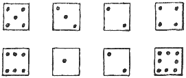

<#import "*/harst.ftl" as harst>
<@harst.introshort/>

<h2>1. Kapitel.</h2>

<h3>Frau Hortensie von Bomst.</h3>

Das wir damals mit dem in der Zwangsversteigerung erworbenen
Rittergut Bomstdorf zugleich auch die Verpflichtung
übernommen hatten, die Vorbesitzerin nebst Anhang bis
zu ihrem Ableben in dem sogenannten Parkhause wohnen
zu lassen, hatte uns bei den Vorverhandlungen mit dem
Güteragenten Siegfried Stahlbein nicht weiter gestört.
Harst kaufte das durch die Verschwendungssucht der
Herrn von Bomst-Bomstel bis auf 1300 Morgen zusammengeschmolzene
Gut ja auch weniger für sich als für Frau Lissie Blank,
die mit ihrem Gatten noch in Italien hochzeitsreiste.

An einem etwas trüben Junimorgen verlegten wir dann
unseren Haushalt bis auf weiteres nach Bomstdorf.

Stahlbein mit seinen kräftig geschweiften O-Beinen
und seiner Glatze, die bis ins Genick reichte, begrüßte
uns vor der Freitreppe des uralten baufälligen Kastens,
dem die Herren von Bomst-Bomstel sehr kühn den Titel
»Schloß« verliehen hatten, mit einer feierlichen Ansprache.
Ringsum standen die Gutsarbeiter, die Hausangestellten
und der von Stahlbein neu engagierte Inspektor Güddicke,
ein jüngerer Herr von vorbildlicher Eleganz und Vorliebe
für andauernde Verbeugungen.

Herr Inspektor Erich Güddicke, diplomierter Landwirt,
litt gerade an einer Bartflechte, und Kinn, Wangen
und Oberlippe glänzten stellenweise diskret von einer
weißen Salbe. Sonst aber, den Kopf abgerechnet, war
dieser Stoppelhopsergent durchaus tipp topp.

Nachdem wir im »Speisesaal« Mittag gegessen hatten,
wollten Frau Harst und Mathilde mit Hilfe des neuen
Personals erst einmal einige Zimmer leidlich wohnlich
herrichten, wir beide begaben uns pflichtschuldigst
zur Antrittsvisite nach dem sogenannten Parkhaus, geführt
von Siegfried Stahlbein, der immer mehr verstummte,
je näher wir dem Wohnsitz der Frau Hortensie und ihrer
beiden verwaisten Enkelkinder kamen.

Hier stimmte entschieden etwas nicht, denn Stahlbeins
Mundwerk war für gewöhnlich ein patentiertes Perpetuum
Mobile. Als er sich dann gar noch vor der Tür des einstöckigen
Hauses überaus eilfertig verabschiedete — er müsse
seinen Zug nach Berlin noch erreichen — und mit fliegenden
Hosenbeinen verduftete, blickten wir uns bedeutsam
an und ahnten das Allerschlimmste.

Das Parkhaus lag am Nordrande des Parkes hoch oben
an einem Abhang, der buschreich bis zum Seeufer abfiel.
Die Aussicht von hier war fraglos schöner als die andere
Aussicht, sofort der Vorbesitzerin gegenüberzustehen.

Harst zog an dem altehrwürdigen Klingelgriff, und ein
schlankes blondes Mädel mit großer fleckiger Schürze
und blutroten Händen, die sie vorsichtig vom Körper
abhielt, stand vor uns.

»Ach, ich wecke gerade Erdbeeren ein,« sagte sie sehr
verlegen. »Sie wünschen?«

Als Harst unsere Namen nannte, verzog sie das niedliche
Gesichtchen zu einer wütenden Grimasse.

»Großmama schläft,« erklärte sie eindeutig unfreundlich.
»Kommen Sie um fünf wieder.«

Das Fräulein Adelheid von Bomst wollte uns die Tür
vor der Nase zuschlagen, Harst jedoch verhinderte dies
ebenso energisch und meinte, es sei wohl richtiger,
sich mit uns nicht von vornherein auf Kriegsfuß zu
stellen. »Sie vergessen, daß ich jetzt hier Besitzer
bin,« sagte er recht scharfen Tones. »Bitte, melden
sie uns Ihrer Frau Großmutter. Sie schläft *nicht*. Ich
sah sie hinter den Gardinen, sie las.«

Adelheids hellgraue Augen wurden plötzlich äußerst
vergnügt. »Dann natürlich …« rief sie mit ihrem melodischen
Stimmchen. »… Verzeihen Sie, meine Herren, aber Großmutter
ist wirklich nicht leicht zu behandeln. Die Enttäuschungen
ihres langen Lebens, dann zuletzt der Verkauf unseres
Stammgutes haben sie unglaublich verbittert … Mein
Bruder und ich — vielleicht wissen Sie das — (sie dämpfte
vorsichtig die Stimme) sind ja erst
vorgestern aus der Schweiz zurückgekehrt, wir hatten
es hier nicht länger ausgehalten und ganz untergeordnete
Stellungen angenommen …« Sie errötete tief … »Weshalb
Großmutter uns dann so dringend zurückrief, verstehen
wir nicht recht.«

Sie eilte davon, wir nahmen Platz, die Haustür war
offen geblieben, und wir konnten ein Stück des Sees
und der dahinter liegenden bergigen Wälder überblicken.
Jenseits des Weges vor dem Hause nach Westen zu lag
ein winziger Garten mit einem kläglichen Staketenzaun,
— alles war auch hier genau so verwildert und ärmlich
und verfallen wie drüben im Herrenhause. Diese Diele
zum Beispiel, deren Wände mit Ahnenbildern derer von
Bomst dicht behängt waren, enthielt nur die schäbigen
Sessel und ein dreibeiniges Tischchen, — vier Türen
führten ins Innere des Hauses, sie waren mit altmodischen
Schlössern versehen.

Dann kam Adelheid von Bomst zurück, — und wir starrten
sie fast unhöflich an, sie hatte eine wunderbar ebenmäßige
Figur, und selbst das billige Kleidchen und die schlichten
Spangenschuhe konnten den Eindruck nicht verwischen,
daß in diesem blonden Geschöpf Rasse steckte.

»Soll ich Horst rufen?« fragte sie etwas verwirrt.
»Oh — schauen Sie mich nicht so an … Ich war Stubenmädchen
im Hotel »Zur Post« in Basel, und … ja … Horst, — er
war Kellner im selbem Hotel, — aber das ist Ihnen ja
bekannt.«

In den Büschen drüben war ein junger Mensch in Hemdärmeln
und bloßem Kopf aufgetaucht,— er harkte die Wege,
hackte das Unkraut heraus und schien mit seiner Arbeit
sehr zufrieden zu sein, pfiff leise einen Walzer und
blickte einem Schwarm Krähen nach, der einen Habicht
mit wütendem Krächzen verfolgte.

»Wir können ihn nachher sprechen, gnädiges Fräulein,«
sagte Harst und erhob sich.

Adelheid von Bomst näherte sich zögernd der breitesten
der vier Türen und pochte sehr kräftig.

»Großmama, Herr Harst möchte dich sprechen,« rief sie
überlaut, wandte den Kopf zurück und flüsterte: »Sie
ist etwas schwerhörig …«

Sie pochte nochmals …

»Großmama!!«

Dann drückte sie auf die Türklinke …

»Natürlich — wieder verriegelt!! Sie schließt sich
immer ein …«

Adelheid klopfte noch stärker.

»Großmama — bitte, öffne!! — — Ich finde das empörend,
meine Herren …!«

Nichts rührte sich.

»Warten Sie …« und Harst trat ins Freie und ging bis
zum ersten der kleinen Fenster links von der Haustür.
— Die Fensterscheiben waren grünlich verfärbt, durch
den billigen, vielfach gestopften Store sah auch ich
nun in einem Ohrensessel eine zur Seite gesunkene Gestalt.

Harst drängte das junge Mädchen schnell zurück. »Ich
denke, Sie kehren zu Ihren Erdbeeren zurück, gnädiges
Fräulein … Da kommt auch Ihr Bruder …«

Horst von Bomst fixierte uns unmutig. Er war ein schlanker,
dunkelhaariger Mann von vielleicht dreißig Jahren mit
einem bleichen, schmalen Gesicht.

»Horst, das sind die Herren Harst und Schraut,« erklärte
Adelheid schnell. »Großmutter öffnet nicht, und …«

Bomst verneigte sich leicht. »Entschuldigen Sie mein
Kostüm … Der Kellnerfrack stand mir besser.« Er lächelte
bitter. »Weshalb öffnet sie nicht, Adi?!« Er schaute
im das Zimmer hinein und schrak merklich zusammen. —

Fünf Minuten später hatten wir die Zimmertür mit einem
Bohrer und einem Draht geöffnet. In dem Sessel am Fenster
lehnte eine alte Frau in einem perlenbestickten uralten
Seidenkleid mit viel billigem Spitzenschmuck. Ihr Kopf
hing schief. Sie wir tot. Das faltige, strenge Gesicht,
die trüben aufgerissenen Augen zeigten einen Ausdruck
wilden Entsetzens. Noch nie sah ich ein Totenantlitz,
daß so deutlich die allerletzte Erkenntnis widerspiegelte,
daß das Leben erlöschen wollte, — sie mußte gefühlt
haben, das es mit ihr zu Ende ging, die rechte Hand
war noch in die spitzen des Taillenbesatzes in der
Gegend des Herzens gekrallt.

Wir brachten dann das junge Mädchen in ein anderes
Zimmer.

»Es ist furchtbar,« schluchzte sie … »Die Versteigerung
hat ihr den Tod gegeben! Wären wir nur in Basel geblieben,
— die Großmutter hat mit niemand Frieden gehalten,
— weshalb rief sie uns her?! Horst hat ablehnen wollen,
aber schließlich — es war doch die einzige Verwandte,
Herr Harst … Halten Sie mich
nicht für herzlos, ich kann keine tiefe Trauer heucheln,
Großmutter hat Vater förmlich gehaßt …« Sie redete
vollständig unzusammenhängend vor sich hin, und auch
die Bitternis ihres Herzens machte sich immer wieder
in unklaren Andeutungen Luft, sie war ehrlich und gab
sich so, wie die Umstände es rechtfertigten.

Wir ließen sie dann allein und betraten wieder das
Sterbezimmer, Harst schloß die Tür, der dürftige Raum
war erfüllt von Lavendelduft und dem muffigen Geruch
verstaubter Teppiche und Läufer.

Die beiden kleinen Fenster boten dem hellen Tageslicht
freien Zutritt, eine zweite Tür war nicht vorhanden,
an der Rückwand stand ein Bett mit zerschlissenem Baldachin
und geschlossenen bunten Vorhängen, vor dem Sessel
der Greisin ein viereckiges Mahagonitischchen mit Schiebladen,
von denen die obere etwas herausgezogen war, darauf
lag ein aufgeschlagenes Buch. Außerdem lagen auf der
zerkratzten Tischplatte noch acht Würfel, zu einer
Reihe geordnet, ferner standen da billige Rahmen mit
Photographien Horsts und Adelheids sowie einer blendend
schönen Frau in der Tracht der achtziger Jahre.

Harst besichtigte alles mit kühlen Blicken. Dann deutete
er auf den einen Fensterflügel neben dem Sessel …

»Offen, nur zugedrückt!« sagte er leise.

Er winkte mir, näherte sich der Toten und zeigte auf
einige Wassertropfen zwischen dem Perlenbesatz der
Taille.

»Ermordet …! *Der* Gesichtsausdruck zu furchtbar für
einen natürlichen Tod …«

Seine Hand wies auf den nur festgeklemmten Fensterflügel.

»Abdrücke von Fingern … Dabei scheint Adelheid die
Scheiben geputzt zu haben. — Diese Frau lebte, als
wir kamen, — sie starb, als Adelheid Einlaß begehrte
… von fremder Hand — durch Gift.«

Er rührte nichts an. Er betrachtete das Tischchen und
notierte dann etwas in sein Notizbuch.

»Wir werden unseren Verdacht niemandem mitteilen, mein
Alter, verstanden! — Komm’ ins Freie.«

Vor dem Parkhaus dicht unter dem Fenster fanden wir
in einem flachen Maulwurfshügel den klaren Eindruck
eines kleinen Schuhs von spitzer Form mit hohen Absätzen.
Diese Fährte verlor sich nachher auf einem
Seitenweg des verwilderten Parkes. —

Als der behäbige Kreisarzt erschien, sagte er nur achselzuckend:
»Herzlähmung, — war vorauszusehen.«

<h2>2. Kapitel.</h2>

<h3>Marie knipst.</h3>

Herrn Erich Güddickes Hauptvergnügen bestand darin,
seine echt goldene Uhr aus dem 10-Mark-Basar dauernd
aufzuziehen, um mit dem an diesem fragwürdigen Wertstück
baumelnden dreifarbigen Bierzipfel prunken zu können.
Der liebe Gott mochte wissen, weshalb Siegfried Stahlbein
ausgerechnet dieses Genie als Inspektor für unser Gut
engagiert hatte. Güddicke mochte ja von der Stoppelhopserei
allerlei verstehen, aber er konnte diese seine Kenntnisse
nicht recht verwerten, und wenn der alte Gutsvogt Schöller
nicht helfend eingesprungen wäre, hätte der Wirtschaftsbetrieb
vollkommen gestockt. Immerhin war Güddicke ein netter
Gesellschafter und spielte abends regelmäßig mit Haralds
Mutter zehn Partien Halma. Frau Harst und Mathilde
fanden ihn reizend.

»Der Brief nach Berlin ist besorgt worden?« fragte
Harst ihn am Abend des Todestages der verbitterten
Greisin.

»Jawohl. Das Küchenmädchen Kunze hatte in der Kreisstadt
Einkäufe zu erledigen und nahm ihn mit,« dienerte Erich
Güddicke und fügte noch beruhigend hinzu: »Sie hat
ein Rad … Der Brief ist mit dem Abendzug noch abgegangen.«

Mit diesem Brief, der an einen Herrn Fritz Bechert,
Berlin SO 16, Köpenicker Str. 208, adressiert war,
hatte es seine besondere Bewandtnis.

Harst hatte mir sofort nach unserer Rückkehr ins Herrenhaus
und nach der Abfahrt des ahnungslosen Kreisarztes erklärt,
er wolle die Verantwortung für den Fall Bomst nicht
allein tragen und die Entscheidung dem Chef der Berliner
Kriminalpolizei überlassen, die hier freilich nicht
mehr zuständig sei, die man jedoch in schwierigen Fragen
stets zu Rate zöge. — Wir entwarfen den Brief gemeinsam,
taten ihn in einen Umschlag und diesen nebst Begleitschreiben
in einen zweiten, den wir versiegelten und »Eingeschrieben«
und »Durch Eilboten zu bestellen« absandten. Der Adressat
Fritz Bechert dürfte bekannt sein.

Als das Küchenmädchen Marie Kunze dann aus der Stadt
zurückkehrte, übergab sie uns den Rückschein des eingeschriebenen
Briefes und schielte noch abscheulicher als sonst,
knickste wie ein Elefant als Dank für eine Mark Borengeld
und hinterließ in unserem Zimmer einen fatalen Geruch
nach Kuhstall.

Marie Kunze sah wie eine Zigeunerin aus, — schlampig,
äußerst farbenfroh gekleidet, — die drei roten Pickel
auf der Nase und die schwarzen Zähne machten sie nicht
schöner. Sie grinste dauernd überaus einfältig und
stand von vornherein mit unserer Mathilde auf Kriegsfuß
…

Am anderen Morgen wurde Harst von Berlin aus am Fernsprecher
verlangt. Nach längerer Unterhaltung ergänzte er dann
am Frühstückstisch, den Herr Erich Güddicke durch
einen neuen hellen Sportanzug verschönte, daß er ein
Auto gekauft und auch gleich von der Firma einen Chauffeur
nachgewiesen erhalten hätte. Mittags traf dieser, ein
kräftiger, gutmütiger älterer Mann, mit dem neuen Wagen
ein und wurde im Herrenhaus im ersten Stock im Zimmer
über uns einquartiert. Er nannte sich Friedrich Beste,
und er war auch entschieden der beste Führer, den es
gab. Das wußten wir längst. In Berlin hieß er Kriminalkommissar
Friedrich Bechert.

Nachmittag machten wir eine Probefahrt mit dem großen
neuen Benz und lagerten schließlich im Walde am anderen
Seeufer an einsamer Stelle.

Bechert kramte nun seine Nachrichten aus.

»Der Chef war zunächst keineswegs damit einverstanden,
daß ihr beide hier auf eigene Faust arbeitet …« Er
kaute an seiner Zigarre und sah uns aus seinen schläfrigen
Augen blinzelnd an. »Die Sache ist nun so befingert
worden, daß der hiesige Landrat streng vertraulich
eingeweiht wurde und daß ich hier mit euch gemeinsam
den Fall aufklären soll. Natürlich hat der Landrat
nicht alles erfahren …«

»Dem Himmel sei Dank,« sagte Harst. »Diese streng vertraulichen
Mitteilungen kenne ich. »Zunächst erfährt’s der Landrat,
dann die Landrätin, dann der Sekretär, dann …«

Bechert winkte ab. »Was Sie erfahren, ist ein Dreck,«
erklärte er in seiner derben Art. »Er weiß nur was
von Wilddieben und einer Person, die scheinbar durch
Wilddiebe beseitigt wurde. So ganz dämlich sind wir
im Roten Alex doch nicht. — Die drei Perlen der Stickerei,
an der das Gift in Tröpfchen hing, und die ihr mitschicktet,
sind bereits untersucht worden. Das Zeug war Amylnitrit,
und die alte Dame wird einen leichten schnellen Tod
gehabt haben. Die Photographien der Fingerabdrücke
auf der Scheibe werden wir hier vergrößern. Ich habe
alles Nötige mitgebracht. Ihre Momentkamera 6:9 liefert
hoffentlich scharfe Bilder.«

»Sehr scharfe,« nickte Harst. »Weshalb schickte der
Chef nicht Lücke her?«

Für Bechert ist dieser Name das bekannte rote Tuch.
Er wurde wild. »Genüge ich euch etwa nicht?!« brüllte
er. »Muß der Monokelhans überall dabei sein?! Er hat
Urlaub und gondelt irgendwo in der Schweiz umher. Unverschämtes
Glück hat er gehabt … Bei dem Eisenbahnunglück zwischen
Nürnberg und Ingolstadt hätte es ihn beinahe erwischt
…«

Sie waren die ärgsten Konkurrenten in den beiden
Reserve-Mordkommissionen, sie schnappten einander die
Erfolge weg wie bissige Köter und waren im Grunde doch
die dickste Freude, gaben es nur nie zu und gefielen
sich in den leicht mißzudeutenden Rollen neidischer Lästerer.

Es war eine wunderschöne Waldlichtung, auf der wir
lagen. Durch weiße Birkenstämme und braunrote Kiefern
leuchtete der blanke Seespiegel hindurch, Bienen und
Hummeln umsummten uns, rundum jubilierten die Sänger
des Waldes, und das Kreischen der Eichelhäher und das
Pochen der Buntspechte sowie das Schnattern der Wildenten
im Seeschilf erinnerten noch nachdrücklicher an die
ländliche Einsamkeit.

Bechert beobachtete eine Eidechse, die soeben nach
einer bunten Fliege schnappte. »Wie starb die alte
Dame?« fragte er prompt. — Die Ideenverbindung lag
nahe.

Harst entgegnete vorsichtig: »Wahrscheinlich wurde
Frau von Bomst das Gift durch das Fenster in den Mund
gespritzt. Der Fensterflügel war nur angelehnt, der
Mörder kann eine Frau gewesen sein, die Fußspuren deuten
darauf hin, aber ich möchte mich vorläufig auf keine
bestimmte Ansicht festlegen. Ich will Ihnen alle Einzelheiten
mitteilen, Bechert. Arbeiten Sie dann selbst.«

Er berichtete wirklich jede Kleinigkeit, erwähnte besonders
die Dinge, die auf dem Tischchen vor der Toten lagen,
und betonte, daß es wirklich ein Zufall gewesen, daß
er seine kleine flache Momentkamera in der Tasche gehabt
hätte. »Das Buch, das halb auf der herausgezogenen
Schieblade lag, war ein französischer Roman im Urtext
von Eugen Sue, eins der schlüpfrigsten Werke des Franzosen.
Auf dem dreietagigen Bücherbrett an der Wand konnte
ich noch feststellen, wo das Buch herausgezogen war.
Es hatte dort in der wenig passenden Nachbarschaft
von Schiller und Goethe gestanden. Die alte Dame galt
als überaus fromm und sittenstreng.«

Bechert blickte auf. »Sie meinen, das Buch ist nur
zum Schein hingelegt worden?«

»Ja.«

»Hm, mag sein, obwohl ich das mit recht verstehe. —
Was sollten die acht Würfel?«

Und jetzt erfuhr ich etwas, was auch mir völlig neu
war.

Harst stand auf, schritt in den Wald hinein, umkreiste
die Lichtung und warf sich dann wieder neben uns ins
Gras, faßte in die Tasche und holte acht kleine Würfel
aus Knochenmasse mit schwarzen Augen hervor.

»Ich habe sie gestern zu mir gesteckt, noch bevor der
Kreisarzt kam … So lagen sie auf dem Tische, genau
so.«

»Meinen Sie, die Greisin hat sich mit den Würfeln beschäftigt?«
fragte Bechert nach längerem Nachdenken und grinste
pfiffig.

»Die Frage ist doch überflüssig. Wer sollte die Würfel
hingelegt haben?! Das Zimmer war verschlossen, und
der Mörder tat’s gewiß nicht.«

Wenn drei Leute vom »Fach« wie wir einen Fall zerlegen,
muß man gewaltig die Ohren spitzen, denn jedes Wort
kann von Bedeutung sein, zumal ja Harst nach altem
Rezept zu gern mit Redensarten jongliert, die einen
doppelten Sinn haben.

Das wußte Bechert ebenso gut wie ich.

»Was tat der Mörder nicht?« meinte Bechert argwöhnisch.
»Ihre Sätze waren mal wieder sehr orakelhaft. Schloß
er die Tür nicht ab oder legte er die Würfel nicht
hin?«

Harst hatte den Kopf zur Seite gedreht und starrte
in das dicke Haselnußgebüsch.

Mit einem Male sang da eine ungeschulte, unschöne,
kreischende Mädchenstimme:

»Wer hat dich, du schöner Wald, aufgebaut so hoch da
droben, — wohl, den Meister will ich loben …«

»Die Stimme kenne ich,« flüsterte ich hastig und lachte
leise. »Das ist unsere wunderbare Zofe Marie Kunze,
Mädchen für alles, mit Kuhstallparfüm und drei Pickeln
auf der Kartoffelnase, knallroten Backen, wirrem Haar
mit feuerroter Schleife oder Kopftuch und Holzpantinen,
— falls sie nicht gerade radelt, — auch so eine Perle,
die der Stahlbein beschafft hat, — Gott straf’ ihn
und gebe ihm plötzlich X-Beine, dann kann er nicht
laufen, er ist an O-Beine von Kindheit gewöhnt.«

Die Sängerin wurde sichtbar. Sie hatte ein Körbchen
in der Linken, pflügte Erdbeeren, ging tief gebückt
und glänzte in allen Regenbogenfarben wie üblich. Aber
Holzpantinen trug sie nicht, vielmehr sehr geflickte
Spangenschuhe von unergründlicher Kouleur.

Harst rief sie an. »Na, Marie, — wieder fleißig? Sie
sind wirklich sehr vielseitig, mein Kind … Der Wald
hier gehört zum Nachbargut, und wenn der Förster Sie
abfaßt, wird es Strafe kosten — Strafe, Marie!«

Sie stand da und lächelte unglaublich dumm. Ihre stockigen
schwarzen Zähne ließen den stets offenen Mund noch
größer erscheinen.

»Ich geh’ schon,« sagte sie verlegen … »Ich bin mit
Rad hergekommen, und der Förster kriegt mich nich …«

Sie machte kehrt und schritt schwerfällig davon.

Harst betrachtete schweigend die im Grase liegenden
acht Würfel. Sein Gesichtsausdruck war ein merkwürdiges
Gemisch von mißtrauischer Wachsamkeit und stiller Ironie.
— Bechert wandte sich ihm zu. »Wir wurden unterbrochen,
als wir …« dann verstummte er. »Hallo, Harst, was haben
Sie?! Was ficht Sie an?!«

Harst erwiderte zerstreut: »Ich war sehr unvorsichtig,
ich hätte die Würfel hier nicht hervorholen sollen
… die Krabbe ist schlauer als wir alle. Er steckte
die Würfel in die Tasche. »Das leise Knacken in dem
Erdbeerkorb konnte man mit dem Hämmern des Spechtes
dort verwechseln … Der Korb hatte Löcher … Und hinter
dem einen uns zugekehrten blinkte es wie von Glas …
Für gewöhnlich flickt man Weidenkörbchen nicht mit
Glasstücken.«

Bechert und ich schauten ihn grenzenlos verblüfft an.

»… Ein Glasstück war trotzdem in dem Korbe, aber es
war fein geschliffen, vielleicht waren es auch zwei
Linsen, jedenfalls hat diese Kunze die Würfel photographiert,
was ja an sich nicht viel zu sagen hat, hoffe ich,
aber — mir sagt es sehr viel.«

Bechert, doch gewiß ein Mann, den kaum noch etwas außer
Fassung bringen konnte, setzte sich aufrecht. »Das
Knacken war das Geräusch eines Momentverschlusses —
ich begreife nun! — Weshalb ließen Sie das Mädel laufen,
wir hätten ihr doch …«

»… Es wäre völlig verkehrt gewesen, ihren Argwohn zu
wecken … Wir erreichen mehr, wenn wir den Spieß umdrehen
und sie fernerhin nicht aus den Augen
lassen. Sie hat mir bereits das bestätigt, was ich
immer schon — das heißt seit gestern, als Frau von
Bomst während unserer Anwesenheit in der Diele ermordet
wurde — vermutete: Die Würfel stehen irgendwie mit
dem Tode der alten Dame in engster Beziehung. Welcher
Art diese Beziehung ist, weiß ich nicht. Und ich spreche
die Wahrheit, Bechert. Ich werde Ihnen nach einiger
Zeit noch etwas vorweisen, das sicherlich Ihre Beurteilung
des Falles stark beeinflussen dürfte. Es handelt sich
um zweierlei. Erstens um Fußpuren, zweitens um einen
Sarg. — Schraut, du könntest mal die Runde machen und
sehen, ob die Luft rein ist … Aber halte dich besser
stets in Deckung, und sollte irgendwo eine Hand mit
einer Waffe auftauchen, schieße zuerst …«

»Also so liegen die Dinge!« meinte Bechert aufspringend.
»Schraut — Sie nach rechts herum, ich nach links herum
… Bei solchen Anlässen regt sich stets mein Jägerblut
… Los denn!! Falls das Frauenzimmer noch in der Nähe
sein sollte, werde ich ihr wie zufällig den Korb …«

Harst unterbrach ihn. »Sie ist nicht mehr in der Nähe
… Aber nehmt dies hier mit, und wenn ihr irgendwo eine
klare Fährte von ihr findet, legt bitte diese beiden
Papierstücke, die wie Papiersohlen aussehen, auf die
Spuren. Es sind genaue Ausschnitte jener verdächtigen
Fährte unter dem angelehnten Fensterflügel.«

Bechert und ich entdeckten das, was wir zu diesen Vergleich
brauchten, zwanzig Schritt nach Osten zu im Walde an
einer kahlen, lehmigen Senkung.

Die Papiersohlen paßten haargenau auf Marie Kunzes
Spuren.

<h2>3. Kapitel.</h2>

<h3>Das Gestühl der Bomsts.</h3>

»Begreifen Sie das, Schraut?!« fragte Freund Bechert
und blickte mich unsicher an. »Was hatte diese neu
eingestellte Küchenmagd mit der alten Dame zu tun?
Ist etwa die Kunze die Mörderin?!«

»Unmöglich!! Dieses törichte Geschöpf!« Und ich sprach
dies mit vollster Überzeugung aus.

Bechert besichtigte nochmals die Fährte. »Ein Irrtum
ist ausgeschlossen … — Gut, kehren wir zu Harst zurück.«

Wir fanden ihn nicht mehr auf der Lichtung, sondern
auf dem Waldwege vor, wo wir das Auto hatten stehen
lassen. Bechert vermied alle diplomatischen Winkelzüge
und meinte geradezu: »Ist diese Kunze die Täterin,
Harst? Raus mit der Sprache. Hier muß reiner Tisch
gemacht werden. Nur keine langatmigen unnötigen Feststellungen,
— zupacken, Schluß!!« Das war so ganz Fritz Bechert,
Gegenpol des mehr abwartenden Hans Lücke, Mann der
Tat, scharfsinnig, oft skrupellos vorgehend, nie versagend,
mochte ein Fall auch noch so verworren liegen.

Harst erwiderte nur: »Zupacken?! — Mein lieber Bechert,
ich wünschte, wir wären so weit. — Was halten Sie hiervon?«

Und er deutete auf ein Stück Moos dicht vor dem linken
Hinterrad, warnte aber auch gleichzeitig:

»Nicht berühren!! — Hätten wir den Wagen bestiegen,
wäre der Wagen — und das mußte er beim Anfahren — über
dieses Stück Moos gerollt, so wäre von uns dreien recht
wenig übrig geblieben.«

Er bückte sich und hob das grüne Pflanzenpolster, das
so harmlos auf trockenem Laub, Gräsern und Sand ruhte,
behutsam empor.

Wir sahen darunter frisch aufgewühlten Sand, aus dem
ein vier Zentimeter langer dünner Eisenstab, der oben
ein angenietetes rundes Plättchen von Dreimarkstückgröße
trug, hervorragte.

Als der Sand ebenso vorsichtig gelockert und rund um
den Zinkzylinder, der uns da verdächtig entgegenleuchtete,
zur Seite geschoben war, meinte Bechert mehr erstaunt
als erschrocken: »Zucker ist da sicher nicht drin!!
Sollte das Frauenzimmer diese Bombe gelegt haben?!«

Er schaute sich nach Spuren um, aber der trockene Boden
verriet nichts, und so sehr wir auch suchten, wir fanden
nirgends eine noch so schwache Fährte.

Dieser Anschlag auf uns bewies weiter, daß der Betreffende,
ob nun Mann oder Weib, niemals in Kreisen zu suchen
war, denen zum Beispiel Marie Kunze an- gehörte. Für
ein Stubenmädchen von ihrer Schlichtheit war es unmöglich,
sich eine Dynamitpatrone mit einem Druckzünder zu verschaffen.
Hier war eben eine höhere Intelligenz am Werke, und
meines Erachtens konnte es sich auch nicht um eine
einzelne Person, sondern nur um einen Kreis von Personen
handeln, die fähig waren, uns zu überwachen und die
sofort richtig erkannt hatten, daß der neue Chauffeur
ein sehr alterfahrener, erfolgreicher Kriminalbeamter
war. Ich gab diesen Vermutungen Harst und Bechert gegenüber
unverhohlen Ausdruck, sie pflichteten mir in allem
bei, und doch brachte uns das keinen Schritt vorwärts,
sondern steigerte nur noch die Schwierigkeiten der
Gesamtlage. Wir waren gewarnt, — vielleicht blieb das
der einzige Vorteil.

Ein scharfer Pfiff jenseits der Wegbiegung veranlaßte
Harst, den Zinkzylinder schleunigst, aber äußerst vorsichtig
in dem Auto zu verbergen und das Sandloch mit der Fußspitze
zuzuscharren und das Moosstück darüber zu decken. Man
konnte so kaum bemerken, daß die Sprengkapsel schon
entfernt war.

Ein zweiter Pfiff besonderer Art erinnerte mich an
Herrn Erich Güddicke, der allerdings einen stichelhaarigen
Pintscher, nicht eben reinrassig und sehr derb im Knochenbau,
besaß und seinen »Leo« als Wunder von Klugheit stets
rühmte.

Plötzlich schoß denn auch dieser Leo mit langen Sätzen
aus den Büschen jenseits des Wegesrandes hervor, setzte
mit elegantem Sprung über den Graben, blieb stehen
und wedelte uns mit seiner Stummelrute freundlich an.

Sein Herr erschien im Trab um die Wegbiegung offenbar
in grimmigster Laune, denn der derbe Stock in unseres
Inspektors Händen bereitete Leo schon von weitem starkes
Unbehagen, er kroch unter das Auto und … wedelte weiter
und blickte seinen frühlingsgrün verkleideten Besitzer
schuldbewußt entgegen.

Güddicke lüftete mit Schwung sein Jägerhütchen …

»Das Vieh hat gewildert,« stieß er atemlos hervor.
»Jedem Kaninchen rennt er nach … Hierher, Leo … Wirst
du parieren, du Mistkerl!!«

Güddicke erledigte dann seine üblichen Bücklinge, als
er vor uns stand. »Herr Harst, der Leo verdient Wichse
… Sie gestatten doch …«

»Nein. — Helfen Sie uns lieber, das Auto ein Stück
vorwärtszuschieben. Der Motor versagt, und hier in
der prallen Sonne kann der Chauffeur an dem Ding nicht
herumdoktern. Drüben ist Schatten.«

»Aber gern!« erklärte unser Juwel von Inspektor ohne
Zaudern. »Packen wir zu, meine Herren …«

Er stemmte sich gegen die Rückwand, und natürlich genügten
seine Kräfte vollauf, das Auto vom Fleck zu bewegen,
— es rollte über das Moosstück hinweg, und Harst’s
versteckte Absicht war geglückt: Jeder Verdacht, daß
etwa dieser Güddicke mit dem Anschlag etwas zu tun
haben könnte, war beseitigt.

»Lassen Sie nur, Herr Inspektor,« meinte Harst rasch.
»Bemühen Sie sich nicht weiter, — aber Kräfte besitzen
Sie, allerhand Achtung!«

Leo war in den Graben geflüchtet, sein Herr drehte
sich um und musterte uns verwundert. »Ich denke, Sie
wollten …« begann er zögernd und mit leichtem Argwohn,
— Harst streckte ihm die Hand hin …

»Was ich wollte, weiß ich nun … — Herr Güddicke, da,—
was ist das?!«

Er öffnete die Wagentür und zeigte auf den in der Polsterecke
liegenden Zinkzylinder.

»Hm …« Güddickes Gesicht ward plötzlich seltsam steinern.
»Das ist wahrscheinlich eine Art Bombe … — Verzeihung,
ich verstehe nicht recht, wie …«

»Ist auch nicht nötig, — verstehen Sie am besten gar
nichts und schweigen Sie unbedingt.«

Güddicke verneigte sich zwanglos. »Wie Sie wünschen.«
Der Mann kam mir durchaus nicht mehr so strohköpfig
vor wie bisher.

»Galt es Ihnen, meine Herren?!«

»Ja. — Wäre Ihr Leo imstande, eine Fährte zu verfolgen,
wenn wir ihm an dem Zinkzylinder Witterung nehmen ließen?«

»Bestimmt, Herr Harst.« Sein Blick streifte Bechert.
»Ich gehe wohl nicht fehl, wenn ich vermute, daß Herr
Chauffeur Beste Kriminalbeamter ist?«

»Kommissar Bechert,« sagte unser alter Freund leise.
»Harst täte gut, Ihnen alles zu erklären, denn mir
scheint, Sie sind durchaus nicht lediglich Attrappe,
Herr Güddicke.«

Güddicke nickte nur. »Ich habe mir das gedacht, Herr
Harst. Ihr Eilbrief machte mich stutzig. Als Sie ihn
mir übergaben, fühlte ich, daß der Umschlag noch einen
zweiten enthielt.«

Der Versuch, Leo als Polizeihund zu benutzen, gelang
nur zum Teil. Leo fand zwar die Spur, aber sie führte
im Bogen zum Seeufer hinab an eine kahle Ufer- stelle,
wo die Eindrücke mehrerer Boote im feuchten Boden zu
erkennen waren.

Der Bomst-See, der nicht zum Gute gehörte, wurde sehr
viel von Anglern besucht. Der Seepächter machte mit
der Ausgabe von Angelkarten ein sehr gutes Geschäft,
— drüben am Nordufer lag eine kleine neue Wochenendsiedlung
mit einem Restaurant, und der Lokalinhaber vermietete
die Angelkähne. Auch der vielbeschäftigte Stahlbein
huldigte, wie er uns mal verschämt mitgeteilt hatte,
dem Angelsport und besaß auch drüben ein Sommerhäuschen.

Wir führen im Auto nach Norden um den See und hielten
vor dem Restaurant. Eine Nachfrage bei dem Inhaber
hatte auch keinerlei Erfolg. Auf der Straße der kleinen
Kolonie trafen wir dann unseren »Freund« Siegfried
Stahlbein mit einer dicken Aktentasche wie stets sehr
eilig dahintrabend, wie stets schwitzend und sich mit
seinem Kneifer herumärgernd, der nie recht gerade saß
und dauernd herabrutschte. Er winkte uns großartig
zu und betrat ein Vorgärtchen eines knallgelb gestrichenen
Häuschens, — drei Kinder in Badehosen liefen ihm jubelnd
entgegen.

»Werter Herr Stahlbein, Sie haben zu Frau Hortensie
von Bomst in geschäftlichen Beziehungen gestanden.«

»Gewiß, gewiß, — — gewiß, — und wie, — ohne meine Hilfe
wäre bei der Schweinewirtschaft auf  dem Gute die Sache
schon früher verkracht, — gewiß …«

»Halt, — — bremsen Sie!! — Sagen Sie mal, würfelte
die alte Dame gern?«

Stahlbein lachte meckernd. »Und ob — und ob!! Mindestens
viermal traf ich sie dabei an, wie sie mit kleinen
gelblichen Würfeln sich beschäftigte. — Komisch, was?!«

»Wieviel Würfel waren es?«

Siegfried rückte seinen Kneifer zurecht und legte die
Stirn in die Falten. »Eine ganze Menge, — vielleicht
sieben, acht …«

Gegen sechs Uhr nachmittags schritten wir dann durch
die abgelegensten Parkwege dem kaum zehn Minuten entfernten
Dorfkirchlein zu, wo heute früh in aller Stille die
Tote in einem schlichten Sarge, aber unter einer Fülle
von Blumen aufgebahrt worden war.

Absichtlich folgten Bechert und Güddicke erst nach
einigen Minuten.

Harst holte den Schlüssel vom Pfarrer, und als wir
nun das alte bescheidene Gotteshaus betraten, als wir
aus der linden Wärme des sonnigen Junitages in das
Dämmerlicht des fast eisig kalten Kirchleins eintraten,
überlief mich ein Frösteln.

Harst hatte sich vorgebeugt und aufmerksam den Sarg
betrachtet. Es war totenstill in der Kirche, und die
kalte, von widersprechendsten Gerüchen erfüllte Luft
legte sich mir immer schwerer auf die Brust.

Auf den ausgetretenen Steinfliesen hallten selbst unsere
leisen Schritte in übertriebener, falscher Akustik
mehrfach wieder, — still setzen wir uns in das kastenartige,
wappengeschmückte Gestühl gegenüber der Kanzel. Hier
auf diesen Plätzen hatten die Herren von Bomst-Bomstel
feierlich steif mit ihren Angehörigen den Worten über
Demut und Nächstenliebe gelauscht und dann daheim gepraßt
und gesündigt und das Erbe fleißigerer Väter leicht
fertig vertan. Dicke verschossene Samtvorhänge umgaben
diesen adligen Käfig, auf den schrägen Banktischen
lagen noch Gesangbücher mit dicken elfenbeinernen oder
metallenen Einbänden von vielleicht hohem Kunstwert,
— ich griff nach einem der Bücher, und das kalte glatte
Elfenbein erinnerte mich sofort an die acht alten Würfel
mit den abgerundeten Ecken und den großen schwarzen
Augen. Vielleicht waren auch die Würfel ebenso alt
wie diese Gesangbücher …

Ich schrak zusammen, als aus Harsts Hand eine weiße
Lichtbahn durch die Dämmerung schoß und die schwarz
verhängten Böcke beleuchtete, die den bereits geschlossenen
Sarg trugen.

Der Lichtkegel irrte gleich einem ruhelosen Geist hin
und her und blieb schließlich auf den Steinfliesen
vor dem Gange haften, wo sich deutlich die Eisenumrandung
einer großen quadratischen Steinplatte abzeichnete,
die ebenfalls das Wappen der Bomst und verschiedene
Inschriften trug. Darunter befanden sich die feuchten
Grüfte des Erbbegräbnisses der Patrone des Kirchleins,
— Stahlbein hatte erwähnt, die Kirche läge zu nahe
am Seeufer, und zwischen den Bodenziegeln der Grüfte
blinke zuweilen das Wasser und wüchsen Pilze und Moos.

Dann knipste Harst die Taschenlampe aus und reckte
den Arm nach einer dicken Schnur, — die Samtvorhänge
fielen zusammen, und wir waren wie von der Außenwelt
abgeschlossen.

»Wozu das, Harald?!« Ich flüsterte, denn in dieser
Umgebung wäre jeder laute Ton eine Nervenpein gewesen.

Er reckte wieder den Arm aus, und mit eisernen Griff
drückte er mich tief unter die Bank und …

Dicht vor uns ein nie geahntes hartes blechernes Klopfen
— — dreimal … viermal … nochmals … Aus der Wandung
des Gestühls wurden Holzsplitter dicht über uns herausgerissen,
— — wiederum diese verbrecherischen Schüsse, — ich
warf mich flach nieder, und doch ahnte der Schurke
wohl, daß sein Anschlag mißglücken könnte, — er verwandelte
die Wand in ein Sieb, eine Kugel fuhr mir durch den
Jackenkragen, eine zweite nahm ein Stück Absatz vom
linken Stiefel mit und schlug als Querschläger oben
in die Decke, wütend surrend wie eine Pferdebremse.

Dann nichts mehr, — und doch konnte die Schießerei
wieder aufleben, — — nein, ein dumpfes Poltern, das Kreischen
von Angeln der Kirchentür, Stimmen …

»Harald, verletzt?« fragte ich ängstlich …

»Eine Schramme an den Rippen …« Er schnellte hoch,
er stieß die Tür auf, er rief Bechert und Güddicke
herbei …

»Rasch, — man schoß auf uns … Bleiben Sie an der Tür,
Güddicke … Haben Sie eine Waffe mit?«

Der blasierte Inspektor lächelte merkwürdig.

»Seit einem bestimmten Tage — immer, Herr Harst.«

Er lief zur Tür zurück.

Bechert schnupperte …

»Das scheint ja Schnellfeuer gewesen zu sein …« — seine
schläfrigen Augen waren wie glühende Kohlen, der ganze
Mann sprühte von Lebensimpuls … »Diese Schweinerei
muß ein Ende haben … Der Kerl kann nicht entwischen,
die Fenster liegen sehr hoch, eine zweite Tür ist nicht
vorhanden, und draußen …« — er lächelte
unmerklich — »stehen zwei brave Angler und beobachten
die Kirche. Der Chef wollte es so, ich mußte noch zwei
Leute mitnehmen, und nicht die schlechtesten, nun wißt
ihr es, — der eine ist der kleine fixe Wendt, ihr kennt
ihn ja …«

<h2>4. Kapitel.</h2>

<h3>Ein Roman von Eugen Sue.</h3>

Wenn drei Leute vom Fach wie wir ein Kirchlein und
ein Gewölbe durchsuchen, gehen sie ganz systematisch
vor und schonen nichts, schrecken vor nichts zurück.
Auch das Türmchen, das Dach, der Altar, die Kanzel,
jeglicher Winkel wurde durchstöbert, schließlich landeten
wir wieder in der Gruft der Familie Bomst zwischen
mächtigen, mit weißen Schimmelpilzen bedeckten Eichensärgen,
— in einer Nebenabteilung standen kleinere bis kleinste
Särge, Kinderskelette bergend …

Wir klopften die Wände ab, leuchteten in jede Ritze
hinein, langjährige Erfahrung ließ uns geheime Seitenkammern
mit unsichtbaren Mauertüren vermuten, die man vielfach
in das Reich der Fabel verweisen will.

Das dumpfe Poltern vorhin, nachdem der letzte Schuß
des Meuchlers gefallen war, konnte nur, so nahm Harst
an, von der Steinplatte herrühren: Der Mörder war hier
hinab geflüchtet! Wo war er?!

Wir ließen nicht nach in unserem Eifer.

Harst war in dem anderen Gewölbe geblieben, und als
wir zu ihm traten, schaute er starr und geistesabwesend
auf eine zerplatzte lange Eichentafel an der bröckeligen
nassen Wand, um die herum Reste von Kränzen hingen
und die tief eingekerbt die Namen der hier beigesetzten
unmündigen Zugehörigen des Hauses derer von Bomst enthielt.

Zwölf Namen …

Zurückreichend bis zum Jahre 1502, — und heute war
das 19. Jahrhundert überschritten.

»Was haben Sie, Harst?« fragte Bechert argwöhnisch.

»Lesen Sie den letzten Namen,« erwiderte Harald. »Ganz
unten, wo die Tafel noch Platz hätte für weitere Daten
…«

Bechert und ich neigten uns vor.

> Hans, Karl, Hubert v. Bomst-Bomstel, geb. am 2. April
1890, gest. am 5. April 1895.

Und dann rief Bechert erregt:

»Würfel!!«

Ja, hinter dem Todesdatum »5. April 1895« folgten in
derselben Zeile acht kleine Vierecke mit schwarzen
Augen: Würfel!!

Unfehlbar sollten es Würfel sein!

Bechert bückte sich und schaute sich die Vierecke genau
an. »Ja — Würfel, und auch acht an der Zahl. — Harst,
wie reimen Sie sich das zusammen?!«

Er lachte bitter auf. »Ich finde keinen Reim, Bechert.
Ich habe mein Hirn schon genügend angestrengt. Wenn
uns nicht eine jähe Erleuchtung kommt, werden wir nie
erfahren, weshalb die Greisin ermordet wurde. — Eins
aber sollt ihr wissen, damit auch ihr diesem Geheimnis
mit demselben Rüstzeug zu Leibe gehen könnt wie ich:
Die Würfel auf dem Tische vor der Toten waren genau
so geordnet wie diese hier, das heißt, der erste Würfel
von links gezählt zeigte oben fünf Augen, der zweite
drei Augen — und so fort. — Seht, hier ist meine Niederschrift
von gestern, das flüchtige Bild der acht Würfel vor
der Toten.«

Wir verglichen: Es stimmte, — die Würfel zeigten der
Reihe nach dieselben Augen, dieselbe Anzahl der Augen
wie dies hier auf der Grufttafel:

So …

»Ja,« nickte Harst zerstreut, »und so geordnet lagen
die Würfel heute auch im Grase, als Marie Kunze sie
knipste. Denkt auch daran. Wir wollen wieder nach oben
gehen. Denn ich habe euch oben noch etwas zu zeigen.
Hier ist ja doch nichts zu finden.«

Vor dem Sarge der Frau Hortensie von Bomst machte er
halt. Die Kerzen flackerten und knisterten, und das
unheimliche Gefühl beschlich mich, daß jeden Moment
wiederum irgendwoher die Geschosse pfeifend uns umsurren
könnten.

»Als ich der Toten gestern den Puls fühlte, die Hand
war noch warm, als ich dabei die bis auf die Handknöchel
herabfallenden Spitzen des Ärmels hochschob, bemerkte
ich am Handgelenk eigentümliche rote Abschürfungen
— vielleicht Kratzwunden. Nachher untersuchte ich auch
die linke Hand und fand dieselben Abschürfungen. Mir
ist inzwischen nun ein besonderer Gedanke gekommen,
den ich zunächst nicht äußern möchte. Ihr sollt selbst
sehen und euch ein Urteil bilden. Schrauben wir den
Sargdeckel ab.«

Becherts Riesenkräfte genügten, er allein hob mit einem
Ruck den Deckel ab und stellte ihn abseits.

Mit wächsernem Gesicht, dem jedoch noch immer eine
Spur jenes grauenvoll entsetzten Ausdrucks anhaftete,
den die Züge der Toten gestern gezeigt hatten, ruhte
die Leiche in dem schwarzen, zerschlissenen Spitzenkleide
auf den weißen Kissen. —

Die Tote lag bis zur Brust zugedeckt da, nicht einmal
die Arme und Hände waren sichtbar.

Bechert blickte Harald an. »Eine sehr billige Sargausstattung,
Harst, eine sehr dünne Steppdecke. Fällt Ihnen etwas
auf?«

»Wohl dasselbe wie Ihnen, und der Fall wird dadurch
noch komplizierter. Ich wollte Ihnen die zerkratzten
Handgelenke zeigen, aber der Mörder ist mir zuvorgekommen.«

»Es scheint so, und eine derartige brutale Leichenschändung
habe ich noch nie erlebt. — Besäße die Tote ihre Hände
noch, so müßten sich diese unter der Decke abzeichnen.«

Die Hände und ein Teil der Unterarme fehlten, — das
genügt. Der, der diese Verruchtheit begangen hatte,
war irgendwie heimlich in die Kirche eingedrungen,
wir hatten ihn beinahe noch bei seinem unmenschlichen
Tun überrascht, er hatte uns niederknallen wollen,
und wenn Harald nicht durch eine schwache Bewegung
der schwarzen Tücher der Böcke rechtzeitig aufmerksam
geworden wäre, hätte der Unbekannte uns bestimmt stumm
gemacht.

Wir brachten den Sarg wieder in Ordnung, verließen
die Kirche und trafen vor der Tür Erich Güddicke im
Gespräch mit dem kleinen  feschen Kriminalassistenten
Wendt, begrüßten diesen herzlich und wandten uns dem
Pfarrhause zu. Wendt schritt mit Harst voraus, die
beiden sprachen sehr eifrig miteinander, dann bat Wendt
seinen Vorgesetzten Becher beiseite, und Harst und
ich betraten das Pfarrhaus, um den Schlüssel der Kirche
wieder abzuliefern.

»Ich bin überzeugt, Herr Pastor,« meinte Harst nach
einigem Überlegen, »daß Ihnen auf der großen Wandtafel
in der Kindergruft hinter dem Namen des am 5. April
1895 verstorben Hans von Bomst die acht merkwürdigen
Vierecke aufgefallen sein werden.«

»Gewiß. Es mag das wohl auf irgendeine eigentümliche
Laune der Mutter des Kindes zurückzuführen sein, der
ersten Gattin jenes Herrn Hans Heinrich von Bomst,
der nachher nochmals heiratete, — dieser zweiten Ehe
entstammen die Geschwister Adelheid und Horst, die
ja bereits als halbe Kinder von der ein wenig wunderlichen
Großmutter, der jetzt dahingeschiedenen, zu eigenem
Broterwerb gezwungen wurden.«

Harst nickte leicht. »Das ist mir bekannt, Herr Pfarrer
… Unbekannt war mir, daß Hans Heinrich von Bomst zweimal
verheiratet war. Wer war denn seine erste Gemahlin?«

»Eine Bürgerliche, eine Waise, Erna Kaldenhoven aus
Bremen, sehr reich, trotzdem der nunmehr Verstorbenen
als Schwiegertochter nicht willkommen, wie ich selbst
mehrfach aus dem Munde der alten Dame hörte. Diese
Frau Erna von Bomst, geboren Kaldenhoven, verstarb,
als im kaum ein Jahr hier in Bomstdorf amtierte. Sie
war lungenleidend, lebte zumeist in der Schweiz, in
Davos und kehre erst als Todeskandidatin heim, hielt
sich hier nur eine Woche auf, begab sich in ein Sanatorium
bei Berlin verstarb dort einsam und verlassen, denn
auch ihr Gatte hatte sich mit ihr entzweit, er war
ja überhaupt ein sehr leichtlebiger Herr, den niemand
nachtrauerte, als er nach vier Jahren bei einer Treibjagd
ums Leben kam, nachdem er nochmals geheiratet hatte.
Auch seine zweite Frau mißfiel der alten Dame gründlich,
da sie aus einer adligen Familie jüngsten Datums stammte,
— doch das interessiertet Sie wohl kaum.«

»Nicht sonderlich … Nur — wo blieb denn das große Vermögen
der geborenen Kaldenhoven?!«

Der Pfarrer hob die Hände zu einer vieldeutigen Geste.
»Das weiß so recht niemand,« Herr Harst. Tatsache ist,
das Frau Erna, geborene Kaldenhoven, als Kind einer
Bremer Patrizierfamilie viel zu praktisch dachte, als
daß sie ihr Geld etwa den kostspieligen Extravaganzen
ihres Mannes zur Verfügung gestellt hätte. Im Gegenteil,
sie soll sich vor der Hochzeit  notariell ausbedungen
haben, daß die Verwaltung und der Zinsgenuß ihres Vermögens
ihr allein verbliebe, und sie hat dann auch mit zäher
Energie darauf bestanden, keinen Pfennig für die Erhaltung
des Stammgutes hier herzugeben, anderseits tat sie
sehr viel Gutes, überwies auch der hiesigen Kirchengemeinde
einen hohen Betrag in Schweizer Papieren, und dieses
kirchliche Vermögen unterhält jetzt ausschließlich
unsere kleine Gemeinde. Sie war wirklich eine vornehme,
gütige Frau, und nach ihrem Tode soll Hans Heinrich,
ihr Gatte, monatelang versucht haben, herauszufinden,
wo das sonstige Vermögen der so einsam und freudlos
Verblichenen verwaltet wurde, — niemand weiß etwas
davon, niemand. Ich selbst möchte annehmen, daß Frau
Erna von Bomst-Kaldenhoven, wie sie sich trotzig stets
nannte, während der acht Tage ihres Aufenthaltes hier
im Frühjahr 1897 in Vorahnung ihres Todes ihr Millionenvermögen
… verbrannt hat, restlos vernichtet hat. Sie haßte
ihren Mann und ihre Schwiegermutter, und sie hat damals
jeden Tag stundenlang in der Gruft am Sarge ihres Kindes
zugebracht, sie tat auch mir gegenüber Äußerungen,
die nur so zu deuten waren, daß ihr Geld niemals an
die Familie Bomst fallen würde. Vermutlich hat sie auch
eigenhändig die acht kleinen Vierecke hinter dem Namen ihres
Söhnchens in die Tafel eingekerbt. Die alte Frau von Bomst sprach
mit mir gerade über diese Laune ihrer ersten Schwiegertochter
noch vor einer Woche, — aber auch das dürfte Sie nur
langweilen, Herr Harst.«

»Vielleicht, Herr Pfarrer …« Harst blickte in den Garten
hinaus. Ich kenne ihn, und ich wußte, daß er jetzt
das soeben Gehörte seinem Gedächtnis für immer einprägte.

Nach einer Weile fragte er von neuem: »Sind denn Herrn
Hans Heinrich von Bomst diese von so ungeübter Hand
zugefügten acht Vierecke niemals bemerkenswert erschienen?«

»Nie. Der hatte andere Sorgen, — Schulden, Liebschaften,
— wie gesagt, ein sehr stürmischer Herr, kein guter
Mensch, offen gestanden.«

Harst sann ein paar Minuten vor sich hin.

»Herr Pfarrer, Sie kannten doch offenbar diese Frau
Erna recht genau. War sie sehr gebildet?«

»Oh, sie besaß ein sehr umfassendes Wissen. Sie zeigte
für alles Interesse.«

»Bevorzugte Sie besondere Lektüre?«

»Ja. Sie beherrschte mehrere Sprachen fließend, sie
las englische und französische Autoren im Urtext, und
sie liebte besonders die spielerische Grazie der Franzosen
und die unerschöpfliche Phantasie eines Dumas.«

»Las sie auch Eugen Sue, als Verfasser des Romans »Le
Juit errant«, Der Ewige Jude, weltberühmt geworden?«

— Jetzt horchte ich noch genauer hin. Harst hatte irgendeine
Fährte gefunden, ich merkte es.

»Eugen Sue war ihr Lieblingsautor,« meinte der Geistliche
leicht seufzend. »Ein etwas abwegiger Geschmack.«

»Darüber ließe sich streiten … Sie besaß also wohl
sämtliche Werke Eugen Sue’s, auch das schwer erhältliche
»Martin, das gefundene Kind«, — ich glaube es im Parkhaus
gesehen zu haben.«

»Ganz recht, — dieser ehemalige französische Militärarzt,
der zunächst meist Seeräuberromane schrieb, hatte es
ihr angetan. Sue’s greise Ausmalung sittlicher Verderbnis
mag sie an das Leid ihrer eigenen Ehe erinnert haben.
Wie sollte diese kluge, geistvolle Frau auch mit einem
einfachen Landjunker glücklich werden, der nur ein
grober Instinktmensch war,« ereiferte sich der Pfarrer
plötzlich. »Dazu noch diese ganz unmögliche Umgebung!!
Die Schwiegermutter voller Abneigung gegen sie, der
Gatte ein Wüstling, das sogenannte Schloß ein elender
Stall …«

»Verzeihung, — las Frau *Hortensie* von Bomst ebenfalls
fremde Autoren?«

Der Pfarrer lächelte mild. »O nein, — dazu war sie
in zu engen Verhältnissen aufgewachsen, Herr Harst,
sie legte nur Patience, zankte mit den Dienstboten,
die jeden Monat wechselten, und nur in allerletzter
Zeit spielte sie mit Würfeln und las vielerlei, obwohl
sie zum Beispiel Sue im Urtext gar nicht lesen konnte,
dazu fehlten ihr die Sprachkenntnisse. Ich besuchte
sie häufiger, besonders nach ihrer Übersiedlung in
das Parkhaus, — die Versteigerung des Gutes hatte sichtlich
ihren Geist verwirrt, sie redete allerlei, was ich
nicht begriff, anderseits lies sie durch mich an ihre
beiden Enkelkinder depeschieren, das war vor … ja,
vor einer Woche, — nach Basel, und Adelheid und Horst
trafen denn auch vorvorgestern ein und machten mir
sofort ihren Besuch und klagten bitter über diese Schrulle
der Großmutter, durch die sie ganz zwecklos von Basel
hierher berufen wären, — es ist ja richtig, es war
zwecklos, und doch hat das Schicksal es wohl gewollt,
— die Enkel der alten Dame haben sich nun wenigstens
mit ihr ausgesöhnt und können der plötzlich Dahingegangenen
die letzte Ehre erweisen.«

— Als wir das Pfarrhaus verließen, begegneten wir den
Geschwistern, die von dem Geistlichen den Kirchenschlüssel
holen wollten, da Horst von Bomst die Absicht hatte,
auch diese Nacht bei der Leiche Totenwache zuhalten.
Sie waren schwarz gekleidet, trugen Tannenkränze und
zeigten keinerlei übertriebene Trauer. Horst von Bomst
meinte in seiner kühl-bescheidenen Art, es sei in seiner
Familie von jeher Brauch gewesen, am Sarge eines Angehörigen
die Nacht zu verbringen, die Großmutter hätte zwar
ihn und seine Schwester stets recht lieblos behandelt,
aber der Tod gleiche das alles aus.

Bechert, Inspektor Güddicke und Assistent Wendt erwarteten
uns an der Parkpforte. Auf dem Wege dorthin sagte Harst
zu mir, indem er seinen Arm in den meinen schob:

»Mein lieber Alter, ich glaube, wir haben nunmehr das
Motiv des Mordes gefunden. Es geht hier um das Millionenvermögen
Erna Kaldenhovens, und auch der Täter und seine Verbündeten
scheinen entdeckt worden zu sein — scheint. Wendt erzählte
mir vorhin, daß dieser Güddicke ihm, als wir kaum die
Durchsuchung des Kirchleins begonnen hatten, unter
einem Vorwand von der Kirchentür hinter die Kirche
auf den Friedhof geschickt habe … Wendt merkte, das
Güddicke nur einen unbequemen Aufpasser entfernen wollte,
gab genau acht und sah, wie ein Mann, der nur unser
Siegfried Stahlbein gewesen sein kann, blitzschnell
aus der Kirchentür in die Büsche schlüpfte und nachher
nach dem See zu verschwand. Stahlbein war also in der
Kirche, und Güddicke ließ ihn hinaus.«

»Harald, dann steckt auch diese Marie Kunze mit Stahlbein
und Güddicke unter einer Decke!« erklärte ich sehr
bestimmten Tones.

»Ja, es scheint so,« nickte Harst nur.

Das klang nicht sehr bestimmt.

<h2>5. Kapitel.</h2>

<h3>Um das Geheimnis der Würfel.</h3>

Nach dem Abendessen, zu dem auch Fräulein Adelheid
gebeten worden war, servierte die Kunze Gebäck, — der
ihr anhaftende Stallduft war durch ein billiges Parfüm
auf energische Vorhaltungen Mathildes verdrängt worden.
— Marie bleib mir ein Rätsel. Wenn ich dieses Gesicht
mit den kleinen verquollenen Augen und der pickelgeschmückten
Nase zergliederte, fand ich nichts als die scheinbar
untrüglichen Kennzeichen minderer Intelligenz. Die
schwerfälligen Bewegungen, der ungeschickte Körper,
die ganze Tollpatschigkeit dieses Mädchens, das zuletzt
Stallmagd irgendwo in Mecklenburg gewesen sein sollte
(Stahlbeins Angaben und den Papieren der Kunze war
nicht mehr zu trauen), ließen es geradezu unmöglich
erscheinen, daß dieses im Grunde mehr bemitleidenswerte
Geschöpf an einem verbrecherischen Unternehmen von
der Unklarheit dieses »Würfel-Falles« beteiligt sein
sollte. Und doch sprachen untrügliche Beweise dafür.
Die Kunze hatte die Würfel im Walde heimlich geknipst,
die Fußspuren vor dem Fenstern des Parkhauses und die
des Mädchens waren bestimmt die gleichen, nur sie konnte
die Greisin getötet haben. Hätte nun lediglich ein
brutaler Mord mit einer einfachen Waffe vorgelegen,
— gut, dazu hätte vielleicht keinerlei Intelligenz
gehört. Aber Harst hatte vorhin, als wir mit unserem
»Chauffeur« Bechert in der Stallgarage allein gewesen
waren, besonders darauf hingewiesen, daß die Kunze
die alte Dame doch zunächst irgendwie veranlaßt haben
müßte, das Fenster zu öffnen und mit ihr zu sprechen,
dann erst hatte das Mädchen die mit Gift gefüllte Spritze
benutzen können. Und hierzu war eine minderwertige
Persönlichkeit kaum brauchbar. Außerdem: Wir hatten
inzwischen die Fingerabdrücke von der Fensterscheibe
in aller Stille vergrößert und uns auch unschwer solche
der Kunze beschafft. Beide Art Fingerspuren waren die
gleichen. Die Beweiskette war so gut wie geschlossen.
Trotzdem hatte Harst dringend vor raschem Zugreifen
gewarnt. Becher war einverstanden, vorerst noch abzuwarten,
denn die Motive der Tat lagen noch allzu sehr in Dunkel
gehüllt. Mit der Vermutung, es handele sich bei alledem
um das Vermögen Erna Kaldenhovens, war nicht viel anzufangen.
Eine Verhaftung der drei Verschworenen Stahlbein, Güddicke
und Kunze hätte vielleicht das wahre Geheimnis von
Bomstdorf für immer in undurchdringliche Finsternis
zurücksinken lassen.

Also — abwarten, beobachten, weitere Beweise sammeln
und erst zupacken, wenn wir die in der Tat phantastisch-geheimnisvolle
Würfel-Frage gelöst hatten. Wendt und der zweite Kriminalassistent,
die sich drüben in der Kolonie am See eingemietet hatten,
würden Stahlbein nicht aus dem Auge lassen, und wir
hier im Herrenhaus überwachten Güddicke und Marie.
Das diese ebenfalls nur genau wie der »Kipp-Erich«
eine sorgfältig einstudierte Rolle spielte, konnte
kaum mehr bezweifelt werden.

Nachdem Marie den Salon verlassen hatte, erhob sich
Harst nach einer Weile und schlug Adelheid von Bomst
und mir vor, einmal nach der Kirche hinüberzugeben.

Adelheid schritt schweigend zwischen uns dahin, — irgend
etwas schien sie zu bedrücken, und in ihrer so sympathisch-ehrlichen
Art sagte sie dann zu Harald: »Für meinen Bruder und
mich, die wir hier doch mehr geduldete Gäste sind,
ist die ganze Lage äußerst unbehaglich, Herr Harst.
Sie werden das verstehen. Wir besitzen einige Ersparnisse,
haben anderseits unser sicheres Brot in Basel aufgegeben
und dies — — um nichts! Sie haben bisher in taktvollster
Weise die Frage nicht näher berührt, weshalb Großmama
uns so unvermittelt hierher berief. Horst und ich sind
übereingekommen, Ihnen völlig reinen Wein einzuschenken.
Bitte, lesen Sie diesen Brief, den wir zwei Tage vor
der Depesche, die der Pfarrer für Großmama absandte,
erhielten.«

Wir blieben stehen. Der Sonnenuntergang mit seinem
roten Glanz färbte die alten Baumstämme und die Gipfel
zu farbenfrohem Gemälde.

Brief und Umschlag zeigten eine feine, kritzliche Schrift.

Lieber Neffe,

> nach längerem Überlegen bin ich nun doch zu dem Entschluß
gelangt, euch mitzuteilen, daß anscheinend Aussicht besteht,
das verschwundene Millionenvermögen Ernas wieder aufzufinden. Sprecht
jedoch zu niemandem hierüber. Ein seltsamer Zufall hat mich in
dieser Angelegenheit auf eine schwache
Spur gebracht. Sobald Aussicht besteht, daß diese Hoffnung
verwirklicht werden kann, erfahrt Ihr genaueres. Vergeßt
den alten Groll zwischen uns, ich kann euch nur versichern, daß
ich euch absichtlich so jung in die Welt hinausschickte, damit
ihr lerntet, auf eigenen Füßen zu stehen und ehrlich zu arbeiten. Ich
wollte euch nicht dem traurigen Schicksal unseres Hauses anheimfallen
lassen, das seit langem nur Müßiggänger hervorbrachte. Gewiß,
wir kennen uns kaum mehr, seit mehr als zehn Jahren verkehrten wir
nur noch in großen Abständen schriftlich miteinander.

Es grüßt euch herzlich

eure Großmutter

Hortensie von Bomst,

geb. Gräfin Wandburg.

Adelheid deutete auf einige Blutflecken auf der Innenseite
des Briefbogens.

»Ich hatte mir damals gerade in den Finger geschnitten,
als das Schreiben eintraf.«

Harst hörte nicht recht hin.

»Darf ich den Brief behalten?« fragte er zerstreut.

»Gewiß …«

Wir gingen weiter. — »Fräulein von Bomst, ich möchte
Ihnen, sobald wir in der Kirche bei Ihrem Bruder sind,
etwas sehr Wichtiges und sehr Trauriges mitteilen,«
sagte Harst ebenso zerstreut. »Vorher gestatten Sie
mir einige Fragen.«

Adelheid schaute ihn groß an.

»Trauriges?! — Oh, Sie wollen uns wohl erklären, daß
Sie die Hoffnung Großmamas hinsichtlich der Millionen
der ersten Frau meines Vaters nicht teilen. Wir haben
nie recht zu hoffen gewagt, Herr Harst, und das, was
Großmama uns hier dann mitteilte, war derart belanglos,
daß …«

»Was teilte sie Ihnen mit?«

»Fast nichts. Sie kannten die alte Dame nicht, Herr
Harst, der Grundzug ihres Charakters war ein übertriebenes
Mißtrauen gegen jeden, und infolge dieses Mißtrauens
hielt sie uns offenbar hin und deutete lediglich an,
das acht Würfel, die sie in einem großen Pappwürfel,
einer ehemaligen Konfektschachtel, gefunden hätte,
zweifellos die dunkle Frage lösen könnten.« Adelheid
von Bomst wurde sichtlich erregt bei der Erinnerung
an diese verletzende Geheimniskrämerei. »Vielleicht
hätte sie uns auch dies nicht einmal anvertraut, wenn
wir nicht so unerwartet spät abends eingetroffen wären.
Wir wanderten der Ersparnis halber von der Bahnstation
zu Fuß zum Parkhaus, überraschten Großmama mit den
acht Würfeln, die jetzt leider verschwunden sind, und
nur Horsts energischem Drängen war es zu danken, daß
sie uns dann dies Wenige mitteile. Wir erfuhren auch
nicht eine Silbe mehr von ihr, sie verschanzte sich
stets hinter der fadenscheinigen Ausrede, derart wichtige
Dinge solle man allmählich ausreifen lassen. — Ja,
es war … empörend, diese Hartnäckigkeit,« stieß sie
mit halb erstickter Stimme hervor.

Wir sind bereits dicht vor der Kirche angelangt, und
Fräulein Adelheid schämt sich des harten Tones und
fügte seufzend hinzu: »Großmama mag es ja gut mit uns
gemeint haben, nur hätte sie eben offener sein sollen.
— Was halten Sie von alledem, Herr Harst.«

»Nachher … in Gegenwart Ihres Bruders,« erwidert mein
Freund mit einem prüfenden Blick über den nahen See.
»Es sind wirklich noch ein paar Angler draußen. Dieser
Eifer!! Arme kleine dumme Fischlein!!«

Er öffnet die Kirchentür und läßt Adelheid eintreten.
Kühle Luft schlägt uns entgegen, Blumenduft, vermischt
mit dem Geruch alten wurmstichigen Holzes und feuchten
Mauerwerks.

In dem Gestühl der Herren von Bomst sitzt Hektor. Die
Kerzen flackern neben dem Sarg, — — mich fröstelt’s
wieder, wiederum kommt mir unvermittelt die bange Ahnung,
irgendeiner unbekannten Gefahr. Wenn nun dieser so
überaus geschäftstüchtige, redselige, fixe Siegfried
Stahlbein nicht genügend scharf überwacht worden ist,
wenn er Wendt und dessen Kollegen sich entzog und neuerdings
mit einer Pistole 9.er Schnellfeuerübungen im großen
abhielt und die erledigte, die ihm sichtlich unbequem
waren, und auch nachher den eingeweihten Beamten auf
den Leib rückte, wenn er eben restlos ganze Arbeit
tat und sogar die Geschwister nicht schonte: Die ganze
Kriminalpolizei hätte diesen Massenmord nicht zu rächen
vermocht, niemand wäre auf Stahlbein, Güddicke und
die Kunze als die drei Schuldigen gekommen!

Das zuckte mir so durch das Hirn, als wir dem ernsten
Hektor von Bomst die Hand drückten und dann neben ihm
in dem Kasten mit den verblichenen Vorhängen Platz
nahmen.

Er hatte eine kleine Karbidlaterne von älterer Konstruktion
(Radfahrerlampe) auf dem schmalen Tischchen vor sich
brennen und in einem Buche gelesen.

Er bedankte sich höflich für unser Erscheinen und fügte
ebenso gedämpft hinzu:

»Herr Harst, ich bitte Sie, nunmehr auch uns einzuweihen.
Daß hier besondere Dinge vorgegangen sind, konnte mir
nach dem Zustande dieser Holzwand nicht länger verborgen
bleiben.« Er deutete auf die von Kugeln durchlöcherte
Vorderseite des Gestühls. »Die Schußlöcher sind ganz
frisch, und als Adelheid und ich vorhin die Kirche
betraten, roch ich noch ganz deutlich den Pulvergeruch.«

Harst erwiderte ohne Zögern: »Da Sie von selbst dieses
peinliche Thema beginnen, wird es mir leichter, Ihnen
eine Eröffnung zu machen, die sich mit auf Ihre so
allgemein gehaltene Frage bezieht. — Herr von Bomst,
Sie sind nun der letzte männliche Sproß Ihrer Familie.
Nehmen Sie bitte mit Fassung hin, was mir zu sagen
noch immer widerstrebt: Ihre Frau Großmutter ist keines
natürlichen Todes gestorben.«

Seltsam: Die Geschwister blickten einander an, und
dieser Blick verriet mehr als Worte.

»Wir ahnten es,« meinte Adelheid festen Tones. »Weshalb
sollen wir heucheln?! — Horst, erzähle den Herren nun
sofort deine Beobachtungen.« Sie betrachtete dabei
die Holzwand, rückte die Laterne zur Seite und schüttelte
leicht den Kopf, als sie die hellen Streifen der losgerissenen
Splitter bemerkte. »Das sind ja mehr als ein halbes
Dutzend Kugellöcher …« sie war entsetzt. »Wem galten
denn die Schüsse?!«

»Uns,« sagte Harst leise. »Eine Frage, Herr von Bomst
…« Er sprach etwas hastiger, scheinbar beunruhigt.
»Haben Sie in den zwei Stunden, die sie hier nun bereits
Totenwache halten, etwas Verdächtiges bemerkt, ich
meine vielleicht ein Geräusch, irgend etwas Besonderes?«

»Nichts!«

»Und die Lektüre dieses Buches hat sie auch nicht abgelenkt?«

»Nein. Der Roman ist kaum sehr spannend für einen,
der das Französische nicht gänzlich beherrscht. Gerade
dieses hängt ja mit dem, was meine Schwester etwas
übertrieben »Beobachtung« nennt, aufs innigste zusammen.
Es ist Eugen Sue’s »Martin, das gefundene Kind«, und
unsere Großmutter hielt dieses Buch für genau so wertvoll
wie die acht Würfel, die …«

»Das wissen die Herren schon,« fiel Adelheid ungeduldig
ein. »Stelle doch Herrn Harsts Geduld auf keine zu
große Probe. Der Roman sollte gestohlen werden, *das*
war’s. Am zweiten Abend nach unserer Ankunft hier,«
berichtete sie eifrig, »saßen wir in Großmamas Zimmer
um den Sofatisch herum. Wir hatten kein Licht angezündet,
und auf dem Fenstertischchen lag der Roman. Die Fenster
standen offen, — plötzlich griff eine Hand von draußen
nach dem Buche, Horst konnte gerade noch einen Holzaschbecher
nach dem Arm der Diebin schleudern, denn es war eine
Frau, die nachher in den Park flüchtete, wir hätten
sie wohl verfolgt, aber Großmama war derart in Aufregung
geraten, daß wir sie nicht allein lassen wollten, sie
rief wiederholt denselben Satz, der uns damals noch
recht unsinnig erschien …«

»Und was rief sie?« fragte Harst äußerst gespannt und
blickte die blonde Adelheid erwartungsvoll an.

»Sie rief: »Man wird mich deshalb noch umbringen —
—  man wird mich deshalb noch umbringen!« Alle Fragen
unserseits, hierüber doch Näheres zu erklären, waren
vergeblich. Wir gewannen daher irrigerweise den Eindruck,
Großmaas Geist habe zuweilen nicht mehr die Fähigkeit,
…«

»Still!«

Harst flüsterte diese Warnung mit solchem Nachdruck,
daß Adelheid erschrocken nach seinem Arm griff.

»Mein Gott, was gibt’s?!«

Er hatte schon die Laterne herabgeschraubt und sich
weit über den Rand des Gestühls gebeugt.

Machte es nun die ganze Umgebung, machte es nun das
Bewußtsein der Nähe dieser verstümmelten Toten: Auch
Horst von Bomst drängte sich dicht an mich heran, und
seine Hand lag schwer auf meinem Schenkel …

Sekundenlang ereignete sich nichts. Die beiden dicken
Kerzen neben dem Sarge erleuchteten das kleine Gotteshaus
nur spärlich, man konnte lediglich den Sarg erkennen,
alles andere war in Finsternis gehüllt …

Dann erschien unter den ersten Bänken am Altar ein
grauer kleiner Schatten, schlich lautlos auf den Sarg
zu und kauerte sich vor den Kränzen unten an den schwarz
verhängten Böden ganz eng zusammen.

Es war eine Katze — nur eine Katze, aber Adelheid stieß
trotzdem einen leisen Schrei aus …:

»Ihre Katze!! Ihre Katze …!!«

»Schweig’ doch!« fuhr Horst von Bomst sie unwirsch
an. »Gewiß, es ist Großmamas Katze, — seit gestern
war sie verschwunden, nein, schon seit vorgestern …

Harst rührte sich nicht. Die Katze blinzelte uns an,
tat dann einen langen Satz nach rückwärts und verschwand
wieder unter den Bänken.

»Seltsam!« sagte Adelheid schwer atmend … »Oh — sie
liebte das Tier, und …«

»Weshalb so viel Aufhebens von einer Katze!« meinte
ihr Bruder ungeduldig. »Tiere sind anhänglich, und
es ist sehr gut möglich, daß der Instinkt die Katze
hierher führte.«

»Bestimmt ist es so!« erklärte Harald und setzte sich
wieder, schraubte die Laterne heller und lehnte sich
bequem zurück. »Der Instinkt vermag mehr als die geschulte
Vernunft, — — die Katze war also schon vorgestern abhanden
gekommen?«

»Ja …« Adelheid konnte sich gar nicht beruhigen. »Ja
… vorgestern … Und nun — nun ist sie …«

»Wir wollen doch wirklich etwas sachlicher vorgehen,«
meinte Horst fast grob. »Es gibt, denke ich, hier Wichtigeres
zu besprechen. — Herr Harst, halten Sie es für möglich,
daß noch andere um das unklare Geheimnis meiner Großmutter
wissen?! Der Versuch, den Roman zu stehlen, deutet
doch zweifellos darauf hin.«

»Kann sein,« erwiderte Harald ausweichend. »Obwohl
ich nichts behaupten will …«

Die weitere Aussprache hatte denn auch keinerlei Ergebnis,
das dunkel um das verschwundene Vermögen jener so tief
verbitterten Erna von Bomst-Kaldenhoven blieb undurchdringlich,
und nach einer weiteren Viertelstunde verabschiedeten
wir uns von Horst von Bomst und kehrten zum Herrenhause
zurück. Adelheid wurde von Frau Harst noch ebenso herzlich
wie dringend gebeten, die Nacht im Schloß zu bleiben,
sie lehnte jedoch mit der Begründung ab, sie wolle
uns weiter keine Umstände bereiten. Gegen elf Uhr geleiteten
wir sie daher nach dem Parkhaus, betraten noch das
Zimmer der alten Dame und schauten uns hier nochmals
gründlich um. Auf dem Bücherbrett fanden wir lediglich
Klassiker, und erst als Harald diese Bände herauszog,
entdeckten wir hinter ihnen flach an die Wand gedrückt
verschiedene französische Romane.

Dann sagten wir Adelheid gute Nacht.

Als wir den dunkelsten Teil des nächtlichen Parkes
durchschritten, begann Harst plötzlich zu laufen …

»Bitte — Trab, mein Alter, — — Galopp, denn ich habe
nicht Lust, uns hier so einfach über den Haufen schießen
zu lassen!«

Ganz außer Atem erreichten wir das Schloß. Vor der
halbverfallenen Freitreppe blieb Harst stehen und sagte
mit harter Betonung:

»Die Katze hatte einen kurzen Strick um den Hals —
— Strick, mein Alter!! Und — wie kam das Tier überhaupt
in die Kirche hinein? — Das sind zwei Fragen, die vielleicht
alles umstoßen!«

Ich war derart erstaunt über diese seltsamen Äußerungen,
das ich gar nicht bemerkte, wie der kleine Wendt schattengleich
neben uns erschien.

»Sie entwickelt den Film,« flüsterte er hastig. »Kommen
sie, — wir überraschen sie dabei.«

Harst schaute Wendt etwas ironisch an.

»Mein Interesse für Marie Kunze hat stark nachgelassen,«
meinte er. »Immerhin — wir können ja …«

Irgendwoher ertönte da plötzlich ein schwacher Knall.

»Sollte etwa …?!« — und Harst rannte in langen Sprüngen
um das Herrenhaus herum bis zu jenem hohen Kellerfenster,
das zu Marie Kunzes Schlafkammer gehörte.

Das Fenster, dessen Unterrand fast zu ebener Erde lag
(die Wirtschaftsräume an der Rückfront waren kaum als
Keller zu bezeichnen) erstrahlte an den Seiten, wo
der geschlossene Vorhang es nicht ganz deckte, in tiefrotem
Licht einer photographischen Lampe. Harst betastete
die Scheiben, blickte in den Raum hinein und schlug
dann mit dem Ellbogen eine andere Scheibe ein.

Neben einem Tische lag Marie Kunze mit einer Schußwunde
am Kopf — zum Glück nur ein Streifschuß.

Der Kriminalassistent war sprachlos über diese Wendung
der Dinge.

»Oh — hier hat dieser Schlingel von Güddicke sich seiner
Helfershelferin zu entledigen gesucht!« meinte er wütend.

Harst klopfte ihn derb auf die Schulter.

»Lieber Wendt, Sie waren noch nie der Wahrheit so nahe
und doch so fern wie hier!«

<h2>6. Kapitel.</h2>

<h3>Totenwache.</h3>

Wir stehen noch in der dürftigen Stube der Marie Kunze,
haben die Bewußtlose gerade auf ihr Bett gelegt und
die leichte Wunde oberflächlich verbunden, als durch
das Fenster Becherts massige Gestalt mit der Beweglichkeit
eines Jongleurs einsteigt und mit raschem Blick die
Gegenstände und Personen überfliegt. Auf dem Tische
steckt noch der Teller mit dem bereits entwickelten
Film aus der kleinen Rollfilm-Kamera, Fläschchen stehen
umher, — Marie Kunze wurde durch das Fenster zu erschießen
versucht, als sie, die Erdbeersucherin vom Nachmittag,
jene Aufnahme der acht Würfel der belichteten Filmschicht
durch chemische Bäder entlockt hatte. Die rote Lampe
brannte noch, außerdem aber auch die Blendlaterne des
kleinen Assistenten Wendt, der aus reiner Liebe zur
Sache, also aus Berufsbegeisterung, sich stets die
Mitwirkung bei möglichst verworrenen Fällen erbat.

Fritz Bechert fragte nichts, beugte sich nur über die
Bewußtlose und leuchtete ihr mit seiner Taschenlampe
ins Gesicht.

Ungefährlich,« erklärte Harst und beobachtete seinerseits
Becherts ein wenig sonderbares Verhalten. Als dieser
nun ein Taschentuch hervorzog und dazu eine flache
Büchse, fügte Harst hinzu:

»Noch nicht, Bechert! Noch nicht!«

Ihre Augen trafen sich, und der lange prüfende Blick
des Kommissars ging in ein feines Schmunzeln über.
»Ich verstehe, Harst, — wir verstehen uns … Woran merkten
Sie es?«

»An einem Ende Strick, den eine graue Katze halb hinter
sich her schleifte.«

»So?! — Nun, die Antwort ist reichlich dunkel, aber
ich will sie gelten lassen …«

»Und Sie?!«

»Durch eine dienstliche Chiffredepesche Lückes, die
mir der Assistent Golm vorhin zusteckte.«

Wendt und ich standen mit aufmerksamen Mienen dabei.

Bechert schritt zum Tisch, nahm den Film aus dem Fixierbad
und hielt ihn gegen das Licht.

»Ja, die acht Würfel … Das ist das, was ich nicht begreife.«
Sein Kopf drehte sich halb, und er fragte Harst mit
merklicher Ungeduld: »Begreifen Sie es? Der Pfarrer
hat mir ja abends genau dasselbe mitteilen müssen wie
Ihnen, erst suchte er sich hinter seine amtliche Schweigepflicht
zu verschanzen, als jedoch aus Friedrich Beste, dem
Chauffeur, der Kriminalkommissar Fritz Bechert sich
herausschälte, hörte ich die ganze Leidensgeschichte
der Erna Kaldenhoven, verehelichten Bomst, und — das
Motiv war da.« — Er sprach sehr leise, und seine geringe
Nervosität verriet, daß er sich hier durchaus nicht
sicher fühlte.

Schweigend drückte er dann das Fenster zu, befestigte
den Vorhang sehr sorgfältig und meinte achselzuckend:
»Wir müßten hier zehn Beamte sein … Die Schufte sind
schlau. Man müßte jedem drei Mann an die Fersen heften.
Golm ist hinter Stahlbein und Güddicke her … Die beiden
trafen sich am Seeufer, Stahlbein, dieser Blender,
kam im Boot herüber …«

Harst schrak sichtlich zusammen.

»Hoffentlich gehen sie nicht in die, Kirche …« Er wandte
sich rasch an Wendt. »Bleiben Sie hier, Wendt. Nehmen
Sie Ihre Dienstpistole und machen sie den Zeigefinger
rechtzeitig krumm, schließen Sie auch hinter uns ab
und hüten Sie sich vor dem Fenster. Bechert hat ganz
recht, wir sind hier zu wenige für die Schurken …«

Wir verließen die Stube, eilten durch den Flur zum
Hinterausgang und betraten den Wirtschaftshof. Drüben
lagen die Stallungen, das verschlafene Blöken von Schafen
und Rindern waren die einzigen Geräusche in dieser
silberklaren Mondnacht. Die Mondscheibe war inzwischen
über die Wipfel des Parkes emporgeschlichen und streute
ihren milden Glanz über die Ärmlichkeit dieses ebenfalls
so verwilderte, unordentlichen Hofes, auf dem Ackerwagen,
Eggen, Pflüge und eine gänzlich verrostete Lokomobile
fast zwecklos unterstanden.

Wir drei standen im langen scharfen Schatten des Daches
des Herrenhauses. Bechert und Harst äugten ringsum
wie mißtrauische Wilderer, ich richtete mich automatisch
nach ihrem Verhalten.

Sie entsicherten ihre Pistolen, und als Harst dann
mit langen Sätzen über den Hof flog, vernahm ich dünn
und blechern die Schläge der alten Turmuhr des noch
älteren Kirchleins.

Mitternacht war’s.

Wir kamen durch die offene Pforte der Friedhofsmauer,
— bis zur Kirchentür waren’s nur noch zehn Meter.

Harst stoppte, stand.

Wir auch …

Bechert atmete schwer …

Von irgendwo aus der Richtung der verfallenen Grabhügel,
die nach Norden düster unter Tannen, Trauerweiden und
Blutbuchen sich hinzogen, war ein kurzer, halb erstickter
Schrei gekommen …

Erlosch jäh …

Vom See her säuselte der warme Nachtwind in den Bäumen
des Gottesackers, der Mond schuf diese Schlagschatten,
vom Turme oben krächzte ein Käuzchen, und eine große
Eule schwebte lautlos, umschwirrt von Fledermäusen
in das Geäst einer umfriedeten Gedächtniseiche.

Harst hatte sich blitzschnell herumgeworfen und flog
der Stelle zu, woher vielleicht der schnell erstickte
Schrei aus einer bedrohten Menschenkehle gekommen war.

Vielleicht …

»In die Kirche!« rief er uns nur halblaut zu.

Bechert mißfiel dies Programm. »Schraut, diese Nacht
ist der Satan unterwegs …! Ich möchte Harst doch nicht
allein lassen … Gehen Sie zu Horst von Bomst, warten
Sie dort auf uns, aber reden Sie gar nichts und machen
Sie den armen Kerl nicht noch kopfscheu. Der hat schon
so sein wohlgefülltes Päckchen zu tragen. Sollte er
etwa eingeschlafen sein, was immerhin möglich wäre,
so wecken Sie ihn nicht, sondern behalten Ihre Knallbüchse
in der Pfote und stellen sich am besten droben auf
die Kanzel … Wiedersehen.«

Er lief davon …

Mit sehr gemischten Gefühlen öffnete ich leise die
Kirchentür, drückte sie ebenso leise wieder zu und
blieb stehen.

Gerade vor mir erhob sich hinter den schlichten Bankreihen
der schlichte Altar, vor diesem leuchteten flackernd
die Kerzen mit ihren Tropfbärten, und fast freundlich
leuchteten auf dem billigen Eichensarg die bunten Kinder
der Felder und Wälder, zu farbenfrohen Kränzen gewunden.
Aber die eisige Luft, der atembeklemmende Moderhauch
und der tote Geruch der Blumen verwischten den erfreulichen
Eindruck der Farben und legten sich mir schwer auf
die Brust.

Widerwillig ging ich auf Fußpitzen zu dem Gestühl derer
von Bomst.

Seltsam wieder: Bechert hatte das Richtige vermutet,
— Horst von Bomst lehnte in der Ecke und schlief. In
seinem Schoße lag der Roman Eugen Sue’s zugeklappt,
die Laterne war zur Seite gedreht und traf mit ihrer
Lichtbahn nur die Holzwand und die hellen Splitterstreifen.

Horsts Kopf ruhte auf der Brust. Er atmete tief und
regelmäßig, zuweilen kam aus den halb geöffneten Lippen
ein leiser Schnarchton.

Ich hielt die Pistole noch in der rechten Hand, aber
halb in die Manschette geschoben, — die Clement ist
klein und beansprucht wenig Platz.

Die letzten Ereignisse hatten nun in meinem immerhin
so etwas geschulten Hirn einen Verdacht auftauchen
lassen, der sich hier jetzt verdichtete und meine Sinne
schärfte.

Gewiß, Frau Hortensie von Bomst hatte sich mit ihren
Enkelkindern ausgesöhnt, hatte sogar deren Bilder auf
dem Tischchen neben den rätselhaften Würfeln stehen
gehabt, — ein Argwohn gegen die Geschwister erschien
auf den ersten Blick geradezu widersinnig, und doch
— doch … sowohl Harsts wie Becherts Äußerungen und
Handlungen waren geeignet gewesen, diesen Argwohn allmählich
zu wecken.

Konnten die Geschwister nicht die Absicht haben, die
verschollenen Millionen restlos an sich zu reißen,
stand ihnen da nicht die Großmutter, die doch rechtlich
Haupterbin war, hindernd im Wege?!

Die verwandtschaftlichen Bande zwischen Frau Hortensie
und den Geschwistern waren seit mehr als zehn Jahren
so lockere gewesen, daß von einem auch nur ein wenig
innigeren Verhältnis gar nicht die Rede sein konnte.
Diese gegenseitige Kälte und Gleichgültigkeit ließ
sich in den kaum zwei Tagen des Zusammenlebens der
drei Menschen niemals überbrücken, die jetzt erfolgte
Versöhnung war also nur rein äußerlich gewesen und
konnte weit mehr als Interessengemeinschaft gelten:
Die drei letzten der Familie Bomst hatten eben lediglich
ein Interesse gehabt: Das Geld jener Frau zu finden,
die einsam in einem Sanatorium verstarb, nachdem sie
noch die letzten Lebenskräfte dazu benutzt hatte, das
Grab ihres Kindes zu besuchen, die acht Vierecke in
die Holztafel zu kerben und dann wieder dieses ihr
verhaßte Stammgut zu verlassen, wo ein Wüstling, Spieler
und Trinker ihre Seele zerbrochen hatte.

Die tote, vergiftete Greisin, das war mir längst unumstößliche
Gewißheit geworden, gehörte im Gegensatz zu Adelheid
und Horst von Bomst einer anderen Zeit an, jener verklungenen
Epoche, in der noch der Landadel mit zäher Kraft an
der ererbten Scholle festhielt und seine Reihen wie
eine Phalanx gegen fremde Eindringlinge geschlossen
blieben, — diese alte Frau hatte Bomstdorf als Stammsitz
des Namens, den sie erheiratet, über alles geliebt,
— sie trachtete nur nach dem Gelde der unbequemen,
ihr halb verhaßten Schwiegertochter, weil sie das eine
erhoffte: Das Gut zurückkaufen zu können! — Ihre persönlichen
Bedürfnisse waren gering gewesen, sie hatte Armut,
Entbehrungen schließlich als Unabwendbares hingenommen,
für sich erhoffte und erwartete sie nichts mehr, nur
für den »Namen«, für das Geschlecht!

Anderen Schlages ihre Enkelkinder …

Harter Daseinskampf, Demütigungen, nebenher das nie
auszutilgende Gefühl der eigenen Erniedrigung durch
eine Tätigkeit, die weder ihrem Bildungsgrade, noch
weniger dem im geheimen stets wachen Hochmut einer
bevorzugten Kaste entsprach, — also Zwittergeschöpfe,
aus der Bahn geschleudert, vielleicht von glühenden
Haß gegen das Schicksal erfüllt und stets bereits,
dieses Geschick rücksichtslos zu meistern!

Vielleicht …

Hatte ich nicht Adelheid von Bomst vorgestern bei unserer
ersten Begegnung im Parkhause zusammen mit Harst von
gänzlich anderer Seite zunächst kennengelernt, war
sie nicht uns in hochmütiger Schroffheit gegenübergetreten,
bis klügere Einsicht ihr gebot, diese Haltung zu ändern?!

Auch Adelheid trug eine Maske — genau wie die Magd
Marie Kunze, die so gut mit der Momentkamera umzugehen
wußte und die dann geholfen oder doch gewußt hatte
von jenem tückischen Sprengzylinder …

Genau wie Erich Güddicke auch, der mit seinen schmissen,
seinem Bierzipfel, seiner »goldenen« Uhr und seiner
Überhöflichkeit kokettierte und dennoch nicht  genügend
Verstellungskunst besaß, seine Rolle unbeirrt durch
äußeres Geschehen durchzuführen!

Was macht es aus, daß die Fährten unter dem Fenster
der Ermordeten scheinbar von Marie Kunze herrührten?!
Nichts! Fährten lassen sich künstlich hervorrufen,
das wußte ich am besten. Der Schuh einer fremden Person,
unter den eigenen gebunden, genügt für raffinierte
Verbrecher, jeden Verfolger irre zu leiten.

Ebenso wenig wollten die Fingerabdrücke auf der Fensterscheibe
besagen. All das konnte schlau vorbereitet gewesen
sein, genau so schlau konnte die Erzählung von der
diebischen Hand, die angeblich nach dem Roman durch
das Fenster griff, und von dem Ausruf der Greisin ausgeklügelt
sein!

Gewiß, unendlich vieles war hier noch dunkel und widerspruchsvoll.
Aber Harsts an Wendt gerichtete Worte: »Sie waren der
Wahrheit noch nie so nahe und doch so fern wie hier!«
hatten mir diesen anderen Weg zu anderen Tätern gewiesen.

Konnte wohl ein Mann, der hier Totenwacht hielt, so
fest schlafen wie dieser Horst von Bomst?! Welch’ eherne
Nerven gehörten dazu, so dicht neben einem Sarge über
einem so bedeutungsvollen Buche einzunicken! War das
überhaupt denkbar?! Vielleicht für einen Mediziner,
einen Aufseher eines Leichenschauhauses oder einen
abgehärteten Kriminalbeamten, — nie für einen
Durchschnittssterblichen!
— *Ich* hätte es nicht gekonnt.

… Und all dies flog mir durch mein Hirn wie der Inhalt
der Seiten eines Schriftstückes, das ich soeben selbst
entworfen und nochmals flüchtig überlesen hatte.

All das entschwand vor dem, was wichtiger war:

Mein rechter Schuh, fühlte ich, stand in einer zähen,
weichen Masse, die langsam nachgab.

Ich bückte mich …

Es war ein Klumpen erdigen Lehms, noch frisch, noch
feucht …

Und — war’s Instinkt, der mich rasch wieder aufblicken
ließ?

Meine Augen begegneten denen Horst von Bomsts.

<h2>7. Kapitel.</h2>

<h3>Ein Schuß, der sitzt.</h3>

Er blinzelte mich wie schlaftrunken an, schien zunächst
gar nicht zu merken, daß außerhalb des Gestühls jemand
stand, fuhr dann etwas empor, musterte mich schärfer
und sagte leicht verlegen:

»Ich glaube, ich war eingeschlafen …«

Wenn er schauspielerte, tat er’s in der Vollendung.
Nur einen Fehler hatte er begangen: Er hätte nicht
gerade in dem Moment »erwachen« müssen, wo ich mich
bückte. Mein blitzschnelles Heben des Kopfes hatte ihn dann
überrascht, und vielleicht war er so zu diesem netten
kleinen Zwischenspiel gezwungen worden.

Er drehte die Laterne wieder mit der Glasseite nach
vorn, und dabei rutschte ihm das Buch vom Schoße und
fiel polternd auf die Steinfliesen.

Ich lehnte mich über die Brüstung des Gestühls, als
er den Band Eugen Sue aufhob, und ich spähte lediglich
nach seinen schwarzen, etwas zerplatzten Halbschuhen.

Was ich sah, löste eine bestimmte Frage restlos: Horst
von Bomst hatte *nicht* geschlafen, sein rechter Schuh
zeigte an der Innenseite und am Absatz noch eine leichte
Lehmkruste.

Bevor er sich wieder ausgerichtet hatte, war ich einen
Schritt zurückgetreten und schob wie fröstelnd beide
Hände in die Taschen meiner derben Sportjacke. Es beruhigte
meinen etwas beschleunigten Puls fast augenblicklich,
als ich die brave alte Clement in den Fingern fühlte,
und ich konnte nun der weiteren Entwicklung der Dinge
durchaus für jeglichen Zwischenfall gewappnet entgegensehen.
Bomst warf das Buch auf den Sitz und meinte mit höflicher
Zurückhaltung:

»Hat sich irgend etwas ereignet, Herr Schraut? Ihr
Erscheinen hier um diese Stunde deutet darauf hin,
möchte ich annehmen.«

Ich erinnerte mich an Becherts Warnung.

»Nein, nichts Besonderes, Herr von Bomst. Ein kleiner
Unfall …«

Es erschien mir nicht angebracht, den heimtückischen
Schuß auf Marie Kunze gänzlich abzuleugnen.

»Kriminalkommissar Bechert — Sie wissen über ihn bereits
Bescheid — wünschte, das von dieser ländlichen Eifersuchtskomödie,
die freilich leicht auch Tragödie hätte werden können,
nicht viel Aufhebens gemacht würde. Das Hausmädchen
Marie Kunze scheint da von einem verschmähten Liebhaber
überfallen worden zu sein, und Bechert meinte, der
Betreffende sei hier in dieser Richtung geflüchtet.«

»Bomst kniff die dunklen Augen klein und starrte gedankenvoll
auf den Sarg.

»Ist … sie tot?« fragte er durchaus uninteressiert.

»Nein, ich sagte ja: Komödie — nicht Tragödie! Sie
lebt, ist jedoch ohne Bewußtsein. — Ich möchte diesen
Vorfall nicht gegen Becherts Geheiß näher erörtern,
verzeihen Sie schon. Aber etwas anderes, — als wir
vorhin den Kirchhof betraten, vernahmen wir einen kurz
abgerissenen Schrei, und Harst und Bechert suchen jetzt
aufzuklären, woher er kam.«

»Schrei?! Das wird die Katze gewesen sein, denke ich,
Großmamas graue Katze …«

»Vielleicht, das gäbe dann eine sehr einfache Erklärung.
Ich wünschte, sie träfe zu.« — Ich wünschte dies sehr
sehnlich, denn plötzlich empfand ich ernsteste Sorge
um Stahlbein und Erich Güddickes Wohlergehen. Ein Katzenschrei
war das niemals gewesen, und das unbehagliche Gefühl
beschlich mich, daß diese beiden Männer aus irgendwelchen
Gründen von Bomst *auch* erledigt worden sein könnten,
— bei Marie Kunze war’s ihm mißglückt, — diesem Burschen
da vor mir in der scheinheiligen Trauertracht konnte
man jede Untat zutrauen. Für mich stand es fest, das
auch er es gewesen, der die Tote derart brutal verstümmelt
hatte. Jeglicher Verdacht gegen den fixen, redseligen,
o-beinigen Stahlbein war längst zerstreut, mochte der
Makler auch in der Kirche verborgen gewesen und von
Güddicke heimlich herausgelassen worden sein. Stahlbein
hatte vielleicht Bomst dabei beobachtet, wie dieser
die Leiche rücksichtslos schändete und dann irgendwie
entwich.

»Was beschäftigte Sie?« — Bomst kühle Stimme brachte
mich rasch wieder in die bedrohliche Gegenwart zurück.
Es war äußerst leichtsinnig von mir gewesen, mich so
vollständig diesen vorläufig zwecklosen Erwägungen
hinzugeben.

»Ich dachte gerade an den großen Würfel auf dem obersten
Brett des Büchergestells …«

»Woran?«

Er konnte es nicht verhindern, daß seine Stimme ungewollt
schneidend klang.

»Sie müssen doch die Konfektattrappe bemerkt haben,
— ein Ding in Würfelform, schwarz beklebt, mit acht
roten Augen vorn, zwischen denen eine spanische Tänzerin
ihren geschmeidige Leib verlockend zeigt. Das eine
Auge des Würfels bildet zugleich das Herz der Tänzerin,
und in diesem steckt ein Dolch, — ein etwas gruseliges
Bild, das an Carmen erinnert. Ich nehme an, es ist
eine Konfektattrappe oder dergleichen … Wir, Harst und
ich, sahen sie erst, als wir vorhin Ihre Schwester
in das Parkhaus begleiteten und dann noch das Zimmer
der Toten betraten. Dieser schwarze Würfel steht da
sehr unauffällig zwischen allerlei billigen Nippfiguren,
— darunter stehen die Bücherreihen, und hinter diesen
lagen noch französische Romane dicht an die Wand gepreßt.«

Bomst erhob sich rasch und stützte sich auf die Brüstung.

»Glaubt Ihr Freund, das der schwarze Würfel irgendwie
zu dem Geheimnis der anderen Würfel in Beziehung steht?«

Ich log nicht, als ich erwiderte: »Harst mag das Ding
gar nicht beachtet haben, und sollte es ihm irgendwie
bedeutsam erscheinen, so würde er es nicht sagen. Sie
kennen ihn nicht, Herr von Bomst. Je weniger er redet,
desto mehr weiß er, und ich glaube, daß er zumindest
den Mann verhaften lassen könnte, der …«

Vielleicht wäre mir in dieser Minute zu viel entschlüpft,
— ich empfand nicht nur Ekel und Verachtung gegen diesen
Heuchler, sondern auch den dringenden Wunsch, ihn vollends
zu entlarven und dabei eine Hauptrolle zu spielen.

Bomst hatte mich unterbrochen. »Es war beim besten
Willen nichts von ihr zu erfahren, — oh, sie war zäh,
und in dem alten Leibe steckte noch eine erstaunliche
Energie, und sie hätte mir fast mit ihren zarten, welken
Händen die Augen ausgekratzt, als ich …«

Er hüstelte … »streichen wir die Erinnerungen …!« meinte
er dann obenhin.

Ich konnte nicht mehr länger an mich halten.

»Die Hände sind schon gestrichen,« sagte ich schroff.

Er spürte das Feindselige dieser Andeutung, in seinen
Augen erschien ein leichtes Flackern.

»Wie meinen Sie das?!«

»Die Hände sind so gründlich gestrichen (ich hatte
mich schon wieder in der Gewalt), daß ich mich scheue,
Ihnen als dem Neffen die schreckliche Wahrheit mitzuteilen.
Leider ist es Tatsache, Herr von Bomst: Man hat der
Toten die Hände abgehackt und diese Gliedmaßen verschwinden
lassen.«

Er nickte nur — er nickte traurig mit dem Kopf …

»Ja, ich weiß es. Ich sah es vorhin … Ich habe den
Sargdeckel losgeschraubt und abgehoben … Da sah ich’s
… Unter der Steppdecke hätten sich die gefalteten Hände
abzeichnen müssen. — Gut, daß Sie es auch bemerkt haben.
— Wer, glauben Sie, tat es?«

Dieser vollendete Komödiant sollte mich gewiß nicht
wieder zu vorschnellen Unvorsichtigkeiten verleiten.

Ich tat sehr geheimnisvoll.

»Herr von Bomst, bitte, keine Silbe hierüber zu irgendwem
… Ich überschreite meine Befugnisse. Bechert würde
mich böse rüffeln. Wir haben den Gütermakler Stahlbein
in Verdacht.«

Ein ironisches Lächeln zuckte um seine Lippen.

»Den?! Aber Herr Schraut, — der Mann ist doch ein so
harmloser Schacherer, daß …«

»Oh — man täuscht sich oft … Wir wissen bestimmt, Herr
von Bomst — aber bitte allerstrengste Diskretion —,
daß gestern am spätnachmittag der Inspektor Güddicke,
den wir an der Kirchentür postiert hatten, diesen Stahlbein
heimlich aus der Kirche entschlüpfen ließ!! Unglaublich,
wie …!!«

*Der* Schuß saß.

Mochte sich Bomst auch rasch nach der Laterne bücken
— zum Schein!! — — ich bemerkte, wie er aschfahl geworden
war, wie seine Lippen sich vor Entsetzen weit emporgezogen
hatten und alle Zähne sehen ließen …

Brauchte es weiterer Beweise?! Bomst wußte jetzt, daß
er nicht allein in der Kirche gewesen, als er die Leichenschändung
vorgenommen hatte, — — die tödlichste Angst preßte
ihm das Blut aus dem Kopfe, seine Hand, die an der
Laterne herumfingerte, flatterte sehr verdächtig …

Er *war* überführt.

Er sollte trotzdem noch die Qual des Hangens und Bangens
der Ungewißheit völlig auskosten. Mit diesem Schurken
irgendwie Mitleid empfinden, wäre alberne Schwäche
gewesen.

Ich sagte ganz harmlos: »Schrauben Sie die Laterne
nicht herab, Herr von Bomst … Ich möchte die Batterie
in meiner Taschenlampe schonen. Außerdem höre ich auch
soeben Becherts und Harsts Stimmen … Da sind sie schon.«

Bomst richtete sich langsam auf, sein Gesicht war unheimlich
verzerrt.

»Hände hoch!« befahl ich nur …

Er gehorchte, — er sank auf den Sitz zurück, und mit
kraftlos in der Luft schlenkernden Armen und gesenktem
Kopf lallte er irgendein paar unverständliche Worte.

Harst trat hinzu.

»Was soll das, Schraut?« meinte er gereizt.

Ich antwortete mit unmerklicher Ironie:

»Zuweilen pflege auch ich einen kleinen Erfolg buchen
zu können … Bomst hat zu viel frischen Lehm an den
Schuhen gehabt, als er zu seiner Totenwacht zurückkehrte.«

Bechert sagte gar nichts, packte zu, ein metallisches
Schnappen, und Horst von Bomst war verhaftet und gefesselt.

<h2>8. Kapitel.</h2>

<h3>Die Konfekt-Attrappe.</h3>

Selten sah ich einen Menschen, der so völlig zusammenbrach
wie er. Jede Energie war in diesem schlaffen Körper
ausgelöscht, jede Frage rauschte an tauben Ohren vorüber.
Er glich einem Schwerkranken, und erst als Bechert
ihn grob schüttelte und ihn noch gröber anfuhr:

»Sie Schuft, was haben Sie mit den drei Männern angestellt?!«

Da hob er etwas den Kopf und ein teuflisches Grinsen
machte die fahle Fratze noch widerlicher.

Güddicke, Stahlbein und Assistent Golm waren verschwunden.
Bechert war zum See hinabgelaufen, hatte gerufen, gepfiffen,
— Harst hatte den ganzen Friedhof abgesucht, — Golms
blutige Sportmütze hatte an der Nordmauer gelegen,
— von den dreien war nichts mehr zu entdecken gewesen.

Bomst sagte tückisch: »Ja, Sie … Sie anderen haben
Glück gehabt — — leider … Ich hätte auch Sie ersäuft,
— alle hätte ich ersäuft, denn alle wußten zu viel
…!«

Bechert schlackerte ihn wie einen leeren Sack. »Kerl,
— raus mit der Sprache!! Das Märchen vom Ersäufen erzählen
Sie anderen!«

Aber Bomst war bereits wieder in die frühere Apathie
zurückgesunken. Nichts mehr machte auf ihn Eindruck.
Er blieb stumpf und gleichgültig, von seiner Stirn
troff der Schweiß in dicken Perlen herab.

»Lassen Sie ihn, Bechert!« meinte Harst mahnend. »Schrauts
Feststellung weist uns vielleicht einen Weg, der auch
für eine Katze geeignet ist.«

Seltsam, die Erwähnung der Katze ließ Bomst wieder
aufleben.

»Das Vieh!!« zischte er wütend. »Das auch das elende
Vieh hier auftauchen mußte!«

»Ja, und mit dem Strick um den Hals, — das war das
Entscheidende, Bomst … — oder besser *nicht* »Bomst«,
sondern Gustav Gramsch …!« Harst schaute mich dabei
von der Seite an. »Nicht wahr, das ist dir doch neu
… Dieser Mann ist nicht Bomst, sondern ein internationaler
Gauner und Mörder namens Gustav Gramsch.«

Wenn jemals eine Überraschung Harst geglückt war:
In diesem Falle vollständig!

Ich starrte erst ihn und dann Bechert zweifelnd an.
Bechert nickte. »Sie werden das nachher verstehen,
Schraut. — Was soll die Katze?!«

»Frau Hortensie von Bomst besaß eine graue große Katze,«
erklärte Harst bereitwilligst. »Als Gramsch und seine
Geliebte und ständige Gehilfin Alma Dunkert nach dem
Eisenbahnunglück bei Ipfelsingen die Briefschaften
der Geschwister Bomst, die scheinbar mit unter den
völlig entstellten Toten sich befanden, an sich genommen
und dabei den Brief der alten Dame gefunden hatten,
der von dem Vermögen Erna Kaldenhovens handelte, entwarfen
die beiden Verbrecher einen äußerst kühnen Plan. Sie
reisten in aller Eile hierher, informierten sich heimlich
über die Verhältnisse in Bomstdorf, erfuhren so, daß
die Großkinder der Greisin seit vielen Jahren nicht
mehr hier gewesen waren und daß niemand den frechen
Austausch der Persönlichkeiten merken würde, zumal
ihnen eine geringe Ähnlichkeit mit dem echten Horst
und der echten Adelheid zu Hilfe kamen …«

Gustav Gramsch stöhnte verzweifelt, sank noch mehr
in sich zusammen … »Es war … es … war Almas Idee,«
flüsterte er heiser und haßerfüllt. »Dieses eitle Weib
konnte nie genug ergaunern … Und ich — — in ihren Händen
war ich stets ein jämmerlicher Schwächling!!«

»Jedenfalls haben sie die Katze der alten Dame ersäufen
wollen, weil das Tier sie wahrscheinlich ansprang,
als Sie die Greisin fesselten. Davon später. — Das
Tier rettete sich, erschien hier in der Kirche mit
dem Strick um den Hals, und da … verrieten Sie sich,
Gramsch, da wurde mein Argwohn gegen sie zur Gewißheit.
Sie verboten Ihrer »Schwester« grob den Mund, sie sollte
nicht über die Katze sprechen. — Aber die arme graue
Mieze verriet mir noch mehr. Türen und Fenster, Turmluken
und Luftlöcher der Kirche waren geschlossen. Wie war
sie also hier hinein gelangt?! — Nun, ich hoffe, wir
werden jetzt den Weg finden, auf dem sie gestern verschwanden,
Gramsch, nachdem Sie uns so nachdrücklich beschossen
hatten. Das Poltern, das wir hörten, führte mich auf
die falsche Spur, im glaubte, sie wären durch die Gewölbe
entkommen … — stehen Sie auf! — Vorwärts — — oder wir
helfen nach.«

Harst schritt zur Kirchentür, neben der links die Treppe
zur Orgel und zum Turm emporlief, rechts aber eine
Art Holzkasten aus Latten sich befand, in dem die Gewichte
der Turmuhr an starken Drähten hingen. Dieser Kasten
endete nun nicht zu ebener Erde auf den Steinfliesen,
sondern, reichte noch in ein quadratisches Loch hinab,
in dem unten ein morscher Holzdeckel sichtbar war.
Der Kasten besaß außerdem eine Tür, auch nur Latten,
die wir bisher nicht beachtet hatten.

Harst öffnete diese Lattentür (die Uhrgewichte waren
anderthalb Meter höher sichtbar) und hob den morschen
Deckel empor. Ich leuchtete hinab, und es zeigte sich,
daß ein gemauerter Schacht mit Steigeisen an der einen
Wand in die Tiefe führte.

Gramsch, den Bechert fest am Rockkragen hielt, sagte
noch heiserer, noch winselnder und widerwärtiger:

»Ja, — ich … ich habe die drei niedergeschlagen, einen
nach dem andern … Sie liegen hier unten … Von dem Schacht
läuft ein feuchter Gang bis zur Mauer, bis zu dem blinden
Grabmal mit flachem Stein … Dort liegen sie … Dort
ist der Boden lehmig, dort ist ein Luftloch hinter
Gestrüpp, und da muß die Katze hineingeschlüpft sein.«

Ich mußte bei Gramsch bleiben … Er war derart verstört
und in Todesangst, daß er mich flehentlich bat, ihm
doch die Handschellen abzunehmen … Ungeheure Schätze
versprach er mir, — — er redete wie ein Irrer.

»… Ich habe bisher nie gemordet …« jammerte er … »Und
nun dies!! Und nur das Weib ist schuld!! Sie war wie
besessen, sie hoffte die Millionen zu finden, — und
alles war nur leerer Wahn!! Millionen?! Wo?!«

»Schweigen Sie!!« Der Kerl widerte mich an …

Bechert rief aus der Tiefe herauf: »Sie leben!! — Harst
läuft zum Herrenhaus … Der Arzt muß kommen. Führen
Sie den Burschen ebenfalls nach dem Gut, und dann mag
der Gutsvogt ihn bewachen. Wendt aber soll sofort zum
Parkhaus und das Frauenzimmer verhaften!«

Nächte wie jene damals vergißt man nicht.

Vor mir her torkelte der Jammerlappen von Verbrecher
…

Auf halbem Wege begegnete ich Harst, der bereits vom
Herrenhause zurückkehrte.

»Zwei Knechte kommen sofort hinterdrein,« rief er mir
zu.

Dann jagte er weiter.

Die Leute erschienen halb angezogen, atemlos, jeder
eine Wagenrunge als Waffe in den Fäusten. Ich übergab
ihnen Grams und lief voraus. Wendt war nicht mehr in
Marie Kunzes Kammer, — ich hielt mich nicht lange auf,
das Mädchen war bei Bewußtsein, und im Galopp stürmte
ich durch den jetzt mondhellen Park zum einsamen Wohnhause
der verblichenen Frau von Bomst. Eine innere Stimme
sagte mir, das »Adelheid« bereits irgendwie gewarnt
worden war, das sie geflüchtet wäre, — ich eilte am
Parkhaus vorüber bis zum Rande der Seeböschung.

Meine Augen sind nicht die besten, und doch erspähte
ich unten am Ufer im hohen Rohr einen beweglichen Schatten,
— — das Mondlicht genügte: Ein Boot, darin ein Weib
…

Ich flog den Abhang hinab … Ich hörte die Bootskette
klirren … sprang ins Wasser …

»Halt!! Zurück, Alma Dunkert, — — sofort zurück!!«

Sie sah die erhobene Waffe … Mit einem frechen Auflachen
wandte sie mir den Rücken, warf sich ins Wasser, hoffte
wohl, in dem dichten Schilf zu entkommen. — Das Röhricht
stand hier zu dicht … Ich erwischte sie, — wie eine
tückische Bestie fuhr sie auf mich los, und erst ein
gründlicher Hieb mit dem Kolben der Waffe brachte sie
zur Vernunft.

Wendt mochte inzwischen derselbe Gedankte gekommen
sein, — er hatte das Haus leer gefunden, er rief mir
zu, — gemeinsam schleppten wir das Weib die Böschung
hinan und banden sie im Totenzimmer des Parkhauses
auf einen Stuhl.

Ich hatte den alten Kronleuchter angezündet, stand
vor der Bücheretagere und griff bedächtig nach dem
schwarzen Würfel.

Ja, es war eine Bonbonniere, der Oberteil ließ sich
abheben und innen in diesen Deckel war gegenüber der
Öffnung auf die graue Pappe ein Bild geklebt, — das
eines Säuglings, — eine Photographie, wahrscheinlich
eine Amateuraufnahme. Unter dem Bilde befand sich eine
kritzliche Inschrift, die nur mit einem langen Bleistift
hergestellt sein konnte:

Hans v. Bomst-Bomstel, gest. am 5. April 1895.

Wer dein Erbe erwürfeln will, 
lese »Martin, das gefundene Kind«.

Erna v. B.-Kaldenhoven,

3. April 1897.

»Was haben Sie da, Herr Schraut?« fragte Assistent
Wendt neugierig.

»Das Geheimnis eines verschwundenen Millionenvermögens,
lieber Wendt,« erwiderte ich mit einem Blick auf die
gefesselte, triefende Verbrecherin.

Sie lachte gellend …

»Ein nettes Geheimnis! Das haben wir auch gelesen,
das hat uns die Alte sagen müssen, — Mühe genug hat’s
gekostet! — Was hilft Ihnen der Pappwürfel?! Nichts
— — gar nichts!! Wir haben den Roman von vorn bis hinten
durchgesehen, wir …«

Das Weib schwieg.

Durch die offene Tür traten langsam, von Harst, Bechert
und dem Vogt Schöller gestützt, zwei Männer und eine
Frau mit verbundenen Köpfen ein: Erich Güddicke, Siegfried
Stahlbein und Marie, die Magd mit den Pickeln und der
Knollennase und dem blauroten Gesicht und den Zigeunerzotteln.

Marie?!

Nein, — *die* Marie war’s nicht mehr …

Ein blondes Mädchen war’s, ohne Pickel, bleich, ohne
Knollennase, — nicht schön, aber ein sehr sympathisches
Gesicht.

Harst sagte zu Wendt und mir:

»Dies hier sind die echten Geschwister Bomst, die mit
Hilfe Stahlbeins und Schöllers diese Komödie durchführten,
als sie das Parkhaus bereits von zwei Schwindlern besetzt
fanden …« —

Man muß es Harst lassen: Kleine Überraschungen hat
er immer noch in Bereitschaft.

Die größte folgte noch.

<h2>9. Kapitel.</h2>

<h3>Die acht Würfel.</h3>

Nachdem die drei Verwundeten bequem untergebracht waren,
folgte der vorletzte Akt des bunten Dramas: Harst fragte
Alma Dunkert nach gewissen Einzelheiten, sie antwortete
mit zynischer Frechheit, dann gaben Schöller und Stahlbein
über andere Einzelheiten Auskunft, und aus alledem
verdichtete sich schließlich folgendes Bild der Vorgeschichte
des Todes der Frau Hortensie von Bomst.

Die beiden falschen Geschwister waren spät abends im
Parkhaus eingetroffen und hatten die Greisin, die natürlich
sofort den Betrug merkte, überwältigt und ge- fesselt
und durch Drohungen gezwungen, das Geheimnis des Deckels
der Würfel-Bonbonniere preiszugeben und am Tage wie
gewöhnlich in ihrem Sessel am Fenster zu bleiben, aber
— mit gefesselten Händen.

Gramsch und die Dunkert ahnten nicht, daß anderen Tages
die echten Geschwister sich zunächst bei Stahlbein
gemeldet hatten. Dieser und Schöller verabredeten nun,
Adelheid und Horst von Bomst bis zu unserer Ankunft
als »Marie« und »Güddicke« auftreten zu lassen, um
die Schwindler im Parkhaus desto sicherer entlarven
zu lassen. — Leider nahmen die Ereignisse jedoch einen
sehr tragischen Verlauf. Während wir mit »Adelheid«
in der Diele des Parkhauses sprachen, tötete Gramsch
die alte Dame und schlich wieder in den Garten — als
»Hektor«. — Der Tod der Greisin war Stahlbein, Schöller
und Güddicke sofort verdächtig vorgekommen, — anderseits
scheuten sie sich nun, uns mitzuteilen, daß sie durch
ihre Vereinbarung gewissermaßen das Verbrechen begünstigt
hatten.

Die Lage wurde immer verworrener, da noch weitere Vorfälle
sich ereigneten, die besonders Stahlbein und Schöller
gänzlich den Kopf verlieren ließen und sie bewogen,
die echten Geschwister zu fernerem Verschweigen des
ursprünglichen Planes zu veranlassen.

Einzelheiten will ich mir schenken. —

Was nun die beiden Verbrecher anging, so ist lediglich
zu sagen, daß sie sich der Hoffnung hingaben, sie würden
das Geheimnis des Würfels mit der Zeit schon ergründen.
Daß wir ihnen sehr unbequem waren, daß sie dann auch
schließlich merkten, wer »Marie« und »Güddicke« sein
mußten, daß ferner die Kratzwunden und Druckspuren
an den Handgelenken der Toten sie sehr beunruhigten,
— all das verführte sie zu den verschiedenen Mordanschlägen,
die sämtlich — bis auf den einen an der ohnedies schwer
herzkranken Greisin — mißlangen.

Wie die Unsinnigen hatte Gramsch und die Dunkert sich
all derer zu entledigen gesucht, die ihren Betrug etwa
aufdecken könnten. Aber gleichzeitig schwand auch ihre
anfängliche Hoffnung, die Millionen der Erna Kaldenhoven
zu erobern, immer mehr dahin. Sie hatten geglaubt,
daß die acht Würfel mit ihren Augen

5, 3, 2, 4, 6, 1, 2, 8,

die ja auch hinter dem Namen
des kleinen Hans von Bomst eingeritzt waren, die Seiten
des Romans »Martin, das gefundene Kind« bezeichnen
könnten, auf denen gewisse
Stellen oder vielleicht irgendwie gekennzeichnete
Worte das Versteck des Vermögens verraten würden.

Sie hatten den Roman, mit dem sich auch die Greisin
bereits beschäftigt hatte, immer wieder geprüft und
durchsucht und jene Seiten 5, 3, 2, 4, 6, 1, 2, 8 Wort
für Wort mit einem Vergrößerungsglas besichtigt.

Dies betonte Anna Dunkert mit überlegenem Hohn, als
Harst erklärte, vielleicht gelänge es ihm doch, das
Geheimnis zu lösen.

Die Dunkert lachte ihn aus.

Harst, der neben Bechert am Fenster lehnte und eine
Zigarette rauchte, streute die Asche auf die Dielen
und meinte zuversichtlich:

»Sie hätten auch nie vermutet, das ausgerechnet in
dem Zuge, der dem verunglücken D-Zug folgte, mein guter
Freund Kommissar Doktor Lücke saß und Ihnen beiden
auf der Spur war … Gesucht werden Sie ja von allen
Seiten, Alma Dunkert. Lücke erfuhr an der Unfallstelle,
daß zwei Reisende eine Brieftasche unter den Trümmern
gefunden und mit ihr spurlos und eiligst verschwunden
waren. Er depeschierte nach Berlin, das ein Herr von
Bomst die Brieftasche vermisse, und das Berliner Präsidium
telegraphierte an Bechert, — so erfuhren wir Ihre wirklichen
Namen. Sie sehen, der Zufall oder besser das zufällige
Eingreifen Lückes, der eigentlich Urlaub hatte, erleichtere
uns hier die Arbeit ganz wesentlich.«

Die Dunkert kicherte höhnisch.

»Dann holen Sie nur diesen Lücke her, Herr Harst …
Vielleicht errät der den Ort, wo die Millionen lagern.«

»Ich glaube, wir brauchen ihn nicht,« meinte Harst
gleichmütig. »Wir brauchen lediglich einige Literaturkenntnisse
und ein wenig geübtes Nachdenken. Eugen Sue war ein
Vielschreiber. Seine »Geheimnisse von Paris« hatten
in der Originalausgabe zehn Bände, »Der Ewige Jude«
gleichfalls zehn Bände, »Martin, das gefundene Kind«
sogar deren zwölf. — *Ihr* Fehler, Alma Dunkert, war
der, daß Sie nicht darauf achteten, daß Frau Hortensie
von Bomst lediglich den ersten Band von »Martin« immer
geprüft hatte.« — Er schritt zu dem großen Bücherbrett
und holte hinter den Klassikern die elf anderen Bände
von »Martin« hervor. »Vielleicht liegt das ganze Geheimnis
der acht Würfel, die ja in dem schwarzen Würfel verwahrt
waren, darin, daß gerade Band fünf, also die Augenzahl
des ersten Würfels berücksichtigt und in diesem die
Seiten 3, 2, 4, 6, 1, 2, 8 eingesehen werden sollten.
Hier ist Band fünf. Und hier auf Seite 3 finde ich
auch schon zwei unterstrichene Wörter, … hier auf Seite
2 sogar vier unterstrichene …«

Er blätterte weiter …

Wir alle schauten ihn erwartungsvoll an.

Er nickte den Geschwistern Bomst lächelnd zu.

»Ich gratuliere Ihnen … — Das Geheimnis lautet:

> Mein Vermögen liegt auf der Schweizer Bank in Basel
unter dem Namen Martina Sue deponiert und wird dort
verwaltet, bis die Erben sich melden, die hoffentlich
von dem Gelde einen besseren Gebrauch machen, als mein
Gatte es getan hätte.

Sie sehen, Alma Dunkert: Literaturkenntnis und Nachdenken!!«

Das Weib schnellte wie eine Besessene halb empor und
fiel vor Wut in Schreikrämpfe. —

— Daß Bomstdorf heute wieder den Bomst-Bomstel gehört,
daß für Bechert, Lücke, Wendt und Golm sowie die übrigen
Helfer und Vertrauten der Geschwister erhebliche Sümmchen
gespendet wurden, das der o-beinige Stahlbein seitdem
noch redseliger ist und das Dorfkirchlein gründlich
renoviert wurde, — eigentlich selbstverständlich.

<@harst.naechsterband band="Das Band des Röchelns."/>
<@harst.druck/>

