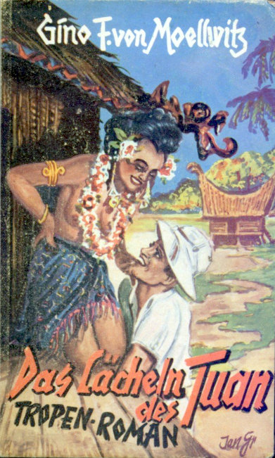

<@pagebreak 63/>

<@pagebreak/>

Tropenglut und Leidenschaft

Eine Reihe einzigartiger tropischer Erzählungen

Die
Zeitungen
berichten täglich

über Ereignisse, die sich in der Südsee zugetragen haben.
Südsee! Vorbei der Sturm. Friedlich träumt in unwahrscheinlichem
Blau die Lagune und spiegelt die Palmen
und üppigen Blütenbüsche der Insel Kolaula. Inmitten
der harmlosen Sonnenkinder lebt ein ernster Mann,
auf dem die Schatten eines tragischen Schicksals lasten.
Hier findet ihn ein verwöhntes junges Mädchen. Im
Südseezauber erwacht sie zu reiner, reifer Fraulichkeit
und führt den ernsten »Tuan« zurück unter die Menschen.
Diese geheimnisvollen Ereignisse sind in dem Roman

Das Lächeln des Tuan

in spannender Weise von Gino v. Moellwitz geschildert
worden. Gino v. Moellwitz ist ein alter Globetrotter, der
wohl alle Erdteile besucht und jahrelang mit offenen
Augen durch die Welt zog und uns jetzt schildert, was
er gesehen hat.

Preis des 100 Seiten starken Bandes 50 Pfg.

Der Roman **»Das Lächeln des Tuan«**, der durch jede Buch-
und Schreibwarenhandlung bezogen werden kann, ist der
1\. Band der Serie **»Tropenglut und Leidenschaft«**. Man erhält
diese Bände auch gegen Einsendung von 50 Pfg. (auch
in Marken) portofrei vom

Verlag moderner Lektüre G.&nbsp;m.&nbsp;b.&nbsp;H., Berlin SO 16.

