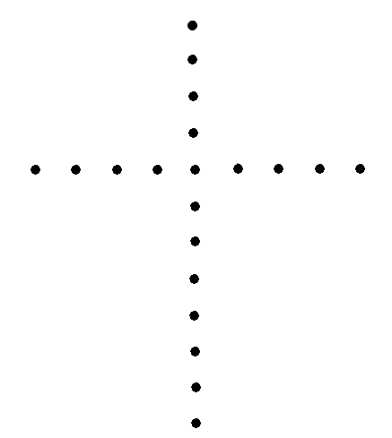

<h1>Das Spiel mit den goldenen Kugeln.</h1>

<h2>1. Kapitel.</h2>

<h3>Ein Kapitel, das vorweggenommen wird.</h3>

Die endlose, winterharte Heidefläche dort im östlichen
Pommern nahe der polnischen Grenze war nur stellenweise
mit dürftigen Birken, Krüppelkiefern und ganz vereinzelten
Buchen bedeckt, aber das Heidekraut stand hoch und üppig
und hatte sogar noch eine Unmenge zartlila, ins rötliche
spielenden Blüten an den trockenen Stengeln. Ebenso vereinzelt
wie die knorrigen Buchen lagen erratische Blöke umher, Urgestein
aus der Eiszeit, und hinter einem dieser Riesensteine, der
eine flache Kuppe und eine breite Spalte und einen Kranz
von Krüppelkiefern hatte, stieg soeben ein kaum merkliches
kleines Wölkchen auf, verpuffte in der glasklaren Morgenluft,
der dünne Knall eines Schusses mit eigentümlich blechernem
Klang wurde hörbar, und ein Habicht, der es auf eine Krähensiedlung
abgesehen hatte, strich vor dem warnenden Knall eilends
davon.

Oben auf dem Granitstein hinter einer Brustwehr aus
zwei mit Sand gefüllten schäbigen Rucksäcken lag ein wenig
vertrauenserweckender Stromer, der einen alten Schafpelz
und dazu einen unmöglichen Filz trug, der durch Hahnenfedern
verziert war. Das bärtige Gesicht des Landstreichers fiel
durch eine große schmale Hakennase auf, mehr noch durch
zwei graue, blanke Augen, in deren Tiefen eine verbissene
Energie wetterleuchtete.

Der Mann hatte soeben aus einer Repetierpistole, die
er in sehr praktischer Art an einem gekrümmten Ast befestigt
hatte, um sicherer zielen zu können, den Schuß abgegeben.

Der Mann wußte genau, was hier auf dem Spiele stand,
er sparte seine Munition, er feuerte nur, wenn er Aussicht
hatte, einen der sechs Burschen da drüben hinter der Bodenwelle
zu erwischen.

Bisher hatte er Pech gehabt. Die tadellosen belgischen
Luftbüchsen, mit denen der Feind auf hundert Meter den Kampf
aufgenommen hatte, waren seiner Pistole weit überlegen,
und die Kerle drüben waren leider nur zu gute Schützen.
Wenn er auch nur den Kopf etwas zu hoch emporhob, kam eins
der verteufelten Langbleigeschosse angefegt, und alles in
allem stand die Partie so ungleich, daß der Mann jetzt seinem
kleineren, korpulenten Gefährten nach rückwärts zurief:

»Die Geschichte wird immer ernster … Sieh zu, ob du
nicht doch in den Wagen gelangst, wir müssen durchzubrechen
versuchen.«

Was er mit »Wagen« bezeichnete, war zwischen den Krüppelkiefern
kaum zu erkennen, da über das schnittige Auto ein großer
Ölplan gedeckt worden war, den man in Mimikri zweckmäßig
bemalt hatte und der daher mit dem Tannengrün und der Farbe
der Heide in eins verschmolz.

Der kleinere der beiden Stromer lag am Fuße eines flacheren
Steines hinter einem Maulwurfshügel und deckte dem Freunde
den Rücken. Auch er verfügte nur über eine mit Draht an
einen langen Knüttel befestigten Pistole, war bisher überhaupt
nicht zum Schuß gekommen und suchte nun auf die Aufforderung
des anderen hin rückwärts zu kriechen.

Seine Beine drückten die hohen Heidekrautbüsche auseinander,
und vielleicht war’s diese Bewegung der Pflanzen, die einem
der Gegner, der seinen Platz gewechselt hatte, den bisher
unbeachteten Mann verriet.

Der kleine Dicke hatte noch nicht einmal den Rand des
dünnen Kieferngehölzes erreicht, als drüben die gefährliche
Luftbüchse mit schwachen, kurzem Klack sich entlud und die
Kugel mit unheimlicher Sicherheit durch die Heidestauden
fegte und, nur hierdurch etwas abgelenkt, den Hutrand des
Mannes durchschlug und über die linke Schläfe eine blutige
Furche zog, die bis zur Ohrmuschel verlief.

Der Getroffene fühlte seine Sinne schwinden, mit allerletzter
Kraft rief er halblaut: »… Mich haben sie!«, und dann verlor
er das Bewußtsein.

Sein Freund, der fünfzehn Meter weiter nach Norden
zu den großen Block besetzt hielt, wandte jäh den Kopf.
Von seinem hohen Verteidigungsplatz aus konnte er die Kiefern
und den bedeckten Wagen  überblicken, er sah die regungslose
Gestalt, er preßte nur die Lippen fester zusammen, und um
seinen Mund prägten sich dicke Falten aus, die bis zum Kinn
sich hinabzogen. Trotzdem lag jetzt in seinen grauen Augen
ein Ausdruck von Schmerz und Besorgnis, der jedoch sofort
wieder verschwand, als derselbe Schütze in seinem Rücken
die gute Gelegenheit benutzte und abermals feuerte. Das
Geschoß schlug dem Hakennasigen in den rechten Stiefelabsatz
und war eine so nachdrückliche Mahnung, daß der Einsame
da oben auf dem mächtigen Steine schleunigst seine Waffe
zwischen die Zähne nahm, die Rucksäcke packte und sie mit
sich rückwärts zog und sich in die Spalte des Steines fallen
ließ.

Dumpf dröhnend schlugen die beiden Sandsäcke auf, —
Mann hatte noch Glück gehabt, ein neues Langblei war ihm
nur durch die Achsel des Schafpelzes gefahren.

Hier in der Steinspalte, die bis zum Boden reichte,
waren neben den Resten eines Feuers allerlei Kochgeschirre,
Konservenbüchsen und anderes wild umhergestreut.

Diese Unordnung bewies, daß die beiden Stromer bei
der Zubereitung des Frühstücks von den Feinden überrascht
worden waren.

Der Hakennasige gab seine Sache noch lange nicht verloren.
Seine Kaltblütigkeit, die jetzt nur durch die Unsicherheit
über das Ergehen seines Freundes etwas gelähmt war, gewann
sofort wieder über alte anderen Empfindungen die Oberhand,
als eine neue Kugel ihm den Hahnenfilz ins Genick riß.

Er duckte sich tiefer, kroch mehr nach rechts in eine
kleine Mulde, baute hier seine Sandsäcke vorsichtig auf,
und lag nun etwa zwölf Meter nach Westen zu neben dem großen
Granitblock, wühlte mit dem Messer die leicht gefrorene
Erde auf und verstärkte seinen Schutzwall.

Die ungeheure Brutalität, mit der die Gegner vorgingen,
hatten seinen eisernen Willen zum Widerstand bis zum äußersten
nur verdoppelt, und für ihn und seinen Charakter war’s so
recht kennzeichnend, daß er jetzt sogar lächelte, als von
einem nahen Birkenstämmchen eine lustig schiepende Meise
ihn neugierig betrachtete und erst aufflog, als der Mann
blitzschnell einen Schuß abgab, dem drüben ein schriller
Aufschrei folgte.

»Endlich — der Erste!«, murmelte der Mann ingrimmig.

Das war der Kerl gewesen, der dort südwärts seinen
Freund niedergestreckt hatte.

Er drehte sich nun in der Mulde wieder nach Norden,
um nicht von dort überrascht zu werden. Durch die Heidestauden
lugend, sah er drei frisch aufgeschüttete Erdhaufen, die
bereits bedenklich nahes gerückt waren.

Nochmals kam ihm der Gedankte, alles auf eine Karte
zu setzen und aufzuspringen, den Freund in das Auto zu tragen
und einen Durchbruch zu versuchen.

Er wies den flüchtigen, unsinnigen Gedanken von sich.

Es wäre sein Tod gewesen …

Die Kerle schossen zu gut.

Die Leibgarde seiner erbitterten Feindin war ganz erlesenes
Pack, und das Spiel mit den goldenen Kugeln war nun in das
Stadium eines Spieles um Tod und Leben getreten.

Der Mann lächelte wieder …

Unglaublich war’s, daß in einem kultivierten Lande
derlei Dinge überhaupt möglich waren! Er wußte ja: Keine
halbe Meile nach Norden zu, wo der Boden fruchtbarer war,
erhoben sich die Gebäude eines großen Gutes, dessen Besitzer
ihm eng befreundet war. Dort auf Karolinenhof ahnte niemand,
das er hier von erbarmungslosen Feinden eingekreist war
… Niemand ahnte, daß er überhaupt in der Nähe weilte … —
Sein Lächeln wurde schmerzlich, — — es war gut so, daß auf
Karolinenhof selbst die beiden Gäste nicht vermuten konnten,
in welch bedrohlicher Lage er sich befand.

Da — — wieder ein Langblei … Es riß den einen Rucksack
auf, es surrte böse ins Leere, und der Sand quoll aus dem
Riß hervor und rieselte wie der feine gefärbte Staub einer
Eieruhr zu Boden.

Die Sonne schien immer wärmer, immer strahlender. Dieser
schöne Dezembertag war wie ein grimmer Hohn auf dieses blutige
Spiel …

»Bande!!«, murmelte der bedrängte Mann.

Nochmals war ein Langblei den Rucksack entlanggesaust
und hatte ein neues Loch gerissen.

Wieder rieselte der Sand …

Der Hakennasige merkte, was die Gegner planten …

Er sann auf ein Mittel, ihnen trotzdem den Sieg zu
entreißen, — er dachte jedoch auch daran, daß ihm der Granitblock
nur nach Osten die Aussicht versperrte …

Wieder wälzte er sich in der Mulde nach der anderen
Seite, — — ein Kopf mit einer Sportmütze war gerade hinter
dem Riesenstein aufgetaucht, der Hakennasige feuerte sofort,
und der Bursche dort warf die Arme in die Luft und sackte
lautlos zusammen.

»Nummer zwei …!!«

… Nun blieb es eine geraume Weile still.

Der Mann erhöhte seine Verschanzung abermals, riß Büschel
Heidekraut aus und benutzte sie  für seine Barrikade.

»Nur noch vier!«, überlegte er … »und sie werden jetzt
wohl stark abgekühlt sein …«

Seine Hoffnung stieg. Er hielt mit seiner Arbeit inne
und spähte durch die engen Schießscharten. Ein kratzendes
Geräusch von der Höhe des Blockes ließ ihn aufschauen. Da
waren droben plötzlich zwei flache Steinplatten erschienen,
zwischen ihnen zwei Läufe dieser verteufelten Luftbüchsen
… Die Läufe waren abwärts gerichtet, der Mann war verloren.
Er erwartete jeden Augenblick den Fangschuß, er gab das
Spiel auf, er lag hier als Zielscheibe, die Mulde nützte
ihm nicht mehr …

Aber so leichten Kaufes überließ er seiner Feindin
die niederträchtige Siegespalme doch nicht … Er schnellte
empor, hinein in die Kiefern, hinter das Auto …

Prallte zurück … Vor ihm stand eine jüngere Frau, in
jeder Hand eine Pistole …

»Hände hoch!!«

<h2>2. Kapitel.</h2>

<h3>… Und der Anfang: Ein Kreuz!</h3>

Die Flucht der Unterweltskönigin Harriet Prill aus
der Irrenanstalt Bruck in jener nebeligen Novembernacht schien
zunächst für uns beide, die von der intelligenten Verbrecherin
als ihre Todfeinde betrachtet wurden, keine unangenehmen
Folgen zu haben. Sowohl die Polizei als auch die mit kriminellen
Dingen gut vertrauten Berichterstatter der Berliner Presse
waren sich darüber einig, daß diese erstaunlich vielseitige
Frau mit Hilfe ihrer noch auf freiem Fuße befindlichen Komplizen
ins Ausland geflüchtet sei.

Mein Freund Harst hielt in diesem Punkte vorsichtig
mit seiner Ansicht zurück, ich merkte jedoch an seinem ganzen
Verhalten und an den von ihm in aller Stille getroffenen
Vorbeugungsmaßnahmen, daß er um unsere Sicherheit besorgter
denn je war. Sehr vielsagend war zum Beispiel, daß er seine
Mutter und unsere treue dicke Mathilde kurzer Hand zu einem
befreundeten Gutsbesitzer schickte und daß er diesem Herrn
ein Schreiben durch eine Vertrauensperson zukommen ließ,
in dem er verschiedene Wünsche äußerte, die den besagten
Gutsherrn ebenfalls zur Vorsicht mahnten.

An Stelle unserer wohlbeleibten Köchin war ein Ersatz
beschafft worden, der in jeder Beziehung das gerade Gegenteil
unserer Dicken war. Fräulein Agnes Miegel zeichnete sich
durch vollständige Fett- und Fleischlosigkeit, ferner durch
eine biedere Nickelbrille und eine Fülle brandroter Haare
aus, sie glich durchaus einer sehr stark angesäuerten alten
Jungfrau und besaß ein Hündchen, das in seiner allerersten
Jugend ein Terrier hatte werden sollen, nachher aber zur
reinrassigen Promenadenmischung von stattlicher Höhe und
fabelhafter Bissigkeit sich ausgewachsen hatte, — Paris
hieß dieser vorbeigeglückte Terrier, — bitte mit dem Ton
auf der ersten Silbe, also *Pa*ris, nicht Par*is*, — also nach
Paris, dem berühmten schönen Trojaner, der da durch seine
männlichen Reize im alten Hellas allerlei politische Verwickelungen
herbeigeführt hatte. —

Und nun hört leider die Gemütlichkeit auf, und die
dunklen Dinge bereiten sich langsam vor.

In der Nacht vom 1. zum 2. Dezember war leichter Schnee
bei zwei Grad Frost und völliger Windstille gefallen. An
diesem Tage weckte mich Harst gegen halb neun und meinte
mit sehr ernstem Gesicht: »Ziehe dich an, mein Alter … Die
Geschichte geht los …«

Ich war sehr schnell in den Kleidern, Harald führte
mich in die nach dem Hofe hinausgehende Veranda und deutete
stumm auf die gleichmäßige Schneeschicht, die den blitzsauberen
Hof bedeckte.

»Bitte, was siehst du?«

Die Frage war überflüssig. Jedem harmlosen Kinde wären
die Spuren aufgefallen. Mitten auf dem Hofe zeigte sich
klar ausgeprägt folgendes Fährtenbild (ich habe hier die
Stiefelspuren durch Punkte angedeutet):

Die Spuren bildeten also ein Kreuz, dort, wo die Kreuzbalken
zusammenstießen, war der Schnee zu einem kleinen Kreise
festgetreten worden, und in diesem Kreise sah ich etwas
blinken, — es konnte eine farbige Glaskugel sein, wie Kinder
sie zum Spielen benutzen.

»Nun?!«, fragte Harst bedächtig. »Wie gefällt dir das,
mein Alter? Man hat uns da ein nettes Grabkreuz vor die
Nase gesetzt. Beachte bitte, daß dieses Kreuz in der Längsrichtung
aus zwölf Schrittspuren, in der Querrichtung aus neun Schrittspuren
besteht, wenn man den festgetretenen Mittelkreis als eine
Einzelfährte für beide Kreuzbalken rechnet. Beachte schließlich
die Hauptsache: Die Person, die da mit ziemlich plumpen
Stiefeln dieses Kreuz herstellte, scheint aus der Luft herabgeflogen
und nachher wieder emporgeflogen zu sein, denn auf dem ganzen
Hofe ist außer diesen Fährten nichts von Fußspuren zu sehen.
— Hier, nimm dieses Fernglas, und betrachte dir den fragwürdigen
Spaß aus nächster Nähe, dann wird dir noch auffallen, daß
der nächtliche »Kreuzgänger« — verzeih den schlechten Witz
— uns seine Fähigkeiten als Flieger noch durch die einfache
Tatsache doppelt klar beweisen wollte, daß er mit dem Herstellen
der Kreuzspur an der Spitze des Längsbalkens begann, also
zunächst genau zwölf Schritte auf diese Veranda zu tat,
und dann mit dem Querbalken von links anfing. — Man könnte
nun ja vielleicht sagen, der Betreffende sei, nachdem er
den Längsbalken hergestellt hatte, auf seiner eigenen Spur
bis zum Mittelkreis zurückgekehrt, um dann noch vier Schritte
zu tun, und hierauf hätte er rückwärtsschreitend den Rest
des Querbalkens im Schnee hervorgerufen. Das Fernglas zeigt
dir jedoch, daß die Fährtenränder so scharf sind, daß der
Mann diese Methode nicht angewendet haben kann, — er wäre
beim Rückwärtsgehen in der Dunkelheit unbedingt einmal etwas
danebengetreten und hätte die Spuren verwischt. Dies ist
nicht der Fall.«

»Allerdings nicht«, warf ich ziemlich ratlos ein.

»Bitte, nimm die Sache nicht zu leicht«, meinte Harald
sehr eindringlich. »Auch Agnes Miegel pflichtet mir vollkommen
bei: dieses Kreuz ist eine Kampfansage. Von wem, brauche
ich dir nicht zu erklären. Und es ist eine Kampfansage,
die aus drei Gründen sehr, sehr bedenklich ist. — Ersten:
Die übrige Schneeschicht des Hofes ist vollkommen unberührt,
es kann keine Rede davon sein, daß der Mann, der das Kreuz
herstellte, etwa vom Gemüsegarten her herbeischlich und
seine überflüssigen Spuren sauber auslöschte. Nein, der
Mann kam aus der Luft, entfernte sich durch die Luft. —
Schau nur ganz genau hin, die Schneedecke ist wirklich überall
unberührt, nur gerade das Kreuz wurde hergestellt. — Das
wäre Punkt eins. Nun Punkt zwei: Der Schneefall hörte erst
um sieben Uhr morgens auf, etwas vor sieben, da war ich
bereits wach, und mein Schlafstubenfenster geht nach dem
Hofe hinaus. Ich hätte also, da das Kreuz erst nach Abzug
des Schneegewölks planmäßig hervorgerufen wurde, bestimmt
hören müssen, falls etwa ein Flugzeug den Mann abgesetzt
und wieder nachher irgendwie mitgenommen hätte, was technisch
vielleicht möglich gewesen wäre. Jedoch — ich habe nichts
gehört! — Punkt drei nun: Unserer neuen Köchin Musterhund
schläft bei ihr in der Stube neben der Küche, und das Fenster
geht auch nach dem Hof hinaus. Paris hat Ohren wie ein Lux,
er hätte bestimmt angeschlagen, wenn sich nur das Geringste
auf dem Hofe gerührt hätte … Er blieb still. — — So, und
nun wollen wir uns diese eigenartige Kriegserklärung einer
der intelligentesten Verbrecherinnen, die es je gegeben
haben dürfte, einmal aus der Nähe mit der nötigen Vorsicht
ansehen.«

Zunächst, das gebe ich zu, hatte das eigenartige Spurenkreuz
mich ziemlich gleichgültig gelassen.

Haralds scharfsinnige Ausführungen änderten dies aber
gründlich.

Wir gingen auf den Hof hinaus, auch die dürre Agnes
und der unliebenswürdige Paris schlossen sich uns an, und
nunmehr sahen wir aus allernächster Nähe, das Haralds Behauptungen
unbedingt richtig waren: Der Mann war aus der Luft gekommen
und wieder in die Luft emporgestiegen, denn die übrige Schneedecke
war gänzlich unberührt.

Es galt nun, die blanke Glaskugel aus der Mitte des
festgetretenen Kreises zu entfernen. Harst hatte bereits
zwei Angelstöcke zusammengebunden, schickte uns in den Hinterflur
zurück und versetzte der Kugel mit der Spitze der Angelruten
einen Hieb, so daß sie zur Seite rollte.

Jede Gefahr, das etwa eine Höllenmaschine uns zerfetzen
könnte, war hiermit vermieden.

Trotzdem hob Harald die Kugel sehr behutsam mit Handschuhen
auf, — Agnes Miegel hielt ein Becken mit starker Lysollösung
bereit, und erst, nachdem die Kugel gründlich desinfiziert
war, betrachten wir sie genauer, während unsere neue rothaarige
Köchin, die so allerlei verstand, von dem Spurenkreuz vier
fotografische Aufnahmen machte.

»Gold!«, sagte Harald sichtlich überrascht. »Es ist
tatsächlich Gold, und Harriet Prill kostet dieser Scherz
mindestens tausend Mark … Die Kugel ist nicht hohl, sie
wiegt etwas … sie ist aus Gold gegossen worden, sie hat
keinerlei Gravierungen, nichts, es ist eine kleine goldene
Kugel, weiter nichts … — das heißt: »Weiter nichts« sollte
man hier nicht sagen. Die Sache ist denn doch zu ernst und
zu geheimnisvoll … Nur ein Hirn wie das unserer Feindin
ist imstande, sich derartiges auszudenken. — Ich möchte
dich, bevor wir uns an den Frühstückstisch setzen, nur noch
darauf aufmerksam machen, daß unser Hof so groß ist, daß
das Spurenkreuz nicht etwa vom Dache her oder von einer
der Baumkronen aus mit einer langen Stange, an die ein Stiefel
festgebunden war, hergestellt werden konnte. Immerhin können
wir mal die Runde durch den Gemüsegarten und um das Haus
machen. Ich sage dir jetzt schon, wir werden keine Fährten
finden.«

Wir fanden auch nichts, und als wir dann in Harsts
Arbeitszimmer frühstückten — zu vieren nebenbei bemerkt,
Paris mitgerechnet — erklärte Agnes Miegel, indem sie die
Tasse wegschob und einer pechschwarzen Sumatra die Spitze
abbiß (Agnes rauchte nur schwerste Nummern), daß ihr in
ihrem reichbewegten Leben schon so allerlei begegnet sei,
aber diese Geschichte begreife sie nicht …

Und das wollte viel heißen. Agnes und Paris waren ja
nur nebenberuflich Köchin und Promenadenmischung.

Harst langte nach einer Zigarette … »Ich begreife vorläufig
auch nichts davon, Miegel, nur das eine weiß ich: Dieses
Kreuz wird nicht das einzige dieser Art sein …«

Miegels Frage, was er damit meine, wurde durch das
schrillen der Flurglocke und durch des lieben Hündchens
satanisches Gebell übertönt.

Herr Franz Emil Karl Kuschenreuter betrat die Szene,
— seines Zeichens Rentner, im übrigen dick, kahlköpfig,
kurzatmig und außerordentlich aufgeregt.

»Nehmen Sie Platz, Herr Kuschenreuter … Sie sollten
keinen Pelz tragen. Diese Art Bekleidung ist zu warm für
diese Jahreszeit … — Agnes, nehmen Sie unseres Klienten
Pelz mit hinaus … — so, — — Zigarette gefällig? — — Sie
kommen wegen des Kreuzes und der goldenen Kugel, Herr Kuschenreuter
…« Harald drückte den völlig verblüfften Herrn in den Klubsessel,
faßte ihm dann ohne weiteres in die rechte Jackentasche
und holte daraus das getreue Ebenbild unserer goldenen Kugel
hervor.

»… Das Gewicht der Kugel zog nämlich die Tasche herab,
Herr Kuschenreuter, außerdem markierte sich die Rundung
auch außen auf dem blauen Stoff ihres eleganten Maßanzuges.
— Ich bin kein Hexenmeister … Ich habe nur gute Augen und
einen nicht gerade schläfrigen Geist …«

Wozu er liebenswürdig lächelte und Herrn Kuschenreuter
auf die Schulter klopfte …

»Also —, erzählen Sie … Sie haben eine eigene Villa,
Ihr Schlafstubenfenster geht nach einem Rasenplatz oder
nach einer sonstwie gearteten glatten Fläche Ihres Besitztums
hinaus, und da sahen Sie das Kreuz und die Kugel beim Aufstehen
… Stimmt das?«

Karl Kuschenreuter nickte nur.

Er mußte sich erst etwas erholen.

Harald bringt die Klienten oft genug etwas sehr außer
Fassung.

<h2>3. Kapitel.</h2>

<h3>Kuschenreuter will nicht beichten.</h3>

Unser Klient kippte zwei Kognak Dreistern hinab und
war dann wieder Mensch.

»Herr Harst, ich wohne drüben im Vorort Dahlem, Prätoriusstraße
… Heute um acht meldete mir mein Schofför, daß vor meinem
Schlafstubenfenster auf dem Rasen, der gleichmäßig mit Schnee
bedeckt war …«

Harald winkte höflich ab …

»Entschuldigen Sie, — *ich* möchte Fragen stellen, wir
kommen so schneller zum Ziel. — Wie lange besitzen Sie Ihre
Villa bereits?«

»Acht Jahre …«

»Sie sind Witwer?«

»Ja …«

»Sehr reich …?«

»Hm, — — es geht …«

»Also *sehr* reich, — — Schweiz und so weiter, — ich
bin kein Finanzamt. — Haben Sie das Kreuz sich genau angesehen?«

»Und ob!! Wie der Kerl es mit seinen Stiefeln auf den
Rasen gestampft hat, besser in den Schnee, weiß ich nicht.
Der Lump muß durch die Luft geflogen sein! Es waren keine
anderen Spuren zu sehen. Übrigens habe ich hier eine Zeichnung
angefertigt, Herr Harst … Ich war nämlich Bauunternehmer,
und ich bin nicht auf den Kopf gefallen, wenn ich auch eine
Glatze habe …«

Harald prüfte die Zeichnung …

»Ja, ein Kreuz …! Zwölf Schritte bilden den Längsbalken,
neun den Querbalken, die goldene Kugel lag in der Mitte
auf dem festgestampften Fleck.«

Kuschenreuter starrte ihn ehrfürchtig an. »Dann brauche
ich ja gar nichts mehr zu erzählen, Herr Harst … — Woher
wissen Sie, daß die Kugel in der Mitte lag?!«

»Kombinationsgabe, Herr Kuschenreuter, also lediglich
berufliche Gewandtheit«, log Harst kaltblütig, um sofort
hinzuzufügen: »Wieviel Personal halten Sie?«

»Hm, — Köchin, Stubenmädchen, Schofför und Hausmeister,
— das heißt, die Bezeichnung Hausmeister trifft nicht ganz
zu, denn der alte Brückner genießt bei mir mehr so das Gnadenbrot
…«

»Und wie lange haben Sie das Personal bereits?«

»Seit Jahren, Herr Harst … — Entschuldigen Sie, wohinaus
wollen Sie mit Ihren Fragen?«

»Fragen? — Sagen wir besser Verhör! — Ja, Herr Kuschenreuter,
ein Verhör, das sehr ernste Ursachen hat. Erschrecken Sie
nicht … Ich werde Sie später schon aufklären. Nun noch etwas:
Haben Sie einen Wachhund?«

»Gewiß, einen sehr bissigen Schäferhund, der nachts
im Garten bleibt.«

»Schlug der Hund heute früh gegen sieben Uhr an?«

»Und ob!! Durch Hektors Bellen wurde mein Schofför
ja erst aufmerksam, zog sich schnell an, fand jedoch nichts
Verdächtiges, es war ja noch dunkel … Erst nach Tagesanbruch
bemerkte er das Kreuz und die Kugel und daneben Hektors
Pfoteneindrücke und etwas Blut …«

»Blut?!« Harald richtete sich kerzengerade auf. »Blut?
Ist der Hund verletzt worden?«

»Ja, durch einen Stich in den Nacken, jedoch nur leicht.
Wir haben die Wunde schon ausgewaschen und verbunden.«

Harst lehnte sich wieder zurück. »So … so, ein Stich
… — Ich möchte mir das Kreuz doch einmal ansehen, Herr Kuschenreuter,
recht bald. Vorher aber eine allerletzte Frage. — Werden
Sie nicht unruhig … nicht nervös … Sie müssen mir *alles*
sagen, verstehen Sie, alles! Bedenken Sie, daß ich mir als
alter Praktikus auf dem Gebiet ungewöhnlicher Vorgänge sofort
bei Ihrem Erscheinen hier unschwer zusammenreimte, daß Sie
kaum eines Kreuzes und einer goldenen Kugel wegen in solcher
Eile und Erregung mich aufgesucht hätten. Es muß für Sie
noch ein zweiter Anlaß vorliegen, meinen Rat einzuholen,
und dieser Anlaß muß mit dem Kreuz irgendwie zusammenhängen
… muß! — Haben Sie einen Erpresserbrief erhalten?«

Karl Kuschenreuter verfärbte sich plötzlich.

Er senkte den Kopf, seufzte vernehmlich und … verneinte.

»Da sind Sie auf der falschen Fährte, Herr Harst …
wirklich«, erklärte er sehr kleinlaut. »Von Erpresserbrief
ist keine Rede … Ich weiß, woran Sie denken: An die Geschichte
mit den betupften Fliegen, die Sie letztens aufgehellt haben,
an die Frau aus Zimmer 111, an die Harriet Prill … Nein,
Herr Harst … ich habe nichts erhalten, — — nur die goldene
Kugel …«

Aber er blickte noch immer zu Boden, und Harald lächelte
mir unmerklich zu.

»Also Bauunternehmer waren Sie …«, bemerkte er so ganz
nebenbei …

Kuschenreuter würgte ein sehr heiseres »Ja« hervor
und fügte hastig hinzu: »Wenn Sie sich das Kreuz noch ansehen
wollen, Herr Harst, — — die Sonne wird den Schnee sehr bald
wegtauen … Ich habe mein Auto draußen … Bitte begleiten
Sie mich …«

Er erhob sich schnell, — — aber Harald rührte sich
nicht.

»Herr Kuschenreuter, ich bedaure, Ihnen nicht helfen
zu können … Fahren Sie heim und versuchen Sie, mit der Geschichte
allein fertig zu werden, von der Sie mir nur die eine Hälfte
erzählt haben. Das haben Sie — nur die Hälfte, und das ist
sehr töricht von Ihnen, denn — — umsonst sind Sie nicht
so leichenblaß und so verstört. — Schraut, gib dem Herrn
noch einen Kognak, und dann geleite ihn hinaus …«

Der Rentner sah wirklich erbarmungswürdig aus, er tat
mir leid, und doch billigte ich Harsts Taktik …: Der Mann
mußte reden!

Doch Kuschenreuter war derberen Schlages, als ich glaubte,
er raffte sich auf, verabschiedete sich kühl und kurz und
fuhr davon. Die goldene Kugel hatte er auf dem Tisch liegen
lassen. Harst verglich nun die beiden Kugeln, sie hatten
genau die selbe Größe, auch die zweite zeigte keinerlei
Gravierung, sie war ebenfalls gegossen worden, stellenweise
war Oberfläche glatt wie poliert, stellenweise leicht körnig.

»Ein Besuch, aus dem ich nicht recht klug werde«, meinte
Harst nach einer Weile und wog die Kugeln in der Hand. »Bringe
doch einmal meine Feinwaage her … Ich werde den Durchmesser
der Kugeln mit dem Schiebemaß genau feststellen, und dann
werden wir …, — ah, drei und ein halbes Zentimeter Durchmesser,
ganz genau, dann läßt sich das ungefähre Gewicht leicht
berechnen, — einen Augenblick. Wiege du die Kugeln recht
genau …« Er setzte sich an den Schreibtisch und rechnete,
ich legte zunächst je eine Kugel auf eine der Wagschalen,
und siehe da, der Gewichtsunterschied war unbedeutend, unsere
Kugel, die ich leicht angekreuzt hatte, war etwas schwerer.

»Dreihundertzehn Gramm«, verkündete jetzt Harald vom
Schreibtisch her … »Was hast du festgestellt?«

»Unsere Kugel wiegt dreihundertachtzig Gramm, die andere
dreihundertvierzig …«

Er erhob sich und kam zu mir an den Mitteltisch, prüfte
selbst nochmals das Gewicht und sagte entschieden: »Wir
werden sie mit aller Vorsicht aufsägen … Gehen wir in das
Laboratorium hinauf.«

Ich tat keine weitere Frage, Harald hatte es sehr eilig,
oben war die Kuschenreuter-Kugel als erste halb in einen
Schraubstock geklemmt zwischen Holzleisten, und Harst nahm
eine feine Stahlsäge und begann die Arbeit mit größter Behutsamkeit.
Er schien noch immer mit irgend einer Hinterlist unserer
Todfeindin zu rechnen, und das diese scheinbar ganz aus
Gold bestehenden Kugeln nicht einwandfrei waren, zeigte
sich schon nach den ersten Sägeschnitten, bisher waren nur
Goldspänchen auf das Papier gefallen, das ich unter den
Schraubstock hielt, nun kamen Bleispäne zum Vorschein.

Harst hielt inne.

»Seltsame Kugel!«, murmelte er nur, drehte die Kugel
im Schraubstock und setzte seine Arbeit fort. Ich stand
neugierig dabei, ich blieb stumm, diese ganze eigenartige
Geschichte mit den Kreuzen und den Kugeln war so überaus
geheimnisvoll, daß man nirgends einen Anhaltspunkt fand,
wie das Rätsel zu lösen sei.

Nun hatte Harald die Kugel halbiert, nun zeigte er
mir, daß sie nur aus einer dünnen Golddecke und einem Bleikern
bestand, aber auch dieser Bleikern war nicht etwa eine Vollkugel,
sondern enthielt einen geschliffenen Diamant von tadellosem
Feuer nun etwa zwei Karat Gewicht.

Ich konnte zu alledem nur den Kopf schütteln.

»Was bedeutet das, Harald?!«

»Nun, der Diamant ist vielleicht zweitausend Mark wert,
das Gold, der Goldmantel höchstens zwanzig Mark, das Blei
gar nichts … — Ich gehe jede Wette ein, das Kuschenreuter
wußte, was die Kugeln enthielten …«

»So?!« — Mehr brachte ich wirklich nicht heraus.

Er hatte bereits die zweite Kugel in Arbeit, das Ergebnis
war dasselbe: In dem Bleikern war ein Diamant eingeschmolzen,
auch von etwa zwei Karat, noch  schöner als der andere.

Harst setzte sich in einen der Rohrsessel. »Das muß
Miegel sehen … Rufe die Köchin …«

Agnes Miegel und ihr Wundertier Paris erschienen sofort,
Agnes rückte die Brille zurecht, legte die Zigarre weg und
betrachtete die beiden Zaubereier eine ganze Weile, bevor
über die dünnen Lippen ein in halbem Maß hervorgestoßenes:
»Gänzlich unbegreiflich!!« kam. — Und dabei war doch gerade
Agnes eine Person, die nunmehr zwanzig Jahre sich mit nichts
anderem abgab als mit Dingen, die nicht leicht zu ergründen
waren.

Plötzlich schlug unten im Flur die Glocke an, — wir
hörten es, die eiserne Laboratoriumstür stand offen, und
das Hündchen Paris sauste mit wütendem Kläffen davon.

Der, der unter so stürmischen Läuten Einlaß begehrte,
war der Schofför des Herrn Kuschenreuter, der junge Mensch
war leichnenblaß, und es gelang ihm kaum, einen zusammenhängenden
Satz über die Zunge zu bringen …

»Draußen im Auto … mein Herr … tot … Hat sich selbst
erschossen … Pistole hat er noch in der Hand — — Schläfenschuß
…«

Harst beruhigte ihn, zwei Gläser alter Cherry taten
auch das Nötige, der arme Kerl wurde vernünftiger, riß sich
zusammen und erzählte folgendes. — Sein Herr hatte ihm,
als sie uns vor einer Stunde verließen, den Befehl gegeben,
nach einem der südlichen Vororte zu fahren, jedoch auf Umwegen
und  und möglichst so, daß sie nicht verfolgt werden könnten.
Der Schofför merkte, wie aufgeregt sein Herr war, kam dem
Befehl auch nach, und in dem Vorort L. hatte Kuschenreuter
den Wagen dann für etwa fünf Minuten verlassen. Wohin er
sich zu Fuß wandte, wußte der Schofför nicht. Als Kuschenreuter
wieder erschien, machte er einen völlig gebrochenen Eindruck
und lallte nur geistesabwesend: »Zu Herrn Harst zurück …!«
Erst hier in unserer stillen Straße vernahm der Schofför
im Auto einen Schuß, hielt an, öffnete die Tür der Limousine
und sah den Toten, der mit ausgestreckten Beinen in einer
Ecke lehnte. Sein Hut lag neben ihm.

»Was soll ich nur tun, Herr Harst?«, jammerte der junge
Mensch verzweifelt. »Soll ich zur Polizeiwache fahren?!
Ich weiß ja gar nicht, ob …«

»Fahren Sie zur Polizeiwache … Ich werde das Revier
telefonisch benachrichtigen«, erklärte Harald freundlich.
»Und fassen Sie sich, Mann …!!«

Er geleitete den Schofför hinaus.

Agnes Miegel sagte, als wir beide mit Paris allein
waren: »Schraut, diese Sache wird uns noch viel Kopfzerbrechen
kosten … und noch mehr Tote, fürchte ich … Wo Harriet Prill
die Hände im Spiel hat, geht es nie ohne Leichen und ohne
böse Verwicklungen ab.«

Ich konnte nur beistimmend nicken.

Harst warf die Haustür zu, draußen fuhr die Limousine
langsam davon, und Harald ließ sich mit dem Revier verbinden,
bekam Anschluß mit dem Reviervorstand und klärte ihm über
das traurige Ereignis auf.

»… Kuschenreuter kam gegen halb zehn zu uns und erzählte
eine sehr seltsame Geschichte von einem Kreuz im Schnee
und von einer goldenen Kugel, die ich dann aufgeschnitten
habe … Sie steht zu Ihrer Verfügung …«

Von unserem Kreuz und unserer Kugel erwähnte er nichts.

Er hängte ab und befahl Agnes, den Hof mit einem Besen
von den Schneeresten zu säubern.

Agnes lächelte etwas …

»Das war sehr klug, lieber Harst … Unser Kreuz und
unsere Kugel bleiben unsere Sache.« —

Ja, Agnes Miegel war eine etwas eigentümliche und eine
plump-vertrauliche Köchin.

Nach fünf Minuten kam ein Kriminalassistent angeradelt
und holte die aufgeschnittene Kugel ab und berichtete uns,
das im Garten der Villa Kuschenreuter das Kreuz leider bereits
von der Sonne weggefressen sei. Er schaute uns dabei recht
forschend an und fragte noch zaghaft: »Können Sie mir nicht
irgend einen Wink geben, Herr Harst, wie ich diese Sache
anpacken könnte? Hat Ihnen der Tote vielleicht irgend etwas
gebeichtet, das …«

»Nichts, gar nichts!«, — und Harst gab dem Beamten
die Hand. »Ich weiß über Kuschenreuters Ende genau so viel
und genau so wenig wie Sie … Das ist Tatsache.«

Er sprach wohl auch die Wahrheit, und der Assistent
radelte ohne viel Hoffnung, hier etwas ausrichten zu können,
davon.

<h2>4. Kapitel.</h2>

<h3>Villa Kuschenreuter und ihr Hausmeister.</h3>

Und nun mögen meine lieben Leser und Freunde, die ich
ja alle letzten Endes zu eigenem Nachdenken anregen will, sich
einmal das bisher Geschehene gründlichst und in allen Einzelheiten
überlegen. Ich habe die Vorgänge genau so geschildert, wie
sie sich damals zugetragen haben, und nach meinen damaligen
Notizen habe ich auch die eine Bemerkung Haralds eingestreut,
die ich selbst nicht recht verstand, die aber später der
Angelpunkt des Ganzen wurde. Bitte prägen Sie sich das Vorangegangene
genau ein, und sie werden dann leichter im Geiste das beschleunigte
Tempo mitmachen können, das die Ereignisse nunmehr einschlugen.

Es war jetzt halb zwölf vormittags geworden. Harald
lehnte jede Erörterung des Falles »Goldene Kugeln« mit der
Bemerkung ab, es sei ganz zwecklos, in diesem Anfangsstadium
die Dinge immer wieder zu zerpflücken. Er hatte sich in
der Bibliothek an den Flügel gesetzt, hatte jedoch schon
nach den ersten Takten der Mondscheinsonate die Hände müßig
in den Schoß sinken lassen und starrte regungslos ins Leere.

Ich ging in die Küche, ich mußte mich mit irgend jemandem
aussprechen, und Agnes war hierzu sowohl die geeignetste
als auch die einzig in Betracht kommende Person. Agnes qualmte
wieder eine schwarze Nikotinnudel und klopfte das Fleisch
weich, das es zum Mittagessen als Wiener Schnitzel geben
sollte. Paris kaute an einem Knochen und knurrte mich an,
Miegel sagte achselzuckend: »Es ist doch eine Erpressung,
Schraut! Kuschenreuter muß ein sehr schlechtes Gewissen
gehabt haben.«

»Wie kam des Kerl, der daß Kreuz herstellte und die
Kugel niederlegte, auf unseren Hof geflogen?«, fragte ich
ärgerlich. »Das interessiert mich am meisten …«

Die Küchentür war nur angelehnt, und vom Flur her erklang
Haralds Stimme:

»Und mich interessiert am meisten der Stich, den Hektor
erhalten hat …! — Sobald die Luft in der Villa Kuschenreuter
rein ist, werden wir mal hinfahren. — Miegel, beeilen Sie
sich mit Ihren sehr mäßigen Kochkünsten. Wenn Sie nur Schnitzel,
Setzeier und zur Not Klopse in Ihrem Programm haben, kündige
ich Ihnen.«

Miegel lachte trocken und gegen ein Uhr waren wir aufbruchsbereit.
Unser Sportflitzer brachte uns in kurzem nach Dahlem, wir
wir sahen die Villa Kuschenreuter zum ersten Male, sie lag
an einer nur einseitig bebauten Straße ganz einsam, drüben
erstreckte sich freies Feld bis Zehlendorf hin, und die
Nachbargrundstücke waren nur umzäunte Bauplätze.

Der Schofför öffnete uns das Tor, wie fuhren bis vor
die Garage, die Kriminalpolizei war bereits wieder mit ihrem
Auto auf und davon und hatte, wie uns der Schofför berichtete,
den alten Herrn Brückner, der hier das Gnadenbrot genoß
und gleichzeitig so etwas Hausmeister spielte, die Aufsicht
über den Besitz übertragen, da Kuschenreuter keine näheren
Verwandten besaß. — Wir betraten die sehr vornehm eingerichtete
Villa, und der Schofför meldete uns dem alten Herrn, den
wir in Kuschenreuters Arbeitszimmer antrafen.

Brückner saß am Schreibtisch, die Fenstervorhänge hatte
er des prallen Sonnenscheins wegen geschlossen, es erhob
sich schwerfällig, seine hagere Gestalt war in einen speckigen
Gehrock eingezwängt, das graue volle Haar trug er künstlermäßig
glatt zurückgestrichen, und auch sein grauer Spitzbart und
der dichte herabhängende Schnurrbart erinnerten sofort an
einen Musikus. Bevor er uns die Hand reichte, wechselte
er die Hornbrille, zwinkerte uns kurzsichtig an und bat
uns, Platz zu nehmen. Ich schätzte ihn auf etwa siebzig
Jahre, — nachher erzählte er, er sei fünfundsiebzig und
früher Kapellmeister gewesen, dann aus Not Straßenmusikant,
— von Kuschenreuter sprach er voll tiefer Dankbarkeit, seine
Stimme war müde und schwach, sein Benehmen hatte noch immer
etwas Komödiantenhaftes. Er läutete, ließ Erfrischungen
durch das Stubenmädchen bringen, füllte die Weingläser und
schob uns Zigarren und Zigaretten hin.

Wir saßen in einer sogenannten Klubecke um einen runden
Tisch, und Harst rückte so allmählich mit seiner Bitte heraus:
Ob er nicht einmal Kuschenreuters Schreibtisch durchsuchen
dürfe …

»Bitte, Herr Harst … Warum nicht? Sie werden dort nichts
finden, die Polizei fand aus nichts, und …«

Da schlug das Telefon an. — Brückner schlurfte zum
Schreibtisch, hob den Hörer ab, stand mit dem Rücken zu
uns hin und murmelte nur zuweilen ein eintöniges »Ja — —
gewiß« als Antwort für den, mit dem er sprach. Dann hängte
er ab, entschuldigte sich bei uns, — er müsse für die Polizei
seine Papiere zusammensuchen, und verließ das Zimmer.

Harald, der seine eigene Mirakulum rauchte, horchte
einen Augenblick, war dann im Nu am Schreibtisch und hob
den Hörer ab …

»Fräulein können Sie noch feststellen, mit wem ich
soeben verbunden war? War es eine Polizeinummer?«

Ich hatte mich ihm leise genähert … Ich konnte die
Antwort mithören. »Nein, es war ein Anruf von einem Automaten
…«

»Danke …« — Harald legte den Hörer auf die Stützen
zurück und blickte mich vielsagend an. »Brückner hat gelogen
… Hoffentlich kommen wir noch mit heiler Haut davon …«

Er faßte in die Schlüsseltasche, lief zur Tür (es war
eine Doppeltür, die innere war gepolstert), rüttelte — —
sie war verschlossen.

Er eilte zu der zweiten Tür, die wahrscheinlich in
eine Bibliothek führte …

Auch verschlossen …

Eine dritte Tür gab es nicht.

»Fenster auf, — wir dürfen uns nicht lange aufhalten,
mein Alter!«

Ich riß die Vorhänge zur Seite … Das Fenster ging auf
den Garten hinaus, hatte Ziergitter …

Urplötzlich fielen da die Rolladen der beiden Fenster
krachend und polternd herab, — wir standen im Dunkeln, —
jetzt wußten wir, daß wir hier in eine Falle getappt waren,
aber die Erkenntnis kam zu spät. Harald schaltete zwar sofort
seine Taschenlampe ein, aber sie flog ihm im Augenblick
aus der Hand, und eine weiche Stimme, die mir unangenehm
bekannt vorkam, drohte aus der Dunkelheit heraus mit aller
Strenge:

»Rühren Sie sich nicht … Sie wissen, wen Sie vor sich
haben, und unsere belgischen Luftbüchsen tun rasche und
lautlose Arbeit! Werfen Sie Ihre Pistolen weg!! Vor sich
auf den Teppich in Richtung des Tresors neben dem Schreibtisch!
Sofort!!«

Fast gleichzeitig blitzte auch über dem in die Wand
eingelassenen Tresor eine Wandlampe auf, von der man den
Seidenschirm entfernt hatte.

Die Tresortür stand halb offen, der Lichtschein reichte
nicht bis in das Innere des mächtigen Stahlgefüges hinein,
aber zwei mattierte Büchsenläufe, die auf uns gerichtet
waren, kennzeichneten die Situation ganz eindeutig, — Harsts
Pistole flog nach vorwärts und rutschte unter ein Eisenschränkchen,
die meine folgte, und nun hatte Harriet Prill gewonnenes
Spiel.

»Setzen Sie sich auf die beiden Sessel hinter Ihnen
an der Wand«, kommandierte sie weiter. »So — — und nun können
wir wohl endgültig abrechnen … Das Personal und der alte
Narr, der Brückner, sind gut aufgehoben, und …«

»Sie sind erstaunlich geschwätzig geworden, Harriet
Prill«, unterbrach Harst diesen in der Tat überflüssigen
Redestrom. »Bei vielem Reden ist noch niemals etwas herausgekommen.
Immerhin zolle ich Ihnen volle Anerkennung, diese Falle
war geschickt hergerichtet, und der Tresor war vielleicht
bei alledem der einzige Fehler, abgesehen von dem geringfügigen
Stich, den der Hund erhielt … — Haben Sie sonst noch Wünsche?
Wir nicht …: Wir wußten, daß auch Ihnen eines Tages das
Glück hold sein könnte … — Schießen Sie!! Machen Sie ein
Ende!«

Daß Harst dies alles niemals ernst meinte, hörte ich
schon seinem ironischen Tonfall an. Er schien heimlich sogar
über irgend etwas äußerst belustigt zu sein, denn er hatte
die Beine übereinandergeschlagen, und die eine Fußspitze
wippte beständig hin und her, während er mit den Fingern
der rechten Hand, die auf der breiten Klubsessellehne lag,
einen gedämpften Marsch trommelte.

Schweigen folgte … — Unsere rachsüchtige Feindin schien
etwas aus dem Konzept geraten zu sein, die beiden mattierten
Büchsenläufe schwankten ein wenig, und erst nach geraumer
Weile ertönte die weibliche Stimme weit schärfer …:

»Sie haben mich bestohlen, Harst! Wo ist die Beute?«

Das letzte Wort wurde am stärksten betont: Beute!!

… Beute?! Wo war irgendwie bisher gerade davon die
Rede gewesen?! Nirgends!! Meinte Harriet etwa die beiden
goldenen Kugeln und ihren  Diamanteninhalt?! Aber das war
doch Unsinn, sie selbst hatte doch diese Kreuze im Schnee
irgendwie entstehen lassen! Sie hatte die Kugeln dort am
Schnittpunkt der Kreuzbalken niedergelegt! Sollte denn diese
tolle Geschichte immer unsinniger und verworrener werden?!

Ich schaute Harst an … Er lächelte nachsichtig. Wir
saßen hier im Halbdunkel, der Lichtschein der Wandlampe
reichte nur schwach bis zu unseren Plätzen hinüber. Was
würde er antworten? Ich war sehr gespannt darauf. Wenn er
es schlau anfing, war ihm hier ja ein Mittel in die Hand
gegeben, Harriet hinzuhalten und Zeit zu gewinnen. Andrerseits
ließ doch sein ganzes Benehmen mit Sicherheit darauf schließen,
daß er bereits vor Harriets merkwürdiger Frage nach der
»Beute« ein solches Mittel in Bereitschaft gehabt hätte!

Die Antwort erfolgte seinerseits sehr promt.

»Daß ich die Beute nicht mit mir herumschleppe, werden
Sie sich wohl selbst sagen. Wie können uns also dahin einigen,
daß ich die Beute herausgebe, während Sie uns diesmal noch
schonen. Ich glaube, der Vorschlag ist annehmbar, zumal
Sie zumindest einen sehr groben Fehler gemacht haben … Sie
hätten die Tresortür nicht nur anlehnen dürfen, mir mußte
das doch auffallen, und …«

»Die Tresortür war nicht angelehnt, sondern geschlossen«,
fiel unsere Feindin gereizt ein.

»Dann muß das ja ein sehr eigentümlicher Tresor sein«,
erklärte Harst mit einem so ehrlich heiterem Auflachen,
daß ich zusammenfuhr.

»Lachen Sie nicht!!« Harriet wurde böse, und ich flüsterte
Harst eiligst zu: »Reize sie doch nicht!«

Die Tresortür schwang etwas weiter auf.

Es war eine durchgehende Tür, der Panzerschrank hatte
also keinen Unterbau mit einer besonderen Tür. Auch die
Läufe der Luftbüchsen bewegten sich wieder. Das, was hinter
der Tür steckte, blieb jedoch unsichtbar.

Und abermals trat Schweigen ein … Harst hatte jetzt
sein Trommeln mit den Fingerspitzen auf der Sessellehne
eingestellt, ich blickte unwillkürlich hin, und ich ruckte
zusammen, über das, was ich sah: Er hatte unter der flachen
Hand seine Pistole versteckt, er konnte jede Sekunde davon
Gebrauch machen …!

Was aber hatte er dann vorhin von sich geschleudert?!
Es war doch ein kleiner dunkler Gegenstand gewesen?! Etwa
Pistolengröße …

Und als ob er nun meinen erstaunten, fragenden Blick
fühlte, beugte er sich etwas zu mir herüber und flüsterte
nur: »Metallaschbecher, Muschelform mit hoher Zacke!«

Und da besann ich mich: Ein solcher Aschbecher hatte
auf dem Tische der Klubecke gestanden, und Harst mußte ihn
an sich genommen haben, bevor noch das Licht aufblitzte,
— er hatte also mit dem Befehl, die Waffen wegzuwerfen,
von vornherein gerechnet.

So verblüfft ich auch gewesen, — diese Stimmung verwandelte
sich sofort in ein Gefühl erhöhter Sicherheit. Ich war keinen
Moment darüber im Zweifel, daß Harald abdrücken würde, bevor
Harriets Schützen dort im großen Tresor ihrerseits die Finger
um den Abzug krümmen konnten.

Da meldete sie sich wieder. »Gut, ich will Sie beide
schonen … Sie werden die Beute unter die Erinnerungseiche
drüben auf dem Rasenplatz der Anlage legen, — unter die
eingezäunte Eiche …«

»Ich weiß, welche Eiche Sie meinen … — Wann?«

»In der kommenden Nacht, ein Uhr früh, — aber keine
Hinterlist, Herr Harst, keinen Verrat an die Polizei!!«

»Nächste Nacht …?«, Harald sprach das sehr zweifelnd
und sehr gedehnt. »Das wird kaum möglich sein … Die Beute
ist nicht so schnell herbeizuschaffen, wirklich nicht. Sagen
wir übernächste Nacht …«

»Nein!! Sie wollen mir doch nicht weismachen, daß Sie
in der kurzen Zeit die … die Sachen so weit weg von Berlin
gebracht haben, daß …«

»Ich mache Ihnen gar nichts weiß, ich verpflichte mich
zu nichts, was ich …«

»Ausreden!! — Nichts als Ausflüchte sind das!!« Harriets
Stimme schrillte bedenklich. Und gerade sie hatte doch sich
selbst und ihr Organ so tadellos in der Gewalt. »Nächste
Nacht, verstehen Sie mich, — — oder — — es ist aus mit Ihnen
beiden!!«

Diese Harriet Prill kannte ich noch nicht. Bisher hattet
sie stets eine unheimliche Selbstbeherrschung gezeigt, immer!
Mir stand ja das Bild noch so plastisch vor Augen, als sie
in der Scheunenstraße Berlins den geheimnisvollen Herrn
im Frack gespielt hatte! Damals hatten wir die »Marionetten
der Frau Niemand« bekämpft, damals hatte sich Harriet als
Verbrecherin ganz großen Formats gezeigt. Heute dagegen?!
Das war eine keifende, schimpfende alte Jungfer, das war
nicht jene Unterweltskönigin von einst! Sollte ihr die kurze
Haft in der Irrenanstalt so schlecht bekommen sein?! Sie
enttäuschte mich geradezu, ihr fehlte jeder Zug ins Große,
— jetzt war sie nur eine elende Durchschnittsgaunerin mit
dem Freifahrtschein des Paragraphen 51!

Und nochmals drohte sie — noch schriller: »Nächste
Nacht!! Oder … oder …«

Was sie noch hinzufügen wollte, blieb ungesagt …

Aus Harsts halb erhobener Hand knallte es kurz und
blechern, — die Kugel schlug gegen die Stahltür, prallte
ab und fuhr nach rechts in ein gerahmtes Bild an der Wand,
dessen Glas klirrend in Stücke ging …

Ein zweiter Schuß knallte, — etwa mit derselben Wirkung,
nur das jetzt die beiden Büchsenläufe blitzschnell verschwanden
und die Tresortür krachend zufiel …

Gleichzeitig ging die Wandlampe aus, aber Harst hatte
sich schon rückwärtsgeschnellt, fand den Lichtschalter,
— ein Knacken, und die Herrenzimmerkrone mit ihren neun
Birnen flammte auf.

Er nickte mir zu, lächelte fast spitzbübisch und sagte
nur ungeheuer trocken:

»Ganz nettes Theater, nicht wahr?! Du hast doch hoffentlich
den Schwindel sofort durchschaut … Oder glaubtest du, diese
Anfängerin sei *unsere* Harriet?! Die echte Harriet ist denn
doch etwas gerissener …«

Und ohne sich um meinen sicherlich sehr wenig geistreichen
Gesichtsausdruck zu kümmern, drückte er auf den Klingelknopf
und fügte hinzu: »Herr Richard Brückner  wird ja kaum noch
anwesend sein … Aber das niedliche Stubenmädchen dürfte
auf das Läuten erscheinen …«

Ich war immer noch nicht ganz Herr meiner Gesichtsmuskeln
und Gedanken, ich zog es vor, an den Ecktisch zu treten
und mir ein Glas Wein einzuschenken … Ich hatte es kaum
auf einen Zug geleert, als die Flurtür sich öffnete und
die nette Zofe eintrat. Sie machte sehr verwunderte Augen
und fragte unsicher:

»Wer hat die Herren denn eingeschlossen? Und wo ist
Herr Brückner?«

»Liebes Kind«, erklärte Harst äußerst amüsiert, »Herr
Brückner schloß uns wohl aus Zerstreutheit hier ein … Er
selbst ist über alle Berge …«

Das Mädchen schüttelte langsam den Kopf. »Verzeihung,
Herr Harst, — daraus werde ich nicht klug. Brückner hatte
uns alle in die Küche befohlen, weil sie uns vernehmen wollten,
— — sagte er …«

»Ja — — sagte er!«, nickte Harald gemütlich. »Er wird
vieles gesagt, was gelogen ist … — Treten Sie mal näher,
Kind … sie sind doch ein aufgewecktes Ding … Ich möchte
nur eine Frage an Sie richten, dann können Sie wieder gehen.
Pflegte der alte Brückner in letzter Zeit häufiger die Villa
zu verlassen? Blieb er lange fort, wenn er ausging?«

Das Mädchen erklärte promt: »Seit etwa zwei Wochen
unternahm Brückner jeden Vormittag einen Spaziergang … Er
wanderte stets dort den Feldweg entlang, der durch die Bauterrains
und die Äcker nach Zehlendorf führt und war stets etwa zwei
Stunden fort, — — der Arzt hatte ihm die Bewegung an frischer
Luft wohl verordnet, Herr Harst …«

»Es war eine Ärztin, liebes Kind … — so, ich danke
Ihnen … Wenn wir Sie noch brauchen, läuten wir wieder. Bleibt
nur in der Küche beieinander. Den Schäferhund Hektor und
den Rasenplatz, wo das Kreuz zu sehen war, schaue ich mir
nachher an …«

<h2>5. Kapitel.</h2>

<h3>Das Aktenstück über den Kirchenbau.</h3>

Harst schritt auf die andere Tür zu, die vorhin auch
verschlossen gewesen, — jetzt konnte er sie ohne Mühe öffnen,
und wir blickten in eine langgestreckte Bibliothek hinein.,
an deren Wänden hohe Bücherregale aus Eichenholz mit reichen
Schnitzereien standen. Die Sonne hatte hier durch drei bunte
Bogenfenster ungehindert Zutritt, der Raum war von einem
angenehmen milden Licht erfüllt, im Hintergrund war ein
Billard aufgestellt, Waffen und Klubsessel und kostbare
Perser erhöhten noch den behaglichen Eindruck.

Harald wandte sich sofort nach links. An dieser Wand
neben der Tür war ja nebenan im Arbeitszimmer der große
Tresor in die Mauer eingelassen, — hier stand an derselben
Stelle ein schmales, gefülltes Bücherregal, vor dem kein
Teppich lag.

Harst sagte so nebenher, während er das Regal untersuchte:
»Kuschenreuter war Bauunternehmer, also Fachmann. Diese
Villa dürfte noch mehr Scherze enthalten …«

Dabei zog er das Regal wie eine Tür auf, nachdem er
an der Seite eine Schnitzerei, einen stark hervorragenden
Löwenkopf, der etwas auffallend war, gedreht hatte.

Das Büchergestell berührte nicht den Parkettboden,
nahm einen Teil der getäfelten Wand mit, und wir konnten
nun in den Tresor hineinblicken.

Er war bis auf einige dicke alte Kontobücher und ein
paar Bündel Akten leer. Das obere Drittel enthielt kleinere
Schließfächer mit Kunstschlössern.

»Hm, — — was sagst du zu dieser Einrichtung, mein Alter?«,
fragte Harst stark gedehnt. »Ein geheimer Durchschlupf,
gleichzeitig ein sicheres Versteck für den Fall der Not,
und Kuschenreuter rechnete wohl mit irgend welchen Widrigkeiten.«
Er bückte sich und nahm die Aktenstücke eins nach dem anderen
in die Hand, legte sie bis auf ein besonderes dicke wieder
zurück und deutete auf die Aufschrift der Aktendeckels:

Abrechnungen Kirchenbau Vorort L., Berlin

1923 — 24

Karl Kuschenreuter

Baugeschäft

»Das habe ich gesucht, mein Alter … Daß ich es so schnell
finden würde, habe ich nicht gehofft. Setzen wir uns. Hier
sind auch noch die Baupläne eingeheftet … Geht dir nun ein
Licht auf, weshalb der Mann vor uns mit aller Vorsicht nach
L. Fuhr? — Mir ging ein Licht auf, als der Schofför dies
erzählte und erwähnte, sein Herr sei *zu Fuß* noch irgend
anderswohin gegangen und sehr verstört zurückgekehrt. Ich
habe da gleich an eine Kirche, ein Gemeindehaus oder dergleichen
gedacht, wo vielleicht im Vorraum in den Fliesenboden ein
Kreuz aus dunkleren Steinen eingefügt sein könnte.«

Jetzt begriff ich, — freilich nur halb. — Wie sollten
mir auch die verwickelten Zusammenhänge sofort klar werden?!

Harald faltete einen der Baupläne auseinander …

»Da haben wir’s schon! — »Brauthalle der Kirche«, —
bitte hier der Fliesenboden: Ein Kreuz: Zwölf schwarze Steine
als Längsbalken, neun als Querbalken, am Schnittpunkt der
Balken ein runder Stein mit einer vergoldeten Inschrift,
die auf den Zweck der Halle hindeutet. Ein Teil des Rätsels
ist somit gelöst.«

»Da bin ich neugierig«, sagte ich ehrlich und gab damit
meiner Schimmerlosigkeit zu.

Harst klatschte mir gutmütig auf den Schenkel. »Seien
wir froh, daß wir soweit sind, mein Alter … Dir gegenüber
genügt Depeschenstil. Also: Mir stieß sofort die Kreuzform
auf, das Kreuz im Schnee. Wie es hervorgerufen wurde, bleibt
noch zu ermitteln. Dann kommt der Bauunternehmer Kuschenreuter
zu uns. Seine Erregung übersteigt das notwendige Maß. Ein
Kreuz und eine goldene Kugel mögen einen Mann verblüffen
können, aber nicht derart verstört machen, mithin mußte
er mehr wissen, als er preisgab. Besinne dich, das ich die
Frage einstreute: »Also Bauunternehmer waren Sie?« Schon
die Art der Fragestellung war so gewählt, daß in der Frageform
sich ein gewisser Nebengedanke ausdrückte. Es ist ein Unterschied,
ob ich sage: »Sie waren Bauunternehmer, Herr Kuschenreuter«
oder ob ich das »Also« voranstelle und die Wortstellung
ändere: »Also Bauunternehmer waren Sie?« Damit deutet der
Fragende schon an, daß es ihm auf den Bauunternehmer ankommt.
— Kuschenreuter bejahte hastig, nervös und ablenkend. Nachher
fährt er eisig kühl weg, — er fürchtet um sein Geheimnis.
Sein Schofför erscheint dann: Kuschenreuter hat sich erschossen.
Im Grunde kam mir die Unglücksbotschaft nicht zu überraschend,
daß irgend etwas geschehen würde, konnte ich mir denken.
Die Tatsache, daß Kuschenreuter in L. sein Auto verlassen
und zu Fuß für einige Zeit verschwunden war, habe ich richtig
bewertet: Er begab sich zu dem Ort, wo seines Geheimnisses
Kern lagerte, — das konnte nur ein von ihm hergestelltes
Gebäude mit einem Kreuz sein. Dann fuhren wir hierher. Und
nun — gab acht! — glitt ich auf dem blanken Eise dieses
Fragenkomplexes aus. Ich war vorsichtig, aber ich fiel trotzdem
zunächst einem groben Irrtum anheim. Dem alten Brückner
traute ich von vornherein nicht, der Mann gab sich zu geziert,
dann kam das Telefongespräch und seine Lüge …: Er war in
Wahrheit von einem Automaten in der Nähe dieser Villa angerufen
worden! Es folgten die anderen Scherze, — die Frau meldete
sich aus dem Tresor, und  nach kurzer Zeit korrigierte ich
meine Meinung, es sei Harriet. — Den einen Scherz mit der
angeblich offenen Tresortür, auf den sie genau so prompt
hereinfiel wie auf den Aschbecher, hast du begriffen: Ich
ahnte, daß der Tresor nur Durchschlupf sei! — Und dann beging
die unechte Harriet den Fehler mit der »Beute«. Du wirst
dir jetzt selbst sagen, daß die »Beute« in der Brauthalle
der neuen Kirche in L. verborgen war, daß Kuschenreuter
hinging und bemerkte oder feststellte, daß sein Schatz
fehlte, daß ihn da die Angst packte, ein Verbrechen, daß
er einmal begangen, könnte entdeckt werden: Er erschoß sich!
— Schon der Umstand, daß er eine Waffe bei sich hatte, beweist
sein Schuldbewußtsein. — Und nun der alte Brückner. Kuschenreuter
gewährte ihm das »Gnadenbrot«, er machte ihn zum Hausmeister
und damit den Bock zum Gärtner. Brückner muß etwas von seines
Wohltäters einstiger Verfehlung gewußt haben, etwas, er
verbündete sich mit einem Weibe, beriet mit dieser, daher
seine Spaziergänge … Das Weib wohnt nebst Anhang irgendwo
in Zehlendorf, Brückner fand schließlich heraus, wo die
»Beute« lagerte, und die Verbündeten wollten die Brautkapelle
oder besser das Versteck unter dem Mittelstück des Kreuzes
plündern …«

Er machte eine Pause und leitete die Fortsetzung, auf
die ich ebenso begierig wartete, durch eine unklare Handbewegung
ein. »Wir kommen nun auf das Gebiet reinlogischer Schlußfolgerungen,
bei denen die Fantasie die Hauptquelle bildet und mit denen
es somit seinen Haken haben könnte. — Folgendes muß oder
kann geschehen sein, — ich bin mehr für das »muß«. Harriet
Prill muß irgendwie von dem geplanten Beutezug Brückners
und des noch unbekannten Weibes erfahren haben und kam ihnen
zuvor, also Harriet hat jetzt die »Beute«, und Harriet bereitete
es große Freude, weil Schadenfreude die reinste Freude ist
— uns und Kuschenreuter das Kreuz vor die Nase zu setzen
samt den goldenen Kugeln mit Diamanteninhalt. Es entspricht
durchaus Harriets krankhaftem Größenwahn, auch uns beide
mit dem Kreuz und der Kugel beehrt zu haben, wir sollten
uns gründlich darüber die ihr so verhaßten Köpfe zerbrechen,
und das haben wir ja auch getan. Natürlich verfolgt sie
mit alledem noch eine Nebenabsicht: Uns beide zu erwischen
und zu »bestrafen«, — was sie so bestrafen nennt. — — So,
hiermit können wir die Theorie verlassen und uns wieder
der Praxis zuwenden. Gehen wir in die Küche hinab, schauen
wir uns dann Hektor und den Rasen an … Aber behalte deine
Waffe entsichert in der Tasche, — wie gesagt, dieses Haus
wird noch mehr Absonderlichkeiten bergen als lediglich diesen
»Tresor«, der ebenfalls beweist, daß Kuschenreuter sich
vor etwas fürchtete, das mit der »Beute« zusammenhing.«

Er legte das Aktenstück in den Stahlschrank zurück
und drückte das Bücherregal zu.

Ich war von dem Gehörten noch so benommen, daß ich
meinem geistig so regen Freund nicht einmal eine Anerkennung
für seine Leistung aussprechen konnte, und diese Anerkennung
hatte er verdient. Meine lieben Leser und Freunde mögen
nun einmal selbst die Einzelheiten überprüfen: Es *war* eine
geistige Leistung, in der sich kühle klare Schlußfolgerungen
innigst mit einem kühnen Spiel der Einbildungskraft verbanden.

Das muß — pardon — auch der größte Neidhammel zugeben.

Und ich mag ein Hammel sein …

Neidisch war ich nie.

Womit ich den ersten Teil der »Goldenen Kugel« schließe
und für den zweiten Teil noch kniffligere »Scherze« verheiße,
aber auch bitterernste Dinge, von denen ich ein Stück herausgegriffen
und hier als 1. Kapitel gebracht habe … —

Also nun kamen Hektor und der Rasen an die Reihe.

