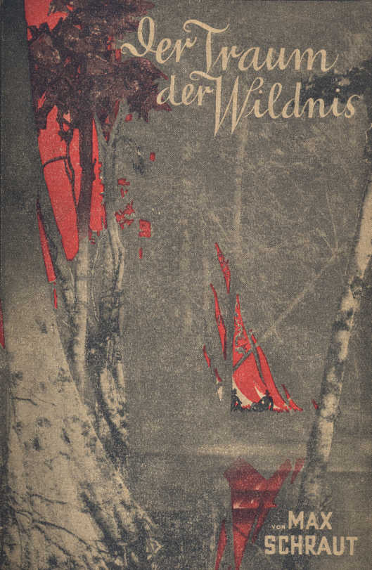

Hunderttausenden von Lesern unserer Harald Harst-Erzählungen
ist Max Schraut ein lieber Freund,
ein geschätzter Kamerad auf allen Lebenswegen geworden.
Die packende Art seiner Erzählung hält uns in
Bann, die knappe aber treffende Schilderung von Land
und Leuten zwingt uns zum Nachdenken und das lebenswahre
und lebenswarme Milieu zeugt von hoher sittlicher
Kultur.

In noch erheblich stärkerem Maße packt der beliebte
Autor seine Leser in seiner neuen Arbeit

Olaf K. Abelsen

Abseits vom Alltagswege

von Max Schraut

Wer hat nicht die Sehnsucht nach seltsamem Erleben
in sich, wer hat nicht den Drang zum Zug in die
Ferne. Tausende und Abertausende von Deutschen hat
dieser Drang aus dem ewigen Einerlei des Alltags in
die Ferne getrieben um selbst zu erleben, selbst zu kämpfen,
selbst zu streben.

Aber nicht allen ist dieses Geschick beschieden. Nur
zu viele sind an der Scholle gefesselt, gebannt in der
Heimat, sie können nur in der Phantasie die Welt durchmessen,
nur in der Phantasie von Erlebnis zu Erlebnis
eilen. Und für diese vielen sind diese Bücher geschrieben.

Mit glühender Phantasie schildert der Autor in
den Bändchen __»Abseits vom Alltagswege«__ das Leben
und Erleben des Ingenieurs Olaf K. Abelsen, den ein
widriges Geschick in das Zuchthaus brachte. Es gelingt
ihm‚ dieser ungastlichen Stätte zu entfliehen und nun beginnt
für ihn ein Leben, wie es die Phantasie eines
Jules Verne oder eines Dumas nicht besser schildern
kann. Es ist das Hohelied des Abenteurers, der die
Welt durchzieht, nicht im Luxuszug, nicht auf dem Salondampfer,
nein, auf den Pfaden Abseits des Alltags.
Und nur dort bietet das Leben noch Gefahren und Abenteuer,
nur dort findet sich wahres Heldentum und Ritterlichkeit,
Kraft zur Tat und Kraft zur Entbehrung.

Dringend empfehlen wir unseren Lesern, sich bei
ihrem Buchhändler die Bändchen »Abseits vom Alltagswege«
zu besorgen, sie werden nicht einen Band unbefriedigt
aus der Hand legen.

Preis pro Band 50 Pf.

Das umstehende Bild zeigt das <strong>verkleinerte</strong> Umschlagsbild zu Band 21.

