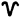
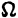
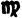
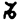
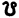
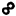

Sechste Vorlesung.
==================

Die jährliche Bewegung der Sonne, oder die Kreisbewegung der Erde.
-------------------------------------------------------------------

Innerhalb der unbeweglichen, nur durch die Achsendrehung der Erde sich
scheinbar um uns schwingenden Himmelskugel, durchwandert die Sonne in einem
Jahre ihre Bahn um die Erde. Wenn wir den Stand der Sonne zwischen den Sternen
mit dem Fernrohre verfolgen, so sehen wir sie nach Verlauf eines Tages etwa um
1° nach Osten vorgerückt; sie entfernt sich immer mehr von den Sternen, die sie
umgaben, bis diejenigen nach Verlauf von sechs Monaten um Mitternacht an unserm
Mittagskreise prangen, welche früher durch den Glanz der nahen Sonne verdunkelt
wurden. Von jetzt an nähert sie sich ihnen immer mehr von der westlichen Seite,
und nach neuen sechs Monaten hat die Sonne ihren Kreislauf vollendet, und
befindet sich wieder in ihrer früheren Lage. Auch mit dem unbewaffneten Auge
läßt sich ihre Bahn verfolgen. Die auf ihrem Wege befindlichen Sterne, die kurz
nach ihr untergingen, verlieren sich bald in ihrem Lichte, bis sie nach einigen
Tagen am östlichen Himmel, des Morgens vor Sonnenaufgang, wieder erscheinen,
und indem die alten Astronomen auf diese Weise die verschiedenen Orte der Sonne
zwischen den Sternen, und ihre Bewegung beobachteten, vermochten sie die Bahn
der Sonne zu bestimmen; freilich konnten sie mit ihren unvollkommenen
Instrumenten, [...] den Mangel eines besseren Zeitmaßes, als [...] Sanduhren
gewährten, nicht [...] die mit ihren Fernröhren [...] der Zeit, und be-[...]
Sternen ver-[...]

[Seite 86 fehlt teilweise]

Aequator unter einem Winkel von 23½° schneidet. In diesem Kreise bewegt sie
sich fast mit gleicher Geschwindigkeit von Westen nach Osten, theils in der
nördlichen, theils in der südlichen Halbkugel. Je mehr sie sich vom Aequator
entfernt, oder je größer ihre Abweichung wird, desto höher steigt sie über
unsren Horizont, und desto länger verweilt sie über ihm. Wenn wir bloß die
Aenderung ihrer Abweichung betrachten, so ist sie am raschesten, wenn die Sonne
aus dem Aequator tritt; die Geschwindigkeit nimmt aber ab, je mehr sie sich von
ihm entfernt, ihr Steigen wird geringer, jemehr sie sich ihrer größten
Abweichung nähert, und wenn sie diesen Punkt erreicht hat, scheint sie einige
Zeit zu ruhen. Von da wendet sie sich wieder nach Süden, anfangs langsam, dann
schneller, bis sie den Aequator, 6 Monate nachdem sie ihn verlassen hat, wieder
erreicht. Ihre jetzt sehr rasche Bewegung nimmt in der südlichen Halbkugel nach
demselben Gesetze, wie in der nördlichen, ab, wird bei der größten südlichen
Abweichung sehr langsam, und nach 6 Monaten ist die Sonne wieder im Aequator.
Indessen ist sie auch auf ihrer Bewegung von Westen nach Osten fortgerückt, und
hat ihre Bahn in der Ekliptik vollendet.

Folgende Tabelle enthält, nach *Bessel*, die Abweichung der Sonne zu
verschiedenen Zeiten des Jahres.

<table>
	<tr><td colspan="2">Nördlich.</td><td>Abwei- chung.</td><td colspan="2">Südlich.</td><td>Differenzen.</td></tr>
	<tr><td>21. März u.</td><td>23. Sept.</td><td>&nbsp;0°</td><td>23. Sept u.</td><td>21. März.</td><td></td></tr>
	<tr><td>23. "</td><td>21. "</td><td>&nbsp;1</td><td>26. "</td><td>18. "</td><td></td></tr>
	<tr><td>26. "</td><td>18. "</td><td>&nbsp;2</td><td>28. "</td><td>16. "</td><td></td></tr>
	<tr><td>28. "</td><td>16. "</td><td>&nbsp;3</td><td>&nbsp;1. Oktob.</td><td>13. "</td><td></td></tr>
	<tr><td>31. "</td><td>13. "</td><td>&nbsp;4</td><td>&nbsp;4. "</td><td>11. "</td><td>= 10 Tage.</td></tr>
	<tr><td colspan="6">&nbsp;</td></tr>
	<tr><td>&nbsp;3. April</td><td>10. "</td><td>&nbsp;5</td><td>&nbsp;6. "</td><td>&nbsp;8. "</td><td></td></tr>
	<tr><td>&nbsp;5. "</td><td>&nbsp;8. "</td><td>&nbsp;6</td><td>&nbsp;9. "</td><td>&nbsp;6. "</td><td></td></tr>
	<tr><td>&nbsp;8. "</td><td>&nbsp;5. "</td><td>&nbsp;7</td><td>11. "</td><td>&nbsp;3. "</td><td></td></tr>
	<tr><td>11. "</td><td>&nbsp;2. "</td><td>&nbsp;8</td><td>14. "</td><td>28. Febr.</td><td>= 10 bis 11 T.</td></tr>
	<tr><td colspan="6">&nbsp;</td></tr>
	<tr><td>13. "</td><td>31. August</td><td>&nbsp;9</td><td>17. "</td><td>26. "</td><td></td></tr>
	<tr><td>16. "</td><td>28. "</td><td>10</td><td>19. "</td><td>23. "</td><td></td></tr>
	<tr><td>19. "</td><td>25. "</td><td>11</td><td>22. "</td><td>20. "</td><td></td></tr>
	<tr><td>22. "</td><td>22. "</td><td>12</td><td>25. "</td><td>17. "</td><td>= 11 Tage</td></tr>
	<tr><td colspan="6">&nbsp;</td></tr>
	<tr><td>25. "</td><td>19. "</td><td>13</td><td>28. "</td><td>14. "</td><td></td></tr>
	<tr><td>28. "</td><td>16. "</td><td>14</td><td>31. "</td><td>11. "</td><td></td></tr>
	<tr><td>&nbsp;2. Mai</td><td>12. "</td><td>15</td><td>&nbsp;3. November</td><td>&nbsp;8. "</td><td></td></tr>
	<tr><td>&nbsp;5. "</td><td>&nbsp;9. "</td><td>16</td><td>&nbsp;6. "</td><td>&nbsp;5. "</td><td>= 12 bis 13 T.</td></tr>
	<tr><td colspan="6">&nbsp;</td></tr>
	<tr><td>&nbsp;8. "</td><td>&nbsp;6. "</td><td>17</td><td>10. "</td><td>&nbsp;2. "</td><td></td></tr>
	<tr><td>12. "</td><td>&nbsp;2. "</td><td>18</td><td>13. "</td><td>29. Januar</td><td></td></tr>
	<tr><td>16. "</td><td>29. Juli</td><td>19</td><td>18. "</td><td>25. "</td><td></td></tr>
	<tr><td>21. "</td><td>24. "</td><td>20</td><td>22. "</td><td>21. "</td><td>= 15 bis 16 T.</td></tr>
	<tr><td colspan="6">&nbsp;</td></tr>
	<tr><td>26. "</td><td>19. "</td><td>21</td><td>27. "</td><td>16. "</td><td></td></tr>
	<tr><td>&nbsp;1. Juni</td><td>13. "</td><td>22</td><td>&nbsp;3. "</td><td>10. "</td><td></td></tr>
	<tr><td>21. "</td><td>21. Juni</td><td>23½</td><td>22. "</td><td>22. Dec.</td><td>= 30 bis 33 T.</td></tr>
</table>

Am 21. März und 23. September ist die Sonne in den Nachtgleichen, am 21. Juni
und 22. Decemb. in den Sonnenwenden: von jenen zu diesen nimmt die Abweichung,
und also auch die Länge der Tage immer zu; aber die Differenzen sind sehr
ungleichförmig. Während nämlich die Sonne, um 4° an Abweichung zuzunehmen, in
der Nähe der Nachtgleichen nur 10 Tage bedarf, gebraucht sie in den folgenden
10 — 11, 11, 12 — 13, 15 — 16 Tage, und um die letzten 3½° zurückzulegen über
30 Tage, also 3½ mal so viel wie anfangs: die Zunahme an Höhe, obgleich sie bis
zu den Sonnenwenden fortdauert, nimmt also immer an Stärke ab, die
Veränderungen werden geringer, und die Höhe der Sonne ist alsdann am
leichtesten zu beobachten, aus ähnlichen Gründen, wie die Höhe der Sterne bei
der Kulmination.

Die Ekliptik wird durch die vier bemerkten Punkte in vier fast gleiche Theile
getheilt. Die beiden Punkte, in denen sie die größte Abweichung hat, heißen
*Sonnenwenden* oder *Solstitien* (Sonnenstillstände), und zwar der nördliche
die *Sommersonnenwende*, der südliche, die *Wintersonnenwende*. Die beiden
Punkte, in denen sie den Aequator schneidet, heißen die *Nachtgleichen* oder
*Aequinoktien*, und zwar derjenige, durch welchen sie sich von der südlichen
nach der nördlichen Halbkugel begibt, die *Frühlingsnachtgleiche*, der andre
die *Herbstnachtgleiche*. Man nennt diese vier Punkte auch Sommer- und Winter-,
Frühlings- und Herbstpunkt. Die Ursachen aller dieser Benennungen liegen theils
in den Eigenschaften und Wirkungen der Sonnenbahn, theils darin, daß jene
Punkte in der nördlichen Halbkugel, wo alle Beobachter lebten, den Anfang der
Jahreszeiten bezeichnen.

Der größte Kreis der Sphäre, welcher durch die Sonnenwenden und die beiden
Weltpole geht, heißt der *Kolur der Sonnenwenden*, und der, welcher durch die
Pole und die Nachtgleichen geht, der *Kolur der Nachtgleichen*.

Seit undenklichen Zeiten ist die Sonnenbahn, wegen ihres Verhältnisses zum
Monde in 12 gleiche Theile getheilt worden, wovon ein jeder, weil der ganze
Kreis 360 Grade umfaßt, 30° enthält. Folgendes sind ihre Namen mit den für sie
üblichen Zeichen:

<table>
  <tr><td> Widder,</td><td> Stier,</td><td> Zwillinge,</td></tr>
  <tr><td> Krebs,</td><td> Löwe,</td><td> Jungfrau,</td></tr>
  <tr><td> Wage,</td><td> Skorpion,</td><td> Schütz,</td></tr>
  <tr><td> Steinbock,</td><td> Wassermann,</td><td> Fische.</td></tr>
</table>

Für die des Lateins kundigen Zuhörer sind folgende alten Verse eine leichte
Gedächtnißhilfe für die 12 Zeichen der Ekliptik:

_Sunt Aries, Taurus, Gemini, Cancer, Leo, Virgo, Libraque, Scorpio, Arcitenens,
Caper, Amphora, Pisces._

Die bemerkenswerthesten Zeichen sind der Widder und die Wage, als Zeichen der
Frühlings- und Herbstnachtgleiche, weil die Sonne in diesen Punkten ihrer Bahn
ist, wenn sie in jene Zeichen tritt. Aehnliches findet bei dem Krebs und dem
Steinbock in Rücksicht der Sommer- und Wintersonnenwende statt. Man nennt daher
die ersten 3 Zeichen die Frühlingszeichen, die andren die Sommer- Herbst- und
Winterzeichen. Man nennt deshalb auch zwei, dem Aequator parallele Kreise,
welche durch die äußersten Punkte der Sonnenbahn gehen, die *Wendekreise des
Krebses* und des *Steinbockes*.

Dem Zusammenhange der 12 Zeichen mit den Sternbildern gleiches Namens werden
wir in der Folge aus einander setzen: hier genüge es zu bemerken, daß die
Benennungen oft Symbole von Gegenständen der Witterung und des Ackerbaues sind.

Wahrend die Sonne auf ihrer Bahn fortrückt, dreht sich die Erde um ihre Achse
und bietet ihr, wie den übrigen Sternen, nach und nach fast alle Theile ihrer
Oberfläche dar; aber der Tages- und der Nachtbogen der Sonne ist nicht, wie der
der übrigen Sterne, bloß ein Gegenstand der Neu- oder Wißbegierde: *ihre*
Gegenwart über unserm Horizont gibt uns den *Tag*, und ihre Abwesenheit die
*Nacht*. Sobald die Sonne, nachdem sie durch die Morgenröthe ihr Kommen
angekündigt hat, an der östlichen Seite des Himmels erscheint, bricht der
*Morgen* für uns an; sie erhebt sich an dem südlichen Theile unsres Himmels,
wandert mit den Sternen dem Westen zu, und erreicht des *Mittages*, im
Mittagskreise, der daher seinen Namen hat, ihre größte Höhe und den Mittelpunkt
ihres Tageskreises. Jetzt senkt sie sich immer mehr nach Westen hinab, bis sie
des *Abends* an der westlichen Seite des Horizonts verschwindet. Uns
unsichtbar, leuchtet sie andren Theilen der Erde, und wenn sie den Meridian zum
zweiten male durchschneidet, steht sie um *Mitternacht* am tiefsten.

Durch die Verbindung der eigenthümlichen Bewegung der Sonne mit der täglichen
entsteht die Veränderung der Länge der Tage und Nächte. Wenn die Sonne ihren
Lauf, wie die Sterne, in einem dem Aequator parallelen Kreise vollendete, so
würde während des ganzen Jahres kein Unterschied in der Dauer der Tage und
Nächte statt finden, und wenn sie im Aequator bliebe, so würden auf der ganzen
Erde, und durch das ganze Jahr Tag und Nacht stets einander gleich sein; doch
jetzt, da sie während eines halben Jahrs alle Parallelkreise zwischen 23½°
südlich und eben so weit nördlich durchschneidet, gehört sie bald zu den
Sternen der nördlichen, bald zu denen der südlichen Halbkugel.

Für die Bewohner des Erdäquators ist zu jeder Zeit Tag und Nacht einander
gleich; auf den Polen ist die Sonne nur so lange sichtbar als sie in derselben
Halbkugel, und unsichtbar, wann sie in der entgegengesetzten ist: dort ist also
6 Monate Tag und 6 Monate Nacht. In den übrigen Theilen der Erde dagegen findet
nur dann Gleichheit der Tage und Nächte statt, wenn die Sonne im Aequator ist,
weshalb auch die Schneidepunkte der Sonnenbahn und des Aequators
*Nachtgleichen* heißen; sobald sie aber in die nördliche Halbkugel tritt, wird
der Tagesbogen größer, und um so mehr, je nördlicher der Ort des Beobachters,
und je größer die Abweichung der Sonne ist, und an den nördlichsten Theilen der
Erde verschwindet der Nachtbogen ganz und die Sonne vollendet ihre ganze
tägliche Bahn über dem Horizonte. Dieser Theil wird größer, die Sonne steigt
höher über den Horizont der nördlichen Halbkugel, bis sie ihre größte
Entfernung vom Aequator in der Sommersonnenwende erreicht hat. Hier scheint sie
von ihrem Laufe zu ruhen; sie vollendet während einiger Tage ihre tägliche Bahn
im Wendekreise des Krebses, die Bewohner der nördlichen Halbkugel haben ihren
längsten Tag, und in dem Parallelkreise, der von dem Nordpol 23½° entfernt ist,
berührt die Sonne um Mitternacht den Horizont, und geht in dem ganzen Theil der
Erdoberfläche, der zwischen jenem Parallelkreise und dem Pole ist, nicht unter.
Man nennt diesen Kreis den *nördlichen Polarkreis*; er ist eben so weit vom Pol
entfernt, als die Wendekreise vom Aequator. Die Sonne kehrt nun durch dieselben
Stufen nach dem Aequator zurück; die Länge der Tage und die Höhe der Sonne
nehmen in demselben Verhältnisse ab, als sie früher zugenommen hatten; der
Theil der Erde, wo die Sonne nicht untergeht, wird kleiner; in der
Herbstnachtgleiche vollendet sie ihren täglichen Kreis wieder im Aequator, und
Tag und Nacht sind auf der ganzen Erde einander gleich. Nun schreitet sie nach
Süden, und spendet dort die Wärme und das Licht, die sie im vergangenen halben
Jahre der nördlichen Halbkugel gegeben; aber bei uns werden die Tage kürzer,
jene Gegend der Erde, wo die Sonne nicht unterging, entbehrt ihrer jetzt ganz,
und die südliche Polargegend erfreut sich beständigen Sonnenlichts. Die Sonne
erreicht den Wendekreis des Steinbocks: was die nördliche Halbkugel ein halbes
Jahr früher genoß, hat jetzt die südliche; sie feiert ihren längsten Tag.
Zwischen dem Südpol und dem 23½° davon entfernten Parallelkreise, dem
*südlichen Polarkreise*, geht die Sonne nicht unter; aber in der nördlichen
Halbkugel ist ein eben so großer Strich um den Pol in beständige Nacht gehüllt,
und der übrige Theil hat seinen kürzesten Tag; dieser wird jedoch mit jedem
Tage größer, indem sich die Sonne dem Aequator wieder nähert, und wenn sie ihn
und das Zeichen des Widders erreicht, ist das Gleichgewicht auf der ganzen Erde
hergestellt. Es ist merkwürdig, daß, so verschieden Tag und Nacht auf der
ganzen Erde vertheilt sind, nach Verlauf des Jahres kein Theil der Erde
vernachlässigt ist; überall war genau ein halbes Jahr Tag und ein halbes Jahr
Nacht.

Die Zeit, welche ein Stern gebraucht, um von Osten nach Westen den Himmel
scheinbar zu umkreisen, oder die Zeit zwischen zwei oberen Kulminationen, haben
wir *Sternentag* genannt. Die Sonne aber hat sich indessen etwa 1° nach Osten
entfernt, ist also um diesen Bogen noch vom Meridiane entfernt, wenn die Sterne
ihn schon erreicht haben; die Zeit zwischen zwei oberen Kulminationen der
Sonne, oder der *Sonnentag*, ist also größer als der Sternentag. Der
Unterschied zwischen beiden ist die Zeit, welche die Sonne gebraucht, um einen
Bogen zurückzulegen, der der Größe ihrer täglichen Fortrückung nach der
Richtung des Aequators auf der jährlichen Bahn gleichkommt. Dieser ist zwar von
verschiedener Größe, und die Sonnentage haben deshalb eine veränderliche Länge,
indeß beträgt sie, im Durchschnitt betrachtet, 24 Stunden, 3 Minuten, 56,55
Sekunden Sternenzeit, und ein Sternentag ist so viel als 23 Stunden, 56' 4"1
Sonnenzeit, wenn man den Sonnentag auf ähnliche Weise in Stunden, Minuten und
Sekunden theilt, wie den Sternentag. Die Zeit, welche die Sonne gebraucht, um
nach Vollendung ihrer jährlichen Bahn wieder zu derselben Lage gegen die Sterne
zurückzukehren, oder das *Sternenjahr* beträgt 365 Tage, 6 Stunden, 9' 14"946
Sonnenzeit oder 366 Tage, 6 Stunden, 9' 11"7 Sternenzeit. Sternen- und
Sonnenzeit können leicht aus einander berechnet werden.

Ein Stern, der im Anfange des Frühlings dicht bei der Sonne steht, wird im
Anfange des Sommers um einen Viertelkreis nach Westen entfernt sein, und also
den Morgen seinen oberen Durchgang durch den Meridian haben, im Anfange des
Herbstes den Abend, und erst, wenn das Jahr verflossen ist, von neuem neben der
Sonne stehn. Die Astronomen pflegen den Anfang des Tages von dem oberen
Durchgange durch den Meridian an zu rechnen, also bei der Sonne vom Mittage,
der Sternentag wird daher bald des Mittages, bald des Morgens, bald zu jeder
andren Tageszeit anfangen. Nun ist aber die Sonne unendlich wichtiger für uns,
als die Sterne, und nach ihr richten sich alle Geschäfte: man hat daher statt
des gleichförmigen, aber unbequemen Sternentages den *mittleren Sonnentag* als
Zeitmaß angenommen, alle Berechnungen der Himmelskörper auf ihn bezogen, und
die Sonne auf diese Weise zur Uhr des Universums gemacht.

Der *bürgerliche Tag* beginnt bei uns um Mitternacht, also im niedrigsten
Stande der Sonne; eine sehr passende Einrichtung, weil alsdann auch in den
Geschäften der Menschen eine Pause ist. Viele Völker, z. B. die Juden,
Chinesen, Italiener, fangen ihren Tag des Abends an, Ptolemäus des Morgens. Die
meisten europäischen Völker, und auch die Deutschen, zählen die 24 Stunden des
Tages immer nur von 1 — 12, so daß um Mitternacht und um Mittag 12 Uhr ist;
andre zählen von 1 — 24, wie die Italiener, und auch für die Astronomen ist
dieß bequemer; und wieder andre, z. B. manche orientalische Völker, theilen den
Tag in 12 Stunden und die Nacht ebenfalls; eine sehr unbequeme Eintheilung,
weil wegen der Veränderung der Dauer der Tage und Nächte die Stunden ungleich
werden.

Da der Mittag die Zeit des oberen Durchgangs durch den Meridian ist, so werden
die verschiedenen Meridiane der Erde zu verschiedenen Zeiten Mittag haben. Ein
15° westlich liegender Ort hat ihn eine Stunde später, ein östlich liegender
Ort früher, und der entgegengesetzte Ort der Erde hat Mitternacht, wenn wir
Mittag haben. Wenn sich Jemand von uns nach Westen hin entfernt, so wird er,
wenn er 15° vorgerückt ist, elf Uhr haben, wenn bei uns schon Mittag ist, also
eine Stunde verloren haben; ist er 90° weit gewandert, so hat er sechs Uhr
Morgens; wenn er 180° weit gekommen ist, Mitternacht, wenn wir Mittag haben,
also zwölf Stunden verloren, und endlich, wenn er diese Reise um die Erde
vollendet hat, 24 Stunden oder einen ganzen Tag verloren, und glaubt, es sei z.
B. der 4. Febr., wenn wir den 5ten haben. Der Reisende mißt nämlich seinen Tag
nach den Durchgängen durch *seinen* Meridian. Dieser rückt aber immer nach
Westen; die Sonne braucht mehr als einen Tag, um ihn einzuholen, und zwar immer
so viel, als der Weg beträgt, den er zwischen zwei Mittagen zurückgelegt hat.
Nach Vollendung der Reise beträgt der Unterschied einen ganzen Umlauf der Sonne
um die Erde, oder einen Tag. Das Entgegengesetzte findet statt, wenn man nach
Osten hin um die Erde wandert; man geht der Sonne entgegen, die Tage sind
kürzer, und wenn die Reise zu Ende ist, so hat man einen ganzen Tag gewonnen,
indem man in dem angegebenen Beispiele den 6ten Februar schreiben würde. Diese
Abweichung, die den ersten Weltumseglern so merkwürdig erschien, beruht also
auf sehr einfachen Ursachen. Uebrigens ist es völlig gleichgiltig, wie lange
Zeit der Reisende zu seiner Wanderung gebraucht, der Unterschied beträgt immer
einen Tag.

Wie nach dem Horizont und dem Aequator, so kann man auch die Lage der Sterne
nach der Ekliptik bestimmen, und aus mehreren Gründen ist dieses in vielen
Fällen angemessener. Es geschieht auf ähnliche Weise, wie dort. Die durch die
Pole der Ekliptik gehenden größten Kreise nennt man *Breitenkreise*, einen
Bogen desselben zwischen einem Stern und der Ekliptik die *Breite des Sterns*,
und die Entfernung des Punkts, wo der Breitenkreis die Ekliptik trifft, bis zur
Frühlingsnachtgleiche oder dem Widder, die *Länge*. Die Breite kann nördlich
und südlich sein, die Länge zählt man auf der Ekliptik von Westen nach Osten
nach der Ordnung der Zeichen. Man bedient sich zur Bestimmung der Länge statt
der Grade auch wol der Zeichen selbst; z. B. 6 Zeichen 20°, oder abgekürzt, 6Z.
20° oder 20°  (S. 90.) sind
gleichbedeutend mit 200° Länge. 0Z 0° ist der Anfangspunkt selbst, nämlich die
Frühlingsnachtgleiche. Ein nach Länge und Breite bestimmter Stern ist seiner
Lage nach völlig bekannt. Die Breite der Sonne ist stets = 0, da sie immer in
der Ekliptik bleibt.

Die meisten Himmelskörper bewegen sich auf der Himmelskugel von Westen nach
Osten, also nach der Ordnung der Zeichen; man nennt diese Bewegung
*rechtgängig*, *direkt*, z. B. die Sonne, der Mond; einige nach der
entgegengesetzten Richtung, so zuweilen die Planeten, *rückgängig*, *indirekt*.

Die Punkte, worin die Bahn eines Himmelskörpers die Ebenen der Ekliptik
schneidet, nennt man die *Knoten*, und zwar ist der *aufsteigende Knoten* () da, wo der Stern
sich nach Norden bewegt, und der *absteigende* (), wo er sich nach Süden begibt. Man bestimmt die
Lage der Bahn eines Himmelskörpers durch die Neigung derselben zur Ekliptik und
die Länge der Knoten.

Von zwei Sternen, die dieselbe Länge haben, sagt man, sie seien in
*Konjunktion* (); man bedient
sich dieses Ausdrucks gewöhnlich in Verbindung mit der Sonne, und da die
vornehmsten sich bewegenden Himmelskörper keine von der Ekliptik sehr
verschiedene Bahn haben, so werden sie oft, vom Glanze der Sonne überstralt,
dem bloßen Auge und auch wol für das Fernrohr unsichtbar. Ist neben der Länge
noch die Breite gleich, so wird das Gestirn uns entweder von der Sonne
verdeckt, oder es verdunkelt sie selbst. Hieher gehören nebst andren die unter
dem Namen der Sonnenfinsternisse so berühmten Erscheinungen. Ein Stern, der
sich an der entgegengesetzten Seite der Ekliptik befindet, dessen Länge also
180° von der der Sonne entfernt ist, und um Mitternacht kulminirt, ist in
*Opposition* () mit der Sonne. Ist
seine Breite überdieß = 0, oder befindet er sich in der Ekliptik, so ist die
Erde gerade zwischen ihm und der Sonne, und er kann, wenn er kein leuchtender
Körper ist, obgleich in der günstigsten Lage zu glänzen, verdunkelt werden. So
verhält es sich bei den Finsternissen des vollen Mondes. Die Mitte des Bogens
zwischen Konjunktion und Opposition, 90° oder 270° von der Sonne entfernt,
nennt man *Quadraturen*, und zwar diejenige, in welche der Stern nach der
Konjunktion kommt, die *erste*, und die auf die Opposition folgende die
*zweite* oder *letzte Quadratur*.

Sterne, die, nicht weit vom Tageskreise der Sonne entfernt, etwas später als
sie kulminiren, also auch später untergehn und des Abends erscheinen, nennt man
*Äbendsterne*; Sterne dagegen, die etwas früher aufgehn als sie, und des
Morgens erscheinen, *Morgensterne*. Fixsterne sowohl wie Planeten, können bald
Abend- bald Morgensterne sein, vorzüglich ist dieses aber bei denjenigen
Himmelskörpern merklich, welche sich von der Sonne nur auf eine gewisse Weite
entfernen, und nie in Opposition mit ihr, also fast immer entweder Abend- oder
Morgensterne sind, bei der Venus und dem Merkur.

Wenn wir die Bewegung der Sonne genauer untersuchen, so finden wir, was auch
Hipparch schon wußte, daß die Zwischenzeiten zwischen den Nachtgleichen und
Sonnenwenden einander nicht gleich sind, daß die Sonne mehrere Tage länger in
der südlichen, als in der nördlichen Halbkugel verweilt, daß überhaupt sowohl
ihre Entfernung als ihre GeschwindigKit veränderlich ist, daß jene zunimmt,
wenn diese abnimmt, und umgekehrt, kurz, daß die Bahn der Sonne eine Ellipse
ist, die Erde in einem Brennpunkt derselben sich befindet, und Geschwindigkeit
und Entfernung sich genau nach denselben Gesetzen richten, wie bei den
Planetenbahnen um die Sonne. Diese Beobachtungen müssen uns gegen die Bewegung
der Sonne Verdacht einflößen, besonders da wir schon bei der Achsendrehung die
Unzuverlässigkeit des äußern Scheins kennen gelernt haben. Um die Erscheinung
ganz unparteiisch beurtheilen zu können, wollen wir sie von einem andren
Standpunkte aus beobachten, etwa dem Jupiter. Ein Bewohner desselben sieht den
ganzen Himmel sich in etwa elf Stunden um ihn wälzen, wovon er indeß den wahren
Grund bald einsehn wird; aber in der unverrückbaren Sternenwelt, die ihn
umgibt, sieht er die Sonne in zwölf Jahren einmal und vier Monde in 2 — 17
Tagen sich um ihn schwingen. Um die Sonne bewegen sich die Planeten Merkur,
Venus, die Erde, Mars und die vier Mittelplaneten in einer geringeren
Entfernung von ihr als er, Saturn und Uranus und vielleicht noch andre uns
unbekannte Planeten in einer größeren. Er würde mit stärkerem Rechte als wir
auf einen Vorzug Anspruch machen können, da er alle übrigen Planeten
zusammengenommen an Größe übertrifft, auch würden seine vier Begleiter, die an
scheinbarer Größe die Sonne weit übertreffen, seinen Dünkel verzeihlicher
machen. Der Sonnenbewohner sieht dagegen alle Planeten, die kleinsten, wie die
größten, sich in Kreisen um ihn bewegen; nur er kann das, was er sieht, für
Wirklichkeit halten, da die Sonne 800 mal so groß ist, wie alle Planeten
zusammengenommen, und würde die Erde sich keines Vorzuges erfreuen können.

Und in der That lassen sich alle Erscheinungen eben so gut erklären, wenn wir
die Erde in Bewegung annehmen. Man denke sich eine gerade Linie, welche die
Mittelpunkte der Sonne und der Erde verbindet, — man nennt sie *Radius Vektor*
— so wird der Punkt, wo sie die Erdoberfläche trifft, sich im Mittelpunkte der
erleuchteten Halbkugel befinden und im Zenith die Sonne haben; alle durch die
veränderte Lage der Sonne hervorgebrachten Erscheinungen zeigen sich uns durch
Veränderung der Lage und Größe dieser Linie, sie mögen von einer Bewegung der
Erde oder der Sonne herrühren. Durch die tägliche Bewegung beschreibt jener
Punkt fast einen Parallelkreis um die Erde; wir wollen jedoch von der
Achsendrehung absehn, und bloß die jährliche Bewegung betrachten. Denkt man
sich den Radius Vektor der Erde nach beiden Seiten verlängert und die Sonne im
Zeichen des Widders, so werden wir, von der Sonne aus gesehn, in der Wage zu
sein scheinen; tritt die Sonne in den Stier, so werden wir in dem Skorpion
gesehn werden; die Lage des Radius Vektor bleibt völlig dieselbe, ob die Sonne
von dem Widder durch den Stier, die Zwillinge und so fort, oder die Erde von
der Wage durch den Skorpion, den Schütz u. s. w. die Ekliptik durchwandere. In
beiden Fällen ist die Richtung der Bewegung dieselbe; nur sind wir immer an dem
Orte des Himmels, der demjenigen, worin die Sonne uns erscheint,
entgegengesetzt ist. Denkt man sich ferner durch die Sonne, die wir jetzt als
Mittelpunkt der Himmelskugel ansehen wollen, einen dem Erdäquator parallelen
Kreis, so wird dieser die Erdbahn in zwei Punkten schneiden; sobald die Erde in
einem dieser Punkte ist, so ist der Radius Vektor im Aequator, nämlich in den
Nachtgleichen, je mehr sich aber die Erde davon entfernt und in dem nördlichen
Theile der Ekliptik vorrückt, desto südlicher wird der Punkt der Erde, den der
Radius Vektor trifft, und in dem nördlichsten Stande der Erde, in der
Wintersonnenwende, erscheint der Radius Vektor und die Sonne am südlichsten;
eine dieser entgegengesetzte Lage findet in der Sommersonnenwende statt, wo die
Erde am südlichsten ist und ihre nördliche Halbkugel der Sonne zuwendet. Volle
Bestätigung findet aber die Ansicht von der Bewegung der Erde in der
Uebereinstimmung mit den bei den Planeten gefundenen Gesetzen. Wendet man die
Keplerschen Gesetze auf die Erde an, so könnte man fast ohne Beobachtungen die
vorzüglichsten Erscheinungen der Sonne voraus bestimmen. Auch werden wir in der
scheinbaren Bewegung der Sterne, in der Aberration, einen direkten Beweis der
Erdbewegung kennen lernen.

Der einzige Einwurf, den man dieser Ansicht machen konnte, war, daß trotz der
Grundlinie von 41 Mill. Meilen, kein Fixstern eine Veränderung in seiner Lage
oder eine Parallaxe zeigt (S. 53.). Indeß läßt er sich leicht durch die
ungeheure Entfernung der Fixsterne beseitigen; bei einer Entfernung von 4 Bill.
Meilen ist sogar die Parallaxe der Erdbahn unmerklich, und die Entfernung
selbst des nächsten Fixsterns ist gewiß nicht geringer, da unser System sich
wahrscheinlich über 10,000 Mill. Meilen weit von der Sonne aus erstreckt und,
um selbstständig bleiben zu können, eine große Entfernung der Fixsterne
verlangt. Tycho's Einwurf, von der Verschwendung des Raums zwischen den
Fixsternen hergenommen, ist ohne Bedeutung. (S. 66.)

Lange dauerte es, ehe der Mensch sich diesen Gedanken befreunden und von der
erhabenen Rolle, die er im Mittelpunkte des Weltalls einnahm, herabsteigen
mochte, um zwischen den Planeten eines der Millionen Sonnensysteme seinen
bescheidenen Platz einzunehmen; aber wenn auch der Dünkel der Menschen dadurch
litt, daß er den thörichten Wahn aufgeben mußte, als wären alle Wesen
seinetwillen erschaffen, so hat sich dafür sein Gesichtskreis vergrößert, seine
Begriffe erweitert, er verläßt sich weniger auf die Eindrücke der Sinne und die
dunklen Gefühle, er lernt den menschlichen Verstand, der sich vorzüglich in der
Astronomie auf's glänzendste offenbart, als das köstlichste Geschenk des Ewigen
kennen, und wenn er nun, von Bewunderung und Dankbarkeit hingerissen, den Geber
alles Guten verehrt, so zeigt er sich der Menschheit werther, als jene
Mystiker, die, sich alles Vertrauens zu sich selbst, aller Kraft entäußernd,
sich zu gedanken- und willenlosen Geschöpfen herabwürdigen.

