<@pagebreak 161/>
Neunte Vorlesung.
=================

Die Bewegungen der Planeten.
----------------------------

Wie bei der Erde haben wir auch bei den Planeten ihre Stellung zu den übrigen
Himmelskörpern, oder ihre Bewegung, und ihre individuellen Eigenschaften, oder
ihre Achsendrehung, Größe, Beschaffenheit der Oberfläche u. drgl., zu
berücksichtigen. Wir werden mit jenen beginnen, weil sie zuerst bekannt waren,
und man nur nach einer genauen Kenntniß derselben die übrigen Eigenschaften
entdecken konnte.

Die Bewegungen der Planeten scheinen zwar von unsrem Standpunkte aus
beobachtet, sehr zusammengesetzt zu sein, indeß ist dieses nur eine Folge der
Bewegungen der Erde. Wie sie sich von der Sonne aus — heliocentrisch —
darstellen, werden folgende Tabellen erläutern.

<table>
  <caption>Tab. 1. Entfernungen der Planeten von der Sonne, in deutschen Meilen, 15 auf einen Grad.</caption>
  <tr><th></th><th></th><th>kleinste</th><th>größte</th><th>mittlere</th></tr>
  <tr><td>Merkur </td><td>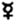  </td><td>  7,412,613</td><td>  9,751,675</td><td>  8,082,144</td></tr>
  <tr><td>Venus  </td><td>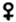    </td><td> 14,998,639</td><td> 15,205,897</td><td> 15,102,268</td></tr>
  <tr><td>Erde   </td><td>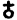      </td><td> 20,528,093</td><td> 21,229,397</td><td> 20,878,745</td></tr>
  <tr><td>Mars   </td><td>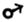      </td><td> 28,847,290</td><td> 34,778,294</td><td> 31,812,792</td></tr>
  <tr><td>Vesta  </td><td>    </td><td> 44,932,670</td><td> 53,705,430</td><td> 49,319,050</td></tr>
</table>

<@pagebreak/>

<table>
  <tr><th></th><th></th><th>kleinste</th><th>größte</th><th>mittlere</th></tr>
  <tr><td>Juno   </td><td>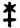      </td><td> 41,572,237</td><td> 69,635,763</td><td> 55,754,000</td></tr>
  <tr><td>Ceres  </td><td>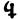    </td><td> 53,235,198</td><td> 62,318,002</td><td> 57,776,600</td></tr>
  <tr><td>Pallas </td><td>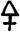  </td><td> 43,652,217</td><td> 71,943,443</td><td> 57,797,830</td></tr>
  <tr><td>Jupiter</td><td>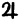</td><td>103,361,858</td><td>113,825,604</td><td>108,593,731</td></tr>
  <tr><td>Saturn </td><td>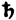  </td><td>187,952,378</td><td>210,322,822</td><td>199,137,600</td></tr>
  <tr><td>Uranus </td><td>  </td><td>381,828,330</td><td>419,212,930</td><td>400,520,630</td></tr>
</table>

<table>
  <caption>Tab. 2. Mittlere Entfernung der Planeten von der Sonne, die mittlere
Entfernung der Erde = 1 gesetzt, die Excentricität und das Verhältniß der
kleinsten zur größten Entfernung.</caption>
  <tr><th></th><th>Entfernung.</th><th>Excentricität.</th><th>Verhältn.</th></tr>
  <tr><td>Merkur </td><td> 0,387099</td><td>0,2056212</td><td> 2 :  3</td></tr>
  <tr><td>Venus  </td><td> 0,723332</td><td>0,0068618</td><td>75 : 76</td></tr>
  <tr><td>Erde   </td><td> 1,000000</td><td>0,0167947</td><td>29 : 30</td></tr>
  <tr><td>Mars   </td><td> 1,523692</td><td>0,0932173</td><td> 4 :  5</td></tr>
  <tr><td>Vesta  </td><td> 2,363198</td><td>0,1838258</td><td> 5 :  6</td></tr>
  <tr><td>Juno   </td><td> 2,670369</td><td>0,2543634</td><td> 4 :  7</td></tr>
  <tr><td>Ceres  </td><td> 2,767245</td><td>0,0785028</td><td> 6 :  7</td></tr>
  <tr><td>Pallas </td><td> 2,768261</td><td>0,2447424</td><td>11 : 18</td></tr>
  <tr><td>Jupiter</td><td> 5,201161</td><td>0,0481784</td><td>10 : 11</td></tr>
  <tr><td>Saturn </td><td> 9,537813</td><td>0,0561683</td><td>19 : 21</td></tr>
  <tr><td>Uranus </td><td>19,183177</td><td>0,0466703</td><td>10 : 11</td></tr>
</table>

<table>
  <caption>Tab. 3. Siderische Umlaufszeit, die Anzahl der in einer Sekunde
zurückgelegten deutschen Meilen, der in einem Monat durchlaufenen Bogen der
Planetenbahn und die größte Mittelpunktsgleichung.</caption>
  <tr><th></th><th>Umlaufszeit.</th><th>Geschw. in 1"</th><th>Bog. ​in 1M.</th><th>Mittelp.Gl.</th></tr>
  <tr><td>  </td><td>   87 T. 969258</td><td>6,53 M.</td><td>124°5  </td><td>23°40'45"0</td></tr>
  <tr><td>    </td><td>  224 "  700824</td><td>4,85 " </td><td> 48,7  </td><td> 4 47 10,7</td></tr>
  <tr><td>      </td><td>  365 "  256383</td><td>4,12 " </td><td> 30,0  </td><td> 1 55 28,5</td></tr>
  <tr><td>      </td><td>  686 "  979619</td><td>3,29 " </td><td> 15,87 </td><td>10 41 33,4</td></tr>
</table>

<@pagebreak/>

<table>
  <tr><th></th><th>Umlaufszeit.</th><th>Geschw. in 1"</th><th>Bog. ​in 1M.</th><th>Mittelp.Gl.</th></tr>
  <tr><td>    </td><td> 1327 "  598293</td><td>2,73 " </td><td>  8,25 </td><td>10 10 57,8</td></tr>
  <tr><td>      </td><td> 1593 "  841740</td><td>2,56 " </td><td>  6,88 </td><td>29 29 59,0</td></tr>
  <tr><td>    </td><td> 1681 "  400908</td><td>2,52 " </td><td>  6,53 </td><td> 9  0  7,6</td></tr>
  <tr><td>  </td><td> 1682 "  545086</td><td>2,52 " </td><td>  6,53 </td><td>28 13 58,4</td></tr>
  <tr><td></td><td> 4332 "  606308</td><td>1,78 " </td><td>  2,53 </td><td> 5 31 16,0</td></tr>
  <tr><td>  </td><td>10758 "  969840</td><td>1,32 " </td><td>  1,02 </td><td> 6 26 12,1</td></tr>
  <tr><td>  </td><td>30688 "  713687</td><td>0,93 " </td><td>  0,357</td><td> 5 21  9,7</td></tr>
</table>

<table>
  <caption>Tab. 4. Lage der Planetenellipsen.</caption>
  <tr><th>Neigung zur Ekliptik.</th><th>Länge des aufft. Knotens.</th><th>Länge
des Apheliums.</th><th>Neigung zum Sonnenäquat.</th></tr>
  <tr><td>  </td><td> 7° 0' 0" </td><td> 46° 4' 1"</td><td>254°30'14"</td><td> 2°54' 4"</td></tr>
  <tr><td>    </td><td> 3 23 28,5</td><td> 74 57 18 </td><td>308 44 18 </td><td> 4  9 12</td></tr>
  <tr><td>      </td><td> 0  0  0  </td><td>  0  0  0 </td><td>279 39 22 </td><td> 7 30  0</td></tr>
  <tr><td>      </td><td> 1 51  5  </td><td> 48  3 48 </td><td>152 33 49 </td><td> 5 49 55</td></tr>
  <tr><td>    </td><td> 7  7 52  </td><td>103 10 12 </td><td>270 19  0 </td><td> 4 27 31</td></tr>
  <tr><td>      </td><td>13  4 27  </td><td>171  9 50 </td><td> 33 16  0 </td><td>16 27 48</td></tr>
  <tr><td>    </td><td>34 37 28  </td><td> 80 56 55 </td><td>326 44 12 </td><td> 3 43 28</td></tr>
  <tr><td>  </td><td>10 37 30,4</td><td>172 33 54 </td><td>301 22 17 </td><td>37  8 12</td></tr>
  <tr><td></td><td> 1 18 51,5</td><td> 98 30  4 </td><td>191 17 48 </td><td> 6 24 16</td></tr>
  <tr><td>  </td><td> 2 29 38  </td><td>112  1 55 </td><td>269 15 11 </td><td> 5 57 28</td></tr>
  <tr><td>  </td><td> 0 46 26  </td><td> 72 53 35 </td><td>347 29 37 </td><td> 6 44  5</td></tr>
</table>

Die *erste* Tabelle enthält die auf die Entfernungen sich beziehenden Werthe,
so daß der mittlere Werth gleich weit von dem größten und dem kleinsten ist (S.
131). Die Zunahme in der Geschwindigkeit ist sehr rasch, da der folgende Planet
immer fast doppelt so weit entfernt ist (S. 64.). Nur die vier kleinen Planeten
machen eine Ausnahme, indem ihre mittleren Entfernungen fast einander gleich
sind, ihre Bahnen aber sich so oft durchkreuzen, daß diese Planeten im Laufe
der Zeit an einander stoßen können, und es vielleicht auch müssen, so daß, wenn
sie von
<@pagebreak/>
vernünftigen Wesen bewohnt sind, diese das Jahr und den Tag ihres
Unterganges voraussehn können. Betrachtet man dagegen diese vier Planeten als
*einen*, so würde dieser sehr gut in die Reihe der übrigen passen.

In der *zweiten* Tabelle ist die Excentricität von bedeutender Wichtigkeit. Sie
ist das Verhältniß der größten oder kleinsten Entfernung zur mittleren. Bei der
Venus ist sie am kleinsten, indem ihre Bahn dem Kreise am nächsten kommt,
wogegen die Bahnen der Juno und Pallas am meisten in die Länge gezogen, am
excentrischsten sind. Man kann alle Planeten nach der Excentricität ihrer
Bahnen in folgende vier Gruppen theilen. Es sind von den excentrischsten
Planeten angefangen: , , , , , , , , , , . Die Bahn unsrer Erde ist
daher nächst der der Venus die kreisförmigste. Die dritte Rubrik gibt das
Verhältniß der kleinsten zur größten Entfernung in ganzen Zahlen an.

Dem zweiten und dritten Keplerschen Gesetze (S. 58.) gehorchen die Zahlen der
*dritten* Tabelle. Die erste Kolumne dem Gesetze, daß die Quadrate der
Umlaufszeiten sich wie die Würfel der mittleren Entfernungen verhalten.
Berechnet man den Umfang der ganzen von den Planeten durchlaufenen Ellipsen in
deutschen Meilen, und dividirt darein mit den in Sekunden verwandelten Zahlen
der ersten Kolumne, so erhält man die Zahlen der zweiten. Die dritte drückt die
Bogen aus, die von den Planeten heliocentrisch durchlaufen werden; man findet
die Zahlen sehr leicht durch das Verhältniß: so wie die Umlaufszeit sich zum
zwölften Theil des siderischen Jahres verhält, so verhalten sich 360 Grade zu
dem in einem Monat durchlaufenen heliocentrischen Bogen. Z. B. beim Merkur
<@pagebreak/>
(88 : 365¼) / 12 = 360° : — 124° 8. Er nimmt in dem selben Verhältnisse ab, wie die
Umlaufszeit zunimmt. Bei der Erde beträgt er gerade 30° oder *ein* Zeichen,
oder täglich etwa 1°; bei dem Merkur sind es täglich über 4°, bei dem Uranus
fast 43 Sekunden, ein noch immer sehr merklicher Fortschritt, der seine
Entdeckung und die Kenntniß seiner Bewegungen beschleunigt hat. Die letzte
Rubrik endlich enthält den größten Bogen, um welchen ein sich gleichförmig im
Kreise bewegender Planet von dem wahren Orte desselben abstehn würde. Er wird
nach dem zweiten Keplerschen Gesetze berechnet.

Alle diese Angaben beschränken sich bloß auf die Beschaffenheit der einzelnen
Planetenellipsen; die *vierte* Tabelle dagegen bestimmt die Lage der
Planetenbahnen gegen einander. Es ist natürlich, daß man dabei größtentheils
von der Erdbahn ausgegangen ist. Durch die Neigung der Bahnen zu ihr, durch die
Lage des Punktes, wo der Planet sich aus der südlichen nach der nördlichen
Seite der Ekliptik begibt — des aufsteigenden Knoten, 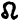 (S. 97) — und die Länge des Apheliums
werden alle hierauf sich beziehenden Fragen beantwortet. Die Neigung steigt
nach folgender Ordnung: , , , , , , , , , .

Die vierte Rubrik verdient hier einen Platz, weil die Lage der Planetenbahnen
zu einer festen Ebene auf der Sonne von größerer Wichtigkeit ist, als die Lage
zu einem Planeten, dessen einziger Vorzug darin besteht, daß wir darauf wohnen.
Von dem Sonnenäquator werden wir in der Folge reden. In der Neigung zu ihm ist
die Lage der Mittelplaneten weniger abweichend. Die Reihenfolge ist: , , ,
<@pagebreak/>
, , , , , , , . Die Erde gehört also zu den am meisten
geneigten Planeten. Uebrigens findet in der Lage des Sonnenäquators eine
Ungewißheit von mehreren Minuten statt.

Von den in diesen Tabellen enthaltenen Größen sind die mittleren Entfernungen
und Umlaufszeiten keinen oder fast keinen Veränderungen unterworfen; im übrigen
aber erleiden die Planeten ähnliche Aenderungen wie die Erde. Die Länge der
Aphelien und Knoten ändert sich beständig, theils durch eine fortschreitende
Säkularbewegung, theils durch ein Hin- und Herschwanken um einen mittleren
Werth. Indeß muß man hiervon eine scheinbare Aenderung in der Länge der Knoten
und Aphelien ausnehmen, welche durch das Fortrücken der Nachtgleichen auf der
Erde verursacht wird. Die Zeit, bis ein Planet wieder auf denselben Längegrad
kommt — der *tropische* oder *periodische* Umlauf — ist daher verschieden von
der heliocentrischen Rückkehr zu denselben Sternen, dem *siderischen* Umlaufe,
der länger dauert als jener.

Eben so verhält es sich mit den Veränderungen in der Neigung der Ebenen der
Planetenbahnen auf unsre Ekliptik; sie rühren theils von einer Aenderung in der
Lage der Ekliptik, theils in der der Planetenbahnen her. Indeß sind diese
Untersuchungen zu verwickelt für unsren Zweck, und wir gehn deshalb zu den
*geocentrischen* Bewegungen der Planeten über.

Diese sind weit weniger einfach, als die heliocentrischen. Selbst wenn wir die
wirklichen Bewegungen der Planeten aus einem unbeweglichen Standpunkte
betrachteten, würden sie uns schon ziemlich unregelmäßig erscheinen, aber indem
wir durch eine Täuschung der Sinne die Bewegung der Erde
<@pagebreak/>
auf die Planeten
übertragen, bringen wir den unregelmäßigen Wechsel von direkter und indirekter
(S. 97.), rascher und langsamer Bewegung hervor.

Die Planeten zerfallen geocentrisch in zwei an Ausdehnung und Eigenschaften
sehr ungleiche Abtheilungen, nämlich die Planeten, denen die Sonne näher ist,
als die Erde, oder die *unteren* Planeten, und diejenigen von denen sie weiter
entfernt ist, oder die *oberen* Planeten. Zu jenen gehören bloß Venus und
Merkur, deren Erscheinungen wir jetzt genauer beleuchten wollen.

_S_ (Fig. 12) sei die Sonne, um welche der Planet in der Richtung _ABCD_ seine
Bahn durchläuft, _E_, die Erde; die Bahn wollen wir vorläufig kreisförmig und
in der Ebene der Ekliptik annehmen, so daß die Erde in der Ebene der
Planetenbahn ist, so wird jede Lage des Planeten zur Erde und Sonne durch
irgend einen Punkt des Kreises _ABCD_ bezeichnet werden können. Am
entferntesten ist der Planet von uns, wenn er sich in _A_ — der *oberen
Konjunktion* — und am nächsten, wenn er in _C_ — der *unteren Konjunktion* —
befindet, wo er um den ganzen Durchmesser seiner Bahn der Erde näher ist; in
beiden Fällen aber werden wir ihn fast nie sehen können, weil er von den
Stralen der Sonne verdunkelt wird. Seine Entfernung von der Sonne bleibt zwar
immer gleich groß, aber der Winkel, unter welchem sich uns die Linie von der
Sonne zum Planeten — der *Radius Vektor* — darstellt, d. h. die scheinbare
Entfernung des Planeten von der Sonne oder seine *Elongation*, ist sehr
veränderlich. In den Konjunktionen scheinen der Planet und die Sonne fast auf
*einer* geraden Linie zu sein, aber sobald der Planet, nachdem er uns einige
Zeit nach seinern
<@pagebreak/>
oberen Konjunktion _A_ unsichtbar gewesen war, in der
Abenddämmerung wieder sichtbar wird, entfernt er sich immer mehr nach Osten,
anfangs rasch, nachher langsamer, bis er in _B_, wo seine Bahn durch eine von
der Erde aus nach ihr gezogenen Linie berührt wird, seine größte Entfernung von
der Sonne erreicht hat. Hier scheint er einen Augenblick zu ruhen, weil die
Richtung seiner Bahn in der Linie _BE_ selbst ist; er wendet sich aber bald
nach Westen, seine Bewegung wird also indirekt, er nähert sich wieder der
Sonne, bis er sich in die Stralen derselben taucht, wenn er in der Nähe von
_C_, der unteren Konjunktion, angelangt ist. Nach einiger Zeit wird er in der
Morgendämmerung wieder sichtbar, er setzt auf der westlichen Seite der Sonne
seine Bewegung fort, die wegen ihrer Richtung und der Nähe des Planeten anfangs
sehr rasch ist, aber abnimmt, bis er in _D_ auf der Westseite seine größte
Elongation erreicht hat. Seine Bewegung, von der er in _D_ einen Augenblick zu
ruhen schien, wird wieder rechtgängig und schneller, bis er sich in der Nähe
von _A_, der obern Konjunktion, des Morgens in die Sonnenstralen taucht. Die
obere Konjunktion ist also der Punkt der raschesten direkten Bewegung, die
untre Konjunktion die rascheste indirekte; da wo beide Bewegungen an einander
grenzen, in _B_ und _D_, in der Nahe der Quadraturen (S. 98.), scheint der
Planet zu ruhen.

Mit der Veränderung der Entfernung des Planeten von der Erde wechselt auch sein
scheinbarer Durchmesser. Dieser ist in _C_ viel bedeutender als in _A_, ja bei
der Venus sieben mal so groß. Seine mittlere Entfernung ist _(EC + EA) / 2 =
ES_, also für alle
<@pagebreak/>
untern Planeten so groß wie die Entfernung der Sonne von
uns: diese Größe hat daher keinen Werth für die Bestimmung der Planetenbahnen.

Als dunkle Körper empfangen die Planeten ihr Licht von der Sonne, diese aber
erleuchtet, trotz ihres großen Umfangs, nur wenig mehr als eine Halbkugel. Von
der Erde aus sieht man ebenfalls nur eine Halbkugel, oder nicht viel weniger,
uns ist also nur *der* Theil des Planeten sichtbar, der sowohl uns als der
Sonne zugekehrt ist. Der Radius Vektor von der Sonne nach dem Planeten steht
auf der Mitte von dessen erleuchteter Hälfte, die Gesichtslinie von der Erde
dahin auf der Mitte der *uns* zugekehrten Hälfte; je kleiner der Winkel ist,
den beide Linien mit einander machen, desto mehr fallen beide Hälften zusammen,
und desto größer ist der uns sichtbare Theil des Planeten. In der oberen
Konjunktion, wo der Winkel beider Linien = 0 ist, wäre uns daher die ganze
Scheibe sichtbar, wie beim Vollmonde, wenn sie uns nicht durch den Sonnenglanz
verdunkelt würde; jemehr der Planet von _A_ entfernt ist, desto weiter stehn
beide Linien auseinander, bis sie in _B_ und _D_ einen rechten Winkel mit
einander machen. Hier ist daher gerade die Hälfte der Planetenscheibe
erleuchtet, wie im Halbmonde. In dem Bogen _BCD_ ist der uns erleuchtete Theil
sichelförmig, und um so kleiner, je näher er der unteren Konjunktion ist, wo
der Radius Vektor und die Gesichtslinie 180° mit einander machen und uns, wie
beim Neumonde, kein Theil der erleuchteten Scheibe zugekehrt ist. Diese
*Lichterscheinungen* oder *Phasen* sind auf der östlichen wie auf der
westlichen Seite der Sonne, der immer die erhabenste Seite der Planetensichel
zugekehrt ist. Indeß ist diese wegen der Irradiation (S. 128), nur durch
Fernröhre deutlich zu erkennen;
<@pagebreak/>
dem bloßen Auge erscheinen die Planeten fast
immer kreisförmig.

Um die Größe des erleuchteten Theils auszudrücken, theilt man den Durchmesser
des Planeten in 12 Theile oder *Zolle*, und sagt nun der Stern sei 1 Z, 2 Z, 3
Z etc., erleuchtet. Dieses bezieht sich nur auf das Verhältnis des erleuchteten
und dunklen Theils der uns zugekehrten Scheibe, denn in _A_ ist diese wohl 5O
mal kleiner als in _C_, wo sie am nächsten ist. In der Nähe der oberen
Konjunktion ist sie hell aber klein; in der Nähe der untern dunkler, aber groß;
in den größten Elongationen _B_, _D_ dagegen sowohl an Größe als an Beleuchtung
die Mitte haltend, aber eben darum an Glanz beinahe am stärksten. Hierzu trägt
noch der Umstand bei, daß in der Nähe von _A_ und _C_ die scheinbar nahe Sonne
den Planeten durch ihren Glanz verdunkelt, welches in den größten Elongationen
am wenigsten statt findet.

Bisher haben wir bloß auf die Kreisbewegung des Planeten Rücksicht genommen.
Aber auch die Erde bewegt sich, und unsrer Gewohnheit gemäß tragen wir ihre
Bewegung in entgegengesetzter Richtung auf die Sonne und die Planeten über. Die
Sonne ist immer rechtgängig, sie bewegt sich immer nach Osten, und der Planet,
in welcher Lage er sich befinde, bewegt sich nach derselben Richtung. In _A_
wird dadurch seine Geschwindigkeit vermehrt und in _B_, wo er durch die
Richtung seiner eigenen Bewegung einen Augenblick zu ruhen scheint, setzt er
seinen direkten Lauf noch fort, bis späterhin, nach einem Ruhepunkte, die
indirekte Bewegung eintritt und über _C_ fortdauert. Ehe der Planet _D_
erreicht, ist die rechtgängige Bewegung wieder eingetreten, so daß sie bei
beiden Elongationen und der oberen Konjunktion statt findet. Nur in der unteren
Konjunktion bleibt die
<@pagebreak/>
rückgängige Bewegung, weil der nähere und raschere
Planet der Erde voreilt und sich daher in der Richtung _BCD_, d. h. nach Westen
zu bewegen scheint.

So lange der Planet sich auf der Westseite der Sonne in dem Halbkreise _ABC_
befindet, erscheint er des Morgens und ist *Morgenstern* (S. 98.); im
Halbkreise _ADC_ ist er des Abends sichtbar und heißt *Abendstern*. Die Grenzen
beider Zustände sind die Konjunktionen.

Wenn die Erde genau in der Ebene der Planetenbahnen wäre, so würde in der
oberen Konjunktion der Planet jedesmal durch die Sonne, und in der unteren
diese durch jenen bedeckt werden. Jenes ist von keiner Wichtigkeit, weil der
Stern alsdann ohnedieß unsichtbar ist; desto merkwürdiger sind aber die
letzteren Erscheinungen durch ihre Seltenheit und ihre Wichtigkeit für die
Astronomie. Sie bringen keine Verfinsterung der Sonne hervor — denn der
Schattenkegel, den die große Sonne hinter den viel kleineren Planeten bildet,
erreicht im ganzen Sonnensystem nie den entfernteren Planeten — : sondern Venus
oder Merkur ziehen als kleiner runder Fleck durch die Sonnenscheibe, und zwar
von Osten nach Westen, weil diese Erscheinungen nur in den unteren
Konjunktionen eintreten können. Man nennt sie die *Durchgänge* der Venus oder
des Merkur vor der Sonne, oder die *Bedeckungen* der Sonne durch einen der
unteren Planeten. Sie sind den Alten wegen ihrer geringen Größe und Seltenheit
unbekannt geblieben, bis Kepler sie aus seinen Tafeln voraus berechnete.

Indeß sind die Umstände nur selten diesen Erscheinungen günstig, indem nicht
nur die Länge, sondern auch die Breite der Sonne und des Planeten
<@pagebreak/>
fast ganz
dieselbe sein müssen, welches wegen der Neigung der Sonnen- und Planetenbahnen
nur in einer sehr geringen Anzahl von Konjunktionen der Fall ist. Auch die
übrigen Erscheinungen treten wegen der Neigung und der Excentricität der Bahnen
weit minder regelmäßig ein, als wir es bisher angenommen haben. Die Größe der
Bogen, in welchen sich die Planeten rechtgängig und rückgängig bewegen, sich
der Sonne nähern und von ihr entfernen, hängen daher von den Elementen der
Bahnen der Erde und der Planeten ab.

*Merkur*, derjenige der beiden unteren Planeten, welcher der Sonne am nächsten
ist, wegen seiner geringen Größe und der Nähe zur Sonne erst lange nach der
oberen Konjuktion zu erkennen, entfernt sich von der Sonne bis auf einen
scheinbaren Abstand von 16° 12' oder 28° 14' — einen so bedeutenden Unterschied
können die Unregelmäßigkeiten der Bahnen hervorbringen, — im Durchschnitt bis
auf 22° 30'. Weil die Sonne sich jetzt rascher als Merkur bewegt, so nähern
sich beide wieder, obgleich sich dieser noch eine Zeitlang nach Osten
fortbewegt; bei 18° Abstand von der Sonne geht ihr Merkur nach Westen entgegen,
taucht sich des Abends bei _C_ in ihre Stralen, und setzt dann seinen Weg auf
der Westseite der Sonne fort, bis er, wenn er wieder etwa 18° von der Sonne
entfernt ist, rechtgängig wird, also zwar der Sonne folgt, sich aber dennoch
von ihr entfernt, und bald darauf seine größte Elongation von 22°30' auf der
Westseite erreicht. Nun nähert er sich mit immer zunehmender Geschwindigkeit,
bis er sich in der oberen Konjunktion des Morgens in ihren Stralen verliert. Er
durchläuft im Ganzen auf seiner rückgängigen Bewegung einen Bogen von 13° in
etwa 23 Tagen. Sein ganzer *synodischer* Umlauf, d. h. die Zeit
<@pagebreak/>
bis er wieder
dieselbe Lage zur Erde und Sonne einnimmt, schwankt zwischen 106 und 130 Tagen.
Merkur muß nämlich, wenn er seinen siderischen Umlauf von 88 Tagen vollendet
hat, der Sonne nacheilen, die indessen etwa 90° fortgerückt ist. Er holt sie im
Durchschnitt nach 28 Tagen ein, nachdem er noch 114° zurückgelegt hat, also
überhaupt 474°, denn 360°: 474° = 88 T : 116 T. Er entfernt sich wol bis auf 7°
von der Ekliptik, und steht daher in seinen unteren Konjunktionen gewöhnlich zu
weit von der Sonne ab, um die Erscheinung eines Durchgangs zu gewähren. Diese
ereignen sich in einem Jahrhundert ungefähr 14 mal; der letzte war den 5. März
1822, der nächste wird i. J. 1832 sein.

Der zweite uns viel näher kommende, weit wichtigere Planet ist *Venus*. Dieses
durch Nähe und Größe alle andren an Glanz übertreffende Gestirn gewährt im
Ganzen dieselben Erscheinungen wie Merkur, nur in größerem Maßstabe, auch weit
regelmäßiger, weil seine Abweichung von der Kreisbahn und der Ebene der
Ekliptik viel unbeträchtlicher ist. Ihre größte Elongation beträgt 45° — 47°
12", der Bogen ihrer rückgängigen Bewegung ist zwischen 28° 48' östlich und
westlich von der unteren Konjunktion; die mittlere Größe derselben ist 16° 12'
und ihre mittlere Dauer 42 Tage. Man möchte glauben, daß dieser Bogen 2 mal 28°
48' = 57° 36' betragen müsse, aber da die Sonne in dieser Zeit 41° 24'
vorrückt, so bleiben dem Planeten nur noch 16° 12'. Den schönsten Anblick
gewährt sie, wenn sie etwa 40° von der Sonne entfernt ist; ihr Glanz ist dann
zuweilen so groß, daß man sie am hellen Tage erblicken kann, welches, wie jede
andre seltene und auffallende Erscheinung, auf abergläubische Weise gedeutet
worden ist. Sie ist fast niemals in der Mitternacht am
<@pagebreak/>
Himmel sichtbar, sondern
entweder des Morgens oder des Abends, nachdem sie an der westlichen oder
östlichen Seite der Sonne ist. In jenem Falle nennt man sie *Morgenstern* oder
*Lucifer*, in diesem *Abendstern* oder *Hesperus*. Es dauerte lange, und setzte
schon einen bedeutenden Fortschritt in der Beobachtung des Himmels voraus, bis
man die Einheit beider Sterne erkannte.

Für die theoretische Astronomie äußerst wichtige Erscheinungen sind die
*Durchgänge der Venus* vor der Sonnenscheibe. Durch sie wird nämlich die
Parallaxe der Sonne bestimmt. Die Umlaufszeiten der Planeten um die Sonne sind
sehr genau bekannt; nach dem dritten Keplerschen Gesetze lassen sich daraus die
Verhältnisse der Entfernungen berechnen und sehr genau in Theilen der
Entfernung der Erde von der Sonne angeben, wie in Tab. 2. dieser Vorlesung (S.
162). Aber wie groß ist diese Entfernung? Die gewöhnliche Methode, die
Entfernung von Oertern, zu denen man nicht gelangen kann, zu beobachten, welche
in der Aufsuchung des Winkels besteht, unter dem eine ihrer Größe nach bekannte
Grundlinie von dem entfernten Orte aus gesehen werden könnte, und die auch beim
Monde angewendet wird, haben wir oben (S. 53) angegeben; aber selbst die größte
Standlinie, die wir auf der Erde nehmen könnten, wird von der Sonne aus nur
unter einem Winkel von wenigen Sekunden gesehen. Dennoch bleibt diese
Beobachtung das einzige Mittel, und man konnte nur auf eine genauere Methode
sinnen. Diese glaubte *Halley* in den Venusdurchgängen zu finden; denn der
Unterschied der in verschiedenen Oertern beobachteten Zeit des Eintritts der
Venus in die Sonnenscheibe, oder die Zeit, welche der Planet zu seinem
Durchgange durch die Sonne gebraucht, ist ein sehr feines Maß,
<@pagebreak/>
sogar für den
kleinen Bogen, den er indessen in seinem Umlaufe zurücklegt. Hieraus können
alsdann die übrigen Größen berechnet werden. In den Jahren 1761 und 1769, wo
diese Erscheinungen statt fanden, wurden sie in Otaheite, in Lappland und auf
allen Sternwarten von 120 Astronomen beobachtet, und das Ergebniß von Enke's
genauester Berechnung aller Angaben gab der *Sonnenparallaxe*, d. h. dem
Winkel, unter welchem von der Sonne aus der Halbmesser der Erde gesehen werden
würde, eine Größe von 8" 55 und der mittleren Entfernung der Sonne 20,878,745
deutsche Meilen, eine Zahl welche auch unsren Tabellen zum Grunde liegt. Wie
wichtig die genaue Bestimmung dieser Größe ist, kann man daraus ersehn, daß ein
Unterschied von weniger als 0"01 in der Parallaxe, in der Entfernung der Sonne
21,737 deutsche Meilen betragen würde, beim Jupiter 113,000 und beim Saturn
414,000; aber die Ungewißheit erstreckt sich auf einige Zehntel Sekunden! — Die
Durchgänge der Venus treten ungefähr alle 100 Jahre ein, wiederholen sich aber
dann nach 8 Jahren wieder.

Die zweite und zahlreichere Abtheilung sind die *oberen Planeten*. Bei ihnen,
wie bei den unteren Planeten sind zwei Bewegungen zu berücksichtigen erstens
ihr eigener Kreislauf um die Sonne, und zweitens die durch die Bewegung der
Erde hervorgebrachte Täuschung. Wir wollen zuerst die erste Bewegung betrachten
und, wie oben, vorläusig annehmen, daß sie kreisförmig und in der Ebene der
Ekliptik sei.

_S_ und _E_ (Fig. 13) seien Sonne und Erde _ABCDA_ die Bahn des Planeten, so
werden alle mögliche Lagen desselben zur Erde und Sonne durch irgend einen
Punkt dieses Kreises angegeben werden können. Seine Bewegung, obgleich von
verschiedene
<@pagebreak/>
Geschwindigkeit, ist überall nach der Ordnung der Zeichen am
langsamsten in der *Konjunktion* _A_, am schnellsten in der *Opposition* _C_,
die der unteren Konjunktion von Venus und Merkur ähnlich ist. Seine Entfernung
ist in der Konjunktion am größten: sie ist die Summe der Entfernungen des
Planeten und der Erde von der Sonne, wogegen sie in der Opposition nur dem
Unterschiede dieser Größen gleich ist. Die mittlere Größe ist _(EA + EC) / 2 =
AC / 2 = AS_, also der Entfernung des Planeten von der Sonne gleich. Diese
Werthe, die für alle nähern Planeten dieselben sind, haben also keine besondre
Beziehung auf die Erde; auch die Größe ist in der Konjunktion am kleinsten und
in der Opposition am größten. In diesen Rücksichten sind die untern den obern
Planeten gleich, weichen aber in den Lichterscheinungen von ihnen ab. Diese
finden nämlich bei den letzteren in weit geringerem Grade statt; die beiden
Linien von der Sonne und der Erde nach den Planeten (S. 169) machen stets einen
nur kleinen Winkel mit einander, und selbst wo er am größten<a class="refnote"
id="rn1" href="#fn1">*)</a> ist, in den Quadraturen _B_ und _D_, nimmt der
erleuchtete Theil immer noch mehr als die Hälfte der Scheibe ein, die also nun
etwas oval erscheint; bei den entfernteren Planeten ist kaum eine Abnahme der
Scheibe zu bemerken. Von _B_ zu _C_ nimmt die Größe des erleuchteten Theils
<@pagebreak/>
wieder zu, so daß der Planet in der Opposition, wo sich alle Umstände
vereinigen, um ihn mit der größten Pracht, die er erreichen kann, in der
Mitternacht an unsrem Meridiane prangen zu lassen, die größte Nähe den größten
Durchmesser hat, und die volle Scheibe zeigt.

Durch die auf den Planeten übertragene Bewegung der Erde wird dessen
Geschwindigkeit in der Konjunktion am meisten vermehrt, aber auch in dem ganzen
Bogen _BAD_ ist die Bewegung des Planeten nach der Ordnung der Zeichen. In der
Opposition dagegen bewegt sich der Planet nach _EB_, also der Ordnung der
Zeichen entgegen, und da seine eigene direkte Bewegung wegen seiner größeren
Entfernung geringer ist, als die der Erde, so behält die scheinbare indirekte
Bewegung das Uebergewicht, und in der Nähe der Opposition verwandelt sich
daher, nach einem augenblicklichen Ruhepunkte, die direkte in die indirekte
Bewegung, und auf der westlichen Seite der Sonne _CDA_ diese in jene. So
verschieden also auch die Bewegung der unteren Planeten von der der oberen zu
sein scheint, so sind sie doch in der That einander sehr ähnlich: in beiden hat
der Planet in der Konjunktion bei seiner größten Entfernung auch die schnellste
direkte Bewegung und bei der Opposition, oder was ihm bei den unteren Planeten
entspricht, der unteren Konjunktion, ist die rückgängige Bewegung am
raschesten. Diese erstreckt sich übrigens nur auf einen kleinen Bogen, so daß
die größten Elongationen und die Quadraturen noch innerhalb der rechtgängigen
Bewegung liegen. Dieses alles kann man sich schon aus der Betrachtung erklären,
daß wir dieselben Erscheinungen den oberen Planeten zeigen, welche diese uns
darbieten, und daß, wo ein Planet uns rechtgängig oder rückgängig zu gehen
scheint, *wir ihm*
<@pagebreak/>
eben so erscheinen würden. Auch bezieht sich alles, was wir
von der scheinbaren Bewegung der oberen und unteren Planeten erwähnt haben,
nicht bloß auf die Erde, sondern auf jeden Planeten des Sonnensystems in
Rücksicht der Lage der übrigen Planeten gegen ihn.

Die Bewegungen der Planeten sind also im Ganzen ein Hin- und Herschlängeln,
wovon die Hauptrichtung von Westen nach Osten ist, aber viel unregelmäßiger,
als wir es bis jetzt beschrieben haben, indem wir sowohl die Sonne als die
Planeten sich gleichförmig im Kreise und in der Ekliptik bewegen ließen. Nun
sind aber die Ebenen der Bahnen mehr oder weniger abweichend, und die
Excentricität und Ungleichförmigkeit können oft sehr bedeutende Unterschiede
hervorbringen. Diese können jedoch genau angegeben werden, und indem man die
beiden Bewegungen, die wahre und die durch die Erde hervorgebrachte, erst
einzeln und dann in Verbindung berechnet, kann man den Stand der Planeten an
der Himmelskugel zu jeder Zeit angeben.

Die Durchgänge, die bei der Venus so wichtig sind, können bei den oberen
Planeten nicht stattfinden, wol aber könnten wir *ihnen* die Sonne verdunkeln,
wenn nicht die Größe der Sonne und die Entfernungen zu bedeutend wären. Oefter
werden *sie* uns durch die Sonne bedeckt; es wird aber nicht wahrgenommen, weil
auch ohne dieß die Planeten in den Konjunktionen durch den Sonnenglanz
verdunkelt werden.

Alle oberen Planeten haben im Ganzen die eben entwickelten Bewegungen, und sind
nur durch die Geschwindigkeit, die Dauer und Größe der rückgängigen Bewegung
und durch die von der Excentricität bedingten Punkte unterschieden. So
interessant auch
<@pagebreak/>
die Untersuchung der Einzelheiten der Bewegung der Knoten und
der Aphelien u. a. m. ist, so werden wir uns doch im Folgenden nur sehr kurz
fassen können.

Der nächste aller oberen Planeten ist Mars. Seine direkte Bewegung geht von der
Konjunktion bis er sich 236° 48' von der Sonne entfernt hat; von hier aus
bewegt er sich nach einem augenblicklichen Stillstande in 76 Tagen durch 16°
12' rückgängig. In der Mitte dieser rückgängigen Bewegung ist seine Opposition
und bei 136° 48' westlicher Entfernung von der Sonne fängt er seine direkte
Bewegung wieder an. In der Opposition ist sein Glanz und sein Durchmesser am
größten, und wegen seiner Nähe konnte man seine Parallaxe ziemlich genau
finden, und daraus die Entfernung der Sonne und der übrigen Planeten berechnen;
dieses wird indeß jetzt viel genauer durch die Venus-Durchgänge bewirkt. Seinen
größten Glanz hat Mars in der Opposition, wenn er zugleich in dem Perihelium
ist; dieses seltne Ereigniß ist zuletzt im August 1719 eingetreten.

Die so merkwürdigen vier *Mittelplaneten* sind eine Entdeckung dieses
Jahrhunderts. Den ersten Januar 1801 sah *Piazzi* zu Palermo einen kleinen
Stern, den er anfangs für einen Kometen hielt, und als er bald darauf seine
Natur erkannt hatte *Ceres Ferdinandea*, nach der Schutzgöttinn Siciliens und
dem damaligen Könige von Neapel nannte. Nachdem das neue Jahrhundert sich den
Wissenschaften durch eine so schöne Gabe empfohlen hatte, fand *Olbers* in
Bremen, den 28. März 1802, indem er die Ceres beobachtete, die *Pallas*; den 5.
September 1804 entdeckte *Harding* die *Juno*, und *Olbers*, den 28. März 1807,
die *Vesta*. Diese Entdeckungen sind um so schätzenswerther, da man sie nicht
bloß dem Zufalle, sondern z. Theil einer planmäßigen Untersuchung d.
Thierkreises
<@pagebreak/>
verdankt, weil der verhältnißmäßig weite Abstand des Mars vom
Jupiter schon längst das Dasein eines Planeten in diesem Zwischenraume
vermuthen ließ (S. 64).

Um die genaue Bestimmung der Bahnen dieser Gestirne hat sich vorzüglich *Gauß*
großes Verdienst erworben, indem er das merkwürdige Resultat gefunden hat, daß
die Bahnen aller vier *Asteroiden*, so verschieden auch ihre Neigung ist, sich
in derselben geraden Linie schneiden. Hierdurch wird Olbers Vermuthung von dem
Ursprunge dieser vier Körper wahrscheinlicher gemacht. Nach ihm verdanken sie
nämlich ihr Dasein der Zertrümmerung eines größeren Planeten, wovon auch noch
andre Trümmer umherschweben könnten. Diese Katastrophe hat sich nach seiner
Schätzung etwa vor 6000 Jahren ereignet.

Nächst der Venus ist der durch seine Größe und seine Trabanten ausgezeichnete
*Jupiter* der glänzendste aller Himmelskörper. Alle bisher genannten Planeten
sind für ihn untere Planeten, die ihm wegen ihres geringen Abstandes von der
Sonne größtentheils unsichtbar sind. Seine rückgängige Bewegung beginnt und
endigt sich nach einem augenblicklichen Stillstande bei einer Entfernung von
115° 12' von der Sonne. Er legt indessen in 121 Tagen 9° 5' zurück.

Durch sieben Trabanten und einen ihn umgebenden Ring ist *Saturn* merkwürdig.
Er bewegt sich so langsam, daß er, um *ein* Zeichen zurückzulegen, fast 2½ Jahr
gebraucht. Seine rückgängige Bewegung beginnt und endigt bei 108° 54' Abstand
von der der Sonne. Er legt dabei 6° 18' in 131 Tagen zurück.

Der letzte und wegen seiner großen Entfernung *Uranus* genannte Planet ist von
*Herschel*, den
<@pagebreak/>
13ten März 1781, zu Bath entdeckt, und so die seit
Jahrtausenden bestandene Anzahl von Planeten vermehrt. Er war schon früher von
Flamsteed, Mayer und Andren gesehn und für einen Fixstern gehalten worden;
Herschel hielt ihn anfangs für einen Kometen, nachher, als seine planetarische
Bahn erkannt war, wurde er von ihm *Georgium Sidus*, nach dem Namen des
englischen Königes, und von den Franzosen *Herschel* benannt. Bode schlug den
passenden Namen *Uranus* vor, als Vater des Saturn und Großvater des Jupiter.
Dieser Name ist jetzt fast allgemein angenommen, nur zuweilen nennen ihn die
Engländer noch *Georgian*. Sein Zeichen ist auch wol . Er ist, wie Saturn, durch Trabanten und Ringe
ausgezeichnet. Seine rückgängige Bewegung beginnt bei 115° Entfernung von der
Sonne, und er beschreibt in 151 Tagen 4°. Er gebraucht sieben Jahre um *ein*
Zeichen am Himmel zurückzulegen. Sehr merkwürdig ist die Lage seiner Ringe und
Trabanten, die Bahn der letztern ist sogar rückgängig.

Die Lage der Planeten zur Erde und gegen einander spielte sonst in der
Astrologie eine sehr wichtige Rolle; vorzüglich einflußreich hielt man die Zeit
wenn zwei Planeten an dem entgegenstehenden, oder an demselben Theile des
Himmels waren, ihre Oppositionen und Konjunktionen. Durch die entgegengesetzt
oder vereinigt wirkenden Mächte — denn Mars oder Venus stehn in ihren
nachtheiligen oder wohlthätigen Einflüssen den gleichnamigen Göttern
keinesweges nach — entstanden die gewaltigen politischen und physischen
Katastrophen. Indeß ist dieser Aberglaube, von dem selbst ein Tycho nicht frei
war, durch die Fortschritte der Philosophie und der Astronomie gänzlich
zerstört. Doch nein! ein berühmter deutscher Schriftsteller und Lehrer an einer
Universität, hat die
<@pagebreak/>
Entdeckung gemacht, daß eine Konjunktion des Jupiter und
Saturn und Napoleons Tod in *einem* Jahre sich ereignet haben. Schade, daß die
Jahre 1793 und 1813 — 14 nicht durch ähnliche große astronomische Ereignisse
bezeichnet sind, wir würden uns vielleicht durch den Glauben an Astrologie eben
so sehr dem Mittelalter nähern, als wir es in andren Rücksichten versucht
haben.

<@pagebreak/>
<table>
  <caption>Tab. 5. Größte und kleinste Entfernung der Planeten von der Erde in
deutschen Meilen; kleinster und größter scheinbarer Durchmesser; synodischer
Umlauf.</caption>
  <tr><th colspan="2"></th><th colspan="2">Entfernung</th><th colspan="2">Scheinb. Größe</th><th rowspan="2">synodischer Umlauf</th></tr>
  <tr><th colspan="2"></th><th>größte</th><th>kleinste</th><th>kleinste</th><th>größte</th></tr>
  <tr><td>Merkur </td><td>  </td><td> 30,981,072</td><td> 10,776,418</td><td>   4, 0</td><td>  11" 6</td><td>115 T. 21 St. 3' 34"</td></tr>
  <tr><td>Venus  </td><td>    </td><td> 36,435,294</td><td>  5,822,196</td><td>   9, 5</td><td>  65, 5</td><td>583 "  22 "   6  56</td></tr>
  <tr><td>Mars   </td><td>      </td><td> 56,007,691</td><td>  7,617,893</td><td>   2, 9</td><td>  21, 2</td><td>779 "  22 "  28  33</td></tr>
  <tr><td>Vesta  </td><td>    </td><td> 74,934,827</td><td> 23,703,273</td><td>   0,16</td><td>   0,51</td><td>504 "   9 "  13</td></tr>
  <tr><td>Juno   </td><td>      </td><td> 90,865,160</td><td> 20,342,840</td><td>   0,70</td><td>   3,13</td><td>474 "   0 "  43</td></tr>
  <tr><td>Ceres  </td><td>    </td><td> 83,547,399</td><td> 32,005,801</td><td>   0,70</td><td>   2,20</td><td>466 "  14 "  59</td></tr>
  <tr><td>Pallas </td><td>  </td><td> 93,172,840</td><td> 22,422,820</td><td>   0,01</td><td>   4,19</td><td>466 "  17 "  59</td></tr>
  <tr><td>Jupiter</td><td></td><td>135,055,001</td><td> 82,132,461</td><td>  31, 5</td><td>  51, 9</td><td>398 "  21 "  12  29</td></tr>
  <tr><td>Saturn </td><td>  </td><td>231,552,219</td><td>166,722,981</td><td>  14, 6</td><td>  20, 2</td><td>378 "   2 "  12  55</td></tr>
  <tr><td>Uranus </td><td>  </td><td>440,442,327</td><td>360,598,933</td><td>   3, 4</td><td>   4, 2</td><td>369 "  15 "  44  41</td></tr>
  <tr><td>Sonne  </td><td>    </td><td> 21,229,397</td><td> 20,528,093</td><td>1890, 6</td><td>1955, 2</td><td></td></tr>
  <tr><td>Mond   </td><td>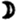      </td><td>     55,265</td><td>     48,422</td><td>1762, 0</td><td>2011, 0</td><td></td></tr>
</table>

<@pagebreak/>
Die erste Kolumne enthält die sehr selten oder eigentlich nie eintretenden
Fälle, wo in der oberen Konjunktion der unteren Planeten und in der Konjunktion
der übrigen die Erde und der Planet in der Sonnenferne sind; die zweite Kolumne
die eben so seltenen Fälle, wo in den Oppositionen der Planet in der Sonnennähe
und die Erde in der Sonnenferne ist, oder in den unteren Konjunktionen das
Entgegengesetzte; zugleich müssen aber auch die Erde, der Planet und die Sonne
auf *einer* geraden Linie sein. Nach diesen Verhältnissen sind die größten und
kleinsten scheinbaren Durchmesser in den folgenden beiden Kolumnen berechnet.
Diese Werthe sind sowohl von der Entfernung als der wirklichen Größe abhängig,
daher Merkur den Uranus, Mars den Saturn und Venus alle übrigen Planeten an
scheinbarer Größe übertreffen können. Für die vier Mittelplaneten sind die
kleinsten Durchmesser auch kleiner als die aller übrigen Planeten. Die
Unterschiede zwischen den größten und kleinsten Werthen dieser Tabelle sind um
so bedeutender, je größer die Excentricität, und je näher uns der Planet ist,
daher beim Mars, der in beiden Rücksichten ausgezeichnet ist, am meisten;
dagegen je entfernter der Planet ist, z. B. Uranus, desto weniger bedeutend ist
die Größe von etwa 42 Mill. Meilen, um welche ihre Entfernung von der Erde sich
durch die Bewegung derselben ändert. Für die verhältnißmäßige Größe des
Unterschiedes haben die Planeten folgende Reihefolge:          .

*Synodischer Umlauf* ist die Zeit die von einer Opposition oder Konjunktion bis
zur nächstfolgenden verfließt, ihre Dauer ist schwankend und die angegebenen
Werthe geben ihre mittlere Größe an. Sie hängt von den Unterschieden in der
Dauer des
<@pagebreak/>
sideralen Umlaufs um die Sonne ab. Die Geschwindigkeit, mit welcher
sich die Planeten einem Beobachter auf der Sonne zu bewegen scheinen, steht
nämlich in geradem Verhältnisse mit der Umlaufszeit. Wäre diese bei zwei
Planeten völlig dieselbe, so würden sie, wenn sie einmal in Konjunktion sind,
sich nie trennen und wenn sie es nicht sind, diese nie erreichen. Ist die
Geschwindigkeit beider verschieden, so eilt der raschere voraus und holt den
langsamern erst dann wieder ein, wenn er einen Umlauf mehr gemacht hat als
dieser. Verhalten sich z. B. die scheinbaren heliocentrischen Geschwindigkeiten
der beiden Körper wie 1 : 1¼, so wiederholen sich die Konjunktionen nach vier
Umläufen des ersten oder fünf des zweiten; verhalten sie sich dagegen wie 2 :
7, so wiederholen sich die Konjunktionen schon nach ⅖ Umläufen des ersten oder
1⅖ des zweiten. Je größer also der Unterschied zwischen den Umlaufszeiten des
Planeten und der Erde ist, desto früher treten die Konjunktionen ein und desto
kürzer ist das *synodische Jahr*. Daher ist es bei Venus größer als bei Merkur,
und bei Mars größer als bei den übrigen oberen Planeten. Warum Mars, bei dem
die Umlaufszeit mehr von der Erde verschieden ist als bei Venus, dennoch ein
weit längeres synodisches Jahr hat, ist durch eine leichte Rechnung zu
beantworten.

Fast alle in diesem Abschnitte enthaltenen Gegenstände haben wir so angegeben,
wie sie einem Beobachter im Mittelpunkte der Erde erscheinen würden; da wir uns
indeß in einer bedeutenden Entfernung davon befinden, so werden sie sich uns
etwas anders zeigen. Wir haben diese Abweichung schon (S. 109) unter dem Namen
*Parallaxe* kennen gelernt; die Sterne erscheinen uns dadurch etwas niedriger
als vom Mittelpunkte der Erde aus, aber der Unterschied ist
<@pagebreak/>
selbst bei den
näheren Planeten unbedeutend, und bei den entfernteren fast unmerklich.

Mehr als durch die Parallaxe erniedrigt, werden sie durch die *Stralenbrechung*
erhöht, indeß da sie sich darin nicht von den übrigen Sternen unterscheiden, so
verweisen wir auf S. 126.

In weit geringerem Grade, als bei den Fixsternen, findet das *Funkeln* bei den
Planeten statt, und obgleich viel glänzender als die meisten Fixsterne, haben
selbst Venus und Jupiter ein weit ruhigeres, mondähnlicheres Licht, wodurch ein
geübtes Auge, auch ohne ihre Stellung zu kennen, leicht die Körper des
Sonnensystems von den Fixsternen unterscheiden kann. Indeß sind diejenigen
planetarischen Körper, deren Durchmesser wegen ihrer geringen Größe und
Entfernung sehr klein erscheint, den Fixsternen ähnlicher. (S. 129).

Sie können sich unsrem Zenith nur bis auf einen gewissen Bogen nähern, da sie
sich von der Ekliptik nicht über eine gewisse Grenze entfernen, und dieser
Kreis bei unsrer Polhöhe (50°) nicht höher als 63½° über unsren Horizont kommt;
nur Pallas kann ihn allenfalls erreichen. Am meisten nähern sie sich dem
Zenith, wenn sie im Winter in der Opposition oder im Sommer in der Konjunktion
sind; da sie aber im letzten Falle nicht sichtbar sind, so vereinigt sich
alles, um den Anblick der obern Planeten in jener Periode zum schönsten zu
machen (S. 177), indem durch ihre Höhe auch die störenden Einflüsse der
Atmosphäre weniger wirken.

<a href="#rn1">*)</a> Meine Leser müssen mir
diese und einige andre Sätze auf mein Wort glauben, da mein Versprechen auf dem
Titelblatte mich hindert irgend etwas Mathematisches einzumischen. Indeß wird
der Beweis derselben dem auch nur der ersten Elemente der Geometrie Kundigen
leicht werden.

