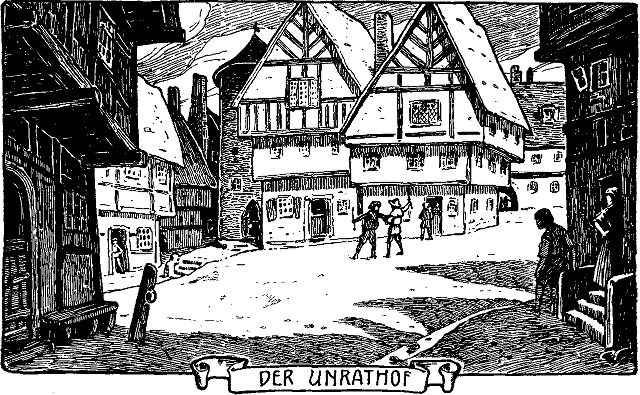

<h2>Erstes Kapitel.</h2>

<h1>Wie beide geboren und von der Welt aufgenommen werden.</h1>

An einem Herbsttage im zweiten Viertel des 16. Jahrhunderts
wurde in London einer armen Familie, namens Canty, ein Knabe
geboren, der ihr recht unerwünscht kam. Am selben Tage wurde
aber auch einer reichen Familie, namens Tudor, ein Kind geboren
und jubelnd aufgenommen. Und nicht nur seine Eltern, sondern
ganz England begrüßte freudig seine Ankunft. Nach diesem Kinde,
das auch ein Knabe war, hatte sich das Volk so sehr gesehnt, daß es
bei seinem Erscheinen beinahe närrisch vor Freude ward. Leute,
die sich nur vom Hörensagen kannten, umarmten und küßten einander
auf offener Straße. Hoch und niedrig, reich und arm, alle
waren in festlicher Stimmung. Tag und Nacht hörte der Jubel in
den Straßen nicht auf. Flatternde Fahnen grüßten von jedem Hause,
und Prunkaufzüge bewegten sich durch die Straßen. Nachts lohten
und leuchteten Freudenfeuer auf jedem Platze, und fröhliche Menschen
wimmelten darum. Alle aber sprachen nur von dem neugeborenen
Kinde, von Eduard Tudor, dem ersehnten Kronprinzen<a href="99_Footnotes.xhtml#rn1" id="rn1">*</a>. 
Dieser lag indessen, eingehüllt in Seide und Atlas, in seiner Wiege,
umgeben von hohen Herren und Damen, und ahnte nichts von all
dem Jubel, den seine Geburt in ganz Altengland wachrief. Er
würde sich auch schwerlich etwas daraus gemacht haben, wenn er
es gewußt hätte.

Tom Canty aber, das andere Kind, lag in armselige Lumpen
eingewickelt, in einem Winkel auf Stroh, und niemand sprach von
ihm, als die arme Familie, der das Kind so ungelegen gekommen war.

