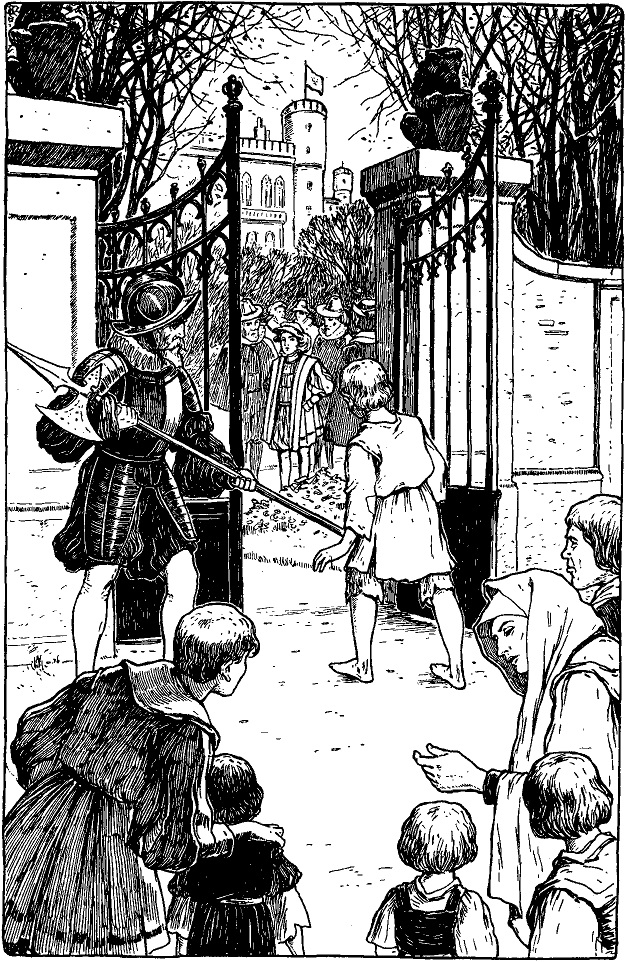

<@pagebreak/>

<h2>Drittes Kapitel.</h2>

<h3>Wie Tom mit dem Prinzen zusammenkam.</h3>

Tom erhob sich hungernd und hungrig schlenderte er hinweg.
Seine Gedanken beschäftigten sich immer noch mit dem goldenen
Zauber seines nächtlichen Traumes. Er wanderte dahin und dorthin,
achtete nicht auf den Weg, noch auf das, was um ihn vorging. Die
Leute stießen ihn an und gaben ihm rauhe Worte, aber er merkte es
kaum. Immer weiter kam er von Hause weg, bis er endlich die
Mauern der Stadt hinter sich hatte.

Er kam in ein Dorf und ruhte hier ein wenig. Dann ging er
weiter und bog in eine schöne, ruhige Straße ein, an deren Ende ihm
ein ungeheures Gebäude entgegenwinkte. Tom starrte in heller Verwunderung
nach den mächtigen Pfeilern des Gebäudes, den ausgedehnten
Flügeln, den drohenden Bastionen und Türmen, dem gewaltigen
steinernen Torweg mit dem vergoldeten Gitter und der
prachtvollen Reihe von granitenen Löwen und anderen Zeichen und
Symbolen des Königtums. Sollte sich der Wunsch seines jungen
Lebens endlich erfüllen? Hier, ja hier mußte der Palast des Königs
sein! Der Himmel hatte sich sicherlich erbarmt und wollte das Sehnen
eines armen Knaben stillen.

Zu jeder Seite des vergoldeten Hauptportals stand eine lebende
Statue, eine stramm, stattlich und bewegungslos dastehende Schildwache,
von Kopf zu Fuß in glänzender Stahlrüstung. Vor ihnen
in achtungsvoller Entfernung gruppierten sich neugierige Leute vom
Lande und aus der Stadt. Prächtige Wagen mit glänzenden Herren
und Damen fuhren durch verschiedene andere Portale des gewaltigen
Baues ein und aus.

Der arme kleine zerlumpte Tom kam mit pochendem Herzen näher
und schlich sich scheu und langsam hinter die Schildwachen. Und
seine Hoffnung wurde nicht getäuscht. Durch die vergoldeten Gitterstäbe
hindurch bot sich ihm ein Schauspiel, über das er beinahe vor
Freude gejauchzt hätte.

Drinnen im Schloßhof stand ein hübscher, von der Sonne leicht
gebräunter Knabe, der ganz in Seide und Atlas gekleidet war und
von Juwelen schimmerte. An seiner Hüfte hing ein kleiner, mit Edelsteinen
besetzter Degen. Seine Füße staken in zierlichen Halbstiefeln
mit roten Fersen. Seinen Kopf schmückte ein karmesinrotes Mützchen
<@pagebreak/>
mit wallenden Federn, die ein blitzender Stein festhielt. Mehrere
prächtig gekleidete Herren standen herum, ohne Zweifel seine
Diener. O das war ein Prinz, ganz ohne Frage, ein lebendiger
Prinz, ein wirklicher Prinz!

Tom wagte beinahe nicht zu atmen, und seine Augen vergrößerten
sich vor Verwunderung und Entzücken. Alles drängte sich bei ihm
in einen Wunsch zusammen: dem Prinzen nahe zu kommen und ihn
gehörig zu betrachten. Bevor er wußte, was er tat, hatte er schon sein
Gesicht fest an die Gitterstäbe gepreßt. Im nächsten Augenblick aber
schleuderte ihn auch schon die Hand einer Schildwache roh hinweg, so
daß er taumelnd unter die gaffende Menge flog.

»Nimm dich in acht, du junger Bettler!« rief ihm der Soldat nach.

Die Menge johlte vor Vergnügen. Der junge Prinz aber hatte
den Vorgang bemerkt, sprang mit gerötetem Gesicht ans Portal und
rief mit blitzenden Augen der Schildwache zu:

»Wie kannst du es wagen, einen armen Burschen so zu behandeln!
Öffne das Tor und laß ihn herein!«

Ha, wie da die Hüte von den Köpfen flogen und wie die Menge
schrie: »Lang lebe der Kronprinz!«

Die Soldaten präsentierten mit ihren Hellebarden, öffneten das
Tor und präsentierten wieder, als der kleine Traumprinz in seinen
flatternden Lumpen hereinkam, um dem wirklichen Prinzen die Hand
zu schütteln.

Eduard Tudor sagte: »Du schaust müde und hungrig aus. Du
bist schlecht behandelt worden. Komm mit mir!« Ein halbes Dutzend
der umstehenden Diener sprangen herbei. Der Prinz aber winkte sie
mit königlicher Gebärde hinweg, und sie standen wieder stockstill wie
Bildsäulen.

Eduard führte Tom in ein prächtiges Gemach im Palast, das er
sein Kabinett nannte. Auf seinen Befehl wurde ein Mahl gebracht,
wie es Tom selbst in seinen Büchern so herrlich nicht gefunden hatte.
Mit zartem Taktgefühl sandte der Prinz die Diener hinweg, damit
sein Gast durch ihren kritischen Blick beim Essen nicht in Verlegenheit
geriete. Dann setzte er sich nahe zu ihm und fragte, während Tom aß:

»Wie ist dein Name, Junge?«

»Tom Canty, Herr.«

»Ein sonderbarer Name! Wo wohnst du?«

»In der Altstadt, Herr. Im Unrathof, draußen im Puddinggäßchen.«
 
<@pagebreak/>
»Unrathof! Wieder ein merkwürdiger Name! Hast du Eltern?«

»Eltern habe ich, Herr, und auch eine Großmutter, aber die ist
von fraglichem Werte für mich. Gott verzeihe mir, wenn es eine
Sünde ist, daß ich es sage. Auch Zwillingsschwestern habe ich, Netty
und Betty.«

»Dann ist also deine Großmutter nicht allzu gütig gegen dich,
nehme ich an.«

»Gegen andere auch nicht, Herr. Sie hat ein böses Herz und
sinnt auf Böses all ihre Lebtage.«

»Mißhandelt sie dich?«

»Es gibt Zeiten, wo ihre Hand ruht, wenn sie schläft oder ganz betrunken
ist. Wenn sie aber ihren Verstand wieder klar hat, holt sie
die versäumten Prügel gehörig nach.«

Des kleinen Prinzen Augen funkelten zornig, er rief:

»Was, Schläge?«

»O ja, gewiß, Herr.«

»Und du bist so schwach und schmächtig! Höre: bevor die Nacht
kommt, soll sie im Turm sein. Der König, mein Vater ...«

»Aber, Herr, du vergißest ihren niedrigen Stand. Der Turm ist
doch nur für die großen Herren.«

»Wirklich, du hast recht. Ich dachte nicht daran. Ich will aber
über ihre Bestrafung nachsinnen. Ist dein Vater gut zu dir?«

»Nicht besser als die Großmutter, Herr.«

»Die Väter sind wohl alle gleich<a href="99_Footnotes.xhtml#rn2" id="rn2">*</a>. Meiner hat auch kein Puppentemperament.
Er läßt nicht mit sich scherzen, mich aber verschont er.
Mit Worten freilich ist er auch nicht immer zart gegen mich. Wie
behandelt dich deine Mutter?«

»Sie ist gut, Herr, und immer lieb zu mir, auch Netty und Betty.«

»Wie alt sind diese?«

»Fünfzehn Jahre, Herr.«

»Fräulein Elisabeth, meine Schwester, ist vierzehn und Fräulein
Johanna Grey, meine Base, ist so alt wie ich und hübsch und liebenswürdig.
Aber meine Schwester Marie mit ihrer düsteren Miene,
die ist strenge. Höre nur: verbieten deine Schwestern auch ihren
Dienerinnen zu lächeln, damit nicht die Sünde ihre Seele verderbe?«

»Meine Schwestern? Ja, glaubst du denn, Herr, sie haben
Dienerinnen?«

Der Prinz betrachtete den kleinen Armen einen Augenblick ernst
und sagte dann:
 
<@pagebreak/>

<@pagebreak/>
»Aber warum denn nicht? Wer hilft ihnen denn nachts sich auszuziehen?
Wer zieht sie denn morgens an, wenn sie sich erheben?«

»Niemand, Herr. Sollten sie denn nachts ihre Kleidung ausziehen
und ohne dieselben schlafen, wie die Tiere?«

»Ihre Kleidung? Haben sie denn nur eine?«

»Ach, Herr, was sollten sie denn mit mehr als einer Kleidung anfangen?
Sie haben doch auch nur einen Körper.«

»Das ist ja köstlich. Entschuldige, ich wollte nicht lachen. Aber
deine Schwestern Netty und Betty sollen Kleider und Dienerinnen
genug erhalten und das bald: mein Schatzmeister wird dafür sorgen.
Nein, du brauchst mir nicht zu danken; es ist nicht der Rede wert.
Du sprichst übrigens recht gut und mit einer gewissen Anmut. Hast
du viel gelernt?«

»Ich weiß nicht, Herr. Der gute Priester, den man Vater Andreas
nennt, war so gütig, mich aus seinen Büchern zu lehren.«

»Kannst du Latein?«

»Nicht gar viel, fürchte ich.«

»Lerne, Junge, wenn es auch zuerst schwer fällt. Das Griechische
ist schwieriger; aber keine von beiden Sprachen macht Fräulein
Elisabeth und meiner Base viel Mühe. Du solltest nur die beiden
Fräulein dabei hören! Aber erzähle mir etwas vom Unrathof. Hast
du ein vergnügliches Leben dort?!«

»Eigentlich ja, Herr, wenn nur das Hungern nicht wäre. Es gibt
da allerhand Buden mit dressierten Affen, so drollige, komische Geschöpfe.
Und dann das Kasperltheater, wo sie schreien und auf einander
losschlagen, bis alle tot sind. Es ist so schön anzusehen und
kostet nur einen Heller. Aber freilich ist es oft gar schwer, einen
Heller zu ergattern.«

»Erzähle mir mehr.«

»Wir Burschen vom Unrathof treiben allerlei hübsche Spiele und
kämpfen auch in Reih und Glied mit einander.«

Die Augen des Prinzen glänzten und er rief:

»Meiner Treu, das wäre etwas für mich. Erzähle mir noch
mehr.«

»Sodann laufen wir um die Wette, um zu sehen, wer am schnellsten
laufen kann.«

»Das gefiele mir auch. Weiter!«

»Im Sommer, Herr, waten und schwimmen wir in den Kanälen
und im Fluß und jeder duckt seinen Nachbar ins Wasser, so tief er 
<@pagebreak/>
kann, oder bespritzt ihn und dann lachen wir und schreien, tauchen
unter und strampeln und plätschern und ...«

»Herrlich! Ich gäbe meines Vaters Königreich darum, wenn ich
auch einmal dabei sein könnte! Bitte, fahre weiter.«

»Wir tanzen und singen um den Maibaum; wir spielen im Sande
und vergraben einander darin, und manchmal machen wir auch
Schlammpasteten. O dieser herrliche Schlamm! wie köstlich ist es,
sich darin herumzuwälzen!«

»Ach, bitte, nicht weiter, das ist ja glorios! Wenn ich mir nur solche
Kleider anziehen könnte, wie du hast und mit bloßen Füßen im Schlamme
schwelgen, einmal, nur einmal, ohne daß mich jemand deshalb tadelte
oder es mir verböte, mich dünkt, ich könnte auf die Krone verzichten!«

»Und ich, wenn ich mich nur einmal so kleiden könnte, wie du,
lieber Herr, nur einmal ...«

»Oho, das möchtest du? Dann mag es ja so sein! Ziehe deine
Lumpen aus und hülle dich in diesen Glanz, Junge! Es ist zwar
ein kurzes Glück, aber deshalb nicht weniger süß. Wir wollen es genießen,
solange wir können. Dann aber müssen wir unsere Kleider
wieder wechseln, bevor uns jemand in die Quere kommt.«

Wenige Minuten später war der kleine Kronprinz in Toms zerfetzte
Lumpen und der kleine Prinz der Armut in königlichen Glanz
gehüllt. Beide standen nebeneinander vor einem großen Spiegel,
und siehe da! welch ein Wunder! Sie starrten einander an, dann
in den Spiegel und schließlich jeder noch einmal den andern. Endlich
stieß der kleine Prinz hervor:

»Wie erklärst du dir das?«

»Ach, lieber Herr, erlaß mir die Antwort. Es ist nicht geziemend,
daß einer meines Standes es ausspricht.«

»Dann will ich es aussprechen. Du hast dasselbe Haar, dieselben
Augen, dieselbe Stimme und Haltung, dieselbe Gestalt, das gleiche
Gesicht wie ich. Hätten wir beide keine Kleider an, so könnte niemand
sagen, wer du bist und wer der Kronprinz. Jetzt aber, da ich gekleidet
bin, wie du es warst, glaube ich dir noch besser nachfühlen zu können,
was du empfandest, als dich der rohe Soldat ... ei, sieh, da hast du
ja eine Schramme an der Hand!«

»Ja, aber es hat nichts zu bedeuten, und du weißt, Herr, daß der
arme Soldat ja nur ...«

»Still! das war schändlich und grausam!« rief der kleine Prinz
und stampfte mit seinem nackten Fuß. »Wenn der König ... doch 
<@pagebreak/>
halt! rühre dich keinen Schritt, bis ich wieder komme! Ich befehle
es dir.«

Mit einem schnellen Griff hob er einen großen, goldschimmernden
Gegenstand, der auf einem Tische lag, auf und legte ihn beiseite. Dann
eilte er zur Tür hinaus und flog in seinen flatternden Lumpen mit
heißem Gesicht und zornsprühenden Augen durch den Palast. Wie er an
das große Portal kam, ergriff er die Gitterstäbe, rüttelte daran und rief:

»Öffnet! Auf mit dem Tor!«

Der Soldat, welcher Tom mißhandelt hatte, öffnete rasch. Wie
aber der Prinz in königlichem Zorn durch das Portal gestürzt kam,
versetzte ihm die Wache eine schallende Ohrfeige, so daß der Prinz
wirbelnd auf die Straße flog, und rief dabei:

»Nimm das, du Bettlerjunge, für das, was du mir von seiner
Hoheit eingetragen hast!«

Die Menge brüllte vor Lachen. Der Prinz erhob sich rasch vom
Boden, stürzte wild auf die Wache los und schrie:

»Ich bin der Kronprinz, meine Person ist heilig, und du sollst
hängen, weil du Hand an mich gelegt hast!«

Der Soldat präsentierte spöttisch mit seiner Hellebarde und sagte
wütend: »Jetzt packe dich aber, du verrückte Brut!«

Die wiehernde Menge schloß sich um den kleinen Prinzen, drängte
ihn die Straße hinunter und schrie: »Platz für seine königliche Hoheit!
Platz für den Kronprinzen!«

