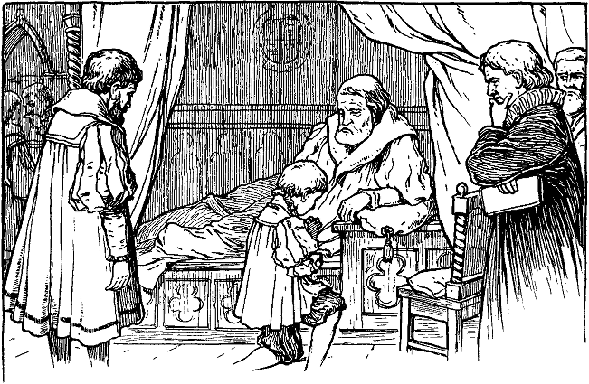

<h>Fünftes Kapitel.</h>

<h>Wie es Tom inzwischen erging.</h>

Tom Canty benutzte den Weggang des Prinzen, um sich ausgiebig
vor dem großen Spiegel zu bewundern. Er nahm die vornehme
Haltung des Kronprinzen an, spazierte hin und her und betrachtete 
sich verstohlen im Spiegel. Dann zog er den prächtigen Degen,
küsste die Klinge und salutierte, wie er es vor einigen Wochen einem
Offizier abgeguckt hatte. Auch mit dem juwelenbesetzten Dolch spielte
er, der in seinem Gürtel stak. Weiterhin beschaute er sich die kostbaren,
ausgesuchten Zieraten des Gemaches. Er setzte sich auf jeden
der prunkvollen Stühle und stellte sich vor, wie stolz er wäre, wenn
der ganze Unrathof hereinsehen und ihn in seiner Pracht erblicken
könnte. Er wunderte sich, ob man ihm glauben werde, wenn er
ihnen von all dieser Herrlichkeit erzählen würde, die er jetzt, wenn
auch nur für einen Augenblick, genießen durfte. Wahrscheinlich aber
würden sie die Köpfe schütteln und glauben, er sei übergeschnappt.

So verging eine halbe Stunde. Da fiel ihm auf einmal ein,
daß der Prinz doch eigentlich etwas lange ausbleibe. Ein Gefühl
der Verlassenheit überkam ihn allgemach. Er fing an zu lauschen,
und eine sonderbare Bangigkeit beschlich ihn. Alle die schönen Sachen
um ihn herum verloren von ihrem Interesse; er wurde unruhig,
aufgeregt und bekümmert. Wenn jemand käme und ihn in den
Kleidern des Prinzen fände! Vielleicht würden sie ihn hängen, bevor
der Prinz zurückkäme und das Rätsel löste. Hatte er doch gehört,
daß die Großen in solchen Sachen gewöhnlich kurzen Prozeß machten.
Immer ängstlicher wurde ihm zu Mute. Sachte und zitternd öffnete
er die Türe zum Vorzimmer mit dem Entschlusse, zu fliehen und
nach dem Prinzen zu forschen, um bei ihm Schutz und Rettung zu
suchen. Sechs prächtige Diener und zwei junge Edelknaben, wie
Schmetterlinge gekleidet, sprangen auf und verbeugten sich tief vor
ihm. Da trat er rasch wieder zurück und schloß die Tür.

»Sie spotten meiner«, sagte er sich; »sie werden hingehen und
erzählen, was sie gesehen haben. O warum kam ich hierher, um
mein Leben so leichtsinnig aufs Spiel zu setzen!«

Er ging im Zimmer auf und nieder, von namenloser Furcht erfüllt,
horchte angestrengt und fuhr beim geringsten Tone zusammen.
Plötzlich flog die Tür auf und ein Edelknabe, in Seide gehüllt,
meldete: »Fräulein Johanna Grey!«

Die Tür schloß sich wieder hinter einem lieben jungen Mädchen
in reicher Kleidung, welches auf Tom zutrat. Bei seinem Anblicke
aber blieb sie plötzlich stehen und sprach in betrübtem Tone: »O was
fehlt dir, mein Lord?«

Tom ging beinahe der Atem aus; aber er faßte sich noch und
stammelte: »Ach, sei gnädig. Ich bin ja kein Lord, sondern nur der 
arme Tom Canty vom Unrathof in der Altstadt. Bitte, führe mich
zum Prinzen, damit er mir meine Lumpen zurückgibt und mich in
Gnaden entlässt. O sei barmherzig und rette mich!«

Der Knabe war auf seine Kniee niedergefallen und schaute mit
bittenden Augen und ausgehobenen Händen zu dem schönen Mädchen
empor. Sie aber schien vor Schrecken versteinert. Endlich
rief sie: »Wie, mein Lord, Ihr kniet? ... und gar noch vor mir?«

Rasch wandte sie sich um und eilte hinweg. Tom aber sank,
von Verzweiflung erfaßt, in sich zusammen und murmelte: »Keine
Hoffnung, keine. Nun werden sie kommen und mich abführen.«

Während er so, vor Schrecken gelähmt, dalag, verbreitete sich
eine Hiobspost mit Windeseile durch den Palast. Das Geflüster
ging von Mund zu Mund, die langen Korridore entlang, von Stockwerk
zu Stockwerk, von Saal zu Saal: »Der Prinz ist irrsinnig
geworden!«

Bald standen in jedem Gange, in jeder Halle Gruppen von
glänzenden Herren und Damen und wisperten mit ängstlichen, verstörten
Mienen. Jetzt trat ein hoher Beamter an diese Gruppen
heran und verkündete mit feierlicher Stimme:

> »Im Namen des Königs!
> 
> Niemand soll, bei Todesstrafe, auf das falsche und törichte Gerücht
hören, noch darüber sprechen, noch dasselbe weiter tragen.
Im Namen des Königs.«

Das Geflüster hörte ebenso plötzlich auf, wie es begonnen hatte.

Bald aber lief wieder ein allgemeines Gesumme durch die Korridore:
»Der Prinz! Seht, der Prinz kommt!«

Langsam schritt der arme Tom an den Gruppen vorüber, deren
tiefe Verbeugungen er zu erwidern versuchte, und schaute mit irren,
ängstlichen Augen auf die fremde Umgebung. Ihm zu beiden Seiten
gingen Edelleute von hohem Stande, die ihm den Arm zur Stütze
boten. Hinter ihm aber folgten die Hofärzte und einige Diener.

Mit einem Male sah sich Tom in einem herrlichen Saale und
hörte, wie die Tür sich hinter ihm schloß. Um ihn herum standen
die, mit denen er gekommen war. Nur wenige Schritte vor ihm
aber ruhte ein sehr großer und sehr starker Mann mit breitem, fleischigem
Gesicht und ernster Miene.

Sein mächtiger Kopf war schon ganz grau, wie auch sein Backenbart,
der wie ein Rahmen sein Gesicht umgab. Sein Gewand war
von reichem Stoffe, aber an einigen Stellen leicht abgenutzt. Einer 
seiner Füße war geschwollen und lag, fest eingewickelt, auf einem
Kissen. Tiefe Stille herrschte, und ehrerbietig senkten sich die Häupter
aller vor diesem Manne. Der ernstblickende Kranke war der
gefürchtete König Heinrich der Achte. Seine Züge verloren ihre
Härte, als er zu sprechen begann: »Was ist dir, mein Lord Eduard,
mein Prinz? Willst du mich, den guten König, deinen Vater, mit
leidigem Scherz betrüben, der dich so lieb hat und so gut zu dir ist?«

Der arme Tom mühte sich, soweit seine Verwirrung es zuließ,
die mit sanftem Vorwurf gesprochene Rede zu erfassen. Als aber
die Worte »mich, den guten König« sein Ohr berührten, da erblaßte
er und fiel, wie vom Blitz getroffen, auf die Kniee. Dann hob er
die Hände empor und rief: »Du der König? Dann ist es mit mir
zu Ende!«

Der König schien wie betäubt von diesen Worten. Ziellos wandelten
seine Blicke von Gesicht zu Gesicht, dann blieben sie verwirrt
auf dem Knaben vor ihm haften. Endlich sprach er in einem Tone
tiefer Enttäuschung: »Ach, ich hatte geglaubt, das Gerücht übertreibe
den wirklichen Sachverhalt; ich fürchte, ich habe mich geirrt.«

Er atmete schwer und sagte sodann mit sanfter Stimme: »Komm
zu deinem Vater, Kind, du bist nicht wohl.«

Man richtete Tom auf, und er trat zitternd und demütig näher.
Der König nahm das angstvoll blickende Gesicht des Knaben zwischen
die Hände und betrachtete ihn mit liebevollem Ernst, als suche er
nach einem Zeichen der wiederkehrenden Vernunft. Dann preßte
er den Lockenkopf an seine Brust und streichelte ihn zärtlich. Plötzlich
sagte er: »Kennst du deinen Vater nicht, Kind? Brich nicht mein
altes Herz; sage, daß du mich kennst. Du erkennst mich, nicht wahr?«

»Du bist mein gefürchteter Herr, der König, den Gott erhalte!«

»Schön, ganz recht, das ist gut; tröste dich und zittere nicht so.
Hier ist niemand, der dir ein Leides tun möchte, niemand, der dich
nicht liebt. Du bist jetzt besser; dein böser Traum verfliegt, ist es
nicht so? Und dich selbst kennst du auch wieder, nicht wahr? Du
willst dich nicht wieder für einen andern ausgeben, oder?«

»Ich bitte dich bei deiner Gnade, glaube mir. Ich sprach nur
die Wahrheit, erlauchter Lord. Ich bin der geringste deiner Untertanen,
in armseligen Verhältnissen geboren und nur durch einen
leidigen Tausch und Zufall bin ich hier; mich selbst aber trifft kein
Vorwurf. Ich bin noch zu jung zum Sterben, und du kannst mich
retten mit einem einzigen kleinen Wort. O sprich es aus, Herr!«
 

»Sterben? Sprich doch nicht so, mein lieber Prinz. Still, still,
beruhige dein verwirrtes Herz, du sollst nicht sterben!«

Mit einem freudigen Ausruf fiel Tom wieder auf die Kniee:
»Gott danke dir deine Gnade, o mein König und erhalte dich noch
lange zum Segen deines Landes!« Dann sprang er auf, wandte
sich an die beiden Lords, die ihn hergeführt hatten, und rief: »Ihr
hört es! Ich soll nicht sterben. Der König hat es gesagt!«

Stumm verbeugten sich die Angesprochenen; aber keiner ergriff
das Wort. Verwirrt zögerte Tom einen Augenblick, blickte furchtsam
nach dem König und sprach: »Darf ich jetzt gehen?«

»Gehen? Gewiß, wenn du wünschest. Aber magst du nicht
einen Augenblick länger verweilen? Wohin willst du gehen?«

Tom senkte die Blicke und erwiderte unterwürfig: »Vielleicht
habe ich falsch verstanden. Ich dachte, ich wäre nun frei und wollte
wieder zurück in die Dachkammer, wo ich geboren und im Elend
erzogen wurde. Da meine Mutter und Schwestern dort wohnen,
gehöre ich auch dahin. Dieser Pomp und Glanz aber, an den ich
nicht gewöhnt bin ... o bitte, Herr, laß mich gehen!«
 

Der König schwieg und dachte einen Augenblick nach, während
sein Gesicht wachsende Sorge und Unruhe ausdrückte. Dann aber
sagte er, und ein wenig Hoffnung lag in seiner Stimme: »Vielleicht
erstreckt sich sein Irrsinn nur auf diese eine fixe Idee und hat seine
übrige Geisteskraft unberührt gelassen. Gebe, daß dem so sei! Wir
werden es gleich sehen.«

Darauf stellte er an Tom eine Frage in lateinischer Sprache und
Tom antwortete, wenn auch zögernd, in derselben Sprache. Der
König war entzückt und seine Miene heiterte sich auf. Auch die
Lords und Arzte zeigten ihre Befriedigung. Der König wandte
sich zu den Herren und sprach: »Das zeigt doch wohl, daß sein Geist
nur krank, nicht gänzlich zerstört ist. Was sagen Sie dazu, meine
Herren?«

Die Arzte verbeugten sich tief, und einer erwiderre: »Das ist
auch unsere Überzeugung, Majestät.«

Der König freute sich über diese Bestätigung, die von einer einwandfreien
Autorität herrührte, und fuhr fort: »Nun geben Sie
alle acht. Wir wollen ihn weiter prüfen.«

Darauf fragte er Tom etwas in französischer Sprache. Tom
schwieg eine Weile verlegen, da er alle Augen auf sich gerichtet sah,
und erwiderte dann leise: »Ich kenne diese Sprache nicht, mein
König.«

Der Fürst fiel in seine Kissen zurück. Die Umstehenden eilten
zu seinem Beistande herbei. Der König aber wies sie zurück und
sagte: »Laßt mich, es ist nur ein leichter Schwächeanfall. Hebt mich
empor. So, das genügt. Komm hierher, Kind; lehne deinen armen,
verwirrten Kopf an deines Vaters Herz und ruhe aus. Du wirst
bald wieder wohl sein; es ist nur vorübergehend. Fürchte dich nicht.«

Dann wandte er sich zu der Versammlung; seine bis jetzt milden
Züge härteten sich und fahle Blitze zuckten aus seinen Augen. Er
sprach: »Höret ihr alle! Dieser mein Sohn ist irrsinnig; aber er ist
es nicht dauernd. Die geistige Überanstrengung hat es bewirkt und
eine zu große Abgeschlossenheit. Weg für jetzt mit Büchern und
Lehrern! Man sorge dafür! Vergnügt ihn mit Spielen, gebt ihm
gesunde Unterhaltung, auf daß sein Geist wiederkehre!«

Dann erhob er sich noch höher und fuhr in strengem Tone fort:
»Er ist irrsinnig; aber er ist mein Sohn und Englands Erbe und gesund
oder irrsinnig, regieren soll er doch! Und höret ferner und verkündet
es weiter: wer immer von dieser seiner Krankheit spricht,
vergeht sich gegen den Frieden und die Ordnung dieses Reiches und
soll gehängt werden! ... Gebt mir zu trinken ... ich brenne ...
Diese Sorge reibt meine Kraft auf ... hier, nehmt den Becher wieder
weg ... stützt mich! ... so, das ist gut. Also irrsinnig ist er. Wäre
er aber auch tausendmal irrsinniger, er ist doch der Kronprinz, und
ich, der König, will es bekräftigen. Schon am nächsten Morgen soll
er in gehöriger, althergebrachter Form zum Thronerben erklärt werden!
Trefft sogleich die nötigen Anordnungen, mein Lord Hertford.«

Einer von den Edlen kniete vor dem Lager des Königs nieder
und sagte: »Majestät wird sich erinnern, daß der Erbmarschall von
England gefesselt im Turm liegt. Es wäre nicht geziemend, daß
ein Gefangener ...«

»Still! Beleidiget nicht mein Ohr mit seinem verhaßten Namen!
Muß denn dieser Mann ewig leben? Wird mein Wille nicht mehr
geachtet? Soll der Prinz warten, weil zu seiner feierlichen Einsetzung
England keinen Marschall hat, der frei ist vom Verbrechen
des Hochverrats? Nein, bei Gottes Herrlichkeit! Mein Parlament
möge Norfolks<a href="99_Footnotes.xhtml#rn4" id="rn4">*</a> Verurteilung beschließen, ehe die Sonne sich wieder
erhebt, sonst wird es meine schwere Hand spüren!«

Lord Hertford erwiderte: »Des Königs Wille ist Gesetz.« Dann
stand er auf und trat an seinen früheren Platz zurück.

Die vom Zorn entstellten Züge des alten Königs glätteten sich,
und er sprach: »Küsse mich, mein Prinz. Was! du fürchtest dich?
Bin ich nicht dein liebevoller Vater?«

»Du bist zu gütig gegen mich Unwürdigen, o mächtiger und
gnädiger Herr. Aber es ... es schmerzt mich, wenn ich an ihn denke,
der sterben soll, und ...«

»Ah, das gleicht dir, das sieht dir ähnlich. Dein Herz ist also
unverändert geblieben, wenn auch dein Geist gelitten hat, denn du
warst immer ein gutes Kind. Aber dieser Herzog steht zwischen dir
und deiner Standeserhöhung. Ich will einen andern an seiner Stelle
haben, der makellos dasteht. Tröste dich, mein Prinz, verwirre deinen
armen Kopf nicht noch mehr durch solche Gedanken.«

»Aber 
ich
 bin es doch, der seinen Tod wider Willen beschleunigt,
mein König. Wie lange dürfte er sonst noch leben?«

»Denke nicht an ihn, mein Prinz; er ist es nicht wert. Küsse
mich noch einmal und dann gehe und erheitere dich durch Spiele.
Ich bin müde und möchte ruhen. Gehe mit deinem Onkel Hertford 
und deinen Leuten, und komme wieder, wenn mein Körper erfrischt
ist.«

Schweren Herzens mußte sich Tom hinwegführen lassen. Vernichteten
doch diese letzten Worte die Hoffnung freizukommen, die
er immer noch gehegt hatte. Wieder hörte er in den Gängen leise
Stimmen flüstern: »Der Prinz, der Prinz kommt!«

Er wurde immer mutloser, wie er so zwischen den Reihen sich
verbeugender Höflinge hindurchschritt. Es kam ihm zum Bewußtsein,
daß er jetzt ein Gefangener sei und vielleicht für immer in diesem
vergoldeten Käfig verweilen müsse, ein verlorener, freundloser Prinz.
O möchte doch der Himmel sich seiner erbarmen und ihn freilassen!

Dazu sah er, wohin er seine Blicke auch wenden mochte, immer
den abgeschnittenen Kopf des Herzogs von Norfolk, wie er mit vorwurfsvollen
Augen ihn anblickte.

Wie schön waren seine alten Träume gewesen, und wie traurig
machte ihn jetzt die Erfüllung derselben!

