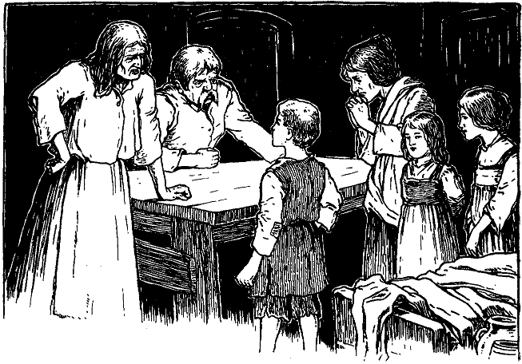

<h>Zehntes Kapitel.</h>

<h>Wie der Prinz die Nacht verbrachte.</h>

Wir verließen Johann Canty, als er den rechtmäßigen Prinzen in
den Unrathof schleppte, während ein lärmender, johlender Pöbel
hinter ihm herlief. Nur einer war da, der ein bittendes Wort für den
Gefangenen einlegte. Aber Canty beachtete ihn nicht, ja, er hörte
ihn kaum, so groß war der Tumult. Der Prinz rang immer noch um
seine Freiheit und wehrte sich gegen seinen Peiniger, bis Canty sein
bisschen Geduld verlor und seinen Eichenstock in plötzlicher Wut über
das Haupt des Prinzen schwang. Der Mann aber, der für den
armen Kleinen gebeten hatte, fiel Canty in den Arm und erhielt
selbst den Schlag, der dem Prinzen gegolten hatte. Dabei brüllte
Canty:

»Du willst dich hineinmischen, du? Da, nimm deinen Lohn!«

Er holte nochmals zum Schlage aus und traf diesmal den Vermittler
auf den Kopf. Mit leisem Stöhnen sank der Mann zwischen
die Menge zu Boden, und im nächsten Augenblick lag er allein in der
Dunkelheit da. Die Menge drängte vorwärts; der Zwischenfall störte
sie nicht weiter.

Endlich befand sich der Prinz in Cantys Wohnung, und hinter ihm
schmetterte die Tür zu. Bei dem unbestimmten Licht einer Talgkerze,
die in einem Flaschenhals stak, konnte er die Umrisse der elenden
Höhle und auch deren Bewohner unterscheiden. Zwei schmutzige
Mädchen und eine Frau im mittleren Alter kauerten in einer Ecke
an der Wand. Sie blickten so eingeschüchtert und ängstlich drein wie
Tiere, die an eine brutale Behandlung gewöhnt sind. Aus einer
anderen Ecke aber schlich eine welke Hexe herbei. Sie trug loses
graues Haar und hatte ein Paar boshafte Augen.

»Hör' mal«, sagte Johann Canty zu ihr, »da gibt's einen kapitalen
Spaß. Verdirb ihn nicht voreilig. Höre erst zu; nachher kannst du
prügeln, soviel du willst. Stell dich hierher, Bursche. So, nun sag
deine Narretei nochmals, wenn du sie nicht vergessen hast. Nenne
deinen Namen. Wer bist du?«
 

Das Blut schoss dem entrüsteten Prinzen in die Wangen. Er
schaute dem Mann fest und zornig ins Gesicht und erwiderte:

»Was du sprichst, zeugt von recht schlechter Erziehung. Ich sage
dir nochmals: Ich bin Eduard, der Kronprinz und kein anderer.«

Es schien, als ob die Füße der Hexe vor Erstaunen an den Boden
genagelt seien. Der Atem ging ihr beinahe aus. Sie starrte in
stumpfsinniger Verblüffung nach dem Prinzen, was ihren schurkischen

Sohn so sehr belustigte, dass er in brüllendes Gelächter ausbrach.
Aber auf Toms Mutter und Schwestern hatte der Vorgang eine ganz
andere Wirkung. Ihre Furcht vor Schlägen wich plötzlich einer ganz
anderen Sorge. Wehklagend stürzten sie vorwärts und riefen:
»Armer Tom, armer Bursche!«

Die Mutter fiel vor dem Prinzen auf die Knie, legte ihre Hände
auf seine Schultern und blickte ihn unter aufsteigenden Tränen ängstlich
forschend an. Dann sagte sie:

»Ach, mein armer Junge! Das kommt von deinem törichten
Lesen, das dir nun gar den Verstand genommen hat. Wie oft habe 
ich dich davor gewarnt! Dass du auch nicht auf mich hören musstest!
Du brichst deiner armen Mutter das Herz.«

Der Prinz schaute sie voll an und entgegnete sanft:

»Dein Sohn ist gesund und wohlauf und hat seinen Verstand noch,
gute Frau. Tröste dich. Lass mich wieder nach dem Palast bringen,
wo er ist, und der König, mein Vater, wird ihn dir sogleich zurückgeben.«

»Der König, dein Vater! O, mein Kind! Nimm diese Worte
zurück, welche dich und uns alle ins Verderben stürzen können. Schüttle
diesen fatalen Traum von dir ab. Komm wieder zu dir selbst. Schau
mich an! Bin ich nicht deine Mutter, die dich gebar und dich so liebt?«

Der Prinz schüttelte den Kopf und sagte zögernd:

»Gott weiß, wie ungern ich dich betrübe, aber wahrhaftig, ich sehe
dein Gesicht zum erstenmal.«

Die Frau sank in eine sitzende Lage zurück, bedeckte mit den Händen
ihr Gesicht und brach in ein herzzerreißendes Schluchzen und Wehklagen
aus.

»Nur weiter mit der Mummerei!« schrie Canty. »Heda, Netty
und Betty, ihr ungesitteten Rangen! Wollt ihr stehen in Gegenwart
des Prinzen? Auf die Knie mit euch, ihr armseliges Gewürm, und
erweiset ihm euere Ehrerbietung!«

Er wieherte vor Lachen bei diesen Worten. Die Mädchen begannen
furchtsam für ihren Bruder zu bitten, und Netty sagte:

»Ach, lass ihn doch schlafen gehen, Vater; Ruhe und Schlaf werden
ihn wieder heilen.«

»Ja, Vater«, meinte auch Betty, »er ist mehr als gewöhnlich
überanstrengt. Morgen wird er sich schon wieder besinnen und fleißig
betteln und nicht wieder mit leeren Händen nach Hause kommen.«

Diese unglückliche Bemerkung ernüchterte den Vater plötzlich und
brachte ihn auf einen anderen Gedanken. Er wandte sich ärgerlich
zum Prinzen und fuhr ihn an:

»Morgen müssen wir dem Eigentümer dieses Loches bare zwanzig
Pfennige Miete zahlen für das nächste halbe Jahr, sonst wirft er uns
hinaus. Zeig her, was du mit deiner faulen Bettelei eingeheimst hast.«

Der Prinz erwiderte: »Beleidige mich nicht mit deinen schmutzigen
Sachen. Ich sage dir wieder: ich bin der Königssohn.«

Ein klatschender Schlag von der breiten Hand Cantys fiel auf die
Schulter des Prinzen, welcher taumelnd seiner vermeintlichen Mutter
in die Arme flog. Sie drückte ihn an sich und schützte ihn vor dem 
Hagel von Schlägen und Püffen, die nun auf sie selbst niederprasselten.
Erschreckt flohen die Mädchen in ihre Ecken zurück, aber die Großmutter
kam eifrig näher, um ihrem Sohne beizustehen. Der Prinz
entwand sich den Armen seiner Beschützerin, stellte sich vor sie hin
und rief:

»Du sollst nicht für mich leiden, gute Frau. Diese Schurken mögen
ihre Wut an mir allein auslassen!«

Natürlich steigerte das die Wut seiner Peiniger noch mehr, und
sie fielen denn auch ohne Zeitverlust über ihn her. Sonder Erbarmen
droschen sie auf den armen Prinzen los. Dann bekamen auch noch
die beiden Mädchen und ihre Mutter ihren Anteil an Prügeln für
die Teilnahme, die sie dem armen Prinz erwiesen hatten.

»Nun aber zu Bett!« rief Canty, »die Unterhaltung hat mich
ermüdet«.

Das Licht wurde ausgelöscht, und die Familie zog sich zurück.

Sowie aber die jungen Mädchen bemerkten, dass ihr Vater und
ihre Großmutter schliefen, krochen sie dorthin, wo der Prinz lag, und
schützten ihn mitleidig vor der Kälte mit Stroh und Lumpen. Seine
Mutter stahl sich ebenfalls zu ihm hin, streichelte sein Haar und weinte
leise. Dann flüsterte sie wieder abgebrochene Trostworte in sein Ohr.
Auch ein Stück Brot hatte sie für ihn beiseite gelegt, aber der Knabe
vergaß vor Schmerz allen Hunger, wenigstens für geschmacklose,
schwarze Brotkrumen. Die Tapferkeit, mit der sie ihn verteidigte,
und ihr Mitleid hatten ihn gerührt. Er dankte ihr in herzlichen Ausdrücken
und bat sie, schlafen zu gehen und ihren Kummer zu vergessen.
Der König, sein Vater, fügte er hinzu, werde sie für ihre
Gutherzigkeit und Aufopferung nicht unbelohnt lassen. Dieser Rückfall
in seinen »Irrsinn« brach ihr das Herz von neuem. Sie presste
ihn wieder und wieder an ihre Brust, und dann ging sie, in Tränen
gebadet, in ihr Bett zurück.

Traurig und nachdenklich lag sie da. Es war ihr so, als sei ein unbestimmtes
Etwas an diesem Knaben, das ihr Tom nicht hatte. Sie
konnte es nicht näher bezeichnen, aber ihr scharfer mütterlicher Instinkt
fühlte es doch heraus. Was, wenn der Knabe trotz allem nicht ihr
Sohn wäre? Aber es war doch undenkbar! Sie lächelte beinahe
über ihren Gedankengang trotz ihres Kummers. Aber der Argwohn
wollte sie doch nicht verlassen. Er verfolgte sie, quälte sie, klammerte
sich an sie und wollte sich nicht verscheuchen lassen. Sie fühlte, dass
sie keine Ruhe mehr finden würde, bis sie sich felsenfest überzeugt 
hätte, ob dieser Knabe wirklich ihr Sohn sei oder nicht. Sie grübelte
also darüber nach, wie sie diesen Beweis sich verschaffen könnte. Aber
die Aufgabe war nicht allzu leicht. Sie erwog das und jenes, verwarf
aber schließlich alles wieder, denn nur ein durchaus sicherer
Beweis konnte ihr genügen. Augenscheinlich mühte sie ihren armen
Kopf umsonst ab; sie war schon daran, die ganze Sache aufzugeben.

Während sie wie verzweifelt nachgrübelte, hörte sie das regelmäßige
Atemholen des Knaben, der mittlerweile in Schlaf gefallen
war. Plötzlich aber fuhr er mit einem leisen Schrei auf, wie gequält
von einem unruhigen Traum. Dieser kleine Zwischenfall brachte sie
endlich auf einen Gedanken, der ihr einen untrüglichen Beweis
liefern musste, ob der Knabe ihr Tom sei.

Geräuschlos, aber in fieberhafter Aufregung erhob sie sich, zündete
die Kerze an und murmelte bei sich:

»Könnte ich ihn nur im richtigen Augenblicke sehen, so wüsste ich
es. Seit jenem Tage, da ihm in seiner frühen Jugend eine Ladung
Pulver ins Gesicht spritzte, hebt er immer blitzschnell seine Hände
schützend vor die Augen, wenn er aus einem Traume oder in Gedanken
auffährt, genau wie er es an jenem Tage machte. Stets
aber wendet er dabei die äußere Handfläche einwärts, was sonst
kein Mensch tun würde. Ich habe es wohl hundertmal gesehen:
immer, ohne Ausnahme, machte er es so. Nun wollen wir einmal
sehen!

Inzwischen hatte sie sich an den schlafenden Knaben herangeschlichen,
und hielt dabei die Kerze mit der Hand beschattet. Ganz
sachte und behutsam beugte sie sich über ihn, trotz der großen Aufregung
kaum atmend. Jetzt plötzlich nahm sie die Hand von der Kerze
weg, so dass das Licht ihm grell ins Gesicht fiel. Zugleich schlug sie
mit ihrem Knöchel hart an seinem Ohr auf den Boden. Erschreckt
riss der Schläfer die Augen weit auf und warf einen verwunderten
Blick umher. Die erwartete Bewegung mit den Händen blieb aus.

Hoffnungslose Überraschung zeigte sich in den Mienen der armen
Frau. Indes verbarg sie gewaltsam ihre Gefühle und suchte den
Knaben zu beruhigen, der auch bald wieder einschlummerte. Dann
kroch sie zurück und beriet mit sich selbst über das klägliche Ergebnis
ihres Versuches. Sie wollte sich zuerst einreden, der Irrsinn habe
Tom auch seine altgewohnte Bewegung geraubt: aber sie konnte
selbst nicht recht daran glauben.
 

»Nein«, sagte sie sich, »die Hände sind doch nicht verrückt, so
schnell könnten sie ihre Angewöhnung nicht verlernen. O, das ist ein
schwerer Tag für mich.«

Nun aber erwies sich die Hoffnung ebenso eigensinnig und hartnäckig,
wie vorher der Zweifel. Sie wollte ihre Sache nicht so ohne
weiteres verloren geben, sondern einen neuen Versuch wagen. Vielleicht
war der Misserfolg ein zufälliger gewesen. Sie schreckte daher
den Knaben ein zweites und nach einer Weile ein drittes Mal aus
dem Schlafe auf, immer mit demselben Ergebnis, wie das erste Mal.
Dann aber schleppte sie sich gebrochen nach ihrem Lager zurück und
stöhnte: »Und ich kann, ich kann ihn nicht aufgeben; er muss mein
Junge sein.« Allmählich aber schloss ein mildtätiger Schlaf ihre müden
Augen.

Auch der Prinz schlummerte fest und ruhig weiter. Stunde um
Stunde verrann. Nun aber schien er aus seiner Betäubung zu erwachen.
Halb noch im Traume murmelte er:

»Herr Wilhelm!«

Als er keine Antwort bekam, rief er noch einmal:

»Herr Wilhelm Herbert! Kommt doch schnell hierher und höret,
was ich sonderbares geträumt habe. Herr Wilhelm, hört Ihr? Mir
war, als sei ich in einen Bettler verwandelt und ... heda! Wachen!
Herr Wilhelm! Wie! ist denn niemand hier? Das soll ihnen
schlecht ...«

»Was fehlt dir?« fragte eine Stimme flüsternd neben ihm, »nach
wem riefest du eben?«

»Nach Herrn Wilhelm Herbert. Seid Ihr es?«

»Ich? wer sollte ich sein, als deine Schwester Netty? O Tom, du
bist immer noch verrückt. Ich wollte, ich wäre nie wieder vom Schlafe
erwacht! Aber bemeistere doch deine Zunge, sonst werden wir noch
alle zu Tode geprügelt!«

Der plötzlich wachgewordene Prinz wollte auffahren. Aber der
Schmerz, den ihm seine halb zerschlagenen Glieder verursachten,
brachte ihn jäh in die Wirklichkeit zurück. Stöhnend sank er wieder
auf sein elendes Stroh mit dem qualvollen Rufe:

»Ach, so war es doch kein Traum!«

All das Elend, dem der Schlaf ihn so gnädig entrückt hatte, kehrte
zurück. Er war also nicht mehr der verhätschelte Prinz, auf dem die
Augen eines ganzen Volkes voll Verehrung ruhten, sondern ein
armer, ausgestoßener Bettler, in Lumpen gekleidet, als Gefangener 
in einem Loche, das gerade noch für Tiere gut genug war, und in
Gesellschaft vielleicht mit Dieben.

Während er sich seinem Kummer überließ, wurden draußen
lachende Stimmen und Rufe laut. Im nächsten Augenblick klopfte
es mehrmals heftig an die Türe. Johann Canty hörte auf zu schnarchen
und sagte:

»Wer klopft da? Was wollt ihr?«

Eine Stimme antwortete:

»Weißt du, wer das war, den du gestern Abend mit deinem
Knüppel niedergeschlagen hast?«

»Nein, ich weiß es nicht und kümmere mich auch nicht darum.«

»Vielleicht wirst du aber bald anderer Meinung. Wenn du dir den
Hals aus der Schlinge ziehen willst, so kann nur schleunige Flucht
dich retten. Der Mann gibt in diesem Augenblick den Geist auf. Es
ist der Priester, Vater Andreas.«

»Hol's der Kuckuck!« rief Canty. Er stand hastig auf, rüttelte seine
Familie aus dem Schlaf und befahl barsch:

»Auf mit euch allen und flieht! Sonst wird euch der Henker
holen.«

Kaum fünf Minuten später stand schon die ganze Familie auf der
Straße. Johann Canty hielt den Prinzen am Handgelenk und eilte
durch Nacht und Nebel dahin. Zugleich warnte er ihn mit leiser
Stimme:

»Halt deine Zunge, du verrückter Narr, und sprich unseren Namen
nicht aus. Ich will mir einen anderen Namen beilegen, um die Spürhunde
des Gesetzes von unserer Fährte abzubringen. Halt deine
Zunge, wenn ich dir gut zu Rate bin.«

Die letzten Worte richtete er auch an seine Familie und fügte bei:

»Sollten wir auseinander kommen, so mache sich jeder nach der
Londoner Brücke. Wer zuerst hinkommt, soll dort beim letzten Tuchladen
warten. Dann wollen wir alle zusammen auf die andere Seite
der Themse fliehen.«

Kaum hatte er diese Worte gesprochen, so kam die Gesellschaft
aus der Dunkelheit heraus plötzlich auf einen hellerleuchteten Platz.
Eine tanzende, singende und schreiende Menge drängte sich hier nach
dem Flussufer zu. Soweit man sehen konnte, waren dort längs der
Themse auf- und abwärts Freudenfeuer angezündet. Die Londoner
und andere Brücken erstrahlten wie in einem Licht. Der ganze
Fluss schien zu glühen von dem Blitzen und Schimmern von farbigen 
Lichtern. Unaufhörlich fuhren Raketen zischend in die Luft, verschlangen
sich dort ineinander und lösten sich prasselnd in einen
dichten Funkenregen auf, der die Nacht beinahe zum Tage machte.
Lärmende, zechende Gruppen umstanden die überall aufgestellten
Trinkstände. Ganz London schien im Freien zu sein.

Johann Canty stieß einen lästerlichen Fluch aus und wollte
wieder zurück; aber es war zu spät. Bald waren er und seine Familie
von dem schwärmenden Bienenhaufen umwogt und in einem Augenblick
von einander getrennt. Nur den Prinzen hielt Canty immer
noch fest. Bei seinem Bemühen, sich Bahn durch die Menge zu schaffen
stieß er ziemlich unsanft an einen vierschrötigen Bootsmann, der
schon stark angeheitert schien. Dieser legte Canty seine schwere Hand
auf die Schulter und rief:

»Heda, wohin so eilig, Freund? Du wirst doch nicht etwa so
schmutzig sein, jetzt an Geschäfte zu denken, wo jeder treue Untertan
feiert?«

»Meine Geschäfte gehen dich nichts an«, entgegnete Canty roh,
»nimm deine Hand weg und lass mich ungeschoren«.

»So? Jetzt sollst du erst recht nicht fort, bis du auf die Gesundheit
des Kronprinzen getrunken hast. Das lass dir gesagt sein«, sprach der
Bootsmann und vertrat ihm den Weg.

»Dann her mit dem Becher und schwatz nicht lang!«

Andere Zecher drängten sich herzu und schrien:

»Den Liebesbecher<a href="99_Footnotes.xhtml#rn6" id="rn6">*</a>, den Liebesbecher! Der saubere Patron soll den
Liebesbecher leeren, sonst werfen wir ihn den Fischen zum Fraße hin.«

Ein mächtiger Pokal wurde gebracht. Der Bootsmann ergriff
ihn an einem Henkel, während er die andere Hand emporhielt, als
fasse er den Zipfel einer Serviette, und bot ihn so in althergebrachter
Weise Canty dar. Dieser hatte mit der einen Hand den zweiten Henkel
zu ergreifen, während er mit der anderen Hand den Deckel aufheben
musste, wie es die Sitte vorschrieb. Das nötigte ihn natürlich, die
Hand des Prinzen einen Augenblick loszulassen. Dieser nahm die
günstige Gelegenheit wahr, schlüpfte zwischen dem Wald von Beinen
hindurch und war im Nu verschwunden. In der nächsten Minute
wäre er in dieser wogenden Menschenmasse nicht leichter zu finden
gewesen, als ein verlorenes Geldstück in den Fluten des Atlantischen
Ozeans.

Dieser Tatsache ward er sich bald bewusst. Ebenso war ihm klargeworden,
dass ein untergeschobener Kronprinz an seiner Stelle von 
der Stadt gefeiert wurde. Tom Canty, der arme Bursche, musste
vorbedacht die verlockende Gelegenheit benutzt haben und zum Thronräuber
geworden sein.

Es gab für den Prinzen also nur einen Weg, den er einschlagen
musste. Dieser führte nach dem Rathause, wo er sich ausweisen und
den Betrüger entlarven wollte. Er nahm sich vor, Tom hängen, ertränken
und vierteilen zu lassen, wie es damals im Falle des Hochverrats
Sitte und Brauch war.

