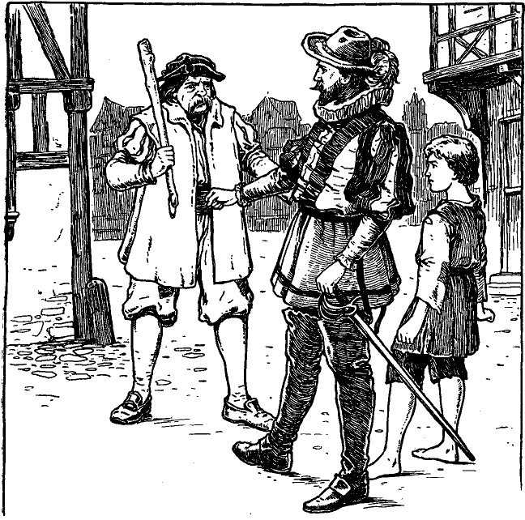

<h2>Zwölftes Kapitel.</h2>

<h3>Wie der König seinen Retter erzieht.</h3>

Michael Henden und der kleine Prinz wanderten inzwischen durch
Seitengässchen und wenig begangene Wege dem Flusse zu. Sie
stießen auf kein Hindernis, bis sie an die Londonerbrücke kamen.
Dort pflügten sie sich, so gut es ging, zwischen der sich stauenden Menge
hindurch. Henden hielt den Prinzen, oder vielmehr den nunmehrigen
König, fest am Handgelenk. Die Nachricht vom Tode des Königs war
schon unter das Volk gedrungen und der Knabe vernahm sie von
tausend Lippen, denn niemand sprach von etwas anderem.

Die traurige Kunde ging dem Herzen des armen Waisenknaben
sehr nahe. Er bebte am ganzen Körper und brach schließlich in bitterliches
Weinen aus. Die Größe des Verlustes ward ihm voll bewusst,
denn der grimmige Tyrann, dessen Name alle anderen mit Schrecken
erfüllte, war ihm stets ein liebevoller Vater gewesen. Nur mechanisch
und taumelnd folgte er seinem Führer; alles flimmerte ihm vor den
Augen. Er hielt sich für das elendeste, unglücklichste Geschöpf Gottes.
Da brauste weithin durch die Nacht der donnernde Ruf: »Lang lebe
König Eduard der Sechste!«

Jetzt kam wieder Leben in die Gestalt des armen Kleinen. Seine
Augen blitzten und ein stolzes Gefühl durchzuckte ihn bis in die Fingerspitzen.
»Ah«, dachte er, »wie großartig und seltsam es auch scheinen
mag: ich bin der König!«

Unsere Freunde bahnten sich ihren Weg langsam durch die Volksmenge,
welche dichtgedrängt die Brücke besetzte. Dieser schon 600 Jahr
alte, merkwürdige Bau war allezeit eine verkehrsreiche Durchfahrt
gewesen. Zu beiden Seiten reihten sich von einem Ufer bis zum
anderen Verkaufsläden, über denen sich die Wohnungen der Geschäftsinhaber
befanden. Die Brücke bildete eine Art Stadt für sich.
Sie hatte ihre Gasthöfe, Wirtschaften, Bäckereien, Fleischereien,
Kurzwarengeschäfte, Lebensmittel- und Manufakturwarengeschäfte, 
<@pagebreak/>
ja sogar eine Kirche. Sie schaute auf ihre beiderseitige Umgebung
hin, wie auf Vorstädte, die ihr nicht ebenbürtig wären. Sie stellte
sozusagen eine geschlossene Gesellschaft dar. Freilich besaß sie nur
eine Straße, die etwa den fünften Teil einer Meile lang war. Alle
Bewohner kannten sich von Kindesbeinen an. Natürlich hatten sie
auch ihre Aristokratie, nämlich wohlhabende Fleischer- und Bäckerfamilien
und was weiß ich, die jahrhundertelang hier angesessen
waren und die Geschichte der Brücke samt den sich daran knüpfenden
Legenden bis in alle Einzelheiten kannten und ihren eigenen Brückendialekt
sprachen.

Die Bevölkerung war denn auch engherzig und voller Vorurteile
gegen alle, die außerhalb der Brücke wohnten. Viele wurden dort
geboren, auferzogen, heirateten, alterten und starben, ohne dass sie
je einen Fuß über die Brücke hinausgesetzt hätten. Solche Leute
waren natürlich der Meinung, der großartige, ununterbrochene Verkehr,
der sich Tag und Nacht über die Brücke bewegte, gehöre gewissermaßen
ihnen. Kehrte ein Herrscher aus dem Auslande zurück,
oder kam ein Seeheld aus fernen Meeren heim, so mussten sie auf
oder unter der Brücke durch. Niemand genoss einen schöneren Anblick
solcher Prunkaufzüge, als die Bewohner dieser Brücke. So bot
sich ihnen vor den Augen ein fortwährender Anschauungsunterricht
in englischer Geschichte. Die einzige düstere und abstoßende Erscheinung
bildeten in den letzten Jahren die vielen abgeschnittenen Köpfe
einst erlauchter und berühmter Männer, die an eisernen Spießen über
den mächtigen Torbogen zu beiden Seiten der Brücke staken.

Doch kehren wir zu unserer Erzählung zurück. Henden strebte
mit seinem Schützling einem kleinen Gasthaus auf der Brücke zu,
das er sich zum Absteigequartier gewählt hatte. Wie er sich demselben
näherte, hörte er plötzlich eine rohe Stimme sagen:

»So, da kommst du ja endlich! Du sollst mir nicht wieder entrinnen,
dafür bürge ich. Ein andermal wirst du uns nicht wieder
warten lassen, sonst werde ich dir deine Knochen zu Pudding stampfen.«

Und Johann Canty, der diese Worte gesprochen hatte, legte seine
Hand auf den Prinzen, um ihn an sich zu reißen.

Michael Henden vertrat ihm den Weg und entgegnete:

»Nicht so schnell, Freund! Du bist unnötigerweise roh, deucht
mir. Was hat der Junge mit dir zu schaffen?«

»Wenn du es darauf abgesehen hast, dich in Angelegenheiten
anderer Leute zu mischen, so kann ich dir sagen, dass das mein Sohn ist.«
 
<@pagebreak/>
»Das ist eine Lüge!« rief hitzig der kleine König.

»Kühn gesprochen, und ich glaube dir, wie es auch sonst in deinem
Kopf aussehen mag, mein Junge. Aber wenn auch dieser gemeine
Schurke dein Vater wäre, das bleibt sich ganz gleich. Er soll dich nicht
schlagen und misshandeln, wie er gedroht hat, wenn du lieber bei mir
bleibst.«

»O ja, gewiss. Der Mann geht mich gar nichts an. Ich verabscheue
ihn und will lieber sterben, als mit ihm gehen.«

»Dann ist die Sache abgemacht und nichts weiter zu sagen.«

»Das wollen wir noch sehen!« schrie Canty und trat hinter Henden,
um an den Knaben zu gelangen. »Nun soll er erst recht ...«

»Wenn du ihn auch nur anrührst, du vertierter Unhold, so spicke
ich dich auf wie eine Gans!« rief Henden, versperrte ihm den Weg
und legte die Hand an seinen Degen. Canty zog sich zurück.

»Merke es dir ein für alle mal«, fuhr Henden fort, »diesen Jungen
habe ich unter meinen Schutz genommen, als ein unflätiger Pöbel
ihn misshandeln oder gar töten wollte. Bildest du dir nun ein, ich
werde ihn dir zu einem vielleicht noch schlimmeren Schicksal überlassen?
Denn ob du nun sein Vater bist oder nicht, und ich halte es
für eine ausbündige Lüge, so wäre ein schneller Tod immer noch
besser für solch einen Jungen, als ein Leben in deiner schmutzigen
Gesellschaft. Pack dich also deine Wege, und das rasch, oder ich mache
dir Beine. Mit so einem Kerl macht man nicht viel Federlesens!«

Johann Canty drückte sich unter Drohungen und Flüchen fort
und war bald in der Menge verschwunden. Henden aber stieg mit
seinem Schützling drei Treppen hoch in sein Zimmer hinauf, nachdem
er unten eine Mahlzeit bestellt hatte. Es war ein ärmliches,
kahles Gemach mit einem schäbigen Bett und wenigen alten Möbeln.
Zwei Kerzen erhellten nur dürftig den Raum. Der kleine König
schleppte sich nach dem Bett und warf sich darüber, denn Hunger und
Mattigkeit hatten seine Kräfte erschöpft. Schläfrig murmelte er noch:

»Bitte, wecke mich, wenn der Tisch gedeckt ist.« Dann sank er
sofort in tiefen Schlaf.

Ein Lächeln umspielte Hendens Lippen, und er dachte bei sich:

»Meiner Treu, der kleine Bettler nimmt mein Bett in Beschlag
mit einer so natürlichen und leichten Anmut, als komme es ihm von
Gottes und Rechts wegen zu, ohne auch nur um Erlaubnis zu bitten
oder eine Entschuldigung zu sagen. In seiner krankhaften Einbildung
nannte er sich Kronprinz, und wahrhaftig, er hält an seiner Rolle 
<@pagebreak/>
fest. Arme, kleine, freundlose Ratte! Ohne Zweifel hat sein Geist
unter fortgesetzter Misshandlung gelitten. Nun, von jetzt an will ich
sein Freund sein. Ich habe ihn gerettet und will meine Sache nicht
halb machen. Überdies fühle ich mich zu diesem kleinen Knirps mit

der kecken Zunge hingezogen. Wie tapfer trotzte er dem frechen Janhagel
und wie kühn forderte er ihn heraus! Und welch hübsches,
sanftes, liebes Gesicht er macht, jetzt, wo der Schlaf ihn seinen Sorgen
und Qualen entrissen hat! Ich will ihn unterweisen, von seiner Krankheit
heilen, wenn möglich. Ich will ihm sein, wie ein älterer Bruder,
für ihn sorgen und über ihn wachen, und wer ihm zu nahe kommt,
hat's mit mir zu tun.«
 
<@pagebreak/>
Er beugte sich über den Knaben und betrachtete ihn mit wohlwollendem,
mitleidigem Interesse, streichelte zärtlich seine Wange
und strich ihm die wirren Locken aus dem Gesicht. Ein leises Zittern
durchbebte den Körper des Knaben.

»Ei, sieh da«, murmelte Henden, »wie unachtsam war ich doch,
ihn so unbedeckt zu lassen, wo er sich so leicht erkälten könnte. Was
soll ich aber tun? Wollte ich ihn ins Bett hineinlegen, so müsste ich
ihn wecken, und er hat den Schlaf so dringend nötig.«

Er schaute sich nach einer anderen Decke um. Da er aber keine
fand, zog er sich das Wams aus und deckte damit den Knaben sorgfältig
zu mit den Worten: »Ich bin an scharfe Luft und spärliche
Kleidung gewöhnt; das bisschen Kälte werde ich auch noch ertragen
können.« Dann ging er im Zimmer auf und nieder, um sein
Blut in Bewegung zu erhalten, und fuhr fort, mit sich selbst zu
sprechen:

»Sein kranker Geist hat ihm den Glauben beigebracht, er sei der
Kronprinz. Die Welt würde sich wundern, dass schon wieder ein
Kronprinz da ist, kaum dass der andere König wurde. Aber er hat
nun einmal die fixe Idee, er sei Kronprinz und wird daher nicht auf
den Gedanken verfallen, er sei mittlerweile nun König geworden.
Doch was nun mit dem Knaben beginnen? Ach, ich habe seit den
sieben Jahren, die ich im Ausland gefangen lag, nichts mehr von
meinem Vater vernommen. Lebt er aber noch, so wird er den armen
Knaben mit offenen Armen aufnehmen und ihm um meinetwillen
ein neues Heim bieten. Ja, wir wollen heim, und das sofort, ohne
Verzug!«

Ein Diener mit dampfenden Speisen trat herein, stellte sie auf
einen kleinen tannenen Tisch, setzte zwei Stühle hin und verließ das
Gemach wieder. Servieren konnten sich solch ärmliche Gäste selbst.
Er schlug die Tür hinter sich zu und weckte damit den Knaben, der
im Bette aufsaß und vergnügt um sich schaute. Bald aber umschatteten
sich seine Züge wieder und tief aufseufzend murmelte er: »Ach, weh
mir, es war nur ein Traum!« Dann bemerkte er Hendens Wams,
blickte auf Henden selbst und begriff das Opfer, das ihm sein Beschützer
gebracht hatte. Mit sanftem Tone sagte er zu ihm:

»Du bist gut zu mir, ja, sehr gut. Nimm dein Wams wieder und
ziehe es an, ich brauche es nicht mehr.«

Nach diesen Worten stand er auf, trat zum Waschtisch hin und
zögerte, als ob er auf etwas warte. Henden sagte munter:
 
<@pagebreak/>
»Nun haben wir eine richtige, kräftige Suppe und einen Bissen
zu essen. Alles ist warm und schmackhaft und wird dich wieder vollends
auf die Beine bringen!«

Der Knabe erwiderte nichts, sondern schaute nur unverwandt,
mit verwundertem Blick und etwas ungeduldig auf die hohe Gestalt
des Kriegers. Henden war verblüfft und fuhr fort:

»Was fehlt dir noch?«

»Lieber Herr, ich möchte mich waschen.«

»Das ist alles? Deshalb brauchst du Michael Henden nicht um
Erlaubnis zu fragen. Mache es dir nur ganz bequem, als wärest
du zu Hause.«

Aber immer noch stand der Knabe da, ohne sich zu rühren. Mehr
noch, er stampfte ein- oder zweimal mit seinem kleinen Fuß ungeduldig
auf den Boden. Henden war gänzlich verblüfft. Er sprach:

»Du lieber Himmel, was soll's denn?«

»Bitte, gieße doch Wasser ein, und mache nicht so viele Worte.«

Henden unterdrückte nur mit Mühe ein krampfhaftes Lachen
und sagte sich: »Bei allem, was heilig ist, das ist doch wunderbar!«
Rasch kam er herbei und tat nach dem Geheiß des kleinen Frechdachses.
Dann blieb er daneben wie betäubt stehen, bis der Befehl:
»Reiche mir das Handtuch!« ihn wieder aufrüttelte. Er nahm ein
Handtuch, das dem Knaben vor der Nase lag und händigte es ihm
ohne Bemerkung ein. Dann wusch er sich selbst, während der Kleine
sich an den Tisch setzte und über die Speisen hermachen wollte.
Henden beeilte sich und trat dann ebenfalls an den Tisch, um sich
auf dem anderen Stuhl niederzulassen. Da aber sprach der Knabe
entrüstet:

»Wie? Du willst dich setzen in Gegenwart des Königs?«

Diese Worte erschütterten Henden bis ins Innerste. Er dachte
bei sich: »Wahrhaftig, der Irrsinn des Knaben schreitet mit der Zeit
fort. Mit dem Thronwechsel ist auch er König geworden. Na, meinetwegen!
Ich will auch dazu gute Miene machen, sonst würde er mich
noch, weiß Gott, in den Turm schicken.«

Über seinen eigenen Scherz belustigt, setzte er seinen Stuhl vom
Tische weg, stellte sich hinter den Sessel des Königs und bediente ihn
in der höflichsten Weise.

Während der König aß, ließ auch seine steife Würde etwas nach,
und mit der Stillung seines Hungers kam auch die Lust zu plaudern.
Er sagte:
 
<@pagebreak/>
»Ich glaube, du nanntest dich Michael Henden, wenn ich recht
hörte?«

»Ja, Majestät«, erwiderte Henden. Dann dachte er bei sich: »Ich
muss den armen Jungen zu erheitern suchen und befriedigen. Ich muss
ihn als König behandeln und darf nicht aus der Rolle fallen, sonst
würde ich nur das Spiel verderben und mein barmherziges Vorhaben
vereiteln.«

Der König stärkte sich mit einem neuen Glas Wein und sprach
weiter:

»Ich möchte dich kennen lernen. Erzähle mir deine Geschichte.
Du hast etwas an dir, was mir gefällt und mich zu deinen Gunsten
einnimmt. Bist du von Adel?«

»Wir bilden gewissermaßen den Schwanz des Adels, Majestät.
Mein Vater ist Freiherr Richard Henden auf Hendenhall bei Mönchsholm
in Kent.«

»Ich erinnere mich des Namens nicht mehr. Fahre fort. Erzähle
mir deine Geschichte.«

»Es gibt nicht viel zu erzählen, Majestät. Aber es mag aus Mangel
an etwas besserem eine kleine halbe Stunde verkürzen. Mein Vater,
Herr Richard, ist sehr reich und von edler Gesinnung. Meine Mutter
starb, als ich noch jung war. Ich habe zwei Brüder. Arthur, der
älteste, ist wohlgesinnt wie mein Vater. Hugo dagegen, mein jüngerer
Bruder, ist eine gemeine Seele, habgierig, hinterlistig, verdorben,
ein richtiger Kriecher. Schon von der Wiege an war er so, und so war
er noch vor zehn Jahren, als ich ihn zuletzt sah. Er war damals ein
ausgemachter Schurke von neunzehn Jahren, während ich zwanzig
und Arthur zweiundzwanzig Jahre zählten. Sonst ist niemand bei
uns, als Fräulein Edith, meine Base, die damals ein sanftes, liebenswürdiges,
schönes Kind von sechzehn Lenzen war. Sie ist die Tochter
eines Grafen, die letzte ihres Stammes und Erbin eines großen Vermögens.
Mein Vater war ihr Vormund. Ich liebte sie, und sie liebte
mich. Aber sie war schon in der Wiege mit meinem Bruder Arthur
verlobt, und Herr Richard, mein Vater, wollte nicht, dass dieses Verlöbnis
gebrochen würde. Arthur liebte ein anderes Mädchen und
forderte uns auf, gutes Mutes zu sein und an der Hoffnung festzuhalten,
dass Zeit und Zufall einst doch noch zu unserer Vereinigung
führen würden. Hugo war es um Fräulein Ediths Vermögen zu
tun, wiewohl er sagte, er liebe nur sie. Es war aber immer so eine
Eigenheit von ihm, etwas zu sagen und etwas anderes zu denken. 
<@pagebreak/>
Aber seine Künste waren an dem Mädchen verloren; meinen Vater
konnte er täuschen, sonst aber niemand.

»Mein Vater liebte ihn mehr als uns alle, vertraute und glaubte
ihm. War er doch das jüngste Kind und bei den anderen verhasst.
Hugo konnte aber auch so einschmeichelnd und überzeugend reden und
ganz abgefeimt lügen. Ich war damals jugendlich wild und ungestüm,
aber dieses feurige, leicht erregte Blut schadete nur mir selbst,
keinem anderen. Diesen meinen Fehler wusste Hugo zu seinen Gunsten
zu verwerten. Arthurs Gesundheit war sehr schwach, und so glaubte
Hugo, er habe es nur mit mir allein zu tun.

»Es würde zu weit führen, hier all seinen Intrigen nachzugehen.
Kurz, mein Bruder vergrößerte meine Fehler und machte sie zu Verbrechen.
Seine Bosheit krönte er damit, dass er einst eine Strickleiter
in mein Zimmer hineinpraktizierte. Auf Grund dieser Leiter
und mit Hilfe bestochener Diener überzeugte er meinen Vater, ich
hätte beabsichtigt, Edith zu entführen und sie, entgegen seinem ausgesprochenen
Willen zu heiraten.

»Drei Jahre Verbannung vom väterlichen Herd und von England
sollten mir die Torheiten aus dem Kopfe treiben und mich zu einem
verständigen Manne heranbilden. Ich machte meine Prüfungszeit
auf dem Festlande durch. In Strapazen, Entbehrungen und Abenteuern
langjähriger Kriege stählte ich Geist und Körper. Aber in der
letzten Schlacht ward ich gefangen und schmachtete sieben Jahre lang
im Gefängnis. Durch List und Entschlossenheit gewann ich mir endlich
die Freiheit wieder und erreichte glücklich die heimische Küste.
Vor kurzem bin ich, arm an Beutel, hier angekommen, ohne die geringste
Kenntnis dessen, was in diesen unglückseligen sieben Jahren
in Hendenhall vorgefallen ist. Damit ist meine magere Geschichte zu
Ende, Majestät.«

»Man ist schändlich mit dir umgegangen!« rief der kleine König
mit blitzenden Augen. »Aber ich will dir zu deinem Recht verhelfen;
beim heiligen Kreuz, das will ich. Der König hat es gesagt.«

Angeregt durch Hendens Erzählung, berichtete nun auch er, was
ihm neulich an Unglück zugestoßen war. Michael hörte ganz verwundert
zu und sagte sich am Schlusse:

»Ei, was der für eine Einbildungskraft hat! Es ist doch eigentlich
wunderbar, wie er aus dem luftigen Nichts in solcher Geläufigkeit
eine so romantische Geschichte zusammenbraut. Armer kleiner kranker
Kopf, es soll dir nicht an Schutz und Schirm fehlen, solange ich unter 
<@pagebreak/>
den Lebenden weile. Er soll mir nicht mehr von der Seite weichen;
er soll mein Liebling, mein kleiner Kamerad sein. Und er soll geheilt
werden, ja, ganz und gar. Dann wird er sich einen Namen schaffen,
und ich werde stolz sein, wenn ich einst sagen darf: das ist mein Werk.
Ich nahm ihn auf als heimatlosen, kleinen, zerlumpten Schlucker.
Aber ich sah, was in ihm steckte und sagte mir, sein Name werde einst
Klang erhalten. Und nun seht ihn an! Habe ich nicht recht gehabt?«

Der König unterbrach ihn in seinem Gedankengange mit nachdenklichem,
abgemessenem Tone:

»Du hast mich vor Beleidigungen und Schande bewahrt und mir
vielleicht das Leben und damit meine Krone gerettet. Solch ein Dienst
muss reich belohnt werden. Nenne einen Wunsch, und wenn die Erfüllung
in meiner königlichen Macht steht, soll er dir gewährt sein!«

Diese Worte entrissen Henden seiner Träumerei. Zuerst hatte
er im Sinne, die Gnade des Königs dankend abzulehnen mit der Begründung,
er habe nur seine Pflicht getan und verdiene keine Belohnung.
Dann aber kam ihm ein besserer Einfall, und er bat um
eine kurze Bedenkzeit, da eine Sache von solcher Wichtigkeit reiflich
erwogen sein müsse.

Henden dachte also eine Weile nach und sagte bei sich: »Ja, das
will ich tun, sonst kann ich noch eine halbe Ewigkeit hier stehen. Ich
preise diesen Zufall, der mich davon erlöst.« Dann ließ er sich auf ein
Knie nieder und sprach:

»Meine armseligen Dienste sind nichts weiter, als was jeder
loyale Bürger auch getan hätte. Aber da es Ew. Majestät beliebt,
mir trotzdem eine Gnade zu gewähren, so steht es mir nicht zu, Euch
durch Ablehnung zu kränken. Vor nahezu vierhundert Jahren waren,
wie Ew. Majestät weiß, die Beziehungen zwischen König Johann
von England und dem König von Frankreich sehr gespannt. Um die
Sache zum Austrag zu bringen, kam man überein, ein englischer und
ein französischer Ritter sollten sich in den Schranken messen und so
durch eine Art Gottesurteil den Streit entscheiden. Die beiden genannten
Herrscher, wie auch der König von Spanien erschienen als
Kampfrichter auf der Tribüne vor den Schranken. Der französische
Kämpe ritt vor, aber er war so grimmig anzusehen, dass unsere englischen
Ritter es ablehnten, sich mit ihm zu messen. So wäre die Sache
leicht zu Ungunsten Englands ausgefallen. Nun aber lag im Turm
der Lord von Courcy, der gewaltigste Arm Englands, der wegen
irgend eines Vergehens seiner Ehren und Besitzungen beraubt, seine 
<@pagebreak/>
Tage in öder Gefangenschaft dahinschleppte. Man erinnerte den
König an diesen Helden, und da die Zeit drängte, gab er die Erlaubnis.
Bald erschien der Lord kampfgerüstet auf dem Plan. Kaum
hatte der Franzose die mächtige Gestalt seines Gegners erschaut und
dessen berühmten Namen erfahren, als er seine Sache verloren gab
und die Schranken verließ. Somit hatte König Johann gewonnen.
Er setzte Lord von Courcy in all seine früheren Rechte und Besitztümer
wieder ein und sprach zu ihm:

»Nenne mir noch einen Wunsch, und wenn mir seine Erfüllung
auch das halbe Königreich kostet, er soll dir gewährt sein.«

Der Lord kniete nieder und äußerte einen ähnlichen Wunsch, wie
ich ihn auf dem Herzen habe:

»Um eines bitte ich Euch, mein Lehnsherr, dass ich und meine
Nachkommen für ewige Zeiten das Recht besitzen mögen, bedeckten
Hauptes in Gegenwart des Königs von England stehen zu dürfen.«

Dieser Wunsch wurde gewährt, wie Ew. Majestät weiß. Das
Geschlecht des Lords ist jetzt noch nicht ausgestorben und bis auf den
heutigen Tag braucht das jeweilige Haupt des alten Hauses Hut oder
Helm in Gegenwart des Königs nicht abzunehmen. Ich rufe diese
Tatsache in Ew. Majestät Gedächtnis zurück, damit sie meine Bitte
unterstütze. Und so bitte ich Ew. Königliche Hoheit um diese eine
Gnade, mir und meinen Erben für ewige Zeiten das Vorrecht zu
gestatten, in Gegenwart der Majestät Englands sitzen zu dürfen.«

»Erhebe dich, Herr Ritter Michael Henden«, sprach der König
feierlich und gab ihm mit Hendens Schwert den Ritterschlag, »erhebe
dich und setze dich. Deine Bitte ist gewährt. Solange England
und die Krone bestehen, soll dieses dein Vorrecht nicht dahinfallen.«

Nachdenklich ging der kleine König im Zimmer auf und ab. Henden
aber ließ sich selbstzufrieden in seinen Stuhl fallen und dachte:

»Das war ein köstlicher Einfall, der mir eine große Erleichterung
brachte. Meine Beine konnten mich kaum mehr tragen. Dazu bin
ich bei dieser Gelegenheit auch noch Ritter in diesem Königreich der
Träume und Schatten geworden. Ich will nicht lachen, behüte, denn
was für mich nichtssagend und belanglos ist, gilt für ihn als Tatsache.
Aber ich sehe wenigstens daraus, was für ein guter, lieber und treuer
Junge in ihm steckt. Aber wie, wenn er mich vor den Leuten »Ritter«
nennt? Welch ein lustiger Gegensatz zwischen meinem schönen neuen
Titel und meinem schäbigen Gewand! Aber schließlich, was tut's?
Mag er mich nennen, wie er will, ich bin's zufrieden.«

