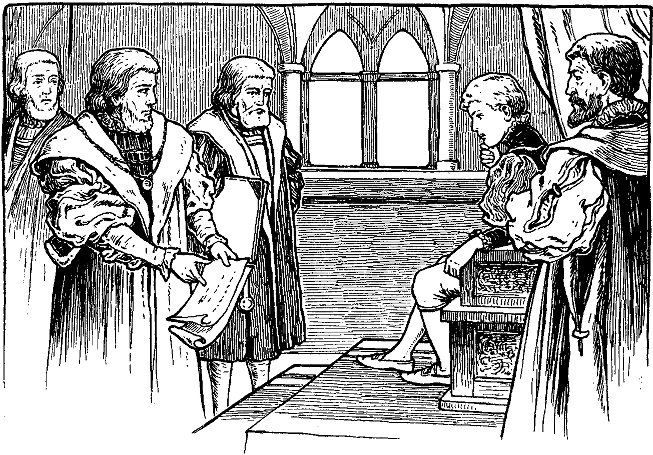

<h2>Vierzehntes Kapitel.</h2>

<h1>Wie Tom sich weiter belehren läßt.</h1>

Gegen Anbruch des nämlichen Tages erwachte Tom aus einem
schweren Schlaf und blickte umher. Es war noch dunkel ringsum.
Eine Weile lag er schweigend da, um seine verworrenen Gedanken
zu sammeln. Plötzlich rief er glückselig aus:

»Ah, nun wird mir alles klar! Gott sei gedankt! Endlich bin ich
erwacht. Fort mit Kummer und Sorgen! Heda, Netty und Betty!
Werft euer Stroh ab und kommt zu mir! Ich will euch den unglaublichsten
Traum erzählen, der je geträumt wurde. Hört ihr nicht,
Netty! Betty!«
 

Eine dunkle Gestalt erschien an seiner Seite und fragte:

»Was geruht Ew. Majestät zu befehlen?«

»Befehlen? ... Ach, weh mir, ich kenne Euere Stimme! Sprecht,
wer bin ich?«

»Wer Ihr seid? Gestern abend wart Ihr Kronprinz, heute aber
mein Lehnsherr, Eduard, König von England.«

Tom barg seinen Kopf in die Kissen und murmelte klagend:

»Ach, es war also doch kein Traum! Geht schlafen, lieber Herr,
und laßt mich allein.«

Tom schlief wieder ein und hatte bald einen angenehmen Traum.
Er glaubte, es sei Sommer und er spiele ganz allein auf einer schönen
Wiese. Da kam ein käsehoher Zwerg mit einem langen Bart und
mächtigem Buckel auf ihn zu und sagte:

»Grabe hier bei diesem Baumstrunk!«

Er tat es und fand zwölf neue glänzende Groschen ... ein nie
gesehener Reichtum. Aber das war noch nicht alles, denn der Zwerg
sprach weiter:

»Ich kenne dich. Du bist ein guter Junge, der es verdient. Dein
Elend soll aufhören, die Stunde der Erlösung ist gekommen. Grabe
hier jeden siebenten Tag und du wirst jedesmal den nämlichen Schatz
finden, zwölf neue glänzende Groschen.«

Darauf verschwand der Zwerg. Tom aber eilte mit seinem
Schatze nach dem Unrathof und überlegte unterwegs:

»Jeden Abend will ich meinem Vater einen Groschen geben.
Dann ist's vorbei mit Hunger und Lumpen, vorbei mit Angst und
Krakehl. Er wird denken, ich habe den Groschen erbettelt. Einen
Groschen jede Woche soll der gute Priester haben, der mich unterrichtet.
Der Mutter, Netty und Betty will ich die übrigen vier
Groschen geben. Im Traum erreichte er ganz außer Atem sein
elendes Heim. Vier Groschen warf er der Mutter in den Schoß
und rief:

»Das ist alles für dich, alles alles! Für dich und Netty und Betty,
und das ehrlich erworben, nicht erbettelt und nicht gestohlen!«

Die erstaunte Mutter umarmte ihn glückselig und rief:

»Es wird spät. Beliebt es Ew. Majestät, Euch zu erheben?«

Ah, das war nicht die Antwort, die er erwartet hatte. Der Traum
war geplatzt wie eine Seifenblase. Er öffnete die Augen. Der erste
Kammerherr kniete an seinem Lager und der arme Junge erkannte,
daß er immer noch ein Gefangener und König sei. Das Gemach füllte
sich mit Höflingen in Purpurmänteln, der damaligen Trauerfarbe.
Tom setzte sich im Bett auf und schaute hinter den schweren seidenen
Vorhängen hervor auf die erlauchte Gesellschaft.

Nach der höchst umständlichen Vollendung seiner Toilette und
dem zeremoniellen Frühstück wurde Tom in den Thronsaal geleitet,
wo er die laufenden Staatsgeschäfte vornehmen sollte. Sein »Onkel«,
Graf Hertford, stand neben dem Thron, um den König mit weisem

Rat zu unterstützen, so daß sich für Tom alles ohne leidigen Zwischenfall
glatt abwickelte.

Hernach verbrachte Tom eine angenehme Stunde mit Fräulein
Elisabeth und Fräulein Johanna Grey, obwohl die beiden Prinzessinen
durch den schweren Schlag niedergedrückt waren, den das
Königshaus erlitten hatte. Schließlich kam auch noch seine ältere
»Schwester«, später die »blutige Maria« genannt, zu einem feierlich-frostigen
Besuch, dessen einziger Vorzug seine Kürze war.

Darauf blieb er sich eine Weile selbst überlassen. Bald aber erhielt
ein schmächtiger Junge von etwa zwölf Jahren Einlaß. Mit 
Ausnahme der schneeigen Halskrause und dem Spitzenarmband kam
er ganz in Schwarz gekleidet. Auf der Schulter trug er ein Scharlachband,
sonst keinerlei Trauerabzeichen. Zögernd kam er näher mit
demütig gebeugtem Kopf und ließ sich vor Tom auf ein Knie nieder.
Tom saß ruhig da und betrachtete ihn prüfend einen Augenblick.
Dann sagte er:

»Erhebe dich, Knabe. Wer bist du? Was wünschest du?« Der
Junge erhob sich und stand in anmutiger Haltung, aber offenbar
bekümmert da. Er erwiderte:

»Ew. Majestät muß sich doch meiner erinnern. Ich bin ja Ew. 
Hoheit Prügeljunge<a href="99_Footnotes.xhtml#rn7" id="rn7">*</a>.«

»Mein Prügeljunge?«

»Ja, Ew. Gnaden. Ich bin Humfrieb, Humfried Marlow.«

Tom war in arger Verlegenheit. Warum hatten ihm aber auch
seine Wärter von diesem Jungen nichts gesagt! Sollte er sich nun
stellen, als kenne er ihn? Aber wie leicht konnte er sich im Verlaufe
des Gesprächs lügenstrafen! Nein, das war also nichts. Da kam er
auf einen Ausweg. Derartige unangenehme Zufälle konnten sich
wiederholen, da ja die beiden Wärter nicht immer an seiner Seite
waren. Er mußte also ein für allemal jemand haben, der ihm über
alles, was er wissen wollte, Auskunft gab. Dazu konnte ihm der Knabe
vielleicht nützlich werden, da er doch ungenierter mit ihm umgehen
konnte, als mit den steifen Lords. Für jetzt aber mußte er diplomatisch
vorgehen. Er fuhr sich also nachdenklich an die Stirn und
sagte:

»Jetzt glaube ich mich deiner zu erinnern. Mein Gedächtnis hat
durch Überanstrengung in den Studien gelitten.«

»Ach, mein armer Herr«, rief der Prügeljunge mitleidig, »wie
sehr mir das leid tut!«

»Es ist ganz sonderbar, wie mein Gedächtnis mich plötzlich im Stich
läßt«, sagte Tom. »Aber beachte es nicht weiter; es bessert sich schon
wieder allgemach. Ein klein wenig Nachhilfe bringt mir bald wieder
in Erinnerung, was ich vergessen habe. Sprich also, was ist dein
Begehren?«

»Die Sache ist für Ew. Majestät von keinem Belang. Wenn Ihr
aber befehlt, so will ich sie Euch dennoch klarlegen. Vor zwei Tagen,
als Ew. Hoheit zwei leichte Fehler im Griechischen machte ... beliebt
Ihr Euch zu erinnern?«

»Ja, ich glaube. Ja, ich erinnere mich. Fahre weiter.«
 

»... da ward der Lehrer ärgerlich über das, was er höchst plumpe,
liederliche Fehler nannte und gelobte, mich gehörig dafür peitschen
zu lassen, und ...«

»Dich peitschen zu lassen?« fragte Tom, vor Verwunderung aus
der Rolle fallend. »Warum sollte er denn dich für meine Fehler
bestrafen?«

»Ach, Ew. Gnaden besinnen sich nicht mehr. Er läßt mich ja immer
züchtigen, wenn Ihr Fehler in Euern Aufgaben macht.«

»Ach ja, ich vergaß. Du gibst mir Privatunterricht, und dann,
wenn ich beim Lehrer Fehler mache, nimmt er an, du hättest mich
nicht gut unterwiesen, und ...«

»O gnädigster Herr, was sprecht Ihr da? Wie sollte ich, der niedrigste
Euerer Diener, dazu kommen, Euch lehren zu dürfen?«

»Ja, dann begreife ich nicht. Wie konntest du denn für meine
Fehler verantwortlich sein? Bin ich denn irrsinnig, oder bist du es?
Erkläre mir dieses Rätsel.«

»Aber, Majestät, nichts ist einfacher. Der geheiligten Person
des Kronprinzen darf niemand zu nahe kommen. Wenn er also
Fehler macht, so muß ich dafür büßen. Und das ist nur recht und
billig, denn das ist mein Amt, das mir den Lebensunterhalt gewährt.«

Tom starrte den Burschen verblüfft an und dachte bei sich: »Das
ist denn doch wunderbar, ein höchst wunderbares und merkwürdiges
Gewerbe. Mich wundert nur, daß man nicht einen Knaben gemietet
hat, der sich für mich ankleiden und kämmen läßt. Das wäre mir noch
weit lieber; gerne würde ich dafür mein eigener Prügeljunge sein.«
Laut aber sagte er:

»Und hast du deine Schläge für meine letzten Fehler schon erhalten,
armer Freund?«

»Nein, Ew. Majestät. Meine Strafe war auf diesen Tag festgesetzt,
und vielleicht wird sie mir erlassen werden, in Anbetracht,
daß es vielleicht nicht geziemend ist in diesen Trauertagen. Ich weiß
es aber nicht, und deshalb war ich so kühn, hieher zu kommen, um
Ew. Hoheit zu erinnern, daß Ihr die Gnade hattet, für mich ein gutes
Wort einlegen zu wollen ...«

»Beim Lehrer? Um dich vor den Schlägen zu retten?«

»Ah, Ihr erinnert Euch?«

»Du siehst, mein Gedächtnis bessert sich. Übrigens beruhige dich.
Du sollst ohne Schläge davonkommen. Dafür will ich sorgen.«
 

»O tausend Dank, mein guter Herr!« rief der Knabe und fiel
wieder auf die Kniee: »Ich fürchtete, ich sei jetzt schon zu weit gegangen,
und dennoch...«

Als Tom sah, daß Humfried nicht wagte, sich auszusprechen, ermutigte
er ihn, fortzufahren.

»Dann werde ich so frei sein, denn es geht mir nahe. Da Ihr
nicht mehr Kronprinz, sondern König seid, so könnt Ihr nach Gutdünken
befehlen, ohne daß es jemand wagt, Einspruch zu erheben.
Und so dachte ich, Ihr werdet Euch wohl nicht länger mehr mit langweiligen
Studien plagen wollen, sondern die Bücher verbrennen.
Dann aber bin ich zu Grunde gerichtet und meine verwaisten Schwestern
dazu.«

»Zu Grunde gerichtet? Wie das?«

»Meine Prügel waren mein Brot, o gnädigster Herr. Wenn ich
keine Prügel mehr bekomme, so hungere ich. Und wenn Ihr das
Lernen aufsteckt, so fällt auch mein Amt dahin, denn Ihr braucht
dann keinen Prügeljungen mehr. Daher wollte ich Euch bitten: verstoßet
mich nicht!«

Tom war gerührt von dieser einfachen Schlußfolgerung. Er
sagte mit königlicher Huld:

»Laß deine Sorge fahren, mein Junge. Dein Amt soll dir bleiben,
dir und deinen Nachkommen.«

Dann gab er dem Knaben einen leichten Schlag auf die Schulter
mit der flachen Klinge seines Schwertes und rief aus:

»Erhebe dich, Humfried Marlow, erblicher Oberprügeljunge des
königlichen Hauses von England! Sei getrost, ich werde mich wieder
hinter meine Bücher setzen und so schlecht studieren, daß man dir
deine Besoldung verdreifachen muß, um sie deinen Prügeln entsprechend
zu machen.«

Mit überströmendem Danke küßte Humfried den Mantelsaum
des Königs und erwiderte:

»O wie danke ich Euch, edelster Herr. Euere fürstliche Freigebigkeit
übersteigt meine kühnsten Träume. Nun werde ich all meine
Lebtage glücklich sein, und nach mir meine Kinder und Kindeskinder.«

Nun forderte ihn Tom auf, ein wenig mit ihm zu plaudern, was
sich dieser nicht zweimal sagen ließ. Glaubte er doch, auf diese Weise
Toms Gedächtnis ein wenig aufhelfen zu können. So kam er auf
alle möglichen Vorgänge und Einzelheiten im früheren Leben des 
wirklichen Prinzen, wie auch der ganzen königlichen Familie und der
Hofhaltung zu sprechen, so daß Tom ein ziemlich klares Bild »seiner«
Vergangenheit und Umgebung gewann. Er entschloß sich, diese
Lektionen fortzusetzen und gab Weisung, Humfried jederzeit vorzulassen,
wenn er selbst nicht anderweitig in Anspruch genommen sei.

Kaum war Humfried entlassen, als Lord Hertford sich melden
ließ. Er kam, um Tom mitzuteilen, daß ein unbestimmtes Gerücht
über den Irrsinn des Königs unter das Volk gedrungen sei. Deshalb
erachte es der Staatsrat für weise, daß der König tunlichst bald,
dem Herkommen gemäß, anfange, vor der Öffentlichkeit zu speisen.
Seine gesunde Gesichtsfarbe, sein kräftiger Gang, die Leichtigkeit
und Anmut seiner Bewegungen werde die öffentliche Meinung am
besten beruhigen.

Sodann bemühte sich der Lord, Tom in taktvoller Weise über
sein Auftreten bei den öffentlichen Mahlzeiten zu belehren. Zu
seinem großen Erstaunen fand er indessen, daß Tom so ziemlich
darüber orientiert war, denn Humfried hatte auch diese Vorgänge
geschildert.

Da Lord Hertford mit Genugtuung diese »Besserung« wahrnahm,
holte er Tom noch weiter aus, in vielen Fällen mit befriedigendem
Erfolg. Dieses gute Ergebnis bewog ihn, Tom zu fragen, ob er
vielleicht jetzt über das rätselhafte Verschwinden des Kronsiegels
Aufschluß geben könne.

Tom geriet in Verwirrung, zumal er gar nicht einmal wußte, was
ein Siegel eigentlich sei. Nach einigem Zaudern entgegnete er:

»Wie schaut es denn aus, mein Lord?«

Enttäuscht sagte sich der Graf: »Ach, sein Geist wandert schon
wieder. Es war unklug von mir, diese Saite zu berühren.« Gewandt
lenkte er das Gespräch, ohne Toms Frage zu beantworten, auf ein
anderes Thema. Auch nahm er sich vor, Tom nie mehr nach dem
Siegel zu fragen.

