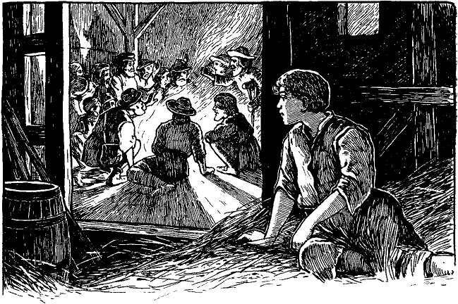

<h2>Siebzehntes Kapitel.</h2>

<h3>Wie Eduard von den Vaganten gekrönt wird.</h3>

Michael Henden suchte indessen eifrig nach seinem Schützling.
Mittels der Erkundigungen, die er auf der Brücke einzog, konnte er
dessen Spur eine Strecke weit verfolgen, dann aber hörte sie plötzlich
auf. Dennoch setzte Henden seine Bemühungen bis in die Nacht
hinein fort. Wegmüde und halb verhungert musste er schließlich
umkehren und seine Herberge wieder aufsuchen. Er nahm ein Abendessen
zu sich und legte sich dann zur Ruhe mit dem Vorsatze, früh am
nächsten Morgen in der Stadt weiter zu forschen.

Während er aber schlaflos dalag, kam ihm ein anderer Gedanke.
Der Knabe, rechnete er, wird den Schurken sicher zu entrinnen suchen.
Wollte er dann in die Stadt zurück, so müsste er Gefahr laufen,
wieder erwischt zu werden. Da er nun keinen anderen Freund und
Beschützer in der Welt hat, als Michael Henden, so wird er sich Mühe
geben, diesen Freund wieder zu finden. Nun weiß er aber, dass ich
sogleich nach Hendenhall aufbrechen wollte. Daher wird er sich
sagen, das sei folglich auch der richtige Weg für ihn. Ja, so würde
es wohl kommen. Daher nahm sich Henden vor, keine Zeit mehr
zu versäumen, sondern tunlichst rasch heimwärts zu reisen. Unterwegs
wollte er ein scharfes Auge auf alle Vorübergehenden haben.
Dieser Gedanke beruhigte ihn ein wenig und brachte ihm den nötigen
Schlummer. Lassen wir ihn nun schlafen, um nachzusehen, was
aus dem entführten kleinen König wurde.

Wie der Kellner sagte, war ein schuftiger Kerl aus der Menge
aufgetaucht und auf Eduard und seinen Entführer losgesteuert. Er
ging aber nicht eigentlich zu ihnen, sondern folgte ihnen dicht auf
dem Fuße, ohne etwas zu sagen. Sein linker Arm lag in der Schlinge
und über dem linken Auge trug er ein großes grünes Pflaster. Er
hinkte ein wenig und gebrauchte einen eichenen Krückstock als Stütze.

Der junge Mann führte den König kreuz und quer durch die
Menge und gelangte endlich auf eine Landstraße. Aber jetzt begann
Eduard zornig zu werden und wollte nicht weiter. Er sagte, es
sei an Henden, zu ihm zu kommen und nicht umgekehrt. Der Jüngling
entgegnete darauf: »Willst du denn hier säumen, während dein
Freund verwundet in dem Walde dort drüben liegt? Mir kann
es gleichgültig sein.«
 

Wie der König solches hörte, war er plötzlich wie umgewandelt.
Heftig rief er aus: »Wie? Verwundet? Und wer hat gewagt, ihn
zu verletzen? Doch das nachher. Nur vorwärts jetzt, vorwärts!
Rascher doch, rascher! Hast du Blei in den Füßen? Also verwundet
ist er? Aber wehe dem Täter! Er soll es bereuen und wäre er
eines Herzogs Sohn!«

Der Wald war nicht so ganz nahe, aber Eduard drängte immerfort,
und so hatten sie ihn bald erreicht. Der junge Mann schaute sich
um, bis er einen Ast in der Erde stecken sah, an dem ein kleiner Lumpen
hing. An dieser Stelle führte er den König tiefer in den Wald.
Dabei gab er acht auf ähnliche Zeichen, die sich in gewissen Zwischenräumen
fanden. Sie sollten ihn offenbar an das gewünschte Ziel
bringen. Endlich gelangten sie an eine Lichtung, wo zerfallene Reste
eines Bauernhauses standen. Daneben lag eine alte Scheune, die
auch nicht mehr viel taugte. Diese betrat der Jüngling und der
König folgte ihm eifrig. Niemand da! Eduard schaute seinen Begleiter
verdutzt und argwöhnisch an und fragte: »Wo ist er?«

Ein spöttisches Gelächter war die Antwort. Einen Augenblick
raste der König. Er nahm ein Holzscheit und wollte auf seinen Entführer
los. Da erscholl auch hinter ihm ein höhnisches Lachen. Es
kam von dem lahmen Schurken, der ihnen gefolgt war, trotz ihres
eiligen Ganges. Der König wandte sich um und sagte zornig: »Wer
bist du? Was hast du hier zu tun?«

»Nun höre endlich auf mit deinen Dummheiten«, sagte der Mann.
»So gut ist doch meine Verkleidung nicht, dass du nicht deinen Vater
darin erkennen könntest.«

»Du bist nicht mein Vater. Ich kenne dich nicht. Ich bin der
König. Du hast meinen Diener versteckt. Schaffe ihn mir her,
oder es soll dir schlecht ergehen.«

Johann Canty erwiderte in ernstem, abgemessenem Tone: »Es
ist klipp und klar, dass du verrückt bist und ich strafe dich also nicht
gerne. Aber wenn du mich noch länger reizest, so zwingst du mich
dazu. Dein Schwatzen kann hier freilich kein Unheil anrichten, wo
dich niemand weiter hört. Aber du tätest doch besser daran, deine
Zunge im Zaume zu halten, denn wir kommen bald in fremde
Quartiere. Ich habe einen Mord begangen und darf also nicht
wieder heim, und du auch nicht, denn ich brauche deine Dienste.
Meinen Namen habe ich aus guten Gründen geändert und heiße
jetzt Johann Hobbs. Dein Name ist Hans; merke es dir. Nun 
aber sprich: wo ist deine Mutter? Wo sind deine Schwestern? Sie
kamen nicht an den bezeichnten Ort. Weißt du, wohin sie gingen?«

Der König antwortete finster: »Komm mir doch nicht mit diesen
Albernheiten. Meine Mutter ist tot; meine Schwestern sind im Palast.«

Der junge Mann, der daneben stand, lachte laut auf. Der König
wollte ihn züchtigen, aber Hobbs vertrat ihm den Weg und sagte:
»Ruhig, Hugo, ärgere ihn nicht. Er ist nicht bei Verstand, und du

reizest ihn nur unnötig. Setze dich, Hans, und sei still. Du sollst
auch einen Bissen zu essen bekommen.«

Hobbs und Hugo sprachen hierauf leise mit einander, und der
König zog sich in die entfernteste Ecke der Scheune zurück. Hier
legte er sich auf Stroh und war bald in Gedanken versunken.

Sein Kummer war mannigfaltig. Aber was ihn am meisten
schmerzte, war der Verlust seines Vaters. Während es alle anderen
Leute kalt überlief, wenn sie nur den Namen Heinrichs des Achten
hörten, besaß Eduard nur angenehme Erinnerungen an seinen Vater.
Die Tränen, die unaufhaltsam über seine Wangen strömten, zeugten
von dem aufrichtigen, tiefen Schmerz über dessen Tod.
 

Lange gab er sich seiner qualvollen Grübelei hin. Als er endlich
wieder zum Bewusstsein seiner jetzigen Lage kam, hörte er zu
Häupten den Regen plätschernd auf das Dach niederstürzen. Er
hüllte sich fester in sein Stroh, und ein Gefühl behaglicher Wärme
durchströmte seinen Körper. Im nächsten Augenblick aber vernahm
er ein lautes Stimmengewirr und rohes Gelächter. Erschrocken fuhr
er auf und schaute umher. Ein großes Feuer brannte in der Tenne
am andern Ende der Scheune. Ringsherum lagerten und lungerten
zerlumpte Gesellen, auch Weiber, hell beleuchtet von dem Lagerfeuer.
Die Männer waren von hoher Gestalt, sonngebräunt, langhaarig
und in phantastische Lumpen gehüllt. Auch junge Leute waren
dabei, von liederlichem Aussehen und ähnlich gekleidet. Einige hatten
Pflaster oder Binden über die Augen; andere waren verkrüppelt
und hatten hölzerne Beine und Krücken. Wieder andere waren
triefäugig oder hatten allerlei andere Gebrechen. Ein schurkisch aussehender
Hausierer war auch da, ebenso ein Scherenschleifer, ein
Kesselflicker und ein Barbier mit ihrem Handwerkszeug. Die weibliche
Gesellschaft bestand aus halbwüchsigen und erwachsenen Mädchen,
wie auch aus alten runzeligen Hexen. Alle aber waren großmäulig,
unverschämt, schmutzig und schlumpig. Drei skrofulöse Kinder
waren in ihrer Mitte, und ein paar ausgehungerte Köter lagen herum,
welche die Aufgabe hatten, die Blinden zu führen.

Die Nacht war hereingebrochen. Die Bande war eben mit
Essen fertig geworden und nun begann das Trinkgelage. Eine
Kanne Schnaps ging von Mund zu Mund. Dazu sangen sie
rohe Gassenhauer und Räuberlieder, erst einzeln, dann alle zusammen.

Schließlich begann ein allgemeines Gespräch, aber nicht in der
damals üblichen Gaunersprache. Diese wandten sie nur an, wenn sie
belauscht zu werden fürchteten. Aus dieser Unterhaltung entnahm
der König, dass Hobbs oder Canty kein neues Mitglied dieser Landstreicher
war, sondern der Bande schon früher angehört hatte. Man
fragte ihn nach seinen seitherigen Erlebnissen. Er gab kurzen Bericht
über das, was ihm widerfahren sei, und erklärte, von nun an
wieder treu zu ihnen halten zu wollen. Seine alten Bekannten
schüttelten ihm die Hand, und die neuen Mitglieder wurden ihm
vorgestellt. Man forschte, warum er solange weggeblieben sei. Er
antwortete: »London ist in den letzten Jahren besser und sicherer geworden,
als das Land. Die Gesetze sind streng und werden kräftig 
gehandhabt. Hätte ich nicht den Unfall mit dem Priester gehabt, so
wäre ich noch in der Stadt. Ich hatte mir schon vorgenommen,
sie nicht wieder zu verlassen.«

Nun erkundigte er sich nach einzelnen ehemaligen Mitgliedern
der Bande und meinte: »Ich sehe den alten Wen nicht mehr unter
diesen ehrlichen Leuten. Wo mag er stecken?«

»Der arme Bursche!« erwiderte der Hauptmann. »Er hatte
immer einen sonderbaren Geschmack. Jetzt nährt er sich in der Hölle
von heißem Schwefel. Er wurde um Johannis herum in einem
Streit erschlagen.«

»Das soll mir leid tun. Wen war ein tüchtiger Mann und braver
Geselle.«

»Ja, das war er. Die »Schwarze Liese«, seine Gespanin, gehört
noch zu uns, »arbeitet« aber zur Zeit im Osten. Ein feines Mädchen
das, manierlich und sittsam, denn nie sah man sie mehr als vier Tage
in der Woche betrunken.«

»Ja, sie hielt was auf sich; ich weiß das noch wohl. Es war ein
braves Weibsmensch und aller Ehren wert. Ihre Mutter war nicht
so ängstlich und eigen, eine störrische, übellaunige Dame, aber mit
einem ungewöhnlichen Mutterwitz behaftet.«

»Das war auch ihr Verderben. Sie war eine so schlaue Wahrsagerin
und Wetterprophetin, dass sie schließlich in den Ruf einer
Hexe kam. Das Gesetz röstete sie also über einem langsamen Feuer
zu Tode. Es rührt mich jetzt noch, wenn ich daran denke, wie tapfer
sie ihr Schicksal ertrug. Sie schmähte und verwünschte noch die sie
umgaffende Menge, während die Flammen schon an ihrem Gesicht
heraufleckten, nach ihrem spärlichen Haar züngelten und schließlich
über ihren alten grauen Kopf hinknisterten. Und wie sie den Pöbel
verwünschte! Wenn du tausend Jahre alt würdest, so meisterhaft
schimpfen könntest du immer noch nicht. Ach, ihre Kunst starb mit
ihr. Was man jetzt noch an Schimpfereien hört, ist nur schwache,
erbärmliche Nachahmung.«

Der Hauptmann seufzte, und seine Zuhörer taten desgleichen.
Eine allgemeine Niedergeschlagenheit befiel die Gesellschaft. Auch
dieser Abschaum der Menschheit ist nicht ganz abgestumpft. Unter
günstigen Umständen geht ein schmerzliches Ereignis nicht einmal
an solchen Ausgestoßenen ohne Eindruck vorüber. So auch hier,
wo die Vaganten den Verlust eines Schimpfgenies betrauerten, das
keinen Erben hinterließ.
 

Bald aber stellte ein kräftiger Schluck aus der Kanne die frühere
gute Laune wieder her.

»Ist es noch anderen von unseren Kameraden schlecht ergangen?«
fragte Hobbs.

»Einigen, ja. Besonders solchen, die frisch bei uns eingetroffen
sind. Ein paar Kleinbauern, welche hilflos und hungrig herumirrten,
weil man ihnen die Pachtgüter genommen hat, da sie bei
den schlechten Jahren und hohen Abgaben den Zins nicht mehr
bezahlen konnten. Sie fingen zu betteln an, wurden erwischt, bis
auf die Lenden entblößt und ausgepeitscht. Dann legte man sie
in den Stock, oder sie kamen in die Tretmühle. Nachher ließ man sie
wieder gehen. Sie bettelten wieder, wurden wieder ausgepeitscht
und eines Ohres beraubt. Sie bettelten nochmals. Was sollten
die armen Teufel auch anderes tun? sie mussten doch leben. Jetzt
wurden ihre Wangen mit einem rotglühenden Eisen gezeichnet, und
sie selbst als Leibeigene verkauft. Liefen sie davon, so wurden sie
mit Bluthunden gehetzt, niedergeworfen und gehängt. Das ist ganz
einfach und erzählt sich rasch. Andere kamen besser weg. Tretet einmal
näher, Jokel, Brand und Hotsch und zeigt euere Verzierungen!«

Die genannten Männer standen auf, streiften ihre Lumpen teilweise
ab, und entblößten ihre Rücken, die kreuz und quer von blutigen
Striemen durchfurcht waren. Einer zeigte die Stelle, wo einmal
sein linkes Ohr gewesen war. Ein anderer entblößte ein Brandmal
auf der Schulter, das den Buchstaben V (Vagabund) darstellte.
Wieder einer sprach: »Ich bin Jokel, einst ein wohlhabender Bauer,
hatte ein liebes Weib und brave Kinder. Weib und Kinder sind
dahin, vielleicht im Himmel, vielleicht anderswo, aber, Gott sei Dank!
wenigstens nicht mehr in England. Meine gute alte makellose Mutter
verdiente sich ihr Brot als Krankenpflegerin. Einer von ihren Kranken
starb, die Ärzte wussten nicht woran. Daher wurde meine Mutter
als Hexe verbrannt, während meine Kinder wehklagend zuschauten.

»Ihr alle, die ihr da seid, stoßt an und trinkt auf das barmherzige
englische Gesetz, welches meine Mutter wenigstens von der Hölle
in England befreite! Dank euch, Kameraden!«

»Unsere Besitztümer wurden eingezogen, war doch die Hexe meine
Mutter gewesen! Arm und elend jagte man uns alle vom Hof.
Ich bettelte von Haus zu Haus um Arbeit. Aber niemand wollte
uns aufnehmen. Da bettelte ich um ein Stück Brot für meine Frau
und mich und die hungrigen Kleinen auf dem Arm. Aber in England
ist es ein Verbrechen, hungrig zu sein, und so peitschten sie uns
aus und trieben uns von Dorf zu Dorf.

»Stoßt wieder an, Kameraden, und trinkt auf das barmherzige englische
Gesetz! Denn die Peitschenhiebe befreiten bald meine arme
Marie von aller irdischen Drangsal. Dort liegt sie auf dem Töpferfelde
drüben, aller Leiden ledig.«

»Und die Kleinen, nun, die hungerten eben, während ich weiter
und weiter gepeitscht wurde.«

»Trinkt noch einmal, Burschen, nur einen Tropfen noch, einen
Tropfen aufs Wohl der armen Kleinen, die nie einem Geschöpfe
Leides getan!

»Ich bettelte wieder, bettelte um eine armselige, vertrocknete
Krume Brot, wurde krumm geschlossen und verlor ein Ohr. Hier
könnt ihr den Stumpf sehen. Ich bettelte noch einmal. Hier, dieser
andere Stummel zeugt davon. Und als ich zum letztenmal bettelte,
ward ich als Sklave verkauft. Hier auf meiner Wange unter diesem
Pflaster könnt ihr das rote »S« noch sehen. Ein Sklave, ein Leibeigener!
Wisst ihr, was das heißen will? Doch ich will euch nicht
ermüden. Ich entrann meinem Herrn. Wenn man mich findet,
dann verurteilt mich das Gesetz zum Galgen.«

Eine laute Stimme drang vom anderen Ende der Scheune her:
»Du sollst nicht hängen! Von heute an ist das Schicksal dieses Gesetzes
entschieden!«

Alle wandten sich um und erblickten die phantastische Gestalt des
kleinen Königs, der eilends herbeikam.

Wie er in das Licht des Lagerfeuers trat, gab es ein allgemeines
Durcheinander von Fragen: »Wer ist das? Was ist er? Wer bist
du, kleines Männchen?«

Verwirrt stand der Knabe unter all diesen erstaunten und fragenden
Leuten. Dann antwortete er würdevoll: »Ich bin Eduard, der
König von England!«

Hell auf lachte die Bande, halb spöttisch, halb vergnügt über
diesen vermeintlichen Scherz. Der König war verletzt. Er sagte
scharf: »Ihr sittenlose Vaganten, ist das euer Dank für die Gnade,
die ich euch soeben verheißen habe?«

Noch mehr sprach er mit zorniger Stimme und erregten Gebärden,
aber es ging verloren in dem stürmischen Durcheinander von Lachen
und spöttischen Zwischenrufen. Hobbs versuchte mehrmals, Ruhe
zu schaffen. Als es ihm endlich gelang, sagte er: »Kameraden, das 
ist mein Sohn, ein Träumer, ein verrückter Narr. Gebt nicht acht
auf ihn. Er glaubt steif und fest, er sei der König.«

»Ich bin der König«, erklärte Eduard, »wie du bald zu deinem
Schaden erfahren wirst. Du hast einen Mord begangen und sollst
dafür büßen.«

»Du willst mich verraten, du? Dir werd' ich komm ...«

»Nur sachte«, fiel der Hauptmann, ein wahrer Hüne, in die Rede.
Zugleich stellte er sich schützend vor den Knaben und schleuderte
Hobbs mit kräftiger Faust zur Erde. »Hast du weder vor einem
König noch vor einem Hauptmann Achtung? Wenn du dich noch
einmal in meiner Gegenwart so aufführst, so hänge ich dich eigenhändig
am nächsten Baume auf.«

Dann wandte er sich an den kleinen König: »Du darfst nicht
Drohungen gegen deine Kameraden ausstoßen, Bursche, und auch
nicht anderswo böse von ihnen reden. Sei, was du willst, wenn es
dir Spaß macht, aber lass dich dadurch nicht zu Ausschreitungen hinreißen.
Auch den »König« lass beiseite, wenn ich dir gut zu rate bin.
Es ist Hochverrat. Wenn wir auch in einigen Kleinigkeiten im
Widerspruch mit dem Gesetz stehen, so ist doch keiner unter uns, der
so gemein wäre, den Verräter am König zu spielen. Wir sind
königstreue Untertanen. Das sollst du gleich sehen. Auf, ihr alle,
und ruft mit mir: »Lang lebe Eduard, König von England!«

»Lang lebe Eduard, der König von England!«

Wie mit Donnergewalt erfüllte der Hochruf den weiten Bau.

Des jungen Königs Augen leuchteten auf. Er verbeugte sich leicht
und sagte ernst und einfach: »Ich danke euch, meine guten Leute!«

Diese unerwartete Antwort rief eine unbändige Heiterkeit hervor.
Alle wälzten sich oder hielten sich den Bauch vor Lachen.
Als wieder ein wenig Stille eingetreten war, sagte der Hauptmann
fest, aber doch gutmütig: »Lass das sein, Junge, es ist weder klug
noch gut. Bilde dir meinetwegen ein, was du willst, aber wähle
dir einen anderen Titel.«

Ein Kesselflicker hatte eine Eingebung und meinte: »Fufu der
Erste, König der Mondkälber!«

Der Titel zog sogleich; aus allen Kehlen erscholl der Ruf: »Lang
lebe Fufu, der Erste, König der Mondkälber!«

Dann folgte Pfeifen, Katzenmusik und stürmisches Gelächter.

»Führt ihn fort und krönt ihn!«

»Kleidet ihn in Purpur!«
 

»Gebt ihm ein Zepter!«

»Setzt ihn auf den Thron!«

Diese und zwanzig andere Rufe mischten sich durcheinander. Bevor
das arme kleine Opfer sich auch nur sträuben konnte, hatte er als
Krone ein Zinnbecken auf dem Kopf, war in eine zerlumpte Decke
gehüllt, auf eine Tonne gesetzt und erhielt als Zepter das Lötrohr
des Kesselflickers. Dann warfen sich alle um ihn herum auf die Knie,
brachten jammervolle Klagen und Bitten vor, während sie sich mit
ihren schmutzigen, zerlumpten Ärmeln und zerfetzten Schürzen die
Augen wischten: »O sei uns gnädig, du lieber König!«

»Trample nicht herum auf deinen vor dir im Staube kriechenden
Würmern, o gnädigster Herr!«

»Erbarme dich deiner Sklaven und tröste sie mit einem königlichen
Fußtritt!«

»Freue und erwärme uns mit den Strahlen deiner Gnade, o
flammende Sonne des Herrschertums!«

»Heilige den Boden durch eine Berührung deines Fußes, auf dass
wir den Staub essen mögen und dadurch geadelt werden!«

»Geruhe, o Majestät, auf uns zu speien, damit noch unsere Kindeskinder
von deiner fürstlichen Herablassung erzählen, sich deiner Gnade
rühmen und für immer glücklich sein können!«

Der lustige Kesselflicker aber schoss doch den Vogel ab und trug
den Preis davon. Er kniete vor dem König nieder und tat, als
wollte er ihm den Fuß küssen. Als Antwort erhielt er darauf, wie
erwartet, einen derben Tritt von Eduard. Der Kesselflicker stand auf
und erbat sich von den Umstehenden einen Lumpen. Damit bedeckte
er das Gesicht an der Stelle, wo ihn der Fuß des Königs berührt
hatte. »Diese Stelle«, sagte er, »muss sorgfältig vor der Berührung
mit der gemeinen Luft bewahrt werden, denn sie verhilft
mir zu einem Vermögen. Ich will damit hingehen in die Städte
und auf die Landstraßen und jedermann soll die Wunde gegen ein
Schaugeld von fünfzig Kronen sehen können.«

Er machte seine Sache so gut, dass er den Neid und die Bewunderung
der ganzen Bande erregte.

Tränen der Scham und der Entrüstung standen in den Augen des
kleinen Monarchen und er dachte in seinem Herzen: »Hätte ich ihnen
das schwerste Unrecht angetan, sie könnten nicht grausamer gegen
mich sein. Nun aber habe ich ihnen nur Gutes erweisen wollen,
und dafür lohnen sie mich also.«

