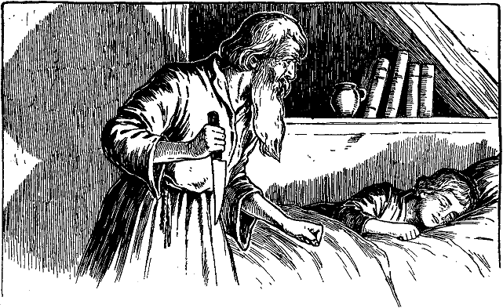

<h2>Zwanzigstes Kapitel.</h2>

<h1>Wie Eduard einem Erzengel in die Hände fällt.</h1>

Ein hoher Hag machte ihn vom Hause aus unsichtbar. Spornstreichs
jagte er dahin, einem nahen Walde zu. Er schaute sich nicht
um, bis ihn die Bäume in ihren Schutz nahmen. Jetzt blickte er
zurück und sah, wie zwei Gestalten hinter ihm hereilten. Mehr verlangte
er nicht zu sehen, sondern eilte weiter, kreuz und quer, durch
den dunklen Tann. Endlich glaubte er sich gerettet. Er lauschte
angestrengt, aber eine tiefe Stille herrschte ringsum, die beinahe
beängstigend war. Nur aus weiter Ferne drang manchmal ein
schwacher Ton bis zu ihm, der so hohl und geheimnisvoll klang, wie
das leise Klagen einer abgeschiedenen Seele.

Erst wollte er für den Rest des Tages sich hier verborgen halten;
aber es fröstelte ihn, und er musste weiter, um sich warm zu halten.
Er schritt jetzt immer gerade aus, um so eher an eine begangene
Straße zu kommen. Aber der Wald schien kein Ende zu nehmen.
Schneller eilte er vorwärts, nur um nicht an diesem unheimlichen
Ort übernachten zu müssen. Das Dickicht wurde immer unwegsamer
und die Dunkelheit stärker. Er stolperte über Baumwurzeln, verwickelte
sich in Schlinggewächse und verwundete sich an Dornen.
Wie froh atmete er auf, als er endlich einen Lichtschimmer zwischen 
den Bäumen hindurch bemerkte. Behutsam trat er vorwärts und
lauschte. Das Licht drang aus dem ungeglasten Fenster einer armseligen
kleinen Hütte. Jetzt wurde auch eine Stimme hörbar, bei
deren Ton Eduard wegrennen und sich verbergen wollte. Als er
aber vernahm, dass die Stimme betete, fasste er wieder Mut. Er
schlich an das eine Fenster und lauschte. Dann erhob er sich auf
die Fußspitzen und warf einen verstohlenen Blick hinein.

Das Gemach war nur klein, der Fußboden aus Lehm gestampft.
In einer Ecke stand ein Binsenlager und eine oder zwei abgenutzte
Decken lagen darauf. Dabei standen verschiedene Gefäße, Töpfe und
Pfannen. Auch eine schmale Bank und ein dreibeiniger Stuhl waren
da. Auf dem Herde glommen noch die Überreste eines Reisigbündels.
Vor einem kleinen Altarschrein, der mit einer einzigen Kerze beleuchtet
war, kniete ein bejahrter Mann. Neben ihm auf einem alten hölzernen
Gestell lag ein offenes Buch und ein Totenschädel. Der Mann war
von hoher Gestalt und starkknochig. Sein Haar und Backenbart waren
lang und schneeweiß. Sein Gewand bestand aus Schafsfellen und
reichte ihm vom Halse bis auf die Fersen.

»Ein frommer Einsiedler!« dachte sich der König; »das habe ich
gut getroffen.«

Der Klausner erhob sich von den Knien, und der König pochte
an die Tür. Eine tiefe Stimme antwortete: »Tritt ein, aber lass
die Sünde hinter dir, denn der Boden, auf dem du stehen wirst, ist
heilig.«

Der König trat ein. Der Eremit richtete seine unruhig leuchtenden
Augen auf ihn und fragte: »Wer bist du?«

»Ich bin der König.«

»Willkommen, König!« rief der Einsiedler begeistert. Dann
machte er sich mit fieberhafter Eile allerlei zu tun und wiederholte
fortwährend: »Willkommen, willkommen!« Er stellte dem König
die Bank hin, nahe an den Herd und warf ein neues Bündel Reisig
auf das Feuer. Hierauf ging er mit nervösen Schritten im Gemach
auf und ab.

»Willkommen! Manche haben dieses Heiligtum aufgesucht, aber
sie waren dessen nicht würdig und wurden verworfen. Ein König
aber, der seine Krone ablegt und den eitlen Thronenflitter verachtet,
seine Glieder in Lumpen hüllt, um sein Leben der Heiligung und
Abtötung des Fleisches zu weihen, der ist würdig, der ist willkommen!
Hier soll er wohnen all seine Tage, bis der Tod ihn holt.«
 

Der König wollte ihn unterbrechen und ihm den wahren Sachverhalt
erklären. Aber der Eremit ließ ihn nicht zum Worte kommen,
ja, er hörte ihn augenscheinlich nicht einmal. Mit erhobener Stimme
und größerem Nachdruck fuhr der Greis fort: »Und du sollst im
Frieden hier weilen. Niemand soll die Stätte deiner Zurückgezogenheit
auffinden, um dich zurückzulocken in das leere, hohle Leben,
das Gott dich aufzugeben hieß. Hier sollst du beten. Du sollst das
Buch der Bücher studieren. Nachdenken sollst du über die Nichtigkeit,
Torheit und Täuschung dieser Welt und die Erhabenheit der
zukünftigen Welt. Du sollst dich nähren von Krumen und Kräutern,
täglich deinen Leib mit Geißeln peitschen zur Reinigung deiner Seele.
Ein härenes Gewand sollst du auf der bloßen Haut tragen und
Wasser soll allein deine Lippen netzen. Im Frieden sollst du leben,
in heiligem Frieden. Jeder, der des Weges kommt, um dich zu suchen,
soll enttäuscht deine Hütte verlassen. Er soll dich nicht haben, nicht
stören in deiner Andacht!«

Immer noch durchmaß der alte Mann aufgeregt das Zimmer.
Aber jetzt murmelte er nur noch vor sich hin. Der König benutzte
diese Pause, um die Sachlage klarzustellen. Aber der Eremit gab
gar nicht darauf acht und murmelte weiter. Dann trat er wieder
an den König heran und sagte nachdrücklich: »Still! Ich will dir
ein Geheimnis sagen.«

Er beugte sich nieder zum Ohre des Königs, aber stockte dann
einen Augenblick und nahm eine lauschende Haltung an. Dann ging
er auf den Zehenspitzen ans Fenster, steckte den Kopf hinaus und
schien das Halbdunkel durchdringen zu wollen. Darauf kam er
wieder auf den Fußspitzen zurück, brachte seinen Mund ganz nahe
an das Ohr des Königs und flüsterte: »Ich bin ein Erzengel.«

Der König fuhr erschrocken auf und sagte bei sich: »Wollte Gott,
ich wäre wieder bei den Vaganten! Jetzt bin ich als Gefangener
eines Irrsinnigen noch schlimmer daran.«

Seine Furcht prägte sich deutlich in seinen Zügen aus. Das
bemerkte der Eremit, deutete es aber falsch und fuhr mit leiser, erregter
Stimme fort: »Ich sehe es, du schreckest zurück in heiliger
Scheu vor meiner Nähe. Deine Gestalt erbebt. Niemand betritt
diese Atmosphäre, ohne Furcht zu empfinden, denn es ist die eigentliche
Luft des Himmels. Ich versetze mich in die himmlischen Gefilde
und kehre von dort zurück in einem Augenzwinkern. An dieser
Stelle hier ward ich vor fünf Jahren zum Erzengel erkoren, und 
zwar kamen Engel vom Himmel, um mir diese erhabene Würde zu
übertragen. Blendendes Licht erfüllte dieses Gemach, solange sie
hier weilten. Und sie knieten vor mir, o König, ah, sie knieten vor
mir, denn ich war größer als sie. Ich bin gewandelt in den Höfen
des Himmels und habe mich mit den Patriarchen unterhalten. Hier,
berühre meine Hand -- fürchte dich nicht -- bloß berühren sollst du
sie. So, nun hast du eine Hand berührt, welche von Abraham,
Isaak und Jakob berührt worden ist. Ja, ich wandelte in den goldenen
Höfen und schaute die Gottheit von Angesicht zu Angesicht!«

Er hielt inne, um diesen Worten mehr Nachdruck zu geben. Dann
veränderten sich plötzlich seine Züge. Er starrte wieder vor sich hin
auf die Erde und fuhr zornig fort: »Ja, ich bin ein Erzengel, ein
bloßer Erzengel. Und ich hätte doch wahrlich Papst sein können!
Vor zwanzig Jahren sagte es mir der Himmel in einem Traum.
Ja, Papst hätte ich werden sollen! Und ich wäre es auch geworden,
hatte es doch der Himmel verheißen! Aber der König hob mein
Kloster auf, und ich wurde als armer, obdachloser, freundloser Mönch
in die Welt hinausgestoßen und so um meine glänzende Zukunft
betrogen!«

Er fiel wieder in unverständliches Gemurmel und schlug sich die
Stirn in machtloser Verzweiflung. Dann und wann kam etwas
heraus wie eine heillose Verwünschung, und dann stöhnte er wieder:
»Warum bin ich doch nichts als ein Erzengel, ich, der ich hätte Papst
sein sollen!«

So ging es fort, wohl eine Stunde lang, während der arme
kleine König angstvoll dasaß. Auf einmal aber wurde der Einsiedler
ruhig und sanft. Er fiel herab aus seinem Himmel und wurde wieder
Mensch. So einfach und gemütlich plauderte er jetzt, dass Eduard
alle Furcht verlor und ihm sein ganzes Herz zuwandte. Der alte
Mönch brachte den Knaben näher ans Feuer und machte es ihm
möglichst bequem. Er verband ihm seine Schrammen und Schrunden
mit geschickter und zarter Hand. Dann rüstete er ein Abendessen, während
er immerfort plauderte.

Ganz vertraut und vergnügt nahmen sie zusammen ihr Mahl ein.
Hierauf betete der Eremit vor seinem kleinen Altar und brachte dann
den Knaben in einem anstoßenden kleinen Zimmerchen zu Bette.
So sorgsam und liebevoll deckte er ihn zu, wie es eine Mutter kaum
besser gemacht hätte. Schließlich küsste er ihn auf die Stirn und
verließ ihn. Draußen setzte er sich am Feuer nieder und stocherte 
wie geistesabwesend in der Glut herum. Plötzlich hielt er inne,
tippte sich mehrmals mit dem Finger an die Stirn, als suche er
etwas in sein Gedächtnis zurückzurufen. Augenscheinlich aber glückte
es ihm nicht. Jetzt stand er rasch auf, ging wieder in das Zimmer
seines kleinen Gastes und fragte: »Du bist also König?«

»Ja«, antwortete Eduard mit schläfriger Stimme.

»Was für ein König?«

»König von England.«

»Von England? Dann wäre also Heinrich tot?«

»Ach, leider. Ich bin sein Sohn.«

Finster runzelte der Einsiedler die Stirn. Er stand eine Weile
da, atmete hastig und schluckte, als könne er die Worte nicht herausbringen.
Endlich sagte er mit heiserer Stimme: »Weißt du, dass
er es war, der uns aus dem Kloster ins Elend der Welt hinausjagte?«

Es erfolgte keine Antwort. Der alte Mann beugte sich über den
Knaben, der sanft eingeschlummert war. »Er schläft schon fest«,
murmelte der Eremit. Die Runzeln verschwanden von seiner Stirn
und aus den Augen fuhr ein böser Blick. Dann betrachtete er mit
zufriedenem Lächeln die Züge des Knaben und wandte sich ab.
Leise schlich er umher und suchte nach etwas. Von Zeit zu Zeit
blieb er wieder stehen und lauschte den Atemzügen seines Gastes,
während er immer vor sich hinbrummte. Endlich fand er, was er
wünschte, nämlich ein rostiges altes Fleischermesser und einen Schleifstein.
Jetzt stahl er sich wieder an seinen Feuerherd zurück, setzte sich
nieder und begann das Messer sachte und geräuschlos auf dem Wetzstein
zu schleifen. Draußen stöhnte der Wind um die lotterige Hütte.
Waghalsige Mäuse guckten aus ihren Löchern hervor nach dem alten
Mann, der über seiner Beschäftigung und seinen Gedanken für alles
andere unempfindlich war.

Zeitweilig prüfte er mit dem Daumen die Schneide des Messers
und nickte dann befriedigt: »Es wird schärfer«, flüsterte er, »ja, es
wird schärfer.«

Ruhig schliff er weiter, und seine rastlos wandernden Gedanken
kleideten sich zuweilen in Worte.

»Sein Vater brachte uns Unheil, er vernichtete uns. Und jetzt
ist er hinuntergefahren ins höllische Feuer. Ja, hinunter ins höllische
Feuer. Unserer Rache ist er entgangen, aber es war Gottes Wille.
Wir dürfen uns darüber nicht aufhalten. Aber dem Höllenfeuer ist 
er nicht entronnen, dem verzehrenden, mitleidlosen, unerbittlichen
Feuer der Hölle, das in Ewigkeit fortdauert.«

Und weiter arbeitete und murmelte er. Dann sprach er wieder
vernehmbar: »Ja, sein Vater war es, der das verbrach. Und ich
bin nur ein Erzengel! Seine Schuld ist es, dass ich nicht Papst geworden
bin.«

Der König rührte sich. Behutsam eilte der Eremit an das Bett
des kleinen Fremdlings, ließ sich auf die Knie nieder und beugte
sich mit aufgehobenem Messer über den Daliegenden. Der Knabe

regte sich wieder. Seine Augen öffneten sich einen Augenblick lang,
aber es war kein Leben in ihnen. Sie konnten nichts sehen. Gleich
darauf kündete ein ruhiges Atmen, dass der König wieder eingeschlummert
war.

Eine Weile blieb der Einsiedler noch da und lauschte und wagte
kaum, Luft zu schöpfen. Dann erhob er sich und schlich wieder in
sein Zimmer zurück.

»Mitternacht ist längst vorbei«, sagte er, »besser ist es, wenn er
gar nicht zum Schreien kommt. Es könnte zufällig jemand draußen
vorüber gehen.«

Er glitt in seiner Hütte herum, nahm hier etwas und dort etwas
und kehrte damit ins Zimmer des Königs zurück. Es gelang ihm, 
seinem kleinen Gaste die Knöchel zusammen zu binden, ohne ihn
selbst zu wecken. Dann versuchte er ihm auch die Handgelenke zu
schnüren. Aber der Knabe zog immer im letzten Augenblicke noch die
eine oder andere Hand zurück. Der Erzengel wollte schon verzweifeln,
als plötzlich der Knabe selbst die Hände faltete, die im nächsten Augenblick
gebunden waren. Nun legte der Einsiedler eine Binde unter
das Kinn des Schläfers, zog sie über den Kopf herauf und band sie
fest. Auch das nahm er so sanft und geschickt vor, dass der Knabe
ungestört weiter schlief.

