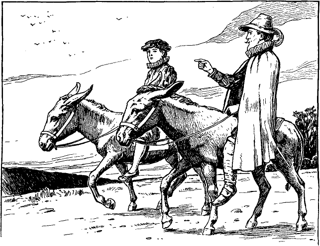

<h2>Fünfundzwanzigstes Kapitel.</h2>

<h3>Wie Henden in Hendenhall aufgenommen wird.</h3>

Sobald Henden und der König dem Schutzmann aus den Augen
gekommen waren, eilten sie aus der Stadt. Dort wies der Ritter
seinem Schützling eine Stelle an, wo er bleiben und auf ihn warten
sollte. Er selbst kehrte in die Stadt zurück, um im Gasthaus seine
Zeche zu ordnen und seine Esel abzuholen.

Eine halbe Stunde später trotteten die beiden Freunde auf
Hendens Eseln munter gen Osten zu. Der König hatte seine alten
Lumpen weggeworfen und sich in die warmen Kleider gehüllt, welche
ihm Henden auf der Londoner Brücke gekauft hatte.

Der Ritter wollte den Knaben nicht überanstrengen. Er war
der Meinung, scharfe Tagesritte, unregelmäßige Mahlzeiten und
ungenügender Schlaf müßten für seinen kranken Geist unzuträglich
sein. Er gedachte also, nur kurze Stationen zu machen, so sehr er
sich auch sehnte, sein väterliches Heim baldmöglichst zu erreichen.

Nach einem Ritt von etwa zehn Meilen kamen die beiden Wanderer
in ein ansehnliches Dorf und nahmen dort in einem guten
Gasthaus Herberge. Die früheren Beziehungen wurden wieder
aufgenommen. Henden stand, während der König speiste, hinter
dessen Stuhl und bediente den Knaben. Er entkleidete ihn, als er
schlafen wollte, und schlief selbst wieder auf dem Fußboden quer
vor der Tür, wo er sich in eine Decke einhüllte.

Die nächsten Tage trabten sie lässig dahin, sprachen von ihren
gegenseitigen Abenteuern und ergötzten sich daran. Henden erzählte
von den Kreuz- und Querritten, die er unternommen hatte, um den
König wieder zu finden. Er berichtete auch, wie ihn der Erzengel
über Stock und Stein durch den ganzen Wald und schließlich wieder
nach der Hütte zurückgeführt habe, als er sah, daß er den Ritter
anders nicht los werden könne. »Darauf«, erzählte er, »ging der
alte Mann ins Schlafzimmer. Gleich nachher kam er aber wankend
und mit verstörtem Gesicht zurück und sagte, er habe geglaubt, der
Knabe wäre heimgekommen und hätte sich schlafen gelegt. Aber 
<@pagebreak/>
es sei niemand da. Den ganzen Tag über wartete ich in der Hütte.
Dann ging ich meines Weges, um Euch zu suchen. Auch der Klausner
machte sich wieder auf, um nach Euch zu forschen. Ich schied von
ihm, da wir in verschiedener Richtung nach Euch ausspähen wollten.
Ihr hättet nur sehen sollen, wie dieses alte Sanctum Sanctorum
über Euer Ausbleiben trostlos war!«

»Das will ich wohl glauben«, sagte der König und erzählte, was
der Einsiedler mit ihm vorgehabt habe. Henden wunderte sich nicht

übel und bedauerte nur, daß er es nicht gewußt habe, sonst wäre
er dem Erzengel zu leibe gegangen.

Der letzte Tag ihrer Reise kam heran. Henden war in allen Himmeln.
Er plauderte in einem fort. Wie doch sein alter Vater sich
freuen werde und sein Bruder Arthur, aus deren Leben er mancherlei
erzählte, was ihren edlen Charakter genugsam beleuchtete. Dann
wandte sich seine Begeisterung über zu Edith, und schließlich gönnte
er sogar Hugo einige brüderlich freundliche Worte, so warm war
ihm ums Herz geworden. Dann verbreitete er sich wieder allgemein 
<@pagebreak/>
über den glänzenden Empfang, der ihnen in Hendenhall zuteil
werden sollte.

Sie durchzogen jetzt eine schöne Landschaft voll freundlicher
Häuser und Obstgärten. Ihr Weg führte über ausgedehnte Wiesen,
deren sanft anschwellende Hügel und kleine fruchtbare Täler an eine
leicht bewegte See erinnerten. Am Nachmittage schwenkte der
heimkehrende verlorene Sohn öfter vom Wege ab, um irgend einen
Hügel zu besteigen, von wo er die Heimat rascher zu erblicken hoffte.
Endlich gelang ihm das auch, und entzückt rief er aus:

»Seht, mein Fürst, dort liegt mein Heimatdorf und dort weiter
oben das Herrenhaus, mein väterliches Heim! Ihr könnt die Türmchen
von hier aus sehen. Und jener Wald dort drüben, schaut, ist
unser Park. O nun werdet Ihr bald sehen, was Glanz und Pracht
ist. Ein Haus mit siebzig Zimmern, denkt Euch nur! Und dazu
siebenundzwanzig Bedienstete! Eine hübsche Wohnung für Leute,
wie wir sind, nicht wahr? Kommt, laßt uns eilen! Meine Ungeduld
will sich nicht mehr zügeln lassen.«

Sie beschleunigten denn auch tunlichst ihren Ritt, und kurz nach
drei Uhr hatten sie das Dorf erreicht. Während sie durch die Hauptstraße
ritten, plauderte Henden unaufhörlich:

»Hier ist die efeuumrankte Kirche, ganz unverändert. Drüben,
seht Ihr, winkt das gastliche Wirtshaus, der gute alte »Rote Löwe«,
und da vorne ist der Marktplatz. Und dort ist die Dorflinde! Nicht
wahr, ein prächtiger Baum? Da zeigt sich auch die große Pumpe
wieder. Nichts, gar nichts ist anders geworden, ausgenommen
jedenfalls die Leute. Zehn Jahre können nicht spurlos an den
Menschen vorübergehen. Einige freilich kommen mir bekannt vor,
aber mich erkennt niemand.«

Und so schwatzte er fort. Das Ende des Dorfes war bald erreicht.
Jetzt bogen die Reiter in einen gewundenen Seitenpfad ein, der
mit hohen Hecken umsäumt war. Munter trabten die beiden ungleichen
Freunde vorwärts. Nach einer guten Viertelstunde standen
sie vor einem weit ausgedehnten Blumengarten. Ein gewaltiger
Torweg erhob sich davor, in dessen mächtigen steinernen Säulen
das Familienwappen eingemeißelt war. Sie durcheilten den Garten
und hielten vor einem altertümlichen, aber prächtigen Herrenhaus.

»Willkommen in Hendenhall, mein König!« rief Michael. »Ah,
das ist ein herrlicher Tag! Mein Vater und mein Bruder und Fräulein
Edith werden vor Freude närrisch sein und nur Augen für mich 
<@pagebreak/>
haben, so daß Ihr Euch vielleicht vernachlässigt fühlen werdet. Aber
beachtet es nicht; bald wird es anders kommen. Wenn ich sage,
Ihr seiet mein Schützling, und wie ich Euch lieb gewonnen habe,
dann werden sie Euch um meinetwillen nicht minder herzlich willkommen
heißen, und Haus und Herz wird auch für Euch offen
stehen.«

Nach diesen Worten sprang Henden zu Boden und half auch
dem König absteigen.

Bald standen die Freunde in einem geräumigen Gemach, und
Henden bat seinen Schützling Platz zu nehmen. Dann eilte er auf
einen jungen Mann zu, welcher an einem Schreibtisch saß, vor dem
ein mächtiges Kaminfeuer brannte.

»Umarme mich, Hugo!« rief er, »und sage, daß du dich über
meine Rückkehr freuest. Und rufe auch unseren Vater, denn noch
bin ich nicht zu Hause, solange ich nicht seine Hand geschüttelt, sein
Gesicht gesehen und seine Stimme gehört habe!«

Hugo zeigte sich einen Augenblick überrascht, beherrschte sich aber
und trat ein paar Schritte zurück, während er den Eindringling
scharf musterte. Erst verrieten seine Mienen beleidigten Stolz.
Dann aber folgten sie einem innern Gedanken oder Plane und
nahmen plötzlich den Ausdruck der Neugier und scheinbaren Mitleides
an. Mit sanfter Stimme erwiderte er:

»Euer Verstand scheint gelitten zu haben, armer Fremdling.
Sonder Zweifel habt Ihr harte Entbehrungen erlitten und seid in
der Welt roh herumgestoßen worden. Nach Aussehen und Kleidung
muß ich es wohl schließen. Für wen haltet Ihr mich?«

»Für wen? Ei, doch für das, was du bist. Ich halte dich für
Hugo Henden«, sagte Michael scharf.

Im selben sanften Tone fuhr Hugo fort:

»Und für wen haltet Ihr Euch?«

»Diese Frage kannst du selbst beantworten. Oder willst du etwa
behaupten, du kennest deinen Bruder Michael Henden nicht mehr?«

Eine scheinbar freudige Überraschung zeigte sich auf Hugos Gesicht
und er rief aus:

»Was! Scherzet Ihr nicht? Können die Toten wieder zum
Leben erwachen? Gott sei gepriesen, wenn es so wäre! Unser
armer verlorener Junge sollte nach all den grausamen Jahren der
Trennung wieder in unsere Arme zurückkehren? Ach, es scheint zu
schön, um wahr zu sein; es ist zu schön, um wahr zu sein! Ich bitte 
<@pagebreak/>
Euch, habt Mitleid, spottet meiner nicht! Rasch, kommt ans Licht,
laßt mich Euch näher ansehen!«

Er ergriff Michael am Arme und zog ihn ans Fenster. Dann
begann er ihn von Kopf bis zu Füßen zu mustern und beinahe mit
den Augen zu verschlingen. Er drehte ihn um und wieder um und
beguckte ihn von allen Seiten. Der zurückgekehrte Krieger lachte
indes mit dem ganzen Gesicht, nickte fortwährend mit dem Kopfe
und sagte:

»Nur weiter, weiter, Bruder, und fürchte dich nicht. Jedes
Glied und jeder Zug wird dir bezeugen, daß ich Michael Henden
bin. Untersuche und prüfe, solange du willst, mein lieber alter Hugo.
Ich bin doch kein anderer, als dein Michael, der nämliche alte
Michael, dein verlorener Bruder, nicht wahr? Ah, das ist ein schöner
Tag! Sagte ich es doch! Gib mir endlich deine Hand, laß mich deine
Wange küssen! Wahrhaftig, ich möchte sterben vor lauter Freude!«

Er wollte sich seinem Bruder in die Arme werfen. Aber Hugo
hielt ihm abwehrend die Hand entgegen, ließ dann sein Kinn traurig
auf die Brust sinken und sprach, scheinbar tief bekümmert:

»Ach, möge mir Gott in Seiner Gnade Kraft genug geben, um
diese schmerzliche Täuschung zu überwinden!«

Michael brachte erst vor Erstaunen kein Wort hervor. Dann stieß
er aus:

»Welche Enttäuschung? Bin ich etwa nicht dein Bruder?«

Traurig schüttelte Hugo den Kopf und sagte: »Gebe der Himmel,
daß dem so sei! Vielleicht können andere Augen besser sehen und
eine Ähnlichkeit herausfinden, die mir entgangen ist. Ach, ich fürchte,
der Brief hat nur zu wahr gesprochen!«

»Welcher Brief?«

»Ein Brief, der uns vor sechs oder sieben Jahren vom Festlande
herüber zukam und meldete, mein Bruder sei in der Schlacht gefallen.«

»Das war eine Lüge. Rufe meinen Vater. Er wird mich erkennen.«

»Die Toten kann man nicht zurückrufen.«

»Tot also!« stöhnte, Michael mit leiser Stimme und zitternden
Lippen. »Mein Vater tot! O das ist ein schwerer Schlag! Nun
ist meine Freude schon halb dahin. Aber, bitte, führe mich zu meinem
Bruder Arthur. Er wird mich auch erkennen, mich kennen und
trösten.«

<@pagebreak/>
»Auch er ist gestorben.«

»Gott sei mir armen Manne gnädig! Tot, beide tot, alles tot, was 
ich auf Erden lieb hatte! Aber ich flehe dich an, sage nicht etwa 
auch, daß Fräulein Edith ...

»Gestorben sei? Nein, sie lebt.«

»Dann, dem Himmel sei Dank, kann ich mich doch wieder freuen! 
Beeile dich, Bruder, daß sie hierher kommen! Wenn sie mich nicht 
erkennt ... aber sie wird, sie muß mich kennen. Ich war ein Narr, 
daß ich nur einen Augenblick daran zweifelte. O bringe sie hierher, 
bringe auch die alten Dienstboten mit. Auch sie mögen bezeugen, 
daß ich dein Bruder bin.«

»Sie sind alle fort, außer fünf: Peter, David, Bernhard, Henriette und Margaret.«

Mit diesen Worten verließ Hugo das Gemach.

Michael stand eine Weile wie betäubt da. Dann begann er nachdenklich 
auf und ab zu gehen und vor sich hin zu murmeln: »Die fünf Erzgauner 
haben die zweiundzwanzig redlichen und ehrlichen Dienstboten verdrängt. 
Das ist doch sonderbar.«

Die Geschichte gefiel ihm immer weniger, je mehr er grübelte. 
Den König hatte er ganz vergessen. Da sagte Eduard ernst und mit 
tiefem Mitleid:

»Nimm es dir nicht so zu Herzen, lieber Herr: es gibt noch andere 
in der Welt, welche verkannt, und deren Ansprüche verlacht werden. 
Du bist in guter Gesellschaft.«

»Ach, mein König«, rief Henden und verfärbte sich leicht, »verurteilt 
mich nicht. Wartet, und Ihr werdet sehen. Ich bin kein Betrüger. 
Sie wird es bezeugen. Von den süßesten Lippen Englands werdet Ihr es 
vernehmen. Ich soll ein Betrüger sein? Ich kenne diese alte Halle, 
diese meine Ahnenbilder, kurz, alles um uns herum so gut, wie ein 
Kind seine Amme kennt. In diesem Hause ward ich geboren und auferzogen, 
mein Fürst. Ich spreche die Wahrheit. Und sollte auch niemand in der 
Welt mir Glauben schenken, so bitte ich Euch, nicht an mir zu zweifeln. 
Ich könnte es nicht ertragen.«

»Ich glaube dir,« sagte der König einfach und mit kindlichem Vertrauen.

»Das danke ich Euch von ganzem Herzen!« rief Henden feurig und sichtbar gerührt.

Da fragte der König seinerseits:

»Zweifelst du etwa an mir?«

<@pagebreak/>
Henden wurde verlegen und dankte dem Himmel, daß ihm die Antwort erspart 
wurde. Denn eben öffnete sich die Tür, und Hugo trat wieder herein. 
Hinter ihm kam eine schöne, reich gekleidete Dame, gefolgt von mehreren 
Dienern in Livree. Die Dame schritt langsam mit gesenktem Kopfe vor. 
Ihre Augen hefteten sich auf den Boden, und ihre Züge waren unaussprechlich 
traurig. Michael Henden sprang ihr entgegen und rief:

»O meine Edith, mein Liebling!«

Aber Hugo vertrat ihm den Weg und sagte zu der Dame:

»Schaue ihn an. Kennst du ihn?«

Als die Dame Hendens Stimme hörte, fuhr sie leicht zusammen, ihre Wangen 
röteten sich, und sie zitterte merklich. Einige Augenblicke verharrte 
sie in ihrer gebeugten Haltung. Dann erhob sie langsam ihr Haupt und 
schaute Michael mit versteinerten, erschrockenen Augen an. Alles Blut 
wich aus ihren Wangen, Tropfen für Tropfen, bis sie totenblaß war. 
Hierauf sagte sie fast unhörbar mit ersterbender Stimme:

»Ich kenne Euch nicht!«

Langsam wie sie gekommen, wandte sie sich um und wankte mit 
unterdrücktem Schluchzen zur Tür hinaus.

Michael sank in einen Stuhl und bedeckte sich das Gesicht mit den 
Händen. Eine peinliche Pause folgte. Dann sagte Hugo zu den Bediensteten:

»Ihr habt nun Zeit gehabt, ihn zu beobachten. Habt ihr ihn erkannt?«

Sie schüttelten ihre Köpfe, worauf Hugo sagte:

»Seht, auch sie kennen Euch nicht, mein Herr. Es muß da wohl ein 
Irrtum zu grunde liegen. Ihr saht ja, daß auch meine Frau Euch nicht kannte.«

»Deine Frau?«

Mit einem Satze sprang Michael seinem Bruder an die Kehle und drückte 
ihn mit eisernem Griff gegen die Wand.

»O du falsche Schlange!« rief er, »nun durchschaue ich alles. Du 
selbst hast den Lügenbrief geschrieben, hast mir Braut und Güter 
gestohlen! Mache dich aus dem Staube, sonst vergesse ich mich und 
besudle meinen ehrlichen Waffenrock mit deinem Blute, du erbärmlicher Halunke!«

Mit dunkelrotem Gesicht und halb erstickt schwankte Hugo zu einem 
nahen Stuhle hin. Dann befahl er den Dienern, den mörderischen
<@pagebreak/>
Kerl zu greifen und zu binden. Sie zögerten, und einer von ihnen sagte:

»Er ist bewaffnet, Herr Hugo, und wir sind ohne Waffen.«

»Bewaffnet! Ei, was tut das? Ihr seid doch so viele! Drauf
auf ihn, hört ihr's?«

Michael aber warnte sie, auf der Hut zu sein, und fügte hinzu:

»Ihr kennt mich alle, von früher her. Ich bin nicht anders geworden.
Ihr wißt, daß ich keinen Spaß verstehe. Kommt nur
heran, wenn Ihr Lust verspürt!«

Diese Mahnung ermutigte die Diener noch weniger. Sie hielten
sich in sicherer Entfernung.

»Dann schert euch, ihr kläglichen Feiglinge, bewaffnet euch und
bewacht die Tore, während ich auf den Wachtposten sende,« rief
Hugo. Dann wandte er sich an Michael und sagte:

»Ihr werdet besser daran tun, keinen nutzlosen Fluchtversuch
zu machen. Es würde Euere Sache nur verschlimmern.«

»Fliehen, ich? Diese Sorge kannst du dir ersparen, wenn das
dein ganzer Kummer ist. Michael Henden ist doch Herr von Hendenhall
und allem, was dazu gehört. Hier wird er bleiben. Das laß
dir gesagt sein!«

