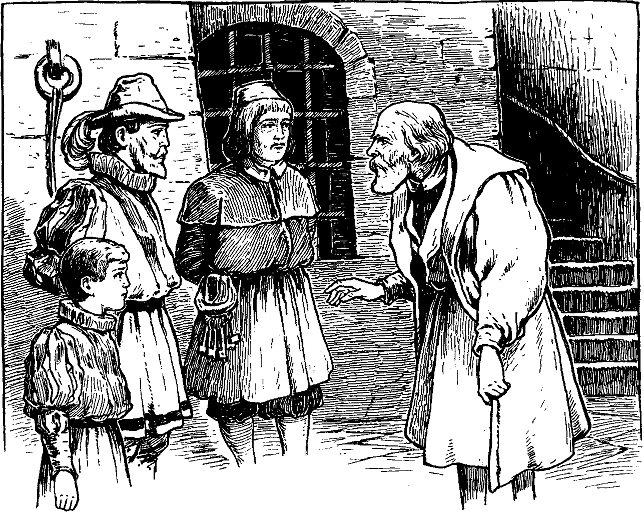

<h2>Siebenundzwanzigstes Kapitel.</h2>

<h3>Was der König und sein Ritter im Gefängnis erleben.</h3>

Die Gefängniszellen waren überfüllt. Unsere Freunde wurden
daher in einen großen Raum gebracht, wo man gewöhnlich ungefährliche
Verhaftete unterbrachte. Auch hier war schon große Gesellschaft.
Zwanzig Gefangene beiderlei Geschlechtes mit Handschellen
und Fußfesseln lagen oder standen umher, eine abstoßende,
lärmende Bande.

Der König beklagte sich bitterlich über die harte Unbill und die
Schmach, die man ihm und mit ihm der Krone Englands antat.
Henden war übler Laune und schweigsam. Er konnte sich noch immer
nicht fassen. Zuviel war in den letzten Minuten auf ihn eingestürmt.
Er war heimgekehrt wie ein verlorener Sohn, mit Jubel im Herzen
und in froher Erwartung. Die Enttäuschung war auch gar zu arg.
Er wusste kaum, sollte er das Ganze tragisch auffassen oder ins
Lächerliche ziehen. Er kam sich vor wie ein Mann, der freudig hinausgegangen
war, um sich einen Regenbogen anzuschauen, und dabei
vom Blitze getroffen wurde.

Nach und nach ordneten sich seine verworrenen Gedanken wieder.
Nur Ediths Benehmen blieb ihm unklar. Er konnte die Sache drehen
und wenden, wie er wollte, etwas, das ihn befriedigt hätte, kam
nicht heraus. Hatte sie ihn erkannt oder nicht? Wie lange er auch
an dieser Nuss herumknackte, es gelang ihm nicht, sie zu öffnen.
Schließlich machte er es ähnlich, wie der Fuchs mit den Trauben,
und sagte sich, es sei eine faule Nuss. Denn immer mehr gelangte
er zur Überzeugung, dass sie ihn erkannt haben müsse und nun aus 
selbstsüchtigen Gründen von ihm nichts habe wissen wollen. Er war
drauf und dran, ihren Namen, der ihm so lange heilig und köstlich
erschienen war, zu verwünschen. Aber er konnte es nicht über sich
bringen.

Henden und sein Schützling verbrachten in ihren schmutzigen
Gefängnisdecken eine unruhige Nacht. Für ein Trinkgeld hatte der
Gefängniswärter einigen Gefangenen Branntwein verschafft. Bald
waren sie denn auch betrunken, johlten und schrien, sangen wüste
Lieder und prügelten einander. Kurz, es war ein solcher Krakehl,
dass von Schlaf nicht viel die Rede sein konnte. Nach Mitternacht
fing ein Mann mit einer Frau Händel an, schlug sie mit seinen
Handschellen auf den Kopf und hätte sie beinahe getötet, bevor der
Wärter dazwischen treten konnte.

Der Mann erhielt eine tüchtige Tracht Prügel, worauf der Friede
wieder hergestellt war. Auch das Gelärm und Gezeche musste aufhören,
und so wurde es bald stille. Nur das Stöhnen und Ächzen
der beiden Verwundeten war noch hörbar, störte aber die Schläfer
nicht weiter.

Während der ganzen darauf folgenden Woche wurde es nicht
viel anders. Viele Leute, derer sich Henden mehr oder weniger
deutlich erinnerte, kamen tagsüber, um sich den »Betrüger« anzusehen,
ihn zu schmähen und zu beschimpfen. Nachts aber machte
die Bande mit unfehlbarer Regelmäßigkeit wieder Radau. Einmal
indessen gab es eine kleine Abwechselung. Der Wärter führte einen
alten Mann herein und sagte zu ihm:

»Hier ist der Schurke. Sieh dich einmal recht um und sage, ob
du ihn aus dem Haufen herausfindest.«

Henden blickte auf, und ein angenehmes Gefühl beschlich ihn.
Er sagte sich: »Das ist ja der alte Andreas, der sein halbes Leben in
meiner Familie diente, eine gute, ehrliche Haut. Das heißt, das
war er früher. Aber alles lügt und trügt ja nun. Auch dieser Mann
wird mich erkennen und ebenso sicher auch verleugnen.«

Der alte Mann schaute sich im ganzen Raume um, blickte jedem
ins Gesicht und meinte schließlich:

»Ich sehe nur erbärmliches, von der Straße aufgelesenes Gesindel
hier. Wo ist er?«

Der Wärter lachte.

»Hier«, sagte er, »sieh dir mal diesen großen Kerl an, und dann
sage mir deine Meinung.«
 

Der alte Diener trat näher und betrachtete Henden ernst und
forschend. Dann schüttelte er den Kopf und erwiderte:

»Meiner Treu, der ist nicht Henden und war es auch nie.«

»Richtig. Deine alten Augen sind noch gesund. Wäre ich Herr
Hugo, ich würde diesen schäbigen Lumpen packen und ihn einfach
am nächsten Aste baumeln lassen.«

Der alte Mann meinte dagegen:

»Wenn's weiter nichts ist! Ich würde ihn lebendig rösten lassen,
so wahr ich ein rechtschaffener Mann bin.«

Der Wärter schlug ein wieherndes Gelächter an und sagte:

»Bring doch Herrn Hugo diesen Rat bei. Das kann einen lustigen
Spaß absetzen. Er wird dir's sicherlich danken.«

Dann eilte der Wärter in ein anderes Gemach und ließ den
alten Mann mit den Gefangenen allein. Da fiel der alte Diener
vor Henden plötzlich auf die Knie und flüsterte:

»Dem Himmel sei Dank, dass Ihr wieder gekommen seid, gnädigster
Herr! Ich glaubte, Ihr wäret schon seit sieben Jahren tot, 
und wahrhaftig! da seid Ihr ja noch am Leben. Ich erkannte Euch
beim ersten Anblick. Die Verstellung kam mich schwer an. Ich
konnte mich kaum der Tränen erwehren, als ich Euch mitten unter
diesem Gelichter sah. Ich bin alt und arm, Herr Michael. Aber
befehlet, und ich werde hingehen und laut die Wahrheit verkünden,
und müsste ich deshalb an den Galgen.«

»Nein«, entgegnete Henden; »das befehle ich nicht und wünsche
es auch nicht. Du würdest dich zu grunde richten und mir doch schwerlich
helfen können. Aber ich danke dir; du hast mir wieder etwas
von meinem verlorenen Glauben an die Menschheit zurückgegeben.«

In der Folge wurde denn auch der alte Diener für Henden und
den König von großem Nutzen. Unter dem Vorwande, den Betrüger
zu ärgern, kam er oft mehrmals des Tages ins Gefängnis,
wobei er immer ein paar Leckerbissen hereinschmuggelte und die
neuesten Nachrichten brachte. Die guten Bissen behielt Henden für
den König zurück, denn ohne diese wäre der arme Junge bei der
elenden, rauen Kost schwerlich durchgekommen. Indes durfte sich
der alte Andreas nie lange aufhalten, um nicht Verdacht zu erregen.
Aber die Zeit genügte ihm doch, seinem früheren jungen Herrn
alles für ihn Wissenswerte mitzuteilen. Natürlich dämpfte er dabei
seine Stimme. Zwischen hinein stieß er grobe Schmähungen und
Lästerungen gegen Henden aus und wahrte so den Schein gegenüber
den andern Insassen.

So erfuhr Henden auch Näheres über das, was in seiner Abwesenheit
in Hendenhall sich ereignet hatte. Arthur war seit sechs
Jahren tot. Dieser Verlust und der Mangel jeglicher Nachricht über
Michael zehrte an seines Vaters Gesundheit. Als er fühlte, dass es
mit ihm bergab ging, wünschte er Hugo und Edith vor seinem Hinscheiden
noch vereinigt zu sehen. Aber Edith bat um Aufschub und
hoffte immer noch auf die Rückkehr Michaels. Dann kam der Brief,
welcher meldete, Michael sei in einer Schlacht gefallen. Dieser
Schlag warf den alten Herrn vollends nieder, der jetzt noch mehr
zur Verbindung drängte. Aber Edith gelang es, noch einen Monat
Frist zu erlangen, dann noch einen zweiten und schließlich noch einen
dritten Monat. Erst jetzt, vor dem Totenbette des Vaters, fand die
Heirat statt. Sie erwies sich nicht als glücklich. Man flüsterte sich
zu, kurz nach der Hochzeit habe Edith unter den Papieren ihres
Gemahls mehrere Blätter gefunden, worauf in den verstellten
Schriftzügen ihres Mannes verschiedene Bruchstücke des verhängnisvollen
Briefes aufgesetzt waren. Darauf hatte Edith ihrem Gemahl
den Vorwurf gemacht, er habe die Heirat mit unredlichen, gemeinen
Mitteln zustande gebracht und zugleich den Tod ihres Vormundes
beschleunigt. Von dieser Zeit an soll Edith keine frohe Stunde mehr
gehabt haben. Man erzählte sich viel von harter und grausamer Behandlung
Ediths durch ihren Gemahl. Nach dem Tode des Vaters
habe Hugo seine Verstellung ohne Scheu abgeworfen und sei ein
unbarmherziger Herr gegen alle geworden, die von ihm abhingen.

Der alte Andreas berichtete auch von Sachen, die besonders den
König in lebhafte Spannung versetzten. Der treue Diener sagte
nämlich:

»Es geht ein Gerücht, der König sei irrsinnig. Aber es heißt
auch, es sei unter Todesstrafe verboten, davon zu sprechen.«

Eduard staunte den Mann an und erwiderte:

»Der König ist nicht irrsinnig, guter Mann, und du kannst etwas
besseres tun, als dich mit solchem Geschwätz abzugeben.«

»Was will der Knabe damit sagen?« fragte Andreas, den dieser
unerwartete Angriff verblüffte. Henden winkte ihm ab, worauf
der Diener fortfuhr:

»Der verstorbene König ist vor zwei Tagen -- am 16. dieses
Monats -- in Windsor beigesetzt worden. Der neue König wird am
20\. in Westminster gekrönt werden.«

»Mich deucht, sie müssen ihn doch erst haben«, murmelte Eduard.
Dann aber fügte er vertrauensvoll hinzu: »Aber sie werden schon
dafür sorgen -- und ich auch.«

»Herr Hugo geht auch zur Krönung«, fuhr der alte Mann fort,
»und zwar mit großen Erwartungen. Er trägt sich nämlich mit
der Hoffnung, als Reichsbaron zurückzukommen, denn er steht beim
Lord Protektor hoch in Gunst.«

»Bei welchem Lord Protektor?« fragte Eduard.

»Bei Sr. Gnaden, dem Herzog von Somerset.«

»Welchem Herzog von Somerset?«

»Ei, es gibt doch nur einen: der Graf von Hertford.«

Der König fragte scharf:

»Seit wann ist er Herzog und Lord Protektor?«

»Seit Neujahr.«

»Und bitte, wer erhob ihn zu diesem Rang?«

»Er selbst und der Staatsrat unter Beistimmung des Königs.«

Eduard fuhr heftig auf:
 

»Des Königs!« rief er. »Welches Königs?«

»Welches Königs? Ist das eine Frage! Da wir nur einen haben,
so ist es doch klar: Sr. Majestät, des Königs Eduard des Sechsten,
den Gott erhalte! Er ist ein lieber und gnädiger kleiner Herrscher.
Das muss man sagen. Ob er nun irrsinnig ist oder nicht -- und man
sagt, er bessere sich täglich -- sein Lob ist jedenfalls auf aller Lippen.
Alle segnen ihn und beten, dass er recht lange über England herrschen
möge. Schon gleich zu Anfang zeigte er seine Herzensgüte, indem
er den Herzog von Norfolk begnadigte. Jetzt ist er beständig daran,
die Härten und Grausamkeiten der Gesetze zu mildern, welche das
Volk beinahe zur Verzweiflung brachten.«

Eduard war stumm vor Überraschung und versank dann in tiefes
Nachdenken. Er wunderte sich, ob der kleine »irrsinnige« König
jener Bettlerjunge sei, den er damals mit sich in den Palast genommen
habe. Es kam ihm aber nicht wahrscheinlich vor. Sicherlich
mussten doch seine Unwissenheit und sein ganzes Benehmen ihn
verraten haben. Oder sollte der Hof irgend einen Sprössling des
Adels auf den Thron gesetzt haben? Nein, das würde sein Onkel
nicht zugeben. Ein solches Beginnen hätte er im Keime zu ersticken
gewusst. Je mehr der Knabe nachdachte, desto geheimnisvoller erschien
ihm die Sache. O könnte er wieder nach London zurück und
mit einem Schlage das ganze Wirrnis zu glücklichem Ende führen!

Umsonst verschwendete Henden all seine Trostgründe an den
jungen König, dem jetzt seine Haft immer unerträglicher wurde.

Besser indes gelang es zwei Frauen, die mit Ketten beladen in
seiner Nähe weilten. Durch ihre sanften Ermahnungen gewann er
Frieden und Ergebung in sein Schicksal. Er war ihnen sehr dankbar
dafür und empfand ihre Gegenwart immer wohltuender. Er fragte
sie, warum sie eingekerkert wären. Als sie erklärten, sie seien Baptisten<a href="99_Footnotes.xhtml#rn11" id="rn11">*</a>,
lächelte er nur und meinte:

»Ist denn das ein solches Vergehen? Schade nur, dass ich nicht
frei bin. Ich würde euch bald erlösen.«

Sie gaben keine Antwort. Ein gewisses Etwas in ihren Mienen
machte ihn stutzig. Er fuhr eifrig fort:

»Ihr sprecht ja nicht! Erwartet euch etwa noch eine andere
Strafe? Bitte, sagt es mir und fürchtet euch nicht.«

Sie versuchten dem Gespräch eine andere Richtung zu geben.
Aber sein Interesse war nun einmal rege geworden, und er fragte
weiter:
 

»Wollen sie euch peitschen? Ach nein, so grausam werden sie
nicht sein! Nicht wahr, sie werden euch nicht peitschen?«

Die Frauen wurden verwirrt und bekümmert. Offenbar waren
sie um eine Antwort verlegen. Endlich sprach eine gerührt:

»O du brichst uns noch das Herz, guter Knabe. Gott wird uns
beistehen, dass wir unser Schicksal als Christen ertragen.«

»Also doch«, unterbrach sie der König, »sie wollen euch doch
peitschen, diese hartherzigen Seelen! Aber ach, ihr müsst nicht weinen;
ich kann es nicht ertragen. Haltet euch aufrecht. Wenn meine Zeit
gekommen ist, werde ich euch vor dieser Grausamkeit schützen. Ja,
das werde ich ganz gewiss!«

Als der König am nächsten Morgen erwachte, waren die beiden
Frauen fort.

»Ah, man hat sie befreit!« rief er fröhlich. »Schade nur, dass
sie mich nicht mehr trösten können.«

Jede von den beiden Frauen hatte ein Stück Band als Andenken
an seine Kleidung geheftet. Diese Bänder wollte er immer in Ehren
halten, zur Erinnerung an die braven Frauen, für die er später zu
sorgen sich vornahm.

Eben kam der Wärter mit Gehilfen herein und ließ die Gefangenen
in den Gefängnishof führen. Der König war überglücklich.
Ach, wie herrlich musste es sein, wieder einmal den blauen Himmel
zu sehen und die frische Luft zu atmen!

Der Hof bildete ein Viereck und war mit Steinen gepflastert.
Die Gefangenen betraten ihn durch einen massiven Torbogen und
wurden dann in Reihen aufgestellt, mit dem Rücken gegen die Mauer.
Vor ihnen ward ein Strick gespannt, bei welchem Beamte und
Wärter standen. Es war ein frostiger, bewölkter Morgen. Während
der Nacht war ein leichter Schnee gefallen und hatte alles in eine
weiße Decke gehüllt. Ein Winterwind wirbelte noch einzelne Flocken
umher.

Mitten im Hofe standen zwei Frauen an Pfähle gebunden. Mit
einem Blick ersah der König, dass es seine beiden guten Freundinnen
waren. Ihm schauderte, und er sagte sich: »Ach, sie sind also doch nicht
frei, wie ich dachte. Sollte man es wohl glauben, dass solche brave
Leute in England gepeitscht werden! Es wäre eine Schande selbst
für ein Land der Heiden! Sie werden gezüchtigt, und ich, den sie
getröstet und so freundlich behandelt haben, muss ihrer Schmach
zusehen. Ich, der Höchste in England, der oberste Gesetzgeber, 
stehe ohnmächtig da. Aber es kommt ein Tag, wo alles das gesühnt
werden soll.«

Ein großes Tor sprang auf, und eine Menge Bürger strömten
herein. Sie scharten sich um die beiden Frauen und verbargen sie
so vor den Augen des Königs. Dann kam ein Geistlicher und schritt
durch die Menge hindurch. Im Mittelpunkte des Kreises, wo die
Frauen standen, wurden jetzt offenbar Fragen und Antworten gewechselt.
Aber deutlich zu verstehen war nichts. Dann gab es allerlei
Vorbereitungen, denn Leute liefen hin und her. Aber allmählich
trat tiefe Stille ein.

Auf einen Befehl hin traten jetzt die Zuschauer auseinander,
so dass die Mitte frei blieb. Nun erblickte der König ein Schauspiel,
das ihm das Mark in den Knochen erstarren ließ. Reisigbündel waren
um die beiden Frauen herum aufgehäuft. Ein Mann kniete davor
und legte Feuer an das Holz.

Die Frauen senkten ihre Häupter und bedeckten sich das Gesicht
mit den Händen. Die fahlen Flammen begannen am Reisig hinauf
zu züngeln und zu flackern und knistern. Der Wind wirbelte den
blauen Rauch herum und trug ihn fort. Der Geistliche erhob die
Hände zum Gebet, wurde aber jäh unterbrochen von zwei jungen
Mädchen. Diese kamen mit herzdurchdringendem Geschrei herbei
geflogen und warfen sich den beiden Frauen am Pfahle an die Brust.
Sofort wurden sie von den Häschern fortgerissen und festgehalten.
Eine aber machte sich los und erklärte, sie wolle mit ihrer Mutter
sterben. Bevor man sie hindern konnte, hing sie wieder am Halse
der einen Frau. Diesmal hatten ihre Kleider schon Feuer gefangen,
als sie wieder fortgerissen wurde. Zwei Männer hielten sie fest,
rissen ab, was von ihren Gewändern brannte, und schleuderten es
weg. Sie aber rang fortwährend und suchte loszukommen. Sie
bat und flehte, man möge sie doch sterben lassen, sie sei sonst ganz
allein in der Welt. Beide Mädchen jammerten unaufhörlich und
wanden sich verzweifelt unter dem Griffe der Häscher. Aber ihr
Klagen wurde plötzlich übertönt von einem herzzerreißenden
Todesschrei.

Der König blickte von den Mädchen weg nach dem Pfahle hin,
aber nur eine Sekunde. Dann wandte er sich ab und lehnte sein
aschfarbenes Gesicht an die Mauer. Er wagte nicht mehr aufzuschauen.
»Wollte Gott, ich wäre blind!« dachte er. »Was ich gesehen
habe in diesem einzigen kurzen Augenblick, wird meinem Gedächtnis 
nie entschwinden. Tag und Nacht wird es mir vor Augen schweben,
bis zu meiner Todesstunde. Ach, hätte ich es doch nicht sehen
müssen!«

Henden beobachtete den König. »Ich glaube, er fängt an zu gesunden.
Er hat sich verändert und wird sanfter. Wäre er noch, wie
er früher war, so würde er wahrscheinlich auf die Henkersknechte
losgestürzt sein und befohlen haben, die Frauen sofort zu entfesseln.
Ich will nur hoffen, dass seine Besserung fortschreitet und er bald
wieder ganz gesund wird. Gott gebe es!«

Am selben Tage wurden mehrere neue Gefangene eingebracht,
sie sollten hier nur die Nacht über bleiben und dann an verschiedene
andere Orte hingeschafft werden. Der König unterhielt sich mit
ihnen, und was sie erzählten, drang ihm tief zu Herzen. Eine arme,
halb närrische Frau war darunter, welche einem Weber ein oder
zwei Ellen Tuch entwendet hatte, und dafür gehängt werden sollte.
Ein Mann hatte in einem königlichen Park einen Rehbock erlegt und
musste dafür ebenfalls in den Tod gehen. Ein Kaufmannslehrling
hatte eines Abends eine Hacke auf der Straße gefunden und mit
heim genommen, in der Meinung, es sei sein gutes Recht. Aber
der Gerichtshof war anderer Ansicht gewesen und wollte auch ihn
Freund Hein übergeben.

Der König war aufgebracht über solche Unmenschlichkeit und
hätte am liebsten Tür und Tor gesprengt, um mit Henden nach
London zu fliehen und diese Unglücklichen vom Tode zu erretten.

Ferner war unter den Gefangenen ein alter Anwalt<a href="99_Footnotes.xhtml#rn12" id="rn12">*</a> mit charaktervollen
Zügen und unerschrockener Miene. Dieser hatte vor drei
Jahren eine öffentliche Anklageschrift gegen den Lordkanzler herausgegeben.
Darin hatte er ihn der Ungerechtigkeit beschuldigt. Hierfür
wurde er mit dem Verlust eines Ohres und 3000 Pfund Strafe
gebüßt und aus der Liste der Anwälte gestrichen. Später wiederholte
er seine Anklage. Jetzt verlor er, was er noch an Ohren übrig
hatte, und musste weitere 5000 Pfund bezahlen. Überdies erhielt
er Zuchthaus auf Lebenszeit und wurde auf beiden Wangen gebrandmarkt.

»Das sind meine Ehrenzeichen«, sagte er, schüttelte sein graues
Haar zurück und zeigte die verstümmelten Überreste dessen, was
einst seine Ohren gewesen waren.

Dem König wurden die Augen vor Mitleid feucht. Er sprach zu
ihm:
 

»Keiner will an mich glauben, und du auch nicht. Aber das tut
nichts zur Sache. Bevor ein Monat vergeht, sollst du frei sein. Noch
mehr: die Paragraphen, die dich also geschändet haben und England
entehren, sollen aus den Gesetzesbüchern verschwinden. Es ist
manches in der Welt unklug eingerichtet. Die Könige sollten erst
draußen im Leben in die Schule gehen, dann würden die Gesetze
bald von ihrer Strenge verlieren.«

