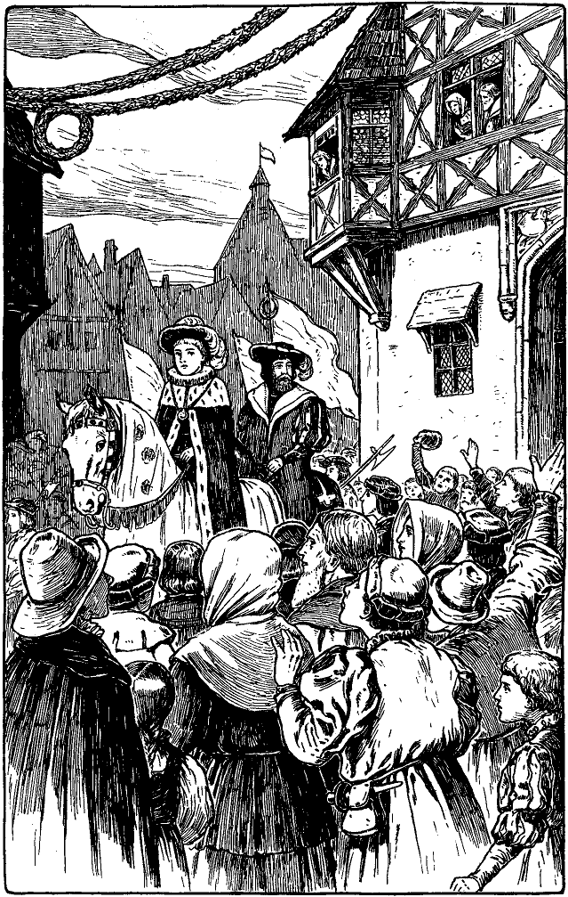

<h2>Einunddreißigstes Kapitel.</h2>

<h3>Wie Tom von seiner Mutter erkannt wird.</h3>

Als Tom Canty am nächsten Morgen erwachte, drangen vieltausendstimmige
Hochrufe an sein Ohr. Schwarz wimmelte es vor
den Toren des Palastes, soweit das Auge blickte und immer von
neuem erbrausten die Huldigungsrufe.

Nicht lange hernach befand sich Tom noch einmal als der gefeierte
Tagesheld in herrlichem Geleite auf der Themse. Nach altem
Brauche mußte der Königszug vom Turme ausgehen, wohin die
Flottille nun steuerte.

Als der Zug dort anlangte, flammte es plötzlich auf der alten
Feste an tausend Stellen zugleich auf. Eine betäubende Explosion
erdröhnte, daß der Boden weithin zitterte und der ganze Turm zu 
<@pagebreak/>
bersten schien. Und immer und immer wieder donnerten die Feuerschlünde,
daß bald das ganze Gebäude in Rauch verhüllt war. Nur
die höchste Spitze, der sogenannte Weiße Turm, auf dem unzählige
Banner im Winde flatterten, ragte noch sichtbar empor, wie ein hoher
Bergesgipfel über dichten Wolkenzügen.

Tom Canty bestieg, in kostbare Gewänder gehüllt, ein edles Prunkpferd,
von dem Golddecken beinahe bis auf den Boden hinunterfielen.
Toms »Onkel«, der Lord Protektor Somerset, ritt unmittelbar
hinter ihm. Die königlichen Wachen in glänzender Rüstung
bildeten zu beiden Seiten der Straße Spalier.

Nach dem Protektor folgte ein unabsehbarer Zug von Großen des
Reiches mit ihren Vasallen. Ihnen zunächst kamen der Lord Mayor
und die Ratsherren in roten Samtgewändern und goldenen Kreuzen
auf der Brust. Daran schlossen sich die Vorstände und Mitglieder der
einzelnen Zünfte und Innungen mit reichgestickten wogenden Bannern.
Als besondere Ehrenwache marschierte auch die altehrwürdige
Artilleriegesellschaft im Zuge einher. Sie war zu jener Zeit schon
300 Jahre alt und die einzige militärische Verbindung in England,
die, wie auch heute noch, vom Parlament unabhängig war. Es war
ein wunderbar schönes Schauspiel, das überall, wo es sich zeigte,
begeisterte Jubelrufe weckte.

Als der Zug in die Altstadt kam, empfing Tom ein wahrer Sturm
von Willkommsrufen, die ohne allen Zweifel aus aufrichtigem
Herzen kamen. Der überglückliche Scheinkönig dankte mit lächelnder
Miene und freundlichen Worten. Das Volk war entzückt über die
große Herablassung und Güte seines neuen Herrschers.

Am Eingang in eine Hauptstraße begrüßte ein schönes Kind von
einer Tribüne herab den jugendlichen Fürsten in einem schwungvollen
Gedicht, dessen letzter Vers lautete:

> »Willkommen, o König, heißt dich des Volkes Herz!
> Willkommen dir bietet die Zunge hell und klar!
> Die Hände sich heben, die Herzen himmelwärts:
> Mög Gott dich erhalten so glücklich immerdar!«

Ein brausendes, jauchzendes Hurra erscholl, in welchem alles bestätigt
lag, was das Kind gesagt hatte. Tom Canty überblickte wonnetrunken
die zahllose Menge. Das Schönste auf Erden, schien ihm, sei:
König zu sein und der Abgott des Volkes.

Plötzlich bemerkte er zwei von seinen früheren Kameraden vom
Unrathof. Der eine von ihnen war einst sein Großadmiral und der 
<@pagebreak/>
andere sein Oberkämmerer gewesen. O wenn sie ihn jetzt erkennen
möchten! Welch unsagbares Erstaunen würde sich ihrer bemächtigen.
Beinahe hätte er alle Huldigung des Volkes dahingegeben um den
einen Triumph, den Anblick der vor Verwunderung erstarrten Gesichter
seiner einstigen Spielgefährten. Aber er mußte sich bezähmen und
verleugnen, denn es lag doch zuviel auf dem Spiele. Er wandte also
das Gesicht ab und ließ die beiden Burschen weiter jauchzen und jubeln.

Alle paar Augenblicke erhob sich der Ruf: »Eine Gabe, eine Gabe!«
Dann warf Tom jedesmal eine Handvoll neugeprägter, glänzender
Münzen unter die Menge.

Am oberen Ende der Gnadenkirchstraße hatte man einen mächtigen
Triumphbogen und darunter eine Bühne errichtet, so breit wie die
ganze Straße. Auf der Bühne bot sich den Blicken ein historisches
lebendes Bild, welches die unmittelbaren Ahnen des Königs
darstellte. Da saß Elisabeth von York inmitten einer ungeheueren
weißen Rose, deren Blätter künstliche Falbeln an ihrem Kleide
bildeten. Neben ihr entstieg Heinrich der Siebente einer mächtigen
roten Rose. Die Hände des königlichen Paares lagen ineinander und
der Hochzeitsring zeigte sich geflissentlich recht deutlich. Von den
beiden Rosen ging ein Stamm aus und reckte sich hinauf bis zu einer
Empore, wo wieder eine weiße und eine rote Rose entsproßten, aus
denen sich Heinrich der Achte zu erheben schien. An ihn aber lehnte
sich Johanna Seymour, die Mutter des neuen Königs. Von diesem
Paar ging der Stamm höher hinauf zu einer weiteren Empore. Hier
war Eduard der Sechste selbst, in königlicher Majestät thronend, dargestellt.

Das ganze Bild gefiel dem Volke so sehr, daß der laute Beifall
die dünne Stimme des Kindes nicht durchdringen ließ, das in wohlklingenden
Versen die Darstellung erklären wollte. Aber Tom bedauerte
es nicht; dieser wilde Lärm war ihm sichere Musik als jede
Poesie. Wohin er auch sein jugendliches Gesicht wandte, erkannte
das Volk sogleich eine sprechende Ähnlichkeit mit dem lebenden Bild
und stürmische Hochrufe folgten dieser Erkenntnis.

Weiter und weiter bewegte sich der große Zug unter zahllosen
Triumphbogen hindurch und an einer raschen Aufeinanderfolge von
symbolischen Darstellungen vorbei. Von letzteren brachte jede irgend
eine Tugend, ein Talent oder Verdienst des kleinen Herrschers zum
Ausdruck. Von allen Häusern herab hingen Flaggen und Fahnen,
herrliche Teppiche, kostbare Stoffe und golddurchwirkte Tuche.
 
<@pagebreak/>

 
<@pagebreak/>
»Und all diese wunderbaren Sachen sind für mich, für mich allein
da!« murmelte Tom.

Die Wangen des Scheinkönigs röteten sich, seine Augen blitzten
und er schwamm in einem Meer von Wonne. Aber mitten in diesem
Entzücken, wie er eben eine Handvoll Geld ausstreuen wollte, erblickte
er ein blasses, erstauntes Gesicht, das zwischen den Zuschauern
hindurch sich nach ihm hinreckte und die Augen starr auf ihn heftete.
Totenblässe befiel ihn: er hatte seine Mutter erkannt. Und auf flog
seine Hand, wie schützend, vor die Augen, die innere Fläche nach
außen: seine altgewohnte Gebärde des Schreckens. In der nächsten
Minute hatte die Mutter sich durch die Menge Bahn gebrochen,
zwischen den Wachen hindurchgezwängt und war zu ihrem Sohne
hingestürzt. Sie umfaßte sein Bein, bedeckte es mit Küssen und
rief:

»O mein Kind, mein Liebling!«

Dann schaute sie zu ihm auf mit einem Blick voll unendlicher
Liebe und Freude. Aber sofort kam ein Offizier der königlichen Leibwache
heran, riß sie fort und schleuderte sie weg, daß sie taumelnd in
die Menge zurückflog.

»Ich kenne dich nicht, gute Frau!« war eben noch Toms Lippen
entfahren. Aber es drang ihm tief ins Herz, als er sie so roh behandelt
sah. Und wie sie sich noch einmal nach ihm umsah, mit dem todestraurigen
Blick eines sterbenden Rehes, da überkam ihn ein Gefühl
unsagbarer Scham. All sein Stolz, seine Freude waren dahin, verwelkt
sein gestohlenes Königtum. So erbärmlich, so elend kam er sich
vor, daß er am liebsten allen geborgten Flitter abgeworfen und seiner
tief verwundeten Mutter in die Arme geeilt wäre.

Weiter bewegte sich der Zug. Aber Toms Augen waren glanzlos
und sein Blick leer geworden. Unstät und gefühllos schweiften seine
Augen über die ihm zujauchzende Menge hin. Er hörte und sah nichts
mehr. Statt ihn zu erfreuen, ward ihm alles zum Vorwurf, zum
Ekel. Sein Herz verzehrte sich durch Gewissensbisse. »Wollte Gott,
ich wäre meiner Sklaverei ledig!« seufzte er. Damit war er unbewußt
wieder in den Gedankengang der ersten Zeit seiner erzwungenen
Größe zurückgekommen.

Wie eine glänzende, glitzernde Schlange wand sich der Zug durch
die krummen Straßen der merkwürdigen alten Stadt. Mechanisch
und gebeugten Hauptes ritt Tom dahin, immer nur das Bild seines
armen lieben Mütterchens vor Augen.
 
<@pagebreak/>
»Eine Gabe, eine Gabe!« rief es von allen Seiten. Aber die
Bitten verhallten unerhört.

»Lang lebe Eduard von England!« Donnernd brauste der Ruf
durch die erschütterte Luft. Aber der König gab keine Antwort. Nur
wie das Tosen einer Brandung aus weiter, weiter Ferne drang es
an sein Ohr. Denn lauter als die Jubellaute des Volkes ertönte eine
Stimme in seiner Brust und wiederholte die schmachvollen Worte:
»Ich kenne dich nicht, Frau.« Unaufhörlich durchbebten ihn diese
Worte und trafen seine Seele. So mag die Totenglocke ans Ohr
eines Menschen dröhnen und ihn an einen geheimen Verrat erinnern,
dem der eben verstorbene Freund zum Opfer fiel.

Bei jeder Biegung der Straße zeigten sich neue Wunder der
Überraschung. Dazu blitzten und donnerten die Batterien, frohlockten
die Scharen des Volkes und brachten Tom neue Huldigungen
dar. Aber er beachtete es nicht und wenn er es einmal bemerkte,
so ward es ihm nur zu erneuter Qual.

Angesichts dieser Haltung des Königs ernüchterte sich das Volk
allmählich. Etwas wie Besorgnis und Angst machte sich in den Mienen
der Zuschauer bemerkbar, und der Jubel begann zu erlahmen. Rasch
wurde der Lord Protektor der veränderten Stimmung des Volkes
gewahr, und ebenso rasch entdeckte er auch die Ursache. Er ritt vor
an die Seite des Königs, verbeugte sich entblößten Hauptes und flüsterte
Tom zu:

»Mein Fürst, ermuntert Euch. Das Volk stößt sich an Euerer
gebeugten Haltung und Euerer bewölkten Miene und nimmt es als
schlimme Vorbedeutung. Laßt Euch raten: verbannt diesen düsteren
Traum und zeigt Euer strahlendes Lächeln wieder!«

Zugleich warf der Herzog links und rechts eine Handvoll Münzen
unter das Volk und zog sich wieder an seinen Platz zurück. Mechanisch
tat der König, wie ihm geheißen war. Aber sein Lächeln war nur
matt und kaum bemerkbar; indes konnte das ja nur von den zunächst
Stehenden beobachtet werden. Er nickte wieder anmutig und huldvoll
mit dem Federhut und warf die Münzen mit königlicher Freigebigkeit
hin. Bald schwand denn auch die Besorgnis des Volkes
wieder und mächtig wie zuvor erschollen die jubelnden Hochrufe der
treuen Untertanen.

Noch einmal indes, als sich der Zug schon seinem Ziele nahte,
mußte der Herzog an Toms Seite reiten und ihm Vorstellungen
machen:
 
<@pagebreak/>
»O gnädigster Herr, verscheucht doch diesen verhängnisvollen
Trübsinn; die Augen der ganzen Welt sind auf Euch gerichtet!«

Dann fügte er ärgerlich hinzu: »Verwünscht, daß diese elende
Bettlerin dazwischen kommen mußte! Sie war es doch, welche die
Laune Euerer Königlichen Hoheit verdorben hat.«

Tom schaute den Herzog mit glanzlosen Augen an und sagte mit
erloschener Stimme:

»Es war meine Mutter!«

»Mein Gott!« stöhnte der Protektor, während er sein Pferd
zurücklenkte, »die üble Vorbedeutung hatte also doch recht: er ist
wieder irrsinnig geworden!«

