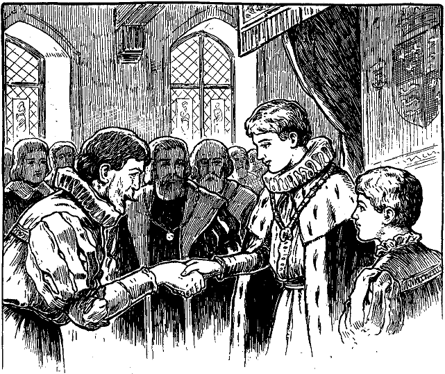

<h2>Dreiunddreißigstes Kapitel.</h2>

<h1>Wie Eduard sein Herrscheramt beginnt.</h1>

Michael Henden sah schon malerisch genug aus, bevor er wider
Willen in den Tumult auf der Londoner Brücke geriet. Noch weit
schlechter stand es um ihn, als er endlich wieder Luft bekam. Als er
in das Gedränge hineinfiel, hatte er freilich nur noch wenig Geld.
Aber er hatte gar keines mehr, als er endlich wieder frei war. Taschendiebe
hatten ihm noch den letzten Heller geraubt. Aber das wollte er
verschmerzen, wenn er nur seinen Schützling wiederfände.

Wie von einem alten Krieger zu erwarten stand, ging er nicht aufs
Geratewohl darauf los, sondern machte sich erst seinen Feldzugsplan.
Was würde der Knabe natürlicherweise tun? Wohin mochte er sich
wenden? Ei, berechnete Henden, der natürliche Trieb zieht doch in 
solchen Fällen jeden Menschen, wenn er sich verlassen und vergessen
fühlt, wieder in das alte Heim zurück! Und wo lag das? Seine Lumpen
und das Aussehen des Schuftes, der sich seinen Vater nannte, wiesen
mit Bestimmtheit auf einen der ärmsten Bezirke Londons hin. Gewiss
würde er auf dem Wege dahin den Knaben inmitten einer Gruppe
von Leuten finden, die sich ihren Spaß mit ihm machten, wenn er
wie gewohnt sich als König gebärden sollte. Dann wollte ihn Henden
wieder von seinen Quälgeistern befreien, ihn trösten und sich nie
wieder von ihm trennen lassen.

So ging also Henden auf die Suche. Stunden und Stunden lang
schritt er durch alle möglichen Seitengässchen der schmierigen Viertel,
ohne eine Spur von dem Knaben zu entdecken. Das befremdete ihn,
aber entmutigte ihn nicht. Mit seinem Feldzugsplan war es aber
offenbar doch nichts; darin hatte er sich jedenfalls verrechnet.

Als der Morgen anbrach, lagen viele Meilen hinter ihm und noch
war er so klug wie vorher. Er war schrecklich müde, hungrig und
schläfrig. Gerne hätte er etwas zu sich genommen, aber wie sollte
er dazu kommen? Betteln passte ihm nicht. Seinen Degen versetzen?
Das wäre für ihn mit dem Verlust seiner Soldatenehre gleichbedeutend
gewesen. Vielleicht konnte er etwas von seinen Kleidern
entbehren? Aber ebenso leicht konnte man einen Käufer für eine
Krankheit finden, wie er einen Abnehmer für diese Kleider.

Um die Mittagszeit irrte er immer noch umher. Er lief jetzt hinter
der Menge nach, welche dem Krönungszuge folgte. Er dachte sich
nämlich, dieser würde seinen kleinen Scheinkönig am meisten anlocken.
Unverdrossen ging er weiter, bis er vor der Westminsterkirche
stand. Hier schlängelte er sich durch die einzelnen Gruppen hindurch,
wieder ohne etwas zu erreichen.

Er wanderte also weiter und sann über einen besseren Plan nach.
Als er endlich den Kopf wieder hob, entdeckte er, dass die Stadt schon
weit hinter ihm lag und der Tag zur Rüste ging. Er befand sich auf
freiem Lande, nahe der Themse. Ringsum lagen prächtige Landhäuser.
Er war also nicht in einem Bezirk, wo Kleider, wie die seinen
gerne gesehen wurden.

Kalt war es gar nicht, und so streckte er sich hinter einer schützenden
Hecke aus, um zu ruhen und nachzudenken. Aber die Schläfrigkeit
überwältigte seine Sinne. Aus der Ferne drang nur schwach das
Dröhnen der Geschütze an sein Ohr. Er murmelte noch vor sich hin:
»Der neue König wird gekrönt.« Dann schlief er ein; hatte er doch 
mehr als 30 Stunden nicht mehr geschlafen. Erst um die Mitte des
nächsten Morgens wachte er wieder auf.

Lahm, steif und halb verhungert erhob er sich und wusch sich im
Flusse. Seinen nagenden Hunger täuschte er durch einen kräftigen
Schluck Wasser. Dann trottete er wieder fort gegen Westminster hin,
ärgerlich über sich selbst, dass er soviel Zeit verschwendet hatte. Sein
Hunger verhalf ihm zu einem neuen Plan. Er wollte versuchen, den
alten Herrn Humfried Marlow aufzufinden, um einige Mark von ihm
zu borgen, und dann ... Doch, das würde sich ja finden.

Um 11 Uhr mittags kam er an den Königspalast mitten unter eine
Menge Schaulustiger. Er prüfte die Gesichter der Umstehenden, um
jemand herauszufinden, der bereit wäre, eine Botschaft von ihm
an seines Vaters alten Freund zu überbringen. Dass er selbst bei seiner
schäbigen Kleidung keinen Zutritt in den Palast erlangt hätte, das
stand ganz außer Frage.

Da kam eben unser wohlbekannte Prügeljunge aus dem Palast
und ging an ihm vorbei. Dann drehte er sich wieder um, schaute den
Ritter forschend an und sagte bei sich: »Ob das nicht derselbe fahrende
Ritter ist, um den sich Se. Majestät so besorgt zeigt? Wahrhaftig,
wenn er es nicht ist, will ich ein Esel sein! Freilich war ich schon bislang
ein Esel. Dass Gott zwei solch wunderbar malerische Männer
geschaffen habe, ist nicht anzunehmen und wäre auch nur Verschwendung.
Wie fange ich es nur an, mich an ihn zu machen?«

Dieser Sorge enthob ihn Michael Henden selbst. Als er sah, dass
der Knabe sich offenbar für ihn interessierte, redete er ihn an:

»Ihr seid eben aus dem Palast gekommen. Gehört Ihr zu den
Hofbeamten?«

»Ja, Euer Ehren.«

»Ist Euch Herr Humfried Marlow bekannt?«

Der Knabe fuhr auf und dachte: »Beim Himmel, er meint gewiss
meinen verstorbenen Vater«. Dann erwiderte er:

»Recht gut, Euer Ehren.«

»Schön. Ist er drinnen?«

»Gewiss«, sagte der Knabe und fügte in Gedanken hinzu: »Im
Grabe«.

»Dürfte ich Euch wohl um den Gefallen ersuchen, ihm meinen
Namen zu melden und zu sagen, ich hätte ein dringendes Anliegen
an ihn?«

»Recht gerne will ich das besorgen, Herr.«
 

»Dann sagt ihm doch, Michael Henden, Sohn des Herrn Richard,
sei hier draußen. Ich werde Euch sehr verbunden sein, wenn Ihr mir
diese Freundlichkeit erweist.«

Der Knabe schaute enttäuscht drein. »Der König sprach doch von
einem Grafen«, dachte er für sich. »Aber das tut nichts zur Sache.
Dieser fahrende Ritter kann vielleicht über seinen Zwillingsbruder
Aufschluss geben.« Er sagte also zu Henden:

»Bitte, Herr, tretet einen Augenblick hier ein und wartet, bis ich
Euch Antwort bringe.«

Damit wies er auf eine Nische in der Mauer, worin eine steinerne
Bank stand. Sie bildete bei schlechtem Wetter eine Art Schilderhäuschen
für die Wache. Michael Henden setzte sich auf die Bank.

Kaum aber saß er da, als einige Hellebardiere mit einem Offizier
vorüberkamen. Der Offizier sah ihn, ließ Halt machen und befahl
Henden hervorzukommen. Michael gehorchte und ward sofort als
verdächtig verhaftet. Die Sache begann ernst zu werden. Er wollte
sein Hiersein erklären. Aber der Offizier schnitt ihm barsch das Wort
ab und befahl den Soldaten, ihn zu entwaffnen und zu durchsuchen.
»Gebe der Himmel in seiner Gnade, dass sie in meinen Taschen etwas
finden«, dachte Henden, »ich habe wahrlich genug gesucht und nichts
gefunden.«

Sie fanden aber doch etwas, nämlich ein Schriftstück. Der Offizier
erbrach es, und Henden lächelte. Waren es doch die Kratzfüße, die sein
kleiner Schützling an jenem unglückseligen Tage in Hendenhall geschrieben
hatte. Der Offizier wurde dunkelrot im Gesichte, als er den
englischen Text las, während Henden darüber im Gegenteil erbleichte.

»Schon wieder ein neuer Thronbewerber!« rief der Offizier.
»Wahrhaftig, die mehren sich ja, wie die Kaninchen. Ergreift den
Schurken, Leute und haltet ihn fest, während ich das kostbare Papier
dem König überreichen lasse.«

Er eilte hinweg und ließ den Gefangenen in den Händen der
Hellebardiere.

»Endlich hat's doch mit meinem Elend ein Ende«, murmelte
Henden, »denn bald werde ich am Ende eines Strickes baumeln, und
das nur dieses Fetzchens Papier wegen. Aber was wird aus meinem
armen, unglücklichen Schützling werden? Ach, das weiß nur Gott im
Himmel.«

Es währte nicht lange, da kam der Offizier in großer Eile zurück.
Henden nahm all seinen Mut zusammen, um seinem Schicksal so 
ruhig wie möglich zu begegnen. Der Offizier befahl seinen Leuten,
den Gefangenen loszulassen und ihm seinen Degen zurückzugeben.
Dann verbeugte er sich achtungsvoll vor Henden und sagte:

»Folgt mir, ich bitte Euch, mein Herr.«

Henden schritt hinter ihm drein und murmelte: »Ginge es nicht
zum Tode und ans jüngste Gericht, so würde ich diesen Schuft für
seine höhnische Höflichkeit erdrosseln. So aber muss ich mit meinen
Sünden etwas sparsam umgehen.«

Die beiden durchschritten einen volkreichen Vorhof und betraten
den Palast beim großen Eingangstor. Hier übergab der Offizier
Henden wieder mit einer Verbeugung einem prächtig ausstaffierten
Hofbeamten, der ihn mit hoher Achtung empfing und weiterführte.

Sie kamen durch eine große Halle an Garden in blitzender Stahlrüstung
vorbei, welche präsentierten, während die beiden vorübergingen,
aber spöttisch lächelten, sowie Henden es nicht mehr sehen
konnte. Dann ging's eine breite Treppe hinauf, immer zwischen
edlen Herren und Damen hindurch. Schließlich führte ihn der Beamte
mitten in einen herrlichen Saal, wo er ihm Bahn durch den
dichtgedrängten Adel schuf. Jetzt machte er wieder eine Verbeugung
vor Henden und ließ ihn allein.

Die Umstehenden musterten Michael von Kopf bis zu Fuß, die
einen entrüstet und stirnrunzelnd, die anderen belustigt und spöttisch.
Henden wusste nicht, wie ihm geschah. Dort saß der junge König auf
dem Thron, kaum fünf Schritte von ihm entfernt. Er schaute mit
gesenktem Kopf zur Seite und sprach mit irgend einem menschlichen
Paradiesvogel, einem Herzog vielleicht. Henden sagte sich, man hätte
ihm diese Demütigung vor dem Tode doch eigentlich ersparen können.
Er wünschte, der Auftritt möchte rasch ein Ende nehmen, wenn es
auch geradesweges zur Richtstätte ginge. Einige Edelleute um ihn
herum waren direkt beleidigend geworden.

Jetzt hob der König sein Haupt leicht empor und Henden konnte
voll in sein Antlitz sehen. Der Atem stockte ihm vor Erstaunen. Er
konnte den Blick nicht von dem schönen jungen Gesicht wenden und
stand da wie eine Bildsäule. Endlich brachte er halblaut hervor:

»Wie, der König im Reiche der Träume und Schatten auf seinem
Thron!«

Er murmelte noch etwas Unverständliches vor sich hin und konnte
nicht aufhören, hinzustarren. Endlich ließ er seine Augen über den
ganzen Saal schweifen, um sich Gewissheit zu verschaffen, ob er wache 
oder träume. Dann sagte er zu sich: »Aber es ist doch alles Wirklichkeit,
alles Leben. Das kann kein Traum sein.«

Er starrte wieder nach dem König und dachte: »Oder ist es doch
noch ein Traum? Der arme, freundlose Knabe, den ich für irrsinnig
hielt, kann doch unmöglich der König sein, von dem der alte Andreas
erzählte! Er war doch die ganze Zeit über bei mir. Doch halt! das
werden wir bald heraushaben!«

Er schritt zur Wand hin, ergriff einen Stuhl, brachte ihn her und
setzte sich darauf.

Eine allgemeine Entrüstung äußerte sich. Eine Hand legte sich
auf seine Schulter, und eine Stimme rief:

»Willst du wohl aufstehen, du ungesitteter Hanswurst? Oder willst
du sitzen bleiben in Gegenwart des Königs?«

Ob dieser Störung wurde der König aufmerksam. Er streckte abwehrend
die Hand aus und rief:

»Lasst ihn sitzen! Es ist sein gutes Recht.«

Staunend traten die Herren zurück. Der König aber fuhr mit
lauter Stimme fort:

»Erfahret alle, meine Damen und Herren: dies ist mein würdiger
und geliebter Diener Michael Henden, der mit dem Schwert seinen
König vor Verwundung und vielleicht vor dem Tode rettete. Dafür
habe ich ihn zum Ritter geschlagen. Wisset ferner, dass er mir noch
einen höheren Dienst erwiesen hat. Er bewahrte seinen Herrscher
vor schimpflichen Streichen und Schmach, indem er sie auf sich selbst
nahm. Und dafür ist er Reichsbaron, Graf von Kent und soll Ländereien
und Reichtümer erhalten, wie es ihm, seiner neuen Würde gemäß,
gebührt. Mehr noch; das Vorrecht, von dem er soeben Gebrauch
machte, ist ihm als besondere Auszeichnung von seinem König gewährt
worden. Wir, Eduard der Sechste, König von England, haben
verordnet, dass er und seine Nachkommen in ihrem jeweiligen Oberhaupt
das Recht haben und behalten sollen, in Gegenwart der Majestät
Englands jetzt und in allen Zeiten sitzen zu dürfen. Störet ihn also
nicht!«

Zwei Personen, welche infolge einer Abhaltung erst diesen Morgen
vom Lande kamen, hatten eben den Saal betreten. Sie blickten erstaunt
erst auf den König, dann nach dem Ritter von der traurigen
Gestalt, der wie eine Vogelscheuche dasaß, und dann wieder auf den
König. Sie glaubten ihren Sinnen nicht trauen zu können. Es
waren Herr Hugo und Edith. Aber der neue Reichsbaron bemerkte 
sie nicht. Noch immer starrte er nach dem Monarchen, als wäre er
plötzlich in den siebenten Himmel gekommen und murmelte für sich:
»So wahr Gott lebt, das ist mein Schützling, mein irrsinniger
Knabe! Ihm wollte ich zeigen, was Glanz und Größe sei, in meinem
Haus mit seinen 70 Zimmern und 27 Bediensteten! Er ist es, der
niemals anderes als Lumpen zur Kleidung, Püffe zur Abwechselung
und alte Brotkrumen zur Nahrung hatte! Er ist es, den ich adoptieren

und zu einem geachteten Manne heranbilden wollte! Hätte ich doch
einen Sack, um meinen Kopf darin zu verhüllen!«

Dann plötzlich fiel ihm ein, was seine Pflicht sei. Er trat heran
und ließ sich vor dem König auf die Knie nieder. Dann ergriff er die
Hände seines Fürsten, gelobte Treue und dankte für die erwiesene
Ehrung. Jetzt stand er wieder auf und trat ehrerbietig zur Seite.
Alle Blicke hefteten sich auf ihn, und viele beneideten ihn.

Nun erblickte der König auch Herrn Hugo und rief mit zorniger
Stimme und funkelnden Augen:
 

»Ergreift den elenden Räuber, entkleidet ihn seines gestohlenen
Flitters und verwahrt ihn unter Schloss und Riegel, bis ich Gericht
über ihn halte!«

Herr Hugo wurde abgeführt.

Jetzt trat eine Bewegung am anderen Ende des Saales ein. Die
Edlen machten Tom Canty Platz, welcher zierlich und reich gekleidet
hereinkam. Anmutig und leicht schritt er zwischen den lebenden Mauern
hindurch und kniete vor dem König nieder. Gütig sprach der Herrscher
zu ihm:

»Ich habe vernommen, was du während deiner kurzen Regierungszeit
getan hast und bin von deinem Wirken durchaus befriedigt.
Du hast dich milde und weise gezeigt. Fandest du deine Mutter und
Schwestern wieder? Gut; es soll für sie gesorgt werden und dein
Vater soll an den Galgen, wenn du es wünschest und die Gesetze es
billigen. Vernehmet ihr alle, die ihr mich hört: das Christushospiz,
das mein erlauchter Vater zum Unterhalt armer Waisenknaben
gründete, soll hinfürder nicht nur ihrem Körper, sondern auch ihrer
Seele Nahrung bieten. Dieser Knabe aber soll dort Wohnung nehmen
als Leiter des Wohltätigkeitshauses<a href="99_Footnotes.xhtml#rn13" id="rn13">*</a> auf Lebenszeit. Weil er aber
König gewesen ist, so ist es angezeigt, dass ihm mehr als gewöhnliche
Beachtung geschenkt wird. Merket euch das Staatskleid, das er jetzt
trägt! Daran soll man ihn erkennen und niemand soll ein ähnliches
tragen. Wohin er auch kommt, sein Kleid soll das Volk daran erinnern,
dass er einst König war. Keiner soll ihm die schuldige Ehrerbietung
und achtungsvollen Gruß versagen. Er steht unter dem
Schutze der Krone und soll bekannt und genannt werden unter dem
Titel: »Des Königs Schützling!«

Stolz und glücklich erhob sich Tom, küsste die Hand des Fürsten
und entfernte sich. Er verlor keine Zeit, sondern eilte zu seiner Mutter,
um ihr und Netty und Betty alles zu erzählen und sich mit ihnen der
frohen Zukunft zu erfreuen.

